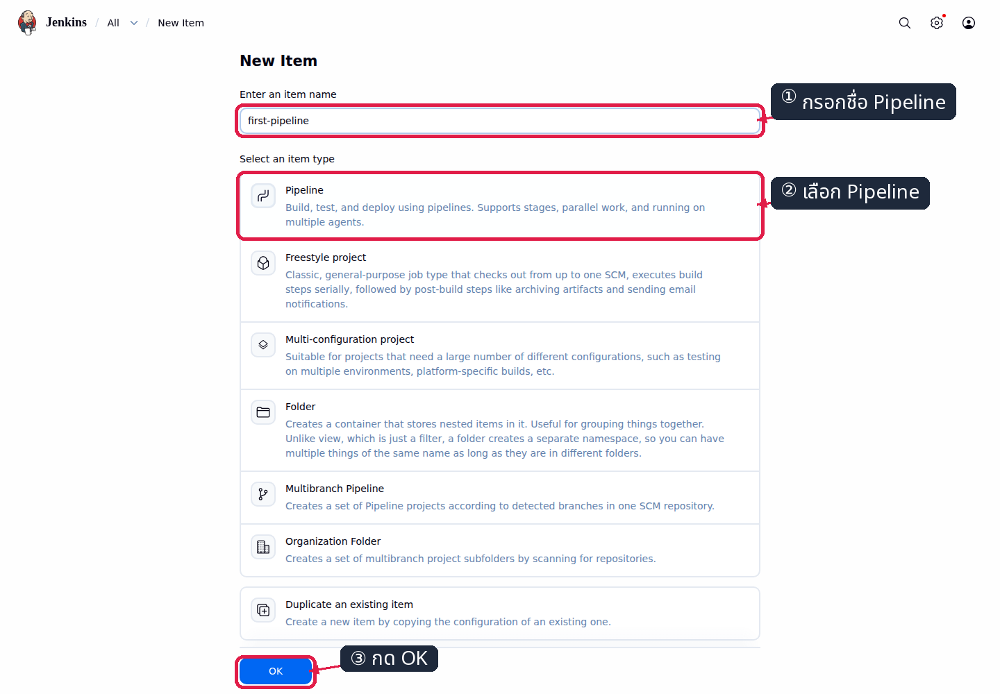
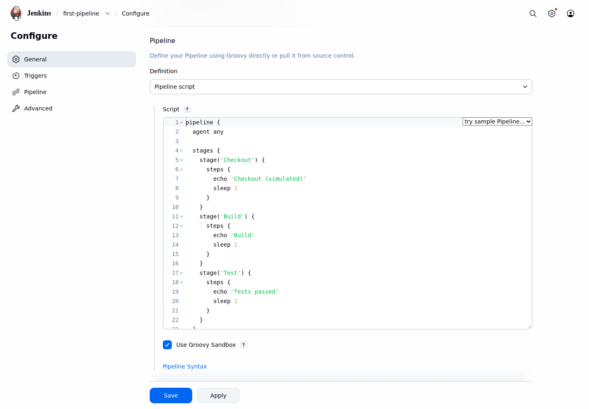
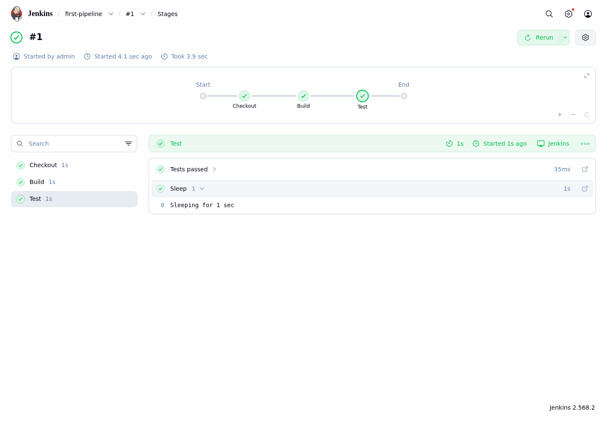
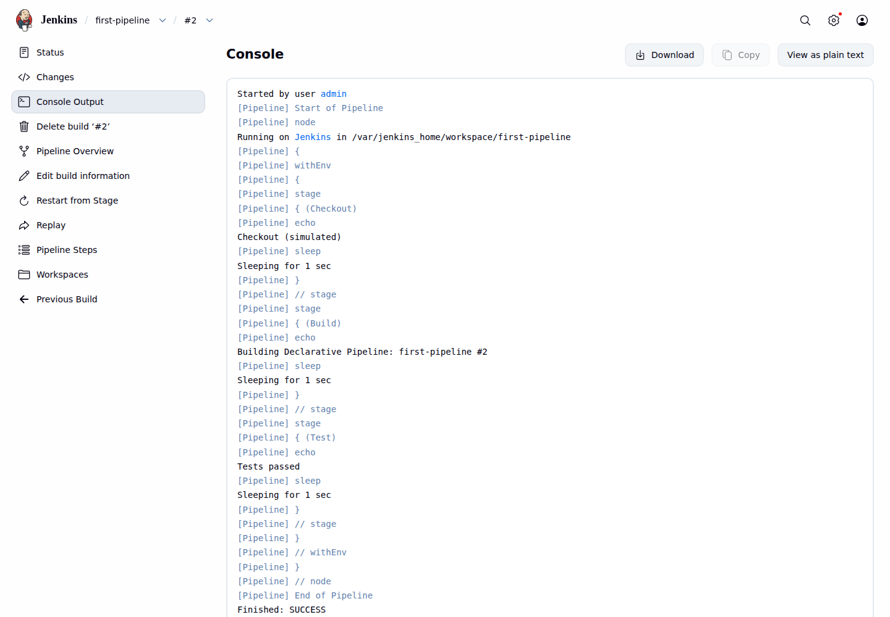
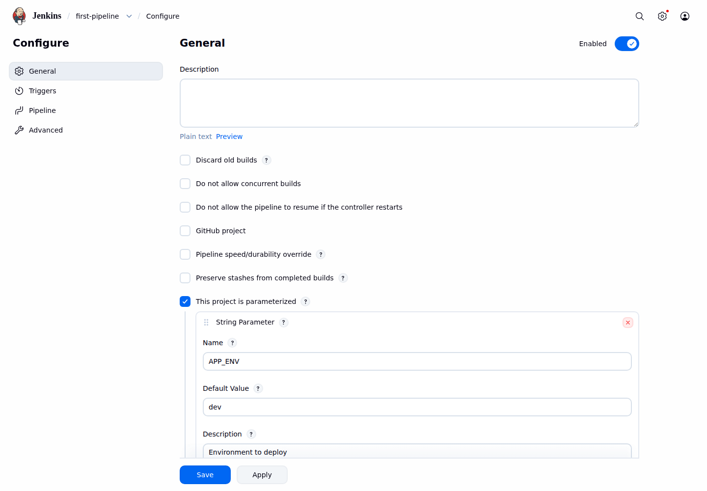
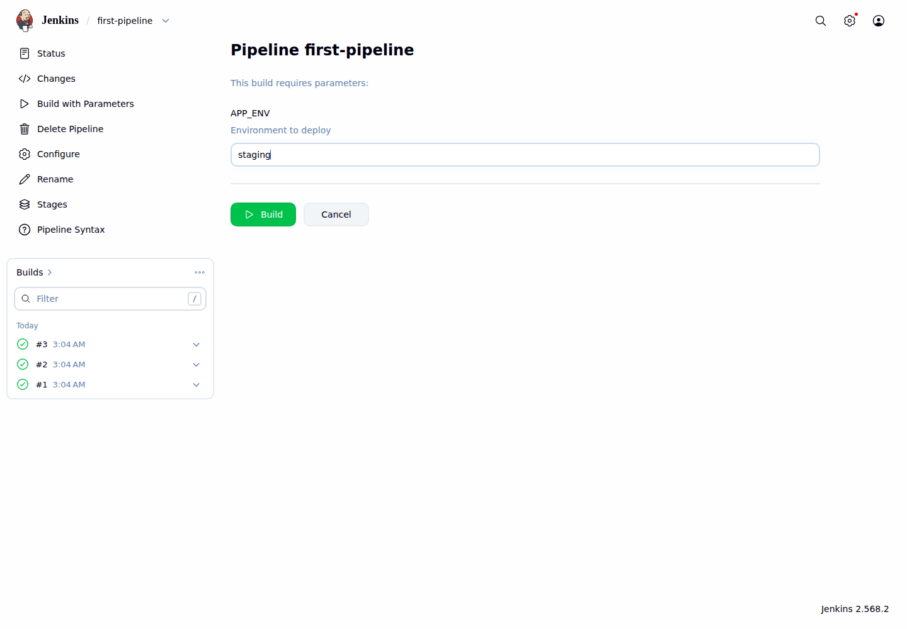
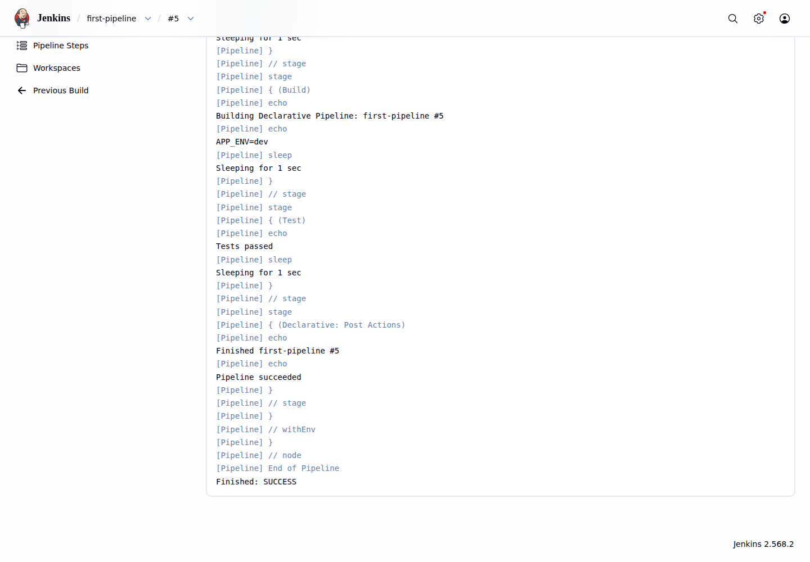
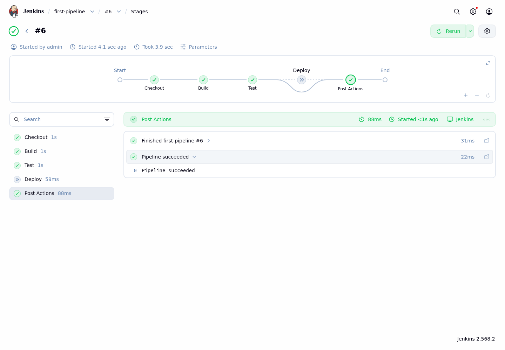

# LAB 2 — เขียน Declarative Pipeline แรก

แล็บ 30 นาทีนี้อธิบายวิธีเปลี่ยนลำดับงานที่เคยสั่งทีละขั้นให้เป็น Pipeline as Code เมื่อจบแล้วนักศึกษาจะสร้าง Pipeline job จากหน้า Jenkins แบ่งงานเป็น stage รับ parameter กำหนดเงื่อนไข Deploy และแปลผลการทำงานจาก Pipeline Graph ได้

## ทฤษฎีก่อนลงมือ

Pipeline as Code คือการบันทึกลำดับงาน build เป็นโค้ดที่ตรวจสอบ ทำซ้ำ และปรับปรุงอย่างเป็นระบบได้ แทนการอาศัยความจำในการตั้งค่าผ่าน UI แล็บนี้เริ่มจากการเขียนสคริปต์ใน Jenkins เพื่อให้เห็นความสัมพันธ์ระหว่างโค้ดกับผลรันทันที และใช้ไฟล์ `Jenkinsfile` เป็นฉบับอ้างอิง รายละเอียดแนวคิดดู slide ตอนที่ 4

Declarative Pipeline เริ่มด้วย `pipeline {}` ภายในมี `agent` ระบุ execution node และ `stages` แบ่งกระบวนการเป็นช่วงที่มีความหมาย แต่ละ `stage` ประกอบด้วย `steps` ซึ่งเป็นคำสั่งที่ Jenkins ดำเนินการ เช่น `echo` และ `sleep`

บล็อก `environment` กำหนดตัวแปรที่ใช้ได้ตลอด Pipeline ส่วนค่าที่ Jenkins จัดเตรียมให้ เช่น `JOB_NAME` และ `BUILD_NUMBER` อ่านผ่าน `env` ได้ บล็อก `parameters` รับค่าจากผู้สั่ง build และอ่านผ่าน `params` จึงทำให้สคริปต์เดียวรองรับหลายสภาพแวดล้อมโดยไม่ต้องแก้โค้ดทุกครั้ง

เงื่อนไข `when` กำหนดว่า stage จะทำงานหรือถูกข้าม ส่วน `post` ทำงานหลัง stages สิ้นสุด โดย `always` ทำงานทุกผลลัพธ์และ `success` ทำงานเฉพาะเมื่อ Pipeline สำเร็จ หน้า **Stages** ใน Jenkins ชุดนี้แสดงผลด้วย Pipeline Graph ซึ่งติดตั้งมากับ suggested plugins

## 🎯 ขอบเขตและผลลัพธ์การเรียนรู้

- สร้าง Pipeline job ชื่อ `first-pipeline` และรันงาน 3 stages ได้
- อธิบายลำดับและสถานะของ stage จาก Pipeline Graph ได้
- ใช้ environment, parameter และ post actions ใน Declarative Pipeline ได้
- กำหนดให้ Deploy ทำงานเฉพาะเมื่อ `APP_ENV=prod` ได้
- ตรวจ build ล่าสุดและสถานะ stage ด้วย `check.sh` ได้

## สภาพตั้งต้น

ต้องมีสถานะจบ LAB 1: container `devtools-jenkins` ทำงาน และมี Jenkins container ชื่อ `jenkins` อยู่ภายใน

```bash
docker ps
docker exec devtools-jenkins docker ps
```

✅ **สิ่งที่ต้องเห็น** (ตัดเฉพาะแถวที่เกี่ยวข้อง):

```text
CONTAINER ID   IMAGE                         ...   NAMES
...            tuchsanai/devtools:2569_1    ...   devtools-jenkins
CONTAINER ID   IMAGE                       ...   NAMES
...            jenkins/jenkins:lts-jdk21   ...   jenkins
```

เปิด `http://localhost:8080` และเข้าใช้ด้วย `admin` / `admin2569`

> ยังไม่มี? ย้อนไปทำ [LAB 1](../001_LAB_Jenkins_On_Docker/README.md) ก่อน (ใช้เวลา ~40 นาที)

## การทดลองที่ 1 — โค้ดสร้าง 3 stages ได้อย่างไร

**คำถาม:** Pipeline job ที่มี Checkout, Build และ Test สร้างจากหน้า Jenkins อย่างไร?

Pipeline job เป็นหน่วยงานที่ Jenkins ใช้เก็บสคริปต์ ประวัติ build และผลลัพธ์ การเลือกชนิด **Pipeline** ตั้งแต่เริ่มต้นทำให้ job แปลโครงสร้าง `stages` และ `steps` ได้โดยตรง

ลำดับคลิกเพื่อสร้าง job:

1. ที่หน้า Dashboard เลือก **New Item**
2. กรอกชื่อ `first-pipeline`
3. เลือกชนิด **Pipeline**
4. เลือก **OK** เพื่อเปิดหน้ากำหนดค่า



*ภาพที่ 1 ต้องสังเกตชื่อ `first-pipeline` ในช่อง item name และชนิด `Pipeline` ที่ถูกเลือก*

วางสคริปต์ต่อไปนี้ในช่อง **Script**:

```groovy
pipeline {
  agent any

  stages {
    stage('Checkout') {
      steps {
        echo 'Checkout (simulated)'
        sleep 1
      }
    }
    stage('Build') {
      steps {
        echo 'Build'
        sleep 1
      }
    }
    stage('Test') {
      steps {
        echo 'Tests passed'
        sleep 1
      }
    }
  }
}
```

ลำดับคลิกเพื่อกำหนดสคริปต์:

1. เลื่อนไปยังหัวข้อ **Pipeline**
2. ตรวจว่า **Definition** เป็น **Pipeline script**
3. วางโค้ดทั้งหมดลงในช่อง **Script**
4. ตรวจว่ามี stage `Checkout`, `Build` และ `Test`



*ภาพที่ 2 ต้องสังเกต `Definition: Pipeline script` และโค้ด 3 stages ใน editor*

5. เลือก **Save**

✅ **สิ่งที่ต้องเห็น** :

```text
หน้า first-pipeline เปิดขึ้น และยังไม่มี build
```

> 📝 ต้องเลือกชนิด Pipeline ไม่ใช่ Freestyle project และวางสคริปต์ในช่อง Script ใต้ Definition: Pipeline script

ขณะนี้ Jenkins มี job และสคริปต์แล้ว แต่ยังไม่มีผลการทำงาน การทดลองถัดไปจะสร้าง build แรกและตรวจเส้นทางของแต่ละ stage

## การทดลองที่ 2 — Pipeline Graph บอกอะไรเรา

**คำถาม:** จะรู้ได้อย่างไรว่าแต่ละ stage สำเร็จและเรียงลำดับถูกต้อง?

Pipeline Graph แสดง stage ตามลำดับการทำงานและใช้สถานะสีช่วยระบุผลของแต่ละช่วง จึงตรวจได้ทั้งโครงสร้างและจุดที่เกิดความล้มเหลวโดยไม่ต้องอ่าน console ทั้งหมด

ต่อไปเรียกเลข build แรกที่พบว่า `#N`; build ถัดไปใช้ `#N+1`, `#N+2` ตามลำดับ

ลำดับคลิก:

1. ที่หน้า `first-pipeline` เลือก **Build Now**
2. รอจน build `#N` แสดงสถานะสำเร็จ แล้วเลือก **#N**
3. เลือก **Stages** จากเมนูด้านซ้าย
4. ตรวจลำดับ `Checkout` → `Build` → `Test`



*ภาพที่ 3 ต้องสังเกต build `#1` สำเร็จและ node ของ Checkout, Build และ Test เป็นสีเขียว*

✅ **สิ่งที่ต้องเห็น** :

```text
#N SUCCESS: Checkout=success, Build=success, Test=success
```

หน้า build-level **Stages** แสดงผลของ run เดียว จึงเชื่อมโยงสถานะกับเลข build ได้โดยไม่ปะปนกับ run อื่น ขณะนี้ build `#N` สิ้นสุดแล้ว การทดลองถัดไปจะปรับสคริปต์เดิมและสร้าง build `#N+1`

## การทดลองที่ 3 — environment ทำให้ข้อความรู้จัก build ได้อย่างไร

**คำถาม:** จะพิมพ์ชื่อตัวแปรของเรา ชื่อ job และเลข build ใน stage ได้อย่างไร?

ตัวแปรใน `environment` ช่วยรวมค่าที่ Pipeline ใช้ร่วมกันไว้ในตำแหน่งเดียว ขณะที่ `env.JOB_NAME` และ `env.BUILD_NUMBER` เชื่อมข้อความกับ run ที่ Jenkins กำลังดำเนินการจริง

วางสคริปต์ฉบับเต็มสำหรับขั้นนี้แทน Script เดิม:

```groovy
pipeline {
  agent any

  environment {
    LAB_NAME = 'Declarative Pipeline'
  }

  stages {
    stage('Checkout') {
      steps {
        echo 'Checkout (simulated)'
        sleep 1
      }
    }
    stage('Build') {
      steps {
        echo "Building ${env.LAB_NAME}: ${env.JOB_NAME} #${env.BUILD_NUMBER}"
        sleep 1
      }
    }
    stage('Test') {
      steps {
        echo 'Tests passed'
        sleep 1
      }
    }
  }
}
```

ลำดับคลิก:

1. กลับหน้า `first-pipeline` แล้วเลือก **Configure**
2. วางสคริปต์ฉบับเต็มข้างต้นแทนทั้งหมด
3. ตรวจบล็อก `environment` และ `echo` ภายใน stage `Build`
4. เลือก **Save** แล้วเลือก **Build Now**
5. เปิด build `#N+1` และเลือก **Console Output**
6. ค้นหาบรรทัดที่ขึ้นต้นด้วย `Building Declarative Pipeline`



*ภาพที่ 4 ต้องสังเกตข้อความ `Building Declarative Pipeline: first-pipeline #2` และผล `Finished: SUCCESS`*

✅ **สิ่งที่ต้องเห็น** :

```text
Building Declarative Pipeline: first-pipeline #N+1
Finished: SUCCESS
```

> 📝 `LAB_NAME` เป็นตัวแปรที่กำหนดในสคริปต์ ส่วน `JOB_NAME` และ `BUILD_NUMBER` เป็นค่าที่ Jenkins กำหนดให้แต่ละ run

ขณะนี้ build `#N+1` พิสูจน์แล้วว่าสคริปต์อ่าน environment ได้ ขั้นถัดไปจะเพิ่มข้อมูลนำเข้าจากผู้สั่ง build

## การทดลองที่ 4 — Build with Parameters ส่งค่าเข้า Pipeline อย่างไร

**คำถาม:** ผู้กด Build จะเลือก environment โดยไม่แก้สคริปต์ได้อย่างไร?

Parameter แยกค่าที่เปลี่ยนตามการใช้งานออกจากโครงสร้าง Pipeline ทำให้ผู้ใช้เลือก environment ได้จากแบบฟอร์มโดยรักษาสคริปต์ชุดเดียวไว้ Jenkins ต้องประมวลผลสคริปต์หนึ่งครั้งเพื่อสร้าง parameter definition ของ job

วางสคริปต์ฉบับเต็มสำหรับขั้นนี้แทน Script เดิม:

```groovy
pipeline {
  agent any

  parameters {
    string(name: 'APP_ENV', defaultValue: 'dev', description: 'Environment to deploy')
  }

  environment {
    LAB_NAME = 'Declarative Pipeline'
  }

  stages {
    stage('Checkout') {
      steps {
        echo 'Checkout (simulated)'
        sleep 1
      }
    }
    stage('Build') {
      steps {
        echo "Building ${env.LAB_NAME}: ${env.JOB_NAME} #${env.BUILD_NUMBER}"
        echo "APP_ENV=${params.APP_ENV}"
        sleep 1
      }
    }
    stage('Test') {
      steps {
        echo 'Tests passed'
        sleep 1
      }
    }
  }
}
```

ลำดับคลิกเพื่อเพิ่ม parameter:

1. กลับหน้า `first-pipeline` แล้วเลือก **Configure**
2. วางสคริปต์ฉบับเต็มข้างต้นแทนทั้งหมด
3. ตรวจบล็อก `parameters` และบรรทัด `APP_ENV`
4. เลือก **Save** แล้วเลือก **Build Now** หนึ่งครั้ง เพื่อให้ Jenkins ลงทะเบียน `APP_ENV`
5. เปิด **Configure** อีกครั้งและตรวจส่วน **This project is parameterized**



*ภาพที่ 5 ต้องสังเกตว่า `This project is parameterized` ถูกเลือก พร้อม Name `APP_ENV`, Default Value `dev` และคำอธิบาย*

ลำดับคลิกเพื่อส่งค่า:

1. กลับหน้า `first-pipeline` แล้วเลือก **Build with Parameters**
2. เปลี่ยนค่า `APP_ENV` จาก `dev` เป็น `staging`
3. ตรวจค่าก่อนเริ่ม build



*ภาพที่ 6 ต้องสังเกตช่อง `APP_ENV` มีค่า `staging` และปุ่ม Build พร้อมใช้งาน*

4. เลือก **Build** แล้วเปิด **Console Output** ของ build `#N+3`

✅ **สิ่งที่ต้องเห็น** :

```text
APP_ENV=dev      (#N+2 ครั้งแรก)
APP_ENV=staging  (#N+3 จาก Build with Parameters)
```

> 📝 หากยังไม่เห็น Build with Parameters ให้กด Build Now หลัง Save หนึ่งครั้ง เพื่อให้ Jenkins อ่าน `parameters` จากสคริปต์

ขณะนี้ job รับค่า `APP_ENV` ผ่านแบบฟอร์มและ build `#N+3` ใช้ค่า `staging` สำเร็จแล้ว การทดลองถัดไปจะกำหนดการทำงานหลัง stages สิ้นสุด

## การทดลองที่ 5 — post ทำงานหลัง stages แบบใด

**คำถาม:** จะให้ข้อความหนึ่งทำงานเสมอและอีกข้อความทำงานเฉพาะเมื่อสำเร็จได้อย่างไร?

บล็อก `post` แยกงานหลังการประมวลผลออกจาก stages หลัก จึงเหมาะกับการรายงานผลหรือการเก็บหลักฐานที่ต้องเกิดตามสถานะของ Pipeline การใช้ `always` ร่วมกับ `success` ทำให้เห็นความแตกต่างของเงื่อนไขทั้งสองแบบ

วางสคริปต์ฉบับเต็มสำหรับขั้นนี้แทน Script เดิม:

```groovy
pipeline {
  agent any

  parameters {
    string(name: 'APP_ENV', defaultValue: 'dev', description: 'Environment to deploy')
  }

  environment {
    LAB_NAME = 'Declarative Pipeline'
  }

  stages {
    stage('Checkout') {
      steps {
        echo 'Checkout (simulated)'
        sleep 1
      }
    }
    stage('Build') {
      steps {
        echo "Building ${env.LAB_NAME}: ${env.JOB_NAME} #${env.BUILD_NUMBER}"
        echo "APP_ENV=${params.APP_ENV}"
        sleep 1
      }
    }
    stage('Test') {
      steps {
        echo 'Tests passed'
        sleep 1
      }
    }
  }

  post {
    always {
      echo "Finished ${env.JOB_NAME} #${env.BUILD_NUMBER}"
    }
    success {
      echo 'Pipeline succeeded'
    }
  }
}
```

ลำดับคลิก:

1. กลับหน้า `first-pipeline` แล้วเลือก **Configure**
2. วางสคริปต์ฉบับเต็มข้างต้นแทนทั้งหมด และตรวจบล็อก `post`
3. เลือก **Save** แล้วเลือก **Build with Parameters**
4. คงค่า `APP_ENV` เป็น `dev` แล้วเลือก **Build**
5. เปิด build `#N+4` และเลือก **Console Output**
6. ตรวจข้อความภายในส่วน `Declarative: Post Actions`



*ภาพที่ 7 ต้องสังเกต `Finished first-pipeline #5`, `Pipeline succeeded` และ `Finished: SUCCESS`*

✅ **สิ่งที่ต้องเห็น** :

```text
Finished first-pipeline #N+4
Pipeline succeeded
Finished: SUCCESS
```

ขณะนี้ Pipeline มีการรายงานผลหลัง stages แล้ว ขั้นถัดไปจะเพิ่ม Deploy ที่ตัดสินใจจาก `APP_ENV`

## การทดลองที่ 6 — Deploy เฉพาะ prod ได้อย่างไร

**คำถาม:** จะข้าม Deploy สำหรับ dev แต่รันจริงสำหรับ prod ได้อย่างไร?

เงื่อนไข `when` ป้องกันไม่ให้ stage ทำงานในบริบทที่ไม่ตรงเงื่อนไข การเปรียบเทียบ `params.APP_ENV` กับ `prod` จึงแยกการทดสอบบน dev ออกจากการ Deploy โดยยังใช้ Pipeline เดียวกัน

ไฟล์ด้านล่างคือฉบับเต็ม ให้วางแทน Script ทั้งหมดใน **Configure** ไฟล์นี้ตรงกับ [`Jenkinsfile`](./Jenkinsfile) ทุกตัวอักษร

```groovy
pipeline {
  agent any

  parameters {
    string(name: 'APP_ENV', defaultValue: 'dev', description: 'Environment to deploy')
  }

  environment {
    LAB_NAME = 'Declarative Pipeline'
  }

  stages {
    stage('Checkout') {
      steps {
        echo 'Checkout (simulated)'
        sleep 1
      }
    }

    stage('Build') {
      steps {
        echo "Building ${env.LAB_NAME}: ${env.JOB_NAME} #${env.BUILD_NUMBER}"
        sleep 1
      }
    }

    stage('Test') {
      steps {
        echo 'Tests passed'
        sleep 1
      }
    }

    stage('Deploy') {
      when {
        expression { params.APP_ENV == 'prod' }
      }
      steps {
        echo "Deploying to ${params.APP_ENV}"
        sleep 1
      }
    }
  }

  post {
    always {
      echo "Finished ${env.JOB_NAME} #${env.BUILD_NUMBER}"
    }
    success {
      echo 'Pipeline succeeded'
    }
  }
}
```

ลำดับคลิกสำหรับ dev:

1. เลือก **Configure** และวางสคริปต์ฉบับเต็มแทน Script เดิม
2. เลือก **Save** แล้วเลือก **Build with Parameters**
3. คงค่า `APP_ENV` เป็น `dev` แล้วเลือก **Build**
4. เปิด build `#N+5` และเลือก **Stages**



*ภาพที่ 8 ต้องสังเกต build `#6` สำเร็จ แต่ node Deploy ใช้สัญลักษณ์ข้าม ขณะที่ Post Actions สำเร็จ*

ลำดับคลิกสำหรับ prod:

1. กลับหน้า `first-pipeline` แล้วเลือก **Build with Parameters**
2. เปลี่ยน `APP_ENV` เป็น `prod` แล้วเลือก **Build**
3. เปิด build `#N+6` และเลือก **Stages**
4. ตรวจว่า `Checkout`, `Build`, `Test`, `Deploy` และ `Post Actions` เป็นสีเขียว


*ภาพที่ 9 ต้องสังเกต build `#7` และ node Deploy ปรากฏเป็นสีเขียวก่อน Post Actions*

✅ **สิ่งที่ต้องเห็น** :

```text
#N+5 APP_ENV=dev: Deploy=skipped
#N+6 APP_ENV=prod: Checkout, Build, Test, Deploy และ Post Actions เป็นสีเขียว
```

> 📝 Jenkins รุ่นนี้ใช้เมนู Stages เพื่อเปิด Pipeline Graph จึงไม่ต้องติดตั้ง Stage View แบบที่ปรากฏในเอกสารรุ่นเก่า

ขณะนี้ build ล่าสุดคือ `#N+6` ซึ่งใช้ `APP_ENV=prod` และทุก stage สำเร็จ สถานะนี้เป็นข้อมูลนำเข้าของตัวตรวจในขั้นสุดท้าย

## การทดลองที่ 7 — ตรวจผลจบแล็บอัตโนมัติได้อย่างไร

**คำถาม:** จะยืนยันได้อย่างไรว่างานล่าสุดสำเร็จและทั้ง 4 stages เป็นสีเขียว?

การตรวจด้วยสคริปต์ลดความคลาดเคลื่อนจากการพิจารณาสีใน UI เพียงอย่างเดียว ตัวตรวจอ่านผล build จาก Jenkins core API และอ่าน stage จาก endpoint `/stages/tree` ของ Pipeline Graph ที่ติดตั้งอยู่จริง

```bash
(cd "$COURSE_ROOT/002_LAB_Declarative_Pipeline" && bash check.sh)
```

✅ **สิ่งที่ต้องเห็น** :

```text
PASS: job=first-pipeline build=#N+6 result=SUCCESS
PASS: stages: Checkout=SUCCESS, Build=SUCCESS, Test=SUCCESS, Deploy=SUCCESS
```

## แก้ปัญหาที่พบบ่อย

| อาการ | สาเหตุ | วิธีแก้ |
|---|---|---|
| เปิด `localhost:8080` ไม่ได้ | devtools หรือ Jenkins ภายในยังไม่ทำงาน | รัน `docker start devtools-jenkins` รอ ~20 วินาที แล้วตรวจ `docker exec devtools-jenkins docker ps` |
| ไม่มีเมนู Build with Parameters | Jenkins ยังไม่อ่าน block `parameters` | Save แล้วกด Build Now หนึ่งครั้ง จากนั้นกลับหน้าหลัก job |
| Deploy แสดง skipped | `APP_ENV` ไม่ใช่ `prod` | ใช้ Build with Parameters ใส่ `prod` ตัวพิมพ์เล็ก |
| หา Stage View แบบในตำราเก่าไม่เจอ | Jenkins ชุดนี้ใช้ Pipeline Graph จาก suggested plugins | เปิด build ที่ต้องการแล้วเลือก **Stages**; เมนูนี้เปิด Pipeline Graph |
| `check.sh` บอก Deploy=SKIPPED | build ล่าสุดใช้ `dev` | รัน Build with Parameters ด้วย `prod` แล้วตรวจใหม่ |
| `check.sh` ได้ 401/403 | URL หรือ Jenkins credential ไม่ตรง | ใช้ค่าเริ่มต้น `http://localhost:8080` และ `admin:admin2569` หรือกำหนด `JENKINS_URL`/`JENKINS_AUTH` ให้ถูก |
| restart แล้วเข้าไม่ได้ทันที | Jenkins กำลังเริ่มระบบ | รอจน `curl -fsS http://localhost:8080/login` ผ่าน แล้วเปิดใหม่ |
