# LAB 3 — Jenkins สั่ง devtools ผ่าน SSH: Connect → Clone → Build → Test → Push → Clean → Pull → Deploy ร้านอาหารแมว

> ⏱️ ประมาณ 50–60 นาที · 🧪 9 ขั้น · 🎯 จบเมื่อกด **Build** ใน Jenkins แล้ว `http://localhost:3000` แสดงร้าน **Meow Mart** เวอร์ชันที่ Pipeline เพิ่ง build → push ขึ้น Docker Hub → pull กลับตาม digest → deploy

บนเครื่องของเรามี container พี่น้อง (sibling) สองตัวบน network `cicd-net` คือ `jenkins` **ผู้สั่ง** กับ `devtools` **ผู้ทำ** Jenkins SSH ไปที่ `devtools:22` ด้วยรหัสผ่านจาก Jenkins Credentials แล้วส่งสคริปต์ไปรันทีละ stage คำสั่ง `git clone` และ `docker build/run/push/pull` ทั้งหมดจึงรันบน `devtools` และร้านเปิดเป็น container `catfood-web` บน Docker ข้างใน `devtools`

> **กติกา:** ไม่พิมพ์ `docker build`, `docker push` หรือ `git clone` ของร้านเอง ทุกอย่างเริ่มจากปุ่มบน Jenkins · `jenkins` เป็น image มาตรฐาน `jenkins/jenkins:lts-jdk21` **ไม่มี Docker CLI และไม่ mount `docker.sock`** (เพิ่มเพียง `sshpass`)


*ภาพที่ 1 แผนภาพประกอบ — `jenkins` และ `devtools` เป็น container พี่น้องบน `cicd-net` · Jenkins SSH ไปที่ `devtools:22` ด้วยรหัสผ่านจาก Jenkins Credentials · `git clone` และ `docker` ทั้งหมดรันบน devtools · `catfood-web` อยู่บน Docker ข้างใน devtools*

| container | อยู่บน Docker ของ | เข้าจากเครื่องเราทาง |
|---|---|---|
| `jenkins` | เครื่องของเรา (network `cicd-net`) | `localhost:8080` |
| `devtools` (`--privileged` มี Docker ของตัวเอง) | เครื่องของเรา (network `cicd-net`) | `localhost:2222` → SSH · `localhost:3000` → ร้าน |
| `catfood-test-N` (ชั่วคราว) และ `catfood-web` (ร้าน) | **ข้างใน** `devtools` | `localhost:3000` → `devtools:3000` → `catfood-web:3000` |

- Docker DNS ของ `cicd-net` แปลชื่อ container เป็น IP Jenkinsfile จึงเขียน `root@devtools` ได้ตรง ๆ
- credential `devtools-ssh` เก็บ `root` / `passwd` (รหัสตั้งต้นของ image แล็บนี้เท่านั้น) Jenkinsfile เรียก `sshpass -e ssh -o StrictHostKeyChecking=yes ...` รหัสอยู่ในตัวแปร `SSHPASS` ไม่อยู่ใน command line หรือ console และ SSH ต่อเฉพาะเมื่อ host key ของ `devtools` ตรงกับที่ pin ไว้ในขั้นที่ 4
- Push จด **digest** (`sha256:...`) ไว้ Pull และ Deploy ใช้ `repository@sha256:...` ตัวเดียวกัน · **Clean** ทำหลัง Push สำเร็จเท่านั้น และลบเฉพาะของที่มี label `devtools.lab=lab3` · ตั้งแต่ Clean ถึง Deploy ร้านปิดชั่วคราว (รอบทดสอบ 7 วินาที) ไม่มี rollback อัตโนมัติ

> ⚠️ `root` บน `devtools` แบบ `--privileged` สั่ง Docker ของ devtools ได้ทุกอย่าง ใช้รหัสนี้กับแล็บที่ลบทิ้งได้เท่านั้น ระบบจริงใช้ SSH key หรือ build agent ที่ไม่ใช่ `root`


*ภาพที่ 2 แผนภาพประกอบ — Jenkins ควบคุม ทุก stage รันบน devtools ผ่าน SSH · Clean เกิดหลัง Push สำเร็จเท่านั้น · Pull ใช้ digest ที่ Push จดไว้ก่อน Deploy*

## 0. สิ่งที่ต้องมี

- terminal บนเครื่องที่สั่ง `docker` ได้ (Linux, macOS หรือ WSL) เรียกว่า 🖥️ **host** ทุกคำสั่ง `docker` ในแล็บนี้พิมพ์ที่ host และ port `8080`, `2222`, `3000` ว่าง
- บัญชี Docker Hub และ **Personal Access Token สิทธิ์ Read & Write** (Account settings → Personal access tokens) แนะนำให้สร้าง repository `catfood-shop` แบบ **Public**

[](./images/lab3_hub_04_pat_setup.png)

*ภาพที่ 3 หน้าสร้าง token บน Docker Hub: ตั้งชื่อ เลือก **Access permissions = Repo Read & Write** แล้วกด **Generate** · Docker Hub แสดง token ครั้งเดียว ให้คัดลอกเก็บทันที*

stage Clone ดึงซอร์สร้านจากโฟลเดอร์นี้ใน repository สาธารณะของรายวิชา:

[](./images/lab3_github_01_source.png)

*ภาพที่ 4 โฟลเดอร์ `catfood-shop` บน GitHub ที่ stage Clone ดึงมา*

> ผลลัพธ์ตัวอย่างในเอกสารมาจากการรันจริงหนึ่งรอบ ID, hostname, เวลา และ digest ของแต่ละเครื่องจะต่างกัน รอบทดสอบใช้ `TAG_PREFIX` = `lab3-sibling-20260926r2` (ของนักศึกษาเป็น `lab3`) และแทนชื่อบัญชี Docker Hub ด้วย `<DOCKER_USER>` · ภาพหน้าจอทุกภาพคลิกเพื่อเปิดภาพเต็มได้

## ขั้นที่ 1 — สร้าง network และ container สองตัว (🖥️ host)

<!-- lab3-test:host-setup -->
```bash
docker rm -f jenkins devtools
docker network create cicd-net
docker run -dit --name devtools --network cicd-net --privileged --tmpfs /run \
  --restart unless-stopped -p 2222:22 -p 3000:3000 tuchsanai/devtools:2569_1
docker run -d --name jenkins --network cicd-net --restart unless-stopped \
  -p 8080:8080 -v jenkins_home:/var/jenkins_home jenkins/jenkins:lts-jdk21
```

- `docker rm -f` ลบ `jenkins`/`devtools` เดิม ถ้ายังไม่มี container ชื่อนั้นจะขึ้น `Error response from daemon: No such container: ...` ไม่เป็นไร ทำต่อได้ · ⚠️ ของข้างใน `devtools` เดิม รวม Jenkins ของ LAB 1–2 จะหายไป
- ถ้า `docker network create` ขึ้น `already exists` ใช้ network เดิมต่อได้
- `--privileged --tmpfs /run` ให้ Docker ข้างใน `devtools` ทำงานและบูตใหม่ได้ · `-v jenkins_home:...` เก็บสถานะ Jenkins ใน volume

✅ ผลที่ได้ (ID ของ network, `devtools`, `jenkins`):

```text
6991a385bf2064a9247fa2ced899eaddcdb280ab838167487d75fbe68d8e2b22
4dc7e37d7397effd20bb187db15f93c1b48454db12b1771821ffab3d998f8bc2
ad27ba488a7f1070eacfa00b5e25943b336c70539ffc41cc55ba28c154205695
```

ตรวจว่าทั้งคู่ `Up` และอยู่ใน `cicd-net`:

<!-- lab3-test:host-check -->
```bash
docker ps --filter name=^devtools$ --filter name=^jenkins$ --format '{{.Names}}  {{.Status}}  {{.Ports}}'
docker network inspect cicd-net --format '{{range .Containers}}{{.Name}} {{end}}'
```

```text
jenkins  Up 6 seconds  127.0.0.1:18080->8080/tcp
devtools  Up 6 seconds  127.0.0.1:2223->22/tcp, 127.0.0.1:13000->3000/tcp
devtools jenkins
```

> รอบทดสอบ bind port ที่ `127.0.0.1` ด้วยเลขอื่น ของนักศึกษาจะเห็น `0.0.0.0:8080->8080/tcp`, `0.0.0.0:2222->22/tcp`, `0.0.0.0:3000->3000/tcp`

## ขั้นที่ 2 — ปลดล็อกและตั้งค่า Jenkins

<!-- lab3-test:unlock -->
```bash
docker exec jenkins cat /var/jenkins_home/secrets/initialAdminPassword
```

✅ ได้รหัสเลขฐานสิบหก 32 ตัว (ของแต่ละเครื่องต่างกัน ห้ามเผยแพร่) เปิด **http://localhost:8080** วางรหัส → **Continue** → **Install suggested plugins** → สร้างผู้ดูแล `admin` / `admin2569` → Jenkins URL `http://localhost:8080/` → **Save and Finish** → **Start using Jenkins** (รายละเอียดแต่ละหน้าอยู่ใน [LAB 1](../001_LAB_Jenkins_On_Docker/README.md)) ถ้า volume `jenkins_home` มีอยู่แล้วจากครั้งก่อน Jenkins จะไม่ถามรหัสนี้ ให้ login ด้วยผู้ดูแลเดิม

[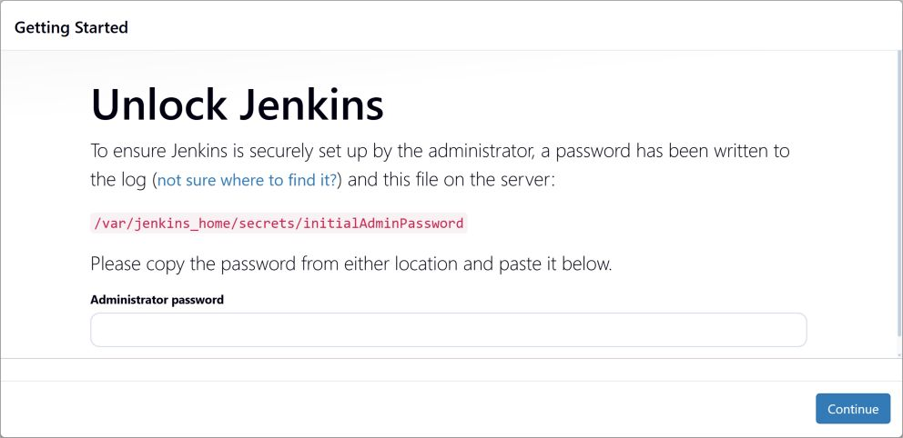](./images/lab3_sib_unlock.png)

*ภาพที่ 5 หน้า **Unlock Jenkins** ของการติดตั้งครั้งแรก วางรหัสจากคำสั่งด้านบนในช่อง Administrator password*

[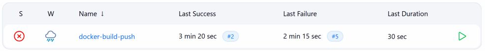](./images/lab3_sib_dashboard.png)

*ภาพที่ 6 Dashboard หลัง login มี job `docker-build-push` · ภาพนี้ถ่ายหลังทำครบขั้นที่ 9 Last Failure `#5` จึงเป็น build ที่ตั้งใจให้ล้มในขั้นที่ 9 ส่วน Last Success `#2` คือร้านที่เปิดอยู่*

## ขั้นที่ 3 — ติดตั้ง `sshpass` ใน `jenkins` (🖥️ host)

<!-- lab3-test:sshpass -->
```bash
docker exec -u root -e DEBIAN_FRONTEND=noninteractive jenkins sh -c "apt-get update -qq && apt-get install -y -qq --no-install-recommends sshpass"
docker exec jenkins sh -c "command -v sshpass; command -v docker || echo 'docker: none'"
```

`-u root` เพราะ `apt-get` ต้องใช้ root (Jenkins เองยังรันเป็นผู้ใช้ `jenkins`) · ติดตั้งลง container ไม่ได้แก้ image ถ้าสร้าง `jenkins` ใหม่ต้องรันขั้นนี้ซ้ำ

✅ ส่วนท้ายของผล — มี `sshpass` และ Jenkins **ไม่มี** Docker CLI:

```text
Preparing to unpack .../sshpass_1.10-0.1_amd64.deb ...
Unpacking sshpass (1.10-0.1) ...
Setting up sshpass (1.10-0.1) ...
/usr/bin/sshpass
docker: none
```

## ขั้นที่ 4 — pin host key ของ `devtools` (🖥️ host)

<!-- lab3-test:pin-hostkey -->
```bash
docker exec devtools sh -c "sed 's/^/devtools /' /etc/ssh/ssh_host_ed25519_key.pub > /tmp/devtools.known_hosts"
docker cp devtools:/tmp/devtools.known_hosts devtools.known_hosts
docker cp devtools.known_hosts jenkins:/tmp/devtools.known_hosts
docker exec jenkins sh -c "mkdir -p -m 700 /var/jenkins_home/.ssh && cp /tmp/devtools.known_hosts /var/jenkins_home/.ssh/known_hosts"
docker exec devtools ssh-keygen -lf /etc/ssh/ssh_host_ed25519_key.pub
docker exec jenkins ssh-keygen -lF devtools
```

บรรทัดแรกสร้างบรรทัด `known_hosts` จาก host key ของ `devtools` เอง สองบรรทัดถัดมาคัดลอกผ่านเครื่องเราด้วย `docker cp` บรรทัดที่ 4 ให้ผู้ใช้ `jenkins` วางเป็น `/var/jenkins_home/.ssh/known_hosts` (อยู่ใน volume จึงคงอยู่) สองบรรทัดสุดท้ายแสดง fingerprint ต้นทางกับที่ Jenkins บันทึก

✅ `SHA256:...` สองบรรทัดต้องเหมือนกัน:

```text
256 SHA256:xx0jAuPGt8ifmB/JdQPK4OFNifmaEc5UZWj4hW5RM7o root@buildkitsandbox (ED25519)
# Host devtools found: line 1
devtools ED25519 SHA256:xx0jAuPGt8ifmB/JdQPK4OFNifmaEc5UZWj4hW5RM7o root@buildkitsandbox
```

> การ pin ทำให้ SSH เทียบ key ของเครื่องปลายทางกับ key ของ `devtools` ที่เราคาดไว้ ถ้าไม่ตรงหรือไม่มีจะหยุดก่อนส่งรหัสผ่าน แต่ host key นี้ติดมากับ image `tuchsanai/devtools:2569_1` (`root@buildkitsandbox`) ทุก container ที่สร้างจาก image นี้จึงได้ key เดียวกัน ไม่ใช่ตัวตนเฉพาะเครื่อง · ไฟล์ `devtools.known_hosts` ในโฟลเดอร์ปัจจุบันเป็น public key ลบได้

## ขั้นที่ 5 — ทดสอบ SSH ด้วยรหัสผ่าน (🖥️ host)

<!-- lab3-test:ssh-test -->
```bash
docker exec -it jenkins ssh -o StrictHostKeyChecking=yes root@devtools hostname
```

พิมพ์ `passwd` เมื่อถูกถาม (ตัวอักษรไม่แสดง) แล้วกด Enter

✅ บรรทัดสุดท้ายคือ hostname ของ `devtools` และ **ไม่มี** คำถาม `yes/no`:

```text
root@devtools's password:
4dc7e37d7397
```

ถ้าไม่มี key ของ `devtools` ใน `known_hosts` SSH จะปฏิเสธก่อนถามรหัส (รอบทดสอบลองด้วย `known_hosts` ว่าง):

```text
No ED25519 host key is known for devtools and you have requested strict checking.
Host key verification failed.
```

## ขั้นที่ 6 — เก็บรหัส SSH และ Docker Hub token ใน Jenkins Credentials

**Manage Jenkins → Credentials → System → Global credentials (unrestricted) → Add Credentials** ทำสองครั้ง:

| ช่อง | `devtools-ssh` | `dockerhub` |
|---|---|---|
| Kind | Username with password | Username with password |
| Username | `root` | `<DOCKER_USER>` (ตัวพิมพ์เล็ก) |
| Treat username as secret | ไม่ติ๊ก | ไม่ติ๊ก |
| Password | `passwd` | `<DOCKER_TOKEN>` |
| ID | `devtools-ssh` | `dockerhub` |
| Description | `SSH password: Jenkins to devtools` | `Docker Hub access token` |

[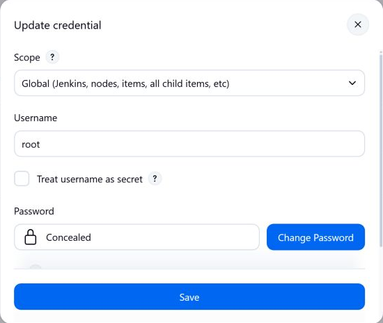](./images/lab3_sib_ssh_credential.png)

*ภาพที่ 7 ฟอร์ม Update ของ `devtools-ssh` ส่วนบน: Username `root` ไม่ติ๊ก **Treat username as secret** และ Password แสดงเป็น Concealed · ฟอร์ม Update ไม่แสดงช่อง Kind แต่ช่อง Username/Password นี้และรายการ `root/******` ในภาพถัดไปบอกว่าเป็นชนิด Username with password*

[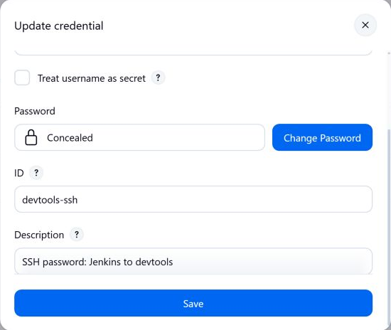](./images/lab3_sib_ssh_credential_id.png)

*ภาพที่ 8 ฟอร์มเดียวกันเมื่อเลื่อนลง: ID `devtools-ssh` และ Description*

[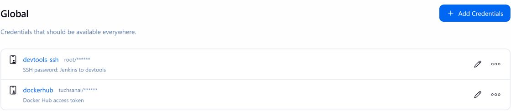](./images/lab3_sib_credentials.png)

*ภาพที่ 9 Global credentials มี `devtools-ssh` (`root/******`) และ `dockerhub` (`<DOCKER_USER>/******`) Jenkins ไม่แสดงรหัสผ่านหรือ token*

> ⚠️ วาง token ที่ Jenkins Credentials เท่านั้น ห้ามวางในแชต เอกสาร หรือ commit ลง Git

## ขั้นที่ 7 — สร้าง job แล้ว Build Now

Pipeline อยู่ในไฟล์ [`Jenkinsfile`](./Jenkinsfile) ของโฟลเดอร์นี้ ทุก stage ที่ทำงานบน devtools เรียกฟังก์ชัน `onDevtools(ตัวแปร, สคริปต์)`:

```groovy
writeFile file: 'remote.sh', text: lines.join('\n') + '\n' + body + '\n'
withCredentials([usernamePassword(credentialsId: 'devtools-ssh',
                 usernameVariable: 'SSH_USER', passwordVariable: 'SSHPASS')]) {
  out = sh(script: 'sshpass -e ssh -o StrictHostKeyChecking=yes -o PreferredAuthentications=password "$SSH_USER@devtools" bash -s < remote.sh',
           returnStdout: capture)
}
```

- สคริปต์ของแต่ละ stage เขียนใน `'''...'''` Groovy จึงไม่แทนค่า `$` และสคริปต์เดินทางทาง stdin ของ SSH ไปรันด้วย bash บน devtools
- ค่า parameter ถูกตรวจด้วย regex ก่อน แล้วเขียนเป็นบรรทัด `NAME='value'` ต้น `remote.sh` (ยอมเฉพาะ `A-Za-z0-9._:/@=+-`) ค่าที่แฝงคำสั่ง shell จึงไปไม่ถึง devtools
- `sh(script: '...')` เป็นข้อความคงที่ `$SSH_USER` ถูกแทนค่าโดย shell ของ Jenkins · stage Push ส่ง Docker Hub token ทาง stdin ไปที่ `docker login --password-stdin` บน devtools

| Stage | ทำอะไร (บน devtools ยกเว้นระบุ) |
|---|---|
| **1 Connect** | บน Jenkins: ตรวจ parameter และ username Docker Hub สร้าง tag `<TAG_PREFIX>-<BUILD_NUMBER>` แล้ว SSH ไปถาม hostname, Docker, git ของ devtools |
| **2 Clone** | sparse clone `GIT_URL`@`GIT_REF` ลง `/root/lab3-work/build-N` เก็บ commit |
| **3 Build** | `docker build` → `catfood-shop:build-N` พร้อม label และ build-arg เวอร์ชัน/build/commit/เวลา |
| **4 Test** | รัน `catfood-test-N` รอ `healthy` ตรวจ `/api/health` แล้วลบทิ้ง |
| **5 Push** | login ด้วย token → push → จด digest |
| **6 Clean** | ลบ container ทดสอบ **ร้านเดิม** image ของ build นี้ และซอร์ส แล้วยืนยันว่าไม่เหลือ image ตาม tag/digest (หยุดถ้า `catfood-web` ไม่ใช่ของแล็บ) |
| **7 Pull** | `docker pull <repo>@<digest>` แล้ว logout |
| **8 Deploy** | `docker run -p 3000:3000` จาก `<repo>@<digest>` → รอ `healthy` → เทียบ version/build/commit |

build ที่ล้มก่อน Clean ไม่แตะร้านเดิม · `post { unsuccessful }` ลบของชั่วคราวของ build ที่ล้มแต่ไม่แตะร้าน · `disableConcurrentBuilds()` กันสอง build ใช้ `catfood-web`/port 3000 พร้อมกัน

<details>
<summary><b>Jenkinsfile ฉบับสมบูรณ์</b> (เหมือนไฟล์ <code>Jenkinsfile</code> ทุกตัวอักษร คลิกเพื่อเปิด)</summary>

```groovy
// LAB 3 — Jenkins เป็น "ผู้สั่ง" devtools เป็น "ผู้ทำ"
// jenkins และ devtools เป็น container พี่น้องบน network cicd-net เดียวกัน จึงเรียกกันด้วยชื่อ devtools ได้
// jenkins เป็น image มาตรฐาน ไม่มี Docker CLI ไม่ได้ mount docker.sock (เพิ่มเพียง sshpass ในขั้นที่ 3)
// ทุกงาน (git clone, docker build/run/push/pull) ถูกส่งผ่าน SSH ไปรันบน devtools:22
// login ด้วยรหัสผ่านจาก credential devtools-ssh และยอมรับเฉพาะ host key ที่ pin ไว้ในขั้นที่ 4

// ตรวจค่าก่อนส่งข้าม SSH: ต้องตรง regex ทั้งค่า มิฉะนั้นหยุด build ทันที
def requireMatch(String name, String value, String regex, String hint) {
  if (!(value ==~ regex)) {
    error("${name} ไม่ถูกต้อง: ${hint}")
  }
}

// รันสคริปต์ bash บน devtools ผ่าน SSH
// vars → บรรทัด NAME='value' ต้นสคริปต์ ทุกค่าต้องมีเฉพาะอักขระที่ไม่มีความหมายพิเศษใน shell
// คำสั่ง sh เป็นข้อความคงที่ ('...') Groovy จึงไม่แทนค่าใด ๆ ลงไป รหัสผ่านอยู่ใน env SSHPASS เท่านั้น
def onDevtools(Map vars, String body, boolean capture = false) {
  def keys = vars.keySet() as List
  def lines = ['set -euo pipefail']
  for (int i = 0; i < keys.size(); i++) {
    def value = "${vars[keys[i]]}"
    if (!(value ==~ '[A-Za-z0-9._:/@=+-]*')) {
      error("ค่า ${keys[i]} มีอักขระที่ไม่อนุญาต")
    }
    lines << "${keys[i]}='${value}'"
  }
  writeFile file: 'remote.sh', text: lines.join('\n') + '\n' + body + '\n'
  def out = null
  withCredentials([usernamePassword(credentialsId: 'devtools-ssh',
                   usernameVariable: 'SSH_USER', passwordVariable: 'SSHPASS')]) {
    out = sh(script: 'sshpass -e ssh -o StrictHostKeyChecking=yes -o PreferredAuthentications=password "$SSH_USER@devtools" bash -s < remote.sh',
             returnStdout: capture)
  }
  return out
}

pipeline {
  agent any

  options {
    disableConcurrentBuilds()   // ทุก build ใช้ container ชื่อ catfood-web และ port 3000 เดียวกัน
  }

  parameters {
    string(name: 'GIT_URL', defaultValue: 'https://github.com/Tuchsanai/DevTools.git',
           description: 'Git repository สาธารณะแบบ https:// ที่มีซอร์สร้าน')
    string(name: 'GIT_REF', defaultValue: 'main',
           description: 'branch หรือ tag ที่จะ clone')
    string(name: 'APP_SUBDIR', defaultValue: '04_Jenkins/001_Jenikin/003_LAB_Docker_Build_Push/catfood-shop',
           description: 'โฟลเดอร์ใน repository ที่มี Dockerfile (path แบบ relative)')
    string(name: 'APP_VERSION', defaultValue: '1.0.0',
           description: 'เวอร์ชันรูปแบบ X.Y.Z ที่จะฝังเข้า image และแสดงบนหน้าเว็บ')
    string(name: 'TAG_PREFIX', defaultValue: 'lab3',
           description: 'คำนำหน้า tag บน Docker Hub → tag จริงคือ <TAG_PREFIX>-<BUILD_NUMBER>')
  }

  environment {
    APP_NAME    = 'catfood-shop'                              // ชื่อ image และ repository บน Docker Hub
    DEPLOY_NAME = 'catfood-web'                               // container ของร้านบน devtools (port 3000)
    TEST_NAME   = "catfood-test-${env.BUILD_NUMBER}"          // container ชั่วคราวของ stage Test
    WORK_DIR    = "/root/lab3-work/build-${env.BUILD_NUMBER}" // ที่ clone ซอร์สบน devtools (แยกตาม build)
    DOCKER_CFG  = "/tmp/lab3-docker-${env.BUILD_NUMBER}"      // ที่เก็บ login Docker Hub ชั่วคราว (Push → Pull)
    LOCAL_IMAGE = "catfood-shop:build-${env.BUILD_NUMBER}"    // ชื่อ image ในเครื่องก่อนติด tag ของ Hub
  }

  stages {
    stage('Connect') {
      steps {
        script {
          requireMatch('GIT_URL', params.GIT_URL,
                       'https://[A-Za-z0-9.-]+(/[A-Za-z0-9._-]+)+/?',
                       'ต้องเป็น https://host/path ไม่มีช่องว่าง ไม่มี user:password@')
          requireMatch('GIT_REF', params.GIT_REF,
                       '(?!-)(?!.*\\.\\.)[A-Za-z0-9._/-]{1,100}',
                       'ชื่อ branch/tag ใช้ได้เฉพาะ A-Z a-z 0-9 . _ / - และห้ามขึ้นต้นด้วย -')
          requireMatch('APP_SUBDIR', params.APP_SUBDIR,
                       '(?!-)(?!.*(^|/)\\.{1,2}(/|$))[A-Za-z0-9._-]+(/[A-Za-z0-9._-]+)*',
                       'path แบบ relative ห้ามขึ้นต้นด้วย / หรือ - และห้ามมี . หรือ .. เป็นชื่อโฟลเดอร์')
          requireMatch('APP_VERSION', params.APP_VERSION,
                       '[0-9]+\\.[0-9]+\\.[0-9]+',
                       'ต้องเป็นรูปแบบ X.Y.Z เช่น 1.0.0')
          requireMatch('TAG_PREFIX', params.TAG_PREFIX,
                       '[a-z0-9][a-z0-9.-]{0,40}',
                       'ใช้ได้เฉพาะ a-z 0-9 . - ยาวไม่เกิน 41 ตัว')
          env.IMAGE_TAG = "${params.TAG_PREFIX}-${env.BUILD_NUMBER}"
          withCredentials([usernamePassword(credentialsId: 'dockerhub',
                           usernameVariable: 'HUB_USER', passwordVariable: 'HUB_TOKEN')]) {
            requireMatch('username ใน credential dockerhub', env.HUB_USER, '[a-z0-9]{4,30}',
                         'ต้องมีเฉพาะ a-z และ 0-9 ยาว 4–30 ตัว')
            env.HUB_REPO = "docker.io/${env.HUB_USER}/${env.APP_NAME}"
          }
        }
        sh '''
          echo "jenkins: $(hostname) docker CLI = $(command -v docker || echo none) docker.sock = $(test -S /var/run/docker.sock && echo yes || echo none) sshpass = $(command -v sshpass || echo none)"
        '''
        script {
          onDevtools([:], '''
echo "devtools: $(hostname) user=$(whoami)"
docker version --format 'Docker Engine {{.Server.Version}}'
git --version
''')
          echo "จะ push ไปที่ ${env.HUB_REPO}:${env.IMAGE_TAG}"
        }
      }
    }

    stage('Clone') {
      steps {
        script {
          // สคริปต์พิมพ์รายละเอียดลง stderr (เห็นใน console) และพิมพ์ commit ลง stdout ให้ Jenkins เก็บไว้
          def commit = onDevtools([WORK_DIR: env.WORK_DIR, GIT_URL: params.GIT_URL,
                                   GIT_REF: params.GIT_REF, APP_SUBDIR: params.APP_SUBDIR], '''
rm -rf "$WORK_DIR"
mkdir -p "$(dirname "$WORK_DIR")"
git clone --quiet --depth 1 --filter=blob:none --sparse --branch "$GIT_REF" -- "$GIT_URL" "$WORK_DIR" >&2
cd "$WORK_DIR"
git sparse-checkout set "$APP_SUBDIR" >&2
test -f "$APP_SUBDIR/Dockerfile" || { echo "ไม่พบ $APP_SUBDIR/Dockerfile ใน $GIT_URL ($GIT_REF)" >&2; exit 1; }
{ echo "cloned to $(hostname):$WORK_DIR"
  git log -1 --format='commit %H%nsubject %s'
  ls "$APP_SUBDIR"; } >&2
git rev-parse --short=12 HEAD
''', true).trim()
          requireMatch('commit', commit, '[0-9a-f]{12}', 'อ่าน commit จาก git ไม่ได้')
          env.GIT_COMMIT_SHORT = commit
          echo "commit ที่จะ build: ${commit}"
        }
      }
    }

    stage('Build') {
      steps {
        script {
          onDevtools([SRC: "${env.WORK_DIR}/${params.APP_SUBDIR}", IMAGE: env.LOCAL_IMAGE,
                      VERSION: params.APP_VERSION, BUILD: env.BUILD_NUMBER, COMMIT: env.GIT_COMMIT_SHORT], '''
cd "$SRC"
docker build --provenance=false \\
  --label devtools.lab=lab3 --label devtools.build="$BUILD" \\
  --label org.opencontainers.image.revision="$COMMIT" \\
  --build-arg APP_VERSION="$VERSION" \\
  --build-arg BUILD_NUMBER="$BUILD" \\
  --build-arg GIT_COMMIT="$COMMIT" \\
  --build-arg BUILD_TIME="$(date -u +%Y-%m-%dT%H:%M:%SZ)" \\
  -t "$IMAGE" .
docker image ls "$IMAGE"
''')
        }
      }
    }

    stage('Test') {
      steps {
        script {
          onDevtools([IMAGE: env.LOCAL_IMAGE, NAME: env.TEST_NAME, BUILD: env.BUILD_NUMBER,
                      VERSION: params.APP_VERSION, COMMIT: env.GIT_COMMIT_SHORT], '''
docker rm -f "$NAME" >/dev/null 2>&1 || true
trap 'docker rm -f "$NAME" >/dev/null 2>&1 || true' EXIT
docker run -d --name "$NAME" --label devtools.lab=lab3 --label devtools.role=test \\
  --label devtools.build="$BUILD" "$IMAGE" >/dev/null
STATUS=starting
for i in $(seq 1 30); do
  STATUS=$(docker inspect -f '{{.State.Health.Status}}' "$NAME")
  echo "health of $NAME: $STATUS"
  [ "$STATUS" = healthy ] && break
  sleep 1
done
[ "$STATUS" = healthy ]
HEALTH=$(docker exec "$NAME" wget -qO- http://127.0.0.1:3000/api/health)
echo "$HEALTH"
case "$HEALTH" in
  *"\\"version\\":\\"$VERSION\\""*"\\"commit\\":\\"$COMMIT\\""*) echo "test ผ่าน: image ตอบเวอร์ชัน $VERSION commit $COMMIT" ;;
  *) echo "test ไม่ผ่าน: ต้องได้ version $VERSION และ commit $COMMIT"; exit 1 ;;
esac
''')
        }
      }
    }

    stage('Push') {
      steps {
        withCredentials([usernamePassword(credentialsId: 'devtools-ssh',
                           usernameVariable: 'SSH_USER', passwordVariable: 'SSHPASS'),
                         usernamePassword(credentialsId: 'dockerhub',
                           usernameVariable: 'HUB_USER', passwordVariable: 'HUB_TOKEN')]) {
          // token เดินทางทาง stdin ของ SSH เท่านั้น ส่วนรหัสผ่าน SSH อยู่ใน env SSHPASS ทั้งคู่ไม่อยู่ใน command line และ console
          // login ถูกเก็บในโฟลเดอร์ชั่วคราว DOCKER_CFG บน devtools ไม่ปนกับ ~/.docker ของ devtools
          sh '''set +x
            printf '%s\\n' "$HUB_TOKEN" | sshpass -e ssh -o StrictHostKeyChecking=yes -o PreferredAuthentications=password "$SSH_USER@devtools" \
              "umask 077; docker --config '$DOCKER_CFG' login docker.io -u '$HUB_USER' --password-stdin"
          '''
        }
        script {
          def digest = onDevtools([CFG: env.DOCKER_CFG, IMAGE: env.LOCAL_IMAGE,
                                   REMOTE: "${env.HUB_REPO}:${env.IMAGE_TAG}"], '''
docker tag "$IMAGE" "$REMOTE"
OUT=$(docker --config "$CFG" push "$REMOTE")
printf '%s\\n' "$OUT" | grep -v ': Waiting$' >&2   # ตัดบรรทัดรอคิวออก ให้เห็นผลของแต่ละ layer ชัด
printf '%s\\n' "$OUT" | sed -n 's/^.*: digest: \\(sha256:[0-9a-f]\\{64\\}\\) size: [0-9]*$/\\1/p'
''', true).trim()
          requireMatch('digest', digest, 'sha256:[0-9a-f]{64}', 'อ่าน digest จากผล docker push ไม่ได้')
          env.IMAGE_DIGEST = digest
          echo "บันทึก digest ที่ push แล้ว: ${env.HUB_REPO}@${digest}"
        }
      }
    }

    stage('Clean') {
      steps {
        script {
          // เคลียร์ devtools ก่อน Pull: container ทดสอบ, แอปเดิม catfood-web, image 2 ชื่อของ build นี้ และซอร์สที่ clone
          // ลบเฉพาะ container ที่มี label ของ LAB 3 ไม่แตะของอื่นบน Docker ของ devtools
          // ตั้งแต่ขั้นนี้จนจบ Deploy เว็บที่ port 3000 จะใช้ไม่ได้ชั่วคราว
          onDevtools([NAME: env.TEST_NAME, APP: env.DEPLOY_NAME, IMAGE: env.LOCAL_IMAGE, BUILD: env.BUILD_NUMBER,
                      REMOTE: "${env.HUB_REPO}:${env.IMAGE_TAG}", PUSHED: "${env.HUB_REPO}@${env.IMAGE_DIGEST}",
                      WORK_DIR: env.WORK_DIR], '''
if docker container inspect "$APP" >/dev/null 2>&1; then
  OWNER=$(docker inspect -f '{{index .Config.Labels "devtools.lab"}}/{{index .Config.Labels "devtools.role"}}' "$APP")
  [ "$OWNER" = lab3/app ] || { echo "พบ container $APP ที่ไม่ได้สร้างโดย LAB 3 (label=$OWNER) จึงไม่ลบ: ลบหรือเปลี่ยนชื่อเองก่อน"; exit 1; }
fi
docker ps -aq --filter label=devtools.lab=lab3 --filter label=devtools.role=test \\
  --filter label=devtools.build="$BUILD" | xargs -r docker rm -f
docker rm -f "$NAME" >/dev/null 2>&1 || true
docker ps -a --filter "name=^$APP$" --filter label=devtools.lab=lab3 --filter label=devtools.role=app \\
  --format 'ลบแอปเดิม {{.Names}} ({{.Image}}, {{.Status}})'
docker ps -aq --filter "name=^$APP$" --filter label=devtools.lab=lab3 --filter label=devtools.role=app | xargs -r docker rm -f
docker image rm "$IMAGE" "$REMOTE"
rm -rf "$WORK_DIR"
if docker container inspect "$APP" >/dev/null 2>&1; then echo "ยังมี $APP ค้างอยู่"; exit 1; fi
for REF in "$REMOTE" "$PUSHED"; do
  if docker image inspect "$REF" >/dev/null 2>&1; then echo "ยังมี $REF ค้างอยู่"; exit 1; fi
done
echo "devtools ไม่มีแอปเดิมและไม่มี image ของ build $BUILD แล้ว: เว็บหยุดชั่วคราว และ stage ถัดไปต้องดึงจาก Docker Hub"
''')
        }
      }
    }

    stage('Pull') {
      steps {
        script {
          onDevtools([CFG: env.DOCKER_CFG, REF: "${env.HUB_REPO}@${env.IMAGE_DIGEST}",
                      DIGEST: env.IMAGE_DIGEST], '''
trap 'docker --config "$CFG" logout docker.io >/dev/null 2>&1 || true; rm -rf "$CFG"' EXIT
docker --config "$CFG" pull "$REF"
docker image inspect -f '{{range .RepoDigests}}{{println .}}{{end}}' "$REF" | grep -F "@$DIGEST"
echo "pull ตาม digest สำเร็จ: ได้ image ตัวเดียวกับที่ push"
''')
        }
      }
    }

    stage('Deploy') {
      steps {
        script {
          onDevtools([REF: "${env.HUB_REPO}@${env.IMAGE_DIGEST}", NAME: env.DEPLOY_NAME,
                      BUILD: env.BUILD_NUMBER, VERSION: params.APP_VERSION, COMMIT: env.GIT_COMMIT_SHORT], '''
if docker container inspect "$NAME" >/dev/null 2>&1; then echo "ยังมี $NAME อยู่ (ต้องถูกลบใน Clean)"; exit 1; fi
OTHERS=$(docker ps --filter publish=3000 --format '{{.Names}}')
[ -z "$OTHERS" ] || { echo "port 3000 ถูก container อื่นใช้อยู่: $OTHERS"; exit 1; }
docker run -d --name "$NAME" --restart unless-stopped -p 3000:3000 \\
  --label devtools.lab=lab3 --label devtools.role=app --label devtools.build="$BUILD" "$REF"
STATUS=starting
for i in $(seq 1 30); do
  STATUS=$(docker inspect -f '{{.State.Health.Status}}' "$NAME")
  echo "health of $NAME: $STATUS"
  [ "$STATUS" = healthy ] && break
  sleep 1
done
[ "$STATUS" = healthy ]
docker ps --filter "name=^$NAME$" --format '{{.Names}}  {{.Status}}  {{.Ports}}'
docker inspect -f 'image: {{.Config.Image}}' "$NAME"
HEALTH=$(docker exec "$NAME" wget -qO- http://127.0.0.1:3000/api/health)
echo "$HEALTH"
case "$HEALTH" in
  *"\\"version\\":\\"$VERSION\\",\\"build\\":\\"$BUILD\\",\\"commit\\":\\"$COMMIT\\""*) ;;
  *) echo "เว็บไม่ได้ตอบ version $VERSION build $BUILD commit $COMMIT"; exit 1 ;;
esac
echo "เว็บตอบ version $VERSION build #$BUILD commit $COMMIT ตรงกับ Pipeline"
''')
        }
      }
    }
  }

  post {
    success {
      echo "เปิดร้านได้ที่ http://localhost:3000 (v${params.APP_VERSION} build #${env.BUILD_NUMBER} = ${env.HUB_REPO}@${env.IMAGE_DIGEST})"
    }
    unsuccessful {
      script {
        // build ล้มกลางทาง: ลบ container ทดสอบ, login ชั่วคราว และซอร์สที่ clone ของ build นี้ (ไม่แตะร้านที่เปิดอยู่)
        // ถ้าเชื่อม devtools ไม่ได้ (เช่น รหัสผ่านผิด) ให้ทำขั้นเก็บกวาดท้ายเอกสารด้วยมือ
        try {
          onDevtools([NAME: env.TEST_NAME, CFG: env.DOCKER_CFG, WORK_DIR: env.WORK_DIR], '''
docker rm -f "$NAME" >/dev/null 2>&1 || true
docker --config "$CFG" logout docker.io >/dev/null 2>&1 || true
rm -rf "$CFG" "$WORK_DIR"
echo "เก็บกวาดของ build ที่ล้มแล้ว: $NAME $CFG $WORK_DIR"
''')
        } catch (err) {
          echo 'เก็บกวาดบน devtools ไม่สำเร็จ (เช่น SSH ใช้ไม่ได้) ให้ลบเองตามหัวข้อเก็บกวาด'
        }
      }
    }
    always {
      deleteDir()   // ลบ workspace ของ job นี้บน Jenkins (มีแค่ remote.sh)
    }
  }
}
```

</details>

1. Dashboard → **New Item** → ชื่อ `docker-build-push` → **Pipeline** → **OK**
2. **Pipeline → Definition: Pipeline script** วาง Jenkinsfile ทั้งไฟล์ คง **Use Groovy Sandbox** → **Save**
3. กด **Build Now** — job ใหม่ยังไม่มีปุ่ม **Build with Parameters** จนกว่าจะรันครั้งแรก build แรกจึงใช้ค่า default (`APP_VERSION=1.0.0`, tag `lab3-1`)

[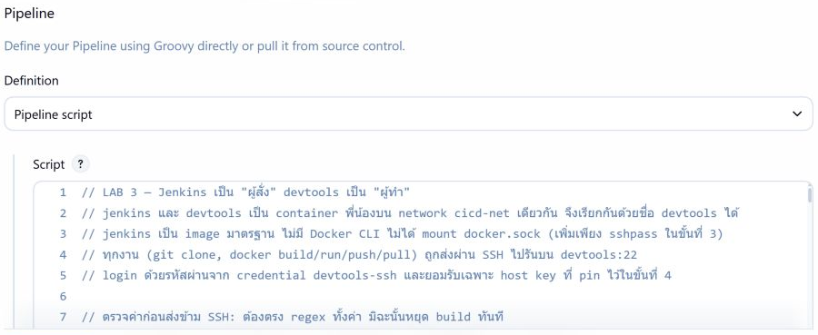](./images/lab3_sib_pipeline_config.png)

*ภาพที่ 10 หน้า Configure ของ job: Definition = **Pipeline script** และบรรทัดแรกของ Jenkinsfile แล็บนี้*

✅ build #1 `SUCCESS` ครบ 8 stage ใน 1 นาที 14 วินาที:

[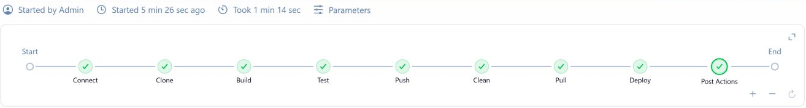](./images/lab3_sib_build1_graph.png)

*ภาพที่ 11 build #1 เขียวครบ 8 stage จาก Connect ถึง Deploy ใช้เวลา 1 นาที 14 วินาที*

stage **Connect** ยืนยันว่า Jenkins ไม่มี docker แต่สั่ง devtools ได้ บรรทัด `+ sshpass -e ssh ...` ไม่มีรหัสผ่านเพราะรหัสอยู่ใน `SSHPASS`:

[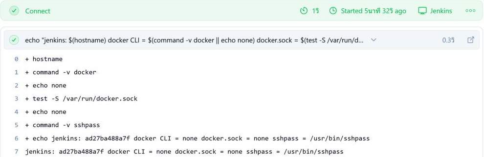](./images/lab3_sib_build1_connect.png)

*ภาพที่ 12 stage Connect ของ build #1 ส่วนที่รันบน Jenkins: `docker CLI = none docker.sock = none sshpass = /usr/bin/sshpass`*

[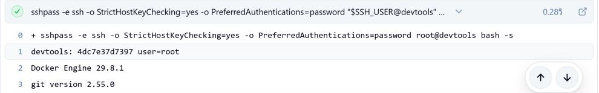](./images/lab3_sib_build1_connect_ssh.png)

*ภาพที่ 13 stage Connect ของ build #1 ส่วนถัดมา: `sshpass -e ssh -o StrictHostKeyChecking=yes ... root@devtools` แล้ว devtools ตอบ hostname, `user=root`, Docker และ git*

stage **Push** และ **Deploy** ของ build #1:

```text
lab3-sibling-20260926r2-1: digest: sha256:ea2559a940026b2eb8feb704f941c7b1980364e02429ac8145e1393d2a2665c8 size: 2006
image: docker.io/<DOCKER_USER>/catfood-shop@sha256:ea2559a940026b2eb8feb704f941c7b1980364e02429ac8145e1393d2a2665c8
เว็บตอบ version 1.0.0 build #1 commit 8b38dc93bc07 ตรงกับ Pipeline
```

เปิด `http://localhost:3000` chip บนแถบด้านบนต้องเป็น `v1.0.0 · build #1`

## ขั้นที่ 8 — ออกเวอร์ชันใหม่ `APP_VERSION=1.1.0`

job `docker-build-push` → **Build with Parameters** → เปลี่ยนเฉพาะ `APP_VERSION` เป็น `1.1.0` → **Build**

[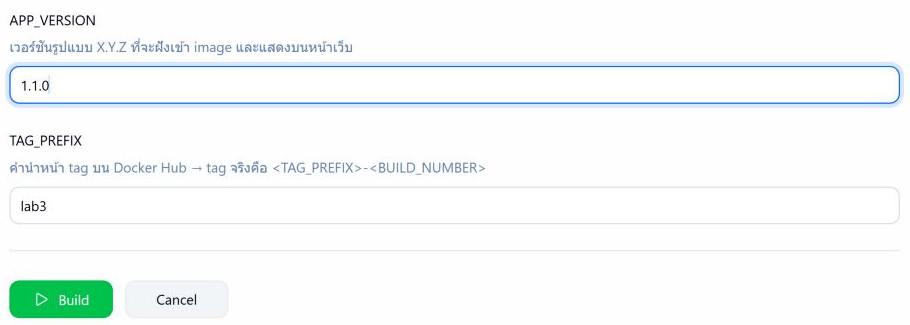](./images/lab3_sib_build_parameters.png)

*ภาพที่ 14 ฟอร์ม **Build with Parameters** กรอก `APP_VERSION` = `1.1.0` แล้วกด **Build** (ภาพนี้ถ่ายหลังทำครบทุกขั้นเพื่อแสดงฟอร์ม)*

✅ build #2 `SUCCESS` ใน 30 วินาที ดู log ของแต่ละ stage ได้โดยเลือก stage ทางซ้ายของหน้า build:

[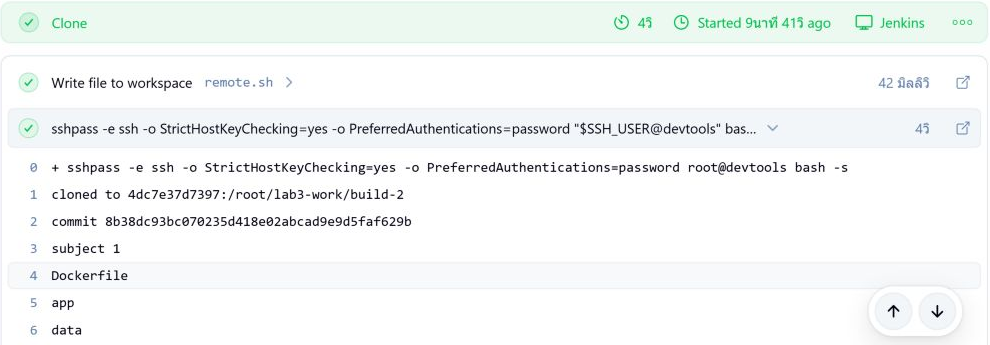](./images/lab3_sib_build2_clone.png)

*ภาพที่ 15 build #2 stage Clone: clone ลง `/root/lab3-work/build-2` บน devtools และได้ commit ของซอร์ส*

[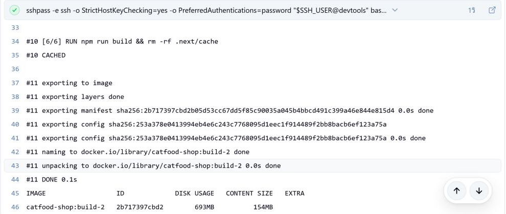](./images/lab3_sib_build2_build.png)

*ภาพที่ 16 build #2 stage Build ช่วงท้าย: ได้ image `catfood-shop:build-2` และ manifest `sha256:2b717397…` ซึ่งจะเป็น digest ที่ Push ได้*

[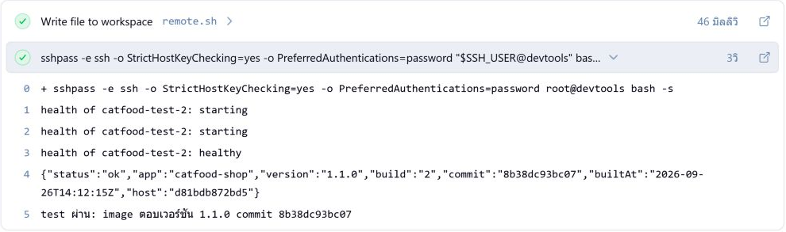](./images/lab3_sib_build2_test.png)

*ภาพที่ 17 build #2 stage Test: `catfood-test-2` ถึง `healthy` และตอบ version `1.1.0` build `2`*

[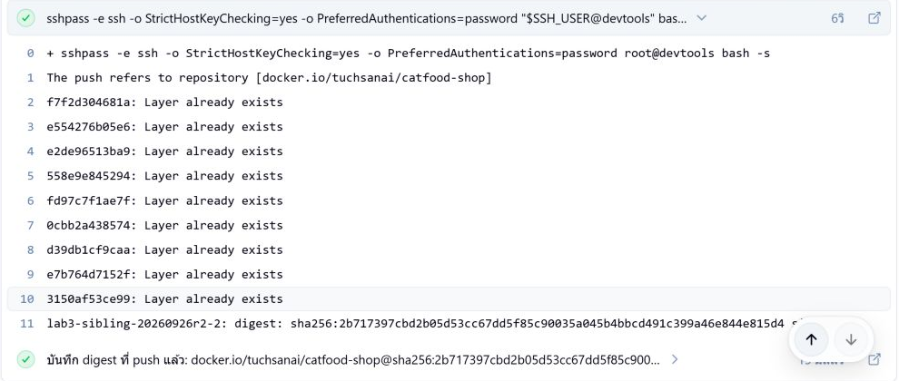](./images/lab3_sib_build2_push.png)

*ภาพที่ 18 build #2 stage Push: layer มีบน Docker Hub แล้วจาก build #1 (`Layer already exists`) และได้ digest `sha256:2b717397…`*

[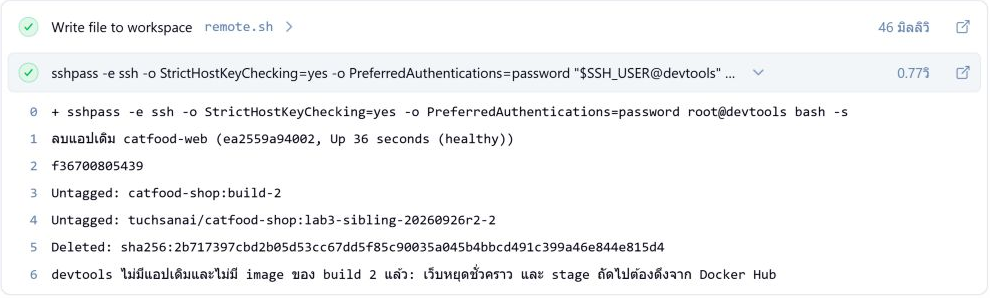](./images/lab3_sib_build2_clean.png)

*ภาพที่ 19 build #2 stage Clean (ภาพนี้แสดงเฉพาะ Clean): ลบร้านเดิม `catfood-web` ของ build #1 (`ea2559a94002`) แล้วลบ image ของ build 2 ออกจาก devtools*

[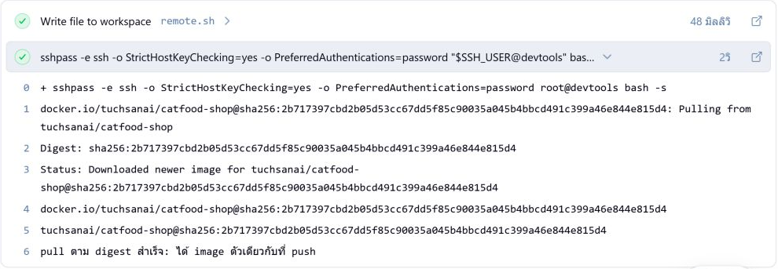](./images/lab3_sib_build2_pull.png)

*ภาพที่ 20 build #2 stage Pull: ดึง `catfood-shop@sha256:2b717397…` กลับจาก Docker Hub (`Downloaded newer image`)*

[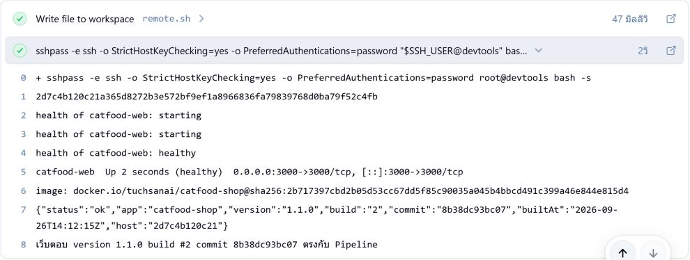](./images/lab3_sib_build2_deploy.png)

*ภาพที่ 21 build #2 stage Deploy: `catfood-web` รันจาก `catfood-shop@sha256:2b717397…` และเว็บตอบ version `1.1.0` build #2*

Push, Pull และ Deploy ของ build #2 ใช้ digest เดียวกัน:

```text
lab3-sibling-20260926r2-2: digest: sha256:2b717397cbd2b05d53cc67dd5f85c90035a045b4bbcd491c399a46e844e815d4 size: 2006
Digest: sha256:2b717397cbd2b05d53cc67dd5f85c90035a045b4bbcd491c399a46e844e815d4
image: docker.io/<DOCKER_USER>/catfood-shop@sha256:2b717397cbd2b05d53cc67dd5f85c90035a045b4bbcd491c399a46e844e815d4
เว็บตอบ version 1.1.0 build #2 commit 8b38dc93bc07 ตรงกับ Pipeline
```

เปิด `http://localhost:3000` chip ต้องเป็น `v1.1.0 · build #2`:

[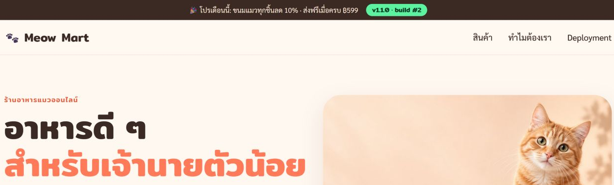](./images/lab3_sib_app_v110.png)

*ภาพที่ 22 หน้าร้านหลัง build #2 chip บนแถบด้านบนแสดง `v1.1.0 · build #2`*

[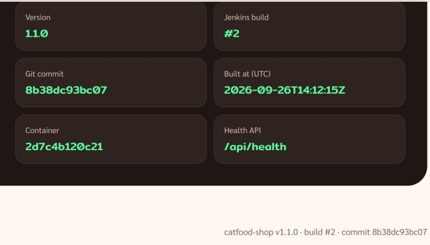](./images/lab3_sib_app_deployment.png)

*ภาพที่ 23 ส่วน Deployment info ท้ายหน้าร้าน: Version `1.1.0`, Jenkins build `#2`, commit และ Container `2d7c4b120c21` ตรงกับ `host` ใน log ของ Deploy*

หน้า Tags บน Docker Hub มี tag ของ build #1 และ #2 ที่ digest ตรงกับ console:

[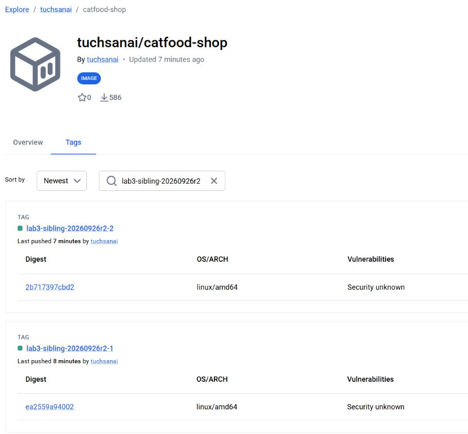](./images/lab3_sib_hub_tags.png)

*ภาพที่ 24 หน้า Tags ของ repository `catfood-shop` บน Docker Hub กรองตาม prefix ของรอบทดสอบ: tag `-2` digest `2b717397cbd2` และ tag `-1` digest `ea2559a94002` ตรงกับ console*

🔍 **สืบย้อน:** chip `v1.1.0 · build #2` → Container ใน Deployment info (`host` ใน `/api/health`) → `image: <repo>@sha256:...` ใน Deploy → digest ที่ Push จด → build #2 → commit จาก Clone

## ขั้นที่ 9 — ค่าผิด 3 แบบ ร้านเดิมต้องยังอยู่

**(ก)** Build with Parameters กรอก `APP_VERSION` = `1.2.0; id` → build #3 `FAILURE` ที่ Connect ก่อน SSH ใด ๆ ส่งค่านี้ (SSH ครั้งเดียวที่เกิดมาจาก `post` ซึ่งส่งเพียงชื่อ container และ path ของ build นี้)

```text
Started by user Admin
Running on Jenkins in /var/jenkins_home/workspace/docker-build-push
+ sshpass -e ssh -o StrictHostKeyChecking=yes -o PreferredAuthentications=password root@devtools bash -s
เก็บกวาดของ build ที่ล้มแล้ว: catfood-test-3 /tmp/lab3-docker-3 /root/lab3-work/build-3
ERROR: APP_VERSION ไม่ถูกต้อง: ต้องเป็นรูปแบบ X.Y.Z เช่น 1.0.0
Finished: FAILURE
```

[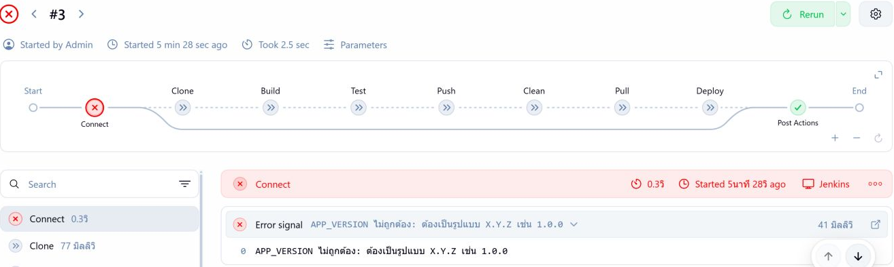](./images/lab3_sib_build3.png)

*ภาพที่ 25 build #3 (`APP_VERSION=1.2.0; id`) Connect แดงด้วย `APP_VERSION ไม่ถูกต้อง` stage อื่นถูกข้าม — ล้มตามที่ตั้งใจ*

**(ข)** กรอก `GIT_REF` = `no-such-branch` (รูปแบบถูก จึงผ่าน Connect) → build #4 `FAILURE` ที่ Clone

[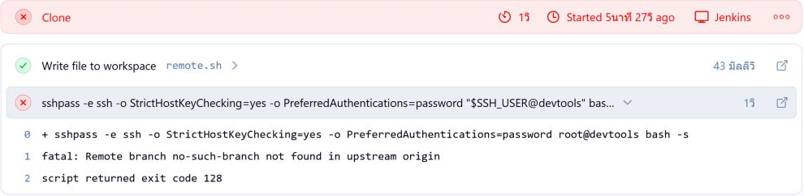](./images/lab3_sib_build4.png)

*ภาพที่ 26 build #4 (`GIT_REF=no-such-branch`) Clone แดง: `Remote branch no-such-branch not found` exit code 128 — ล้มตามที่ตั้งใจ*

**(ค)** credential `devtools-ssh` → **Update** → **Change Password** เป็นค่าอื่น → **Save** แล้ว **Build Now** → build #5 `FAILURE` ที่ Connect (`sshpass` คืน exit code 5 เมื่อรหัสผ่านถูกปฏิเสธ) **แล้วแก้ Password กลับเป็น `passwd`**

[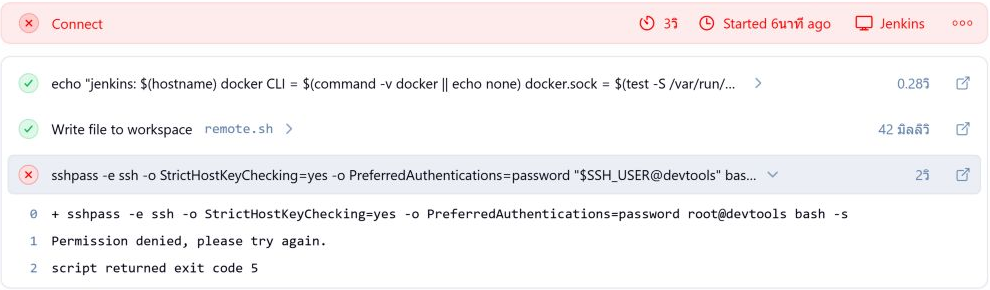](./images/lab3_sib_build5.png)

*ภาพที่ 27 build #5 (รหัสผ่าน SSH ผิด) Connect แดง: `Permission denied, please try again.` และ exit code 5 — ล้มตามที่ตั้งใจ*

ตรวจจาก host ว่าร้านยังเป็น build #2 container เดิม:

<!-- lab3-test:check-web -->
```bash
docker exec devtools curl -s -w "\n" localhost:3000/api/health
docker exec devtools docker ps --filter label=devtools.lab=lab3 --format '{{.Names}}  {{.Status}}  build={{.Label "devtools.build"}}'
```

```text
{"status":"ok","app":"catfood-shop","version":"1.1.0","build":"2","commit":"8b38dc93bc07","builtAt":"2026-09-26T14:12:15Z","host":"2d7c4b120c21"}
catfood-web  Up About a minute (healthy)  build=2
```

ทั้งสาม build ล้ม **ก่อน Clean** ร้านเดิมจึงไม่ถูกแตะ

## ✅ ตรวจปิดแล็บ

- [ ] `docker exec jenkins sh -c "command -v docker || echo 'docker: none'"` ได้ `docker: none` และ `docker network inspect cicd-net` มีทั้ง `jenkins` และ `devtools`
- [ ] `docker exec jenkins ssh-keygen -lF devtools` ได้ fingerprint ตรงกับ `docker exec devtools ssh-keygen -lf /etc/ssh/ssh_host_ed25519_key.pub`
- [ ] Credentials มี `devtools-ssh` (`root`) และ `dockerhub`
- [ ] build #1 และ #2 `SUCCESS` ครบ 8 stage · Clean ของ #2 มี `ลบแอปเดิม catfood-web (...)` · digest ใน Push, Pull, Deploy ตรงกัน
- [ ] หน้า Tags บน Docker Hub มี `lab3-1` และ `lab3-2` · `http://localhost:3000` แสดง `v1.1.0 · build #2`
- [ ] build ของขั้นที่ 9 ล้มตามที่คาด ร้านยังเป็น build #2 และแก้รหัส `devtools-ssh` กลับเป็น `passwd` แล้ว

## แก้ปัญหาที่พบบ่อย

| อาการ | วิธีแก้ |
|---|---|
| `sshpass: not found` ใน Connect | รันขั้นที่ 3 ซ้ำ (เกิดเมื่อสร้าง `jenkins` ใหม่) |
| `Could not resolve hostname devtools` | `docker network inspect cicd-net` ต้องเห็นทั้งสองตัว ถ้าไม่เห็นให้ `docker network connect cicd-net devtools` |
| `Host key verification failed.` | ยังไม่ได้ pin หรือสร้าง `devtools` ใหม่จาก image อื่น → รันขั้นที่ 4 ซ้ำ |
| `Permission denied, please try again.` / `exit code 5` | แก้ Password ของ `devtools-ssh` เป็น `passwd` |
| `Could not find credentials entry with ID ...` | ตั้ง ID เป็น `devtools-ssh` และ `dockerhub` ตรงตัว |
| `user=****` หรือ `/****/lab3-work` ใน console | เอาติ๊ก **Treat username as secret** ของ `devtools-ssh` ออก |
| `... ไม่ถูกต้อง: ...` ใน Connect | แก้ parameter ตามข้อความ (`X.Y.Z`, `https://...`, username Docker Hub ตัวพิมพ์เล็ก) |
| `Remote branch ... not found` ใน Clone | ตรวจ `GIT_REF`/`GIT_URL` ว่ามีจริงและเป็น Public |
| `unauthorized` / `denied` ใน Push หรือ Pull | token ผิด หมดอายุ หรือไม่มีสิทธิ์ Write → สร้างใหม่แล้วแก้ `dockerhub` |
| `พบ container catfood-web ที่ไม่ได้สร้างโดย LAB 3` / `port 3000 ถูก container อื่นใช้อยู่` | `docker exec devtools docker ps -a` ลบเฉพาะตัวที่ไม่ใช้แล้ว แล้ว Build ใหม่ |
| เปิด `localhost:3000` ไม่ได้ทั้งที่ Deploy เขียว | `docker port devtools` ถ้าไม่มี 3000 ให้ทำขั้นที่ 1 ใหม่ |

## 🧹 เก็บกวาด (🖥️ host)

**ห้ามลบ** `devtools`, `jenkins`, volume `jenkins_home`, network `cicd-net` และ credential ทั้งสอง แล็บถัดไปใช้ต่อ บล็อกนี้ลบเฉพาะ container/image ที่มี label `devtools.lab=lab3` บน Docker ของ devtools และไฟล์ชั่วคราวของแล็บ:

<!-- lab3-test:cleanup -->
```bash
docker exec devtools sh -c "docker ps -aq --filter label=devtools.lab=lab3 | xargs -r docker rm -f"
docker exec devtools sh -c "docker image ls -aq --filter label=devtools.lab=lab3 | sort -u | xargs -r docker image rm -f"
docker exec devtools sh -c "rm -rf /root/lab3-work /tmp/lab3-docker-*"
docker exec devtools docker ps -a --format '{{.Names}}'
docker ps --filter name=^devtools$ --filter name=^jenkins$ --format '{{.Names}}  {{.Status}}'
```

เมื่อจบรายวิชา ลบ credential ทั้งสองใน Jenkins และ revoke token ที่ Docker Hub · หลังเปิดเครื่องใหม่ container ทั้งหมด (รวม `catfood-web`) กลับมาเองเพราะ `--restart unless-stopped` ถ้าไม่ขึ้นให้ `docker start devtools jenkins`

## 🤔 คำถามทบทวน

1. ถ้าสร้าง `devtools` โดยไม่ใส่ `--network cicd-net` stage ใดจะล้มก่อน และ error คืออะไร
2. การ pin host key ป้องกันอะไรได้ และทำไม fingerprint ของทุกคนในห้องจึงเหมือนกัน
3. ทำไม Jenkinsfile ใช้ `sshpass -e` แทน `sshpass -p passwd` และใช้ `sh '...'` แทน `sh "..."`
4. ทำไม Clean ต้องเกิด **หลัง** Push สำเร็จ และทำไม Pull/Deploy ใช้ `repository@sha256:...` แทน `repository:tag`

เอกสารนี้ทดสอบจริงครบทุกขั้นแล้ว ดู [รายงานผลทดสอบ](./LAB003_FINAL_REPORT.md)

➡️ **แล็บถัดไป:** [LAB 4 — Pipeline from Git](../004_LAB_Pipeline_From_Git/README.md)
