# LAB 3 — Build · Push · Pull · Deploy ร้านอาหารแมวด้วย Jenkins และ Docker Hub

> ⏱️ ประมาณ 60 นาที · 🧪 11 การทดลอง · 🎯 จบเมื่อเปิด `http://localhost:3000` แล้วเห็นร้าน **Meow Mart** ที่ Jenkins build, push ขึ้น Docker Hub, pull กลับมา และ deploy ให้อัตโนมัติ และ `bash check.sh` ได้ `ผลรวม: PASS`

แล็บนี้ตอบคำถามว่า **“ซอร์สโค้ดหนึ่งชุดเดินทางจากเครื่องของเราไปเป็นเว็บที่รันได้บนเครื่องใดก็ได้อย่างไร”** นักศึกษาจะให้ Jenkins สร้าง Docker image ของเว็บขายอาหารแมวที่เขียนด้วย **Next.js** ทดสอบ image นั้น push ขึ้น **Docker Hub** แล้ว pull กลับมา deploy เป็นเว็บจริง จากนั้นพิสูจน์ด้วยผลการทดลองว่า image เดียวกันรันบนเครื่องที่สองได้ด้วย digest เดียวกัน ออกเวอร์ชันใหม่ได้ภายในไม่กี่วินาที และย้อนกลับ (rollback) ได้ในเวลาราว 1 วินาที

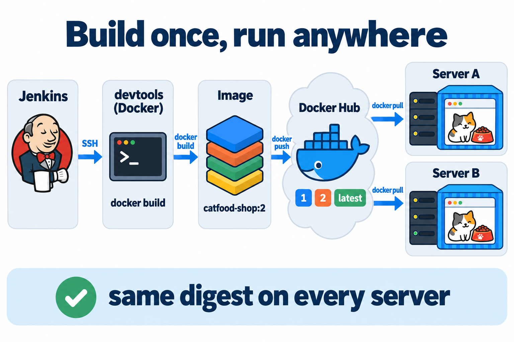

*ภาพที่ 1 ภาพรวมของแล็บ: Jenkins build → Docker Hub เก็บ image → เครื่องใดก็ pull ไปรันได้ และทุกเครื่องได้ image ที่มี digest เดียวกัน*

**สิ่งที่จะได้เมื่อจบแล็บ** — ร้าน Meow Mart ที่ deploy โดย Pipeline (ภาพจริงจากการทดลอง แบบเต็มจอ 1920×1080):

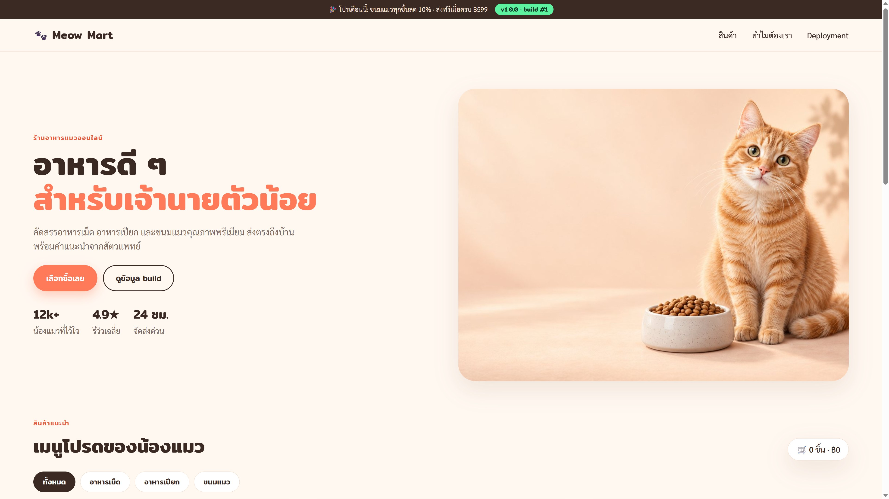

*ภาพที่ 2 หน้าแรกของร้าน สังเกต chip สีเขียวบนแถบด้านบน `v1.0.0 · build #1` ซึ่งอ่านมาจาก image ที่ Jenkins สร้าง*

---

## 📚 ทฤษฎีก่อนลงมือ

### 1. Image, Container, Registry และคำสั่งหลักสี่คำสั่ง

| คำศัพท์ | ความหมาย | เปรียบเทียบ |
|---|---|---|
| **Image** | แพ็กเกจแบบอ่านอย่างเดียวที่มีระบบไฟล์ของแอป runtime และคำสั่งเริ่มต้น | “แม่พิมพ์” หรือกล่องอาหารแมวที่ปิดผนึก |
| **Container** | process ที่รันจาก image หนึ่งตัว มี writable layer ของตัวเอง | อาหารที่เทออกมาใส่ชาม |
| **Registry** | ที่เก็บและแจกจ่าย image เช่น Docker Hub | โกดังกลางที่ร้านทุกสาขามารับของ |
| **Repository / Tag** | ชื่อชุดของ image (`<DOCKER_USER>/catfood-shop`) และป้ายเวอร์ชัน (`1`, `2`, `latest`) | ชื่อสินค้าและรุ่น |

วงจรที่แล็บนี้ฝึกคือ `docker build` → `docker push` → `docker pull` → `docker run` ข้อดีสำคัญคือ **build ครั้งเดียว แล้วรันได้ทุกที่ (build once, run anywhere)** เครื่องปลายทางไม่ต้องมี Node.js, ไม่ต้อง `npm install` และไม่ต้องมีซอร์สโค้ด ขอเพียงมี Docker และเข้าถึง registry ได้

### 2. Layer และ Multi-stage build

image ประกอบด้วย **layer** ซ้อนกัน คำสั่ง `FROM`, `COPY`, `RUN` แต่ละบรรทัดใน Dockerfile สร้าง layer ใหม่ ถ้าเรา build แอป Next.js ใน stage เดียว image จะพกทุกอย่างที่ใช้ตอน build ไปด้วย ทั้ง compiler, devDependencies และ cache ของการ build ทั้งที่ตอนรันจริงไม่ได้ใช้

**Multi-stage build** แบ่ง Dockerfile ออกเป็นหลาย stage แล้วคัดลอกเฉพาะผลลัพธ์ที่จำเป็นไปยัง stage สุดท้าย แล็บนี้ใช้ 3 stage:

```dockerfile
FROM node:22-alpine AS deps      # ① ติดตั้ง dependency ตาม package-lock.json
FROM node:22-alpine AS build     # ② next build → ได้ .next/standalone
FROM node:22-alpine AS runtime   # ③ คัดลอกเฉพาะ standalone + static + public
```

`next.config.mjs` ตั้ง `output: 'standalone'` ให้ Next.js รวบรวมเฉพาะไฟล์ที่ server ต้องใช้ไว้ในโฟลเดอร์ `.next/standalone` จึงไม่ต้องคัดลอก `node_modules` ทั้งหมด (จะวัดผลจริงในการทดลองที่ 4)

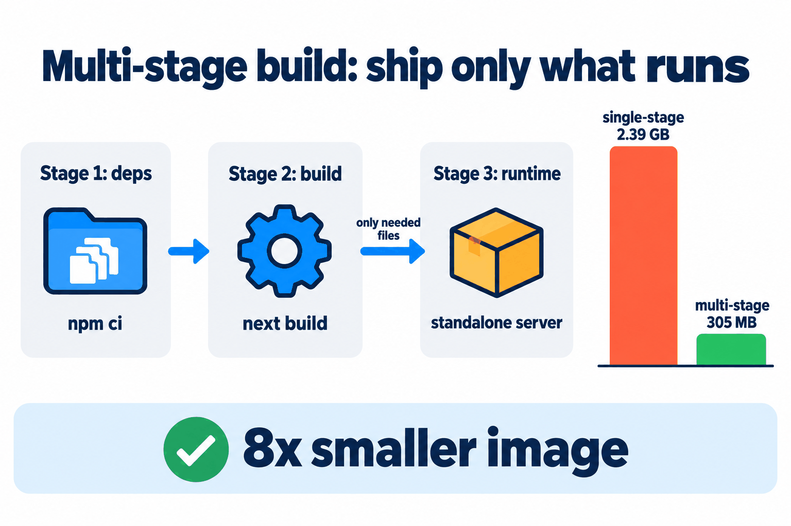

*ภาพที่ 3 Multi-stage build: ship เฉพาะสิ่งที่ต้องใช้ตอนรัน ตัวเลขในภาพมาจากการวัดจริงในการทดลองที่ 4*

### 3. Layer cache: ทำไม build ครั้งที่สองเร็วขึ้น

Docker จำผลของแต่ละ layer ไว้ ถ้าคำสั่งและไฟล์ที่ป้อนให้ layer นั้นไม่เปลี่ยน ครั้งถัดไปจะใช้ของเดิม (`Using cache`) แต่เมื่อ layer ใดเปลี่ยน layer ที่อยู่ถัดลงไปทั้งหมดต้องสร้างใหม่ หลักการเขียน Dockerfile จึงเป็น **“เรียงจากสิ่งที่เปลี่ยนน้อยไปหาสิ่งที่เปลี่ยนบ่อย”**

Dockerfile ของร้านจึงวางข้อมูลที่เปลี่ยนทุก build (`APP_VERSION`, `BUILD_NUMBER`, `BUILD_TIME`) ไว้ **ท้ายสุด** ด้วย `ARG` + `ENV` ผลคือเมื่อออกเวอร์ชันใหม่ ขั้น `npm ci` และ `next build` ใช้ cache ได้ทั้งหมด และตอน push Docker Hub ก็ตอบว่า `Layer already exists` แทบทุก layer (พิสูจน์ในการทดลองที่ 10)

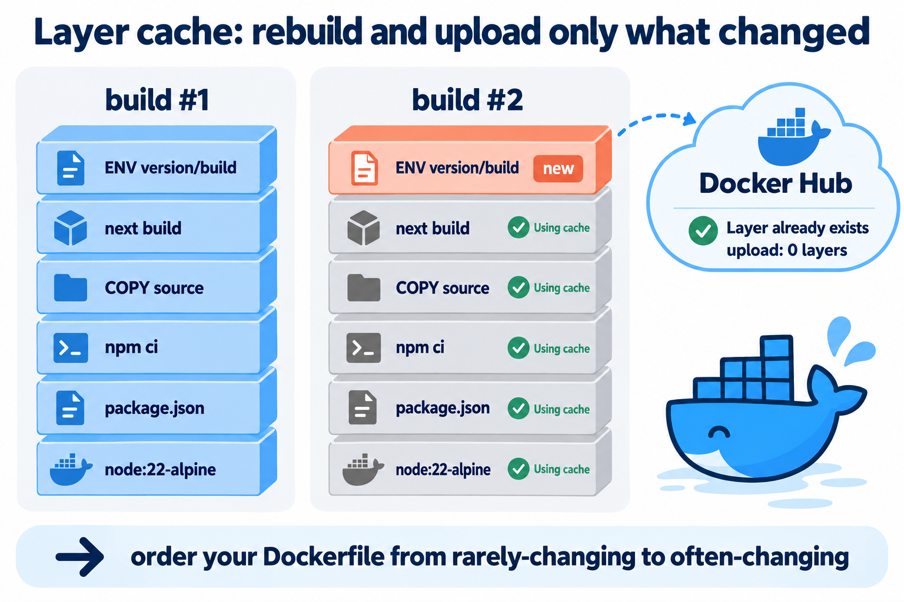

*ภาพที่ 4 build #2 เปลี่ยนเฉพาะ layer บนสุด ส่วน layer อื่นใช้ cache และไม่ต้องอัปโหลดซ้ำ*

### 4. Tag กับ Digest

- **Tag** คือป้ายชื่อที่ย้ายได้ เช่น `latest` ชี้ไปที่ build #1 แล้วภายหลังย้ายไปชี้ build #2
- **Digest** (`sha256:...`) คือลายนิ้วมือที่คำนวณจากเนื้อหาของ image เนื้อหาต่างกันแม้เพียงบิตเดียว digest ก็ต่างกัน และไม่มีวันเปลี่ยน

แนวปฏิบัติคือ **deploy ด้วย tag แต่ตรวจสอบด้วย digest** Jenkins console จะพิมพ์ digest หลัง push และหน้า Tags บน Docker Hub แสดง digest 12 ตัวแรก ซึ่งต้องตรงกัน

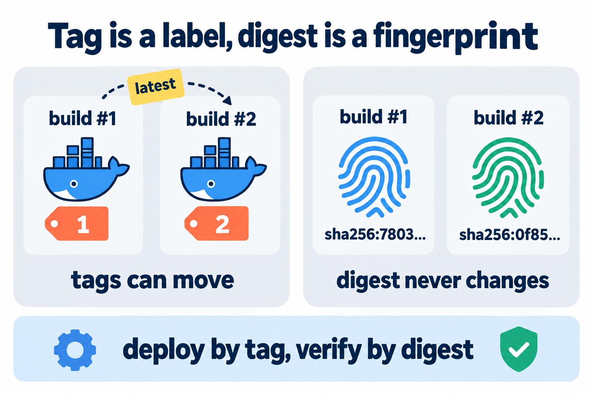

*ภาพที่ 5 tag ย้ายได้ ส่วน digest ผูกกับเนื้อหาตลอดไป ค่า `62c9…` และ `bd79…` คือ digest จริงของ build #1 และ #2 ในการทดลองนี้*

### 5. Jenkins สั่ง Docker ผ่าน socket (DooD)

Jenkins รันอยู่ใน container ส่วน Docker daemon อยู่ใน devtools container **Docker-outside-of-Docker (DooD)** คือการ mount `/var/run/docker.sock` เข้า Jenkins แล้วติดตั้ง Docker CLI ใน Jenkins image ผลคือคำสั่ง `docker build/run/push` ใน Pipeline ไปทำงานที่ daemon ตัวเดียวกับที่ devtools ใช้ container ที่ Pipeline สร้าง (`catfood-test-N`, `catfood-web`) จึงเป็น **พี่น้อง (sibling)** กับ Jenkins บน network `cicd-net` และเรียกหากันด้วยชื่อ container ได้

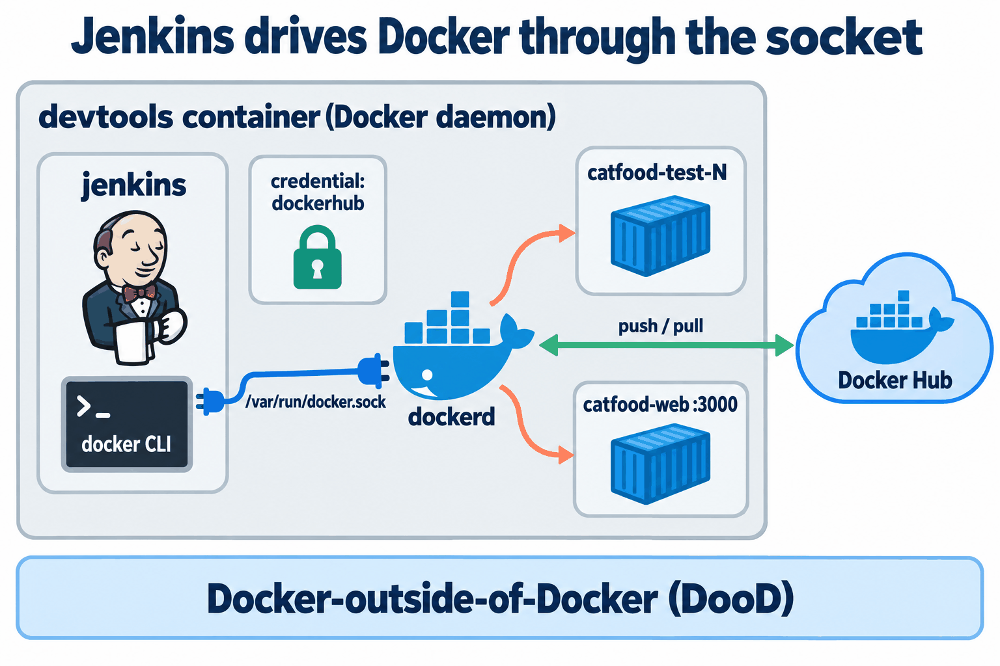

*ภาพที่ 6 Jenkins ใช้ Docker CLI คุยกับ dockerd ผ่าน socket จึงสร้าง container พี่น้อง และ push/pull กับ Docker Hub ได้*

> ⚠️ **Safety:** ใครเข้าถึง Docker socket ได้ก็มีอำนาจเทียบเท่า root ของเครื่อง host การ mount socket และใช้ `-u root` จึงเหมาะกับแล็บที่ลบทิ้งได้เท่านั้น ระบบ production ควรใช้ build agent แยกและจำกัดสิทธิ์ตามหลัก least privilege

### 6. Credential ไม่อยู่ในโค้ด

token ของ Docker Hub เก็บใน **Jenkins Credentials** ด้วย ID `dockerhub` แล้วเรียกใช้เฉพาะในบล็อก `withCredentials` Pipeline ใช้มาตรการซ้อนกันหลายชั้น:

| มาตรการ | ป้องกันอะไร |
|---|---|
| Groovy สตริงอัญประกาศเดี่ยว `'''...'''` | Groovy ไม่แทนค่า token ลงในสคริปต์ |
| `set +x` | shell ไม่พิมพ์คำสั่งที่มี token ออก console |
| `--password-stdin` | token ไม่ปรากฏใน argument ของ process |
| `DOCKER_CONFIG=$(mktemp -d)` + `trap ... EXIT` | ไฟล์ login ถูกลบทันทีเมื่อจบ stage ไม่ว่าจะสำเร็จหรือล้มเหลว |
| Masking ของ Jenkins | ถ้า token หลุดเข้า console จะแสดงเป็น `****` (เป็นเพียงด่านสุดท้าย ไม่ใช่การรับประกัน) |

---

## 🎯 Learning Objectives — ผลลัพธ์การเรียนรู้

เมื่อจบแล็บนี้ นักศึกษาจะสามารถ

1. อธิบายความสัมพันธ์ของ image, container, registry, tag และ digest และลำดับ build → push → pull → run ได้
2. อธิบายเหตุผลของ multi-stage build และวัดผลต่างของขนาด image ได้
3. เรียงลำดับคำสั่งใน Dockerfile ให้ใช้ layer cache ได้คุ้มค่า และอ่านผล `Using cache` / `Layer already exists` ได้
4. ตั้งค่า Jenkins ให้ build/push ผ่าน Docker socket โดยเก็บ token ไว้ใน Credentials อย่างปลอดภัย
5. ยืนยันว่า image บน Docker Hub คือ image เดียวกับที่ Jenkins build และที่รันอยู่บนทุกเครื่อง โดยใช้ digest
6. ออกเวอร์ชันใหม่และ rollback ด้วยการเปลี่ยน tag ได้

## 🗺️ แผนที่การทดลอง

| ช่วง | การทดลอง | สิ่งที่ทำ | ผลที่ต้องได้ (ค่าจริงจากการทดลอง) |
|---|---|---|---|
| A. เตรียม Jenkins | 1–3 | เพิ่ม Docker CLI และ mount socket + source | `docker: not found` → `Docker version 29.8.1` → job เดิมยังอยู่ |
| B. รู้จัก image | 4 | build แบบ multi-stage เทียบ single-stage | **305 MB** เทียบ **2.39 GB** |
| C. Pipeline | 5–7 | credential → job → build #1 | 5 stage เขียว, `Login Succeeded`, digest `62c9549b8368…` |
| D. Registry & เว็บ | 8–9 | ดู Docker Hub, เปิดร้าน, pull บนเครื่องที่สอง | tag `1`/`latest`, ร้านเปิดได้, digest ตรงกันทั้งสองเครื่อง |
| E. Release | 10–11 | build #2 v1.1.0 แล้ว rollback | ไม่มี layer ต้องอัปโหลดใหม่, rollback **1.2 วินาที**, `check.sh` PASS |

## 📂 ไฟล์ในโฟลเดอร์นี้

| ไฟล์ | หน้าที่ |
|---|---|
| `catfood-shop/` | ซอร์สโค้ดร้าน Meow Mart (Next.js 16 + React 19) |
| `catfood-shop/Dockerfile` | multi-stage build 3 stage (ใช้จริงใน Pipeline) |
| `catfood-shop/Dockerfile.single` | Dockerfile ชั้นเดียว ใช้เปรียบเทียบในการทดลองที่ 4 เท่านั้น |
| `Dockerfile.jenkins` | Jenkins LTS + Docker CLI |
| `Jenkinsfile` | Pipeline 5 stage: Prepare source → Build image → Test image → Push → Pull & Deploy |
| `check.sh` | ตัวตรวจสถานะจบแล็บ |

ภายใน `catfood-shop/` ที่ควรรู้จัก:

```text
catfood-shop/
├── app/page.js            # หน้าร้าน (อ่าน build info ทุก request)
├── app/components/Shop.js # ตัวกรองหมวด + ตะกร้า (ทำงานฝั่ง browser)
├── app/api/health/route.js# GET /api/health → JSON ใช้ใน stage Test/Deploy
├── data/products.js       # ข้อมูลสินค้า 6 รายการ
├── data/buildInfo.js      # อ่าน APP_VERSION, BUILD_NUMBER, GIT_COMMIT, BUILD_TIME
└── public/images/         # ภาพสินค้า
```

## สภาพตั้งต้น

ต้องจบ LAB 2 แล้ว: devtools container ทำงาน มี network `cicd-net`, container `jenkins`, volume `jenkins_home` และ job `first-pipeline`

> **Prerequisite:** ร้านแมวของแล็บนี้เปิดที่ port `3000` — port 3000 เปิดไว้แล้วตั้งแต่ LAB 1 ส่วนที่ 0 (`-p 3000:3000`) ไม่ต้องสร้าง devtools ใหม่

> **Prerequisite Docker Hub:** สมัครบัญชี ยืนยันอีเมล และสร้าง **Access Token สิทธิ์ Read & Write** แนะนำให้สร้าง repository `catfood-shop` แบบ **Public** ไว้ก่อน (ถ้าไม่สร้าง Docker Hub จะสร้างให้อัตโนมัติตอน push ตามค่า Default privacy ของบัญชี)

ใน shell ของ devtools กำหนดตัวแปรที่ใช้ทั้งแล็บ:

```bash
COURSE_ROOT="$HOME/labwork/DevTools/04_Jenkins/001_Jenikin"
LAB="$COURSE_ROOT/003_LAB_Docker_Build_Push"
docker ps --format '{{.Names}}\t{{.Status}}'
```

✅ **สิ่งที่ต้องเห็น:**

```text
jenkins	Up ...
```

---

## ช่วง A — เตรียม Jenkins ให้สั่ง Docker ได้

### การทดลองที่ 1 — Jenkins เดิมมี Docker CLI หรือไม่?

**คำถาม:** Jenkins container จาก LAB 2 เรียกคำสั่ง `docker` ได้แล้วหรือยัง?

```bash
docker exec jenkins sh -c 'docker version'
printf 'exit=%s\n' "$?"
```

✅ **ผลการทดลองจริง:**

```text
sh: 1: docker: not found
exit=127
```

> 🔍 **วิเคราะห์ผล:** exit code `127` หมายถึงหาโปรแกรมไม่พบ Jenkins image มาตรฐานไม่มี Docker CLI ดังนั้นแม้จะ mount socket ก็ยังสั่งงานไม่ได้ ต้องสร้าง image ใหม่ที่มี CLI ก่อน

### การทดลองที่ 2 — สร้าง Jenkins image ที่มี Docker CLI

**คำถาม:** image `jenkins-docker:2569` ที่สร้างจาก `Dockerfile.jenkins` มี Docker CLI หรือไม่?

```bash
cd "$LAB"
docker build -t jenkins-docker:2569 -f Dockerfile.jenkins .
docker run --rm --entrypoint docker jenkins-docker:2569 --version
```

✅ **ผลการทดลองจริง:**

```text
Docker version 29.8.1, build 4a63305
```

### การทดลองที่ 3 — เปลี่ยน image ของ Jenkins โดยไม่เสียงานเดิม

**คำถาม:** เมื่อสร้าง container `jenkins` ใหม่ด้วย `jenkins_home` เดิม job จาก LAB 2 ยังอยู่หรือไม่?

คำสั่งนี้เพิ่ม mount สองจุด: Docker socket สำหรับสั่ง Docker และโฟลเดอร์ `catfood-shop` แบบอ่านอย่างเดียว (`:ro`) ที่ `/lab/catfood-shop` เพื่อให้ Pipeline ใช้เป็นซอร์สโค้ด (LAB 4 จะเปลี่ยนไปดึงซอร์สจาก GitHub แทน)

```bash
docker rm -f jenkins
docker run -d --name jenkins --restart unless-stopped --network cicd-net \
  -p 8080:8080 -u root \
  -e JAVA_OPTS=-Djenkins.install.runSetupWizard=false \
  -v jenkins_home:/var/jenkins_home \
  -v /var/run/docker.sock:/var/run/docker.sock \
  -v "$LAB/catfood-shop:/lab/catfood-shop:ro" \
  jenkins-docker:2569
until curl -fsS -o /dev/null http://localhost:8080/login; do sleep 2; done
curl -fsS -u admin:admin2569 'http://localhost:8080/job/first-pipeline/api/json?tree=name'; echo
docker exec jenkins sh -c 'docker ps --format "{{.Names}}"; ls /lab/catfood-shop'
```

✅ **ผลการทดลองจริง:**

```text
{"_class":"org.jenkinsci.plugins.workflow.job.WorkflowJob","name":"first-pipeline"}
jenkins
Dockerfile
Dockerfile.single
app
data
next.config.mjs
package-lock.json
package.json
public
```

> 🔍 **วิเคราะห์ผล:** job `first-pipeline` ยังอยู่เพราะข้อมูลทั้งหมดเก็บใน volume `jenkins_home` ไม่ใช่ใน container และตอนนี้ `docker ps` ที่รัน **จากในตัว Jenkins** มองเห็น container ของ devtools แล้ว แปลว่า socket ใช้งานได้ ระหว่างที่ Jenkins กำลังเริ่มระบบ `curl` อาจตอบ `503` หรือ `Connection reset` สักครู่ ถือเป็นเรื่องปกติ

---

## ช่วง B — รู้จัก image ของร้านก่อนให้ Jenkins สร้าง

### การทดลองที่ 4 — Multi-stage ช่วยลดขนาด image ได้แค่ไหน?

**คำถาม:** image ของแอปเดียวกัน ถ้า build แบบ single-stage กับแบบ multi-stage ขนาดต่างกันเท่าไร?

```bash
cd "$LAB/catfood-shop"
time docker build -t catfood-shop:multi .
time docker build -f Dockerfile.single -t catfood-shop:single .
docker image ls catfood-shop
docker run --rm catfood-shop:single sh -c 'du -sh /app/node_modules /app/.next'
docker run --rm catfood-shop:multi  sh -c 'du -sh /app/node_modules /app/.next'
```

✅ **ผลการทดลองจริง** (build ครั้งแรก ไม่มี cache):

```text
IMAGE                 ID             DISK USAGE   CONTENT SIZE
catfood-shop:multi    3152e43c51e4        305MB         76.6MB
catfood-shop:single   ab2b83b8d18a       2.39GB          636MB

# single-stage                    # multi-stage
340M  /app/node_modules           46.9M  /app/node_modules
89M   /app/.next                  1.7M   /app/.next
```

| วัดค่า | single-stage | multi-stage | ผลต่าง |
|---|---:|---:|---:|
| ขนาดบนดิสก์ (DISK USAGE) | 2.39 GB | 305 MB | เล็กลง ~8 เท่า |
| ขนาดที่ต้องดาวน์โหลด (CONTENT SIZE) | 636 MB | 76.6 MB | เล็กลง ~8 เท่า |
| `node_modules` ใน image | 340 MB | 46.9 MB | เหลือเฉพาะที่ server ใช้ |
| เวลา build (ครั้งแรก) | 48 วินาที | 21 วินาที | — |

> 🔍 **วิเคราะห์ผล:** image แบบ single-stage พก base image ขนาดใหญ่ (`node:22`), devDependencies และ cache ของ `next build` ไปด้วย ส่วน multi-stage ใช้ `node:22-alpine` และคัดลอกเฉพาะ `.next/standalone` ทุกครั้งที่ push/pull จึงประหยัดเวลาและพื้นที่ราว 8 เท่า Pipeline ในแล็บนี้จึงใช้ `Dockerfile` แบบ multi-stage

---

## ช่วง C — Pipeline: Build → Test → Push → Pull & Deploy

### การทดลองที่ 5 — เก็บ Docker Hub token ใน Jenkins Credentials

**คำถาม:** จะให้ Pipeline ใช้ token โดยไม่เขียน token ลงในโค้ดได้อย่างไร?

1. เปิด `http://localhost:8080` และ login ด้วย `admin / admin2569`
2. เลือก **Manage Jenkins → Credentials** (หมวด Security)

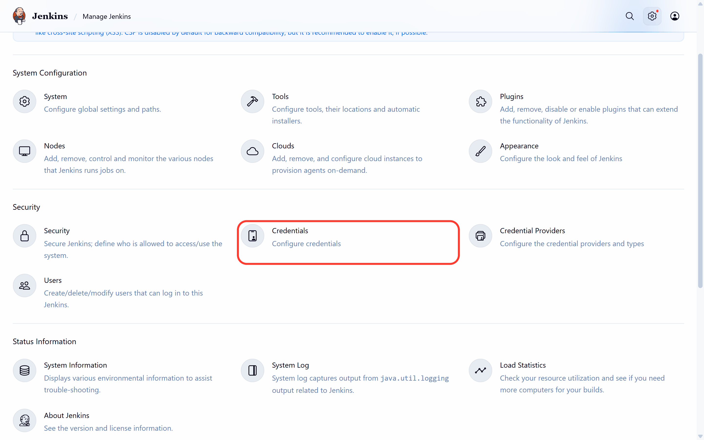

*ภาพที่ 7 เมนู Credentials ในหมวด Security ของ Manage Jenkins*

3. เลือก **System → Global credentials (unrestricted) → Add Credentials** แล้วเลือกชนิด **Username with password** → **Next**

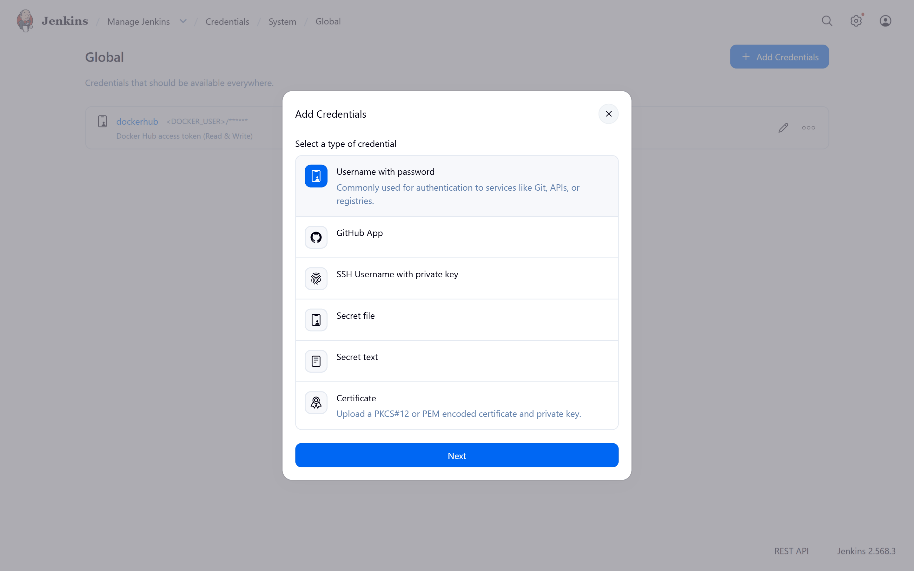

*ภาพที่ 8 Jenkins รุ่นนี้ (2.568.3) ให้เลือกชนิด credential ใน dialog ก่อน*

4. กรอก Username = `<DOCKER_USER>`, Password = `<DOCKER_TOKEN>`, ID = `dockerhub`, Description ตามภาพ แล้วกด **Create** (แทน placeholder ด้วยค่าจริงของตนเอง)

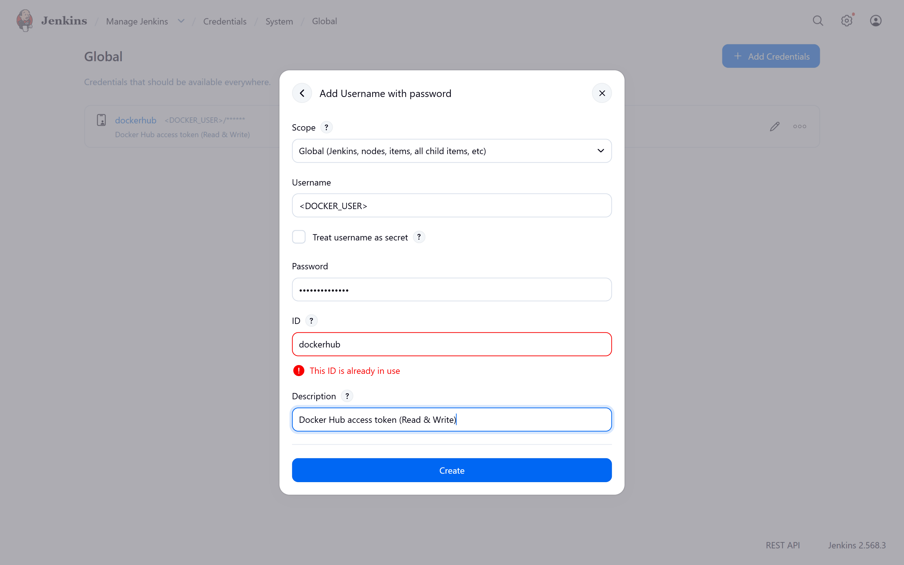

*ภาพที่ 9 ช่อง Password ถูกปิดบังเสมอ และ ID `dockerhub` คือชื่อที่ Jenkinsfile อ้างถึง*

✅ **สิ่งที่ต้องเห็น:** รายการ `dockerhub` ใน Global credentials

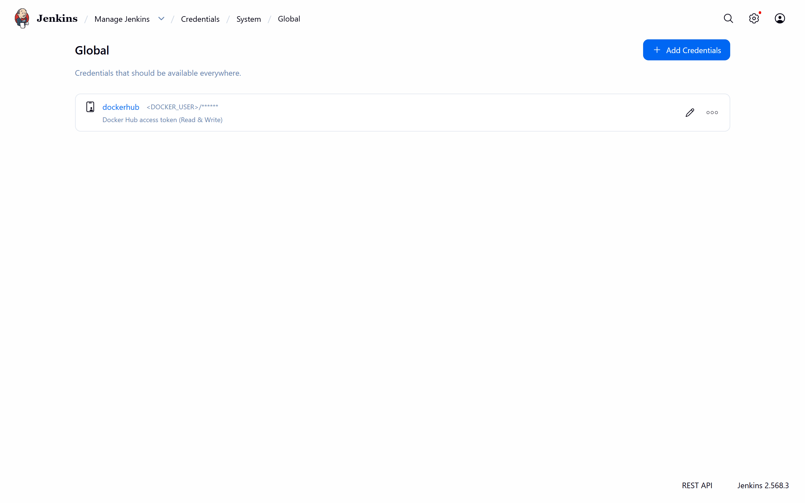

*ภาพที่ 10 Jenkins แสดงชื่อผู้ใช้/`******` เท่านั้น ไม่แสดง token*

ตรวจจาก terminal ได้เช่นกัน:

```bash
curl -gfsS -u admin:admin2569 \
  'http://localhost:8080/credentials/store/system/domain/_/api/json?tree=credentials[id]'; echo
```

```json
{"_class":"com.cloudbees.plugins.credentials.CredentialsStoreAction$DomainWrapper","credentials":[{"id":"dockerhub"}]}
```

### การทดลองที่ 6 — สร้าง Pipeline และสั่ง build ครั้งแรก

**คำถาม:** Pipeline 5 stage ทำงานผ่านครบหรือไม่ และใช้เวลาเท่าไร?

#### อ่าน `Jenkinsfile` ก่อนใช้งาน

| ส่วน | หน้าที่ |
|---|---|
| `parameters { string(name: 'APP_VERSION', defaultValue: '1.0.0') }` | ให้กด **Build with Parameters** เพื่อกำหนดเวอร์ชันได้ |
| `environment { VERSION = "${params.APP_VERSION}" }` | ส่งค่า parameter เข้า shell ได้ตั้งแต่ build แรก (build แรกของ job ยังไม่มีตัวแปร `$APP_VERSION` ใน shell) |
| `Prepare source` | คัดลอก `/lab/catfood-shop` เข้า workspace |
| `Build image` | `docker build --build-arg ...` ฝัง version/build number/เวลา ลงใน image แล้ว tag เป็น `catfood-shop:<BUILD_NUMBER>` |
| `Test image` | รัน container ชั่วคราว `catfood-test-N` บน `cicd-net` แล้วเรียก `/api/health` ถ้าไม่ตอบ stage ล้ม และไม่ push |
| `Push` | login ด้วย credential `dockerhub` แล้ว push tag `<BUILD_NUMBER>` และ `latest` |
| `Pull & Deploy` | ลบ tag ในเครื่อง → `docker pull` จาก Docker Hub → สร้าง `catfood-web` ใหม่ที่ port 3000 → ตรวจว่า `/api/health` ตอบเลข build ตรงกัน |
| `post { success { echo ... } }` | พิมพ์ URL ของร้านเมื่อสำเร็จ |

#### ขั้นตอน

1. Dashboard → **New Item** → ชื่อ `docker-build-push` → เลือก **Pipeline** → **OK**

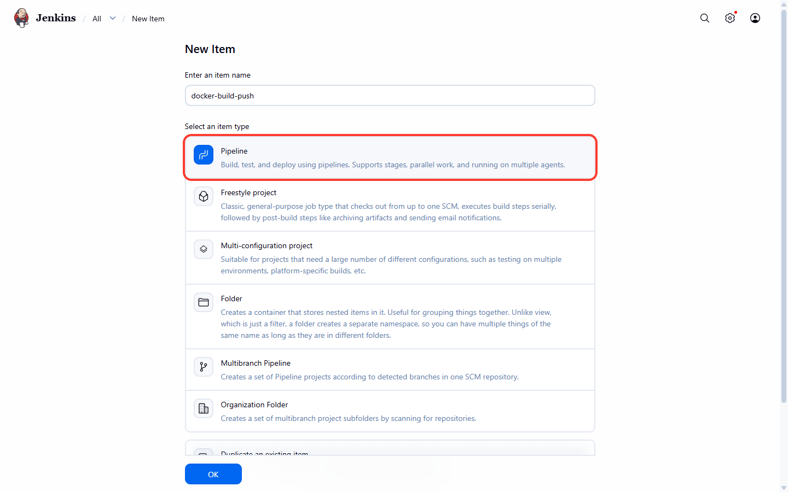

*ภาพที่ 11 สร้าง job ชนิด Pipeline ชื่อ `docker-build-push`*

2. ในส่วน **Pipeline** คง Definition เป็น **Pipeline script** แล้ววางเนื้อหาของ `$LAB/Jenkinsfile` ทั้งไฟล์ → **Save**

```bash
cat "$LAB/Jenkinsfile"
```

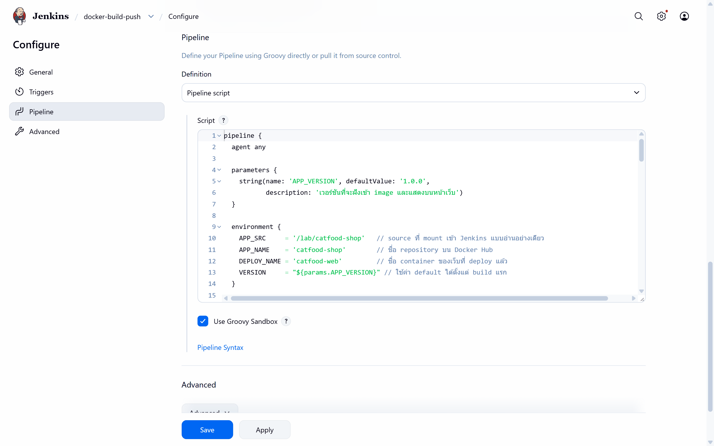

*ภาพที่ 12 Jenkinsfile ใน editor เริ่มจากบล็อก `parameters` และ `environment`*

3. กด **Build Now** (build แรกใช้ค่า default `APP_VERSION=1.0.0`)

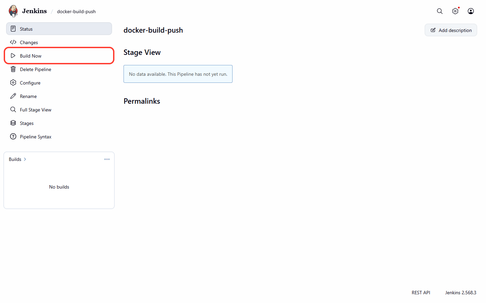

*ภาพที่ 13 เมนู Build Now ของ job — หลัง build แรก เมนูจะเปลี่ยนเป็น Build with Parameters*

4. รอให้ build จบ แล้วเปิด **Pipeline Overview** ของ build #1

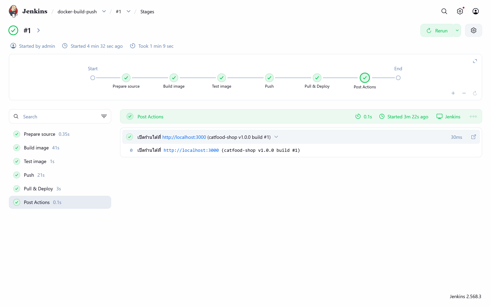

*ภาพที่ 14 build #1 ผ่านครบทั้ง 5 stage ในเวลา 23 วินาที*

✅ **ผลการทดลองจริง:**

```bash
curl -fsS -u admin:admin2569 'http://localhost:8080/job/docker-build-push/lastBuild/api/json?tree=number,result,duration'; echo
```

```json
{"_class":"org.jenkinsci.plugins.workflow.job.WorkflowRun","duration":23847,"number":1,"result":"SUCCESS"}
```

| Stage | เวลาจริง |
|---|---:|
| Prepare source | 0.33 s |
| Build image | 6 s |
| Test image | 1 s |
| Push | 11 s |
| Pull & Deploy | 3 s |

> 🔍 **วิเคราะห์ผล:** stage `Build image` ใช้เพียง 6 วินาทีเพราะเราเคย build Dockerfile เดียวกันไว้แล้วในการทดลองที่ 4 ใน console จะเห็นว่าขั้นที่ 2–20 เป็น `Using cache` มีเพียงขั้นที่ 21 (`ENV APP_VERSION=... BUILD_NUMBER=...`) ที่ต้องสร้างใหม่ เพราะค่า build-arg เปลี่ยน ข้อความ `DEPRECATED: The legacy builder...` ที่ขึ้นตอนต้นมาจาก Docker CLI ใน Jenkins ที่ไม่มี buildx เป็นคำเตือน ไม่ใช่ error

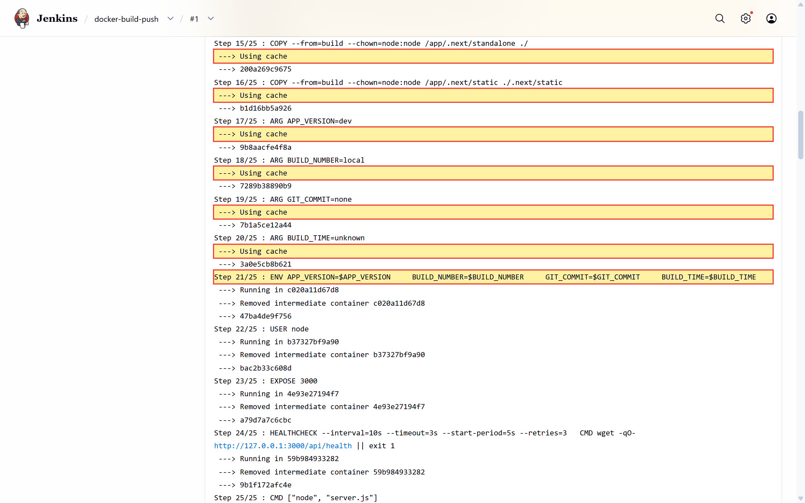

*ภาพที่ 15 console ของ build #1: layer ที่ไม่เปลี่ยนแสดง `Using cache` ส่วน Step 21/25 ถูกสร้างใหม่*

### การทดลองที่ 7 — Console พิสูจน์อะไรได้บ้าง?

**คำถาม:** console ของ build #1 ยืนยันการ login, push และการ pull กลับมา deploy ได้อย่างไร?

```bash
curl -fsS -u admin:admin2569 http://localhost:8080/job/docker-build-push/1/consoleText \
  | grep -E 'Masking supported|Login Succeeded|digest: sha256|Pulling from|Downloaded newer|"build":"1"|เปิดร้าน|Finished:'
```

✅ **ผลการทดลองจริง** (แทนชื่อบัญชีด้วย `<DOCKER_USER>`):

```text
Masking supported pattern matches of $DOCKER_TOKEN
Login Succeeded
1: digest: sha256:62c9549b836883cc9a25b7f010e2891c3334ded5b250ac0859b4add3380f8d08 size: 2066
latest: digest: sha256:62c9549b836883cc9a25b7f010e2891c3334ded5b250ac0859b4add3380f8d08 size: 2066
Masking supported pattern matches of $DOCKER_TOKEN
1: Pulling from <DOCKER_USER>/catfood-shop
Status: Downloaded newer image for <DOCKER_USER>/catfood-shop:1
{"status":"ok","app":"catfood-shop","version":"1.0.0","build":"1","commit":"none","builtAt":"2026-09-25T07:24:45Z","host":"a3cd6c644419"}
เปิดร้านได้ที่ http://localhost:3000 (catfood-shop v1.0.0 build #1)
Finished: SUCCESS
```

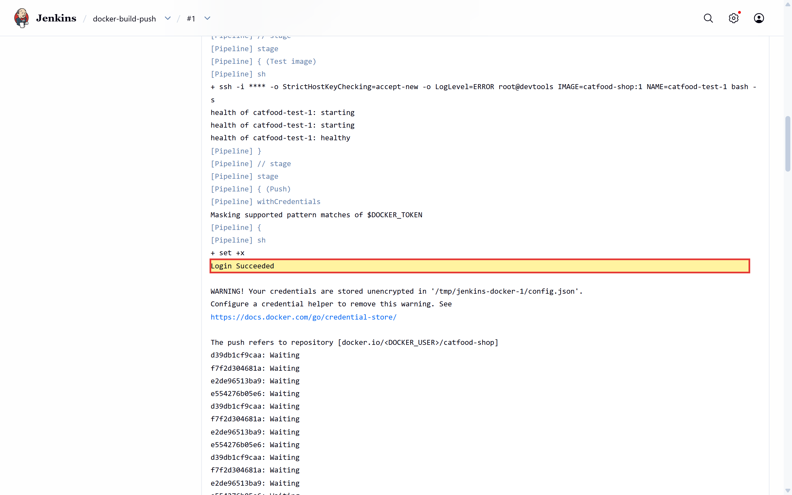

*ภาพที่ 16 `Login Succeeded` เกิดจาก `--password-stdin` โดยไม่มี token ปรากฏใน console*

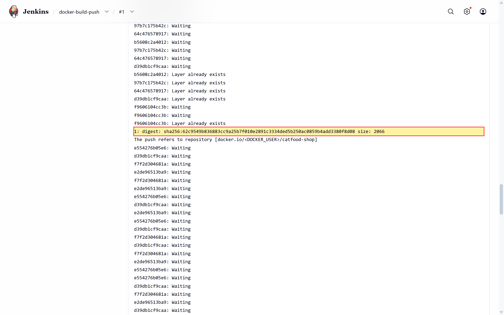

*ภาพที่ 17 tag `1` และ `latest` ได้ digest เดียวกัน `sha256:62c9549b8368…` เพราะเป็น image ตัวเดียวกัน*

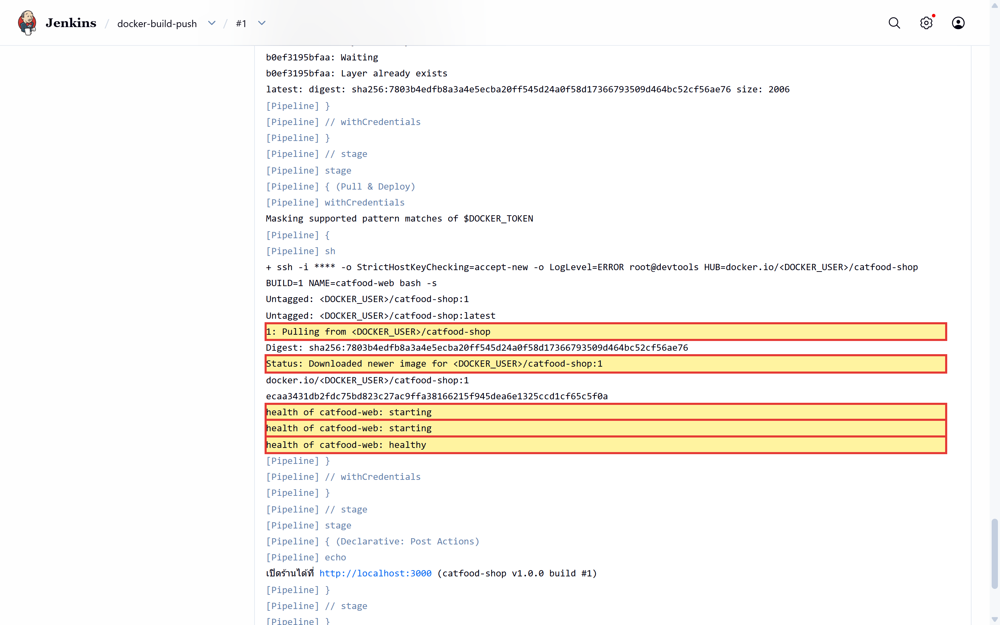

*ภาพที่ 18 stage Pull & Deploy: pull image จาก Docker Hub สร้าง `catfood-web` แล้ว `/api/health` ตอบ `"build":"1"`*

> 🔍 **วิเคราะห์ผล:** บรรทัด `curl: (7) Failed to connect` ที่อาจเห็นก่อน JSON เป็นเรื่องปกติ เพราะ `curl --retry` ยิงก่อน Next.js พร้อมรับ request แล้วลองใหม่จนสำเร็จ ส่วน `WARNING! Your credentials are stored unencrypted` หมายถึงไฟล์ config ชั่วคราวใน `mktemp -d` ซึ่ง `trap` ลบทิ้งเมื่อจบ stage

---

## ช่วง D — Docker Hub และเปิดร้านจริง

### การทดลองที่ 8 — Docker Hub เก็บอะไรไว้ และร้านทำงานอย่างไร?

**คำถาม:** digest บน Docker Hub ตรงกับ console หรือไม่ และเว็บที่ deploy แล้วมี feature อะไร?

1. เปิด `https://hub.docker.com/r/<DOCKER_USER>/catfood-shop/tags` (หรือเมนู **My Hub → Repositories → catfood-shop → Tags**)

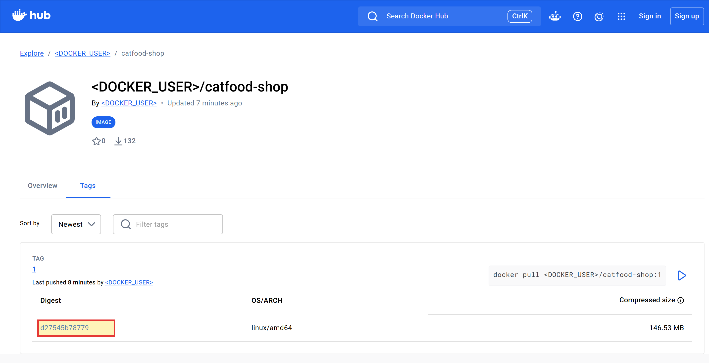

*ภาพที่ 19 Docker Hub แสดง tag `latest` และ `1` ที่มี digest `62c9549b8368` ตรงกับ console ในภาพที่ 17 ขนาดที่ต้องดาวน์โหลดคือ 73.08 MB*

ตรวจจาก terminal โดยไม่ต้อง login (พิสูจน์ว่า repository เป็น Public):

```bash
curl -fsS "https://hub.docker.com/v2/namespaces/<DOCKER_USER>/repositories/catfood-shop/tags/1" \
  | python3 -c 'import json,sys; d=json.load(sys.stdin); print(d["digest"][:19], d["last_updated"])'
```

```text
sha256:62c9549b8368 2026-09-25T07:24:59.357547Z
```

2. เปิด **http://localhost:3000** — นี่คือร้านที่ Pipeline deploy ให้ ลองใช้งานตามภาพเคลื่อนไหวด้านล่าง (ยาวประมาณ 23 วินาที)

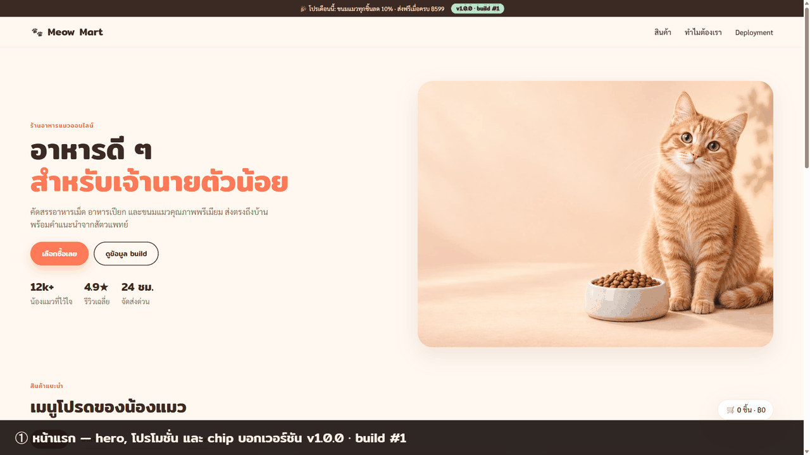

*ภาพที่ 20 สาธิตจริงบนเว็บที่ deploy แล้ว: กรองหมวดสินค้า → ใส่ตะกร้า (ตัวเลขและยอดรวมเปลี่ยนทันที) → ดู Deployment info*

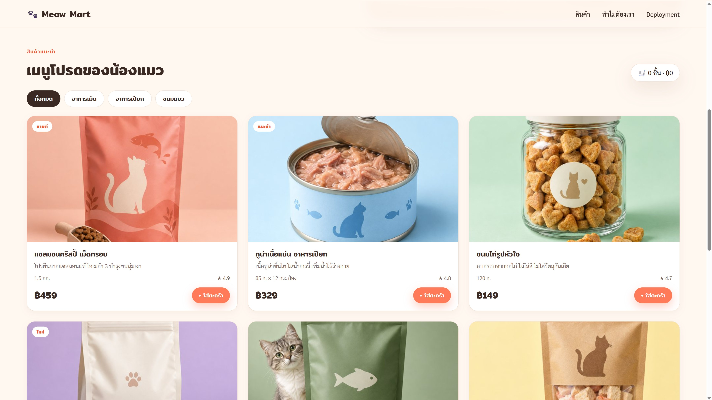

*ภาพที่ 21 รายการสินค้า 6 รายการ แต่ละการ์ดมีภาพ ป้าย ขนาด คะแนน ราคา และปุ่มใส่ตะกร้า*

**Feature ของร้าน Meow Mart**

| Feature | ทำงานที่ | ทดลองอย่างไร | ผลที่เห็นจริง |
|---|---|---|---|
| หน้าแรก + chip เวอร์ชัน | server (อ่าน env ทุก request) | เปิดหน้าแรก | `v1.0.0 · build #1` |
| ตัวกรองหมวดสินค้า | browser (React state) | คลิก “อาหารเปียก”, “ขนมแมว” | เหลือ 1 และ 2 รายการ |
| ตะกร้าสินค้า | browser | กด “+ ใส่ตะกร้า” 3 ครั้ง | `🛒 3 ชิ้น · ฿867` (149 + 259 + 459) |
| Deployment info | server | เลื่อนลงล่างสุด | version, build, commit, เวลา build, container ID |
| Health API | server | `curl http://localhost:3000/api/health` | JSON สำหรับ Pipeline ใช้ตรวจ |

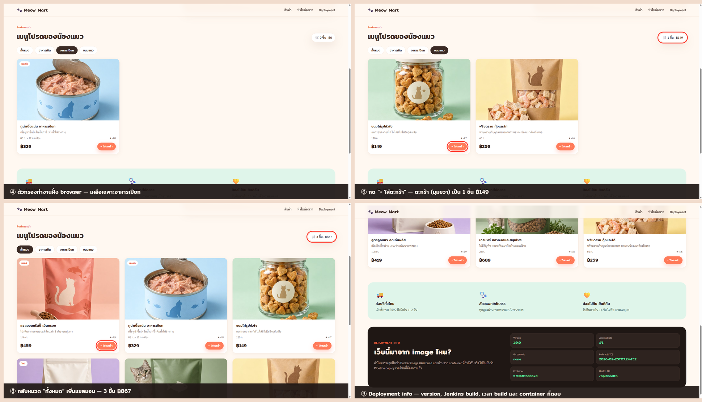

*ภาพที่ 22 (ซ้ายบน) กรองหมวดอาหารเปียก (ขวาบน) ใส่ตะกร้าชิ้นแรก (ซ้ายล่าง) ตะกร้า 3 ชิ้น ฿867 (ขวาล่าง) Deployment info*

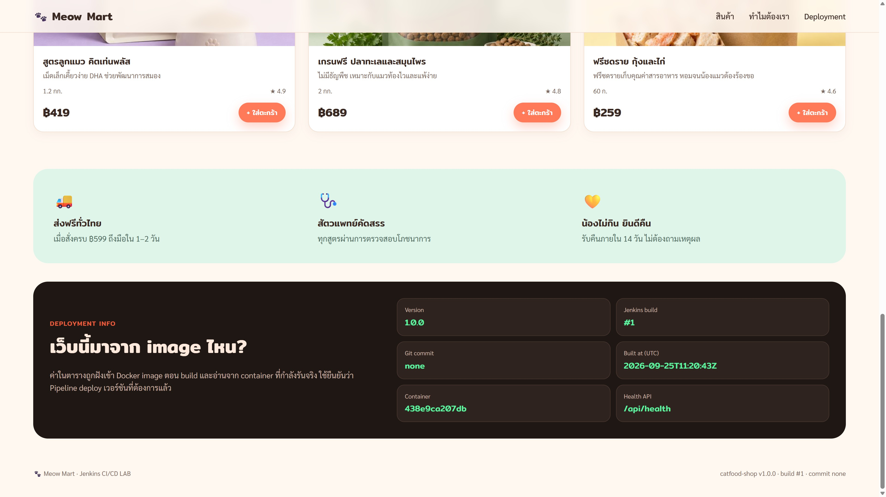

*ภาพที่ 23 ส่วน Deployment info บอกว่าเว็บนี้มาจาก image ใด: `1.0.0`, Jenkins build `#1`, เวลา build และ container ที่กำลังตอบ*

```bash
curl -s http://localhost:3000/api/health; echo
```

```json
{"status":"ok","app":"catfood-shop","version":"1.0.0","build":"1","commit":"none","builtAt":"2026-09-25T07:24:45Z","host":"a3cd6c644419"}
```

> 🔍 **วิเคราะห์ผล:** ค่า `host` คือ container ID แบบย่อของ `catfood-web` (ใน JSON ของ stage Test จะเป็นอีกค่าหนึ่ง เพราะเป็น container ชั่วคราว `catfood-test-1`) ส่วน `commit` เป็น `none` เพราะ LAB 3 ยังไม่ได้ดึงซอร์สจาก Git — LAB 4 จะทำให้ช่องนี้แสดง commit จริง

### การทดลองที่ 9 — Pull บนเครื่องที่สอง ได้ image เดียวกันจริงหรือ?

**คำถาม:** เครื่องที่ไม่เคย build และไม่มีซอร์สโค้ด จะรันร้านได้ด้วย `docker pull` เพียงอย่างเดียวหรือไม่ และได้ image ตัวเดียวกันหรือเปล่า?

ใช้ “เครื่อง B” ที่ไม่ใช่ devtools ตัวเดิม เช่น Docker Desktop บนเครื่องหลักของนักศึกษา หรือเครื่องของเพื่อน **ไม่ต้อง login** เพราะ repository เป็น Public:

```bash
docker image ls                                   # เครื่อง B ยังไม่มี image ใดเลย
S=$(date +%s%N); docker pull <DOCKER_USER>/catfood-shop:latest
echo pull_ms=$(( ($(date +%s%N) - S) / 1000000 ))
docker image inspect --format '{{index .RepoDigests 0}}' <DOCKER_USER>/catfood-shop:latest
docker run -d --name catfood-web -p 3001:3000 <DOCKER_USER>/catfood-shop:latest
curl -s http://localhost:3001/api/health; echo
```

✅ **ผลการทดลองจริง** (เครื่อง B คือ devtools-lab container ใหม่ที่ว่างเปล่า):

```text
latest: Pulling from <DOCKER_USER>/catfood-shop
f9606104cc3b: Pull complete
...                                    (รวม 8 layers)
Digest: sha256:62c9549b836883cc9a25b7f010e2891c3334ded5b250ac0859b4add3380f8d08
Status: Downloaded newer image for <DOCKER_USER>/catfood-shop:latest
docker.io/<DOCKER_USER>/catfood-shop:latest
pull_ms=9525
<DOCKER_USER>/catfood-shop@sha256:62c9549b836883cc9a25b7f010e2891c3334ded5b250ac0859b4add3380f8d08
{"status":"ok","app":"catfood-shop","version":"1.0.0","build":"1","commit":"none","builtAt":"2026-09-25T07:24:45Z","host":"5704f05da57d"}
```

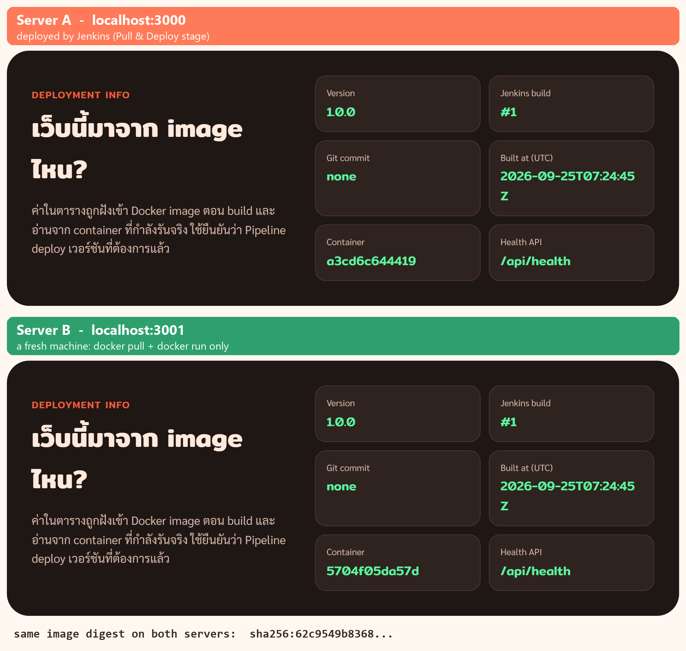

*ภาพที่ 24 Server A (deploy โดย Jenkins) และ Server B (pull อย่างเดียว) แสดง version/build/เวลา build เหมือนกันทุกช่อง ต่างกันเฉพาะ container ID*

> 🔍 **วิเคราะห์ผล:** digest บนเครื่อง B (`62c9549b…`) ตรงกับที่ Jenkins push และที่ Docker Hub แสดง จึงยืนยันได้ว่าเป็น **image ตัวเดียวกันทุกบิต** แม้แต่ `builtAt` ก็เป็นเวลาเดียวกัน เพราะค่านี้ถูกอบเข้า image ตอน build ไม่ได้สร้างใหม่ตอนรัน เครื่อง B ไม่ต้องมี Node.js, `npm` หรือซอร์สโค้ดเลย นี่คือความหมายของ *build once, run anywhere*

---

## ช่วง E — ออกเวอร์ชันใหม่และย้อนกลับ

### การทดลองที่ 10 — ออก v1.1.0: อะไรถูกสร้างใหม่และอะไรถูกใช้ซ้ำ?

**คำถาม:** เมื่อเปลี่ยนเพียงเลขเวอร์ชัน build และ push ครั้งที่สองต้องทำงานเท่าไร?

1. เปิด job `docker-build-push` แล้วเลือก **Build with Parameters**

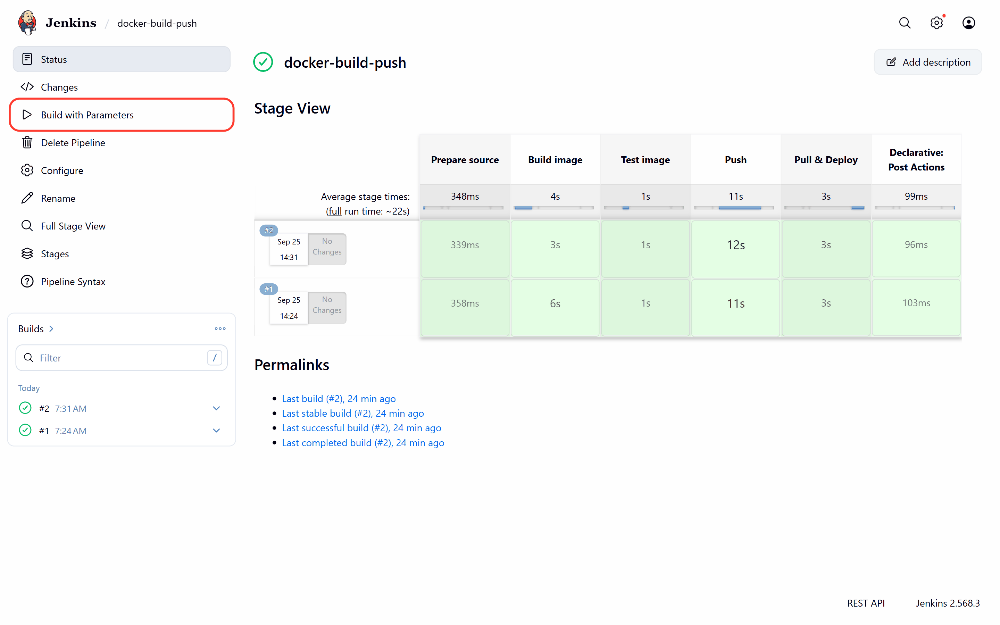

*ภาพที่ 25 หลัง build แรก Jenkins ลงทะเบียน parameter แล้ว เมนูจึงเปลี่ยนเป็น Build with Parameters*

2. กรอก `APP_VERSION` = `1.1.0` แล้วกด **Build**

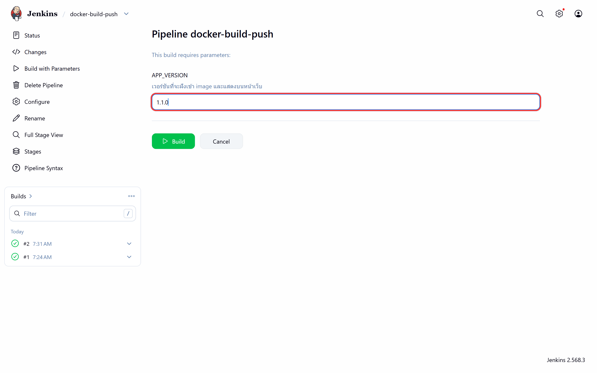

*ภาพที่ 26 เปลี่ยนเฉพาะเลขเวอร์ชัน ซอร์สโค้ดเหมือนเดิมทุกไฟล์*

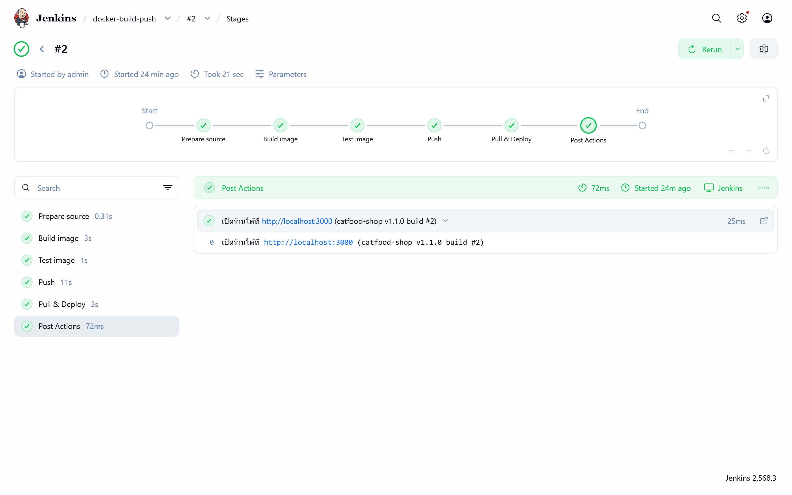

*ภาพที่ 27 build #2 ผ่านครบทุก stage*

```bash
curl -fsS -u admin:admin2569 http://localhost:8080/job/docker-build-push/2/consoleText \
  | grep -E 'Using cache|Layer already exists|Pushed|digest: sha256'   | sed -E 's/^[0-9a-f]{12}: /<layer>: /' | sort | uniq -c
curl -s http://localhost:3000/api/health; echo
```

✅ **ผลการทดลองจริง:**

```text
     17  ---> Using cache
     16 <layer>: Layer already exists
      1 2: digest: sha256:bd792e89eadbd44057d744d84c60de28296f6df1cf6d65c0b4fc420da170801c size: 2066
      1 latest: digest: sha256:bd792e89eadbd44057d744d84c60de28296f6df1cf6d65c0b4fc420da170801c size: 2066
{"status":"ok","app":"catfood-shop","version":"1.1.0","build":"2","commit":"none","builtAt":"2026-09-25T07:31:48Z","host":"d54aec9cdc67"}
```

| วัดค่า | build #1 | build #2 |
|---|---:|---:|
| ระยะเวลารวม | 23.8 s | 21.8 s |
| ขั้นที่ `Using cache` | 17 | 17 (ทุกขั้นก่อน `ENV`) |
| บรรทัด `Pushed` (layer ที่อัปโหลดใหม่) | — | **0** |
| บรรทัด `Layer already exists` | — | 16 (8 layers × 2 tags) |
| digest | `62c9549b8368…` | `bd792e89eadb…` |

> 📝 ครั้งแรกที่นักศึกษา push ขึ้น repository ว่าง layer จะขึ้นเป็น `Pushed` (อัปโหลดจริงราว 73 MB) ในการทดลองของผู้เขียน build #1 ก็แสดง `Layer already exists` เช่นกัน เพราะเคย push layer ชุดเดียวกันไว้ก่อนหน้า ซึ่งเป็นหลักฐานอีกข้อว่า registry เก็บ layer แบบไม่ซ้ำ (content-addressable)

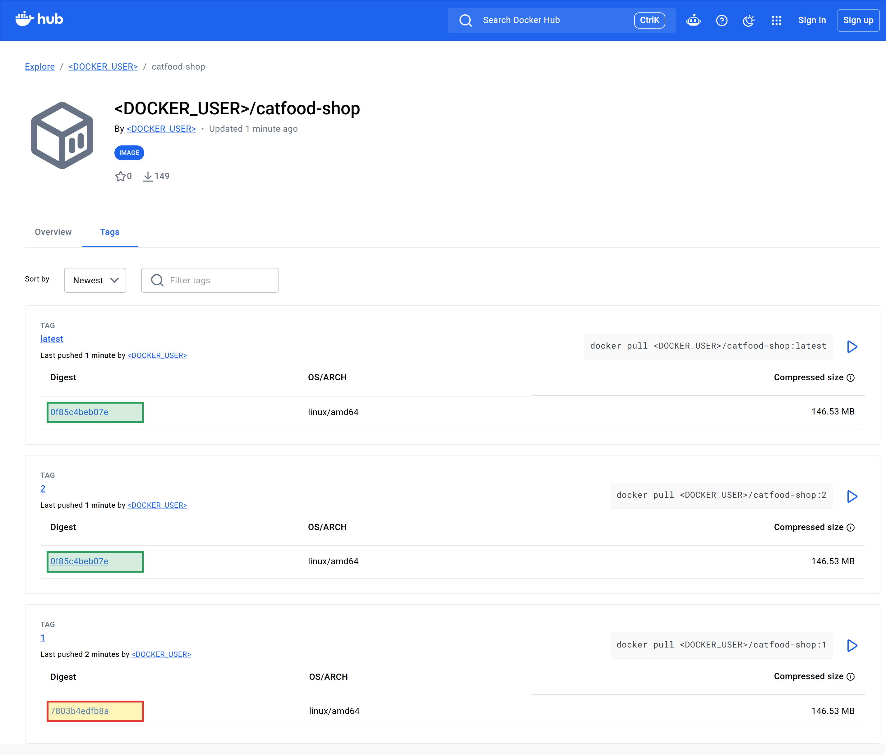

*ภาพที่ 28 tag `latest` ย้ายมาชี้ digest ใหม่ `bd792e89eadb` (กรอบเขียว) เหมือน tag `2` ส่วน tag `1` ยังชี้ `62c9549b8368` (กรอบแดง) เหมือนเดิม*

> 🔍 **วิเคราะห์ผล:** การเปลี่ยน `ENV` ไม่สร้าง layer ของระบบไฟล์ใหม่ มีเพียง image config และ manifest ที่เปลี่ยน digest จึงเปลี่ยน แต่ข้อมูลที่ต้องอัปโหลดแทบเป็นศูนย์ นี่คือผลของการวาง `ARG/ENV` ที่เปลี่ยนบ่อยไว้ท้าย Dockerfile ถ้าย้ายสองบรรทัดนี้ไปไว้ต้นไฟล์ ทุก layer หลังจากนั้น (`npm ci`, `next build`) จะต้องสร้างใหม่ทุกครั้ง

### การทดลองที่ 11 — Rollback ใช้เวลาเท่าไร?

**คำถาม:** ถ้า v1.1.0 มีปัญหา จะย้อนกลับไป v1.0.0 ได้เร็วแค่ไหน?

เพราะ image ของทุกเวอร์ชันยังอยู่บน Docker Hub การ rollback จึงเป็นแค่การรัน container จาก tag เก่า ไม่ต้อง build ใหม่:

```bash
S=$(date +%s%N)
docker rm -f catfood-web
docker run -d --name catfood-web --restart unless-stopped --network cicd-net \
  -p 3000:3000 docker.io/<DOCKER_USER>/catfood-shop:1
until curl -fs http://localhost:3000/api/health >/dev/null; do sleep 0.2; done
echo rollback_ms=$(( ($(date +%s%N) - S) / 1000000 ))
curl -s http://localhost:3000/api/health; echo
```

✅ **ผลการทดลองจริง:**

```text
catfood-web
2c0227e1fee3417a94239b8dbcd4fa365835aa09355f9936211e02d3fa180a44
rollback_ms=1156
{"status":"ok","app":"catfood-shop","version":"1.0.0","build":"1","commit":"none","builtAt":"2026-09-25T07:24:45Z","host":"2c0227e1fee3"}
```

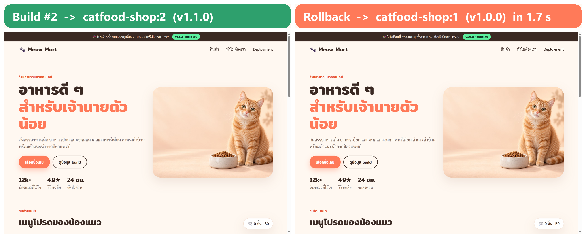

*ภาพที่ 29 ซ้าย: หลัง build #2 chip แสดง `v1.1.0 · build #2` ขวา: หลัง rollback เหลือ `v1.0.0 · build #1` ภายใน 1.2 วินาที*

> 🔍 **วิเคราะห์ผล:** rollback เร็วเพราะ image `:1` ยังอยู่ใน cache ของเครื่อง ถ้าไม่มี Docker จะ pull จาก Docker Hub ให้อัตโนมัติ (ใช้เวลาเพิ่มราว 10 วินาทีตามผลการทดลองที่ 9) สังเกตว่า tag `latest` บน Docker Hub ยังชี้ build #2 อยู่ การ rollback แบบนี้จึงเป็นการแก้ชั่วคราวที่ต้องบันทึกไว้ให้ทีมรู้

**Roll forward กลับสู่เวอร์ชันล่าสุด** แล้วตรวจจบแล็บ:

```bash
docker pull docker.io/<DOCKER_USER>/catfood-shop:latest
docker rm -f catfood-web
docker run -d --name catfood-web --restart unless-stopped --network cicd-net \
  -p 3000:3000 docker.io/<DOCKER_USER>/catfood-shop:latest
cd "$LAB" && DOCKER_USER='<DOCKER_USER>' bash check.sh
```

✅ **ผลการทดลองจริง:**

```text
[PASS] jenkins ใช้ image jenkins-docker:2569
[PASS] jenkins mount Docker socket แล้ว
[PASS] jenkins mount source ร้านอาหารแมวที่ /lab/catfood-shop
[PASS] Jenkins Credentials API พบ id dockerhub
[PASS] docker-build-push build #2 = SUCCESS
[PASS] console มี push digest sha256:bd792e89eadb...
[PASS] Docker Hub tag 2 มี digest ตรงกับ console
[PASS] tag latest ชี้ไปที่ build ล่าสุด
[PASS] anonymous client อ่าน manifest ได้ (repository เป็น Public)
[INFO] catfood-web image: docker.io/<DOCKER_USER>/catfood-shop:latest
[INFO] health: {"status":"ok","app":"catfood-shop","version":"1.1.0","build":"2",...}
[PASS] catfood-web รันจาก image ที่ pull มาจาก Docker Hub
[PASS] http://localhost:3000 ตอบ build #2
[INFO] Docker token pattern count: 0
[PASS] ไม่พบรูปแบบ Docker Hub token ในไฟล์แล็บหรือ console
[INFO] retained Docker auth entry count: 0
[PASS] ไม่พบ Docker auth entry ค้างใน jenkins container
ผลรวม: PASS
```

> 📝 ถ้ารัน `check.sh` ระหว่างที่ยัง rollback อยู่ จะได้ `[FAIL] http://localhost:3000 ยังไม่ใช่ build #2` — ตัวตรวจจับได้ว่าเว็บไม่ได้รันเวอร์ชันล่าสุด ซึ่งเป็นพฤติกรรมที่ถูกต้อง

---

## 📊 สรุปผลการทดลอง

| # | คำถาม | ผลจริง | ข้อสรุป |
|---|---|---|---|
| 1 | Jenkins เดิมสั่ง Docker ได้ไหม | `docker: not found`, exit 127 | ต้องเพิ่ม Docker CLI |
| 2–3 | เปลี่ยน image แล้วงานเดิมหายไหม | `first-pipeline` ยังอยู่ | state อยู่ใน volume ไม่ใช่ container |
| 4 | multi-stage คุ้มไหม | 305 MB vs 2.39 GB | เล็กลง ~8 เท่า |
| 5–7 | Pipeline ทำงานครบไหม | SUCCESS ใน 23.8 s, digest `62c9549b…` | build → test → push → pull → deploy อัตโนมัติ |
| 8 | Docker Hub ตรงกับ console ไหม | digest ตรงกัน, repository Public | ตรวจย้อนได้ด้วย digest |
| 9 | เครื่องอื่นรันได้ไหม | pull 9.5 s, digest เดียวกัน | build once, run anywhere |
| 10 | build ใหม่ทำงานซ้ำแค่ไหน | 17 ขั้นใช้ cache, 0 layer ต้องอัปโหลด | ลำดับ Dockerfile มีผลต่อความเร็ว |
| 11 | rollback เร็วแค่ไหน | 1.2 วินาที | image ทุกเวอร์ชันคือจุดย้อนกลับ |

## แก้ปัญหาที่พบบ่อย

| อาการ | สาเหตุ | วิธีแก้ |
|---|---|---|
| `docker: not found` ใน Pipeline | Jenkins ยังใช้ image เดิม | `docker inspect -f '{{.Config.Image}}' jenkins` แล้วทำการทดลองที่ 2–3 ใหม่ |
| `cp: cannot stat '/lab/catfood-shop'` | ไม่ได้ mount source ตอนสร้าง `jenkins` | สร้าง container ใหม่ด้วยคำสั่งในการทดลองที่ 3 (ต้องมี `-v "$LAB/catfood-shop:/lab/catfood-shop:ro"`) |
| เว็บขึ้น `vdev` แทนเวอร์ชัน | Jenkinsfile ไม่มี `VERSION = "${params.APP_VERSION}"` | ใช้ Jenkinsfile ของแล็บ build แรกของ job ยังไม่มี `$APP_VERSION` ใน shell |
| `401 Unauthorized` / `denied: requested access` | token ผิด หมดอายุ ไม่มีสิทธิ์ Write หรือ username ไม่ตรง | สร้าง token Read & Write ใหม่แล้วแก้ credential `dockerhub` |
| `429 Too Many Requests` | Docker Hub rate limit | login ก่อน build, รอ แล้วลดความถี่ในการสั่ง build |
| `Bind for 0.0.0.0:3000 failed: port is already allocated` | มี container อื่นใช้ port 3000 | `docker ps --filter publish=3000` แล้วลบตัวที่ไม่ใช้ |
| เปิด `localhost:3000` จากเครื่องหลักไม่ได้ | devtools ไม่ได้ publish port 3000 | สร้าง devtools ใหม่ด้วยคำสั่ง canonical ที่มี `-p 3000:3000` |
| หน้า Tags บน Docker Hub ว่าง / 404 | repository เป็น Private หรือ URL ผิด | ตั้ง `catfood-shop` เป็น Public แล้ว refresh |
| `check.sh` บอก `ยังไม่ใช่ build #N` | ยังอยู่ในสถานะ rollback | roll forward ด้วย `:latest` ตามท้ายการทดลองที่ 11 |

## สรุป

LAB 3 เปลี่ยน Jenkins ให้เป็น “โรงงานผลิต image” ที่ครบวงจร: สร้าง image ของร้านแบบ multi-stage ทดสอบก่อนปล่อย push ขึ้น Docker Hub แล้ว pull กลับมา deploy เป็นเว็บจริง ผลการทดลองยืนยันว่า image ที่ได้เล็กลงราว 8 เท่า ย้ายไปรันเครื่องอื่นได้ด้วย digest เดียวกัน ออกเวอร์ชันใหม่โดยไม่ต้องอัปโหลด layer ซ้ำ และ rollback ได้ในเวลาราว 1 วินาที

ข้อจำกัดที่เหลืออยู่คือซอร์สโค้ดยังมาจากโฟลเดอร์ที่ mount ไว้ และต้องกด Build เอง **LAB 4** จะย้ายซอร์สร้านเดียวกันนี้ขึ้น GitHub ให้ Jenkins อ่าน `Jenkinsfile` จาก repository และ build ใหม่อัตโนมัติทุกครั้งที่มี commit
