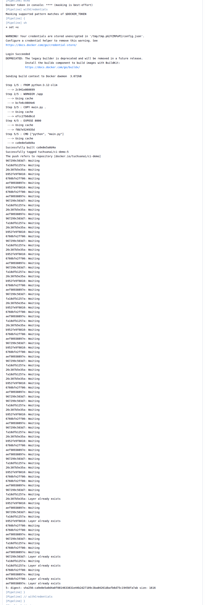
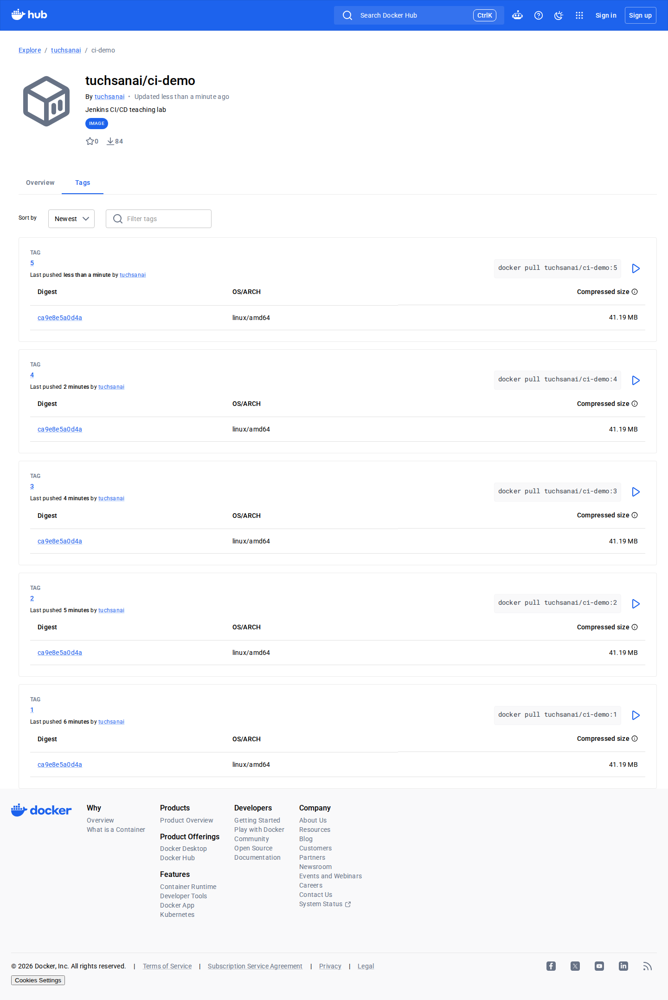

# LAB 3 — Docker Build & Push ขึ้น Docker Hub จริง

แล็บ 45 นาทีนี้ตอบคำถามว่า Jenkins ที่รันใน Docker จะ build image, ตรวจว่าแอปตอบจริง และ push tag ตาม `BUILD_NUMBER` ขึ้น Docker Hub ของเราได้อย่างไร เมื่อจบแล้วจะตรวจหลักฐานได้ทั้งจาก Jenkins console และหน้า Tags สาธารณะ

> **Prerequisite ก่อนคาบ (ทำล่วงหน้าอย่างน้อย 24 ชั่วโมง):** สมัคร Docker Hub และยืนยันอีเมล จากนั้นไปที่ **Account Settings → Personal access tokens** สร้าง Access Token สิทธิ์ **Read & Write** แล้วสร้าง repository `ci-demo` เป็น **Public** บนเว็บ ห้ามใช้ token กลางของผู้สอน; ถ้ายังไม่พร้อมให้จับคู่สังเกตการณ์และกลับมาทำ make-up ด้วยบัญชีตนเอง
>
> ตรวจความพร้อมโดยแทน placeholder เฉพาะใน shell (อย่าบันทึก token ลงไฟล์):
>
> ```bash
> echo '<DOCKER_TOKEN>' | docker login -u '<DOCKER_USER>' --password-stdin && docker logout
> curl -fsS -o /dev/null -w 'HTTP %{http_code}\n' 'https://hub.docker.com/r/<DOCKER_USER>/ci-demo'
> ```
>
> ต้องเห็น `Login Succeeded` และ `HTTP 200` ก่อนเริ่มคาบ

## ทฤษฎีก่อนลงมือ

Docker-outside-of-Docker (DooD) คือให้ Jenkins container ใช้ Docker daemon ตัวเดิมผ่าน `/var/run/docker.sock` จึง build และรัน sibling container ได้ ส่วน Docker-in-Docker (DinD) เปิด daemon ซ้อนใน container อีกชั้น แล็บนี้ใช้ DooD เพราะต้องการใช้ image cache, network และ lifecycle ชุดเดียวกับ service ภายใน devtools โดยไม่เพิ่ม daemon อีกตัว รายละเอียดภาพรวมดู slide ตอนที่ 3

Jenkins image เดิมเน้นรัน Jenkins จึงไม่มี Docker CLI ต่อให้ mount socket ก็ยังส่งคำสั่งไม่ได้ เราจึง build `jenkins-docker:2569` จาก `Dockerfile.jenkins` โดยเพิ่ม Docker apt repository และติดตั้ง `docker-ce-cli` แล้วคง `USER root` เพื่อเข้าถึง socket ในท่าแล็บนี้

งาน, ผู้ใช้, plugin และ build history อยู่ใน named volume `jenkins_home` ไม่ได้อยู่ใน writable layer ของ container ดังนั้นเราลบ container เดิมแล้วสร้างจาก image ใหม่โดย mount volume ชื่อเดิมได้ สถานะ Jenkins จึงยังอยู่ครบ นี่คือจุดต่างระหว่าง lifecycle ของ container กับ persistent state

Jenkins Credentials store เก็บข้อมูลลับแยกจาก Jenkinsfile แล้ว inject ให้ stage ที่ต้องใช้ผ่าน `withCredentials` การ masking ช่วย **ลดการหลุดโดยไม่ตั้งใจใน console แต่ไม่รับประกันว่าจะปิดบังได้ทุกกรณี** จึงยังต้องใช้ Groovy single-quoted shell, `set +x`, `--password-stdin` และ `DOCKER_CONFIG` ชั่วคราว รายละเอียด credential และการ push ดู slide ตอนที่ 5

> **Safety:** การ mount Docker socket ให้ Jenkins มีอำนาจใกล้เคียง root ของ inner host และ `-u root` ยิ่งขยายผลกระทบ ใช้เฉพาะแล็บ disposable เท่านั้น; production ควรแยก build agent, จำกัดสิทธิ์/เครือข่าย และจัดการ config ด้วยแนวทาง least privilege. Token ใช้เพียง Read/Write (ไม่ใช้ Delete/Admin) และ revoke หลังคาบได้ทันที

## 🎯 แล็บนี้ใน 30 วินาที

- สังเกตว่า Jenkins image เดิมยังไม่มี Docker CLI
- build `jenkins-docker:2569` และ recreate โดยใช้ `jenkins_home` เดิมพร้อม socket
- เพิ่ม credential `dockerhub` แล้วสร้าง Pipeline จาก Jenkinsfile
- build, push, smoke test และอ่านหลักฐาน digest จาก console
- เปิด Docker Hub Tags เพื่อเห็น tag ของ build นี้จริง

## สภาพตั้งต้น

ต้องมีสถานะจบ LAB 2: devtools ยังทำงาน, network `cicd-net`, container `jenkins` และ volume `jenkins_home` ต้องอยู่ โดย job/user เดิมพร้อมใช้งาน

```bash
docker ps --format '{{.Names}}\t{{.Status}}'
```

✅ **สิ่งที่ต้องเห็น** :

```text
jenkins    Up ...
```

> ยังไม่มี? ย้อนไปทำ [LAB 2](../002_LAB_Declarative_Pipeline/README.md) ก่อน (ใช้เวลา ~30 นาที) หรือกู้สถานะด้วย `bash tools/bootstrap/up_to_lab2.sh`

## การทดลองที่ 1 — Jenkins เห็น Docker ไหม?

**คำถาม:** Jenkins container จาก LAB 2 มี Docker CLI ให้เรียกแล้วหรือยัง?

```bash
docker exec jenkins sh -c 'docker version'
printf 'exit=%s\n' "$?"
```

✅ **สิ่งที่ต้องเห็น** :

```text
sh: 1: docker: not found
exit=127
```

> 📝 นี่คือการสังเกต capability ของ image ปัจจุบัน ไม่ใช่ปัญหาของ socket เพราะยังไม่ได้ติดตั้งคำสั่ง `docker` เลย

## การทดลองที่ 2 — จะเพิ่ม Docker CLI ให้ Jenkins อย่างไร?

**คำถาม:** image ใหม่ติดตั้ง Docker CLI จาก apt repository ของ Docker และยังรันเป็น root ได้หรือไม่?

```bash
docker build -t jenkins-docker:2569 -f 003_LAB_Docker_Build_Push/Dockerfile.jenkins 003_LAB_Docker_Build_Push
docker run --rm --entrypoint docker jenkins-docker:2569 --version
```

✅ **สิ่งที่ต้องเห็น** :

```text
Docker version 29.7.2, build a7dcaa6
```

## การทดลองที่ 3 — เปลี่ยน image แล้ว state เดิมยังอยู่ไหม?

**คำถาม:** เมื่อ recreate Jenkins ด้วย volume เดิม งานและผู้ใช้จาก LAB 2 ยังอยู่ครบหรือไม่?

```bash
docker rm -f jenkins && docker run -d --name jenkins --restart unless-stopped --network cicd-net -p 8080:8080 -u root -e JAVA_OPTS=-Djenkins.install.runSetupWizard=false -v jenkins_home:/var/jenkins_home -v /var/run/docker.sock:/var/run/docker.sock jenkins-docker:2569
curl -fsS -u admin:admin2569 http://localhost:8080/job/first-pipeline/api/json | grep -o '"name":"first-pipeline"'
```

✅ **สิ่งที่ต้องเห็น** :

```text
"name":"first-pipeline"
```

เปิด `http://localhost:8080` แล้วลงชื่อเข้าใช้ด้วย `admin / admin2569`: ต้องเห็น job `first-freestyle`, `first-pipeline` และ build history เดิม

> 📝 ถ้า curl เร็วเกินไป ให้รอหน้า `/login` ตอบก่อน Jenkins อาจใช้เวลาประมาณ 20–40 วินาทีหลัง recreate

## การทดลองที่ 4 — Docker ทำงานจากใน Pipeline หรือไม่?

**คำถาม:** Jenkins agent เรียกทั้ง Docker client และ daemon ผ่าน socket ได้จริงหรือไม่?

รัน UI automation ของบทเรียน ซึ่งสร้าง job `docker-version-check`, กด Build และ assert console:

```bash
JENKINS_BASE_URL=http://localhost:8080 python3 tools/ui/lab3_docker_version.py
```

✅ **สิ่งที่ต้องเห็น** :

```text
[ui]... assert: docker version reports both client and server
[ui]... PASS
```

## การทดลองที่ 5 — จะให้ Jenkins ใช้ token โดยไม่เขียนใน Jenkinsfile อย่างไร?

**คำถาม:** credential แบบ Username with password และ id `dockerhub` ถูกเก็บใน Global domain แล้วหรือไม่?

ใน Jenkins ไปที่ **Manage Jenkins → Credentials → System → Global credentials (unrestricted) → Add Credentials** แล้วเลือก **Username with password**:

- Username: `<DOCKER_USER>`
- Password: `<DOCKER_TOKEN>`
- ID: `dockerhub`
- กด **Create**

สำหรับการทดสอบอัตโนมัติ ใช้สคริปต์เดียวกับเส้นทาง UI นี้:

```bash
JENKINS_BASE_URL=http://localhost:8080 DOCKER_USER='<DOCKER_USER>' DOCKER_TOKEN='<DOCKER_TOKEN>' python3 tools/ui/lab3_credential.py
```

✅ **สิ่งที่ต้องเห็น** :

```text
[ui]... assert: credential id dockerhub is listed
[ui]... PASS
```

> 📝 Jenkins masking ลด accidental disclosure เท่านั้น ห้าม `echo` token, `printenv`, archive workspace หรือเก็บ Docker config เป็น artifact

## การทดลองที่ 6 — Pipeline จะ build และ push แบบปลอดภัยขึ้นอย่างไร?

**คำถาม:** Pipeline จาก `Jenkinsfile` ใช้ credential เฉพาะ stage, login ก่อน build และล้าง Docker config เสมอหรือไม่?

ใน Jenkins กด **New Item → Pipeline**, ตั้งชื่อ `docker-build-push`, เลือก **Pipeline script**, วางเนื้อหา `003_LAB_Docker_Build_Push/Jenkinsfile` ตรงตัว แล้วกด **Save → Build Now** หรือใช้ UI automation:

```bash
JENKINS_BASE_URL=http://localhost:8080 python3 tools/ui/lab3_job.py
```

✅ **สิ่งที่ต้องเห็น** :

```text
Prepare app       SUCCESS
Build & Push      SUCCESS
Smoke test        SUCCESS
```


## การทดลองที่ 7 — Console พิสูจน์อะไรได้บ้าง?

**คำถาม:** build ล่าสุดแสดง login ที่ถูก mask, layer push, digest และผล smoke testครบหรือไม่?

```bash
curl -fsS -u admin:admin2569 http://localhost:8080/job/docker-build-push/lastBuild/consoleText | grep -E 'Login Succeeded|\*\*\*\*|Pushed|digest: sha256:|ci-demo is ready|Finished:'
```

✅ **สิ่งที่ต้องเห็น** :

```text
Docker token in console: **** (masking is best-effort)
Masking supported pattern matches of $DOCKER_TOKEN
Login Succeeded
... docker.io/<DOCKER_USER>/ci-demo:...
... digest: sha256:...
ci-demo is ready
Finished: SUCCESS
```



## การทดลองที่ 8 — Tag นี้ขึ้น Docker Hub จริงหรือไม่?

**คำถาม:** หน้า public Tags แสดง `BUILD_NUMBER` ของ build ที่เพิ่งจบหรือไม่?

```bash
BUILD_NUMBER=$(curl -fsS -u admin:admin2569 'http://localhost:8080/job/docker-build-push/lastBuild/api/json?tree=number' | python3 -c 'import json,sys; print(json.load(sys.stdin)["number"])')
printf 'เปิด https://hub.docker.com/r/<DOCKER_USER>/ci-demo/tags แล้วหา tag %s\n' "$BUILD_NUMBER"
```

✅ **สิ่งที่ต้องเห็น** :

```text
Tags    <BUILD_NUMBER>    ...    sha256:...
```



ตรวจจบแล็บจาก shell ใหม่โดยไม่ต้องส่ง token ให้ตัวตรวจ:

```bash
cd 003_LAB_Docker_Build_Push
DOCKER_USER=<id> bash check.sh
```

ผลที่ถูกต้องคือ `[PASS]` ทุกบรรทัด, pattern count เป็น 0 และ `ผลรวม: PASS`

## แก้ปัญหาที่พบบ่อย

| อาการ | สาเหตุ | วิธีแก้ |
|---|---|---|
| `401 Unauthorized` | token ผิด, หมดอายุ หรือถูก revoke | สร้าง PAT Read/Write ใหม่ใน Account Settings แล้วอัปเดต credential `dockerhub`; ทดสอบด้วย `--password-stdin` โดยไม่พิมพ์ token |
| `denied: requested access` | namespace/repo ผิด หรือ token ไม่มี Write | ตรวจ `printf 'namespace=%s\n' "$DOCKER_USER"`, ชื่อ public repo `ci-demo` และสิทธิ์ PAT |
| `429 ... pull rate limit` | quota pull image ของบัญชี/เครือข่ายเต็ม | ยืนยันว่า login เกิดก่อน `docker build`, รอ reset ตามข้อความ และคง Docker volume/cache |
| `429 Too Many Requests` แบบไม่มีข้อความ pull limit | Docker Hub abuse limit | หยุด loop/retry ถี่ ๆ แล้ว backoff ก่อนลองใหม่ ไม่สร้าง polling script รัว ๆ |
| หน้า Tags 404 หรือว่าง | repo เป็น private, URL/username ผิด หรือหน้า UI ยัง sync | ตรวจว่า `ci-demo` เป็น Public, เปิด URL canonical และลอง refresh หลัง API เห็น tag |
| `docker: not found` ใน Pipeline | Jenkins ยังใช้ image เก่า | ตรวจ `docker inspect -f '{{.Config.Image}}' jenkins` แล้วทำการทดลองที่ 2–3 ใหม่ |
| Jenkins เปิดไม่ขึ้นหลัง recreate | service ยังเริ่มไม่เสร็จหรือ mount/port ผิด | `docker logs --tail 50 jenkins` แล้วเทียบคำสั่ง canonical ในการทดลองที่ 3 |
| restart devtools แล้ว service หาย | outer container ไม่ได้ใช้ `--tmpfs /run` หรือ inner service ไม่มี restart policy | `docker start devtools-jenkins`, รอ ~20 วินาที แล้ว `docker ps`; ถ้าต้องกู้ให้รัน `bash tools/bootstrap/up_to_lab2.sh` ก่อนทำ LAB 3 ต่อ |
