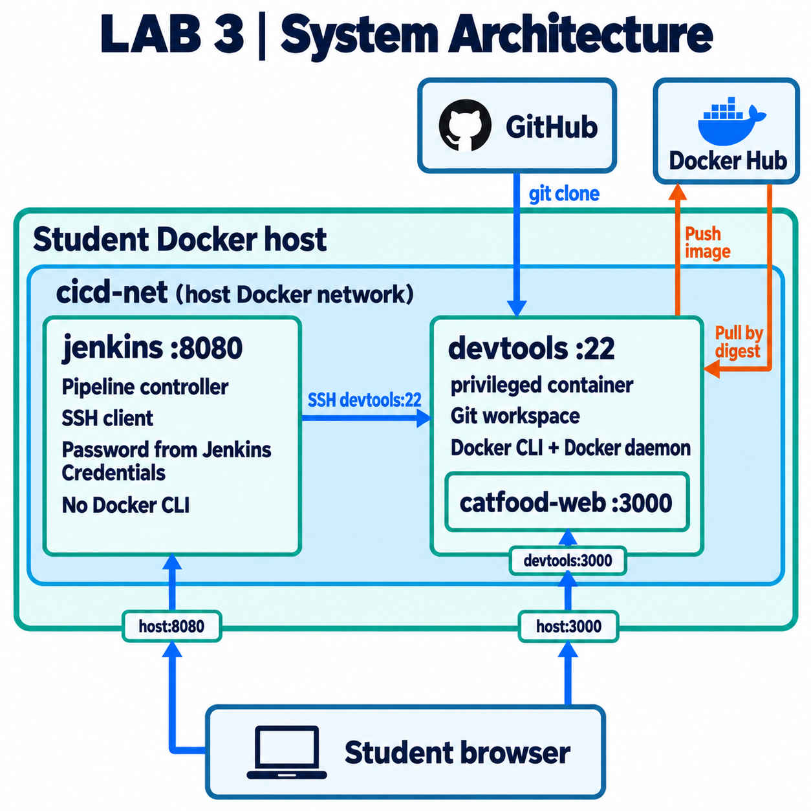
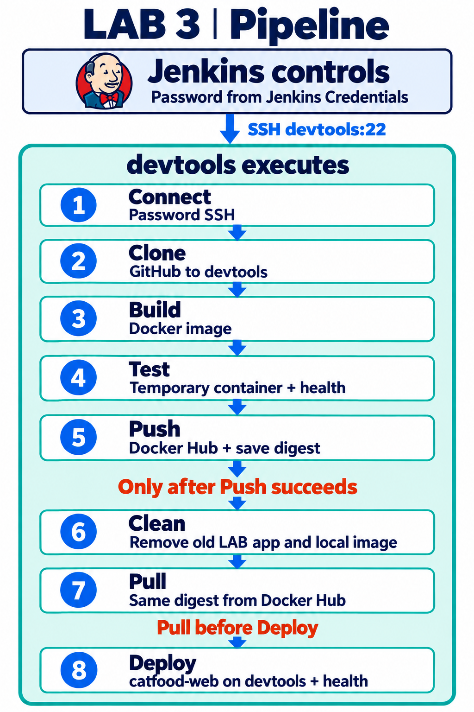
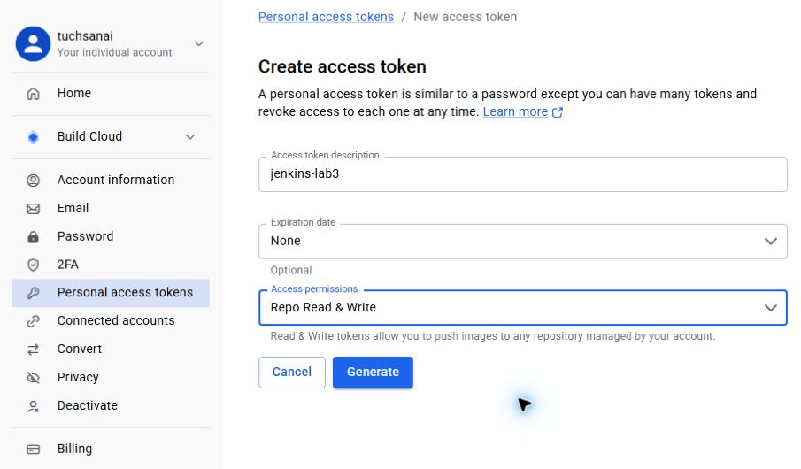
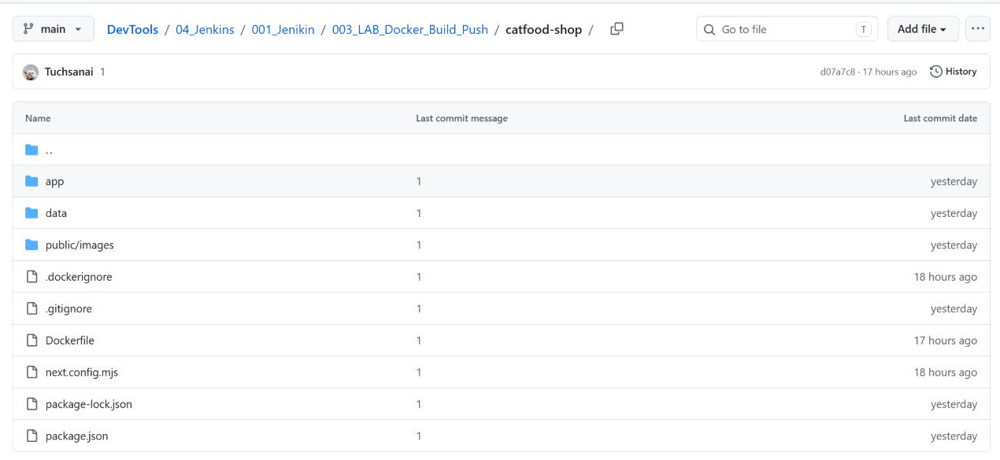
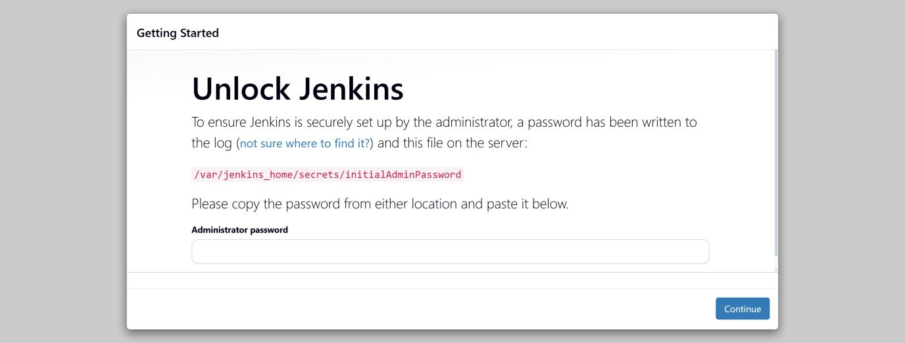

# LAB 3 — Jenkins สั่ง devtools ผ่าน SSH: Connect → Clone → Build → Test → Push → Clean → Pull → Deploy ร้านอาหารแมว

> ⏱️ ประมาณ 50–60 นาที · 🧪 9 ขั้น · 🎯 จบเมื่อกด **Build** ใน Jenkins แล้วเปิด `http://localhost:3000` เห็นร้าน **Meow Mart** เวอร์ชันที่ Pipeline เพิ่ง build, push ขึ้น Docker Hub, pull กลับตาม digest และ deploy และผ่านรายการ **✅ ตรวจปิดแล็บ** ครบทุกข้อ

แล็บนี้ตอบคำถามว่า **“Jenkins ที่ไม่มี Docker อยู่ข้างในเลย จะ build → test → push → deploy ได้อย่างไร”** บนเครื่องของเรามี container พี่น้อง (sibling) สองตัวอยู่บน network `cicd-net` เดียวกัน `jenkins` เป็น **ผู้สั่ง** ส่วน `devtools` เป็น **ผู้ทำ** Jenkins SSH ไปที่ `devtools:22` ด้วยรหัสผ่านจาก Jenkins Credentials แล้วส่งสคริปต์ไปรันทีละ stage คำสั่ง `git clone` และ `docker build/run/push/pull` ทั้งหมดจึงรันบน `devtools` และร้านเปิดเป็น container `catfood-web` บน Docker ของ `devtools`

> **กติกาของแล็บ:** นักศึกษาไม่พิมพ์ `docker build`, `docker push` หรือ `git clone` ของร้านเอง ทุกอย่างเริ่มจากปุ่มบน Jenkins · `jenkins` เป็น image มาตรฐาน `jenkins/jenkins:lts-jdk21` **ไม่มี Docker CLI และไม่ mount `docker.sock`** (เพิ่มเพียงโปรแกรม `sshpass`) · Jenkinsfile ถูกวางในช่อง **Pipeline script** ของ job



*ภาพที่ 1 แผนภาพประกอบ ไม่ใช่ภาพหน้าจอ — `jenkins` และ `devtools` เป็น container พี่น้องบน `cicd-net` ของเครื่องเรา · Jenkins SSH ไปที่ `devtools:22` ด้วยรหัสผ่านจาก Jenkins Credentials · `git clone` และคำสั่ง `docker` ทั้งหมดรันบน devtools · `catfood-web` อยู่บน Docker ข้างใน devtools · เบราว์เซอร์เข้า Jenkins ที่ `8080` และร้านที่ `3000`*

---

## 📚 แนวคิดที่ต้องรู้

### 1. ใครอยู่ตรงไหน

| container | อยู่บน Docker ของ | network | เข้าจากเครื่องเราทาง |
|---|---|---|---|
| `jenkins` | เครื่องของเรา | `cicd-net` | `localhost:8080` → `jenkins:8080` |
| `devtools` (`--privileged` มี Docker ของตัวเองข้างใน) | เครื่องของเรา | `cicd-net` | `localhost:2222` → `devtools:22` · `localhost:3000` → `devtools:3000` |
| `catfood-test-N` (ชั่วคราว) และ `catfood-web` (ร้าน) | **ข้างใน** `devtools` | bridge ข้างใน devtools | `devtools:3000` → `catfood-web:3000` |

- `jenkins` และ `devtools` อยู่บน network ที่เราสร้างเอง (user-defined) Docker DNS ของ network นี้แปลชื่อ container เป็น IP ให้ Jenkinsfile จึงเขียน `root@devtools` ได้ตรง ๆ ไม่ต้องหา IP
- เบราว์เซอร์เปิดร้านที่ `localhost:3000` ผ่านสองทอด: เครื่องเรา → `devtools:3000` → `catfood-web:3000` ที่ stage Deploy สร้าง

### 2. SSH ด้วยรหัสผ่าน และการ pin host key

- image ของ `devtools` เปิด SSH ให้ `root` ด้วยรหัสผ่านตั้งต้น `passwd` ซึ่งเป็นค่าของ image แล็บนี้เท่านั้น Jenkins เก็บคู่ `root` / `passwd` เป็น credential ชนิด **Username with password** ID `devtools-ssh`
- `ssh` ไม่รับรหัสผ่านจาก script จึงติดตั้ง `sshpass` ใน `jenkins` ครั้งเดียว Jenkinsfile ผูก credential เป็นตัวแปร `SSH_USER` และ `SSHPASS` แล้วเรียก `sshpass -e ssh ...` ตัวเลือก `-e` ให้ sshpass อ่านรหัสจาก environment `SSHPASS` รหัสจึงไม่อยู่ใน command line, console หรือไฟล์
- `StrictHostKeyChecking=yes` ให้ SSH ต่อเฉพาะเครื่องที่ host key ตรงกับใน `known_hosts` เราคัดลอก host key จากไฟล์ของ `devtools` เองผ่าน Docker ไปใส่ `known_hosts` ของ Jenkins **ก่อน** ต่อครั้งแรก ถ้ามีเครื่องอื่นแอบอ้างชื่อ `devtools` SSH จะปฏิเสธก่อนส่งรหัสผ่าน

> ⚠️ `root` บน `devtools` ที่รันแบบ `--privileged` สั่ง Docker ของ devtools ได้ทุกอย่าง รหัสผ่านนี้จึงมีอำนาจสูงและใช้ได้กับแล็บที่ลบทิ้งได้เท่านั้น ระบบจริงควรใช้ SSH key หรือ build agent ผู้ใช้ที่ไม่ใช่ `root` และเปลี่ยนรหัสตั้งต้นเสมอ

### 3. ค่าที่ส่งข้าม SSH ต้องสะอาด

ค่า parameter ถูกเขียนเป็นบรรทัด `NAME='value'` ต้นสคริปต์ที่ bash ของ devtools รัน ถ้าค่ามี `;`, `$( )` หรือช่องว่าง shell อาจรันเป็นคำสั่ง stage **Connect** จึงตรวจทุก parameter ด้วย regex บน Jenkins ก่อน SSH และ `onDevtools` ยอมรับเฉพาะอักขระ `A-Za-z0-9._:/@=+-` ส่วนคำสั่ง `sh` ที่เรียก SSH เป็นข้อความคงที่ใน `'...'` Groovy จึงไม่แทนค่าความลับลงในคำสั่ง

### 4. Tag, Digest และลำดับ Clean → Pull → Deploy

- **tag** (`lab3-2`) เป็นป้ายที่ย้ายได้ **digest** (`sha256:...`) คำนวณจากเนื้อหา image จึงเปลี่ยนไม่ได้ Push จด digest ไว้ แล้ว Pull และ Deploy ใช้ `repository@sha256:...` ตัวเดียวกัน
- **Clean** ทำหลัง Push สำเร็จเท่านั้น โดยลบ container ทดสอบ ร้านเดิม image ของ build นี้ และซอร์ส แล้ว **ยืนยันว่าไม่มี image ตาม tag และ digest นี้เหลือในเครื่อง** Pull จึงต้องดึงจาก Docker Hub จริง
- Clean ลบเฉพาะ container ที่มี label `devtools.lab=lab3` (ร้านต้องมี `devtools.role=app` ด้วย) ถ้าเจอ `catfood-web` ที่ไม่ได้สร้างโดยแล็บนี้ Clean จะหยุดโดยไม่ลบอะไร
- build ที่ล้ม **ก่อน** Clean ไม่แตะร้านเดิม · ตั้งแต่ Clean จนถึง Deploy เขียว ร้านจะปิดชั่วคราว (รอบทดสอบราว 7 วินาที) แล็บนี้ไม่มี rollback อัตโนมัติ ถ้า Pull หรือ Deploy ล้ม ให้แก้สาเหตุแล้ว Build ใหม่



*ภาพที่ 2 แผนภาพประกอบ ไม่ใช่ภาพหน้าจอ — Jenkins ควบคุม ทุก stage รันบน devtools ผ่าน SSH · Clean เกิดหลัง Push สำเร็จเท่านั้น · Pull ใช้ digest ที่ Push จดไว้ก่อน Deploy*

---

## 🎯 Learning Objectives — ผลลัพธ์การเรียนรู้

เมื่อจบแล็บนี้ นักศึกษาจะสามารถ

1. สร้าง `jenkins` และ `devtools` เป็น container พี่น้องบน network เดียวกัน และอธิบายได้ว่าทำไม Jenkins เรียกชื่อ `devtools` ได้
2. ตั้ง SSH แบบรหัสผ่านจาก Jenkins ด้วย credential ชนิด Username with password และ `sshpass -e` โดย pin host key ก่อนต่อครั้งแรก
3. อ่าน Jenkinsfile แล้วบอกได้ว่าคำสั่งใดรันบน Jenkins คำสั่งใดรันบน devtools และความลับแต่ละชิ้นเดินทางทางไหน
4. รัน Pipeline 8 stage แล้วสืบย้อนจากหน้าเว็บ → container → digest → build → commit ได้
5. แสดงได้ว่า parameter อันตราย, branch ที่ไม่มีอยู่ และรหัสผ่าน SSH ที่ผิด ทำให้ build ล้มโดยร้านเดิมยังเปิดอยู่

## 🗺️ ลำดับการทำ

| ขั้น | ทำที่ | ทำอะไร | หลักฐานที่ต้องได้ |
|---|---|---|---|
| 1 | 🖥️ host | สร้าง `cicd-net`, `devtools`, `jenkins` | สองแถว `Up` และทั้งคู่อยู่ใน `cicd-net` |
| 2 | 🖥️ host + เบราว์เซอร์ | ปลดล็อกและตั้งค่า Jenkins | Dashboard หลัง login |
| 3 | 🖥️ host | ติดตั้ง `sshpass` ใน `jenkins` | `/usr/bin/sshpass` และ `docker: none` |
| 4 | 🖥️ host | pin host key ของ `devtools` | fingerprint สองบรรทัดตรงกัน |
| 5 | 🖥️ host | ทดสอบ SSH ด้วยรหัสผ่าน | ได้ hostname ของ devtools โดยไม่ถาม `yes/no` |
| 6 | เบราว์เซอร์ | สร้าง credential `devtools-ssh` และ `dockerhub` | หน้า Credentials มีสองรายการ |
| 7 | เบราว์เซอร์ | สร้าง job แล้ว **Build Now** | #1 `SUCCESS` ครบ 8 stage ร้าน `v1.0.0` |
| 8 | เบราว์เซอร์ | Build with Parameters `APP_VERSION=1.1.0` | #2 Clean ลบร้านเดิม และ Pull/Deploy ใช้ digest เดียวกับ Push |
| 9 | เบราว์เซอร์ | ลองค่าผิด 3 แบบ | #3–#5 ล้ม ร้านยังเป็น #2 |

> 🖥️ **host** คือ terminal ของเครื่องเราที่สั่ง `docker` ได้ (Linux/macOS หรือ WSL บน Windows) ทุกคำสั่ง `docker` ในแล็บนี้พิมพ์ที่ host ไม่ต้อง SSH เข้า devtools

## 📂 ไฟล์ในโฟลเดอร์นี้

| ไฟล์ | หน้าที่ |
|---|---|
| `Jenkinsfile` | Pipeline 8 stage (เนื้อหาเดียวกับหัวข้อ “Jenkinsfile ฉบับสมบูรณ์” ด้านล่าง) |
| `catfood-shop/` | ซอร์สร้าน Meow Mart (Next.js) ที่ stage Clone ดึงจาก GitHub ไม่ต้อง copy เอง |
| `catfood-shop/Dockerfile` | single-stage + `HEALTHCHECK` รับ build-arg `APP_VERSION`, `BUILD_NUMBER`, `GIT_COMMIT`, `BUILD_TIME` |
| `images/` | แผนภาพประกอบ (`lab3_diagram_*`) และภาพหน้าจอจริงจากรอบทดสอบ |

---

## 0. สิ่งที่ต้องมี

- Docker บนเครื่องของเรา และ port `8080`, `2222`, `3000` ว่าง
- บัญชี Docker Hub ที่ยืนยันอีเมลแล้ว และ **Personal Access Token สิทธิ์ Read & Write** (Account settings → Personal access tokens) แนะนำให้สร้าง repository `catfood-shop` แบบ **Public** เพื่อเปิดดูหน้า Tags ได้

[](./images/lab3_hub_04_pat_setup.png)

*ภาพที่ 3 ภาพหน้าจอจริงแบบครอป จากรอบถ่ายภาพก่อนหน้า (หน้า Docker Hub ไม่ขึ้นกับการจัด container) — คลิกภาพเพื่อเปิดภาพเต็ม · ตั้งชื่อ token เลือก **Access permissions = Repo Read & Write** แล้วกด **Generate** · Docker Hub แสดง token เพียงครั้งเดียว ให้คัดลอกเก็บไว้ทันที*

ซอร์สร้านอยู่ใน repository สาธารณะของรายวิชา stage Clone จะดึงเฉพาะโฟลเดอร์นี้:

[](./images/lab3_github_01_source.png)

*ภาพที่ 4 ภาพหน้าจอจริงแบบครอป จากรอบถ่ายภาพก่อนหน้า — คลิกภาพเพื่อเปิดภาพเต็ม · โฟลเดอร์ `catfood-shop` บน GitHub ที่ stage Clone ดึงมา*

---

## ขั้นที่ 1 — สร้าง network และ container สองตัว (🖥️ host)

<!-- lab3-test:host-setup -->
```bash
docker rm -f jenkins devtools
docker network create cicd-net
docker run -dit --name devtools --network cicd-net --privileged --tmpfs /run \
  --restart unless-stopped -p 2222:22 -p 3000:3000 tuchsanai/devtools:2569_1
docker run -d --name jenkins --network cicd-net --restart unless-stopped \
  -p 8080:8080 -v jenkins_home:/var/jenkins_home jenkins/jenkins:lts-jdk21
```

| ส่วนของคำสั่ง | ทำไม |
|---|---|
| `docker rm -f jenkins devtools` | ลบ container ชื่อเดิมจากแล็บก่อน (ถ้าไม่มีก็ไม่ error) ⚠️ ของข้างใน `devtools` เดิม รวม Jenkins ของ LAB 1–2 จะหายไป |
| `docker network create cicd-net` | network ที่ทั้งสองตัวใช้ร่วมกัน ถ้าขึ้น `already exists` แปลว่ามีแล้ว ใช้ต่อได้ |
| `--network cicd-net` | ให้ `jenkins` เรียก `devtools` ด้วยชื่อได้ |
| `--privileged --tmpfs /run` | ให้ Docker ข้างใน `devtools` ทำงาน และบูตใหม่ได้โดย `docker.pid` เก่าไม่ค้าง (เหตุผลเดียวกับ LAB 1) |
| `-p 2222:22 -p 3000:3000` | SSH จากเครื่องเราเข้า devtools และหน้าร้าน |
| `-p 8080:8080 -v jenkins_home:/var/jenkins_home` | หน้าเว็บ Jenkins และเก็บสถานะ Jenkins ใน volume |
| `--restart unless-stopped` | Docker เปิดให้เองเมื่อเริ่มระบบใหม่ |

✅ **ผลจากรอบทดสอบ** (ID ของ network ตามด้วย ID ของ `devtools` และ `jenkins` · ของแต่ละเครื่องต่างกัน):

```text
6991a385bf2064a9247fa2ced899eaddcdb280ab838167487d75fbe68d8e2b22
4dc7e37d7397effd20bb187db15f93c1b48454db12b1771821ffab3d998f8bc2
ad27ba488a7f1070eacfa00b5e25943b336c70539ffc41cc55ba28c154205695
```

ตรวจว่าทั้งคู่ `Up` และอยู่ใน `cicd-net`:

<!-- lab3-test:host-check -->
```bash
docker ps --filter name=^devtools$ --filter name=^jenkins$ --format '{{.Names}}  {{.Status}}  {{.Ports}}'
docker network inspect cicd-net --format '{{range .Containers}}{{.Name}} {{end}}'
```

```text
jenkins  Up 6 seconds  127.0.0.1:18080->8080/tcp
devtools  Up 6 seconds  127.0.0.1:2223->22/tcp, 127.0.0.1:13000->3000/tcp
devtools jenkins
```

> รอบทดสอบ bind port ไว้ที่ `127.0.0.1` ด้วยเลขอื่นเพื่อไม่ชนกับเครื่องจริง ของนักศึกษาจะเห็น `0.0.0.0:8080->8080/tcp`, `0.0.0.0:2222->22/tcp` และ `0.0.0.0:3000->3000/tcp`

---

## ขั้นที่ 2 — ปลดล็อกและตั้งค่า Jenkins

<!-- lab3-test:unlock -->
```bash
docker exec jenkins cat /var/jenkins_home/secrets/initialAdminPassword
```

✅ ได้สตริงเลขฐานสิบหก 32 ตัว เช่น `8c908e2c32bb47df••••••••••••••••` เปิด **http://localhost:8080** วางรหัสในช่อง **Administrator password** → **Continue** → **Install suggested plugins** → สร้างผู้ดูแล `admin` / `admin2569` → คง Jenkins URL เป็น `http://localhost:8080/` → **Save and Finish** → **Start using Jenkins** (รายละเอียดแต่ละหน้าอยู่ในการทดลองที่ 3–4 ของ [LAB 1](../001_LAB_Jenkins_On_Docker/README.md))



*ภาพที่ 5 ภาพหน้าจอจริงจากเบราว์เซอร์ของรอบทดสอบ — หน้า Unlock Jenkins ของการติดตั้งครั้งแรก*

> ถ้า volume `jenkins_home` บนเครื่องเรามีอยู่แล้วจากครั้งก่อน Jenkins จะไม่ถามรหัสปลดล็อก ให้ login ด้วยผู้ดูแลเดิมได้เลย

---

## ขั้นที่ 3 — ติดตั้ง `sshpass` ใน `jenkins` (🖥️ host)

<!-- lab3-test:sshpass -->
```bash
docker exec -u root -e DEBIAN_FRONTEND=noninteractive jenkins sh -c "apt-get update -qq && apt-get install -y -qq --no-install-recommends sshpass"
docker exec jenkins sh -c "command -v sshpass; command -v docker || echo 'docker: none'"
```

- `-u root` เพราะ `apt-get` ต้องใช้สิทธิ์ root ส่วน Jenkins เองยังรันเป็นผู้ใช้ `jenkins`
- ติดตั้งลงใน container ไม่ได้แก้ image ถ้าลบแล้วสร้าง `jenkins` ใหม่ ต้องรันขั้นนี้ซ้ำ
- บรรทัดที่สองยืนยันว่ามี `sshpass` แล้ว และ Jenkins ยัง **ไม่มี** Docker CLI

✅ **ผลจากรอบทดสอบ** (ส่วนท้าย):

```text
Preparing to unpack .../sshpass_1.10-0.1_amd64.deb ...
Unpacking sshpass (1.10-0.1) ...
Setting up sshpass (1.10-0.1) ...
/usr/bin/sshpass
docker: none
```

---

## ขั้นที่ 4 — pin host key ของ `devtools` (🖥️ host)

<!-- lab3-test:pin-hostkey -->
```bash
docker exec devtools sh -c "sed 's/^/devtools /' /etc/ssh/ssh_host_ed25519_key.pub > /tmp/devtools.known_hosts"
docker cp devtools:/tmp/devtools.known_hosts devtools.known_hosts
docker cp devtools.known_hosts jenkins:/tmp/devtools.known_hosts
docker exec jenkins sh -c "mkdir -p -m 700 /var/jenkins_home/.ssh && cp /tmp/devtools.known_hosts /var/jenkins_home/.ssh/known_hosts"
docker exec devtools ssh-keygen -lf /etc/ssh/ssh_host_ed25519_key.pub
docker exec jenkins ssh-keygen -lF devtools
```

| บรรทัด | ทำอะไร |
|---|---|
| 1 | สร้างบรรทัด `known_hosts` รูปแบบ `devtools ssh-ed25519 AAAA...` จากไฟล์ host key ของ `devtools` เอง |
| 2–3 | คัดลอกผ่านเครื่องเราด้วย `docker cp` ไม่ผ่าน network จึงไม่มีใครแทรกแซงได้ |
| 4 | ผู้ใช้ `jenkins` วางไฟล์เป็น `/var/jenkins_home/.ssh/known_hosts` ซึ่งอยู่ใน volume `jenkins_home` จึงคงอยู่ถาวร |
| 5–6 | fingerprint ต้นทางกับที่ Jenkins บันทึกไว้ต้องตรงกัน |

✅ **ผลจากรอบทดสอบ** (`SHA256:...` สองบรรทัดต้องเหมือนกัน):

```text
256 SHA256:xx0jAuPGt8ifmB/JdQPK4OFNifmaEc5UZWj4hW5RM7o root@buildkitsandbox (ED25519)
# Host devtools found: line 1
devtools ED25519 SHA256:xx0jAuPGt8ifmB/JdQPK4OFNifmaEc5UZWj4hW5RM7o root@buildkitsandbox
```

> ไฟล์ `devtools.known_hosts` ที่เหลือในโฟลเดอร์ปัจจุบันเป็น public key ลบทิ้งได้ · host key ติดมากับ image `tuchsanai/devtools:2569_1` (`root@buildkitsandbox`) ทุกเครื่องจึงได้ fingerprint เดียวกัน

---

## ขั้นที่ 5 — ทดสอบ SSH ด้วยรหัสผ่าน (🖥️ host)

<!-- lab3-test:ssh-test -->
```bash
docker exec -it jenkins ssh -o StrictHostKeyChecking=yes root@devtools hostname
```

พิมพ์ `passwd` เมื่อถูกถาม (ตัวอักษรไม่แสดงบนจอ) แล้วกด Enter

✅ **ผลจากรอบทดสอบ** (บรรทัดสุดท้ายคือ hostname ของ `devtools` ซึ่งเป็น container ID):

```text
root@devtools's password:
4dc7e37d7397
```

ไม่มีคำถาม `Are you sure you want to continue connecting (yes/no)?` แปลว่า host key ที่ pin ไว้ถูกใช้แล้ว ถ้าไม่มีบรรทัดของ `devtools` ใน `known_hosts` SSH จะปฏิเสธทันทีก่อนถามรหัส (รอบทดสอบลองโดยชี้ `known_hosts` เป็นไฟล์ว่าง):

```text
No ED25519 host key is known for devtools and you have requested strict checking.
Host key verification failed.
```

---

## ขั้นที่ 6 — เก็บรหัส SSH และ Docker Hub token ใน Jenkins Credentials

**Manage Jenkins → Credentials → System → Global credentials (unrestricted) → Add Credentials** ทำสองครั้ง:

| ช่อง | `devtools-ssh` | `dockerhub` |
|---|---|---|
| Kind | Username with password | Username with password |
| Username | `root` | `<DOCKER_USER>` (ตัวพิมพ์เล็ก) |
| Treat username as secret | ไม่ติ๊ก | ไม่ติ๊ก |
| Password | `passwd` | `<DOCKER_TOKEN>` |
| ID | `devtools-ssh` | `dockerhub` |
| Description | `SSH password: Jenkins to devtools` | `Docker Hub access token` |

✅ **สิ่งที่ต้องเห็น:** หน้า Global credentials มี `devtools-ssh` และ `dockerhub` แสดงเพียง ID และคำอธิบาย ไม่แสดงรหัสหรือ token

> ⚠️ token วางได้ที่ Jenkins Credentials เท่านั้น ห้ามวางในแชต เอกสาร หรือ commit ลง Git · Jenkinsfile ตรวจว่า username ของ `dockerhub` มีเฉพาะ `a-z0-9` ก่อนนำไปประกอบชื่อ image

---

## ขั้นที่ 7 — สร้าง job แล้ว Build Now

### อ่าน Jenkinsfile ก่อนรัน

ทุก stage ที่ทำงานบน devtools เรียก `onDevtools(ตัวแปร, สคริปต์)` เช่น stage **Clone**:

```groovy
def commit = onDevtools([WORK_DIR: env.WORK_DIR, GIT_URL: params.GIT_URL,
                         GIT_REF: params.GIT_REF, APP_SUBDIR: params.APP_SUBDIR], '''
rm -rf "$WORK_DIR"
git clone --quiet --depth 1 --filter=blob:none --sparse --branch "$GIT_REF" -- "$GIT_URL" "$WORK_DIR" >&2
...
git rev-parse --short=12 HEAD
''', true).trim()
```

ส่วนหัวใจของ `onDevtools`:

```groovy
writeFile file: 'remote.sh', text: lines.join('\n') + '\n' + body + '\n'
withCredentials([usernamePassword(credentialsId: 'devtools-ssh',
                 usernameVariable: 'SSH_USER', passwordVariable: 'SSHPASS')]) {
  out = sh(script: 'sshpass -e ssh -o StrictHostKeyChecking=yes -o PreferredAuthentications=password "$SSH_USER@devtools" bash -s < remote.sh',
           returnStdout: capture)
}
```

| ส่วน | ทำงานที่ | ความหมาย |
|---|---|---|
| `'''...'''` | Groovy | อัญประกาศเดี่ยวสามตัว Groovy **ไม่แทนค่า** `$` สคริปต์ถูกเขียนลง `remote.sh` ตามตัวอักษร |
| `[WORK_DIR: ..., GIT_URL: ...]` | Groovy | ทุกค่าต้องผ่าน regex แล้วกลายเป็นบรรทัด `GIT_URL='https://...'` ต้น `remote.sh` ต่อจาก `set -euo pipefail` |
| `withCredentials([usernamePassword(...)])` | Jenkins | ใส่ `root` ใน `SSH_USER` และรหัสใน `SSHPASS` เฉพาะในบล็อกนี้ และปิดบังรหัสใน console เป็น `****` |
| `sh(script: '...')` | Jenkins | ข้อความคงที่ใน `'...'` ตัวแปร `$SSH_USER` ถูกแทนค่าโดย shell ของ Jenkins ไม่ใช่ Groovy |
| `sshpass -e ssh ... "$SSH_USER@devtools"` | shell ของ Jenkins | sshpass ป้อนรหัสจาก `SSHPASS` · ssh ตรวจ host key ที่ pin ไว้ · `PreferredAuthentications=password` ใช้รหัสผ่านเท่านั้น |
| `bash -s < remote.sh` | bash บน devtools | สคริปต์เดินทางทาง stdin ของ SSH และทุก `$` ในสคริปต์ถูกแทนค่าบน devtools |
| `returnStdout: true` | Jenkins | เก็บ stdout (เช่น commit, digest) กลับมาเป็นค่าใน Groovy ส่วนข้อความอธิบายพิมพ์ลง stderr (`>&2`) จึงยังเห็นใน console |

| Stage | ทำอะไร (บน devtools ยกเว้นระบุ) | ถ้าไม่ผ่าน |
|---|---|---|
| **1 Connect** | บน Jenkins: ตรวจ parameter 5 ตัวและ username Docker Hub · สร้าง tag `<TAG_PREFIX>-<BUILD_NUMBER>` · พิมพ์ว่า Jenkins ไม่มี docker · แล้ว SSH ไปถาม hostname, Docker และ git ของ devtools | ค่าผิดรูปแบบ, รหัสผ่านผิด หรือ host key ไม่ตรง → หยุดก่อนงานหนัก |
| **2 Clone** | sparse clone `GIT_URL`@`GIT_REF` ลง `/root/lab3-work/build-N` เก็บ commit 12 ตัว | branch ไม่มี หรือไม่มี `Dockerfile` ใน `APP_SUBDIR` |
| **3 Build** | `docker build` พร้อม label ของแล็บ และ build-arg เวอร์ชัน เลข build commit เวลา → `catfood-shop:build-N` | build ล้ม |
| **4 Test** | รัน `catfood-test-N` รอ `healthy` ≤ 30 วินาที อ่าน `/api/health` ต้องได้เวอร์ชันและ commit ที่สั่ง แล้วลบ container เสมอ | ไม่ผ่าน → ไม่ push |
| **5 Push** | login Docker Hub โดยส่ง token ทาง stdin ของ SSH (`--password-stdin`) ลงโฟลเดอร์ชั่วคราว `/tmp/lab3-docker-N` → tag และ push → จด **digest** | push ล้ม (ร้านเดิมยังอยู่) |
| **6 Clean** | ตรวจเจ้าของ `catfood-web` → ลบ container ทดสอบ, **ร้านเดิม**, image สองชื่อของ build นี้ และซอร์ส → ยืนยันว่าไม่เหลือ image ตาม tag/digest | `catfood-web` ไม่ใช่ของแล็บ → หยุดโดยไม่ลบ |
| **7 Pull** | `docker pull <repo>@<digest>` → ตรวจ RepoDigests → logout และลบโฟลเดอร์ login | ดึงไม่ได้ → ร้านยังปิด |
| **8 Deploy** | ตรวจว่าไม่มี `catfood-web` ค้างและ port 3000 ว่าง → `docker run -p 3000:3000` จาก `<repo>@<digest>` → รอ `healthy` → เทียบ version/build/commit | ไม่ตรง → ล้ม |

stage **Push** ใช้สอง credential พร้อมกัน: รหัส SSH อยู่ใน `SSHPASS` ส่วน token ถูก `printf` ส่งเข้า stdin ของ `ssh` ไปถึง `docker login --password-stdin` บน devtools ทั้งคู่ไม่อยู่ใน command line · `disableConcurrentBuilds()` ห้ามสอง build ทำงานพร้อมกันเพราะใช้ชื่อ `catfood-web` และ port 3000 เดียวกัน · `post { unsuccessful }` ลบ container ทดสอบ โฟลเดอร์ login และซอร์สของ build ที่ล้ม **แต่ไม่แตะร้าน** · `always { deleteDir() }` ลบ workspace ของ Jenkins (มีแค่ `remote.sh`)

### Jenkinsfile ฉบับสมบูรณ์

เนื้อหาเดียวกับไฟล์ [`Jenkinsfile`](./Jenkinsfile) ในโฟลเดอร์นี้ทุกตัวอักษร คัดลอกทั้งบล็อกไปวางใน Jenkins

```groovy
// LAB 3 — Jenkins เป็น "ผู้สั่ง" devtools เป็น "ผู้ทำ"
// jenkins และ devtools เป็น container พี่น้องบน network cicd-net เดียวกัน จึงเรียกกันด้วยชื่อ devtools ได้
// jenkins เป็น image มาตรฐาน ไม่มี Docker CLI ไม่ได้ mount docker.sock (เพิ่มเพียง sshpass ในขั้นที่ 3)
// ทุกงาน (git clone, docker build/run/push/pull) ถูกส่งผ่าน SSH ไปรันบน devtools:22
// login ด้วยรหัสผ่านจาก credential devtools-ssh และยอมรับเฉพาะ host key ที่ pin ไว้ในขั้นที่ 4

// ตรวจค่าก่อนส่งข้าม SSH: ต้องตรง regex ทั้งค่า มิฉะนั้นหยุด build ทันที
def requireMatch(String name, String value, String regex, String hint) {
  if (!(value ==~ regex)) {
    error("${name} ไม่ถูกต้อง: ${hint}")
  }
}

// รันสคริปต์ bash บน devtools ผ่าน SSH
// vars → บรรทัด NAME='value' ต้นสคริปต์ ทุกค่าต้องมีเฉพาะอักขระที่ไม่มีความหมายพิเศษใน shell
// คำสั่ง sh เป็นข้อความคงที่ ('...') Groovy จึงไม่แทนค่าใด ๆ ลงไป รหัสผ่านอยู่ใน env SSHPASS เท่านั้น
def onDevtools(Map vars, String body, boolean capture = false) {
  def keys = vars.keySet() as List
  def lines = ['set -euo pipefail']
  for (int i = 0; i < keys.size(); i++) {
    def value = "${vars[keys[i]]}"
    if (!(value ==~ '[A-Za-z0-9._:/@=+-]*')) {
      error("ค่า ${keys[i]} มีอักขระที่ไม่อนุญาต")
    }
    lines << "${keys[i]}='${value}'"
  }
  writeFile file: 'remote.sh', text: lines.join('\n') + '\n' + body + '\n'
  def out = null
  withCredentials([usernamePassword(credentialsId: 'devtools-ssh',
                   usernameVariable: 'SSH_USER', passwordVariable: 'SSHPASS')]) {
    out = sh(script: 'sshpass -e ssh -o StrictHostKeyChecking=yes -o PreferredAuthentications=password "$SSH_USER@devtools" bash -s < remote.sh',
             returnStdout: capture)
  }
  return out
}

pipeline {
  agent any

  options {
    disableConcurrentBuilds()   // ทุก build ใช้ container ชื่อ catfood-web และ port 3000 เดียวกัน
  }

  parameters {
    string(name: 'GIT_URL', defaultValue: 'https://github.com/Tuchsanai/DevTools.git',
           description: 'Git repository สาธารณะแบบ https:// ที่มีซอร์สร้าน')
    string(name: 'GIT_REF', defaultValue: 'main',
           description: 'branch หรือ tag ที่จะ clone')
    string(name: 'APP_SUBDIR', defaultValue: '04_Jenkins/001_Jenikin/003_LAB_Docker_Build_Push/catfood-shop',
           description: 'โฟลเดอร์ใน repository ที่มี Dockerfile (path แบบ relative)')
    string(name: 'APP_VERSION', defaultValue: '1.0.0',
           description: 'เวอร์ชันรูปแบบ X.Y.Z ที่จะฝังเข้า image และแสดงบนหน้าเว็บ')
    string(name: 'TAG_PREFIX', defaultValue: 'lab3',
           description: 'คำนำหน้า tag บน Docker Hub → tag จริงคือ <TAG_PREFIX>-<BUILD_NUMBER>')
  }

  environment {
    APP_NAME    = 'catfood-shop'                              // ชื่อ image และ repository บน Docker Hub
    DEPLOY_NAME = 'catfood-web'                               // container ของร้านบน devtools (port 3000)
    TEST_NAME   = "catfood-test-${env.BUILD_NUMBER}"          // container ชั่วคราวของ stage Test
    WORK_DIR    = "/root/lab3-work/build-${env.BUILD_NUMBER}" // ที่ clone ซอร์สบน devtools (แยกตาม build)
    DOCKER_CFG  = "/tmp/lab3-docker-${env.BUILD_NUMBER}"      // ที่เก็บ login Docker Hub ชั่วคราว (Push → Pull)
    LOCAL_IMAGE = "catfood-shop:build-${env.BUILD_NUMBER}"    // ชื่อ image ในเครื่องก่อนติด tag ของ Hub
  }

  stages {
    stage('Connect') {
      steps {
        script {
          requireMatch('GIT_URL', params.GIT_URL,
                       'https://[A-Za-z0-9.-]+(/[A-Za-z0-9._-]+)+/?',
                       'ต้องเป็น https://host/path ไม่มีช่องว่าง ไม่มี user:password@')
          requireMatch('GIT_REF', params.GIT_REF,
                       '(?!-)(?!.*\\.\\.)[A-Za-z0-9._/-]{1,100}',
                       'ชื่อ branch/tag ใช้ได้เฉพาะ A-Z a-z 0-9 . _ / - และห้ามขึ้นต้นด้วย -')
          requireMatch('APP_SUBDIR', params.APP_SUBDIR,
                       '(?!-)(?!.*(^|/)\\.{1,2}(/|$))[A-Za-z0-9._-]+(/[A-Za-z0-9._-]+)*',
                       'path แบบ relative ห้ามขึ้นต้นด้วย / หรือ - และห้ามมี . หรือ .. เป็นชื่อโฟลเดอร์')
          requireMatch('APP_VERSION', params.APP_VERSION,
                       '[0-9]+\\.[0-9]+\\.[0-9]+',
                       'ต้องเป็นรูปแบบ X.Y.Z เช่น 1.0.0')
          requireMatch('TAG_PREFIX', params.TAG_PREFIX,
                       '[a-z0-9][a-z0-9.-]{0,40}',
                       'ใช้ได้เฉพาะ a-z 0-9 . - ยาวไม่เกิน 41 ตัว')
          env.IMAGE_TAG = "${params.TAG_PREFIX}-${env.BUILD_NUMBER}"
          withCredentials([usernamePassword(credentialsId: 'dockerhub',
                           usernameVariable: 'HUB_USER', passwordVariable: 'HUB_TOKEN')]) {
            requireMatch('username ใน credential dockerhub', env.HUB_USER, '[a-z0-9]{4,30}',
                         'ต้องมีเฉพาะ a-z และ 0-9 ยาว 4–30 ตัว')
            env.HUB_REPO = "docker.io/${env.HUB_USER}/${env.APP_NAME}"
          }
        }
        sh '''
          echo "jenkins: $(hostname) docker CLI = $(command -v docker || echo none) docker.sock = $(test -S /var/run/docker.sock && echo yes || echo none) sshpass = $(command -v sshpass || echo none)"
        '''
        script {
          onDevtools([:], '''
echo "devtools: $(hostname) user=$(whoami)"
docker version --format 'Docker Engine {{.Server.Version}}'
git --version
''')
          echo "จะ push ไปที่ ${env.HUB_REPO}:${env.IMAGE_TAG}"
        }
      }
    }

    stage('Clone') {
      steps {
        script {
          // สคริปต์พิมพ์รายละเอียดลง stderr (เห็นใน console) และพิมพ์ commit ลง stdout ให้ Jenkins เก็บไว้
          def commit = onDevtools([WORK_DIR: env.WORK_DIR, GIT_URL: params.GIT_URL,
                                   GIT_REF: params.GIT_REF, APP_SUBDIR: params.APP_SUBDIR], '''
rm -rf "$WORK_DIR"
mkdir -p "$(dirname "$WORK_DIR")"
git clone --quiet --depth 1 --filter=blob:none --sparse --branch "$GIT_REF" -- "$GIT_URL" "$WORK_DIR" >&2
cd "$WORK_DIR"
git sparse-checkout set "$APP_SUBDIR" >&2
test -f "$APP_SUBDIR/Dockerfile" || { echo "ไม่พบ $APP_SUBDIR/Dockerfile ใน $GIT_URL ($GIT_REF)" >&2; exit 1; }
{ echo "cloned to $(hostname):$WORK_DIR"
  git log -1 --format='commit %H%nsubject %s'
  ls "$APP_SUBDIR"; } >&2
git rev-parse --short=12 HEAD
''', true).trim()
          requireMatch('commit', commit, '[0-9a-f]{12}', 'อ่าน commit จาก git ไม่ได้')
          env.GIT_COMMIT_SHORT = commit
          echo "commit ที่จะ build: ${commit}"
        }
      }
    }

    stage('Build') {
      steps {
        script {
          onDevtools([SRC: "${env.WORK_DIR}/${params.APP_SUBDIR}", IMAGE: env.LOCAL_IMAGE,
                      VERSION: params.APP_VERSION, BUILD: env.BUILD_NUMBER, COMMIT: env.GIT_COMMIT_SHORT], '''
cd "$SRC"
docker build --provenance=false \\
  --label devtools.lab=lab3 --label devtools.build="$BUILD" \\
  --label org.opencontainers.image.revision="$COMMIT" \\
  --build-arg APP_VERSION="$VERSION" \\
  --build-arg BUILD_NUMBER="$BUILD" \\
  --build-arg GIT_COMMIT="$COMMIT" \\
  --build-arg BUILD_TIME="$(date -u +%Y-%m-%dT%H:%M:%SZ)" \\
  -t "$IMAGE" .
docker image ls "$IMAGE"
''')
        }
      }
    }

    stage('Test') {
      steps {
        script {
          onDevtools([IMAGE: env.LOCAL_IMAGE, NAME: env.TEST_NAME, BUILD: env.BUILD_NUMBER,
                      VERSION: params.APP_VERSION, COMMIT: env.GIT_COMMIT_SHORT], '''
docker rm -f "$NAME" >/dev/null 2>&1 || true
trap 'docker rm -f "$NAME" >/dev/null 2>&1 || true' EXIT
docker run -d --name "$NAME" --label devtools.lab=lab3 --label devtools.role=test \\
  --label devtools.build="$BUILD" "$IMAGE" >/dev/null
STATUS=starting
for i in $(seq 1 30); do
  STATUS=$(docker inspect -f '{{.State.Health.Status}}' "$NAME")
  echo "health of $NAME: $STATUS"
  [ "$STATUS" = healthy ] && break
  sleep 1
done
[ "$STATUS" = healthy ]
HEALTH=$(docker exec "$NAME" wget -qO- http://127.0.0.1:3000/api/health)
echo "$HEALTH"
case "$HEALTH" in
  *"\\"version\\":\\"$VERSION\\""*"\\"commit\\":\\"$COMMIT\\""*) echo "test ผ่าน: image ตอบเวอร์ชัน $VERSION commit $COMMIT" ;;
  *) echo "test ไม่ผ่าน: ต้องได้ version $VERSION และ commit $COMMIT"; exit 1 ;;
esac
''')
        }
      }
    }

    stage('Push') {
      steps {
        withCredentials([usernamePassword(credentialsId: 'devtools-ssh',
                           usernameVariable: 'SSH_USER', passwordVariable: 'SSHPASS'),
                         usernamePassword(credentialsId: 'dockerhub',
                           usernameVariable: 'HUB_USER', passwordVariable: 'HUB_TOKEN')]) {
          // token เดินทางทาง stdin ของ SSH เท่านั้น ส่วนรหัสผ่าน SSH อยู่ใน env SSHPASS ทั้งคู่ไม่อยู่ใน command line และ console
          // login ถูกเก็บในโฟลเดอร์ชั่วคราว DOCKER_CFG บน devtools ไม่ปนกับ ~/.docker ของ devtools
          sh '''set +x
            printf '%s\\n' "$HUB_TOKEN" | sshpass -e ssh -o StrictHostKeyChecking=yes -o PreferredAuthentications=password "$SSH_USER@devtools" \
              "umask 077; docker --config '$DOCKER_CFG' login docker.io -u '$HUB_USER' --password-stdin"
          '''
        }
        script {
          def digest = onDevtools([CFG: env.DOCKER_CFG, IMAGE: env.LOCAL_IMAGE,
                                   REMOTE: "${env.HUB_REPO}:${env.IMAGE_TAG}"], '''
docker tag "$IMAGE" "$REMOTE"
OUT=$(docker --config "$CFG" push "$REMOTE")
printf '%s\\n' "$OUT" | grep -v ': Waiting$' >&2   # ตัดบรรทัดรอคิวออก ให้เห็นผลของแต่ละ layer ชัด
printf '%s\\n' "$OUT" | sed -n 's/^.*: digest: \\(sha256:[0-9a-f]\\{64\\}\\) size: [0-9]*$/\\1/p'
''', true).trim()
          requireMatch('digest', digest, 'sha256:[0-9a-f]{64}', 'อ่าน digest จากผล docker push ไม่ได้')
          env.IMAGE_DIGEST = digest
          echo "บันทึก digest ที่ push แล้ว: ${env.HUB_REPO}@${digest}"
        }
      }
    }

    stage('Clean') {
      steps {
        script {
          // เคลียร์ devtools ก่อน Pull: container ทดสอบ, แอปเดิม catfood-web, image 2 ชื่อของ build นี้ และซอร์สที่ clone
          // ลบเฉพาะ container ที่มี label ของ LAB 3 ไม่แตะของอื่นบน Docker ของ devtools
          // ตั้งแต่ขั้นนี้จนจบ Deploy เว็บที่ port 3000 จะใช้ไม่ได้ชั่วคราว
          onDevtools([NAME: env.TEST_NAME, APP: env.DEPLOY_NAME, IMAGE: env.LOCAL_IMAGE, BUILD: env.BUILD_NUMBER,
                      REMOTE: "${env.HUB_REPO}:${env.IMAGE_TAG}", PUSHED: "${env.HUB_REPO}@${env.IMAGE_DIGEST}",
                      WORK_DIR: env.WORK_DIR], '''
if docker container inspect "$APP" >/dev/null 2>&1; then
  OWNER=$(docker inspect -f '{{index .Config.Labels "devtools.lab"}}/{{index .Config.Labels "devtools.role"}}' "$APP")
  [ "$OWNER" = lab3/app ] || { echo "พบ container $APP ที่ไม่ได้สร้างโดย LAB 3 (label=$OWNER) จึงไม่ลบ: ลบหรือเปลี่ยนชื่อเองก่อน"; exit 1; }
fi
docker ps -aq --filter label=devtools.lab=lab3 --filter label=devtools.role=test \\
  --filter label=devtools.build="$BUILD" | xargs -r docker rm -f
docker rm -f "$NAME" >/dev/null 2>&1 || true
docker ps -a --filter "name=^$APP$" --filter label=devtools.lab=lab3 --filter label=devtools.role=app \\
  --format 'ลบแอปเดิม {{.Names}} ({{.Image}}, {{.Status}})'
docker ps -aq --filter "name=^$APP$" --filter label=devtools.lab=lab3 --filter label=devtools.role=app | xargs -r docker rm -f
docker image rm "$IMAGE" "$REMOTE"
rm -rf "$WORK_DIR"
if docker container inspect "$APP" >/dev/null 2>&1; then echo "ยังมี $APP ค้างอยู่"; exit 1; fi
for REF in "$REMOTE" "$PUSHED"; do
  if docker image inspect "$REF" >/dev/null 2>&1; then echo "ยังมี $REF ค้างอยู่"; exit 1; fi
done
echo "devtools ไม่มีแอปเดิมและไม่มี image ของ build $BUILD แล้ว: เว็บหยุดชั่วคราว และ stage ถัดไปต้องดึงจาก Docker Hub"
''')
        }
      }
    }

    stage('Pull') {
      steps {
        script {
          onDevtools([CFG: env.DOCKER_CFG, REF: "${env.HUB_REPO}@${env.IMAGE_DIGEST}",
                      DIGEST: env.IMAGE_DIGEST], '''
trap 'docker --config "$CFG" logout docker.io >/dev/null 2>&1 || true; rm -rf "$CFG"' EXIT
docker --config "$CFG" pull "$REF"
docker image inspect -f '{{range .RepoDigests}}{{println .}}{{end}}' "$REF" | grep -F "@$DIGEST"
echo "pull ตาม digest สำเร็จ: ได้ image ตัวเดียวกับที่ push"
''')
        }
      }
    }

    stage('Deploy') {
      steps {
        script {
          onDevtools([REF: "${env.HUB_REPO}@${env.IMAGE_DIGEST}", NAME: env.DEPLOY_NAME,
                      BUILD: env.BUILD_NUMBER, VERSION: params.APP_VERSION, COMMIT: env.GIT_COMMIT_SHORT], '''
if docker container inspect "$NAME" >/dev/null 2>&1; then echo "ยังมี $NAME อยู่ (ต้องถูกลบใน Clean)"; exit 1; fi
OTHERS=$(docker ps --filter publish=3000 --format '{{.Names}}')
[ -z "$OTHERS" ] || { echo "port 3000 ถูก container อื่นใช้อยู่: $OTHERS"; exit 1; }
docker run -d --name "$NAME" --restart unless-stopped -p 3000:3000 \\
  --label devtools.lab=lab3 --label devtools.role=app --label devtools.build="$BUILD" "$REF"
STATUS=starting
for i in $(seq 1 30); do
  STATUS=$(docker inspect -f '{{.State.Health.Status}}' "$NAME")
  echo "health of $NAME: $STATUS"
  [ "$STATUS" = healthy ] && break
  sleep 1
done
[ "$STATUS" = healthy ]
docker ps --filter "name=^$NAME$" --format '{{.Names}}  {{.Status}}  {{.Ports}}'
docker inspect -f 'image: {{.Config.Image}}' "$NAME"
HEALTH=$(docker exec "$NAME" wget -qO- http://127.0.0.1:3000/api/health)
echo "$HEALTH"
case "$HEALTH" in
  *"\\"version\\":\\"$VERSION\\",\\"build\\":\\"$BUILD\\",\\"commit\\":\\"$COMMIT\\""*) ;;
  *) echo "เว็บไม่ได้ตอบ version $VERSION build $BUILD commit $COMMIT"; exit 1 ;;
esac
echo "เว็บตอบ version $VERSION build #$BUILD commit $COMMIT ตรงกับ Pipeline"
''')
        }
      }
    }
  }

  post {
    success {
      echo "เปิดร้านได้ที่ http://localhost:3000 (v${params.APP_VERSION} build #${env.BUILD_NUMBER} = ${env.HUB_REPO}@${env.IMAGE_DIGEST})"
    }
    unsuccessful {
      script {
        // build ล้มกลางทาง: ลบ container ทดสอบ, login ชั่วคราว และซอร์สที่ clone ของ build นี้ (ไม่แตะร้านที่เปิดอยู่)
        // ถ้าเชื่อม devtools ไม่ได้ (เช่น รหัสผ่านผิด) ให้ทำขั้นเก็บกวาดท้ายเอกสารด้วยมือ
        try {
          onDevtools([NAME: env.TEST_NAME, CFG: env.DOCKER_CFG, WORK_DIR: env.WORK_DIR], '''
docker rm -f "$NAME" >/dev/null 2>&1 || true
docker --config "$CFG" logout docker.io >/dev/null 2>&1 || true
rm -rf "$CFG" "$WORK_DIR"
echo "เก็บกวาดของ build ที่ล้มแล้ว: $NAME $CFG $WORK_DIR"
''')
        } catch (err) {
          echo 'เก็บกวาดบน devtools ไม่สำเร็จ (เช่น SSH ใช้ไม่ได้) ให้ลบเองตามหัวข้อเก็บกวาด'
        }
      }
    }
    always {
      deleteDir()   // ลบ workspace ของ job นี้บน Jenkins (มีแค่ remote.sh)
    }
  }
}
```

### สร้าง job และ build แรก

1. Dashboard → **New Item** → ชื่อ `docker-build-push` → เลือก **Pipeline** → **OK**
2. หัวข้อ **Pipeline → Definition: Pipeline script** วาง Jenkinsfile ทั้งไฟล์ คง **Use Groovy Sandbox** ไว้ → **Save**
3. กด **Build Now** — job ใหม่ยังไม่มีปุ่ม **Build with Parameters** จนกว่าจะรันครั้งแรก build แรกจึงใช้ค่า default ทั้งหมด (`APP_VERSION=1.0.0`, tag `lab3-1`)

### ผลของ build #1 ทีละ stage

✅ **ผลจากรอบทดสอบ** (ตัดบรรทัด `[Pipeline]` ออก · รอบทดสอบใช้ `TAG_PREFIX` = `lab3-sibling-20260926r2` เพื่อไม่ทับ tag เดิมบน Docker Hub ของนักศึกษาจะเป็น `lab3-1` · ชื่อบัญชี Docker Hub แทนด้วย `<DOCKER_USER>`) build #1 `SUCCESS` ใน 1 นาที 14 วินาที

**1 Connect** — Jenkins ไม่มี docker แต่สั่ง devtools ได้ด้วยรหัสผ่าน

```text
+ hostname
+ command -v docker
+ echo none
+ test -S /var/run/docker.sock
+ echo none
+ command -v sshpass
+ echo jenkins: ad27ba488a7f docker CLI = none docker.sock = none sshpass = /usr/bin/sshpass
jenkins: ad27ba488a7f docker CLI = none docker.sock = none sshpass = /usr/bin/sshpass
+ sshpass -e ssh -o StrictHostKeyChecking=yes -o PreferredAuthentications=password root@devtools bash -s
devtools: 4dc7e37d7397 user=root
Docker Engine 29.8.1
git version 2.55.0
จะ push ไปที่ docker.io/<DOCKER_USER>/catfood-shop:lab3-sibling-20260926r2-1
```

`ad27ba488a7f` คือ container `jenkins` ส่วน `4dc7e37d7397` คือ `devtools` ตรงกับขั้นที่ 5 · บรรทัด `+ sshpass -e ssh ...` ไม่มีรหัสผ่านอยู่เลย เพราะรหัสอยู่ใน `SSHPASS`

**2 Clone** — ซอร์สมาจาก GitHub ลงบน devtools

```text
+ sshpass -e ssh -o StrictHostKeyChecking=yes -o PreferredAuthentications=password root@devtools bash -s
cloned to 4dc7e37d7397:/root/lab3-work/build-1
commit 8b38dc93bc070235d418e02abcad9e9d5faf629b
subject 1
Dockerfile
app
data
next.config.mjs
package-lock.json
package.json
public
commit ที่จะ build: 8b38dc93bc07
```

**3 Build** — build จากซอร์สที่เพิ่ง clone (เลือกเฉพาะบรรทัดหลัก)

```text
+ sshpass -e ssh -o StrictHostKeyChecking=yes -o PreferredAuthentications=password root@devtools bash -s
#4 [1/6] FROM docker.io/library/node:22-alpine@sha256:0a7108bf6c7bf5de370ffb1a3ed6be93d405b43ff159f681a8d18c0e2bc2e402
#6 [2/6] WORKDIR /app
#7 [3/6] COPY package.json package-lock.json ./
#8 [4/6] RUN npm ci --no-audit --no-fund && npm cache clean --force
#8 10.45 added 24 packages in 10s
#9 [5/6] COPY . .
#10 [6/6] RUN npm run build && rm -rf .next/cache
#11 naming to docker.io/library/catfood-shop:build-1 done
IMAGE                  ID             DISK USAGE   CONTENT SIZE   EXTRA
catfood-shop:build-1   ea2559a94002        693MB          154MB
```

**4 Test** — แอปใน image ตอบ health และเวอร์ชัน/commit ถูกต้อง

```text
+ sshpass -e ssh -o StrictHostKeyChecking=yes -o PreferredAuthentications=password root@devtools bash -s
health of catfood-test-1: starting
health of catfood-test-1: healthy
{"status":"ok","app":"catfood-shop","version":"1.0.0","build":"1","commit":"8b38dc93bc07","builtAt":"2026-09-26T14:10:51Z","host":"6808c351e4a8"}
test ผ่าน: image ตอบเวอร์ชัน 1.0.0 commit 8b38dc93bc07
```

**5 Push** — login ด้วย token แล้ว push และจด digest

```text
Login Succeeded

WARNING! Your credentials are stored unencrypted in '/tmp/lab3-docker-1/config.json'.
Configure a credential helper to remove this warning. See
https://docs.docker.com/go/credential-store/

+ sshpass -e ssh -o StrictHostKeyChecking=yes -o PreferredAuthentications=password root@devtools bash -s
The push refers to repository [docker.io/<DOCKER_USER>/catfood-shop]
e2de96513ba9: Layer already exists
f7f2d304681a: Layer already exists
e554276b05e6: Layer already exists
d39db1cf9caa: Layer already exists
fd97c7f1ae7f: Pushed
0cbb2a438574: Pushed
e7b764d7152f: Pushed
3150af53ce99: Pushed
558e9e845294: Pushed
lab3-sibling-20260926r2-1: digest: sha256:ea2559a940026b2eb8feb704f941c7b1980364e02429ac8145e1393d2a2665c8 size: 2006
บันทึก digest ที่ push แล้ว: docker.io/<DOCKER_USER>/catfood-shop@sha256:ea2559a940026b2eb8feb704f941c7b1980364e02429ac8145e1393d2a2665c8
```

`WARNING! Your credentials are stored unencrypted` หมายถึงไฟล์ login ในโฟลเดอร์ชั่วคราว `/tmp/lab3-docker-N` บน devtools ซึ่ง stage Pull (หรือ `post` เมื่อ build ล้ม) logout และลบทิ้ง token ไม่ปรากฏใน console

**6 Clean** — ลบ image ของ build นี้ก่อน Pull (เครื่องใหม่ยังไม่มีร้านเดิมให้ลบ)

```text
+ sshpass -e ssh -o StrictHostKeyChecking=yes -o PreferredAuthentications=password root@devtools bash -s
Untagged: catfood-shop:build-1
Untagged: <DOCKER_USER>/catfood-shop:lab3-sibling-20260926r2-1
Deleted: sha256:ea2559a940026b2eb8feb704f941c7b1980364e02429ac8145e1393d2a2665c8
devtools ไม่มีแอปเดิมและไม่มี image ของ build 1 แล้ว: เว็บหยุดชั่วคราว และ stage ถัดไปต้องดึงจาก Docker Hub
```

**7 Pull** — ดึงกลับจาก Docker Hub ตาม digest

```text
+ sshpass -e ssh -o StrictHostKeyChecking=yes -o PreferredAuthentications=password root@devtools bash -s
docker.io/<DOCKER_USER>/catfood-shop@sha256:ea2559a940026b2eb8feb704f941c7b1980364e02429ac8145e1393d2a2665c8: Pulling from <DOCKER_USER>/catfood-shop
3150af53ce99: Already exists
fd97c7f1ae7f: Already exists
0cbb2a438574: Already exists
558e9e845294: Already exists
e7b764d7152f: Already exists
Digest: sha256:ea2559a940026b2eb8feb704f941c7b1980364e02429ac8145e1393d2a2665c8
Status: Downloaded newer image for <DOCKER_USER>/catfood-shop@sha256:ea2559a940026b2eb8feb704f941c7b1980364e02429ac8145e1393d2a2665c8
docker.io/<DOCKER_USER>/catfood-shop@sha256:ea2559a940026b2eb8feb704f941c7b1980364e02429ac8145e1393d2a2665c8
<DOCKER_USER>/catfood-shop@sha256:ea2559a940026b2eb8feb704f941c7b1980364e02429ac8145e1393d2a2665c8
pull ตาม digest สำเร็จ: ได้ image ตัวเดียวกับที่ push
```

`Already exists` คือ layer ที่ยังค้างใน content store ของ Docker ข้างใน devtools ส่วนตัว image ถูกลบแล้วตามที่ Clean ตรวจ Docker จึงต้องขอ manifest จาก Docker Hub ตาม digest (`Downloaded newer image`) ก่อนประกอบ image กลับมา

**8 Deploy** — ร้านเปิดที่ port 3000 จาก image ที่ pull มา

```text
+ sshpass -e ssh -o StrictHostKeyChecking=yes -o PreferredAuthentications=password root@devtools bash -s
f36700805439babaa9231a4ae145d35c1b4f0bca40785fba36214560f742ffae
health of catfood-web: starting
health of catfood-web: healthy
catfood-web  Up 2 seconds (healthy)  0.0.0.0:3000->3000/tcp, [::]:3000->3000/tcp
image: docker.io/<DOCKER_USER>/catfood-shop@sha256:ea2559a940026b2eb8feb704f941c7b1980364e02429ac8145e1393d2a2665c8
{"status":"ok","app":"catfood-shop","version":"1.0.0","build":"1","commit":"8b38dc93bc07","builtAt":"2026-09-26T14:10:51Z","host":"f36700805439"}
เว็บตอบ version 1.0.0 build #1 commit 8b38dc93bc07 ตรงกับ Pipeline
```

เปิด `http://localhost:3000` บนเครื่องของเรา chip บนแถบด้านบนต้องเป็น `v1.0.0 · build #1`

---

## ขั้นที่ 8 — ออกเวอร์ชันใหม่ `APP_VERSION=1.1.0`

1. เปิด job `docker-build-push` → **Build with Parameters**
2. เปลี่ยนเฉพาะ `APP_VERSION` เป็น `1.1.0` → **Build**

✅ **ผลจากรอบทดสอบ** build #2 `SUCCESS` ใน 30 วินาที — stage Clean ลบร้านของ build #1 (`ea2559a94002` คือ digest 12 ตัวแรกของ build #1):

```text
+ sshpass -e ssh -o StrictHostKeyChecking=yes -o PreferredAuthentications=password root@devtools bash -s
ลบแอปเดิม catfood-web (ea2559a94002, Up 36 seconds (healthy))
f36700805439
Untagged: catfood-shop:build-2
Untagged: <DOCKER_USER>/catfood-shop:lab3-sibling-20260926r2-2
Deleted: sha256:2b717397cbd2b05d53cc67dd5f85c90035a045b4bbcd491c399a46e844e815d4
devtools ไม่มีแอปเดิมและไม่มี image ของ build 2 แล้ว: เว็บหยุดชั่วคราว และ stage ถัดไปต้องดึงจาก Docker Hub
```

Push, Pull และ Deploy ของ build #2 ใช้ digest เดียวกัน:

```text
lab3-sibling-20260926r2-2: digest: sha256:2b717397cbd2b05d53cc67dd5f85c90035a045b4bbcd491c399a46e844e815d4 size: 2006
Digest: sha256:2b717397cbd2b05d53cc67dd5f85c90035a045b4bbcd491c399a46e844e815d4
image: docker.io/<DOCKER_USER>/catfood-shop@sha256:2b717397cbd2b05d53cc67dd5f85c90035a045b4bbcd491c399a46e844e815d4
เว็บตอบ version 1.1.0 build #2 commit 8b38dc93bc07 ตรงกับ Pipeline
```

เปิด `http://localhost:3000` chip บนแถบด้านบนต้องเป็น `v1.1.0 · build #2`

หน้า Tags บน Docker Hub ต้องมี tag ของ build #1 และ #2 ที่ digest ตรงกับ console:

🔍 **สืบย้อน:** chip `v1.1.0 · build #2` → container `catfood-web` (`host` ใน `/api/health`) → `image: <repo>@sha256:...` ใน Deploy → digest ที่ Push จดไว้ → build #2 ของ Jenkins → `commit` จาก stage Clone

---

## ขั้นที่ 9 — ค่าผิด 3 แบบ แล้วดูว่าร้านเดิมยังอยู่

**(ก) ค่าที่แฝงคำสั่ง shell:** Build with Parameters กรอก `APP_VERSION` = `1.2.0; id` ถ้าค่านี้ไปถึง bash ของ devtools ตรง ๆ คำสั่ง `id` จะรันเป็น `root`

✅ **ผลจากรอบทดสอบ** (build #3 `FAILURE` ใน 3 วินาที):

```text
Started by user Admin
Running on Jenkins in /var/jenkins_home/workspace/docker-build-push
+ sshpass -e ssh -o StrictHostKeyChecking=yes -o PreferredAuthentications=password root@devtools bash -s
เก็บกวาดของ build ที่ล้มแล้ว: catfood-test-3 /tmp/lab3-docker-3 /root/lab3-work/build-3
ERROR: APP_VERSION ไม่ถูกต้อง: ต้องเป็นรูปแบบ X.Y.Z เช่น 1.0.0
Finished: FAILURE
```

บรรทัด `+ sshpass` บรรทัดเดียวมาจาก `post { unsuccessful }` ซึ่งส่งแค่ชื่อ container และ path ของ build นี้ **ไม่มี SSH ใดที่ส่งค่า `1.2.0; id`**

**(ข) branch ที่ไม่มีอยู่จริง:** กรอก `GIT_REF` = `no-such-branch` (รูปแบบถูก จึงผ่าน Connect)

✅ **ผลจากรอบทดสอบ** (build #4 `FAILURE` เฉพาะ Clone และ post):

```text
+ sshpass -e ssh -o StrictHostKeyChecking=yes -o PreferredAuthentications=password root@devtools bash -s
fatal: Remote branch no-such-branch not found in upstream origin
...
+ sshpass -e ssh -o StrictHostKeyChecking=yes -o PreferredAuthentications=password root@devtools bash -s
เก็บกวาดของ build ที่ล้มแล้ว: catfood-test-4 /tmp/lab3-docker-4 /root/lab3-work/build-4
ERROR: script returned exit code 128
Finished: FAILURE
```

**(ค) รหัสผ่าน SSH ผิด:** เปิด credential `devtools-ssh` → **Update** → เปลี่ยน Password เป็นค่าอื่น → **Save** แล้ว **Build Now**

✅ **ผลจากรอบทดสอบ** (build #5 `FAILURE` เฉพาะ Connect และ post):

```text
jenkins: ad27ba488a7f docker CLI = none docker.sock = none sshpass = /usr/bin/sshpass
+ sshpass -e ssh -o StrictHostKeyChecking=yes -o PreferredAuthentications=password root@devtools bash -s
Permission denied, please try again.
...
+ sshpass -e ssh -o StrictHostKeyChecking=yes -o PreferredAuthentications=password root@devtools bash -s
Permission denied, please try again.
เก็บกวาดบน devtools ไม่สำเร็จ (เช่น SSH ใช้ไม่ได้) ให้ลบเองตามหัวข้อเก็บกวาด
ERROR: script returned exit code 5
Finished: FAILURE
```

`sshpass` คืน exit code `5` เมื่อรหัสผ่านถูกปฏิเสธ build หยุดที่ Connect และ `post` ก็ SSH ไม่ได้เช่นกันจึงแจ้งให้เก็บกวาดเอง (ไม่มีอะไรค้างเพราะยังไม่เริ่ม Clone) **แก้ Password กลับเป็น `passwd` ก่อนทำต่อ**

หลัง build #3–#5 ตรวจจาก host ว่าร้านยังเป็น build #2 container เดิม:

<!-- lab3-test:check-web -->
```bash
docker exec devtools curl -s -w "\n" localhost:3000/api/health
docker exec devtools docker ps --filter label=devtools.lab=lab3 --format '{{.Names}}  {{.Status}}  build={{.Label "devtools.build"}}'
```

```text
{"status":"ok","app":"catfood-shop","version":"1.1.0","build":"2","commit":"8b38dc93bc07","builtAt":"2026-09-26T14:12:15Z","host":"2d7c4b120c21"}
catfood-web  Up About a minute (healthy)  build=2
```

🔍 **ตีความ:** ทั้งสาม build ล้ม **ก่อน Clean** ร้านเดิมจึงไม่ถูกแตะ และ `post` ลบเฉพาะของ build ที่ล้มเมื่อ SSH ได้

---

## ✅ ตรวจปิดแล็บ

- [ ] `docker exec jenkins sh -c "command -v docker || echo 'docker: none'"` ยังได้ `docker: none` และ `docker network inspect cicd-net` มีทั้ง `jenkins` และ `devtools`
- [ ] `docker exec jenkins ssh-keygen -lF devtools` ได้ fingerprint ตรงกับ `docker exec devtools ssh-keygen -lf /etc/ssh/ssh_host_ed25519_key.pub`
- [ ] หน้า Credentials มี `devtools-ssh` (Username with password, `root`) และ `dockerhub`
- [ ] job `docker-build-push` build #1 และ #2 เป็น `SUCCESS` ครบ Connect → Clone → Build → Test → Push → Clean → Pull → Deploy
- [ ] stage Clean ของ build #2 มีบรรทัด `ลบแอปเดิม catfood-web (...)` และ Deploy แสดง `image: docker.io/<DOCKER_USER>/catfood-shop@sha256:...` ตรงกับ digest ใน Push
- [ ] หน้า Tags บน Docker Hub มี `lab3-1` และ `lab3-2` ที่ digest ตรงกับ console
- [ ] `http://localhost:3000` แสดง `v1.1.0 · build #2`
- [ ] build ที่ `APP_VERSION=1.2.0; id` ล้มที่ Connect, `GIT_REF=no-such-branch` ล้มที่ Clone และรหัสผ่าน SSH ผิดล้มที่ Connect โดยร้านยังเป็น build #2 และแก้รหัสกลับเป็น `passwd` แล้ว

## 📊 สรุปผลการทดสอบของเอกสารนี้

ทดสอบเมื่อ 2026-09-26 14:03 UTC บน Docker ของเครื่องทดสอบด้วยคำสั่งในขั้นที่ 1–5 ของเอกสารนี้ทุกตัวอักษร โดยรันใน container ชุดแยก (`devtools-lab003-…` + `jenkins-lab003-…` บน network แยก ตั้ง network alias `devtools` และ `jenkins` และ bind port ที่ `127.0.0.1`) ชื่อในผลลัพธ์ถูกแทนกลับเป็น `devtools` และ `jenkins` · Jenkins 2.568.3 จาก `jenkins/jenkins:lts-jdk21` เปิด security (ผู้ดูแลทดสอบ รหัสสุ่ม) · push/pull กับ **Docker Hub จริง** · ขั้นที่ 2 ในรอบทดสอบติดตั้ง plugin ชุดเดียวกับ suggested plugins ที่แล็บใช้ผ่าน update center ของ Jenkins แทนการคลิกหน้า wizard

| รายการ | ผล |
|---|---|
| `jenkins` มี docker / docker.sock | ไม่มีทั้งคู่ (`docker CLI = none docker.sock = none`) มีเพียง `sshpass` |
| `jenkins` resolve `devtools` บน `cicd-net` | ได้ (Docker DNS) |
| SSH ไม่มี host key ใน `known_hosts` | ถูกปฏิเสธ `Host key verification failed.` ก่อนถามรหัส |
| SSH ด้วยรหัสผ่านหลัง pin host key | ผ่าน ไม่มีคำถาม `yes/no` |
| build #1 (`1.0.0`) | `SUCCESS` ครบ 8 stage ใน 1 นาที 14 วินาที · `lab3-sibling-20260926r2-1` · `sha256:ea2559a940026b2eb8feb704f941c7b1980364e02429ac8145e1393d2a2665c8` |
| build #2 (`1.1.0`) | `SUCCESS` ใน 30 วินาที · Clean ลบร้าน build #1 และยืนยันว่าไม่มี image ตาม tag/digest ก่อน Pull · Push/Pull/Deploy ใช้ `sha256:2b717397cbd2b05d53cc67dd5f85c90035a045b4bbcd491c399a46e844e815d4` เดียวกัน |
| build #3 (`1.2.0; id`) | `FAILURE` ที่ Connect ร้านยังเป็น build #2 |
| build #4 (`GIT_REF=no-such-branch`) | `FAILURE` ที่ Clone · post เก็บกวาดของ build #4 · ร้านยังเป็น build #2 |
| build #5 (รหัสผ่าน SSH ผิด) | `FAILURE` ที่ Connect (`sshpass` exit 5) · ร้านยังเป็น build #2 · แก้รหัสกลับแล้ว |
| ความลับ | รหัส SSH, token และรหัสผู้ดูแลทดสอบไม่ปรากฏใน console, ไฟล์ผลทดสอบ และเอกสารนี้ |

## แก้ปัญหาที่พบบ่อย

| อาการ | สาเหตุ | วิธีแก้ |
|---|---|---|
| `sshpass: not found` ใน Connect | ยังไม่ได้ทำขั้นที่ 3 หรือสร้าง `jenkins` ใหม่หลังติดตั้ง | รันขั้นที่ 3 ซ้ำ |
| `Could not resolve hostname devtools` | container ไม่ได้ชื่อ `devtools` หรือไม่ได้อยู่ใน `cicd-net` | `docker network inspect cicd-net` ต้องเห็นทั้ง `jenkins` และ `devtools` ถ้าไม่เห็นให้ `docker network connect cicd-net devtools` |
| `Host key verification failed.` | ยังไม่ได้ pin หรือ host key เปลี่ยน | รันขั้นที่ 4 ซ้ำ |
| `Permission denied, please try again.` และ `script returned exit code 5` | รหัสผ่านใน `devtools-ssh` ผิด | แก้ Password ของ credential เป็น `passwd` |
| `ERROR: Could not find credentials entry with ID ...` | ID สะกดไม่ตรง | ตั้ง ID เป็น `devtools-ssh` และ `dockerhub` ตรงตัว |
| `user=****` หรือ `/****/lab3-work` ใน console | ติ๊ก **Treat username as secret** ไว้ Jenkins จึงปิดบังคำว่า `root` | ไม่ผิด แต่เอาติ๊กออกเพื่อให้อ่าน log ง่าย |
| `username ใน credential dockerhub ไม่ถูกต้อง` | กรอกอีเมลหรือตัวพิมพ์ใหญ่ | ใช้ Docker Hub username ตัวพิมพ์เล็ก |
| `... ไม่ถูกต้อง: ...` ใน Connect | parameter ผิดรูปแบบ | แก้ค่าตามข้อความ (`X.Y.Z`, `https://...`, path แบบ relative) |
| `Remote branch ... not found` / `repository ... not found` ใน Clone | `GIT_REF` ไม่มี หรือ `GIT_URL` ผิด/เป็น private | เปิด URL ในเบราว์เซอร์ตรวจว่าเป็น Public และมี branch นั้น |
| stage Test ไม่ถึง `healthy` | แอปเริ่มไม่ขึ้น | `docker exec devtools docker run -d --name debug-shop catfood-shop:build-N` แล้ว `docker exec devtools docker logs debug-shop` (เสร็จแล้ว `docker exec devtools docker rm -f debug-shop`) |
| `unauthorized` / `denied` ใน Push หรือ Pull | token ผิด หมดอายุ หรือไม่มีสิทธิ์ Write | สร้าง token Read & Write ใหม่ แล้วแก้ credential `dockerhub` |
| `toomanyrequests` | Docker Hub rate limit | รอสักครู่แล้ว Build ใหม่ |
| `พบ container catfood-web ที่ไม่ได้สร้างโดย LAB 3` ใน Clean | มี `catfood-web` ที่สร้างเอง (ไม่มี label ของแล็บ) | `docker exec devtools docker inspect catfood-web` ถ้าไม่ใช้แล้วให้ลบเอง แล้ว Build ใหม่ |
| `port 3000 ถูก container อื่นใช้อยู่` ใน Deploy | มี container อื่นบน Docker ของ devtools publish 3000 | `docker exec devtools docker ps --filter publish=3000` ลบเฉพาะตัวที่ไม่ใช้แล้ว แล้ว Build ใหม่ |
| เปิด `localhost:3000` ไม่ได้ทั้งที่ Deploy เขียว | `devtools` ไม่ได้ publish `-p 3000:3000` | `docker port devtools` ถ้าไม่มี 3000 ให้ทำขั้นที่ 1 ใหม่ |

## 🧹 เก็บกวาด (🖥️ host)

**ห้ามลบ** `devtools`, `jenkins`, volume `jenkins_home`, network `cicd-net` และ credential ทั้งสอง แล็บถัดไปใช้ต่อ บล็อกนี้ลบเฉพาะ container และ image บน Docker ของ devtools ที่มี label `devtools.lab=lab3` ที่ Jenkinsfile ติดไว้ และซอร์ส/login ชั่วคราวที่อาจค้างเมื่อ build ถูกยกเลิกกลางทาง

<!-- lab3-test:cleanup -->
```bash
docker exec devtools sh -c "docker ps -aq --filter label=devtools.lab=lab3 | xargs -r docker rm -f"
docker exec devtools sh -c "docker image ls -aq --filter label=devtools.lab=lab3 | sort -u | xargs -r docker image rm -f"
docker exec devtools sh -c "rm -rf /root/lab3-work /tmp/lab3-docker-*"
docker exec devtools docker ps -a --format '{{.Names}}'
docker ps --filter name=^devtools$ --filter name=^jenkins$ --format '{{.Names}}  {{.Status}}'
```
เมื่อเลิกใช้แล้ว (เช่น จบรายวิชา) ให้ลบ credential `devtools-ssh` และ `dockerhub` ใน Jenkins และ revoke token ที่ Docker Hub → Personal access tokens · tag `lab3-N` บน Docker Hub ลบได้ที่หน้า Tags ของ repository

## กู้สถานะเมื่อปิดเครื่องหรือเริ่มระบบใหม่

ทั้งสอง container มี `--restart unless-stopped` จึงกลับมาเองเมื่อ Docker เริ่มใหม่ ถ้าไม่ขึ้นให้สั่ง `docker start devtools jenkins` ที่ host `catfood-web` ข้างใน devtools ก็มี `--restart unless-stopped` · `sshpass` อยู่ใน container `jenkins` และ `known_hosts` อยู่ใน volume `jenkins_home` จึงยังอยู่ครบ ต้องทำขั้นที่ 3 ซ้ำเฉพาะเมื่อลบแล้วสร้าง `jenkins` ใหม่ และขั้นที่ 4 เมื่อสร้าง `devtools` ใหม่จาก image อื่น

## 🤔 คำถามทบทวน

1. ถ้าสร้าง `devtools` โดยไม่ใส่ `--network cicd-net` stage ใดจะล้มก่อน และข้อความ error คืออะไร
2. ทำไมการคัดลอก host key ด้วย `docker cp` จึงเชื่อถือได้มากกว่าการตอบ `yes` ตอน SSH ครั้งแรก
3. ถ้ารหัสผ่านใน `devtools-ssh` รั่ว ผู้ที่ได้ไปทำอะไรได้บ้าง และระบบจริงควรเปลี่ยนอะไร
4. ทำไม Jenkinsfile ใช้ `sshpass -e` แทน `sshpass -p passwd` และใช้ `sh '...'` แทน `sh "..."`
5. ทำไม Clean ต้องเกิด **หลัง** Push สำเร็จ และทำไม Pull/Deploy ใช้ `repository@sha256:...` แทน `repository:tag`

➡️ **แล็บถัดไป:** [LAB 4 — Pipeline from Git](../004_LAB_Pipeline_From_Git/README.md)
