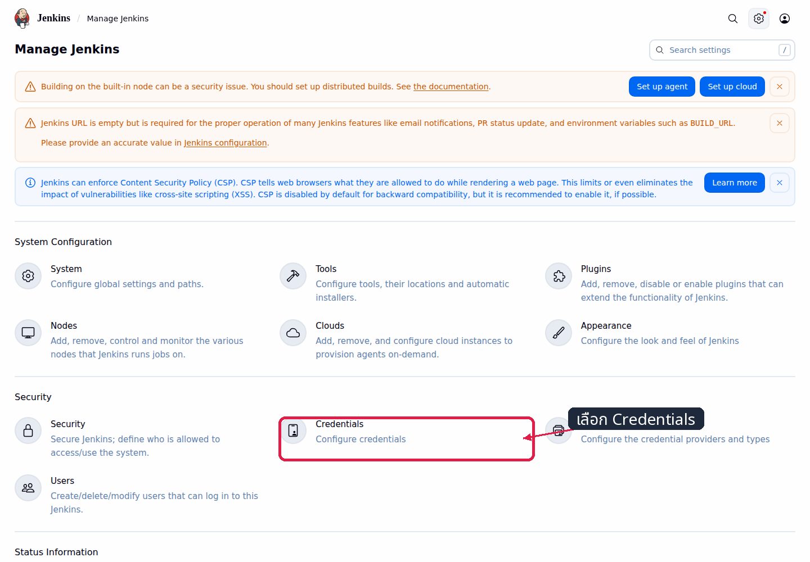
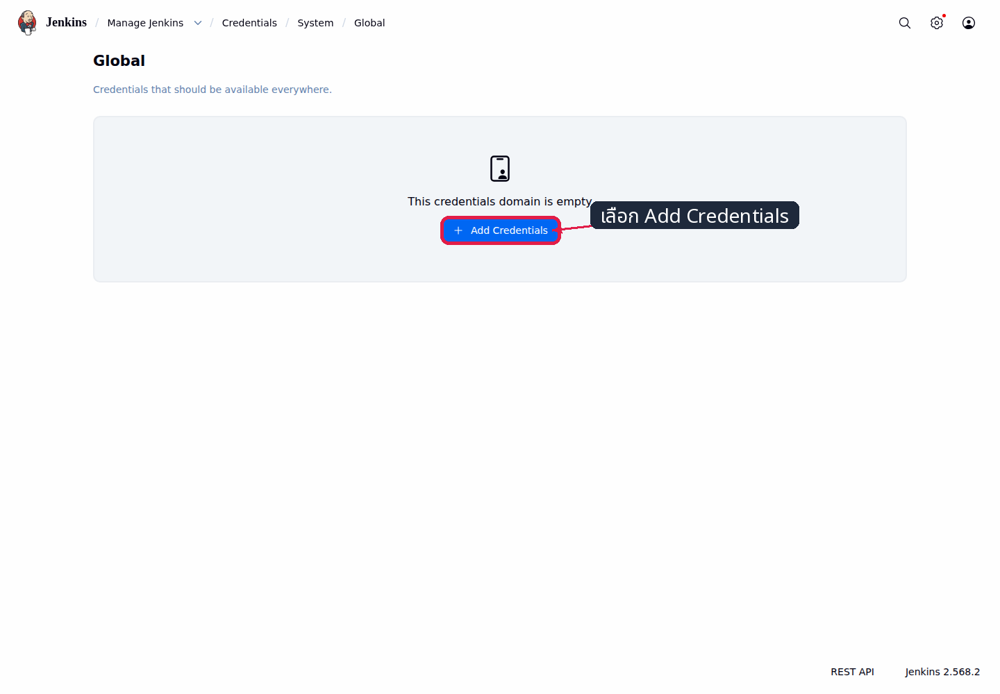
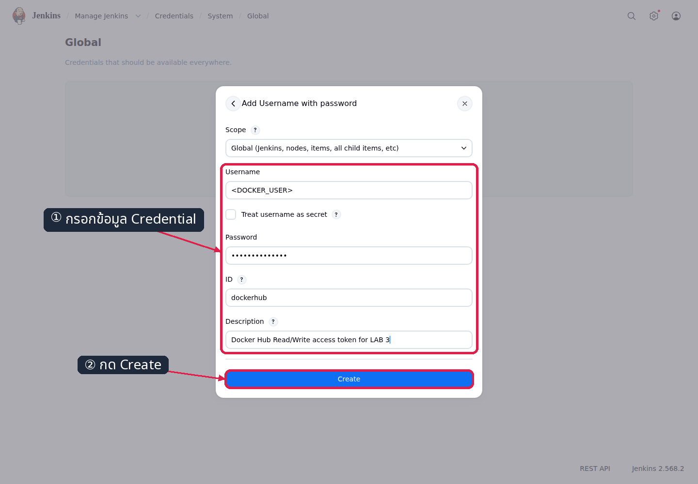
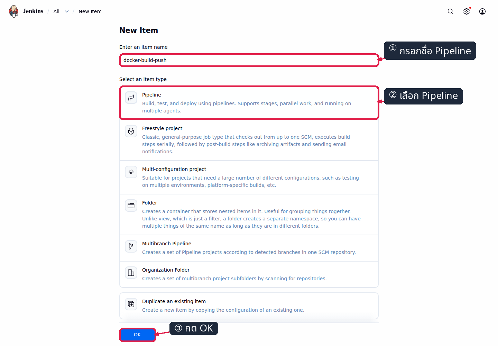
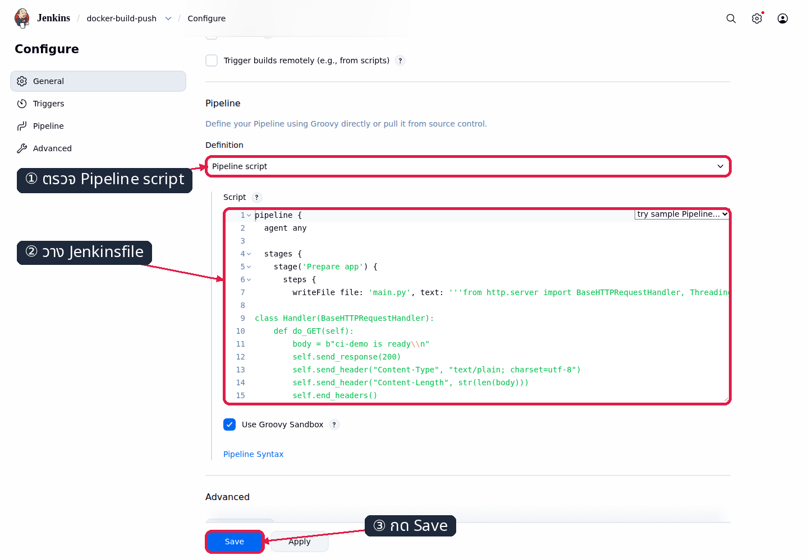
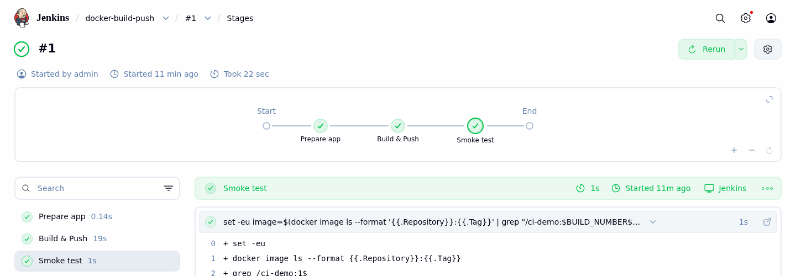
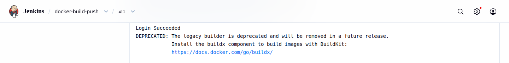
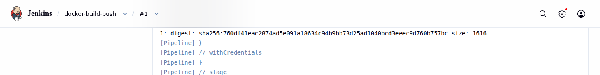
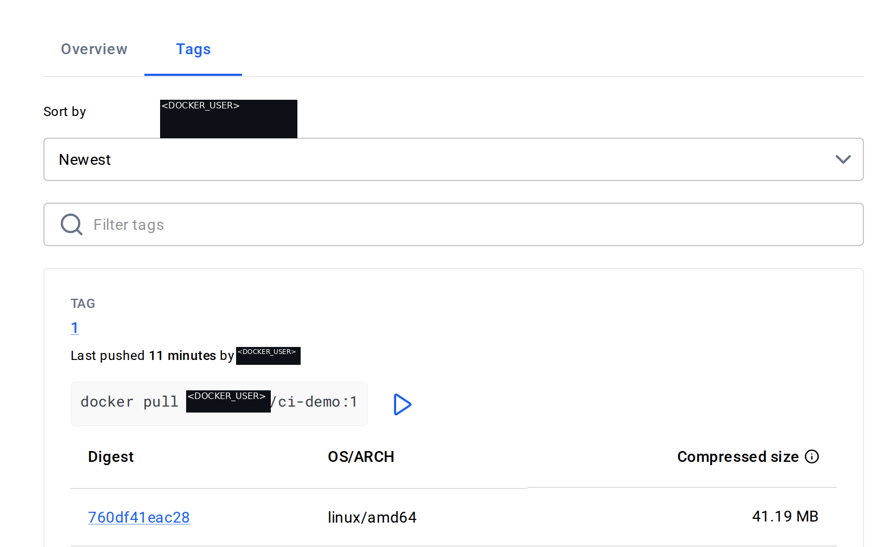

# LAB 3 — Build และ Push Docker image ขึ้น Docker Hub

แล็บใช้เวลาประมาณ 45 นาทีและศึกษาวิธีทำให้ Jenkins ที่รันใน container สร้าง Docker image, ตรวจสอบการทำงานของแอป และ push tag ที่สัมพันธ์กับ `BUILD_NUMBER` ขึ้น Docker Hub เมื่อจบแล็บ ผู้เรียนจะตรวจสอบผลได้จาก Pipeline Graph, Jenkins console และหน้า Tags สาธารณะ

> **Prerequisite ก่อนคาบ (ดำเนินการล่วงหน้าอย่างน้อย 24 ชั่วโมง):** สมัคร Docker Hub, ยืนยันอีเมล, สร้าง Access Token สิทธิ์ **Read & Write** และสร้าง repository `ci-demo` กับ `cicd-webapp` เป็น **Public** บนเว็บ Docker Hub ไม่มี token กลางของผู้สอนให้ใช้ทดแทน
>
> ตรวจความพร้อมด้วย 2 คำสั่งต่อไปนี้ โดยแทน placeholder เฉพาะใน shell และห้ามบันทึก token ลงไฟล์:
>
> ```bash
> echo '<DOCKER_TOKEN>' | docker login -u '<DOCKER_USER>' --password-stdin
> docker logout
> curl -fsS -o /dev/null -w 'ci-demo: HTTP %{http_code}\n' 'https://hub.docker.com/r/<DOCKER_USER>/ci-demo'
> curl -fsS -o /dev/null -w 'cicd-webapp: HTTP %{http_code}\n' 'https://hub.docker.com/r/<DOCKER_USER>/cicd-webapp'
> ```
>
> ✅ **สิ่งที่ต้องเห็น**:
>
> ```text
> Login Succeeded
> WARNING! Your credentials are stored unencrypted in '/root/.docker/config.json'.
> ...
> Removing login credentials for https://index.docker.io/v1/
> ci-demo: HTTP 200
> cicd-webapp: HTTP 200
> ```

## ทฤษฎีก่อนลงมือ

Docker-outside-of-Docker (DooD) คือการให้ Jenkins container ติดต่อ Docker daemon ของระบบชั้นในผ่าน `/var/run/docker.sock` จึงสร้าง image และ sibling container ใน daemon เดียวกันได้ ส่วน Docker-in-Docker (DinD) สร้าง daemon ซ้อนอีกชั้น แล็บนี้ใช้ DooD เพื่อใช้ image cache, network และวงจรชีวิตของ service ชุดเดียวกัน รายละเอียดสถาปัตยกรรมดู slide **ตอนที่ 5.1 — DooD + Credentials** (diagram D7)

Jenkins image มาตรฐานไม่มี Docker CLI แม้จะ mount socket แล้วก็ยังส่งคำสั่งไปยัง daemon ไม่ได้ จึงต้องสร้าง `jenkins-docker:2569` จาก `Dockerfile.jenkins` ซึ่งติดตั้ง `docker-ce-cli` และใช้ `USER root` สำหรับเข้าถึง socket ในสภาพแวดล้อมแล็บ

ข้อมูลถาวรของ Jenkins เช่น ผู้ใช้, plugin, job และ build history อยู่ใน named volume `jenkins_home` ไม่ได้ผูกกับ writable layer ของ container การสร้าง Jenkins container ใหม่จาก image ใหม่โดยใช้ volume เดิมจึงรักษาสถานะจาก LAB 2 ไว้ได้

Jenkins Credentials store แยกข้อมูลลับออกจาก Pipeline (ดู slide diagram D8 — เส้นทางของ credential) และส่งค่าให้เฉพาะ scope ของ `withCredentials` การ masking ช่วยลดโอกาสที่ข้อมูลจะปรากฏใน console แต่ไม่ใช่การรับประกัน จึงต้องใช้ Groovy single-quoted shell, `set +x`, `--password-stdin` และ `DOCKER_CONFIG` ชั่วคราวร่วมกัน

รูปแบบ canonical ของแล็บ login ก่อน build เพื่อให้การ pull base image ผูกกับบัญชี และใช้ `trap` ลบ Docker config ไม่ว่าขั้นตอนจะสำเร็จหรือล้มเหลว สคริปต์ฉบับเต็มอยู่ใน [`Jenkinsfile`](./Jenkinsfile) และจะคัดลอกจาก `$COURSE_ROOT` ในการทดลองที่ 5 ชื่อ artifact ปลายทางคือ `docker.io/<DOCKER_USER>/ci-demo:<BUILD_NUMBER>`

> **Safety:** การ mount Docker socket ทำให้ Jenkins มีอำนาจใกล้เคียง root ของ inner host และการใช้ `-u root` เพิ่มผลกระทบเมื่อเกิดข้อผิดพลาด จึงใช้เฉพาะแล็บ disposable เท่านั้น ระบบ production ควรใช้ build agent แยกและจำกัดสิทธิ์กับเครือข่ายตามหลัก least privilege ส่วน Access Token ใช้เพียง Read/Write ไม่ใช้ Delete/Admin และ revoke หลังคาบได้ทันที

## 🎯 Learning Objectives — ผลลัพธ์การเรียนรู้

- อธิบายความแตกต่างระหว่าง Docker CLI, Docker daemon และ socket ได้
- สร้าง `jenkins-docker:2569` และเปลี่ยน Jenkins container โดยรักษา `jenkins_home` เดิมได้
- เพิ่ม credential ชนิด Username with password ด้วย ID `dockerhub` ใน Global domain ได้
- สร้างและรัน Pipeline ที่ login, build, push และล้าง Docker config ตามรูปแบบ canonical ได้
- เชื่อมโยง `BUILD_NUMBER`, push digest และ tag บน Docker Hub ของ build ปัจจุบันได้

## Expected Result — ผลลัพธ์ที่ต้องได้เมื่อจบแล็บ

- Jenkins ใช้ image `jenkins-docker:2569` ที่มี Docker CLI และ mount Docker socket แล้ว
- Jenkins มี credential ชนิด Username with password ที่ ID `dockerhub`
- job `docker-build-push` มี build ที่จบด้วย SUCCESS ครบทุก stage
- tag ที่ตรงกับ `BUILD_NUMBER` ปรากฏบน Docker Hub จริง และ digest ตรงกับที่ console บันทึกไว้
- `bash check.sh` ปิดท้ายด้วย `ผลรวม: PASS` และคืน exit code `0`

## สภาพตั้งต้น

ต้องมีสถานะจบ LAB 2: devtools container ยังทำงาน, network `cicd-net`, container `jenkins`, volume `jenkins_home` และ job จากสองแล็บแรกต้องพร้อมใช้งาน

```bash
docker ps
```

✅ **สิ่งที่ต้องเห็น** :

```text
jenkins    Up ...
```

> ยังไม่มี? ย้อนกลับไปทำ [LAB 2](../002_LAB_Declarative_Pipeline/README.md) ก่อน (ใช้เวลา ~30 นาที) หรือกู้สถานะด้วย `bash tools/bootstrap/up_to_lab2.sh`

## การทดลองที่ 1 — Jenkins image เดิมมี Docker CLI หรือไม่?

**คำถาม:** Jenkins container จาก LAB 2 เรียกคำสั่ง Docker ได้แล้วหรือยัง?

การตรวจ capability ก่อนเปลี่ยน image ทำให้แยกได้ชัดเจนว่าปัญหาเกิดจากการไม่มี CLI ไม่ใช่การเชื่อมต่อ socket

```bash
docker exec jenkins sh -c 'docker version'
printf 'exit=%s\n' "$?"
```

✅ **สิ่งที่ต้องเห็น** :

```text
sh: 1: docker: not found
exit=127
```

> 📝 ผลลัพธ์นี้เป็นสถานะที่คาดหมายของ Jenkins image เดิม การ mount socket เพียงอย่างเดียวไม่ทำให้คำสั่ง `docker` ปรากฏใน container

## การทดลองที่ 2 — จะเพิ่ม Docker CLI ให้ Jenkins อย่างไร?

**คำถาม:** image ใหม่มี Docker CLI ตามที่ `Dockerfile.jenkins` กำหนดหรือไม่?

การสร้าง image แยกทำให้ dependency ของ Jenkins ทำซ้ำได้ และไม่แก้ไข container ที่กำลังทำงานโดยตรง

```bash
cd "$COURSE_ROOT"
docker build -t jenkins-docker:2569 -f 003_LAB_Docker_Build_Push/Dockerfile.jenkins 003_LAB_Docker_Build_Push
docker run --rm --entrypoint docker jenkins-docker:2569 --version
```

✅ **สิ่งที่ต้องเห็น** :

```text
Docker version 29.7.2, build a7dcaa6
```

ขณะนี้ image ใหม่พร้อมใช้งาน แต่ Jenkins service ยังใช้ image เดิม ขั้นถัดไปจะเปลี่ยน container โดยคง persistent state ไว้

## การทดลองที่ 3 — เปลี่ยน image โดยรักษาสถานะเดิมได้หรือไม่?

**คำถาม:** เมื่อสร้าง Jenkins container ใหม่ด้วย `jenkins_home` เดิม job จาก LAB 2 ยังอยู่หรือไม่?

การ recreate container แยก lifecycle ของ process ออกจากข้อมูลถาวร พร้อมเพิ่ม Docker socket และสิทธิ์ที่จำเป็นสำหรับท่าแล็บ

```bash
docker rm -f jenkins
docker run -d --name jenkins --restart unless-stopped --network cicd-net -p 8080:8080 -u root -e JAVA_OPTS=-Djenkins.install.runSetupWizard=false -v jenkins_home:/var/jenkins_home -v /var/run/docker.sock:/var/run/docker.sock jenkins-docker:2569
sleep 20
curl -fsS -u admin:admin2569 'http://localhost:8080/job/first-pipeline/api/json?tree=name'
```

✅ **สิ่งที่ต้องเห็น** :

```text
jenkins
...
{"_class":"org.jenkinsci.plugins.workflow.job.WorkflowJob","name":"first-pipeline"}
```

> 📝 หาก `curl` ทำงานก่อน Jenkins พร้อม ให้รอจนหน้า `/login` ตอบสนองแล้วจึงรันคำสั่งตรวจซ้ำ การเริ่ม service อาจใช้เวลาประมาณ 20–40 วินาที

ขณะนี้ Jenkins ใช้ `jenkins-docker:2569` และยังมี state เดิม ขั้นถัดไปจะเพิ่ม credential โดยไม่บันทึก token ใน Jenkinsfile

## การทดลองที่ 4 — จะบันทึก Docker Hub credential ใน Jenkins อย่างไร?

**คำถาม:** credential ชนิด Username with password และ ID `dockerhub` ถูกเก็บใน Global domain แล้วหรือไม่?

Global credentials ทำให้ Pipeline อ้างอิงข้อมูลลับผ่าน ID ได้โดยไม่ฝังค่าไว้ใน source code ภาพต่อไปนี้ใช้ placeholder ใน form; เมื่อลงมือจริงให้กรอกค่าจากบัญชีของตนก่อนกด Create

1. เปิด `http://localhost:8080` และลงชื่อเข้าใช้ด้วย `admin / admin2569`
2. เลือก **Manage Jenkins → Credentials** ในหมวด Security



*สังเกตรายการ Credentials ในหมวด Security ซึ่งเป็นทางเข้าสู่ credential store ของ Jenkins*

3. เลือก **System → Global credentials (unrestricted)**



*สังเกต breadcrumb `Credentials / System / Global` และปุ่ม Add Credentials ใน Global domain*

4. เลือก **Add Credentials → Username with password → Next**
5. กรอก Username=`<DOCKER_USER>`, Password=`<DOCKER_TOKEN>`, ID=`dockerhub` และ Description ตามภาพ แล้วกด **Create** หลังแทนค่าจริงแล้วเท่านั้น



*สังเกต Username เป็น `<DOCKER_USER>`, ID เป็น `dockerhub` และ Password ถูกปิดบังใน form*

สำหรับการทดสอบเส้นทาง UI อัตโนมัติ ให้ส่งค่าผ่าน environment ของ process เท่านั้น:

```bash
JENKINS_BASE_URL=http://localhost:8080 DOCKER_USER='<DOCKER_USER>' DOCKER_TOKEN='<DOCKER_TOKEN>' python3 tools/ui/lab3_credential.py
```

✅ **สิ่งที่ต้องเห็น** :

```text
[ui]... assert: credential id dockerhub is listed
[ui]... PASS
```

> 📝 Jenkins masking ลดการเปิดเผยโดยไม่ตั้งใจเท่านั้น ห้ามพิมพ์ token, ใช้ `printenv`, archive Docker config หรือเก็บ credential เป็น artifact

## การทดลองที่ 5 — จะสร้าง Pipeline จาก Jenkinsfile อย่างไร?

**คำถาม:** job `docker-build-push` ใช้ Pipeline script ที่ตรงกับ Jenkinsfile ของแล็บหรือไม่?

การกำหนด job เป็น Pipeline ทำให้ลำดับ prepare, build, push และ smoke test ตรวจสอบย้อนหลังได้จาก build เดียว

1. กลับ Jenkins Dashboard แล้วเลือก **New Item**
2. กรอกชื่อ `docker-build-push`, เลือก **Pipeline** แล้วกด **OK**



*สังเกตชื่อ `docker-build-push`, ชนิด Pipeline และปุ่ม OK ที่พร้อมสร้าง job*

3. เลื่อนไปส่วน **Pipeline** และคง Definition เป็น **Pipeline script**
4. คัดลอก Jenkinsfile ฉบับเต็มจากชุดสอน:

```bash
cp "$COURSE_ROOT/003_LAB_Docker_Build_Push/Jenkinsfile" /tmp/Jenkinsfile
```

✅ **สิ่งที่ต้องเห็น**:

```text
(ไม่มี stdout)
```

5. เปิด `/tmp/Jenkinsfile` วางเนื้อหาทั้งหมดลงช่อง Script แล้วกด **Save**



*สังเกต Definition เป็น Pipeline script และ editor มี stage `Prepare app` จาก Jenkinsfile*

ใช้ UI automation ต่อไปนี้เพื่อตรวจว่า script ใน editor ตรงกับไฟล์ทุกอักขระ:

```bash
JENKINS_BASE_URL=http://localhost:8080 python3 tools/ui/lab3_job.py
```

✅ **สิ่งที่ต้องเห็น** :

```text
[ui]... assert: UI script equals the saved Jenkinsfile byte-for-byte
[ui]... PASS
```

ขณะนี้ job ถูกบันทึกและพร้อมรัน ขั้นถัดไปจะเริ่ม build และตรวจสถานะของแต่ละ stage

## การทดลองที่ 6 — Pipeline build และ push สำเร็จครบทุก stage หรือไม่?

**คำถาม:** build ล่าสุดผ่าน `Prepare app`, `Build & Push` และ `Smoke test` ครบหรือไม่?

Pipeline Graph แสดงความสัมพันธ์ระหว่าง stage และสถานะของ build เดียว จึงช่วยระบุจุดที่ล้มเหลวโดยไม่ต้องอ่าน console ทั้งหมด

1. เปิด job `docker-build-push` แล้วเลือก **Build Now**
2. เปิด build ล่าสุดและเลือก **Pipeline Overview** หลัง build จบ



*สังเกต `Prepare app`, `Build & Push` และ `Smoke test` เป็นสถานะสำเร็จทั้งหมด*

```bash
curl -fsS -u admin:admin2569 'http://localhost:8080/job/docker-build-push/lastBuild/api/json?tree=result'
```

✅ **สิ่งที่ต้องเห็น** :

```text
{"_class":"org.jenkinsci.plugins.workflow.job.WorkflowRun","result":"SUCCESS"}
```

build เสร็จสมบูรณ์แล้ว ขั้นถัดไปจะอ่านเฉพาะหลักฐานที่ยืนยันการ login และ push จาก console ของ build เดียวกัน

## การทดลองที่ 7 — Console ยืนยัน login และ push digest ได้หรือไม่?

**คำถาม:** console ของ build ล่าสุดมี `Login Succeeded`, token masking และ push digest หรือไม่?

Console เป็นหลักฐานลำดับเหตุการณ์ของ Pipeline การตรวจบรรทัด login กับ digest ยืนยันว่า stage ติดต่อ registry และได้รับ content digest จากการ push จริง

1. จาก build ล่าสุดเลือก **Console Output**
2. ค้นหา `Login Succeeded` และ `digest: sha256:` โดยไม่แสดงค่าของ credential



*สังเกตบรรทัด `Login Succeeded` จากการใช้ `--password-stdin` โดยไม่มี token ปรากฏในภาพ*



*สังเกต tag ของ build ปัจจุบันตามด้วย `digest: sha256:...` และขนาด manifest*

```bash
curl -fsS -u admin:admin2569 http://localhost:8080/job/docker-build-push/lastBuild/consoleText | grep -E 'Login Succeeded|Masking supported|digest: sha256:|ci-demo is ready|Finished:'
```

✅ **สิ่งที่ต้องเห็น** :

```text
Masking supported pattern matches of $DOCKER_TOKEN
Login Succeeded
... digest: sha256:...
ci-demo is ready
Finished: SUCCESS
```

> 📝 Digest ระบุเนื้อหา image ไม่ใช่ข้อมูลลับ และใช้เชื่อมหลักฐานระหว่าง Jenkins build กับ tag บน registry ได้

## การทดลองที่ 8 — Tag ของ build ปัจจุบันปรากฏบน Docker Hub หรือไม่?

**คำถาม:** หน้า Tags สาธารณะแสดง tag ที่ตรงกับ `BUILD_NUMBER` ล่าสุดหรือไม่?

การเปิดหน้า public Tags ใน browser context ที่ไม่ได้ login พิสูจน์ว่า repository เป็น Public และผู้ใช้อื่นสามารถอ่าน manifest ของ tag นี้ได้ ห้ามเปิดหรือจับภาพหน้า Docker Hub ที่ login แล้วหรือหน้าสร้าง token

```bash
curl -fsS -u admin:admin2569 'http://localhost:8080/job/docker-build-push/lastBuild/api/json?tree=number'
```

✅ **สิ่งที่ต้องเห็น**:

```json
{"_class":"org.jenkinsci.plugins.workflow.job.WorkflowRun","number":<BUILD_NUMBER>}
```

1. เปิดหน้าต่าง browser แบบไม่เข้าสู่ระบบ
2. ไปที่ `https://hub.docker.com/r/<DOCKER_USER>/ci-demo/tags`
3. เลือกแท็บ **Tags** และตรวจว่า tag ตรงกับค่าที่คำสั่งแสดง



*สังเกตแท็บ Tags, เลข tag ของ build ปัจจุบัน และ digest แบบย่อในคอลัมน์ Digest โดย crop ไม่แสดงข้อมูลบัญชีหรือหน้าที่ต้อง login และ mask ชื่อเจ้าของก่อนบันทึกภาพ*

✅ **สิ่งที่ต้องเห็น** :

```text
TAG
<BUILD_NUMBER>
docker pull <DOCKER_USER>/ci-demo:<BUILD_NUMBER>
Digest          OS/ARCH        Compressed size
<DIGEST12>      linux/amd64    ...
```

หน้า Tags แสดง digest แบบย่อ 12 ตัวอักษร ซึ่งต้องตรงกับ 12 ตัวแรกหลัง `sha256:` ที่ console ของ build เดียวกันพิมพ์ไว้ในการทดลองที่ 7

ตรวจสถานะจบแล็บจาก shell ใหม่โดยไม่ส่ง token ให้ตัวตรวจ:

```bash
(
  cd "$COURSE_ROOT/003_LAB_Docker_Build_Push"
  DOCKER_USER='<DOCKER_USER>' bash check.sh
)
```

✅ **สิ่งที่ต้องเห็น**:

```text
[PASS] jenkins ใช้ image jenkins-docker:2569
[PASS] jenkins mount Docker socket ถูกต้อง
[PASS] Jenkins Credentials API พบ id dockerhub
[PASS] docker-build-push build #<BUILD_NUMBER> = SUCCESS
[PASS] อ่าน digest ของ push จาก Jenkins console ได้
[PASS] anonymous client อ่าน manifest และ Hub tag API ได้
[PASS] Hub digest ตรงกับ build นี้ และ last_updated ใหม่กว่าเวลาเริ่ม build
[INFO] Docker token pattern count: lab_files=0 console=0
[PASS] ไม่พบรูปแบบ Docker Hub token ในไฟล์แล็บหรือ console
[INFO] retained Docker auth entry count: 0
[PASS] ไม่พบ Docker auth entry ค้างใน jenkins container
ผลรวม: PASS
```

## แก้ปัญหาที่พบบ่อย

| อาการ | สาเหตุ | วิธีแก้ |
|---|---|---|
| `401 Unauthorized` | token ผิด, หมดอายุ หรือถูก revoke | สร้าง Access Token สิทธิ์ Read/Write ใหม่ แล้วอัปเดต credential `dockerhub`; ทดสอบด้วย `--password-stdin` โดยไม่พิมพ์ token |
| `denied: requested access` | namespace/repository ไม่ตรง หรือ token ไม่มี Write | ตรวจ `printf 'namespace=%s\n' "$DOCKER_USER"`, ชื่อ public repository `ci-demo` และสิทธิ์ของ token |
| `429 ... pull rate limit` | quota การ pull image ของบัญชีหรือเครือข่ายเต็ม | ยืนยันว่า login เกิดก่อน `docker build`, รอเวลาที่ข้อความกำหนด และคง Docker volume/cache |
| `429 Too Many Requests` ที่ไม่มีข้อความ pull limit | Docker Hub abuse limit | หยุด loop หรือ retry ที่ถี่เกินไป แล้วเพิ่มระยะ backoff ก่อนรันใหม่ |
| หน้า Tags ว่างหรือ 404 | repository เป็น Private, URL/username ผิด หรือ UI ยังไม่ปรับสถานะ | ตรวจว่า `ci-demo` เป็น Public, ใช้ URL canonical และ refresh หลัง Hub API พบ tag |
| `docker: not found` ใน Pipeline | Jenkins ยังใช้ image เดิม | ตรวจ `docker inspect -f '{{.Config.Image}}' jenkins` แล้วทำการทดลองที่ 2–3 ใหม่ |
| Jenkins ไม่พร้อมหลัง recreate | service ยังเริ่มไม่เสร็จ หรือ mount/port ไม่ตรง | ตรวจ `docker logs --tail 50 jenkins` และเปรียบเทียบคำสั่ง canonical ในการทดลองที่ 3 |
| service หายหลัง restart devtools | outer container ไม่มี `--tmpfs /run` หรือ inner service ไม่มี restart policy | รัน `docker start devtools-jenkins`, รอประมาณ 20 วินาที แล้วตรวจ `docker ps`; หากต้องกู้สถานะให้รัน `bash tools/bootstrap/up_to_lab2.sh` |
