# LAB 3 — Jenkins สั่ง devtools ผ่าน SSH: Connect → Clone → Build → Test → Push → Clean → Pull → Deploy ร้านอาหารแมว

> 📝 **ฉบับร่างสำหรับรีวิว README (2026-09-27):** ตัดขั้นเตรียม SSH ด้วยมือ (ติดตั้ง `sshpass`, pin host key, ทดสอบ SSH) ออกแล้ว เพราะเป้าหมายคือให้ผู้เรียนใช้ **Jenkins Credentials แบบ Username with password อย่างเดียว** · ⚠️ **`Jenkinsfile` จริงตอนนี้ยังเรียก `sshpass` อยู่** ตัวอย่างโค้ด ภาพ console และผลทดสอบด้านล่างเป็นของ**เวอร์ชันปัจจุบัน** ไม่ใช่ workflow ใหม่ · การเปลี่ยนไปใช้ SSH ผ่าน plugin ของ Jenkins **ยังไม่ได้ทำและยังไม่ได้ทดสอบ** จะปรับโค้ดและทดสอบในรอบถัดไป

> ⏱️ ประมาณ 50–60 นาที · 🧪 7 ขั้น · 🎯 จบเมื่อกด **Build** ใน Jenkins แล้ว `http://localhost:3000` แสดงร้าน **Meow Mart** เวอร์ชันที่ Pipeline เพิ่ง build → push ขึ้น Docker Hub → pull กลับตาม digest → deploy

## ภาพรวม

แล็บนี้ใช้ container สองตัวแทน **server สองเครื่อง** บน network `cicd-net`:

- **`jenkins`** — ควบคุม Pipeline: อ่าน `Jenkinsfile` จาก GitHub (Pipeline script from SCM) เก็บ Credentials และส่งคำสั่งทาง SSH · ไม่มี Docker CLI และไม่ mount `docker.sock`
- **`devtools`** — รับคำสั่งจาก Jenkins ทาง SSH แล้วรัน `git clone` และคำสั่ง Docker ทุกคำสั่งของ Pipeline

image ที่ build ได้ถูก push ไปเก็บที่ **Docker Hub** แล้ว pull กลับมา deploy เป็นร้าน `catfood-web` ซึ่งรันบน Docker **ข้างใน devtools** ไม่ใช่ใน Jenkins (`docker push`/`pull` ก็รันบน devtools)

> **กติกา:** ห้ามพิมพ์ `docker build`, `docker push` หรือ `git clone` ของร้านเอง ทุกอย่างต้องเริ่มจากปุ่มใน Jenkins

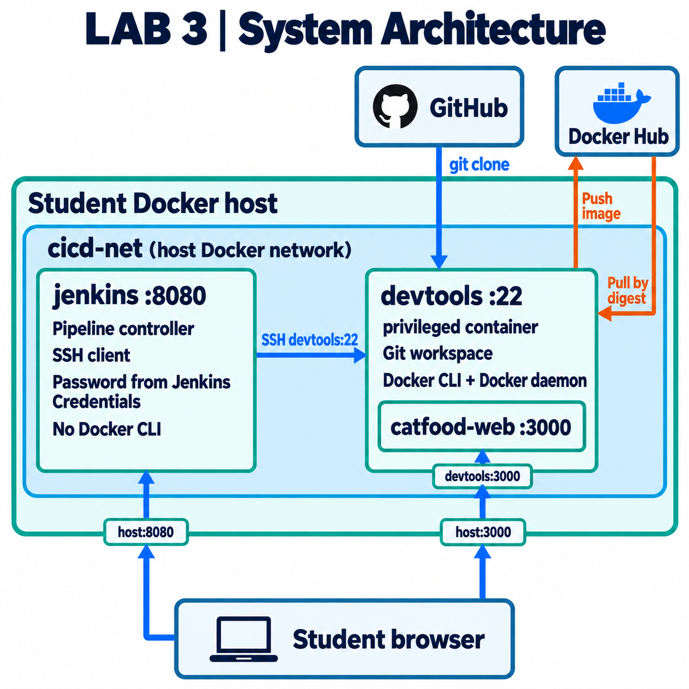

*ภาพที่ 1 แผนภาพประกอบ — `jenkins` และ `devtools` แทน server สองเครื่องบน `cicd-net` · Jenkins SSH ไปที่ `devtools:22` ด้วยรหัสผ่านจาก Jenkins Credentials · `git clone` และคำสั่ง `docker` ทั้งหมดรันบน devtools · ร้าน `catfood-web` รันบน Docker ข้างใน devtools*

| container | รันอยู่บน | เข้าจากเครื่องเราทาง |
|---|---|---|
| `jenkins` | เครื่องของเรา (network `cicd-net`) | `localhost:8080` |
| `devtools` (`--privileged` มี Docker ของตัวเอง) | เครื่องของเรา (network `cicd-net`) | `localhost:2222` → SSH · `localhost:3000` → ร้าน |
| `catfood-test-N` (ชั่วคราว) และ `catfood-web` (ร้าน) | Docker **ข้างใน** `devtools` | `localhost:3000` → `devtools:3000` → `catfood-web:3000` |

> ⚠️ `root` บน `devtools` สั่ง Docker ของ devtools ได้ทุกอย่าง ใช้รหัสผ่านนี้กับแล็บที่ลบทิ้งได้เท่านั้น ระบบจริงควรใช้ SSH key หรือ build agent ที่ไม่ใช่ `root`

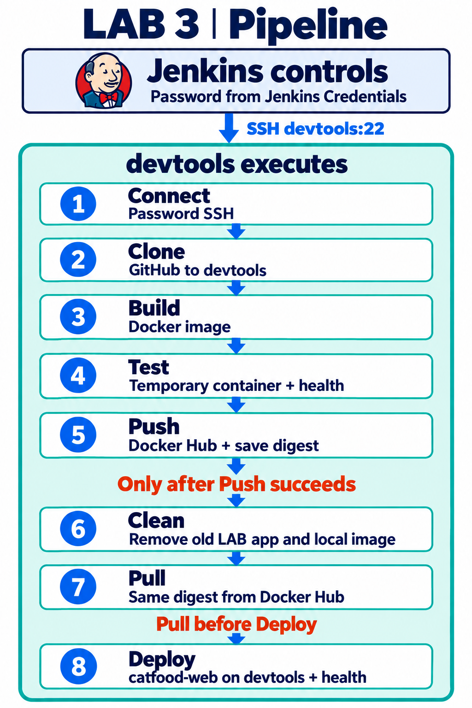

*ภาพที่ 2 แผนภาพประกอบ — Jenkins คุมลำดับ 8 stage และส่งคำสั่งไปรันบน devtools ผ่าน SSH · Clean ทำหลัง Push สำเร็จเท่านั้น · Pull ใช้ digest ที่ Push จดไว้ แล้วจึง Deploy*

## 0. สิ่งที่ต้องมี

- terminal ที่ใช้ `docker` ได้ (Linux, macOS หรือ WSL) เรียกว่า 🖥️ **host** · คำสั่งที่มีป้าย 🖥️ host คือคำสั่ง**เตรียมแล็บ**ที่เราพิมพ์เอง ส่วนคำสั่ง Git/Docker ของแอปใน Pipeline นั้น Jenkins ส่งผ่าน SSH ไป**รันใน `devtools`**
- port `8080`, `2222`, `3000` ต้องว่าง และ Jenkins ต้องออก internet ไป `github.com` ได้ (โหลด `Jenkinsfile`) · devtools ต้องไป `github.com` และ Docker Hub ได้
- บัญชี Docker Hub และ **Personal Access Token สิทธิ์ Read & Write** (Account settings → Personal access tokens) แนะนำให้สร้าง repository `catfood-shop` แบบ **Public** ไว้ก่อน

[](./images/lab3_hub_04_pat_setup.png)

*ภาพที่ 3 หน้าสร้าง token บน Docker Hub: ตั้งชื่อ เลือก **Access permissions = Repo Read & Write** แล้วกด **Generate** · token แสดงครั้งเดียว ให้คัดลอกเก็บทันที*

[](./images/lab3_hub_pat_demo.png)

*ภาพที่ 3ก ภาพประกอบที่สร้างขึ้นเพื่อการสอน ไม่ใช่หน้าจอจริง · ชื่อผู้ใช้ `demo-student` และ token ในภาพเป็นค่าสมมติ ใช้งานไม่ได้ · ตอนทำ LAB จริงให้เลือก **Repo Read & Write** และคัดลอก token ของตัวเองเก็บทันที*

stage Clone ดึงซอร์สร้านจากโฟลเดอร์นี้ใน repository ของรายวิชา:

[](./images/lab3_github_01_source.png)

*ภาพที่ 4 โฟลเดอร์ `catfood-shop` บน GitHub ที่ stage Clone ดึงมา*

> ผลลัพธ์ในเอกสารมาจากการรันจริง ID, hostname, เวลา และ digest ของแต่ละเครื่องจะต่างกัน · รอบทดสอบใช้ `TAG_PREFIX` = `lab3-sibling-20260926r2` (ของนักศึกษาเป็น `lab3`) · `<DOCKER_USER>` คือชื่อบัญชี Docker Hub · คลิกภาพเพื่อดูภาพเต็ม

## ขั้นที่ 1 — สร้าง network และ container สองตัว (🖥️ host)

**ทำไมต้องมีสอง container:** ในงานจริง Jenkins กับเครื่องที่ build/deploy มักเป็น server คนละเครื่อง แล็บนี้จึงจำลองด้วย container สองตัว

- **`jenkins`** = server ควบคุม — ถือ Pipeline, Credentials และประวัติ build แล้ว **ส่งคำสั่งทาง SSH** ออกไปทีละ stage (ตัวมันเองไม่รัน Docker)
- **`devtools`** = server ทำงาน — **รับคำสั่ง SSH** แล้วรัน `git clone`, `docker build`, test, `docker push`/`pull` และ deploy ร้านจริง
- **`cicd-net`** = network ร่วม — ทำให้สองตัวเรียกกันด้วย**ชื่อ** เช่น Jenkins ต่อ `devtools:22` ได้โดยไม่ต้องรู้ IP

ผู้เรียนใช้งาน Jenkins ผ่าน**หน้าเว็บในเบราว์เซอร์** (`http://localhost:8080`) คำสั่ง 🖥️ host ในแล็บนี้เป็นแค่การเตรียมเครื่องครั้งเดียว ส่วนงาน build/deploy ทั้งหมดสั่งจากหน้าเว็บ Jenkins

ขั้นนี้พิมพ์ใน 🖥️ host ครั้งเดียว คือสร้าง network และ container (1.1) เมื่อเสร็จแล้ว ขั้นที่ 2–5 ทำบนหน้าเว็บ Jenkins ต่อเนื่องกันไปจนกด Build ไม่ต้องติดตั้งหรือตั้งค่า SSH ใน `jenkins` ด้วยมือ

### 1.1) สร้าง network และ container สองตัว

<!-- lab3-test:host-setup -->
```bash
docker rm -f jenkins devtools
docker network create cicd-net
docker run -dit --name devtools --network cicd-net --privileged --tmpfs /run \
  --restart unless-stopped -p 2222:22 -p 3000:3000 tuchsanai/devtools:2569_1
docker run -d --name jenkins --network cicd-net --restart unless-stopped \
  -p 8080:8080 -v jenkins_home:/var/jenkins_home jenkins/jenkins:lts-jdk21
```

- `docker rm -f` ลบ `jenkins`/`devtools` ตัวเดิม ถ้าขึ้น `No such container` ทำต่อได้ · ⚠️ ของใน `devtools` ตัวเดิม รวม Jenkins ของ LAB 1–2 จะหายไป
- `docker network create` ขึ้น `already exists` ใช้ network เดิมได้ · บน `cicd-net` Jenkins เรียก `devtools` ด้วยชื่อได้เลย
- `--privileged --tmpfs /run` ให้ Docker ข้างใน `devtools` ทำงานได้ · volume `jenkins_home` เก็บข้อมูล Jenkins

✅ ผลที่ได้ (ID ของ network, `devtools`, `jenkins`):

```text
6991a385bf2064a9247fa2ced899eaddcdb280ab838167487d75fbe68d8e2b22
4dc7e37d7397effd20bb187db15f93c1b48454db12b1771821ffab3d998f8bc2
ad27ba488a7f1070eacfa00b5e25943b336c70539ffc41cc55ba28c154205695
```

container พร้อมแล้ว ไปหน้าเว็บ Jenkins ต่อได้เลย · Jenkins จะ SSH ไป `devtools` ตั้งแต่ stage แรก (Connect) โดยใช้ username/password ที่เก็บใน credential `devtools-ssh` (ขั้นที่ 3) เท่านั้น ผู้เรียนไม่ต้องพิมพ์รหัสหรือ SSH เองในขั้นนี้

> 🚧 **แผน (ยังไม่ได้ทำ):** จะให้ Jenkins ต่อ SSH ด้วย **plugin ของ Jenkins เอง** — plugin อ่าน username/password จาก credential `devtools-ssh` แล้วเชื่อมต่อให้ ผู้เรียนจึงไม่ต้องติดตั้งโปรแกรมเสริมใน container · ตอนนี้ `Jenkinsfile` ยังใช้ `sshpass` ซึ่งต้องติดตั้งใน `jenkins` และ pin host key ไว้ก่อน ขั้นตอนนั้นถูกตัดออกจากร่างนี้แล้ว ดังนั้น**ร่างนี้ยังรันจนจบไม่ได้**จนกว่าจะปรับรอบถัดไป

## ขั้นที่ 2 — ปลดล็อกและตั้งค่า Jenkins

<!-- lab3-test:unlock -->
```bash
docker exec jenkins cat /var/jenkins_home/secrets/initialAdminPassword
```

✅ ได้รหัสเลขฐานสิบหก 32 ตัว (ห้ามเผยแพร่)

> 📷 ภาพที่ 5ก–5ฉ **นำมาจาก LAB 1 (การทดลองที่ 3–4)** เพื่อให้ทำตามได้ในหน้านี้เลย ไม่ใช่ภาพที่ถ่ายใหม่จากการรัน LAB 3 · เป็นภาพขั้นตอน Setup Wizard ที่นำกลับมาใช้ซ้ำ

> 🔁 **ถ้าเคยตั้งค่า Jenkins ไว้แล้ว** ให้ login ด้วยผู้ดูแล (admin) เดิม แล้ว**ข้ามไปขั้นที่ 3** ได้เลย ไม่ต้องทำ Setup Wizard (2.1–2.6)

**2.1) ปลดล็อก** เปิดเบราว์เซอร์ไปที่ **http://localhost:8080** วางรหัสจากคำสั่งด้านบนในช่อง **Administrator password** แล้วกด **Continue**


*ภาพที่ 5ก (จาก LAB 1) หน้า **Unlock Jenkins** — วางรหัส 32 ตัวแล้วกด Continue · รหัสนี้ใช้ครั้งเดียว*

**2.2) เลือก Install suggested plugins**


*ภาพที่ 5ข (จาก LAB 1) เลือก **Install suggested plugins** ซึ่งมี Pipeline, Git และ Pipeline Graph View ที่แล็บนี้ต้องใช้*

**2.3) รอติดตั้ง plugin** ประมาณ 2–4 นาที ห้ามปิด container ระหว่างนี้ ถ้าบางตัวขึ้น **Retry** ให้กด Retry


*ภาพที่ 5ค (จาก LAB 1) เครื่องหมาย ✓ คือ plugin ที่ติดตั้งเสร็จแล้ว*

**2.4) สร้างผู้ดูแลระบบ** กรอกตามภาพ แล้วกด **Save and Continue**


*ภาพที่ 5ง (จาก LAB 1) Username `admin` · Password `admin2569` (2 ช่อง) · Full name `Admin` · Email `student@example.com`*

**2.5) คง Jenkins URL เป็น `http://localhost:8080/`** แล้วกด **Save and Finish**


*ภาพที่ 5จ (จาก LAB 1) หน้า **Instance Configuration** — ใช้ `http://localhost:8080/` ตามที่แสดง*

**2.6) กด Start using Jenkins**


*ภาพที่ 5ฉ (จาก LAB 1) Setup Wizard เสร็จแล้ว กด **Start using Jenkins** เพื่อเข้า Dashboard*

## ขั้นที่ 3 — สร้าง Jenkins Credentials: `devtools-ssh` และ `dockerhub`

ก่อนเขียนหรือรัน Pipeline ให้เก็บความลับไว้ใน Jenkins ก่อน `Jenkinsfile` อ้างถึงแค่ **ID** (`devtools-ssh`, `dockerhub`) ไม่มีรหัสผ่านหรือ token อยู่ในไฟล์ และ Jenkins จะซ่อนค่าเป็น `****` ใน console ให้

| ID | ใช้ทำอะไร | ใช้ใน stage |
|---|---|---|
| `devtools-ssh` | username/password ที่ Jenkins ใช้ **SSH เข้า `devtools`** (`root` / `passwd`) ทุกครั้งที่ส่งคำสั่ง | ทุก stage (ผ่านฟังก์ชัน `onDevtools`) และ `post` |
| `dockerhub` | username + Personal Access Token ของ Docker Hub: username ใช้ตั้งชื่อ repository `docker.io/<DOCKER_USER>/catfood-shop` ส่วน token ใช้ `docker login` บน devtools เพื่อ **push** (ต้องมีสิทธิ์ Write) แล้ว **pull** กลับตาม digest (สิทธิ์ Read) ก่อน deploy | Connect (อ่าน username) · Push (login + push) · Pull (pull แล้ว logout) |

**3.0) เปิดหน้าเพิ่ม credential** — คลิกตามลำดับ **Login → ⚙️ Manage Jenkins → Credentials → System → Global → + Add Credentials** (ภาพที่ 6ก–6ฉ เป็นภาพหน้าจอจริงแบบเต็มหน้าจาก Jenkins 2.568.3 ไม่ได้ครอป จึงเห็นเมนูและไอคอนรอบ ๆ จุดที่ต้องคลิก คลิกภาพเพื่อขยาย · จุดที่ต้องคลิกระบุเป็นตัวหนาในคำบรรยายใต้ภาพ)

**3.0ก) Login** — เปิด `http://localhost:8080` กรอก Username `admin` และ Password `admin2569` (ผู้ดูแลที่สร้างในข้อ 2.4) แล้วกด **Sign in**

[](./images/lab3_nav_01_login.png)

*ภาพที่ 6ก หน้า **Sign in to Jenkins**: Username `admin` · Password ถูกซ่อนเป็นจุด · กด **Sign in***

**3.0ข) Dashboard → ไอคอนเฟือง ⚙️** — หลัง login จะอยู่ที่ Dashboard ให้คลิกไอคอน**เฟือง** (Manage Jenkins) มุมขวาบน ข้างไอคอนแว่นขยาย · จุดแดงบนเฟืองคือการแจ้งเตือนของระบบ ไม่เกี่ยวกับแล็บนี้

[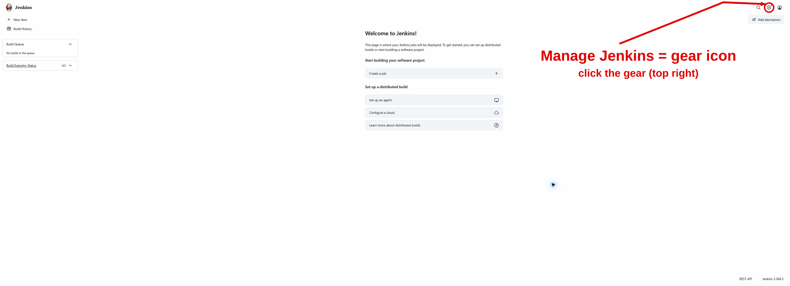](./work/gear-annotation-20260927/images/lab3_nav_02_dashboard_gear_annotated.svg)

[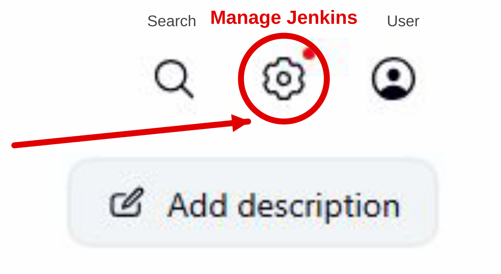](./work/gear-annotation-20260927/images/lab3_nav_02_gear_inset.svg)

*ภาพที่ 6ข หน้า **Dashboard** (ภาพหน้าจอจริงเต็มหน้าจอ + เส้นวงกลม/ลูกศรสีแดงที่เพิ่มเพื่อการสอนเท่านั้น) ภาพบนคือหน้าเต็ม ภาพล่างคือภาพขยายมุมขวาบนของภาพเดียวกัน: ไอคอนแว่นขยาย (ค้นหา) · **เฟืองในวงกลมแดง = Manage Jenkins** · ไอคอนผู้ใช้ · คลิกภาพเพื่อดูขนาดเต็ม ([ภาพต้นฉบับไม่มีเส้นกำกับ](./images/lab3_nav_02_dashboard.png)) · Jenkins บางรุ่นมีลิงก์ **Manage Jenkins** ในแถบซ้ายแทน*

**3.0ค) Manage Jenkins → Credentials** — ในหน้า **Manage Jenkins** เลื่อนหาหมวด **Security** แล้วคลิก **Credentials** (Configure credentials) · ไม่ใช่ **Credential Providers** ที่อยู่ถัดไป

[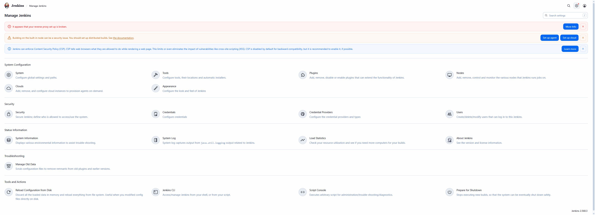](./images/lab3_nav_03_manage.png)

*ภาพที่ 6ค หน้า **Manage Jenkins** ดูที่หมวด **Security**: คลิก **Credentials** · กล่องแจ้งเตือนด้านบนของหน้า (reverse proxy, built-in node, CSP) เป็นคำเตือนทั่วไปของ Jenkins ทดสอบ ข้ามได้*

**3.0ง) Stores scoped to Jenkins → System** — หน้า **Credentials** มีตาราง **Stores scoped to Jenkins** ให้คลิก **System** (Domains: `Global`)

[](./images/lab3_nav_04_credentials.png)

*ภาพที่ 6ง หน้า **Credentials** (breadcrumb `Manage Jenkins / Credentials`): แถว **System** ในตาราง **Stores scoped to Jenkins** · Jenkins รุ่นนี้มีปุ่ม **+ Add Credentials** ในกล่องด้านบนด้วย แต่แล็บนี้เข้าผ่าน System → Global เพื่อให้เห็นว่า credential ถูกเก็บที่ store และ domain ใด*

**3.0จ) System → Global** — หน้า **System** แสดง domain ให้คลิก **Global** · ในรุ่นนี้ลิงก์ชื่อ **Global** (คำอธิบาย `Credentials that should be available everywhere.`) ส่วน Jenkins รุ่นก่อนและเอกสารอื่นเรียก domain เดียวกันนี้ว่า **Global credentials (unrestricted)**

[](./images/lab3_nav_05_system.png)

*ภาพที่ 6จ หน้า **System**: domain **Global** · `0 credentials` คือยังไม่มี credential*

**3.0ฉ) Global → + Add Credentials** — หน้า **Global** ยังว่าง (`This credentials domain is empty`) ให้กด **+ Add Credentials** กลางกล่อง (เมื่อมี credential แล้ว ปุ่มนี้ย้ายไปอยู่มุมขวาบนของรายการ) แล้วกรอกฟอร์มตาม 3.1

[](./images/lab3_nav_06_global.png)

*ภาพที่ 6ฉ หน้า **Global** (breadcrumb `Manage Jenkins / Credentials / System / Global`): กด **+ Add Credentials***

**3.1) `devtools-ssh`** — เลือกชนิด **Username with password** แล้วกรอกในหน้าต่าง **Add Username with password**:

| ช่อง | ค่า |
|---|---|
| Username | `root` |
| Treat username as secret | ไม่ติ๊ก (ถ้าติ๊ก console จะแสดง `user=****`) |
| Password | `passwd` |
| ID | `devtools-ssh` |
| Description | `SSH password: Jenkins to devtools` |

กด **Create** · `passwd` เป็นรหัสตั้งต้นของ image แล็บนี้เท่านั้น

[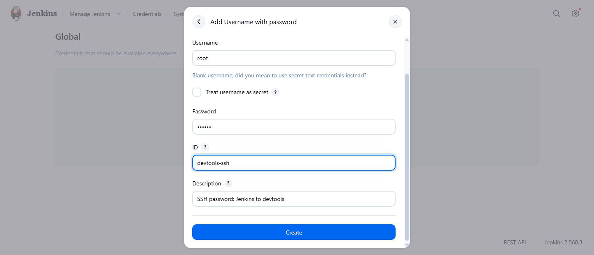](./images/lab3_scm_02_cred_devtools_ssh.png)

*ภาพที่ 7 ฟอร์ม **Add Username with password** ของ `devtools-ssh`: Username `root` · ไม่ติ๊ก Treat username as secret · Password ถูกซ่อน · ID `devtools-ssh`*

**3.2) `dockerhub`** — กลับมาหน้า **Global** (คลิก `Global` ใน breadcrumb) แล้วกด **+ Add Credentials** อีกครั้ง ชนิด **Username with password** เหมือนเดิม:

| ช่อง | ค่า |
|---|---|
| Username | `<DOCKER_USER>` ชื่อบัญชี Docker Hub (ตัวพิมพ์เล็ก) |
| Treat username as secret | ไม่ติ๊ก |
| Password | `<DOCKER_TOKEN>` Personal Access Token จากภาพที่ 3 (Repo **Read & Write**) ไม่ใช่รหัสผ่านบัญชี |
| ID | `dockerhub` |
| Description | `Docker Hub access token` |

[](./images/lab3_scm_03_cred_dockerhub.png)

*ภาพที่ 8 ฟอร์มของ `dockerhub` · ภาพนี้ถ่ายจาก Jenkins ทดสอบที่ใส่ชื่อสมมติ `demostudent` และ token สมมติ (ไม่ใช่บัญชีจริง) ให้ใส่บัญชีและ token ของตัวเอง*

[](./images/lab3_scm_04_credentials_list.png)

*ภาพที่ 9 Global credentials มี `devtools-ssh` (`root/******`) และ `dockerhub` (ในภาพเป็นชื่อสมมติ `demostudent/******` ของคุณจะเป็น `<DOCKER_USER>/******`) · Jenkins ไม่แสดงรหัสผ่านหรือ token*

> ⚠️ วาง token ใน Jenkins Credentials เท่านั้น ห้ามวางในแชต เอกสาร หรือ commit ลง Git · ID ต้องสะกดตรงตัว เพราะ `Jenkinsfile` เรียกด้วย ID นี้

## ขั้นที่ 4 — สร้าง Pipeline บนหน้าเว็บ Jenkins แล้วออกแบบ `Jenkinsfile`

ทำต่อจากขั้นที่ 3 บนหน้าเว็บเดิม: สร้าง job ชนิด **Pipeline** ก่อน (4.1–4.2) เพื่อบอก Jenkins ว่าจะอ่าน `Jenkinsfile` จาก Git ตรงไหน จากนั้นเรียนออกแบบไฟล์นั้นทีละชั้น (4.3–4.11) และนำไฟล์เข้า Git ให้ job อ่าน (4.12) แล้วจึงกด Build ในขั้นที่ 5

| ทางเลือก | ทำอะไร | ตั้งค่า job ในข้อ 4.2 |
|---|---|---|
| **ก. รันแล็บด้วยไฟล์ของรายวิชา** (แนะนำสำหรับรอบแรก) | อ่าน 4.3–4.11 เพื่อเข้าใจโครงสร้าง แล้วใช้ [`Jenkinsfile`](./Jenkinsfile) ฉบับสมบูรณ์ที่อยู่ใน repository ของรายวิชาอยู่แล้ว **ไม่ต้อง fork** | Repository URL และ Script Path ของรายวิชา (ตารางใน 4.2) |
| **ข. ฝึกเขียนเอง** | สร้างไฟล์ `Jenkinsfile` ใน repository Git **สาธารณะ** ของตัวเอง ประกอบตาม 4.5–4.11 แล้ว commit/push (4.12) | Repository URL, Branch Specifier และ Script Path ของตัวเอง |

ทั้งสองทางใช้ซอร์สร้านจาก parameter `GIT_URL`/`APP_SUBDIR` (ค่าเริ่มต้นคือ repository ของรายวิชา) ซึ่ง devtools เป็นผู้ `git clone` เองใน stage Clone จึงไม่ต้องคัดลอกโฟลเดอร์ `catfood-shop`

> 📷 ภาพที่ 10–12 เป็นภาพหน้าจอจริงที่ถ่ายไว้ก่อนหน้านี้จาก Jenkins ทดสอบรอบ Pipeline script from SCM (2026-09-27) นำมาใช้ซ้ำ ไม่ได้ถ่ายใหม่พร้อมภาพที่ 6ก–6ฉ

**4.1) Dashboard → New Item → Pipeline** — คลิกโลโก้ **Jenkins** มุมซ้ายบนเพื่อกลับ Dashboard → คลิก **+ New Item** ในแถบซ้าย → ช่อง **Enter an item name** พิมพ์ `docker-build-push` → เลือกชนิด **Pipeline** → กด **OK**

[](./images/lab3_scm_05_new_item.png)

*ภาพที่ 10 หน้า **New Item**: ชื่อ `docker-build-push` และเลือกชนิด **Pipeline***

**4.2) ตั้งค่า job: Pipeline script from SCM** — กด OK แล้วจะเข้าหน้า **Configure** ของ job เลื่อนลงไปส่วน **Pipeline** แล้วตั้งค่าตามตาราง (ทางเลือก ข ให้เปลี่ยนเฉพาะ **Repository URL**, **Branch Specifier** และ **Script Path** เป็นของ repository ตัวเอง) → **Save**

| ช่อง | ค่า |
|---|---|
| Definition | **Pipeline script from SCM** |
| SCM | **Git** |
| Repository URL | `https://github.com/Tuchsanai/DevTools.git` |
| Credentials | `- none -` (repository สาธารณะ) |
| Branch Specifier | `*/main` |
| Script Path | `04_Jenkins/001_Jenikin/003_LAB_Docker_Build_Push/Jenkinsfile` |
| Lightweight checkout | ติ๊ก (ค่าเริ่มต้น) Jenkins อ่าน `Jenkinsfile` ผ่าน SCM โดยไม่ checkout ทั้ง repository ลง workspace ของ job (ยังอาจดึงข้อมูล Git มาเก็บเป็น cache) |

[](./images/lab3_scm_06_pipeline_from_scm.png)

*ภาพที่ 11 ส่วน **Pipeline** ของหน้า Configure: Definition = **Pipeline script from SCM**, SCM = **Git**, Repository URL ของรายวิชา และ Credentials = none*

[](./images/lab3_scm_07_branch_script_path.png)

*ภาพที่ 12 Branch Specifier `*/main`, Script Path `04_Jenkins/001_Jenikin/003_LAB_Docker_Build_Push/Jenkinsfile` และ **Lightweight checkout** ติ๊กอยู่ · ครอปจากภาพเต็มหน้าที่ต่อจากหลายช่วงเลื่อน แถบกลางภาพคือรอยต่อของภาพ (คลิกดูภาพเต็ม)*

หลัง Save **ยังไม่ต้องกด Build Now** · job เก็บแค่ "ไปอ่าน `Jenkinsfile` ที่ไหน" ตัว Pipeline จริงอยู่ในไฟล์ ซึ่ง Jenkins จะดึงจาก Git ตอนเริ่ม build ทุกครั้ง ข้อถัดไปอธิบายว่าไฟล์นั้นเขียนอย่างไร

**4.3) ไฟล์ `Jenkinsfile` คืออะไร อยู่ตรงไหน**

`Jenkinsfile` คือไฟล์ข้อความที่เขียน Pipeline ด้วยภาษา Groovy แล้วเก็บไว้ใน Git คู่กับซอร์ส job จากข้อ 4.2 จะให้ Jenkins อ่านไฟล์นี้จาก Git ทุกครั้งที่ build ข้อ 4.5–4.11 สอนสร้างไฟล์ตั้งแต่โครงเปล่า แล้วเติมทีละชั้นตามลำดับที่ Pipeline ใช้งานจริง: **Credentials → SSH ไป devtools → git clone บน devtools → Docker build/test → Docker Hub push/pull/deploy บน devtools**

- ตั้งชื่อ `Jenkinsfile` (J ตัวใหญ่ ไม่มีนามสกุล) บันทึกเป็น UTF-8
- Jenkins หาไฟล์ตาม **Script Path** ในข้อ 4.2 ซึ่งเป็น path แบบ relative จาก root ของ repository และต้องสะกดตรงตัวพิมพ์ ในรายวิชาไฟล์อยู่ที่ `04_Jenkins/001_Jenikin/003_LAB_Docker_Build_Push/Jenkinsfile`

[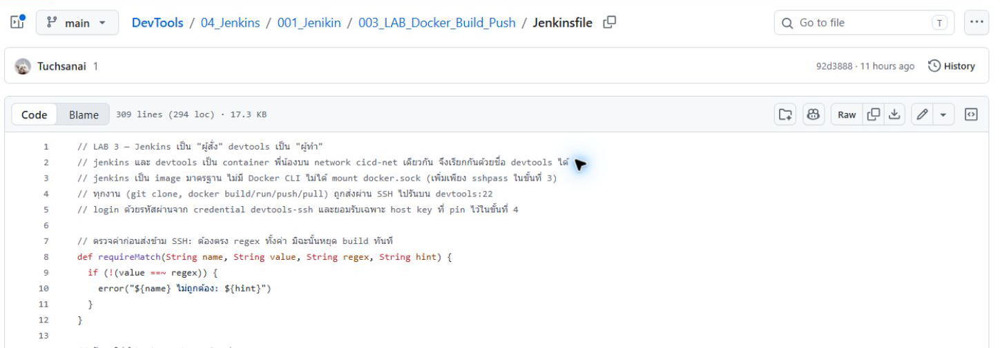](./images/lab3_scm_github_jenkinsfile.png)

*ภาพที่ 13 ไฟล์ `Jenkinsfile` ของแล็บนี้บน GitHub branch `main` ของ repository รายวิชา (path `DevTools / 04_Jenkins / 001_Jenikin / 003_LAB_Docker_Build_Push / Jenkinsfile`) · ถ่ายก่อนอัปเดตรอบนี้ (commit `92d3888`) หัวไฟล์ในภาพจึงยังต่างจากฉบับปัจจุบันเล็กน้อย*

**4.4) ใครโหลดอะไร: Jenkins โหลด Pipeline ส่วน devtools clone แอป**

- job แบบ **Pipeline script from SCM** ทำให้ Jenkins (controller) ดึง `04_Jenkins/001_Jenikin/003_LAB_Docker_Build_Push/Jenkinsfile` จาก `https://github.com/Tuchsanai/DevTools.git` branch `main` **ก่อน** Pipeline เริ่ม นี่คือ Git ครั้งเดียวที่ Jenkins ทำเอง
- `devtools` ช่วยงานนี้ไม่ได้ เพราะ Jenkins จะรู้ว่าต้อง SSH ไปไหนและใช้ credential ตัวใด ก็ต่อเมื่ออ่าน `Jenkinsfile` แล้ว
- หลังจากนั้นทุกอย่างของแอป (`git clone` ซอร์สร้าน, `docker build`/`run`/`push`/`pull`) Jenkins ส่งผ่าน SSH ไปรันบน `devtools`
- ปกติ Declarative Pipeline จะ checkout ทั้ง repository ลง workspace ของ Jenkins อีกรอบโดยอัตโนมัติ แต่แล็บนี้ไม่ใช้ไฟล์ใน workspace นั้น (repository ของรายวิชาใหญ่ระดับ GB) จึงปิดด้วย `skipDefaultCheckout()` ใน `options` (ตำแหน่ง [D] ในโครงข้อ 4.5)

**4.5) โครงของ Declarative Pipeline**

เริ่มจากโครงนี้ก่อน วงเล็บปีกกา `{ }` ทุกคู่ต้องปิดครบ ทุกส่วนอยู่ใน `pipeline { }` ยกเว้นฟังก์ชันช่วยที่อยู่ด้านบนไฟล์:

```groovy
// Jenkinsfile — โครงเปล่า (skeleton) รันได้แต่ยังไม่ทำงานจริง: เติมโค้ดของแต่ละชั้นตาม 4.6–4.10

// [A] ฟังก์ชันช่วย (helper) ประกาศนอก pipeline { } ด้านบนสุดของไฟล์
def requireMatch(String name, String value, String regex, String hint) {
  // 4.6: ตรวจค่าด้วย regex
}

def onDevtools(Map vars, String body, boolean capture = false) {
  // 4.7: ส่งสคริปต์ไปรันบน devtools ผ่าน SSH
}

pipeline {                  // [B] บล็อกนอกสุด มีได้บล็อกเดียวต่อไฟล์
  agent any                 // [C] รันบน executor ใดก็ได้ของ Jenkins

  options {                 // [D] ตัวเลือกของทั้ง job
    disableConcurrentBuilds()
    skipDefaultCheckout()
  }

  parameters {              // [E] ช่องในหน้า Build with Parameters อ่านด้วย params.NAME
    string(name: 'APP_VERSION', defaultValue: '1.0.0', description: 'เวอร์ชัน X.Y.Z')
  }

  environment {             // [F] ตัวแปรที่ทุก stage อ่านได้ด้วย env.NAME
    APP_NAME = 'catfood-shop'
  }

  stages {                  // [G] รายการ stage เรียงตามลำดับที่รัน
    stage('Connect') {      // [H] หนึ่ง stage = หนึ่งช่องใน Stage View
      steps {               // [I] คำสั่งของ stage
        script {            // [J] Groovy เต็มรูปแบบ: def, if, try และเก็บค่าที่ฟังก์ชันคืน
          echo "Connect: ${env.APP_NAME} v${params.APP_VERSION}"
        }
      }
    }
    stage('Clone') {
      steps {
        script {
          echo 'Clone'
        }
      }
    }
    // stage Build, Test, Push, Clean, Pull, Deploy เขียนแบบเดียวกัน ต่อท้ายในบล็อก stages
  }

  post {                    // [K] ทำหลังทุก stage จบ ตามผลของ build
    success {
      echo 'สำเร็จ'
    }
    unsuccessful {
      echo 'ไม่สำเร็จ: เก็บกวาดของชั่วคราว'
    }
    always {
      deleteDir()
    }
  }
}
```

| ส่วน | อยู่ตรงไหน | ในไฟล์จริงของแล็บนี้ |
|---|---|---|
| [A] ฟังก์ชันช่วย `def ...` | นอก `pipeline { }` ด้านบนสุด | `requireMatch` (4.6), `onDevtools` (4.7) |
| [C] `agent` | บรรทัดแรกใน `pipeline` | `agent any` คำสั่ง `sh` รันบน Jenkins แล้ว SSH ต่อไป devtools |
| [D] `options` | ใน `pipeline` ก่อน `stages` | `disableConcurrentBuilds()`, `skipDefaultCheckout()` |
| [E] `parameters` | ใน `pipeline` | `GIT_URL`, `GIT_REF`, `APP_SUBDIR`, `APP_VERSION`, `TAG_PREFIX` |
| [F] `environment` | ใน `pipeline` | `APP_NAME`, `DEPLOY_NAME`, `TEST_NAME`, `WORK_DIR`, `DOCKER_CFG`, `LOCAL_IMAGE` |
| [G]–[I] `stages` / `stage` / `steps` | ใน `pipeline` | 8 stage: Connect … Deploy |
| [J] `script { }` | ใน `steps` | ทุก stage ใช้ เพราะมี `def`, `withCredentials` และเก็บค่าที่ `onDevtools` คืน |
| [K] `post` | ใน `pipeline` หลัง `stages` | `success` แสดง URL ร้าน · `unsuccessful` เก็บกวาด · `always` ลบ workspace |

จากนี้ไปแต่ละชั้นจะเติมโค้ดลงในโครงนี้ ทุกบล็อกที่มีป้าย 📄 เป็น**ส่วนหนึ่ง**ที่ตัดมาจากไฟล์จริงตามเลขบรรทัด ไม่ใช่ไฟล์เต็ม ให้วางตามตำแหน่งที่ป้ายบอก

**4.6) ชั้นที่ 1 — Credentials:** `withCredentials` ดึงค่าจาก ID ที่สร้างในขั้นที่ 3 มาเป็นตัวแปรชั่วคราวเฉพาะในบล็อก ใน stage Connect ใช้แค่ username ของ `dockerhub` เพื่อตั้งชื่อ repository ปลายทาง:

📄 *ส่วนหนึ่งของ `Jenkinsfile` บรรทัด 9–13 · แทน `requireMatch` ในส่วน [A]*

```groovy
def requireMatch(String name, String value, String regex, String hint) {
  if (!(value ==~ regex)) {
    error("${name} ไม่ถูกต้อง: ${hint}")
  }
}
```

📄 *ส่วนหนึ่งของ `Jenkinsfile` บรรทัด 88–93 · ใน `script { }` ของ `stage('Connect')`*

```groovy
withCredentials([usernamePassword(credentialsId: 'dockerhub',
                 usernameVariable: 'HUB_USER', passwordVariable: 'HUB_TOKEN')]) {
  requireMatch('username ใน credential dockerhub', env.HUB_USER, '[a-z0-9]{4,30}',
               'ต้องมีเฉพาะ a-z และ 0-9 ยาว 4–30 ตัว')
  env.HUB_REPO = "docker.io/${env.HUB_USER}/${env.APP_NAME}"
}
```

**4.7) ชั้นที่ 2 — SSH ไป devtools:** ฟังก์ชัน `onDevtools(ตัวแปร, สคริปต์)` เขียนสคริปต์ของ stage เป็น `remote.sh` แล้วส่งทาง SSH โดยใช้ username/password จาก `devtools-ssh` · ⚠️ โค้ดด้านล่างเป็นของ `Jenkinsfile` **ปัจจุบัน** ซึ่งยังใช้ `sshpass` และ host key ที่ pin ไว้ (ขั้นเตรียมนี้ถูกตัดออกจากร่าง README) จะเปลี่ยนเป็น SSH ผ่าน plugin ของ Jenkins ในรอบถัดไป:

📄 *ส่วนหนึ่งของ `Jenkinsfile` บรรทัด 18–36 · แทน `onDevtools` ในส่วน [A]*

```groovy
def onDevtools(Map vars, String body, boolean capture = false) {
  def keys = vars.keySet() as List
  def lines = ['set -euo pipefail']
  for (int i = 0; i < keys.size(); i++) {
    def value = "${vars[keys[i]]}"
    if (!(value ==~ '[A-Za-z0-9._:/@=+-]*')) {
      error("ค่า ${keys[i]} มีอักขระที่ไม่อนุญาต")
    }
    lines << "${keys[i]}='${value}'"
  }
  writeFile file: 'remote.sh', text: lines.join('\n') + '\n' + body + '\n'
  def out = null
  withCredentials([usernamePassword(credentialsId: 'devtools-ssh',
                   usernameVariable: 'SSH_USER', passwordVariable: 'SSHPASS')]) {
    out = sh(script: 'sshpass -e ssh -o StrictHostKeyChecking=yes -o PreferredAuthentications=password "$SSH_USER@devtools" bash -s < remote.sh',
             returnStdout: capture)
  }
  return out
}
```

- `sshpass -e` อ่านรหัสจากตัวแปร `SSHPASS` รหัสจึงไม่โผล่ใน command line หรือ console · `sh(script: '...')` เป็นข้อความคงที่ `$SSH_USER` จึงถูกแทนค่าโดย shell ไม่ใช่ Groovy · `StrictHostKeyChecking=yes` ทำให้ SSH ต่อเฉพาะเมื่อ host key ของ `devtools` ตรงกับที่ pin ไว้ (เป็นพฤติกรรมของโค้ดปัจจุบัน)
- สคริปต์อยู่ใน `'''...'''` Groovy จึงไม่แทนค่า `$` เอง แล้วส่งทาง stdin ไปรันด้วย bash บน devtools
- parameter ถูกตรวจด้วย regex (ยอมเฉพาะ `A-Za-z0-9._:/@=+-`) แล้วเขียนเป็น `NAME='value'` ต้น `remote.sh` ค่าที่แฝงคำสั่ง shell จึงไปไม่ถึง devtools

stage Connect เรียก `onDevtools` ครั้งแรกเพื่อถามว่า devtools พร้อมไหม:

📄 *ส่วนหนึ่งของ `Jenkinsfile` บรรทัด 99–103 · ต่อท้ายใน `script { }` ของ `stage('Connect')`*

```groovy
onDevtools([:], '''
echo "devtools: $(hostname) user=$(whoami)"
docker version --format 'Docker Engine {{.Server.Version}}'
git --version
''')
```

**4.8) ชั้นที่ 3 — git clone บน devtools:** stage Clone ให้ devtools ทำ sparse clone เฉพาะโฟลเดอร์ `catfood-shop` แล้วส่ง commit กลับมาให้ Jenkins จดไว้:

📄 *ส่วนหนึ่งของ `Jenkinsfile` บรรทัด 113–125 · ใน `script { }` ของ `stage('Clone')`*

```groovy
def commit = onDevtools([WORK_DIR: env.WORK_DIR, GIT_URL: params.GIT_URL,
                         GIT_REF: params.GIT_REF, APP_SUBDIR: params.APP_SUBDIR], '''
rm -rf "$WORK_DIR"
mkdir -p "$(dirname "$WORK_DIR")"
git clone --quiet --depth 1 --filter=blob:none --sparse --branch "$GIT_REF" -- "$GIT_URL" "$WORK_DIR" >&2
cd "$WORK_DIR"
git sparse-checkout set "$APP_SUBDIR" >&2
test -f "$APP_SUBDIR/Dockerfile" || { echo "ไม่พบ $APP_SUBDIR/Dockerfile ใน $GIT_URL ($GIT_REF)" >&2; exit 1; }
{ echo "cloned to $(hostname):$WORK_DIR"
  git log -1 --format='commit %H%nsubject %s'
  ls "$APP_SUBDIR"; } >&2
git rev-parse --short=12 HEAD
''', true).trim()
```

**4.9) ชั้นที่ 4 — Docker build และ test บน devtools:** Build ฝังเวอร์ชัน/build/commit ลง image แล้ว Test รัน container ชั่วคราวจนกว่าจะ `healthy`:

📄 *ส่วนหนึ่งของ `Jenkinsfile` บรรทัด 136–148 · ใน `script { }` ของ `stage('Build')`*

```groovy
onDevtools([SRC: "${env.WORK_DIR}/${params.APP_SUBDIR}", IMAGE: env.LOCAL_IMAGE,
            VERSION: params.APP_VERSION, BUILD: env.BUILD_NUMBER, COMMIT: env.GIT_COMMIT_SHORT], '''
cd "$SRC"
docker build --provenance=false \\
  --label devtools.lab=lab3 --label devtools.build="$BUILD" \\
  --label org.opencontainers.image.revision="$COMMIT" \\
  --build-arg APP_VERSION="$VERSION" \\
  --build-arg BUILD_NUMBER="$BUILD" \\
  --build-arg GIT_COMMIT="$COMMIT" \\
  --build-arg BUILD_TIME="$(date -u +%Y-%m-%dT%H:%M:%SZ)" \\
  -t "$IMAGE" .
docker image ls "$IMAGE"
''')
```

สคริปต์ที่ส่งไป devtools อยู่ใน `'''...'''` ของ Groovy ในไฟล์จึงต้องเขียน backslash สองตัว `\\` แทน `\` หนึ่งตัวของ shell บล็อก `bash` ด้านล่างแสดงสิ่งที่ bash บน devtools ได้รับจริง (backslash เหลือตัวเดียวแบบ shell จริง)

ส่วนหนึ่งของสคริปต์ bash ที่ stage Test ส่งไปรันบน devtools:

📄 *ส่วนหนึ่งของ `Jenkinsfile` บรรทัด 160–169 · สคริปต์ใน `onDevtools(...)` ของ `stage('Test')` แสดงแบบที่ bash ได้รับ*

```bash
docker run -d --name "$NAME" --label devtools.lab=lab3 --label devtools.role=test \
  --label devtools.build="$BUILD" "$IMAGE" >/dev/null
STATUS=starting
for i in $(seq 1 30); do
  STATUS=$(docker inspect -f '{{.State.Health.Status}}' "$NAME")
  echo "health of $NAME: $STATUS"
  [ "$STATUS" = healthy ] && break
  sleep 1
done
[ "$STATUS" = healthy ]
```

**4.10) ชั้นที่ 5 — Docker Hub push → pull → deploy:** Push ส่ง token ทาง stdin ให้ `docker login --password-stdin` บน devtools แล้ว push และจด **digest**:

📄 *ส่วนหนึ่งของ `Jenkinsfile` บรรทัด 189–192 · ใน `withCredentials` ของ `stage('Push')`*

```groovy
sh '''set +x
  printf '%s\\n' "$HUB_TOKEN" | sshpass -e ssh -o StrictHostKeyChecking=yes -o PreferredAuthentications=password "$SSH_USER@devtools" \
    "umask 077; docker --config '$DOCKER_CFG' login docker.io -u '$HUB_USER' --password-stdin"
'''
```

📄 *ส่วนหนึ่งของ `Jenkinsfile` บรรทัด 195–201 · ต่อจากบล็อกก่อนหน้าใน `stage('Push')`*

```groovy
def digest = onDevtools([CFG: env.DOCKER_CFG, IMAGE: env.LOCAL_IMAGE,
                         REMOTE: "${env.HUB_REPO}:${env.IMAGE_TAG}"], '''
docker tag "$IMAGE" "$REMOTE"
OUT=$(docker --config "$CFG" push "$REMOTE")
printf '%s\\n' "$OUT" | grep -v ': Waiting$' >&2   # ตัดบรรทัดรอคิวออก ให้เห็นผลของแต่ละ layer ชัด
printf '%s\\n' "$OUT" | sed -n 's/^.*: digest: \\(sha256:[0-9a-f]\\{64\\}\\) size: [0-9]*$/\\1/p'
''', true).trim()
```

Clean ลบร้านเดิมและ image ในเครื่อง (ทำ**หลัง** Push สำเร็จเท่านั้น) แล้ว Pull ดึง image กลับมาด้วย digest ตัวเดียวกัน ก่อน Deploy รันร้าน:

📄 *ส่วนหนึ่งของ `Jenkinsfile` บรรทัด 243–249 · ใน `script { }` ของ `stage('Pull')`*

```groovy
onDevtools([CFG: env.DOCKER_CFG, REF: "${env.HUB_REPO}@${env.IMAGE_DIGEST}",
            DIGEST: env.IMAGE_DIGEST], '''
trap 'docker --config "$CFG" logout docker.io >/dev/null 2>&1 || true; rm -rf "$CFG"' EXIT
docker --config "$CFG" pull "$REF"
docker image inspect -f '{{range .RepoDigests}}{{println .}}{{end}}' "$REF" | grep -F "@$DIGEST"
echo "pull ตาม digest สำเร็จ: ได้ image ตัวเดียวกับที่ push"
''')
```

และคำสั่งหลักในสคริปต์ bash ของ stage Deploy (รันจาก `<repo>@<digest>` ไม่ใช่ tag):

📄 *ส่วนหนึ่งของ `Jenkinsfile` บรรทัด 262–263 · สคริปต์ใน `onDevtools(...)` ของ `stage('Deploy')` แสดงแบบที่ bash ได้รับ*

```bash
docker run -d --name "$NAME" --restart unless-stopped -p 3000:3000 \
  --label devtools.lab=lab3 --label devtools.role=app --label devtools.build="$BUILD" "$REF"
```

**4.11) ประกอบครบ 8 stage:** เมื่อเติมทุกชั้นลงในโครงข้อ 4.5 และเพิ่ม stage Clean ระหว่าง Push กับ Pull จะได้ไฟล์ฉบับสมบูรณ์ด้านล่าง ซึ่งเป็นไฟล์เดียวกับที่ job ในข้อ 4.2 ให้ Jenkins อ่านจาก GitHub

| Stage | ทำอะไร (บน devtools ยกเว้นที่ระบุ) |
|---|---|
| **1 Connect** | บน Jenkins: ตรวจ parameter และ username Docker Hub สร้าง tag `<TAG_PREFIX>-<BUILD_NUMBER>` แล้ว SSH ไปถาม hostname, Docker, git ของ devtools |
| **2 Clone** | sparse clone `GIT_URL`@`GIT_REF` ลง `/root/lab3-work/build-N` และจด commit |
| **3 Build** | `docker build` → `catfood-shop:build-N` พร้อม label และ build-arg เวอร์ชัน/build/commit/เวลา |
| **4 Test** | รัน `catfood-test-N` รอ `healthy` ตรวจ `/api/health` แล้วลบทิ้ง |
| **5 Push** | login ด้วย token → push → จด digest |
| **6 Clean** | ลบ container ทดสอบ **ร้านเดิม** image ของ build นี้ และซอร์ส แล้วตรวจว่าไม่เหลือ image ตาม tag/digest (หยุดถ้า `catfood-web` ไม่ใช่ของแล็บ) |
| **7 Pull** | `docker pull <repo>@<digest>` แล้ว logout |
| **8 Deploy** | `docker run -p 3000:3000` จาก `<repo>@<digest>` → รอ `healthy` → เทียบ version/build/commit |

Clean ทำหลัง Push สำเร็จเท่านั้น ถ้าล้มก่อนนั้นร้านเดิมไม่ถูกแตะ · ช่วง Clean ถึง Deploy ร้านปิดชั่วคราว (รอบทดสอบ 7 วินาที) และไม่มี rollback อัตโนมัติ

- Clean ลบเฉพาะของที่มี label `devtools.lab=lab3` · `post { unsuccessful }` ลบของชั่วคราวของ build ที่ล้มโดยไม่แตะร้าน · `disableConcurrentBuilds()` กันสอง build ใช้ port 3000 พร้อมกัน

<details>
<summary><b>Jenkinsfile ฉบับสมบูรณ์</b> (เหมือนไฟล์ <code>Jenkinsfile</code> ทุกตัวอักษร คลิกเพื่อเปิด)</summary>

> ⚠️ นี่คือ `Jenkinsfile` **ปัจจุบัน** ที่ยังใช้ `sshpass` · comment "ขั้นที่ 1" ในไฟล์อ้างถึงขั้นเตรียม `sshpass`/host key ที่ถูกตัดออกจากร่าง README นี้ · ยังไม่ใช่ workflow ใหม่

```groovy
// LAB 3 — Jenkins เป็น "ผู้สั่ง" devtools เป็น "ผู้ทำ"
// jenkins และ devtools เป็น container พี่น้องบน network cicd-net เดียวกัน จึงเรียกกันด้วยชื่อ devtools ได้
// jenkins เป็น image มาตรฐาน ไม่มี Docker CLI ไม่ได้ mount docker.sock (เพิ่มเพียง sshpass ในขั้นที่ 1)
// Jenkins อ่านไฟล์นี้จาก Git เอง (Pipeline script from SCM) ก่อน Pipeline เริ่ม ส่วนซอร์สร้าน devtools เป็นผู้ clone ใน stage Clone
// ทุกงาน (git clone, docker build/run/push/pull) ถูกส่งผ่าน SSH ไปรันบน devtools:22
// login ด้วยรหัสผ่านจาก credential devtools-ssh และยอมรับเฉพาะ host key ที่ pin ไว้ในขั้นที่ 1

// ตรวจค่าก่อนส่งข้าม SSH: ต้องตรง regex ทั้งค่า มิฉะนั้นหยุด build ทันที
def requireMatch(String name, String value, String regex, String hint) {
  if (!(value ==~ regex)) {
    error("${name} ไม่ถูกต้อง: ${hint}")
  }
}

// รันสคริปต์ bash บน devtools ผ่าน SSH
// vars → บรรทัด NAME='value' ต้นสคริปต์ ทุกค่าต้องมีเฉพาะอักขระที่ไม่มีความหมายพิเศษใน shell
// คำสั่ง sh เป็นข้อความคงที่ ('...') Groovy จึงไม่แทนค่าใด ๆ ลงไป รหัสผ่านอยู่ใน env SSHPASS เท่านั้น
def onDevtools(Map vars, String body, boolean capture = false) {
  def keys = vars.keySet() as List
  def lines = ['set -euo pipefail']
  for (int i = 0; i < keys.size(); i++) {
    def value = "${vars[keys[i]]}"
    if (!(value ==~ '[A-Za-z0-9._:/@=+-]*')) {
      error("ค่า ${keys[i]} มีอักขระที่ไม่อนุญาต")
    }
    lines << "${keys[i]}='${value}'"
  }
  writeFile file: 'remote.sh', text: lines.join('\n') + '\n' + body + '\n'
  def out = null
  withCredentials([usernamePassword(credentialsId: 'devtools-ssh',
                   usernameVariable: 'SSH_USER', passwordVariable: 'SSHPASS')]) {
    out = sh(script: 'sshpass -e ssh -o StrictHostKeyChecking=yes -o PreferredAuthentications=password "$SSH_USER@devtools" bash -s < remote.sh',
             returnStdout: capture)
  }
  return out
}

pipeline {
  agent any

  options {
    disableConcurrentBuilds()   // ทุก build ใช้ container ชื่อ catfood-web และ port 3000 เดียวกัน
    skipDefaultCheckout()       // ไม่ต้อง checkout ทั้ง repository ลง workspace ของ Jenkins: devtools clone เองใน stage Clone
  }

  parameters {
    string(name: 'GIT_URL', defaultValue: 'https://github.com/Tuchsanai/DevTools.git',
           description: 'Git repository สาธารณะแบบ https:// ที่มีซอร์สร้าน')
    string(name: 'GIT_REF', defaultValue: 'main',
           description: 'branch หรือ tag ที่จะ clone')
    string(name: 'APP_SUBDIR', defaultValue: '04_Jenkins/001_Jenikin/003_LAB_Docker_Build_Push/catfood-shop',
           description: 'โฟลเดอร์ใน repository ที่มี Dockerfile (path แบบ relative)')
    string(name: 'APP_VERSION', defaultValue: '1.0.0',
           description: 'เวอร์ชันรูปแบบ X.Y.Z ที่จะฝังเข้า image และแสดงบนหน้าเว็บ')
    string(name: 'TAG_PREFIX', defaultValue: 'lab3',
           description: 'คำนำหน้า tag บน Docker Hub → tag จริงคือ <TAG_PREFIX>-<BUILD_NUMBER>')
  }

  environment {
    APP_NAME    = 'catfood-shop'                              // ชื่อ image และ repository บน Docker Hub
    DEPLOY_NAME = 'catfood-web'                               // container ของร้านบน devtools (port 3000)
    TEST_NAME   = "catfood-test-${env.BUILD_NUMBER}"          // container ชั่วคราวของ stage Test
    WORK_DIR    = "/root/lab3-work/build-${env.BUILD_NUMBER}" // ที่ clone ซอร์สบน devtools (แยกตาม build)
    DOCKER_CFG  = "/tmp/lab3-docker-${env.BUILD_NUMBER}"      // ที่เก็บ login Docker Hub ชั่วคราว (Push → Pull)
    LOCAL_IMAGE = "catfood-shop:build-${env.BUILD_NUMBER}"    // ชื่อ image ในเครื่องก่อนติด tag ของ Hub
  }

  stages {
    stage('Connect') {
      steps {
        script {
          requireMatch('GIT_URL', params.GIT_URL,
                       'https://[A-Za-z0-9.-]+(/[A-Za-z0-9._-]+)+/?',
                       'ต้องเป็น https://host/path ไม่มีช่องว่าง ไม่มี user:password@')
          requireMatch('GIT_REF', params.GIT_REF,
                       '(?!-)(?!.*\\.\\.)[A-Za-z0-9._/-]{1,100}',
                       'ชื่อ branch/tag ใช้ได้เฉพาะ A-Z a-z 0-9 . _ / - และห้ามขึ้นต้นด้วย -')
          requireMatch('APP_SUBDIR', params.APP_SUBDIR,
                       '(?!-)(?!.*(^|/)\\.{1,2}(/|$))[A-Za-z0-9._-]+(/[A-Za-z0-9._-]+)*',
                       'path แบบ relative ห้ามขึ้นต้นด้วย / หรือ - และห้ามมี . หรือ .. เป็นชื่อโฟลเดอร์')
          requireMatch('APP_VERSION', params.APP_VERSION,
                       '[0-9]+\\.[0-9]+\\.[0-9]+',
                       'ต้องเป็นรูปแบบ X.Y.Z เช่น 1.0.0')
          requireMatch('TAG_PREFIX', params.TAG_PREFIX,
                       '[a-z0-9][a-z0-9.-]{0,40}',
                       'ใช้ได้เฉพาะ a-z 0-9 . - ยาวไม่เกิน 41 ตัว')
          env.IMAGE_TAG = "${params.TAG_PREFIX}-${env.BUILD_NUMBER}"
          withCredentials([usernamePassword(credentialsId: 'dockerhub',
                           usernameVariable: 'HUB_USER', passwordVariable: 'HUB_TOKEN')]) {
            requireMatch('username ใน credential dockerhub', env.HUB_USER, '[a-z0-9]{4,30}',
                         'ต้องมีเฉพาะ a-z และ 0-9 ยาว 4–30 ตัว')
            env.HUB_REPO = "docker.io/${env.HUB_USER}/${env.APP_NAME}"
          }
        }
        sh '''
          echo "jenkins: $(hostname) docker CLI = $(command -v docker || echo none) docker.sock = $(test -S /var/run/docker.sock && echo yes || echo none) sshpass = $(command -v sshpass || echo none)"
        '''
        script {
          onDevtools([:], '''
echo "devtools: $(hostname) user=$(whoami)"
docker version --format 'Docker Engine {{.Server.Version}}'
git --version
''')
          echo "จะ push ไปที่ ${env.HUB_REPO}:${env.IMAGE_TAG}"
        }
      }
    }

    stage('Clone') {
      steps {
        script {
          // สคริปต์พิมพ์รายละเอียดลง stderr (เห็นใน console) และพิมพ์ commit ลง stdout ให้ Jenkins เก็บไว้
          def commit = onDevtools([WORK_DIR: env.WORK_DIR, GIT_URL: params.GIT_URL,
                                   GIT_REF: params.GIT_REF, APP_SUBDIR: params.APP_SUBDIR], '''
rm -rf "$WORK_DIR"
mkdir -p "$(dirname "$WORK_DIR")"
git clone --quiet --depth 1 --filter=blob:none --sparse --branch "$GIT_REF" -- "$GIT_URL" "$WORK_DIR" >&2
cd "$WORK_DIR"
git sparse-checkout set "$APP_SUBDIR" >&2
test -f "$APP_SUBDIR/Dockerfile" || { echo "ไม่พบ $APP_SUBDIR/Dockerfile ใน $GIT_URL ($GIT_REF)" >&2; exit 1; }
{ echo "cloned to $(hostname):$WORK_DIR"
  git log -1 --format='commit %H%nsubject %s'
  ls "$APP_SUBDIR"; } >&2
git rev-parse --short=12 HEAD
''', true).trim()
          requireMatch('commit', commit, '[0-9a-f]{12}', 'อ่าน commit จาก git ไม่ได้')
          env.GIT_COMMIT_SHORT = commit
          echo "commit ที่จะ build: ${commit}"
        }
      }
    }

    stage('Build') {
      steps {
        script {
          onDevtools([SRC: "${env.WORK_DIR}/${params.APP_SUBDIR}", IMAGE: env.LOCAL_IMAGE,
                      VERSION: params.APP_VERSION, BUILD: env.BUILD_NUMBER, COMMIT: env.GIT_COMMIT_SHORT], '''
cd "$SRC"
docker build --provenance=false \\
  --label devtools.lab=lab3 --label devtools.build="$BUILD" \\
  --label org.opencontainers.image.revision="$COMMIT" \\
  --build-arg APP_VERSION="$VERSION" \\
  --build-arg BUILD_NUMBER="$BUILD" \\
  --build-arg GIT_COMMIT="$COMMIT" \\
  --build-arg BUILD_TIME="$(date -u +%Y-%m-%dT%H:%M:%SZ)" \\
  -t "$IMAGE" .
docker image ls "$IMAGE"
''')
        }
      }
    }

    stage('Test') {
      steps {
        script {
          onDevtools([IMAGE: env.LOCAL_IMAGE, NAME: env.TEST_NAME, BUILD: env.BUILD_NUMBER,
                      VERSION: params.APP_VERSION, COMMIT: env.GIT_COMMIT_SHORT], '''
docker rm -f "$NAME" >/dev/null 2>&1 || true
trap 'docker rm -f "$NAME" >/dev/null 2>&1 || true' EXIT
docker run -d --name "$NAME" --label devtools.lab=lab3 --label devtools.role=test \\
  --label devtools.build="$BUILD" "$IMAGE" >/dev/null
STATUS=starting
for i in $(seq 1 30); do
  STATUS=$(docker inspect -f '{{.State.Health.Status}}' "$NAME")
  echo "health of $NAME: $STATUS"
  [ "$STATUS" = healthy ] && break
  sleep 1
done
[ "$STATUS" = healthy ]
HEALTH=$(docker exec "$NAME" wget -qO- http://127.0.0.1:3000/api/health)
echo "$HEALTH"
case "$HEALTH" in
  *"\\"version\\":\\"$VERSION\\""*"\\"commit\\":\\"$COMMIT\\""*) echo "test ผ่าน: image ตอบเวอร์ชัน $VERSION commit $COMMIT" ;;
  *) echo "test ไม่ผ่าน: ต้องได้ version $VERSION และ commit $COMMIT"; exit 1 ;;
esac
''')
        }
      }
    }

    stage('Push') {
      steps {
        withCredentials([usernamePassword(credentialsId: 'devtools-ssh',
                           usernameVariable: 'SSH_USER', passwordVariable: 'SSHPASS'),
                         usernamePassword(credentialsId: 'dockerhub',
                           usernameVariable: 'HUB_USER', passwordVariable: 'HUB_TOKEN')]) {
          // token เดินทางทาง stdin ของ SSH เท่านั้น ส่วนรหัสผ่าน SSH อยู่ใน env SSHPASS ทั้งคู่ไม่อยู่ใน command line และ console
          // login ถูกเก็บในโฟลเดอร์ชั่วคราว DOCKER_CFG บน devtools ไม่ปนกับ ~/.docker ของ devtools
          sh '''set +x
            printf '%s\\n' "$HUB_TOKEN" | sshpass -e ssh -o StrictHostKeyChecking=yes -o PreferredAuthentications=password "$SSH_USER@devtools" \
              "umask 077; docker --config '$DOCKER_CFG' login docker.io -u '$HUB_USER' --password-stdin"
          '''
        }
        script {
          def digest = onDevtools([CFG: env.DOCKER_CFG, IMAGE: env.LOCAL_IMAGE,
                                   REMOTE: "${env.HUB_REPO}:${env.IMAGE_TAG}"], '''
docker tag "$IMAGE" "$REMOTE"
OUT=$(docker --config "$CFG" push "$REMOTE")
printf '%s\\n' "$OUT" | grep -v ': Waiting$' >&2   # ตัดบรรทัดรอคิวออก ให้เห็นผลของแต่ละ layer ชัด
printf '%s\\n' "$OUT" | sed -n 's/^.*: digest: \\(sha256:[0-9a-f]\\{64\\}\\) size: [0-9]*$/\\1/p'
''', true).trim()
          requireMatch('digest', digest, 'sha256:[0-9a-f]{64}', 'อ่าน digest จากผล docker push ไม่ได้')
          env.IMAGE_DIGEST = digest
          echo "บันทึก digest ที่ push แล้ว: ${env.HUB_REPO}@${digest}"
        }
      }
    }

    stage('Clean') {
      steps {
        script {
          // เคลียร์ devtools ก่อน Pull: container ทดสอบ, แอปเดิม catfood-web, image 2 ชื่อของ build นี้ และซอร์สที่ clone
          // ลบเฉพาะ container ที่มี label ของ LAB 3 ไม่แตะของอื่นบน Docker ของ devtools
          // ตั้งแต่ขั้นนี้จนจบ Deploy เว็บที่ port 3000 จะใช้ไม่ได้ชั่วคราว
          onDevtools([NAME: env.TEST_NAME, APP: env.DEPLOY_NAME, IMAGE: env.LOCAL_IMAGE, BUILD: env.BUILD_NUMBER,
                      REMOTE: "${env.HUB_REPO}:${env.IMAGE_TAG}", PUSHED: "${env.HUB_REPO}@${env.IMAGE_DIGEST}",
                      WORK_DIR: env.WORK_DIR], '''
if docker container inspect "$APP" >/dev/null 2>&1; then
  OWNER=$(docker inspect -f '{{index .Config.Labels "devtools.lab"}}/{{index .Config.Labels "devtools.role"}}' "$APP")
  [ "$OWNER" = lab3/app ] || { echo "พบ container $APP ที่ไม่ได้สร้างโดย LAB 3 (label=$OWNER) จึงไม่ลบ: ลบหรือเปลี่ยนชื่อเองก่อน"; exit 1; }
fi
docker ps -aq --filter label=devtools.lab=lab3 --filter label=devtools.role=test \\
  --filter label=devtools.build="$BUILD" | xargs -r docker rm -f
docker rm -f "$NAME" >/dev/null 2>&1 || true
docker ps -a --filter "name=^$APP$" --filter label=devtools.lab=lab3 --filter label=devtools.role=app \\
  --format 'ลบแอปเดิม {{.Names}} ({{.Image}}, {{.Status}})'
docker ps -aq --filter "name=^$APP$" --filter label=devtools.lab=lab3 --filter label=devtools.role=app | xargs -r docker rm -f
docker image rm "$IMAGE" "$REMOTE"
rm -rf "$WORK_DIR"
if docker container inspect "$APP" >/dev/null 2>&1; then echo "ยังมี $APP ค้างอยู่"; exit 1; fi
for REF in "$REMOTE" "$PUSHED"; do
  if docker image inspect "$REF" >/dev/null 2>&1; then echo "ยังมี $REF ค้างอยู่"; exit 1; fi
done
echo "devtools ไม่มีแอปเดิมและไม่มี image ของ build $BUILD แล้ว: เว็บหยุดชั่วคราว และ stage ถัดไปต้องดึงจาก Docker Hub"
''')
        }
      }
    }

    stage('Pull') {
      steps {
        script {
          onDevtools([CFG: env.DOCKER_CFG, REF: "${env.HUB_REPO}@${env.IMAGE_DIGEST}",
                      DIGEST: env.IMAGE_DIGEST], '''
trap 'docker --config "$CFG" logout docker.io >/dev/null 2>&1 || true; rm -rf "$CFG"' EXIT
docker --config "$CFG" pull "$REF"
docker image inspect -f '{{range .RepoDigests}}{{println .}}{{end}}' "$REF" | grep -F "@$DIGEST"
echo "pull ตาม digest สำเร็จ: ได้ image ตัวเดียวกับที่ push"
''')
        }
      }
    }

    stage('Deploy') {
      steps {
        script {
          onDevtools([REF: "${env.HUB_REPO}@${env.IMAGE_DIGEST}", NAME: env.DEPLOY_NAME,
                      BUILD: env.BUILD_NUMBER, VERSION: params.APP_VERSION, COMMIT: env.GIT_COMMIT_SHORT], '''
if docker container inspect "$NAME" >/dev/null 2>&1; then echo "ยังมี $NAME อยู่ (ต้องถูกลบใน Clean)"; exit 1; fi
OTHERS=$(docker ps --filter publish=3000 --format '{{.Names}}')
[ -z "$OTHERS" ] || { echo "port 3000 ถูก container อื่นใช้อยู่: $OTHERS"; exit 1; }
docker run -d --name "$NAME" --restart unless-stopped -p 3000:3000 \\
  --label devtools.lab=lab3 --label devtools.role=app --label devtools.build="$BUILD" "$REF"
STATUS=starting
for i in $(seq 1 30); do
  STATUS=$(docker inspect -f '{{.State.Health.Status}}' "$NAME")
  echo "health of $NAME: $STATUS"
  [ "$STATUS" = healthy ] && break
  sleep 1
done
[ "$STATUS" = healthy ]
docker ps --filter "name=^$NAME$" --format '{{.Names}}  {{.Status}}  {{.Ports}}'
docker inspect -f 'image: {{.Config.Image}}' "$NAME"
HEALTH=$(docker exec "$NAME" wget -qO- http://127.0.0.1:3000/api/health)
echo "$HEALTH"
case "$HEALTH" in
  *"\\"version\\":\\"$VERSION\\",\\"build\\":\\"$BUILD\\",\\"commit\\":\\"$COMMIT\\""*) ;;
  *) echo "เว็บไม่ได้ตอบ version $VERSION build $BUILD commit $COMMIT"; exit 1 ;;
esac
echo "เว็บตอบ version $VERSION build #$BUILD commit $COMMIT ตรงกับ Pipeline"
''')
        }
      }
    }
  }

  post {
    success {
      echo "เปิดร้านได้ที่ http://localhost:3000 (v${params.APP_VERSION} build #${env.BUILD_NUMBER} = ${env.HUB_REPO}@${env.IMAGE_DIGEST})"
    }
    unsuccessful {
      script {
        // build ล้มกลางทาง: ลบ container ทดสอบ, login ชั่วคราว และซอร์สที่ clone ของ build นี้ (ไม่แตะร้านที่เปิดอยู่)
        // ถ้าเชื่อม devtools ไม่ได้ (เช่น รหัสผ่านผิด) ให้ทำขั้นเก็บกวาดท้ายเอกสารด้วยมือ
        try {
          onDevtools([NAME: env.TEST_NAME, CFG: env.DOCKER_CFG, WORK_DIR: env.WORK_DIR], '''
docker rm -f "$NAME" >/dev/null 2>&1 || true
docker --config "$CFG" logout docker.io >/dev/null 2>&1 || true
rm -rf "$CFG" "$WORK_DIR"
echo "เก็บกวาดของ build ที่ล้มแล้ว: $NAME $CFG $WORK_DIR"
''')
        } catch (err) {
          echo 'เก็บกวาดบน devtools ไม่สำเร็จ (เช่น SSH ใช้ไม่ได้) ให้ลบเองตามหัวข้อเก็บกวาด'
        }
      }
    }
    always {
      deleteDir()   // ลบ workspace ของ job นี้บน Jenkins (มีแค่ remote.sh)
    }
  }
}
```

</details>

**4.12) นำ `Jenkinsfile` เข้า Git ให้ job อ่าน**

- **ทางเลือก ก:** ไฟล์อยู่ใน repository ของรายวิชาที่ Script Path ในข้อ 4.2 แล้ว ไม่ต้องทำอะไรเพิ่ม
- **ทางเลือก ข (เขียนเอง):** วางไฟล์ไว้ที่ root ของ repository สาธารณะของตัวเอง แล้ว commit/push:

```bash
cd <โฟลเดอร์ที่ clone repository ของตัวเองไว้>
touch Jenkinsfile               # สร้างไฟล์เปล่า แล้วเปิดด้วย editor เติมตาม 4.5–4.11
git add Jenkinsfile
git commit -m "Add LAB 3 Jenkinsfile"
git push
```

จากนั้นเปิด job `docker-build-push` → **Configure** → ส่วน **Pipeline** ตั้ง **Repository URL** เป็น repository ของตัวเอง, **Branch Specifier** เป็น branch ที่ push (เช่น `*/main`) และ **Script Path** เป็น `Jenkinsfile` → **Save**

ทุกครั้งที่ build Jenkins อ่าน `Jenkinsfile` รุ่นล่าสุดบน branch นั้น แก้ไฟล์แล้ว commit/push ก็พอ ไม่ต้องแก้ job ใหม่

## ขั้นที่ 5 — Build Now แล้วดู 8 stage ทำงาน

ในหน้า job `docker-build-push` กด **Build Now** — job ใหม่ยังไม่มี **Build with Parameters** จนกว่าจะรันครั้งแรก build แรกจึงใช้ค่า default (`APP_VERSION=1.0.0`, tag `lab3-1`)

✅ บรรทัดแรก ๆ ของ **Console Output** บอกว่า Jenkins ดึง `Jenkinsfile` มาจาก Git แล้ว stage ถัดไปคือ **Connect** ทันที (ไม่มี `Declarative: Checkout SCM` เพราะ `skipDefaultCheckout()`) ตัวอย่างจริงจาก build หลัง push (job ทดสอบ `verify-local/upstream-main` #2 ซึ่งอ่าน `Jenkinsfile` จาก GitHub `main` commit `e200b55` · ใน job `docker-build-push` ของคุณ path ของ workspace จะเป็น `/var/jenkins_home/workspace/docker-build-push`):

```text
Obtained 04_Jenkins/001_Jenikin/003_LAB_Docker_Build_Push/Jenkinsfile from git https://github.com/Tuchsanai/DevTools.git
[Pipeline] Start of Pipeline
[Pipeline] node
Running on Jenkins in /var/jenkins_home/workspace/verify-local/upstream-main
[Pipeline] {
[Pipeline] withEnv
[Pipeline] {
[Pipeline] stage
[Pipeline] { (Connect)
```

[](./images/lab3_scm_08_console_obtained.png)

*ภาพที่ 14 Console Output ของ build ทดสอบหลัง push (`verify-local/upstream-main` #2): บรรทัด `Obtained .../Jenkinsfile from git https://github.com/Tuchsanai/DevTools.git` แล้วเข้า stage `(Connect)` ทันที ไม่มี `Declarative: Checkout SCM`*

[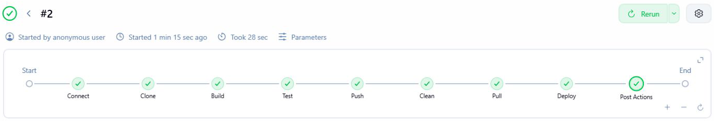](./images/lab3_scm_09_stages_success.png)

*ภาพที่ 15 หน้า Stages ของ build เดียวกัน: `SUCCESS` ใช้เวลา 28 วินาที Connect → Clone → Build → Test → Push → Clean → Pull → Deploy เขียวครบ ตามด้วย Post Actions · คลิกดูภาพเต็มซึ่งแสดงข้อความของ Post Actions: `docker.io/tuchsanai/catfood-shop@sha256:a33d7870…` ที่ deploy*

> build แรกอาจรอช่วง `Obtained ... from git` นานกว่าปกติ เพราะ Jenkins ต้องดึงข้อมูล repository ครั้งแรก รอบถัดไปใช้ cache · ถ้าเห็น stage `Declarative: Checkout SCM` แปลว่า `Jenkinsfile` ที่ Jenkins ดึงมายังเป็นรุ่นก่อนเพิ่ม `skipDefaultCheckout()` จะยังทำงานได้แต่ช้ากว่า

> 📷 ภาพที่ 16–33 (ยกเว้นภาพที่ 30 ที่เปิดดูภายหลัง) ถ่ายจากรอบทดสอบเดิม (2026-09-26) ที่วาง `Jenkinsfile` รุ่นก่อนหน้าในช่อง Pipeline script รุ่นนั้นยังไม่มี `skipDefaultCheckout()` แต่มี 8 stage ลำดับและพฤติกรรมเดียวกัน log ของแต่ละ stage จึงมีรูปแบบเดียวกับโหมด SCM

✅ build #1 `SUCCESS` ครบ 8 stage ใน 1 นาที 14 วินาที:

[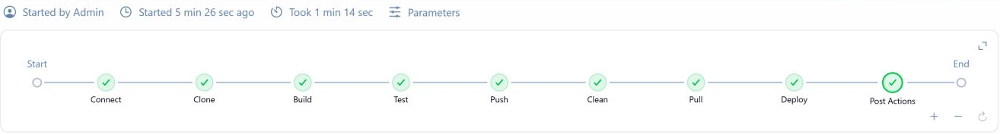](./images/lab3_sib_build1_graph.png)

*ภาพที่ 16 build #1 เขียวครบ 8 stage จาก Connect ถึง Deploy ใช้เวลา 1 นาที 14 วินาที*

stage **Connect** ยืนยันว่า Jenkins ไม่มี docker แต่สั่ง devtools ได้ · บรรทัด `+ sshpass -e ssh ...` ไม่มีรหัสผ่าน (ภาพจากการรัน `Jenkinsfile` ปัจจุบันที่ยังใช้ `sshpass`):

[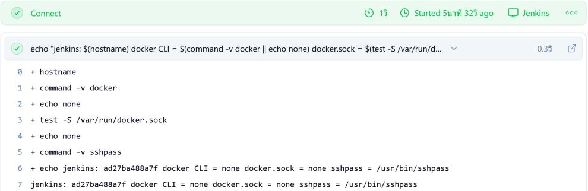](./images/lab3_sib_build1_connect.png)

*ภาพที่ 17 stage Connect ของ build #1 ส่วนที่รันบน Jenkins: `docker CLI = none docker.sock = none sshpass = /usr/bin/sshpass`*

[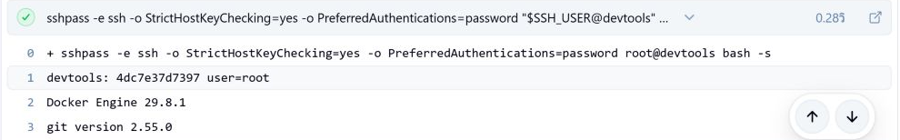](./images/lab3_sib_build1_connect_ssh.png)

*ภาพที่ 18 stage Connect ของ build #1 ส่วนที่ SSH ไป devtools: `sshpass -e ssh -o StrictHostKeyChecking=yes ... root@devtools` แล้ว devtools ตอบ hostname, `user=root`, Docker และ git*

ผลของ stage **Push** และ **Deploy** ใน build #1:

```text
lab3-sibling-20260926r2-1: digest: sha256:ea2559a940026b2eb8feb704f941c7b1980364e02429ac8145e1393d2a2665c8 size: 2006
image: docker.io/<DOCKER_USER>/catfood-shop@sha256:ea2559a940026b2eb8feb704f941c7b1980364e02429ac8145e1393d2a2665c8
เว็บตอบ version 1.0.0 build #1 commit 8b38dc93bc07 ตรงกับ Pipeline
```

เปิด `http://localhost:3000` chip บนแถบด้านบนต้องเป็น `v1.0.0 · build #1`

## ขั้นที่ 6 — ออกเวอร์ชันใหม่ `APP_VERSION=1.1.0`

job `docker-build-push` → **Build with Parameters** → เปลี่ยนเฉพาะ `APP_VERSION` เป็น `1.1.0` → **Build**

[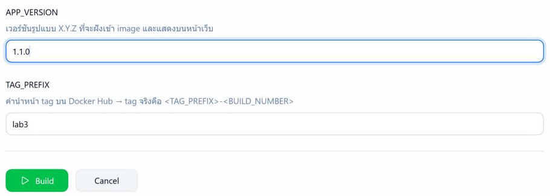](./images/lab3_sib_build_parameters.png)

*ภาพที่ 19 ฟอร์ม **Build with Parameters** กรอก `APP_VERSION` = `1.1.0` แล้วกด **Build** (ภาพถ่ายหลังจบแล็บ ใช้แสดงหน้าตาฟอร์ม)*

✅ build #2 `SUCCESS` ใน 30 วินาที · เลือก stage ทางซ้ายของหน้า build เพื่อดู log:

[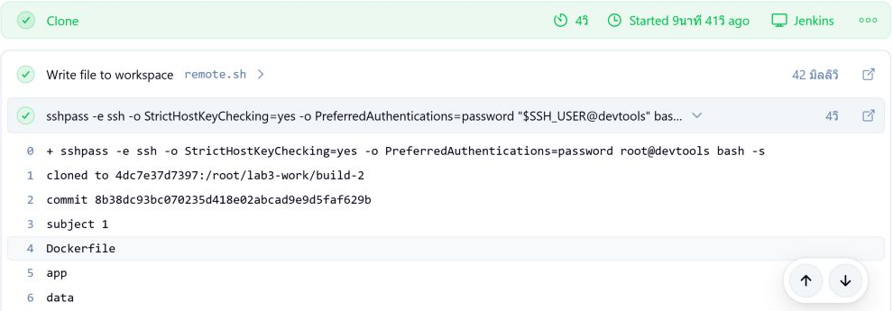](./images/lab3_sib_build2_clone.png)

*ภาพที่ 20 build #2 stage Clone: clone ลง `/root/lab3-work/build-2` บน devtools และได้ commit ของซอร์ส*

[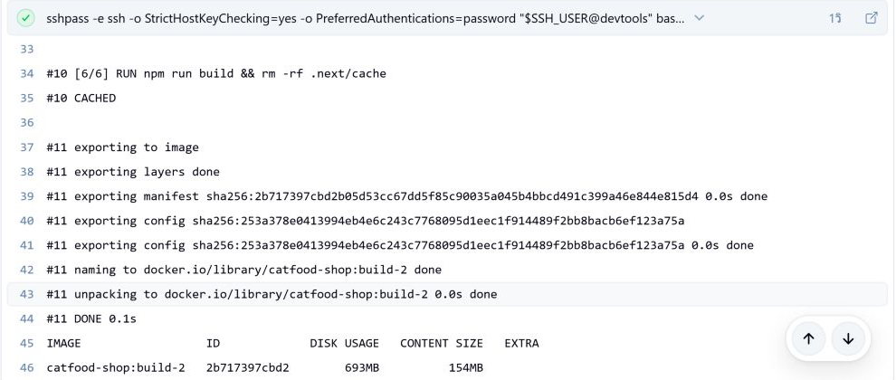](./images/lab3_sib_build2_build.png)

*ภาพที่ 21 build #2 stage Build ช่วงท้าย: ได้ image `catfood-shop:build-2` และ manifest `sha256:2b717397…` ซึ่งจะเป็น digest ที่ Push ได้*

[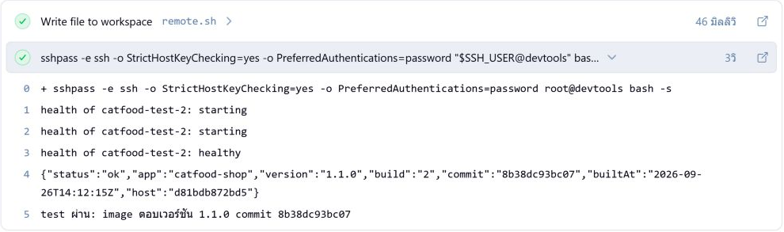](./images/lab3_sib_build2_test.png)

*ภาพที่ 22 build #2 stage Test: `catfood-test-2` ถึง `healthy` และตอบ version `1.1.0` build `2`*

[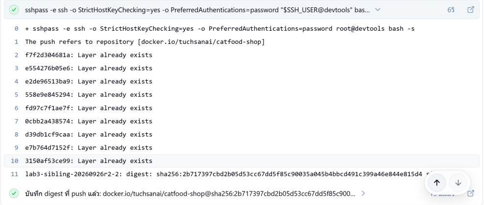](./images/lab3_sib_build2_push.png)

*ภาพที่ 23 build #2 stage Push: layer ส่วนใหญ่มีบน Docker Hub แล้วจาก build #1 (`Layer already exists`) และได้ digest `sha256:2b717397…`*

[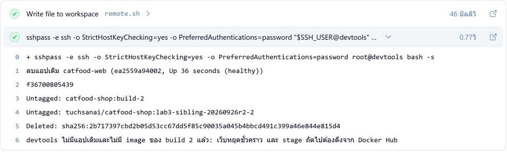](./images/lab3_sib_build2_clean.png)

*ภาพที่ 24 build #2 stage Clean: ลบร้านเดิม `catfood-web` ของ build #1 (`ea2559a94002`) แล้วลบ image ของ build 2 ออกจาก devtools*

[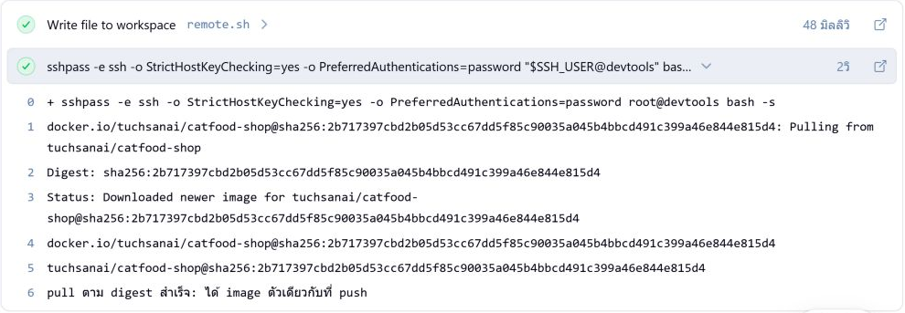](./images/lab3_sib_build2_pull.png)

*ภาพที่ 25 build #2 stage Pull: ดึง `catfood-shop@sha256:2b717397…` กลับจาก Docker Hub (`Downloaded newer image`)*

[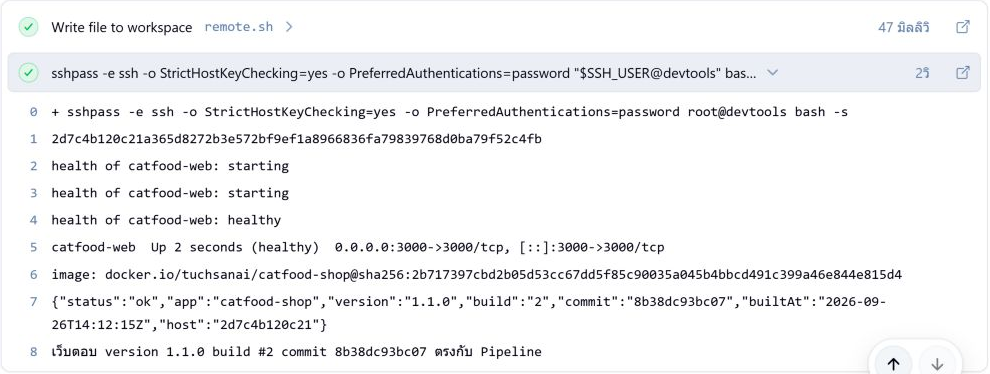](./images/lab3_sib_build2_deploy.png)

*ภาพที่ 26 build #2 stage Deploy: `catfood-web` รันจาก `catfood-shop@sha256:2b717397…` และเว็บตอบ version `1.1.0` build #2*

Push, Pull และ Deploy ของ build #2 ใช้ digest เดียวกัน:

```text
lab3-sibling-20260926r2-2: digest: sha256:2b717397cbd2b05d53cc67dd5f85c90035a045b4bbcd491c399a46e844e815d4 size: 2006
Digest: sha256:2b717397cbd2b05d53cc67dd5f85c90035a045b4bbcd491c399a46e844e815d4
image: docker.io/<DOCKER_USER>/catfood-shop@sha256:2b717397cbd2b05d53cc67dd5f85c90035a045b4bbcd491c399a46e844e815d4
เว็บตอบ version 1.1.0 build #2 commit 8b38dc93bc07 ตรงกับ Pipeline
```

เปิด `http://localhost:3000` chip ต้องเป็น `v1.1.0 · build #2`:

[](./images/lab3_sib_app_v110.png)

*ภาพที่ 27 หน้าร้านหลัง build #2 chip บนแถบด้านบนแสดง `v1.1.0 · build #2`*

[](./images/lab3_sib_app_deployment.png)

*ภาพที่ 28 ส่วน Deployment info ท้ายหน้าร้าน: Version `1.1.0`, Jenkins build `#2`, commit และ Container `2d7c4b120c21` ตรงกับ `host` ใน log ของ Deploy*

หน้า Tags บน Docker Hub มี tag ของ build #1 และ #2 และ digest ตรงกับ console:

[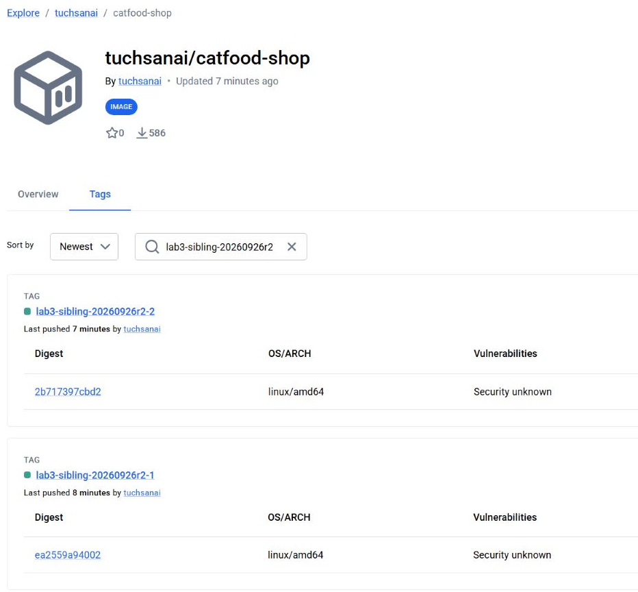](./images/lab3_sib_hub_tags.png)

*ภาพที่ 29 หน้า Tags ของ repository `catfood-shop` บน Docker Hub กรองตาม prefix ของรอบทดสอบ: tag `-2` digest `2b717397cbd2` และ tag `-1` digest `ea2559a94002` ตรงกับ console*

[](./images/lab3_scm_dockerhub_tags.png)

*ภาพที่ 30 หน้า Tags เดียวกันเปิดภายหลังด้วย browser ของเครื่อง host: tag `lab3-sibling-20260926r2-2` digest `2b717397cbd2` และ `-1` digest `ea2559a94002` พร้อมคำสั่ง `docker pull tuchsanai/catfood-shop:<tag>` · เป็น tag ของรอบทดสอบ 2026-09-26 ไม่ใช่รอบทดสอบ SCM*

🔍 **สืบย้อนได้ครบ:** chip `v1.1.0 · build #2` → Container ใน Deployment info (`host` ใน `/api/health`) → `image: <repo>@sha256:...` ใน Deploy → digest ที่ Push จดไว้ → build #2 → commit จาก Clone

## ขั้นที่ 7 — ลองค่าผิด 3 แบบ ร้านเดิมต้องยังอยู่

**(ก)** Build with Parameters กรอก `APP_VERSION` = `1.2.0; id` → build #3 `FAILURE` ที่ Connect ก่อนส่งค่านี้ผ่าน SSH (SSH ที่เห็นมาจาก `post` ซึ่งลบแค่ของชั่วคราว)

```text
Started by user Admin
Running on Jenkins in /var/jenkins_home/workspace/docker-build-push
+ sshpass -e ssh -o StrictHostKeyChecking=yes -o PreferredAuthentications=password root@devtools bash -s
เก็บกวาดของ build ที่ล้มแล้ว: catfood-test-3 /tmp/lab3-docker-3 /root/lab3-work/build-3
ERROR: APP_VERSION ไม่ถูกต้อง: ต้องเป็นรูปแบบ X.Y.Z เช่น 1.0.0
Finished: FAILURE
```

[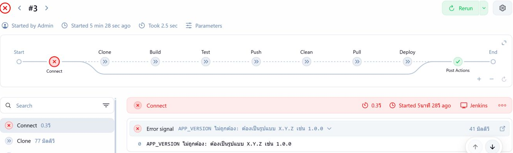](./images/lab3_sib_build3.png)

*ภาพที่ 31 build #3 (`APP_VERSION=1.2.0; id`) Connect แดงด้วย `APP_VERSION ไม่ถูกต้อง` stage อื่นถูกข้าม — ล้มตามที่ตั้งใจ*

**(ข)** กรอก `GIT_REF` = `no-such-branch` (ผ่าน Connect เพราะรูปแบบถูก) → build #4 `FAILURE` ที่ Clone

[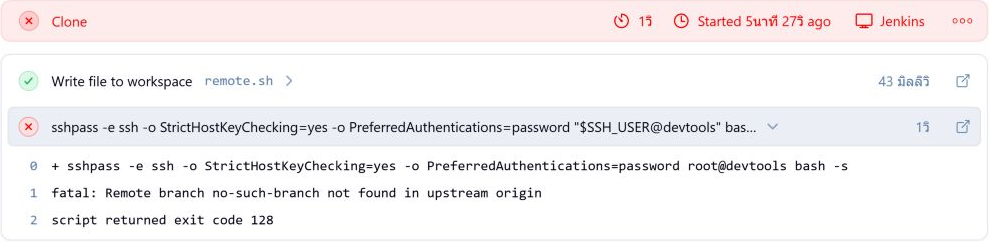](./images/lab3_sib_build4.png)

*ภาพที่ 32 build #4 (`GIT_REF=no-such-branch`) Clone แดง: `Remote branch no-such-branch not found` exit code 128 — ล้มตามที่ตั้งใจ*

**(ค)** credential `devtools-ssh` → **Update** → **Change Password** เป็นค่าอื่น → **Save** → **Build Now** → build #5 `FAILURE` ที่ Connect (`sshpass` exit code 5 = รหัสผิด) · **จากนั้นแก้ Password กลับเป็น `passwd`**

[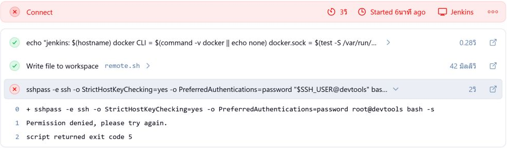](./images/lab3_sib_build5.png)

*ภาพที่ 33 build #5 (รหัสผ่าน SSH ผิด) Connect แดง: `Permission denied, please try again.` และ exit code 5 — ล้มตามที่ตั้งใจ*

ตรวจจาก host ว่าร้านยังเป็น container เดิมของ build #2:

<!-- lab3-test:check-web -->
```bash
docker exec devtools curl -s -w "\n" localhost:3000/api/health
docker exec devtools docker ps --filter label=devtools.lab=lab3 --format '{{.Names}}  {{.Status}}  build={{.Label "devtools.build"}}'
```

```text
{"status":"ok","app":"catfood-shop","version":"1.1.0","build":"2","commit":"8b38dc93bc07","builtAt":"2026-09-26T14:12:15Z","host":"2d7c4b120c21"}
catfood-web  Up About a minute (healthy)  build=2
```

ทั้งสาม build ล้ม **ก่อน Clean** ร้านเดิมจึงไม่ถูกแตะ

## ✅ ตรวจปิดแล็บ

- [ ] `docker exec jenkins sh -c "command -v docker || echo 'docker: none'"` ได้ `docker: none` และ `docker network inspect cicd-net` มีทั้ง `jenkins` และ `devtools`
- [ ] `docker exec jenkins ssh-keygen -lF devtools` ได้ fingerprint ตรงกับ `docker exec devtools ssh-keygen -lf /etc/ssh/ssh_host_ed25519_key.pub`
- [ ] Credentials มี `devtools-ssh` (`root`) และ `dockerhub` · job `docker-build-push` เป็น **Pipeline script from SCM** ชี้ไปที่ Script Path ของแล็บนี้
- [ ] build #1 และ #2 `SUCCESS` ครบ 8 stage · Clean ของ #2 มี `ลบแอปเดิม catfood-web (...)` · digest ใน Push, Pull, Deploy ตรงกัน
- [ ] หน้า Tags บน Docker Hub มี `lab3-1` และ `lab3-2` · `http://localhost:3000` แสดง `v1.1.0 · build #2`
- [ ] build ในขั้นที่ 7 ล้มตามที่คาด ร้านยังเป็น build #2 และแก้รหัส `devtools-ssh` กลับเป็น `passwd` แล้ว

## แก้ปัญหาที่พบบ่อย

| อาการ | วิธีแก้ |
|---|---|
| `sshpass: not found` ใน Connect | `Jenkinsfile` ปัจจุบันยังต้องใช้ `sshpass` แต่ขั้นติดตั้งถูกตัดออกจากร่างนี้ · จะหายไปเมื่อเปลี่ยนเป็น SSH ผ่าน plugin ของ Jenkins ในรอบถัดไป |
| `Could not resolve hostname devtools` | `docker network inspect cicd-net` ต้องเห็นทั้งสองตัว ถ้าไม่เห็นให้ `docker network connect cicd-net devtools` |
| `Host key verification failed.` | `Jenkinsfile` ปัจจุบันตรวจ host key แบบเข้มงวด แต่ขั้น pin host key ถูกตัดออกจากร่างนี้ · วิธีจัดการ host key แบบใหม่จะกำหนดและทดสอบในรอบถัดไป |
| `Permission denied, please try again.` / `exit code 5` | แก้ Password ของ `devtools-ssh` เป็น `passwd` |
| `Could not find credentials entry with ID ...` | ตั้ง ID เป็น `devtools-ssh` และ `dockerhub` ให้ตรงตัว (ขั้นที่ 3 · หน้า Manage Jenkins → Credentials → System → Global) |
| `Unable to find 04_Jenkins/.../Jenkinsfile from git` / `Couldn't find any revision to build` | ตรวจ Repository URL, Branch Specifier `*/main` และ Script Path ในข้อ 4.2 ให้ตรงตัว (ตัวพิมพ์เล็ก-ใหญ่มีผล) |
| `Failed to connect to repository` ตอน Save หรือ build ค้างที่ `Obtained ...` | `jenkins` ต้องออก internet ไป `github.com` ได้ · build แรกดึงข้อมูลนานกว่าปกติ |
| `user=****` หรือ `/****/lab3-work` ใน console | เอาติ๊ก **Treat username as secret** ของ `devtools-ssh` ออก |
| `... ไม่ถูกต้อง: ...` ใน Connect | แก้ parameter ตามข้อความ (`X.Y.Z`, `https://...`, username Docker Hub ตัวพิมพ์เล็ก) |
| `Remote branch ... not found` ใน Clone | ตรวจว่า `GIT_REF`/`GIT_URL` มีจริงและเป็น Public |
| `unauthorized` / `denied` ใน Push หรือ Pull | token ผิด หมดอายุ หรือไม่มีสิทธิ์ Write → สร้างใหม่แล้วแก้ `dockerhub` |
| `พบ container catfood-web ที่ไม่ได้สร้างโดย LAB 3` / `port 3000 ถูก container อื่นใช้อยู่` | `docker exec devtools docker ps -a` ลบเฉพาะตัวที่ไม่ใช้แล้ว แล้ว Build ใหม่ |
| เปิด `localhost:3000` ไม่ได้ทั้งที่ Deploy เขียว | `docker port devtools` ถ้าไม่มี 3000 ให้ทำขั้นที่ 1 ใหม่ |

## 🧹 เก็บกวาด (🖥️ host)

**ห้ามลบ** `devtools`, `jenkins`, volume `jenkins_home`, network `cicd-net` และ credential ทั้งสอง เพราะแล็บถัดไปใช้ต่อ บล็อกนี้ลบเฉพาะ container/image ที่มี label `devtools.lab=lab3` บน Docker ของ devtools และไฟล์ชั่วคราว:

<!-- lab3-test:cleanup -->
```bash
docker exec devtools sh -c "docker ps -aq --filter label=devtools.lab=lab3 | xargs -r docker rm -f"
docker exec devtools sh -c "docker image ls -aq --filter label=devtools.lab=lab3 | sort -u | xargs -r docker image rm -f"
docker exec devtools sh -c "rm -rf /root/lab3-work /tmp/lab3-docker-*"
docker exec devtools docker ps -a --format '{{.Names}}'
docker ps --filter name=^devtools$ --filter name=^jenkins$ --format '{{.Names}}  {{.Status}}'
```

จบรายวิชาแล้วให้ลบ credential ทั้งสองและ revoke token ที่ Docker Hub · เปิดเครื่องใหม่ container ทั้งหมด (รวม `catfood-web`) จะกลับมาเอง (`--restart unless-stopped`) ถ้าไม่ขึ้นให้ `docker start devtools jenkins`

## 🤔 คำถามทบทวน

1. ถ้าสร้าง `devtools` (ข้อ 1.1) โดยไม่ใส่ `--network cicd-net` stage ใดจะล้มก่อน และ error คืออะไร
2. ทำไม Jenkins จึงเก็บ username/password ของ `devtools` ไว้ใน Credentials แทนที่จะให้ผู้เรียนพิมพ์รหัสเองทุกครั้ง
3. ทำไม Jenkinsfile ใช้ `sshpass -e` แทน `sshpass -p passwd` และใช้ `sh '...'` แทน `sh "..."`
4. ทำไม Clean ต้องเกิด **หลัง** Push สำเร็จ และทำไม Pull/Deploy ใช้ `repository@sha256:...` แทน `repository:tag`
5. Credential ที่เพิ่มผ่าน **System → Global** ใช้ได้กับ job ใดบ้าง และทำไม `Jenkinsfile` จึงอ้างแค่ ID (`devtools-ssh`, `dockerhub`) ไม่ใส่รหัสผ่านหรือ token
6. ในโหมด Pipeline script from SCM ทำไม Jenkins ต้องดึง `Jenkinsfile` เองแทนที่จะให้ devtools clone ให้ และ `skipDefaultCheckout()` ช่วยอะไร

ผลทดสอบรอบ Pipeline script ดู [รายงานผลทดสอบ](./LAB003_FINAL_REPORT.md) · โหมด Pipeline script from SCM ทดสอบเพิ่มเมื่อ 2026-09-27 (build จริงครบ 8 stage)

➡️ **แล็บถัดไป:** [LAB 4 — Pipeline from Git](../004_LAB_Pipeline_From_Git/README.md)
