# LAB 4 — Pipeline จาก GitHub และ Poll SCM

แล็บประมาณ 40 นาทีนี้ศึกษาการเก็บ `Jenkinsfile` ร่วมกับ source code บน GitHub การให้ Jenkins checkout public repository โดยไม่ใช้ credential และการใช้ Poll SCM ตรวจ commit ใหม่ เมื่อจบแล็บ นักศึกษาจะอธิบายเส้นทาง push กับ checkout ที่ใช้ URL เดียวกันแต่ยืนยันตัวตนต่างกัน และพิสูจน์ได้ว่า build อัตโนมัติ checkout SHA เดียวกับที่ push

## ทฤษฎีก่อนลงมือ

Pipeline-as-Code คือการเก็บนิยาม pipeline ไว้ใน version control ร่วมกับ source code การแก้ pipeline จึงผ่าน review, history และ rollback แบบเดียวกับโค้ด และ Jenkins สามารถโหลด `Jenkinsfile` ของ revision ที่กำลัง build ได้โดยตรง

public repository ทำให้การอ่านผ่าน HTTPS ไม่ต้องมี credential แต่การเขียนยังต้องยืนยันสิทธิ์ เจ้าของ repository จึงมอง URL เดียวกันได้สองแบบดังนี้

| ผู้เรียก | URL | การยืนยันตัวตน | การกระทำ |
|---|---|---|---|
| Git ใน devtools | `https://github.com/<GITHUB_USER>/hello-ci.git` | Username=`<GITHUB_USER>`, Password=`<GITHUB_TOKEN>` ที่ prompt | push commit ขึ้น `main` |
| Jenkins | `https://github.com/<GITHUB_USER>/hello-ci.git` | `- none -` | checkout public repository |

Poll SCM เป็น pull model: Jenkins เป็นฝ่ายติดต่อ GitHub ตาม cron แล้วเริ่ม build เมื่อ revision เปลี่ยน จึงมีความหน่วงถึงรอบตรวจถัดไปและมี outbound request แม้รอบนั้นไม่มี commit ใหม่ เปรียบเทียบ pull model กับ push model ได้จาก slide **ตอนที่ 5.3 — GitHub Webhook + smee relay** (diagram D9 ครึ่งบน)

## 🎯 Learning Objectives — ผลลัพธ์การเรียนรู้

- สร้าง public repository `<GITHUB_USER>/hello-ci` โดยไม่ initialize จากหน้าเว็บ
- push `Jenkinsfile`, `hello.sh` และ `expected.txt` โดยไม่ใส่ PAT ใน URL
- สร้าง `hello-ci-pipeline` แบบ Pipeline script from SCM โดยไม่มี `credentialsId`
- เปิด Poll SCM ด้วย `* * * * *` และแยกหลักฐาน polling decision ออกจาก build cause
- ยืนยันว่า SHA ที่ Jenkins checkout ตรงกับ `origin/main`

## การทดลองที่ 1 — สภาพจบ LAB 3 และ GitHub พร้อมหรือไม่? (~3 นาที)

**คำถาม:** Jenkins จาก LAB 3 ยังทำงาน และ PAT เป็นของบัญชีที่ระบุพร้อม scope สำหรับแล็บต่อเนื่องหรือไม่?

รันใน devtools โดยแทน placeholder ด้วยค่าจริงเฉพาะใน shell; ห้ามบันทึก token ลงไฟล์หรือ command history ที่เผยแพร่

```bash
docker ps
```

✅ **ผลที่สังเกตได้จากการรันจริง**

```text
CONTAINER ID   IMAGE                 COMMAND                  CREATED          STATUS          PORTS                                                    NAMES
c49cc54fbb9e   jenkins-docker:2569   "/usr/bin/tini -- /u…"   <เวลา>           Up <เวลา>       0.0.0.0:8080->8080/tcp, [::]:8080->8080/tcp, 50000/tcp   jenkins
```

```bash
export GITHUB_USER='<GITHUB_USER>'
read -rsp 'GitHub PAT: ' GITHUB_TOKEN
printf '\n'
export GITHUB_TOKEN

(
  cd "$COURSE_ROOT"
  bash tools/bootstrap/github_preflight.sh
)
```

✅ **ผลที่สังเกตได้จากการรันจริง**

```text
[github-preflight] กำลังตรวจบัญชีและสิทธิ์ของ GitHub token...
[github-preflight][ผ่าน] login ตรงกับ GITHUB_USER และ scope ผ่านชุด <SCOPE_PROFILE>
[github-preflight] GitHub API requests: 1
```

`<SCOPE_PROFILE>` ต้องเป็น `public_repo + admin:repo_hook` (ชุดแนะนำสำหรับ public repo) หรือ `repo`; preflight เรียก `GET /user` และตรวจ scope จาก response header โดยไม่สร้าง probe repositoryและไม่พิมพ์ token คำสั่ง `read -rsp` ป้องกัน PAT โผล่บนจอและใน history—ห้ามแทน token จริงในคำสั่ง `export`

## การทดลองที่ 2 — เหตุใด push ต้องใช้ PAT แต่ checkout ไม่ต้องใช้? (~3 นาที)

**คำถาม:** สิทธิ์ของผู้เขียนกับผู้อ่าน public repository ต่างกันอย่างไร และ Poll SCM เริ่มการตรวจจากฝั่งใด?

ใช้ตารางในหัวข้อทฤษฎีไล่เส้นทางข้อมูล: push เป็น write จึงต้องใช้ PAT ที่ prompt ส่วน Jenkins checkout เป็น anonymous read และ Poll SCM เริ่ม request จาก Jenkins ไม่ใช่ GitHub

✅ **สิ่งที่ต้องสรุปได้**

```text
git push = authenticated write
Jenkins checkout = anonymous read
Poll SCM = Jenkins-initiated pull model
```

## การทดลองที่ 3 — Repository ว่างบน GitHub ต้องกำหนดอย่างไร? (~5 นาที)

**คำถาม:** เราจะสร้าง public repository ว่างชื่อ `hello-ci` เพื่อรับ commit แรกจาก devtools ได้หรือไม่?

1. ลงชื่อเข้า GitHub แล้วกด **+ → New repository**
2. เลือก Owner เป็น `<GITHUB_USER>` และกรอก **Repository name** เป็น `hello-ci`
3. เลือก **Public** และไม่เลือก **Add a README file**, `.gitignore` หรือ license
4. กด **Create repository**

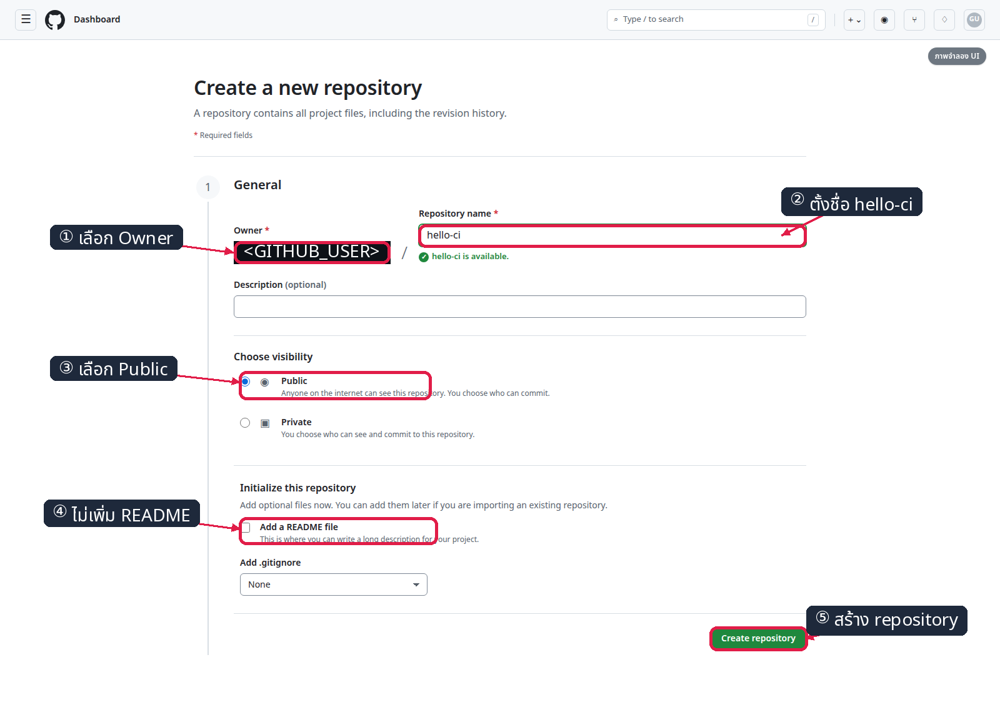

*ภาพที่ 1: ภาพจำลอง — UI จริงอาจต่างเล็กน้อย; กรอกชื่อ `hello-ci`, เลือก Public, ไม่ initialize แล้วกด Create repository ดูขั้นตอนอ้างอิงจาก [GitHub Docs: Creating a new repository](https://docs.github.com/en/repositories/creating-and-managing-repositories/creating-a-new-repository)*

เปิด `https://github.com/<GITHUB_USER>/hello-ci` หลังสร้างสำเร็จ หน้า public ต้องระบุว่า repository ยังว่าง

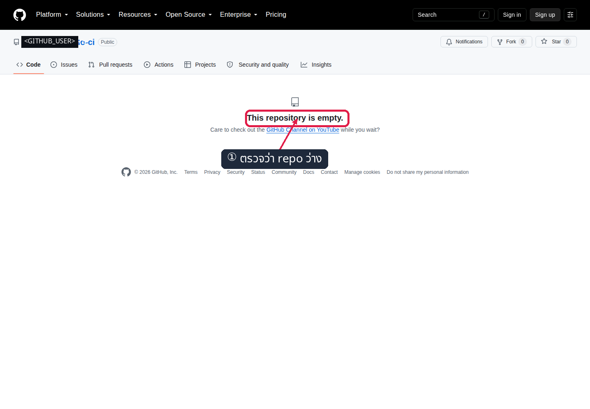

*ภาพที่ 2: หลักฐานจริงจากหน้า public repository ที่ว่าง โดย mask ชื่อเจ้าของเป็น `<GITHUB_USER>` ตั้งแต่ตอน capture*

> **ทางเลือกอัตโนมัติสำหรับผู้สอน (รันจาก host):** Playwright อยู่ใน `/opt/venv` และ helper ใช้ GitHub API จึงไม่ login ผ่านหน้าเว็บ ให้กำหนด `COURSE_ROOT`, `GITHUB_USER` และ `GITHUB_TOKEN` ใน environment ก่อนรัน; วิธีนี้แทนขั้นคลิกสำหรับการเตรียม/ตรวจชั้นเรียน แต่ภาพจำลองยังใช้สอนลำดับ UI
>
> ```bash
> (
>   cd "$COURSE_ROOT"
>   /opt/venv/bin/python tools/ui/lab4_scm_repo.py --action create
> )
> ```
>
> ✅ **ผลที่สังเกตได้จากการรันจริง**
>
> ```text
> [ui][<เวลา>] assert: GitHub API created hello-ci
> [ui][<เวลา>] assert: repository owner matches GITHUB_USER
> [ui][<เวลา>] assert: repository name is hello-ci
> [ui][<เวลา>] assert: hello-ci is public
> [ui][<เวลา>] assert: new repository has no initialized main branch
> [ui][<เวลา>] PASS
> ```

## การทดลองที่ 4 — ไฟล์ของแล็บจะขึ้น branch main โดยไม่เก็บ PAT ได้อย่างไร? (~6 นาที)

**คำถาม:** working tree ใหม่จะ commit ไฟล์ของแล็บด้วย identity ระดับ repository แล้ว push ไป GitHub อย่างปลอดภัยได้หรือไม่?

```bash
mkdir "$HOME/hello-ci"
cp "$COURSE_ROOT"/004_LAB_Pipeline_From_Git/Jenkinsfile "$HOME/hello-ci/"
cp "$COURSE_ROOT"/004_LAB_Pipeline_From_Git/hello.sh "$HOME/hello-ci/"
cp "$COURSE_ROOT"/004_LAB_Pipeline_From_Git/expected.txt "$HOME/hello-ci/"
cp "$COURSE_ROOT"/004_LAB_Pipeline_From_Git/.course-cicd2569 "$HOME/hello-ci/"
cd "$HOME/hello-ci"
chmod +x hello.sh

git init -b main
git config user.name Student
git config user.email student@example.invalid

git add .course-cicd2569 Jenkinsfile hello.sh expected.txt
git commit -m 'Add Pipeline as Code'

git remote add origin https://github.com/<GITHUB_USER>/hello-ci.git
git push -u origin main
```

เมื่อ Git ถาม credential ให้กรอก **Username** เป็น `<GITHUB_USER>` และ **Password** เป็น `<GITHUB_TOKEN>` GitHub ใช้ PAT แทน account password สำหรับ HTTPS push

✅ **ผลที่สังเกตได้จากการรันจริง**

```text
Initialized empty Git repository in /root/hello-ci/.git/
[main (root-commit) <SHA>] Add Pipeline as Code
 4 files changed, 32 insertions(+)
 create mode 100644 .course-cicd2569
 create mode 100644 Jenkinsfile
 create mode 100644 expected.txt
 create mode 100755 hello.sh
To https://github.com/<GITHUB_USER>/hello-ci.git
 * [new branch]      main -> main
branch 'main' set up to track 'origin/main'.
```

`.course-cicd2569` เป็นไฟล์ประจำชุดแล็บ เพื่อให้สคริปต์ bootstrap รู้ว่า repo นี้เป็นของแล็บและกู้สถานะได้ปลอดภัย

ห้ามเขียน token ลง URL เช่น `https://<GITHUB_TOKEN>@...` และห้ามใช้ `credential.helper store` เพราะทั้งสองแบบทำให้ secret คงอยู่บนดิสก์ หลัง push ให้ refresh หน้า repository และตรวจ branch `main` กับไฟล์ทั้งสี่

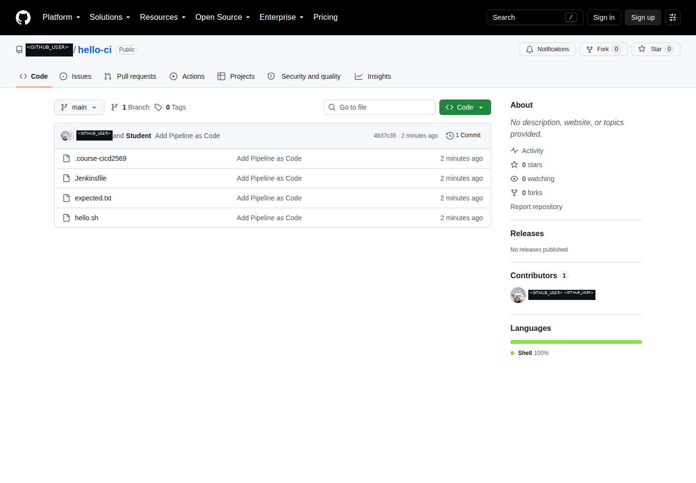

*ภาพที่ 3: หลักฐานจริงหลัง marker fix ว่า branch `main` มีไฟล์ครบ 4 รายการ: `.course-cicd2569`, `Jenkinsfile`, `hello.sh`, `expected.txt`; mask ชื่อเจ้าของก่อนบันทึกภาพ*

## การทดลองที่ 5 — Jenkins จะโหลด Pipeline จาก GitHub อย่างไร? (~7 นาที)

**คำถาม:** Job `hello-ci-pipeline` จะบันทึก anonymous GitHub checkout, branch และ Script Path ตรง contract ได้หรือไม่?

1. เปิด `http://localhost:8080` แล้วเลือก **New Item**
2. กรอก `hello-ci-pipeline`, เลือก **Pipeline** แล้วกด **OK**

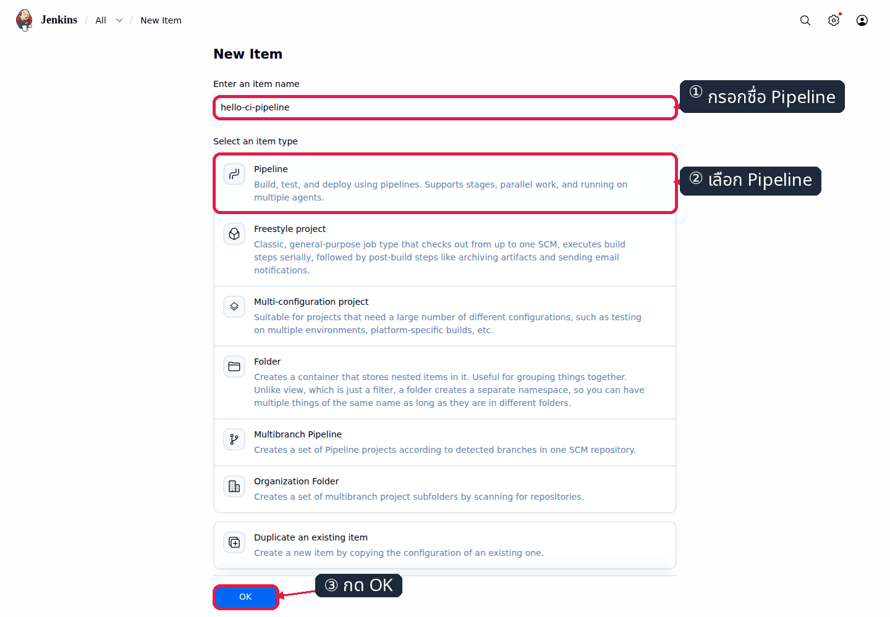

*ภาพที่ 4: เลือกชื่อ `hello-ci-pipeline` และชนิด Pipeline ก่อนกด OK*

1. ในส่วน **Pipeline** เลือก Definition → **Pipeline script from SCM** และ SCM → **Git**
2. กรอก Repository URL `https://github.com/<GITHUB_USER>/hello-ci.git`
3. เลือก Credentials → **- none -**, กรอก Branch Specifier `*/main` และ Script Path `Jenkinsfile`
4. กด **Save**


*ภาพที่ 5: URL ถูก mask เป็น placeholder; ต้องสังเกต GitHub HTTPS, credential ว่าง, branch `*/main` และ `Jenkinsfile`*

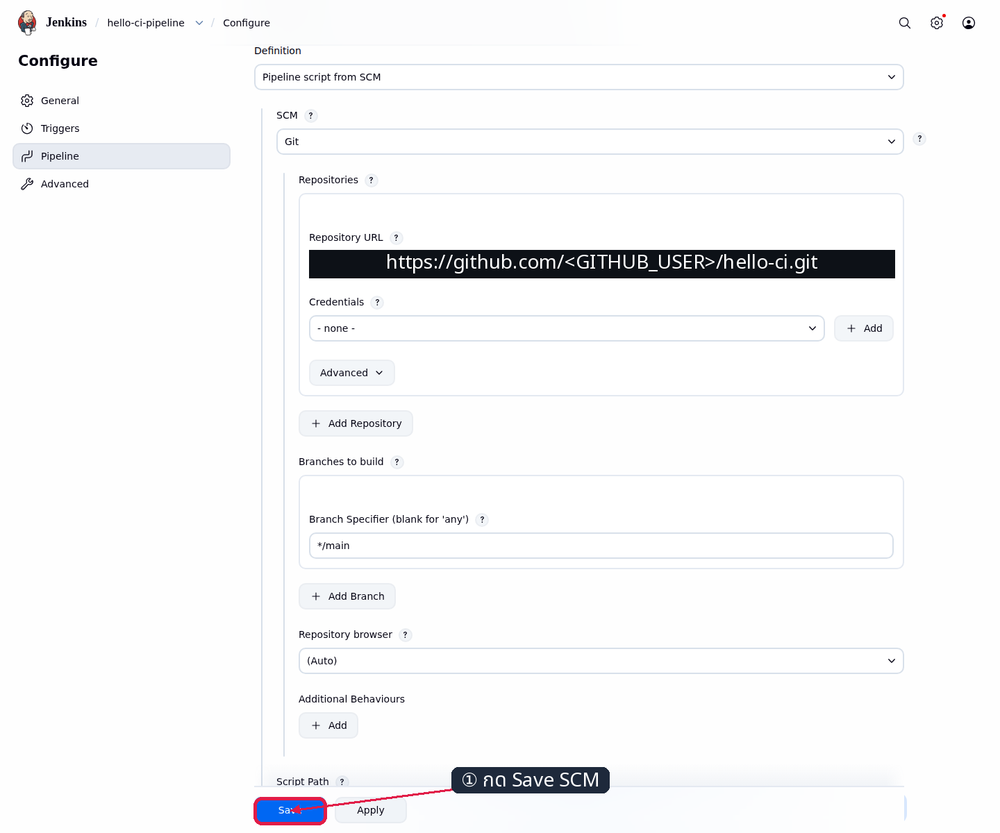

*ภาพที่ 5.1: หน้า Jenkins จริง มี marker ชี้ปุ่ม Save หลังกรอก SCM contract ครบ*

> **ทางเลือกอัตโนมัติสำหรับผู้สอน (รันจาก host):** helper เปิด Jenkins UI จริงผ่าน Playwright สร้าง New Item และกรอก Pipeline section ตามลำดับเดียวกับนักศึกษา
>
> ```bash
> (
>   cd "$COURSE_ROOT"
>   JENKINS_BASE_URL=http://localhost:8080 /opt/venv/bin/python tools/ui/lab4_scm_job.py --action configure
> )
> ```
>
> ✅ **ผลที่สังเกตได้จากการรันจริง**
>
> ```text
> [ui][<เวลา>] assert: job definition is Pipeline script from SCM
> [ui][<เวลา>] assert: saved SCM URL is the anonymous GitHub HTTPS URL
> [ui][<เวลา>] assert: saved branch is main
> [ui][<เวลา>] assert: saved Script Path is Jenkinsfile
> [ui][<เวลา>] assert: public repository checkout has no credentialsId
> [ui][<เวลา>] PASS
> ```

## การทดลองที่ 6 — Manual build พิสูจน์ checkout และ test ได้หรือไม่? (~4 นาที)

**คำถาม:** Build Now จะโหลด `Jenkinsfile` จาก GitHub และรันผลทดสอบจนจบ SUCCESS หรือไม่?

1. ที่หน้า `hello-ci-pipeline` กด **Build Now**
2. เปิด build ล่าสุด → **Console Output**
3. ตรวจ revision, ข้อความจาก `hello.sh` และสถานะบรรทัดสุดท้าย

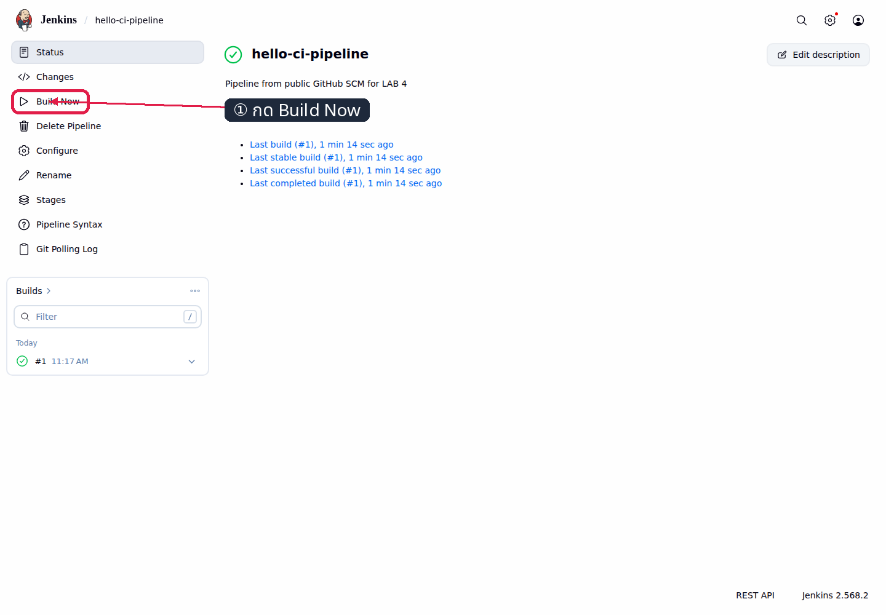

*ภาพที่ 6.1: หน้า Jenkins จริง มี marker ชี้ Build Now ก่อนสร้าง manual build*

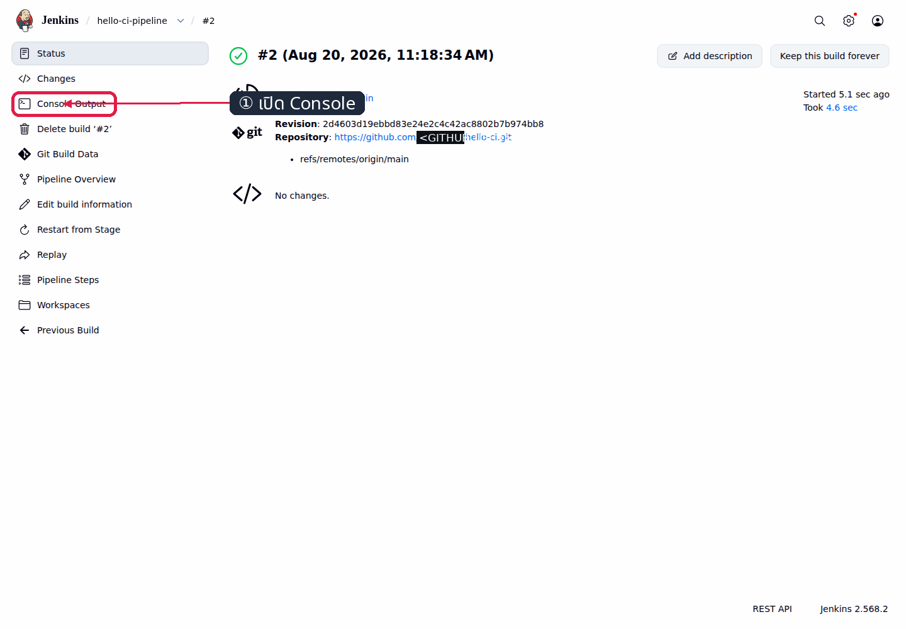

*ภาพที่ 6.2: หน้า build จริง มี marker ชี้ลิงก์ Console Output*

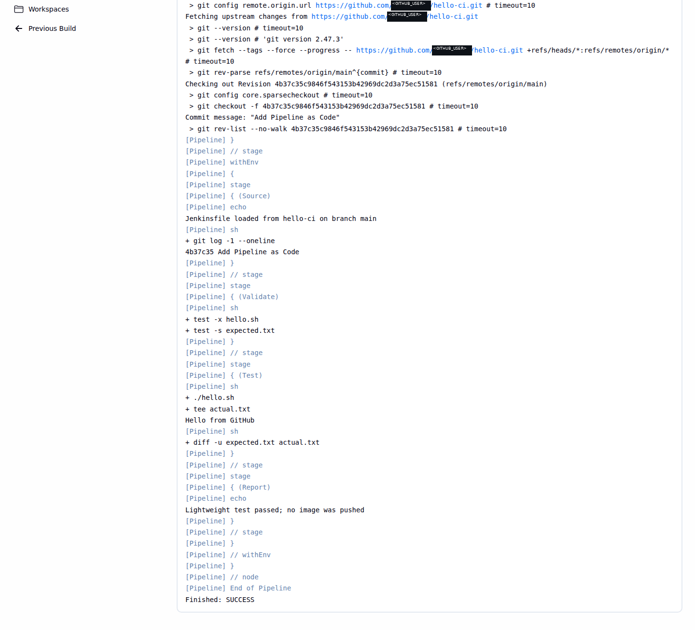

*ภาพที่ 6: หลักฐานจริงของ Git checkout, `Hello from GitHub` และ `Finished: SUCCESS`; capture ผ่านขั้น mask ก่อนบันทึก*

✅ **ผลที่สังเกตได้จากการรันจริง**

```text
Checking out Revision <SHA> (refs/remotes/origin/main)
Hello from GitHub
Lightweight test passed; no image was pushed
Finished: SUCCESS
```

## การทดลองที่ 7 — Poll SCM ทุกนาทีบันทึกใน job ได้หรือไม่? (~4 นาที)

**คำถาม:** Jenkins จะบันทึก trigger หนึ่งตัวด้วย schedule `* * * * *` ผ่านหน้า Configure ได้หรือไม่?

1. ไปที่ **hello-ci-pipeline → Configure → Triggers**
2. เลือก **Poll SCM** และกรอก Schedule `* * * * *`
3. อ่านคำเตือน **Do you really mean “every minute”** แล้วกด **Save**

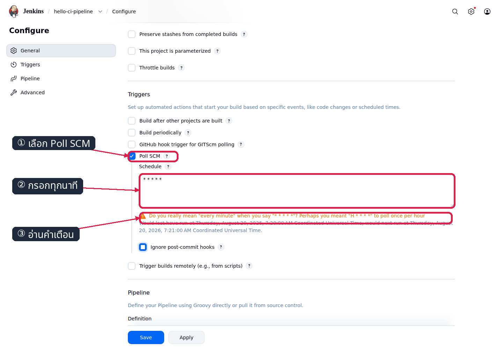

*ภาพที่ 7: Poll SCM ถูกเลือกและ schedule มีเครื่องหมาย `*` ห้าช่อง พร้อมคำเตือน every minute*

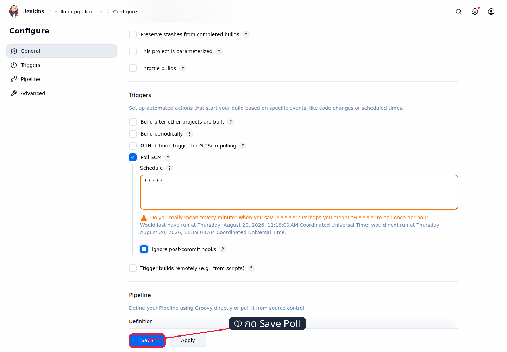

*ภาพที่ 7.1: หน้า Jenkins จริง มี marker ชี้ปุ่ม Save หลังตั้ง Poll SCM*

> **ทางเลือกอัตโนมัติสำหรับผู้สอน (รันจาก host):**
>
> ```bash
> (
>   cd "$COURSE_ROOT"
>   JENKINS_BASE_URL=http://localhost:8080 DT_NAME=devtools-jenkins /opt/venv/bin/python tools/ui/lab4_scm_poll.py --action enable
> )
> ```
>
> ✅ **ผลที่สังเกตได้จากการรันจริง**
>
> ```text
> [ui][<เวลา>] assert: exactly one Poll SCM trigger is present in config.xml
> [ui][<เวลา>] assert: Poll SCM schedule is * * * * *
> [ui][<เวลา>] baseline: build #N; timer started for the next SCM change
> [ui][<เวลา>] PASS
> ```

`* * * * *` ตั้งใจใช้เพื่อสังเกตทุกนาทีในแล็บและมี outbound request จริง จึงไม่ควรเปิดทิ้งโดยไม่จำเป็น ห้ามใช้ `H/1`: Jenkins ตีความเป็นนาทีที่ hash ได้หนึ่งครั้งต่อชั่วโมง ไม่ใช่ทุกหนึ่งนาที

## การทดลองที่ 8 — Commit ใหม่ทำให้เกิด SCM build ที่ SHA ตรงกันหรือไม่? (~6 นาที)

**คำถาม:** หลัง push แล้ว Poll SCM จะรายงาน `Changes found`, สร้าง build อัตโนมัติ และ checkout SHA เดียวกับ `origin/main` ได้หรือไม่?

```bash
cd "$HOME/hello-ci"
printf '\n# Poll SCM probe\n' >> hello.sh

git add hello.sh
git commit -m 'Observe Poll SCM delay'
git push origin main

(
  cd "$COURSE_ROOT"
  JENKINS_BASE_URL=http://localhost:8080 DT_NAME=devtools-jenkins /opt/venv/bin/python tools/ui/lab4_scm_poll.py --action wait --timeout 180
)
```

เมื่อ push ถาม credential ให้กรอก Username=`<GITHUB_USER>` และ Password=`<GITHUB_TOKEN>` เช่นเดิม แล้วรอ helper; ห้ามกด Build Now ระหว่างรอ

✅ **ผลที่สังเกตได้จากการรันจริง**

```text
[main <SHA>] Observe Poll SCM delay
 1 file changed, 2 insertions(+)
To https://github.com/<GITHUB_USER>/hello-ci.git
   <SHA>..<SHA>  main -> main
[ui][<เวลา>] assert: SCM-caused build #N+1 finished SUCCESS
[ui][<เวลา>] assert: build cause is Started by an SCM change
[ui][<เวลา>] assert: Git Polling Log contains Changes found
[ui][<เวลา>] assert: checkout SHA equals the pushed origin/main SHA
[ui][<เวลา>] observed: Poll SCM created build #N+1 after <เวลา> seconds from timer start
[ui][<เวลา>] PASS
```

เปิด **hello-ci-pipeline → Git Polling Log** เพื่อดูการตัดสินใจของ scheduler

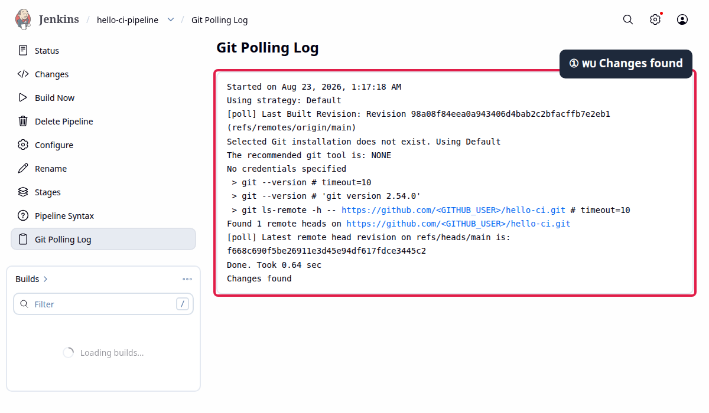

*ภาพที่ 8: หลักฐานจริงของ `Changes found`; ชื่อเจ้าของและ GitHub URL ถูก mask ก่อนบันทึก แล้ว marker ชี้ข้อความตัดสินใจ*

จากรายการ Builds เปิด build ที่เกิดหลัง push แล้วตรวจ cause แยกจาก polling log

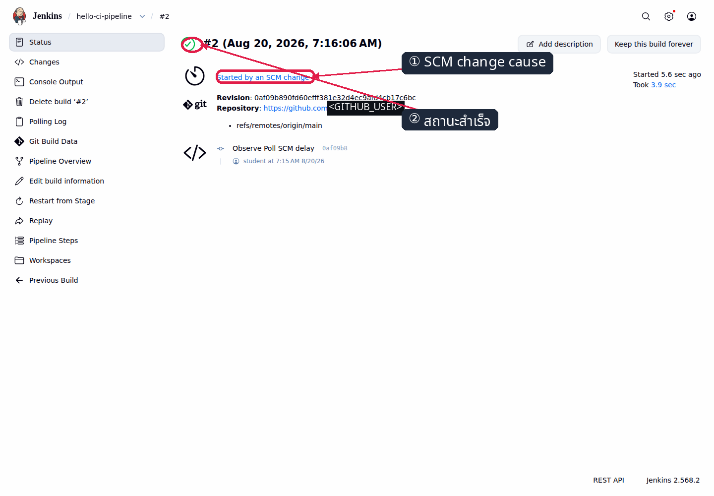

*ภาพที่ 9: หลักฐานจริงว่า build สำเร็จและเริ่มด้วย `Started by an SCM change`; ชื่อ/URL ถูก mask ก่อนบันทึก*

## Expected Result — ตรวจสถานะจบแล็บ

```bash
(
  cd "$COURSE_ROOT/004_LAB_Pipeline_From_Git"
  bash check.sh
)
```

✅ **ผลที่สังเกตได้จากการรันจริง**

```text
[PASS] ยืนยัน GITHUB_TOKEN และเจ้าของบัญชีตรงกับ GITHUB_USER
[PASS] GitHub repo <GITHUB_USER>/hello-ci เป็น public
[PASS] branch main มี .course-cicd2569, Jenkinsfile, hello.sh และ expected.txt ครบ
[PASS] ownership marker มีค่า canonical safe-to-delete
[PASS] job hello-ci-pipeline ใช้ Pipeline from SCM, GitHub URL, main และ Jenkinsfile ตรง contract
[PASS] job hello-ci-pipeline ไม่มี credentialsId ใดๆ
[PASS] Poll SCM มีหนึ่ง trigger และ schedule * * * * *
[PASS] build ล่าสุด #<BUILD_NUMBER> = SUCCESS, จบแล้ว และ cause เป็น SCM change
[PASS] checkout SHA ของ build ล่าสุดตรงกับ origin/main
[INFO] GitHub API requests ใน run นี้: 4
ผลรวม: PASS
```

```bash
unset GITHUB_TOKEN
```

เปิดรับ PAT ด้วย `read -rsp` ใหม่เมื่อต้องทำ LAB 5; อย่าปล่อย token ค้างใน environment หลังจบงาน

LAB 5 จะใช้ repository และ job เดิมเพื่อเปลี่ยนจาก polling เป็น webhook จึงไม่ลบ `hello-ci` และไม่ลบ `hello-ci-pipeline` หลังจบ LAB นี้

## แก้ปัญหาที่พบบ่อย

| อาการ | สาเหตุที่เป็นไปได้ | วิธีตรวจและแก้ |
|---|---|---|
| `git push` ถูกปฏิเสธด้วย 401 หรือ 403 | PAT ผิด/หมดอายุ, Username ไม่ตรงเจ้าของ token หรือ scope ไม่พอ | รัน `github_preflight.sh` ใหม่; PAT classic ต้องมี `public_repo + admin:repo_hook` หรือ `repo` แล้วกรอก PAT ที่ Password prompt ห้ามใส่ใน URL |
| GitHub แจ้งว่า repository ชื่อ `hello-ci` มีอยู่แล้ว | บัญชีมี repository ชื่อนี้อยู่ก่อน | ตรวจเจ้าของและข้อมูลเดิม; ถ้าเป็นงานอื่นให้เปลี่ยนชื่อ repository เดิมก่อน ห้าม overwrite หรือ force-push ข้อมูลที่ไม่ใช่ของแล็บ |
| Jenkins ติดต่อ GitHub ไม่ได้ | DNS, TLS หรือ outbound proxy จาก Jenkins มีปัญหา (ความเสี่ยง K3) | จากใน Jenkins container ทดสอบ `git ls-remote https://github.com/<GITHUB_USER>/hello-ci.git refs/heads/main`; แก้ DNS/CA/proxy ก่อน Build Now |
| Polling ไม่สร้าง build | ยังไม่มี commit ใหม่, schedule ไม่ถูก save, ยังไม่ถึงรอบ หรือ GitHub rate limit | ตรวจ `origin/main`, ตรวจ config เป็น `* * * * *`, รอรอบถัดไป และเปิด **Git Polling Log** เพื่ออ่าน decision |
| ใช้ `H/1` แล้วรอนานเกินหนึ่งนาที | `H/1` คือหนึ่งนาทีที่ hash ได้ในแต่ละชั่วโมง | เปลี่ยนกลับเป็น `* * * * *` สำหรับแล็บนี้ แล้ว Save และ push commit ใหม่ |
