# LAB 4 — Pipeline from GitHub Repository ของนักศึกษา

LAB นี้ฝึกให้ Jenkins อ่าน `Jenkinsfile` จาก GitHub Repository ของนักศึกษา แล้วรัน Pipeline แบบง่ายตามลำดับ **Check source → Build image → Run container → Push image** จุดเน้นคือความสัมพันธ์ระหว่าง GitHub, Jenkinsfile และ Jenkins Pipeline ไม่ใช่ shell script หรือระบบตรวจสอบ artifact ขั้นสูง

## ผลลัพธ์การเรียนรู้

- แยก Course Repository ที่ใช้อ้างอิงออกจาก Student Repository ที่ใช้ทำงานจริง
- สร้าง Public GitHub Repository ของตนเองและ push source ก่อนสร้าง Pipeline
- ตั้งค่า Jenkins แบบ Pipeline script from SCM ให้อ่าน `Jenkinsfile` จาก GitHub
- อ่าน Declarative Pipeline และอธิบายหน้าที่ของ Stage ทั้งสี่ได้
- ใช้ Poll SCM ให้ commit ใหม่เริ่ม Pipeline และตรวจผลจาก Console Output

## สัญญาของ LAB

| ส่วน | ค่าที่ใช้ |
|---|---|
| Course reference | `$COURSE_ROOT/004_LAB_Pipeline_From_Git` — อ่านและคัดลอกเท่านั้น |
| Student project | `$HOME/hello-ci` |
| GitHub repository | `https://github.com/<GITHUB_USER>/hello-ci.git` — Public |
| Jenkins job | `hello-ci-pipeline` / Pipeline script from SCM / `*/main` / `Jenkinsfile` |
| Docker Hub repository | `<DOCKER_USER>/hello-ci` — Public |
| Jenkins credential | Username with password, ID `dockerhub` |
| Trigger | Poll SCM `* * * * *` |

กำหนดตัวแปรใน shell ที่ใช้ทำ LAB:

```bash
COURSE_ROOT="$HOME/DevTools/04_Jenkins/001_Jenikin"
LAB_SRC="$COURSE_ROOT/004_LAB_Pipeline_From_Git"
PROJECT_DIR="$HOME/hello-ci"
```

ใช้ `<GITHUB_USER>`, `<GITHUB_TOKEN>`, `<DOCKER_USER>`, `<DOCKER_TOKEN>`, `<JENKINS_USER>` และ `<JENKINS_API_TOKEN>` เป็น placeholder ในเอกสารเท่านั้น ห้ามเขียน token ลง Repository

ไฟล์ `.course-cicd2569` เป็น guard สำหรับ instructor bootstrap ไม่ใช่ไฟล์ป้องกันการเขียนทับ ห้ามชี้ `tools/bootstrap/up_to_labN.sh` ไปยัง Personal Repository ที่มีงานสำคัญ

## แผนที่การทดลอง

| ขั้น | การทดลอง | ผลลัพธ์ |
|---|---:|---|
| 1. เตรียม Repository | 1–2 | ตรวจ 5 ไฟล์ → copy → `git init` → commit |
| 2. Push Source Code | 3 | สร้าง Public `hello-ci` → push `main` |
| 3. เข้าใจและตั้งค่า Pipeline | 4 | อ่าน Jenkinsfile → ตั้ง Pipeline from SCM |
| 4. Run Pipeline | 5 | Check source → Build → Run → Push |
| 5. ตรวจสอบ Trigger | 6 | push commit ใหม่ → Poll SCM → ตรวจผลลัพธ์จริง |

## ขั้นที่ 1 — เตรียม Repository

### การทดลองที่ 1 — ต้องคัดลอกไฟล์ใดบ้าง?

**คำถาม:** LAB 4 ใช้เฉพาะไฟล์ใดจาก Course Repository?

```bash
cat "$LAB_SRC/project-files.txt"
```

```bash
( cd "$LAB_SRC" && xargs -a project-files.txt ls -l )
```

✅ **สิ่งที่ต้องเห็น:** มี 5 รายการและทุกไฟล์ไม่ว่าง

```text
.course-cicd2569
.dockerignore
Dockerfile
Jenkinsfile
app/index.html
```

LAB ใหม่นี้ไม่มี `hello.sh`, `expected.txt` หรือไฟล์ผลลัพธ์ที่ Pipeline ต้องเขียน

### การทดลองที่ 2 — สร้าง Student Project และ First Commit

**คำถาม:** Student Project แยกจาก Course Repository และมี source พร้อม push หรือไม่?

```bash
rm -rf "$PROJECT_DIR" && mkdir -p "$PROJECT_DIR"
( cd "$LAB_SRC" && xargs -a project-files.txt cp --parents -t "$PROJECT_DIR" )
```

```bash
cd "$PROJECT_DIR"
git init -q -b main
git config user.name 'Student'
git config user.email 'student@example.invalid'
git add -A
git commit -m 'LAB 4: simple Pipeline from Git'
git log --oneline --name-only -1
```

✅ **สิ่งที่ต้องเห็น:** commit แรกมี 5 ไฟล์ตาม manifest และ Repository root คือ `$HOME/hello-ci`

## ขั้นที่ 2 — Push Source Code

### การทดลองที่ 3 — สร้าง GitHub Repository ของนักศึกษา

**คำถาม:** จะ push Student Project ขึ้น Repository ใหม่โดยไม่บันทึก token ได้อย่างไร?

1. เปิด `https://github.com/new`
2. ตั้ง Repository name เป็น `hello-ci`
3. เลือก **Public**
4. ไม่เลือก README, `.gitignore` หรือ License
5. กด **Create repository**

หน้า Create Repository ต้องใช้ browser session ของนักศึกษา เอกสารนี้ไม่ใช้ภาพ generate หรือภาพจำลอง ภาพด้านล่างเป็น Repository จริงที่ใช้ใน LAB

```bash
git -C "$PROJECT_DIR" remote add origin "https://github.com/<GITHUB_USER>/hello-ci.git"
git -C "$PROJECT_DIR" push -u origin main
```

เมื่อ Git ถาม credential ให้ใช้ `<GITHUB_USER>` เป็น Username และ `<GITHUB_TOKEN>` เป็น Password ห้ามใส่ token ใน URL

✅ **สิ่งที่ต้องเห็น:** Repository จริงเริ่มจาก empty state และหลัง push แสดง branch `main`, commit แรก และ source 5 รายการ

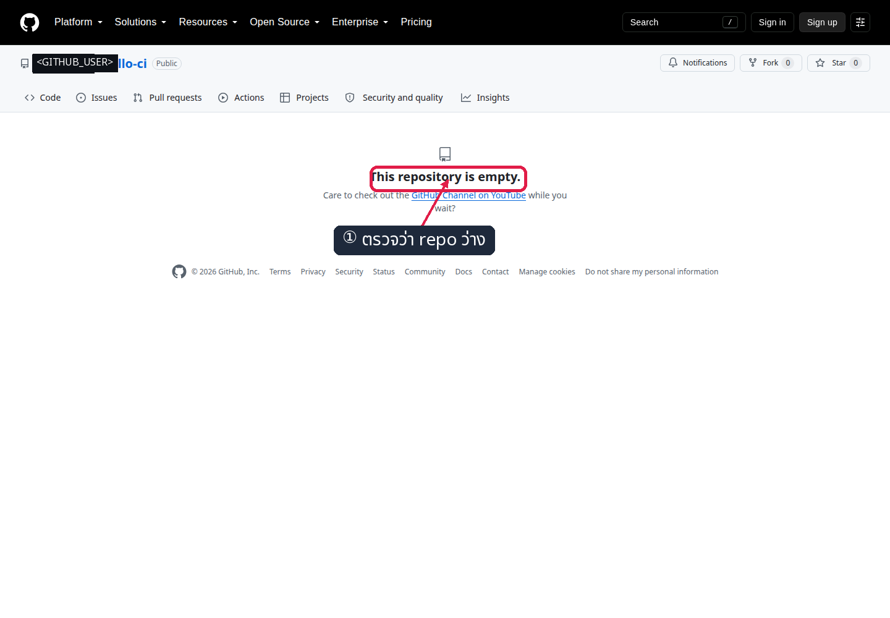

*ภาพที่ 1: Public Repository จริงก่อน push*

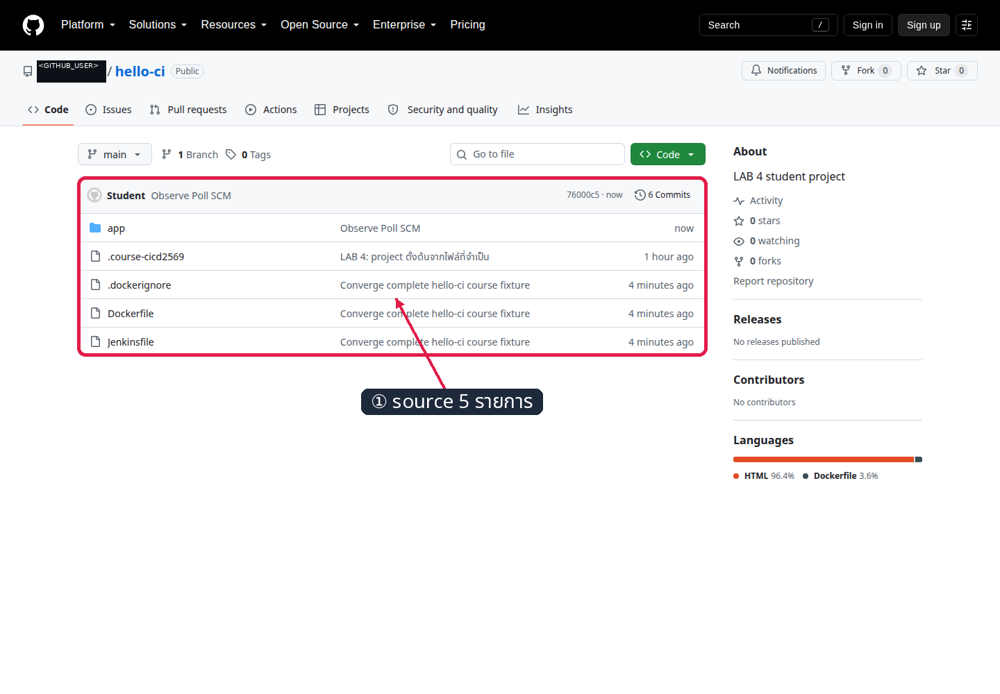

*ภาพที่ 2: Source 5 รายการใน Student Repository จริง*

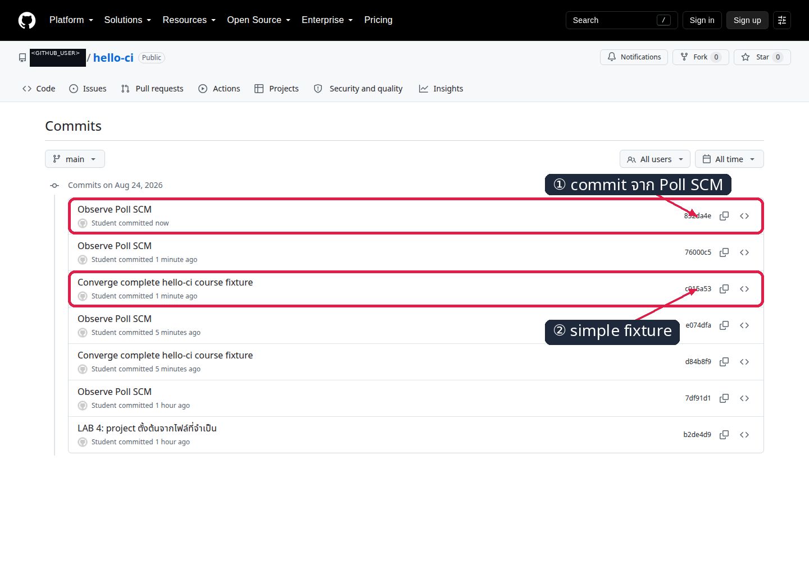

*ภาพที่ 3: Commit history ที่ Jenkins ใช้ตรวจ revision ใหม่*

## ขั้นที่ 3 — เข้าใจและตั้งค่า Pipeline

### `Jenkinsfile` มีหน้าที่อะไร?

`Jenkinsfile` คือ Pipeline as Code ซึ่งเก็บขั้นตอน CI/CD ไว้ร่วมกับ source code ไฟล์นี้อยู่ที่ root ของ Student Repository เมื่อ job ใช้ **Pipeline script from SCM** Jenkins จะ:

1. checkout branch `main` จาก GitHub
2. อ่าน `Jenkinsfile` ที่ root ของ revision นั้น
3. รัน Stage จากบนลงล่าง
4. หยุดทันทีถ้าคำสั่งใน Stage ใดคืน exit code ไม่ใช่ `0`

### `Jenkinsfile` ที่ใช้จริงใน LAB 4

```groovy
pipeline {
  agent any

  environment {
    IMAGE = 'hello-ci'
  }

  stages {
    stage('Check source') {
      steps {
        echo 'ตรวจสอบ Source Code ที่ Jenkins ดึงมาจาก GitHub'
        sh '''
          git log -1 --oneline
          ls -la
          test -f Dockerfile
          test -f app/index.html
        '''
      }
    }

    stage('Build image') {
      steps {
        sh 'docker build -t "$IMAGE:$BUILD_NUMBER" .'
      }
    }

    stage('Run container') {
      steps {
        sh '''
          docker run --rm "$IMAGE:$BUILD_NUMBER" \
            sh -c "grep -Fq 'Pipeline จาก GitHub' /usr/share/nginx/html/index.html"
        '''
      }
    }

    stage('Push image') {
      steps {
        withCredentials([
          usernamePassword(
            credentialsId: 'dockerhub',
            usernameVariable: 'DOCKER_USER',
            passwordVariable: 'DOCKER_TOKEN'
          )
        ]) {
          sh '''
            printf '%s' "$DOCKER_TOKEN" | \
              docker login --username "$DOCKER_USER" --password-stdin

            docker tag \
              "$IMAGE:$BUILD_NUMBER" \
              "$DOCKER_USER/hello-ci:$BUILD_NUMBER"

            docker push "$DOCKER_USER/hello-ci:$BUILD_NUMBER"
            docker logout
          '''
        }
      }
    }
  }
}
```

### อ่าน Pipeline ทีละส่วน

| ส่วน | หน้าที่ |
|---|---|
| `agent any` | ให้ Jenkins เลือก agent ที่พร้อมทำงาน |
| `IMAGE = 'hello-ci'` | กำหนดชื่อ local Docker image ใช้ร่วมกันทุก Stage |
| `Check source` | แสดง commit และตรวจว่า `Dockerfile` กับ `app/index.html` ถูก checkout แล้ว |
| `Build image` | สร้าง image และใช้ Jenkins `BUILD_NUMBER` เป็น tag |
| `Run container` | เปิด container ชั่วคราว ตรวจข้อความใน HTML แล้วลบ container ด้วย `--rm` |
| `Push image` | bind Docker Hub credential เฉพาะ Stage นี้ แล้ว tag/push image |

Pipeline ไม่สร้างไฟล์ `.txt`, ไม่ archive artifact และไม่มี SHA/digest logic เพิ่มเติม จุดที่ต้องเข้าใจคือ:

```text
GitHub main
    ↓ Jenkins checkout และอ่าน Jenkinsfile
Check source → Build image → Run container → Push image
```

### การทดลองที่ 4 — ตั้ง Pipeline from SCM

**คำถาม:** Jenkins อ่าน `Jenkinsfile` จาก Public Student Repository โดยไม่ใช้ GitHub credential ได้หรือไม่?

1. เปิด **Jenkins → New Item**
2. กรอก `hello-ci-pipeline`, เลือก **Pipeline** แล้วกด **OK**
3. เลือก **Pipeline script from SCM → Git**
4. Repository URL = `https://github.com/<GITHUB_USER>/hello-ci.git`
5. Credentials = `- none -`, Branch = `*/main`, Script Path = `Jenkinsfile`
6. กด **Save**
7. ตรวจว่ามี Jenkins credential ID `dockerhub`

```bash
curl -fsS -u '<JENKINS_USER>:<JENKINS_API_TOKEN>' \
  http://localhost:8080/job/hello-ci-pipeline/config.xml \
  | grep -E 'github.com|credentialsId|scriptPath'
```

✅ **สิ่งที่ต้องเห็น:** SCM ชี้ Student Repository, Script Path เป็น `Jenkinsfile` และ GitHub checkout ใช้ Credentials `- none -`

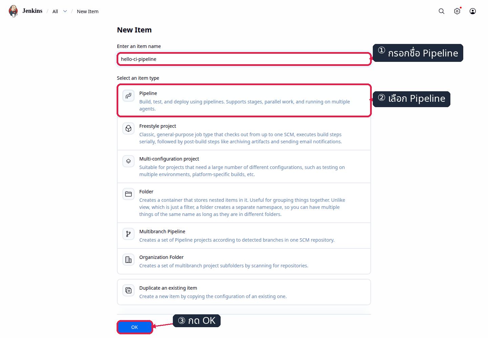

*ภาพที่ 4: สร้าง job ชื่อ `hello-ci-pipeline`*

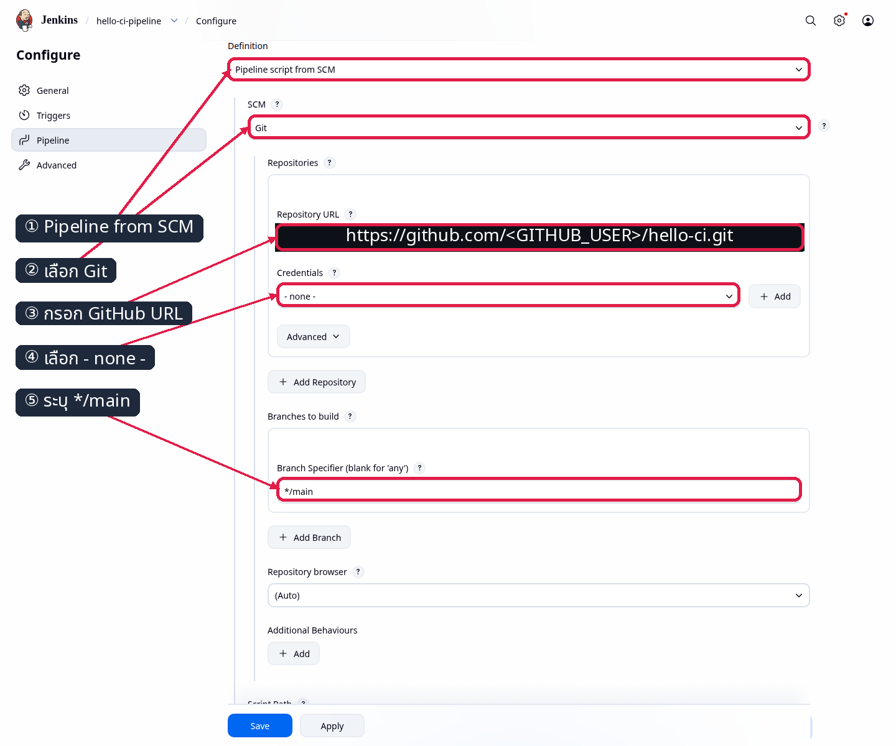

*ภาพที่ 5: URL, branch และ Script Path ของ Student Repository*


*ภาพที่ 6: บันทึก job configuration*

## ขั้นที่ 4 — Run Pipeline

### การทดลองที่ 5 — Manual Build ทำงานครบสี่ Stage หรือไม่?

**คำถาม:** Jenkins checkout, build, run และ push image ได้ตาม `Jenkinsfile` หรือไม่?

1. เปิด `hello-ci-pipeline` แล้วกด **Build Now**
2. เปิด build ล่าสุด → **Console Output**
3. ตรวจ Stage `Check source`, `Build image`, `Run container`, `Push image`

```bash
curl -fsS -u '<JENKINS_USER>:<JENKINS_API_TOKEN>' \
  http://localhost:8080/job/hello-ci-pipeline/lastBuild/api/json
```

✅ **สิ่งที่ต้องเห็น:** build จบ `SUCCESS`; การรันจริงได้ Manual build #2 ซึ่ง checkout `e074dfa...`, เดินครบสี่ Stage และ push `<DOCKER_USER>/hello-ci:2` สำเร็จ

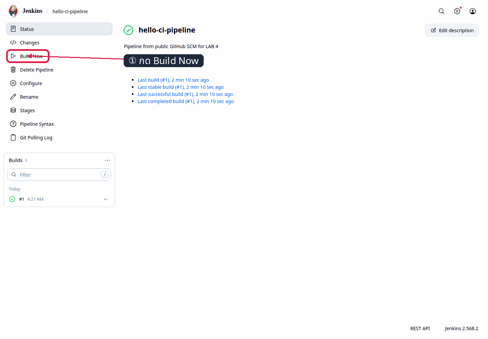

*ภาพที่ 7: เริ่ม Manual Build*

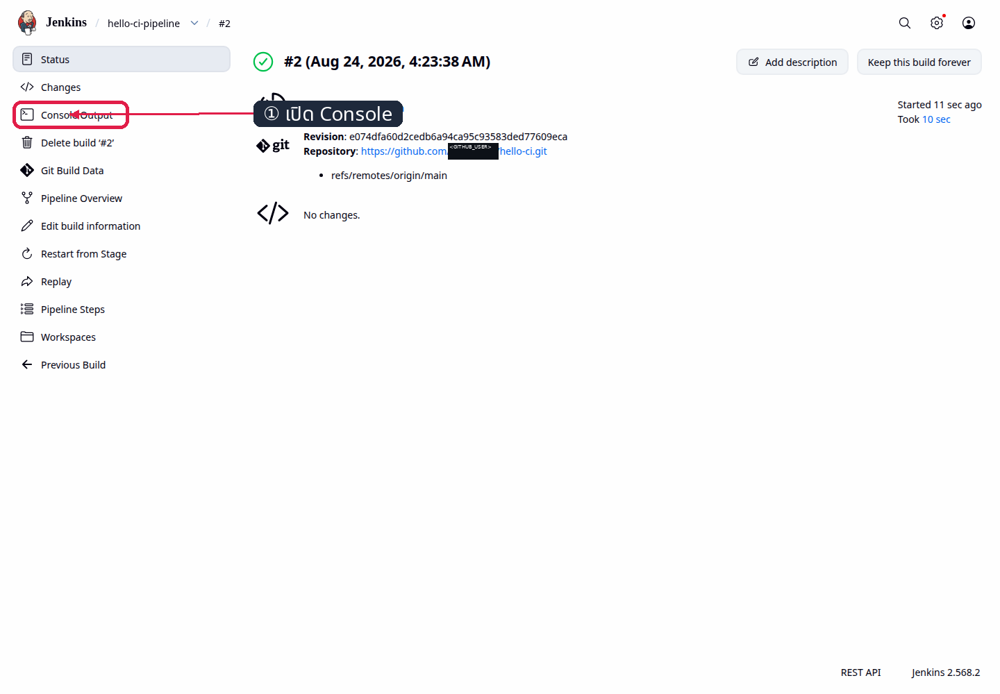

*ภาพที่ 8: เปิด Console Output ของ build*

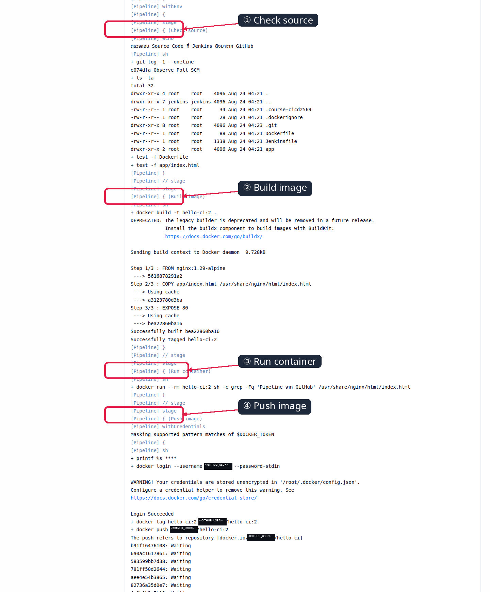

*ภาพที่ 9: Console แสดง simple Pipeline ทั้งสี่ Stage และ `Finished: SUCCESS`*

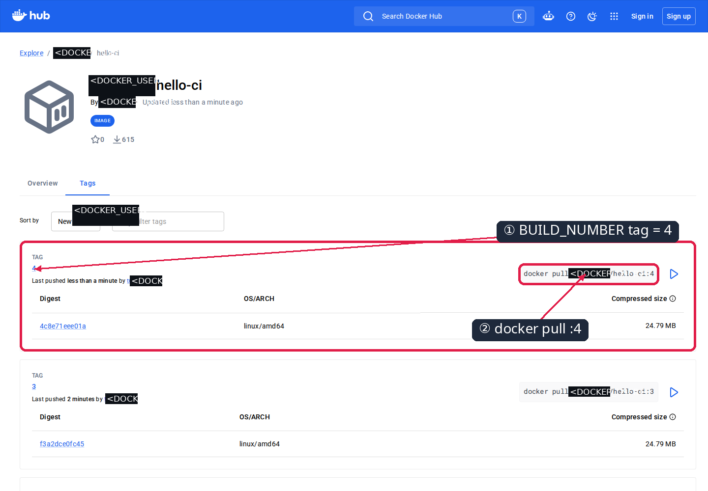

*ภาพที่ 10: Docker Hub Repository จริงแสดง tag ที่ตรงกับ Jenkins BUILD_NUMBER*

## ขั้นที่ 5 — ตรวจสอบ Trigger

### การทดลองที่ 6 — Poll SCM เริ่ม build หลัง commit ใหม่หรือไม่?

**คำถาม:** เมื่อ `main` เปลี่ยน Jenkins เริ่ม Pipeline ใหม่โดยไม่กด Build Now หรือไม่?

1. เปิด **hello-ci-pipeline → Configure → Triggers**
2. เลือก **Poll SCM**, กรอก `* * * * *` แล้วกด **Save**
3. เปลี่ยนหน้าเว็บและ push commit ใหม่:

```bash
cd "$PROJECT_DIR"
printf '\n<!-- Poll SCM probe -->\n' >> app/index.html
git add app/index.html
git commit -m 'Observe Poll SCM'
git push origin main
```

✅ **สิ่งที่ต้องเห็น:** Git Polling Log แสดง `Changes found`; การรันจริงสร้าง build #4 จาก commit `832da4e...`, จบ `SUCCESS` ด้วย cause `Started by an SCM change` และ Docker Hub แสดง tag `4`

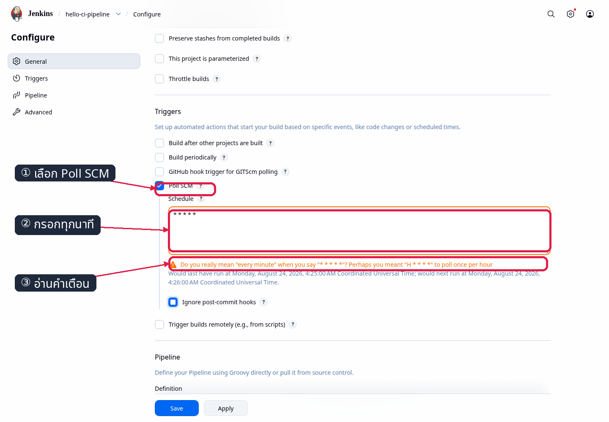

*ภาพที่ 11: เปิด Poll SCM และกำหนด schedule ทุกนาที*

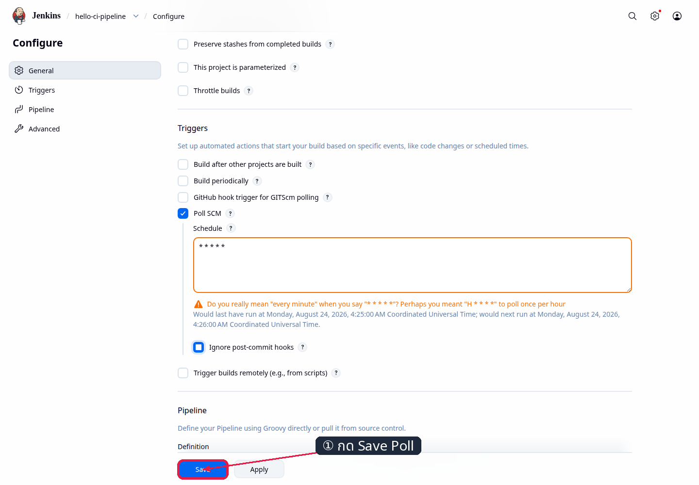

*ภาพที่ 12: บันทึก Trigger configuration*

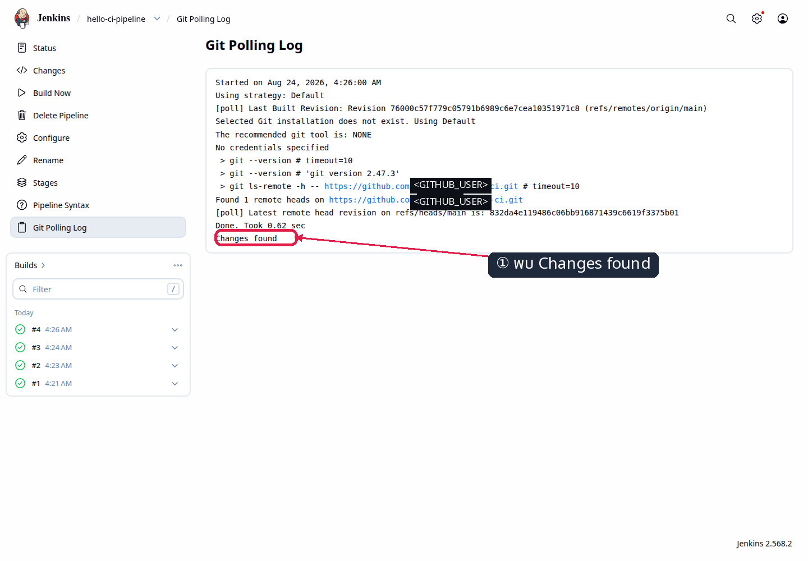

*ภาพที่ 13: Polling Log พบ revision ใหม่*


*ภาพที่ 14: Build เกิดจาก SCM change และจบสำเร็จ*

## แก้ปัญหาที่พบบ่อย

| อาการ | จุดตรวจ | วิธีแก้ |
|---|---|---|
| Repository name already in use | มี `hello-ci` เดิม | archive หรือ rename Repository เดิมก่อน |
| Push ถูกปฏิเสธ | Repository ไม่ว่างหรือยังไม่มี commit | สร้าง empty Repository และทำ First Commit ก่อน push |
| Jenkins checkout ล้มเหลว | URL, branch หรือ Script Path | ตรวจ Public URL, `*/main` และ `Jenkinsfile` |
| `Dockerfile` not found | คัดลอกไฟล์ไม่ครบ | คัดลอกใหม่ตาม `project-files.txt` |
| Run container ล้มเหลว | HTML ไม่มีข้อความตาม contract | ตรวจ `app/index.html` แล้ว build ใหม่ |
| Push image unauthorized | credential ID หรือ token ผิด | ตรวจ Jenkins credential ID `dockerhub` |
| Poll SCM ไม่เริ่ม build | ไม่มี commit ใหม่หรือ cron ผิด | ใช้ `* * * * *`, push revision ใหม่ แล้วดู Polling Log |

## สรุป

LAB 4 ใช้ Jenkinsfile แบบตั้งใจให้สั้น: Jenkins checkout source จาก GitHub ตรวจไฟล์ สร้าง Docker image รัน container เพื่อทดสอบ และ push image ด้วย `BUILD_NUMBER` tag นักศึกษาจึงเห็นเส้นทาง GitHub → Jenkins → Docker Hub ได้ครบโดยไม่ถูก SHA/digest หรือไฟล์หลักฐานขั้นสูงเบี่ยงความสนใจ
