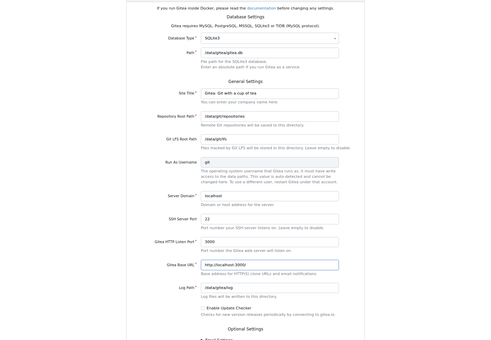
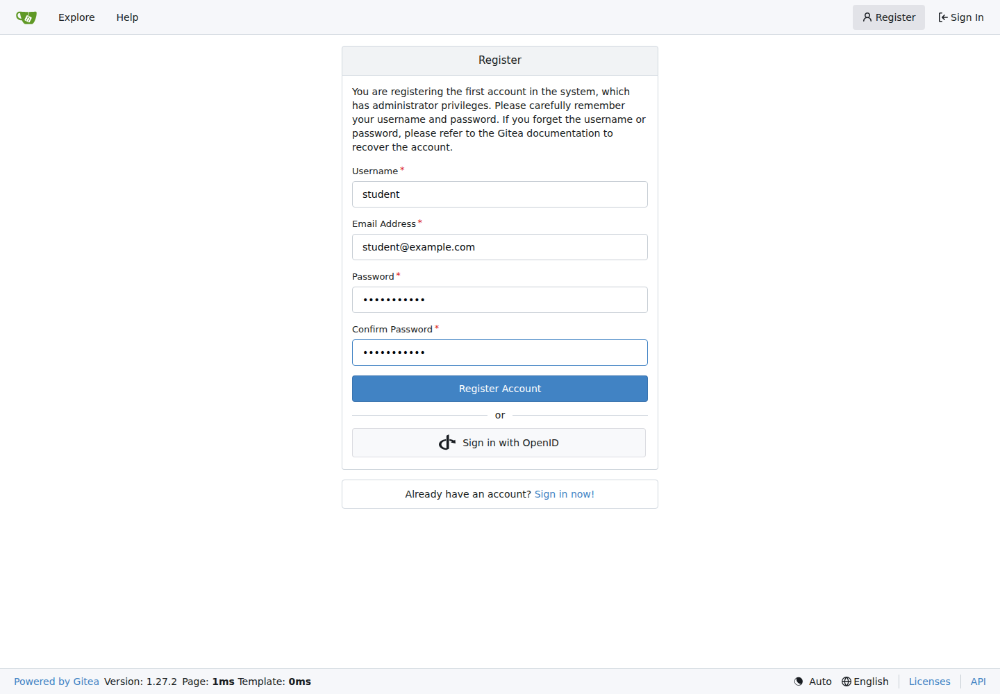
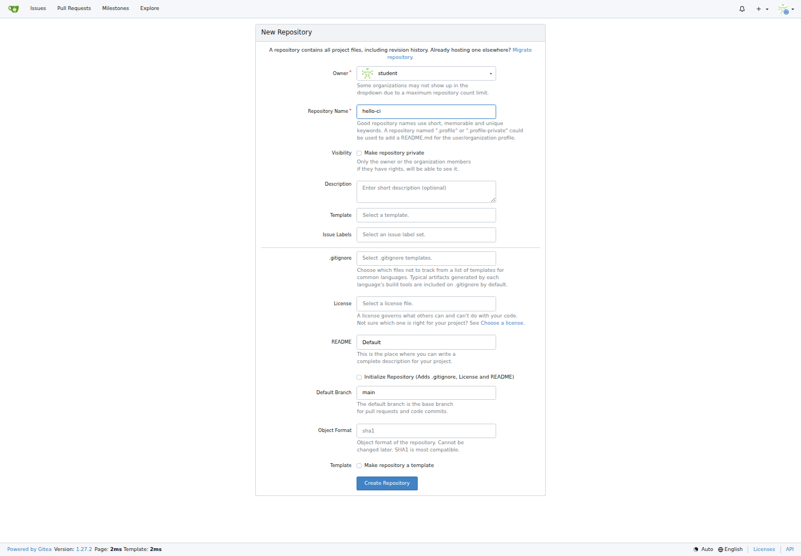
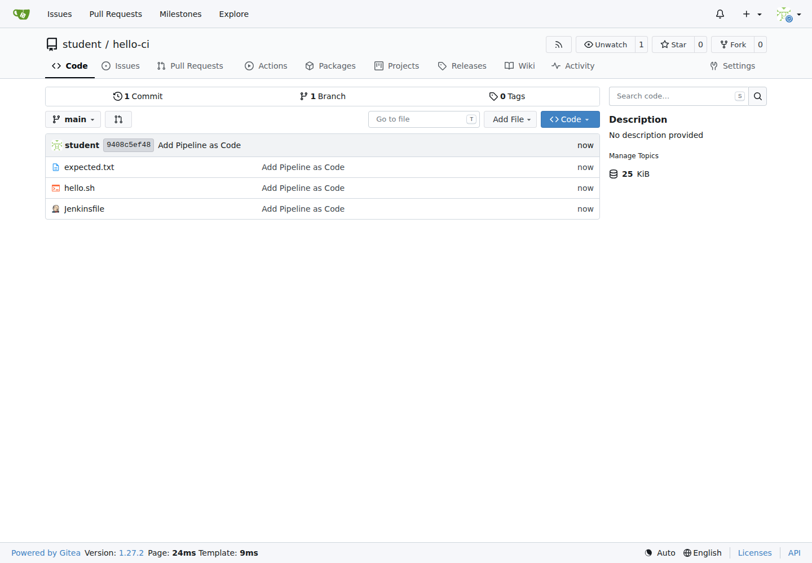
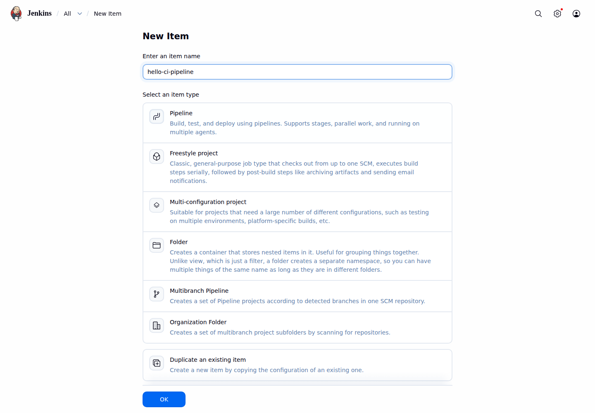
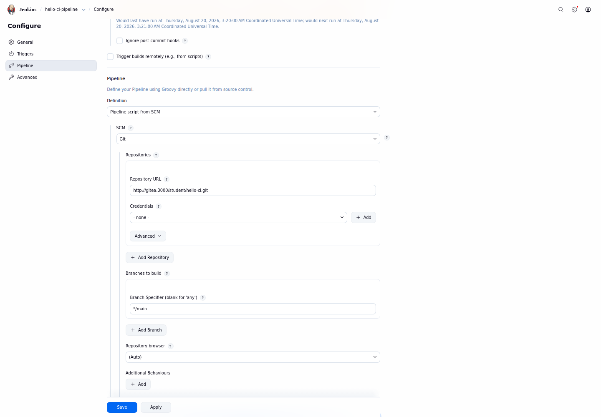
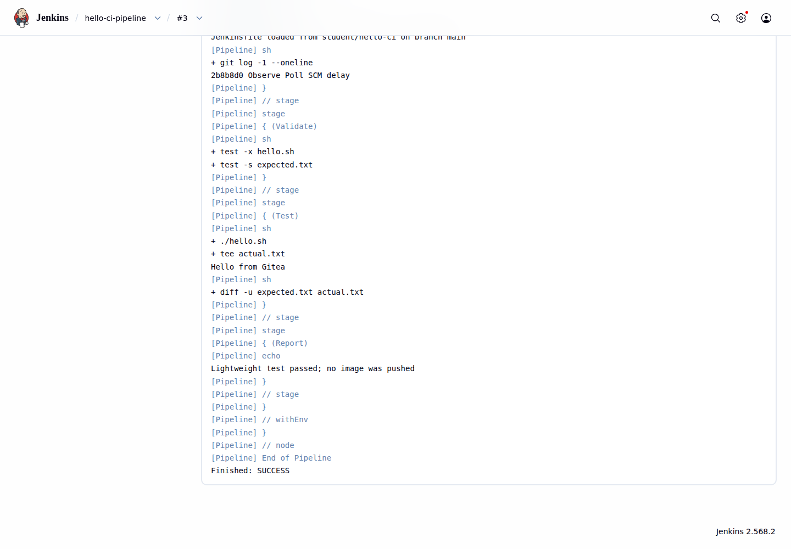
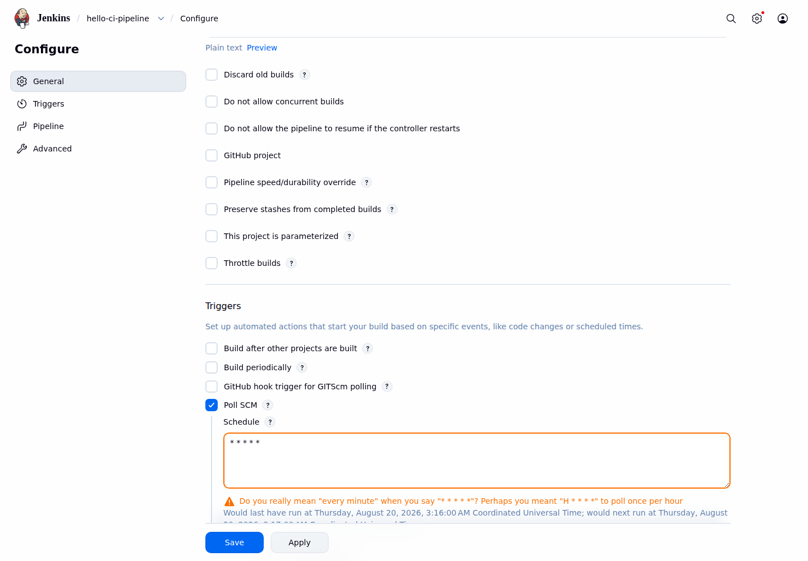
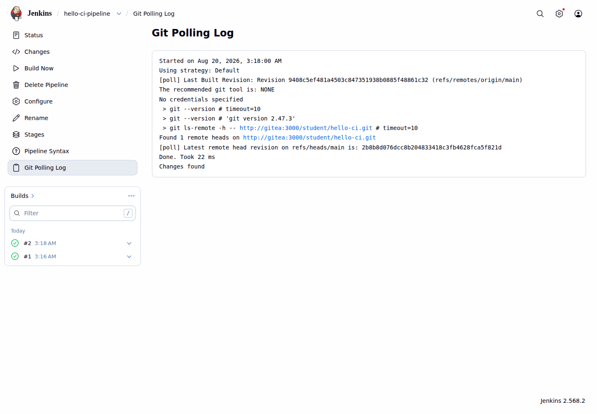
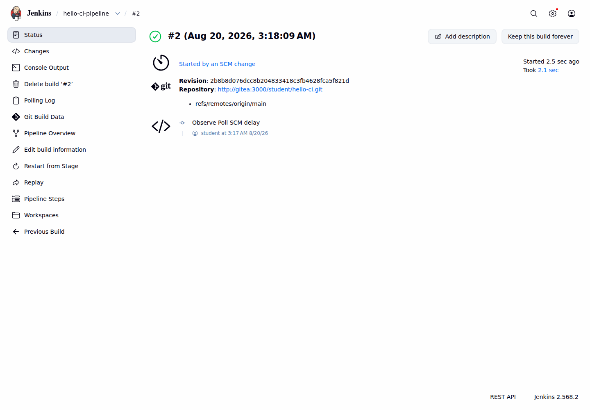

# LAB 4 — Pipeline จาก Git ด้วย Gitea และ Poll SCM

แล็บ 40 นาทีนี้ศึกษาการจัดเก็บ `Jenkinsfile` ร่วมกับ source code ใน Git และการกำหนดให้ Jenkins checkout pipeline จาก Gitea โดยตรง เมื่อจบแล็บ นักศึกษาจะสร้าง public repository, เชื่อม Pipeline script from SCM และอธิบายได้ว่า Poll SCM ตรวจพบ commit ใหม่และสร้าง build โดยอัตโนมัติอย่างไร

## ทฤษฎีก่อนลงมือ

Pipeline-as-Code คือการจัดเก็บนิยาม pipeline เป็นไฟล์ที่ควบคุมเวอร์ชันร่วมกับ source code แนวทางนี้ทำให้การเปลี่ยน pipeline ผ่านการ review, ตรวจสอบประวัติ และ rollback ด้วย Git ได้เช่นเดียวกับโค้ด ทั้งยังทำให้ pipeline แต่ละ revision สัมพันธ์กับ commit ที่นำไป build

Gitea คือ Git server แบบ self-hosted ที่สามารถรันเป็น container ภายในสภาพแวดล้อมแล็บได้ ต่างจาก GitHub ซึ่งเป็นบริการ hosted บนอินเทอร์เน็ต แล็บนี้ใช้ public repository ภายใน network `cicd-net` เพื่อให้ Jenkins checkout โดยไม่ต้องใช้ credential

ผู้เรียกแต่ละรายมองคำว่า `localhost` ต่างกัน คำสั่ง Git ที่รันใน devtools จึงใช้ `http://localhost:3000` แต่ Jenkins container ต้องใช้ DNS ของ Docker คือ `http://gitea:3000` ความแตกต่างนี้เป็นผลจาก network namespace ไม่ใช่การกำหนด URL ที่ขัดแย้งกัน

Poll SCM คือ trigger ที่ให้ Jenkins ตรวจ revision ของ remote repository ตามตาราง cron แล้วสร้าง build เฉพาะเมื่อ revision เปลี่ยน แล็บนี้กำหนด `* * * * *` เพื่อ poll ทุกนาทีจริง จึงสังเกตทั้งความล่าช้าถึงรอบถัดไปและต้นทุนของการตรวจซ้ำที่ส่วนใหญ่ไม่พบการเปลี่ยนแปลง รายละเอียด Pipeline-as-Code, SCM และ trigger ดู slide ตอนที่ 5

## 🎯 ขอบเขตและผลลัพธ์การเรียนรู้

- ติดตั้ง Gitea ด้วย Domain และ Base URL ตาม SCM contract
- สร้างบัญชี `student` และ public repository `student/hello-ci` บน branch `main`
- กำหนด job `hello-ci-pipeline` ให้โหลด `Jenkinsfile` ผ่าน Pipeline script from SCM
- ตรวจหลักฐาน checkout และผลทดสอบจาก Console Output
- เปิด Poll SCM และยืนยัน build ที่มีสาเหตุ `Started by an SCM change`

## สภาพตั้งต้น

ต้องมีสถานะจบ LAB 3: devtools ยังทำงาน, network `cicd-net`, container `jenkins` และ volume `jenkins_home` อยู่ครบ แต่ **ยังไม่มี container `gitea`**

```bash
docker ps --format '{{.Names}}\t{{.Status}}'
```

✅ **สิ่งที่ต้องเห็น** :

```text
jenkins    Up ...
```

> ยังไม่มี? ย้อนไปทำ [LAB 3](../003_LAB_Docker_Build_Push/README.md) ก่อน (ใช้เวลา ~45 นาที)

## การทดลองที่ 1 — Git server จะอยู่ที่ใด?

**คำถาม:** Gitea 1.27.2 จะทำงานบน network, volume และ restart policy ตาม contract พร้อมเปิดพอร์ต 3000 ได้หรือไม่?

การแยก Gitea เป็น container ทำให้ Git service มีวงจรชีวิตและพื้นที่ข้อมูลของตนเอง ขณะที่การเชื่อม `cicd-net` ทำให้ Jenkins เรียก service ด้วยชื่อ `gitea` ได้

```bash
docker run -d --name gitea --restart unless-stopped --network cicd-net -p 3000:3000 -e GITEA__webhook__ALLOWED_HOST_LIST=private -e GITEA__server__DISABLE_SSH=true -v gitea_data:/data gitea/gitea:1.27.2
docker ps --filter name=^gitea$ --format '{{.Names}}\t{{.Image}}\t{{.Status}}'
```

✅ **สิ่งที่ต้องเห็น** :

```text
gitea    gitea/gitea:1.27.2    Up ...
```

> 📝 `--restart unless-stopped` และ `gitea_data` ทำให้ service กับ repository กลับมาหลัง restart; แล็บนี้ปิด SSH และใช้ Git ผ่าน HTTP เท่านั้น

## การทดลองที่ 2 — Installer และบัญชีแรกต้องกำหนดค่าอย่างไร?

**คำถาม:** Gitea จะสร้าง clone URL แบบ canonical และมีบัญชี `student` สำหรับทั้งเว็บกับ Git HTTP ได้หรือไม่?

หน้า installer กำหนด URL ที่ Gitea ใช้สร้าง clone link และ callback ภายในระบบ แม้ agent ทดสอบจะเข้าผ่าน shifted port แต่ค่าที่ผู้เรียนกรอกต้องอ้าง URL canonical เสมอ

1. เปิด `http://localhost:3000` และเลือก **Database Type → SQLite3**
2. กรอก **Server Domain** เป็น `localhost` และ **Gitea Base URL** เป็น `http://localhost:3000/`
3. ตรวจว่า Gitea HTTP Listen Port เป็น `3000` แล้วกด **Install Gitea**



*ภาพที่ 1 ต้องสังเกตค่า SQLite3, Server Domain `localhost`, HTTP port `3000` และ Gitea Base URL `http://localhost:3000/`*

บัญชีแรกได้รับสิทธิ์ administrator ของ Gitea จึงใช้บัญชี `student` ตาม fixture ของชุดแล็บ และใช้บัญชีเดียวกันสำหรับลงชื่อเข้าเว็บกับยืนยันตัวตนตอน `git push`

1. เมื่อ installer ทำงานเสร็จ เลือก **Register**
2. กรอก Username `student`, Email Address `student@example.com` และ Password `student2569`
3. ยืนยัน password เดิม แล้วกด **Register Account**



*ภาพที่ 2 ต้องสังเกต Username และ Email Address ตาม fixture ส่วน password ถูกปิดบังโดยแบบฟอร์ม*

✅ **สิ่งที่ต้องเห็น** :

```text
หน้า Dashboard ของ student เปิดได้ และ URL ที่ Gitea แสดงขึ้นต้นด้วย http://localhost:3000/
```

> 📝 แม้ agent ใช้ shifted port ค่าใน form ต้องเป็น `localhost:3000` ตาม URL canonical

ขณะนี้ Gitea พร้อมใช้งานและบัญชี `student` อยู่ในระบบ การทดลองถัดไปจะสร้าง repository ว่างเพื่อรับไฟล์จาก Git client

## การทดลองที่ 3 — Repository สำหรับ CI ต้องเริ่มแบบใด?

**คำถาม:** เราจะสร้าง repository ว่างแบบ public เพื่อให้ Jenkins checkout โดยไม่ใช้ credential ได้หรือไม่?

repository ต้องเป็น public ตาม SCM contract และไม่ควร initialize จากหน้าเว็บ เพราะไฟล์ต้นฉบับจะถูก push จาก working tree ใน devtools โดยตรง

1. ที่แถบนำทางของ Gitea กด **+ → New Repository**
2. กรอก **Repository Name** เป็น `hello-ci` และไม่เลือก **Make repository private**
3. ไม่เลือก **Initialize Repository** แล้วกด **Create Repository**



*ภาพที่ 3 ต้องสังเกต owner `student`, ชื่อ `hello-ci`, branch `main` และช่อง Private/Initialize ที่ไม่ถูกเลือก*

เส้นทางเดียวกันตรวจอัตโนมัติได้ด้วย:

```bash
GITEA_BASE_URL=http://localhost:3000 python3 tools/ui/lab4_scm_repo.py --action create
```

✅ **สิ่งที่ต้องเห็น** :

```text
[ui]... assert: repository full name is student/hello-ci
[ui]... assert: hello-ci is public
[ui]... PASS
```

## การทดลองที่ 4 — Jenkinsfile จะขึ้น Git พร้อมโค้ดได้อย่างไร?

**คำถาม:** branch `main` จะเก็บ script, expected output และ Jenkinsfile ชุดเดียวกับแล็บได้หรือไม่?

การ commit ไฟล์ทั้งสามร่วมกันทำให้ pipeline definition, โปรแกรมที่ทดสอบ และผลที่คาดหวังอ้าง revision เดียวกัน ก่อนรันคำสั่งให้เปิด terminal ที่ root ของชุดสอนภายใน devtools

```bash
git config --global init.defaultBranch main && git config --global user.name 'Student' && git config --global user.email 'student@example.com'
mkdir "$HOME/hello-ci" && cp 004_LAB_Pipeline_From_Git/{Jenkinsfile,hello.sh,expected.txt} "$HOME/hello-ci/" && cd "$HOME/hello-ci" && chmod +x hello.sh && git init && git add . && git commit -m 'Add Pipeline as Code' && git remote add origin http://localhost:3000/student/hello-ci.git && git push -u origin main
```

เมื่อ Git ขอ credential ให้กรอก username `student` และ password `student2569` จากนั้นตรวจสถานะผ่านหน้า repository ซึ่งเป็นหลักฐานว่า remote branch รับ commit แล้ว

1. เปิด `http://localhost:3000/student/hello-ci`
2. เลือก branch **main**
3. ตรวจรายการไฟล์ว่ามี `Jenkinsfile`, `hello.sh` และ `expected.txt`



*ภาพที่ 4 ต้องสังเกต public repository `student/hello-ci`, branch `main`, commit แรก และไฟล์โครงการครบสามไฟล์*

✅ **สิ่งที่ต้องเห็น** :

```text
branch 'main' set up to track 'origin/main'.
Jenkinsfile    expected.txt    hello.sh
```

> 📝 URL ตอน push คือ `localhost` เพราะคำสั่งรันใน devtools shell; password ที่ prompt ใช้เพื่อ push เท่านั้น ไม่ได้เขียนใน remote URL

ขณะนี้ source code และ `Jenkinsfile` อยู่บน Gitea แล้ว ขั้นต่อไปจะสร้าง Jenkins job ที่อ้าง repository นี้แทนการวาง pipeline script ในหน้า Jenkins

## การทดลองที่ 5 — ทำไม Jenkins ใช้ URL คนละแบบ?

**คำถาม:** Job แบบ Pipeline script from SCM จะ checkout public repository ผ่าน DNS ภายใน Docker ได้อย่างไร?

เริ่มจากสร้าง job ชนิด Pipeline เพื่อให้ Jenkins เตรียมส่วน Definition สำหรับ Pipeline-as-Code ชื่อ job ต้องตรง contract เพราะ LAB 5 จะปรับ trigger ของ job เดิมต่อไป

1. เปิด `http://localhost:8080` แล้วเลือก **New Item**
2. กรอกชื่อ `hello-ci-pipeline`
3. เลือก **Pipeline** แล้วกด **OK**



*ภาพที่ 5 ต้องสังเกตชื่อ `hello-ci-pipeline`, ชนิด Pipeline ที่เลือก และปุ่ม OK ที่พร้อมดำเนินการ*

หน้า Configure เชื่อม job กับ public repository ผ่านชื่อ service บน `cicd-net` จึงเลือก Credentials เป็น `- none -` และระบุ branch กับ Script Path ให้ตรงไฟล์จริง

1. ในส่วน **Pipeline** เลือก Definition → **Pipeline script from SCM** และ SCM → **Git**
2. กรอก Repository URL `http://gitea:3000/student/hello-ci.git` และเลือก Credentials → **- none -**
3. กรอก Branch Specifier `*/main`, Script Path `Jenkinsfile` แล้วกด **Save**



*ภาพที่ 6 ต้องสังเกต Definition, SCM, URL ภายใน `gitea:3000`, credential ว่าง และ branch `*/main`*

```bash
JENKINS_BASE_URL=http://localhost:8080 python3 tools/ui/lab4_scm_job.py --action configure
```

| ผู้เรียก | URL | เหตุผล |
|---|---|---|
| Git ใน devtools shell | `http://localhost:3000/student/hello-ci.git` | `localhost` คือ devtools ที่ publish Gitea |
| Jenkins container | `http://gitea:3000/student/hello-ci.git` | `localhost` ของ Jenkins คือ Jenkins เอง; ต้องใช้ชื่อ container บน `cicd-net` |

✅ **สิ่งที่ต้องเห็น** :

```text
[ui]... assert: job definition is Pipeline script from SCM
[ui]... assert: saved SCM URL uses the gitea container DNS name
[ui]... PASS
```

## การทดลองที่ 6 — Build นี้ checkout จริงหรือไม่?

**คำถาม:** Build Now จะโหลด Jenkinsfile และโค้ดจาก commit แล้วรันทุก stage จนสำเร็จได้หรือไม่?

build แรกทำหน้าที่พิสูจน์ SCM contract ก่อนเปิด trigger หาก checkout หรือ test ผิดพลาดจะวิเคราะห์ได้โดยไม่ปะปนกับกลไก polling

1. ที่หน้า `hello-ci-pipeline` กด **Build Now**
2. เลือก build ล่าสุดจากรายการ **Builds**
3. เปิด **Console Output** และตรวจผลจาก Git checkout กับ stage Test

```bash
JENKINS_BASE_URL=http://localhost:8080 python3 tools/ui/lab4_scm_job.py --action build
```



*ภาพที่ 7 ต้องสังเกต `Hello from Gitea`, ผล lightweight test และ `Finished: SUCCESS` จากไฟล์ใน repository*

✅ **สิ่งที่ต้องเห็น** :

```text
Checking out Revision ... (origin/main)
Hello from Gitea
Lightweight test passed; no image was pushed
Finished: SUCCESS
```

> 📝 ก่อนเริ่ม stage Jenkins มี Declarative checkout เพิ่มเอง เพราะ definition ของ job โหลด Jenkinsfile และ workspace จาก SCM

## การทดลองที่ 7 — จะเปิด Poll SCM ทุกนาทีได้อย่างไร?

**คำถาม:** Trigger ของ job จะบันทึก schedule `* * * * *` ผ่านหน้า Configure ได้หรือไม่?

Poll SCM ต้องกำหนดผ่าน job UI ตาม contract ไม่ใส่ `triggers {}` ใน `Jenkinsfile` เพื่อให้ LAB 5 สามารถเปลี่ยน trigger เป็น webhook โดยไม่แก้ source code

1. ไปที่ **hello-ci-pipeline → Configure → Triggers**
2. เลือก **Poll SCM** และกรอก Schedule `* * * * *`
3. ตรวจคำเตือน **Do you really mean “every minute”** แล้วกด **Save**



*ภาพที่ 8 ต้องสังเกต Poll SCM ที่ถูกเลือก, schedule ห้าช่องเป็น `*` และคำเตือน every minute ของ Jenkins*

```bash
JENKINS_BASE_URL=http://localhost:8080 DT_NAME=devtools-jenkins python3 tools/ui/lab4_scm_poll.py --action enable
```

✅ **สิ่งที่ต้องเห็น** :

```text
[ui]... assert: Poll SCM trigger is present in config.xml
[ui]... assert: Poll SCM schedule is * * * * *
[ui]... PASS
```

> 📝 ห้ามใช้ `H/1` ในแล็บนี้ เพราะ Jenkins hash ค่า `H` เป็นนาทีตายตัวของชั่วโมง ไม่ได้หมายถึงทุก 1 นาที

ขณะนี้ Jenkins พร้อมตรวจ revision ทุกนาที แต่ยังไม่มีเหตุให้สร้าง build ใหม่ การทดลองสุดท้ายจะ push commit และตรวจทั้ง polling decision กับ build cause

## การทดลองที่ 8 — Push แล้วต้องรอนานเท่าใด?

**คำถาม:** Commit ใหม่จะทำให้ Poll SCM สร้าง build เองและบันทึกเหตุผลใน Git Polling Log ได้หรือไม่?

การแก้ comment ไม่เปลี่ยนผลโปรแกรม แต่สร้าง revision ใหม่ที่เหมาะสำหรับทดสอบ trigger หลัง push ให้รอ cron รอบถัดไปโดยไม่กด Build Now

```bash
cd "$HOME/hello-ci" && printf '\n# poll probe %s\n' "$(date -u +%Y%m%dT%H%M%SZ)" >> hello.sh && git add hello.sh && git commit -m 'Observe Poll SCM delay' && git push origin main
JENKINS_BASE_URL=http://localhost:8080 DT_NAME=devtools-jenkins python3 tools/ui/lab4_scm_poll.py --action wait --timeout 120
```

หลังตัวตรวจรายงาน build สำเร็จ ให้ตรวจหลักฐานของ scheduler และ build แยกกัน เพราะ Git Polling Log อธิบายการตัดสินใจ ส่วนหน้ารายละเอียด build ระบุสาเหตุที่เริ่มงาน

1. ที่หน้า job เลือก **Git Polling Log**
2. ตรวจ revision เดิมกับ revision ใหม่ และข้อความ **Changes found**



*ภาพที่ 9 ต้องสังเกต remote `gitea:3000/student/hello-ci.git`, branch `main` และผล `Changes found`*

1. จากรายการ **Builds** เปิด build ที่เกิดหลัง push
2. ตรวจสถานะสำเร็จและข้อความ **Started by an SCM change**



*ภาพที่ 10 ต้องสังเกต build สีเขียว, revision/commit ที่ตรวจพบ และ cause `Started by an SCM change`*

✅ **สิ่งที่ต้องเห็น** :

```text
[ui]... assert: SCM-caused build #... finished SUCCESS
[ui]... observed: Poll SCM created build #... after ... seconds from timer start
[ui]... assert: Git Polling Log contains a completed polling decision
[ui]... PASS
```

เมื่อใช้ `* * * * *` build จะเริ่มในรอบ cron ถัดไป จึงรอไม่เกินประมาณ 1 นาทีตาม contract ส่วนเวลารัน pipeline อาจเพิ่มจากระยะรอดังกล่าว จากนั้นตรวจสถานะจบแล็บ:

```bash
cd 004_LAB_Pipeline_From_Git && bash check.sh
```

ผลที่ถูกต้องคือ `[PASS]` ครบ 6 จุดและ `ผลรวม: PASS` การทดลองนี้แสดงข้อจำกัดว่า push แล้วต้องรอ ส่วน LAB 5 จะเปลี่ยนเป็น webhook เพื่อแจ้ง Jenkins ทันที

## แก้ปัญหาที่พบบ่อย

| อาการ | สาเหตุ | วิธีแก้ |
|---|---|---|
| clone URL ที่ Gitea แสดงเป็น host/port อื่น | installer ตั้ง Domain หรือ Gitea Base URL ผิด | แก้ `/data/gitea/conf/app.ini` ให้ `DOMAIN = localhost`, `ROOT_URL = http://localhost:3000/` แล้ว `docker restart gitea`; ถ้ายังไม่มีข้อมูลให้ลบเฉพาะทรัพยากรของแล็บแล้วติดตั้งใหม่ |
| Jenkins แจ้ง `Could not resolve host: gitea` | Jenkins หรือ Gitea ไม่ได้อยู่ `cicd-net` | ตรวจ `docker network inspect cicd-net` แล้วเชื่อม container ที่ขาดด้วย `docker network connect cicd-net <ชื่อ>` |
| Jenkins ต่อ `localhost:3000` ไม่ได้ | นำ URL สำหรับ devtools shell ไปใส่ใน job | เปลี่ยน Repository URL เป็น `http://gitea:3000/student/hello-ci.git` |
| `git push` ถาม password ทุกครั้ง | Git ไม่ได้เก็บ HTTP credential | ในแล็บ disposable ใช้ `git config --global credential.helper store` ได้ แต่ข้อมูลจะเก็บแบบ plaintext จึงห้ามใช้กับเครื่อง shared หรือ production |
| Polling ไม่สร้าง build | ไม่มี commit ใหม่หรือยังไม่ถึงรอบ cron | ตรวจ remote commit, รอรอบถัดไป แล้วเปิด **Git Polling Log**; schedule ต้องเป็น `* * * * *` |
| ใช้ `H/1` แล้วรอนานกว่า 1 นาที | Jenkins hash `H` เป็นนาทีตายตัวของชั่วโมงสำหรับ job | เปลี่ยนเป็น `* * * * *` เพื่อให้ poll ทุกนาทีจริง |
| restart แล้ว Jenkins หรือ Gitea ไม่กลับมา | outer devtools หรือ restart policy ไม่พร้อม | start devtools, รอ inner Docker แล้วตรวจ `docker ps`; Gitea และ Jenkins ต้องใช้ `--restart unless-stopped` |
