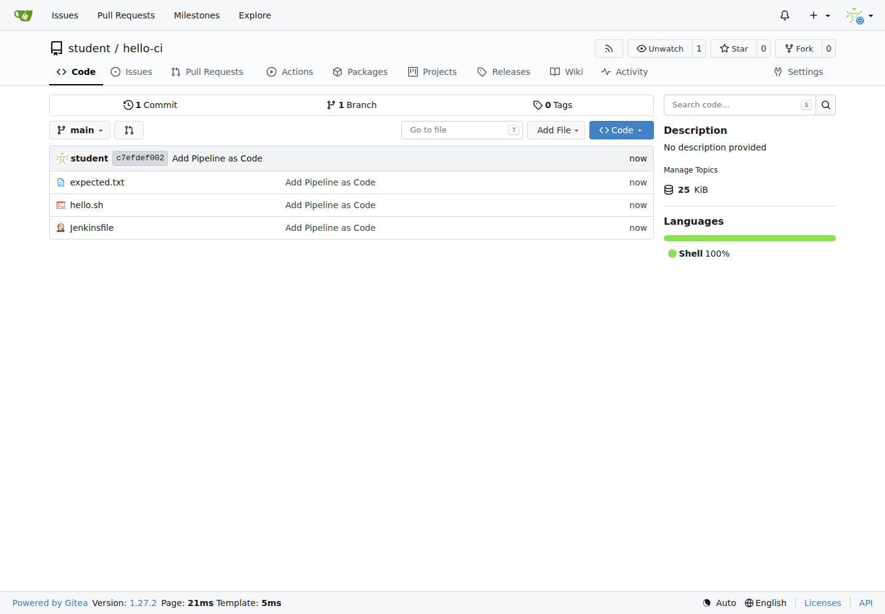
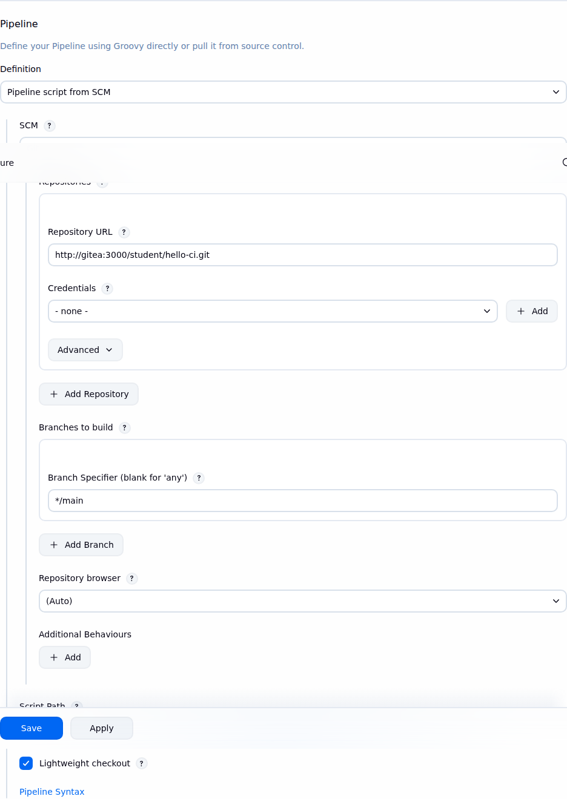

# LAB 4 — Pipeline จาก Git ด้วย Gitea และ Poll SCM

แล็บ 40 นาทีนี้ตอบคำถามว่าเราจะย้าย Jenkinsfile จากช่องข้อความใน Jenkins ไปไว้กับ source code แล้วให้ Jenkins checkout และ build จาก Git จริงได้อย่างไร เมื่อจบแล้วการ push commit ใหม่จะทำให้ Poll SCM สร้าง build เองในรอบถัดไป

## ทฤษฎีก่อนลงมือ

เมื่อ `Jenkinsfile` อยู่ใน repository เดียวกับโค้ด เราได้ Pipeline-as-Code เต็มรูป: การเปลี่ยน pipeline ผ่าน review แบบเดียวกับโค้ด, ดูประวัติว่าใครแก้อะไร, checkout pipeline เวอร์ชันที่สัมพันธ์กับ commit และ rollback ด้วย Git ได้ ไม่ต้องคัดลอก script เข้า Jenkins ทีละ job

Gitea คือ Git server แบบ self-hosted ที่เบาและรันเป็น container ได้; เทียบหนึ่งบรรทัดคือ **Gitea อยู่ในเครื่องแล็บและเราดูแลเอง ส่วน GitHub เป็นบริการ hosted บนอินเทอร์เน็ต** แล็บนี้ใช้ public repository ภายใน `cicd-net` จึงไม่ต้องเพิ่ม credential สำหรับ checkout

Poll SCM ไม่ได้คอยดึงโค้ดตลอดเวลา Jenkins จะตื่นตาม cron, ถาม remote ว่า revision เปลี่ยนจาก build ล่าสุดหรือไม่ แล้วค่อยเข้าคิว build เมื่อพบ commit ใหม่ แล็บล็อกสเปก `* * * * *` เพื่อ poll ทุกนาทีจริง

ข้อเสียคือ push แล้วมี delay จนถึงรอบถัดไป และถ้าตั้ง polling ถี่ Git server กับ Jenkins จะเสียทรัพยากรกับคำขอที่ส่วนใหญ่ตอบว่า “ไม่เปลี่ยน” รายละเอียด Pipeline-as-Code, SCM และ trigger ดู slide ตอนที่ 5; LAB 5 จะเปลี่ยนเป็น webhook ซึ่งแจ้ง Jenkins ทันทีเมื่อ push

## 🎯 แล็บนี้ใน 30 วินาที

- รันและติดตั้ง Gitea ด้วยค่า canonical
- สร้าง public repo `student/hello-ci` แล้ว push โปรเจกต์กับ Jenkinsfile ขึ้น branch `main`
- สร้าง job `hello-ci-pipeline` แบบ Pipeline script from SCM
- Build Now เพื่อเห็น checkout และ lightweight test จริง
- เปิด Poll SCM, push อีก commit และจับเวลา build ที่เกิดเอง

## สภาพตั้งต้น

ต้องมีสถานะจบ LAB 3: devtools ยังทำงาน, network `cicd-net`, container `jenkins` และ volume `jenkins_home` อยู่ครบ แต่ **ยังไม่มี container `gitea`**

```bash
docker ps --format '{{.Names}}\t{{.Status}}'
```

✅ **สิ่งที่ต้องเห็น** :

```text
jenkins    Up ...
```

> ยังไม่มี? ย้อนไปทำ [LAB 3](../003_LAB_Docker_Build_Push/README.md) ก่อน (ใช้เวลา ~45 นาที)

## การทดลองที่ 1 — Git server จะอยู่ที่ไหน?

**คำถาม:** Gitea 1.27.2 จะขึ้นบน network/volume/policy ตาม canonical และเปิดพอร์ต 3000 ได้หรือไม่?

```bash
docker run -d --name gitea --restart unless-stopped --network cicd-net -p 3000:3000 -e GITEA__webhook__ALLOWED_HOST_LIST=private -e GITEA__server__DISABLE_SSH=true -v gitea_data:/data gitea/gitea:1.27.2
docker ps --filter name=^gitea$ --format '{{.Names}}\t{{.Image}}\t{{.Status}}'
```

✅ **สิ่งที่ต้องเห็น** :

```text
gitea    gitea/gitea:1.27.2    Up ...
```

> 📝 `--restart unless-stopped` และ `gitea_data` ทำให้ service กับ repository กลับมาหลัง restart; แล็บนี้ปิด SSH และใช้ Git ผ่าน HTTP เท่านั้น

## การทดลองที่ 2 — Installer ต้องประกาศ URL ใด?

**คำถาม:** Gitea จะสร้าง clone URL แบบ canonical และมีผู้ใช้สำหรับทั้งเว็บกับ Git HTTP ได้อย่างไร?

เปิด `http://localhost:3000` แล้วกรอกหน้า Initial Configuration:

- Database Type: **SQLite3**
- Server Domain: `localhost`
- Gitea Base URL: `http://localhost:3000/`
- เปิด **Administrator Account Settings**
- Administrator Username: `student`
- Password / Confirm Password: `student2569`
- Email Address: `student@example.com`
- กด **Install Gitea** แล้วลงชื่อเข้าใช้เป็น `student`

✅ **สิ่งที่ต้องเห็น** :

```text
หน้า Dashboard ของ student เปิดได้ และ URL ที่ Gitea แสดงขึ้นต้นด้วย http://localhost:3000/
```

> 📝 ถึงจะเปิดหน้า agent ผ่าน host port อื่น ค่าใน form ยังต้องเป็น `localhost:3000` เพราะนี่คือ URL canonical ที่ผู้เรียนใช้

## การทดลองที่ 3 — Repository สำหรับ CI ต้องเริ่มแบบใด?

**คำถาม:** เราจะสร้าง repo ว่างแบบ public เพื่อให้ Jenkins checkout โดยไม่ใช้ credential ได้หรือไม่?

ใน Gitea กด **+ → New Repository**:

- Repository Name: `hello-ci`
- Visibility: **Public** (ไม่เลือก Make Repository Private)
- **ไม่เลือก** Initialize Repository
- กด **Create Repository**

เส้นทางเดียวกันตรวจอัตโนมัติได้ด้วย:

```bash
GITEA_BASE_URL=http://localhost:3000 python3 tools/ui/lab4_scm_repo.py --action create
```

✅ **สิ่งที่ต้องเห็น** :

```text
[ui]... assert: repository full name is student/hello-ci
[ui]... assert: hello-ci is public
[ui]... PASS
```

## การทดลองที่ 4 — Jenkinsfile จะขึ้น Git พร้อมโค้ดอย่างไร?

**คำถาม:** โปรเจกต์บน branch `main` จะเก็บ script, expected output และ Jenkinsfile ชุดเดียวกับแล็บได้หรือไม่?

จาก devtools shell ที่ root ของชุดสอน รันสองชุดนี้:

```bash
git config --global init.defaultBranch main && git config --global user.name 'Student' && git config --global user.email 'student@example.com'
mkdir "$HOME/hello-ci" && cp 004_LAB_Pipeline_From_Git/{Jenkinsfile,hello.sh,expected.txt} "$HOME/hello-ci/" && cd "$HOME/hello-ci" && chmod +x hello.sh && git init && git add . && git commit -m 'Add Pipeline as Code' && git remote add origin http://localhost:3000/student/hello-ci.git && git push -u origin main
```

เมื่อ Git ถาม credential ให้กรอก username `student` และ password `student2569` จากนั้นเปิดหน้า repo แล้วตรวจว่าอยู่ branch `main` และมีไฟล์ครบ

✅ **สิ่งที่ต้องเห็น** :

```text
branch 'main' set up to track 'origin/main'.
Jenkinsfile    expected.txt    hello.sh
```



> 📝 URL ตอน push คือ `localhost` เพราะคำสั่งรันใน devtools shell; password ที่ prompt ใช้เพื่อ push เท่านั้น ไม่ได้เขียนใน remote URL

## การทดลองที่ 5 — ทำไม Jenkins ใช้ URL คนละอัน?

**คำถาม:** Job แบบ Pipeline script from SCM จะ checkout public repo ผ่าน DNS ภายใน Docker ได้อย่างไร?

ใน Jenkins เปิด `http://localhost:8080` แล้วทำตามนี้ หรือรัน UI automation ด้านล่าง:

- **New Item → Pipeline**, ชื่อ `hello-ci-pipeline`
- ส่วน Pipeline เลือก Definition: **Pipeline script from SCM**
- SCM: **Git**
- Repository URL: `http://gitea:3000/student/hello-ci.git`
- Credentials: **- none -** เพราะ repo เป็น public
- Branch Specifier: `*/main` และ Script Path: `Jenkinsfile`
- กด **Save**

```bash
JENKINS_BASE_URL=http://localhost:8080 python3 tools/ui/lab4_scm_job.py --action configure
```

| ผู้เรียก | URL | เหตุผล |
|---|---|---|
| Git ใน devtools shell | `http://localhost:3000/student/hello-ci.git` | `localhost` คือ devtools ที่ publish Gitea |
| Jenkins container | `http://gitea:3000/student/hello-ci.git` | `localhost` ของ Jenkins คือ Jenkins เอง; ต้องใช้ชื่อ container บน `cicd-net` |

✅ **สิ่งที่ต้องเห็น** :

```text
[ui]... assert: job definition is Pipeline script from SCM
[ui]... assert: saved SCM URL uses the gitea container DNS name
[ui]... PASS
```



## การทดลองที่ 6 — Build นี้ checkout จริงหรือไม่?

**คำถาม:** Build Now โหลด Jenkinsfile/โค้ดจาก commit แล้วรัน 4 stages จบเขียวได้หรือไม่?

กด **Build Now → build ล่าสุด → Console Output** หรือใช้สคริปต์กดและ assert ให้:

```bash
JENKINS_BASE_URL=http://localhost:8080 python3 tools/ui/lab4_scm_job.py --action build
```

✅ **สิ่งที่ต้องเห็น** :

```text
Checking out Revision ... (origin/main)
Hello from Gitea
Lightweight test passed; no image was pushed
Finished: SUCCESS
```

> 📝 ก่อนเริ่ม stage Jenkins มี Declarative checkout เพิ่มเอง เพราะ definition ของ job โหลด Jenkinsfile และ workspace จาก SCM

## การทดลองที่ 7 — จะเปิด Poll SCM ให้ทำงานทุกนาทีอย่างไร?

**คำถาม:** Trigger ของ job จะบันทึก schedule `* * * * *` ผ่านหน้า Configure ได้หรือไม่?

ไปที่ **hello-ci-pipeline → Configure → Build Triggers**, เลือก **Poll SCM**, ใส่ Schedule `* * * * *` แล้ว Save; Jenkins จะเตือน **“Do you really mean every minute?”** ซึ่งตั้งใจแล้วและใช้เป็นจุดสอนเรื่องต้นทุนของ polling จากนั้นสคริปต์นี้ทำ click flow เดียวกันและเริ่มตัวจับเวลา:

```bash
JENKINS_BASE_URL=http://localhost:8080 DT_NAME=devtools-jenkins python3 tools/ui/lab4_scm_poll.py --action enable
```

✅ **สิ่งที่ต้องเห็น** :

```text
[ui]... assert: Poll SCM trigger is present in config.xml
[ui]... assert: Poll SCM schedule is * * * * *
[ui]... PASS
```

> 📝 ห้ามใช้ `H/1` ในแล็บนี้ เพราะ Jenkins hash ค่า `H` เป็นนาทีตายตัวของชั่วโมง ไม่ได้หมายถึงทุก 1 นาที

## การทดลองที่ 8 — Push แล้วต้องรอนานเท่าไร?

**คำถาม:** Commit ใหม่ทำให้ Poll SCM สร้าง build เองและบันทึกเหตุผลใน Git Polling Log หรือไม่?

แก้ไฟล์, commit และ push จาก devtools shell แล้วให้ตัวตรวจรอ build ที่มี cause จาก SCM:

```bash
cd "$HOME/hello-ci" && printf '\n# poll probe %s\n' "$(date -u +%Y%m%dT%H%M%SZ)" >> hello.sh && git add hello.sh && git commit -m 'Observe Poll SCM delay' && git push origin main
JENKINS_BASE_URL=http://localhost:8080 DT_NAME=devtools-jenkins python3 tools/ui/lab4_scm_poll.py --action wait --timeout 120
```

✅ **สิ่งที่ต้องเห็น** :

```text
[ui]... assert: SCM-caused build #... finished SUCCESS
[ui]... observed: Poll SCM created build #... after ... seconds from timer start
[ui]... assert: Git Polling Log contains a completed polling decision
[ui]... PASS
```


เมื่อใช้ `* * * * *` build จะเริ่มในรอบ cron ถัดไป จึงรอไม่เกิน ~1 นาทีตาม contract (เวลา build จบอาจเพิ่มอีกเล็กน้อย) และพิสูจน์ว่า scheduler สร้าง build ด้วย cause จาก SCM จริง จากนั้นตรวจสถานะจบแล็บ:

```bash
cd 004_LAB_Pipeline_From_Git && bash check.sh
```

ผลที่ถูกต้องคือ `[PASS]` ครบ 6 จุดและ `ผลรวม: PASS` — **push แล้วต้องรอ; LAB 5 จะทำให้ build ทันที**

## แก้ปัญหาที่พบบ่อย

| อาการ | สาเหตุ | วิธีแก้ |
|---|---|---|
| clone URL ที่ Gitea แสดงเป็น host/port แปลก | installer ตั้ง Domain หรือ Gitea Base URL ผิด | แก้ `/data/gitea/conf/app.ini` ให้ `DOMAIN = localhost`, `ROOT_URL = http://localhost:3000/` แล้ว `docker restart gitea`; ถ้ายังไม่มีข้อมูลให้ลบเฉพาะแล็บแล้วติดตั้งใหม่ |
| Jenkins แจ้ง `Could not resolve host: gitea` | Jenkins/Gitea ไม่ได้อยู่ `cicd-net` | ตรวจ `docker network inspect cicd-net`; connect container ที่ขาดด้วย `docker network connect cicd-net <ชื่อ>` |
| Jenkins ต่อ `localhost:3000` ไม่ได้ | ใส่ shell URL ใน job | เปลี่ยน Repository URL เป็น `http://gitea:3000/student/hello-ci.git` |
| `git push` ถาม password ทุกครั้ง | Git ยังไม่เก็บ HTTP credential | ในเครื่องแล็บ disposable ใช้ `git config --global credential.helper store` ได้หนึ่งบรรทัด (ข้อมูลเก็บแบบ plaintext; ไม่ใช้กับเครื่อง shared/production) |
| Polling ไม่สร้าง build | ยังไม่มี commit ใหม่ หรือยังไม่ถึงรอบ cron ถัดไป | ตรวจว่า remote มี commit ใหม่, รอไม่เกิน ~1 นาที แล้วเปิด **Git Polling Log**; schedule ต้องเป็น `* * * * *` |
| ใช้ `H/1` แล้วรอนานกว่า 1 นาที | Jenkins hash `H` เป็นนาทีตายตัวของชั่วโมงสำหรับ job | เปลี่ยนเป็น `* * * * *` เพื่อให้ poll ทุกนาทีจริง |
| restart แล้ว Jenkins/Gitea ไม่กลับมา | outer devtools หรือ restart policy ไม่พร้อม | start devtools, รอ inner Docker แล้วตรวจ `docker ps`; Gitea/Jenkins ต้องใช้ `--restart unless-stopped` |
