# LAB 4 — Pipeline จาก GitHub: push ครั้งเดียว ร้านอัปเดตเอง

> ⏱️ ประมาณ 50 นาที · 🧪 9 การทดลอง · 🎯 จบเมื่อ `git push` การแก้ราคาสินค้าแล้ว Jenkins build/push/deploy ให้เองจาก **Poll SCM** จนหน้าร้านที่ `http://localhost:3000` แสดงราคาใหม่และ commit เดียวกับ GitHub และ `bash check.sh` ได้ `ผลรวม: PASS`

LAB 3 ให้ Jenkins สร้างร้าน **Meow Mart** จากโฟลเดอร์ที่ mount ไว้ และต้องกด Build เอง LAB 4 ตอบคำถามต่อไปว่า **“ถ้าซอร์สโค้ดและขั้นตอน build อยู่ใน Git ด้วยกัน Jenkins จะรู้ได้อย่างไรว่ามีงานใหม่ และจะพิสูจน์ได้อย่างไรว่าเว็บที่รันอยู่มาจาก commit ไหน”** นักศึกษาจะสร้าง GitHub repository ใหม่ของตนเอง คัดลอกโค้ดร้านจาก LAB 3 ไปใส่พร้อม `Jenkinsfile` ตั้งค่า Jenkins แบบ **Pipeline script from SCM** แล้วดู Poll SCM เปลี่ยน `git push` หนึ่งครั้งให้กลายเป็นเว็บเวอร์ชันใหม่โดยไม่ต้องกดปุ่มใดเลย

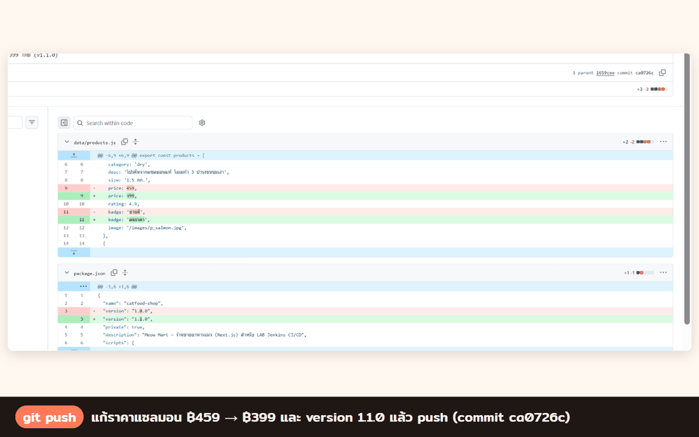

*ภาพที่ 1 ภาพเคลื่อนไหวจากการทดลองจริง (ประมาณ 20 วินาที): แก้ราคาแล้ว push → Jenkins พบ commit ใหม่ → Pipeline ทำงานเอง → Docker Hub ได้ tag ใหม่ → หน้าร้านแสดงราคาใหม่พร้อม commit เดียวกับ GitHub*

---

## 📚 ทฤษฎีก่อนลงมือ

### 1. Pipeline as Code ที่อยู่กับซอร์สโค้ด

ใน LAB 2–3 เราวาง Pipeline ไว้ในช่อง **Pipeline script** บนหน้าเว็บ Jenkins สคริปต์จึงอยู่แยกจากโค้ด ถ้าใครแก้ขั้นตอน build ก็ไม่มีประวัติใน Git LAB นี้เปลี่ยนเป็น **Pipeline script from SCM** (SCM = Source Control Management) ซึ่ง Jenkins จะ

1. clone/fetch repository ตาม URL และ branch ที่ตั้งไว้
2. อ่าน `Jenkinsfile` จาก root ของ commit นั้น
3. checkout commit เดียวกันลง workspace (`Declarative: Checkout SCM`)
4. รัน stage ตามที่ `Jenkinsfile` ใน commit นั้นกำหนด

ผลคือ **ขั้นตอน build กับโค้ดมีเวอร์ชันเดียวกันเสมอ** ถ้าย้อนไป commit เก่า ก็ได้ Pipeline ของ commit นั้นด้วย การแก้ Pipeline ต้องผ่าน commit และ review เหมือนโค้ดทั่วไป

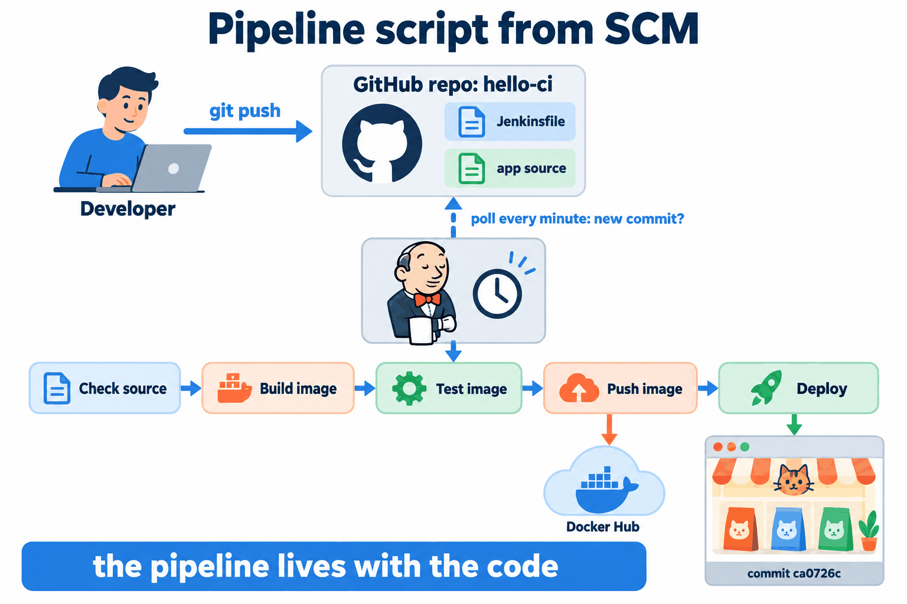

*ภาพที่ 2 Developer push ไป GitHub → Jenkins ตรวจพบ commit ใหม่ → checkout แล้วรัน 5 stage จาก `Jenkinsfile` ใน repository → push image → deploy ร้านที่แสดง commit ปัจจุบัน*

### 2. Course Repository กับ Student Repository

| | Course Repository | Student Repository |
|---|---|---|
| ที่อยู่ | `$COURSE_ROOT` (ชุดสอน) | `$HOME/hello-ci` + `github.com/<GITHUB_USER>/hello-ci` |
| บทบาท | ต้นฉบับสำหรับอ่านและคัดลอก | โปรเจกต์จริงที่นักศึกษาแก้และ push |
| Jenkins อ่านจาก | ไม่อ่าน | อ่าน `Jenkinsfile` และซอร์สทุก build |

การแยกสองส่วนนี้ทำให้แก้งานได้โดยไม่ทำให้ชุดสอนเสีย และทำให้แต่ละคนมี commit history ของตัวเอง

> 📝 ชื่อ repository และ job ยังคงเป็น `hello-ci` / `hello-ci-pipeline` เพราะ LAB 5–6 ใช้ชื่อนี้ต่อ แต่เนื้อหาข้างในคือร้าน Meow Mart

### 3. Trigger: Jenkins รู้ได้อย่างไรว่ามี commit ใหม่

| วิธี | ใครเริ่ม | ความหน่วง | ต้องเปิด network ขาเข้าไหม | ใช้ใน |
|---|---|---|---|---|
| กด Build Now | คน | ขึ้นกับคน | ไม่ | LAB 1–3 |
| **Poll SCM** | Jenkins ถาม GitHub ตามตาราง cron | ≤ 1 รอบของตาราง | **ไม่** | **LAB 4** |
| Webhook | GitHub เรียก Jenkins ทันทีที่มี push | ไม่กี่วินาที | ต้องมีทางให้ GitHub เข้าถึง Jenkins | LAB 5 |

Poll SCM ใช้ตาราง cron 5 ช่อง (`นาที ชั่วโมง วัน เดือน วันในสัปดาห์`) ทุกครั้งที่ถึงเวลา Jenkins จะรัน `git ls-remote` เพื่อดู SHA ล่าสุดของ branch แล้วเทียบกับ revision ที่เคย build ถ้าเหมือนเดิมจะบันทึก `No changes` ถ้าต่างจะบันทึก `Changes found` และสร้าง build ใหม่ที่มี cause ว่า **Started by an SCM change** แล็บนี้ใช้ `* * * * *` (ทุกนาที) เพื่อให้เห็นผลเร็ว

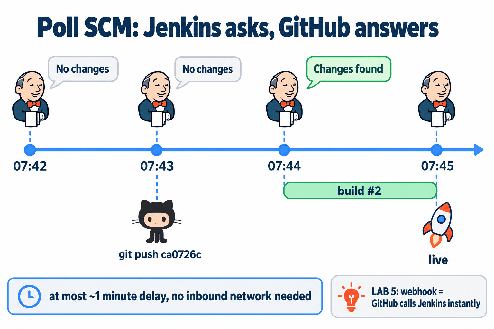

*ภาพที่ 3 เส้นเวลาจริงของการทดลองที่ 8: push เวลา 07:43 → poll ถัดไปเวลา 07:44 พบการเปลี่ยนแปลง → build #2 จบเวลา 07:45*

> ⚠️ ระบบจริงไม่ควร poll ทุกนาทีเพราะเพิ่มภาระให้ทั้ง Jenkins และ GitHub Jenkins จะเตือนและแนะนำ `H * * * *` (H = กระจายเวลาด้วย hash ของชื่อ job) ส่วนระบบที่ต้องการความเร็วควรใช้ webhook ใน LAB 5

### 4. Traceability: ตามรอยการเปลี่ยนแปลงหนึ่งครั้งตั้งแต่ต้นจนจบ

`Jenkinsfile` ของแล็บส่งค่า `git rev-parse --short HEAD` เข้า `docker build --build-arg GIT_COMMIT=...` ร้านจึงแสดง commit ที่ใช้ build ในส่วน Deployment info และใน `/api/health` เมื่อรวมกับ `BUILD_NUMBER` และ digest จะได้โซ่หลักฐานที่ต่อกันครบ:

```text
GitHub commit ca0726c → Jenkins build #2 → image <DOCKER_USER>/hello-ci:2 → digest sha256:e383fcb6… → เว็บแสดง build #2 · commit ca0726c
```

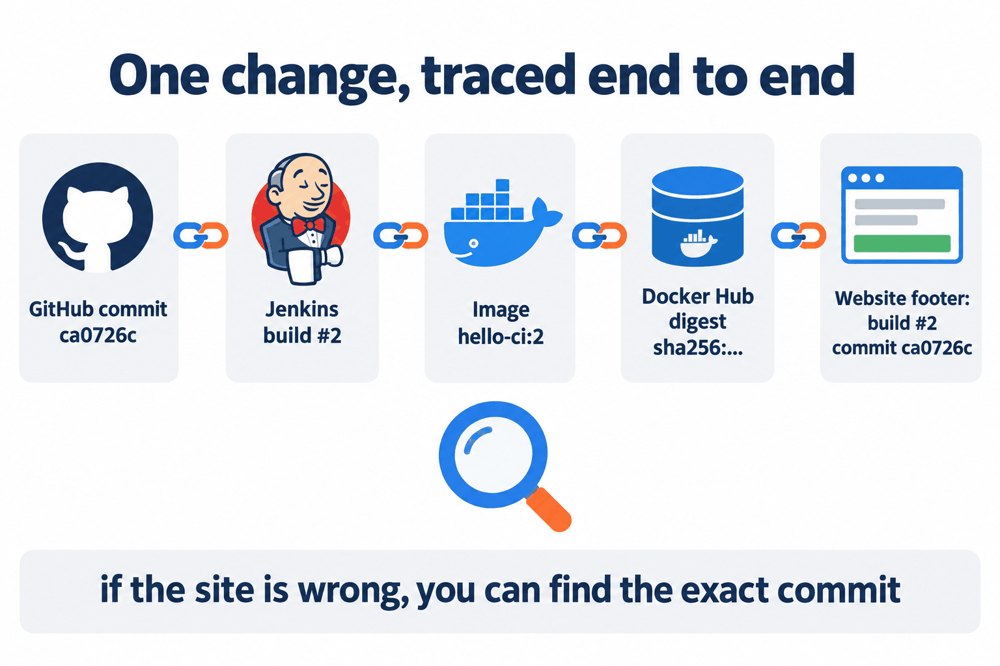

*ภาพที่ 4 ถ้าหน้าเว็บผิดปกติ เราย้อนหาได้ทันทีว่ามาจาก commit ใด build ใด และ image ใด*

---

## 🎯 Learning Objectives — ผลลัพธ์การเรียนรู้

เมื่อจบแล็บนี้ นักศึกษาจะสามารถ

1. สร้าง Public GitHub repository และ push โปรเจกต์ขึ้นไปโดยไม่บันทึก token ลงไฟล์หรือ URL ได้
2. อธิบายความต่างของ Pipeline script กับ Pipeline script from SCM และข้อดีของ Pipeline as Code ได้
3. ตั้งค่า job ให้อ่าน `Jenkinsfile` จาก branch `main` ของ Student Repository ได้
4. อธิบายกลไก Poll SCM และอ่าน Polling Log (`No changes` / `Changes found`) ได้
5. ผูก commit SHA, Jenkins build number, Docker image tag/digest และเว็บที่ deploy เข้าด้วยกันได้

## 🗺️ แผนที่การทดลอง

| ช่วง | การทดลอง | สิ่งที่ทำ | ผลที่ต้องได้ (ค่าจริงจากการทดลอง) |
|---|---|---|---|
| A. เตรียมโปรเจกต์ | 1–2 | คัดลอกร้านจาก LAB 3 + `Jenkinsfile` → commit แรก | 22 ไฟล์, commit `1659cee` |
| B. GitHub | 3 | สร้าง repository ใหม่ทีละขั้นบนเว็บ → push | Public repo `hello-ci` แสดงไฟล์ครบ |
| C. Jenkins from SCM | 4–5 | สร้าง job + manual build #1 | checkout `1659cee`, เว็บแสดง `commit 1659cee` |
| D. Trigger อัตโนมัติ | 6–8 | เปิด Poll SCM → แก้ราคา → push | `Changes found`, build #2 เริ่มเอง, ราคา ฿459 → ฿399 |
| E. ตรวจย้อนกลับ | 9 | เทียบ commit / build / image / เว็บ + `check.sh` | ทุกจุดชี้ `ca0726c`, `ผลรวม: PASS` |

## สัญญาของแล็บ

| ส่วน | ค่าที่ใช้ |
|---|---|
| ซอร์สร้าน (ต้นฉบับ) | `$COURSE_ROOT/003_LAB_Docker_Build_Push/catfood-shop` |
| Pipeline (ต้นฉบับ) | `$COURSE_ROOT/004_LAB_Pipeline_From_Git/Jenkinsfile` |
| Student project | `$HOME/hello-ci` |
| GitHub repository | `https://github.com/<GITHUB_USER>/hello-ci` — **Public**, สร้างใหม่ ไม่มี README |
| Jenkins job | `hello-ci-pipeline` — Pipeline script from SCM, `*/main`, `Jenkinsfile` |
| Docker Hub | `<DOCKER_USER>/hello-ci` — tag `<BUILD_NUMBER>` และ `latest` |
| Deploy | container `catfood-web` ที่ `http://localhost:3000` (แทนที่ตัวจาก LAB 3) |
| Trigger | Poll SCM `* * * * *` |

## สภาพตั้งต้น

ต้องจบ LAB 3: Jenkins ใช้ `jenkins-docker:2569`, mount Docker socket, มี credential `dockerhub` และ `bash "$COURSE_ROOT/003_LAB_Docker_Build_Push/check.sh"` ผ่าน

> **Prerequisite GitHub:** บัญชี GitHub ที่ยืนยันอีเมลแล้ว และ **Personal access token (classic)** ที่มี scope `public_repo` (LAB 5 ต้องเพิ่ม `admin:repo_hook`) เก็บ token ไว้ใน password manager ห้ามเขียนลงไฟล์ใด ๆ

```bash
COURSE_ROOT="$HOME/DevTools/04_Jenkins/001_Jenikin"
APP_SRC="$COURSE_ROOT/003_LAB_Docker_Build_Push/catfood-shop"
LAB_SRC="$COURSE_ROOT/004_LAB_Pipeline_From_Git"
PROJECT_DIR="$HOME/hello-ci"
```

---

## ช่วง A — เตรียม Student Project

### การทดลองที่ 1 — ประกอบโปรเจกต์จากโค้ดร้าน + Jenkinsfile

**คำถาม:** Student Project ต้องมีอะไรบ้างจึงจะให้ Jenkins build ได้โดยไม่พึ่งไฟล์นอก repository?

```bash
rm -rf "$PROJECT_DIR" && mkdir -p "$PROJECT_DIR"
cp -r "$APP_SRC/." "$PROJECT_DIR/"          # โค้ดร้าน + Dockerfile + .dockerignore + .gitignore
rm -f "$PROJECT_DIR/Dockerfile.single"      # ไฟล์ทดลองของ LAB 3 ไม่ต้องใช้
cp "$LAB_SRC/Jenkinsfile" "$PROJECT_DIR/"   # Pipeline ที่จะอยู่ใน repository
cd "$PROJECT_DIR" && ls -A && find . -type f | wc -l
```

✅ **ผลการทดลองจริง:**

```text
.dockerignore
.gitignore
Dockerfile
Jenkinsfile
app
data
next.config.mjs
package-lock.json
package.json
public
22
```

> 🔍 **วิเคราะห์ผล:** repository ต้องมี 3 กลุ่มไฟล์: **ซอร์สโค้ด** (`app/`, `data/`, `public/`), **วิธีแพ็ก** (`Dockerfile`, `.dockerignore`, `package-lock.json`) และ **วิธี build/deploy** (`Jenkinsfile`) ครบทั้งสามกลุ่มแล้ว ใครก็ clone ไป build ได้เหมือนกัน `.gitignore` กันไม่ให้ `node_modules/` และ `.next/` หลุดเข้า Git

### การทดลองที่ 2 — First commit

**คำถาม:** commit แรกบันทึกไฟล์ครบและเป็น Git repository ที่แยกจากชุดสอนหรือไม่?

```bash
cd "$PROJECT_DIR"
git init -q -b main
git config user.name 'Student'
git config user.email 'student@example.invalid'
git add -A
git commit -q -m 'LAB 4: Meow Mart cat shop + Jenkinsfile'
git log --oneline --stat -1 | tail -3
```

✅ **ผลการทดลองจริง:**

```text
 public/images/p_treats.jpg    |  Bin 0 -> 46971 bytes
 public/images/p_tuna.jpg      |  Bin 0 -> 38518 bytes
 22 files changed, 1625 insertions(+)
```

---

## ช่วง B — สร้าง GitHub Repository ใหม่และ push

### การทดลองที่ 3 — สร้าง `hello-ci` บน GitHub ทีละขั้น แล้ว push

**คำถาม:** จะสร้าง repository ว่างให้ push โปรเจกต์ที่มี commit อยู่แล้วได้อย่างไร โดยไม่บันทึก token?

1. login GitHub แล้วเปิด `https://github.com/new`

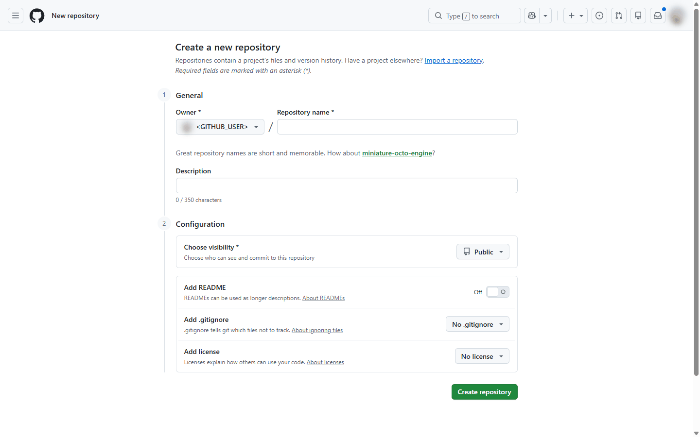

*ภาพที่ 5 หน้าสร้าง repository ใหม่ (ชื่อบัญชีถูกแทนด้วย `<GITHUB_USER>`)*

2. กรอก **Repository name** = `hello-ci` และ Description (ไม่บังคับ) รอให้ขึ้น `hello-ci is available.`
3. **Choose visibility** = **Public** (Jenkins จะ clone โดยไม่ใช้ credential)
4. **Add README = Off**, **.gitignore = No .gitignore**, **License = No license** เพราะเรามี commit อยู่แล้ว ถ้าให้ GitHub สร้างไฟล์ให้ ประวัติสองฝั่งจะไม่ตรงกันและ push ครั้งแรกถูกปฏิเสธ

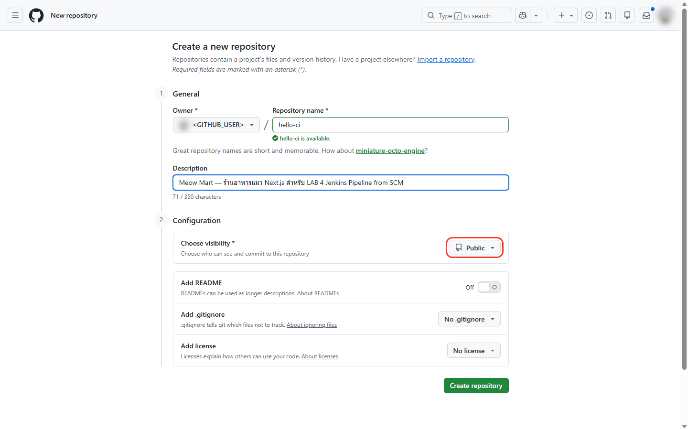

*ภาพที่ 6 ชื่อ `hello-ci` ว่างให้ใช้ visibility เป็น Public และไม่เพิ่มไฟล์ใด ๆ*

5. กด **Create repository**

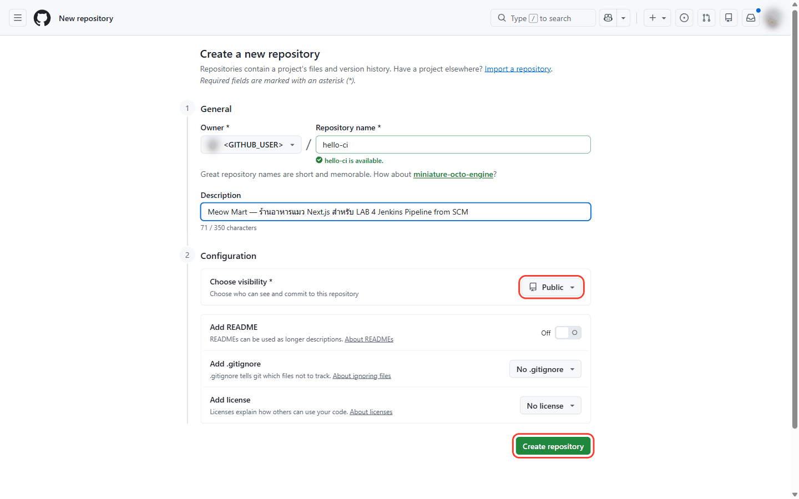

*ภาพที่ 7 ตรวจค่าทุกช่องอีกครั้งก่อนกดสร้าง*

6. GitHub แสดงหน้า Quick setup ของ repository ว่าง ให้ใช้ชุดคำสั่ง **…or push an existing repository from the command line**

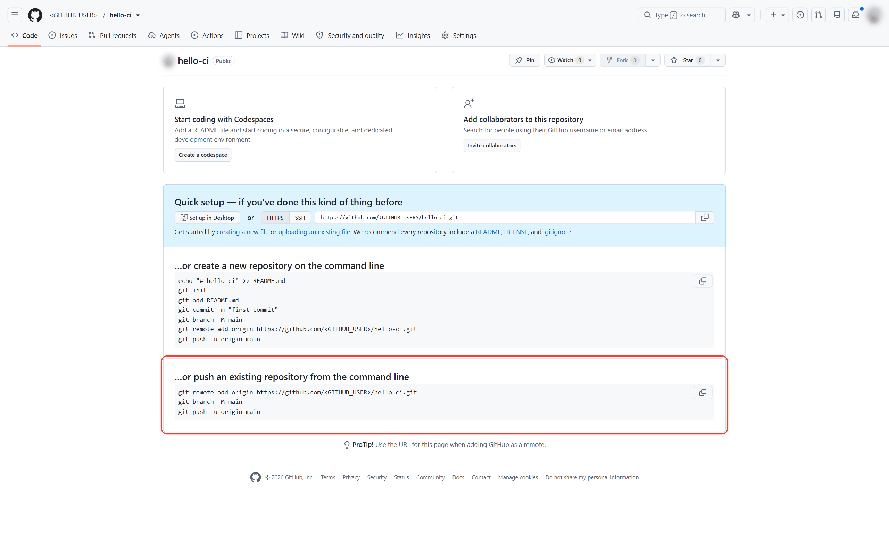

*ภาพที่ 8 repository ใหม่ยังว่าง ส่วนในกรอบแดงคือคำสั่งสำหรับโปรเจกต์ที่มี commit อยู่แล้ว*

7. เพิ่ม remote และ push ใน devtools:

```bash
cd "$PROJECT_DIR"
git remote add origin "https://github.com/<GITHUB_USER>/hello-ci.git"
git push -u origin main
```

เมื่อ Git ถาม Username ให้กรอก `<GITHUB_USER>` และ Password ให้วาง `<GITHUB_TOKEN>` (ไม่ใช่รหัสผ่านบัญชี) ห้ามใส่ token ลงใน URL และห้ามใช้ `credential.helper store`

✅ **ผลการทดลองจริง:**

```text
To https://github.com/<GITHUB_USER>/hello-ci.git
 * [new branch]      main -> main
branch 'main' set up to track 'origin/main'.
```

> 📝 ถ้าเห็น `remote: This repository moved. Please use the new location` แปลว่าพิมพ์ตัวพิมพ์เล็ก/ใหญ่ของชื่อบัญชีไม่ตรงกับบน GitHub push ยังสำเร็จ แต่ควรแก้ด้วย `git remote set-url origin https://github.com/<ชื่อตามที่ GitHub แสดง>/hello-ci.git`

8. refresh หน้า repository

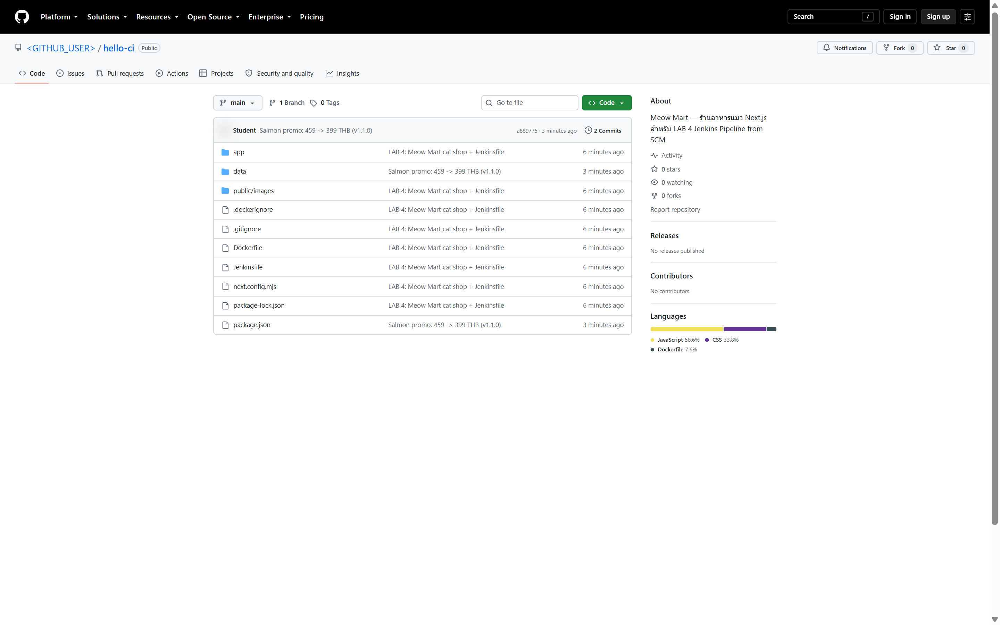

*ภาพที่ 9 GitHub แสดงไฟล์ครบ พร้อม commit `1659cee` ของ `Student`*

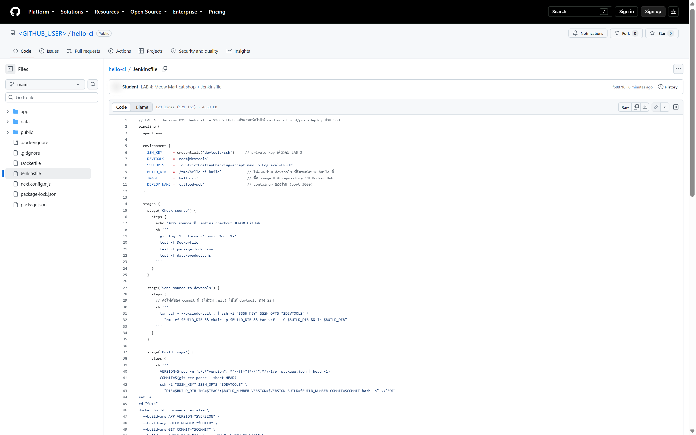

*ภาพที่ 10 `Jenkinsfile` อยู่ที่ root ของ repository — Jenkins จะอ่านไฟล์นี้*

---

## ช่วง C — Jenkins อ่าน Pipeline จาก GitHub

### อ่าน `Jenkinsfile` ของ LAB 4

```groovy
pipeline {
  agent any
  environment {
    IMAGE       = 'hello-ci'      // ชื่อ image และ repository บน Docker Hub
    DEPLOY_NAME = 'catfood-web'   // container ของร้าน (port 3000)
  }
  stages {
    stage('Check source') { ... git log -1; test -f Dockerfile ... }
    stage('Build image')  { ... --build-arg APP_VERSION=<จาก package.json>
                                --build-arg GIT_COMMIT="$(git rev-parse --short HEAD)" ... }
    stage('Test image')   { ... curl /api/health แล้ว grep ว่า commit ตรงกับ HEAD ... }
    stage('Push image')   { withCredentials(dockerhub) { push :$BUILD_NUMBER และ :latest } }
    stage('Deploy')       { ... docker pull → recreate catfood-web -p 3000:3000 → curl /api/health ... }
  }
  post { success { echo "ร้านอัปเดตแล้ว: ... commit ${env.GIT_COMMIT.substring(0, 7)}" } }
}
```

| ส่วน | ต่างจาก LAB 3 อย่างไร |
|---|---|
| ไม่มี stage เตรียมซอร์ส | Jenkins checkout repository ให้อัตโนมัติ (`Declarative: Checkout SCM`) |
| `APP_VERSION` | อ่านจาก `"version"` ใน `package.json` แทน parameter — เวอร์ชันจึงอยู่ใน Git ด้วย |
| `GIT_COMMIT` | ฝัง SHA แบบย่อลงใน image เพื่อตามรอยได้ |
| `Test image` | ตรวจเพิ่มว่า image ตอบ commit ตรงกับ HEAD ที่ checkout มา |
| Image | `<DOCKER_USER>/hello-ci` (แยกจาก `catfood-shop` ของ LAB 3) |

### การทดลองที่ 4 — สร้าง job แบบ Pipeline script from SCM

**คำถาม:** Jenkins อ่าน `Jenkinsfile` จาก Public repository ได้โดยไม่ต้องมี GitHub credential หรือไม่?

1. **New Item** → `hello-ci-pipeline` → **Pipeline** → **OK**

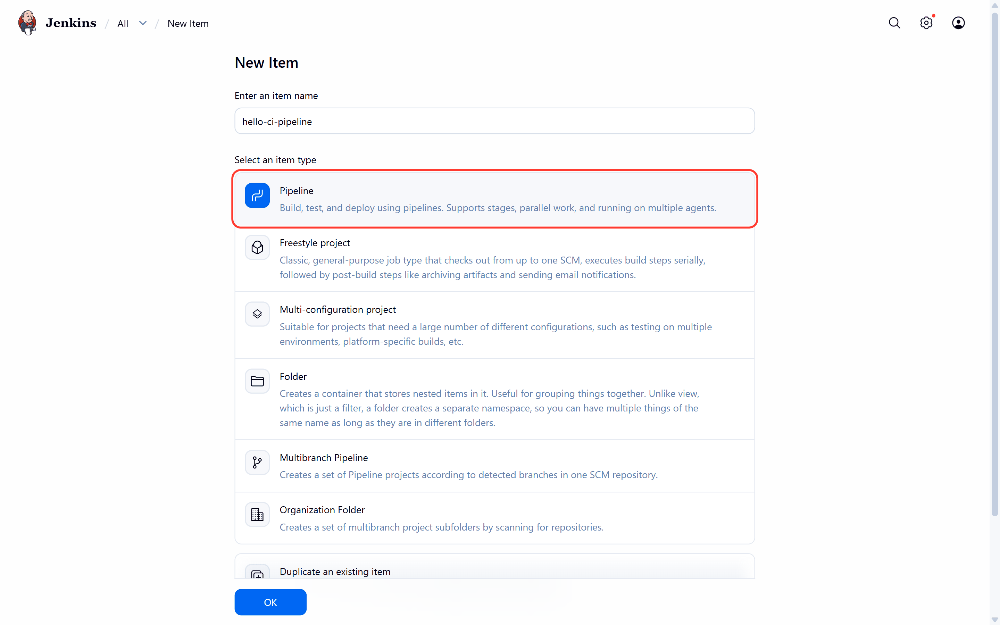

*ภาพที่ 11 สร้าง job ชนิด Pipeline*

2. ส่วน **Pipeline**: Definition = **Pipeline script from SCM**, SCM = **Git**, Repository URL = `https://github.com/<GITHUB_USER>/hello-ci.git`, Credentials = **- none -**

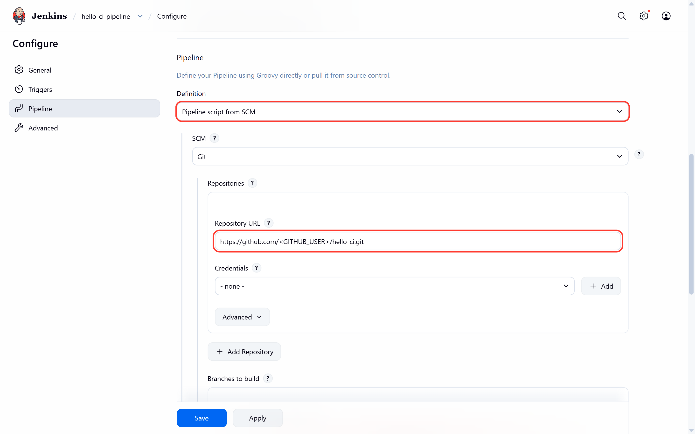

*ภาพที่ 12 Public repository จึงไม่ต้องเลือก credential*

3. **Branch Specifier** = `*/main` (ค่าเริ่มต้นคือ `*/master` ต้องแก้) และ **Script Path** = `Jenkinsfile` → **Save**

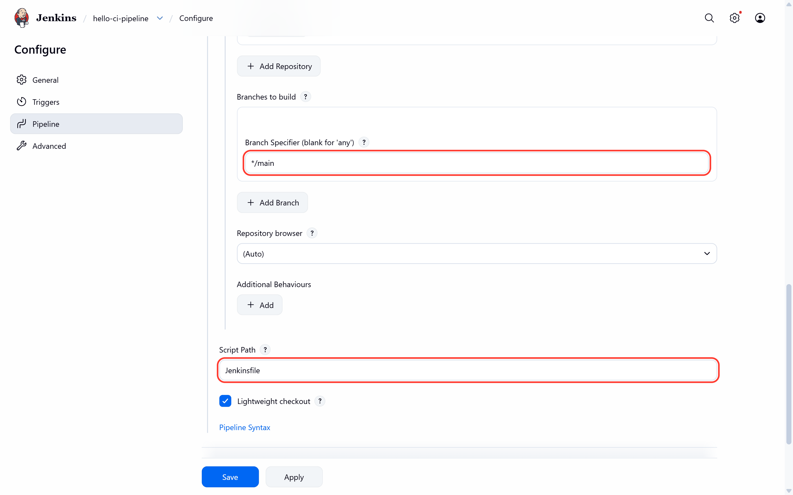

*ภาพที่ 13 Branch `*/main` และ Script Path `Jenkinsfile` — ถ้าลืมแก้ branch จะได้ error `Couldn't find any revision to build`*

✅ **ตรวจจาก terminal:**

```bash
curl -fsS -u admin:admin2569 http://localhost:8080/job/hello-ci-pipeline/config.xml \
  | grep -E '<url>|<name>|scriptPath'
```

```text
          <url>https://github.com/<GITHUB_USER>/hello-ci.git</url>
          <name>*/main</name>
    <scriptPath>Jenkinsfile</scriptPath>
```

### การทดลองที่ 5 — Manual build #1: เว็บรู้หรือไม่ว่ามาจาก commit ไหน?

**คำถาม:** เมื่อกด Build Now Jenkins checkout commit ใด และเว็บที่ deploy แสดง commit เดียวกันหรือไม่?

1. เปิด `hello-ci-pipeline` → **Build Now**

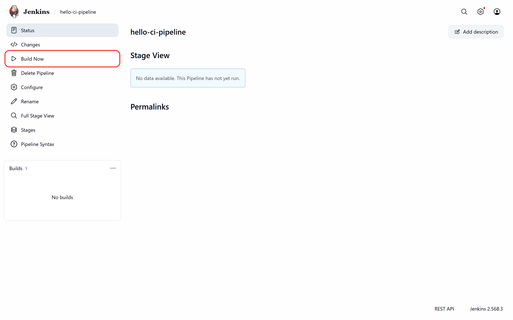

*ภาพที่ 14 build แรกของ job สั่งด้วยมือ*

2. เปิด build #1 → **Pipeline Overview**

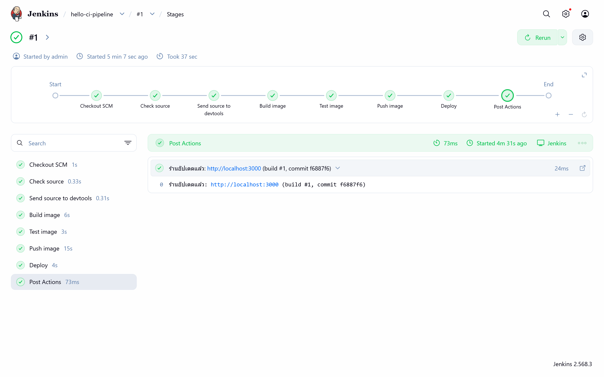

*ภาพที่ 15 มี stage `Checkout SCM` เพิ่มขึ้นมาก่อน 5 stage ที่เขียนไว้ ทั้งหมดผ่านใน 48 วินาที*

3. เปิด **Console Output** แล้วสังเกตส่วนต้น

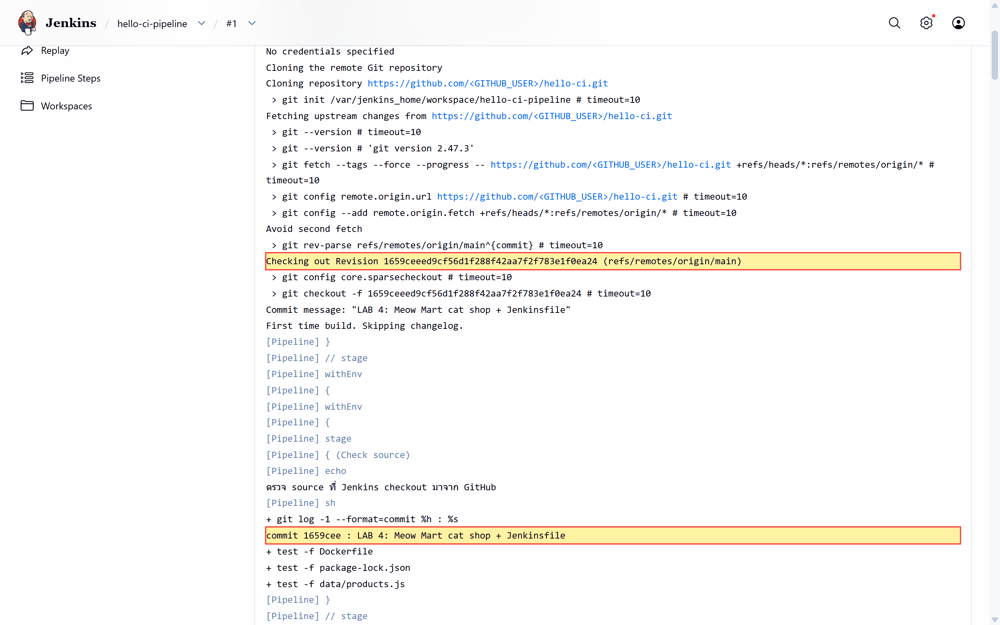

*ภาพที่ 16 `Checking out Revision 1659ceeed9cf…` และ stage `Check source` พิมพ์ `commit 1659cee : LAB 4: Meow Mart cat shop + Jenkinsfile`*

```bash
curl -fsS -u admin:admin2569 http://localhost:8080/job/hello-ci-pipeline/1/consoleText \
  | grep -E 'Obtained Jenkinsfile|Checking out Revision|^commit |"commit"|ร้านอัปเดต|Finished:'
```

✅ **ผลการทดลองจริง:**

```text
Obtained Jenkinsfile from git https://github.com/<GITHUB_USER>/hello-ci.git
Checking out Revision 1659ceeed9cf56d1f288f42aa7f2f783e1f0ea24 (refs/remotes/origin/main)
commit 1659cee : LAB 4: Meow Mart cat shop + Jenkinsfile
{"status":"ok","app":"catfood-shop","version":"1.0.0","build":"1","commit":"1659cee","builtAt":"2026-09-25T07:40:20Z","host":"de870fa92bc1"}
{"status":"ok","app":"catfood-shop","version":"1.0.0","build":"1","commit":"1659cee","builtAt":"2026-09-25T07:40:20Z","host":"9c284d5f92a5"}
ร้านอัปเดตแล้ว: http://localhost:3000 (build #1, commit 1659cee)
Finished: SUCCESS
```

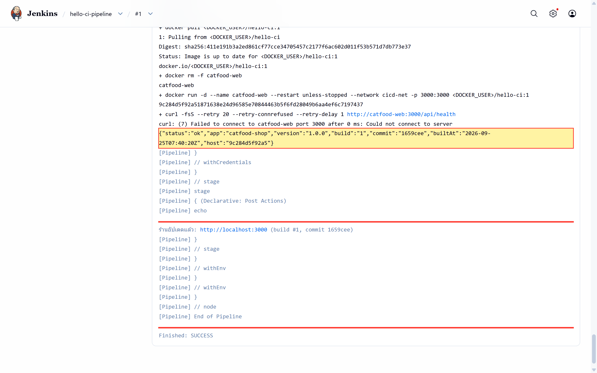

*ภาพที่ 17 stage Deploy pull `<DOCKER_USER>/hello-ci:1` แล้ว `/api/health` ตอบ `"commit":"1659cee"`*

> 🔍 **วิเคราะห์ผล:** บรรทัดแรก `Obtained Jenkinsfile from git` ยืนยันว่า Pipeline ถูกอ่านจาก GitHub ไม่ใช่จากหน้าเว็บ JSON ปรากฏสองครั้งเพราะ stage Test (container ชั่วคราว) และ stage Deploy (`catfood-web`) ต่างก็ตรวจ health และทั้งคู่รายงาน commit `1659cee` ตรงกับ `Checking out Revision`

---

## ช่วง D — ให้ Jenkins build เองเมื่อมี commit ใหม่

### การทดลองที่ 6 — เปิด Poll SCM

**คำถาม:** เมื่อยังไม่มี commit ใหม่ Poll SCM จะสร้าง build หรือไม่?

1. **hello-ci-pipeline → Configure → Triggers** → เลือก **Poll SCM** → Schedule = `* * * * *` → **Save**

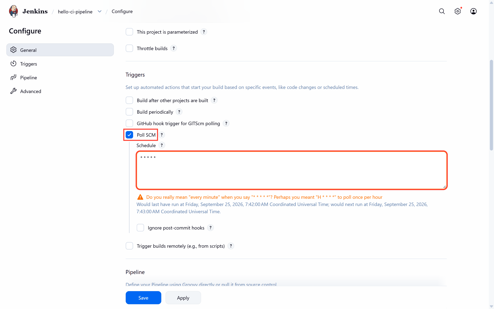

*ภาพที่ 18 Jenkins เตือนว่า `* * * * *` คือทุกนาทีและแนะนำ `H * * * *` — ในแล็บยืนยันใช้ทุกนาทีเพื่อเห็นผลเร็ว*

2. รอ 1 นาที แล้วเปิดเมนู **Git Polling Log** ของ job

```bash
curl -fsS -u admin:admin2569 http://localhost:8080/job/hello-ci-pipeline/scmPollLog/ \
  | sed -e 's/<[^>]*>//g' | grep -E '\[poll\]|No changes|Changes found'
```

✅ **ผลการทดลองจริง:**

```text
[poll] Latest remote head revision on refs/heads/main is: 1659ceeed9cf56d1f288f42aa7f2f783e1f0ea24 - already built by 1
No changes
```

> 🔍 **วิเคราะห์ผล:** Jenkins ถาม GitHub แล้วพบว่า HEAD ของ `main` คือ `1659cee` ซึ่ง build #1 สร้างไปแล้ว จึงไม่สร้าง build ใหม่ Poll SCM ไม่ได้ build ทุกนาที แต่ **ตรวจ** ทุกนาที

### การทดลองที่ 7 — แก้ราคาสินค้าแล้ว push

**คำถาม:** ถ้าร้านจัดโปรลดราคาแซลมอนจาก ฿459 เป็น ฿399 และออกเวอร์ชัน 1.1.0 ต้องทำอะไรบ้าง?

```bash
cd "$PROJECT_DIR"
sed -i "s/    price: 459,/    price: 399,/; s/    badge: 'ขายดี',/    badge: 'ลดราคา',/" data/products.js
sed -i 's/"version": "1.0.0"/"version": "1.1.0"/' package.json
git --no-pager diff -U0 | grep -E '^[-+] '
git add data/products.js package.json
git commit -q -m 'Salmon promo: 459 -> 399 THB (v1.1.0)'
git log --oneline -1
date -u +PUSH_AT=%H:%M:%S
git push origin main
```

✅ **ผลการทดลองจริง:**

```text
-    price: 459,
+    price: 399,
-    badge: 'ขายดี',
+    badge: 'ลดราคา',
-  "version": "1.0.0",
+  "version": "1.1.0",
ca0726c Salmon promo: 459 -> 399 THB (v1.1.0)
PUSH_AT=07:43:10
```

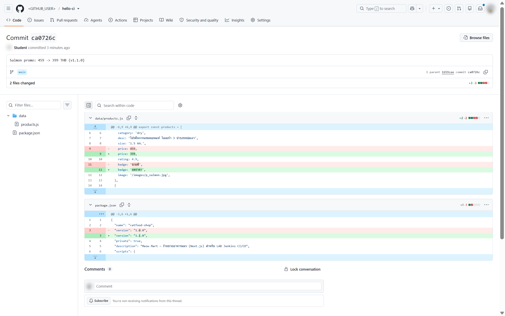

*ภาพที่ 19 GitHub แสดงการแก้ 2 ไฟล์ใน commit `ca0726c` — ไม่ได้แตะ Jenkins เลย*

### การทดลองที่ 8 — Jenkins build เองหรือไม่ และใช้เวลาเท่าไร?

**คำถาม:** หลัง push ต้องรอนานเท่าไรเว็บจึงเปลี่ยน และมีหลักฐานอะไรว่า build นี้เกิดจาก commit ใหม่?

ไม่ต้องกดปุ่มใด ๆ รอ 1–2 นาทีแล้วเปิด build #2

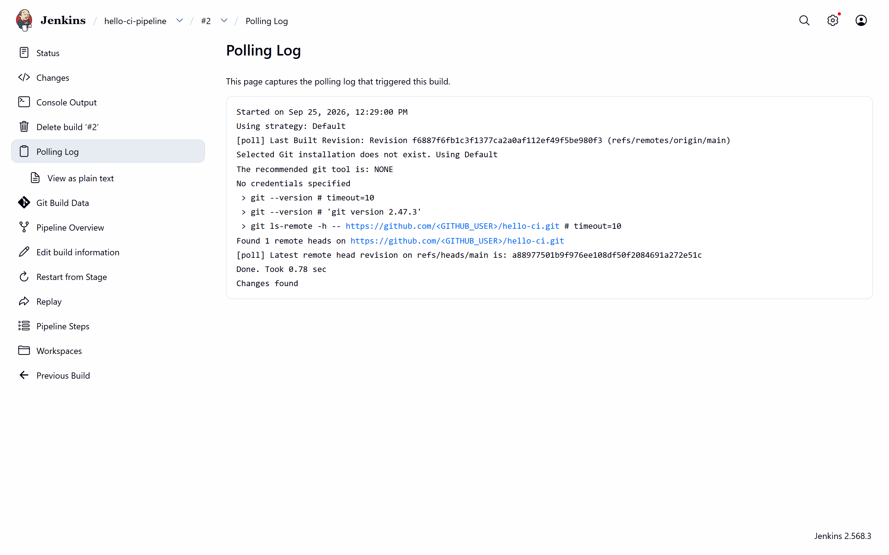

*ภาพที่ 20 Polling Log ที่ทำให้เกิด build #2: revision ล่าสุดคือ `ca0726c…` ต่างจาก `1659cee` ที่ build ไว้ → `Changes found`*

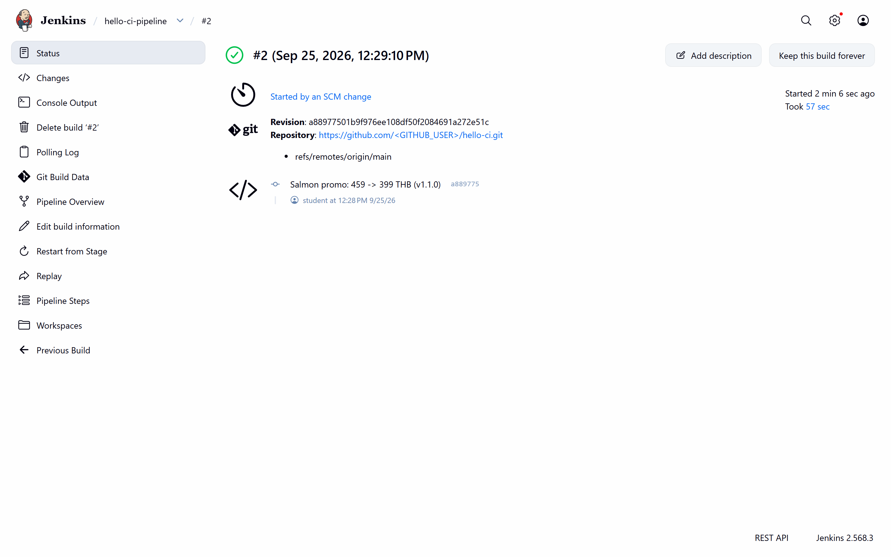

*ภาพที่ 21 หน้า build #2 บอกสาเหตุ **Started by an SCM change** พร้อม Revision และข้อความ commit*

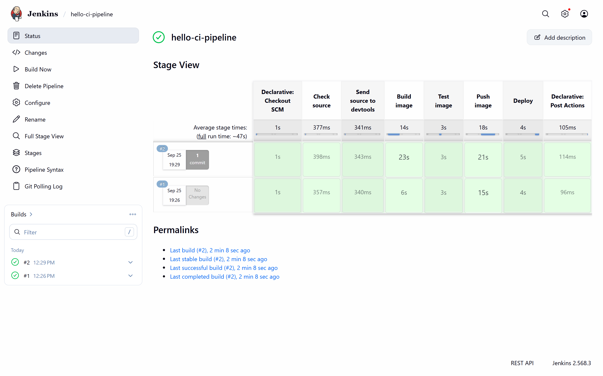

*ภาพที่ 22 Stage View: build #2 มีป้าย “1 commit” ส่วน build #1 เป็น “No Changes” และ Build image ของ #2 ใช้ 41 วินาที*

```bash
curl -gfsS -u admin:admin2569 \
  'http://localhost:8080/job/hello-ci-pipeline/2/api/json?tree=result,duration,timestamp,actions[causes[shortDescription]]' \
  | python3 -c 'import json,sys,time; d=json.load(sys.stdin); c=[x["shortDescription"] for a in d["actions"] if a and "causes" in a for x in a["causes"]]; s=d["timestamp"]/1000; print("result=%s  cause=%s  start=%s  end=%s  duration=%.1f s" % (d["result"], c[0], time.strftime("%H:%M:%S", time.gmtime(s)), time.strftime("%H:%M:%S", time.gmtime(s+d["duration"]/1000)), d["duration"]/1000))'
curl -fsS -u admin:admin2569 http://localhost:8080/job/hello-ci-pipeline/2/pollingLog/pollingLog | tail -3
curl -s http://localhost:3000/api/health; echo
```

✅ **ผลการทดลองจริง:**

```text
result=SUCCESS  cause=Started by an SCM change  start=07:44:07  end=07:45:13  duration=65.7 s
[poll] Latest remote head revision on refs/heads/main is: ca0726cf515fb1071889d5d94a44f81666ca4d1a
Done. Took 0.83 sec
Changes found
{"status":"ok","app":"catfood-shop","version":"1.1.0","build":"2","commit":"ca0726c","builtAt":"2026-09-25T07:44:10Z","host":"f7bac2cd877b"}
```

| เหตุการณ์ (UTC) | เวลา | ห่างจาก push |
|---|---|---:|
| `git push` | 07:43:10 | 0 s |
| Poll SCM พบ `Changes found` → build #2 เริ่ม | 07:44:07 | 57 s |
| build #2 จบ เว็บเป็นเวอร์ชันใหม่ | 07:45:13 | **2 นาที 3 วินาที** |

| Stage | build #1 (manual) | build #2 (SCM) |
|---|---:|---:|
| Checkout SCM | 1.3 s | 1.1 s |
| Build image | 20.3 s | **41.4 s** |
| Test image | 1.8 s | 1.7 s |
| Push image | 15.8 s | 15.7 s |
| Deploy | 3.5 s | 3.5 s |

> 🔍 **วิเคราะห์ผล:** ความหน่วงส่วนใหญ่ (57 วินาที) มาจากการรอรอบ poll ถัดไป ซึ่งเป็นธรรมชาติของ Poll SCM ส่วน Build image ของ build #2 ช้ากว่า #1 เพราะเราแก้ `package.json` — Dockerfile คัดลอก `package.json` ก่อน `RUN npm ci` การเปลี่ยนไฟล์นี้จึงทำให้ cache ของ `npm ci` ใช้ไม่ได้ (console แสดง `Step 4/25 : RUN npm ci` เป็น `Running in` แทน `Using cache`) ถ้าแก้เฉพาะ `data/products.js` จะใช้ cache ของ `npm ci` ได้และเร็วขึ้น

เปิด **http://localhost:3000** อีกครั้ง:

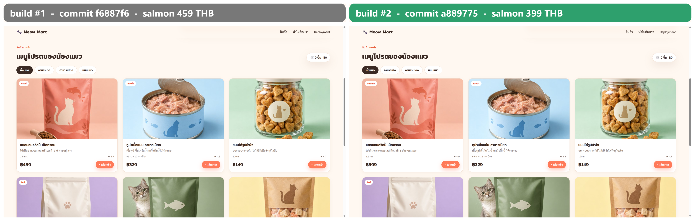

*ภาพที่ 23 ซ้าย: build #1 (`1659cee`) แซลมอน ฿459 ป้าย “ขายดี” ขวา: build #2 (`ca0726c`) ฿399 ป้าย “ลดราคา” — เปลี่ยนเองหลัง push โดยไม่ได้แตะ Jenkins*

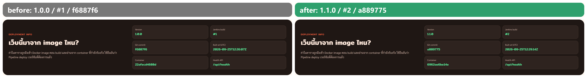

*ภาพที่ 24 Deployment info เปลี่ยนจาก `1.0.0 / #1 / 1659cee` เป็น `1.1.0 / #2 / ca0726c`*

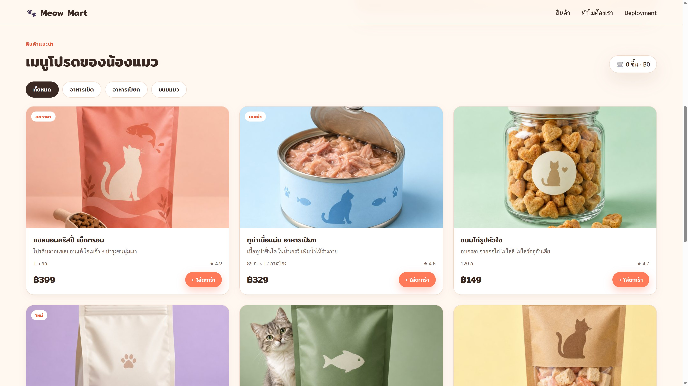

*ภาพที่ 25 หน้าร้านแบบเต็มจอ (1920×1080) หลัง build #2 การ์ดแรกแสดง ฿399 และป้าย “ลดราคา”*

---

## ช่วง E — ตรวจย้อนกลับครบวงจร

### การทดลองที่ 9 — commit, build, image และเว็บ ชี้ไปที่เดียวกันหรือไม่?

**คำถาม:** เราพิสูจน์ได้หรือไม่ว่าเว็บที่รันอยู่คือผลของ commit ล่าสุดบน GitHub?

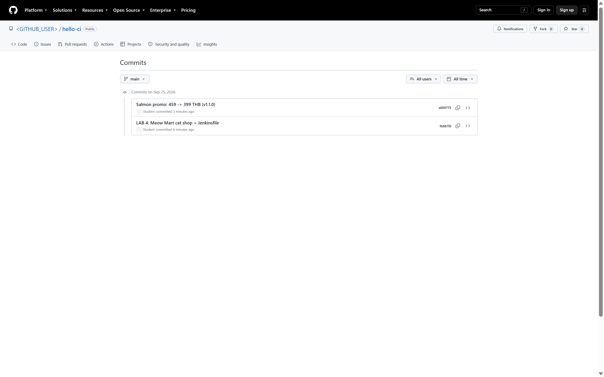

*ภาพที่ 26 GitHub มี 2 commit: `1659cee` (build #1) และ `ca0726c` (build #2)*

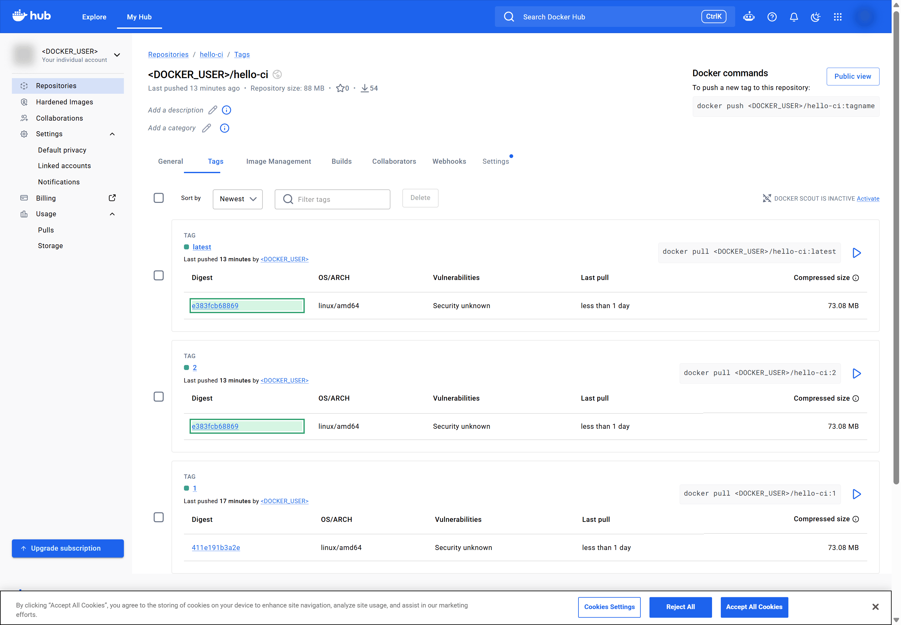

*ภาพที่ 27 Docker Hub `<DOCKER_USER>/hello-ci`: tag `latest` และ `2` ชี้ digest เดียวกัน `e383fcb68869` ส่วน tag `1` คือ `411e191b3a2e`*

| หลักฐาน | build #1 | build #2 |
|---|---|---|
| GitHub commit | `1659cee` | `ca0726c` |
| Jenkins cause | Started by user admin | **Started by an SCM change** |
| Docker Hub tag → digest | `hello-ci:1` → `411e191b3a2e…` | `hello-ci:2`, `latest` → `e383fcb68869…` |
| `/api/health` | `1.0.0` · build 1 · `1659cee` | `1.1.0` · build 2 · `ca0726c` |

ตรวจสถานะจบแล็บ (ไม่ต้องส่ง token ให้ตัวตรวจ):

```bash
cd "$LAB_SRC"
GITHUB_USER='<GITHUB_USER>' DOCKER_USER='<DOCKER_USER>' bash check.sh
```

✅ **ผลการทดลองจริง:**

```text
[PASS] GitHub repository <GITHUB_USER>/hello-ci เป็น Public
[INFO] GitHub main = ca0726c
[PASS] job อ่าน Jenkinsfile จาก GitHub branch */main
[PASS] เปิด Poll SCM ทุกนาที (* * * * *)
[PASS] hello-ci-pipeline build #2 = SUCCESS
[PASS] build #2 checkout commit ca0726c = HEAD ของ GitHub
[PASS] พบ build ที่เริ่มจาก "Started by an SCM change"
[PASS] Docker Hub hello-ci:2 และ latest = sha256:e383fcb68869...
[INFO] health: {"status":"ok","app":"catfood-shop","version":"1.1.0","build":"2","commit":"ca0726c",...}
[PASS] http://localhost:3000 = build #2 / commit ca0726c
[INFO] token pattern hits in git history: 0
[PASS] ไม่พบรูปแบบ token ใน git history ของ hello-ci
ผลรวม: PASS
```

---

## 📊 สรุปผลการทดลอง

| # | คำถาม | ผลจริง | ข้อสรุป |
|---|---|---|---|
| 1–2 | repository ต้องมีอะไร | 22 ไฟล์ใน commit `1659cee` | ซอร์ส + Dockerfile + Jenkinsfile อยู่ด้วยกัน |
| 3 | สร้าง repo และ push อย่างปลอดภัย | Public `hello-ci`, token กรอกที่ prompt เท่านั้น | ไม่มี token ใน URL หรือไฟล์ |
| 4–5 | Jenkins อ่าน Pipeline จาก Git ได้ไหม | `Obtained Jenkinsfile from git`, SUCCESS 48 s | Pipeline as Code ทำงาน |
| 6 | poll ตอนไม่มี commit ใหม่ | `No changes` | poll = ตรวจ ไม่ใช่ build ทุกนาที |
| 7–8 | push แล้วเกิดอะไร | `Changes found`, SCM change, เว็บใหม่ใน 2 นาที 3 วินาที | CI/CD ทำงานโดยไม่ต้องกดปุ่ม |
| 9 | ตามรอยได้ไหม | commit/build/image/เว็บ ชี้ `ca0726c` ตรงกัน | Traceability ครบวงจร |

## แก้ปัญหาที่พบบ่อย

| อาการ | จุดตรวจ | วิธีแก้ |
|---|---|---|
| `Repository name already exists` | มี `hello-ci` เดิมในบัญชี | rename/archive ของเดิม หรือลบถ้าไม่ต้องใช้แล้ว |
| push ถูกปฏิเสธ `rejected (fetch first)` | ตอนสร้าง repo เปิด Add README | สร้าง repo ใหม่แบบว่าง หรือ `git pull --rebase origin main` ก่อน push |
| `Authentication failed` ตอน push | ใช้รหัสผ่านบัญชีแทน token หรือ token ไม่มี `public_repo` | ใช้ Personal access token ที่ prompt Password |
| `Couldn't find any revision to build` | Branch Specifier ยังเป็น `*/master` | แก้เป็น `*/main` |
| `Unable to find Jenkinsfile` | Script Path ผิด หรือไม่ได้ commit `Jenkinsfile` | ตรวจ `git ls-files Jenkinsfile` และ Script Path |
| `Failed to connect to repository ... returned error: 400/404` | URL ผิดหรือ repo เป็น Private | ใช้ URL จากปุ่ม Code บน GitHub และตั้ง Public |
| push แล้วไม่มี build ใหม่ | ยังไม่เปิด Poll SCM, cron ผิด หรือยังไม่ครบ 1 นาที | ดูเมนู Git Polling Log ต้องเห็น `Changes found` |
| stage Test ล้มที่ `grep -q "commit"` | image ไม่ได้รับ `GIT_COMMIT` | ใช้ Dockerfile และ Jenkinsfile ของแล็บ (ARG `GIT_COMMIT` อยู่ใน stage runtime) |
| `port is already allocated` ที่ 3000 | `catfood-web` เดิมจาก LAB 3 ถูกลบไม่สำเร็จ | `docker rm -f catfood-web` แล้วสั่ง build ใหม่ |

## สรุป

LAB 4 ย้ายร้าน Meow Mart จากโฟลเดอร์ที่ mount ไว้ไปอยู่ใน GitHub repository ของนักศึกษาเอง พร้อม `Jenkinsfile` ที่อยู่คู่กับโค้ด Jenkins อ่าน Pipeline จาก repository, ตรวจ commit ใหม่ทุกนาทีด้วย Poll SCM และ build → test → push → deploy ให้เอง ผลการทดลองยืนยันว่าการแก้ราคาหนึ่งบรรทัดแล้ว push ทำให้เว็บเปลี่ยนภายในราว 2 นาทีโดยไม่ต้องกดปุ่มใด และทุกจุดตั้งแต่ GitHub, Jenkins, Docker Hub จนถึงหน้าเว็บ ชี้ไปที่ commit `ca0726c` เดียวกัน

ความหน่วงเกือบ 1 นาทีมาจากการรอรอบ poll **LAB 5** จะเปลี่ยนเป็น webhook ให้ GitHub แจ้ง Jenkins ทันทีที่มี push
