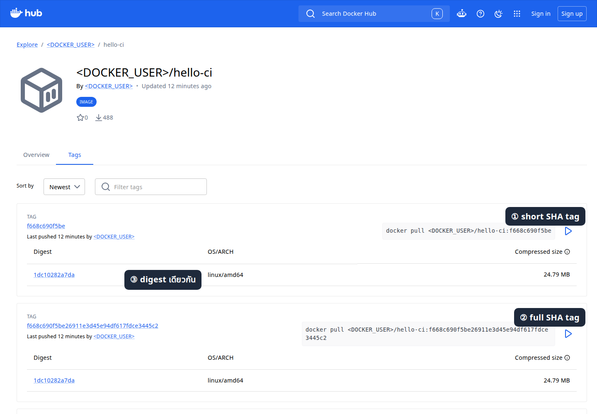

# LAB 4 — Pipeline จาก GitHub ถึง Docker Hub

แล็บนี้ศึกษาความสัมพันธ์ระหว่าง Git revision, Jenkins Pipeline และ immutable image digest โดย Jenkins อ่าน public repository แบบไม่ใช้ credential, ทดสอบผลแบบ deterministic, สร้าง image สอง tag จาก SHA เดียวกัน, push ด้วย credential ที่ Jenkins ปกปิด และดึง image กลับมารันด้วย digest

## ผลลัพธ์การเรียนรู้

- อธิบายได้ว่า anonymous checkout ใช้ได้เฉพาะการอ่าน public repository
- พิสูจน์ได้ว่า full SHA, short SHA, OCI revision label และ digest อ้างถึง build เดียวกัน
- ใช้ Jenkins credential `dockerhub` ผ่าน `--password-stdin` เฉพาะ stage `Publish image` โดยไม่บันทึก secret ลง repository หรือ log
- แยก Poll SCM ซึ่งตรวจทุกนาทีออกจากขั้น build และ push image

## สัญญาของระบบ

| ส่วน | ค่าที่ใช้ในเอกสาร |
|---|---|
| GitHub repository | `https://github.com/<GITHUB_USER>/hello-ci.git` (Public) |
| Jenkins job | `hello-ci-pipeline` / Pipeline script from SCM / Credentials `- none -` |
| Docker Hub repository | `<DOCKER_USER>/hello-ci` (Public) |
| Jenkins credential | ID `dockerhub`, Username `<DOCKER_USER>`, Password `<DOCKER_TOKEN>` |
| Trigger | Poll SCM `* * * * *` |

ค่าจริงอ่านจาก `DevTools/backup/.env` เฉพาะ runtime เท่านั้น ห้ามคัดลอกค่าจริงลงไฟล์ คำสั่งที่เผยแพร่ screenshot หรือ build parameter
ก่อนเริ่ม ให้ผู้สอนใช้ `github_preflight.sh` ตรวจสิทธิ์ runtime โดยไม่พิมพ์ token ออกหน้าจอ

## ภาพรวมสถาปัตยกรรม

```text
GitHub main (anonymous read)
        │ full SHA
        ▼
Jenkins: test → build → push ─────► Docker Hub :<full SHA> / :<short SHA>
        │                                  │
        └──────── pull + run by digest ◄───┘
```

## การทดลองที่ 1 — Repository นี้เป็นของแล็บและอ่านแบบ anonymous ได้หรือไม่?

**คำถาม:** public repository `hello-ci` มี ownership marker ที่อนุญาตให้ปรับปรุงโดยไม่แตะ repository อื่นหรือไม่?

```bash
git clone https://github.com/<GITHUB_USER>/hello-ci.git "$HOME/hello-ci"
test "$(cat "$HOME/hello-ci/.course-cicd2569")" = 'course fixture — safe to delete'
```

✅ **สิ่งที่ต้องสังเกต:** clone ไม่ถาม credential และ marker มีค่า canonical ตรงกันก่อนแก้ไฟล์


*ภาพที่ 1: หน้า GitHub จริง มีกรอบแดงหมายเลข ① ล้อม branch `main` และรายการ source ที่ Jenkins จะ checkout; ชื่อบัญชีถูกแทนด้วย `<GITHUB_USER>` ก่อนบันทึก*

## การทดลองที่ 2 — ผลทดสอบซ้ำได้โดยไม่ขึ้นกับ Jenkins หรือไม่?

**คำถาม:** source revision เดียวกันให้ output ตรง `expected.txt` ทุกครั้งหรือไม่?

```bash
bash -ceu 'cd "$1"; ./hello.sh > actual.txt; diff -u expected.txt actual.txt' -- "$HOME/hello-ci"
```

✅ **สิ่งที่ต้องสังเกต:** `diff` ไม่แสดงความแตกต่างและคืน exit code `0`

## การทดลองที่ 3 — จะ push Pipeline-as-Code โดยไม่ฝัง PAT ได้อย่างไร?

**คำถาม:** commit ที่มี `Jenkinsfile`, `Dockerfile`, web artifact และ marker จะขึ้น `main` โดยไม่เก็บ token ใน URL ได้หรือไม่?

```bash
git -C "$HOME/hello-ci" add .course-cicd2569 .dockerignore Dockerfile Jenkinsfile app expected.txt hello.sh
git -C "$HOME/hello-ci" -c user.name=Student -c user.email=student@example.invalid commit -m 'Build immutable image from Git SHA'
```

```bash
git -C "$HOME/hello-ci" push origin main
```

เมื่อ Git ถามให้กรอก Username `<GITHUB_USER>` และใช้ `<GITHUB_TOKEN>` เป็น Password; ห้ามใช้ token ใน remote URL และห้ามเปิด `credential.helper store`

✅ **สิ่งที่ต้องสังเกต:** GitHub แสดง commit บน `main` พร้อมไฟล์ทั้งหมด โดย marker ยังอยู่และไม่มี secret ใน history

## การทดลองที่ 4 — Jenkins จะ checkout GitHub โดยไม่ใช้ credential แล้วเก็บ Docker credential แยกกันได้หรือไม่?

**คำถาม:** job definition แยก anonymous GitHub read ออกจาก credential `dockerhub` ที่ใช้เฉพาะ stage push ได้หรือไม่?

1. เปิด **Jenkins → New Item**, กรอก `hello-ci-pipeline`, เลือก **Pipeline**, แล้วกด **OK**
2. เลือก **Pipeline script from SCM → Git**, URL `https://github.com/<GITHUB_USER>/hello-ci.git`, Credentials `- none -`, Branch `*/main`, Script Path `Jenkinsfile`
3. ที่ **Manage Jenkins → Credentials → System → Global credentials → Add Credentials** เลือก Username with password, ID `dockerhub`, Username `<DOCKER_USER>`, Password `<DOCKER_TOKEN>` แล้วกด **Create**

```bash
curl -fsS -u '<JENKINS_USER>:<JENKINS_API_TOKEN>' http://localhost:8080/job/hello-ci-pipeline/config.xml | grep -E 'github.com|credentialsId|scriptPath'
```

✅ **สิ่งที่ต้องสังเกต:** SCM XML มี GitHub URL และ `Jenkinsfile` แต่ไม่มี SCM `credentialsId`; `Jenkinsfile` มี `withCredentials` เพียงครั้งเดียวภายใน `Publish image`


*ภาพที่ 2: หน้า Jenkins จริง ลำดับ ① Definition ② Git ③ URL ④ Credentials `- none -` ⑤ branch `*/main`; URL ถูกแทนบัญชีด้วย placeholder*

## การทดลองที่ 5 — Build หนึ่งครั้งผูก SHA, tag และ digest ได้ครบหรือไม่?

**คำถาม:** manual build จะทดสอบ สร้าง push และ pull-run image จนได้ digest ที่ตรวจสอบย้อนกลับได้หรือไม่?

1. เปิด job `hello-ci-pipeline` แล้วกด **Build Now**
2. เปิด build ล่าสุด → **Console Output** และตรวจ stage `Source SHA`, `Deterministic test`, `Build OCI image`, `Publish image`, `Verify public digest`

```bash
curl -fsS -u '<JENKINS_USER>:<JENKINS_API_TOKEN>' http://localhost:8080/job/hello-ci-pipeline/lastSuccessfulBuild/artifact/build-evidence.env
```

✅ **สิ่งที่ต้องสังเกต:** build ใช้ local tag โดยไม่ bind credential, `Publish image` เป็น stage เดียวที่ bind credential และ `Verify public digest` ดึง public image โดยไม่ใช้ credential; `FULL_SHA` เป็น 40 hex, `SHORT_SHA` คือ 12 ตัวแรก, `DIGEST` เป็น `sha256:` 64 hex และ build จบ `SUCCESS`


*ภาพที่ 3: หน้า Jenkins จริง มี marker ล้อม Build local, Publish ที่ bind credential, Verify public digest ที่ไม่ bind และ `Finished: SUCCESS`; ไม่มี credential จริงในภาพ*



*ภาพที่ 4: หน้า Docker Hub จริง มี marker ① full SHA tag ② short SHA tag ③ digest; ชื่อบัญชีถูกแทนด้วย `<DOCKER_USER>` ก่อนบันทึก*

## การทดลองที่ 6 — Poll SCM สร้าง build เฉพาะเมื่อ revision เปลี่ยนหรือไม่?

**คำถาม:** schedule ทุกนาทีจะตรวจ GitHub และสร้าง build จาก SCM change หลัง push commit ใหม่ได้หรือไม่?

1. เปิด **hello-ci-pipeline → Configure → Triggers**, เลือก **Poll SCM**, กรอก `* * * * *`, อ่านคำเตือน every minute แล้วกด **Save**
2. เพิ่มบรรทัด `# Poll SCM probe` ใน `hello.sh`, commit และ push จากนั้นรอโดยไม่กด Build Now

ห้ามใช้ `H/1` เพราะ Jenkins ตีความเป็นหนึ่งครั้งต่อชั่วโมง ไม่ใช่หนึ่งครั้งต่อนาที

```bash
bash -ceu 'cd "$1"; printf "\n# Poll SCM probe\n" >> hello.sh; git add hello.sh; git commit -m "Observe Poll SCM"; git push origin main' -- "$HOME/hello-ci"
```

✅ **สิ่งที่ต้องสังเกต:** Git Polling Log แสดง `Changes found`, build cause เป็น `Started by an SCM change` และ checkout SHA ตรง `origin/main`


*ภาพที่ 5: หน้า Jenkins จริง ลำดับ ① เลือก Poll SCM ② กรอกดาวห้าช่อง ③ อ่านคำเตือน แล้วกด Save*


*ภาพที่ 6: Git Polling Log จริง มี marker ① ล้อม `Changes found`; URL บัญชีถูกแทนด้วย `<GITHUB_USER>` ก่อนบันทึก*


*ภาพที่ 7: หน้า Jenkins build จริง มี marker ล้อม `Started by an SCM change` และสถานะสำเร็จ*

## การทดลองที่ 7 — Contract ทั้งชุดตรวจซ้ำอัตโนมัติได้หรือไม่?

**คำถาม:** repository, Jenkins build, OCI labels, digest และ pull-run ผ่านเกณฑ์เดียวกันทั้งหมดหรือไม่?

```bash
bash "$COURSE_ROOT/004_LAB_Pipeline_From_Git/check.sh"
```

✅ **สิ่งที่ต้องสังเกต:** รายการตรวจจบด้วย `ผลรวม: PASS` และรายงาน GitHub SHA = image revision = build SHA พร้อม pull-run output `Hello from GitHub`

## แก้ปัญหาที่พบบ่อย

| อาการ | สาเหตุที่ตรวจ | วิธีแก้ที่ควบคุมความเสี่ยง |
|---|---|---|
| clone ถาม credential | repository ไม่เป็น Public หรือ URL ผิด | ตรวจ visibility และใช้ HTTPS URL ตาม contract |
| Jenkins checkout ล้มเหลว | branch/Script Path ไม่ตรง | ตรวจ `*/main` และ `Jenkinsfile` โดยไม่เพิ่ม SCM credential |
| `unauthorized` ตอน push image | credential ID หรือ token ผิด | แก้ credential `dockerhub`; ห้ามวาง token ใน Jenkinsfile |
| tag มีค่า `latest` | Pipeline ไม่ได้อ่าน Git SHA | ตรวจ `git rev-parse HEAD` และห้ามใช้ mutable tag เป็นหลักฐาน |
| digest ว่าง | push ไม่สำเร็จหรือ inspect ก่อน push | ตรวจ exit code ของ `docker push` แล้วอ่าน `RepoDigests` หลัง push |
| Poll ไม่เกิด build | ยังไม่มี commit ใหม่หรือ cron ผิด | ตรวจ `* * * * *` และ Git Polling Log ก่อนแก้ trigger |
| `Invalid option type "timestamps"` | Jenkins ไม่มี Timestamper plugin | ตัด option ที่ไม่จำเป็น หรือให้ผู้ดูแลติดตั้ง plugin ก่อนใช้ |

## สรุป

Tag จาก SHA ช่วยให้ค้นหา image ตาม source revision ได้ ส่วน digest ยืนยัน content แบบ immutable; ทั้งสองค่าเสริมกัน แต่ไม่ใช้แทนกัน การ checkout public repository ไม่ต้องใช้ credential ขณะที่การ push Docker Hub ต้องจำกัด credential ให้เกิดเฉพาะ stage ที่ต้องเขียนเท่านั้น
