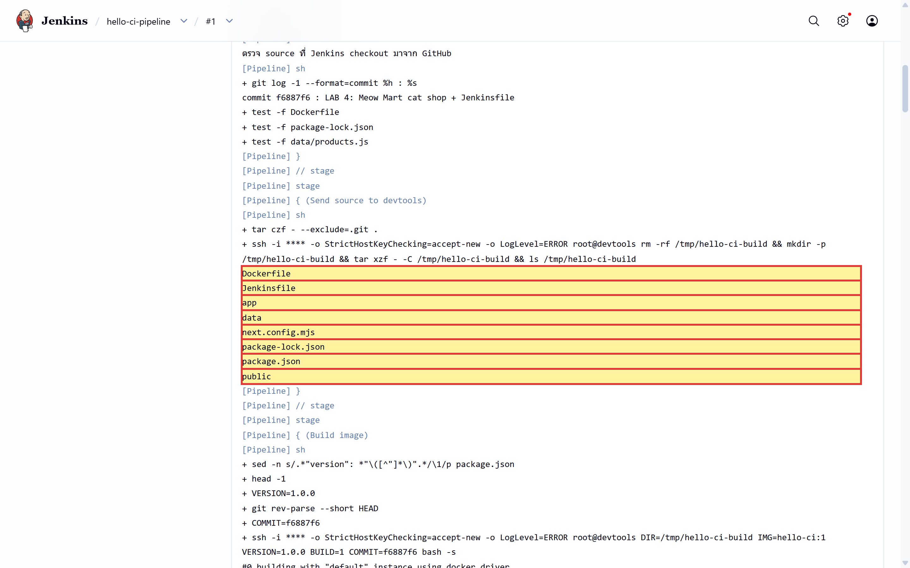
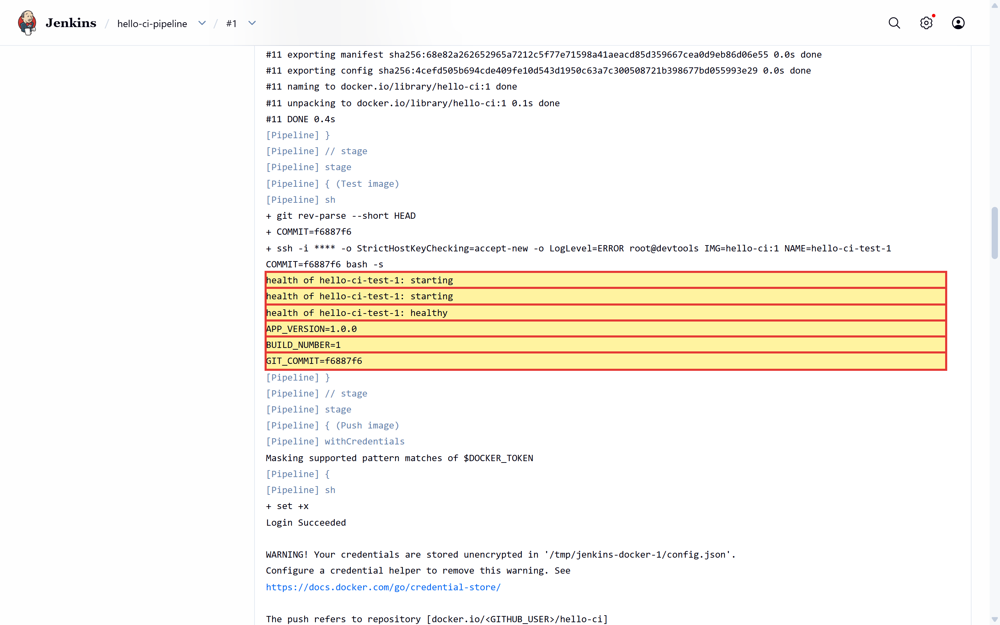
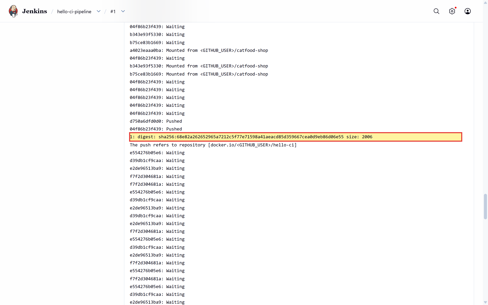
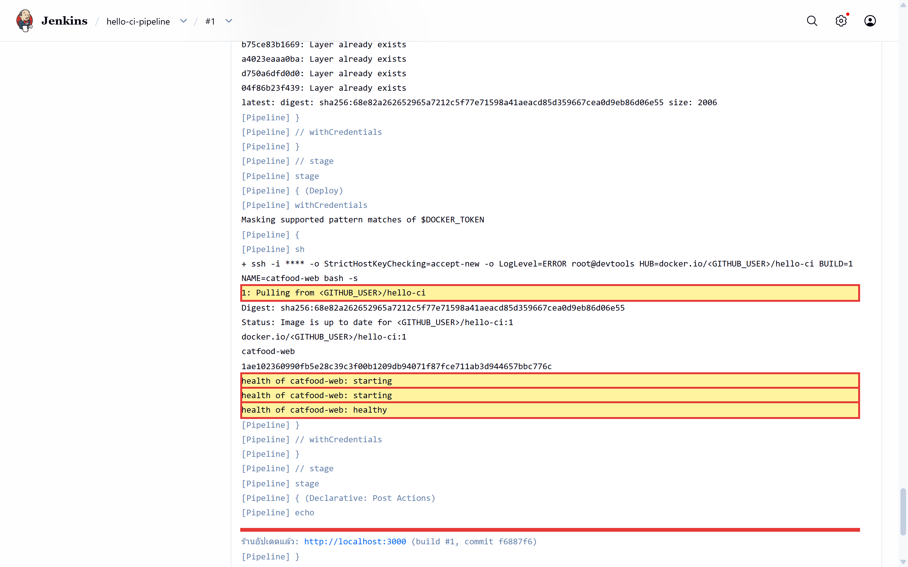
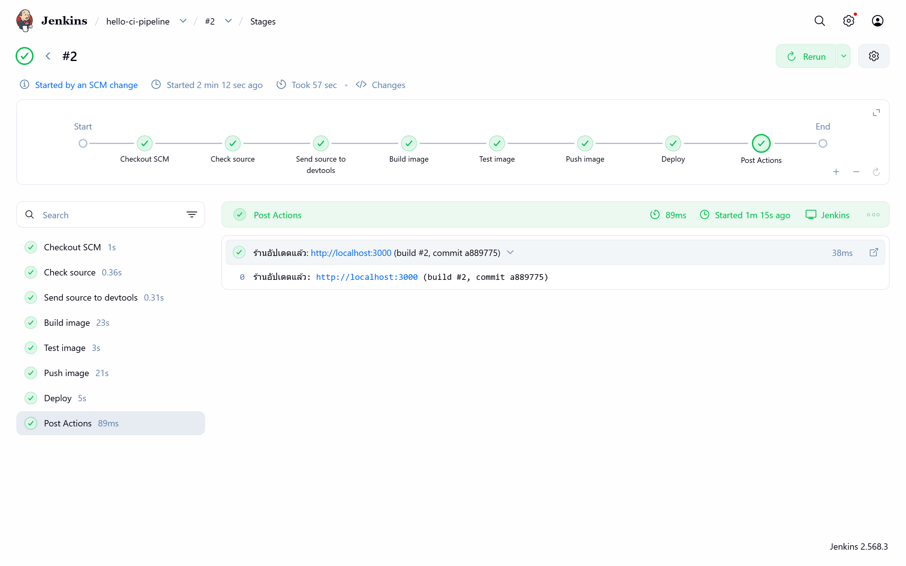
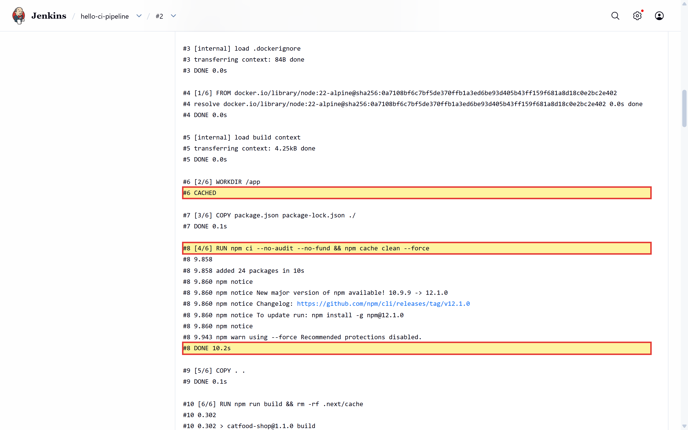

# LAB 4 — Pipeline จาก GitHub: push ครั้งเดียว ร้านอัปเดตเอง

> ⏱️ ประมาณ 50 นาที · 🧪 9 การทดลอง · 🎯 จบเมื่อ `git push` การแก้ราคาสินค้าแล้ว Jenkins build/push/deploy ให้เองจาก **Poll SCM** จนหน้าร้านที่ `http://localhost:3000` แสดงราคาใหม่และ commit เดียวกับ GitHub และผ่านรายการ **✅ ตรวจปิดแล็บด้วยตา** ครบทุกข้อ

LAB 3 ให้ Jenkins สั่ง `devtools` ผ่าน SSH ให้สร้างร้าน **Meow Mart** จากโฟลเดอร์ที่อยู่บน devtools อยู่แล้ว และต้องกด Build เอง LAB 4 ตอบคำถามต่อไปว่า **“ถ้าซอร์สโค้ดและขั้นตอน build อยู่ใน Git ด้วยกัน Jenkins จะรู้ได้อย่างไรว่ามีงานใหม่ และจะพิสูจน์ได้อย่างไรว่าเว็บที่รันอยู่มาจาก commit ไหน”** นักศึกษาจะสร้าง GitHub repository ใหม่ของตนเอง คัดลอกโค้ดร้านจาก LAB 3 ไปใส่พร้อม `Jenkinsfile` ตั้งค่า Jenkins แบบ **Pipeline script from SCM** แล้วดู Poll SCM เปลี่ยน `git push` หนึ่งครั้งให้กลายเป็นเว็บเวอร์ชันใหม่โดยไม่ต้องกดปุ่มใดเลย ทุกผลลัพธ์ตรวจด้วยตาจากหน้าเว็บ GitHub, Jenkins, Docker Hub และหน้าร้าน


*ภาพที่ 1 สไลด์ 6 เฟรม (ประมาณ 13 วินาที) จากภาพหน้าจอจริงของแล็บ: diff บน GitHub → Git Polling Log `Changes found` → build #2 **Started by an SCM change** → หน้า Stages → tag ใหม่บน Docker Hub → หน้าร้านก่อน/หลัง*

---

## 📚 ทฤษฎีก่อนลงมือ

### 1. Pipeline as Code ที่อยู่กับซอร์สโค้ด

ใน LAB 2–3 เราวาง Pipeline ไว้ในช่อง **Pipeline script** บนหน้าเว็บ Jenkins สคริปต์จึงอยู่แยกจากโค้ด ถ้าใครแก้ขั้นตอน build ก็ไม่มีประวัติใน Git LAB นี้เปลี่ยนเป็น **Pipeline script from SCM** (SCM = Source Control Management) ซึ่ง Jenkins จะ

1. clone/fetch repository ตาม URL และ branch ที่ตั้งไว้
2. อ่าน `Jenkinsfile` จาก root ของ commit นั้น
3. checkout commit เดียวกันลง workspace ของ Jenkins (`Declarative: Checkout SCM`)
4. ส่งไฟล์ของ commit นั้นไปให้ `devtools` ทาง SSH (stage `Send source to devtools`) เพราะ Jenkins ไม่มี Docker ส่วน devtools มี Docker แต่ไม่มีสำเนาของ Student Repository
5. สั่ง devtools ผ่าน SSH ให้ build → test → push → deploy ตามที่ `Jenkinsfile` ใน commit นั้นกำหนด

ผลคือ **ขั้นตอน build กับโค้ดมีเวอร์ชันเดียวกันเสมอ** ถ้าย้อนไป commit เก่า ก็ได้ Pipeline ของ commit นั้นด้วย การแก้ Pipeline ต้องผ่าน commit และ review เหมือนโค้ดทั่วไป

> 📝 **แบ่งหน้าที่เหมือน LAB 3:** Jenkins (`jenkins/jenkins:lts-jdk21`) อ่าน Git และควบคุมลำดับงานเท่านั้น งานที่ต้องใช้ Docker ทั้งหมดเกิดบน devtools ที่ Jenkins login ด้วย credential `devtools-ssh` ความต่างเดียวคือซอร์สตอนนี้อยู่ที่ Jenkins (checkout มาจาก GitHub) จึงต้องมีขั้นส่งซอร์สไปก่อน


*ภาพที่ 2 Developer push commit `a889775` ไป GitHub → Jenkins ตรวจพบ → รัน 7 stage: `Checkout SCM` ใน Jenkins, `Check source`, `Send source to devtools` แล้ว Build → Test → Push → Deploy บน devtools ผ่าน SSH → ร้านแสดง commit ปัจจุบัน*

### 2. Course Repository กับ Student Repository

| | Course Repository | Student Repository |
|---|---|---|
| ที่อยู่ | `~/labwork/DevTools/04_Jenkins/001_Jenikin` (ชุดสอน) | `~/hello-ci` + `github.com/<GITHUB_USER>/hello-ci` |
| บทบาท | ต้นฉบับสำหรับอ่านและคัดลอก | โปรเจกต์จริงที่นักศึกษาแก้และ push |
| Jenkins อ่านจาก | ไม่อ่าน | อ่าน `Jenkinsfile` และซอร์สทุก build |

การแยกสองส่วนนี้ทำให้แก้งานได้โดยไม่ทำให้ชุดสอนเสีย และทำให้แต่ละคนมี commit history ของตัวเอง

> 📝 ชื่อ repository และ job ยังคงเป็น `hello-ci` / `hello-ci-pipeline` เพราะ LAB 5–6 ใช้ชื่อนี้ต่อ แต่เนื้อหาข้างในคือร้าน Meow Mart

### 3. Trigger: Jenkins รู้ได้อย่างไรว่ามี commit ใหม่

| วิธี | ใครเริ่ม | ความหน่วง | ต้องเปิด network ขาเข้าไหม | ใช้ใน |
|---|---|---|---|---|
| กด Build Now | คน | ขึ้นกับคน | ไม่ | LAB 1–3 |
| **Poll SCM** | Jenkins ถาม GitHub ตามตาราง cron | ≤ 1 รอบของตาราง | **ไม่** | **LAB 4** |
| Webhook | GitHub เรียก Jenkins ทันทีที่มี push | ไม่กี่วินาที | ต้องมีทางให้ GitHub เข้าถึง Jenkins | LAB 5 |

Poll SCM ใช้ตาราง cron 5 ช่อง (`นาที ชั่วโมง วัน เดือน วันในสัปดาห์`) ทุกครั้งที่ถึงเวลา Jenkins จะรัน `git ls-remote` เพื่อดู SHA ล่าสุดของ branch แล้วเทียบกับ revision ที่เคย build ถ้าเหมือนเดิมจะบันทึก `No changes` ถ้าต่างจะบันทึก `Changes found` และสร้าง build ใหม่ที่มี cause ว่า **Started by an SCM change** แล็บนี้ใช้ `* * * * *` (ทุกนาที) เพื่อให้เห็นผลเร็ว


*ภาพที่ 3 เส้นเวลาจริงของการทดลองที่ 6–8: poll 12:28:00 `No changes` → push 12:28:34 → poll 12:29:00 `Changes found` → build #2 ทำงาน 12:29:10–12:30:08 (57 วินาที) → ร้านเป็นเวอร์ชันใหม่*

> ⚠️ ระบบจริงไม่ควร poll ทุกนาทีเพราะเพิ่มภาระให้ทั้ง Jenkins และ GitHub Jenkins จะเตือนและแนะนำ `H * * * *` (H = กระจายเวลาด้วย hash ของชื่อ job) ส่วนระบบที่ต้องการความเร็วควรใช้ webhook ใน LAB 5

### 4. Traceability: ตามรอยการเปลี่ยนแปลงหนึ่งครั้งตั้งแต่ต้นจนจบ

`Jenkinsfile` ของแล็บส่งค่า `git rev-parse --short HEAD` เข้า `docker build --build-arg GIT_COMMIT=...` commit จึงถูกฝังเป็น environment variable ของ image และร้านแสดงค่านี้ในส่วน **Deployment info** stage Test ยังตรวจด้วย `docker image inspect` ว่า image มี `GIT_COMMIT` ตรงกับ commit ที่ checkout มา เมื่อรวมกับ `BUILD_NUMBER` และ digest จะได้โซ่หลักฐานที่ต่อกันครบ:

```text
GitHub commit a889775 → Jenkins build #2 → image <DOCKER_USER>/hello-ci:2 → digest sha256:173c9b33c457… → เว็บแสดง build #2 · commit a889775
```


*ภาพที่ 4 ถ้าหน้าเว็บผิดปกติ เราย้อนหาได้ทันทีว่ามาจาก commit ใด build ใด และ image ใด*

---

## 🎯 Learning Objectives — ผลลัพธ์การเรียนรู้

เมื่อจบแล็บนี้ นักศึกษาจะสามารถ

1. สร้าง Public GitHub repository และ push โปรเจกต์ขึ้นไปโดยไม่บันทึก token ลงไฟล์หรือ URL ได้
2. อธิบายความต่างของ Pipeline script กับ Pipeline script from SCM และข้อดีของ Pipeline as Code ได้
3. ตั้งค่า job ให้อ่าน `Jenkinsfile` จาก branch `main` ของ Student Repository ได้
4. อธิบายกลไก Poll SCM และอ่าน Polling Log (`No changes` / `Changes found`) ได้
5. ผูก commit SHA, Jenkins build number, Docker image tag/digest และเว็บที่ deploy เข้าด้วยกันได้
6. อธิบายได้ว่าทำไม Jenkins ต้องส่ง source ไปให้ devtools และตรวจ commit ใน image ได้โดยไม่ใช้ API

## 🗺️ แผนที่การทดลอง

| ช่วง | การทดลอง | สิ่งที่ทำ | ผลที่ต้องได้ (ค่าจริงจากการทดลอง) |
|---|---|---|---|
| A. เตรียมโปรเจกต์ | 1–2 | คัดลอกร้านจาก LAB 3 + `Jenkinsfile` → commit แรก | 22 ไฟล์, commit `f6887f6` |
| B. GitHub | 3 | สร้าง repository ใหม่ทีละขั้นบนเว็บ → push | Public repo `hello-ci` แสดงไฟล์ครบ |
| C. Jenkins from SCM | 4–5 | สร้าง job + manual build #1 | checkout `f6887f6`, ส่ง source ถึง devtools, image มี `GIT_COMMIT=f6887f6`, เว็บแสดง commit `f6887f6` |
| D. Trigger อัตโนมัติ | 6–8 | เปิด Poll SCM → แก้ราคา → push | `No changes` → push → `Changes found`, build #2 เริ่มเองใน 36 วินาที, ราคา ฿459 → ฿399, เว็บใหม่ใน 1 นาที 34 วินาทีหลัง push |
| E. ตรวจย้อนกลับ | 9 | เทียบ commit / build / image / เว็บ | ทุกจุดชี้ `a889775` ตรงกัน + ตรวจปิดแล็บด้วยตาครบ |

## สัญญาของแล็บ

| ส่วน | ค่าที่ใช้ |
|---|---|
| ซอร์สร้าน (ต้นฉบับ) | `~/labwork/DevTools/04_Jenkins/001_Jenikin/003_LAB_Docker_Build_Push/catfood-shop` |
| Pipeline (ต้นฉบับ) | `~/labwork/DevTools/04_Jenkins/001_Jenikin/004_LAB_Pipeline_From_Git/Jenkinsfile` |
| Student project | `~/hello-ci` |
| GitHub repository | `https://github.com/<GITHUB_USER>/hello-ci` — **Public**, สร้างใหม่ ไม่มี README |
| Jenkins job | `hello-ci-pipeline` — Pipeline script from SCM, `*/main`, `Jenkinsfile` |
| Build host | `devtools` ผ่าน SSH (credential `devtools-ssh`), โฟลเดอร์รับซอร์ส `/tmp/hello-ci-build` |
| Docker Hub | `<DOCKER_USER>/hello-ci` — tag `<BUILD_NUMBER>` และ `latest` |
| Deploy | container `catfood-web` บน devtools ที่ `http://localhost:3000` (แทนที่ตัวจาก LAB 3) |
| Trigger | Poll SCM `* * * * *` |

## สภาพตั้งต้น

ต้องจบ LAB 3 แล้ว คือ

- Jenkins รันจาก image ต้นฉบับ `jenkins/jenkins:lts-jdk21` (ไม่มี Docker ข้างใน) และสร้างด้วย `--add-host devtools:host-gateway` จึงเรียกเครื่อง `devtools` ด้วยชื่อได้
- หน้า **Manage Jenkins → Credentials** มี credential `devtools-ssh` (SSH private key) และ `dockerhub` (Docker Hub token)
- หน้า job `docker-build-push` แสดง build ล่าสุดเป็นสีเขียว (SUCCESS)

> **Prerequisite GitHub:** บัญชี GitHub ที่ยืนยันอีเมลแล้ว และ **Personal access token (classic)** ที่มี scope `public_repo` (LAB 5 ต้องเพิ่ม `admin:repo_hook`) เก็บ token ไว้ใน password manager ห้ามเขียนลงไฟล์ใด ๆ

ทุกคำสั่งในแล็บนี้อ้าง path เต็มตามตาราง **สัญญาของแล็บ** ด้านบนตรง ๆ ไม่ต้องตั้งตัวแปรใด ๆ

---

## ช่วง A — เตรียม Student Project

### การทดลองที่ 1 — ประกอบโปรเจกต์จากโค้ดร้าน + Jenkinsfile

**คำถาม:** Student Project ต้องมีอะไรบ้างจึงจะให้ Jenkins build ได้โดยไม่พึ่งไฟล์นอก repository?

```bash
rm -rf ~/hello-ci && mkdir -p ~/hello-ci
cp -r ~/labwork/DevTools/04_Jenkins/001_Jenikin/003_LAB_Docker_Build_Push/catfood-shop/. ~/hello-ci/          # โค้ดร้าน + Dockerfile + .dockerignore + .gitignore
cp ~/labwork/DevTools/04_Jenkins/001_Jenikin/004_LAB_Pipeline_From_Git/Jenkinsfile ~/hello-ci/   # Pipeline ที่จะอยู่ใน repository
cd ~/hello-ci && ls -A && find . -type f | wc -l
```

✅ **ผลการทดลองจริง:**

```text
.dockerignore
.gitignore
Dockerfile
Jenkinsfile
app
data
next.config.mjs
package-lock.json
package.json
public
22
```

> 🔍 **วิเคราะห์ผล:** repository ต้องมี 3 กลุ่มไฟล์: **ซอร์สโค้ด** (`app/`, `data/`, `public/`), **วิธีแพ็ก** (`Dockerfile`, `.dockerignore`, `package-lock.json`) และ **วิธี build/deploy** (`Jenkinsfile`) ครบทั้งสามกลุ่มแล้ว ใครก็ clone ไป build ได้เหมือนกัน `.gitignore` กันไม่ให้ `node_modules/` และ `.next/` หลุดเข้า Git

### การทดลองที่ 2 — First commit

**คำถาม:** commit แรกบันทึกไฟล์ครบและเป็น Git repository ที่แยกจากชุดสอนหรือไม่?

```bash
cd ~/hello-ci
git init -q -b main
git config user.name 'Student'
git config user.email 'student@example.invalid'
git add -A
git commit -q -m 'LAB 4: Meow Mart cat shop + Jenkinsfile'
git log --oneline --stat -1 | tail -3
```

✅ **ผลการทดลองจริง:**

```text
 public/images/p_treats.jpg    |  Bin 0 -> 46971 bytes
 public/images/p_tuna.jpg      |  Bin 0 -> 38518 bytes
 22 files changed, 1653 insertions(+)
```

---

## ช่วง B — สร้าง GitHub Repository ใหม่และ push

### การทดลองที่ 3 — สร้าง `hello-ci` บน GitHub ทีละขั้น แล้ว push

**คำถาม:** จะสร้าง repository ว่างให้ push โปรเจกต์ที่มี commit อยู่แล้วได้อย่างไร โดยไม่บันทึก token?

1. login GitHub แล้วเปิด `https://github.com/new`


*ภาพที่ 5 หน้าสร้าง repository ใหม่ (ชื่อบัญชีถูกแทนด้วย `<GITHUB_USER>`)*

2. กรอก **Repository name** = `hello-ci` และ Description (ไม่บังคับ) รอให้ขึ้น `hello-ci is available.`
3. **Choose visibility** = **Public** (Jenkins จะ clone โดยไม่ใช้ credential)
4. **Add README = Off**, **.gitignore = No .gitignore**, **License = No license** เพราะเรามี commit อยู่แล้ว ถ้าให้ GitHub สร้างไฟล์ให้ ประวัติสองฝั่งจะไม่ตรงกันและ push ครั้งแรกถูกปฏิเสธ


*ภาพที่ 6 ชื่อ `hello-ci` ว่างให้ใช้ visibility เป็น Public และไม่เพิ่มไฟล์ใด ๆ*

5. กด **Create repository**


*ภาพที่ 7 ตรวจค่าทุกช่องอีกครั้งก่อนกดสร้าง*

6. GitHub แสดงหน้า Quick setup ของ repository ว่าง ให้ใช้ชุดคำสั่ง **…or push an existing repository from the command line**


*ภาพที่ 8 repository ใหม่ยังว่าง ส่วนในกรอบแดงคือคำสั่งสำหรับโปรเจกต์ที่มี commit อยู่แล้ว*

7. เพิ่ม remote และ push ใน devtools:

```bash
cd ~/hello-ci
git remote add origin "https://github.com/<GITHUB_USER>/hello-ci.git"
git push -u origin main
```

เมื่อ Git ถาม Username ให้กรอก `<GITHUB_USER>` และ Password ให้วาง `<GITHUB_TOKEN>` (ไม่ใช่รหัสผ่านบัญชี) ห้ามใส่ token ลงใน URL และห้ามใช้ `credential.helper store`

✅ **ผลการทดลองจริง:**

```text
To https://github.com/<GITHUB_USER>/hello-ci.git
 * [new branch]      main -> main
branch 'main' set up to track 'origin/main'.
```

> 📝 ถ้าเห็น `remote: This repository moved. Please use the new location` แปลว่าพิมพ์ตัวพิมพ์เล็ก/ใหญ่ของชื่อบัญชีไม่ตรงกับบน GitHub push ยังสำเร็จ แต่ควรแก้ด้วย `git remote set-url origin https://github.com/<ชื่อตามที่ GitHub แสดง>/hello-ci.git`

8. refresh หน้า repository


*ภาพที่ 9 GitHub แสดงไฟล์ครบ (ภาพจับหลังจบแล็บ จึงเห็น 2 commit และ commit ล่าสุด `a889775`; ตอนทำขั้นนี้จะเห็นเพียง commit `f6887f6`)*


*ภาพที่ 10 `Jenkinsfile` อยู่ที่ root ของ repository — บรรทัดแรก ๆ คือ `environment` ที่กำหนด `SSH_KEY`, `DEVTOOLS`, `BUILD_DIR` … Jenkins จะอ่านไฟล์นี้*

---

## ช่วง C — Jenkins อ่าน Pipeline จาก GitHub

### อ่าน `Jenkinsfile` ของ LAB 4

```groovy
pipeline {
  agent any
  environment {
    SSH_KEY     = credentials('devtools-ssh')   // private key เดียวกับ LAB 3
    DEVTOOLS    = 'root@devtools'
    SSH_OPTS    = '-o StrictHostKeyChecking=accept-new -o LogLevel=ERROR'
    BUILD_DIR   = '/tmp/hello-ci-build'          // โฟลเดอร์บน devtools ที่รับซอร์สของ build นี้
    IMAGE       = 'hello-ci'                     // ชื่อ image และ repository บน Docker Hub
    DEPLOY_NAME = 'catfood-web'                  // container ของร้าน (port 3000)
  }
  stages {
    stage('Check source')            { ... ใน Jenkins: git log -1; test -f Dockerfile / package-lock.json / data/products.js ... }
    stage('Send source to devtools') { tar czf - --exclude=.git . | ssh ... "rm -rf $BUILD_DIR && mkdir -p $BUILD_DIR
                                                                         && tar xzf - -C $BUILD_DIR && ls $BUILD_DIR" }
    stage('Build image')  { ... VERSION=<จาก package.json>; COMMIT=$(git rev-parse --short HEAD)
                            ssh ... bash -s <<'EOF'
                              docker build --provenance=false --build-arg APP_VERSION --build-arg BUILD_NUMBER
                                           --build-arg GIT_COMMIT --build-arg BUILD_TIME -t hello-ci:$BUILD_NUMBER .
                            EOF }
    stage('Test image')   { ssh ... container ชั่วคราว hello-ci-test-N → วนดู health → พิมพ์ APP_VERSION/BUILD_NUMBER/GIT_COMMIT
                            จาก docker inspect → ผ่านเมื่อ healthy และ docker image inspect มี GIT_COMMIT=<HEAD> }
    stage('Push image')   { withCredentials(dockerhub) { ส่ง token ทาง stdin ของ SSH → docker login ใน DOCKER_CONFIG ชั่วคราว
                            → push :$BUILD_NUMBER และ :latest → trap logout + ลบ config } }
    stage('Deploy')       { ssh ... docker pull → recreate catfood-web -p 3000:3000 → รอจน healthy }
  }
  post { success { echo "ร้านอัปเดตแล้ว: ... commit ${env.GIT_COMMIT.substring(0, 7)}" } }
}
```

| ส่วน | ต่างจาก LAB 3 อย่างไร |
|---|---|
| ได้ซอร์สมาอย่างไร | Jenkins checkout repository จาก GitHub ให้อัตโนมัติ (`Declarative: Checkout SCM`) |
| stage ใหม่ `Send source to devtools` | devtools ไม่มีสำเนาของ Student Repository จึงต้องแพ็กไฟล์ของ commit นี้ด้วย `tar` แล้วส่งผ่าน SSH ไปแตกที่ `/tmp/hello-ci-build` (ไม่ส่ง `.git`) |
| `APP_VERSION` | อ่านจาก `"version"` ใน `package.json` แทน parameter — เวอร์ชันจึงอยู่ใน Git ด้วย |
| `GIT_COMMIT` | ฝัง SHA แบบย่อลงใน image และ stage Test ตรวจด้วย `docker image inspect … \| grep -qx GIT_COMMIT=<sha>` ว่าตรงกับ HEAD ที่ checkout มา (ไม่ต้องเรียก API ของเว็บ) |
| Image | `<DOCKER_USER>/hello-ci` (แยกจาก `catfood-shop` ของ LAB 3) |
| Deploy | ไม่ลบ tag ในเครื่องก่อน pull เพราะ daemon ของ devtools เป็นตัว build image นี้เอง `docker pull` จึงตอบ `Status: Image is up to date` |

### การทดลองที่ 4 — สร้าง job แบบ Pipeline script from SCM

**คำถาม:** Jenkins อ่าน `Jenkinsfile` จาก Public repository ได้โดยไม่ต้องมี GitHub credential หรือไม่?

1. **New Item** → `hello-ci-pipeline` → **Pipeline** → **OK**


*ภาพที่ 11 สร้าง job ชนิด Pipeline*

2. ส่วน **Pipeline**: Definition = **Pipeline script from SCM**, SCM = **Git**, Repository URL = `https://github.com/<GITHUB_USER>/hello-ci.git`, Credentials = **- none -**


*ภาพที่ 12 Public repository จึงไม่ต้องเลือก credential*

3. **Branch Specifier** = `*/main` (ค่าเริ่มต้นคือ `*/master` ต้องแก้) และ **Script Path** = `Jenkinsfile` → **Save**


*ภาพที่ 13 Branch `*/main` และ Script Path `Jenkinsfile` — ถ้าลืมแก้ branch จะได้ error `Couldn't find any revision to build`*

✅ **ตรวจด้วยตา:** เปิด `hello-ci-pipeline` → **Configure** อีกครั้ง เลื่อนลงไปส่วน **Pipeline** ต้องเห็นค่าที่บันทึกไว้ตรงกับภาพที่ 13

| ช่อง | ค่าที่ต้องเห็น |
|---|---|
| Definition | Pipeline script from SCM |
| Repository URL | `https://github.com/<GITHUB_USER>/hello-ci.git` |
| Branch Specifier | `*/main` |
| Script Path | `Jenkinsfile` |

### การทดลองที่ 5 — Manual build #1: เว็บรู้หรือไม่ว่ามาจาก commit ไหน?

**คำถาม:** เมื่อกด Build Now Jenkins checkout commit ใด ซอร์สไปถึง devtools หรือไม่ และเว็บที่ deploy แสดง commit เดียวกันหรือไม่?

1. เปิด `hello-ci-pipeline` → **Build Now**


*ภาพที่ 14 build แรกของ job สั่งด้วยมือ*

2. เปิด build #1 → **Stages**


*ภาพที่ 15 หน้า Stages ของ build #1: มี `Checkout SCM` มาก่อน 6 stage ที่เขียนไว้ ทุก stage เขียว “Took 37 sec”*

✅ **ผลการทดลองจริง (เวลาแต่ละ stage จากหน้า Stages):**

| Stage | ทำที่ | เวลา |
|---|---|---:|
| Checkout SCM | Jenkins | 1.4 s |
| Check source | Jenkins | 0.36 s |
| Send source to devtools | Jenkins → devtools | 0.34 s |
| Build image | devtools | 6.3 s |
| Test image | devtools | 3.1 s |
| Push image | devtools | 15.3 s |
| Deploy | devtools | 4.8 s |
| Post Actions | Jenkins | 0.1 s |
| **รวม** | | **37.1 s** |

3. เปิด **Console Output** ในเบราว์เซอร์แล้วอ่านไล่จากบนลงล่าง


*ภาพที่ 16 ต้น Console: Jenkins อ่าน Pipeline จาก GitHub แล้ว checkout commit `f6887f6…` และ stage `Check source` พิมพ์ข้อความ commit*

```text
Obtained Jenkinsfile from git https://github.com/<GITHUB_USER>/hello-ci.git
Checking out Revision f6887f6fb1c3f1377ca2a0af112ef49f5be980f3 (refs/remotes/origin/main)
commit f6887f6 : LAB 4: Meow Mart cat shop + Jenkinsfile
```



*ภาพที่ 17 stage `Send source to devtools`: หลัง `tar czf - --exclude=.git .` devtools แสดงรายการไฟล์ใน `/tmp/hello-ci-build` — ไม่มี `.git`*

```text
Dockerfile
Jenkinsfile
app
data
next.config.mjs
package-lock.json
package.json
public
```



*ภาพที่ 18 stage `Test image`: container ชั่วคราวเปลี่ยนจาก `starting` เป็น `healthy` แล้วพิมพ์ค่าที่ฝังใน image*

```text
health of hello-ci-test-1: starting
health of hello-ci-test-1: starting
health of hello-ci-test-1: healthy
APP_VERSION=1.0.0
BUILD_NUMBER=1
GIT_COMMIT=f6887f6
```



*ภาพที่ 19 stage `Push image`: บาง layer ขึ้น `Mounted from <DOCKER_USER>/catfood-shop` และจบด้วย digest ของ tag `1`*

```text
1: digest: sha256:68e82a262652965a7212c5f77e71598a41aeacd85d359667cea0d9eb86d06e55 size: 2006
```



*ภาพที่ 20 stage `Deploy`: pull tag `1`, `catfood-web` เปลี่ยนเป็น `healthy` และ post พิมพ์ build/commit ที่ deploy*

```text
1: Pulling from <DOCKER_USER>/hello-ci
Status: Image is up to date …
health of catfood-web: starting
health of catfood-web: starting
health of catfood-web: healthy
ร้านอัปเดตแล้ว: http://localhost:3000 (build #1, commit f6887f6)
```

4. เปิด **http://localhost:3000** ชิปมุมบนต้องแสดง `v1.0.0 · build #1` และส่วน **Deployment info** แสดง commit `f6887f6` (ดูฝั่งซ้ายของภาพที่ 28 และ 29)

> 🔍 **วิเคราะห์ผล:** บรรทัด `Obtained Jenkinsfile from git` ยืนยันว่า Pipeline ถูกอ่านจาก GitHub ไม่ใช่จากหน้าเว็บ รายการไฟล์ใน `/tmp/hello-ci-build` ยืนยันว่าซอร์สของ commit นี้ไปถึง devtools แล้ว (ไม่มี `.git` เพราะ devtools ใช้แค่ไฟล์สำหรับ build ส่วน SHA คำนวณใน Jenkins แล้วส่งไปเป็น `COMMIT`) `GIT_COMMIT=f6887f6` ใน image ตรงกับ `Checking out Revision f6887f6…` และตรงกับที่หน้าร้านแสดง
>
> Build image ใช้แค่ 6.3 วินาทีเพราะ daemon ของ devtools มี cache จาก LAB 3: `COPY package.json` และ `npm ci` ขึ้น `#6`–`#8 CACHED` ส่วน `COPY . .` และ `npm run build` ต้องรันใหม่เพราะซอร์สตอนนี้มี `Jenkinsfile` เพิ่มมา ส่วน `Mounted from <DOCKER_USER>/catfood-shop` แปลว่า Docker Hub พบ layer เดียวกันอยู่แล้วใน repository ของ LAB 3 ในบัญชีเดียวกัน จึงผูก blob เดิมเข้ามาแทนการอัปโหลดซ้ำ และ `Status: Image is up to date` เกิดเพราะ devtools เพิ่ง build image นี้เองจึงไม่ต้องดาวน์โหลด

---

## ช่วง D — ให้ Jenkins build เองเมื่อมี commit ใหม่

### การทดลองที่ 6 — เปิด Poll SCM

**คำถาม:** เมื่อยังไม่มี commit ใหม่ Poll SCM จะสร้าง build หรือไม่?

1. **hello-ci-pipeline → Configure → Triggers** → เลือก **Poll SCM** → Schedule = `* * * * *` → **Save**


*ภาพที่ 21 Jenkins เตือนว่า `* * * * *` คือทุกนาทีและแนะนำ `H * * * *` — ในแล็บยืนยันใช้ทุกนาทีเพื่อเห็นผลเร็ว*

2. รอ 1 นาที แล้วเปิดเมนู **Git Polling Log** ทางซ้ายของหน้า job

✅ **ผลการทดลองจริง (ข้อความในหน้า Git Polling Log):**

```text
Started on Sep 25, 2026, 12:28:00 PM
[poll] Last Built Revision: Revision f6887f6fb1c3f1377ca2a0af112ef49f5be980f3 (refs/remotes/origin/main)
[poll] Latest remote head revision on refs/heads/main is: f6887f6fb1c3f1377ca2a0af112ef49f5be980f3 - already built by 1
No changes
```

> 🔍 **วิเคราะห์ผล:** Jenkins ถาม GitHub แล้วพบว่า HEAD ของ `main` คือ `f6887f6` ซึ่ง build #1 สร้างไปแล้ว จึงไม่สร้าง build ใหม่ Poll SCM ไม่ได้ build ทุกนาที แต่ **ตรวจ** ทุกนาที

### การทดลองที่ 7 — แก้ราคาสินค้าแล้ว push

**คำถาม:** ถ้าร้านจัดโปรลดราคาแซลมอนจาก ฿459 เป็น ฿399 และออกเวอร์ชัน 1.1.0 ต้องทำอะไรบ้าง?

```bash
cd ~/hello-ci
sed -i "s/    price: 459,/    price: 399,/; s/    badge: 'ขายดี',/    badge: 'ลดราคา',/" data/products.js
sed -i 's/"version": "1.0.0"/"version": "1.1.0"/' package.json
git --no-pager diff -U0 | grep -E '^[-+] '
git add data/products.js package.json
git commit -q -m 'Salmon promo: 459 -> 399 THB (v1.1.0)'
git log --oneline -1
date -u +PUSH_AT=%H:%M:%S
git push origin main
```

✅ **ผลการทดลองจริง:**

```text
-    price: 459,
+    price: 399,
-    badge: 'ขายดี',
+    badge: 'ลดราคา',
-  "version": "1.0.0",
+  "version": "1.1.0",
a889775 Salmon promo: 459 -> 399 THB (v1.1.0)
PUSH_AT=12:28:34
To https://github.com/<GITHUB_USER>/hello-ci.git
   f6887f6..a889775  main -> main
```


*ภาพที่ 22 GitHub แสดงการแก้ 2 ไฟล์ใน commit `a889775` — ไม่ได้แตะ Jenkins เลย*

### การทดลองที่ 8 — Jenkins build เองหรือไม่ และใช้เวลาเท่าไร?

**คำถาม:** หลัง push ต้องรอนานเท่าไรเว็บจึงเปลี่ยน และมีหลักฐานอะไรว่า build นี้เกิดจาก commit ใหม่?

ไม่ต้องกดปุ่มใด ๆ รอ 1–2 นาทีแล้วเปิดหน้า job จะเห็น build #2 ปรากฏขึ้นเอง ตรวจหลักฐานตามลำดับนี้

1. เปิด build #2 → **Polling Log**


*ภาพที่ 23 Polling Log ที่ทำให้เกิด build #2 (เริ่ม 12:29:00 PM): revision ล่าสุดคือ `a889775…` ต่างจาก `f6887f6` ที่ build ไว้ → `Changes found`*

```text
[poll] Latest remote head revision on refs/heads/main is: a88977501b9f976ee108df50f2084691a272e51c
Done. Took 0.78 sec
Changes found
```

2. กลับไปหน้า build #2


*ภาพที่ 24 หน้า build #2 บอกสาเหตุ **Started by an SCM change** พร้อม Revision `a889775…` ข้อความ commit และ “Took 57 sec”*

3. เปิด **Stages** ของ build #2



*ภาพที่ 25 หน้า Stages ของ build #2: 7 stage เขียวทั้งหมด เหมือน build #1 แต่ Build image นานขึ้น*

4. กลับไปหน้า job ดู **Stage View**


*ภาพที่ 26 Stage View: build #2 มีป้าย “1 commit” ส่วน build #1 เป็น “No Changes” และ Build image ของ #2 ใช้ 23 วินาที เทียบกับ 6 วินาทีของ #1*

5. เปิด **Console Output** ของ build #2 ไปที่ stage Build image



*ภาพที่ 27 build #2: มีแค่ `#6 CACHED` ส่วน `#8 [4/6] RUN npm ci …` ต้องรันใหม่ (`#8 DONE 10.2s`) และตอน push มี 4 layer ขึ้น `Pushed`*

✅ **ผลการทดลองจริง:**

| เหตุการณ์ (UTC) | เวลา | ห่างจาก push |
|---|---|---:|
| `git push` | 12:28:34 | 0 s |
| Poll SCM 12:29:00 พบ `Changes found` → build #2 เริ่ม | 12:29:10 | 36 s |
| build #2 จบ เว็บเป็นเวอร์ชันใหม่ | 12:30:08 | **1 นาที 34 วินาที** |

build #2 ใช้เวลารวม 57.4 วินาที

| Stage | build #1 (manual) | build #2 (SCM) |
|---|---:|---:|
| Checkout SCM | 1.4 s | 1.2 s |
| Check source | 0.36 s | 0.40 s |
| Send source to devtools | 0.34 s | 0.34 s |
| Build image | 6.3 s | **23.6 s** |
| Test image | 3.1 s | 3.1 s |
| Push image | 15.3 s | 21.5 s |
| Deploy | 4.8 s | 5.1 s |

> 🔍 **วิเคราะห์ผล:** ความหน่วงช่วงแรก (36 วินาที) มาจากการรอรอบ poll ถัดไป ซึ่งเป็นธรรมชาติของ Poll SCM ส่วน Build image ของ build #2 ช้ากว่า #1 เพราะเราแก้ `package.json` (เลขเวอร์ชัน) — Dockerfile คัดลอก `package.json` ก่อน `RUN npm ci` การเปลี่ยนไฟล์นี้จึงทำให้ cache ของ `npm ci` ใช้ไม่ได้และต้องติดตั้ง package ใหม่ (`#8 DONE 10.2s`) layer ที่เปลี่ยนจึงต้องอัปโหลดใหม่ Push image ก็นานขึ้นด้วย ถ้าแก้เฉพาะ `data/products.js` จะใช้ cache ของ `npm ci` ได้และเร็วขึ้น

6. เปิด **http://localhost:3000** อีกครั้ง


*ภาพที่ 28 ซ้าย: build #1 (`f6887f6`) แซลมอน ฿459 ป้าย “ขายดี” ขวา: build #2 (`a889775`) ฿399 ป้าย “ลดราคา” — เปลี่ยนเองหลัง push โดยไม่ได้แตะ Jenkins*


*ภาพที่ 29 Deployment info เปลี่ยนจาก `1.0.0 / #1 / f6887f6` เป็น `1.1.0 / #2 / a889775`*


*ภาพที่ 30 หน้าร้านแบบเต็มจอ (1920×1080) หลัง build #2 การ์ดแรกแสดง ฿399 และป้าย “ลดราคา”*

---

## ช่วง E — ตรวจย้อนกลับครบวงจร

### การทดลองที่ 9 — commit, build, image และเว็บ ชี้ไปที่เดียวกันหรือไม่?

**คำถาม:** เราพิสูจน์ได้หรือไม่ว่าเว็บที่รันอยู่คือผลของ commit ล่าสุดบน GitHub โดยดูจากหน้าเว็บอย่างเดียว?

1. GitHub → repository `hello-ci` → **Commits**


*ภาพที่ 31 GitHub มี 2 commit: `a889775` (build #2) และ `f6887f6` (build #1)*

2. Console Output ของ build #2 ส่วน Push image แสดง digest ของ tag `2` (และ `latest` ได้ digest เดียวกัน)

```text
2: digest: sha256:173c9b33c45749b269242779cbc91424b8524c04f38fae4da15ff7b05274a07b size: 2006
```

3. Docker Hub → `<DOCKER_USER>/hello-ci` → แท็บ **Tags**


*ภาพที่ 32 Docker Hub `<DOCKER_USER>/hello-ci`: tag `latest` และ `2` ชี้ digest เดียวกัน `173c9b33c457` (กรอบเขียว) ส่วน tag `1` คือ `68e82a262652` (กรอบแดง) ขนาดประมาณ 146.5 MB ทั้งคู่ (146.53 / 146.54 MB)*

4. หน้าร้าน **http://localhost:3000** → Deployment info (ภาพที่ 29)

✅ **ผลการทดลองจริง:**

| หลักฐาน | build #1 | build #2 |
|---|---|---|
| GitHub commit | `f6887f6` | `a889775` |
| Jenkins cause | Started by user admin | **Started by an SCM change** |
| Docker Hub tag → digest | `hello-ci:1` → `68e82a262652…` | `hello-ci:2`, `latest` → `173c9b33c457…` |
| หน้าร้าน (Deployment info) | `1.0.0` · build 1 · `f6887f6` | `1.1.0` · build 2 · `a889775` |

> 🔍 **วิเคราะห์ผล:** ทุกแถวของ build #2 ชี้ `a889775` ตรงกัน และ digest 12 ตัวแรกใน Console ตรงกับ tag `latest` บน Docker Hub จึงพิสูจน์ได้ว่าร้านที่รันอยู่มาจาก commit ล่าสุดบน GitHub โดยไม่ต้องใช้ API ใด ๆ

### ✅ ตรวจปิดแล็บด้วยตา

ติ๊กให้ครบทุกข้อก่อนส่งงาน

- [ ] **GitHub:** repository `hello-ci` เป็น **Public** และ branch `main` มี commit ล่าสุด `a889775` (ของนักศึกษาจะเป็น SHA ของตัวเอง)
- [ ] **Jenkins Configure:** `hello-ci-pipeline` เป็น **Pipeline script from SCM**, Branch `*/main` และเปิด **Poll SCM** `* * * * *`
- [ ] **Jenkins build #2:** เขียว (SUCCESS) และหน้า build เขียน **Started by an SCM change**
- [ ] **Console #2 ↔ Docker Hub:** 12 ตัวแรกของ digest ใน Console ตรงกับ digest ของ tag `latest` บน Docker Hub
- [ ] **หน้าร้าน:** แซลมอนราคา ฿399, ชิป `v1.1.0 · build #2` และ Deployment info แสดง commit `a889775`
- [ ] **ไม่มี token ค้างใน Git:** คำสั่งด้านล่างต้องไม่พิมพ์อะไรออกมาเลย

```bash
git -C ~/hello-ci config --get-regexp credential
```

---

## 📊 สรุปผลการทดลอง

| # | คำถาม | ผลจริง | ข้อสรุป |
|---|---|---|---|
| 1–2 | repository ต้องมีอะไร | 22 ไฟล์ใน commit `f6887f6` | ซอร์ส + Dockerfile + Jenkinsfile อยู่ด้วยกัน |
| 3 | สร้าง repo และ push อย่างปลอดภัย | Public `hello-ci`, token กรอกที่ prompt เท่านั้น | ไม่มี token ใน URL หรือไฟล์ |
| 4–5 | Jenkins อ่าน Pipeline จาก Git และส่งซอร์สให้ devtools ได้ไหม | `Obtained Jenkinsfile from git`, ไฟล์ถึง `/tmp/hello-ci-build`, `GIT_COMMIT=f6887f6`, SUCCESS 37.1 s | Pipeline as Code ทำงาน โดย Jenkins ไม่ต้องมี Docker |
| 6 | poll ตอนไม่มี commit ใหม่ | `No changes` | poll = ตรวจ ไม่ใช่ build ทุกนาที |
| 7–8 | push แล้วเกิดอะไร | `Changes found`, build #2 เริ่มใน 36 s, เว็บใหม่ใน 1 นาที 34 วินาที | CI/CD ทำงานโดยไม่ต้องกดปุ่ม |
| 9 | ตามรอยได้ไหม | commit/build/image/เว็บ ชี้ `a889775` ตรงกัน, digest `173c9b33c457` | Traceability ครบวงจร ตรวจด้วยตาได้ทั้งหมด |

## แก้ปัญหาที่พบบ่อย

| อาการ | จุดตรวจ | วิธีแก้ |
|---|---|---|
| `Repository name already exists` | มี `hello-ci` เดิมในบัญชี | rename/archive ของเดิม หรือลบถ้าไม่ต้องใช้แล้ว |
| push ถูกปฏิเสธ `rejected (fetch first)` | ตอนสร้าง repo เปิด Add README | สร้าง repo ใหม่แบบว่าง หรือ `git pull --rebase origin main` ก่อน push |
| `Authentication failed` ตอน push | ใช้รหัสผ่านบัญชีแทน token หรือ token ไม่มี `public_repo` | ใช้ Personal access token ที่ prompt Password |
| `Couldn't find any revision to build` | Branch Specifier ยังเป็น `*/master` | แก้เป็น `*/main` |
| `Unable to find Jenkinsfile` | Script Path ผิด หรือไม่ได้ commit `Jenkinsfile` | ตรวจ `git ls-files Jenkinsfile` และ Script Path |
| `Failed to connect to repository ... returned error: 400/404` | URL ผิดหรือ repo เป็น Private | ใช้ URL จากปุ่ม Code บน GitHub และตั้ง Public |
| push แล้วไม่มี build ใหม่ | ยังไม่เปิด Poll SCM, cron ผิด หรือยังไม่ครบ 1 นาที | ดูเมนู Git Polling Log ต้องเห็น `Changes found` |
| `Could not resolve hostname devtools` | Jenkins ไม่ได้สร้างด้วย `--add-host devtools:host-gateway` | สร้าง Jenkins ใหม่ตามการทดลองที่ 4 ของ LAB 3 |
| `Permission denied (publickey)` | credential `devtools-ssh` ผิด หรือ public key ไม่อยู่ใน devtools | ตั้ง key และ credential ใหม่ตามการทดลองที่ 5 และ 6 ของ LAB 3 แล้วทดสอบด้วย job `devtools-ssh-test` (การทดลองที่ 7) |
| `tar: … Cannot open` หรือ stage Send source to devtools ล้ม | SSH ไป devtools ใช้งานไม่ได้ | ตรวจ SSH ก่อน: job `docker-build-push` ของ LAB 3 ผ่าน stage `Connect` หรือไม่ ถ้าไม่ผ่านให้แก้สองแถวบน |
| stage Test image ล้มที่การตรวจ `GIT_COMMIT` | Dockerfile ไม่มี `ARG GIT_COMMIT` หรือ job build คนละ commit กับ HEAD | ใช้ Dockerfile ของแล็บ (มี `ARG GIT_COMMIT` ใน stage runtime) และตรวจ Branch Specifier / Repository URL |
| `port is already allocated` ที่ 3000 | `catfood-web` เดิมจาก LAB 3 ถูกลบไม่สำเร็จ | `docker rm -f catfood-web` ใน devtools แล้วสั่ง build ใหม่ |

## สรุป

LAB 4 ย้ายร้าน Meow Mart ไปอยู่ใน GitHub repository ของนักศึกษาเอง พร้อม `Jenkinsfile` ที่อยู่คู่กับโค้ด การแบ่งหน้าที่ยังเหมือน LAB 3: Jenkins (image ต้นฉบับ ไม่มี Docker) อ่าน Git, checkout commit, ส่งซอร์สไปให้ devtools ด้วย `tar | ssh` และควบคุมลำดับงาน ส่วน devtools เป็นผู้ build → test → push → deploy ผ่าน SSH Poll SCM ตรวจ commit ใหม่ทุกนาที ผลการทดลองยืนยันว่าการแก้ราคาหนึ่งบรรทัดแล้ว push ทำให้เว็บเปลี่ยนภายในราว 1 นาทีครึ่ง (1 นาที 34 วินาที) โดยไม่ต้องกดปุ่มใด และทุกจุดตั้งแต่ GitHub, Jenkins, Docker Hub จนถึงหน้าเว็บ ชี้ไปที่ commit `a889775` เดียวกัน — ทั้งหมดตรวจได้ด้วยตาจากหน้าเว็บ ไม่ต้องเรียก API

ความหน่วงส่วนหนึ่งมาจากการรอรอบ poll **LAB 5** จะเปลี่ยนเป็น webhook ให้ GitHub แจ้ง Jenkins ทันทีที่มี push
