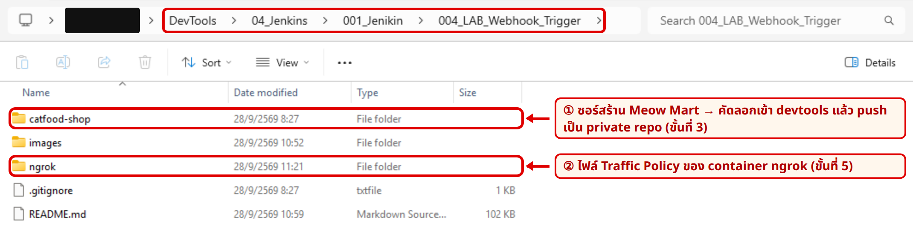
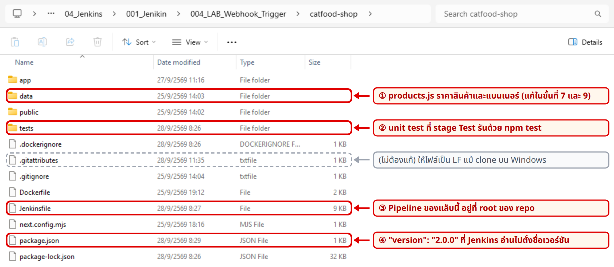
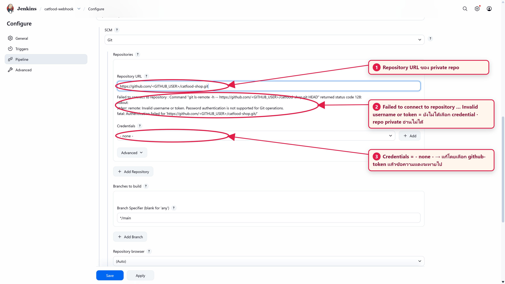
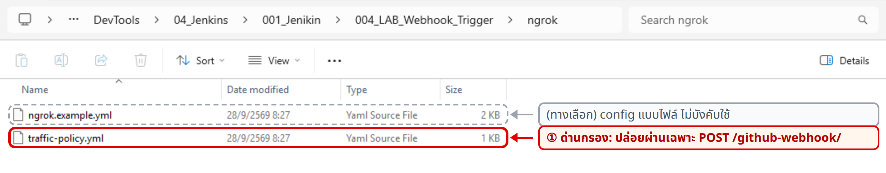

# LAB 4 — git push แล้วร้านอัปเดตเอง: GitHub Webhook ผ่าน ngrok → Jenkins

## ภาพรวม

ใน LAB 3 เรากด **Build with Parameters** เองทุกครั้ง LAB 4 เราจะตัดคนกดออก แค่ `git push` ขึ้น GitHub แล้ว GitHub จะแจ้ง Jenkins เอง วิธีนี้เรียกว่า webhook จากนั้น Pipeline จะรันจนร้านที่ `localhost:3000` เป็นเวอร์ชันใหม่ โดยไม่มีใครแตะปุ่ม

**webhook** คือการที่ GitHub ส่ง HTTP `POST` ไปหา URL ที่เราลงทะเบียนไว้ทุกครั้งที่มีคน push ปัญหาคือ Jenkins ของเราอยู่ที่ `localhost:8080` ซึ่ง GitHub บน internet มองไม่เห็น

**ngrok** แก้ปัญหานี้ เรารัน ngrok เป็น container ตัวที่ 3 มันต่อ tunnel ขาออกไปที่ ngrok cloud แล้วได้โดเมน `https://<NGROK_DOMAIN>` มา อะไรที่ส่งมาที่โดเมนนี้จะวิ่งลง tunnel มาถึง `jenkins:8080` เราใส่ Traffic Policy ให้ ngrok ยอมให้ผ่านเฉพาะ `POST /github-webhook/` ส่วนหน้าอื่นของ Jenkins จะถูกตอบ `403` ตั้งแต่ที่ ngrok cloud

<a href="./images/lab4_diagram_a_architecture.png"></a>

*ภาพที่ 1 container 3 ตัวบน `cicd-net` โดย `ngrok` เป็นตัวใหม่ ลำดับคือ `git push` ขึ้น GitHub (1) แล้ว GitHub ส่ง webhook ผ่าน ngrok มาที่ Jenkins (2) จากนั้น Jenkins สั่งงาน devtools ผ่าน SSH เหมือน LAB 3*

<a href="./images/lab4_diagram_b_webhook_flow.png"></a>

*ภาพที่ 2 สิ่งที่เกิดขึ้นเมื่อ `git push` หนึ่งครั้ง ขั้นที่ควรจำคือ 5 เพราะ Jenkins จะตรวจ secret และหา job ที่ URL ของ repo ตรงกันก่อน แล้วจึงเริ่ม build*

**สิ่งที่เปลี่ยนจาก LAB 3**

| | LAB 3 | LAB 4 |
|---|---|---|
| ใครเริ่ม build | คนกด Build with Parameters | `git push` แล้ว webhook สั่งเอง (กด Build Now แค่ครั้งแรก) |
| repository | repo สาธารณะของรายวิชา | private repo `catfood-shop` ของเราเอง ใช้ credential `github-token` |
| Clone | devtools `git clone --sparse` | Jenkins `checkout scm` แล้วส่งซอร์สไป devtools ด้วย `tar \| ssh` |
| เวอร์ชัน | parameter `APP_VERSION` | `"version"` ใน `package.json` |
| Test | health grep | `npm test` (unit test ข้อมูลสินค้า) และ health grep ที่ตรวจ commit ด้วย |

> **หมายเหตุเรื่องภาพและผลลัพธ์:** ภาพหน้าจอทั้งหมดถ่ายจากการทำแล็บนี้ ค่าส่วนตัวถูกแทนด้วย `<GITHUB_USER>`, `<NGROK_DOMAIN>` และค่าอื่นในรูป `<...>` ส่วนเลข commit, เวลา และ IP ในภาพและในกล่อง "ผลลัพธ์ที่ควรเห็น" ของเราจะต่างออกไป บางภาพถ่ายหลังจบแล็บจึงเห็นรายการมากกว่าของเรา Jenkins และ log ของ `docker logs jenkins`/`docker logs ngrok` แสดงเวลาเป็น UTC (ช้ากว่าเวลาไทย 7 ชั่วโมง)

> **กติกา:** หลังขั้นที่ 4 **ห้ามกด Build Now เอง** ทุก build ต้องเกิดจาก `git push` และเหมือน LAB 3 คือห้ามพิมพ์ `docker build`/`docker push` ของร้านเอง

> ⚠️ **ความปลอดภัย:** ngrok ทำให้ Jenkins (รหัส `admin/admin2569` ที่ทุกคนรู้) เข้าถึงได้จาก internet เราจึง**ต้อง**รัน ngrok พร้อม Traffic Policy ตามขั้นที่ 5 และ `docker rm -f ngrok` ทุกครั้งที่เลิกทำแล็บ (ขั้นที่ 11) ห้ามแชร์ authtoken ของ ngrok, token ของ GitHub หรือ webhook secret ในแชต ภาพหน้าจอ หรือ commit

## ขั้นที่ 0 — สิ่งที่ต้องมี

- ทำ LAB 3 สำเร็จแล้ว มี container `jenkins` และ `devtools` บน `cicd-net`, plugin SSH Agent, credential `devtools-ssh` และ `dockerhub` **ใช้ของเดิมทั้งหมด ห้ามสร้างใหม่**
- บัญชี GitHub, บัญชี ngrok แบบฟรี (สมัครในขั้นที่ 5 ไม่ต้องใช้บัตรเครดิต) และบัญชี Docker Hub เดิม
- port `8080`, `2222`, `3000` เป็นของ LAB 3 ส่วน port `4040` ต้องว่าง
- ห้ามรัน job `docker-build-push` ของ LAB 3 พร้อมกับ job ของแล็บนี้ เพราะใช้ชื่อ container `catfood-web` และ port `3000` เดียวกัน
- สัญลักษณ์บอกที่รันคำสั่ง: 🖥️ host คือ terminal ของเครื่องเราที่ใช้ `docker` ได้ (เหมือน LAB 3), 💻 devtools คือ shell ข้างใน container `devtools` และ 🌐 คือเบราว์เซอร์
- ถ้า 🖥️ เป็น PowerShell คำสั่งที่มี `| grep` ให้เปลี่ยนเป็น `| Select-String` เช่น `docker logs jenkins 2>&1 | Select-String "PING"`

## ขั้นที่ 1 — ตรวจของจาก LAB 3 และเตรียมโฟลเดอร์แล็บ (🖥️ + 🌐)

### 1.1) container และ network จาก LAB 3

แล็บนี้ใช้ `jenkins` และ `devtools` ตัวเดิมทั้งหมด ขั้นนี้เราจะตรวจว่าทั้งสองตัวยังรันอยู่บน `cicd-net`

🖥️ host:

```bash
docker ps --filter name=jenkins --filter name=devtools --format "table {{.Names}}\t{{.Status}}"
docker network inspect cicd-net --format "{{range .Containers}}{{.Name}} {{end}}"
```

✅ คำสั่งแรกต้องมีแถว `jenkins` และ `devtools` ที่ STATUS ขึ้นต้นด้วย `Up` และคำสั่งที่สองต้องมีทั้งชื่อ `jenkins` และ `devtools` ถ้าหยุดอยู่ให้ `docker start jenkins devtools` (ห้ามลบหรือสร้างใหม่)

### 1.2) plugin GitHub

GitHub plugin ทำให้ Jenkins รับ webhook ที่ `/github-webhook/` ได้ เราจึงต้องแน่ใจว่ามี plugin นี้

🌐 เปิด http://localhost:8080 แล้ว login `admin` / `admin2569` ไปที่ **Manage Jenkins → Plugins → Installed plugins** แล้วค้น `GitHub`

<a href="./images/lab4_jk_01a_plugin_github.png"></a>

*ภาพที่ 3 ต้องเห็น GitHub plugin เปิดใช้งานอยู่ ปกติมากับ Install suggested plugins แล้ว ถ้าไม่มีให้ติดตั้งจาก Available plugins แบบเดียวกับ SSH Agent ใน LAB 3*

✅ ค้น `SSH Agent` ในหน้าเดียวกันแล้วต้องเจอ SSH Agent Plugin จาก LAB 3

### 1.3) อัปเดต repo รายวิชาแล้วเข้าโฟลเดอร์แล็บ

repo รายวิชาที่ clone ไว้ใน LAB 1 อยู่ที่ `~/labwork/DevTools` บนเครื่องเรา ขั้นนี้เราจะ `git pull` ให้ได้ไฟล์ล่าสุดของแล็บนี้ เพราะขั้นที่ 3 และขั้นที่ 5 ใช้ไฟล์จากโฟลเดอร์นี้

🖥️ host (ใช้ได้ทั้ง PowerShell และ bash):

```bash
cd ~/labwork/DevTools
git pull
cd 04_Jenkins/001_Jenikin/004_LAB_Webhook_Trigger
```

<a href="./images/lab4_win_01_lab_folder.png"></a>

*ภาพที่ 4 โฟลเดอร์แล็บเมื่อเปิดใน File Explorer ที่เราจะใช้มี 2 โฟลเดอร์ คือ `catfood-shop` ในขั้นที่ 3 และ `ngrok` ในขั้นที่ 5*

✅ `git pull` จบโดยไม่มี error และในโฟลเดอร์มี `catfood-shop` กับ `ngrok` **เปิด terminal นี้ค้างไว้** เพราะขั้นที่ 3 และขั้นที่ 5 จะสั่งจากโฟลเดอร์นี้

## ขั้นที่ 2 — private repo และ fine-grained token (🌐 GitHub)

### 2.1) สร้าง repository `catfood-shop` แบบ Private

เราจะสร้าง repo ของเราเองแบบ Private เพื่อฝึกให้ Jenkins ใช้ token ดึงโค้ด

🌐 เปิด https://github.com/new ตั้ง Repository name เป็น `catfood-shop` กดปุ่ม visibility แล้วเลือก **Private** ปล่อย Add README เป็น Off แล้วกด **Create repository**

<a href="./images/lab4_gh_01b_new_repo_create.png"></a>

*ภาพที่ 5 ชื่อต้องเป็น `catfood-shop` ตรงตัว และ Add README ต้องเป็น Off เพื่อให้ repo ว่าง push ครั้งแรกได้ทันที*

✅ ได้หน้า repo ว่างที่มีป้าย Private

### 2.2) สร้าง fine-grained personal access token

token ตัวเดียวนี้ใช้สองที่ คือ `git push` จาก devtools และ credential `github-token` ให้ Jenkins clone private repo token ไม่ใช่รหัสผ่านบัญชี GitHub

🌐 รูปโปรไฟล์มุมขวาบน → **Settings** → **Developer settings** (ล่างสุดของเมนูซ้าย) → **Personal access tokens** → **Fine-grained tokens** → **Generate new token** ถ้า GitHub ขึ้นหน้า Confirm access ให้ยืนยันตัวตนแล้วทำต่อ

<a href="./images/lab4_gh_03a_pat_name_expiry.png"></a>

*ภาพที่ 6 ส่วนบนของฟอร์ม ตั้ง Token name เช่น `jenkins-catfood-shop` และ Resource owner เป็นบัญชีของเรา Expiration `30 days` (③) ทำให้ token หมดอายุเองถ้าเราลืมลบ*

<a href="./images/lab4_gh_03b_pat_repo_access.png"></a>

*ภาพที่ 7 เลือก Only select repositories แล้วเลือก `catfood-shop` repo เดียว token นี้จึงแตะ repo อื่นของเราไม่ได้*

<a href="./images/lab4_gh_03c_pat_permissions.png"></a>

*ภาพที่ 8 เพิ่ม Contents แล้วตั้งเป็น Read and write ถ้าเป็น Read-only จะ push ไม่ได้ ส่วน Metadata ถูกเพิ่มให้เอง*

✅ กด **Generate token** แล้วได้ token ที่ขึ้นต้นด้วย `github_pat_` ให้คัดลอกเก็บไว้ทันทีเพราะ GitHub แสดงครั้งเดียว เอกสารนี้เรียกค่านี้ว่า `<GITHUB_TOKEN>`

## ขั้นที่ 3 — push ซอร์สร้านขึ้น private repo (🖥️ → 💻)

### 3.1) ดูไฟล์ใน `catfood-shop`

ก่อนคัดลอก เรามาดูว่าโฟลเดอร์ที่จะกลายเป็น repo ของเรามีอะไรบ้าง

<a href="./images/lab4_win_02_catfood_shop.png"></a>

*ภาพที่ 9 ไฟล์ที่เราจะแตะในแล็บนี้คือ `data` (ขั้นที่ 7 และ 9) ส่วน `Jenkinsfile`, `package.json` และ `tests` คือสิ่งที่ Pipeline ใช้*

ไฟล์ `.gitattributes` ทำให้ไฟล์ข้อความเป็น LF เสมอแม้ clone บน Windows เราไม่ต้องแก้ไฟล์นี้

✅ ในโฟลเดอร์ `catfood-shop` มี `Jenkinsfile`, `package.json`, `data`, `tests` และ `.gitattributes`

### 3.2) คัดลอกเข้า devtools แล้วแก้เจ้าของไฟล์

repo รายวิชาอยู่บนเครื่องเรา แต่เราจะ commit และ push จากใน `devtools` ที่มี git พร้อมแล้ว จึงคัดลอกโฟลเดอร์เข้าไปด้วย `docker cp`

🖥️ host (terminal เดิมจากข้อ 1.3):

```bash
docker cp catfood-shop devtools:/root/catfood-shop
docker exec -it devtools bash
```

💻 devtools:

```bash
chown -R root:root ~/catfood-shop
cd ~/catfood-shop && ls -a
```

`docker cp` คงเจ้าของไฟล์เดิมจากเครื่องเราไว้ ถ้าไม่เปลี่ยนเป็น `root` คำสั่ง git จะไม่ยอมทำงานใน repo ที่เจ้าของไม่ตรงกับผู้ใช้ ถ้าเคยคัดลอกไปแล้ว ห้าม `docker cp` ซ้ำ ดูตารางแก้ปัญหาหมวด git push / docker cp

✅ prompt ลงท้ายด้วย `:~/catfood-shop#` และ `ls -a` เห็น `Jenkinsfile`, `package.json`, `data`, `tests` และไฟล์ขึ้นต้นด้วยจุดครบทั้ง `.gitattributes`, `.gitignore`, `.dockerignore`

### 3.3) git init แล้ว push ครั้งแรก

ขั้นนี้เราจะทำให้โฟลเดอร์นี้เป็น git repo แล้ว push ขึ้น private repo ที่สร้างในขั้นที่ 2

💻 devtools:

```bash
git config --global user.name "<GITHUB_USER>"
git config --global user.email "<GITHUB_USER>@users.noreply.github.com"   # ไม่ให้อีเมลจริงอยู่ใน commit
git config --global credential.helper 'cache --timeout=7200'              # จำ token ใน RAM 2 ชม.
git init -b main                                                          # branch main ตรงกับ job
git add .
git commit -m "Meow Mart v2.0.0 + Jenkinsfile"
git remote add origin https://github.com/<GITHUB_USER>/catfood-shop.git
git push -u origin main
```

- ตอน git ถาม Username ให้พิมพ์ `<GITHUB_USER>` และตอนถาม Password ให้วาง `<GITHUB_TOKEN>` ตอนวางจะมองไม่เห็นตัวอักษร เป็นเรื่องปกติ
- `<GITHUB_USER>` ต้องพิมพ์**ตัวพิมพ์เล็ก/ใหญ่ตรงกับชื่อบัญชีบน GitHub** ทุกที่ ทั้ง URL ของ remote, credential ใน Jenkins และ Repository URL ของ job

ผลลัพธ์ที่ควรเห็น:

```text
 * [new branch]      main -> main
```

✅ มีบรรทัด `* [new branch]      main -> main` แปลว่าสร้าง branch `main` บน GitHub สำเร็จ

🌐 refresh หน้า repo บน GitHub

<a href="./images/lab4_gh_02_repo_private.png"></a>

*ภาพที่ 10 หน้า repo ต้องมีป้าย Private และไฟล์ครบ ภาพนี้ถ่ายตอนจบแล็บจึงขึ้น 4 Commits ของเราตอนนี้มี 1*

✅ หน้า repo มี `Jenkinsfile`, `tests/` และป้าย Private

## ขั้นที่ 4 — Jenkins: credential, job และ Build Now ครั้งแรก (🌐)

### 4.1) credential `github-token`

Jenkins ต้องมี username กับ token ไว้ clone private repo token จึงอยู่ใน Jenkins ที่เดียว devtools ไม่ต้องรู้

🌐 **Manage Jenkins → Credentials → System → Global → + Add Credentials** (เส้นทางเดียวกับ LAB 3) เลือกชนิด **Username with password** แล้วกด **Next**

<a href="./images/lab4_jk_02a_cred_type.png"></a>

*ภาพที่ 11 ชนิด Username with password (①) ใช้กับ `github-token` ส่วน Secret text (②) จะใช้ในขั้นที่ 6*

| ช่อง | ค่า |
|---|---|
| Scope | Global |
| Username | `<GITHUB_USER>` (ตัวพิมพ์ตรงกับบัญชี) |
| Treat username as secret | **ไม่ติ๊ก** |
| Password | `<GITHUB_TOKEN>` |
| ID | `github-token` |
| Description | `GitHub fine-grained PAT: catfood-shop` |

<a href="./images/lab4_jk_02b_cred_github_token.png"></a>

*ภาพที่ 12 สังเกตว่า Treat username as secret ต้องไม่ติ๊ก ถ้าติ๊ก ชื่อบัญชีใน console จะกลายเป็น `****` แล้วอ่าน log ยาก*

✅ กด **Create** แล้วกลับมาที่หน้า Global เห็น `github-token`

### 4.2) สร้าง job `catfood-webhook`

ขั้นนี้เราจะสร้าง Pipeline job ที่อ่าน `Jenkinsfile` จาก private repo และรอรับ webhook

**New Item:** 🌐 Dashboard → **New Item** ตั้งชื่อ `catfood-webhook` (ต้องตรงตัว เพราะแล็บถัดไปอ้างชื่อนี้) เลือก **Pipeline** แล้วกด **OK**

<a href="./images/lab4_jk_newitem.png"></a>

*ภาพที่ 13 ชื่อ job ต้องเป็น `catfood-webhook` และชนิดต้องเป็น Pipeline เพราะเราจะให้ Jenkins อ่าน `Jenkinsfile` จาก repo*

**Triggers:**

<a href="./images/lab4_jk_04_job_trigger.png"></a>

*ภาพที่ 14 ติ๊กแค่ GitHub hook trigger for GITScm polling ไม่ต้องติ๊ก Poll SCM เพราะ GitHub จะแจ้งมาเอง*

**Pipeline:**

| ช่อง | ค่า |
|---|---|
| Definition | **Pipeline script from SCM** |
| SCM | **Git** |
| Repository URL | `https://github.com/<GITHUB_USER>/catfood-shop.git` |
| Credentials | `<GITHUB_USER>/****** (GitHub fine-grained PAT: catfood-shop)` คือ `github-token` |
| Branch Specifier | `*/main` |
| Script Path | `Jenkinsfile` |
| Lightweight checkout | ติ๊กไว้ (ค่าเริ่มต้น) |

<a href="./images/lab4_jk_05a_scm_no_cred.png"></a>

*ภาพที่ 15 ถ้าใส่ URL แล้วยังไม่เลือก credential จะขึ้นข้อความ `Failed to connect to repository` และ `Invalid username or token` ใต้ช่อง URL เพราะ Jenkins อ่าน private repo ไม่ได้*

<a href="./images/lab4_jk_05b_scm_with_cred.png"></a>

*ภาพที่ 16 เลือก Credentials เป็น `github-token` แล้วข้อความ error ใต้ช่อง URL หายไป*

<a href="./images/lab4_jk_05c_branch_script.png"></a>

*ภาพที่ 17 Branch เป็น `*/main` และ Script Path เป็น `Jenkinsfile` แล้วกด **Save***

✅ หน้า job มีเมนู **Build Now** และ **GitHub Hook Log** ที่เมนูซ้าย

### 4.3) Jenkinsfile ของแล็บนี้ทำอะไร

ข้อนี้อ่านอย่างเดียว เพื่อให้เห็นว่า Pipeline ต่างจาก LAB 3 ตรงไหน

<a href="./images/lab4_diagram_c_pipeline.png"></a>

*ภาพที่ 18 Clone ทำบน Jenkins ส่วน Build ถึง Deploy ทำบน devtools ผ่าน SSH ถ้า Test ไม่ผ่าน Push และ Deploy จะถูกข้าม ร้านเดิมจึงยังเปิดอยู่*

- `triggers { githubPush() }` ทำให้ job รับ webhook จาก GitHub
- ไม่มี `parameters` เพราะไม่มีคนกรอกค่า เวอร์ชันจึงอ่านจาก `package.json`
- Jenkins `checkout scm` เอง แล้วส่งซอร์สไป devtools ด้วย `tar | ssh` โดยไม่รวม `.git` จึงไม่มี token ติดไป
- stage Test เพิ่ม `npm test` ที่รัน unit test ข้อมูลสินค้า
- health check ตรวจ `commit:` ด้วย เพื่อยืนยันว่า image มาจาก commit ที่ push

<details>
<summary>ดู Jenkinsfile ทั้งไฟล์ (ไฟล์เดียวกับใน repo ของเรา ไม่อ่านก็ทำแล็บได้)</summary>

โค้ดด้านล่างคือ [`catfood-shop/Jenkinsfile`](./catfood-shop/Jenkinsfile) ทั้งไฟล์ ตรงตัวทุกบรรทัด

```groovy
// LAB 4 — git push → GitHub webhook → ngrok → Jenkins: Connect → Clone → Build → Test → Push → Deploy
// ต้องมี: plugin "SSH Agent" และ "GitHub" · credential devtools-ssh, dockerhub (จาก LAB 3) และ github-token
// Jenkins clone private repo เอง แล้วส่งซอร์สไป devtools ทาง SSH: devtools ไม่ต้องรู้ token ของ GitHub

pipeline {
  agent any

  triggers {
    githubPush()                // รับ webhook จาก GitHub (= ติ๊ก GitHub hook trigger for GITScm polling)
  }

  options {
    disableConcurrentBuilds()   // push ติดกันหลายครั้งให้รอคิว: ทุก build ใช้โฟลเดอร์ ชื่อ container และ port 3000 เดียวกัน
    skipDefaultCheckout()       // checkout เองใน stage Clone เพื่อเก็บเลข commit
  }

  environment {
    // accept-new: จำ host key ของ devtools ครั้งแรก ถ้าเปลี่ยนภายหลังจะปฏิเสธ · BatchMode: ไม่ถามรหัสผ่าน
    SSH_DEVTOOLS = 'ssh -o StrictHostKeyChecking=accept-new -o BatchMode=yes root@devtools'
    SRC_DIR      = '/root/lab4-work/catfood-shop'   // ซอร์สที่ Jenkins ส่งไปให้ devtools build
    AUTH_DIR     = '/root/lab4-work/docker-auth'    // ไฟล์ login Docker Hub ชั่วคราวบน devtools
    IMAGE        = "catfood-shop:lab4-${env.BUILD_NUMBER}"
    // APP_VERSION และ COMMIT ตั้งใน stage Clone ห้ามประกาศซ้ำที่นี่ (ค่าใน environment จะทับค่าที่ตั้งใน script)
  }

  stages {
    stage('Connect') {
      steps {
        sshagent(credentials: ['devtools-ssh']) {
          sh '$SSH_DEVTOOLS "hostname && whoami && docker --version"'
        }
      }
    }

    stage('Clone') {
      steps {
        script {
          // Jenkins clone private repo ด้วย credential github-token ที่ตั้งไว้ใน job (commit เดียวกับ Jenkinsfile)
          def scmVars = checkout scm
          env.COMMIT = scmVars.GIT_COMMIT.substring(0, 7)
          // เวอร์ชันมาจาก package.json ของ repo (webhook ไม่มีคนกรอก parameter)
          env.APP_VERSION = sh(returnStdout: true,
                               script: 'grep -m1 \'"version"\' package.json | cut -d \'"\' -f4').trim()
          // ค่านี้ถูกส่งต่อเข้า shell บน devtools จึงต้องเป็นตัวเลขกับจุดเท่านั้น
          if (!(env.APP_VERSION ==~ /[0-9]+\.[0-9]+\.[0-9]+/)) {
            error "version ใน package.json ต้องเป็นรูปแบบ X.Y.Z (ได้ '${env.APP_VERSION}')"
          }
          echo "commit ${env.COMMIT} · version ${env.APP_VERSION}"
        }
        sshagent(credentials: ['devtools-ssh']) {
          // ส่งซอร์ส (ไม่รวม .git) เป็น tar ผ่าน SSH ไปแตกบน devtools
          // /bin/sh ของ Jenkins ไม่มี pipefail: บรรทัดสุดท้ายตรวจว่าไฟล์ไปถึงจริง
          sh '''
            $SSH_DEVTOOLS "rm -rf $SRC_DIR && mkdir -p $SRC_DIR"
            tar --exclude=.git -cf - . | $SSH_DEVTOOLS "tar -xf - -C $SRC_DIR"
            $SSH_DEVTOOLS "ls $SRC_DIR && test -f $SRC_DIR/package.json"
            '''.stripIndent()
        }
      }
    }

    stage('Build') {
      steps {
        sshagent(credentials: ['devtools-ssh']) {
          sh '''
            $SSH_DEVTOOLS "SRC_DIR=$SRC_DIR IMAGE=$IMAGE APP_VERSION=$APP_VERSION BUILD_NUMBER=$BUILD_NUMBER COMMIT=$COMMIT bash -ex" <<'EOF'
              cd "$SRC_DIR"
              docker build \
                --build-arg APP_VERSION="$APP_VERSION" \
                --build-arg BUILD_NUMBER="$BUILD_NUMBER" \
                --build-arg GIT_COMMIT="$COMMIT" \
                --build-arg BUILD_TIME="$(date -u +%Y-%m-%dT%H:%M:%SZ)" \
                -t "$IMAGE" .
              docker image ls "$IMAGE"
            EOF
            '''.stripIndent()
        }
      }
    }

    stage('Test') {
      steps {
        sshagent(credentials: ['devtools-ssh']) {
          sh '''
            $SSH_DEVTOOLS "IMAGE=$IMAGE APP_VERSION=$APP_VERSION BUILD_NUMBER=$BUILD_NUMBER COMMIT=$COMMIT bash -ex" <<'EOF'
              docker run --rm "$IMAGE" npm test --silent   # ① unit test ข้อมูลสินค้า (tests/products.test.mjs)
              docker rm -f catfood-test || true             # ② smoke test: รันจริงแล้วถาม /api/health
              docker run -d --name catfood-test "$IMAGE"
              trap 'docker rm -f catfood-test' EXIT         # ลบ container ทดสอบเสมอ แม้ test ไม่ผ่าน
              for i in $(seq 1 30); do
                [ "$(docker inspect -f '{{.State.Health.Status}}' catfood-test)" = healthy ] && break
                sleep 1
              done
              docker exec catfood-test wget -qO- http://127.0.0.1:3000/api/health |
                tr -d '"' | grep -F "version:$APP_VERSION,build:$BUILD_NUMBER,commit:$COMMIT,"
            EOF
            '''.stripIndent()
        }
      }
    }

    stage('Push') {
      steps {
        withCredentials([usernamePassword(credentialsId: 'dockerhub',
                         usernameVariable: 'HUB_USER', passwordVariable: 'HUB_TOKEN')]) {
          sshagent(credentials: ['devtools-ssh']) {
            // token ส่งทาง stdin เข้า --password-stdin: ไม่อยู่ใน command line และ console
            sh '''
              set +x
              echo "$HUB_TOKEN" | $SSH_DEVTOOLS "umask 077; docker --config $AUTH_DIR login -u $HUB_USER --password-stdin"
              set -x
              $SSH_DEVTOOLS docker tag $IMAGE $HUB_USER/$IMAGE
              $SSH_DEVTOOLS docker --config $AUTH_DIR push $HUB_USER/$IMAGE
              $SSH_DEVTOOLS docker image rm $IMAGE
              '''.stripIndent()
          }
        }
      }
    }

    stage('Deploy') {
      steps {
        // ใช้ HUB_USER ตั้งชื่อ image และใช้ไฟล์ login จาก stage Push (post ลบให้ตอนจบ)
        withCredentials([usernamePassword(credentialsId: 'dockerhub',
                         usernameVariable: 'HUB_USER', passwordVariable: 'HUB_TOKEN')]) {
          sshagent(credentials: ['devtools-ssh']) {
            sh '''
              $SSH_DEVTOOLS "AUTH_DIR=$AUTH_DIR IMAGE=$HUB_USER/$IMAGE APP_VERSION=$APP_VERSION BUILD_NUMBER=$BUILD_NUMBER COMMIT=$COMMIT bash -ex" <<'EOF'
                docker image rm "$IMAGE"                  # ลบ image ในเครื่อง เพื่อให้ pull มาจาก Docker Hub จริง
                docker --config "$AUTH_DIR" pull "$IMAGE"
                docker rm -f catfood-web || true          # ลบร้านเวอร์ชันเดิม (ของ LAB 3 หรือ build ก่อน)
                docker run -d --name catfood-web --restart unless-stopped -p 3000:3000 "$IMAGE"
                for i in $(seq 1 30); do
                  [ "$(docker inspect -f '{{.State.Health.Status}}' catfood-web)" = healthy ] && break
                  sleep 1
                done
                curl -fsS http://localhost:3000/api/health |
                  tr -d '"' | grep -F "version:$APP_VERSION,build:$BUILD_NUMBER,commit:$COMMIT,"
              EOF
              '''.stripIndent()
          }
        }
      }
    }
  }

  post {
    success {
      echo "เปิดร้านได้ที่ http://localhost:3000 (v${env.APP_VERSION} build #${env.BUILD_NUMBER} commit ${env.COMMIT})"
    }
    always {
      // ลบไฟล์ login Docker Hub บน devtools เสมอ ทั้งตอนสำเร็จและตอน build ล้มกลางทาง
      sshagent(credentials: ['devtools-ssh']) {
        sh '$SSH_DEVTOOLS "rm -rf $AUTH_DIR" || true'
      }
    }
  }
}
```

</details>

<details>
<summary>ส่วนที่ต่างจาก LAB 3 ทีละส่วน (ไม่อ่านก็ทำแล็บได้)</summary>

| ส่วน | LAB 4 ทำอะไร | รันที่ |
|---|---|---|
| `triggers { githubPush() }` | ประกาศในโค้ดว่า job นี้รับ webhook (ผลเท่ากับติ๊ก trigger ในข้อ 4.2) Jenkins อ่านบรรทัดนี้หลัง build แรก | Jenkins |
| ไม่มี `parameters` | webhook ไม่มีคนกรอกค่า เวอร์ชันจึงอ่านจาก `package.json` | — |
| `environment` มี `SRC_DIR` | โฟลเดอร์บน devtools ที่รับซอร์ส ห้ามประกาศ `APP_VERSION`/`COMMIT` ที่นี่ เพราะจะทับค่าที่ stage Clone ตั้ง | — |
| Clone: `checkout scm` | clone private repo ด้วย `github-token` ได้ commit เดียวกับ `Jenkinsfile` ที่กำลังรัน แล้วตัด `GIT_COMMIT` เหลือ 7 ตัวเป็น `env.COMMIT` | Jenkins |
| Clone: อ่านเวอร์ชัน | `grep` ค่า `"version"` จาก `package.json` แล้วตรวจรูปแบบ `X.Y.Z` กันการแทรกคำสั่งเข้า shell | Jenkins |
| Clone: `tar \| ssh` | ลบ `$SRC_DIR` เดิม ส่งซอร์สที่ไม่รวม `.git` ไปแตกบน devtools แล้ว `test -f package.json` ยืนยันว่าไฟล์ไปถึง | Jenkins → devtools |
| Test | ① `npm test` รัน `tests/products.test.mjs` ถ้าไม่ผ่าน stage แดงและข้าม Push/Deploy ② health grep เพิ่ม `commit:$COMMIT,` | devtools |
| Connect, Build, Deploy, `post` | Connect เหลือแค่ทดสอบ SSH, Build `cd "$SRC_DIR"` และ tag `lab4-N`, Deploy grep `commit:` เหมือน Test, `post success` พิมพ์เวอร์ชัน build และ commit | devtools / Jenkins |

Clone ย้ายมาอยู่บน Jenkins เพราะ repo เป็น private ถ้าให้ devtools clone เอง ต้องเอา token ไปไว้บน devtools ด้วย แบบนี้ token อยู่ใน Jenkins ที่เดียว

</details>

### 4.4) Build Now ครั้งแรก (ครั้งเดียวในแล็บ)

build นี้ทดสอบว่า credential และ Pipeline ใช้ได้ก่อนยุ่งกับ webhook และทำให้ Jenkins จำ commit ล่าสุดไว้เทียบกับ push ครั้งหน้า build แรกใช้เวลาราว 2 นาที

🌐 หน้า job → **Build Now** → **#1** → **Console Output**

<a href="./images/lab4_jk_07_console1_clone.png"></a>

*ภาพที่ 19 ใน stage Clone จะเห็นว่า Jenkins ใช้ credential `github-token` ดึง commit ที่เรา push และไม่มีคำว่า `github_pat_` โผล่ใน console*

<a href="./images/lab4_jk_07_console1_end.png"></a>

*ภาพที่ 20 ท้าย console ต้องมี `เปิดร้านได้ที่ http://localhost:3000 ...` และ `Finished: SUCCESS`*

<details>
<summary>ดู console ส่วนอื่นของ build #1 (ไม่อ่านก็ทำแล็บได้)</summary>

<a href="./images/lab4_jk_07_console1_version.png"></a>

*ภาพที่ 21 บรรทัด `commit ... · version 2.0.0` คือค่าที่ Jenkins อ่านจาก repo แล้ว `tar` ส่งซอร์สไป devtools*

<a href="./images/lab4_jk_07_console1_test.png"></a>

*ภาพที่ 22 `# pass 3` คือ unit test ผ่านครบ จากนั้นจึงรัน `catfood-test` และถาม `/api/health`*

</details>

<a href="./images/lab4_shop_01_v200_build1_full.png"></a>

*ภาพที่ 23 ร้านเวอร์ชัน LAB 4 มาแทนร้านของ LAB 3 ดูได้จากแบนเนอร์โปรใหม่และ chip `v2.0.0 · build #1` คลิกภาพเพื่อดูทั้งหน้า*

✅ http://localhost:3000 ขึ้น chip `v2.0.0 · build #1`

## ขั้นที่ 5 — เปิดทางเข้าให้ GitHub ด้วย ngrok (🌐 + 🖥️)

### 5.1) สมัคร ngrok แล้วเก็บค่า 2 อย่าง

เราต้องใช้ authtoken เพื่อผูก container กับบัญชี และ dev domain ซึ่งเป็นโดเมนถาวรที่จะใส่ใน GitHub

🌐 เปิด https://ngrok.com แล้วกด **SIGN UP** มุมขวาบน

<a href="./images/lab4_ngrok_01_home.png"></a>

*ภาพที่ 24 ถ้ายังไม่มีบัญชีให้กด SIGN UP (①) แผนฟรีไม่ต้องใช้บัตรเครดิต ถ้าเคยสมัครแล้วให้กด LOG IN (③)*

<a href="./images/lab4_ngrok_02_signup.png"></a>

*ภาพที่ 25 แนะนำ **Sign up with GitHub** ใช้บัญชีเดียวกับแล็บนี้ได้เลย หลังสมัคร ngrok อาจถามเรื่องการใช้งาน ตอบอะไรก็ได้*

<a href="./images/lab4_ngrok_03_login.png"></a>

*ภาพที่ 26 ครั้งต่อไปเข้า https://dashboard.ngrok.com แล้วกด Log in with GitHub (①) ให้ตรงกับวิธีที่ใช้ตอนสมัคร*

<a href="./images/lab4_ngrok_05_authtoken.png"></a>

*ภาพที่ 27 เมนู **Your Authtoken** กด **Copy** แล้วเก็บเป็นความลับเหมือนรหัสผ่าน เอกสารนี้เรียกค่านี้ว่า `<NGROK_AUTHTOKEN>`*

<a href="./images/lab4_ngrok_06_domains.png"></a>

*ภาพที่ 28 เมนู **Domains** มี dev domain ให้แล้ว 1 โดเมน ไม่ต้องกด New Domain ให้คัดลอกชื่อโดเมนโดยไม่เอา `https://` เอกสารนี้เรียกค่านี้ว่า `<NGROK_DOMAIN>`*

- dev domain แผนฟรีมีรูปแบบ `xxxx-xxxx-xxxx.ngrok-free.dev` แผนฟรีใช้ Traffic Policy ได้ และรัน ngrok ได้ทีละ 1 ตัวต่อบัญชี

✅ มีค่า `<NGROK_AUTHTOKEN>` และ `<NGROK_DOMAIN>` เก็บไว้แล้ว

### 5.2) รัน container `ngrok` พร้อม Traffic Policy

ขั้นนี้เราจะเปิด tunnel จาก `https://<NGROK_DOMAIN>` มาที่ `jenkins:8080` โดยให้ผ่านได้เฉพาะ webhook

🖥️ host ใช้ terminal เดิมจากข้อ 1.3 (ถ้าเปิดใหม่ให้ `cd` เข้าโฟลเดอร์แล็บตามข้อ 1.3 ก่อน) เพราะ `${PWD}/ngrok` ในคำสั่งต้องชี้ไปที่โฟลเดอร์ `ngrok` ของแล็บ

<a href="./images/lab4_win_03_ngrok_folder.png"></a>

*ภาพที่ 29 `traffic-policy.yml` คือไฟล์ที่ container จะอ่าน ส่วน `ngrok.example.yml` ใช้เฉพาะทางเลือกที่อยู่ด้านล่าง*

ไฟล์ `ngrok/traffic-policy.yml`:

```yaml
# ngrok Traffic Policy — ปล่อยผ่านเฉพาะ webhook ของ GitHub ที่เหลือตอบ 403 ที่ ngrok cloud (ไม่ถึง Jenkins)
# Jenkins ใช้รหัสผ่านของรายวิชาที่ทุกคนรู้ ห้ามเปิดหน้า login / Script Console ออก internet
on_http_request:
  - name: allow-only-github-webhook
    expressions:
      - "!(req.method == 'POST' && req.url.path == '/github-webhook/')"
    actions:
      - type: custom-response
        config:
          status_code: 403
          body: "blocked by ngrok traffic policy (LAB 4)"
```

อ่านว่า request ที่**ไม่ใช่** `POST` ไปที่ path `/github-webhook/` ตรงตัว จะถูก ngrok cloud ตอบ `403` เอง และไม่ลงมาถึงเครื่องเรา

รัน ngrok (คำสั่งบรรทัดเดียว แทน `<NGROK_AUTHTOKEN>` และ `<NGROK_DOMAIN>` ด้วยค่าของเรา):

```bash
docker run -d --name ngrok --network cicd-net --restart unless-stopped -p 127.0.0.1:4040:4040 -e NGROK_AUTHTOKEN=<NGROK_AUTHTOKEN> -v "${PWD}/ngrok:/etc/ngrok-lab:ro" ngrok/ngrok:latest http http://jenkins:8080 --url https://<NGROK_DOMAIN> --traffic-policy-file /etc/ngrok-lab/traffic-policy.yml --log stdout
```

<details>
<summary>แต่ละส่วนของคำสั่ง docker run หมายถึงอะไร (ไม่อ่านก็ทำแล็บได้)</summary>

| ส่วนของคำสั่ง | ความหมาย |
|---|---|
| `--network cicd-net` | อยู่ network เดียวกับ Jenkins จึงเรียกชื่อ `jenkins:8080` ได้ |
| `--restart unless-stopped` | หลุดแล้วต่อใหม่เอง ถ้าไม่ `docker rm -f ngrok` เปิดเครื่องครั้งหน้าจะกลับมาเอง |
| `-p 127.0.0.1:4040:4040` | เปิด inspector ให้เฉพาะเครื่องเราที่ `localhost:4040` |
| `-e NGROK_AUTHTOKEN=...` | ผูก agent กับบัญชีของเรา |
| `-v "${PWD}/ngrok:/etc/ngrok-lab:ro"` | mount โฟลเดอร์ `ngrok/` ของแล็บแบบอ่านอย่างเดียว |
| `http http://jenkins:8080` | ส่งต่อ request ที่เข้ามาไปที่ Jenkins |
| `--url https://<NGROK_DOMAIN>` | ใช้ dev domain ของบัญชี ถ้าไม่ใส่อาจได้โดเมนอื่นที่ไม่ตรงกับ webhook |
| `--traffic-policy-file ...` | ใช้ Traffic Policy ข้างบน |
| `--log stdout` | ให้ `docker logs ngrok` มีข้อความเสมอ |

</details>

<details>
<summary>(ทางเลือก) ใช้ไฟล์ ngrok.yml แทน flag ยาว ๆ (ไม่อ่านก็ทำแล็บได้)</summary>

คัดลอก `ngrok/ngrok.example.yml` เป็น `ngrok/ngrok.yml` แล้วแก้ `<NGROK_AUTHTOKEN>` และ `<NGROK_DOMAIN>` ในไฟล์ (`ngrok/ngrok.yml` อยู่ใน `.gitignore` แล้ว ห้าม commit) จากนั้นรันแทนคำสั่งด้านบน:

```bash
docker run -d --name ngrok --network cicd-net --restart unless-stopped -p 127.0.0.1:4040:4040 -v "${PWD}/ngrok:/etc/ngrok-lab:ro" ngrok/ngrok:latest start --all --config /etc/ngrok-lab/ngrok.yml --log stdout
```

ข้อดีคือ authtoken ไม่อยู่ใน `docker inspect ngrok` ถ้ามีปัญหาให้กลับไปใช้คำสั่งหลัก

</details>

✅ `docker ps --filter name=ngrok` มี container `ngrok` ที่ STATUS เป็น `Up`

### 5.3) ตรวจว่า tunnel ต่อแล้วและ policy ทำงาน

ก่อนสร้าง webhook เราจะยืนยันว่า tunnel ต่อได้ และหน้าอื่นของ Jenkins ไม่หลุดออก internet

🖥️ host:

```bash
docker logs ngrok
```

ผลลัพธ์ที่ควรเห็น (บรรทัดสำคัญ):

```text
t=2026-09-28T02:44:15+0000 lvl=info msg="starting web service" obj=web addr=0.0.0.0:4040 allow_hosts=[]
t=2026-09-28T02:44:16+0000 lvl=info msg="client session established" obj=tunnels.session
t=2026-09-28T02:44:16+0000 lvl=info msg="started tunnel" obj=tunnels name=command_line addr=http://jenkins:8080 url=https://<NGROK_DOMAIN>
```

✅ `client session established` แปลว่า authtoken ถูกต้อง และ `started tunnel ... url=https://<NGROK_DOMAIN>` แปลว่าเปิด tunnel มาที่ `jenkins:8080` แล้ว

🖥️ ทดสอบ policy ด้วย `curl` (ถ้าไม่มี `curl` ให้เปิด `https://<NGROK_DOMAIN>/` ในเบราว์เซอร์แทนคำสั่งแรก):

```bash
curl -i https://<NGROK_DOMAIN>/
curl -s -o /dev/null -w "%{http_code}\n" -X POST https://<NGROK_DOMAIN>/github-webhook/
```

ถ้าใช้ PowerShell ให้พิมพ์ `curl.exe` แทน `curl` (ใน Windows PowerShell คำว่า `curl` เป็นชื่อเล่นของ `Invoke-WebRequest`) และใช้ `-o NUL` แทน `-o /dev/null`:

```powershell
curl.exe -i https://<NGROK_DOMAIN>/
curl.exe -s -o NUL -w "%{http_code}\n" -X POST https://<NGROK_DOMAIN>/github-webhook/
```

ผลลัพธ์ที่ควรเห็น (บรรทัดสำคัญ):

```text
$ curl -i https://<NGROK_DOMAIN>/
HTTP/2 403
blocked by ngrok traffic policy (LAB 4)
$ curl -s -o /dev/null -w "%{http_code}\n" -X POST https://<NGROK_DOMAIN>/github-webhook/
400
```

✅ หน้าแรกได้ `403` พร้อม `blocked by ngrok traffic policy (LAB 4)` แปลว่า policy บล็อกไว้ ส่วน `POST /github-webhook/` ได้ `400` แปลว่าผ่าน policy ไปถึง Jenkins แล้ว ที่ได้ 400 เพราะเราไม่ได้ส่ง header ของ GitHub มา (ถ้าใช้ `curl.exe` บน Windows บรรทัดแรกจะเป็น `HTTP/1.1 403 Forbidden` ก็ถูกเหมือนกัน)

- ถ้าเปิดในเบราว์เซอร์ แผนฟรีอาจขึ้นหน้าเตือนของ ngrok ก่อน ให้กด **Visit Site** แล้วจะเห็นข้อความ 403 เดียวกัน หน้านี้ไม่กระทบ webhook เพราะ GitHub ไม่ใช่เบราว์เซอร์

🌐 ngrok dashboard → เมนู **Endpoints**

<a href="./images/lab4_ngrok_07_endpoints.png"> ป้าย Agent และ Traffic Policy"></a>

*ภาพที่ 30 endpoint ของเราออนไลน์ (①) และมีป้าย Traffic Policy (②) แปลว่า container อ่านไฟล์ policy แล้ว ถ้าหยุด container แถวนี้จะหายไป*

✅ 🌐 http://localhost:4040 เปิดได้และขึ้นป้าย `online` ส่วนหน้า Endpoints มี `https://<NGROK_DOMAIN>` พร้อมป้าย Traffic Policy

## ขั้นที่ 6 — webhook secret และสร้าง webhook บน GitHub

webhook secret คือรหัสที่ GitHub กับ Jenkins รู้ร่วมกัน GitHub ใช้เซ็นทุก delivery แล้ว Jenkins ตรวจลายเซ็น คนที่รู้ URL ของเราจึงปลอม webhook ไม่ได้

### 6.1) สร้างค่า secret (💻)

💻 devtools:

```bash
openssl rand -hex 20
```

✅ ได้ 1 บรรทัดเป็นตัวอักษร `0-9` และ `a-f` 40 ตัว ให้คัดลอกเก็บไว้ เอกสารนี้เรียกค่านี้ว่า `<WEBHOOK_SECRET>` ใช้ 2 ที่ คือข้อ 6.2 และข้อ 6.4

### 6.2) credential `github-webhook-secret`

🌐 **Manage Jenkins → Credentials → System → Global → + Add Credentials** (เส้นทางเดียวกับข้อ 4.1) เลือกชนิด **Secret text** แล้วกด **Next**

| ช่อง | ค่า |
|---|---|
| Scope | Global |
| Secret | `<WEBHOOK_SECRET>` |
| ID | `github-webhook-secret` |
| Description | `GitHub webhook shared secret` |

กด **Create**

<a href="./images/lab4_jk_02c_cred_webhook_secret.png"></a>

*ภาพที่ 31 ช่อง Secret (①) ต้องเป็นค่าเดียวกับที่จะใส่ใน GitHub ในข้อ 6.4 ส่วน ID ต้องสะกด `github-webhook-secret` ตรงตัว*

<a href="./images/lab4_jk_03_credentials_list.png"></a>

*ภาพที่ 32 ตอนนี้ต้องมีครบ 4 ตัว คือ `devtools-ssh` และ `dockerhub` จาก LAB 3 กับ `github-token` และ `github-webhook-secret` ที่เพิ่งสร้าง*

✅ มีครบ 4 ID สะกดตรงตัว

### 6.3) ตั้ง Shared secret ของ GitHub plugin

ขั้นนี้บอก GitHub plugin ว่าให้ใช้ credential ไหนตรวจลายเซ็น

🌐 **Manage Jenkins → System** เลื่อนลงหาหัวข้อ GitHub แล้วกด **Advanced → Add shared secret**

<a href="./images/lab4_jk_09b_shared_secret.png"></a>

*ภาพที่ 33 ไม่ต้องกด Add GitHub Server ให้เลือก Shared secret เป็น `GitHub webhook shared secret` และคง SHA-256 ไว้ แล้วกด **Save***

✅ เปิด **Manage Jenkins → System** อีกครั้ง หัวข้อ GitHub → **Advanced** ยังเห็น Shared secret เป็น `GitHub webhook shared secret`

### 6.4) สร้าง webhook ที่ repo `catfood-shop`

🌐 repo `catfood-shop` → **Settings** → **Webhooks** → **Add webhook** (อาจเจอหน้า Confirm access แบบเดียวกับข้อ 2.2)

| ช่อง | ค่า |
|---|---|
| Payload URL | `https://<NGROK_DOMAIN>/github-webhook/` |
| Content type | `application/json` |
| Secret | `<WEBHOOK_SECRET>` ค่าเดียวกับข้อ 6.2 |
| SSL verification | Enable SSL verification (ค่าเริ่มต้น) |

<a href="./images/lab4_gh_06a_webhook_form_url_secret.png">/github-webhook/ Content type application/json Secret และ Enable SSL verification"></a>

*ภาพที่ 34 Payload URL ต้องลงท้ายด้วย `/github-webhook/` **มี `/` ปิดท้าย** ถ้าขาด policy จะตอบ 403*

ส่วนล่างของฟอร์มใช้ค่าเริ่มต้น คือ Which events เป็น **Just the push event** และติ๊ก **Active** ไว้ แล้วกด **Add webhook** GitHub จะส่ง `ping` มาทดสอบทันที

<a href="./images/lab4_gh_06b_webhook_form_events.png"></a>

*ภาพที่ 35 Just the push event (①) ทำให้ GitHub แจ้งเฉพาะตอน `git push` และต้องติ๊ก Active (②) ไว้ webhook จึงทำงานทันที*

<a href="./images/lab4_gh_05_webhooks_list.png">/github... (push) เครื่องหมายถูกสีเขียว Last delivery was successful"></a>

*ภาพที่ 36 ✓ สีเขียวกับ Last delivery was successful แปลว่า `ping` ไปถึง Jenkins แล้ว*

🖥️ host:

```bash
docker logs jenkins 2>&1 | grep PING
```

ผลลัพธ์ที่ควรเห็น:

```text
2026-09-28 01:55:43.989 INFO o.j.p.g.w.s.PingGHEventSubscriber#onEvent: PING webhook received from repo <https://github.com/<GITHUB_USER>/catfood-shop>!
```

✅ มีบรรทัด `PING webhook received from repo` และ Jenkins **ไม่มี** build ใหม่ เพราะ `ping` เป็นแค่การทดสอบ ไม่ใช่ push

## ขั้นที่ 7 — ทดลอง ก: แก้ร้านแล้ว push ร้านเปลี่ยนเอง (💻 → 🌐)

ขั้นนี้เราจะแก้ 3 จุด คือราคาทูน่า `329 → 299` ข้อความแบนเนอร์ และเวอร์ชัน `2.0.0 → 2.1.0` แล้วแค่ `git push` ดูว่า Pipeline เริ่มเองจนร้านเปลี่ยน (จะเปิดไฟล์ `data/products.js` กับ `package.json` แก้เองแทน `sed` ก็ได้)

💻 devtools:

```bash
cd ~/catfood-shop
sed -i 's/"version": "2.0.0"/"version": "2.1.0"/' package.json
sed -i 's/price: 329,/price: 299,/' data/products.js
sed -i "s/^export const promo = .*/export const promo = '🐟 ทูน่าลดเหลือ ฿299 · ส่งฟรีเมื่อครบ ฿599';/" data/products.js
git diff --stat; git diff
git commit -am "v2.1.0: ทูน่าลดราคา + แบนเนอร์ใหม่"
git push
```

ผลลัพธ์ที่ควรเห็น (บรรทัดสำคัญ):

```text
 data/products.js | 4 ++--
 package.json     | 2 +-
 2 files changed, 3 insertions(+), 3 deletions(-)
   abf4e3e..333a595  main -> main
```

✅ `git diff --stat` บอกว่าแก้ 2 ไฟล์ และบรรทัด `main -> main` แปลว่า push สำเร็จ

🌐 สลับไปหน้า job `catfood-webhook` แล้วรอประมาณ 10 วินาที build #2 จะเริ่มเองโดยไม่มีใครกด

<a href="./images/lab4_e2e_03_job_running.png"></a>

*ภาพที่ 37 #2 โผล่ขึ้นมาและกำลังรัน stage Clone ทั้งที่เราไม่ได้กด Build Now*

<a href="./images/lab4_jk_10_build2_started_by_push.png"> และ commit v2.1.0"></a>

*ภาพที่ 38 หน้า build #2 ขึ้น **Started by GitHub push** ต่างจาก #1 ที่ขึ้น Started by user admin*

✅ Console ของ #2 มี `version 2.1.0` และ `Finished: SUCCESS` จากนั้น refresh http://localhost:3000

<a href="./images/lab4_shop_02_v210_build2_full.png"></a>

*ภาพที่ 39 แบนเนอร์และ chip เปลี่ยนเป็น `v2.1.0 · build #2` คลิกภาพเพื่อดูทั้งหน้า*

🌐 เลื่อนลงไปที่ส่วนสินค้า

<a href="./images/lab4_shop_02b_v210_tuna.png"></a>

*ภาพที่ 40 การ์ดทูน่าเนื้อแน่นขึ้นราคา `฿299` ตามที่เราแก้ใน `data/products.js`*

✅ ร้านขึ้น chip `v2.1.0 · build #2` และการ์ดทูน่าเหลือ `฿299`

<a href="./images/lab4_webhook_e2e.gif"></a>

*ภาพที่ 41 สรุปวงจรใน 7 ภาพ ภาพละ 2 วินาที ตั้งแต่ GitHub Recent Deliveries → ngrok inspector `200 OK` → Jenkins build #2 Started by GitHub push → Pipeline กำลังรัน → Test ผ่านแล้ว Push และ Deploy → ผลรวม #1–#4 → ร้าน `v2.1.0 · build #2` ภาพที่ 4 และ 5 ถ่ายจาก build #4 ซึ่งรันแบบเดียวกัน*

## ขั้นที่ 8 — ทดลอง ข: ตามรอย webhook ทีละจุด

ขั้นนี้เราจะเดินตามแผนภาพ 8 ขั้นในภาพรวม ย้อนดูหลักฐานว่า push เมื่อกี้ผ่าน GitHub → ngrok → Jenkins อย่างไร

### 8.1) GitHub: Recent Deliveries (🌐)

🌐 repo → **Settings → Webhooks** → **Edit** → แท็บ **Recent Deliveries**

<a href="./images/lab4_gh_07_recent_deliveries.png"></a>

*ภาพที่ 42 ตอนนี้ของเราจะมีแค่ `ping` แรก (⑥) กับ `push` ของ build #2 (⑤) ส่วนแถวอื่นจะเพิ่มขึ้นในข้อ 8.4 และขั้นที่ 9*

คลิกแถว `push` ของ build #2

<a href="./images/lab4_gh_08_delivery_push_request.png"></a>

*ภาพที่ 43 แท็บ Request คือสิ่งที่ GitHub ส่งมา สังเกต `X-Hub-Signature-256` ซึ่งเป็นลายเซ็นจาก secret และ `after` ใน payload ซึ่งเป็น commit ที่ Jenkins จะ build*

✅ สลับไปแท็บ **Response** แล้วเห็น `200` ซึ่งแปลว่า Jenkins รับแล้ว ในแท็บนี้มีปุ่ม **Redeliver** ที่จะใช้ในข้อ 8.4

### 8.2) ngrok: inspector (🌐)

🌐 เปิด http://localhost:4040 แล้วคลิกแถว `POST /github-webhook/` ที่เป็น `200 OK`

<a href="./images/lab4_ngrok_08_inspector_push.png"></a>

*ภาพที่ 44 request เดียวกันนี้ผ่าน ngrok มาโดยมี IP ต้นทางเป็นของ GitHub ส่วนแถว `400` ล่างสุดคือ `curl` ของเราในข้อ 5.3*

✅ มีแถว `POST /github-webhook/` ที่เป็น `200 OK`

### 8.3) Jenkins: log ของ GitHub plugin (🖥️)

🖥️ host:

```bash
docker logs jenkins 2>&1 | grep -E "webhook|PushEvent|Triggering"
```

ผลลัพธ์ที่ควรเห็น (4 บรรทัดแรก):

```text
2026-09-28 01:55:43.989 INFO o.j.p.g.w.s.PingGHEventSubscriber#onEvent: PING webhook received from repo <https://github.com/<GITHUB_USER>/catfood-shop>!
2026-09-28 01:56:07.527 INFO o.j.p.g.w.s.DefaultPushGHEventSubscriber#onEvent: Received PushEvent for https://github.com/<GITHUB_USER>/catfood-shop from 140.82.115.98 ⇒ https://<NGROK_DOMAIN>:8080/github-webhook/
2026-09-28 01:56:07.533 INFO o.j.p.g.w.s.DefaultPushGHEventSubscriber$1#run: Poked catfood-webhook
2026-09-28 01:56:08.544 INFO c.c.jenkins.GitHubPushTrigger$1#run: SCM changes detected in catfood-webhook. Triggering #2
```

✅ หลังบรรทัด `PING` ของขั้นที่ 6 ต้องมี `Received PushEvent` คือรับ push, `Poked catfood-webhook` คือหา job ที่ URL ของ repo ตรงกัน และ `Triggering #2` คือเจอ commit ใหม่จึงสั่ง build

- `:8080` หลังโดเมนในบรรทัด `Received PushEvent` เป็นแค่ข้อความใน log ของ Jenkins ไม่ต้องแก้

### 8.4) Redeliver ได้ 200 แต่ไม่ build (🌐)

🌐 Recent Deliveries → แถว `push` ของ build #2 → แท็บ **Response** → **Redeliver** → **Yes, redeliver this payload** จากนั้นไปที่หน้า job → **GitHub Hook Log**

<a href="./images/lab4_gh_09_delivery_push_response.png"></a>

*ภาพที่ 45 แท็บ Response ขึ้น `200` (①) แปลว่า Jenkins รับ webhook แล้ว ปุ่ม Redeliver (②) คือปุ่มที่เราจะกดส่งซ้ำ*

<a href="./images/lab4_jk_12_hook_log_nochanges.png"></a>

*ภาพที่ 46 Hook Log บอกว่า commit นี้ `already built by 2` จึงจบที่ `No changes`*

> 💡 webhook ของ GitHub plugin แปลว่า "ไปเช็ก repo" ไม่ใช่ "build เดี๋ยวนี้" Jenkins จะ build ก็ต่อเมื่อ branch `main` มี commit ใหม่ที่ยังไม่เคย build

✅ Recent Deliveries มีแถวป้าย `redelivery` ✓ แต่ไม่มี build #3

## ขั้นที่ 9 — ทดลอง ค: push โค้ดพัง pipeline แดง ร้านเดิมยังอยู่ แล้วแก้กลับ (💻 → 🌐)

ขั้นนี้เราจะแก้ราคาขนมไก่เป็น `0` ซึ่งผิดกฎของ unit test เพื่อดูว่า test กันของพังไม่ให้ถึงลูกค้าได้

💻 devtools:

```bash
cd ~/catfood-shop
sed -i 's/price: 149,/price: 0,/' data/products.js
git diff
git commit -am "ขนมไก่ราคา 0 (ตั้งใจให้ test ไม่ผ่าน)"
git push
```

ผลลัพธ์ที่ควรเห็น (บรรทัดสำคัญ):

```text
-    price: 149,
+    price: 0,
   333a595..164a94a  main -> main
```

✅ `git diff` เปลี่ยนราคาจาก `149` เป็น `0` และบรรทัด `main -> main` แปลว่า push แล้ว webhook จะสั่ง build #3 เอง

🌐 เปิด Console Output ของ **#3**

<a href="./images/lab4_jk_13_console3_test_fail.png"></a>

*ภาพที่ 47 unit test ข้อ 1 ไม่ผ่าน และบอกสาเหตุตรง ๆ ว่า `treats: ราคา 0 ไม่ถูกต้อง`*

<a href="./images/lab4_jk_14_build3_stages.png"></a>

*ภาพที่ 48 Test แดง ส่วน Push และ Deploy ถูกข้าม จึงไม่มี tag `lab4-3` และร้านเดิมไม่ถูกแทน*

🌐 refresh http://localhost:3000

<a href="./images/lab4_shop_03_still_build2.png"></a>

*ภาพที่ 49 chip ยังเป็น `build #2` ของพังจึงไม่ถึงลูกค้า*

<a href="./images/lab4_shop_03b_treats_still_149.png"></a>

*ภาพที่ 50 ขนมไก่ยังขึ้น `฿149` (②) ราคา `0` ใน commit ที่พังจึงไม่ได้ถูก deploy*

แก้กลับด้วย `git revert` ซึ่งสร้าง commit ใหม่ที่ย้อนการแก้ของ commit ล่าสุด ประวัติเดิมจึงไม่หาย

💻 devtools:

```bash
git revert --no-edit HEAD
git push
git log --oneline -4
```

ผลลัพธ์ที่ควรเห็น (บรรทัดสำคัญ):

```text
[main c973f9f] Revert "ขนมไก่ราคา 0 (ตั้งใจให้ test ไม่ผ่าน)"
 1 file changed, 1 insertion(+), 1 deletion(-)
   164a94a..c973f9f  main -> main
```

✅ มีบรรทัด `Revert "ขนมไก่ราคา 0 ..."` และ `main -> main` push นี้จะกลายเป็น build #4 และ `git log --oneline -4` เห็น 4 commit ของแล็บ

🌐 รอ #4 เขียวครบแล้ว refresh ร้าน เลื่อนลงไปที่ Deployment info ท้ายหน้า

<a href="./images/lab4_shop_04b_deployinfo_build4.png"></a>

*ภาพที่ 51 Deployment info ขึ้น build `#4` และ Git commit ตรงกับ commit revert ล่าสุดบน GitHub*

✅ #3 แดงที่ Test, #4 เขียวครบ และร้านขึ้น chip `v2.1.0 · build #4`

## ขั้นที่ 10 — ตรวจปิดแล็บ (🌐)

ตรวจด้วยตาให้ครบทุกแถว ไม่ต้องส่งไฟล์

| ที่ | สิ่งที่ต้องเห็น |
|---|---|
| Jenkins `catfood-webhook` → **Full Stage View** | #1, #2, #4 เขียว และ #3 แดงที่ Test (ภาพที่ 52) |
| Jenkins build #2, #3, #4 | **Started by GitHub push** มีแค่ #1 ที่เป็น Started by user admin (ภาพที่ 38) |
| GitHub → Settings → Webhooks → Recent Deliveries | `ping`, `push` 3 ครั้ง และ `redelivery` ทุกแถว ✓ สีเขียว (ภาพที่ 42) |
| Docker Hub → `catfood-shop` → Tags | `lab4-1`, `lab4-2`, `lab4-4` และ**ไม่มี** `lab4-3` (ภาพที่ 53) |
| ร้าน http://localhost:3000 | chip `v2.1.0 · build #4` ทูน่า ฿299 ขนมไก่ ฿149 และ Git commit ใน Deployment info ตรงกับ 💻 `git -C ~/catfood-shop log -1 --format=%h` (ภาพที่ 51) |
| ngrok dashboard → Endpoints | `https://<NGROK_DOMAIN>` online พร้อมป้าย Traffic Policy |

<a href="./images/lab4_jk_16_full_stage_view.png"></a>

*ภาพที่ 52 Full Stage View ต้องเห็น #1 ถึง #4 โดย #3 แดงที่ Test*

<a href="./images/lab4_hub_01_tags.png"></a>

*ภาพที่ 53 Docker Hub มี `lab4-1`, `lab4-2`, `lab4-4` แต่ไม่มี `lab4-3` เพราะ build #3 ไม่ผ่าน Test*

## ขั้นที่ 11 — ปิด ngrok และเก็บกวาด

ทุกครั้งที่เลิกทำแล็บ เราต้องปิดทางเข้าจาก internet

🖥️ host:

```bash
docker rm -f ngrok
docker ps --filter name=ngrok
```

✅ `docker ps` เหลือแค่หัวตาราง ไม่มีแถว `ngrok` และหน้า Endpoints ใน ngrok dashboard ว่าง

- **ทำแล็บต่อวันหลัง:** `cd` เข้าโฟลเดอร์แล็บตามข้อ 1.3 แล้วรันคำสั่ง `docker run` ในข้อ 5.2 ซ้ำ dev domain เป็นโดเมนเดิมจึงไม่ต้องแก้ webhook
- **ไม่ใช้ต่อแล้ว:** GitHub → repo → Settings → Webhooks → **Edit** เอาติ๊ก **Active** ออก แล้วกด **Update webhook** (หรือ **Delete**)
- **token ของ GitHub** หมดอายุเองใน 30 วัน จะลบก่อนก็ได้ที่ Fine-grained tokens แต่หลังลบ Jenkins จะ clone private repo ไม่ได้อีก
- `jenkins`, `devtools` และ `catfood-web` เก็บไว้ใช้แล็บถัดไป

## แก้ปัญหาที่พบบ่อย

แบ่งเป็น 4 หมวด เปิดดูเฉพาะหมวดที่ตรงกับอาการ

<details>
<summary>git push / docker cp</summary>

| อาการ | สาเหตุที่พบบ่อย | วิธีแก้ |
|---|---|---|
| `docker cp` ขึ้น `no such file or directory` | ไม่ได้อยู่ในโฟลเดอร์แล็บ จึงหา `catfood-shop` ไม่เจอ | `cd` ตามข้อ 1.3 แล้ว `docker cp` ใหม่ |
| มีโฟลเดอร์ซ้อน `~/catfood-shop/catfood-shop` | `docker cp` ซ้ำตอนที่ `~/catfood-shop` มีอยู่แล้ว | ถ้า push ไปแล้ว 💻 `rm -rf ~/catfood-shop/catfood-shop` ถ้ายังไม่ push และอยากเริ่มใหม่ 💻 `rm -rf ~/catfood-shop` แล้วทำข้อ 3.2 ใหม่ |
| git ขึ้น `detected dubious ownership` | ลืม `chown` หลัง `docker cp` เจ้าของไฟล์จึงไม่ใช่ `root` | 💻 `chown -R root:root ~/catfood-shop` แล้วสั่ง git ใหม่ |
| `git push` ขึ้น `Invalid username or token. Password authentication is not supported for Git operations.` | ใส่รหัสผ่านบัญชีแทน token หรือ token หมดอายุ/คัดลอกไม่ครบ | ตอนถาม Password ให้วาง `<GITHUB_TOKEN>` ถ้า git จำค่าผิดไว้ให้ `git credential-cache exit` แล้ว push ใหม่ |
| `git push` ขึ้น `Permission to <GITHUB_USER>/catfood-shop.git denied` หรือ `403` | token ไม่ได้เลือก repo นี้ หรือ Contents เป็น Read-only | แก้ token ตามข้อ 2.2 |
| `git push` ขึ้น `This repository moved. Please use the new location: ...` และ webhook อาจไม่ build | ชื่อบัญชีพิมพ์ตัวเล็ก/ใหญ่ไม่ตรงกับ GitHub payload ของ webhook ใช้ชื่อที่ถูก Jenkins จึงจับคู่กับ Repository URL ของ job ไม่ได้ | `git remote set-url origin https://github.com/<GITHUB_USER>/catfood-shop.git` ด้วยตัวพิมพ์ตรงกับบัญชี และแก้ Repository URL ของ job กับ Username ใน `github-token` ให้ตรงด้วย |
| `git push` ขึ้น `src refspec main does not match any` | ยังไม่ได้ commit หรือ branch ชื่อ `master` | `git branch -M main` แล้ว push ใหม่ |
| `git push` ขึ้น `rejected ... (fetch first)` | ตอนสร้าง repo เปิด Add README | `git pull --rebase origin main` แล้ว push |

</details>

<details>
<summary>Jenkins job และ build</summary>

| อาการ | สาเหตุที่พบบ่อย | วิธีแก้ |
|---|---|---|
| หน้า Configure ขึ้นแดง `Failed to connect to repository : ... Invalid username or token` หรือ build ล้มก่อน stage แรก | Credentials เป็น `- none -` หรือ token/username ใน `github-token` ผิด | เลือก Credentials `github-token` (ข้อ 4.2) และตรวจ token ตามข้อ 2.2 |
| build ล้มทันที `No such DSL method 'githubPush'` | ไม่มี GitHub plugin | Manage Jenkins → Plugins → Available plugins → **GitHub** → Install |
| Clone ล้ม `version ใน package.json ต้องเป็นรูปแบบ X.Y.Z` | แก้ `"version"` ผิดรูปแบบ เช่น `2.1` | แก้เป็น `2.1.0` แล้ว commit และ push |
| Test ล้ม `not ok 1 - ทุกสินค้ามีราคาเป็นจำนวนเต็มบวก` | ข้อมูลสินค้าผิด (ตั้งใจในขั้นที่ 9) Push และ Deploy ถูกข้าม ร้านเดิมยังอยู่ | แก้ข้อมูลแล้ว push หรือ `git revert --no-edit HEAD && git push` |
| log ของ stage Push มี `<layer>: Waiting` ซ้ำหลายสิบบรรทัด | ปกติของ `docker push` ที่รันแบบไม่มี TTY | ไม่ต้องแก้ ดูแค่ว่ามีบรรทัด `lab4-N: digest: sha256:...` |
| push ติดกันหลายครั้ง แต่จำนวน build น้อยกว่าจำนวน push | build ก่อนหน้ายังรันอยู่ (`disableConcurrentBuilds`) การ poll รอบถัดไปจึงรวบหลาย commit เป็น build เดียว | ปกติ build ล่าสุดมี commit ล่าสุดเสมอ |
| Connect ล้ม `Permission denied (publickey)` หรือ `Host key verification failed` | ปัญหาเดียวกับ LAB 3 | ดูตารางแก้ปัญหาของ [LAB 3](../003_LAB_Docker_Build_Push/README.md) |

</details>

<details>
<summary>webhook delivery</summary>

| อาการ | สาเหตุที่พบบ่อย | วิธีแก้ |
|---|---|---|
| Delivery ขึ้น `403` body `blocked by ngrok traffic policy (LAB 4)` | Payload URL ไม่ตรง `/github-webhook/` เช่น ลืม `/` ท้าย หรือพิมพ์ path ผิด | แก้ Payload URL ให้ลงท้าย `/github-webhook/` แล้วกด Redeliver |
| `curl -X POST https://<NGROK_DOMAIN>/github-webhook/` ได้ `400` | ปกติ ผ่าน policy ถึง Jenkins แล้ว แต่ไม่มี header `X-GitHub-Event` ของ GitHub | ไม่ต้องแก้ ใช้ยืนยันว่าทางเดิน ngrok → jenkins ใช้ได้ |
| Delivery ✓ 200 แต่ไม่มี build ใหม่ | (1) ไม่มี commit ใหม่ เช่น Redeliver จะได้ `No changes` (2) job ไม่ได้ติ๊ก trigger และยังไม่เคย build (3) Repository URL ของ job ไม่ตรงกับ repo ที่ push (4) push ไป branch อื่นที่ไม่ใช่ `main` | ดู **GitHub Hook Log** และ `docker logs jenkins 2>&1 \| grep -E "PushEvent\|Triggering"` ถ้ามี `Received PushEvent` แต่ไม่มี `Poked` แปลว่า URL ไม่ตรง |
| Delivery ✗ เรื่อง signature/secret | Secret ใน GitHub ไม่ตรงกับ `github-webhook-secret` หรือยังไม่ได้ตั้ง Shared secret | ตั้งค่าเดียวกันทั้งสองฝั่ง (ข้อ 6.2 ถึง 6.4) แล้ว Redeliver |
| Delivery ✗ ขึ้น 404 หรือ endpoint offline (`ERR_NGROK_3200`) | container `ngrok` หยุดหรือถูกลบ | `docker start ngrok` หรือรันคำสั่งในข้อ 5.2 ใหม่ แล้ว Redeliver |
| Delivery ✗ ขึ้น 502 (`ERR_NGROK_8012`) | ngrok ต่อ `jenkins:8080` ไม่ได้ เช่น ไม่ได้ใส่ `--network cicd-net` หรือ `jenkins` หยุด | รันคำสั่งในข้อ 5.2 ตรงตัว และ `docker start jenkins` |

</details>

<details>
<summary>ngrok</summary>

| อาการ | สาเหตุที่พบบ่อย | วิธีแก้ |
|---|---|---|
| `docker logs ngrok` มี error เรื่อง authtoken (`ERR_NGROK_105` / `ERR_NGROK_4018`) | ไม่ได้ใส่ `NGROK_AUTHTOKEN` หรือคัดลอกผิด/ถูก Reset | คัดลอกใหม่จาก Your Authtoken แล้ว `docker rm -f ngrok` และรันข้อ 5.2 ใหม่ |
| `docker logs ngrok` มี error session limit หรือ endpoint already online (`ERR_NGROK_108` / `ERR_NGROK_334`) | บัญชีเดียวกันมี ngrok อีกตัวออนไลน์อยู่ | ปิดตัวอื่น (`docker ps -a` หรือ dashboard → Agents) ให้เหลือตัวเดียว และใช้บัญชีของตัวเอง |
| `docker logs ngrok` บอกว่าใช้โดเมนนี้ไม่ได้ | `--url` ไม่ตรงกับ dev domain ของบัญชี | คัดลอกโดเมนจากหน้า Domains ของบัญชีตัวเอง (ข้อ 5.1) |
| `docker logs ngrok` หาไฟล์ policy ไม่เจอ (`no such file`) | ไม่ได้ `cd` เข้าโฟลเดอร์แล็บก่อนรัน `${PWD}` จึง mount ผิดที่ | `docker rm -f ngrok` แล้ว `cd` ตามข้อ 1.3 และรันข้อ 5.2 ใหม่ |
| เปิด http://localhost:4040 ไม่ได้ | ไม่ได้ใส่ `-p 127.0.0.1:4040:4040` หรือ port 4040 ถูกใช้อยู่ | รันข้อ 5.2 ตรงตัว และปิดโปรแกรมที่ใช้ port 4040 |

</details>
