# LAB 4 — git push แล้วร้านอัปเดตเอง: GitHub private repo + Webhook ผ่าน ngrok → Jenkins CI/CD ร้านอาหารแมว

## ภาพรวม

ใน LAB 3 เรากด **Build with Parameters** เองทุกครั้ง · LAB 4 ตัดคนกดออก: แค่ `git push` ขึ้น GitHub แล้ว GitHub จะ**แจ้ง Jenkins เอง** (เรียกว่า **webhook**) จากนั้น Jenkins เริ่ม Pipeline 6 stage และร้าน Meow Mart ที่ `localhost:3000` เปลี่ยนเป็นเวอร์ชันใหม่โดยไม่มีใครแตะปุ่ม

**webhook คืออะไร** — คือการที่เว็บไซต์หนึ่ง (GitHub) ส่ง HTTP `POST` ไปหา URL ที่เราลงทะเบียนไว้ทุกครั้งที่เกิดเหตุการณ์ (เช่นมีคน push) · ปัญหาคือ Jenkins ของเราอยู่ที่ `localhost:8080` ซึ่ง GitHub บน internet มองไม่เห็น

**ngrok คืออะไร** — คือบริการเปิด "ทางเข้า" จาก internet มาถึงเครื่องเรา: เรารันโปรแกรม ngrok (agent) เป็น container ตัวที่ 3 มันจะต่อสาย **ขาออก** (tunnel) ไปที่ ngrok cloud แล้ว ngrok cloud ให้โดเมน `https://<NGROK_DOMAIN>` แก่เรา · อะไรที่ส่งมาที่โดเมนนี้จะวิ่งลง tunnel มาถึง `jenkins:8080` โดยไม่ต้องเปิด port บน router · เราใส่ **Traffic Policy** ให้ ngrok ปล่อยผ่านเฉพาะ `POST /github-webhook/` ที่เหลือ (หน้า login, Script Console) ตอบ `403` ทิ้งที่ ngrok cloud

<a href="./images/lab4_diagram_a_architecture.png">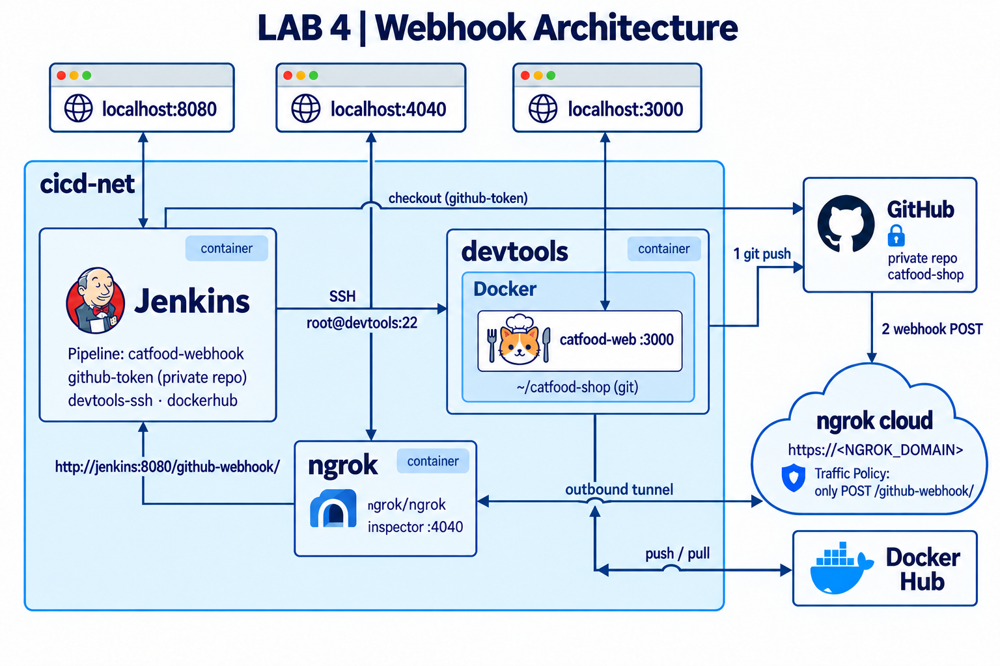</a>

*แผนภาพ A — container 3 ตัวบน network `cicd-net`: `jenkins` (`localhost:8080`), `devtools` (ร้าน `catfood-web` ที่ `localhost:3000`) และ **`ngrok`** ตัวใหม่ (inspector `localhost:4040`) ที่ต่อ tunnel ขาออกไป ngrok cloud · ① `git push` จาก devtools ขึ้น private repo ② GitHub ส่ง webhook POST ไปที่ `https://<NGROK_DOMAIN>` ผ่าน Traffic Policy แล้วลง tunnel มาที่ `http://jenkins:8080/github-webhook/` · Jenkins ใช้ credential `github-token` checkout private repo แล้ว SSH สั่ง devtools เหมือน LAB 3 · โดเมนในภาพเป็น placeholder*

<a href="./images/lab4_diagram_b_webhook_flow.png">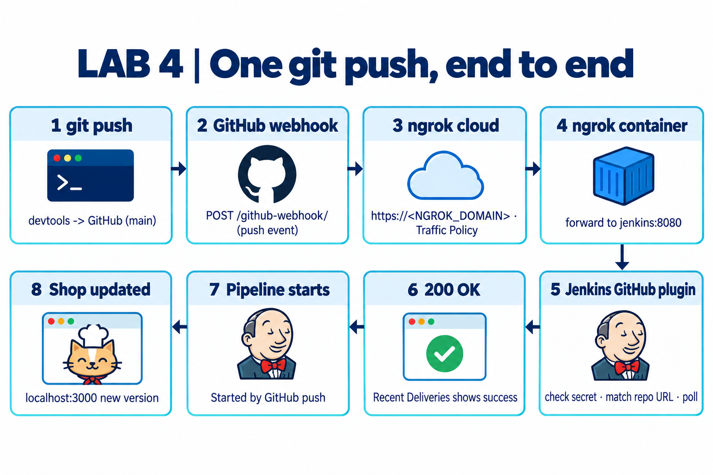</a>

*แผนภาพ B — git push หนึ่งครั้ง ตั้งแต่ต้นจนจบ: 1 `git push` (devtools → GitHub branch `main`) → 2 GitHub ส่ง `POST /github-webhook/` (push event) → 3 ngrok cloud ตรวจ Traffic Policy → 4 container ngrok ส่งต่อ `jenkins:8080` → 5 GitHub plugin ของ Jenkins ตรวจ secret, หา job ที่ URL ของ repo ตรงกัน แล้ว poll repo → 6 ตอบ `200 OK` (GitHub ขึ้น ✓ ใน Recent Deliveries) → 7 Pipeline เริ่ม "Started by GitHub push" → 8 ร้านที่ `localhost:3000` เป็นเวอร์ชันใหม่*

<a href="./images/lab4_diagram_c_pipeline.png">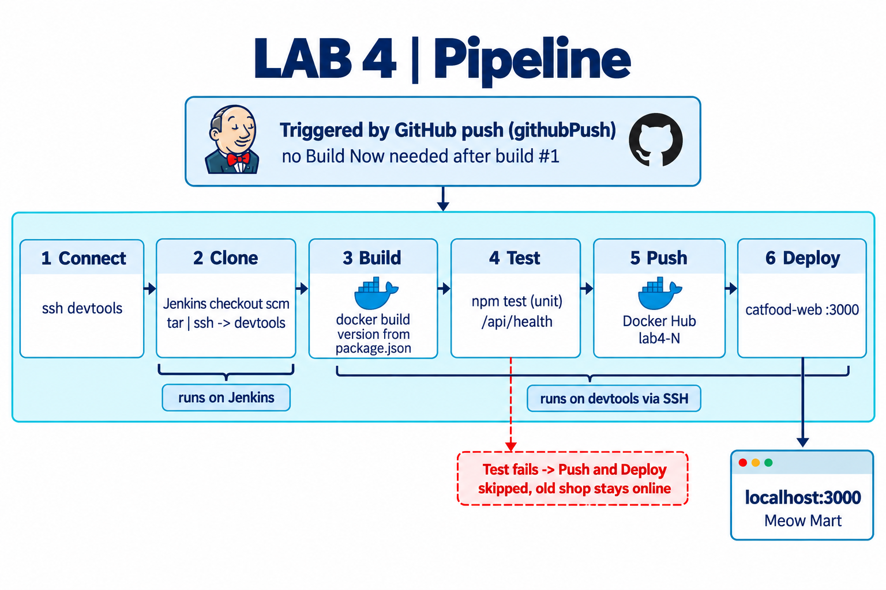</a>

*แผนภาพ C — Pipeline 6 stage ของ LAB 4 เริ่มจาก `githubPush()` (หลัง build #1 ไม่ต้องกด Build Now อีก) · **Clone** ทำบน Jenkins (`checkout scm` แล้ว `tar | ssh` ส่งซอร์สไป devtools) · Build / Test / Push / Deploy รันบน devtools ผ่าน SSH · Build อ่านเวอร์ชันจาก `package.json` · Test มี `npm test` (unit test) และ `/api/health` · ถ้า Test ไม่ผ่าน Push และ Deploy ถูกข้าม ร้านเดิมยังเปิดอยู่*

| container | image | รันอยู่บน | เข้าจากเครื่องเราทาง |
|---|---|---|---|
| `jenkins` (จาก LAB 3) | `jenkins/jenkins:lts-jdk21` | เครื่องของเรา (network `cicd-net`) | `localhost:8080` |
| `devtools` (จาก LAB 3) | `devtools:2569_1` | เครื่องของเรา (network `cicd-net`) | `localhost:2222` → SSH · `localhost:3000` → ร้าน |
| **`ngrok`** (ใหม่) | `ngrok/ngrok:latest` | เครื่องของเรา (network `cicd-net`) | `localhost:4040` → ngrok inspector (เปิดเฉพาะเครื่องเรา) |
| `catfood-test`, `catfood-web` | `<DOCKER_USER>/catfood-shop:lab4-N` | Docker **ข้างใน** `devtools` | `localhost:3000` → ร้าน |

**สิ่งที่เปลี่ยนจาก LAB 3**

| | LAB 3 | LAB 4 |
|---|---|---|
| ใครเริ่ม build | คนกด Build with Parameters | `git push` → webhook (กด Build Now แค่ครั้งแรกครั้งเดียว) |
| repository | repo สาธารณะของรายวิชา · Credentials none | **private repo `catfood-shop` ของเราเอง** · Credentials `github-token` |
| Clone | devtools `git clone --sparse` | Jenkins `checkout scm` → `tar \| ssh` → devtools (devtools ไม่ต้องรู้ token) |
| เวอร์ชัน | parameter `APP_VERSION` | `"version"` ใน `package.json` |
| Test | health grep | **`npm test` (unit test ข้อมูลสินค้า)** + health grep ที่ตรวจ commit ด้วย |
| tag บน Docker Hub | `lab3-N` | `lab4-N` |
| Script Path | `04_Jenkins/.../003_.../Jenkinsfile` | `Jenkinsfile` (root ของ private repo) |

> **กติกา:** หลังขั้นที่ 4 **ห้ามกด Build Now เอง** ทุก build ต้องเกิดจาก `git push` · และเหมือน LAB 3 ห้ามพิมพ์ `docker build`/`docker push` ของร้านเอง

> ⚠️ **ความปลอดภัย:** ngrok ทำให้ Jenkins (รหัส `admin/admin2569` ที่ทุกคนรู้) เข้าถึงได้จาก internet · **ต้อง**รัน ngrok พร้อม Traffic Policy ตามขั้นที่ 5 เท่านั้น และ `docker rm -f ngrok` ทุกครั้งที่เลิกทำแล็บ (ขั้นที่ 11) · ห้ามแชร์ authtoken ของ ngrok, token ของ GitHub หรือ webhook secret ในแชต/ภาพหน้าจอ/commit

## ขั้นที่ 0 — สิ่งที่ต้องมี

- ทำ **LAB 3** สำเร็จแล้ว: container `jenkins` และ `devtools` บน `cicd-net`, plugin **SSH Agent**, credential **`devtools-ssh`** และ **`dockerhub`** · **ใช้ของเดิมทั้งหมด ห้ามสร้างใหม่**
- บัญชี **GitHub** (ใช้สร้าง private repo) · บัญชี **ngrok** ฟรี (สมัครในขั้นที่ 5 ไม่ต้องใช้บัตรเครดิต) · บัญชี **Docker Hub** เดิม
- port `8080`, `2222`, `3000` เป็นของ LAB 3 · port **`4040`** ต้องว่าง
- ห้ามรัน job `docker-build-push` ของ LAB 3 พร้อมกับ job ของแล็บนี้ (ใช้ชื่อ container `catfood-web` และ port `3000` เดียวกัน)
- สัญลักษณ์: 🖥️ **host** = terminal ของเครื่องเราที่ใช้ `docker` ได้ (เหมือน LAB 3) · 💻 **devtools** = shell ข้างใน container `devtools` · 🌐 = เบราว์เซอร์
- ไฟล์ในโฟลเดอร์แล็บนี้ (`04_Jenkins/001_Jenikin/004_LAB_Webhook_Trigger/`):

```text
004_LAB_Webhook_Trigger/
├── catfood-shop/                ← ซอร์สร้าน v2.0.0 → คัดลอกไปทำเป็น private repo ของเรา (ขั้นที่ 3)
│   ├── Jenkinsfile              ← Pipeline ของแล็บนี้ (ขั้นที่ 4.5) อยู่ที่ root ของ repo
│   ├── package.json             ← "version": "2.0.0" · scripts.test = node --test
│   ├── tests/products.test.mjs  ← unit test ข้อมูลสินค้า (stage Test)
│   ├── data/products.js         ← ราคา/ชื่อสินค้า + ข้อความแบนเนอร์ promo (แก้ไฟล์นี้ในขั้นที่ 7, 9)
│   └── Dockerfile, app/, public/ ...
├── ngrok/
│   ├── traffic-policy.yml       ← ด่านกรอง: ผ่านเฉพาะ POST /github-webhook/ (ขั้นที่ 5)
│   └── ngrok.example.yml        ← (ทางเลือก) config แบบไฟล์ แทน flag ยาว ๆ
└── .gitignore                   ← กัน ngrok/ngrok.yml (มี authtoken) ไม่ให้ถูก commit
```

## ขั้นที่ 1 — ตรวจของจาก LAB 3 (🖥️ host + 🌐)

```bash
docker ps --filter name=jenkins --filter name=devtools --format "table {{.Names}}\t{{.Status}}\t{{.Ports}}"
docker network inspect cicd-net --format "{{range .Containers}}{{.Name}} {{end}}"
```

✅ `jenkins` และ `devtools` เป็น `Up ...` และ network `cicd-net` มีทั้งสองตัว · ถ้าหยุดอยู่ใช้ `docker start jenkins devtools` (ห้ามลบหรือสร้างใหม่)

🌐 เปิด http://localhost:8080 → login `admin` / `admin2569` → ⚙️ **Manage Jenkins → Plugins → Installed plugins** ค้นทีละคำ:

<a href="./images/lab4_jk_01a_plugin_github.png">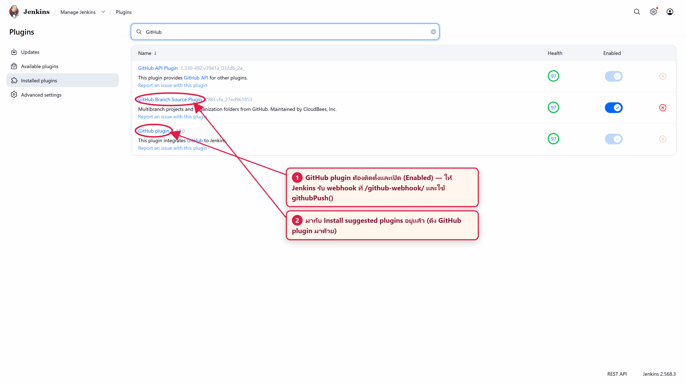</a>

*ภาพที่ 1 ค้น `GitHub`: ① **GitHub plugin** ต้องติดตั้งและเปิด (Enabled) — plugin นี้ทำให้ Jenkins รับ webhook ที่ `/github-webhook/` และใช้ `githubPush()` ได้ ② มากับ **Install suggested plugins** อยู่แล้ว (GitHub Branch Source ดึง GitHub plugin มาด้วย) · ถ้าไม่มี ให้ติดตั้ง **GitHub** จาก Available plugins แบบเดียวกับ SSH Agent ใน LAB 3 ข้อ 2.7*

<a href="./images/lab4_jk_01b_plugin_sshagent.png">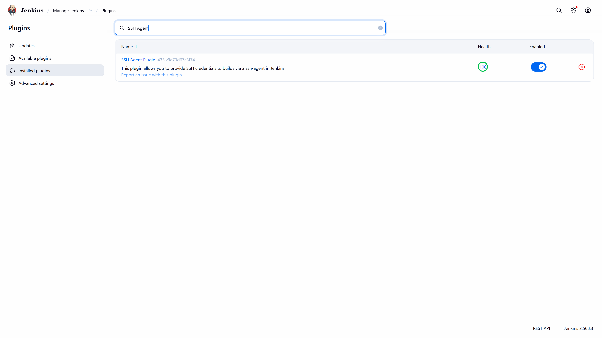</a>

*ภาพที่ 2 ค้น `SSH Agent`: ① **SSH Agent Plugin** จาก LAB 3 ยังใช้ต่อ — ทุก stage สั่ง devtools ผ่าน `sshagent`*

## ขั้นที่ 2 — สร้าง private repo และ fine-grained token (🌐 GitHub)

### 2.1) สร้าง repository `catfood-shop` แบบ Private

เปิด https://github.com/new แล้วกรอกตามภาพ:

<a href="./images/lab4_gh_01a_new_repo_private.png">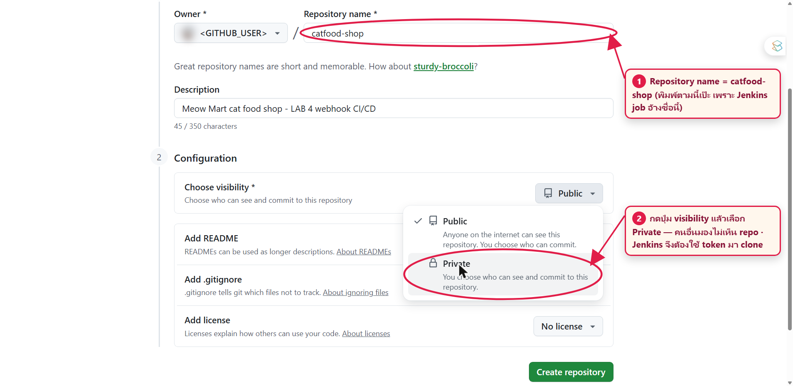</a>

*ภาพที่ 3 ① **Repository name** = `catfood-shop` (สะกดตรงตัว เพราะ job ใน Jenkins อ้างชื่อนี้) ② กดปุ่ม visibility แล้วเลือก **Private** — คนอื่นมองไม่เห็น repo นี้ Jenkins จึงต้องใช้ token มา clone · Owner ในภาพปิดเป็น `<GITHUB_USER>`*

<a href="./images/lab4_gh_01b_new_repo_create.png">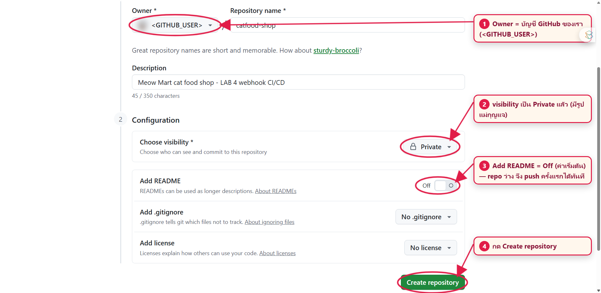</a>

*ภาพที่ 4 ① Owner = บัญชีของเรา (`<GITHUB_USER>`) ② visibility เป็น **Private** (รูปแม่กุญแจ) ③ **Add README = Off** (ค่าเริ่มต้น) — repo ว่างจึง push ครั้งแรกได้ทันที · .gitignore และ license ก็ไม่ต้องเลือก ④ กด **Create repository***

### 2.2) สร้าง fine-grained personal access token

token นี้ใช้สองที่: (1) `git push` จาก devtools (2) credential `github-token` ให้ Jenkins clone private repo · **ไม่ใช่รหัสผ่านบัญชี GitHub**

มุมขวาบน รูปโปรไฟล์ → **Settings** → เมนูซ้ายล่างสุด **Developer settings** → **Personal access tokens** → **Fine-grained tokens** → **Generate new token**

> 🔐 GitHub อาจขึ้นหน้า **Confirm access** (sudo mode) ให้ยืนยันตัวตน (ใส่รหัสผ่าน / passkey / รหัสจากแอป) ก่อนเข้าหน้านี้ — เป็นเรื่องปกติ ยืนยันแล้วทำต่อ

<a href="./images/lab4_gh_03a_pat_name_expiry.png">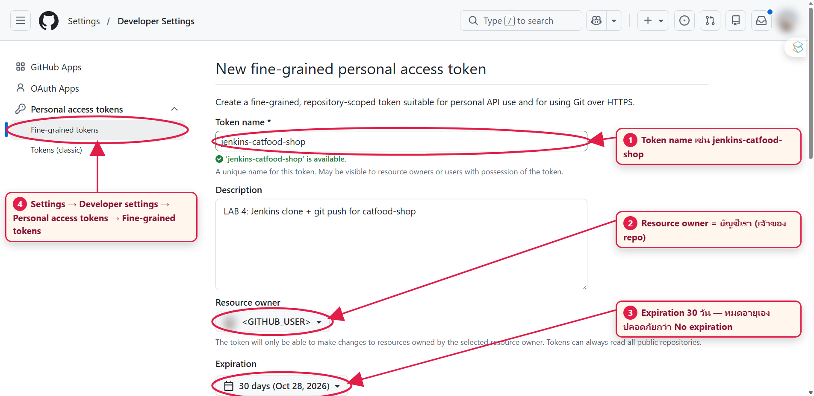</a>

*ภาพที่ 5 ④ เส้นทาง **Settings → Developer settings → Personal access tokens → Fine-grained tokens** · ① **Token name** เช่น `jenkins-catfood-shop` ② **Resource owner** = บัญชีเรา (เจ้าของ repo) ③ **Expiration 30 days** — หมดอายุเอง ปลอดภัยกว่า No expiration · ชื่อบัญชีในภาพปิดเป็น `<GITHUB_USER>`*

<a href="./images/lab4_gh_03b_pat_repo_access.png">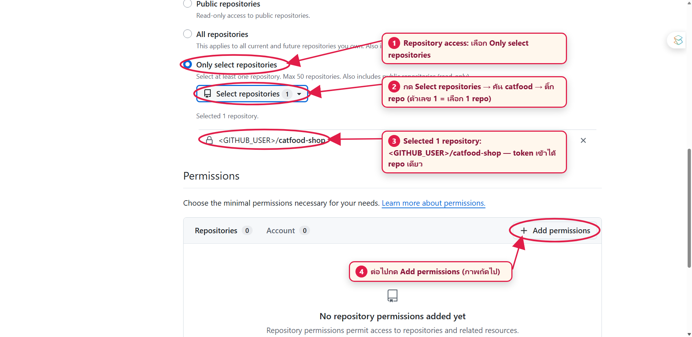</a>

*ภาพที่ 6 ① **Repository access** เลือก **Only select repositories** ② กด **Select repositories** → ค้น `catfood` → ติ๊ก repo (ตัวเลข `1` = เลือก 1 repo) ③ ต้องเห็น `<GITHUB_USER>/catfood-shop` — token เข้าได้ repo เดียว ④ ต่อไปกด **Add permissions***

<a href="./images/lab4_gh_03c_pat_permissions.png">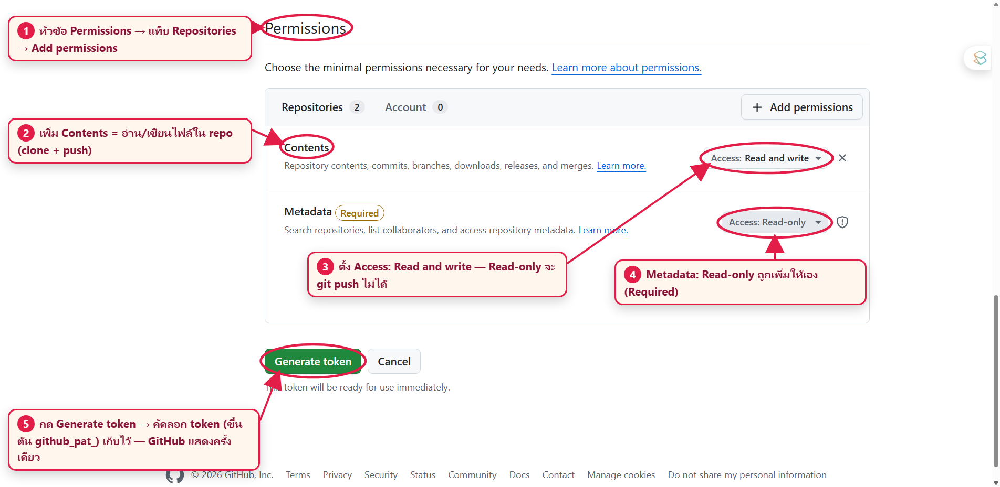</a>

*ภาพที่ 7 ① หัวข้อ **Permissions** แท็บ **Repositories** → **Add permissions** ② เพิ่ม **Contents** (อ่าน/เขียนไฟล์ใน repo = clone + push) ③ ตั้ง **Access: Read and write** — ถ้าเป็น Read-only จะ `git push` ไม่ได้ ④ **Metadata: Read-only** ถูกเพิ่มให้เอง (Required) ⑤ กด **Generate token** แล้วคัดลอก token (ขึ้นต้น `github_pat_...`) เก็บไว้ทันที — GitHub แสดงครั้งเดียว*

- ในเอกสารนี้เรียก token นี้ว่า `<GITHUB_TOKEN>` · ไม่ต้องให้สิทธิ์ Webhooks หรือ Administration เพราะเราสร้าง webhook ด้วยมือในหน้าเว็บ (ขั้นที่ 6)

## ขั้นที่ 3 — push ซอร์สร้านขึ้น private repo (💻 devtools)

🖥️ host → เข้า shell ของ devtools:

```bash
docker exec -it devtools bash
```

💻 devtools — ดึงไฟล์แล็บ (ถ้าเคย clone repository รายวิชาไว้ที่ `~/labwork/DevTools` ตั้งแต่ LAB 1–2 ให้ `pull` อย่างเดียว) แล้วคัดลอกโฟลเดอร์ `catfood-shop` ออกมาเป็น repo ของเรา:

```bash
mkdir -p ~/labwork
git clone --depth 1 <COURSE_REPO_URL> ~/labwork/DevTools     # URL ของ repository รายวิชา (อันเดียวกับ LAB 1–3) · ถ้ามีแล้ว: git -C ~/labwork/DevTools pull
cp -r ~/labwork/DevTools/04_Jenkins/001_Jenikin/004_LAB_Webhook_Trigger/catfood-shop ~/catfood-shop
cd ~/catfood-shop
ls -a
```

✅ `ls -a` เห็น `Jenkinsfile`, `package.json`, `tests`, `data`, `.gitignore`, `.dockerignore`

ตั้งค่า git ครั้งเดียว แล้วสร้าง repo และ push:

```bash
git config --global user.name "<GITHUB_USER>"
git config --global user.email "<GITHUB_USER>@users.noreply.github.com"
git config --global credential.helper 'cache --timeout=7200'
git init -b main
git add .
git commit -m "Meow Mart v2.0.0 + Jenkinsfile"
git remote add origin https://github.com/<GITHUB_USER>/catfood-shop.git
git push -u origin main
```

- ตอน `git push` git ถาม **Username** → พิมพ์ `<GITHUB_USER>` · **Password** → วาง `<GITHUB_TOKEN>` (ไม่ใช่รหัสผ่านบัญชี · ตอนวางจะไม่เห็นตัวอักษร เป็นเรื่องปกติ)
- `<GITHUB_USER>` ต้องพิมพ์**ตัวพิมพ์เล็ก/ใหญ่ตรงกับชื่อบัญชีบน GitHub** ทุกที่ (URL ของ remote, credential ใน Jenkins, Repository URL ของ job) ไม่งั้นเจออาการในตารางแก้ปัญหา
- `users.noreply.github.com` กันอีเมลจริงไปอยู่ใน commit และใน payload ของ webhook · `credential.helper 'cache --timeout=7200'` จำ token ไว้ใน RAM 2 ชั่วโมง (ไม่เขียนลงดิสก์) push ครั้งต่อไปในแล็บจึงไม่ถามอีก
- `git init -b main` ตั้งชื่อ branch เป็น `main` ให้ตรงกับ Branch Specifier `*/main` ของ job

<a href="./images/lab4_term_01_git_push_first.png">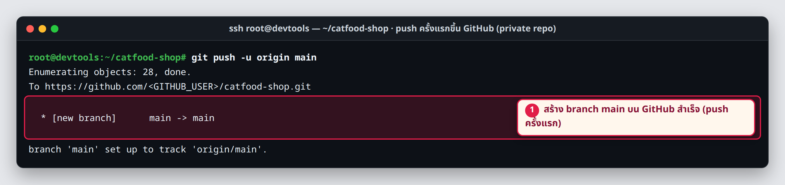 main"></a>

*ภาพที่ 8 ผลจริงของ `git push -u origin main` · ① `* [new branch] main -> main` = สร้าง branch `main` บน GitHub สำเร็จ (push ครั้งแรก) · ชื่อบัญชีใน URL ปิดเป็น `<GITHUB_USER>`*

🌐 refresh หน้า repo บน GitHub:

<a href="./images/lab4_gh_02_repo_private.png">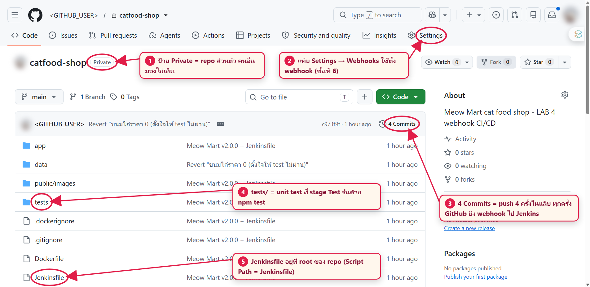</a>

*ภาพที่ 9 หน้า repo ของเรา (ภาพถ่ายตอนจบแล็บ จึงมี 4 commits แล้ว ของเราตอนนี้มี 1) · ① ป้าย **Private** ② แท็บ **Settings → Webhooks** ใช้ในขั้นที่ 6 ③ จำนวน commit = จำนวนครั้งที่ push ในแล็บ ทุกครั้ง GitHub ยิง webhook ไป Jenkins ④ `tests/` = unit test ที่ stage Test รันด้วย `npm test` ⑤ `Jenkinsfile` อยู่ที่ root ของ repo (Script Path = `Jenkinsfile`) · ชื่อบัญชีปิดเป็น `<GITHUB_USER>`*

## ขั้นที่ 4 — Jenkins: credential `github-token`, job `catfood-webhook`, Build Now ครั้งแรก (🌐)

### 4.1) credential `github-token`

เปิดหน้าเพิ่ม credential ตามเส้นทางเดียวกับ LAB 3 ข้อ 3.0: **⚙️ Manage Jenkins → Credentials → System → Global → + Add Credentials**

<a href="./images/lab4_jk_02a_cred_type.png">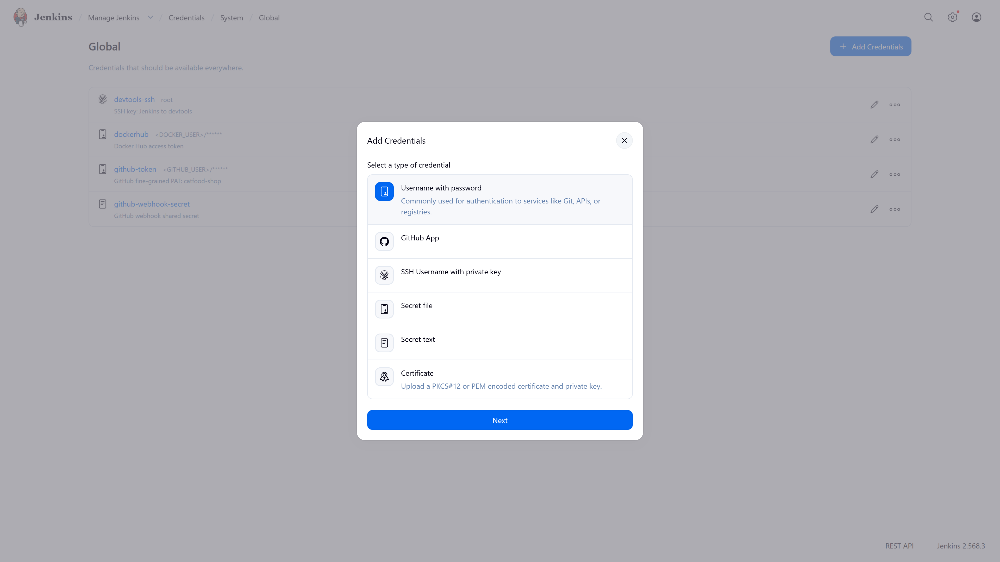</a>

*ภาพที่ 10 หน้าต่าง **Add Credentials** → เลือก **Username with password** → **Next** · (ด้านหลังคือรายการ credential ตอนจบแล็บ ของเราตอนนี้ยังมีแค่ `devtools-ssh` และ `dockerhub`)*

| ช่อง | ค่า |
|---|---|
| Scope | Global |
| Username | `<GITHUB_USER>` (ตัวพิมพ์เล็ก/ใหญ่ตรงกับบัญชี GitHub) |
| Treat username as secret | **ไม่ติ๊ก** — ถ้าติ๊ก Jenkins จะซ่อนชื่อบัญชีเป็น `****` ใน console รวมถึงใน URL ของ repo อ่าน log ยาก |
| Password | `<GITHUB_TOKEN>` (ขึ้นต้น `github_pat_...`) |
| ID | `github-token` |
| Description | `GitHub fine-grained PAT: catfood-shop` |

<a href="./images/lab4_jk_02b_cred_github_token.png">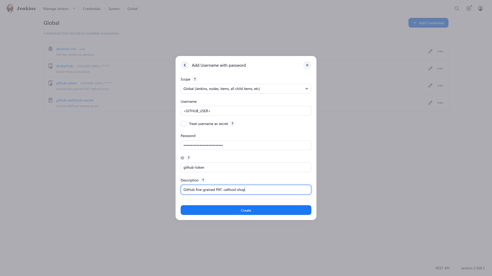</a>

*ภาพที่ 11 ฟอร์มของ `github-token`: Username `<GITHUB_USER>` · **Treat username as secret ไม่ติ๊ก** · Password เป็นจุด (token) · ID `github-token` · Description `GitHub fine-grained PAT: catfood-shop` → **Create** · ชื่อบัญชีในภาพปิดเป็น placeholder*

### 4.2) New Item → Pipeline `catfood-webhook`

<a href="./images/lab4_jk_newitem.png">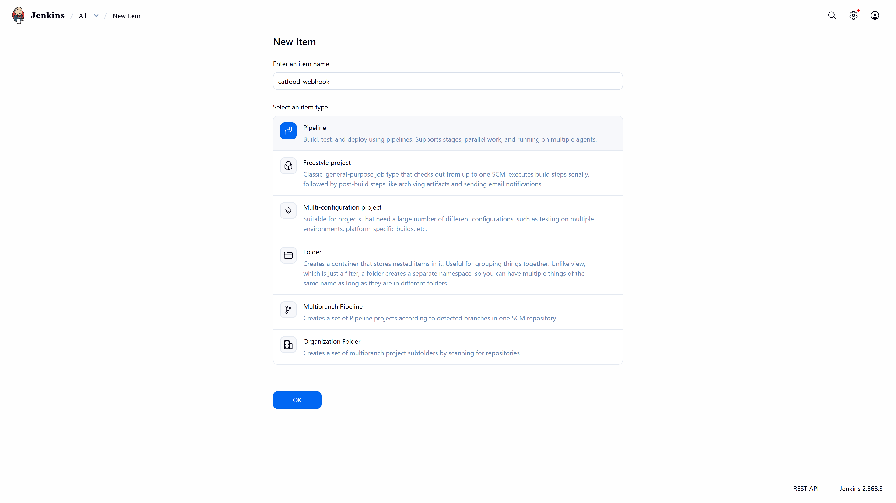</a>

*ภาพที่ 12 Dashboard → **New Item**: ① ชื่อ `catfood-webhook` ② เลือก **Pipeline** → กด **OK***

### 4.3) Triggers: ติ๊ก GitHub hook trigger for GITScm polling

<a href="./images/lab4_jk_04_job_trigger.png">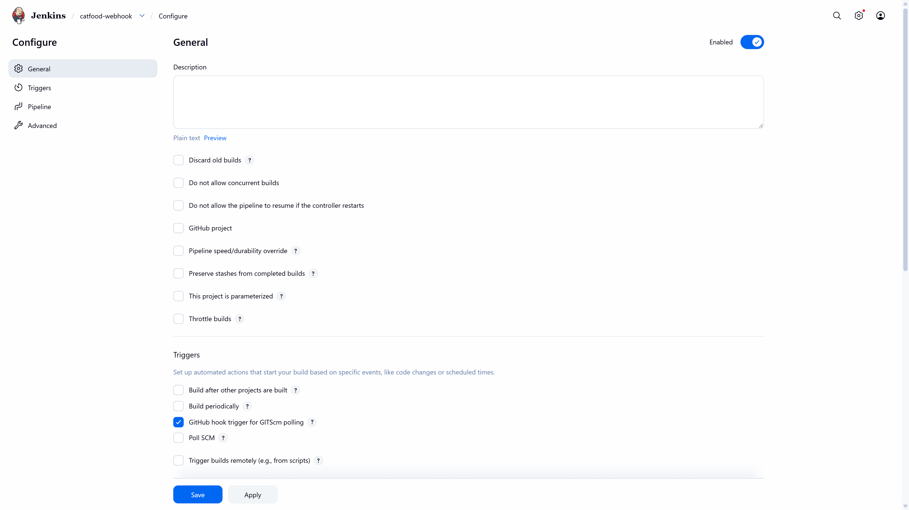</a>

*ภาพที่ 13 ส่วน **Triggers**: ① ติ๊ก **GitHub hook trigger for GITScm polling** — เมื่อ webhook มาถึง Jenkins จะไปเช็ก repo แล้ว build ถ้ามี commit ใหม่ ② **ไม่ต้อง**ติ๊ก **Poll SCM** — ไม่ต้องให้ Jenkins วนถาม GitHub เอง เพราะ GitHub แจ้งมาเอง*

### 4.4) Pipeline: Pipeline script from SCM + private repo

| ช่อง | ค่า |
|---|---|
| Definition | **Pipeline script from SCM** |
| SCM | **Git** |
| Repository URL | `https://github.com/<GITHUB_USER>/catfood-shop.git` |
| Credentials | **`<GITHUB_USER>/****** (GitHub fine-grained PAT: catfood-shop)`** = `github-token` |
| Branch Specifier | `*/main` |
| Script Path | `Jenkinsfile` |
| Lightweight checkout | ติ๊ก (ค่าเริ่มต้น) |

<a href="./images/lab4_jk_05b_scm_with_cred.png">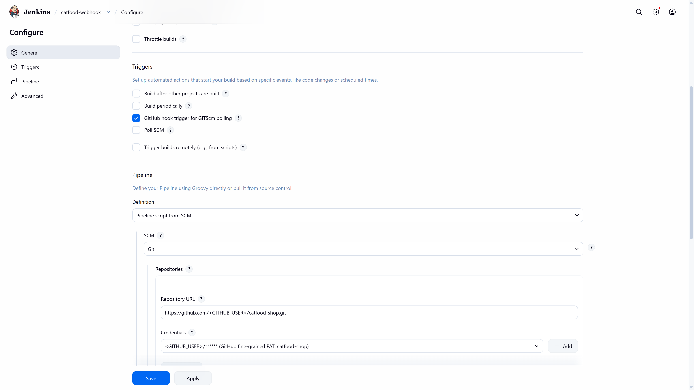</a>

*ภาพที่ 14 ② **Repository URL** = `https://github.com/<GITHUB_USER>/catfood-shop.git` (ตัวพิมพ์เล็ก/ใหญ่ของชื่อบัญชีต้องตรงกับ GitHub) ③ **Credentials** = `github-token` — repo เป็น private ถ้าเลือก `- none -` จะขึ้น error สีแดงใต้ช่อง URL (`Failed to connect to repository ...`) · เลือก credential แล้วข้อความแดงต้องหายไป · ชื่อบัญชีในภาพปิดเป็น placeholder*

<a href="./images/lab4_jk_05c_branch_script.png">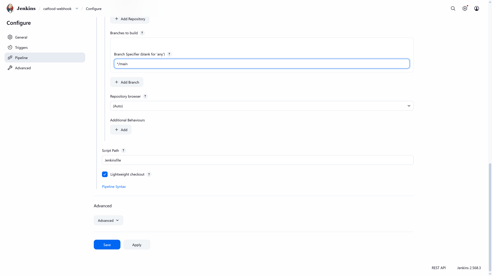</a>

*ภาพที่ 15 ① **Branch Specifier** = `*/main` ② **Script Path** = `Jenkinsfile` (ไฟล์อยู่ที่ root ของ repo) ③ **Lightweight checkout** ติ๊กไว้ (ค่าเริ่มต้น) → กด **Save***

<a href="./images/lab4_jk_06_job_before_build.png">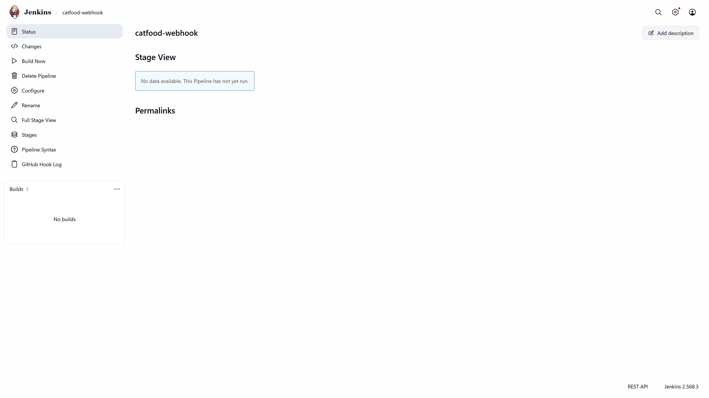</a>

*ภาพที่ 16 หน้า job หลัง Save: ยังไม่มี build (`No builds`) · เมนูซ้ายมี **Build Now** และ **GitHub Hook Log** (ปรากฏเพราะติ๊ก trigger ในข้อ 4.3)*

### 4.5) อ่าน `Jenkinsfile` ทั้งไฟล์

โค้ดด้านล่างคือ [`catfood-shop/Jenkinsfile`](./catfood-shop/Jenkinsfile) **ทั้งไฟล์ ตรงตัวทุกบรรทัด** (ไฟล์เดียวกับที่อยู่ใน private repo ของเรา) · รูปแบบ `sshagent` + `$SSH_DEVTOOLS`, heredoc `<<'EOF'` และ stage Push/Deploy เหมือน LAB 3 ข้อ 4.3 — ด้านล่างอธิบาย**เฉพาะส่วนที่ต่างจาก LAB 3**

```groovy
// LAB 4 — git push → GitHub webhook → ngrok → Jenkins: Connect → Clone → Build → Test → Push → Deploy
// ต้องมี: plugin "SSH Agent" และ "GitHub" · credential devtools-ssh, dockerhub (จาก LAB 3) และ github-token
// Jenkins clone private repo เอง แล้วส่งซอร์สไป devtools ทาง SSH: devtools ไม่ต้องรู้ token ของ GitHub

pipeline {
  agent any

  triggers {
    githubPush()                // รับ webhook จาก GitHub (= ติ๊ก GitHub hook trigger for GITScm polling)
  }

  options {
    disableConcurrentBuilds()   // push ติดกันหลายครั้งให้รอคิว: ทุก build ใช้โฟลเดอร์ ชื่อ container และ port 3000 เดียวกัน
    skipDefaultCheckout()       // checkout เองใน stage Clone เพื่อเก็บเลข commit
  }

  environment {
    // accept-new: จำ host key ของ devtools ครั้งแรก ถ้าเปลี่ยนภายหลังจะปฏิเสธ · BatchMode: ไม่ถามรหัสผ่าน
    SSH_DEVTOOLS = 'ssh -o StrictHostKeyChecking=accept-new -o BatchMode=yes root@devtools'
    SRC_DIR      = '/root/lab4-work/catfood-shop'   // ซอร์สที่ Jenkins ส่งไปให้ devtools build
    AUTH_DIR     = '/root/lab4-work/docker-auth'    // ไฟล์ login Docker Hub ชั่วคราวบน devtools
    IMAGE        = "catfood-shop:lab4-${env.BUILD_NUMBER}"
    // APP_VERSION และ COMMIT ตั้งใน stage Clone ห้ามประกาศซ้ำที่นี่ (ค่าใน environment จะทับค่าที่ตั้งใน script)
  }

  stages {
    stage('Connect') {
      steps {
        sshagent(credentials: ['devtools-ssh']) {
          sh '$SSH_DEVTOOLS "hostname && whoami && docker --version"'
        }
      }
    }

    stage('Clone') {
      steps {
        script {
          // Jenkins clone private repo ด้วย credential github-token ที่ตั้งไว้ใน job (commit เดียวกับ Jenkinsfile)
          def scmVars = checkout scm
          env.COMMIT = scmVars.GIT_COMMIT.substring(0, 7)
          // เวอร์ชันมาจาก package.json ของ repo (webhook ไม่มีคนกรอก parameter)
          env.APP_VERSION = sh(returnStdout: true,
                               script: 'grep -m1 \'"version"\' package.json | cut -d \'"\' -f4').trim()
          // ค่านี้ถูกส่งต่อเข้า shell บน devtools จึงต้องเป็นตัวเลขกับจุดเท่านั้น
          if (!(env.APP_VERSION ==~ /[0-9]+\.[0-9]+\.[0-9]+/)) {
            error "version ใน package.json ต้องเป็นรูปแบบ X.Y.Z (ได้ '${env.APP_VERSION}')"
          }
          echo "commit ${env.COMMIT} · version ${env.APP_VERSION}"
        }
        sshagent(credentials: ['devtools-ssh']) {
          // ส่งซอร์ส (ไม่รวม .git) เป็น tar ผ่าน SSH ไปแตกบน devtools
          // /bin/sh ของ Jenkins ไม่มี pipefail: บรรทัดสุดท้ายตรวจว่าไฟล์ไปถึงจริง
          sh '''
            $SSH_DEVTOOLS "rm -rf $SRC_DIR && mkdir -p $SRC_DIR"
            tar --exclude=.git -cf - . | $SSH_DEVTOOLS "tar -xf - -C $SRC_DIR"
            $SSH_DEVTOOLS "ls $SRC_DIR && test -f $SRC_DIR/package.json"
            '''.stripIndent()
        }
      }
    }

    stage('Build') {
      steps {
        sshagent(credentials: ['devtools-ssh']) {
          sh '''
            $SSH_DEVTOOLS "SRC_DIR=$SRC_DIR IMAGE=$IMAGE APP_VERSION=$APP_VERSION BUILD_NUMBER=$BUILD_NUMBER COMMIT=$COMMIT bash -ex" <<'EOF'
              cd "$SRC_DIR"
              docker build \
                --build-arg APP_VERSION="$APP_VERSION" \
                --build-arg BUILD_NUMBER="$BUILD_NUMBER" \
                --build-arg GIT_COMMIT="$COMMIT" \
                --build-arg BUILD_TIME="$(date -u +%Y-%m-%dT%H:%M:%SZ)" \
                -t "$IMAGE" .
              docker image ls "$IMAGE"
            EOF
            '''.stripIndent()
        }
      }
    }

    stage('Test') {
      steps {
        sshagent(credentials: ['devtools-ssh']) {
          sh '''
            $SSH_DEVTOOLS "IMAGE=$IMAGE APP_VERSION=$APP_VERSION BUILD_NUMBER=$BUILD_NUMBER COMMIT=$COMMIT bash -ex" <<'EOF'
              docker run --rm "$IMAGE" npm test --silent   # ① unit test ข้อมูลสินค้า (tests/products.test.mjs)
              docker rm -f catfood-test || true             # ② smoke test: รันจริงแล้วถาม /api/health
              docker run -d --name catfood-test "$IMAGE"
              trap 'docker rm -f catfood-test' EXIT         # ลบ container ทดสอบเสมอ แม้ test ไม่ผ่าน
              for i in $(seq 1 30); do
                [ "$(docker inspect -f '{{.State.Health.Status}}' catfood-test)" = healthy ] && break
                sleep 1
              done
              docker exec catfood-test wget -qO- http://127.0.0.1:3000/api/health |
                tr -d '"' | grep -F "version:$APP_VERSION,build:$BUILD_NUMBER,commit:$COMMIT,"
            EOF
            '''.stripIndent()
        }
      }
    }

    stage('Push') {
      steps {
        withCredentials([usernamePassword(credentialsId: 'dockerhub',
                         usernameVariable: 'HUB_USER', passwordVariable: 'HUB_TOKEN')]) {
          sshagent(credentials: ['devtools-ssh']) {
            // token ส่งทาง stdin เข้า --password-stdin: ไม่อยู่ใน command line และ console
            sh '''
              set +x
              echo "$HUB_TOKEN" | $SSH_DEVTOOLS "umask 077; docker --config $AUTH_DIR login -u $HUB_USER --password-stdin"
              set -x
              $SSH_DEVTOOLS docker tag $IMAGE $HUB_USER/$IMAGE
              $SSH_DEVTOOLS docker --config $AUTH_DIR push $HUB_USER/$IMAGE
              $SSH_DEVTOOLS docker image rm $IMAGE
              '''.stripIndent()
          }
        }
      }
    }

    stage('Deploy') {
      steps {
        // ใช้ HUB_USER ตั้งชื่อ image และใช้ไฟล์ login จาก stage Push (post ลบให้ตอนจบ)
        withCredentials([usernamePassword(credentialsId: 'dockerhub',
                         usernameVariable: 'HUB_USER', passwordVariable: 'HUB_TOKEN')]) {
          sshagent(credentials: ['devtools-ssh']) {
            sh '''
              $SSH_DEVTOOLS "AUTH_DIR=$AUTH_DIR IMAGE=$HUB_USER/$IMAGE APP_VERSION=$APP_VERSION BUILD_NUMBER=$BUILD_NUMBER COMMIT=$COMMIT bash -ex" <<'EOF'
                docker image rm "$IMAGE"                  # ลบ image ในเครื่อง เพื่อให้ pull มาจาก Docker Hub จริง
                docker --config "$AUTH_DIR" pull "$IMAGE"
                docker rm -f catfood-web || true          # ลบร้านเวอร์ชันเดิม (ของ LAB 3 หรือ build ก่อน)
                docker run -d --name catfood-web --restart unless-stopped -p 3000:3000 "$IMAGE"
                for i in $(seq 1 30); do
                  [ "$(docker inspect -f '{{.State.Health.Status}}' catfood-web)" = healthy ] && break
                  sleep 1
                done
                curl -fsS http://localhost:3000/api/health |
                  tr -d '"' | grep -F "version:$APP_VERSION,build:$BUILD_NUMBER,commit:$COMMIT,"
              EOF
              '''.stripIndent()
          }
        }
      }
    }
  }

  post {
    success {
      echo "เปิดร้านได้ที่ http://localhost:3000 (v${env.APP_VERSION} build #${env.BUILD_NUMBER} commit ${env.COMMIT})"
    }
    always {
      // ลบไฟล์ login Docker Hub บน devtools เสมอ ทั้งตอนสำเร็จและตอน build ล้มกลางทาง
      sshagent(credentials: ['devtools-ssh']) {
        sh '$SSH_DEVTOOLS "rm -rf $AUTH_DIR" || true'
      }
    }
  }
}
```

**ส่วนที่ต่างจาก LAB 3**

| ส่วน | LAB 4 ทำอะไร | รันที่ |
|---|---|---|
| `triggers { githubPush() }` | ประกาศใน**โค้ด**ว่า job นี้รับ webhook จาก GitHub (ผลเท่ากับติ๊ก checkbox ในข้อ 4.3) · Jenkins อ่านบรรทัดนี้หลัง build แรก ถ้าลืมติ๊ก checkbox build #1 จะติ๊กให้เอง | Jenkins |
| ไม่มี `parameters` | webhook ไม่มีคนกรอกค่า → เวอร์ชันอ่านจาก `package.json` แทน | — |
| `environment` มี `SRC_DIR` | โฟลเดอร์บน devtools ที่รับซอร์สจาก Jenkins (`/root/lab4-work/catfood-shop`) · comment เตือนว่าห้ามประกาศ `APP_VERSION`/`COMMIT` ที่นี่ เพราะค่าใน `environment` จะทับค่าที่ stage Clone ตั้ง | — |
| Connect | เหลือแค่ทดสอบ SSH (`hostname && whoami && docker --version`) · การตรวจเวอร์ชันย้ายไป Clone | Jenkins → devtools |
| **Clone** — `checkout scm` | Jenkins clone private repo เองด้วย credential ใน job (`github-token`) ได้ commit **เดียวกับ** `Jenkinsfile` ที่กำลังรัน · คืน map ที่มี `GIT_COMMIT` → ตัดเหลือ 7 ตัวเป็น `env.COMMIT` | Jenkins |
| **Clone** — อ่านเวอร์ชัน | `grep -m1 '"version"' package.json \| cut -d '"' -f4` ได้ `2.0.0` → `env.APP_VERSION` · ตรวจ `==~ X.Y.Z` แบบ LAB 3 (กันการแทรกคำสั่งเข้า shell) · `echo "commit ... · version ..."` | Jenkins |
| **Clone** — `tar \| ssh` | ลบ `$SRC_DIR` เดิม → `tar --exclude=.git -cf - .` ส่งซอร์ส (ไม่รวม `.git` จึงไม่มี token ติดไป) ทาง stdin ของ SSH ไปแตกบน devtools · `/bin/sh` ของ Jenkins ไม่มี `pipefail` บรรทัด `test -f $SRC_DIR/package.json` จึงเป็นตัวยืนยันว่าไฟล์ไปถึงจริง | Jenkins → devtools |
| Build | `cd "$SRC_DIR"` แทนโฟลเดอร์ clone ของ LAB 3 · `GIT_COMMIT` มาจาก `$COMMIT` ที่ Jenkins ส่งไป (ซอร์สบน devtools ไม่มี `.git`) · tag `lab4-N` | devtools |
| **Test ①** `npm test` | `docker run --rm "$IMAGE" npm test --silent` รัน `tests/products.test.mjs` ใน image ที่เพิ่ง build: ราคาทุกชิ้นต้องเป็นจำนวนเต็มบวก, id ไม่ซ้ำ + หมวดมีจริง, ไฟล์รูปมีจริง · ถ้า test ข้อใดไม่ผ่าน คำสั่งคืนค่าผิดพลาด `bash -e` หยุด → stage Test แดง → Push/Deploy ถูกข้าม | devtools |
| **Test ②** health | เหมือน LAB 3 แต่ grep เพิ่ม `commit:$COMMIT,` → ยืนยันว่า image มาจาก commit ที่ push จริง | devtools |
| Deploy | เหมือน LAB 3 + grep `commit:` เช่นเดียวกับ Test | devtools |
| `post success` | พิมพ์ `v${env.APP_VERSION} build #N commit <sha>` | Jenkins |

> ทำไม Clone ถึงย้ายมาอยู่บน Jenkins: repo เป็น private ถ้าให้ devtools clone เอง ต้องเอา token ไปไว้บน devtools ด้วย · แบบนี้ token อยู่ใน Jenkins ที่เดียว (git plugin ส่ง token ผ่าน `GIT_ASKPASS` ไม่พิมพ์ลง console) ส่วน devtools ได้แค่ไฟล์ซอร์ส

### 4.6) Build Now ครั้งแรก (ครั้งเดียว)

หน้า job `catfood-webhook` → **Build Now** · build นี้จำเป็นเพราะ (1) ทดสอบว่า credential และ pipeline ใช้ได้ก่อนไปยุ่งกับ webhook (2) Jenkins จะรู้ว่า "commit ล่าสุดที่ build แล้ว" คืออะไร push ครั้งหน้าจึงมีฐานให้เทียบ · build #1 ใช้เวลาประมาณ 2 นาที (ต้องโหลด `node:22-alpine` และ `npm ci` ครั้งแรก)

คลิก **#1 → Console Output**:

<a href="./images/lab4_jk_07_console1_top.png">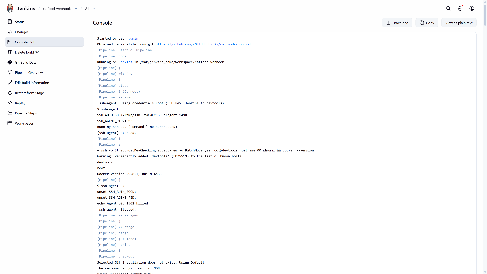</a>

*ภาพที่ 17 Console ช่วงต้น: `Started by user admin` → `Obtained Jenkinsfile from git https://github.com/<GITHUB_USER>/catfood-shop.git` (Jenkins อ่าน Jenkinsfile จาก private repo ได้แล้ว) → stage **Connect**: ครั้งแรกขึ้น `Warning: Permanently added 'devtools' (ED25519) ...` แล้ว `devtools` / `root` / `Docker version ...`*

<a href="./images/lab4_jk_07_console1_clone.png">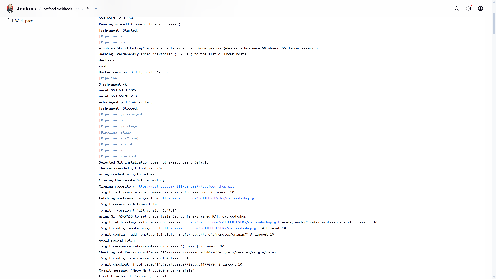</a>

*ภาพที่ 18 stage **Clone**: ① `using credential github-token` — Jenkins clone private repo ด้วย token ② `Checking out Revision abf4e3e...` (commit แรก ของเราจะเป็นเลขอื่น) ③ `Commit message: "Meow Mart v2.0.0 + Jenkinsfile"` · ไม่มีคำว่า `github_pat_` ใน console*

<a href="./images/lab4_jk_07_console1_version.png">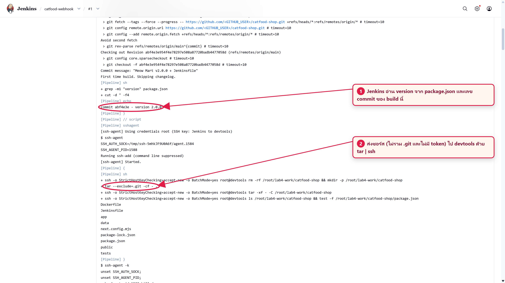</a>

*ภาพที่ 19 ① `commit abf4e3e · version 2.0.0` — Jenkins อ่านเวอร์ชันจาก `package.json` และเลข commit ของ build นี้ ② `+ tar --exclude=.git -cf - .` ส่งซอร์ส (ไม่รวม `.git` ไม่มี token) ไป devtools แล้ว `ls` แสดง `Dockerfile`, `Jenkinsfile`, `app`, `data`, ..., `tests`*

<a href="./images/lab4_jk_07_console1_test.png">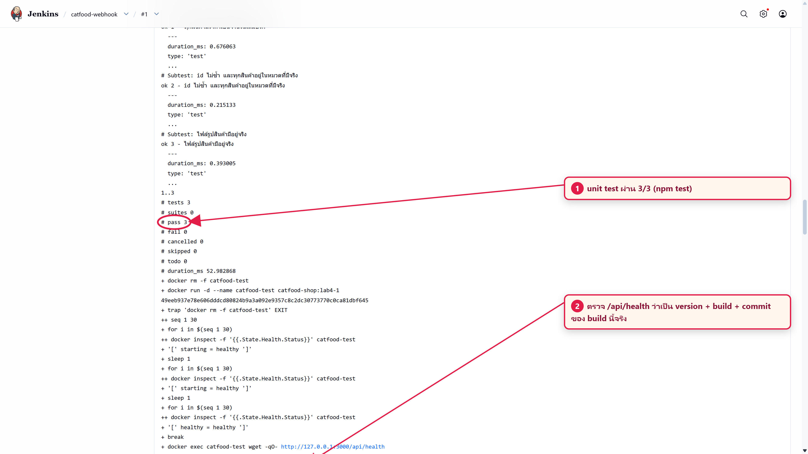</a>

*ภาพที่ 20 stage **Test**: ① `ok 1`–`ok 3` และ `# pass 3` `# fail 0` — unit test ผ่าน 3/3 ② จากนั้นรัน `catfood-test` รอ `healthy` แล้วตรวจ `/api/health` ว่าเป็น version + build + commit ของ build นี้จริง (`version:2.0.0,build:1,commit:abf4e3e,`)*

<a href="./images/lab4_jk_07_console1_end.png">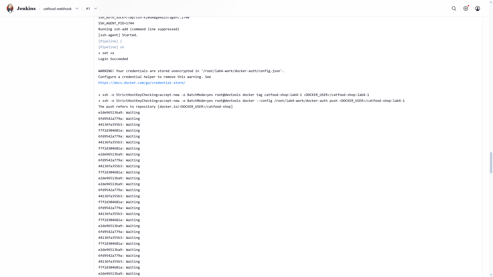</a>

*ภาพที่ 21 ช่วงท้าย: ① stage Push ขึ้น Docker Hub เป็น tag `lab4-1` (`lab4-1: digest: sha256:...`) ② `เปิดร้านได้ที่ http://localhost:3000 (v2.0.0 build #1 commit abf4e3e)` ③ `Finished: SUCCESS`*

> หมายเหตุ: log ของ stage Push มีบรรทัด `<layer>: Waiting` ซ้ำจำนวนมาก เป็นเรื่องปกติของ `docker push` ที่รันแบบไม่มี TTY (แสดงความคืบหน้าเป็นบรรทัดแทนการเขียนทับ) ไม่ใช่ error

<a href="./images/lab4_jk_08_build1_page.png">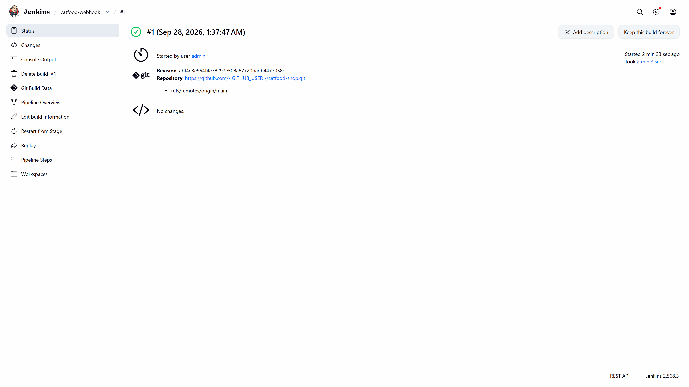</a>

*ภาพที่ 22 หน้า build #1: ① **Started by user admin** — build นี้เรากด Build Now เอง (ครั้งเดียวในแล็บ) ② **Revision** = commit ที่ build จาก private repo · URL ของ repo ในภาพปิดเป็น `<GITHUB_USER>`*

✅ เปิด http://localhost:3000 — ร้านเวอร์ชัน LAB 4 แทนร้านของ LAB 3:

[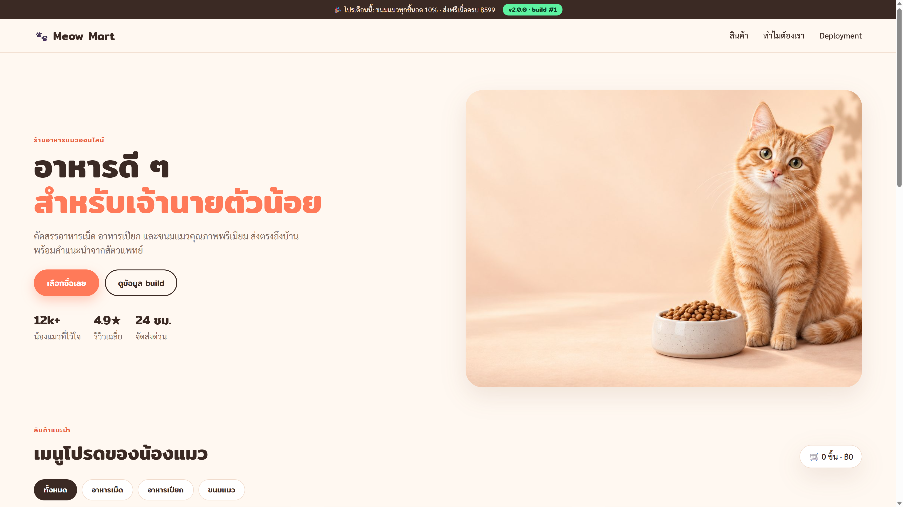](./images/lab4_shop_01_v200_build1_full.png)

*ภาพที่ 23 ร้านหลัง build #1: แถบบนสุดเป็นแบนเนอร์ `🎉 โปรเดือนนี้: ขนมแมวทุกชิ้นลด 10% · ส่งฟรีเมื่อครบ ฿599` และ chip `v2.0.0 · build #1` · คลิกภาพเพื่อดูทั้งหน้า*

## ขั้นที่ 5 — เปิดทางเข้าให้ GitHub ด้วย ngrok (🌐 + 🖥️)

### 5.1) สมัครบัญชี ngrok

เปิด https://ngrok.com

<a href="./images/lab4_ngrok_01_home.png">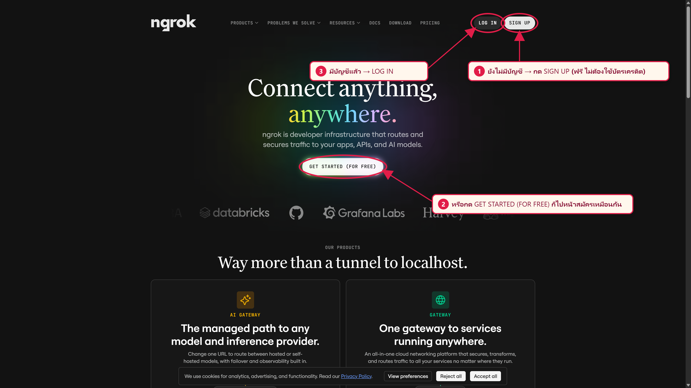</a>

*ภาพที่ 24 หน้าแรกของ ngrok: ① ยังไม่มีบัญชี → กด **SIGN UP** (ฟรี ไม่ต้องใช้บัตรเครดิต) ② หรือกด **GET STARTED (FOR FREE)** ก็ไปหน้าสมัครเหมือนกัน ③ มีบัญชีแล้ว → **LOG IN***

<a href="./images/lab4_ngrok_02_signup.png">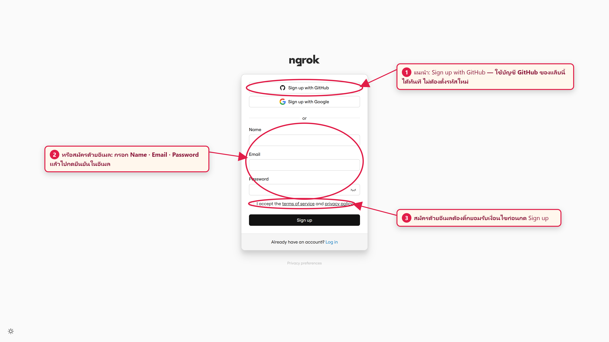</a>

*ภาพที่ 25 หน้าสมัคร: ① **แนะนำ Sign up with GitHub** — ใช้บัญชี GitHub ของแล็บนี้ได้ทันที ไม่ต้องตั้งรหัสใหม่ ② หรือสมัครด้วยอีเมล: กรอก Name · Email · Password แล้วไปกดยืนยันในอีเมล ③ แบบอีเมลต้องติ๊กยอมรับเงื่อนไขก่อนกด **Sign up** · หลังสมัคร ngrok อาจถามคำถามสั้น ๆ เรื่องการใช้งาน ตอบอะไรก็ได้*

<a href="./images/lab4_ngrok_03_login.png">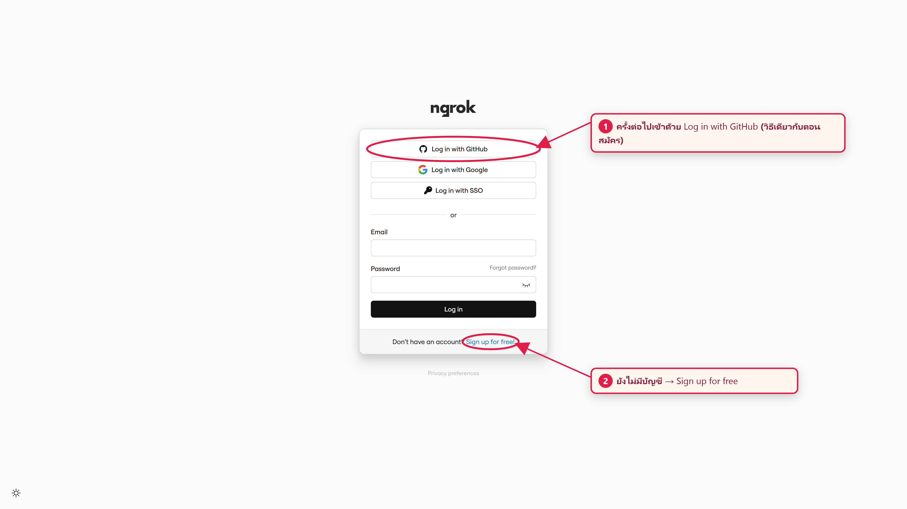</a>

*ภาพที่ 26 ครั้งต่อไปเข้าที่ https://dashboard.ngrok.com: ① **Log in with GitHub** (วิธีเดียวกับตอนสมัคร) ② ยังไม่มีบัญชี → **Sign up for free***

### 5.2) Quickstart → Docker

หลัง login จะเข้า dashboard หน้า **Quickstart**:

<a href="./images/lab4_ngrok_04_quickstart_docker.png">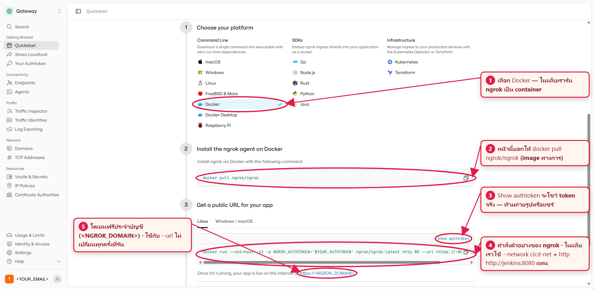</a>

*ภาพที่ 27 **Quickstart**: ① หัวข้อ Choose your platform เลือก **Docker** — แล็บนี้รัน ngrok เป็น container ② หน้านี้บอกให้ใช้ image ทางการ `ngrok/ngrok` ③ **Show authtoken** จะโชว์ token จริง — ห้ามถ่ายรูปหรือแชร์ ④ คำสั่งตัวอย่างของ ngrok ใช้ `--net=host` และ `http 80` · **ในแล็บเราใช้คำสั่งของข้อ 5.5 แทน** (`--network cicd-net` + `http http://jenkins:8080`) ⑤ บรรทัดล่างบอกโดเมนฟรีประจำบัญชี (`<NGROK_DOMAIN>`) ใช้กับ `--url` · อีเมลในภาพปิดเป็น `<YOUR_EMAIL>`*

### 5.3) Your Authtoken → Copy

<a href="./images/lab4_ngrok_05_authtoken.png">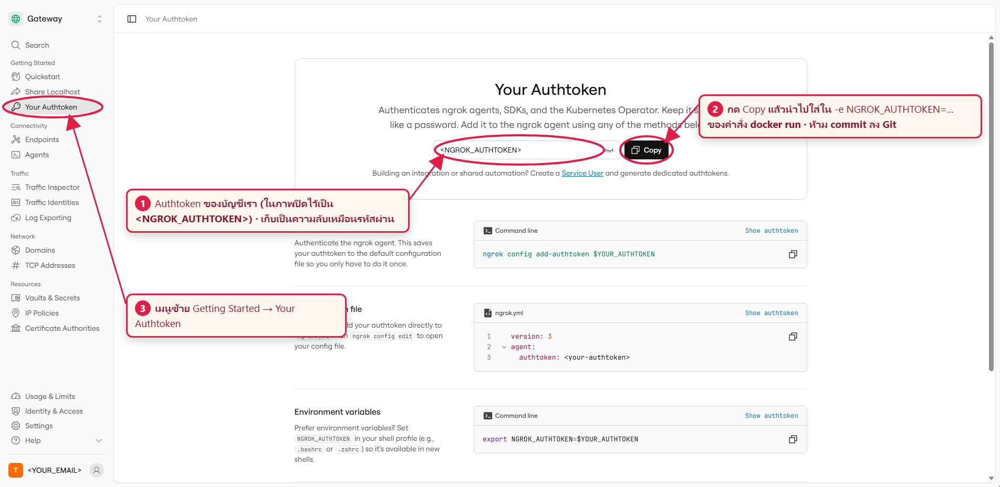</a>

*ภาพที่ 28 ③ เมนูซ้าย **Getting Started → Your Authtoken** ① authtoken ของบัญชีเรา (ในภาพปิดเป็น `<NGROK_AUTHTOKEN>`) เก็บเป็นความลับเหมือนรหัสผ่าน ② กด **Copy** แล้วนำไปใส่ใน `-e NGROK_AUTHTOKEN=...` ของคำสั่งในข้อ 5.5 · ห้าม commit ลง Git · ถ้าหลุด กด Reset ในหน้านี้*

### 5.4) Domains → dev domain ฟรีของบัญชี

<a href="./images/lab4_ngrok_06_domains.png">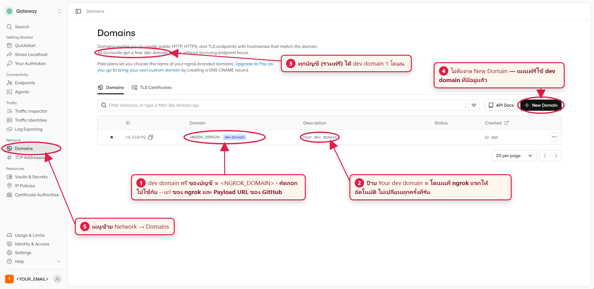</a>

*ภาพที่ 29 ⑤ เมนูซ้าย **Network → Domains** ③ ทุกบัญชี (รวมแผนฟรี) ได้ **dev domain 1 โดเมน** ① โดเมนในตาราง (ป้าย `dev domain`) คือ `<NGROK_DOMAIN>` — คัดลอกไปใช้กับ `--url` ของ ngrok และ Payload URL ของ GitHub ② คำอธิบาย **Your dev domain** = โดเมนที่ ngrok แจกให้อัตโนมัติ ไม่เปลี่ยนทุกครั้งที่รัน ④ **ไม่ต้องกด New Domain** · โดเมนจริงในภาพปิดไว้*

- dev domain ของแผนฟรีมีรูปแบบ `xxxx-xxxx-xxxx.ngrok-free.dev` · ในเอกสารนี้เรียกว่า `<NGROK_DOMAIN>` (ไม่มี `https://` นำหน้า)
- ต้องใส่ `--url https://<NGROK_DOMAIN>` ทุกครั้งที่รัน · ถ้าไม่ใส่ ngrok อาจให้โดเมนชั่วคราวอื่นมา แล้ว Payload URL ใน GitHub จะไม่ตรง

### 5.5) รัน container `ngrok` (🖥️ host)

เปิด terminal ของ host แล้วเข้า**โฟลเดอร์ของแล็บนี้** (ที่มีโฟลเดอร์ `ngrok/`) แบบเดียวกับ LAB 3 — `${PWD}` ใช้ได้ทั้ง PowerShell และ Linux/macOS:

```bash
cd 04_Jenkins/001_Jenikin/004_LAB_Webhook_Trigger   # จาก root ของ repository รายวิชา
```

ไฟล์ `ngrok/traffic-policy.yml` ที่จะ mount เข้า container:

```yaml
# ngrok Traffic Policy — ปล่อยผ่านเฉพาะ webhook ของ GitHub ที่เหลือตอบ 403 ที่ ngrok cloud (ไม่ถึง Jenkins)
# Jenkins ใช้รหัสผ่านของรายวิชาที่ทุกคนรู้ ห้ามเปิดหน้า login / Script Console ออก internet
on_http_request:
  - name: allow-only-github-webhook
    expressions:
      - "!(req.method == 'POST' && req.url.path == '/github-webhook/')"
    actions:
      - type: custom-response
        config:
          status_code: 403
          body: "blocked by ngrok traffic policy (LAB 4)"
```

อ่านว่า: ทุก request ที่**ไม่ใช่** (`!`) "method `POST` และ path ตรงกับ `/github-webhook/` เป๊ะ" → ngrok cloud ตอบ `403` พร้อมข้อความ `blocked by ngrok traffic policy (LAB 4)` เอง request นั้นไม่ลงมาถึงเครื่องเรา · Traffic Policy แบบนี้ใช้ได้บนแผนฟรี (ทดสอบจริงแล้ว)

รัน ngrok (คำสั่งบรรทัดเดียว แทน `<NGROK_AUTHTOKEN>` และ `<NGROK_DOMAIN>` ด้วยค่าของเรา):

```bash
docker run -d --name ngrok --network cicd-net --restart unless-stopped -p 127.0.0.1:4040:4040 -e NGROK_AUTHTOKEN=<NGROK_AUTHTOKEN> -v "${PWD}/ngrok:/etc/ngrok-lab:ro" ngrok/ngrok:latest http http://jenkins:8080 --url https://<NGROK_DOMAIN> --traffic-policy-file /etc/ngrok-lab/traffic-policy.yml --log stdout
```

| ส่วนของคำสั่ง | ความหมาย |
|---|---|
| `--network cicd-net` | อยู่ network เดียวกับ Jenkins จึงเรียกชื่อ `jenkins:8080` ได้ |
| `--restart unless-stopped` | ถ้า container หลุดจะต่อใหม่เอง · แต่ถ้าไม่ `docker rm -f ngrok` เปิดเครื่องครั้งหน้ามันจะกลับมาเอง (ขั้นที่ 11) |
| `-p 127.0.0.1:4040:4040` | เปิดหน้า inspector ให้เฉพาะเครื่องเรา (`localhost:4040`) ไม่เปิดให้คนใน LAN · inspector ใน image ทางการฟัง `0.0.0.0:4040` อยู่แล้ว |
| `-e NGROK_AUTHTOKEN=...` | ผูก agent กับบัญชีของเรา |
| `-v "${PWD}/ngrok:/etc/ngrok-lab:ro"` | mount โฟลเดอร์ `ngrok/` ของแล็บแบบอ่านอย่างเดียว (มี `traffic-policy.yml`) |
| `http http://jenkins:8080` | ส่งต่อ request ที่เข้ามาไปที่ Jenkins |
| `--url https://<NGROK_DOMAIN>` | ใช้ dev domain ของบัญชี (ข้อ 5.4) |
| `--traffic-policy-file ...` | ใช้ด่านกรองข้างบน |
| `--log stdout` | ให้ `docker logs ngrok` มีข้อความเสมอ |

<details>
<summary>(ทางเลือก) ใช้ไฟล์ config แทน flag ยาว ๆ</summary>

คัดลอก `ngrok/ngrok.example.yml` เป็น `ngrok/ngrok.yml` แล้วแก้ `<NGROK_AUTHTOKEN>` และ `<NGROK_DOMAIN>` ในไฟล์ (`ngrok/ngrok.yml` อยู่ใน `.gitignore` แล้ว ห้าม commit) จากนั้นรันแทนคำสั่งด้านบน:

```bash
docker run -d --name ngrok --network cicd-net --restart unless-stopped -p 127.0.0.1:4040:4040 -v "${PWD}/ngrok:/etc/ngrok-lab:ro" ngrok/ngrok:latest start --all --config /etc/ngrok-lab/ngrok.yml --log stdout
```

ข้อดี: authtoken ไม่อยู่ใน `docker inspect ngrok` · วิธีนี้ไม่ได้ใช้ในรอบทดสอบของแล็บ ถ้ามีปัญหาให้กลับไปใช้คำสั่งหลัก

</details>

### 5.6) ตรวจว่า tunnel ต่อแล้ว และ policy ทำงาน

```bash
docker logs ngrok
```

<a href="./images/lab4_term_05_ngrok_logs.png">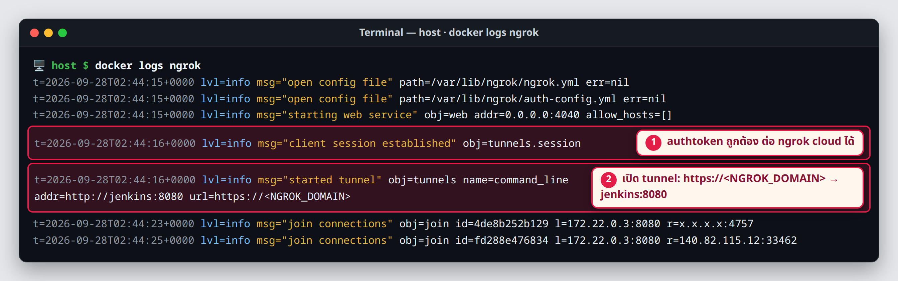</a>

*ภาพที่ 30 ผลจริงของ `docker logs ngrok` (ngrok agent 3.39.8): `starting web service ... addr=0.0.0.0:4040` = inspector พร้อม · ① `client session established` = authtoken ถูกต้อง ต่อ ngrok cloud ได้ ② `started tunnel ... addr=http://jenkins:8080 url=https://<NGROK_DOMAIN>` = เปิด tunnel แล้ว · บรรทัด `join connections` คือ request ที่เข้ามาภายหลัง · โดเมนและ IP ในภาพปิดไว้*

🌐 dashboard ของ ngrok → **Connectivity → Endpoints**:

<a href="./images/lab4_ngrok_07_endpoints.png">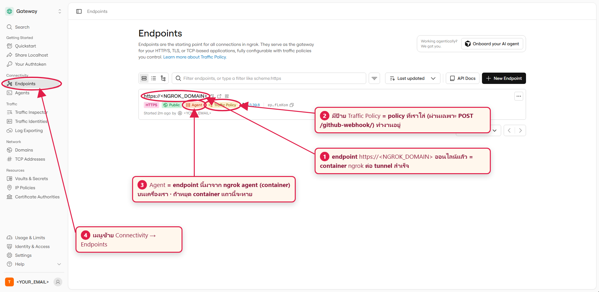 ป้าย Agent และ Traffic Policy"></a>

*ภาพที่ 31 ④ เมนูซ้าย **Connectivity → Endpoints** ① endpoint `https://<NGROK_DOMAIN>` ออนไลน์แล้ว = container ngrok ต่อ tunnel สำเร็จ ② ป้าย **Traffic Policy** = policy ที่เราใส่ทำงานอยู่ ③ ป้าย **Agent** = endpoint นี้มาจาก ngrok agent (container) บนเครื่องเรา ถ้าหยุด container แถวนี้จะหาย · โดเมนและอีเมลในภาพปิดไว้*

🖥️ ทดสอบ policy ด้วย `curl` จาก host (ต้องมี `curl` บน host · ถ้าไม่มี ให้เปิด `https://<NGROK_DOMAIN>/` ในเบราว์เซอร์แทนคำสั่งแรก):

```bash
curl -i https://<NGROK_DOMAIN>/
curl -s -o /dev/null -w "%{http_code}\n" -X POST https://<NGROK_DOMAIN>/github-webhook/
```

<a href="./images/lab4_term_06_policy_curl.png">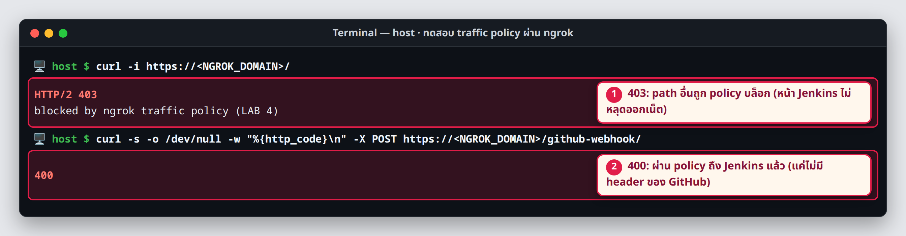</a>

*ภาพที่ 32 ผลจริง: ① `curl -i https://<NGROK_DOMAIN>/` ได้ `HTTP/2 403` + `blocked by ngrok traffic policy (LAB 4)` = path อื่นถูก policy บล็อก หน้า Jenkins ไม่หลุดออก internet (ทดสอบ `/login` และ `/github-webhook` ที่ไม่มี `/` ท้ายก็ได้ 403 เหมือนกัน) ② `POST /github-webhook/` ได้ `400` = ผ่าน policy ถึง Jenkins แล้ว (400 เพราะเราไม่ได้ส่ง header ของ GitHub มา) — ทางเดิน ngrok → jenkins ใช้ได้*

- เปิด `https://<NGROK_DOMAIN>/` ในเบราว์เซอร์: แผนฟรีอาจขึ้นหน้าเตือนของ ngrok (interstitial) ก่อน กด **Visit Site** แล้วจะเห็นข้อความ 403 เดียวกัน · หน้าเตือนนี้มีเฉพาะเบราว์เซอร์ **ไม่กระทบ webhook** เพราะ GitHub ไม่ใช่เบราว์เซอร์
- ✅ เปิด http://localhost:4040 ได้หน้า ngrok inspector (ป้าย `online`) · request ที่ policy บล็อกไม่ลงมาถึง agent ส่วน `POST /github-webhook/` ที่ curl ไปจะเห็นเป็น `400 Bad Request`

**สรุปแผนฟรีของ ngrok ที่แล็บนี้ใช้:** dev domain อัตโนมัติ 1 โดเมน (ไม่ต้องจอง) · Traffic Policy ใช้ได้ · หน้าเตือน interstitial มีเฉพาะเบราว์เซอร์ · ใช้ authtoken ของ**บัญชีตัวเอง**และรัน ngrok ทีละตัว

## ขั้นที่ 6 — Webhook secret + สร้าง webhook บน GitHub

**webhook secret** คือรหัสที่ GitHub กับ Jenkins รู้ร่วมกัน · GitHub ใช้มันเซ็นทุก delivery เป็น header `X-Hub-Signature-256` แล้ว Jenkins ตรวจลายเซ็นด้วยรหัสเดียวกัน → คนอื่นที่รู้ URL ของเราก็ปลอม webhook ไม่ได้

### 6.1) สร้างค่า secret (💻 devtools)

```bash
openssl rand -hex 20
```

✅ ได้เลขฐานสิบหก 40 ตัวหนึ่งบรรทัด → คัดลอกเก็บไว้ เรียกว่า `<WEBHOOK_SECRET>` (ใช้สองที่: Jenkins ข้อ 6.2 และ GitHub ข้อ 6.4)

### 6.2) credential `github-webhook-secret` (Secret text)

**⚙️ Manage Jenkins → Credentials → System → Global → + Add Credentials** → เลือก **Secret text** → Next

| ช่อง | ค่า |
|---|---|
| Scope | Global |
| Secret | `<WEBHOOK_SECRET>` |
| ID | `github-webhook-secret` |
| Description | `GitHub webhook shared secret` |

<a href="./images/lab4_jk_02c_cred_webhook_secret.png">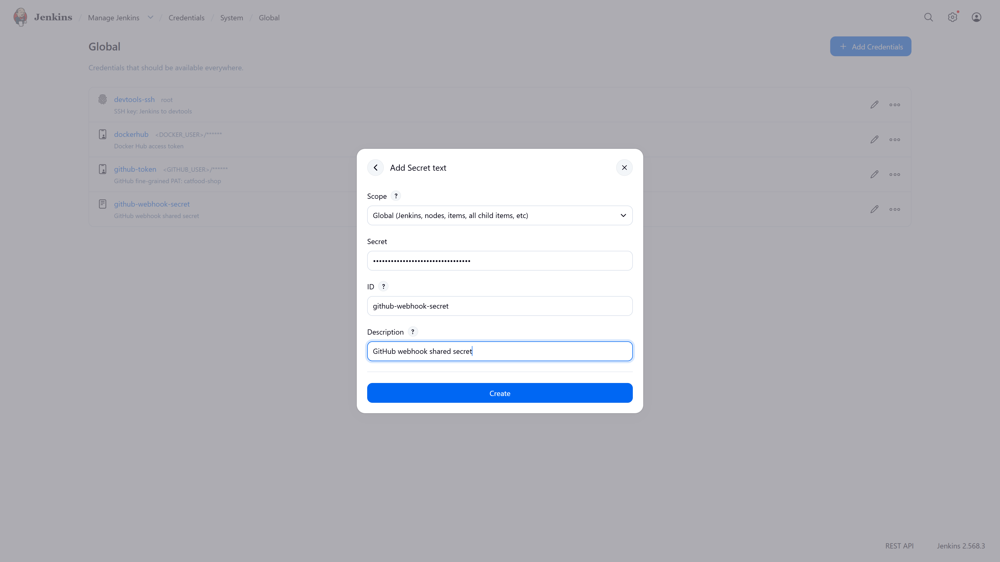</a>

*ภาพที่ 33 ฟอร์ม **Add Secret text**: Secret เป็นจุด (`<WEBHOOK_SECRET>`) · ID `github-webhook-secret` · Description `GitHub webhook shared secret` → **Create***

<a href="./images/lab4_jk_03_credentials_list.png">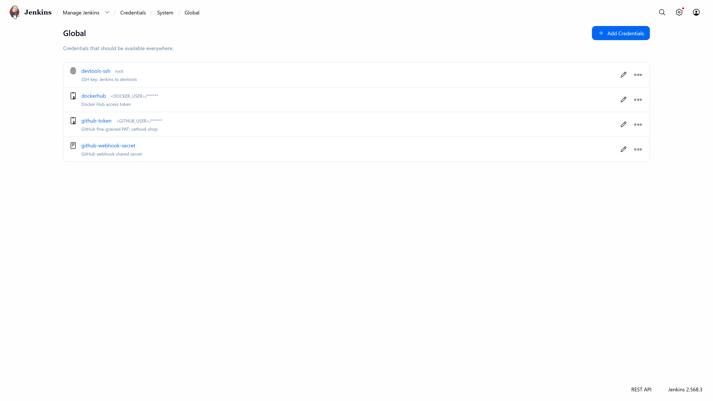</a>

*ภาพที่ 34 รายการ Global credentials ครบ 4 ตัว: ① `devtools-ssh`, `dockerhub` = ของเดิมจาก LAB 3 (ไม่ต้องสร้างใหม่) ② `github-token` (ใหม่) = GitHub username + fine-grained token → Jenkins clone private repo ③ `github-webhook-secret` (ใหม่) = Secret text ใช้ตรวจลายเซ็น webhook · ชื่อบัญชีในภาพปิดเป็น placeholder*

### 6.3) ตั้ง Shared secret ของ GitHub plugin

**⚙️ Manage Jenkins → System** → เลื่อนลงหาหัวข้อ **GitHub**

<a href="./images/lab4_jk_09b_shared_secret.png">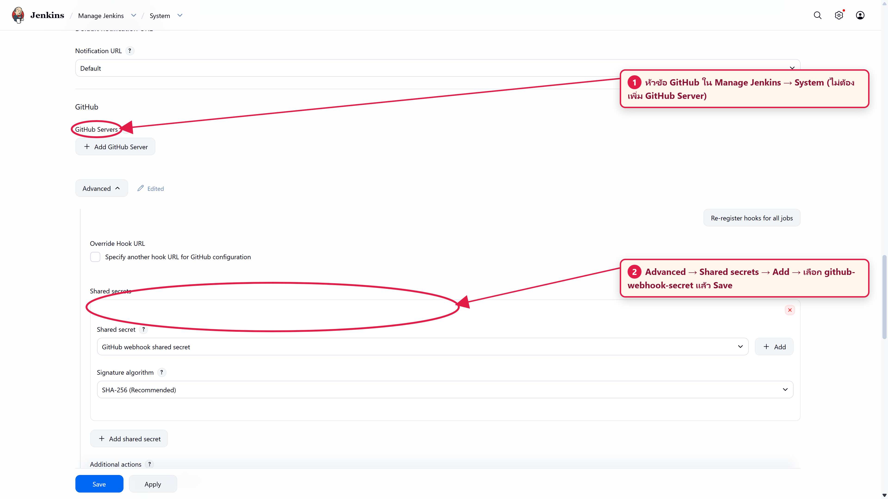</a>

*ภาพที่ 35 ① หัวข้อ **GitHub** ใน Manage Jenkins → System (ไม่ต้องกด Add GitHub Server) ② กด **Advanced** → **Shared secrets** → **Add shared secret** → ช่อง **Shared secret** เลือก `GitHub webhook shared secret` (= `github-webhook-secret`) · Signature algorithm คง **SHA-256 (Recommended)** → กด **Save***

### 6.4) สร้าง webhook ที่ repo `catfood-shop` (🌐 GitHub)

repo `catfood-shop` → แท็บ **Settings** → เมนูซ้าย **Webhooks** → **Add webhook**

> 🔐 GitHub อาจขอ **Confirm access** (sudo mode) อีกครั้งก่อนเปิดหน้า Add webhook — ยืนยันตัวตนแล้วทำต่อ

<a href="./images/lab4_gh_06a_webhook_form_url_secret.png">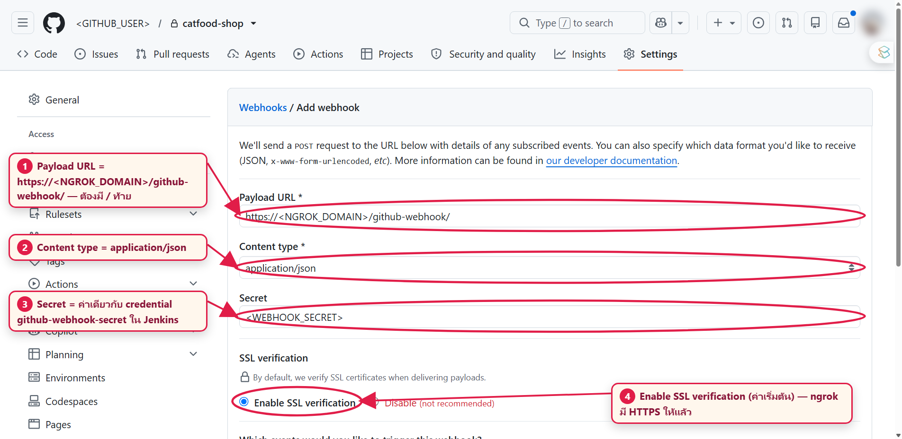/github-webhook/ Content type application/json Secret และ Enable SSL verification"></a>

*ภาพที่ 36 ฟอร์ม **Add webhook**: ① **Payload URL** = `https://<NGROK_DOMAIN>/github-webhook/` — **ต้องมี `/` ท้าย** (ไม่มี `/` = policy ตอบ 403) ② **Content type** = `application/json` ③ **Secret** = `<WEBHOOK_SECRET>` ค่าเดียวกับ credential `github-webhook-secret` ④ **Enable SSL verification** (ค่าเริ่มต้น) — ngrok มี HTTPS ให้แล้ว · ค่าในภาพเป็น placeholder*

<a href="./images/lab4_gh_06b_webhook_form_events.png">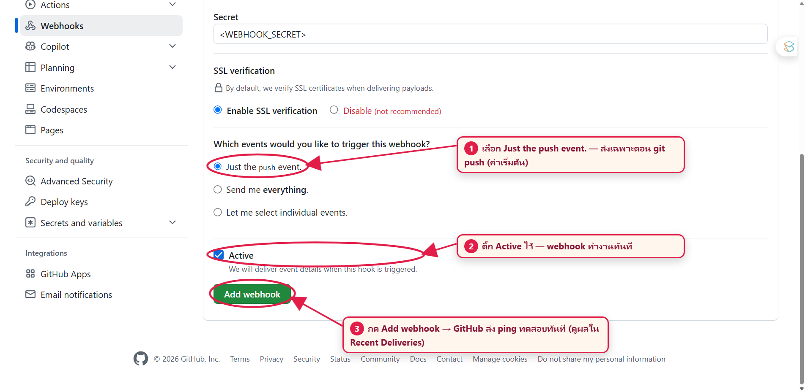</a>

*ภาพที่ 37 ① **Which events** เลือก **Just the push event.** — ส่งเฉพาะตอน git push (ค่าเริ่มต้น) ② ติ๊ก **Active** ไว้ — webhook ทำงานทันที ③ กด **Add webhook** → GitHub ส่ง `ping` ทดสอบทันที*

<a href="./images/lab4_gh_05_webhooks_list.png">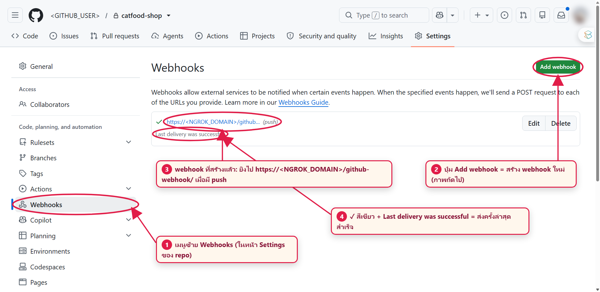/github... (push) เครื่องหมายถูกสีเขียว Last delivery was successful"></a>

*ภาพที่ 38 กลับมาที่หน้า **Webhooks**: ① เมนูซ้าย Webhooks (ในหน้า Settings ของ repo) ② ปุ่ม **Add webhook** ใช้สร้างใหม่ ③ webhook ที่สร้างแล้ว ยิงไป `https://<NGROK_DOMAIN>/github-webhook/` เมื่อมี push ④ ✓ สีเขียว + **Last delivery was successful** = ส่งครั้งล่าสุดสำเร็จ (ครั้งแรกคือ `ping`) · กด Edit เพื่อเข้าแท็บ Recent Deliveries*

✅ ในแท็บ **Recent Deliveries** (คลิก **Edit** → แท็บด้านบน) ต้องมีแถว `ping` ✓ สีเขียว · response `200` (ภาพที่ 46 แถว ⑥)
✅ Jenkins **ไม่มี** build ใหม่ — `ping` เป็นแค่การทดสอบ ไม่ใช่ push · `docker logs jenkins` มี `PING webhook received from repo <https://github.com/<GITHUB_USER>/catfood-shop>!`

## ขั้นที่ 7 — ทดลอง ก: แก้ร้านแล้ว push → ร้านเปลี่ยนเอง (💻 devtools)

แก้ 3 จุด: ราคาทูน่า `329 → 299`, ข้อความแบนเนอร์ `promo`, และเวอร์ชัน `2.0.0 → 2.1.0` (ใช้ `sed` ด้านล่าง หรือเปิดไฟล์ `data/products.js` กับ `package.json` ด้วย editor แก้เองก็ได้):

```bash
cd ~/catfood-shop
sed -i 's/"version": "2.0.0"/"version": "2.1.0"/' package.json
sed -i 's/price: 329,/price: 299,/' data/products.js
sed -i "s/^export const promo = .*/export const promo = '🐟 ทูน่าลดเหลือ ฿299 · ส่งฟรีเมื่อครบ ฿599';/" data/products.js
git diff --stat; git diff
git commit -am "v2.1.0: ทูน่าลดราคา + แบนเนอร์ใหม่"
git push
```

<a href="./images/lab4_term_02_git_push_v210.png">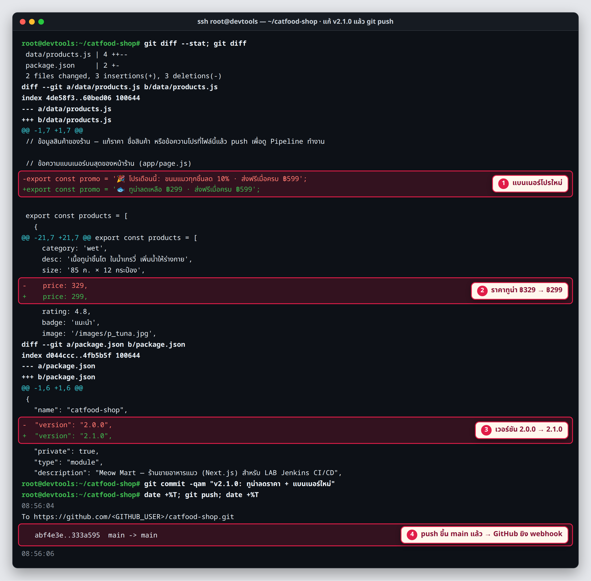 main"></a>

*ภาพที่ 39 ผลจริง: `git diff --stat` = `2 files changed, 3 insertions(+), 3 deletions(-)` · ① แบนเนอร์โปรใหม่ `🐟 ทูน่าลดเหลือ ฿299 · ส่งฟรีเมื่อครบ ฿599` ② ราคาทูน่า `329 → 299` ③ เวอร์ชัน `2.0.0 → 2.1.0` ④ `abf4e3e..333a595  main -> main` = push ขึ้น main แล้ว → GitHub ยิง webhook (เลข commit ของเราจะต่างจากภาพ · ชื่อบัญชีปิดเป็น `<GITHUB_USER>`)*

🌐 สลับไปหน้า job `catfood-webhook` ภายในประมาณ 10 วินาที **#2 จะเริ่มเองโดยไม่มีใครกด** (รอบทดสอบ: push เสร็จ 08:56:06 → #2 เริ่ม 08:56:17 ห่าง ~11 วินาที):

<a href="./images/lab4_e2e_03_job_running.png">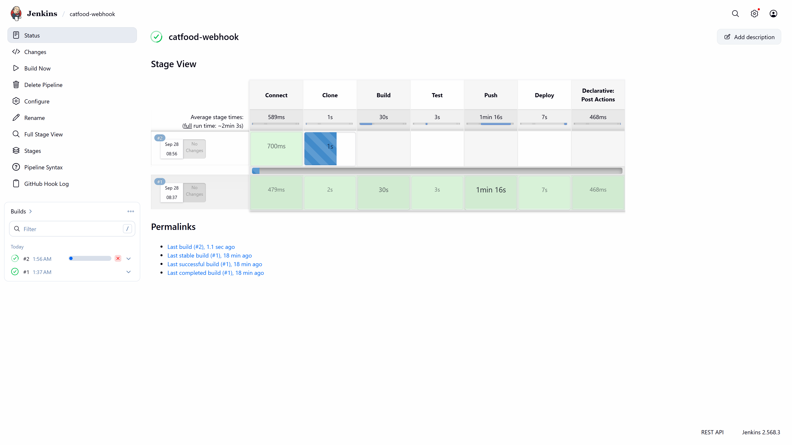</a>

*ภาพที่ 40 หน้า job ขณะ **#2** กำลังรัน (Connect เสร็จ กำลังทำ Clone) ทั้งที่ไม่มีใครกด Build Now · แถว #1 ด้านล่างคือ build ที่เรากดเองในขั้นที่ 4*

<a href="./images/lab4_jk_10_build2_started_by_push.png">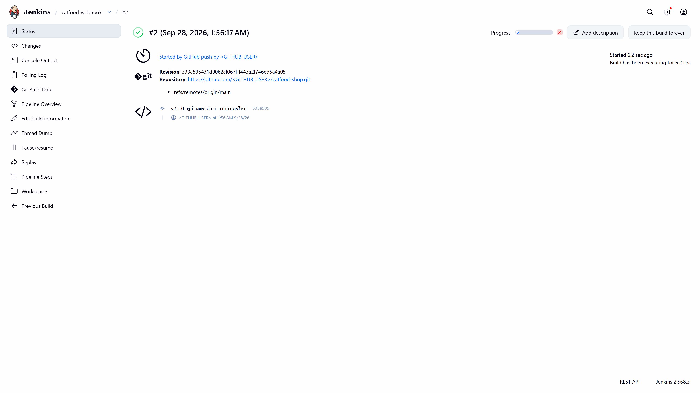 และ commit v2.1.0"></a>

*ภาพที่ 41 หน้า build #2: ① **Started by GitHub push by `<GITHUB_USER>`** — ไม่มีใครกดปุ่ม webhook สั่งเอง ② commit ที่ push (`v2.1.0: ทูน่าลดราคา + แบนเนอร์ใหม่`) อยู่ในส่วน Changes · build #2 ใช้เวลา ~1 นาที (เร็วกว่า #1 เพราะ Docker มี cache) · ชื่อบัญชีปิดเป็น placeholder*

<a href="./images/lab4_jk_11b_build2_stages.png">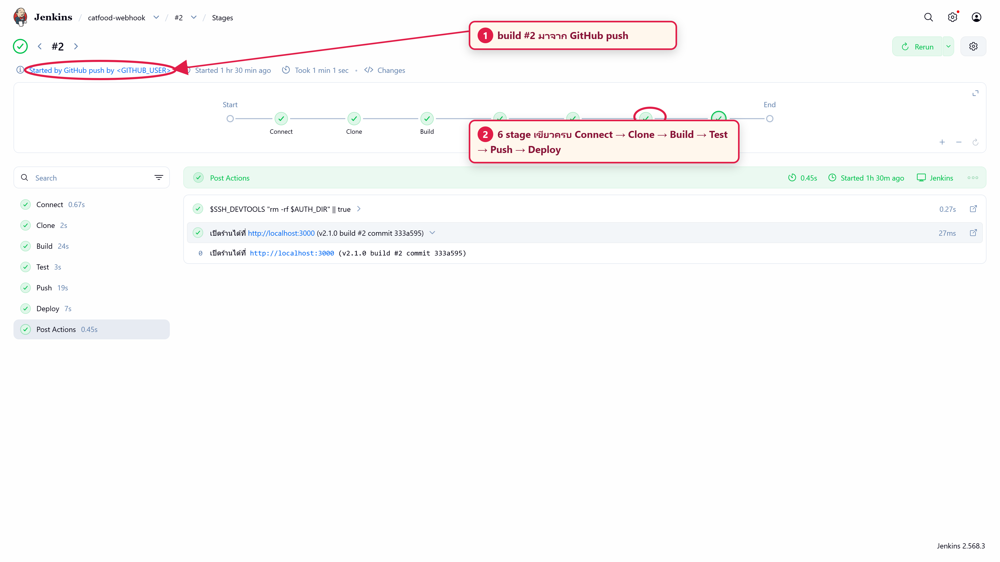</a>

*ภาพที่ 41ก หน้า **Stages** ของ #2: ① `Started by GitHub push by <GITHUB_USER>` ② เขียวครบ Connect → Clone → Build → Test → Push → Deploy · Post Actions พิมพ์ `เปิดร้านได้ที่ http://localhost:3000 (v2.1.0 build #2 commit 333a595)`*

✅ Console ของ #2 มี `commit <sha ใหม่> · version 2.1.0` และ `Finished: SUCCESS` · refresh http://localhost:3000:

[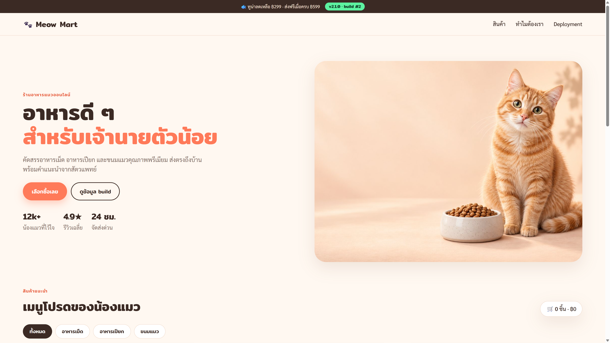](./images/lab4_shop_02_v210_build2_full.png)

*ภาพที่ 42 ร้านหลัง push: แบนเนอร์เปลี่ยนเป็น `🐟 ทูน่าลดเหลือ ฿299 · ส่งฟรีเมื่อครบ ฿599` และ chip `v2.1.0 · build #2` · คลิกภาพเพื่อดูทั้งหน้า*

<a href="./images/lab4_shop_02b_v210_tuna.png">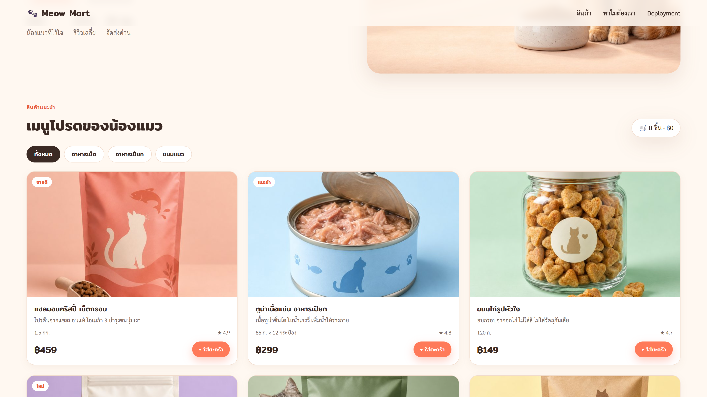</a>

*ภาพที่ 43 การ์ด **ทูน่าเนื้อแน่น อาหารเปียก** ราคา `฿299` (เดิม `฿329`) · ขนมไก่รูปหัวใจยัง `฿149`*

<a href="./images/lab4_shop_02c_v210_deployinfo.png">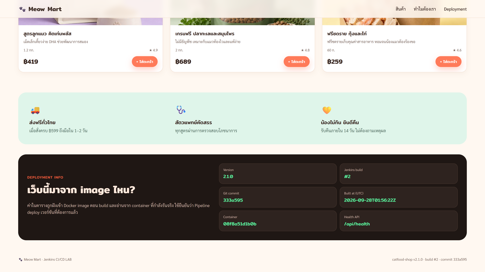</a>

*ภาพที่ 44 ส่วน **Deployment info** ท้ายหน้าร้าน: Version `2.1.0` · Jenkins build `#2` · Git commit `333a595` = commit ที่เรา push (ของเราเป็นเลขของตัวเอง) · Built at และ Container จะต่างจากภาพ*

ภาพเคลื่อนไหวของวงจรทั้งหมด:

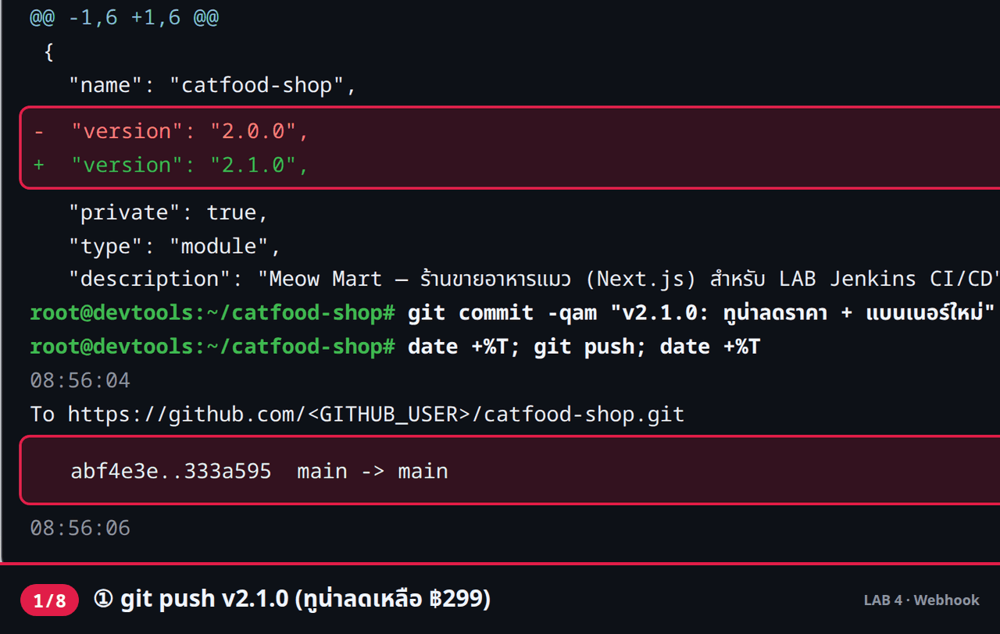

*ภาพที่ 45 GIF 8 ภาพ ภาพละ 2 วินาที (16 วินาที): ① `git push` v2.1.0 → ② GitHub Recent Deliveries ✓ → ③ ngrok inspector รับ `POST /github-webhook/` ตอบ `200 OK` → ④ Jenkins เริ่ม #2 เอง "Started by GitHub push" → ⑤ Pipeline กำลังรัน → ⑥ Test ผ่าน → Push → Deploy → ⑦ ผลรวม #1–#4 (#3 แดงที่ Test จากขั้นที่ 9) → ⑧ ร้าน `v2.1.0 · build #2` ทูน่า ฿299 · ค่าจริงในทุกเฟรมปิดเป็น placeholder*

## ขั้นที่ 8 — ทดลอง ข: ตามรอย webhook ทีละจุด

เดิน flow ในแผนภาพ B ย้อนดูหลักฐานทีละที่: GitHub → ngrok → Jenkins

### 8.1) GitHub: Recent Deliveries (🌐)

repo → **Settings → Webhooks** → คลิก **Edit** ของ webhook → แท็บ **Recent Deliveries**

<a href="./images/lab4_gh_07_recent_deliveries.png">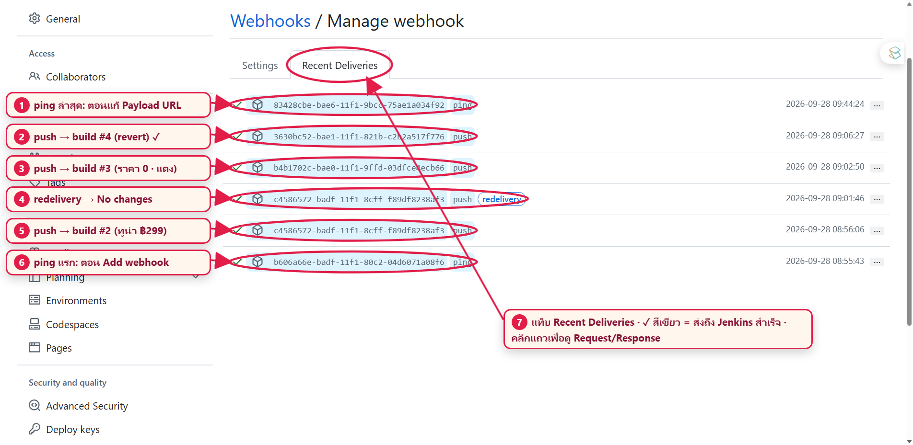</a>

*ภาพที่ 46 แท็บ **Recent Deliveries** ตอนจบแล็บ (ใหม่อยู่บน): ⑥ `ping` แรก ตอน Add webhook ⑤ `push` → build #2 (ทูน่า ฿299) ④ `redelivery` → No changes (ข้อ 8.4) ③ `push` → build #3 (ราคา 0 · แดง ขั้นที่ 9) ② `push` → build #4 (revert) ① `ping` ล่าสุด ตอนแก้ Payload URL ⑦ ✓ สีเขียว = ส่งถึง Jenkins สำเร็จ คลิกแถวเพื่อดู Request/Response · ตอนนี้ของเราจะมีแค่ ping และ push แรก*

คลิกแถว `push` ของ build #2:

<a href="./images/lab4_gh_08_delivery_push_request.png">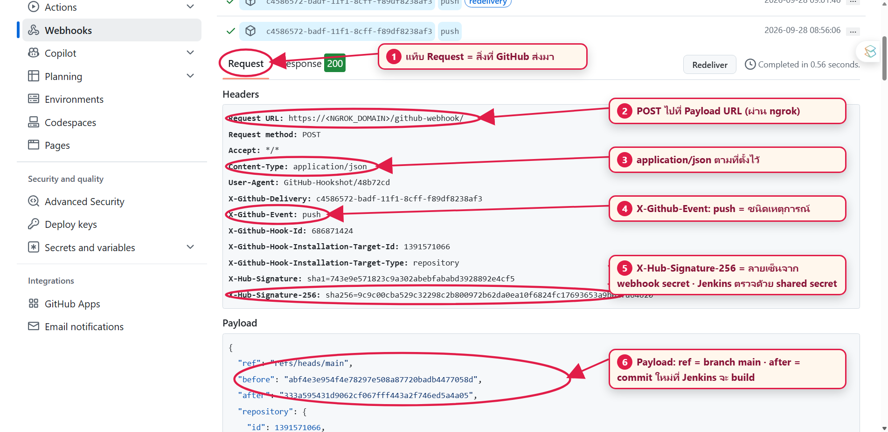</a>

*ภาพที่ 47 แท็บ **Request** = สิ่งที่ GitHub ส่งมา: ② `Request URL: https://<NGROK_DOMAIN>/github-webhook/` (POST ผ่าน ngrok) ③ `Content-Type: application/json` ตามที่ตั้ง ④ `X-Github-Event: push` = ชนิดเหตุการณ์ ⑤ `X-Hub-Signature-256` = ลายเซ็นจาก webhook secret · Jenkins ตรวจด้วย shared secret ⑥ Payload: `ref` = `refs/heads/main` · `after` = commit ใหม่ที่ Jenkins จะ build · โดเมนปิดเป็น placeholder*

<a href="./images/lab4_gh_09_delivery_push_response.png">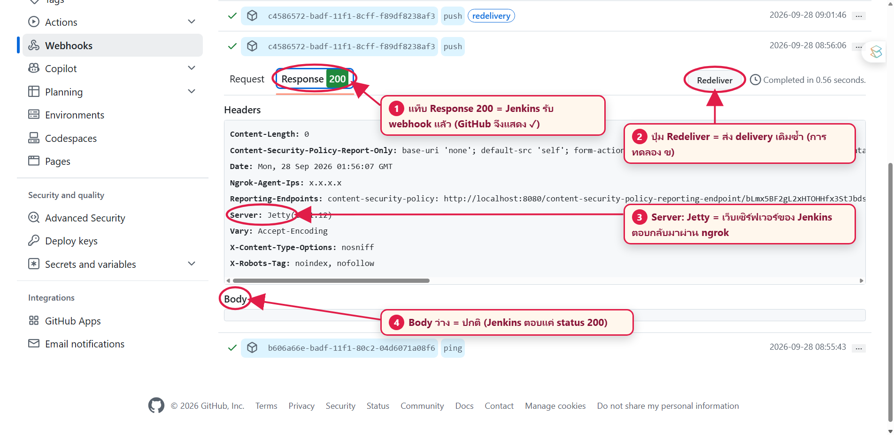</a>

*ภาพที่ 48 แท็บ **Response 200**: ① Jenkins รับ webhook แล้ว GitHub จึงแสดง ✓ ② ปุ่ม **Redeliver** = ส่ง delivery เดิมซ้ำ (ข้อ 8.4) ③ `Server: Jetty` = เว็บเซิร์ฟเวอร์ของ Jenkins ตอบกลับมาผ่าน ngrok ④ Body ว่างเป็นเรื่องปกติ (Jenkins ตอบแค่ status 200)*

### 8.2) ngrok: inspector และ log (🌐 + 🖥️)

🌐 เปิด http://localhost:4040 → คลิก `POST /github-webhook/` แถวที่เป็น `200 OK`:

<a href="./images/lab4_ngrok_08_inspector_push.png">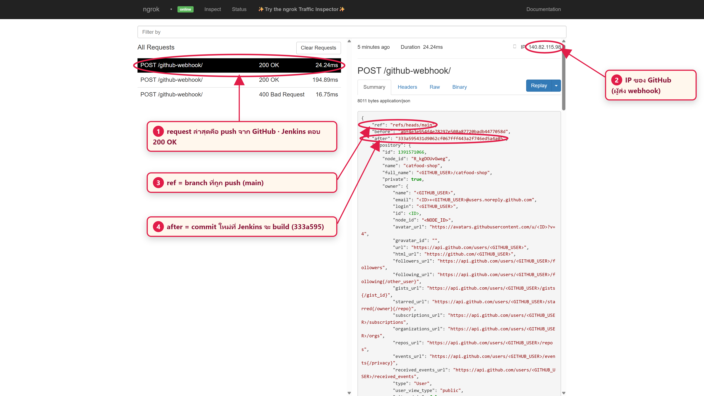</a>

*ภาพที่ 49 ngrok inspector: ① request ล่าสุดคือ push จาก GitHub · Jenkins ตอบ `200 OK` (แถว `400 Bad Request` ล่างสุดคือ curl ทดสอบในข้อ 5.6) ② IP ต้นทางเป็นของ GitHub (ผู้ส่ง webhook) ③ `ref` = branch ที่ถูก push (`main`) ④ `after` = commit ใหม่ที่ Jenkins จะ build · ชื่อบัญชีและอีเมลใน payload ปิดเป็น placeholder · ปุ่ม **Replay** ใช้ส่ง request เดิมซ้ำได้*

<a href="./images/lab4_ngrok_09_inspector_headers.png">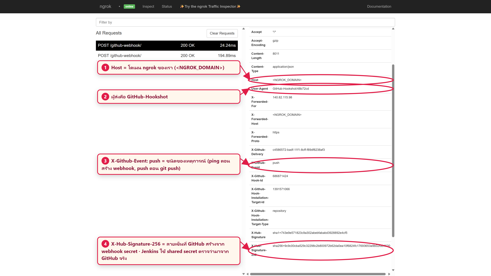</a>

*ภาพที่ 50 แท็บ **Headers** ของ request เดียวกัน: ① `Host` = โดเมน ngrok ของเรา (`<NGROK_DOMAIN>`) ② `User-Agent: GitHub-Hookshot/...` = ผู้ส่งคือ GitHub ③ `X-Github-Event: push` (ตอนสร้าง webhook เป็น `ping`) ④ `X-Hub-Signature-256` = ลายเซ็นที่ Jenkins ตรวจด้วย shared secret*

🖥️ `docker logs --tail 20 ngrok` → แต่ละ request ที่เข้ามาเป็นบรรทัด `msg="join connections" ... l=<IP ของ jenkins>:8080 r=<IP ต้นทาง>` (ภาพที่ 30 สองบรรทัดล่าง)

### 8.3) Jenkins: log ของ GitHub plugin (🖥️ host)

```bash
docker logs jenkins 2>&1 | grep -E "webhook|PushEvent|Triggering"
```

<a href="./images/lab4_term_07_jenkins_logs.png">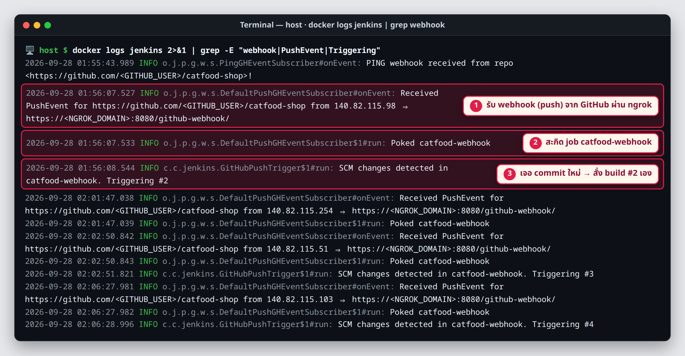</a>

*ภาพที่ 51 ผลจริง (ทั้งแล็บ): บรรทัดแรก `PING webhook received from repo` (ขั้นที่ 6) · ① `Received PushEvent for https://github.com/<GITHUB_USER>/catfood-shop from 140.82.x.x ⇒ https://<NGROK_DOMAIN>:8080/github-webhook/` = รับ push จาก GitHub ผ่าน ngrok ② `Poked catfood-webhook` = สะกิด job ที่ Repository URL ตรงกับ repo ใน payload ③ `SCM changes detected in catfood-webhook. Triggering #2` = เจอ commit ใหม่ → สั่ง build #2 · ถัดมาคือ redelivery (02:01:47 มี `Poked` แต่**ไม่มี** `Triggering`), #3 และ #4*

- `:8080` ที่ต่อท้ายโดเมนในบรรทัด `Received PushEvent` เป็นแค่ข้อความใน log ของ Jenkins ไม่ใช่ URL ที่ GitHub ใช้ ไม่ต้องแก้อะไร

### 8.4) Redeliver → 200 แต่ไม่ build (🌐)

GitHub → Recent Deliveries → แถว `push` ของ build #2 → แท็บ Response → กด **Redeliver** → ยืนยัน **Yes, redeliver this payload**

✅ มีแถวใหม่ป้าย `redelivery` ✓ (response `200`) **แต่ไม่มี build #3** · หน้า job → เมนูซ้าย **GitHub Hook Log**:

<a href="./images/lab4_jk_12_hook_log_nochanges.png">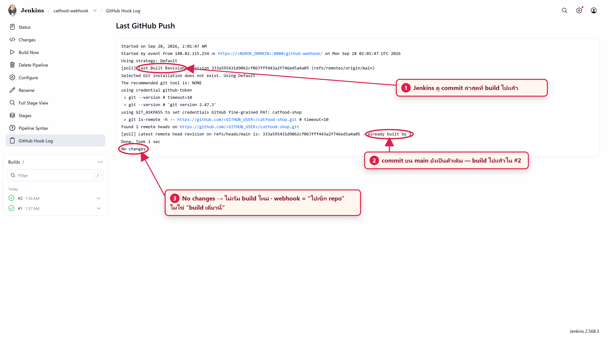</a>

*ภาพที่ 52 **GitHub Hook Log** หลัง Redeliver: `Started by event from 140.82.x.x ⇒ ...` · ① `[poll] Last Built Revision` = Jenkins ดู commit ล่าสุดที่ build ไปแล้ว ② commit บน `main` ยังเป็นตัวเดิม — `already built by 2` ③ **`No changes`** → ไม่เริ่ม build ใหม่ · โดเมนและชื่อบัญชีปิดเป็น placeholder*

> 💡 **สรุปสำคัญ:** webhook ของ GitHub plugin แปลว่า **"ไปเช็ก repo หน่อย"** ไม่ใช่ **"build เดี๋ยวนี้"** · Jenkins จะ build ก็ต่อเมื่อ branch `main` มี commit ใหม่ที่ยังไม่เคย build · ส่ง delivery เดิมซ้ำกี่ครั้งก็ไม่ build

## ขั้นที่ 9 — ทดลอง ค: push โค้ดพัง → pipeline แดง ร้านเดิมยังอยู่ → แก้กลับ (💻 devtools)

ตั้งใจทำราคาขนมไก่เป็น `0` ซึ่งผิดกฎของ unit test (ราคาต้องเป็นจำนวนเต็มบวก):

```bash
cd ~/catfood-shop
sed -i 's/price: 149,/price: 0,/' data/products.js
git diff
git commit -am "ขนมไก่ราคา 0 (ตั้งใจให้ test ไม่ผ่าน)"
git push
```

<a href="./images/lab4_term_03_git_push_price0.png">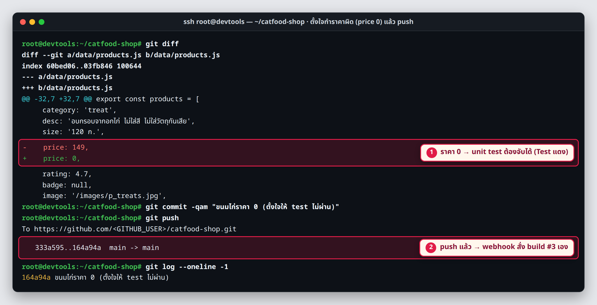 main"></a>

*ภาพที่ 53 ผลจริง: ① `price: 149 → 0` (ขนมไก่ `treats`) — unit test ต้องจับได้ ② `333a595..164a94a  main -> main` → webhook สั่ง build #3 เอง*

✅ **#3** เริ่มเอง · Build ผ่าน แต่ **Test แดง** ภายในไม่กี่วินาที (รอบทดสอบ: ทั้ง build ล้มใน ~13 วินาที):

<a href="./images/lab4_jk_13_console3_test_fail.png">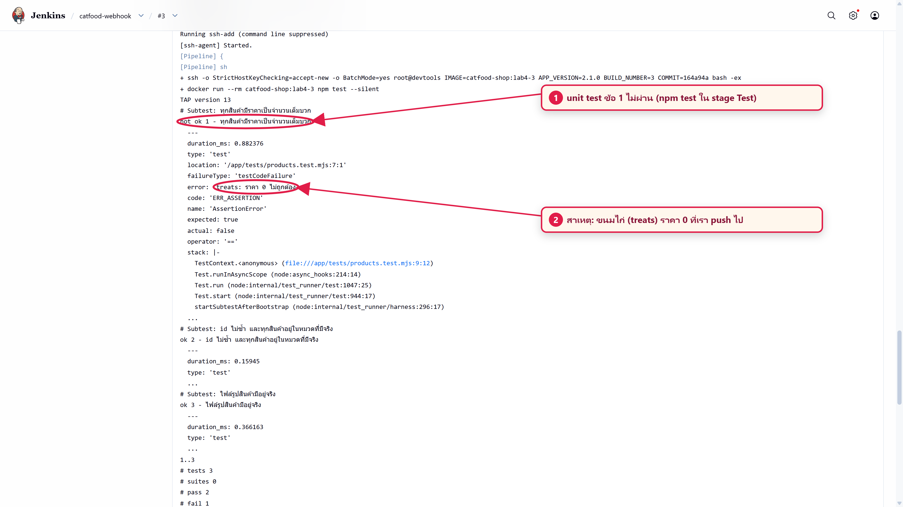</a>

*ภาพที่ 54 Console #3 stage Test: ① `not ok 1 - ทุกสินค้ามีราคาเป็นจำนวนเต็มบวก` — unit test ข้อ 1 ไม่ผ่าน ② `error: 'treats: ราคา 0 ไม่ถูกต้อง'` = สาเหตุคือขนมไก่ (`treats`) ราคา 0 ที่เรา push · ข้อ 2 และ 3 ยัง `ok`*

<a href="./images/lab4_jk_13b_console3_skipped.png">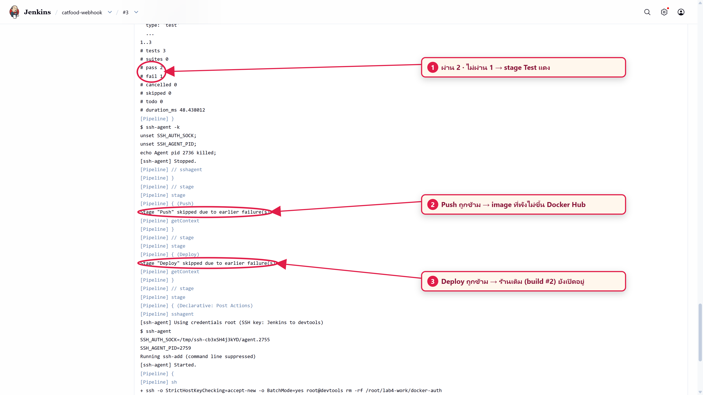</a>

*ภาพที่ 55 ① `# pass 2` `# fail 1` → stage Test แดง ② `Stage "Push" skipped due to earlier failure(s)` → image ที่พังไม่ขึ้น Docker Hub ③ `Stage "Deploy" skipped due to earlier failure(s)` → ร้านเดิม (build #2) ยังเปิดอยู่ · Post Actions ยังรันลบไฟล์ login ตามปกติ แล้วจบด้วย `ERROR: script returned exit code 1` และ `Finished: FAILURE`*

<a href="./images/lab4_jk_14_build3_stages.png">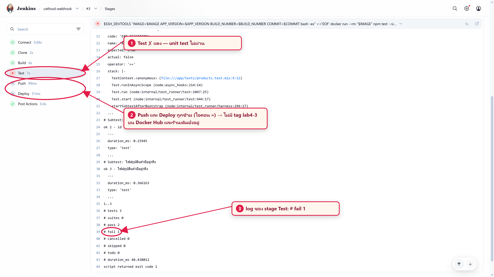</a>

*ภาพที่ 56 หน้า **Stages** ของ #3: ① **Test ✗ แดง** — unit test ไม่ผ่าน ② **Push** และ **Deploy** ถูกข้าม (ไอคอน `»`) → ไม่มี tag `lab4-3` บน Docker Hub และร้านเดิมยังอยู่ ③ log ของ stage Test จบด้วย `# fail 1` และ `script returned exit code 1`*

✅ refresh http://localhost:3000 — **ร้านไม่เปลี่ยน**:

<a href="./images/lab4_shop_03_still_build2.png">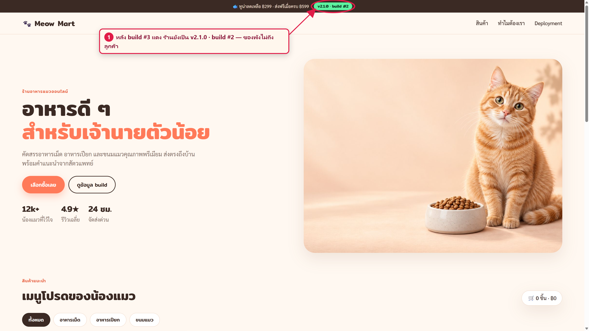</a>

*ภาพที่ 57 ① หลัง build #3 แดง ร้านยังเป็น `v2.1.0 · build #2` — ของพังไม่ถึงลูกค้า*

<a href="./images/lab4_shop_03b_treats_still_149.png">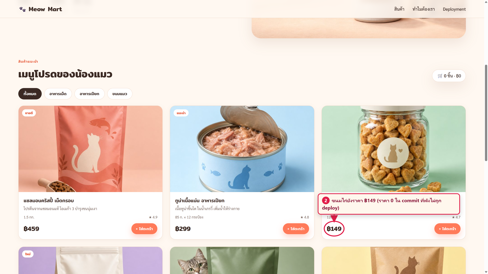</a>

*ภาพที่ 58 ② ขนมไก่รูปหัวใจยังราคา `฿149` — ราคา 0 ใน commit ที่พังไม่ถูก deploy*

แก้กลับด้วย `git revert` (สร้าง commit ใหม่ที่ย้อนการแก้ของ commit ล่าสุด ประวัติเดิมไม่หาย):

```bash
git revert --no-edit HEAD
git push
git log --oneline -4
```

<a href="./images/lab4_term_04_git_revert.png">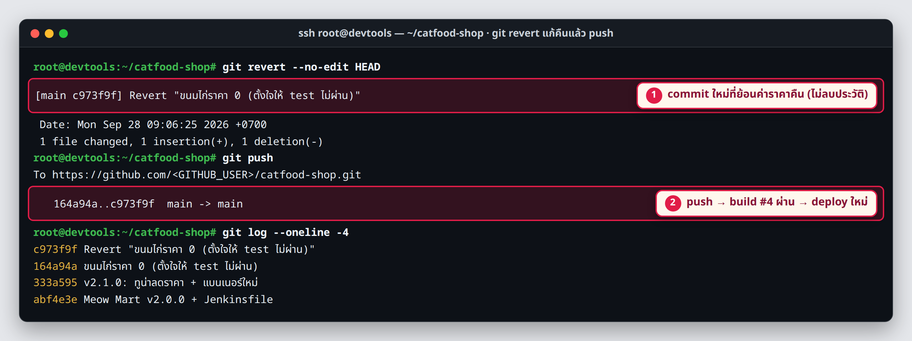</a>

*ภาพที่ 59 ผลจริง: ① `[main c973f9f] Revert "ขนมไก่ราคา 0 (ตั้งใจให้ test ไม่ผ่าน)"` = commit ใหม่ที่ย้อนราคาคืน (ไม่ลบประวัติ) ② `164a94a..c973f9f  main -> main` → build #4 ผ่าน → deploy ใหม่ · `git log --oneline -4` เห็นครบ 4 commit ของแล็บ*

✅ **#4** เขียวครบ 6 stage · refresh ร้าน:

<a href="./images/lab4_shop_04_v210_build4.png"></a>

*ภาพที่ 60 ร้านหลัง revert: chip `v2.1.0 · build #4` (เวอร์ชันเดิมเพราะ revert ไม่ได้แก้ `package.json` แต่เป็น build ใหม่) · ขนมไก่กลับเป็น `฿149` · ทูน่ายัง `฿299`*

<a href="./images/lab4_shop_04b_deployinfo_build4.png">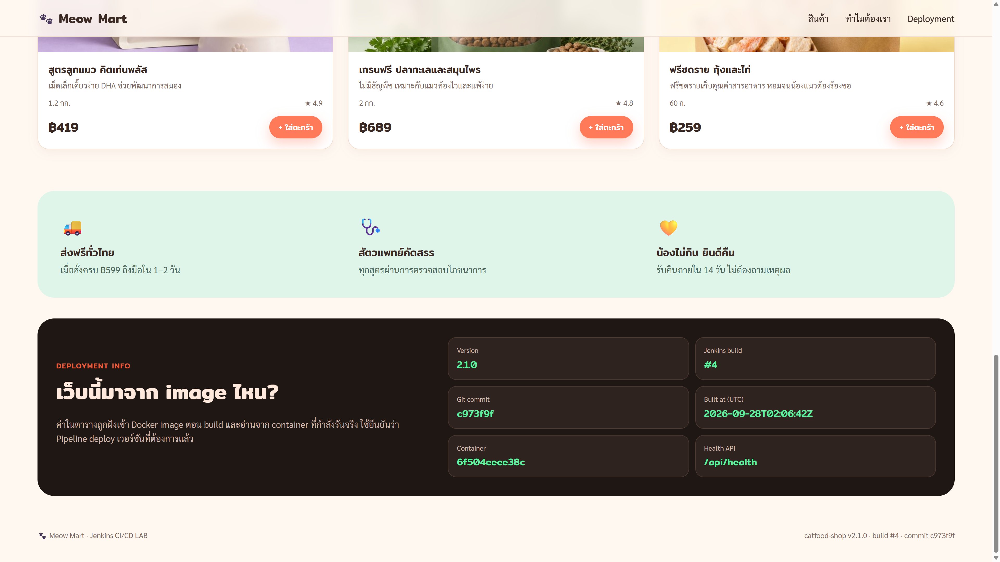</a>

*ภาพที่ 61 **Deployment info** หลัง build #4: Version `2.1.0` · Jenkins build `#4` · Git commit `c973f9f` = commit revert ล่าสุดบน GitHub (ของเราเป็นเลขของตัวเอง)*

## ขั้นที่ 10 — ตรวจปิดแล็บด้วยตา (🌐 ไม่ต้องส่งไฟล์)

| ที่ | สิ่งที่ต้องเห็น |
|---|---|
| Jenkins `catfood-webhook` → **Full Stage View** | #1 ✓ · #2 ✓ · #3 แดงที่ Test (Push/Deploy ระบายแดง = ถูกข้าม) · #4 ✓ (ภาพที่ 62) |
| Jenkins build #2 (และ #3, #4) | **Started by GitHub push by `<GITHUB_USER>`** · มีแค่ #1 ที่เป็น Started by user admin |
| GitHub → Settings → Webhooks → Recent Deliveries | `ping` ✓ · `push` ✓ 3 ครั้ง · `redelivery` ✓ — ทุกแถว ✓ สีเขียว (ภาพที่ 46) |
| Docker Hub → `catfood-shop` → Tags | `lab4-1`, `lab4-2`, `lab4-4` · **ไม่มี** `lab4-3` (ภาพที่ 63) |
| ร้าน http://localhost:3000 | chip `v2.1.0 · build #4` · แบนเนอร์ทูน่า · ทูน่า ฿299 · ขนมไก่ ฿149 · Deployment info **Git commit ตรงกับ** commit ล่าสุดบน GitHub (💻 `git -C ~/catfood-shop log -1 --format=%h`) (ภาพที่ 61) |
| ngrok dashboard → Endpoints | `https://<NGROK_DOMAIN>` online พร้อมป้าย Traffic Policy (ภาพที่ 31) · inspector `localhost:4040` มี `POST /github-webhook/` หลายรายการ |

<a href="./images/lab4_jk_16_full_stage_view.png">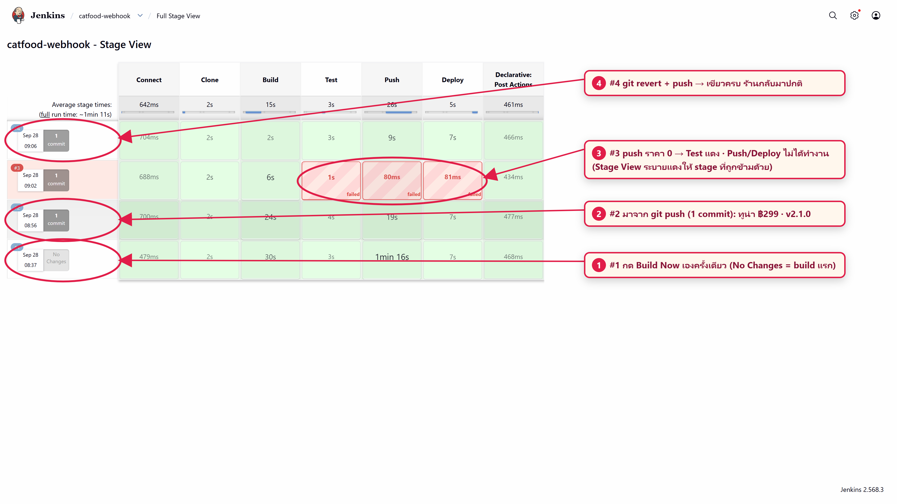</a>

*ภาพที่ 62 **Full Stage View** (เมนูซ้ายของ job): ① #1 กด Build Now เองครั้งเดียว (`No Changes` = build แรก) ② #2 มาจาก git push (1 commit): ทูน่า ฿299 · v2.1.0 ③ #3 push ราคา 0 → Test แดง · Push/Deploy ไม่ได้ทำงาน (Stage View ระบายแดงให้ stage ที่ถูกข้ามด้วย) ④ #4 git revert + push → เขียวครบ ร้านกลับมาปกติ*

<a href="./images/lab4_hub_01_tags.png">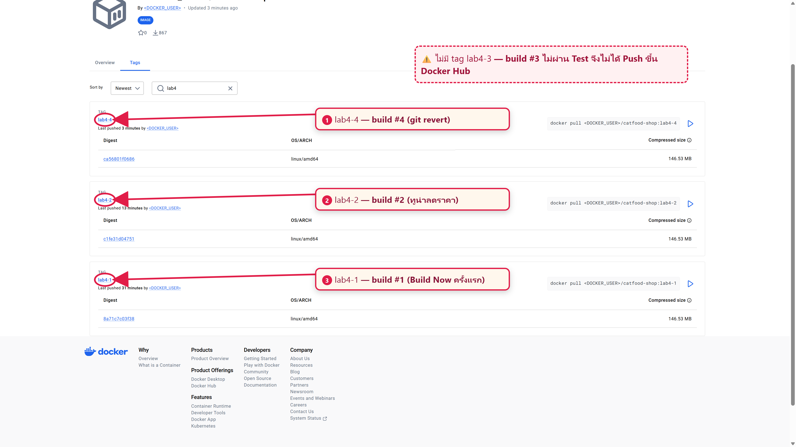</a>

*ภาพที่ 63 หน้า **Tags** ของ `<DOCKER_USER>/catfood-shop` บน Docker Hub (ค้น `lab4`): ① `lab4-4` — build #4 (git revert) ② `lab4-2` — build #2 (ทูน่าลดราคา) ③ `lab4-1` — build #1 (Build Now ครั้งแรก) · ⚠️ **ไม่มี `lab4-3`** — build #3 ไม่ผ่าน Test จึงไม่ได้ Push · ชื่อบัญชีปิดเป็น `<DOCKER_USER>`*

## ขั้นที่ 11 — ปิด ngrok และเก็บกวาด

🖥️ host — **ทำทุกครั้งที่เลิกทำแล็บ**:

```bash
docker rm -f ngrok
docker ps --filter name=ngrok
```

✅ `docker ps` ไม่มี `ngrok` แล้ว · หน้า Endpoints ใน ngrok dashboard ว่าง · ตอนนี้ Jenkins ไม่ถูกเปิดออก internet แล้ว (push ตอนนี้ GitHub จะส่งไม่ถึง delivery ขึ้น ✗)

- **ทำแล็บต่อวันหลัง:** `cd` เข้าโฟลเดอร์แล็บแล้วรันคำสั่งข้อ 5.5 ซ้ำ — dev domain เดิม จึงไม่ต้องแก้ webhook
- **ไม่ใช้ต่อแล้ว:** GitHub → repo → Settings → Webhooks → **Edit** → เอาติ๊ก **Active** ออก → **Update webhook** (หรือ **Delete**)
- **token ของ GitHub** หมดอายุเองใน 30 วัน · ถ้าไม่ใช้แล้วลบได้ทันทีที่ Settings → Developer settings → Personal access tokens → Fine-grained tokens → **Delete** (ถ้าลบ Jenkins จะ clone private repo ไม่ได้อีก)
- `jenkins`, `devtools` และ `catfood-web` เก็บไว้ใช้แล็บถัดไป

## แก้ปัญหาที่พบบ่อย

ข้อความที่ระบุว่า **(พบจริง)** มาจากรอบทดสอบของแล็บนี้ · รหัส `ERR_NGROK_*` อ้างตามเอกสารของ ngrok ไม่ได้ทดสอบจริงในแล็บ

| อาการ | สาเหตุที่พบบ่อย | วิธีแก้ |
|---|---|---|
| `git push` ขึ้น `Invalid username or token. Password authentication is not supported for Git operations.` **(พบจริง)** | ใส่รหัสผ่านบัญชีแทน token · token หมดอายุ/คัดลอกไม่ครบ | ตอนถาม Password วาง `<GITHUB_TOKEN>` · ถ้า git จำค่าผิดไว้: `git credential-cache exit` แล้ว push ใหม่ |
| `git push` ขึ้น `Permission to <GITHUB_USER>/catfood-shop.git denied` / `403` | token ไม่ได้เลือก repo นี้ หรือ Contents เป็น Read-only | แก้ token ตามข้อ 2.2 (Only select repositories = `catfood-shop`, Contents **Read and write**) |
| `git push` ขึ้น `This repository moved. Please use the new location: ...` **(พบจริง)** และ webhook อาจไม่ build | พิมพ์ชื่อบัญชีตัวพิมพ์เล็ก/ใหญ่ไม่ตรงกับ GitHub · GitHub ยังรับ push แต่ payload ของ webhook ใช้ชื่อที่ถูกต้อง Jenkins จึงอาจจับคู่กับ Repository URL ของ job ไม่ได้ | `git remote set-url origin https://github.com/<GITHUB_USER>/catfood-shop.git` ด้วยตัวพิมพ์ตรงกับบัญชี · แก้ Repository URL ของ job และ Username ใน `github-token` ให้ตรงด้วย |
| `git push` ขึ้น `src refspec main does not match any` | ยังไม่ได้ commit หรือ branch ชื่อ `master` | `git branch -M main` แล้ว push ใหม่ |
| `git push` ขึ้น `rejected ... (fetch first)` | ตอนสร้าง repo เปิด Add README | `git pull --rebase origin main` แล้ว push |
| หน้า Configure ของ job ขึ้นแดง `Failed to connect to repository : ... Invalid username or token. Password authentication is not supported for Git operations.` **(พบจริง)** / build ล้มก่อน stage แรก | Repository URL เป็น private repo แต่ Credentials เป็น `- none -` · หรือ token/username ใน `github-token` ผิด | เลือก Credentials `github-token` (ข้อ 4.4) · ตรวจ token ตามข้อ 2.2 |
| build ล้มทันที `No such DSL method 'githubPush'` | ไม่มี GitHub plugin | Manage Jenkins → Plugins → Available plugins → **GitHub** → Install |
| Clone ล้ม `version ใน package.json ต้องเป็นรูปแบบ X.Y.Z` | แก้ `"version"` ผิดรูปแบบ เช่น `2.1` | แก้เป็น `2.1.0` แล้ว commit + push |
| Delivery ขึ้น `403` body `blocked by ngrok traffic policy (LAB 4)` **(ข้อความพบจริง)** | Payload URL ไม่ตรง `/github-webhook/` เป๊ะ (ลืม `/` ท้าย, พิมพ์ path ผิด) · policy บล็อกทุกอย่างที่ไม่ใช่ `POST /github-webhook/` | แก้ Payload URL ให้ลงท้าย `/github-webhook/` แล้วกด Redeliver |
| `curl -X POST https://<NGROK_DOMAIN>/github-webhook/` ได้ `400` **(พบจริง)** | ปกติ — ผ่าน policy ถึง Jenkins แล้ว แต่ไม่มี header `X-GitHub-Event` ของ GitHub | ไม่ต้องแก้ ใช้ยืนยันว่าทางเดิน ngrok → jenkins ใช้ได้ |
| Delivery ✓ 200 แต่ไม่มี build ใหม่ | (1) ไม่มี commit ใหม่ เช่น Redeliver **(พบจริง: `No changes`)** (2) job ไม่ได้ติ๊ก trigger และยังไม่เคย build (3) Repository URL ของ job ไม่ตรงกับ repo ที่ push (ชื่อบัญชี/ตัวพิมพ์) (4) push ไป branch อื่นที่ไม่ใช่ `main` | ดู **GitHub Hook Log** ของ job และ `docker logs jenkins 2>&1 \| grep -E "PushEvent\|Triggering"` · มี `Received PushEvent` แต่ไม่มี `Poked` = URL ไม่ตรง · ติ๊ก trigger + Build Now หนึ่งครั้ง · push ไป `main` |
| Delivery ✗ มี signature/secret ผิด (ไม่ใช่ 200) | Secret ใน GitHub ไม่ตรงกับ `github-webhook-secret` หรือยังไม่ได้ตั้ง Shared secrets | ตั้งค่าเดียวกันทั้งสองฝั่ง (ข้อ 6.2–6.4) แล้ว Redeliver |
| Delivery ✗ ขึ้น 404 / endpoint offline (`ERR_NGROK_3200` ตามเอกสาร ngrok) | container `ngrok` หยุดหรือถูกลบ | `docker start ngrok` หรือรันข้อ 5.5 ใหม่ แล้ว Redeliver |
| Delivery ✗ ขึ้น 502 (`ERR_NGROK_8012` ตามเอกสาร ngrok) | ngrok ต่อ `jenkins:8080` ไม่ได้: ไม่ได้รันด้วย `--network cicd-net`, พิมพ์ upstream ผิด หรือ `jenkins` หยุด | รันข้อ 5.5 ตรงตัว · `docker start jenkins` |
| `docker logs ngrok` มี error เรื่อง authtoken (`ERR_NGROK_105` / `ERR_NGROK_4018` ตามเอกสาร ngrok) | ไม่ได้ใส่ `NGROK_AUTHTOKEN` หรือคัดลอกผิด/ถูก Reset | คัดลอกใหม่จาก Your Authtoken → `docker rm -f ngrok` แล้วรันข้อ 5.5 ใหม่ |
| `docker logs ngrok` มี error session limit / endpoint already online (`ERR_NGROK_108` / `ERR_NGROK_334` ตามเอกสาร ngrok) | บัญชีเดียวกันมี ngrok อีกตัวออนไลน์อยู่ (เครื่องอื่น / container เก่า / เพื่อนใช้ authtoken เดียวกัน) | ปิดตัวอื่น (`docker ps -a`, dashboard → Agents) ให้เหลือตัวเดียว · ใช้บัญชีของตัวเอง |
| `docker logs ngrok` บอกว่าใช้โดเมนนี้ไม่ได้ | `--url` ไม่ตรงกับ dev domain ในบัญชี (สะกดผิด, ใช้ของเพื่อน, ใส่ `.app` แทน `.dev`) | คัดลอกโดเมนจากหน้า Domains ของบัญชีตัวเอง (ข้อ 5.4) |
| `docker logs ngrok` หาไฟล์ policy ไม่เจอ (`no such file`) | ไม่ได้ `cd` เข้าโฟลเดอร์แล็บที่มี `ngrok/` ก่อนรัน · `${PWD}` จึง mount ผิดที่ | `docker rm -f ngrok` → `cd 04_Jenkins/001_Jenikin/004_LAB_Webhook_Trigger` → รันข้อ 5.5 ใหม่ |
| เปิด http://localhost:4040 ไม่ได้ | ไม่ได้ publish `-p 127.0.0.1:4040:4040` หรือ port 4040 ถูกใช้อยู่ | รันข้อ 5.5 ตรงตัว · ปิดโปรแกรมที่ใช้ port 4040 |
| Test ล้ม `not ok 1 - ทุกสินค้ามีราคาเป็นจำนวนเต็มบวก` / `treats: ราคา 0 ไม่ถูกต้อง` **(พบจริง)** | ข้อมูลสินค้าผิด (ตั้งใจในขั้นที่ 9) · Push/Deploy ถูกข้าม ร้านเดิมยังอยู่ | แก้ข้อมูลแล้ว push หรือ `git revert --no-edit HEAD && git push` |
| log ของ stage Push มี `...: Waiting` ซ้ำหลายสิบบรรทัด | ปกติของ `docker push` ที่รันแบบไม่มี TTY | ไม่ต้องแก้ ดูแค่ว่ามี `lab4-N: digest: sha256:...` |
| push ติดกันหลายครั้ง แต่จำนวน build น้อยกว่าจำนวน push | build ก่อนหน้ายังรันอยู่ (`disableConcurrentBuilds`) การ poll รอบถัดไปจึงรวบหลาย commit เป็น build เดียว | ปกติ — build ล่าสุดมี commit ล่าสุดเสมอ |
| Connect ล้ม `Permission denied (publickey)` / `Host key verification failed` | ปัญหาเดียวกับ LAB 3 | ดูตารางแก้ปัญหาของ [LAB 3](../003_LAB_Docker_Build_Push/README.md) |
