# LAB 5 — Push แล้ว Build ทันทีด้วย GitHub webhook ผ่าน smee.io

แล็บประมาณ 30 นาทีนี้เปลี่ยน `hello-ci-pipeline` จาก Poll SCM เป็น push model: เมื่อ GitHub รับ commit จะส่ง webhook ผ่าน smee.io เข้าสู่ Jenkins ที่อยู่ใน Docker หลัง NAT แล้ว Generic Webhook Trigger (GWT) จะสร้าง build เฉพาะ push ของ branch `main` เมื่อจบแล็บ นักศึกษาจะผูก SHA เดียวกันได้ครบ GitHub delivery → relay HTTP 200 → Jenkins cause → checkout

## ทฤษฎีก่อนลงมือ

Poll SCM กับ webhook ตรวจการเปลี่ยนแปลงเดียวกัน แต่ผู้เริ่มการสื่อสารต่างกัน

| แบบ | ผู้เริ่ม | พฤติกรรม | ข้อแลกเปลี่ยน |
|---|---|---|---|
| Pull: Poll SCM | Jenkins ถาม GitHub ตามเวลา | มี request แม้ไม่มี commit และรอถึงรอบถัดไป | ตั้งง่ายเมื่อ Jenkins ออก internet ได้ |
| Push: webhook | GitHub แจ้งเมื่อเกิด event | ไม่มี polling delay และส่งเฉพาะเมื่อมีเหตุการณ์ | GitHub ต้องเข้าถึง receiver ได้ |

ปัญหาใหม่ของแล็บคือ GitHub อยู่บน internet แต่ Jenkins อยู่ใน Docker หลัง NAT: GitHub เปิด connection เข้าชื่อ `jenkins` บน `cicd-net` โดยตรงไม่ได้ เราจึงใช้ relay pattern ของ smee.io ซึ่งเป็นบริการสำหรับงานพัฒนา/แล็บของโครงการ GitHub:

```text
GitHub.com                    internet                   Docker: cicd-net
push/ping ──POST──> smee.io channel <──SSE── smee-client ──POST──> Jenkins GWT
                                                     smee-hello       token + filter
```

| Hop | ต้นทาง → ปลายทาง | หลักฐาน |
|---:|---|---|
| 1 | GitHub → `<SMEE_HELLO_URL>` | GitHub delivery เป็น 2xx และ payload มี `ref`/`after` |
| 2 | smee.io → `smee-client` | tab smee ที่เปิดค้างเห็น event สด |
| 3 | `smee-hello` → `http://jenkins:8080/...` | `docker logs smee-hello` มี POST และ 200 |
| 4 | GWT → `hello-ci-pipeline` | cause `GitHub push <SHA>` และ checkout `<SHA>` |

ภาพรวมของ relay ทั้งสี่ hop อยู่ใน slide **ตอนที่ 5.3 — GitHub Webhook + smee relay** (diagram D9 ครึ่งล่าง)

GWT ใช้ token แยกต่อ job (`cicd2569-hello`) เพื่อไม่ให้ request เดียวเลือกหลาย job และอ่าน `ref`/`after` จาก JSON จากนั้น filter `$ref` ด้วย `^refs/heads/main$` จึงกัน GitHub `ping` และ push จาก branch อื่น

> **Safety — อ่านก่อนสร้าง channel:** URL ของ smee channel เป็น capability; ผู้ที่รู้ URL สามารถส่ง/อ่าน traffic ของ channel ได้ ห้ามแชร์ URL จริง ห้ามใส่ใน README, screenshot ดิบ หรือ log ที่ส่งต่อ และเปิดใช้เฉพาะแล็บนี้ Topology นี้เว้น GitHub webhook Secret ว่าง เพราะ smee-client ส่งต่อ payload แต่ไม่มี receiver ในเส้นทางนี้ที่ตรวจ `X-Hub-Signature-256`; ใส่ secret จึงสร้างความมั่นใจผิด ใน production ให้ใช้ public HTTPS endpoint ที่ควบคุมเอง ตรวจ signature ด้วย secret จำกัด source/rate และจัดการ secret ในระบบที่เหมาะสม

## 🎯 Learning Objectives — ผลลัพธ์การเรียนรู้

- ติดตั้ง Generic Webhook Trigger 2.4.2 ผ่าน Jenkins UI
- เปิด smee channel และรัน relay แบบ pinned image บน `cicd-net`
- ปิด Poll SCM แล้วกำหนด GWT token, `ref`/`after`, cause และ main filter
- พิสูจน์ว่า GitHub ping ได้ 2xx แต่ไม่สร้าง build
- push จริงหนึ่งครั้งแล้ว correlate SHA ครบสี่ hop

## การทดลองที่ 1 — สภาพจบ LAB 4 พร้อมหรือไม่? (~2 นาที)

**คำถาม:** inner Jenkins ยังทำงานและ `hello-ci-pipeline` อยู่ในสถานะ Poll SCM จาก LAB 4 หรือไม่?

```bash
docker ps
```

✅ **ผลที่สังเกตได้จากการรันจริง**

```text
CONTAINER ID   IMAGE                 COMMAND                  STATUS       PORTS                                                    NAMES
<id>           jenkins-docker:2569   "/usr/bin/tini -- /u…"   Up <เวลา>    0.0.0.0:8080->8080/tcp, 50000/tcp                       jenkins
```

หากยังไม่จบ LAB 4 ให้กู้จาก devtools โดยเก็บค่าจริงเฉพาะ shell:

```bash
export GITHUB_USER='<GITHUB_USER>'
export GITHUB_TOKEN='<GITHUB_TOKEN>'

(
  cd "$COURSE_ROOT"
  bash tools/bootstrap/up_to_lab4.sh
)
```

✅ ต้องจบด้วยข้อความว่า LAB 4 verified และ job เปิด Poll SCM; token ต้องไม่ถูกพิมพ์หรือเขียนลงไฟล์

## การทดลองที่ 2 — ติดตั้ง GWT 2.4.2 อย่างไร? (~4 นาที)

**คำถาม:** จะเพิ่ม webhook endpoint ให้ Jenkins และยืนยันว่า plugin active หลัง restart ได้อย่างไร?

1. เปิด `http://localhost:8080` แล้วไป **Manage Jenkins → Plugins → Available plugins**
2. ค้นหา `generic-webhook-trigger` แล้วเลือก **Generic Webhook Trigger 2.4.2**
3. กด **Install** และรอหน้า Download progress จนติดตั้งครบ
4. เลือก **Restart Jenkins when installation is complete and no jobs are running** แล้วรอหน้า login กลับมา


*ภาพที่ 1: หน้า Jenkins จริง แสดงผลค้น รุ่น 2.4.2 ช่องเลือก และปุ่ม Install*


*ภาพที่ 2: หน้า Download progress จริงก่อนสั่ง restart Jenkins*

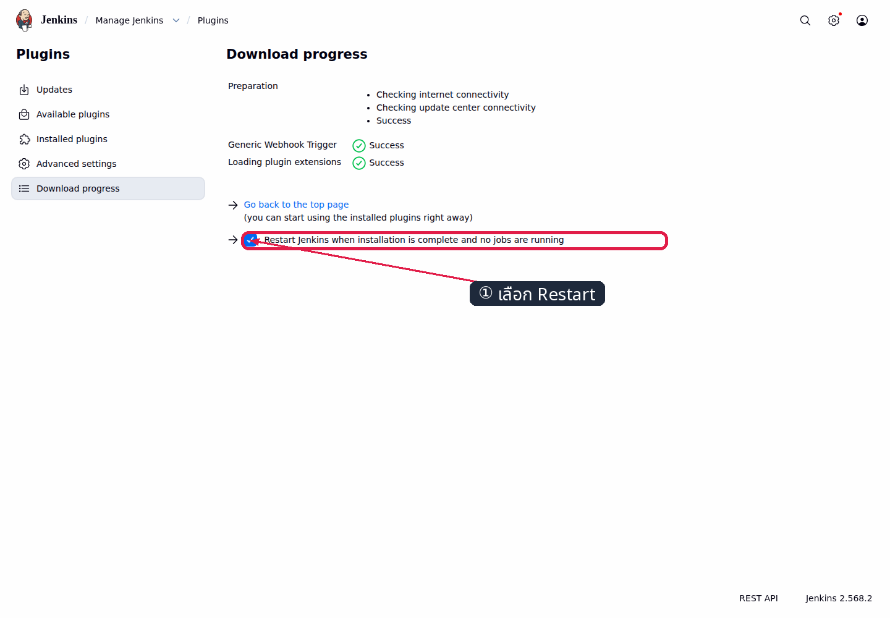

*ภาพที่ 2.1: หน้า Jenkins จริง มี marker ชี้ checkbox Restart Jenkins after installation ก่อนรอหน้า login กลับมา*

```bash
until curl -fsS http://localhost:8080/login >/dev/null
do
  sleep 2
done
```

✅ **สิ่งที่ต้องเห็นใน Installed plugins**

```text
Generic Webhook Trigger  2.4.2  Enabled
```

## การทดลองที่ 3 — เปิด channel ก่อน event แรกทำไม? (~2 นาที)

**คำถาม:** เราจะมี public URL ให้ GitHub ส่งเข้าและไม่พลาด ping แรกได้อย่างไร?

1. เปิด [https://smee.io](https://smee.io) แล้วกด **Start a new channel**
2. เก็บ URL ที่ได้ไว้ใน shell เป็น `SMEE_HELLO_URL='<SMEE_HELLO_URL>'`
3. **เปิด tab channel นี้ค้างไว้ตลอดการทดลอง** แล้วจึงไปขั้น relay และ Add webhook

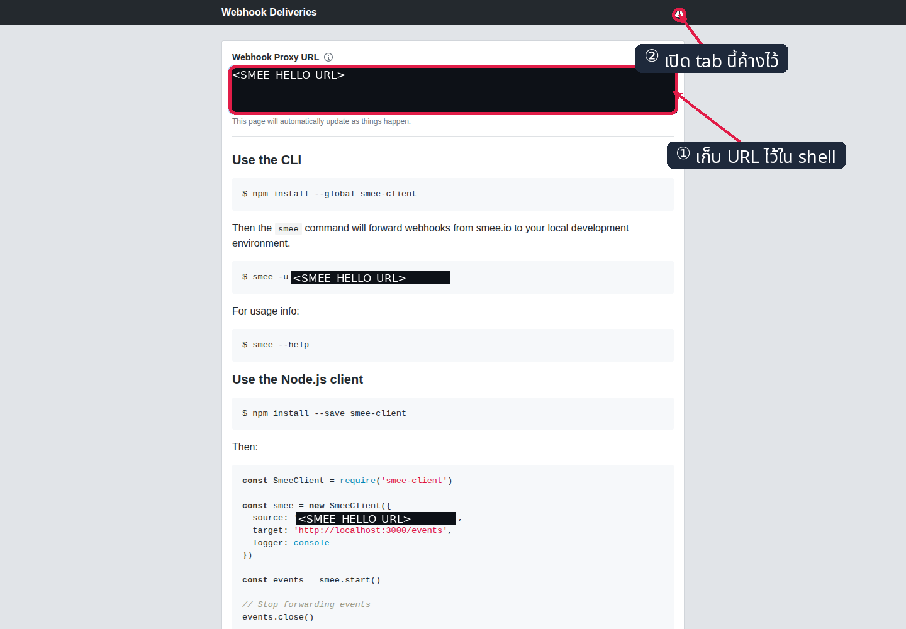

*ภาพที่ 3: หน้า smee.io จริง โดย mask channel id เป็น `<SMEE_HELLO_URL>` ตั้งแต่ capture และเปิด tab ไว้ก่อนสร้าง hook*

> smee.io ส่ง event สดและไม่ replay event ที่มาก่อนเปิด tab หรือเกิดตอน relay หลุด หากพลาดหลักฐาน ห้ามใช้ event เก่าแทน: เปิด tab/ต่อ relay ให้ `Connected` แล้ว push commit ใหม่

## การทดลองที่ 4 — relay จะเข้าถึง Jenkins หลัง NAT ได้อย่างไร? (~3 นาที)

**คำถาม:** smee-client ต้องอยู่ network ใดและ forward ไป target ใด?

```bash
docker run -d --name smee-hello --restart unless-stopped --network cicd-net deltaprojects/smee-client@sha256:20ea24c8c81bb3f3aa332c8939503e3c5bee048bb5a98ba2249d73a41a556e33 --url <SMEE_HELLO_URL> --target 'http://jenkins:8080/generic-webhook-trigger/invoke?token=cicd2569-hello'
docker logs smee-hello
```

✅ **ผลที่สังเกตได้จากการรันจริง**

```text
Forwarding <SMEE_HELLO_URL> to http://jenkins:8080/generic-webhook-trigger/invoke?token=cicd2569-hello
Connected
```

image ถูก pin ด้วย digest เพื่อให้ห้องเรียนใช้ artifact เดียวกัน `--restart unless-stopped` ทำให้ relay ต่อ channel เดิมหลัง container/Jenkins กลับมา และ URL กู้ได้จาก `docker inspect smee-hello` โดยไม่ต้อง mint ใหม่

## การทดลองที่ 5 — ตั้ง GWT ให้ ping และ branch อื่นไม่ build อย่างไร? (~5 นาที)

**คำถาม:** Job ต้องอ่าน field ใดจาก payload ก่อนตัดสินใจ trigger?

1. ไป **Jenkins → hello-ci-pipeline → Configure → Triggers**
2. เอาเครื่องหมาย **Poll SCM** ออก แล้วเลือก **Generic Webhook Trigger**
3. ใต้ **Post content parameters** กด **Add** สองครั้ง: กรอก `ref` → `$.ref` และ `after` → `$.after` โดยคง Expression type เป็น JSONPath
4. กรอก **Token** เป็น `cicd2569-hello` และ **Cause** เป็น `GitHub push $after`
5. เลื่อนถึง **Optional filter** กรอก **Expression** เป็น `^refs/heads/main$` และ **Text** เป็น `$ref`
6. ตรวจค่าทั้งหมดแล้วกด **Save**

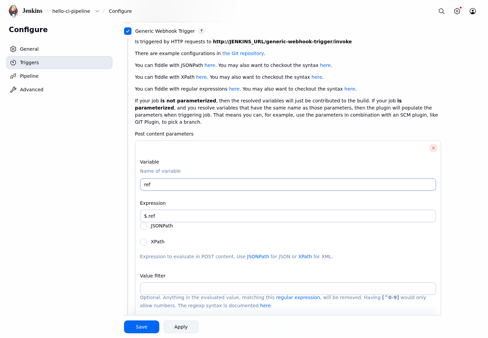

*ภาพที่ 4: หน้า Jenkins จริง แสดง Post content parameter ตัวแรก `ref=$.ref`*

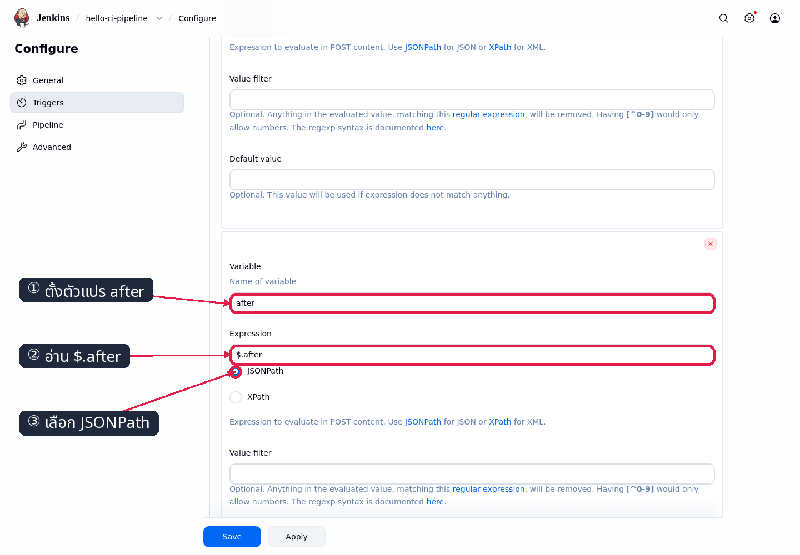

*ภาพที่ 4.1: หน้า Jenkins จริง แสดง parameter ตัวที่สอง `after=$.after` และเลือก JSONPath*

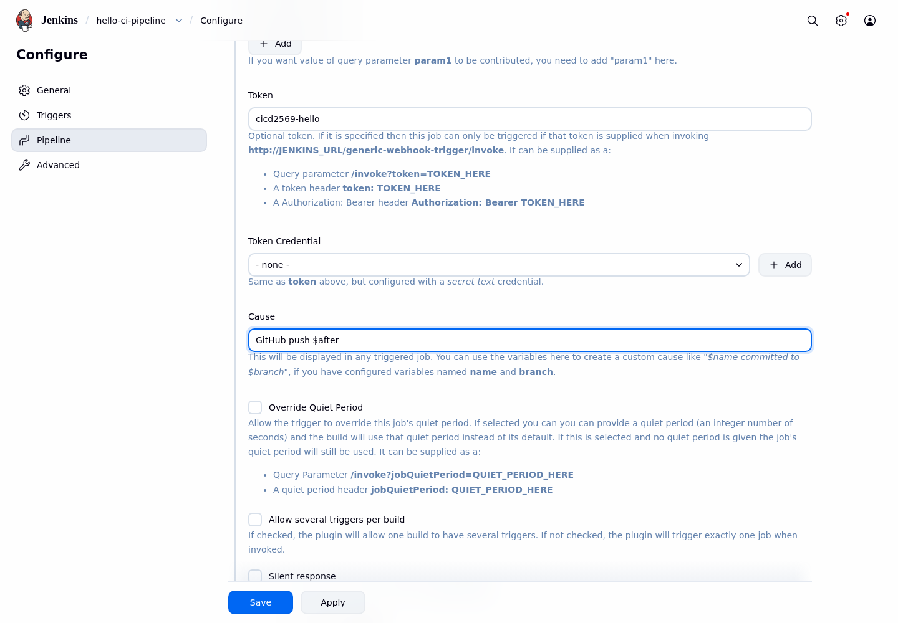

*ภาพที่ 4.2: หน้า Jenkins จริง แสดง token ต่อ job และ cause `GitHub push $after`*

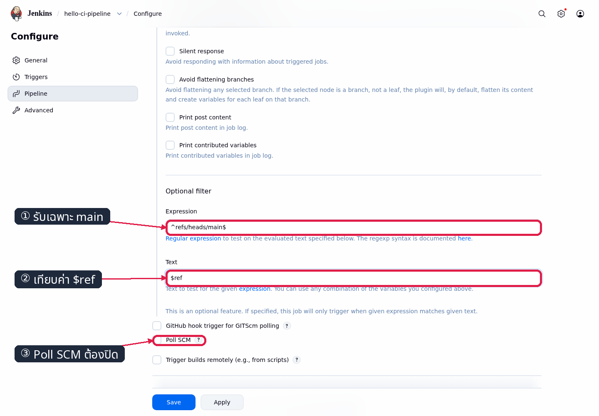

*ภาพที่ 5: หน้า Jenkins จริง แสดง expression `^refs/heads/main$` และ text `$ref` ก่อน Save*

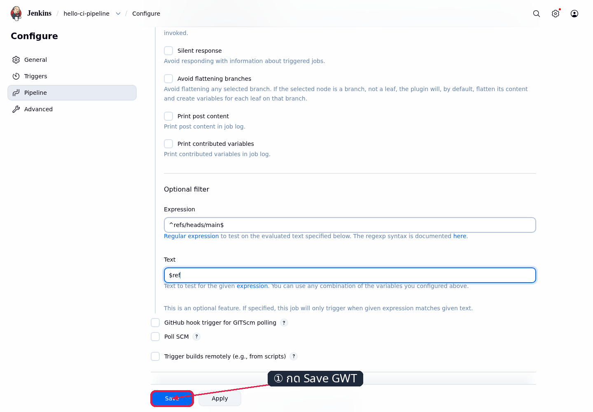

*ภาพที่ 5.1: หน้า Jenkins จริง มี marker ชี้ปุ่ม Save หลังตั้ง ref/after/token/cause/filter ครบ*

✅ **ค่าหลัง Save**

```text
Poll SCM: off
Post content parameters: ref=$.ref, after=$.after
Token: cicd2569-hello
Cause: GitHub push $after
Filter: $ref matches ^refs/heads/main$
```

## การทดลองที่ 6 — endpoint กับ filter ทำงานจริงไหม? (~2 นาที)

**คำถาม:** จะพิสูจน์ว่า request ไม่มี `ref` ถูกกัน แต่ payload main ถูก trigger โดยยังไม่เกี่ยวกับ internet ได้อย่างไร?

รันจาก devtools; คำสั่งแรกไม่มี JSON body จึงไม่ match filter:

```bash
curl -s -X POST 'http://localhost:8080/generic-webhook-trigger/invoke?token=cicd2569-hello'
```

✅ **response จริงของ GWT 2.4.2**: job ถูกพบด้วย token แต่ `triggered:false` เพราะ `$ref` ว่าง

```json
{"jobs":{"hello-ci-pipeline":{"triggered":false,"resolvedVariables":{"after":"","ref":""}}},"message":"Triggered jobs."}
```

บางรุ่น/กรณีที่ token หา job ไม่พบอาจใช้ข้อความ `Did not find any jobs to trigger!`; ในแล็บนี้ให้ตัดสิน filter จาก `triggered:false` และ build number ไม่เพิ่ม ไม่ใช่จาก message รวมเพียง field เดียว

```bash
curl -s -X POST -H 'Content-Type: application/json' -d '{"ref":"refs/heads/main","after":"0000000000000000000000000000000000000000"}' 'http://localhost:8080/generic-webhook-trigger/invoke?token=cicd2569-hello'
```

✅ **ผลที่สังเกตได้จากการรันจริง**

```json
{"jobs":{"hello-ci-pipeline":{"triggered":true}},"message":"Triggered jobs."}
```

response จริงมี field เพิ่มได้ แต่ต้องมี `hello-ci-pipeline`, `triggered:true` และ `Triggered jobs.`

ก่อนเปิดหน้า Add webhook ต้องรอ local probe ด้านบนจบและจดเลข build ล่าสุดเป็น settled baseline:

```bash
until curl -gfsS -u admin:admin2569 'http://localhost:8080/job/hello-ci-pipeline/lastBuild/api/json?tree=building' | grep -q '"building":false'
do
  sleep 1
done
LAB5_BEFORE_PING="$(curl -gfsS -u admin:admin2569 'http://localhost:8080/job/hello-ci-pipeline/lastBuild/api/json?tree=number' | python3 -c 'import json,sys; print(json.load(sys.stdin)["number"])')"
printf 'before ping: %s\n' "$LAB5_BEFORE_PING"
```

ห้ามข้าม baseline นี้และห้ามกด Build Now ระหว่างขั้น Add webhook/ping

## การทดลองที่ 7 — เพิ่ม GitHub webhook แล้ว ping ต้องไม่ build (~4 นาที)

**คำถาม:** GitHub เข้าถึง channel ได้ แต่ GWT กัน event ที่ไม่ใช่ push main จริงหรือไม่?

1. ยืนยันว่า tab smee จากการทดลองที่ 3 ยังเปิดและ `docker logs smee-hello` มี `Connected`
2. ไป repository `hello-ci` แล้วเลือก **Settings → Webhooks → Add webhook**
3. กรอก Payload URL=`<SMEE_HELLO_URL>`, Content type=`application/json`, Secret=ว่าง และเปิด SSL verification
4. เลือก **Just the push event**, เปิด **Active** แล้วกด **Add webhook**

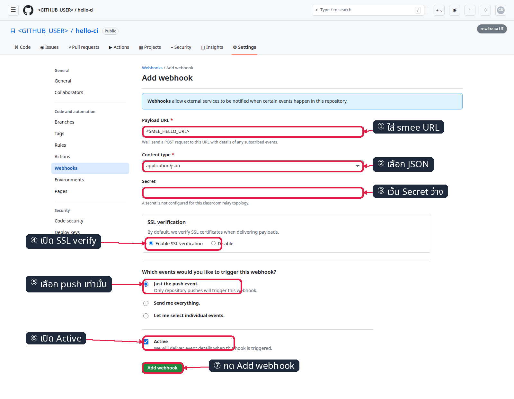

*ภาพที่ 6: ภาพจำลอง — UI จริงอาจต่างเล็กน้อย; marker แสดง Payload URL, JSON, Secret ว่าง, SSL verify, push-only, Active และ Add webhook ดู [GitHub Docs: Creating webhooks](https://docs.github.com/en/webhooks/using-webhooks/creating-webhooks); หลังบันทึกต้องตรวจ postcondition ผ่าน delivery/API*

GitHub ส่ง `ping` ทันทีหลังสร้าง hook ให้กลับ tab smee และดู event/response จาก tab นั้นร่วมกับ `docker logs smee-hello`; หน้า GitHub **Recent Deliveries** ใช้เป็นหมายเหตุเสริมเมื่อ session ยัง login อยู่ ไม่ใช่หลักฐานบังคับ

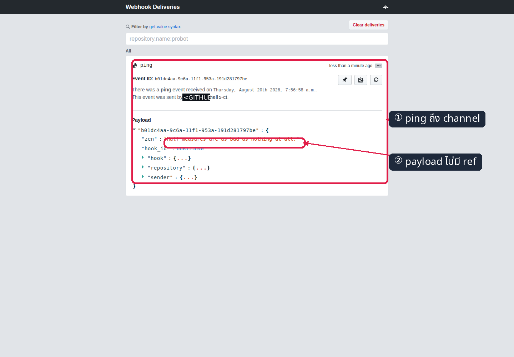

*ภาพที่ 7: หลักฐานจริงว่า tab ที่เปิดค้างรับ ping; channel และชื่อบัญชีถูก mask ตอน capture*

```bash
docker logs --tail 20 smee-hello
LAB5_AFTER_PING="$(curl -gfsS -u admin:admin2569 'http://localhost:8080/job/hello-ci-pipeline/lastBuild/api/json?tree=number' | python3 -c 'import json,sys; print(json.load(sys.stdin)["number"])')"
test "$LAB5_AFTER_PING" -eq "$LAB5_BEFORE_PING"
printf 'ping delta: %s -> %s (+0)\n' "$LAB5_BEFORE_PING" "$LAB5_AFTER_PING"
```

✅ **Ping acceptance**

```text
GitHub ping delivery: 2xx
smee tab: ping event appears
Jenkins build number before ping = after ping
```

ping ไม่มี `ref=refs/heads/main` จึงผ่าน relay ด้วย HTTP ได้ แต่ filter ไม่สร้าง build นี่คือคนละคำถามระหว่าง “delivery ถึงหรือไม่” กับ “event ควร build หรือไม่”

> **ทางเลือกอัตโนมัติสำหรับผู้สอน:** ขั้น GitHub ที่ต้อง login ใช้ API แทน UI โดยยังเก็บภาพจำลองไว้สอนลำดับคลิก
>
> ```bash
> (
>   cd "$COURSE_ROOT"
>   /opt/venv/bin/python tools/ui/lab5_payload.py --action add-hook
> )
> ```

## การทดลองที่ 8 — relay restart แล้วยังใช้ channel เดิมหรือไม่? (~2 นาที)

```bash
docker restart smee-hello
RELAY_STARTED_AT="$(docker inspect -f '{{.State.StartedAt}}' smee-hello)"
docker inspect -f '{{.Config.Image}} {{.HostConfig.RestartPolicy.Name}} {{json .NetworkSettings.Networks}} {{json .Config.Cmd}}' smee-hello
docker logs --since "$RELAY_STARTED_AT" smee-hello
```

✅ ต้องเห็น pinned digest, `unless-stopped`, `cicd-net`, URL/target เดิม และ `Connected` หลัง `StartedAt` เหตุการณ์ที่เกิดระหว่าง disconnect จะไม่ replay จึงต้องรอ Connected ก่อน push probe ในการทดลองที่ 9

## การทดลองที่ 9 — push หนึ่งครั้งสร้าง exactly one build หรือไม่? (~4 นาที)

**คำถาม:** SHA จาก push จะเดินทางครบสี่ hopและเกิด build เพียงหนึ่งรายการได้หรือไม่?

จด baseline หลัง reconnect ก่อน push probe:

```bash
LAB5_BEFORE_PUSH="$(curl -gfsS -u admin:admin2569 'http://localhost:8080/job/hello-ci-pipeline/lastBuild/api/json?tree=number' | python3 -c 'import json,sys; print(json.load(sys.stdin)["number"])')"
printf 'before push: %s\n' "$LAB5_BEFORE_PUSH"
```

```bash
cd "$HOME/hello-ci"
git pull --ff-only origin main

git config user.name Student
git config user.email student@example.invalid

printf '\n# Webhook probe %s\n' "$(date -u +%Y-%m-%dT%H:%M:%SZ)" >> hello.sh
printf 'GitHub webhook payload proof\n' > webhook-proof.txt

git add hello.sh webhook-proof.txt
git commit -m 'Verify immediate GitHub webhook build'
time git push origin main
```

เมื่อถาม credential ให้กรอก Username=`<GITHUB_USER>` และ Password=`<GITHUB_TOKEN>` ที่ prompt ห้ามใส่ PAT ใน URL และห้ามใช้ `credential.helper store`

รอ build จบแล้วบังคับเทียบ delta ว่า push นี้เพิ่มเพียงหนึ่ง build:

```bash
until curl -gfsS -u admin:admin2569 'http://localhost:8080/job/hello-ci-pipeline/lastBuild/api/json?tree=building' | grep -q '"building":false'
do
  sleep 1
done
LAB5_AFTER_PUSH="$(curl -gfsS -u admin:admin2569 'http://localhost:8080/job/hello-ci-pipeline/lastBuild/api/json?tree=number' | python3 -c 'import json,sys; print(json.load(sys.stdin)["number"])')"
test "$LAB5_AFTER_PUSH" -eq "$((LAB5_BEFORE_PUSH + 1))"
printf 'push delta: %s -> %s (+1)\n' "$LAB5_BEFORE_PUSH" "$LAB5_AFTER_PUSH"
```

ไล่หลักฐานตาม SHA เดียวกัน:

1. tab smee มี push payload: `ref=refs/heads/main`, `after=<SHA>`, `head_commit.id=<SHA>`, `commits[].modified` มี `hello.sh` และ `commits[].added` มี `webhook-proof.txt`
2. `docker logs smee-hello` มี POST ไป canonical target และ status 200 หลังเวลา delivery
3. Jenkins มี build ใหม่ **หนึ่งรายการเท่านั้น** cause `GitHub push <SHA>` และจบ SUCCESS
4. Console มี `Checking out Revision <SHA>` เดียวกับ origin/main

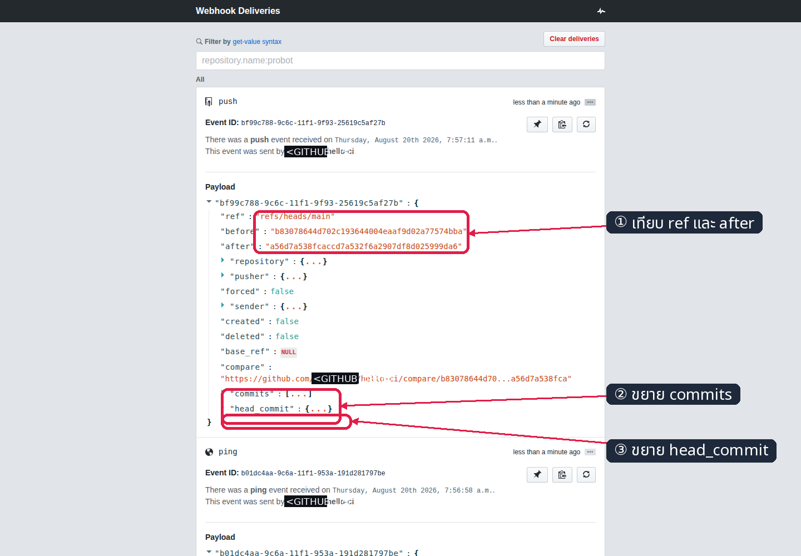

*ภาพที่ 8: หลักฐานจริงจาก smee แสดง `ref`, `after`, `head_commit` และไฟล์ที่เปลี่ยน; mask capability/บัญชีก่อนบันทึก*

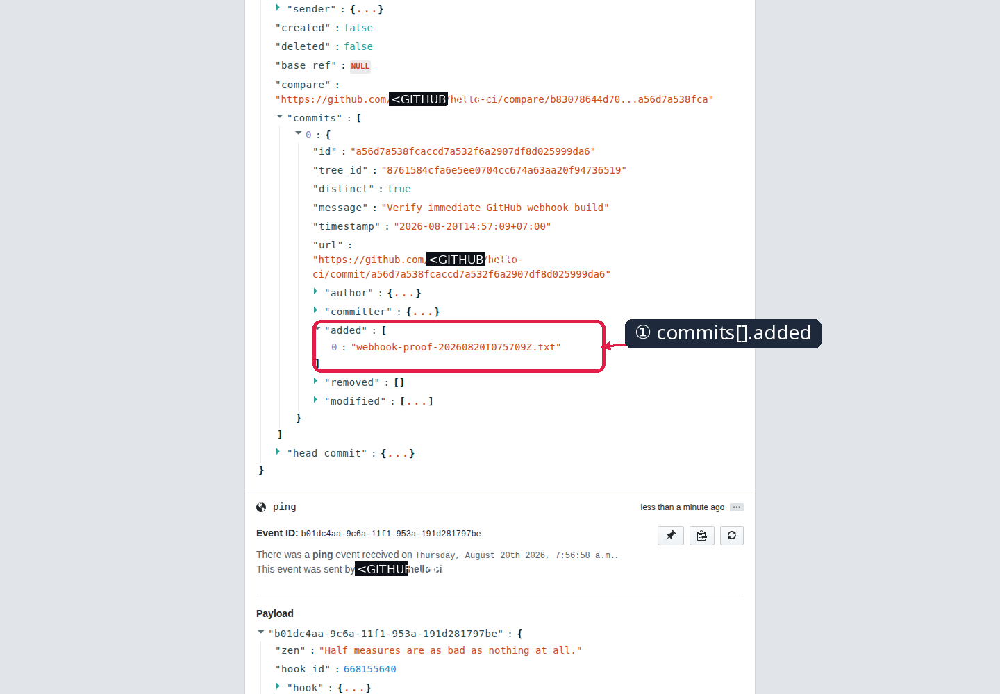

*ภาพที่ 8.1: ขยาย `commits[]` แล้วเห็น proof file ใน `added`; helper/API postcondition ตรวจ `modified=hello.sh` เพิ่มอีกชั้น*

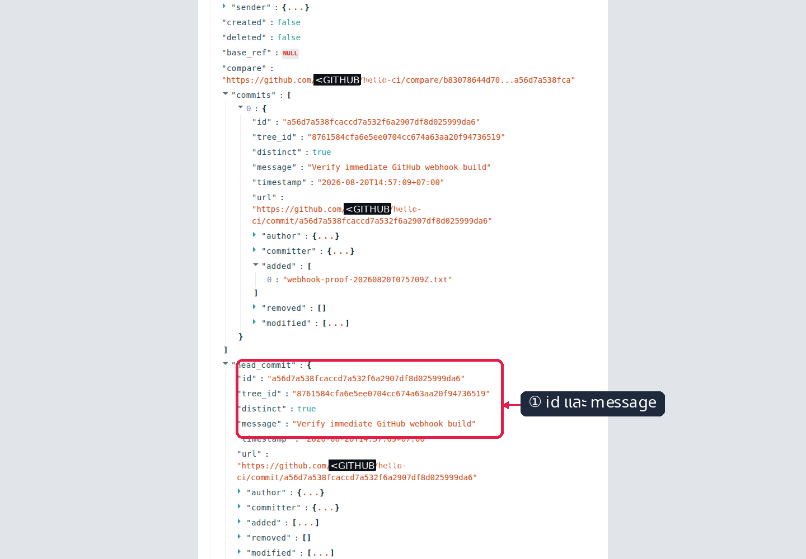

*ภาพที่ 8.2: ขยาย `head_commit` เพื่อเทียบ id และข้อความ commit กับหลักฐาน hop อื่น*

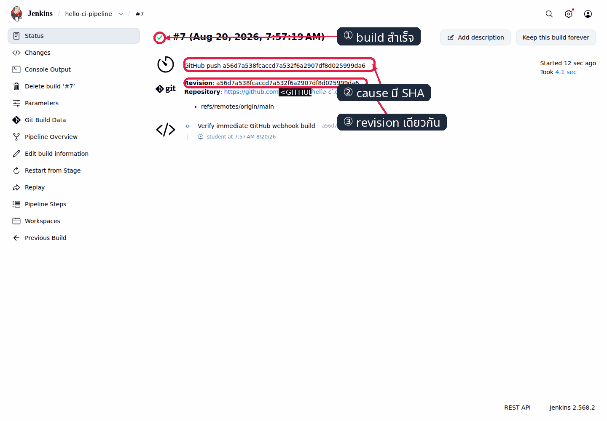

*ภาพที่ 9: หน้า Jenkins จริง แสดง SUCCESS และ cause `GitHub push <SHA>` ของ build ใหม่เพียงรายการเดียว*

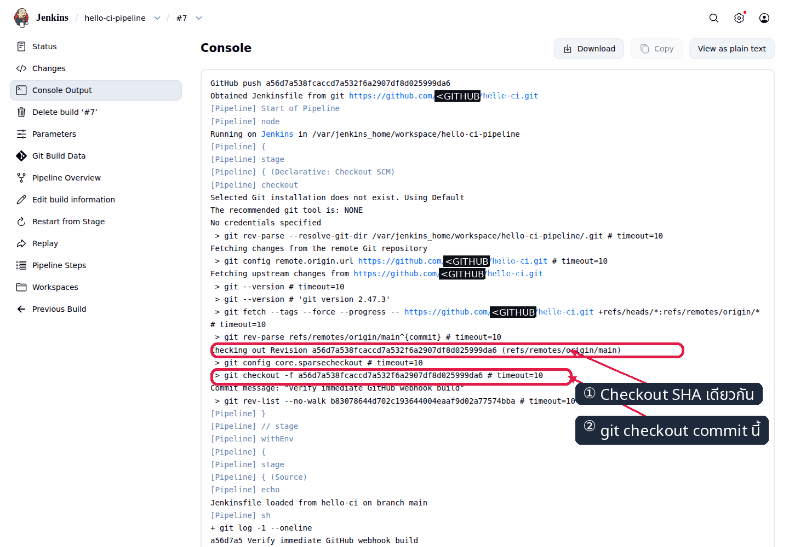

*ภาพที่ 10: Console Output จริง แสดง checkout revision ที่ตรงกับ delivery/origin/main*

✅ **ผล normalize จากการรันจริง**

```text
push completed in <เวลา>s; commit=<SHA>
new build #N+1 detected <เวลา>s after push
GitHub push <SHA>
Checking out Revision <SHA> (refs/remotes/origin/main)
Finished: SUCCESS
```

## Expected Result — ตรวจสถานะจบแล็บ

```bash
(
  cd "$COURSE_ROOT/005_LAB_Webhook_Trigger"
  bash check.sh
)
```

✅ **ผลที่ต้องเห็นครบ**

```text
[PASS] ยืนยัน GITHUB_TOKEN และเจ้าของบัญชีตรงกับ GITHUB_USER
[PASS] Generic Webhook Trigger 2.4.2 ติดตั้งและ active
[PASS] GenericTrigger มี token, ref/after, filter และ causeString ตรง contract
[PASS] job hello-ci-pipeline ปิด Poll SCM แล้ว
[PASS] smee-hello ตรง image digest/network/restart/url/target contract
[PASS] smee-hello log มี Connected หลัง StartedAt
[PASS] อ่าน SHA ปัจจุบันของ origin/main ได้
[PASS] GitHub hook ตรง relay channel, json, push-only, active และ SSL verify
[PASS] GitHub push delivery ตอบ 200, after ตรง origin และไม่มี X-Hub-Signature-256
[PASS] build ล่าสุด #<BUILD_NUMBER> = SUCCESS และ cause ตรง GitHub push <SHA>
[PASS] ทุก GWT build มี exact SHA cause และ build ที่ตรง delivery/origin SHA มี exactly 1
[PASS] delivery SHA, origin/main และ checkout SHA ของ build ล่าสุดตรงกัน
[PASS] smee-hello log มี POST canonical target ได้ 200 หลังเวลา delivery
[INFO] GitHub API requests ใน run นี้: <N>
ผลรวม: PASS — LAB 5 พร้อมใช้งาน
```

## แก้ปัญหาที่พบบ่อย

| อาการ | สาเหตุ | วิธีแก้ |
|---|---|---|
| relay หลุดหรือสร้าง channel ใหม่ | tab/client เก่าหยุด และ smee ไม่ replay | สร้าง channel ใหม่ เปิด tab → update GitHub hook URL → recreate relay ด้วย URL เดียวกัน → รอ `Connected` → push commit ใหม่ |
| GitHub ping ไม่มา | เปิด tab หลัง Add hook, hook inactive หรือ URL ผิด | เปิด tab ก่อน, ตรวจ Active/SSL/Payload URL แล้วกด **Redeliver** เฉพาะ ping เพื่อวินิจฉัย; acceptance รอบสอนให้สร้าง hook ตามลำดับใหม่ |
| `Did not find any jobs to trigger!` | request ไม่มี `ref`, ref ไม่ใช่ main, token/filter ยังไม่ตรง | ถ้าเป็น pingหรือ curl แรกถือว่าถูกต้อง; ถ้าเป็น push ให้ตรวจ `ref`, token, `$ref` และ `^refs/heads/main$` |
| delivery 200 แต่ build ไม่เกิด | relay ถึง Jenkinsแล้ว แต่ token เลือก job ไม่ได้หรือ filter ปฏิเสธ payload | เทียบ URL token กับ job, ตรวจ Post content parameters และ delivery payload; HTTP 200 อย่างเดียวไม่รับประกัน build |
| delivery ไม่ถึง smee | hook URL ผิด, channel/tab ไม่เปิด หรือ GitHub ส่งไม่ได้ | ตรวจ Recent Deliveries, เปิด channel URL จริงแบบไม่แชร์ และตรวจ hook เป็น push-only/active/SSL verify |
| ต้องให้ build ต่อชั่วคราวเมื่อ smee ล่ม | continuity จำเป็น แต่ webhook chain ยังไม่ผ่าน | เปิด Poll SCM `* * * * *` ชั่วคราว; เมื่อ smee กลับให้รอ Connected, push ใหม่ยืนยัน webhook แล้ว **ปิด Poll SCMและ Save** ก่อนรัน `check.sh` |
| restart แล้วไม่มี `Connected` | relay image/network/args ผิด | ตรวจ `docker inspect smee-hello`, ต้องอยู่ `cicd-net`, restart policy `unless-stopped`, pinned digest และ canonical target |

Poll SCM fallback เป็นเพียงทางผ่าน: `check.sh` จะไม่ PASS จน Poll ปิดและ chain webhook จริงครบ
