# LAB 6 — CI/CD Capstone: Push ถึง Deploy ด้วย GitHub + smee.io

แล็บประมาณ 45 นาทีนี้รวมสิ่งที่เรียนจาก LAB 1–5 เป็นวงจรเดียว: เมื่อ push FastAPI ไป GitHub webhook จะส่ง event ผ่าน smee.io เข้า Jenkins จากนั้น pipeline จะทดสอบ สร้างและ push image ไป Docker Hub ก่อน deploy และ verify อัตโนมัติ เมื่อจบแล็บจะพิสูจน์การเปลี่ยน dashboard จาก v1 เป็น v2 รวมทั้งแยก event ของสอง repository ไม่ให้ cross-trigger กัน

> **Prerequisite ก่อนคาบ:** ต้องมี Docker Hub repository `<DOCKER_USER>/cicd-webapp` แบบ **Public** และ Access Token สิทธิ์ Read/Write ที่บันทึกเป็น Jenkins credential ID `dockerhub` ตาม [LAB 3](../003_LAB_Docker_Build_Push/README.md)

> **Safety:** environment นี้เป็นแล็บ disposable ที่ใช้ privileged container และ Docker socket ซึ่งมีอำนาจใกล้เคียง root ระบบ production ควรใช้ isolated agent, สิทธิ์ขั้นต่ำ และ secret manager; revoke token หลังคาบ ห้ามใส่ PAT ใน URL, ห้ามใช้ `credential.helper store` และห้ามบันทึก smee URL จริงลง repository หรือ screenshot ดิบ

## ทฤษฎีก่อนลงมือ

วงจร capstone คือ:

```text
push → GitHub webhook → smee-webapp → Jenkins GWT
     → pytest → docker build → push Docker Hub → deploy → verify
```

Pipeline from SCM อ่าน application, tests, Dockerfile และ Jenkinsfile จาก commit เดียวกัน การทดสอบต้องผ่านก่อนเผยแพร่ image เพราะ artifact ที่ไม่ผ่าน quality gate ไม่ควรถูก deploy stage `Build-Test-Push` จึง build image และรัน `pytest` ภายใน image ก่อน push หาก test ล้ม pipeline จะหยุดทันที

แต่ละ build ใช้ tag `BUILD_NUMBER` เป็นตัวระบุที่ไม่เปลี่ยนความหมายภายหลัง ส่วน `latest` ชี้ build ล่าสุด แล็บนี้ push ทั้งสอง tag และเทียบ digest เพื่อป้องกันการสรุปผลจาก tag เก่า

ส่วน push image ต้องรักษา canonical block นี้: ใช้ Groovy single-quoted string, ปิด shell tracing, login ด้วย stdin, ใช้ `DOCKER_CONFIG` ชั่วคราว และลบ credential ด้วย `trap` เสมอ Jenkins masking ช่วยลดโอกาสรั่ว แต่ไม่ใช่การรับประกัน

```groovy
withCredentials([usernamePassword(credentialsId: 'dockerhub',
    usernameVariable: 'DOCKER_USER', passwordVariable: 'DOCKER_TOKEN')]) {
  sh '''set +x
    export DOCKER_CONFIG=$(mktemp -d)
    trap 'docker logout >/dev/null 2>&1; rm -rf "$DOCKER_CONFIG"' EXIT
    echo "$DOCKER_TOKEN" | docker login -u "$DOCKER_USER" --password-stdin
    docker build -t docker.io/$DOCKER_USER/cicd-webapp:$BUILD_NUMBER .
    docker run --rm docker.io/$DOCKER_USER/cicd-webapp:$BUILD_NUMBER pytest -q
    docker push docker.io/$DOCKER_USER/cicd-webapp:$BUILD_NUMBER
    docker tag docker.io/$DOCKER_USER/cicd-webapp:$BUILD_NUMBER docker.io/$DOCKER_USER/cicd-webapp:latest
    docker push docker.io/$DOCKER_USER/cicd-webapp:latest
  '''
}
```

Deploy stage จะ recreate container `webapp` บน `cicd-net`; Verify เรียก `http://webapp:8000` ผ่าน Docker DNS ไม่ใช่ `localhost` ระบบ production มักใช้ rolling หรือ canary deployment แต่แล็บนี้ใช้ recreate เพื่อเน้นกลไก CI/CD หลัก

## ผลลัพธ์การเรียนรู้

- สร้าง public repository `<GITHUB_USER>/webapp` พร้อม ownership marker และ source บน `main`
- ใช้ smee channel และ GWT token แยกจาก `hello-ci-pipeline`
- พิสูจน์วงจร push → test → Hub → deploy → verify ด้วย SHA, build และ digest เดียวกัน
- พิสูจน์ isolation สองทิศ: push `webapp` ไม่ trigger `hello-ci-pipeline` และกลับกัน
- เปลี่ยน v1 สีน้ำเงินเป็น v2 สีเขียวด้วย push ครั้งเดียว

## การทดลองที่ 1 — สถานะจบ LAB 5 พร้อมหรือไม่? (~3 นาที)

**คำถาม:** Jenkins และ relay เดิมยังทำงานโดยที่เราจะเพิ่มเส้นทางใหม่แยกจาก `hello-ci` ได้หรือไม่?

```bash
docker ps
```

✅ **ผลที่สังเกตได้จากการรันจริง**

```text
CONTAINER ID   IMAGE                                      STATUS       NAMES
<id>           jenkins-docker:2569                        Up <เวลา>    jenkins
<id>           deltaprojects/smee-client@sha256:<digest> Up <เวลา>    smee-hello
```

หากยังไม่จบ LAB 5 ให้กู้สถานะจาก devtools โดยเก็บค่าจริงไว้เฉพาะ shell:

```bash
export GITHUB_USER='<GITHUB_USER>'
export GITHUB_TOKEN='<GITHUB_TOKEN>'

(
  cd "$COURSE_ROOT"
  bash tools/bootstrap/up_to_lab5.sh
)
```

✅ ต้องจบด้วย `LAB 5 verified exactly one GitHub webhook build` และ `docker ps` ต้องเห็นทั้ง `jenkins` กับ `smee-hello`

Docker Hub ต้องพร้อมก่อนทำต่อ:

```bash
export DOCKER_USER='<DOCKER_USER>'
docker manifest inspect "docker.io/$DOCKER_USER/cicd-webapp:latest"
```

✅ repository ต้องเป็น public; หากยังไม่มี tag คำสั่งอาจตอบ manifest unknown ได้ แต่หน้า repository ต้องเปิดแบบ anonymous และ Jenkins ต้องมี credential `dockerhub`

## การทดลองที่ 2 — สร้าง public repository `webapp` อย่างไร? (~4 นาที)

**คำถาม:** GitHub repository ใหม่เป็น public และอยู่ใต้บัญชีที่ตรงกับ PAT หรือไม่?

1. เปิด [GitHub](https://github.com) แล้วเลือก **+ → New repository**
2. เลือก Owner=`<GITHUB_USER>` และ Repository name=`webapp`
3. เลือก **Public** และไม่สร้าง README, `.gitignore` หรือ license
4. กด **Create repository**

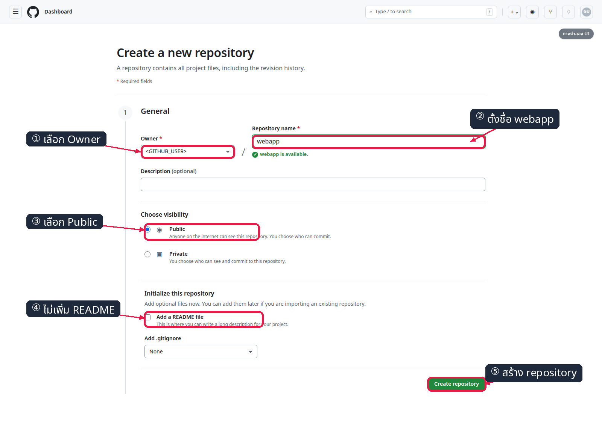

*ภาพที่ 1: ภาพจำลอง — UI จริงอาจต่างเล็กน้อย; marker แสดง owner, ชื่อ `webapp`, Public และ Create repository ดู [GitHub Docs: Creating a new repository](https://docs.github.com/en/repositories/creating-and-managing-repositories/creating-a-new-repository); หลังบันทึกต้องตรวจ postcondition ผ่าน API*

ผู้สอนใช้ API แทนหน้า auth ได้ โดย token ต้องอยู่ใน shell เท่านั้น:

```bash
(
  cd "$COURSE_ROOT"
  python3 tools/ui/lab6_github_repo.py --action create
)
```

✅ **สิ่งที่ต้องเห็น**

```text
[ui]... assert: repository owner matches GITHUB_USER
[ui]... assert: webapp is public
[ui]... assert: new repository has no initialized main branch
[ui]... PASS
```

## การทดลองที่ 3 — Push source v1 ให้ปลอดภัยอย่างไร? (~5 นาที)

Pipeline from SCM ต้องอ่าน application, tests, Dockerfile และ Jenkinsfile จาก revision เดียวกัน ownership marker ช่วยให้ automation หยุดแบบ fail-closed หากชื่อ repository ไปชนงานจริงของผู้ใช้

```bash
mkdir -p "$HOME/webapp"
cp -r "$COURSE_ROOT/006_LAB_CICD_Capstone/app" "$HOME/webapp/"
cp "$COURSE_ROOT/006_LAB_CICD_Capstone/Dockerfile" "$HOME/webapp/"
cp "$COURSE_ROOT/006_LAB_CICD_Capstone/Jenkinsfile" "$HOME/webapp/"
cp "$COURSE_ROOT/006_LAB_CICD_Capstone/.course-cicd2569" "$HOME/webapp/"

cd "$HOME/webapp"
git init -b main
git config user.name Student
git config user.email student@example.invalid
git add .course-cicd2569 app Dockerfile Jenkinsfile
git commit -m 'Deploy dashboard v1'
git remote add origin 'https://github.com/<GITHUB_USER>/webapp.git'
git push -u origin main
```

เมื่อถาม credential ให้กรอก Username=`<GITHUB_USER>` และ Password=`<GITHUB_TOKEN>` ที่ prompt

✅ **ผล normalize จากการรันจริง**

```text
[main (root-commit) <SHA>] Deploy dashboard v1
 * [new branch]      main -> main
branch 'main' set up to track 'origin/main'.
```

เปิด `https://github.com/<GITHUB_USER>/webapp` และตรวจว่า branch `main` มี `app/`, `Dockerfile`, `Jenkinsfile` และ `.course-cicd2569`

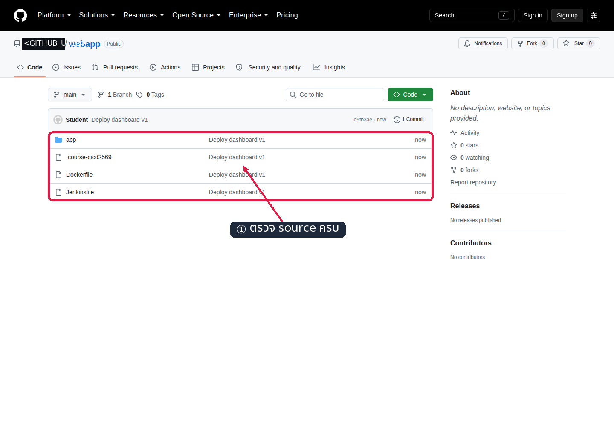

*ภาพที่ 2: หน้า public GitHub จริงหลัง push; ชื่อบัญชีถูก mask เป็น `<GITHUB_USER>` ตอน capture*

```bash
(
  cd "$COURSE_ROOT"
  python3 tools/ui/lab6_github_repo.py --action files
)
```

✅ helper ต้องยืนยันว่า repo public, marker ถูกต้อง และไฟล์ทั้งสี่กลุ่มอยู่บน `main`

## การทดลองที่ 4 — ทำไม `webapp` ต้องมี smee channel ที่สอง? (~3 นาที)

**คำถาม:** จะป้องกัน event ของ `webapp` ไหลเข้า token ของ `hello-ci` ได้อย่างไร?

ต้องแยกครบ 1:1:

```text
hello-ci → <SMEE_HELLO_URL> → smee-hello → token cicd2569-hello
webapp  → <SMEE_WEBAPP_URL> → smee-webapp → token cicd2569-webapp
```

1. เปิด [smee.io](https://smee.io) ใน tab ใหม่แล้วกด **Start a new channel**
2. เก็บ URL ใหม่เป็น `SMEE_WEBAPP_URL='<SMEE_WEBAPP_URL>'` ใน shell
3. เปิด tab channel นี้ค้างไว้ **ก่อน** รัน relay และสร้าง GitHub hook

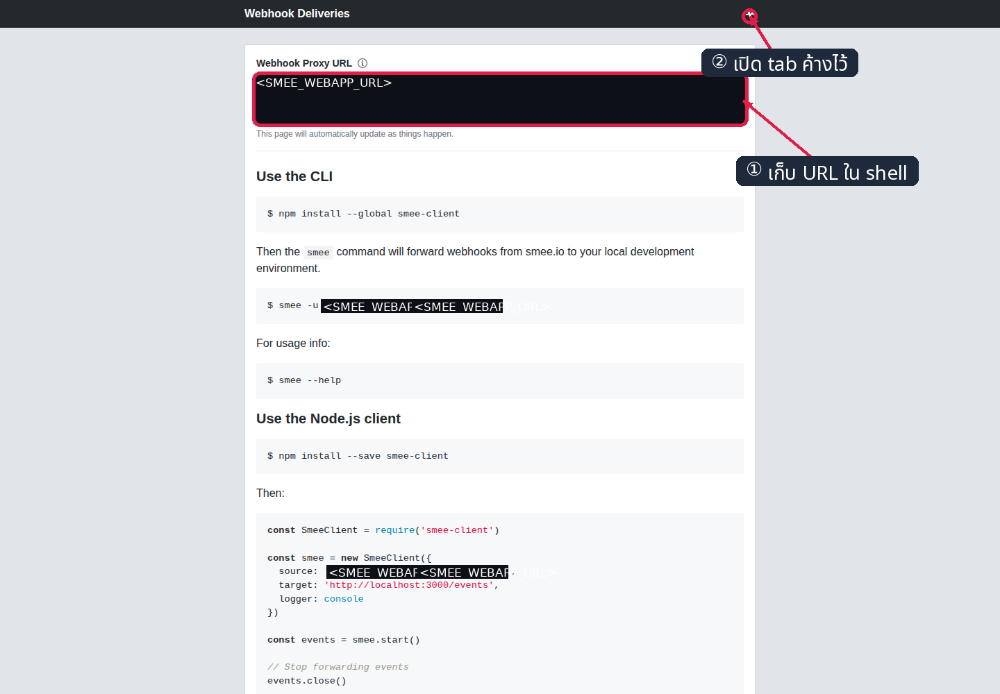

*ภาพที่ 3: หน้า smee จริงก่อนรับ event; channel id ถูก mask เป็น `<SMEE_WEBAPP_URL>` ตอน capture*

> smee.io ไม่ replay event ที่พลาด หาก tab/relay ไม่พร้อม ให้รอ `Connected` แล้ว push commit ใหม่ ห้ามอ้าง event เก่าเป็นหลักฐาน run ปัจจุบัน

```bash
docker run -d \
  --name smee-webapp \
  --restart unless-stopped \
  --network cicd-net \
  deltaprojects/smee-client@sha256:20ea24c8c81bb3f3aa332c8939503e3c5bee048bb5a98ba2249d73a41a556e33 \
  --url '<SMEE_WEBAPP_URL>' \
  --target 'http://jenkins:8080/generic-webhook-trigger/invoke?token=cicd2569-webapp'

docker logs smee-webapp
```

✅ **ผลที่สังเกตได้จากการรันจริง**

```text
Forwarding <SMEE_WEBAPP_URL> to http://jenkins:8080/generic-webhook-trigger/invoke?token=cicd2569-webapp
Connected
```

## การทดลองที่ 5 — ตั้ง `webapp-deploy` ให้รับเฉพาะ push main อย่างไร? (~6 นาที)

1. เปิด `http://localhost:8080` แล้วเลือก **New Item**
2. ระบุ `webapp-deploy`, เลือก **Pipeline** แล้วกด **OK**
3. ใต้ **Build Triggers** เลือก **Generic Webhook Trigger**
4. เพิ่ม **Post content parameters** สองรายการ: `ref` → `$.ref` และ `after` → `$.after` โดยใช้ JSONPath
5. กรอก Token=`cicd2569-webapp` และ Cause=`GitHub push $after`
6. ใต้ **Optional filter** กรอก Expression=`^refs/heads/main$` และ Text=`$ref`
7. ใต้ **Pipeline** เลือก **Pipeline script from SCM → Git**
8. กรอก Repository URL=`https://github.com/<GITHUB_USER>/webapp.git`, Branch=`*/main`, Script Path=`Jenkinsfile` โดยไม่เลือก credential แล้วกด **Save**

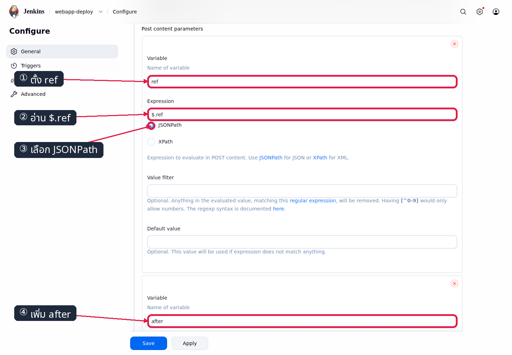

*ภาพที่ 4.1: หน้า Jenkins จริง แสดง `ref=$.ref` และ `after=$.after` แบบ JSONPath*

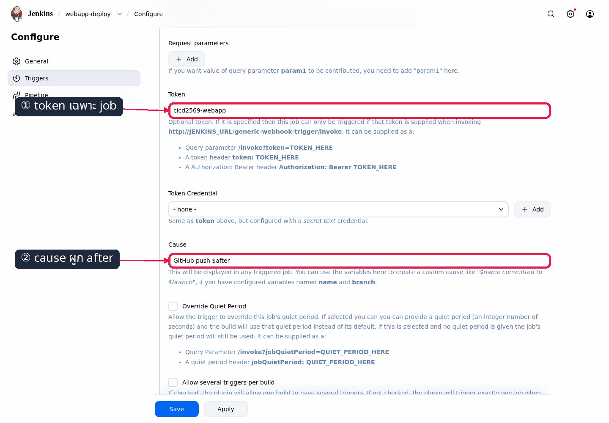

*ภาพที่ 4.2: หน้า Jenkins จริง แสดง token เฉพาะ job และ cause `GitHub push $after`*

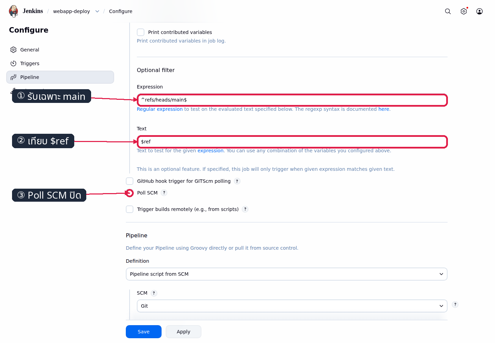

*ภาพที่ 4.3: หน้า Jenkins จริง แสดง expression `^refs/heads/main$`, text `$ref` และ Poll SCM ปิด*

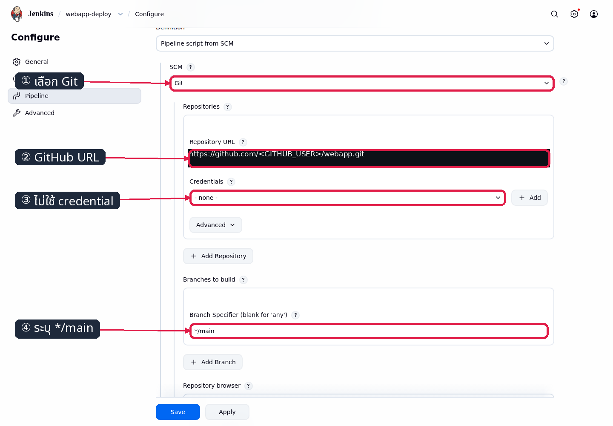

*ภาพที่ 5: หน้า Jenkins จริง แสดง public GitHub URL, branch `*/main` และไม่มี credential*

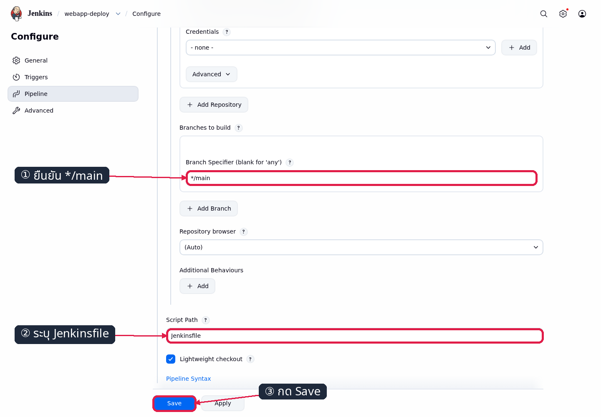

*ภาพที่ 5.1: หน้า Jenkins จริงแสดง Script Path=`Jenkinsfile` ก่อน Save*

```bash
(
  cd "$COURSE_ROOT"
  JENKINS_BASE_URL=http://localhost:8080 python3 tools/ui/lab6_job.py
)
```

✅ **ค่าหลัง Save**

```text
SCM: https://github.com/<GITHUB_USER>/webapp.git
Branch: */main
Credentials: none
Post content parameters: ref=$.ref, after=$.after
Token: cicd2569-webapp
Cause: GitHub push $after
Filter: $ref matches ^refs/heads/main$
Poll SCM: off
```

## การทดลองที่ 6 — Add webhook แล้ว ping ต้องไม่ build (~4 นาที)

จด baseline ก่อนสร้าง hook:

```bash
curl -fsS -u admin:admin2569 'http://localhost:8080/job/webapp-deploy/api/json?tree=nextBuildNumber'
```

1. ไปที่ GitHub repository `webapp` แล้วเลือก **Settings → Webhooks → Add webhook**
2. กรอก Payload URL=`<SMEE_WEBAPP_URL>`, Content type=`application/json`, Secret=ว่าง และเปิด SSL verification
3. เลือก **Just the push event**, เปิด **Active** แล้วกด **Add webhook**

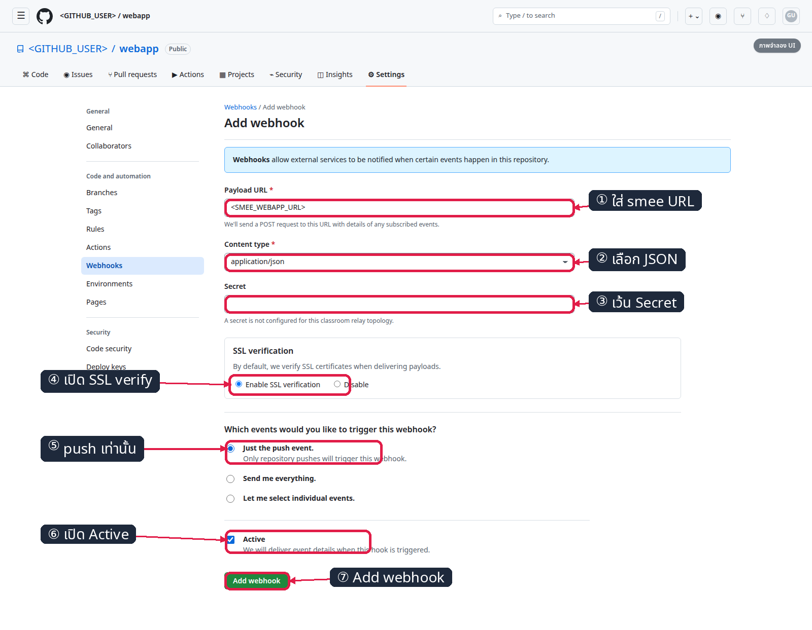

*ภาพที่ 6: ภาพจำลอง — UI จริงอาจต่างเล็กน้อย; marker แสดง URL, JSON, Secret ว่าง, SSL verify, push-only, Active และ Add webhook ดู [GitHub Docs: Creating webhooks](https://docs.github.com/en/webhooks/using-webhooks/creating-webhooks); หลังบันทึกต้องตรวจ postcondition ผ่าน delivery/API*

Topology นี้เว้น Secret ว่าง เพราะ smee-client ส่ง payload ต่อ แต่ receiver ไม่มีส่วนตรวจ `X-Hub-Signature-256`; การตั้ง secret โดยไม่มีการ verify จะสร้างความมั่นใจผิด ใน production ต้องใช้ endpoint ที่ควบคุมเองและตรวจ signature

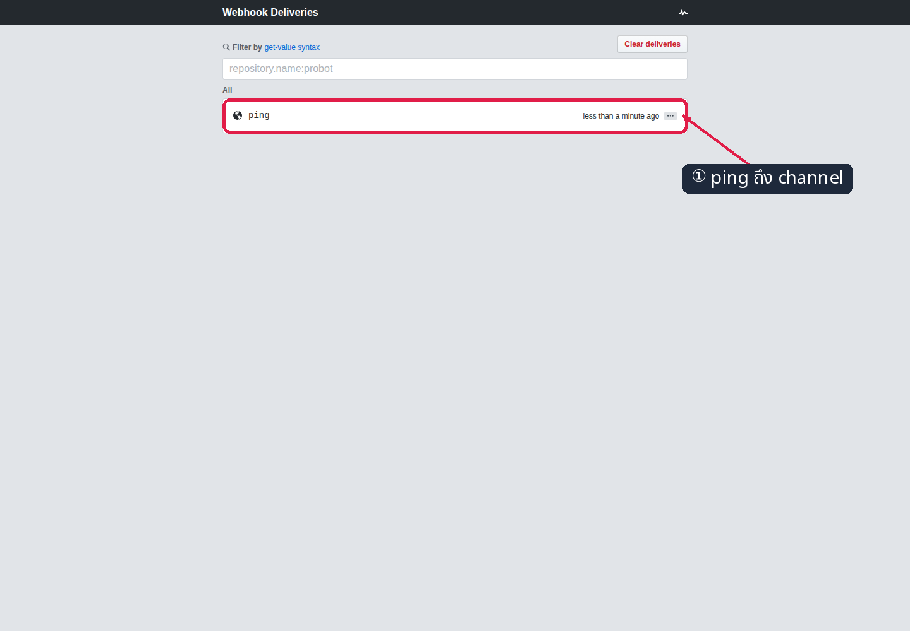

*ภาพที่ 7: tab smee จริงเห็น ping; channel และชื่อบัญชีถูก mask ตอน capture*

```bash
(
  cd "$COURSE_ROOT"
  python3 tools/ui/lab6_github_repo.py --action hook
)
```

✅ **Ping acceptance**

```text
GitHub ping delivery: 2xx
smee tab: ping event appears
webapp-deploy build number before ping = after ping
```

ping ถึง Jenkins ได้ แต่ไม่มี `ref=refs/heads/main` จึงถูก filter และไม่สร้าง build

## การทดลองที่ 7 — Push v1 เดินครบวงหรือไม่? (~6 นาที)

จด build number ของทั้งสอง job แล้วสร้าง empty commit เพื่อทดสอบ wiring โดยไม่เปลี่ยน source:

```bash
curl -fsS -u admin:admin2569 'http://localhost:8080/job/hello-ci-pipeline/api/json?tree=nextBuildNumber'
curl -fsS -u admin:admin2569 'http://localhost:8080/job/webapp-deploy/api/json?tree=nextBuildNumber'

cd "$HOME/webapp"
git commit --allow-empty -m 'Trigger v1 deployment'
time git push origin main
```

✅ push ต้องสร้าง build ใหม่หนึ่งรายการใน `webapp-deploy` เท่านั้น โดย cause เป็น `GitHub push <SHA>`

```bash
(
  cd "$COURSE_ROOT"
  JENKINS_BASE_URL=http://localhost:8080 python3 tools/ui/lab6_pipeline.py
)
```

✅ **ผล normalize จากการรันจริง**

```text
Checkout SCM       SUCCESS
Build-Test-Push    SUCCESS
Deploy             SUCCESS
Verify             SUCCESS
3 passed in <เวลา>s
Finished: SUCCESS
```

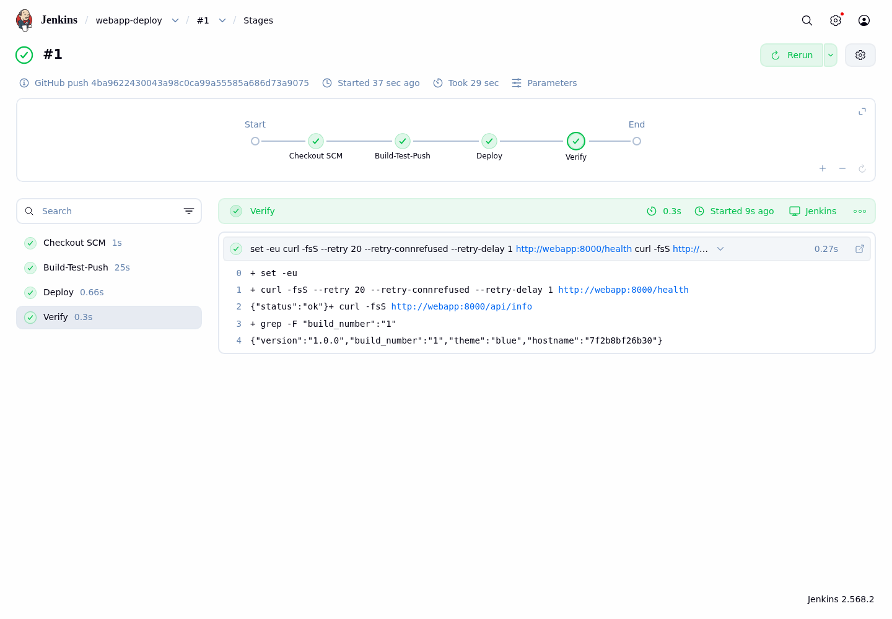

*ภาพที่ 8: Pipeline Graph จริงแสดง stage หลักสำเร็จครบ*

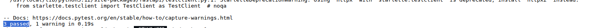

*ภาพที่ 9: Console จริงแสดง `3 passed` ก่อน push image*

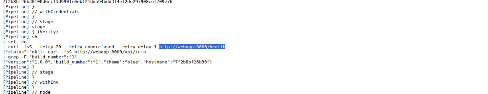

*ภาพที่ 9.1: Console จริงแสดง Verify เรียก `http://webapp:8000/health`*

```bash
curl -fsS http://localhost:8000/api/info
```

✅ **ผล normalize**

```json
{"version":"1.0.0","build_number":"<BUILD_NUMBER>","theme":"blue","hostname":"<container>"}
```

```bash
(
  cd "$COURSE_ROOT"
  WEBAPP_BASE_URL=http://localhost:8000 EXPECTED_VERSION=1.0.0 EXPECTED_THEME=blue python3 tools/ui/lab6_app.py
)
```


*ภาพที่ 10: Dashboard จริงแสดง v1.0.0, BUILD, theme blue และ hostname*

## การทดลองที่ 8 — Isolation สองทิศพิสูจน์อย่างไร? (~4 นาที)

**ทิศที่ 1:** push `webapp` ในการทดลองก่อนหน้าต้องเพิ่มเฉพาะ `webapp-deploy`; `hello-ci-pipeline` ต้องคง build number เดิม

```bash
curl -gfsS -u admin:admin2569 'http://localhost:8080/job/hello-ci-pipeline/api/json?tree=lastBuild[number]'
```

✅ response จริงมีรูปแบบนี้ และ `number` ต้องเท่ากับ baseline ก่อน push webapp:

```text
{"_class":"org.jenkinsci.plugins.workflow.job.WorkflowJob","lastBuild":{"_class":"org.jenkinsci.plugins.workflow.job.WorkflowRun","number":<BUILD_NUMBER>}}
```

✅ `hello-ci-pipeline` หลัง push webapp ต้องเท่ากับ baseline ก่อน push

**ทิศที่ 2:** push `hello-ci` แล้ว `webapp-deploy` ต้องไม่ขยับ

```bash
curl -gfsS -u admin:admin2569 'http://localhost:8080/job/webapp-deploy/api/json?tree=lastBuild[number]'

cd "$HOME/hello-ci"
git pull --ff-only origin main
git config user.name Student
git config user.email student@example.invalid
git commit --allow-empty -m 'Verify reverse webhook isolation'
time git push origin main

curl -gfsS -u admin:admin2569 'http://localhost:8080/job/webapp-deploy/api/json?tree=lastBuild[number]'
```

✅ curl ทั้งก่อนและหลัง push ต้องคืน JSON รูปแบบเดียวกับด้านบน และ `webapp-deploy.lastBuild.number` ต้องเป็นค่าเดิมทั้งสองครั้ง

✅ **Isolation acceptance**

```text
push webapp: webapp-deploy +1, hello-ci-pipeline +0
push hello-ci: hello-ci-pipeline +1, webapp-deploy +0
```

Isolation เกิดจากการแยก repo → hook → channel → relay → token แบบ 1:1 และ filter ของแต่ละ job ไม่ใช่เพียงการตั้งชื่อ container ต่างกัน

## การทดลองที่ 9 — Push v2 แล้ว dashboard เปลี่ยนเองหรือไม่? (~5 นาที)

เปิด `http://localhost:8000` ค้างไว้ จากนั้นแก้ VERSION และ THEME แยกคนละคำสั่ง:

```bash
cd "$HOME/webapp"
sed -i 's/VERSION = "1.0.0"/VERSION = "2.0.0"/' app/main.py
sed -i 's/THEME = "blue"/THEME = "green"/' app/main.py
git add app/main.py
git commit -m 'Release dashboard v2 green'
time git push origin main
```

✅ ต้องเกิด build `#N+1` เพียงรายการเดียว ทุก stage เป็น SUCCESS และหน้าเดิมเปลี่ยนภายในรอบ auto-refresh:

```json
{"version":"2.0.0","build_number":"<BUILD_NUMBER>","theme":"green","hostname":"<container>"}
```

```bash
(
  cd "$COURSE_ROOT"
  WEBAPP_BASE_URL=http://localhost:8000 EXPECTED_VERSION=2.0.0 EXPECTED_THEME=green python3 tools/ui/lab6_app.py
)
```


*ภาพที่ 11: Dashboard จริงหลัง push แสดง v2.0.0, build ใหม่ และ theme green*

## การทดลองที่ 10 — Docker Hub ปิดวงด้วย digest เดียวกันหรือไม่? (~3 นาที)

เปิด `https://hub.docker.com/r/<DOCKER_USER>/cicd-webapp/tags` แบบไม่ sign in แล้วตรวจ tag `<BUILD_NUMBER>` และ `latest`

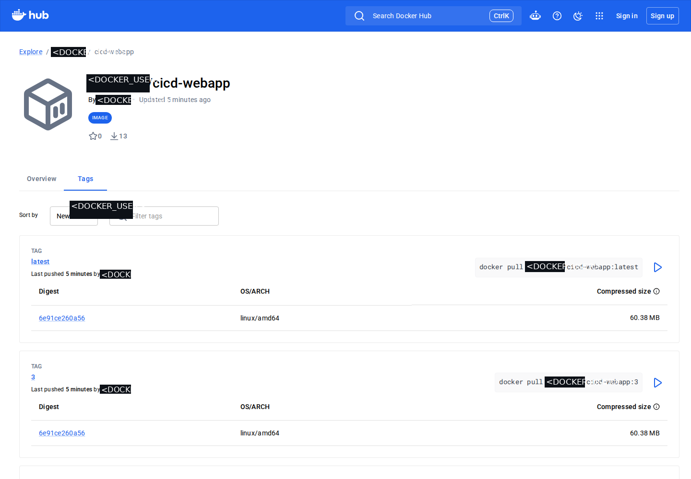

*ภาพที่ 12: หน้า Docker Hub จริงแบบ anonymous แสดง build tag และ latest*

```bash
(
  cd "$COURSE_ROOT"
  DOCKER_USER='<DOCKER_USER>' JENKINS_BASE_URL=http://localhost:8080 python3 tools/ui/lab6_hub_tags.py
)
```

✅ tag `<BUILD_NUMBER>` และ `latest` ต้องมี digest เดียวกับบรรทัด push ใน Jenkins console และ container `webapp` ต้องรัน `docker.io/<DOCKER_USER>/cicd-webapp:<BUILD_NUMBER>`

## Acceptance check

ตัวตรวจใช้ GitHub API แบบ authenticated, อ่าน Docker Hub แบบ anonymous และไม่ต้องรับ `DOCKER_TOKEN`:

```bash
export GITHUB_USER='<GITHUB_USER>'
export GITHUB_TOKEN='<GITHUB_TOKEN>'
export DOCKER_USER='<DOCKER_USER>'

cd "$COURSE_ROOT/006_LAB_CICD_Capstone"
bash check.sh
```

✅ ต้องเห็น `[PASS]` ครบและจบด้วย:

```text
[PASS] ownership marker ของ webapp มีค่า canonical safe-to-delete
[PASS] GitHub hook ตรง relay channel, json, push-only, active, SSL verify และ secret ว่าง
[PASS] delivery SHA, origin/main และ checkout SHA ของ build ล่าสุดตรงกัน
[PASS] console ยืนยัน BUILD_NUMBER และ latest push digest เดียวกัน
[PASS] Hub build digest ตรง Jenkins, ใหม่กว่าเวลาเริ่ม build และ latest ชี้ digest เดียวกัน
ผลรวม: PASS
```

## แก้ปัญหาที่พบบ่อย

| อาการ | สาเหตุที่เป็นไปได้ | วิธีตรวจและแก้ |
|---|---|---|
| GitHub delivery ได้ 404 หรือ job ไม่ถูกพบ | GWT token ผิด | ตรวจว่า `webapp-deploy` และ target ของ `smee-webapp` ใช้ `cicd2569-webapp` ตรงกัน แล้ว push commit ใหม่ |
| event ปรากฏใน channel ของอีกแล็บ | hook ชี้ channel คนละอัน | เทียบ mapping 1:1 ด้วย `docker inspect smee-webapp`; แก้ Payload URL เป็น `<SMEE_WEBAPP_URL>` และ push ใหม่ |
| push repo หนึ่งแล้วอีก job build | reuse channel/token หรือ hook ชี้ target ผิด | ตรวจ hook URL, relay name/target และ token ของทั้งสอง job ต้องแยกกัน จากนั้นทำ isolation test ซ้ำสองทิศ |
| Docker Hub ตอบ 401 | credential `dockerhub` ไม่ถูกต้องหรือ token หมดอายุ | สร้าง Access Token สิทธิ์ Read/Write ใหม่ แล้วแก้ credential ID เดิมใน Jenkins โดยไม่พิมพ์ token |
| console มี `denied: requested access` ตอน push | `<DOCKER_USER>` หรือชื่อ repository ไม่ตรงสิทธิ์ | ตรวจ Username ใน credential และ public repo `<DOCKER_USER>/cicd-webapp`; ห้ามใส่ token ใน image name/URL |
| หน้า Hub ไม่มี tag หรือ tag ว่าง | build ยังไม่ผ่าน push หรือกำลังดู repo ผิดบัญชี | ตรวจ `Build-Test-Push` และ digest ใน console แล้ว refresh หน้า public Tags; ห้ามสรุปจาก `latest` เก่า |
| relay หลุดแล้ว event หาย | smee ไม่ replay event | รอ `docker logs smee-webapp` เห็น `Connected` แล้ว push commit ใหม่ |
| smee.io ใช้งานไม่ได้ชั่วคราว | บริการภายนอกไม่พร้อม | สร้าง channel ใหม่ อัปเดต relay และ hook แล้ว push ใหม่; หากจำเป็นเปิด Poll SCM ชั่วคราว และต้องปิด Poll กลับพร้อมผ่าน webhook check ก่อนจบแล็บ |

เมื่อจบ LAB 6 ให้คง `jenkins`, `smee-hello`, `smee-webapp`, repositories และ container `webapp` ไว้สำหรับการทดสอบ restart ของผู้สอน ไม่ต้อง cleanup เอง
