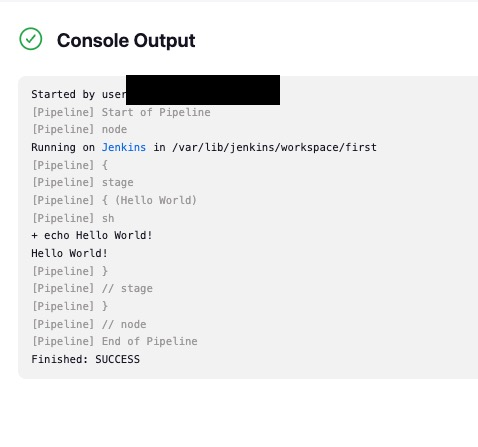

First Jenkins Pipeline
```

pipeline {
    agent any  // Execute on any available Jenkins agent

    stages {
        stage('Hello World') {
            steps {
                sh  'echo Hello World!'
            }
        }
    }
}


```

- if sucess you will see the following output:

