# Kubernetes และสถาปัตยกรรมของ Kubernetes

> **รายวิชา:** Software Development Tools and Environments (DevTools)
> **หัวข้อ:** Container Orchestration ด้วย Kubernetes — แนวคิด สถาปัตยกรรม และองค์ประกอบของระบบ
> **ผลลัพธ์การเรียนรู้ที่เกี่ยวข้อง:** CLO-5, CLO-6

---

## บทคัดย่อ

เอกสารนี้นำเสนอแนวคิดพื้นฐานและสถาปัตยกรรมของ Kubernetes ซึ่งเป็นแพลตฟอร์มโอเพนซอร์สสำหรับการจัดการคอนเทนเนอร์ (container orchestration) ที่ได้รับการยอมรับอย่างแพร่หลายในอุตสาหกรรมซอฟต์แวร์ เนื้อหาครอบคลุมตั้งแต่ปัญหาที่เป็นแรงจูงใจให้เกิดระบบจัดการคอนเทนเนอร์ วิวัฒนาการของรูปแบบการติดตั้งใช้งานซอฟต์แวร์ องค์ประกอบของ Control Plane และ Worker Node กลไกการทำงานแบบ declarative และ reconciliation loop ตลอดจนทรัพยากรหลักของระบบ ได้แก่ workload, networking, storage และ configuration

เพื่อให้ผู้เรียนเข้าใจความสัมพันธ์ขององค์ประกอบต่าง ๆ ได้อย่างเป็นรูปธรรม เอกสารนี้ใช้ **อุปมาท่าเรือขนส่งตู้สินค้า** เป็นกรอบการอธิบายตลอดทั้งฉบับ กล่าวคือ ตู้สินค้าเทียบได้กับ container, เรือสินค้าเทียบได้กับ Worker Node และหอบังคับการท่าเรือเทียบได้กับ Control Plane ทั้งนี้ ชื่อ *Kubernetes* มีรากศัพท์จากภาษากรีก κυβερνήτης (kubernḗtēs) ซึ่งหมายถึง "ผู้ถือหางเสือ" หรือ "นายท้ายเรือ" สัญลักษณ์ของโครงการจึงเป็นพวงมาลัยเรือเจ็ดซี่

## วัตถุประสงค์การเรียนรู้

เมื่อศึกษาเอกสารนี้จบ ผู้เรียนควรสามารถ

1. อธิบายข้อจำกัดของการบริหารคอนเทนเนอร์ด้วยมือ และบทบาทของระบบ container orchestration ได้
2. จำแนกองค์ประกอบของ Control Plane และ Worker Node พร้อมอธิบายหน้าที่ กลไกการทำงาน และผลกระทบเมื่อองค์ประกอบนั้นขัดข้องได้
3. อธิบายลำดับเหตุการณ์ภายในระบบนับตั้งแต่ผู้ใช้ส่งคำสั่ง `kubectl apply` จนกระทั่ง Pod อยู่ในสถานะ `Running` ได้
4. อธิบายหลักการ declarative configuration และ reconciliation loop ได้
5. เลือกใช้ทรัพยากรประเภท workload, Service, Ingress, PersistentVolume, ConfigMap และ Secret ได้อย่างเหมาะสมกับลักษณะของแอปพลิเคชัน

## สารบัญ

1. [ความเป็นมาและแรงจูงใจ](#1-ความเป็นมาและแรงจูงใจ)
2. [วิวัฒนาการของรูปแบบการติดตั้งใช้งานซอฟต์แวร์](#2-วิวัฒนาการของรูปแบบการติดตั้งใช้งานซอฟต์แวร์)
3. [นิยามและขีดความสามารถของ Kubernetes](#3-นิยามและขีดความสามารถของ-kubernetes)
4. [ภาพรวมสถาปัตยกรรมของ Kubernetes Cluster](#4-ภาพรวมสถาปัตยกรรมของ-kubernetes-cluster)
5. [องค์ประกอบของ Control Plane](#5-องค์ประกอบของ-control-plane)
6. [องค์ประกอบของ Worker Node](#6-องค์ประกอบของ-worker-node)
7. [Pod: หน่วยการติดตั้งใช้งานที่เล็กที่สุด](#7-pod-หน่วยการติดตั้งใช้งานที่เล็กที่สุด)
8. [ลำดับการทำงานของระบบเมื่อสั่ง `kubectl apply`](#8-ลำดับการทำงานของระบบเมื่อสั่ง-kubectl-apply)

### สารบัญรูปภาพ

| รูปที่ | เรื่อง | รูปที่ | เรื่อง |
|:---:|---|:---:|---|
| 1 | [การเปรียบเทียบการบริหารคอนเทนเนอร์ก่อนและหลังใช้ Kubernetes](#fig-1) | 20 | [kubelet](#fig-20) |
| 2 | [วิวัฒนาการของการติดตั้งใช้งานซอฟต์แวร์](#fig-2) | 21 | [ตำแหน่ง container runtime ในภาพรวมคลัสเตอร์](#fig-21) |
| 3 | [สถาปัตยกรรม Kubernetes Cluster](#fig-3) | 22 | [Container Runtime](#fig-22) |
| 4 | [ตำแหน่ง Control Plane ในภาพรวมคลัสเตอร์](#fig-4) | 23 | [ตำแหน่ง kube-proxy ในภาพรวมคลัสเตอร์](#fig-23) |
| 5 | [ภาพรวมองค์ประกอบของ Control Plane](#fig-5) | 24 | [kube-proxy](#fig-24) |
| 6 | [ตำแหน่ง kube-apiserver ในภาพรวมคลัสเตอร์](#fig-6) | 25 | [พื้นที่เครือข่ายที่เกี่ยวข้องกับ CNI Plugin ในภาพรวมคลัสเตอร์](#fig-25) |
| 7 | [kube-apiserver](#fig-7) | 26 | [CNI Plugin](#fig-26) |
| 8 | [ตำแหน่ง etcd ในภาพรวมคลัสเตอร์](#fig-8) | 27 | [ตำแหน่ง Pod ในภาพรวมคลัสเตอร์](#fig-27) |
| 9 | [etcd](#fig-9) | 28 | [กายวิภาคของ Pod](#fig-28) |
| 10 | [ตำแหน่ง kube-scheduler ในภาพรวมคลัสเตอร์](#fig-10) | 29 | [ลำดับการทำงานเมื่อสั่ง kubectl apply](#fig-29) |
| 11 | [kube-scheduler](#fig-11) |  | |
| 12 | [ตำแหน่ง kube-controller-manager ในภาพรวมคลัสเตอร์](#fig-12) |  | |
| 13 | [kube-controller-manager](#fig-13) |  | |
| 14 | [การทำงานต่อเนื่องของ Controller](#fig-14) |  | |
| 15 | [ตำแหน่ง cloud-controller-manager ในภาพรวมคลัสเตอร์](#fig-15) |  | |
| 16 | [cloud-controller-manager](#fig-16) |  | |
| 17 | [ตำแหน่ง Worker Node ในภาพรวมคลัสเตอร์](#fig-17) |  | |
| 18 | [ภาพรวมองค์ประกอบของ Worker Node](#fig-18) |  | |
| 19 | [ตำแหน่ง kubelet ในภาพรวมคลัสเตอร์](#fig-19) |  | |

---

## 1. ความเป็นมาและแรงจูงใจ

<p align="center" id="fig-1">
  <br>
  <em><b>รูปที่ 1</b> การเปรียบเทียบการบริหารคอนเทนเนอร์ด้วยมือ (ซ้าย) กับการบริหารด้วย Kubernetes (ขวา)</em>
</p>

เทคโนโลยีคอนเทนเนอร์ เช่น Docker ช่วยแก้ปัญหาการบรรจุแอปพลิเคชันพร้อมสภาพแวดล้อมที่จำเป็นให้สามารถนำไปทำงานบนเครื่องใดก็ได้อย่างสม่ำเสมอ อย่างไรก็ตาม เมื่อระบบมีขนาดใหญ่ขึ้นทั้งในแง่จำนวนคอนเทนเนอร์และจำนวนเครื่องแม่ข่าย การบริหารจัดการด้วยมือก่อให้เกิดปัญหาเชิงปฏิบัติการหลายประการ ดังแสดงในตารางที่ 1

**ตารางที่ 1** ปัญหาเชิงปฏิบัติการของการบริหารคอนเทนเนอร์ด้วยมือ

| ปัญหา | ประเด็นที่ระบบต้องตอบสนอง |
|---|---|
| คอนเทนเนอร์หยุดทำงานโดยไม่มีผู้ตรวจพบ | การตรวจจับความล้มเหลวและการเริ่มการทำงานใหม่โดยอัตโนมัติ |
| ปริมาณการใช้งานเพิ่มขึ้นอย่างฉับพลัน | การเพิ่มจำนวนอินสแตนซ์และการกระจายภาระงาน |
| มีเครื่องแม่ข่ายจำนวนมาก | การจัดวางคอนเทนเนอร์ให้ใช้ทรัพยากรได้อย่างมีประสิทธิภาพ |
| เครื่องแม่ข่ายขัดข้อง | การย้ายภาระงานไปยังเครื่องที่ยังใช้งานได้ |
| การปรับปรุงเวอร์ชันระหว่างให้บริการ | การปรับปรุงโดยไม่หยุดให้บริการ และการย้อนกลับเมื่อเกิดข้อผิดพลาด |
| หมายเลข IP ของคอนเทนเนอร์เปลี่ยนแปลงเมื่อสร้างใหม่ | กลไกการค้นหาบริการ (service discovery) |

ระบบที่ทำหน้าที่ตอบสนองประเด็นเหล่านี้เรียกว่า **ระบบจัดการคอนเทนเนอร์ (container orchestration system)** หากเปรียบเทียบกับการขนส่งทางทะเล Docker เทียบได้กับการกำหนดมาตรฐานตู้สินค้า ในขณะที่ Kubernetes เทียบได้กับระบบบริหารท่าเรือทั้งระบบ ซึ่งกำหนดว่าตู้สินค้าใดควรบรรทุกบนเรือลำใด ตรวจสอบสภาพตู้ และจัดการแทนที่ตู้ที่เสียหาย

---

## 2. วิวัฒนาการของรูปแบบการติดตั้งใช้งานซอฟต์แวร์

<p align="center" id="fig-2">
  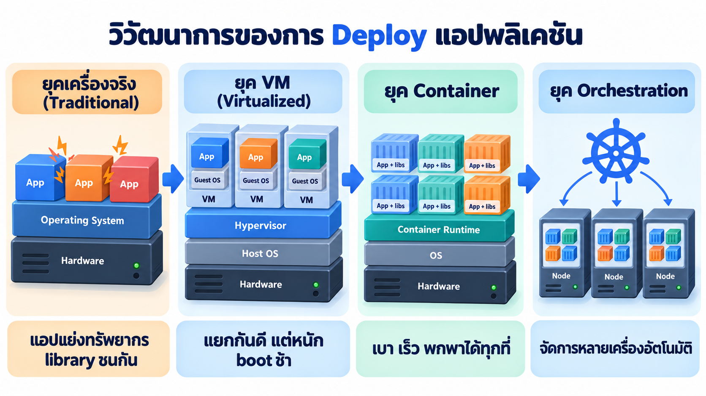<br>
  <em><b>รูปที่ 2</b> วิวัฒนาการของการติดตั้งใช้งานซอฟต์แวร์ จากเครื่องแม่ข่ายจริงสู่ระบบจัดการคอนเทนเนอร์</em>
</p>

**ตารางที่ 2** การเปรียบเทียบรูปแบบการติดตั้งใช้งานซอฟต์แวร์แต่ละยุค

| ยุค | ลักษณะสำคัญ | ข้อดี | ข้อจำกัด |
|---|---|---|---|
| **เครื่องแม่ข่ายจริง (Traditional)** | แอปพลิเคชันหลายตัวทำงานบนระบบปฏิบัติการเดียวกัน | โครงสร้างไม่ซับซ้อน | ไม่มีการแยกทรัพยากร เกิดความขัดแย้งของไลบรารี และขยายระบบได้ยาก |
| **เครื่องเสมือน (Virtualized)** | Hypervisor แบ่งเครื่องจริงเป็นหลายเครื่องเสมือน แต่ละเครื่องมีระบบปฏิบัติการของตนเอง | แยกส่วนกันอย่างชัดเจนและมีความปลอดภัยสูง | สิ้นเปลืองทรัพยากรจากระบบปฏิบัติการที่ซ้ำซ้อน และใช้เวลาเริ่มต้นนาน |
| **คอนเทนเนอร์ (Containers)** | ใช้เคอร์เนลร่วมกัน และแยกส่วนด้วย namespaces และ cgroups | มีน้ำหนักเบา เริ่มทำงานได้ภายในไม่กี่วินาที และเคลื่อนย้ายได้ง่าย | บริหารจัดการด้วยมือได้ยากเมื่อมีจำนวนมากและกระจายอยู่หลายเครื่อง |
| **การจัดการคอนเทนเนอร์ (Orchestration)** | ระบบกลางบริหารคอนเทนเนอร์ข้ามเครื่องแม่ข่ายหลายเครื่อง | จัดวาง ปรับขนาด ฟื้นฟู และปรับปรุงเวอร์ชันได้โดยอัตโนมัติ | ผู้ใช้ต้องเรียนรู้แนวคิดใหม่ และต้องมีการดูแลรักษาคลัสเตอร์ |

---

## 3. นิยามและขีดความสามารถของ Kubernetes

**Kubernetes** (นิยมเขียนย่อว่า **K8s** โดยเลข 8 แทนจำนวนอักษรระหว่าง K และ s) คือแพลตฟอร์มโอเพนซอร์สสำหรับการติดตั้งใช้งาน การปรับขนาด และการบริหารจัดการแอปพลิเคชันที่บรรจุในคอนเทนเนอร์โดยอัตโนมัติ Kubernetes พัฒนาขึ้นโดย Google บนพื้นฐานประสบการณ์จากระบบภายในชื่อ Borg [2] และได้ส่งมอบให้ **Cloud Native Computing Foundation (CNCF)** เป็นผู้ดูแลโครงการตั้งแต่ปี ค.ศ. 2015

**ตารางที่ 3** ขีดความสามารถหลักของ Kubernetes

| ขีดความสามารถ | คำอธิบาย |
|---|---|
| **Service discovery และ load balancing** | กำหนดชื่อ DNS และหมายเลข IP ที่คงที่ให้แก่กลุ่มของ Pod และกระจายทราฟฟิกไปยัง Pod เหล่านั้น |
| **Storage orchestration** | เชื่อมต่อระบบจัดเก็บข้อมูลหลายประเภท เช่น local disk, NFS และ cloud disk โดยอัตโนมัติ |
| **Automated rollouts และ rollbacks** | ปรับปรุงเวอร์ชันแบบค่อยเป็นค่อยไป และย้อนกลับได้เมื่อเกิดความผิดพลาด |
| **Automatic bin packing** | เลือกเครื่องที่เหมาะสมตามปริมาณ CPU และหน่วยความจำที่ Pod ร้องขอ |
| **Self-healing** | เริ่มคอนเทนเนอร์ที่ล้มเหลวใหม่ สร้าง Pod ทดแทน และงดส่งทราฟฟิกไปยัง Pod ที่ยังไม่พร้อม |
| **Secret และ configuration management** | แยกการตั้งค่าและข้อมูลลับออกจาก container image |
| **Horizontal scaling** | ปรับจำนวน Pod ด้วยคำสั่งหรือโดยอัตโนมัติตามตัวชี้วัดการใช้ทรัพยากร |
| **Declarative configuration** | ผู้ใช้ระบุสถานะที่ต้องการ โดยไม่ต้องระบุขั้นตอนการดำเนินการ |

ทั้งนี้ Kubernetes มิใช่ Platform-as-a-Service (PaaS) แบบสำเร็จรูป ระบบไม่ได้คอมไพล์ซอร์สโค้ด ไม่ได้จัดเตรียมฐานข้อมูลหรือระบบคิวข้อความ และไม่ได้กำหนดเครื่องมือด้านการบันทึกล็อกหรือการเฝ้าระวังไว้ตายตัว Kubernetes จึงมีลักษณะเป็น "แพลตฟอร์มสำหรับสร้างแพลตฟอร์ม" ที่สามารถผนวกเครื่องมือภายนอกเข้ามาได้ตามความต้องการ [1]

---

## 4. ภาพรวมสถาปัตยกรรมของ Kubernetes Cluster

<p align="center" id="fig-3">
  <br>
  <em><b>รูปที่ 3</b> สถาปัตยกรรมของ Kubernetes Cluster ประกอบด้วย Control Plane และ Worker Node</em>
</p>

**ตารางที่ 4** คำศัพท์และหน้าที่ขององค์ประกอบในภาพสถาปัตยกรรม Kubernetes Cluster (คลัสเตอร์ คือกลุ่มเครื่องที่ Kubernetes ดูแลร่วมกัน)

| องค์ประกอบในภาพ | คืออะไร | ทำหน้าที่อะไร |
|---|---|---|
| **Control Plane** | ส่วนควบคุมและดูแลการทำงานโดยรวมของคลัสเตอร์ ประกอบด้วยโปรแกรมหลายตัว เปรียบเหมือนหอบังคับการท่าเรือ | ตัดสินใจว่าแอปควรทำงานบนเครื่องใด และดูแลให้ระบบทำงานตามที่ผู้ใช้กำหนด เช่น มีแอปทำงานครบตามจำนวนที่ต้องการ |
| **kube-apiserver** | โปรแกรมที่เป็นจุดรับคำขอของ Kubernetes ทั้งจากผู้ใช้และโปรแกรมที่ดูแลระบบ | รับคำขอ เช่น “เริ่มใช้งานแอปนี้” หรือ “ขอดูสถานะแอป” ตรวจสอบสิทธิ์และข้อมูล แล้วอ่านหรือบันทึกข้อมูลในฐานข้อมูล etcd |
| **kube-scheduler** | โปรแกรมจัดสรรเครื่องสำหรับรันแอป | เลือกเครื่องให้ชุดคอนเทนเนอร์ที่เรียกว่า Pod ซึ่งยังไม่มีเครื่องรัน โดยดู CPU หน่วยความจำ และเงื่อนไขที่กำหนด แล้วบันทึกผลผ่าน kube-apiserver |
| **kube-controller-manager** | โปรแกรมที่รวมงานดูแลระบบอัตโนมัติหลายอย่างไว้ด้วยกัน แต่ละงานมีตัวดูแลที่เรียกว่า controller | ตรวจสิ่งที่กำลังเกิดขึ้นเทียบกับสิ่งที่ผู้ใช้กำหนด เช่น ต้องการแอป 3 ชุดแต่เหลือ 2 ชุด ตัวดูแลที่เกี่ยวข้องจะขอสร้างชุดทดแทนผ่าน kube-apiserver |
| **cloud-controller-manager** | โปรแกรมเชื่อม Kubernetes กับบริการคลาวด์ ใช้เมื่อคลัสเตอร์ต้องทำงานร่วมกับผู้ให้บริการคลาวด์ | ตรวจข้อมูลเครื่องจากผู้ให้บริการ และขอสร้างหรือปรับบริการกระจายคำขอเข้าแอป (load balancer) ผ่านช่องทางที่ผู้ให้บริการเปิดไว้ |
| **etcd** | ฐานข้อมูลสำหรับเก็บข้อมูลที่ Kubernetes ใช้ดูแลระบบ | เก็บข้อมูล เช่น ต้องการแอปกี่ชุด แต่ละชุดถูกจัดให้ทำงานบนเครื่องใด และสถานะล่าสุดที่รายงาน ไม่ได้ใช้เก็บข้อมูลของแอป เช่น รายการสั่งซื้อ |
| **Worker Node** | เครื่องที่รันแอปจริง อาจเป็นเครื่องจริงหรือเครื่องเสมือน คำว่า Node หมายถึงเครื่องหนึ่งเครื่องในคลัสเตอร์ เปรียบเหมือนเรือสินค้า | ใช้ CPU หน่วยความจำ และเครือข่ายของเครื่องเพื่อให้คอนเทนเนอร์ของแอปทำงาน |
| **kubelet** | โปรแกรมดูแลการรันแอปประจำเครื่อง | อ่านจาก kube-apiserver ว่าเครื่องนี้ได้รับมอบหมายให้รันคอนเทนเนอร์ชุดใด เรียกโปรแกรมรันคอนเทนเนอร์ให้เริ่มทำงาน และรายงานสถานะกลับ |
| **container runtime** | โปรแกรมสำหรับรันคอนเทนเนอร์บนเครื่อง เช่น containerd | ดาวน์โหลดชุดไฟล์แอปและสภาพแวดล้อมที่เรียกว่า container image แล้วเริ่มหรือหยุดคอนเทนเนอร์ตามคำขอของ kubelet |
| **kube-proxy** | โปรแกรมดูแลกฎเครือข่ายสำหรับทางเข้าแอปที่เรียกว่า Service ซึ่งมีที่อยู่คงที่ | ตั้งกฎบนเครื่องให้คำขอที่ส่งมายังที่อยู่ของ Service ไปถึงคอนเทนเนอร์ชุดปลายทางได้ บางระบบใช้โปรแกรมเครือข่ายอื่นทำหน้าที่นี้แทน |
| **Pod** | ชุดคอนเทนเนอร์หนึ่งตัวหรือหลายตัวที่ Kubernetes จัดให้ทำงานร่วมกันบนเครื่องเดียว เป็นหน่วยเล็กที่สุดที่ Kubernetes จัดวาง | รันแอป เช่น เว็บเซิร์ฟเวอร์หนึ่งชุด คอนเทนเนอร์ในชุดใช้เครือข่ายร่วมกัน และแชร์พื้นที่จัดเก็บได้เมื่อกำหนดไว้ |
| **kubectl** | เครื่องมือที่ผู้ใช้พิมพ์คำสั่งเพื่อใช้งาน Kubernetes | ส่งคำขอไปยัง kube-apiserver เช่น เริ่มใช้งานแอป ดูสถานะ หรือเปลี่ยนจำนวนชุดของแอปที่ต้องการให้ทำงาน |
| **Cloud Provider** | ผู้ให้บริการเครื่องและระบบอื่น ๆ ผ่านคลาวด์ เช่น AWS, Azure หรือ Google Cloud | ให้เช่าเครื่องเสมือนและให้บริการเครือข่าย โดย cloud-controller-manager ติดต่อเพื่อจัดการส่วนที่ Kubernetes ต้องใช้ |

> **อ่านภาพที่ 3 อย่างไร:** ข้อความ “ทุกส่วนคุยกันผ่าน kube-apiserver เท่านั้น” ในภาพให้เข้าใจว่าเป็นการอ่านและเปลี่ยนข้อมูลสถานะของ Kubernetes ไม่ใช่การสื่อสารทุกประเภท เช่น kubelet ติดต่อ container runtime บนเครื่องโดยตรง และ Pod ส่งทราฟฟิกถึงกันผ่านเครือข่ายได้โดยไม่ผ่าน API server ส่วน etcd เก็บข้อมูลสถานะที่บันทึกผ่าน API ไม่ได้เก็บข้อมูลทุกอย่างของแอปพลิเคชัน

**Kubernetes Cluster** ประกอบด้วยเครื่อง (เครื่องจริงหรือเครื่องเสมือน) ซึ่งแบ่งบทบาทออกเป็นสองกลุ่ม ดังแสดงในรูปที่ 3 ตารางที่ 4 และแผนภาพต่อไปนี้

- **Control Plane** ทำหน้าที่ตัดสินใจระดับคลัสเตอร์ เช่น การจัดเก็บสถานะ การจัดวาง Pod และการตรวจสอบให้สถานะจริงตรงกับสถานะที่ต้องการ เปรียบได้กับหอบังคับการท่าเรือ
- **Worker Node** ทำหน้าที่ประมวลผลภาระงานจริงในรูปของ Pod และรายงานสถานะกลับไปยัง Control Plane เปรียบได้กับเรือสินค้า

```
                         ┌─────────────────────── Control Plane ───────────────────────┐
  kubectl / CI/CD  ───►  │  kube-apiserver ◄──► etcd                                   │
   (REST + YAML)         │       ▲   ▲   ▲                                             │
                         │       │   │   └── kube-scheduler                            │
                         │       │   └────── kube-controller-manager                   │
                         │       └────────── cloud-controller-manager ──► Cloud API     │
                         └───────┼─────────────────────────────────────────────────────┘
                                 │  (อ่านและอัปเดตสถานะผ่าน kube-apiserver)
          ┌──────────────────────┼──────────────────────┐
   ┌──────▼──────┐        ┌──────▼──────┐        ┌──────▼──────┐
   │ Worker Node1│        │ Worker Node2│        │ Worker Node3│
   │ kubelet     │        │ kubelet     │        │ kubelet     │
   │ kube-proxy  │        │ kube-proxy  │        │ kube-proxy  │
   │ containerd  │        │ containerd  │        │ containerd  │
   │ [Pod][Pod]  │        │ [Pod][Pod]  │        │ [Pod]       │
   └─────────────┘        └─────────────┘        └─────────────┘
```

---

## 5. องค์ประกอบของ Control Plane

<p align="center" id="fig-4">
  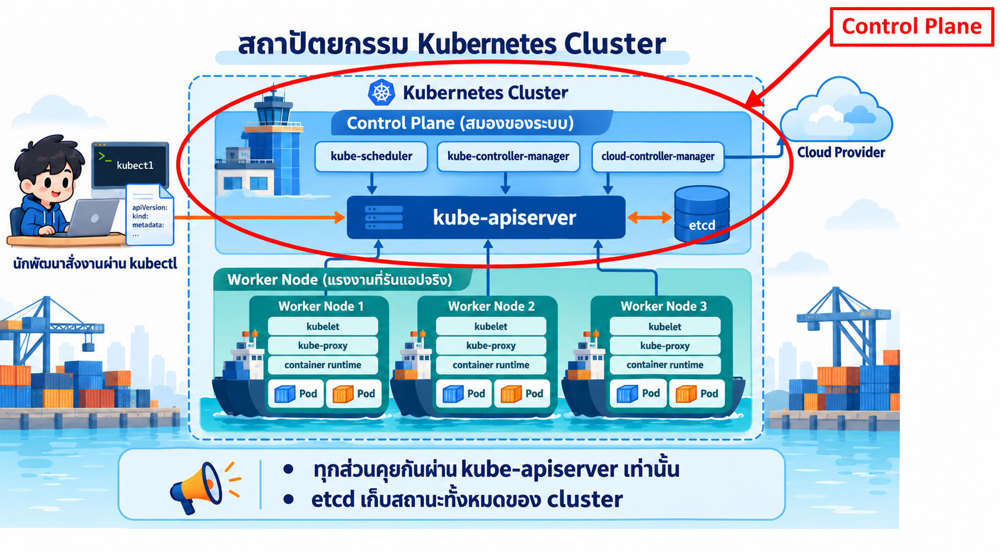<br>
  <em><b>รูปที่ 4</b> ตำแหน่ง Control Plane ในภาพรวมคลัสเตอร์</em>
</p>

<p align="center" id="fig-5">
  <br>
  <em><b>รูปที่ 5</b> ภาพรวมองค์ประกอบของ Control Plane ในรูปแบบอุปมาหอบังคับการท่าเรือ</em>
</p>

Control Plane ประกอบด้วยองค์ประกอบหลัก 5 ส่วน ดังสรุปในตารางที่ 5 และอธิบายรายละเอียดในหัวข้อย่อย 5.1–5.5

**ตารางที่ 5** สรุปองค์ประกอบของ Control Plane

| องค์ประกอบ | หน้าที่โดยสรุป | ผลกระทบเมื่อขัดข้อง |
|---|---|---|
| kube-apiserver | จุดติดต่อเดียวของคลัสเตอร์ | ไม่สามารถสั่งการคลัสเตอร์ได้ |
| etcd | จัดเก็บสถานะทั้งหมดของคลัสเตอร์ | สูญเสียสถานะของคลัสเตอร์ |
| kube-scheduler | เลือก Node ให้แก่ Pod | Pod ใหม่ค้างอยู่ในสถานะ Pending |
| kube-controller-manager | ปรับสถานะจริงให้ตรงกับสถานะที่ต้องการ | ระบบไม่ฟื้นฟูตนเอง |
| cloud-controller-manager | ประสานงานกับผู้ให้บริการคลาวด์ | ไม่สามารถสร้างทรัพยากรบนคลาวด์ได้ |

### 5.1 kube-apiserver

<p align="center" id="fig-6">
  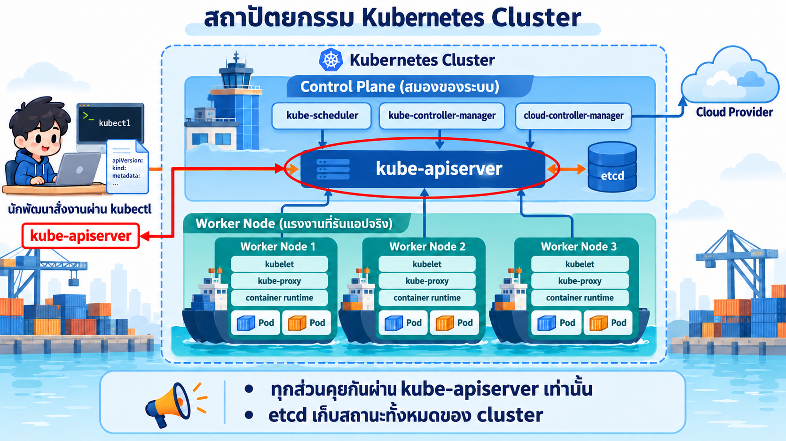<br>
  <em><b>รูปที่ 6</b> ตำแหน่ง kube-apiserver ในภาพรวมคลัสเตอร์</em>
</p>

<p align="center" id="fig-7">
  <br>
  <em><b>รูปที่ 7</b> kube-apiserver: จุดติดต่อเดียวและศูนย์กลางของคลัสเตอร์</em>
</p>

kube-apiserver ทำหน้าที่เปิดให้บริการ Kubernetes API ในรูปแบบ REST ผ่านโปรโตคอล HTTPS (โดยปกติใช้พอร์ต 6443) คำสั่ง `kubectl` จึงเป็นเพียงไคลเอนต์ที่แปลงคำสั่งเป็นคำร้องขอ HTTP ไปยัง kube-apiserver เช่น คำสั่งสร้าง Deployment จะถูกแปลงเป็นคำร้องขอ `POST /apis/apps/v1/namespaces/default/deployments`

นอกจากนี้ kube-apiserver ยังให้บริการกลไก **watch** ซึ่งทำให้องค์ประกอบอื่นได้รับแจ้งการเปลี่ยนแปลงของ object แบบทันที เนื่องจาก kube-apiserver ไม่เก็บสถานะไว้ในตนเอง (stateless) จึงสามารถเพิ่มจำนวนอินสแตนซ์และวางไว้หลัง load balancer ได้ ในกรณีที่ kube-apiserver ขัดข้อง ผู้ดูแลระบบจะไม่สามารถสั่งการคลัสเตอร์ได้ แต่ Pod ที่กำลังทำงานอยู่บน Worker Node จะยังคงทำงานต่อไป

### 5.2 etcd

<p align="center" id="fig-8">
  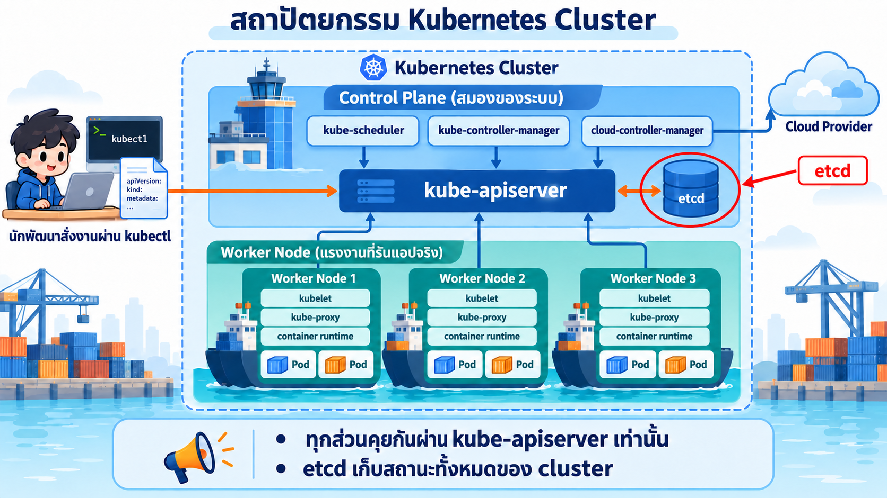<br>
  <em><b>รูปที่ 8</b> ตำแหน่ง etcd ในภาพรวมคลัสเตอร์</em>
</p>

<p align="center" id="fig-9">
  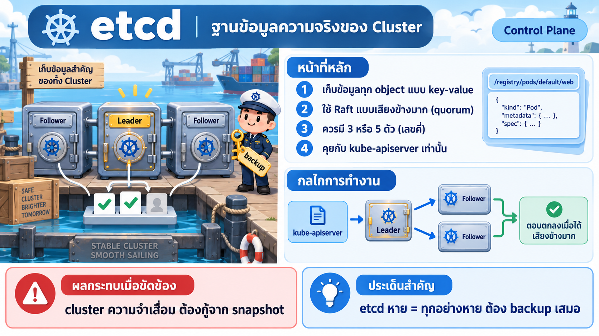<br>
  <em><b>รูปที่ 9</b> etcd: ฐานข้อมูลที่ Kubernetes ใช้ดูแลคลัสเตอร์</em>
</p>

etcd เป็นฐานข้อมูลที่เก็บข้อมูลที่ Kubernetes ใช้ดูแลคลัสเตอร์ เช่น ต้องการให้แอปทำงานกี่ชุด แต่ละชุดอยู่บนเครื่องใด และสถานะล่าสุดที่รายงาน

### 5.3 kube-scheduler

<p align="center" id="fig-10">
  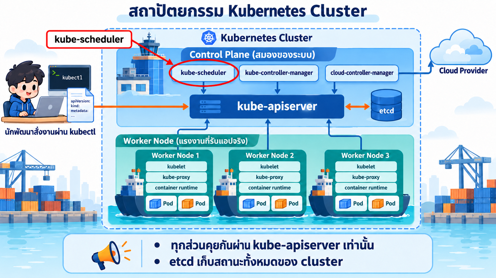<br>
  <em><b>รูปที่ 10</b> ตำแหน่ง kube-scheduler ในภาพรวมคลัสเตอร์</em>
</p>

<p align="center" id="fig-11">
  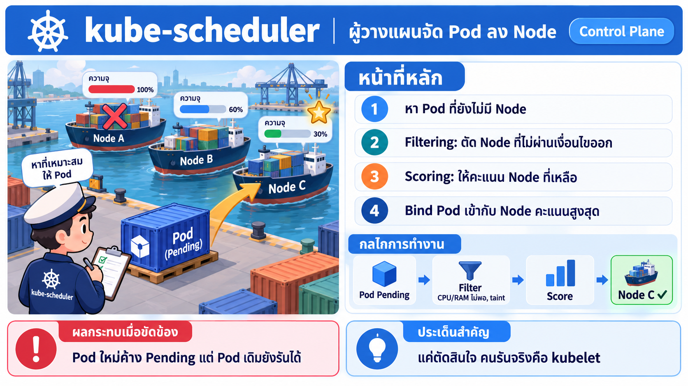<br>
  <em><b>รูปที่ 11</b> kube-scheduler: กระบวนการคัดกรองและให้คะแนน Node สำหรับ Pod</em>
</p>

kube-scheduler เฝ้าติดตาม Pod ที่ยังไม่ได้รับการกำหนด Node (ค่า `spec.nodeName` ว่าง) และคัดเลือก Node ที่เหมาะสมที่สุดผ่านกระบวนการสองขั้นตอน ดังตารางที่ 6

**ตารางที่ 6** ขั้นตอนการจัดวาง Pod ของ kube-scheduler

| ขั้นตอน | การดำเนินการ | ตัวอย่างเกณฑ์ |
|---|---|---|
| **Filtering** | คัด Node ที่ไม่เป็นไปตามเงื่อนไขออก | ทรัพยากรไม่เพียงพอตาม `resources.requests`, taint ที่ Pod ไม่ tolerate, ไม่ตรงกับ `nodeSelector` หรือ node affinity, พอร์ตบน Node ซ้ำกัน |
| **Scoring** | ให้คะแนน Node ที่ผ่านการคัดกรอง | การกระจายภาระงาน, การมี image อยู่แล้วบน Node, pod affinity และ anti-affinity |

เมื่อได้ Node ที่มีคะแนนสูงสุด kube-scheduler จะดำเนินการ **binding** โดยบันทึกชื่อ Node ลงใน object ของ Pod ผ่าน kube-apiserver ทั้งนี้ kube-scheduler ทำหน้าที่เพียงตัดสินใจเท่านั้น ส่วนการสร้างคอนเทนเนอร์จริงเป็นหน้าที่ของ kubelet บน Node ปลายทาง หาก kube-scheduler ขัดข้อง Pod ใหม่จะค้างอยู่ในสถานะ `Pending` ขณะที่ Pod เดิมยังคงทำงานได้ตามปกติ

### 5.4 kube-controller-manager

<p align="center" id="fig-12">
  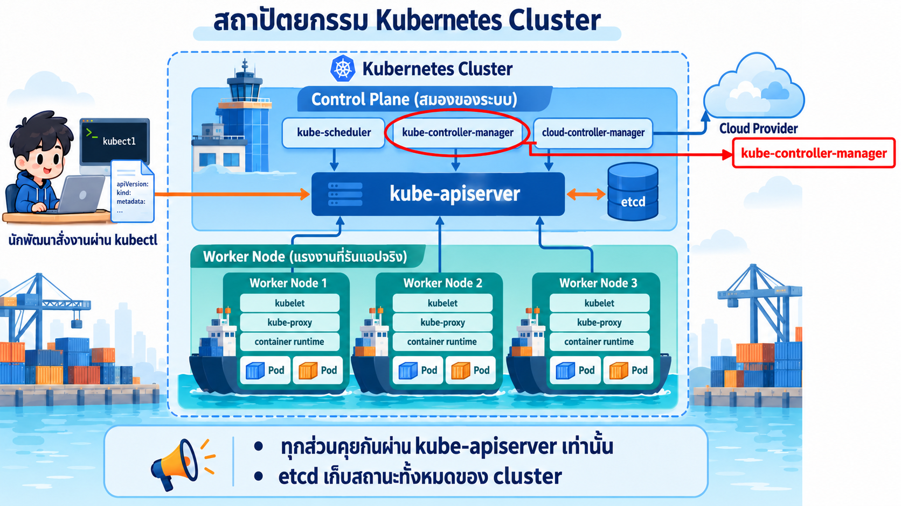<br>
  <em><b>รูปที่ 12</b> ตำแหน่ง kube-controller-manager ในภาพรวมคลัสเตอร์</em>
</p>

<p align="center" id="fig-13">
  <br>
  <em><b>รูปที่ 13</b> kube-controller-manager: กลุ่มของ controller ที่ทำงานแบบ control loop</em>
</p>

kube-controller-manager เป็นโปรเซสที่รวม **controller** หลายตัวเข้าไว้ด้วยกันเพื่อลดความซับซ้อนในการติดตั้ง controller แต่ละตัวทำงานแบบ **control loop** กล่าวคือ สังเกตสถานะจริงของทรัพยากร เปรียบเทียบกับสถานะที่ต้องการ และดำเนินการแก้ไขจนกระทั่งทั้งสองสถานะสอดคล้องกัน ตัวอย่าง controller ที่สำคัญแสดงในตารางที่ 7

**ตารางที่ 7** ตัวอย่าง controller ใน kube-controller-manager

| Controller | หน้าที่ |
|---|---|
| Node controller | ตรวจสอบสถานะของ Node และดำเนินการ evict Pod เมื่อ Node ขาดการติดต่อเกินระยะเวลาที่กำหนด |
| ReplicaSet controller | รักษาจำนวน Pod ให้เท่ากับค่า `replicas` |
| Deployment controller | บริหาร ReplicaSet ระหว่างการปรับปรุงเวอร์ชัน |
| Job controller | สร้าง Pod เพื่อดำเนินงานจนเสร็จสมบูรณ์ |
| EndpointSlice controller | ปรับปรุงรายการหมายเลข IP ของ Pod ที่อยู่เบื้องหลัง Service |
| ServiceAccount controller | สร้าง ServiceAccount เริ่มต้นให้แก่ namespace ใหม่ |

<p align="center" id="fig-14">
  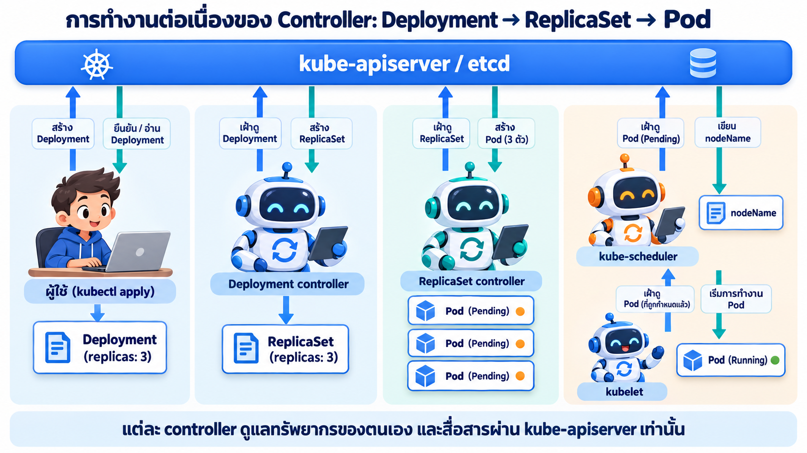<br>
  <em><b>รูปที่ 14</b> การทำงานต่อเนื่องของ controller จาก Deployment สู่ ReplicaSet และ Pod โดยสื่อสารผ่าน kube-apiserver</em>
</p>

controller แต่ละตัวรับผิดชอบทรัพยากรเพียงประเภทเดียว และทำงานต่อเนื่องกันเป็นทอด ๆ โดยอาศัยผลลัพธ์ของ controller ก่อนหน้าเป็นข้อมูลนำเข้า ตัวอย่างเช่น เมื่อผู้ใช้สร้าง Deployment ที่กำหนด `replicas: 3` Deployment controller จะสร้าง ReplicaSet จากนั้น ReplicaSet controller จะสร้าง Pod จำนวน 3 ตัว แล้ว kube-scheduler จะกำหนด Node ให้แก่ Pod และ kubelet จะเริ่มการทำงานของคอนเทนเนอร์ตามลำดับ ทุกขั้นตอนเกิดขึ้นผ่านการอ่านและเขียน object ใน kube-apiserver โดยไม่มีการเรียกใช้กันโดยตรง นอกจากนี้ object ที่ถูกสร้างจะมีฟิลด์ `metadata.ownerReferences` ชี้กลับไปยัง object ผู้สร้าง ซึ่งระบบใช้ในการลบแบบต่อเนื่อง (cascading deletion) ผ่าน garbage collector

หาก kube-controller-manager ขัดข้อง ระบบจะสูญเสียความสามารถในการฟื้นฟูตนเอง เช่น Pod ที่หยุดทำงานจะไม่ถูกสร้างทดแทน

### 5.5 cloud-controller-manager

<p align="center" id="fig-15">
  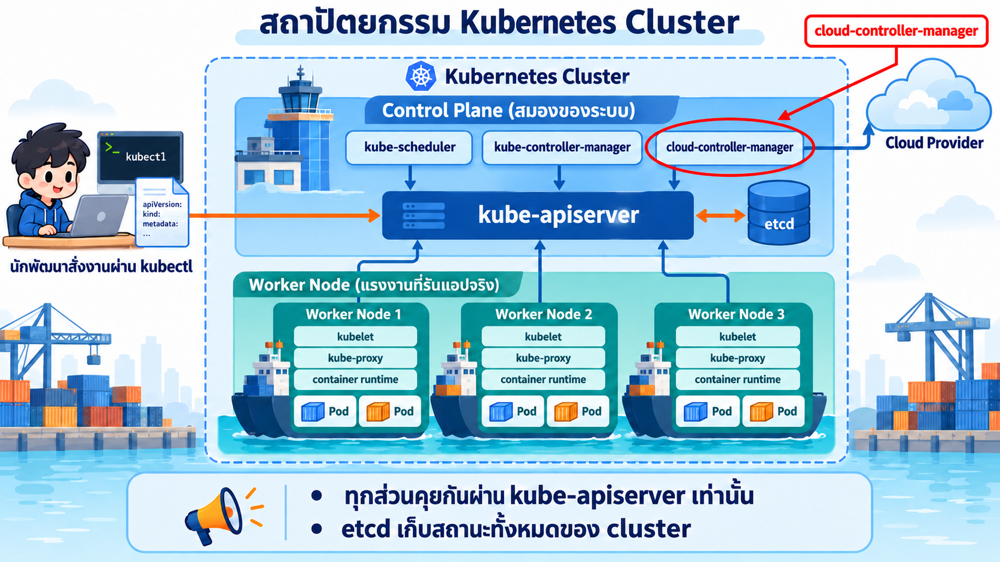<br>
  <em><b>รูปที่ 15</b> ตำแหน่ง cloud-controller-manager ในภาพรวมคลัสเตอร์</em>
</p>

<p align="center" id="fig-16">
  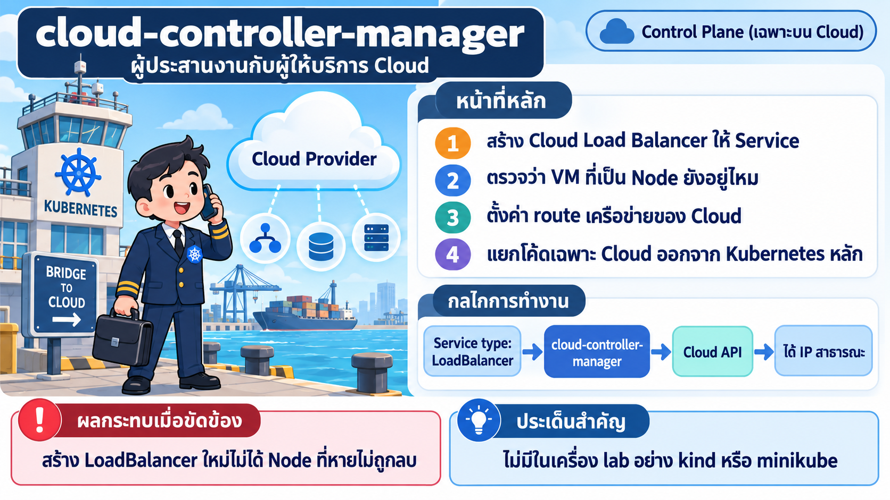<br>
  <em><b>รูปที่ 16</b> cloud-controller-manager: ส่วนเชื่อมต่อระหว่างคลัสเตอร์กับผู้ให้บริการคลาวด์</em>
</p>

cloud-controller-manager แยกตรรกะที่เฉพาะเจาะจงกับผู้ให้บริการคลาวด์ออกจากแกนหลักของ Kubernetes เพื่อให้ผู้ให้บริการแต่ละรายพัฒนาส่วนเชื่อมต่อของตนได้อย่างอิสระ ประกอบด้วย controller หลัก 3 ส่วน ได้แก่

- **Node controller** ตรวจสอบกับ API ของคลาวด์ว่าเครื่องเสมือนที่เป็น Node ยังคงมีอยู่หรือไม่ และนำ Node ที่ถูกลบออกจากคลัสเตอร์
- **Route controller** กำหนดเส้นทางเครือข่ายในโครงสร้างพื้นฐานของคลาวด์
- **Service controller** สร้างและบริหาร cloud load balancer สำหรับ Service ประเภท `LoadBalancer`

องค์ประกอบนี้มีเฉพาะในคลัสเตอร์ที่ทำงานบนผู้ให้บริการคลาวด์ คลัสเตอร์สำหรับการทดลอง เช่น kind หรือ minikube จะไม่มีองค์ประกอบนี้

> สามารถตรวจสอบองค์ประกอบของ Control Plane ในคลัสเตอร์ได้ด้วยคำสั่ง `kubectl get pods -n kube-system`

---

## 6. องค์ประกอบของ Worker Node

<p align="center" id="fig-17">
  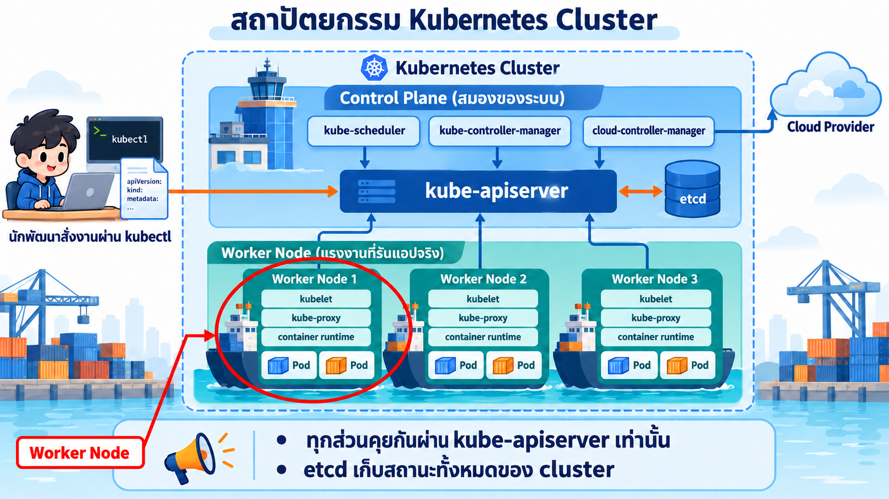<br>
  <em><b>รูปที่ 17</b> ตำแหน่ง Worker Node ในภาพรวมคลัสเตอร์ (ใช้ Worker Node 1 เป็นตัวอย่าง)</em>
</p>

<p align="center" id="fig-18">
  <br>
  <em><b>รูปที่ 18</b> ภาพรวมองค์ประกอบภายใน Worker Node</em>
</p>

Worker Node ทุกเครื่องมีองค์ประกอบที่ทำงานร่วมกันเพื่อรันและเชื่อมต่อ Pod ดังสรุปในตารางที่ 8

**ตารางที่ 8** สรุปองค์ประกอบของ Worker Node

| องค์ประกอบ | อุปมา | หน้าที่โดยสรุป |
|---|---|---|
| kubelet | กัปตันเรือ | รับมอบหมาย Pod และควบคุมวงจรชีวิตของ Pod บน Node |
| Container runtime | ห้องเครื่องและเครน | ดึง image และรันคอนเทนเนอร์ |
| kube-proxy | เจ้าหน้าที่จัดการจราจร | สร้างกฎเครือข่ายสำหรับ Service |
| CNI plugin | ระบบสายเชื่อมต่อ | กำหนด IP และเชื่อมต่อเครือข่ายของ Pod |

### 6.1 kubelet

<p align="center" id="fig-19">
  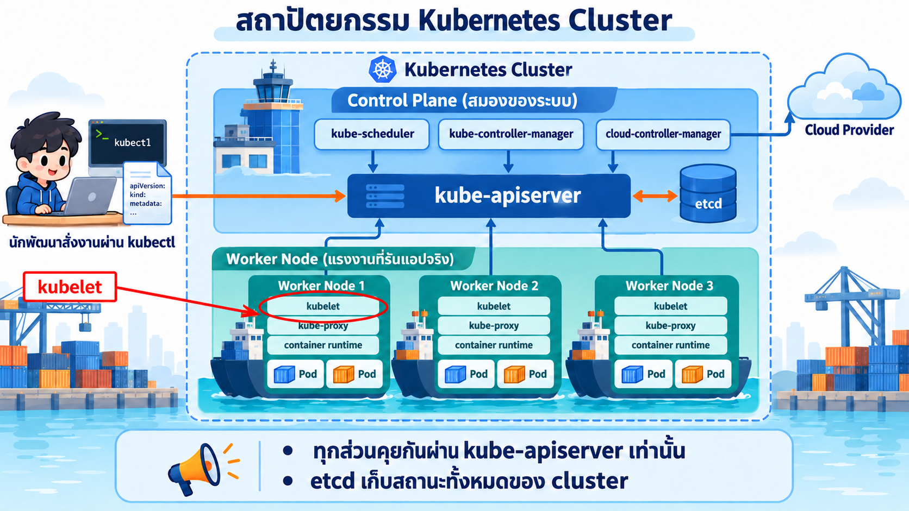<br>
  <em><b>รูปที่ 19</b> ตำแหน่ง kubelet ในภาพรวมคลัสเตอร์ (ใช้ Worker Node 1 เป็นตัวอย่าง)</em>
</p>

<p align="center" id="fig-20">
  <br>
  <em><b>รูปที่ 20</b> kubelet: ตัวแทน (agent) ประจำ Node ที่ควบคุมวงจรชีวิตของ Pod</em>
</p>

kubelet เป็นตัวแทน (agent) ที่ทำงานบนทุก Node และเป็นองค์ประกอบเพียงตัวเดียวที่ลงมือสร้าง Pod บนเครื่องจริง kubelet เฝ้าติดตาม kube-apiserver เพื่อรับ Pod ที่ได้รับมอบหมายให้แก่ Node ของตน จากนั้นสั่งการ container runtime ผ่าน **Container Runtime Interface (CRI)** ให้สร้างคอนเทนเนอร์ตามข้อกำหนดใน PodSpec นอกจากนี้ kubelet ยังดำเนินการตรวจสุขภาพของคอนเทนเนอร์ (liveness, readiness และ startup probe) เชื่อมต่อ volume และรายงานสถานะของ Node และ Pod กลับไปยัง kube-apiserver อย่างต่อเนื่อง

หาก kubelet หยุดทำงาน Node จะเปลี่ยนเป็นสถานะ `NotReady` และหลังจากระยะเวลาที่กำหนด Pod ที่อยู่บน Node ดังกล่าวจะถูกสร้างทดแทนบน Node อื่นโดย controller ที่ดูแล Pod เหล่านั้น

### 6.2 Container Runtime

<p align="center" id="fig-21">
  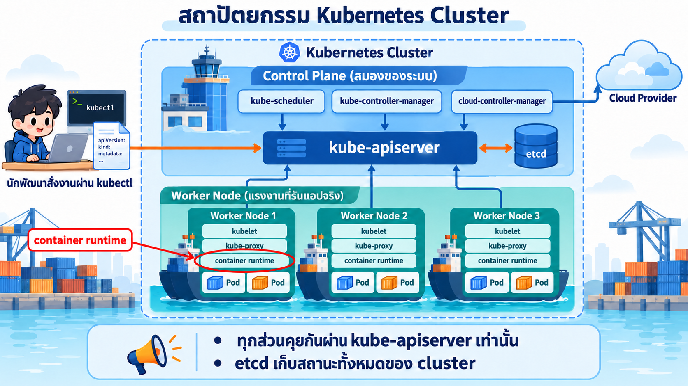<br>
  <em><b>รูปที่ 21</b> ตำแหน่ง container runtime ในภาพรวมคลัสเตอร์ (ใช้ Worker Node 1 เป็นตัวอย่าง)</em>
</p>

<p align="center" id="fig-22">
  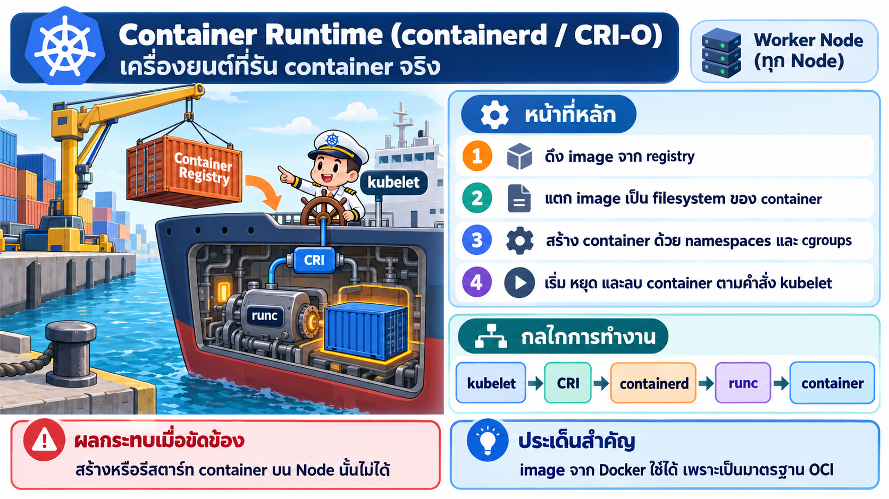<br>
  <em><b>รูปที่ 22</b> Container Runtime: ส่วนที่ดึง image และรันคอนเทนเนอร์จริง</em>
</p>

Container runtime คือซอฟต์แวร์ที่ดึง container image จาก registry แตก image เป็นระบบแฟ้มของคอนเทนเนอร์ และสร้างคอนเทนเนอร์โดยอาศัยกลไก namespaces และ cgroups ของเคอร์เนล Linux runtime ที่นิยมใช้ ได้แก่ **containerd** และ **CRI-O** ซึ่งเรียกใช้ low-level runtime เช่น `runc` อีกทอดหนึ่ง ลำดับการเรียกใช้จึงเป็น kubelet → CRI → containerd → runc → คอนเทนเนอร์

ตั้งแต่ Kubernetes เวอร์ชัน 1.24 ได้ยกเลิกส่วนเชื่อมต่อ `dockershim` และสื่อสารกับ runtime ที่รองรับ CRI โดยตรง อย่างไรก็ตาม image ที่สร้างด้วย Docker ยังคงใช้งานได้ตามปกติ เนื่องจากเป็นไปตามมาตรฐาน **Open Container Initiative (OCI)** เดียวกัน

### 6.3 kube-proxy

<p align="center" id="fig-23">
  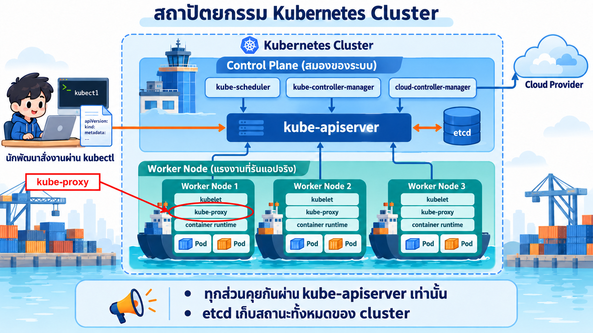<br>
  <em><b>รูปที่ 23</b> ตำแหน่ง kube-proxy ในภาพรวมคลัสเตอร์ (ใช้ Worker Node 1 เป็นตัวอย่าง)</em>
</p>

<p align="center" id="fig-24">
  <br>
  <em><b>รูปที่ 24</b> kube-proxy: การแปลงหมายเลข IP ของ Service ไปยัง Pod ปลายทาง</em>
</p>

kube-proxy ทำงานบนทุก Node โดยเฝ้าติดตาม object ประเภท Service และ EndpointSlice แล้วสร้างกฎเครือข่ายในเคอร์เนลด้วยกลไก **iptables**, **IPVS** หรือ **nftables** เพื่อให้ทราฟฟิกที่ส่งไปยังหมายเลข IP เสมือนของ Service (ClusterIP) ถูกแปลงและกระจายไปยัง Pod ปลายทาง ควรสังเกตว่า kube-proxy มิได้ส่งต่อแพ็กเก็ตด้วยตนเอง หากแต่เขียนกฎให้เคอร์เนลดำเนินการ ในกรณีที่ kube-proxy ขัดข้อง กฎเครือข่ายจะไม่ได้รับการปรับปรุง ส่งผลให้ทราฟฟิกอาจถูกส่งไปยัง Pod ที่ไม่มีอยู่แล้ว ทั้งนี้ CNI plugin บางประเภท เช่น Cilium สามารถทำหน้าที่แทน kube-proxy ได้

### 6.4 CNI Plugin

<p align="center" id="fig-25">
  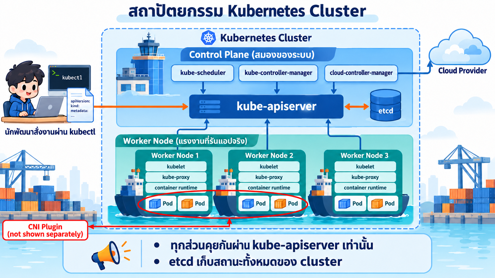<br>
  <em><b>รูปที่ 25</b> พื้นที่ Pod บน Worker Node ที่ CNI Plugin ช่วยจัดการเครือข่าย (ภาพหลักไม่ได้แสดง CNI Plugin แยกไว้)</em>
</p>

<p align="center" id="fig-26">
  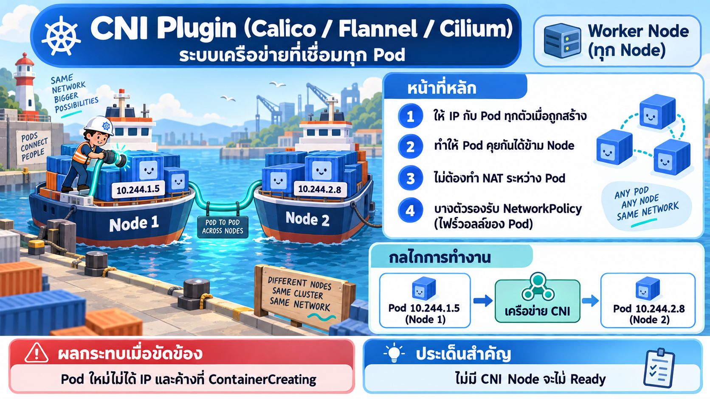<br>
  <em><b>รูปที่ 26</b> CNI Plugin: ระบบเครือข่ายที่เชื่อมต่อ Pod ข้าม Node</em>
</p>

**Container Network Interface (CNI)** เป็นข้อกำหนดมาตรฐานสำหรับการตั้งค่าเครือข่ายของคอนเทนเนอร์ CNI plugin เช่น Calico, Flannel และ Cilium ทำหน้าที่กำหนดหมายเลข IP ให้แก่ Pod ทุกตัวเมื่อถูกสร้าง และทำให้ Pod สื่อสารกันได้ข้าม Node ตาม **แบบจำลองเครือข่ายของ Kubernetes (Kubernetes network model)** ซึ่งมีข้อกำหนดสำคัญดังนี้ [1]

1. Pod ทุกตัวมีหมายเลข IP เป็นของตนเอง
2. Pod ทุกตัวสื่อสารกับ Pod อื่นได้โดยไม่ต้องผ่านการแปลงที่อยู่ (NAT) แม้อยู่ต่าง Node
3. ตัวแทนบน Node (เช่น kubelet) สื่อสารกับ Pod ทุกตัวบน Node นั้นได้

CNI plugin บางประเภทรองรับ **NetworkPolicy** ซึ่งใช้กำหนดกฎการอนุญาตทราฟฟิกระหว่าง Pod ในลักษณะเดียวกับไฟร์วอลล์ หากไม่มี CNI plugin ที่ทำงานได้ Node จะไม่เข้าสู่สถานะ `Ready` และ Pod ใหม่จะค้างอยู่ในสถานะ `ContainerCreating`

---

## 7. Pod: หน่วยการติดตั้งใช้งานที่เล็กที่สุด

<p align="center" id="fig-27">
  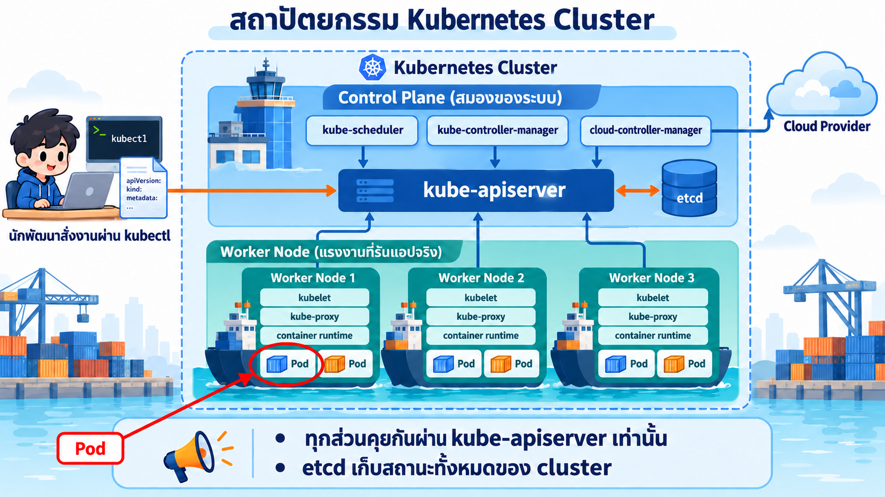<br>
  <em><b>รูปที่ 27</b> ตำแหน่ง Pod ในภาพรวมคลัสเตอร์ (ใช้ Worker Node 1 เป็นตัวอย่าง)</em>
</p>

<p align="center" id="fig-28">
  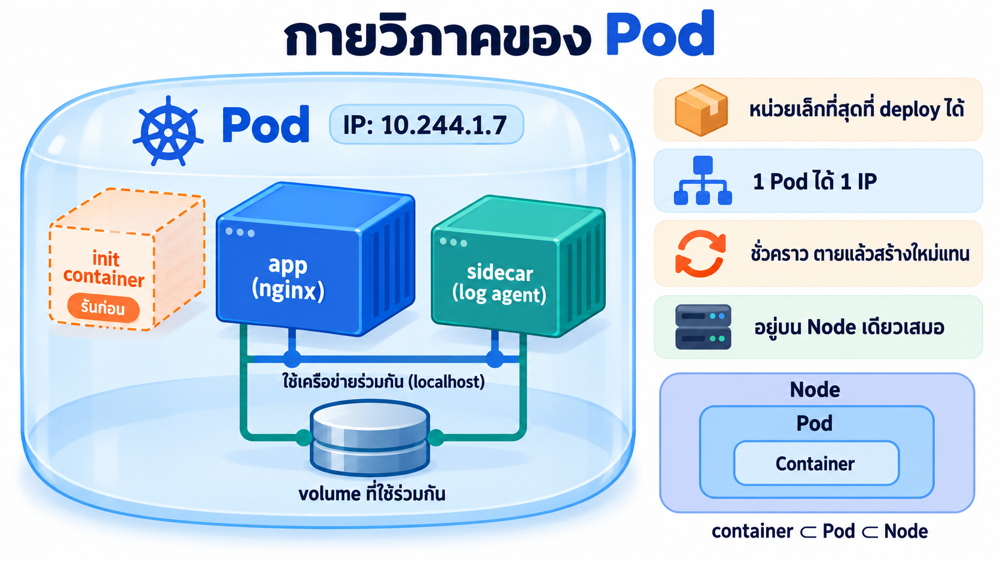<br>
  <em><b>รูปที่ 28</b> โครงสร้างภายในของ Pod: คอนเทนเนอร์ เครือข่ายร่วม และ volume ร่วม</em>
</p>

**Pod** คือหน่วยที่เล็กที่สุดที่สามารถติดตั้งใช้งานใน Kubernetes ได้ Pod หนึ่งตัวประกอบด้วยคอนเทนเนอร์ตั้งแต่หนึ่งตัวขึ้นไปที่ถูกจัดวางบน Node เดียวกันเสมอและมีวงจรชีวิตร่วมกัน คุณสมบัติสำคัญของ Pod มีดังนี้

- คอนเทนเนอร์ใน Pod เดียวกัน **ใช้ network namespace ร่วมกัน** จึงมีหมายเลข IP เดียวกันและสื่อสารกันผ่าน `localhost` ได้
- คอนเทนเนอร์ใน Pod เดียวกัน **ใช้ volume ร่วมกันได้** เช่น คอนเทนเนอร์หลักเขียนไฟล์ล็อก และ sidecar อ่านไฟล์ดังกล่าวเพื่อส่งต่อ
- **Init container** ทำงานจนเสร็จสิ้นก่อนที่คอนเทนเนอร์หลักจะเริ่มทำงาน เช่น ใช้รอให้ฐานข้อมูลพร้อม หรือใช้ปรับโครงสร้างฐานข้อมูล
- **Sidecar container** ทำงานคู่ขนานกับคอนเทนเนอร์หลักเพื่อเสริมความสามารถ เช่น การส่งล็อก หรือ proxy ของ service mesh
- Pod มีลักษณะ **ชั่วคราว (ephemeral)** เมื่อ Pod สิ้นสุดลงจะไม่ถูกนำกลับมาใช้ใหม่ แต่ controller จะสร้าง Pod ใหม่ซึ่งมีชื่อและหมายเลข IP ใหม่ขึ้นทดแทน

```yaml
apiVersion: v1
kind: Pod
metadata:
  name: web
  labels:
    app: web            # label ใช้ให้ Service หรือ ReplicaSet เลือก Pod นี้
spec:
  containers:
    - name: nginx
      image: nginx:1.27
      ports:
        - containerPort: 80
      resources:
        requests: { cpu: "100m", memory: "128Mi" }   # ใช้ประกอบการตัดสินใจของ scheduler
        limits:   { cpu: "500m", memory: "256Mi" }   # ขีดจำกัดการใช้ทรัพยากรจริง
```

วงจรชีวิตของ Pod แบ่งออกเป็นระยะ (phase) ได้แก่ `Pending` → `Running` → `Succeeded` หรือ `Failed` และสถานะ `Unknown` เมื่อไม่สามารถติดต่อ Node ได้ ในทางปฏิบัติ ผู้ใช้มักไม่สร้าง Pod โดยตรง แต่สร้างผ่านทรัพยากรระดับสูงกว่า เช่น Deployment, StatefulSet หรือ Job ซึ่งทำหน้าที่ดูแล Pod อีกชั้นหนึ่ง

---

## 8. ลำดับการทำงานของระบบเมื่อสั่ง `kubectl apply`

<p align="center" id="fig-29">
  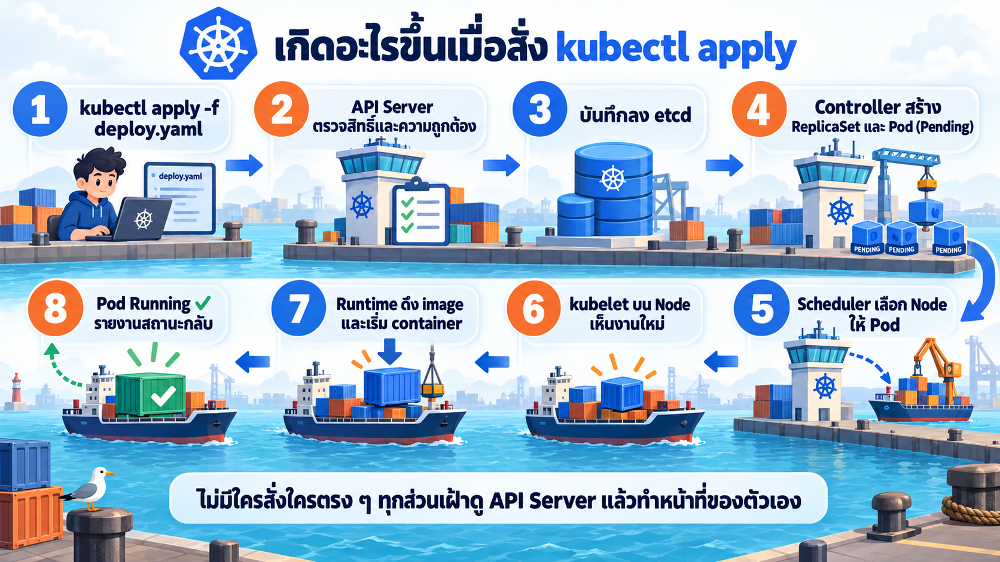<br>
  <em><b>รูปที่ 29</b> ลำดับการทำงานขององค์ประกอบต่าง ๆ เมื่อผู้ใช้สั่ง <code>kubectl apply</code></em>
</p>

หัวข้อนี้อธิบายการทำงานร่วมกันขององค์ประกอบทั้งหมดผ่านกรณีที่ผู้ใช้สั่ง `kubectl apply -f deploy.yaml` เพื่อสร้าง Deployment ที่กำหนด `replicas: 3`

**ตารางที่ 9** ลำดับเหตุการณ์ภายในคลัสเตอร์

| ขั้น | องค์ประกอบ | เหตุการณ์ |
|:---:|---|---|
| 1 | kubectl | อ่านไฟล์ YAML แปลงเป็นคำร้องขอ HTTP และส่งไปยัง kube-apiserver โดยใช้ข้อมูลรับรองจาก `~/.kube/config` |
| 2 | kube-apiserver | ดำเนินการ Authentication, Authorization, Admission control และ Validation |
| 3 | etcd | บันทึก object ประเภท Deployment ณ ขั้นนี้ยังไม่มีคอนเทนเนอร์ใดถูกสร้าง |
| 4 | Deployment controller และ ReplicaSet controller | สร้าง ReplicaSet และ Pod จำนวน 3 ตัวในสถานะ `Pending` ซึ่งยังไม่ได้รับการกำหนด Node |
| 5 | kube-scheduler | คัดกรองและให้คะแนน Node แล้วบันทึก `nodeName` ลงใน Pod |
| 6 | kubelet บน Node ปลายทาง | ตรวจพบ Pod ที่ได้รับมอบหมายให้แก่ Node ของตน |
| 7 | Container runtime และ CNI plugin | ดึง image กำหนดเครือข่ายและหมายเลข IP ให้แก่ Pod และเริ่มการทำงานของคอนเทนเนอร์ |
| 8 | kubelet | ตรวจสุขภาพของคอนเทนเนอร์และรายงานสถานะ `Running` กลับไปยัง kube-apiserver |

จากลำดับเหตุการณ์ข้างต้น scheduler และ controller ประสานงานกันผ่านข้อมูลสถานะใน kube-apiserver แล้วดำเนินการตามหน้าที่ของตน ส่วน kubelet เรียก container runtime บน Node โดยตรงตามหน้าที่ที่สรุปไว้ในตารางที่ 4 หาก kube-scheduler หยุดทำงานชั่วคราว Pod ใหม่ที่ยังไม่ได้รับการจัดวางต้องรอ เมื่อ scheduler กลับมาทำงานจะอ่านสถานะผ่าน API server และดำเนินการต่อได้

ผู้เรียนสามารถสังเกตลำดับเหตุการณ์ดังกล่าวได้จากคำสั่งต่อไปนี้

```bash
kubectl apply -f deploy.yaml
kubectl get events --sort-by=.metadata.creationTimestamp
# Scheduled → Pulling → Pulled → Created → Started
```

---
