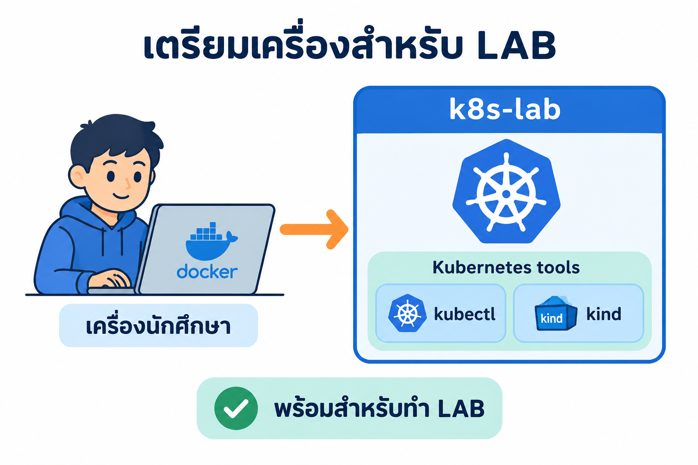
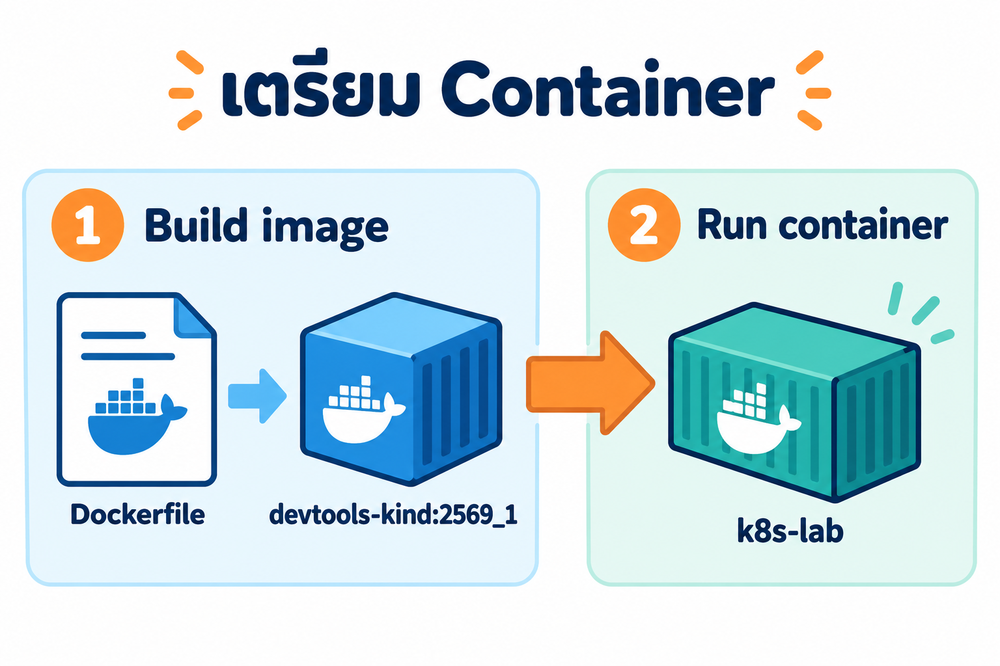
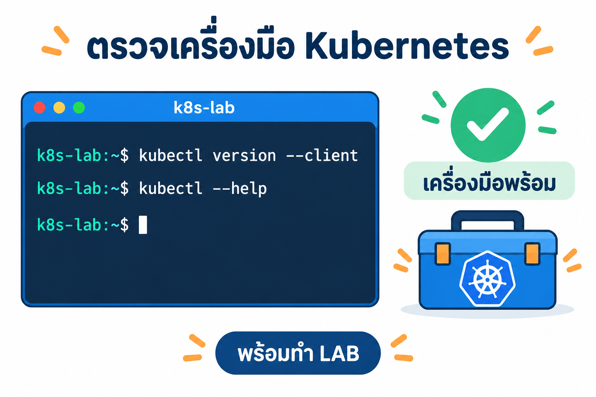

# เตรียมสภาพแวดล้อม Kubernetes สำหรับแล็บ

คู่มือนี้ใช้เตรียมเครื่องให้พร้อมสำหรับแล็บของผู้สอน โดยรัน container `k8s-lab` สำหรับทดลอง Kubernetes บนเครื่องนักศึกษา ภายในมี `kubectl` และเครื่องมือ Kubernetes ที่ใช้ในแล็บ



ก่อนเริ่ม ให้ติดตั้งและเปิด Docker Desktop โดยใช้ Linux containers แล้วเปิด Terminal หรือ PowerShell ในโฟลเดอร์ `02_LAB` ที่มี `Dockerfile` และ `Devtool_SSH`

ตัวอย่างผลลัพธ์ด้านล่างมาจากการทดลองจริงผ่าน CLI บนเครื่องโลคอลและล็อกอิน SSH ด้วยรหัสผ่าน `passwd` วันที่ 4 ตุลาคม 2569 ตัดบางส่วนเพื่อให้อ่านง่าย โดยเวลา, ID และเวอร์ชันอาจต่างกันในแต่ละเครื่อง

## 1. Build image แล้ว Run container



รันคำสั่งต่อไปนี้ **บนเครื่องนักศึกษา** โดย build image ก่อน:

```powershell
docker build -t devtools-kind:2569_1 .
```

เมื่อสำเร็จจะเห็นการตั้งชื่อ image (ตัดจากท้าย build log):

```text
#29 naming to docker.io/library/devtools-kind:2569_1 done
#29 DONE 0.4s
```

เมื่อ build สำเร็จ ให้สร้างและเริ่ม container (คัดลอกทั้งบรรทัด):

```powershell
docker run -dit --name k8s-lab --hostname k8s-lab --privileged -p 2223:22 -p 8889:8888 -p 30080-30082:30080-30082 -v "${PWD}/Devtool_SSH:/etc/devtools/ssh" devtools-kind:2569_1
```

ผลลัพธ์คือ ID ของ container ที่สร้างขึ้น:

```text
587e89ac026f5b8f0c4bee2233d482ce9f8841c458d90528d28e751a08509f14
```

`--privileged` รองรับ Docker ภายใน container สำหรับแล็บ ส่วน `-v` เชื่อมโฟลเดอร์ SSH keys จากเครื่องนักศึกษา พอร์ตที่เตรียมไว้คือ SSH `2223`, JupyterLab `8889` และพอร์ตสำหรับแล็บ `30080–30082`

ตรวจว่า container ทำงานและดูข้อความเริ่มต้น:

```powershell
docker ps --filter name=k8s-lab
docker logs k8s-lab
```

ควรเห็น `k8s-lab` มีสถานะ `Up` และ log จาก `start.sh` ระบุบริการ `sshd`, `dockerd` และ `jupyter lab`

ผล `docker ps` ที่ทดลองได้ (แสดงเฉพาะคอลัมน์สำคัญ):

```text
CONTAINER ID   IMAGE                  STATUS         NAMES
587e89ac026f   devtools-kind:2569_1   Up 4 seconds   k8s-lab
```

ส่วนหนึ่งของ `docker logs` ที่ยืนยันว่าเริ่มต้นและตั้งค่า SSH แล้ว:

```text
[start.sh] cgroup v2 controllers: cpuset cpu io memory hugetlb pids rdma
[start.sh] SSH key login enabled: /etc/devtools/ssh/devtoolSSH.pub
```

## 2. ล็อกอินเข้า container ผ่าน SSH

บนเครื่องนักศึกษา เชื่อมต่อ SSH ไปยัง `k8s-lab` เหมือนล็อกอินเข้าเซิร์ฟเวอร์ โดยใช้พอร์ต `2223` ที่เชื่อมไปยัง SSH ภายใน container:

```powershell
ssh -p 2223 root@localhost
```

ครั้งแรก SSH อาจถามให้ยืนยัน host key เมื่อเชื่อมต่อ `localhost` ของแล็บบนเครื่องตัวเอง ให้พิมพ์ `yes` แล้วกด Enter จากนั้นเมื่อถามรหัสผ่าน ให้พิมพ์ `passwd` แล้วกด Enter (ขณะพิมพ์รหัสผ่านจะไม่เห็นตัวอักษรบนหน้าจอ)

เมื่อล็อกอินสำเร็จ จะอยู่ใน shell ของ `k8s-lab` เช่น prompt `root@k8s-lab` ให้ใช้ SSH session นี้ทำขั้นตอนถัดไป

ตัวอย่างผลจากการเชื่อมต่อครั้งแรก (ตัด fingerprint และข้อความต้อนรับบางส่วน):

```text
The authenticity of host '[localhost]:2223 ([::1]:2223)' can't be established.
Are you sure you want to continue connecting (yes/no/[fingerprint])? yes
Warning: Permanently added '[localhost]:2223' (ED25519) to the list of known hosts.
root@localhost's password:
Welcome to Ubuntu 24.04.5 LTS (GNU/Linux 6.6.87.2-microsoft-standard-WSL2 x86_64)
root@k8s-lab:~#
```

## 3. ตรวจว่าเครื่องมือ Kubernetes พร้อม



รันคำสั่งต่อไปนี้ **ใน SSH session ภายใน container `k8s-lab`**:

```bash
kubectl version --client
```

ผลลัพธ์จริง:

```text
Client Version: v1.37.1
Kustomize Version: v5.8.1
```

จากนั้นตรวจวิธีใช้และรายการคำสั่ง:

```bash
kubectl --help
```

ผลลัพธ์จริง (ตัดมาเฉพาะบางส่วนเพื่อความกระชับ):

```text
kubectl controls the Kubernetes cluster manager.

Basic Commands (Beginner):
  create          Create a resource from a file or from stdin

Usage:
  kubectl [flags] [options]

Use "kubectl <command> --help" for more information about a given command.
```

เมื่อเห็นเวอร์ชันและรายการคำสั่ง แสดงว่า **container มีเครื่องมือ Kubernetes ที่เรียกใช้งานได้ พร้อมสำหรับทำแล็บของผู้สอน**

ขั้นตอนนี้ตรวจเฉพาะเครื่องมือ ยังไม่ได้สร้างคลัสเตอร์หรือเริ่ม nodes ขั้นตอนถัดไปจะสร้างคลัสเตอร์แล้วตรวจว่ามีกี่ node

## 4. สร้างคลัสเตอร์และตรวจจำนวน node

รันคำสั่งในหัวข้อนี้ **ใน SSH session ภายใน container `k8s-lab`** เช่นเดียวกับขั้นตอนที่ 3

### 4.1 ก่อนสร้างคลัสเตอร์

ลองดู node ก่อน:

```bash
kubectl get nodes
```

ยังไม่มีคลัสเตอร์ให้เชื่อมต่อ จึงเห็นข้อความ error (ตัดบรรทัด `memcache.go` ที่ซ้ำกันออก):

```text
The connection to the server localhost:8080 was refused - did you specify the right host or port?
```

ข้อความนี้แปลว่า **ยังไม่มี node เลย** เพราะ `kubectl` ยังไม่มีคลัสเตอร์ให้คุยด้วย ไม่ได้แปลว่าเครื่องมือเสีย

### 4.2 สร้างคลัสเตอร์ด้วย `k8s-up`

```bash
k8s-up
```

`k8s-up` ใช้ kind สร้างคลัสเตอร์ชื่อ `lab` ที่มี **1 control-plane + 2 worker** โดยแต่ละ node เป็น container ภายใน `k8s-lab` และรอจนทุก node เป็น `Ready` ครั้งแรกอาจใช้เวลาหลายนาทีเพราะต้องดาวน์โหลด node image ประมาณ 1 GB ส่วนรอบที่ทดลองนี้ใช้เวลาประมาณ 53 วินาที

ท้าย log ที่ทดลองได้ (ตัดคอลัมน์ทางขวาออก):

```text
[k8s-up] waiting for all nodes Ready (timeout 180s)...
node/lab-control-plane condition met
node/lab-worker condition met
node/lab-worker2 condition met

NAME                STATUS   ROLES           AGE   VERSION   INTERNAL-IP
lab-control-plane   Ready    control-plane   28s   v1.37.0   172.19.0.2
lab-worker          Ready    <none>          12s   v1.37.0   172.19.0.4
lab-worker2         Ready    <none>          12s   v1.37.0   172.19.0.3

[k8s-up] cluster 'lab' พร้อมใช้งาน (kubectl context: kind-lab)
```

ถ้ารัน `k8s-up` ซ้ำขณะมีคลัสเตอร์อยู่แล้ว จะไม่สร้างใหม่และแจ้งว่า `cluster 'lab' มีอยู่แล้ว — ข้ามการสร้าง (ลบด้วย k8s-down)`

### 4.3 ตรวจว่าเชื่อมต่อคลัสเตอร์ไหน

หัวข้อนี้มี 3 คำสั่ง ให้รันทีละคำสั่งแล้วดูผลก่อนไปคำสั่งถัดไป

**คำสั่งที่ 1: ดูว่ามีคลัสเตอร์ของ kind อะไรบ้าง**

```bash
kind get clusters
```

ผลลัพธ์จริง:

```text
lab
```

`kind` เป็นเครื่องมือที่สร้างคลัสเตอร์ คำสั่งนี้แสดงรายชื่อคลัสเตอร์ทั้งหมดที่ kind สร้างไว้ในเครื่อง เมื่อเห็น `lab` แสดงว่า `k8s-up` สร้างคลัสเตอร์ชื่อ `lab` แล้ว ถ้ายังไม่มีคลัสเตอร์จะเห็น `No kind clusters found.`

**คำสั่งที่ 2: ดูว่า `kubectl` กำลังใช้คลัสเตอร์ไหน**

```bash
kubectl config current-context
```

ผลลัพธ์จริง:

```text
kind-lab
```

`kubectl` ส่งคำสั่งไปยังคลัสเตอร์ตาม **context** ที่เลือกไว้ คำสั่งนี้แสดง context ที่ใช้อยู่ตอนนี้ kind ตั้งชื่อ context เป็น `kind-` ตามด้วยชื่อคลัสเตอร์ เมื่อเห็น `kind-lab` แสดงว่าคำสั่ง `kubectl` ถัดจากนี้จะไปที่คลัสเตอร์ `lab`

**คำสั่งที่ 3: ดูว่า control plane ของคลัสเตอร์ทำงานอยู่ที่ไหน**

```bash
kubectl cluster-info
```

ผลลัพธ์จริง (port อาจต่างกันในแต่ละเครื่อง):

```text
Kubernetes control plane is running at https://127.0.0.1:35427
CoreDNS is running at https://127.0.0.1:35427/api/v1/namespaces/kube-system/services/kube-dns:dns/proxy
```

คำสั่งนี้ให้ `kubectl` ติดต่อคลัสเตอร์จริง ถ้าเห็นข้อความนี้แสดงว่าเชื่อมต่อได้

- `Kubernetes control plane` คือที่อยู่ของ API server ซึ่งเป็นตัวรับทุกคำสั่งจาก `kubectl`
- `CoreDNS` คือบริการ DNS ภายในคลัสเตอร์ ใช้ให้ Pod หากันด้วยชื่อ

### 4.4 ดูรายชื่อ node และนับจำนวน node

**คำสั่งที่ 1: ดูรายชื่อและสถานะของ node**

```bash
kubectl get nodes
```

ผลลัพธ์จริง:

```text
NAME                STATUS   ROLES           AGE   VERSION
lab-control-plane   Ready    control-plane   32s   v1.37.0
lab-worker          Ready    <none>          16s   v1.37.0
lab-worker2         Ready    <none>          16s   v1.37.0
```

แต่ละบรรทัดคือ node 1 ตัว

- `NAME` ชื่อ node
- `STATUS` ถ้าเป็น `Ready` แสดงว่า node พร้อมรับ Pod
- `ROLES` ถ้าเป็น `control-plane` คือ node ที่ควบคุมคลัสเตอร์ ส่วน `<none>` คือ worker ที่ใช้รันงาน
- `AGE` เวลาที่ node อยู่ในคลัสเตอร์
- `VERSION` เวอร์ชัน Kubernetes บน node

**คำสั่งที่ 2: ดู node แบบละเอียดขึ้น**

```bash
kubectl get nodes -o wide
```

ผลลัพธ์จริง (ตัดคอลัมน์ EXTERNAL-IP และ KERNEL-VERSION ออก):

```text
NAME                STATUS   ROLES           AGE   VERSION   INTERNAL-IP   OS-IMAGE                       CONTAINER-RUNTIME
lab-control-plane   Ready    control-plane   28s   v1.37.0   172.19.0.2    Debian GNU/Linux 13 (trixie)   containerd://2.3.4
lab-worker          Ready    <none>          12s   v1.37.0   172.19.0.4    Debian GNU/Linux 13 (trixie)   containerd://2.3.4
lab-worker2         Ready    <none>          12s   v1.37.0   172.19.0.3    Debian GNU/Linux 13 (trixie)   containerd://2.3.4
```

`-o wide` เพิ่มคอลัมน์ เช่น IP ภายในของ node (`INTERNAL-IP`), ระบบปฏิบัติการ (`OS-IMAGE`) และโปรแกรมที่ใช้รัน container (`CONTAINER-RUNTIME`)

**คำสั่งที่ 3: นับจำนวน node ทั้งหมด**

```bash
kubectl get nodes --no-headers | wc -l
```

ผลลัพธ์จริง:

```text
3
```

`--no-headers` ตัดบรรทัดหัวตาราง (`NAME STATUS ...`) ออก ให้เหลือ 1 บรรทัดต่อ node จากนั้น `|` ส่งผลไปให้ `wc -l` นับจำนวนบรรทัด จึงได้จำนวน node

**คำสั่งที่ 4: นับจำนวน control-plane node**

```bash
kubectl get nodes -l node-role.kubernetes.io/control-plane --no-headers | wc -l
```

ผลลัพธ์จริง:

```text
1
```

`-l` กรอง node ด้วย label โดย control-plane มี label `node-role.kubernetes.io/control-plane` คำสั่งนี้จึงนับเฉพาะ control-plane

**คำสั่งที่ 5: นับจำนวน worker node**

```bash
kubectl get nodes -l '!node-role.kubernetes.io/control-plane' --no-headers | wc -l
```

ผลลัพธ์จริง:

```text
2
```

`!` หน้า label แปลว่า "ไม่มี label นี้" จึงได้ node ที่ไม่ใช่ control-plane ซึ่งก็คือ worker ต้องใส่ `'...'` ครอบไว้เพื่อไม่ให้ shell ตีความ `!` เอง

**คำสั่งที่ 6: นับเฉพาะ node ที่พร้อมใช้งาน**

```bash
kubectl get nodes --no-headers | grep -c ' Ready '
```

ผลลัพธ์จริง:

```text
3
```

`grep -c ' Ready '` นับบรรทัดที่มีคำว่า `Ready` ถ้าค่านี้เท่ากับผลของคำสั่งที่ 3 แสดงว่าทุก node พร้อมใช้งาน ถ้าน้อยกว่าแสดงว่ามีบาง node ที่ยังไม่พร้อม (เช่น `NotReady`)

**สรุปผล:** คลัสเตอร์ `lab` ตอนนี้มี **3 node** แบ่งเป็น control-plane 1 node และ worker 2 node ทุก node อยู่ในสถานะ `Ready`

**คำสั่งที่ 7: ดูรายละเอียดของ node ทีละตัว**

```bash
kubectl describe node lab-worker
```

ผลลัพธ์จริง (ตัดมาเฉพาะส่วน `Conditions`):

```text
Name:               lab-worker
Roles:              <none>
Conditions:
  Type             Status  ...  Reason                       Message
  MemoryPressure   False   ...  KubeletHasSufficientMemory   kubelet has sufficient memory available
  DiskPressure     False   ...  KubeletHasNoDiskPressure     kubelet has no disk pressure
  PIDPressure      False   ...  KubeletHasSufficientPID      kubelet has sufficient PID available
  Ready            True    ...  KubeletReady                 kubelet is posting ready status
```

ใช้เมื่ออยากรู้ว่า node หนึ่งมีปัญหาอะไร ส่วน `Conditions` บอกสุขภาพของ node: `MemoryPressure`, `DiskPressure`, `PIDPressure` ควรเป็น `False` (หน่วยความจำ ดิสก์ และจำนวนโปรเซสไม่ตึง) และ `Ready` ควรเป็น `True` ผลจริงยังมีส่วนอื่นอีกมาก เช่น `Capacity` (CPU/หน่วยความจำของ node) และรายการ Pod บน node

### 4.5 ดู Pod ของระบบที่รันอยู่บนแต่ละ node

```bash
kubectl get pods -A -o wide
```

ผลลัพธ์จริง (ตัดคอลัมน์ IP, NOMINATED NODE และ READINESS GATES ออก):

```text
NAMESPACE            NAME                                        READY   STATUS    NODE
kube-system          coredns-559f6c778d-qbsq8                    1/1     Running   lab-control-plane
kube-system          etcd-lab-control-plane                      1/1     Running   lab-control-plane
kube-system          kindnet-8s57k                               1/1     Running   lab-worker
kube-system          kube-apiserver-lab-control-plane            1/1     Running   lab-control-plane
kube-system          kube-proxy-54kbd                            1/1     Running   lab-worker
kube-system          kube-proxy-hcmj9                            1/1     Running   lab-worker2
kube-system          kube-scheduler-lab-control-plane            1/1     Running   lab-control-plane
local-path-storage   local-path-provisioner-75f7fc7dc5-8rwn5     1/1     Running   lab-control-plane
```

ส่วนประกอบหลักของ control plane (`etcd`, `kube-apiserver`, `kube-scheduler`) อยู่บน `lab-control-plane` ส่วน `kube-proxy` และ `kindnet` มีอยู่บนทุก node

เนื่องจาก node ของ kind เป็น container จึงเห็น node ทั้ง 3 ผ่าน `docker ps` ภายใน `k8s-lab` ได้ด้วย:

```bash
docker ps --format "table {{.Names}}\t{{.Image}}\t{{.Status}}"
```

```text
NAMES               IMAGE                  STATUS
lab-worker          kindest/node:v1.37.0   Up 38 seconds
lab-worker2         kindest/node:v1.37.0   Up 38 seconds
lab-control-plane   kindest/node:v1.37.0   Up 38 seconds
```

### 4.6 ลบคลัสเตอร์เมื่อเลิกใช้

```bash
k8s-down
```

```text
Deleting cluster "lab" ...
Deleted nodes: ["lab-worker" "lab-worker2" "lab-control-plane"]
```

หลังลบ `kind get clusters` จะแสดง `No kind clusters found.` สร้างคลัสเตอร์ใหม่ได้ด้วย `k8s-up`

## 5. สรุปคำสั่งพื้นฐาน

คำสั่งบนเครื่องนักศึกษา (PowerShell หรือ Terminal):

| คำสั่ง | ใช้ทำอะไร |
|--------|-----------|
| `docker build -t devtools-kind:2569_1 .` | build image ของแล็บ |
| `docker run -dit --name k8s-lab ... devtools-kind:2569_1` | สร้างและเริ่ม container `k8s-lab` (ดูคำสั่งเต็มในขั้นตอนที่ 1) |
| `docker ps --filter name=k8s-lab` | ตรวจว่า container มีสถานะ `Up` |
| `docker logs k8s-lab` | ดู log ตอนเริ่ม container |
| `docker start k8s-lab` / `docker stop k8s-lab` | เปิด/ปิด container ที่สร้างไว้แล้ว |
| `ssh -p 2223 root@localhost` | ล็อกอินเข้า container (รหัสผ่าน `passwd`) |

คำสั่งใน SSH session ภายใน `k8s-lab`:

| คำสั่ง | ใช้ทำอะไร |
|--------|-----------|
| `kubectl version --client` | ตรวจเวอร์ชันของ `kubectl` |
| `kubectl --help` | ดูรายการคำสั่งของ `kubectl` |
| `k8s-up` | สร้างคลัสเตอร์ `lab` (1 control-plane + 2 worker) |
| `k8s-down` | ลบคลัสเตอร์ `lab` |
| `kind get clusters` | ดูรายชื่อคลัสเตอร์ของ kind |
| `kubectl config current-context` | ดูว่า `kubectl` กำลังใช้คลัสเตอร์ไหน (`kind-lab`) |
| `kubectl cluster-info` | ดูที่อยู่ของ control plane และ CoreDNS |
| `kubectl get nodes` | ดูรายชื่อและสถานะของ node |
| `kubectl get nodes -o wide` | ดู node พร้อม IP, OS และ container runtime |
| `kubectl get nodes --no-headers \| wc -l` | นับจำนวน node ทั้งหมด |
| `kubectl get nodes -l '!node-role.kubernetes.io/control-plane' --no-headers \| wc -l` | นับจำนวน worker node |
| `kubectl describe node <ชื่อ node>` | ดูรายละเอียดและสถานะของ node หนึ่ง |
| `kubectl get pods -A -o wide` | ดู Pod ทุก namespace และดูว่าอยู่บน node ไหน |
| `docker ps` | ดู container ที่เป็น node ของ kind |

ใน SSH session พิมพ์ `k` แทน `kubectl` ได้ เช่น `k get nodes`
