# Node กับ Pod: Pod ไปอยู่บนเรือลำไหน และเราควบคุมได้อย่างไร

> **รายวิชา:** Software Development Tools and Environments (DevTools)
> **หัวข้อ:** Kubernetes Node และการจัดวาง Pod (scheduling) — Node object, kube-scheduler, nodeName, nodeSelector, node affinity, pod affinity/anti-affinity, topology spread, taints/tolerations, cordon/drain, Node ล่ม, static Pod และ Downward API
> **ผลลัพธ์การเรียนรู้ที่เกี่ยวข้อง:** CLO-5, CLO-6
> **บทก่อนหน้า:** [บทที่ 2 Kubernetes Pod](../../002_kubernetes_pod/01_Theory/README.md) · **LAB ของบทนี้:** [02_LAB](../02_LAB/README.md)

---

## บทคัดย่อ

บทที่ 2 สอนให้เราสร้าง **Pod** และเปิด "ร้านอาหารแมวน้องส้ม" ได้สำเร็จใน Pod เดียว แต่เราไม่เคยถามเลยว่า **Pod ไปอยู่บน Node ไหน ใครเป็นคนเลือก และเลือกจากอะไร** บทนี้ตอบคำถามนั้นทั้งหมด

เนื้อหาเริ่มจากการทบทวนว่า Node (เรือ) หนึ่งลำมีอะไรบ้าง และใน kind แต่ละ Node คือ Docker container ตัวหนึ่ง จากนั้นอ่าน **Node object** (labels, capacity/allocatable, conditions, heartbeat) แล้วซูมเข้าไปที่ **kube-scheduler** ว่าคัดกรอง (Filtering) ให้คะแนน (Scoring) และผูก Pod กับ Node (Binding) อย่างไร ต่อด้วยเครื่องมือที่เราใช้ "ช่วยบอก" scheduler ได้แก่ `nodeName`, `nodeSelector`, **node affinity**, **pod affinity/anti-affinity**, **topologySpreadConstraints** และ **taints/tolerations** จากนั้นเป็นเรื่องการดูแลเรือ ได้แก่ **cordon/drain/uncordon** และสิ่งที่เกิดขึ้นเมื่อ **Node ล่ม** (NotReady, taint อัตโนมัติ, การไล่ Pod หลัง 300 วินาที) ปิดท้ายด้วย **static Pod**, **Downward API**, node-pressure eviction และ priority/preemption

ตลอดบทเราจะเดินทางไปกับ **น้องส้ม** ที่อยากขยายร้านเป็น **หลายสาขาบนกองเรือ** ค่าที่ยกมาในเอกสาร (ข้อความ Event, เวลาที่ Node กลายเป็น NotReady, เวลาที่ Pod ถูกไล่ ฯลฯ) มาจากการทดลองจริงบนคลัสเตอร์ kind (kind v0.33.0, Kubernetes v1.37.0) ใน LAB ประจำบท เมื่อ 4 ตุลาคม 2569

## วัตถุประสงค์การเรียนรู้

เมื่อศึกษาเอกสารนี้จบ ผู้เรียนควรสามารถ

1. อธิบายองค์ประกอบบน Node (kubelet, container runtime, kube-proxy, CNI) และบอกได้ว่าใน kind แต่ละ Node คืออะไร
2. อ่าน Node object ด้วย `kubectl get nodes` และ `kubectl describe node` ได้ ทั้ง labels, taints, capacity/allocatable, conditions และ Allocated resources
3. อธิบายขั้นตอน Filtering → Scoring → Binding ของ kube-scheduler และอ่านข้อความ `FailedScheduling` เพื่อหาสาเหตุที่ Pod ค้าง `Pending` ได้
4. อธิบายว่า scheduler ใช้ **ผลรวม requests** เทียบกับ allocatable ไม่ได้ใช้การใช้งานจริง
5. เลือกใช้ `nodeName`, `nodeSelector`, node affinity (required/preferred และ operator ต่าง ๆ) ได้ถูกต้อง
6. ใช้ pod affinity/anti-affinity และ `topologySpreadConstraints` กำหนดให้ Pod อยู่ใกล้หรือกระจายห่างกัน และอธิบายความหมายของ `topologyKey` และ `nodeTaintsPolicy` ได้
7. ใช้ taints และ tolerations ทั้ง 3 effect (`NoSchedule`, `PreferNoSchedule`, `NoExecute`) และ `tolerationSeconds` ได้ และบอกได้ว่าทำไม toleration อย่างเดียวไม่ได้ดึง Pod ไปที่ Node นั้น
8. อธิบายผลของ `cordon`, `drain`, `uncordon` และลำดับเหตุการณ์เมื่อ Node ล่ม รวมถึงชะตากรรมของ **Pod เดี่ยว** ในทั้งสองกรณี
9. อธิบาย static Pod, mirror pod และใช้ Downward API ให้ Pod รู้ชื่อ Node ของตัวเองได้

## สารบัญ

1. [บทนำ: ร้านน้องส้มอยากมีหลายสาขา](#1-บทนำ-ร้านน้องส้มอยากมีหลายสาขา)
2. [ทบทวน Node: เรือหนึ่งลำมีอะไรบ้าง](#2-ทบทวน-node-เรือหนึ่งลำมีอะไรบ้าง)
3. [Node object: สมุดประจำเรือ](#3-node-object-สมุดประจำเรือ)
4. [kube-scheduler: เจ้าหน้าที่จัดตู้ขึ้นเรือ](#4-kube-scheduler-เจ้าหน้าที่จัดตู้ขึ้นเรือ)
5. [requests เทียบ allocatable](#5-requests-เทียบ-allocatable)
6. [nodeName: ข้ามเจ้าหน้าที่จัดตู้](#6-nodename-ข้ามเจ้าหน้าที่จัดตู้)
7. [nodeSelector: ใบสั่งให้ขึ้นเรือที่มีธงตรงกัน](#7-nodeselector-ใบสั่งให้ขึ้นเรือที่มีธงตรงกัน)
8. [Node affinity: แม่เหล็กดึงไปหาธงเรือ](#8-node-affinity-แม่เหล็กดึงไปหาธงเรือ)
9. [Inter-pod affinity และ anti-affinity: แม่เหล็กระหว่างกล่อง](#9-inter-pod-affinity-และ-anti-affinity-แม่เหล็กระหว่างกล่อง)
10. [topologySpreadConstraints: ตาชั่งกองเรือ](#10-topologyspreadconstraints-ตาชั่งกองเรือ)
11. [Taints และ Tolerations: ป้ายห้ามขึ้นและบัตรผ่าน](#11-taints-และ-tolerations-ป้ายห้ามขึ้นและบัตรผ่าน)
12. [บำรุงรักษา Node: cordon, drain และ uncordon](#12-บำรุงรักษา-node-cordon-drain-และ-uncordon)
13. [เมื่อเรือล่ม: Node NotReady และ taint อัตโนมัติ](#13-เมื่อเรือล่ม-node-notready-และ-taint-อัตโนมัติ)
14. [Static Pod: ตู้ที่ต้นเรือดูแลเอง](#14-static-pod-ตู้ที่ต้นเรือดูแลเอง)
15. [Downward API: ป้ายชื่อเรือที่ติดให้ตู้](#15-downward-api-ป้ายชื่อเรือที่ติดให้ตู้)
16. [QoS กับ node-pressure eviction](#16-qos-กับ-node-pressure-eviction)
17. [Priority และ Preemption](#17-priority-และ-preemption)
18. [เลือกเครื่องมือจัดวางแบบไหนเมื่อไร](#18-เลือกเครื่องมือจัดวางแบบไหนเมื่อไร)
19. [ปูทางบทหน้า: Deployment และ Service](#19-ปูทางบทหน้า-deployment-และ-service)
20. [สรุปและคำถามทบทวน](#20-สรุปและคำถามทบทวน)
21. [เอกสารอ้างอิง](#21-เอกสารอ้างอิง)

### สารบัญรูปภาพ

| รูปที่ | เรื่อง | รูปที่ | เรื่อง |
|:---:|---|:---:|---|
| 1 | [ร้านน้องส้มอยากมีหลายสาขา](#fig-1) | 21 | [taint และ toleration](#fig-21) |
| 2 | [แผนผังอุปมาใหม่ของบทนี้](#fig-2) | 22 | [effect ทั้ง 3 ของ taint](#fig-22) |
| 3 | [กายวิภาคของเรือ (Node)](#fig-3) | 23 | [taint ของ control-plane ใน kind](#fig-23) |
| 4 | [Node ใน kind คือ Docker container](#fig-4) | 24 | [NoExecute กับ tolerationSeconds](#fig-24) |
| 5 | [label มาตรฐานของ Node](#fig-5) | 25 | [toleration ไม่ใช่แรงดึงดูด](#fig-25) |
| 6 | [capacity กับ allocatable](#fig-6) | 26 | [cordon: เชือกกั้นท่าเรือ](#fig-26) |
| 7 | [conditions ของ Node](#fig-7) | 27 | [drain: Pod เดี่ยวหายไปเลย](#fig-27) |
| 8 | [kubectl describe node](#fig-8) | 28 | [uncordon แล้ว Pod ไม่กลับมา](#fig-28) |
| 9 | [scheduler เฝ้าดู Pod ที่ยังไม่มีเรือ](#fig-9) | 29 | [heartbeat และ NotReady](#fig-29) |
| 10 | [Filtering → Scoring → Binding](#fig-10) | 30 | [taint อัตโนมัติ unreachable](#fig-30) |
| 11 | [Pending และ FailedScheduling](#fig-11) | 31 | [Pod ถูกไล่ ค้าง Terminating](#fig-31) |
| 12 | [ผลรวม requests เทียบ allocatable](#fig-12) | 32 | [static Pod ของต้นเรือ](#fig-32) |
| 13 | [nodeName ข้าม scheduler](#fig-13) | 33 | [static Pod บน control-plane](#fig-33) |
| 14 | [nodeSelector กับธงเรือ](#fig-14) | 34 | [Downward API ป้ายชื่อเรือ](#fig-34) |
| 15 | [node affinity required/preferred](#fig-15) | 35 | [QoS กับ node-pressure eviction](#fig-35) |
| 16 | [operator ของ node affinity](#fig-16) | 36 | [Priority และ Preemption](#fig-36) |
| 17 | [pod affinity และ anti-affinity](#fig-17) | 37 | [ตารางเลือกเครื่องมือจัดวาง](#fig-37) |
| 18 | [ความหมายของ topologyKey](#fig-18) | 38 | [ปูทาง Deployment และ Service](#fig-38) |
| 19 | [topology spread และ maxSkew](#fig-19) | 39 | [สรุปบทที่ 3](#fig-39) |
| 20 | [กับดัก nodeTaintsPolicy ใน kind](#fig-20) | | |

---

## 1. บทนำ: ร้านน้องส้มอยากมีหลายสาขา

<p align="center">
  <br>
  <em>น้องส้ม ผู้ช่วยกัปตันท่าเรือ Kubernetes ตัวละครหลักของบทนี้</em>
</p>

<p align="center" id="fig-1">
  <br>
  <em><b>รูปที่ 1</b> ร้านอาหารแมวน้องส้มจากบทที่ 2 ขายดีจนอยากเปิดหลายสาขา แต่กล่อง Pod แต่ละกล่องจะไปอยู่บนเรือลำไหน ใครเป็นคนเลือก</em>
</p>

ร้านอาหารแมวน้องส้มที่เปิดใน Pod เดียวเมื่อบทที่ 2 ขายดีมาก ลูกค้าต่อคิวยาว น้องส้มจึงอยากเปิด **หลายสาขาบนกองเรือ** แต่พอเริ่มวางแผนก็เจอคำถามที่ไม่เคยคิดมาก่อน

- ตอนบทที่ 2 เราแค่ `kubectl apply` แล้ว Pod ก็ไปโผล่บน `lab-worker` หรือ `lab-worker2` เอง **ใครเป็นคนเลือก**
- เลือกจาก **อะไร** ระวางเรือ ป้ายบนเรือ หรือสุ่ม
- ถ้าน้องส้มอยากให้ **สองสาขาอยู่คนละลำ** (ลำหนึ่งล่ม อีกสาขายังขายได้) จะ **สั่ง** ได้อย่างไร
- ถ้าเรือต้อง **เข้าอู่ซ่อม** หรือ **หายไปในหมอก** สาขาบนเรือลำนั้นจะเป็นอย่างไร

ทบทวนสิ่งที่รู้จากบทที่ 2 ก่อน

1. **Pod หนึ่งตัวอยู่บน Node เดียวเสมอ** container ทุกตัวใน Pod อยู่ด้วยกันบนเรือลำเดียว
2. **kube-scheduler เลือก Node ให้ Pod ครั้งเดียว** ตอน Pod เกิด หลังจากนั้น Pod **ไม่ย้ายเรือ** ถ้า Pod ถูกลบ ต้องสร้าง Pod ใหม่ (ซึ่งอาจได้เรือลำอื่น)
3. **kubelet** บนเรือลำนั้นเป็นคนสั่งสร้าง container จริง

บทนี้จะเปิดกล่องดำของข้อ 2 ว่าเจ้าหน้าที่จัดตู้ (kube-scheduler) คิดอย่างไร และเรามีเครื่องมืออะไรบ้างไว้ "กระซิบ" หรือ "บังคับ" การตัดสินใจนั้น

<p align="center" id="fig-2">
  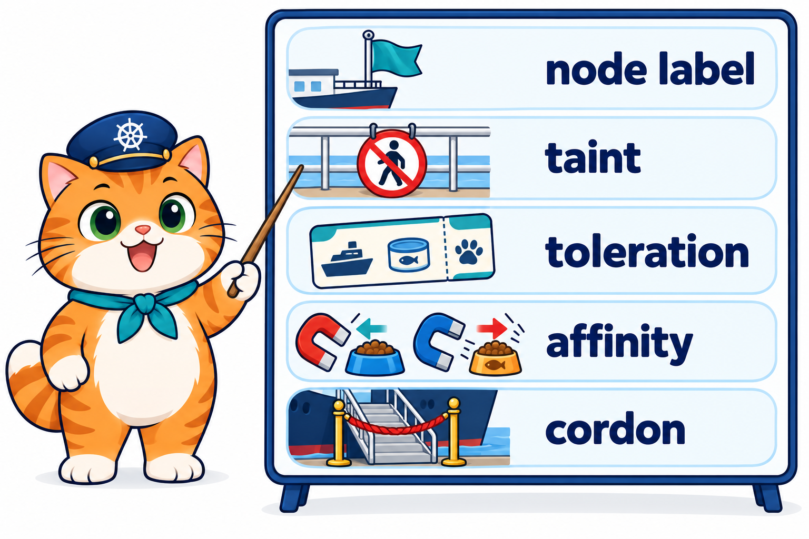<br>
  <em><b>รูปที่ 2</b> แผนผังอุปมาใหม่ของบทนี้: ธงบนเรือ = node label, ป้ายห้ามขึ้น = taint, บัตรผ่าน = toleration, แม่เหล็ก = affinity/anti-affinity, เชือกกั้น = cordon</em>
</p>

**ตารางที่ 1** อุปมาท่าเรือที่ใช้ในบทนี้ (ต่อจากบทที่ 1–2)

| Kubernetes | อุปมาท่าเรือ | ใหม่ในบทนี้ |
|---|---|:---:|
| container | ตู้สินค้า | |
| Pod | กล่องห้องโดยสารห่อตู้ มีป้าย IP 1 ป้าย | |
| Node | เรือสินค้า (`lab-worker`, `lab-worker2`) | |
| Control Plane | หอบังคับการบนท่า (`lab-control-plane`) | |
| kube-scheduler | เจ้าหน้าที่จัดตู้ขึ้นเรือ (ถือ clipboard ตรวจเรือ) | |
| kubelet | ต้นเรือ (first mate) ประจำเรือแต่ละลำ | |
| container runtime (containerd) | ห้องเครื่อง/เครนบนเรือที่ยกตู้จริง | ✓ |
| kube-proxy | นายท่าจราจรบนเรือ (กล่าวถึงเท่านั้น) | ✓ |
| Node object / status | สมุดประจำเรือ (ทะเบียนเรือ) | ✓ |
| capacity / allocatable | ระวางเรือทั้งหมด / ระวางที่ขายให้ลูกค้าได้ | ✓ |
| node conditions | ไฟแสดงสถานะบนแผงเรือ | ✓ |
| node label | ธง/ป้ายบนเสากระโดงเรือ | ✓ |
| nodeSelector | ใบสั่ง "ต้องขึ้นเรือที่มีธงนี้" | ✓ |
| node affinity | แม่เหล็กดึงกล่องไปหาธงเรือ (required = ต้อง, preferred = อยากได้) | ✓ |
| pod affinity / anti-affinity | แม่เหล็กดึงดูด / ผลัก ระหว่างกล่อง | ✓ |
| topologyKey | เส้นแบ่งเขต "ถือว่าเป็นที่เดียวกัน" (เรือลำเดียวกัน / ท่าเดียวกัน) | ✓ |
| topologySpreadConstraints | ตาชั่งถ่วงน้ำหนักให้กองเรือสมดุล | ✓ |
| taint | ป้าย "ห้ามขึ้น" ที่ขอบเรือ | ✓ |
| toleration | บัตรผ่าน (มีบัตร = ขึ้นได้ ไม่ได้แปลว่าต้องขึ้น) | ✓ |
| NoExecute + tolerationSeconds | ป้ายไล่ลงเรือ + นาฬิกาทราย | ✓ |
| cordon | เชือกกั้นท่าเรือ (ห้ามขึ้นเพิ่ม คนเดิมอยู่ต่อ) | ✓ |
| drain | ย้ายของทั้งหมดลงจากเรือก่อนเข้าอู่ | ✓ |
| NotReady / unreachable | เรือขาดการติดต่อในหมอก วิทยุเงียบ | ✓ |
| Lease heartbeat | สัญญาณวิทยุ "ยังอยู่" ทุก 10 วินาที | ✓ |
| static Pod | ตู้ที่ต้นเรือดูแลเองจากแฟ้มบนเรือ (หอเห็นแค่ "เงา" = mirror pod) | ✓ |
| Downward API | ป้ายชื่อเรือที่ต้นเรือติดให้ตู้ตอนขึ้นเรือ | ✓ |
| PriorityClass / preemption | ป้ายสินค้าด่วน VIP แซงคิว | ✓ |

> **ขอบเขตของบทนี้:** ยังคงใช้ **Pod เดี่ยว ๆ** เหมือนบทที่ 2 เพื่อให้เห็นพฤติกรรมการจัดวางชัดที่สุด และจะได้เห็นด้วยตาว่า "Pod เดี่ยวที่หายไปไม่มีใครสร้างคืน" ทรัพยากรอย่าง Deployment และ Service จะกล่าวถึงเพื่อปูทางในหัวข้อ 19 เท่านั้น

---

## 2. ทบทวน Node: เรือหนึ่งลำมีอะไรบ้าง

### 2.1 องค์ประกอบบน worker node

<p align="center" id="fig-3">
  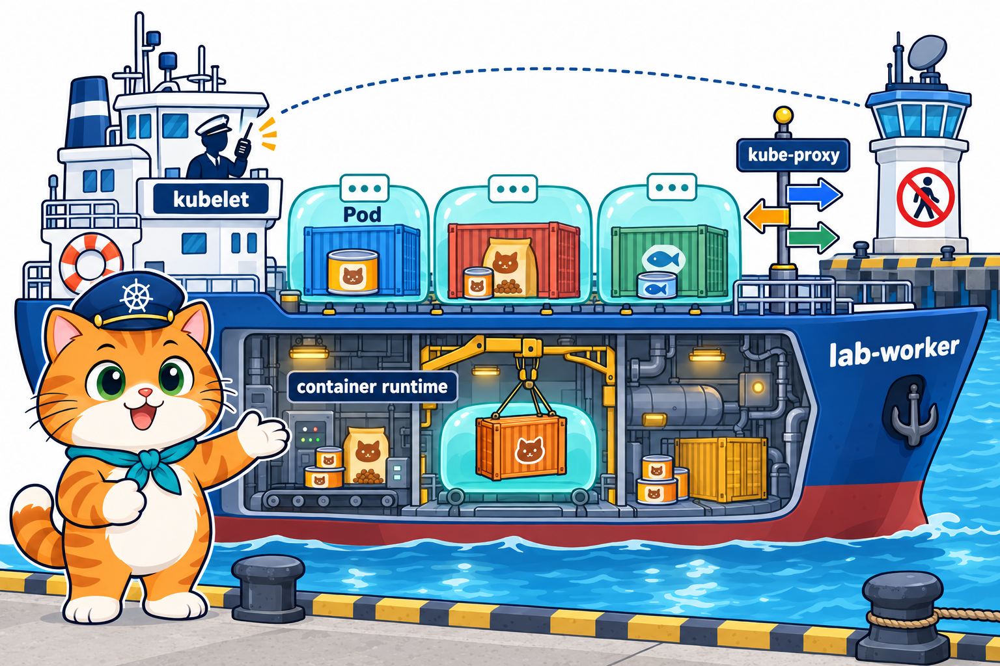<br>
  <em><b>รูปที่ 3</b> เรือ (Node) หนึ่งลำมี kubelet เป็นต้นเรือ, container runtime เป็นห้องเครื่องยกตู้ และ kube-proxy ดูแลเส้นทางจราจร</em>
</p>

**Node** คือเครื่อง (จริงหรือเสมือน) ที่รัน Pod บน worker node ทุกเครื่องมีองค์ประกอบหลักดังนี้

| องค์ประกอบ | อุปมา | หน้าที่ |
|---|---|---|
| **kubelet** | ต้นเรือ | ลงทะเบียน Node กับ API server, ส่ง heartbeat และรายงานสถานะ (conditions, capacity), เฝ้าดู Pod ที่ถูกผูกกับ Node ของตัวเองแล้วสั่ง runtime สร้าง/ลบ container, รัน probe, ไล่ Pod เมื่อทรัพยากรใกล้หมด, ดูแล static Pod |
| **container runtime** (containerd) | ห้องเครื่อง/เครน | ดึง image และรัน container จริง kubelet สั่งผ่านมาตรฐาน **CRI** (Container Runtime Interface) |
| **kube-proxy** | นายท่าจราจร | เขียนกฎเครือข่าย (iptables/nftables) ให้ทราฟฟิกไปถึง Pod ปลายทาง ใช้กับ Service ซึ่งเป็นเนื้อหาบทหน้า |
| **CNI plugin** (kind ใช้ `kindnet`) | ฝ่ายแจกป้ายที่อยู่ | ให้ IP แก่ Pod (ใน kind คือ `10.244.x.x`) และเชื่อมเครือข่ายระหว่าง Node |

สังเกตว่า **scheduler ไม่ได้อยู่บน worker** scheduler อยู่ที่หอบังคับการ (control plane) ทำหน้าที่ "ตัดสินใจ" อย่างเดียว ส่วนการ "ลงมือ" สร้าง container เป็นงานของ kubelet บนเรือแต่ละลำ

### 2.2 Node ใน kind คือ Docker container

<p align="center" id="fig-4">
  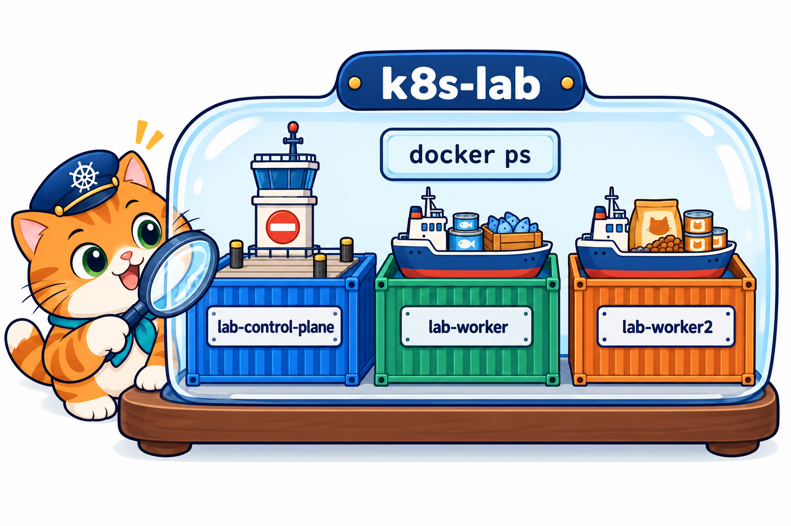<br>
  <em><b>รูปที่ 4</b> ใน kind แต่ละ Node คือ Docker container ที่รันอยู่ใน k8s-lab จึงจำลองเรือล่มได้ด้วย docker stop</em>
</p>

คลัสเตอร์ของเราสร้างด้วย **kind** (Kubernetes IN Docker) ภายใน container `k8s-lab` ซึ่งมี dockerd ของตัวเอง แต่ละ Node ของคลัสเตอร์จึงเป็น **Docker container หนึ่งตัวใน k8s-lab** (ไม่ใช่บนเครื่องนักศึกษาโดยตรง)

```text
เครื่องนักศึกษา (Docker Desktop)
└── container k8s-lab            ← ssh -p 2223 root@localhost
    └── dockerd ภายใน k8s-lab
        ├── container lab-control-plane   (Node: หอบังคับการ)
        ├── container lab-worker          (Node: เรือลำที่ 1)
        └── container lab-worker2         (Node: เรือลำที่ 2)
            └── containerd → container ของ Pod ที่ถูกวางบนเรือลำนี้
```

ผลจริงจาก LAB 0 (รันใน SSH session ของ k8s-lab)

```text
$ docker ps --format '{{.Names}}\t{{.Status}}'
lab-worker	Up 3 minutes
lab-worker2	Up 3 minutes
lab-control-plane	Up 3 minutes

$ docker exec lab-worker crictl ps
CONTAINER           IMAGE               CREATED             STATE               NAME                ATTEMPT             POD ID              POD                 NAMESPACE
3ca8b31c44e17       4626fe10df5b9       3 minutes ago       Running             kindnet-cni         0                   f674bc63f9edb       kindnet-dmj46       kube-system
b9af0b8b13988       d6a28daf3e6b0       3 minutes ago       Running             kube-proxy          0                   05719e65616d7       kube-proxy-7xjpl    kube-system
```

`crictl` คือเครื่องมือคุยกับ container runtime ผ่าน CRI โดยตรง (ไม่ผ่าน API server) เหมือนเดินเข้าห้องเครื่องไปดูเองว่ามีตู้อะไรถูกยกขึ้นเรือแล้วบ้าง

ผลที่ตามมาซึ่งเราจะใช้ใน LAB

- **จำลองเรือล่ม** ได้ด้วย `docker stop lab-worker2` และคืนเรือด้วย `docker start lab-worker2` (คำสั่ง docker เหล่านี้ต้องรัน **ใน k8s-lab** เพราะ container `lab-*` อยู่ใน dockerd ของ k8s-lab)
- **วางไฟล์บนเรือ** ได้ด้วย `docker cp ... lab-worker:/path` (ใช้ใน static Pod)
- ข้อควรระวัง: ทุก Node "มองเห็น" CPU/RAM ของเครื่องเดียวกัน (ดูหัวข้อ 3.3)

### 2.3 control-plane ก็เป็น Node

`lab-control-plane` ก็มี kubelet และลงทะเบียนเป็น Node เหมือนกัน เพราะองค์ประกอบของหอบังคับการ (etcd, kube-apiserver, kube-scheduler, kube-controller-manager) เองก็รันเป็น Pod บน Node นี้ (เป็น static Pod ดูหัวข้อ 14) แต่ kind ติด **taint** `node-role.kubernetes.io/control-plane:NoSchedule` ไว้ Pod ทั่วไปจึงไม่ถูกวางที่นี่ (ดูหัวข้อ 11.3)

---

## 3. Node object: สมุดประจำเรือ

ทุก Node มี object ชนิด `Node` ใน API server เหมือนสมุดประจำเรือที่หอบังคับการเก็บไว้ ส่วน `spec` บอกการตั้งค่า (เช่น taints, unschedulable, podCIDR) ส่วน `status` คือสิ่งที่ kubelet รายงาน (capacity, conditions, addresses, nodeInfo)

### 3.1 kubectl get nodes

```bash
kubectl get nodes -o wide
```

```text
NAME                STATUS   ROLES           AGE     VERSION   INTERNAL-IP   EXTERNAL-IP   OS-IMAGE                       KERNEL-VERSION                             CONTAINER-RUNTIME
lab-control-plane   Ready    control-plane   3m13s   v1.37.0   172.19.0.3    <none>        Debian GNU/Linux 13 (trixie)   6.6.87.2-microsoft-standard-WSL2 (amd64)   containerd://2.3.4
lab-worker          Ready    <none>          2m58s   v1.37.0   172.19.0.4    <none>        Debian GNU/Linux 13 (trixie)   6.6.87.2-microsoft-standard-WSL2 (amd64)   containerd://2.3.4
lab-worker2         Ready    <none>          2m58s   v1.37.0   172.19.0.2    <none>        Debian GNU/Linux 13 (trixie)   6.6.87.2-microsoft-standard-WSL2 (amd64)   containerd://2.3.4
```

| คอลัมน์ | ความหมาย |
|---|---|
| `STATUS` | สรุปจาก condition `Ready` (`Ready` / `NotReady`) และอาจต่อท้าย `,SchedulingDisabled` เมื่อถูก cordon |
| `ROLES` | อ่านจาก label `node-role.kubernetes.io/<role>` worker ใน kind ไม่มี label นี้จึงแสดง `<none>` |
| `VERSION` | เวอร์ชันของ kubelet บน Node |
| `INTERNAL-IP` | IP ของ Node (ใน kind คือ IP ของ container `lab-*` ในเครือข่าย Docker เช่น `172.19.0.x`) ต่างจาก Pod IP (`10.244.x.x`) |
| `OS-IMAGE`, `KERNEL-VERSION`, `CONTAINER-RUNTIME` | ระบบปฏิบัติการใน Node, kernel ของเครื่องจริง (kind ใช้ kernel ร่วมกับเครื่อง) และ runtime |

### 3.2 Labels มาตรฐานของ Node

<p align="center" id="fig-5">
  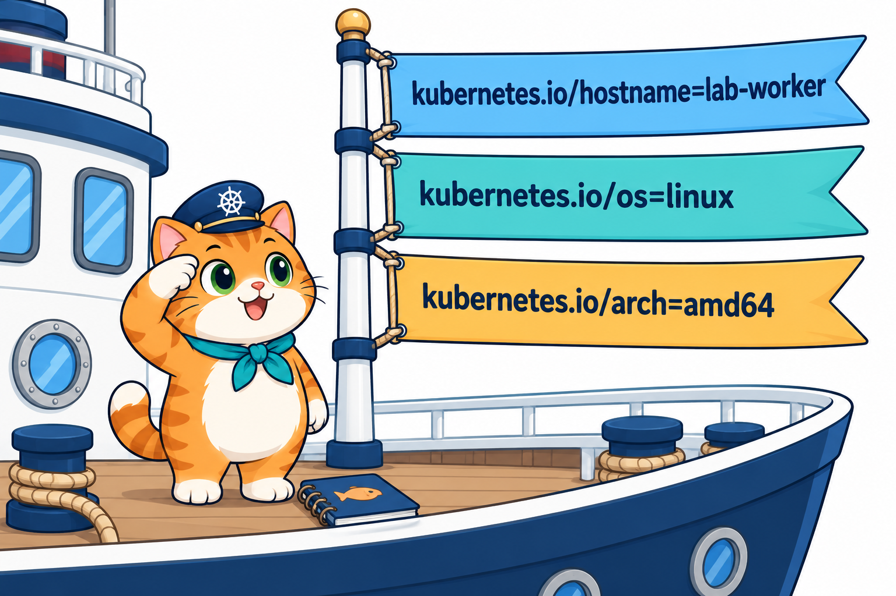<br>
  <em><b>รูปที่ 5</b> label มาตรฐานของ Node เปรียบเป็นธงบนเสากระโดง เช่น kubernetes.io/hostname, kubernetes.io/os, kubernetes.io/arch</em>
</p>

kubelet ติด label ให้ Node อัตโนมัติชุดหนึ่ง ผลจริงจาก `kubectl get nodes --show-labels`

```text
NAME                STATUS   ROLES           AGE     VERSION   LABELS
lab-control-plane   Ready    control-plane   3m13s   v1.37.0   beta.kubernetes.io/arch=amd64,beta.kubernetes.io/os=linux,kubernetes.io/arch=amd64,kubernetes.io/hostname=lab-control-plane,kubernetes.io/os=linux,node-role.kubernetes.io/control-plane=,node.kubernetes.io/exclude-from-external-load-balancers=
lab-worker          Ready    <none>          2m58s   v1.37.0   beta.kubernetes.io/arch=amd64,beta.kubernetes.io/os=linux,kubernetes.io/arch=amd64,kubernetes.io/hostname=lab-worker,kubernetes.io/os=linux
lab-worker2         Ready    <none>          2m58s   v1.37.0   beta.kubernetes.io/arch=amd64,beta.kubernetes.io/os=linux,kubernetes.io/arch=amd64,kubernetes.io/hostname=lab-worker2,kubernetes.io/os=linux
```

**ตารางที่ 2** label ที่พบบ่อยบน Node

| label | ตัวอย่างค่า | ความหมาย |
|---|---|---|
| `kubernetes.io/hostname` | `lab-worker` | ชื่อ Node (ไม่ซ้ำกัน) ใช้เป็น `topologyKey` แทน "เรือลำเดียวกัน" บ่อยที่สุด |
| `kubernetes.io/os` | `linux` | ระบบปฏิบัติการ (`linux`/`windows`) |
| `kubernetes.io/arch` | `amd64` | สถาปัตยกรรม CPU (`amd64`/`arm64`) |
| `node-role.kubernetes.io/control-plane` | `""` (ค่าว่าง) | บอกว่าเป็น control-plane และเป็นที่มาของคอลัมน์ `ROLES` |
| `beta.kubernetes.io/arch`, `beta.kubernetes.io/os` | `amd64`, `linux` | label รุ่นเก่า (deprecated) ยังติดไว้เพื่อความเข้ากันได้ ควรใช้ตัวที่ไม่มี `beta.` |
| `topology.kubernetes.io/zone`, `topology.kubernetes.io/region` | `asia-southeast1-a` | zone/region ของเครื่องบนคลาวด์ (cloud provider ติดให้) **kind ไม่มี** |
| `node.kubernetes.io/exclude-from-external-load-balancers` | `""` | ไม่ให้ load balancer ภายนอกส่งทราฟฟิกมาที่ Node นี้ (kind ติดให้ control-plane) |

นอกจากนี้เราติด label เองได้ เช่น `kubectl label node lab-worker disk=ssd` (ใช้ใน nodeSelector/affinity) ส่วน key ที่ขึ้นต้นด้วย `kubernetes.io/` และ `k8s.io/` **สงวนไว้ให้ Kubernetes** ไม่ควรตั้งเอง

> **รู้ไว้:** ดู label เป็นคอลัมน์ได้ด้วย `-L` เช่น `kubectl get nodes -L kubernetes.io/arch,kubernetes.io/os` จะได้คอลัมน์ `ARCH` และ `OS` อ่านง่ายกว่า `--show-labels`

### 3.3 capacity กับ allocatable

<p align="center" id="fig-6">
  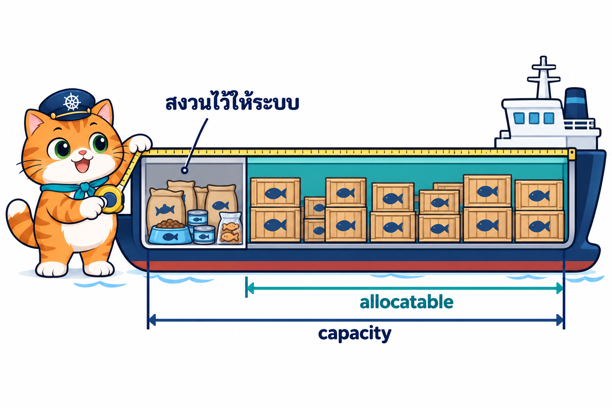<br>
  <em><b>รูปที่ 6</b> capacity คือระวางเรือทั้งหมด allocatable คือส่วนที่เหลือให้ Pod หลังหักส่วนที่สงวนไว้ให้ระบบ</em>
</p>

- **capacity** = ทรัพยากรทั้งหมดที่ kubelet ตรวจพบบนเครื่อง (CPU, memory, ephemeral-storage, จำนวน Pod สูงสุด)
- **allocatable** = ส่วนที่ "ขายให้ Pod ได้" คำนวณจาก

```text
allocatable = capacity − kube-reserved − system-reserved − eviction-threshold
```

`kube-reserved` สงวนให้องค์ประกอบของ Kubernetes (kubelet, runtime) `system-reserved` สงวนให้ระบบปฏิบัติการ และ `eviction-threshold` คือเส้นที่ kubelet จะเริ่มไล่ Pod (หัวข้อ 16) **scheduler ใช้ allocatable** (ไม่ใช่ capacity) ในการตัดสินใจ

ผลจริงจาก LAB 0

```text
$ kubectl get node lab-worker -o jsonpath='{.status.capacity}{"\n"}{.status.allocatable}{"\n"}'
{"cpu":"32","ephemeral-storage":"1081101176832","hugepages-1Gi":"0","hugepages-2Mi":"0","memory":"64489564Ki","pods":"110"}
{"cpu":"32","ephemeral-storage":"1081101176832","hugepages-1Gi":"0","hugepages-2Mi":"0","memory":"64489564Ki","pods":"110"}
```

สิ่งที่เห็น

1. ใน kind **allocatable เท่ากับ capacity ทุกค่า** เพราะ kind ไม่ได้ตั้ง reserved ไว้ (บนคลัสเตอร์จริงหรือคลาวด์ allocatable มักน้อยกว่า capacity ชัดเจน)
2. `pods: 110` คือจำนวน Pod สูงสุดต่อ Node ค่าเริ่มต้นของ kubelet
3. **ข้อควรระวังใน kind:** ทุก Node เห็น `cpu: 32` และ memory ~61.5 GiB เท่ากัน เพราะทั้งสามเป็น container บน **เครื่องเดียวกัน** คลัสเตอร์ 3 Node จึง **ไม่ได้มีทรัพยากรจริง 3 เท่า** ตัวเลขในเครื่องนักศึกษาจะเท่ากับ CPU/RAM ของเครื่องตัวเอง (หรือของ VM ของ Docker Desktop)

### 3.4 Conditions: ไฟสถานะบนแผงเรือ

<p align="center" id="fig-7">
  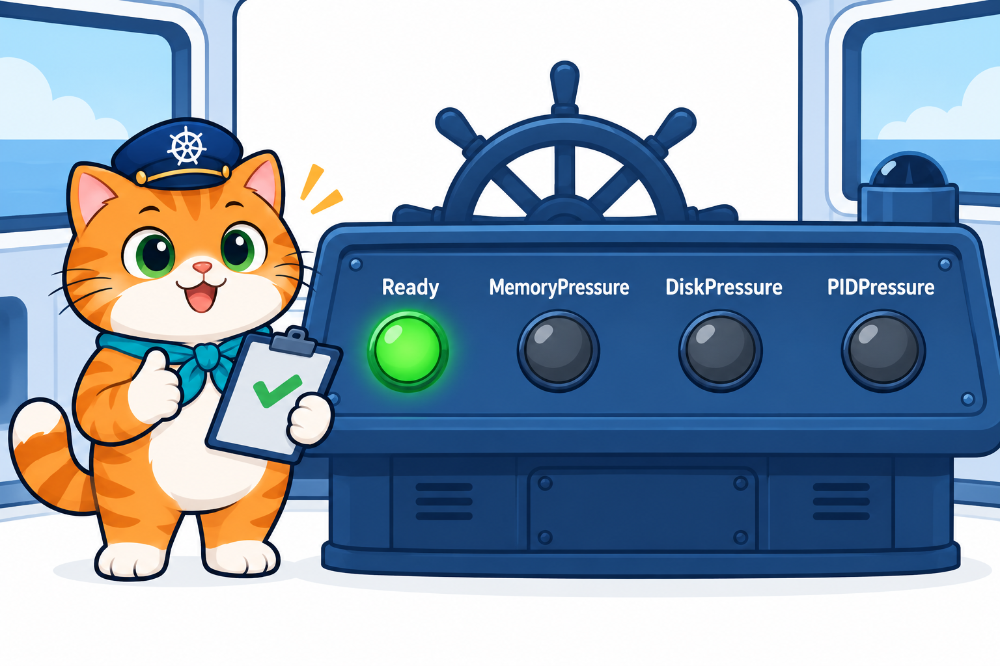<br>
  <em><b>รูปที่ 7</b> สถานะ (conditions) ของ Node เหมือนไฟบนแผงเรือ: Ready ต้องเป็น True ส่วน MemoryPressure, DiskPressure, PIDPressure ควรเป็น False</em>
</p>

**ตารางที่ 3** conditions ของ Node

| condition | ค่าปกติ | ความหมายเมื่อผิดปกติ |
|---|:---:|---|
| `Ready` | `True` | `False` = kubelet รายงานว่าไม่พร้อม (เช่น runtime หรือเครือข่ายมีปัญหา), **`Unknown` = หอบังคับการไม่ได้ยินข่าวจากต้นเรือเกินเวลาที่กำหนด** (หัวข้อ 13) |
| `MemoryPressure` | `False` | หน่วยความจำบน Node เหลือน้อยกว่าเกณฑ์ eviction |
| `DiskPressure` | `False` | พื้นที่ดิสก์ (หรือ inode) เหลือน้อย |
| `PIDPressure` | `False` | จำนวนโปรเซสใกล้เต็ม |
| `NetworkUnavailable` | `False` | เครือข่ายของ Node ยังตั้งค่าไม่เสร็จ (บาง CNI/คลาวด์เท่านั้นที่ตั้งค่านี้) |

แต่ละ condition มี `LastHeartbeatTime` (ครั้งล่าสุดที่ kubelet รายงาน) และ `LastTransitionTime` (ครั้งล่าสุดที่ค่าเปลี่ยน) พร้อม `Reason` และ `Message` เช่นผลจริงของ Node ปกติ

```text
Conditions:
  Type             Status  LastHeartbeatTime                 LastTransitionTime                Reason                       Message
  ----             ------  -----------------                 ------------------                ------                       -------
  MemoryPressure   False   Sun, 04 Oct 2026 18:53:25 +0700   Sun, 04 Oct 2026 18:53:14 +0700   KubeletHasSufficientMemory   kubelet has sufficient memory available
  DiskPressure     False   Sun, 04 Oct 2026 18:53:25 +0700   Sun, 04 Oct 2026 18:53:14 +0700   KubeletHasNoDiskPressure     kubelet has no disk pressure
  PIDPressure      False   Sun, 04 Oct 2026 18:53:25 +0700   Sun, 04 Oct 2026 18:53:14 +0700   KubeletHasSufficientPID      kubelet has sufficient PID available
  Ready            True    Sun, 04 Oct 2026 18:53:25 +0700   Sun, 04 Oct 2026 18:53:25 +0700   KubeletReady                 kubelet is posting ready status
```

### 3.5 ส่วนอื่นของ Node object

| ฟิลด์ | ตัวอย่างจาก `lab-worker` | ความหมาย |
|---|---|---|
| `status.addresses` | `InternalIP: 172.19.0.4`, `Hostname: lab-worker` | ที่อยู่ของ Node (คลาวด์อาจมี `ExternalIP`) |
| `status.nodeInfo` | `kubeletVersion: v1.37.0`, `containerRuntimeVersion: containerd://2.3.4`, `osImage: Debian GNU/Linux 13 (trixie)` | ข้อมูลระบบ (แสดงใน `System Info` ของ describe) |
| `spec.podCIDR` | `10.244.1.0/24` | ช่วง IP ที่ Pod บน Node นี้จะได้ (lab-worker ได้ `10.244.1.x`) |
| `spec.taints` | ไม่มี (control-plane มี 1 รายการ) | ป้ายห้ามขึ้น (หัวข้อ 11) |
| `spec.unschedulable` | `false` | `true` เมื่อถูก cordon (หัวข้อ 12) |

### 3.6 kubectl describe node: เปิดสมุดประจำเรือ

<p align="center" id="fig-8">
  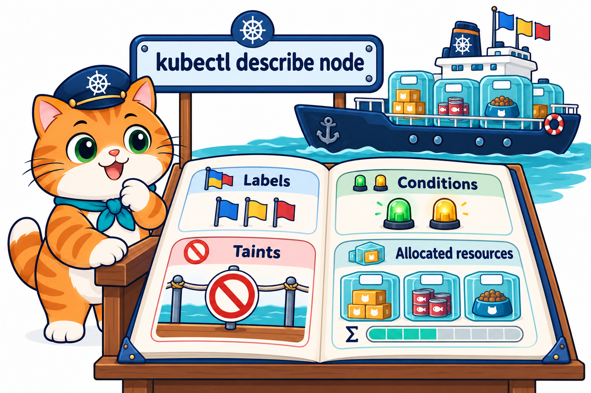<br>
  <em><b>รูปที่ 8</b> kubectl describe node เหมือนเปิดสมุดประจำเรือ เห็น Labels, Taints, Conditions, Allocatable และผลรวม requests ของ Pod บนเรือ</em>
</p>

`kubectl describe node lab-worker` รวมทุกอย่างไว้ในหน้าเดียว ส่วนที่ควรอ่านเป็นประจำ (ผลจริง ตัดบางส่วน)

```text
Name:               lab-worker
Roles:              <none>
Labels:             beta.kubernetes.io/arch=amd64
                    ...
                    kubernetes.io/hostname=lab-worker
                    kubernetes.io/os=linux
Taints:             <none>
Unschedulable:      false
Lease:
  HolderIdentity:  lab-worker
  AcquireTime:     <unset>
  RenewTime:       Sun, 04 Oct 2026 18:56:27 +0700
Conditions:
  ...
Addresses:
  InternalIP:  172.19.0.4
  Hostname:    lab-worker
Capacity:
  cpu:                32
  ...
Allocatable:
  cpu:                32
  ...
PodCIDR:                      10.244.1.0/24
Non-terminated Pods:          (2 in total)
  Namespace                   Name                CPU Requests  CPU Limits  Memory Requests  Memory Limits  Age
  ---------                   ----                ------------  ----------  ---------------  -------------  ---
  kube-system                 kindnet-dmj46       100m (0%)     0 (0%)      50Mi (0%)        0 (0%)         3m15s
  kube-system                 kube-proxy-7xjpl    0 (0%)        0 (0%)      0 (0%)           0 (0%)         3m15s
Allocated resources:
  (Total limits may be over 100 percent, i.e., overcommitted.)
  Resource           Requests   Limits
  --------           --------   ------
  cpu                100m (0%)  0 (0%)
  memory             50Mi (0%)  0 (0%)
  ...
Events:
  Type    Reason          Age    From             Message
  ----    ------          ----   ----             -------
  Normal  RegisteredNode  3m11s  node-controller  Node lab-worker event: Registered Node lab-worker in Controller
  Normal  NodeReady       3m4s   kubelet          Node lab-worker status is now: NodeReady
```

**ตารางที่ 4** ส่วนสำคัญของ `describe node` และใช้ตอบคำถามอะไร

| ส่วน | ใช้ตอบคำถาม |
|---|---|
| `Labels` | เรือลำนี้มีธงอะไร nodeSelector/affinity จะเลือกได้ไหม |
| `Taints`, `Unschedulable` | มีป้ายห้ามขึ้นหรือถูก cordon อยู่หรือเปล่า |
| `Lease` (`RenewTime`) | ต้นเรือส่งสัญญาณล่าสุดเมื่อไร |
| `Conditions` | เรือพร้อมไหม มีแรงกดดันทรัพยากรไหม |
| `Capacity` / `Allocatable` | ระวางทั้งหมด / ระวางที่ขายได้ |
| `Non-terminated Pods` | มี Pod อะไรอยู่บนเรือ พร้อม requests/limits ของแต่ละตัว |
| **`Allocated resources`** | **ผลรวม requests/limits ของทุก Pod บนเรือ เทียบเป็น % ของ allocatable** ตัวเลขนี้คือสิ่งที่ scheduler ใช้ตัดสินว่า "ระวางเหลือพอไหม" |
| `Events` | ประวัติของเรือ เช่น `NodeReady`, `NodeNotReady`, `NodeNotSchedulable` |

### 3.7 Heartbeat: สัญญาณวิทยุ "ยังอยู่"

หอบังคับการรู้ได้อย่างไรว่าเรือยังอยู่ kubelet ส่ง heartbeat สองแบบ

1. **Lease** ใน namespace `kube-node-lease` (Node ละ 1 ตัว ชื่อเดียวกับ Node) kubelet ต่ออายุ (`renewTime`) ประมาณทุก **10 วินาที** เป็น object เล็กมาก จึงประหยัดภาระของ API server
2. **NodeStatus** kubelet อัปเดต `status` ของ Node เมื่อมีการเปลี่ยนแปลง หรือเป็นระยะแม้ไม่มีอะไรเปลี่ยน

ผลจริงจาก LAB 0: วัด `renewTime` ห่างกัน 11 วินาที เห็นว่าต่ออายุไป 1 ครั้งห่างจากครั้งก่อน ~10.17 วินาที และ `leaseDurationSeconds` คือ 40

```text
$ kubectl get lease -n kube-node-lease
NAME                HOLDER              AGE
lab-control-plane   lab-control-plane   3m29s
lab-worker          lab-worker          3m6s
lab-worker2         lab-worker2         3m7s

$ kubectl get lease lab-worker -n kube-node-lease -o jsonpath='{.spec.renewTime}{"  "}{.spec.leaseDurationSeconds}{"\n"}'; sleep 11; kubectl get lease lab-worker -n kube-node-lease -o jsonpath='{.spec.renewTime}{"\n"}'
2026-10-04T11:56:27.119121Z  40
2026-10-04T11:56:37.288385Z
```

ถ้าวิทยุเงียบไปนาน **node lifecycle controller** (อยู่ใน kube-controller-manager) จะตัดสินว่าเรือขาดการติดต่อ รายละเอียดอยู่ในหัวข้อ 13

---

## 4. kube-scheduler: เจ้าหน้าที่จัดตู้ขึ้นเรือ

### 4.1 scheduler ทำงานอย่างไร

<p align="center" id="fig-9">
  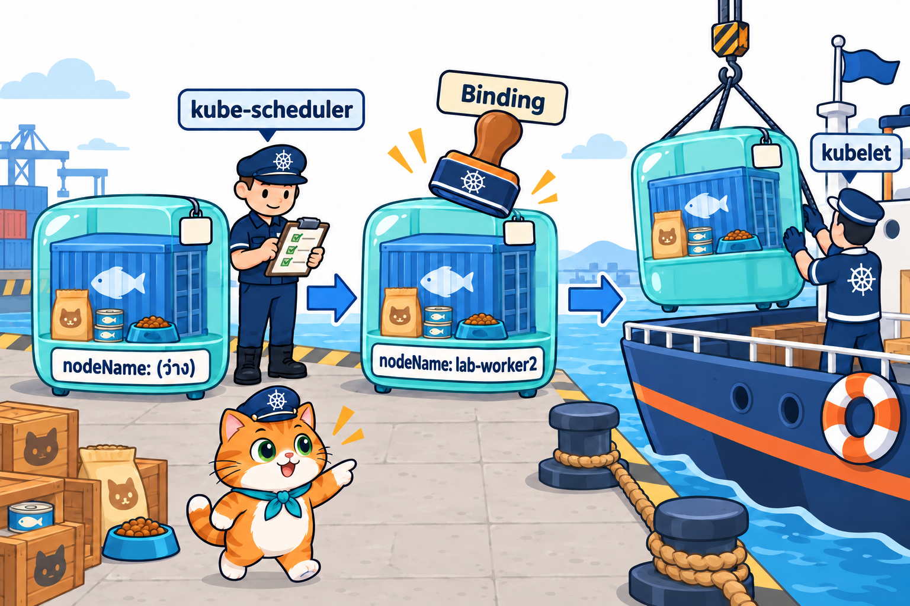<br>
  <em><b>รูปที่ 9</b> Pod ใหม่ที่ยังไม่มี nodeName รอที่ท่า kube-scheduler หยิบมาเลือกเรือ แล้ว kubelet บนเรือนั้นเป็นคนสร้าง container</em>
</p>

ทบทวนเส้นทางการเกิดของ Pod จากบทที่ 2 โดยเน้นบทบาทของ scheduler

1. `kubectl apply` ส่ง Pod ไปที่ kube-apiserver ซึ่งบันทึกลง etcd ตอนนี้ Pod ยัง **ไม่มี `spec.nodeName`** (STATUS `Pending`)
2. **kube-scheduler เฝ้าดู (watch) Pod ที่ `spec.nodeName` ว่าง** หยิบเข้าคิว แล้วเลือก Node ที่เหมาะสม
3. scheduler เขียน **binding** กลับไปที่ API server ผลคือ `spec.nodeName` ของ Pod ถูกเติม และเกิด Event `Scheduled` เช่น `Successfully assigned default/huge-pod to lab-worker`
4. **kubelet บน Node นั้น** เห็นว่ามี Pod ใหม่ถูกผูกกับตัวเอง จึงสั่ง runtime สร้าง sandbox, ดึง image, สร้างและเริ่ม container (Event `Pulled`, `Created`, `Started` มาจาก `kubelet`)

> scheduler ไม่ได้สร้าง container และไม่ได้ส่งคำสั่งไปที่เรือโดยตรง มันแค่ "เขียนชื่อเรือลงบนใบงาน" ส่วนต้นเรือแต่ละลำคอยดูใบงานที่มีชื่อเรือตัวเอง

### 4.2 Filtering → Scoring → Binding

<p align="center" id="fig-10">
  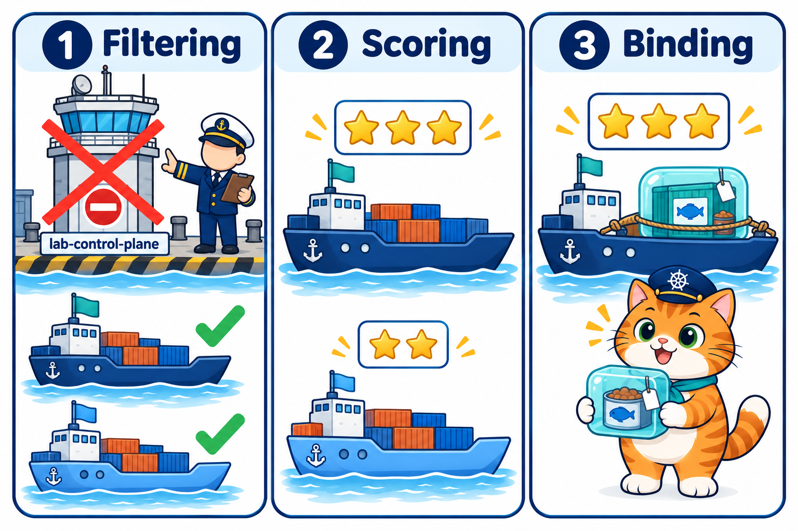<br>
  <em><b>รูปที่ 10</b> scheduler ทำ 3 ขั้น: Filtering ตัดเรือที่รับไม่ได้ → Scoring ให้คะแนนเรือที่เหลือ → Binding ผูก Pod กับเรือคะแนนสูงสุด</em>
</p>

การตัดสินใจของ scheduler สำหรับ Pod หนึ่งตัวแบ่งเป็นขั้น แต่ละขั้นประกอบด้วย **plugin** หลายตัว

**ขั้นที่ 1 Filtering (คัดทิ้ง)** ตรวจทุก Node ว่า "รับ Pod นี้ได้ไหม" ถ้า plugin ใดตอบว่าไม่ได้ Node นั้นถูกตัดทิ้ง

| plugin (ตัวอย่าง) | ตรวจอะไร | หัวข้อ |
|---|---|:---:|
| `NodeUnschedulable` | Node ถูก cordon (`spec.unschedulable: true`) หรือไม่ | 12 |
| `NodeName` | ถ้า Pod ระบุ `nodeName` ต้องตรงกับชื่อ Node | 6 |
| `NodeResourcesFit` | requests ของ Pod + ผลรวม requests เดิม ≤ allocatable หรือไม่ | 5 |
| `NodeAffinity` | ตรง `nodeSelector` และ required node affinity หรือไม่ | 7–8 |
| `TaintToleration` | Pod ทนทุก taint แบบ `NoSchedule`/`NoExecute` ของ Node ได้หรือไม่ | 11 |
| `InterPodAffinity` | ผ่านกฎ required pod affinity/anti-affinity หรือไม่ | 9 |
| `PodTopologySpread` | วางแล้วยังไม่เอียงเกิน `maxSkew` (แบบ `DoNotSchedule`) หรือไม่ | 10 |
| `NodePorts` | port ที่ Pod ขอผูกกับ Node (`hostPort`) ว่างหรือไม่ | – |

**ขั้นที่ 2 Scoring (ให้คะแนน)** Node ที่ผ่านทุก filter ถูกให้คะแนน 0–100 จากหลาย plugin แล้วรวมแบบถ่วงน้ำหนัก เช่น

- `NodeResourcesFit` (กลยุทธ์ค่าเริ่มต้น `LeastAllocated`) ชอบ Node ที่ยังว่างมาก และ `NodeResourcesBalancedAllocation` ชอบ Node ที่ใช้ CPU กับ memory สมดุลกัน
- `ImageLocality` ชอบ Node ที่มี image อยู่แล้ว (เริ่มเร็วกว่า)
- `NodeAffinity` ให้คะแนนตาม **preferred** node affinity (`weight`)
- `InterPodAffinity` ให้คะแนนตาม **preferred** pod affinity/anti-affinity
- `TaintToleration` หักคะแนน Node ที่มี taint แบบ `PreferNoSchedule`
- `PodTopologySpread` ให้คะแนนตามความสมดุลเมื่อใช้ `ScheduleAnyway`

**ขั้นที่ 3 Binding** เลือก Node คะแนนสูงสุด (ถ้าเสมอกันเลือกแบบสุ่ม) แล้วเขียน binding

> **ข้อควรจำ:** กฎแบบ "ต้อง" (required, `nodeSelector`, taint `NoSchedule`, `DoNotSchedule`) ทำงานในขั้น **Filtering** ส่วนกฎแบบ "อยากได้" (preferred, `PreferNoSchedule`, `ScheduleAnyway`) ทำงานในขั้น **Scoring** จึง **ไม่มีวันทำให้ Pod ค้าง Pending**

### 4.3 เมื่อไม่มีเรือลำไหนผ่าน: Pending และ FailedScheduling

<p align="center" id="fig-11">
  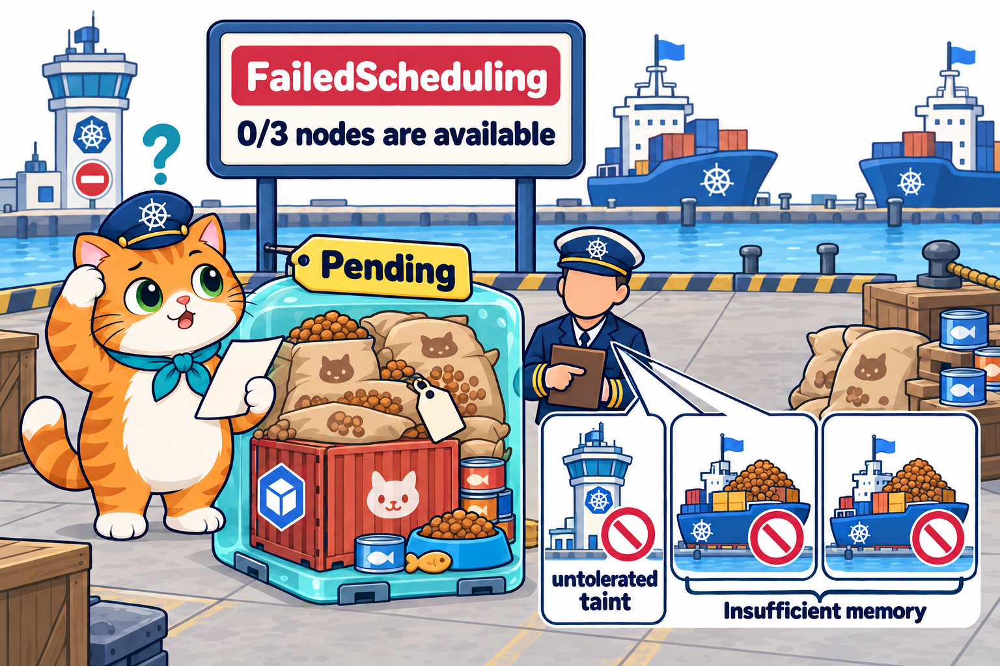<br>
  <em><b>รูปที่ 11</b> ถ้าไม่มีเรือลำไหนผ่าน filter Pod จะ Pending และมี Event FailedScheduling บอกเหตุผลของทุก node</em>
</p>

ถ้าไม่มี Node ใดผ่าน Filtering Pod จะค้าง `Pending` (คอลัมน์ `NODE` เป็น `<none>`) และ scheduler เขียน Event `FailedScheduling` ผลจริงจาก LAB 1 (Pod ขอ memory 4000Gi)

```text
Events:
  Type     Reason            Age   From               Message
  ----     ------            ----  ----               -------
  Warning  FailedScheduling  10s   default-scheduler  0/3 nodes are available: 1 node(s) had untolerated taint(s), 2 Insufficient memory. preemption: 0/3 nodes are available: 3 Preemption is not helpful for scheduling.
```

วิธีอ่านข้อความนี้

| ส่วนของข้อความ | ความหมาย |
|---|---|
| `0/3 nodes are available` | จาก 3 Node ไม่มีสักลำที่ผ่าน |
| `1 node(s) had untolerated taint(s)` | 1 ลำ (control-plane) มี taint ที่ Pod ไม่มีบัตรผ่าน |
| `2 Insufficient memory` | 2 ลำ (worker) memory ที่เหลือไม่พอ requests |
| `preemption: ... Preemption is not helpful for scheduling` | scheduler ลองคิดแล้วว่า **ไล่ Pod อื่นออกก็ไม่ช่วย** (หัวข้อ 17) |

ข้อสังเกตสำคัญ

1. **ตัวเลขรวมกันต้องเท่ากับจำนวน Node ทั้งหมด** (1 + 2 = 3) แต่ละ Node ถูกนับใน **เหตุผลแรกที่ตกเท่านั้น** เช่น control-plane ถูกนับเป็น "untolerated taint" เสมอ ไม่ว่า Pod จะมีปัญหาอื่นกับ control-plane อีกหรือไม่
2. ข้อความเปลี่ยนตาม plugin ที่ทำให้ตก ตัวอย่างจริงจาก LAB ของบทนี้

| สถานการณ์ | ข้อความจริง (ส่วนที่เกี่ยวกับ worker) |
|---|---|
| ขอ memory เกิน | `2 Insufficient memory` |
| ไม่มี Node ตรง nodeSelector/required affinity | `2 node(s) didn't match Pod's node affinity/selector` |
| required pod affinity หา Pod เป้าหมายไม่เจอ | `2 node(s) didn't match pod affinity rules` |
| required anti-affinity ชน | `2 node(s) didn't match pod anti-affinity rules` |
| topology spread เอียงเกิน | `2 node(s) didn't match pod topology spread constraints` |
| Node ถูก cordon | `1 node(s) were unschedulable` |

3. **scheduler ลองใหม่เองเมื่อคลัสเตอร์เปลี่ยน** เช่น เราติด label ให้ Node, ลบ taint, uncordon หรือลบ Pod ที่กีดขวาง Pod ที่ Pending จะถูกนำกลับมาพิจารณาและถูกวางทันทีโดย **ไม่ต้องลบแล้วสร้างใหม่** (ใน LAB 3 Pod ถูกวางภายใน ~1 วินาทีหลังติด label)

คำสั่งที่ใช้ดูเหตุผลบ่อย

```bash
kubectl describe pod <ชื่อ> | sed -n '/^Events/,$p'
kubectl get events --field-selector reason=FailedScheduling
```

### 4.4 ตัดสินใจครั้งเดียว ไม่ย้ายภายหลัง

เมื่อ Pod ถูก bind แล้ว scheduler **ไม่กลับมาพิจารณาใหม่** แม้ภายหลังคลัสเตอร์จะเปลี่ยนจนกฎแบบ preferred ไม่ตรงแล้ว หรือมี Node ใหม่ที่ว่างกว่า Pod ก็อยู่ที่เดิม (Kubernetes มีโปรเจกต์เสริมชื่อ **descheduler** สำหรับไล่ Pod ออกเพื่อให้ถูกจัดวางใหม่ แต่ไม่ได้ติดตั้งมาด้วย) วิธีเดียวที่ Pod จะ "ย้ายเรือ" คือถูกลบแล้วมี Pod ใหม่เกิดขึ้นแทน

---

## 5. requests เทียบ allocatable

<p align="center" id="fig-12">
  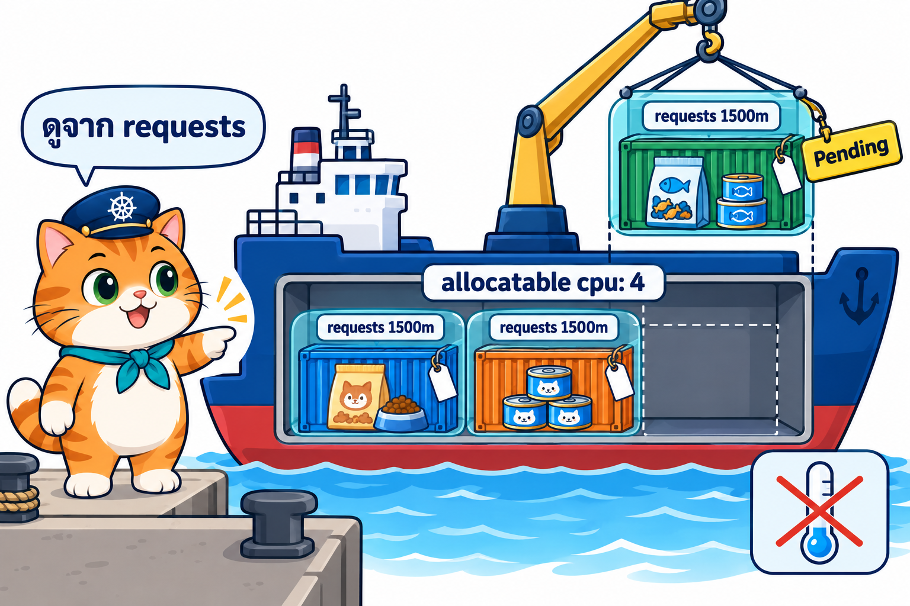<br>
  <em><b>รูปที่ 12</b> scheduler ดูผลรวม requests ของ Pod บนเรือเทียบ allocatable ไม่ได้ดูการใช้งานจริง เมื่อเต็มแล้ว Pod ตัวถัดไปต้อง Pending</em>
</p>

plugin `NodeResourcesFit` ตัดสินจาก **ตัวเลขที่ "จอง" ไว้ (requests)** ไม่ใช่การใช้งานจริง

```text
Node รับ Pod ใหม่ได้ ก็ต่อเมื่อ
  requests ของ Pod ใหม่ + ผลรวม requests ของ Pod ที่อยู่บน Node แล้ว  ≤  allocatable
(ตรวจแยกทีละทรัพยากร: cpu, memory, ephemeral-storage, จำนวน Pod)
```

กติกาที่ต้องรู้

1. **Pod ไม่ระบุ requests = นับเป็น 0** จึงวางได้เสมอ (ไม่เคย Insufficient) แต่เป็น QoS `BestEffort` ที่เสี่ยงถูกไล่เป็นลำดับแรกเมื่อเรือใกล้เต็ม (หัวข้อ 16)
2. **limits ไม่ถูกใช้ในการจัดวาง** limits เป็นเพดานตอนรัน ผลรวม limits บน Node จึงเกิน 100% ได้ (`describe node` เขียนไว้ว่า `Total limits may be over 100 percent, i.e., overcommitted.`)
3. **init container** นับแบบ "ค่าสูงสุด" requests ที่ใช้คำนวณของ Pod = ค่ามากกว่าระหว่าง (ผลรวมของ container หลัก + sidecar) กับ (init container ตัวที่ขอมากที่สุด + sidecar ที่เริ่มก่อนหน้า) เพราะ init container รันทีละตัวแล้วจบ ในร้านน้องส้ม (บทที่ 2) ค่าที่ใช้คือ `db` 100m/256Mi + `web` 100m/192Mi = **200m / 448Mi**
4. **ใช้งานจริงน้อยไม่ได้แปลว่าวางได้** Node ที่ CPU ว่าง 90% แต่ถูกจองครบแล้วก็รับ Pod ใหม่ไม่ได้

**ตัวอย่างคำนวณ** Node มี allocatable cpu `4` (4000m) ไม่มี Pod อื่น Pod แต่ละตัวขอ `cpu: 1500m`

| Pod ที่ | ผลรวม requests หลังวาง | ผล |
|:---:|---|---|
| 1 | 1500m ≤ 4000m | วางได้ |
| 2 | 3000m ≤ 4000m | วางได้ |
| 3 | 4500m > 4000m | **Pending** `Insufficient cpu` |

ผลจริงจาก LAB 1: `fit-pod` ขอ `cpu: 100m, memory: 64Mi` ถูกวางบน `lab-worker2` แล้ว `Allocated resources` ของ `lab-worker2` เพิ่มจาก 100m/50Mi (ของ `kindnet`) เป็น

```text
Allocated resources:
  (Total limits may be over 100 percent, i.e., overcommitted.)
  Resource           Requests    Limits
  --------           --------    ------
  cpu                200m (0%)   0 (0%)
  memory             114Mi (0%)  0 (0%)
```

> **requests แก้ไม่ได้เมื่อ Pod เกิดแล้ว (ด้วย apply ปกติ):** ใน LAB 1 การ apply ไฟล์ที่ลด memory จาก `4000Gi` เป็น `256Mi` ได้ `Forbidden: pod updates may not change fields other than ...` วิธีปกติคือลบแล้วสร้างใหม่ (Kubernetes 1.37 มี subresource `resize` สำหรับปรับ resources ของ Pod ที่มีอยู่ ซึ่งในการทดลองใช้กับ Pod ที่ Pending ได้ด้วย แต่ไม่ใช่เนื้อหาหลักของบทนี้)

---

## 6. nodeName: ข้ามเจ้าหน้าที่จัดตู้

<p align="center" id="fig-13">
  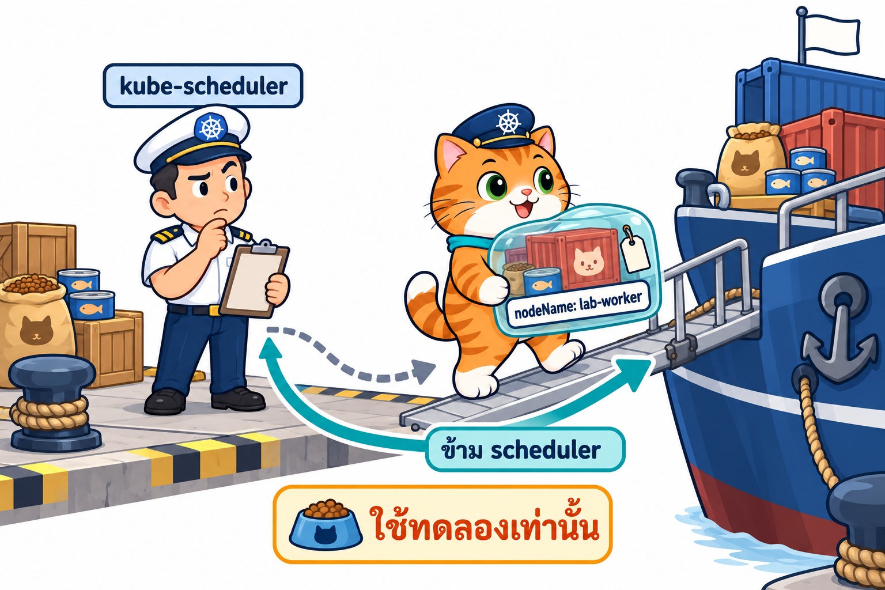<br>
  <em><b>รูปที่ 13</b> การใส่ nodeName คือเดินผ่านเจ้าหน้าที่จัดตู้ตรงไปหาต้นเรือเลย จึงไม่ผ่าน filter ของ scheduler ใช้เพื่อทดลองเท่านั้น</em>
</p>

ถ้าเราใส่ `spec.nodeName` เอง Pod จะมี nodeName ตั้งแต่เกิด scheduler จึงไม่หยิบไปพิจารณาเลย kubelet ของ Node ชื่อนั้นรับไปสร้างทันที

```yaml
apiVersion: v1
kind: Pod
metadata:
  name: pinned-pod
  labels:
    lab: "03"
spec:
  nodeName: lab-control-plane  # ระบุเรือเอง → scheduler ไม่ตรวจ taint ของ control-plane (ไม่มี toleration ก็ลงได้)
  containers:
    - name: web
      image: nginx:1.27-alpine
```

ผลจริงจาก LAB 2

```text
NAME             READY   STATUS    RESTARTS   AGE   IP           NODE                NOMINATED NODE   READINESS GATES
ghost-node-pod   0/1     Pending   0          7s    <none>       lab-worker9         <none>           <none>
pinned-pod       1/1     Running   0          7s    10.244.0.5   lab-control-plane   <none>           <none>
```

สิ่งที่เห็น

1. `pinned-pod` **Running บน `lab-control-plane` ทั้งที่ไม่มี toleration** เพราะ taint `NoSchedule` ถูกตรวจโดย scheduler ซึ่งถูกข้ามไป และ Events **ไม่มี `Scheduled`** (มีแค่ `Pulling`, `Pulled`, `Created`, `Started` จาก kubelet)
2. `ghost-node-pod` ระบุ `nodeName: lab-worker9` ซึ่งไม่มีอยู่จริง จึงค้าง `Pending` โดย **ไม่มี Event ใดเลย** (ไม่มี scheduler มาบอกเหตุผล และไม่มีต้นเรือชื่อนั้นมารับ) แล้ว **PodGC** ใน kube-controller-manager ลบทิ้งเองที่ประมาณ 62 วินาที (`"PodGC is force deleting Pod" pod="default/ghost-node-pod"`)

ข้อจำกัดของ nodeName

- ไม่ผ่าน filter ใด ๆ ของ scheduler (resources, affinity, taint `NoSchedule`) แต่ **kubelet ยังตรวจ admission ของตัวเอง** เช่น ถ้าทรัพยากรไม่พอ Pod จะถูกปฏิเสธเป็นสถานะ `OutOfcpu`/`OutOfmemory` และ taint แบบ `NoExecute` ยังมีผลไล่ Pod ตามปกติ
- ชื่อ Node ผิดหรือ Node ถูกลบ → Pod ค้างและถูก PodGC ลบ
- ผูกงานไว้กับเครื่องเดียว ยืดหยุ่นน้อยมาก

> **ใช้ nodeName เมื่อไร:** สำหรับดีบักหรือทดลองเท่านั้น งานจริงใช้ `nodeSelector` หรือ node affinity กับ label `kubernetes.io/hostname` แทน ซึ่งยังผ่านการตรวจของ scheduler ครบ

---

## 7. nodeSelector: ใบสั่งให้ขึ้นเรือที่มีธงตรงกัน

<p align="center" id="fig-14">
  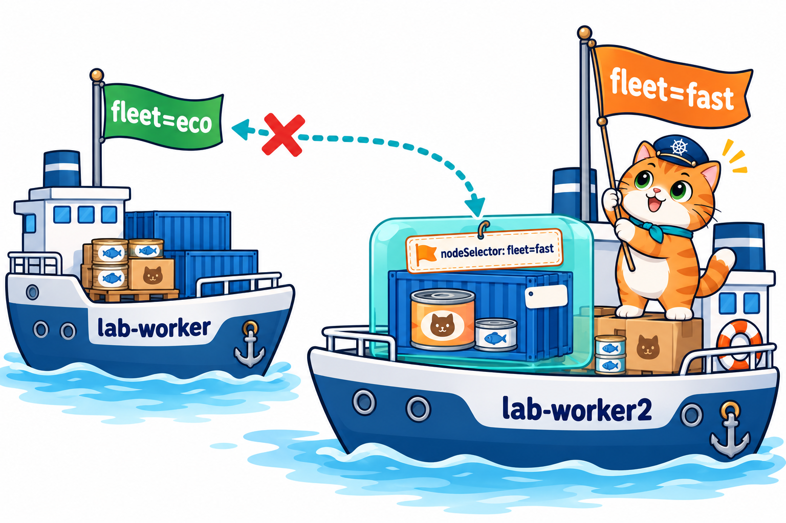<br>
  <em><b>รูปที่ 14</b> nodeSelector คือใบสั่งว่า Pod ต้องขึ้นเรือที่มีธงตรงกันเท่านั้น ถ้าไม่มีเรือลำไหนติดธงนั้น Pod จะ Pending</em>
</p>

`nodeSelector` เป็นวิธีที่ง่ายที่สุดในการบอกว่า "ต้องไปเรือที่มี label แบบนี้" เขียนเป็น map ของ `key: value` **ทุกคู่ต้องตรง (AND)**

```yaml
apiVersion: v1
kind: Pod
metadata:
  name: selector-pod
  labels:
    lab: "03"
spec:
  nodeSelector:               # ทุก key ต้องตรง (AND) ถ้าไม่มี node ไหนตรง → Pending
    fleet: fast
  containers:
    - name: web
      image: nginx:1.27-alpine
```

จัดการ label ของ Node ด้วย `kubectl label`

```bash
kubectl label node lab-worker2 fleet=fast deck=5     # ติด label (ได้หลายตัวพร้อมกัน)
kubectl label node lab-worker2 fleet=eco --overwrite # เปลี่ยนค่าเดิมต้องใส่ --overwrite
kubectl label node lab-worker2 fleet-                # ลบ label (ใส่ - ต่อท้าย key)
kubectl get nodes -L fleet,deck                      # ดูเป็นคอลัมน์
```

ถ้าลืม `--overwrite` ผลจริงคือ `error: 'fleet' already has a value (fast), and --overwrite is false`

พฤติกรรมที่เห็นใน LAB 3

1. apply ก่อนมี Node ใดติด `fleet=fast` → `Pending` พร้อม `0/3 nodes are available: 1 node(s) had untolerated taint(s), 2 node(s) didn't match Pod's node affinity/selector.`
2. ติด label ให้ `lab-worker2` → scheduler ลองใหม่เองและวาง Pod บน `lab-worker2` ภายใน ~1 วินาที
3. **ลบ label ออกหลัง Pod รันแล้ว → Pod ยังอยู่ที่เดิม** เพราะ nodeSelector ตรวจตอนจัดวางเท่านั้น (แนวคิดเดียวกับ `IgnoredDuringExecution` ในหัวข้อ 8)

---

## 8. Node affinity: แม่เหล็กดึงไปหาธงเรือ

nodeSelector พูดได้แค่ "ต้องเท่ากับ" node affinity ขยายความสามารถให้ **พูดได้หลายแบบ** (ไม่เท่ากับ, มีอยู่, มากกว่า) และมีทั้งแบบ **ต้อง** และแบบ **อยากได้**

### 8.1 required กับ preferred

<p align="center" id="fig-15">
  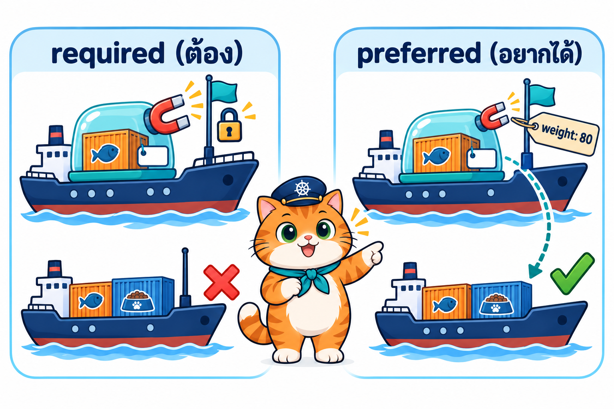<br>
  <em><b>รูปที่ 15</b> node affinity แบบ required คือแม่เหล็กที่ต้องดูดติดเท่านั้น ส่วน preferred คือแม่เหล็กที่อยากได้ถ้าไม่มีก็ไปเรือลำอื่นได้</em>
</p>

| ฟิลด์ | แบบ | ทำงานในขั้น | ถ้าไม่มี Node ตรง |
|---|---|---|---|
| `requiredDuringSchedulingIgnoredDuringExecution` | ต้อง (hard) | Filtering | **Pending** |
| `preferredDuringSchedulingIgnoredDuringExecution` | อยากได้ (soft) มี `weight` 1–100 | Scoring | วางที่อื่นได้ตามปกติ |

ชื่อยาวแต่แยกอ่านได้ง่าย

- `requiredDuringScheduling` / `preferredDuringScheduling` = ตอน **จัดวาง** ต้อง / อยากได้
- `IgnoredDuringExecution` = ตอน **รันอยู่** ไม่สนใจ ถ้า label ของ Node เปลี่ยนจนไม่ตรงแล้ว Pod ที่รันอยู่ **ไม่ถูกไล่**

ตัวอย่าง required (ไฟล์จริงใน LAB 3)

```yaml
apiVersion: v1
kind: Pod
metadata:
  name: affinity-required-pod
  labels:
    lab: "03"
spec:
  affinity:
    nodeAffinity:
      requiredDuringSchedulingIgnoredDuringExecution:   # ต้องตรงตอนวาง / วางแล้วไม่ตรวจซ้ำ
        nodeSelectorTerms:          # หลาย term = OR
          - matchExpressions:       # หลาย expression ใน term เดียว = AND
              - key: fleet
                operator: In
                values: ["fast", "eco"]
  containers:
    - name: web
      image: nginx:1.27-alpine
```

ตัวอย่าง preferred (ไฟล์จริงมี Pod หน้าตาเดียวกัน 4 ตัว `prefer-1..4` ที่นี่แสดงตัวเดียว)

```yaml
apiVersion: v1
kind: Pod
metadata:
  name: prefer-1
  labels:
    lab: "03"
    group: prefer
spec:
  affinity:
    nodeAffinity:
      preferredDuringSchedulingIgnoredDuringExecution:
        - weight: 80              # 1–100: อยากได้เรือ fleet=fast มาก
          preference:
            matchExpressions:
              - key: fleet
                operator: In
                values: ["fast"]
        - weight: 20              # อยากได้เรือที่มีป้าย cabin (ค่าอะไรก็ได้) นิดหน่อย
          preference:
            matchExpressions:
              - key: cabin
                operator: Exists
  containers:
    - name: web
      image: nginx:1.27-alpine
```

ผลจริงจาก LAB 3

| สถานการณ์ | ผล |
|---|---|
| `lab-worker2` ติด `fleet=fast`, `lab-worker` ติด `fleet=eco` | `prefer-1..4` **อยู่บน lab-worker2 ทั้ง 4 ตัว** (weight 80 ชนะคะแนนด้านความว่างของเรือ) |
| เปลี่ยนเป็น `fleet=eco` ทั้งสองลำ (ไม่มีเรือ fast เลย) | `prefer-1..4` ยัง **Running ครบ** กระจาย 2 + 2 ส่วน `selector-pod` (nodeSelector `fleet: fast`) **Pending** |

> preferred **ไม่รับประกัน** ผล ขึ้นกับคะแนนรวมจาก plugin อื่นด้วย ถ้าต้องการรับประกันต้องใช้ required

### 8.2 Operators และการรวมเงื่อนไข

<p align="center" id="fig-16">
  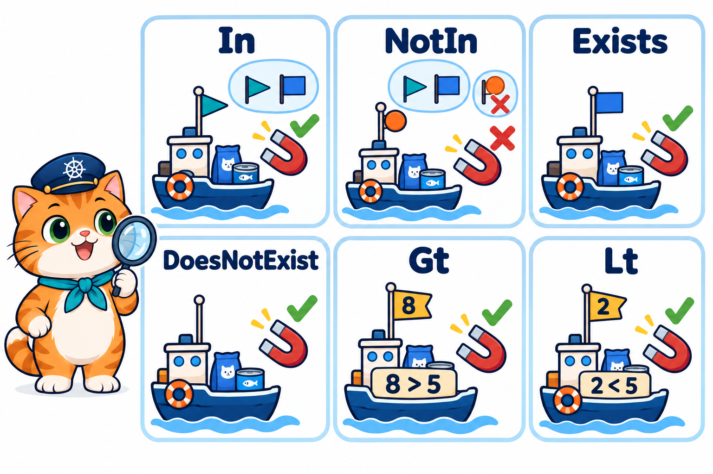<br>
  <em><b>รูปที่ 16</b> ตัวดำเนินการของ node affinity: In, NotIn, Exists, DoesNotExist, Gt, Lt ใช้เทียบ label ของเรือ</em>
</p>

**ตารางที่ 5** operator ของ node affinity

| operator | `values` | ตรงเมื่อ | ตัวอย่าง |
|---|---|---|---|
| `In` | 1 ค่าขึ้นไป | ค่า label อยู่ในรายการ | `fleet In [fast, eco]` |
| `NotIn` | 1 ค่าขึ้นไป | ค่า label ไม่อยู่ในรายการ (รวมถึงไม่มี label นั้น) | `fleet NotIn [old]` |
| `Exists` | ไม่ต้องใส่ | มี key นี้ (ค่าอะไรก็ได้) | `cabin Exists` |
| `DoesNotExist` | ไม่ต้องใส่ | ไม่มี key นี้ | `maintenance DoesNotExist` |
| `Gt` | **1 ค่า** เป็นจำนวนเต็มในรูป string | ค่า label (ตีความเป็นจำนวนเต็ม) มากกว่า | `deck Gt ["3"]` |
| `Lt` | **1 ค่า** เป็นจำนวนเต็มในรูป string | ค่า label น้อยกว่า | `deck Lt ["3"]` |

ตัวอย่าง `Gt` (ไฟล์จริง) เมื่อ `lab-worker2` ติด `deck=5` และ `lab-worker` ติด `deck=2` Pod นี้ไปได้เฉพาะ `lab-worker2`

```yaml
apiVersion: v1
kind: Pod
metadata:
  name: affinity-gt-pod
  labels:
    lab: "03"
spec:
  affinity:
    nodeAffinity:
      requiredDuringSchedulingIgnoredDuringExecution:
        nodeSelectorTerms:
          - matchExpressions:
              - key: deck
                operator: Gt
                values: ["3"]         # ต้องใส่ค่าเดียว และเป็นตัวเลขในเครื่องหมายคำพูด
  containers:
    - name: web
      image: nginx:1.27-alpine
```

**กฎการรวมเงื่อนไข**

| โครงสร้าง | ความหมาย |
|---|---|
| หลาย `nodeSelectorTerms` | **OR** ผ่าน term ใด term หนึ่งก็พอ |
| หลาย `matchExpressions` ใน term เดียว | **AND** ต้องผ่านทุกข้อ |
| ใช้ `nodeSelector` ร่วมกับ node affinity | ต้องผ่าน **ทั้งคู่** |
| หลาย preferred term | คะแนนรวมของทุก term ที่ตรง (ตาม `weight`) |

ตัวอย่างโครงสร้าง "(fast **และ** deck > 3) **หรือ** (มี label `vip`)"

```yaml
apiVersion: v1
kind: Pod
metadata:
  name: or-and-example
spec:
  affinity:
    nodeAffinity:
      requiredDuringSchedulingIgnoredDuringExecution:
        nodeSelectorTerms:
          - matchExpressions:        # term ที่ 1: ต้องผ่านทั้งสองข้อ (AND)
              - key: fleet
                operator: In
                values: ["fast"]
              - key: deck
                operator: Gt
                values: ["3"]
          - matchExpressions:        # term ที่ 2: หรือ (OR) มี label vip
              - key: vip
                operator: Exists
  containers:
    - name: web
      image: nginx:1.27-alpine
```

> **เคล็ดลับ:** `NotIn` และ `DoesNotExist` ใช้ทำ "ห้ามไปเรือแบบนี้" ได้จากฝั่ง Pod (node anti-affinity) แต่ถ้าต้องการกัน **ทุก Pod** ออกจาก Node หนึ่ง ควรใช้ taint จากฝั่ง Node (หัวข้อ 11)

---

## 9. Inter-pod affinity และ anti-affinity: แม่เหล็กระหว่างกล่อง

node affinity เลือกเรือจาก **label ของเรือ** ส่วน inter-pod affinity เลือกเรือจาก **Pod ที่อยู่บนเรืออยู่แล้ว** เช่น "อยากอยู่ใกล้ cache" หรือ "สาขาเดียวกันห้ามอยู่เรือเดียวกัน"

### 9.1 podAffinity และ podAntiAffinity

<p align="center" id="fig-17">
  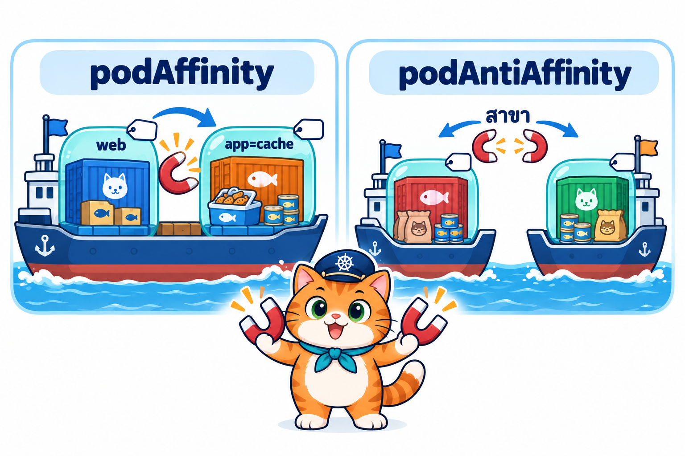<br>
  <em><b>รูปที่ 17</b> pod affinity คือแม่เหล็กดึงกล่องให้อยู่ใกล้ Pod ที่มี label ตรง ส่วน pod anti-affinity คือแม่เหล็กผลักไม่ให้อยู่เรือลำเดียวกัน</em>
</p>

| ฟิลด์ | ความหมาย | ตัวอย่างการใช้ |
|---|---|---|
| `podAffinity` | ต้อง/อยากอยู่ "ที่เดียวกัน" กับ Pod ที่ตรง `labelSelector` | เว็บอยู่ใกล้ cache เพื่อลด latency |
| `podAntiAffinity` | ต้อง/อยาก **ไม่** อยู่ "ที่เดียวกัน" กับ Pod ที่ตรง `labelSelector` | สาขา/สำเนาของแอปเดียวกันแยกเรือ เพื่อไม่ให้ล่มพร้อมกัน |

ทั้งสองมีแบบ `requiredDuringSchedulingIgnoredDuringExecution` (รายการของ term) และ `preferredDuringSchedulingIgnoredDuringExecution` (มี `weight` และ `podAffinityTerm`) ฟิลด์ใน term ที่ต้องรู้

| ฟิลด์ | ความหมาย |
|---|---|
| `labelSelector` | เลือก Pod เป้าหมายด้วย label (`matchLabels` / `matchExpressions`) |
| `topologyKey` | label ของ **Node** ที่ใช้นิยามคำว่า "ที่เดียวกัน" (หัวข้อ 9.2) |
| `namespaces` / `namespaceSelector` | namespace ของ Pod เป้าหมาย (ไม่ระบุ = namespace เดียวกับ Pod นี้) |

ตัวอย่าง required podAffinity (ไฟล์จริงใน LAB 4)

```yaml
apiVersion: v1
kind: Pod
metadata:
  name: web-near-cache
  labels:
    lab: "03"
    app: web
spec:
  affinity:
    podAffinity:
      requiredDuringSchedulingIgnoredDuringExecution:
        - labelSelector:            # หา Pod อื่นที่มีป้ายนี้ (ใน namespace เดียวกัน)
            matchLabels:
              app: cache
          topologyKey: kubernetes.io/hostname   # "ที่เดียวกัน" = node เดียวกัน
  containers:
    - name: web
      image: nginx:1.27-alpine
```

ตัวอย่าง required podAntiAffinity (ไฟล์จริงมี `crew-1..3` หน้าตาเดียวกัน)

```yaml
apiVersion: v1
kind: Pod
metadata:
  name: crew-1
  labels:
    lab: "03"
    team: crew
spec:
  affinity:
    podAntiAffinity:              # ผลักกัน: ห้ามอยู่เรือลำเดียวกับ Pod team=crew ตัวอื่น
      requiredDuringSchedulingIgnoredDuringExecution:
        - labelSelector:
            matchLabels:
              team: crew
          topologyKey: kubernetes.io/hostname
  containers:
    - name: web
      image: nginx:1.27-alpine
```

ตัวอย่าง preferred podAntiAffinity (`deckhand-1..3`) สังเกตว่าแบบ preferred ต้องห่อ term ไว้ใน `podAffinityTerm`

```yaml
apiVersion: v1
kind: Pod
metadata:
  name: deckhand-1
  labels:
    lab: "03"
    team: deckhand
spec:
  affinity:
    podAntiAffinity:              # แบบ "อยากได้": พยายามแยกเรือ แต่ถ้าไม่มีเรือว่างก็ยอมอยู่ด้วยกัน
      preferredDuringSchedulingIgnoredDuringExecution:
        - weight: 100
          podAffinityTerm:
            labelSelector:
              matchLabels:
                team: deckhand
            topologyKey: kubernetes.io/hostname
  containers:
    - name: web
      image: nginx:1.27-alpine
```

ผลจริงจาก LAB 4

| การทดลอง | ผล |
|---|---|
| apply `web-near-cache` **ก่อน** `cache` | Pending: `... 2 node(s) didn't match pod affinity rules.` แล้วถูกวางเองทันทีเมื่อ `cache` เกิด (ทั้งคู่อยู่ `lab-worker`) |
| required anti-affinity 3 Pod บน worker 2 ลำ | `crew-1` อยู่ `lab-worker2`, `crew-2` อยู่ `lab-worker`, **`crew-3` Pending** |
| ลบ `crew-1` | `crew-3` ถูกวางเองภายใน ~3 วินาที |
| preferred anti-affinity 3 Pod | Running ครบ กระจาย 2 + 1 (ตัวที่ 3 ยอมอยู่เรือซ้ำ) |

ข้อความจริงของ `crew-3`

```text
Warning  FailedScheduling  6s    default-scheduler  0/3 nodes are available: 1 node(s) had untolerated taint(s), 2 node(s) didn't match pod anti-affinity rules. preemption: 0/3 nodes are available: 1 Preemption is not helpful for scheduling, 2 No preemption victims found for incoming pod.
```

### 9.2 topologyKey: นิยามคำว่า "ที่เดียวกัน"

<p align="center" id="fig-18">
  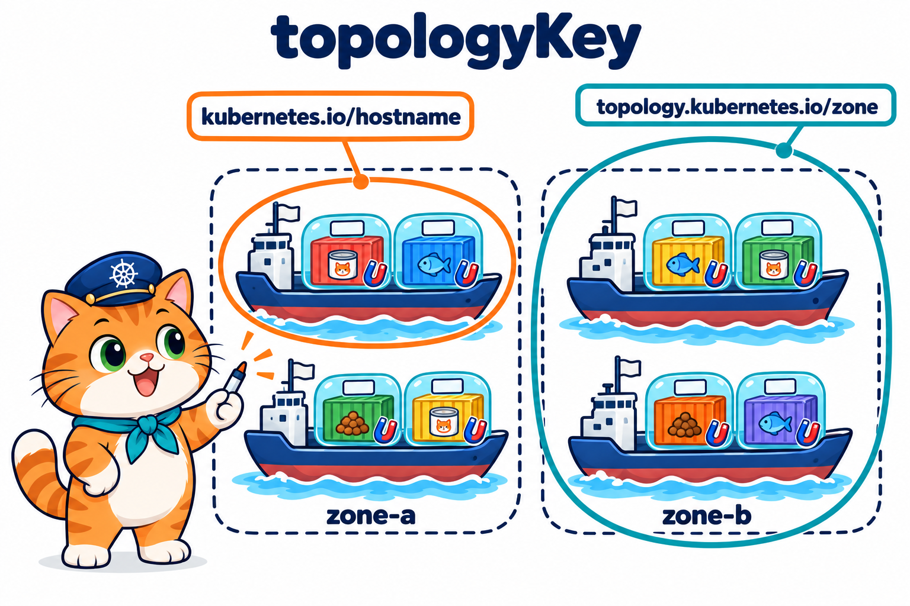<br>
  <em><b>รูปที่ 18</b> topologyKey บอกว่า "ใกล้" หมายถึงอะไร kubernetes.io/hostname คือเรือลำเดียวกัน ส่วน zone คือท่าเรือเดียวกัน</em>
</p>

`topologyKey` คือชื่อ label บน Node Node ทุกตัวที่มี **ค่าของ label นี้เท่ากัน** ถือว่าอยู่ใน "โดเมน (domain) เดียวกัน"

| topologyKey | 1 โดเมน = | ความหมายของ anti-affinity |
|---|---|---|
| `kubernetes.io/hostname` | Node 1 เครื่อง | ห้ามอยู่ **เรือลำเดียวกัน** |
| `topology.kubernetes.io/zone` | ทุก Node ใน zone เดียวกัน | ห้ามอยู่ **ท่าเรือ (zone) เดียวกัน** แม้คนละเรือ |
| `topology.kubernetes.io/region` | ทุก Node ใน region เดียวกัน | ห้ามอยู่ region เดียวกัน |

Node ต้องมี label ที่ใช้เป็น topologyKey จริง ใน kind ไม่มี label `zone` ถ้าใช้ `topology.kubernetes.io/zone` กับ required affinity Pod จะหาโดเมนที่ตรงไม่ได้

> **ข้อควรระวัง**
> - required anti-affinity กับ `kubernetes.io/hostname` ทำให้ **จำนวน Pod สูงสุด = จำนวน Node ที่ผ่านเงื่อนไขอื่น** ตัวที่เกินจะ Pending (เช่น `crew-3`) ถ้าต้องการกระจายแต่ยอมให้เกินได้ ใช้แบบ preferred หรือ topology spread (หัวข้อ 10)
> - กฎ anti-affinity มีผล **สองทาง** Pod ใหม่ที่ไม่มีกฎของตัวเองก็ถูกกันออกจาก Node ที่มี Pod ซึ่งประกาศ anti-affinity ต่อ label ของมัน
> - การคำนวณ inter-pod affinity หนักขึ้นตามจำนวน Pod ในคลัสเตอร์ใหญ่มาก ๆ (หลายพัน Node) จึงควรใช้เท่าที่จำเป็น

---

## 10. topologySpreadConstraints: ตาชั่งกองเรือ

### 10.1 แนวคิดและฟิลด์

<p align="center" id="fig-19">
  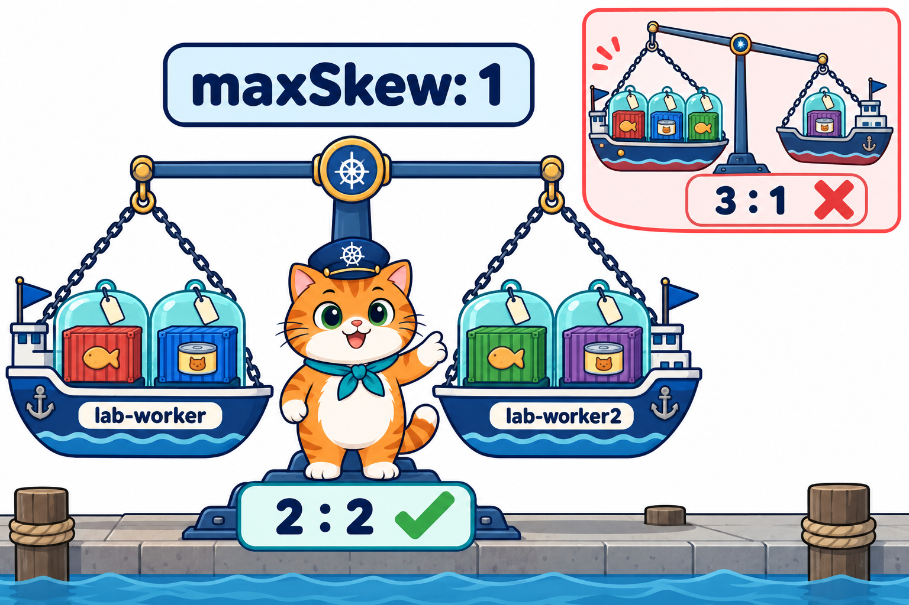<br>
  <em><b>รูปที่ 19</b> topologySpreadConstraints เหมือนตาชั่งกองเรือ จำนวน Pod ระหว่างเรือต่างกันได้ไม่เกิน maxSkew</em>
</p>

anti-affinity พูดได้แค่ "ห้ามอยู่ด้วยกัน" ส่วน **topology spread** พูดว่า "กระจายให้สมดุล" ซึ่งยืดหยุ่นกว่า (Pod มากกว่าจำนวน Node ได้)

```text
skew ของโดเมน = จำนวน Pod ที่ตรง labelSelector ในโดเมนนั้น − จำนวนต่ำสุดในบรรดาโดเมนที่เข้าเกณฑ์
เงื่อนไข: หลังวาง Pod ใหม่ skew ต้องไม่เกิน maxSkew
```

**ตารางที่ 6** ฟิลด์ของ `topologySpreadConstraints`

| ฟิลด์ | ค่า | ความหมาย |
|---|---|---|
| `maxSkew` | จำนวนเต็ม ≥ 1 | ความต่างสูงสุดที่ยอมรับได้ |
| `topologyKey` | label ของ Node | นิยามโดเมน (เหมือนหัวข้อ 9.2) |
| `whenUnsatisfiable` | `DoNotSchedule` (ค่าเริ่มต้น) / `ScheduleAnyway` | ทำตามไม่ได้แล้วจะ Pending (filter) หรือวางไปแต่ให้คะแนนตามความสมดุล (score) |
| `labelSelector` | selector | นับเฉพาะ Pod ที่ตรง (มักเป็น label ของกลุ่มตัวเอง) |
| `minDomains` | จำนวนเต็ม | จำนวนโดเมนขั้นต่ำที่ต้องมี (ใช้กับ `DoNotSchedule` เท่านั้น) |
| `nodeAffinityPolicy` | `Honor` (ค่าเริ่มต้น) / `Ignore` | นับเฉพาะ Node ที่ผ่าน nodeSelector/affinity ของ Pod หรือนับทุก Node |
| `nodeTaintsPolicy` | **`Ignore` (ค่าเริ่มต้น)** / `Honor` | นับ Node ที่ Pod **ทน taint ไม่ได้** เป็นโดเมนด้วยหรือไม่ |

ตัวอย่างการคิด (maxSkew 1, worker 2 ลำ, ไม่นับ control-plane): Pod ตัวที่ 1 → ลำ A (1:0), ตัวที่ 2 → ต้องไปลำ B (1:1), ตัวที่ 3 → ไปลำไหนก็ได้ (2:1 skew = 1), ตัวที่ 4 → ต้องไปลำที่น้อยกว่า (2:2)

### 10.2 กับดักใน kind: nodeTaintsPolicy

<p align="center" id="fig-20">
  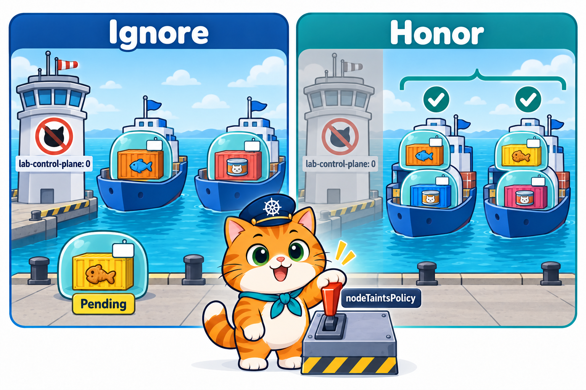<br>
  <em><b>รูปที่ 20</b> กับดักใน kind: ค่าเริ่มต้น nodeTaintsPolicy: Ignore นับ control-plane ที่มี taint เป็นช่องที่มี 0 Pod ทำให้ Pod ตัวที่ 3 Pending ต้องตั้ง Honor</em>
</p>

ค่าเริ่มต้น `nodeTaintsPolicy: Ignore` แปลว่า "ไม่สนใจ taint เวลานับโดเมน" Node `lab-control-plane` (ซึ่งมี taint และ Pod ของเราลงไม่ได้) จึงถูกนับเป็นโดเมนที่มี **0 Pod ตลอดไป** ผลคือ

```text
โดเมน:        lab-control-plane   lab-worker   lab-worker2
Pod ตัวที่ 1:        0                0            1        (skew 1 ✓)
Pod ตัวที่ 2:        0                1            1        (skew 1 ✓)
Pod ตัวที่ 3:        0                2 หรือ        2        → skew = 2 − 0 = 2 > maxSkew 1  ✗  Pending
```

ผลจริงจาก LAB 5 ยืนยันว่าเกิด Pending จริงบน Kubernetes 1.37

```text
NAME       NODE          STATUS
spread-1   lab-worker2   Running
spread-2   lab-worker    Running
spread-3   <none>        Pending
spread-4   <none>        Pending
```

```text
Warning  FailedScheduling  8s    default-scheduler  0/3 nodes are available: 1 node(s) had untolerated taint(s), 2 node(s) didn't match pod topology spread constraints. preemption: 0/3 nodes are available: 1 Preemption is not helpful for scheduling, 2 No preemption victims found for incoming pod.
```

แก้ด้วย `nodeTaintsPolicy: Honor` ให้นับเฉพาะ Node ที่ Pod ทน taint ได้ (ไฟล์จริง `honor-1..4`)

```yaml
apiVersion: v1
kind: Pod
metadata:
  name: honor-1
  labels:
    lab: "03"
    group: honor
spec:
  topologySpreadConstraints:
    - maxSkew: 1                         # จำนวน Pod ระหว่าง "เรือที่มากสุด" กับ "เรือที่น้อยสุด" ต่างกันได้ไม่เกิน 1
      topologyKey: kubernetes.io/hostname   # 1 domain = 1 node
      whenUnsatisfiable: DoNotSchedule   # ถ้าทำให้เอียงเกิน → ไม่วาง (Pending)
      labelSelector:
        matchLabels:
          group: honor
      nodeTaintsPolicy: Honor        # ค่าเริ่มต้นคือ Ignore
  containers:
    - name: web
      image: nginx:1.27-alpine
```

ผลจริง: `honor-1..4` Running ครบ 2 : 2 (`lab-worker2` 2 ตัว, `lab-worker` 2 ตัว) และเมื่อดู spec ที่ระบบเก็บไว้ จะเห็นว่าแบบที่ไม่ได้ตั้ง **ไม่มีฟิลด์ `nodeTaintsPolicy` เลย** (ใช้ค่าเริ่มต้น Ignore)

```text
[{"labelSelector":{"matchLabels":{"group":"spread"}},"maxSkew":1,"topologyKey":"kubernetes.io/hostname","whenUnsatisfiable":"DoNotSchedule"}]
[{"labelSelector":{"matchLabels":{"group":"honor"}},"maxSkew":1,"nodeTaintsPolicy":"Honor","topologyKey":"kubernetes.io/hostname","whenUnsatisfiable":"DoNotSchedule"}]
```

ทางแก้อื่นคือใช้ node affinity เลือกเฉพาะ worker ร่วมกับ `nodeAffinityPolicy: Honor` (ค่าเริ่มต้น) ซึ่งจะตัด control-plane ออกจากการนับเช่นกัน

**ตารางที่ 7** anti-affinity เทียบกับ topology spread

| ประเด็น | required podAntiAffinity | topologySpreadConstraints |
|---|---|---|
| คำพูด | "ห้ามอยู่โดเมนเดียวกันเกิน 1" | "แต่ละโดเมนต่างกันไม่เกิน maxSkew" |
| Pod มากกว่าจำนวนโดเมน | ตัวที่เกิน **Pending** | วางได้ (2:2, 3:3, ...) |
| แบบอ่อน | preferred + weight | `ScheduleAnyway` |
| กับดักใน kind | – | `nodeTaintsPolicy: Ignore` นับ control-plane |
| เหมาะกับ | 1 สำเนาต่อเครื่อง เช่น สาขาร้าน | กระจายจำนวนมากให้สมดุล |

---

## 11. Taints และ Tolerations: ป้ายห้ามขึ้นและบัตรผ่าน

กลไกในหัวข้อ 7–10 อยู่ที่ **Pod** (Pod เลือกเรือ) ส่วน taint อยู่ที่ **Node** (เรือปฏิเสธ Pod) ใช้เมื่ออยากกัน "ทุก Pod ยกเว้นคนที่มีบัตร" ออกจากเรือ

### 11.1 taint อยู่บน Node, toleration อยู่บน Pod

<p align="center" id="fig-21">
  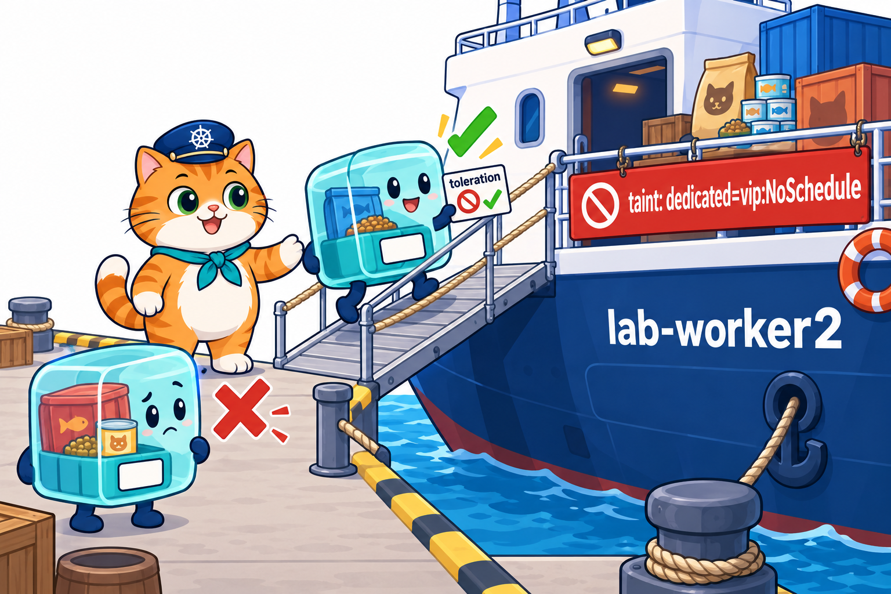<br>
  <em><b>รูปที่ 21</b> taint คือป้ายห้ามขึ้นที่ติดบนเรือ toleration คือบัตรผ่านที่ติดกับ Pod มีบัตรตรงกันจึงขึ้นเรือได้</em>
</p>

taint มีรูปแบบ `key=value:effect` (value ไม่บังคับ)

```bash
kubectl taint node lab-worker2 dedicated=vip:NoSchedule      # ติดป้าย
kubectl describe node lab-worker2 | grep -A1 Taints          # ดูป้าย
kubectl taint node lab-worker2 dedicated=vip:NoSchedule-     # ลบป้าย (ใส่ - ต่อท้าย)
```

toleration อยู่ใน `spec.tolerations` ของ Pod

| ฟิลด์ | ความหมาย |
|---|---|
| `key` | key ของ taint ที่ทนได้ (ว่าง + `operator: Exists` = ทนทุก taint) |
| `operator` | `Equal` (ค่าเริ่มต้น ต้องตรงทั้ง key และ value) หรือ `Exists` (ตรงแค่ key ไม่สน value) |
| `value` | ค่าที่ต้องตรง (ใช้กับ `Equal`) |
| `effect` | effect ที่ทนได้ (ว่าง = ทุก effect ของ key นั้น) |
| `tolerationSeconds` | ใช้กับ `NoExecute` เท่านั้น อยู่ต่อได้กี่วินาทีหลังเจอ taint |

ตัวอย่าง (ไฟล์จริง `vip-pod.yaml`)

```yaml
apiVersion: v1
kind: Pod
metadata:
  name: vip-pod
  labels:
    lab: "03"
spec:
  tolerations:
    - key: dedicated
      operator: Equal          # key และ value ต้องตรงกับ taint
      value: vip
      effect: NoSchedule
  nodeSelector:
    kubernetes.io/hostname: lab-worker2
  containers:
    - name: web
      image: nginx:1.27-alpine
```

ผลจริงจาก LAB 6 เมื่อ `lab-worker2` มี taint `dedicated=vip:NoSchedule`: `plain-pod` (ไม่มีบัตร) ถูกวางที่ `lab-worker` **ทั้ง 5 รอบ** ที่ลองสร้างใหม่ ส่วน `vip-pod` ลง `lab-worker2` ได้

### 11.2 effect ทั้ง 3 แบบ

<p align="center" id="fig-22">
  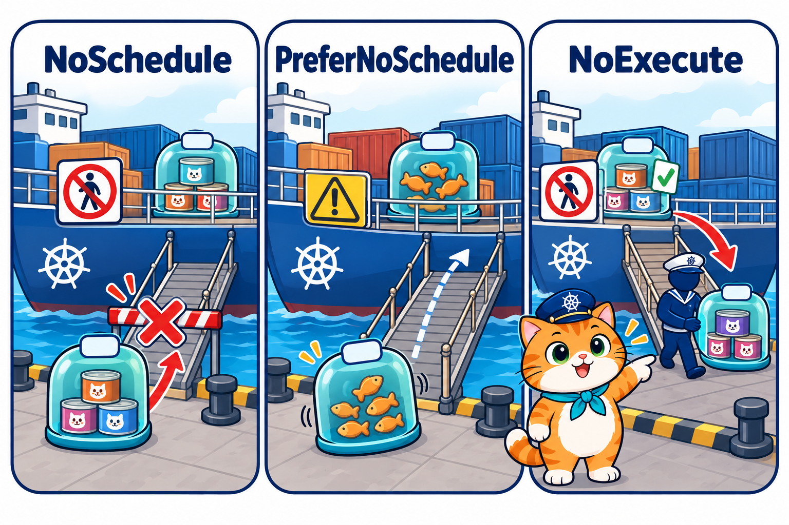<br>
  <em><b>รูปที่ 22</b> effect ของ taint: NoSchedule ไม่รับใหม่, PreferNoSchedule เลี่ยงถ้าได้, NoExecute ไม่รับใหม่และไล่ Pod ที่ไม่มีบัตรลงจากเรือ</em>
</p>

**ตารางที่ 8** effect ของ taint

| effect | Pod ใหม่ที่ไม่มีบัตร | Pod ที่รันอยู่แล้วและไม่มีบัตร | ทำงานที่ |
|---|---|---|---|
| `NoSchedule` | ไม่ถูกวาง | **อยู่ต่อ** | scheduler (Filtering) |
| `PreferNoSchedule` | เลี่ยงถ้ามีเรืออื่น (ถูกหักคะแนน) | อยู่ต่อ | scheduler (Scoring) |
| `NoExecute` | ไม่ถูกวาง | **ถูกไล่ออก** (evict) ทันที หรือหลัง `tolerationSeconds` | scheduler + taint eviction controller ใน kube-controller-manager |

### 11.3 control-plane ของ kind

<p align="center" id="fig-23">
  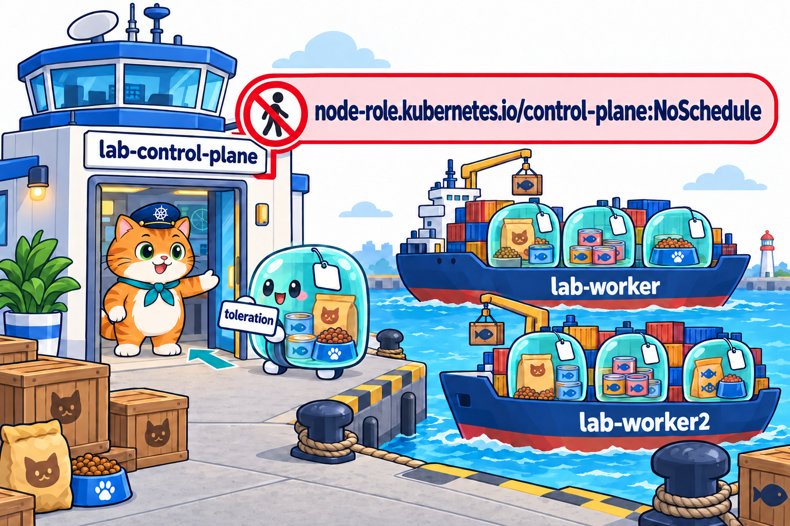<br>
  <em><b>รูปที่ 23</b> ใน kind หอบังคับการ lab-control-plane มี taint node-role.kubernetes.io/control-plane:NoSchedule Pod ทั่วไปจึงไปลงเฉพาะเรือ worker</em>
</p>

```text
$ kubectl get node -o custom-columns=NAME:.metadata.name,TAINTS:.spec.taints[*].key,EFFECT:.spec.taints[*].effect
NAME                TAINTS                                  EFFECT
lab-control-plane   node-role.kubernetes.io/control-plane   NoSchedule
lab-worker          <none>                                  <none>
lab-worker2         <none>                                  <none>
```

นี่คือเหตุผลที่ข้อความ FailedScheduling ทุกครั้งมี `1 node(s) had untolerated taint(s)` ถ้าต้องการวาง Pod บน control-plane จริง ๆ (เพื่อการเรียนเท่านั้น) ต้องมี **ทั้งบัตรผ่านและใบสั่ง**

```yaml
apiVersion: v1
kind: Pod
metadata:
  name: control-plane-pod
  labels:
    lab: "03"
spec:
  tolerations:
    - key: node-role.kubernetes.io/control-plane
      operator: Exists         # Exists = ไม่สนค่า value (taint นี้ไม่มี value)
      effect: NoSchedule
  nodeSelector:
    node-role.kubernetes.io/control-plane: ""   # label นี้มีเฉพาะบน control-plane (ค่าว่าง)
  containers:
    - name: web
      image: nginx:1.27-alpine
```

ผลจริง: `control-plane-pod` Running บน `lab-control-plane` ส่วน Pod ระบบอย่าง CoreDNS ที่อยู่บน control-plane ก็ใช้หลักเดียวกัน (มี toleration) งานจริงไม่ควรวางแอปบน control-plane เพราะแย่งทรัพยากรกับหอบังคับการ

### 11.4 NoExecute และ tolerationSeconds

<p align="center" id="fig-24">
  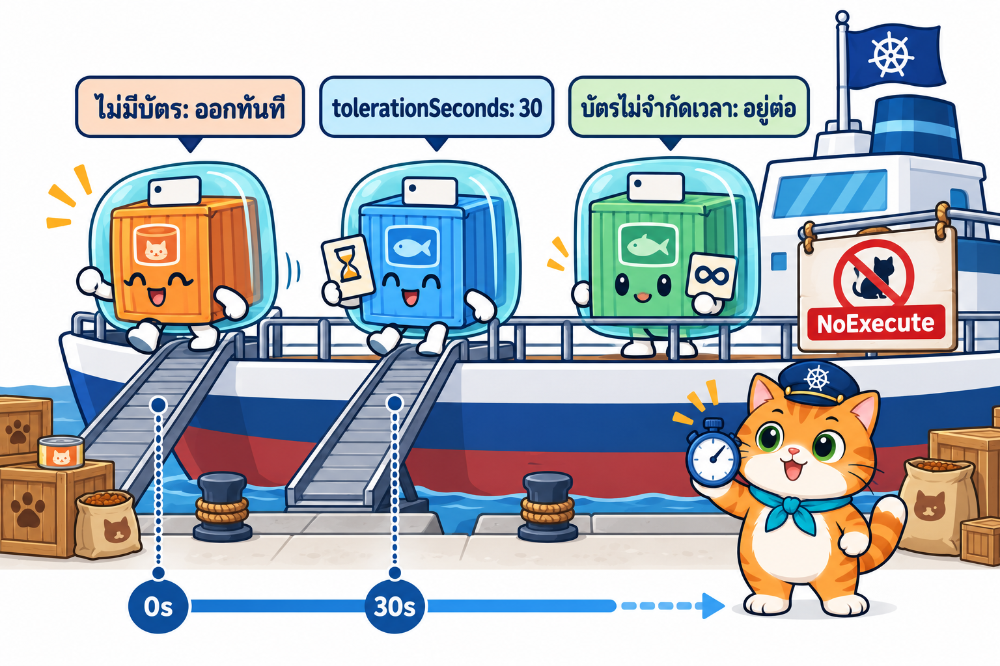<br>
  <em><b>รูปที่ 24</b> NoExecute กับ tolerationSeconds: Pod ไม่มีบัตรถูกไล่ทันที, บัตรแบบมีเวลาอยู่ได้ตามนาฬิกาทราย, บัตรไม่มีเวลาอยู่ต่อได้</em>
</p>

เมื่อ Node ถูกติด taint แบบ `NoExecute` Pod ที่อยู่บน Node นั้นแบ่งเป็น 3 กลุ่ม

| Pod | toleration ต่อ taint นี้ | ผล | ผลจริงใน LAB 6 |
|---|---|---|---|
| `no-pass` | ไม่มี | ถูกไล่ **ทันที** | Terminating ภายใน < 1 วินาที |
| `pass-30s` | มี `tolerationSeconds: 30` | อยู่ได้ 30 วินาทีแล้วถูกไล่ | ถูกไล่ที่ +30–31 วินาที |
| `pass-forever` | มี ไม่ระบุ `tolerationSeconds` | อยู่ต่อตลอด | Running ต่อ |

toleration ของ `pass-30s` (ไฟล์จริง)

```yaml
apiVersion: v1
kind: Pod
metadata:
  name: pass-30s
  labels:
    lab: "03"
    group: noexecute
spec:
  nodeSelector:
    kubernetes.io/hostname: lab-worker2
  tolerations:
    - key: dedicated               # บัตรผ่านป้ายเดิม (NoSchedule) เพื่อให้ขึ้นเรือ lab-worker2 ได้ก่อน
      operator: Equal
      value: vip
      effect: NoSchedule
    - key: maintenance             # บัตรผ่านป้ายไล่ลงเรือ แต่ "มีเวลา" 30 วินาที
      operator: Equal
      value: "true"
      effect: NoExecute
      tolerationSeconds: 30
  containers:
    - name: web
      image: nginx:1.27-alpine
```

Event จริงเมื่อ Pod ถูกไล่

```text
61s         Normal    TaintManagerEviction      pod/no-pass                 Marking for deletion Pod default/no-pass
61s         Normal    Killing                   pod/no-pass                 Stopping container web
31s         Normal    Killing                   pod/pass-30s                Stopping container web
31s         Normal    TaintManagerEviction      pod/pass-30s                Marking for deletion Pod default/pass-30s
```

ข้อสังเกตจาก LAB 6

1. **`vip-pod` ที่อยู่บน `lab-worker2` ก่อนแล้วก็ถูกไล่ด้วย** เพราะมีบัตรแค่ `dedicated` ไม่มีบัตร `maintenance` แสดงว่า NoExecute ไล่ **ทุก Pod** ที่ไม่มีบัตรตรง ไม่ว่าจะมาก่อนหรือหลัง
2. การ "ไล่" ของ taint คือการ **ลบ Pod** (Terminating → หายไป) Pod เดี่ยวที่ถูกไล่ **ไม่ถูกสร้างใหม่ที่ไหน**
3. บน Node ปกติ Pod ที่ถูกไล่หายจากรายการภายในราว 1 วินาที (ต่างจาก Node ที่ล่ม ซึ่งจะค้าง Terminating ดูหัวข้อ 13)

### 11.5 toleration ไม่ใช่แรงดึงดูด

<p align="center" id="fig-25">
  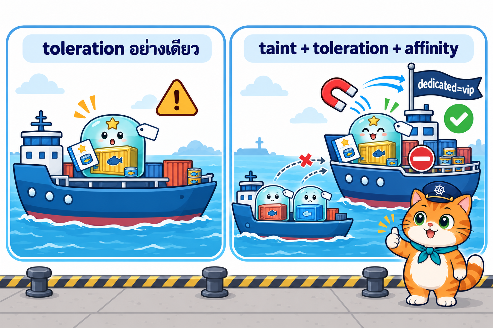<br>
  <em><b>รูปที่ 25</b> มีบัตรผ่านไม่ได้แปลว่าต้องไปเรือลำนั้น ถ้าอยากได้เรือเฉพาะกิจต้องใช้ taint + toleration + node affinity คู่กัน</em>
</p>

ความเข้าใจผิดที่พบบ่อยที่สุด: "ใส่ toleration แล้ว Pod จะไปที่ Node ที่มี taint" **ไม่จริง** toleration แค่ทำให้ Node นั้น **ไม่ถูกตัดทิ้ง** Pod ยังอาจถูกวางบน Node ปกติลำอื่นได้ตามคะแนน

รูปแบบ **Node เฉพาะกิจ (dedicated nodes)** ที่ถูกต้องจึงใช้ 3 อย่างคู่กัน

| ชิ้นส่วน | อยู่ที่ | ทำหน้าที่ |
|---|---|---|
| taint `dedicated=vip:NoSchedule` | Node | กัน Pod ทั่วไปออก |
| toleration `dedicated=vip:NoSchedule` | Pod VIP | ให้ Pod VIP ผ่านป้ายได้ |
| label + nodeSelector/node affinity | Node + Pod VIP | ดึง Pod VIP ไปที่ Node นั้น (ไม่ไปที่อื่น) |

ใน `vip-pod.yaml` เราใช้ `nodeSelector: kubernetes.io/hostname: lab-worker2` ทำหน้าที่ชิ้นที่ 3 ในงานจริงควรติด label เฉพาะ เช่น `dedicated=vip` แล้วเลือกด้วย label นั้นแทนชื่อเครื่อง

---

## 12. บำรุงรักษา Node: cordon, drain และ uncordon

เรือต้องเข้าอู่เป็นระยะ (อัปเกรด kernel, เปลี่ยนฮาร์ดแวร์, อัปเกรด Kubernetes) Kubernetes มีคำสั่ง 3 ตัวสำหรับงานนี้

### 12.1 cordon: เชือกกั้นท่าเรือ

<p align="center" id="fig-26">
  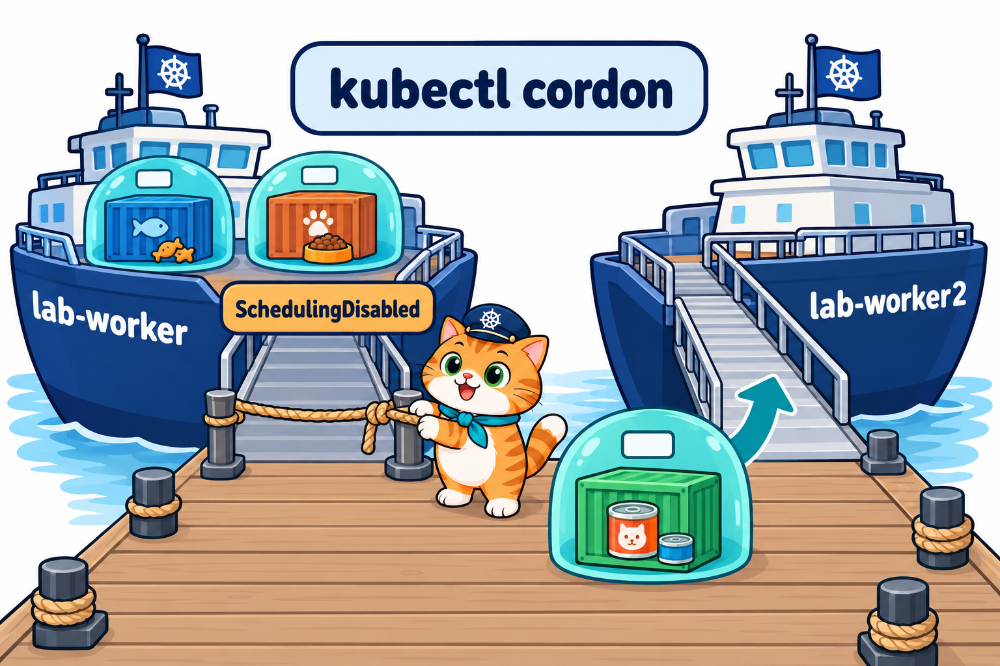<br>
  <em><b>รูปที่ 26</b> kubectl cordon คือเชือกกั้นท่าเรือ เรือขึ้นสถานะ SchedulingDisabled ไม่รับ Pod ใหม่ แต่ Pod เดิมยังอยู่บนเรือ</em>
</p>

`kubectl cordon lab-worker` ทำให้

- `spec.unschedulable: true` และระบบเติม taint `node.kubernetes.io/unschedulable:NoSchedule` ให้
- STATUS เป็น `Ready,SchedulingDisabled`
- **Pod เดิมอยู่ต่อ** แต่ Pod ใหม่จะไม่ถูกวางที่นี่ (plugin `NodeUnschedulable`)

ผลจริงจาก LAB 7

```text
$ kubectl get nodes
NAME                STATUS                     ROLES           AGE   VERSION
lab-control-plane   Ready                      control-plane   11m   v1.37.0
lab-worker          Ready,SchedulingDisabled   <none>          11m   v1.37.0
lab-worker2         Ready                      <none>          11m   v1.37.0

$ kubectl get node lab-worker -o jsonpath='{.spec.unschedulable} {.spec.taints}{"\n"}'
true [{"effect":"NoSchedule","key":"node.kubernetes.io/unschedulable","timeAdded":"2026-10-04T12:04:50Z"}]
```

### 12.2 drain: ย้ายของลงจากเรือ

<p align="center" id="fig-27">
  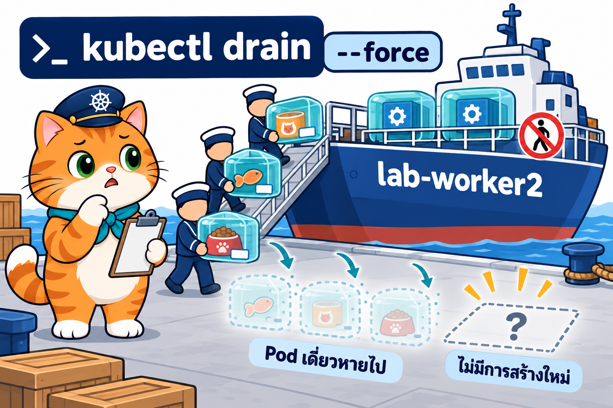<br>
  <em><b>รูปที่ 27</b> kubectl drain ย้ายของลงจากเรือ Pod เดี่ยวต้องใช้ --force และถูกลบหายไปเลย ไม่มีใครสร้างใหม่บนเรือลำอื่น</em>
</p>

`kubectl drain <node>` = **cordon + ไล่ (evict) Pod บน Node ทีละตัว** ผ่าน Eviction API ซึ่งเคารพ PodDisruptionBudget (เนื้อหาบทหลัง) drain มีด่านป้องกันหลายด่าน ต้องยืนยันด้วย flag

| flag | เกี่ยวกับ | ถ้าไม่ใส่ (ข้อความจริงจาก LAB 7) |
|---|---|---|
| `--ignore-daemonsets` | Pod ระบบที่ "ระบบดูแลให้ทุกเรือมีหนึ่งตัว" เช่น `kindnet`, `kube-proxy` (สร้างโดย DaemonSet ซึ่งจะเรียนภายหลัง) ลบไปก็ถูกสร้างคืนบนเรือเดิม จึงต้องข้าม | `cannot delete DaemonSet-managed Pods (use --ignore-daemonsets to ignore): kube-system/kindnet-dmj46, kube-system/kube-proxy-7xjpl` |
| `--force` | **Pod เดี่ยว** (ไม่มี controller ดูแล) ถูกลบแล้วหายถาวร drain จึงขอให้ยืนยัน | `cannot delete Pods that declare no controller (use --force to override): default/cargo-2, default/cargo-4` |
| `--delete-emptydir-data` | Pod ที่ใช้ emptyDir ข้อมูลจะหายเมื่อ Pod ถูกลบ | `cannot delete Pods with local storage (use --delete-emptydir-data to override): default/pantry` |

ผลจริงเมื่อใส่ครบ (ใช้เวลา 2.06 วินาที)

```text
$ kubectl drain lab-worker --ignore-daemonsets --delete-emptydir-data --force
node/lab-worker already cordoned
Warning: deleting Pods that declare no controller: default/cargo-2, default/cargo-4, default/pantry; ignoring DaemonSet-managed Pods: kube-system/kindnet-dmj46, kube-system/kube-proxy-7xjpl
evicting pod default/pantry
evicting pod default/cargo-2
evicting pod default/cargo-4
pod/pantry evicted
pod/cargo-4 evicted
pod/cargo-2 evicted
node/lab-worker drained
```

สิ่งที่ต้องจำ

1. **Pod เดี่ยวที่ถูก drain หายไปเลย ไม่ถูกสร้างใหม่บนเรือลำอื่น** ใน LAB 7 ก่อน drain มี Pod 6 ตัว หลัง drain เหลือ 3 ตัวบน `lab-worker2` (ตัวเดิม) ไม่มีตัวใหม่เกิดขึ้น
2. **drain ที่ error ก็ cordon Node ไปแล้ว** (ข้อความ `node/lab-worker cordoned` หรือ `already cordoned`) ต้อง `uncordon` เองเสมอ
3. Pod ระบบ (`kindnet`, `kube-proxy`) ยังอยู่บน Node และ static/mirror pod ไม่ถูกลบโดย drain
4. drain รอให้ Pod ปิดตัวตาม grace period (ค่าเริ่มต้น 30 วินาที) nginx และร้านน้องส้มปิดตัวเร็ว จึง drain เสร็จใน 1–2 วินาที

### 12.3 uncordon: เอาเชือกออก

<p align="center" id="fig-28">
  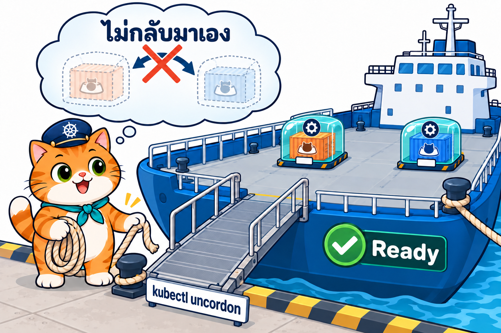<br>
  <em><b>รูปที่ 28</b> kubectl uncordon เอาเชือกออก เรือกลับมารับ Pod ใหม่ได้ แต่ Pod ที่ถูก drain ไปแล้วไม่กลับมาเอง</em>
</p>

`kubectl uncordon lab-worker` คืนสถานะ `Ready` (Event `NodeSchedulable`) Node รับ Pod **ใหม่** ได้อีกครั้ง แต่ **Pod ที่ถูก drain ไปแล้วไม่กลับมาเอง** และ Pod ที่ย้ายไปอยู่ลำอื่นก็ไม่ย้ายกลับ (scheduler ไม่ rebalance หัวข้อ 4.4)

**ตารางที่ 9** cordon / drain / uncordon

| คำสั่ง | Pod ใหม่ | Pod เดิม | STATUS |
|---|---|---|---|
| `cordon` | ไม่รับ | อยู่ต่อ | `Ready,SchedulingDisabled` |
| `drain` | ไม่รับ (cordon ให้ด้วย) | ถูกไล่ (Pod เดี่ยวหายถาวร) | `Ready,SchedulingDisabled` |
| `uncordon` | รับ | ไม่มีอะไรเปลี่ยน | `Ready` |

---

## 13. เมื่อเรือล่ม: Node NotReady และ taint อัตโนมัติ

drain คือการ "ซ่อมตามแผน" แต่บางครั้งเรือ **หายไปเฉย ๆ** (ไฟดับ, เครือข่ายขาด, เครื่องค้าง) เราจำลองได้ด้วย `docker stop lab-worker2` ใน k8s-lab

### 13.1 Heartbeat เงียบ → NotReady

<p align="center" id="fig-29">
  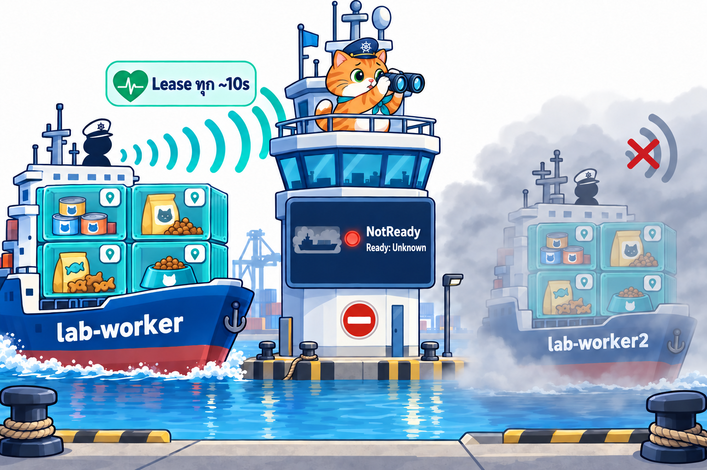<br>
  <em><b>รูปที่ 29</b> kubelet ส่งสัญญาณ heartbeat ทุกประมาณ 10 วินาที เมื่อเงียบไปนานเกิน grace period หอบังคับการเปลี่ยนเรือเป็น NotReady</em>
</p>

1. kubelet บนเรือหยุดทำงาน → Lease ไม่ถูกต่ออายุ และ NodeStatus ไม่ถูกอัปเดต
2. **node lifecycle controller** ใน kube-controller-manager ตรวจทุกไม่กี่วินาที ถ้าไม่ได้ยินข่าวนานเกิน **`node-monitor-grace-period`** จะเปลี่ยน condition ทุกตัวเป็น `Unknown` (reason `NodeStatusUnknown`, message `Kubelet stopped posting node status.`) STATUS กลายเป็น `NotReady`
3. kind ไม่ได้ตั้งค่า `node-monitor-grace-period` เอง (ตรวจใน LAB 0) จึงใช้ค่าเริ่มต้นของเวอร์ชันนี้

ผลจริงที่วัดได้ (เวลานับจาก `docker stop`)

| รอบทดลอง | stop → NotReady |
|---|---|
| LAB 8 รอบหลัก | 44 วินาที (ตาม `LastTransitionTime`) |
| LAB 8 รอบเสริม | 50 วินาที |
| LAB 10 | 43 วินาที |
| รอบถ่ายภาพหน้าจอ LAB 10 | 51 วินาที |

นับจาก heartbeat ครั้งสุดท้าย (Lease `RenewTime` 19:06:10) ถึง NotReady (19:07:03) = 53 วินาที ซึ่งสอดคล้องกับ grace period ราว 50 วินาทีบวกรอบการตรวจ **สรุปง่าย ๆ ว่า Node จะเป็น NotReady ประมาณ 45–50 วินาทีหลังเรือล่ม** (ไม่ใช่ทันที)

ผลจริงของ `describe node` ระหว่างเรือล่ม

```text
Taints:             node.kubernetes.io/unreachable:NoExecute
                    node.kubernetes.io/unreachable:NoSchedule
Unschedulable:      false
Lease:
  HolderIdentity:  lab-worker2
  AcquireTime:     <unset>
  RenewTime:       Sun, 04 Oct 2026 19:06:10 +0700
Conditions:
  Type             Status    LastHeartbeatTime                 LastTransitionTime                Reason              Message
  ----             ------    -----------------                 ------------------                ------              -------
  MemoryPressure   Unknown   Sun, 04 Oct 2026 19:02:44 +0700   Sun, 04 Oct 2026 19:07:03 +0700   NodeStatusUnknown   Kubelet stopped posting node status.
  DiskPressure     Unknown   Sun, 04 Oct 2026 19:02:44 +0700   Sun, 04 Oct 2026 19:07:03 +0700   NodeStatusUnknown   Kubelet stopped posting node status.
  PIDPressure      Unknown   Sun, 04 Oct 2026 19:02:44 +0700   Sun, 04 Oct 2026 19:07:03 +0700   NodeStatusUnknown   Kubelet stopped posting node status.
  Ready            Unknown   Sun, 04 Oct 2026 19:02:44 +0700   Sun, 04 Oct 2026 19:07:03 +0700   NodeStatusUnknown   Kubelet stopped posting node status.
```

### 13.2 taint อัตโนมัติ

<p align="center" id="fig-30">
  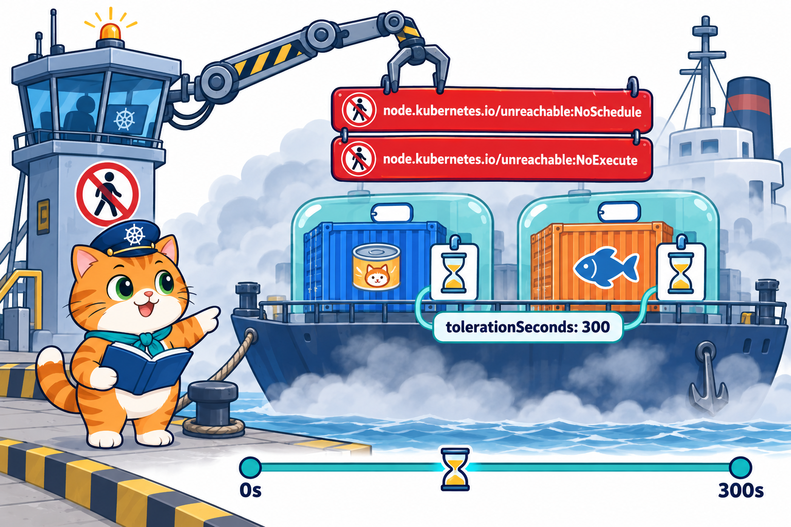<br>
  <em><b>รูปที่ 30</b> ระบบใส่ taint อัตโนมัติ node.kubernetes.io/unreachable ให้เรือที่ขาดการติดต่อ และทุก Pod มีบัตรผ่านเริ่มต้น 300 วินาที</em>
</p>

พร้อมกับ NotReady ระบบติด taint ให้เรือเอง (เห็นพร้อมกันใน LAB 8)

**ตารางที่ 10** taint ที่ระบบติดให้อัตโนมัติ

| taint | เมื่อ | effect |
|---|---|---|
| `node.kubernetes.io/unreachable` | condition `Ready` เป็น `Unknown` (ติดต่อไม่ได้) | `NoSchedule` + `NoExecute` |
| `node.kubernetes.io/not-ready` | condition `Ready` เป็น `False` (ต้นเรือรายงานว่าไม่พร้อม) | `NoSchedule` + `NoExecute` |
| `node.kubernetes.io/memory-pressure` | `MemoryPressure=True` | `NoSchedule` |
| `node.kubernetes.io/disk-pressure` | `DiskPressure=True` | `NoSchedule` |
| `node.kubernetes.io/pid-pressure` | `PIDPressure=True` | `NoSchedule` |
| `node.kubernetes.io/network-unavailable` | เครือข่ายของ Node ยังไม่พร้อม | `NoSchedule` |
| `node.kubernetes.io/unschedulable` | Node ถูก cordon | `NoSchedule` |

`NoSchedule` กัน Pod ใหม่ ส่วน `NoExecute` เริ่ม "นาฬิกาทราย" ไล่ Pod เดิม

### 13.3 บัตรผ่านเริ่มต้น 300 วินาที

admission plugin **DefaultTolerationSeconds** เติม toleration ให้ **ทุก Pod** ที่ไม่ได้ระบุเอง ผลจริงจาก `kubectl get pod fog-default -o yaml` (Pod ที่เราไม่ได้เขียน tolerations เลย)

```yaml
tolerations:
  - effect: NoExecute
    key: node.kubernetes.io/not-ready
    operator: Exists
    tolerationSeconds: 300
  - effect: NoExecute
    key: node.kubernetes.io/unreachable
    operator: Exists
    tolerationSeconds: 300
```

แปลว่า Pod จะ **รอเรือกลับมา 5 นาที (นับจากตอนที่ taint ถูกติด คือตอน NotReady)** ก่อนถูกไล่ เผื่อเป็นปัญหาเครือข่ายชั่วคราว ปรับให้สั้นลงได้ด้วยการเขียน toleration เองใน Pod

```yaml
apiVersion: v1
kind: Pod
metadata:
  name: fog-fast
  labels:
    lab: "03"
    group: fog
spec:
  nodeSelector:
    kubernetes.io/hostname: lab-worker2   # เรือที่เราจะทำให้ "หายในหมอก"
  tolerations:                     # เขียนทับค่าเริ่มต้น 300 วิ ที่ระบบใส่ให้ → ยอมรอแค่ 30 วิ
    - key: node.kubernetes.io/unreachable    # node ขาดการติดต่อ (Ready=Unknown)
      operator: Exists
      effect: NoExecute
      tolerationSeconds: 30
    - key: node.kubernetes.io/not-ready      # node รายงานว่าไม่พร้อม (Ready=False)
      operator: Exists
      effect: NoExecute
      tolerationSeconds: 30
  containers:
    - name: web
      image: nginx:1.27-alpine
```

### 13.4 ไทม์ไลน์จริงและชะตากรรมของ Pod

<p align="center" id="fig-31">
  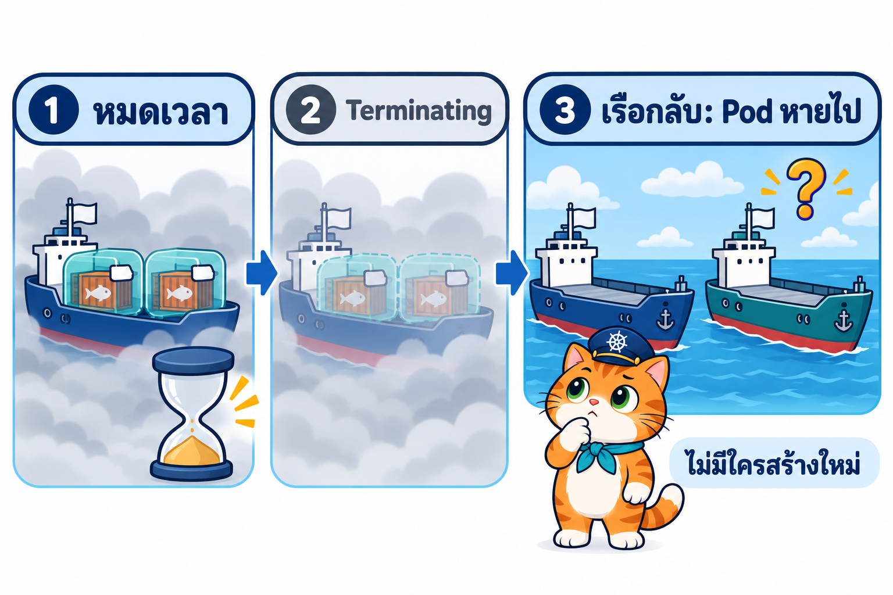<br>
  <em><b>รูปที่ 31</b> เมื่อหมดเวลา Pod บนเรือที่ล่มถูกไล่ (evict) ค้างสถานะ Terminating จนเรือกลับมา และ Pod เดี่ยวจะไม่ถูกสร้างใหม่บนเรือลำอื่น</em>
</p>

**ตารางที่ 11** ไทม์ไลน์จริงจาก LAB 8 (T0 = `docker stop lab-worker2`)

| เวลา | เหตุการณ์ |
|---|---|
| +0 วินาที | `docker stop lab-worker2` (ใช้เวลา 0.8 วินาที) Node ยังแสดง `Ready` |
| ~+44 วินาที | Node `NotReady`, Ready=`Unknown`, taint `unreachable` ทั้ง `NoSchedule` และ `NoExecute` Pod ยังแสดง `1/1 Running` |
| +73 วินาที (NotReady + ~30) | `fog-fast` (tolerationSeconds 30) ถูกไล่ → `Terminating` |
| +345 วินาที (NotReady + ~300) | `fog-default` (ค่าเริ่มต้น 300) ถูกไล่ → `Terminating` |
| ต่อจากนั้น | ทั้งสองค้าง `Terminating` ไปเรื่อย ๆ ไม่มี Pod ใหม่เกิดที่ `lab-worker` |
| `docker start` +2 วินาที | Node กลับ `Ready` (IP เดิม `172.19.0.2`) |
| `docker start` +5 วินาที | Pod ที่ถูกไล่หายจากรายการจริง |
| `docker start` +~7 วินาที | taint `unreachable` หายหมด |

สิ่งที่ควรเข้าใจจากไทม์ไลน์

1. **ช่วงก่อนถูกไล่ STATUS ยังเป็น `Running`** เพราะไม่มีใครบนเรือรายงานสถานะ แต่ condition ของ Pod เปลี่ยนเป็น `Ready=False` (ผลจริง `PodReadyToStartContainers=True Initialized=True Ready=False ContainersReady=True PodScheduled=True`) และมี Event `NodeNotReady ... Node is not ready`
2. **ถูกไล่แล้วค้าง `Terminating`** เพราะการลบ Pod ต้องรอ kubelet ยืนยันว่า container หยุดแล้ว แต่ kubelet ติดต่อไม่ได้ ระบบจึงไม่กล้าลบ object ทิ้ง (อาจมี container ยังรันอยู่จริงบนเรือที่แค่ขาดการติดต่อ)
3. **คำสั่งที่ต้องคุยกับ kubelet ใช้ไม่ได้** ผลจริง `kubectl exec` → `error: unable to upgrade connection: error dialing backend: dial tcp 172.19.0.2:10250: connect: no route to host` (port 10250 คือ port ของ kubelet) เช่นเดียวกับ `logs` และ `port-forward`
4. **Pod เดี่ยวไม่ถูกสร้างใหม่ที่ไหนเลย** การ apply ไฟล์เดิมซ้ำระหว่างค้าง Terminating ได้แค่ `Warning: Detected changes to resource fog-fast which is currently being deleted.` ไม่มี Pod ใหม่ (และไม่ใช่ error `AlreadyExists`)
5. **ถ้าเรือกลับมาก่อนครบเวลา** Pod ไม่ถูกไล่ แต่ container ถูกเริ่มใหม่ (ผลจริงรอบเสริม: `RESTARTS 1` และ **Pod IP เปลี่ยน** เพราะ sandbox ถูกสร้างใหม่หลัง Node รีสตาร์ต)

> **ทางลัดที่ต้องระวัง:** `kubectl delete pod <ชื่อ> --force --grace-period=0` ลบ object ทิ้งทันทีโดยไม่รอ kubelet และ taint `node.kubernetes.io/out-of-service` (ใช้กับกรณี Node ปิดตัวแบบไม่ปกติ) บอกระบบว่าเรือ "ดับจริง" ให้เก็บกวาด Pod ได้ ทั้งสองวิธีอาจทำให้มีโปรแกรมสองชุดทำงานซ้อนกันถ้าเรือแค่ขาดการติดต่อแต่ยังรันอยู่ ใช้เมื่อแน่ใจเท่านั้น

---

## 14. Static Pod: ตู้ที่ต้นเรือดูแลเอง

### 14.1 แนวคิด

<p align="center" id="fig-32">
  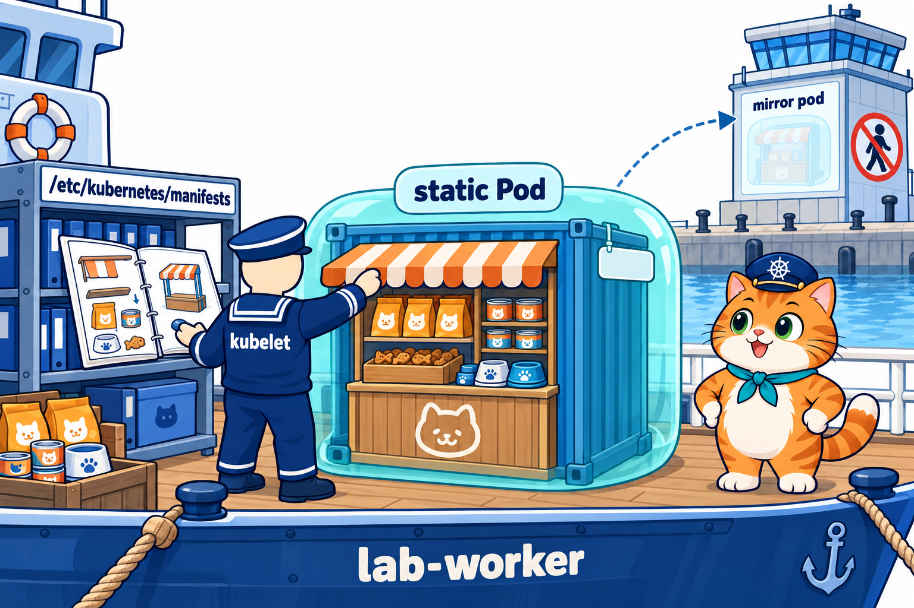<br>
  <em><b>รูปที่ 32</b> static Pod คือตู้ที่ต้นเรือ (kubelet) สร้างเองจากแฟ้มบนเรือ /etc/kubernetes/manifests ไม่ผ่านหอบังคับการและ scheduler</em>
</p>

**static Pod** คือ Pod ที่ kubelet สร้างเองจาก **ไฟล์ manifest บนเครื่อง** ในโฟลเดอร์ `staticPodPath` (ใน kind/kubeadm คือ `/etc/kubernetes/manifests`) โดย **ไม่ผ่าน scheduler และไม่ได้ถูกสร้างผ่าน API server**

- kubelet เฝ้าดูโฟลเดอร์ เจอไฟล์ใหม่ → สร้าง Pod, ไฟล์ถูกแก้ → สร้างใหม่, **ไฟล์ถูกลบ → ลบ Pod**
- เพื่อให้หอบังคับการ "เห็น" kubelet สร้าง **mirror pod** (เงา) ใน API server ชื่อ **`<ชื่อ Pod>-<ชื่อ Node>`** เช่น `static-snack-lab-worker`
- mirror pod มี annotation `kubernetes.io/config.mirror` และ `kubernetes.io/config.source: file` และ `ownerReferences` ชี้ไปที่ **Node** (ไม่ใช่ controller ใด)

ไฟล์จริงใน LAB 9 (ไม่ได้ `kubectl apply` แต่ copy ไปวางบนเรือ)

```yaml
apiVersion: v1
kind: Pod
metadata:
  name: static-snack           # ชื่อที่ kubectl เห็นจะต่อท้ายด้วยชื่อ node เช่น static-snack-lab-worker
  labels:
    app: static-snack
spec:
  containers:
    - name: web
      image: nginx:1.27-alpine
      ports:
        - containerPort: 80
```

ผลจริงจาก LAB 9

| การทดลอง | ผล |
|---|---|
| `docker cp` ไฟล์ไปที่ `lab-worker:/etc/kubernetes/manifests/` | mirror pod `static-snack-lab-worker` โผล่และ Ready เกือบทันที (< 1 วินาที) Events ไม่มี `Scheduled` |
| `kubectl delete pod static-snack-lab-worker` | คำสั่งค้างราว 65–80 วินาที (แสดง `Terminating`) แล้ว mirror pod **กลับมาใหม่** (UID ใหม่) โดย container จริงบนเรือ **ไม่ถูกรีสตาร์ต** (`crictl` ATTEMPT 0) |
| ลบไฟล์บนเรือ (`docker exec lab-worker rm ...`) | Pod หายจริงภายใน ~3 วินาที |

> **สรุป:** ลบ static Pod ผ่าน kubectl ไม่ได้ ต้องลบ **ไฟล์บนเรือ** เพราะ kubectl ลบได้แค่ "เงา" ส่วนต้นเรือยังถือแฟ้มอยู่

ข้อจำกัดของ static Pod

- อ้างอิง object อื่นใน API ไม่ได้ เช่น ConfigMap, Secret, ServiceAccount
- ไม่ถูกจัดการโดย scheduler หรือ controller ใด ไม่ถูก drain ไล่
- ใช้เฉพาะงานที่ต้องผูกกับเครื่องจริง ๆ

### 14.2 control plane ของ kind คือ static Pod

<p align="center" id="fig-33">
  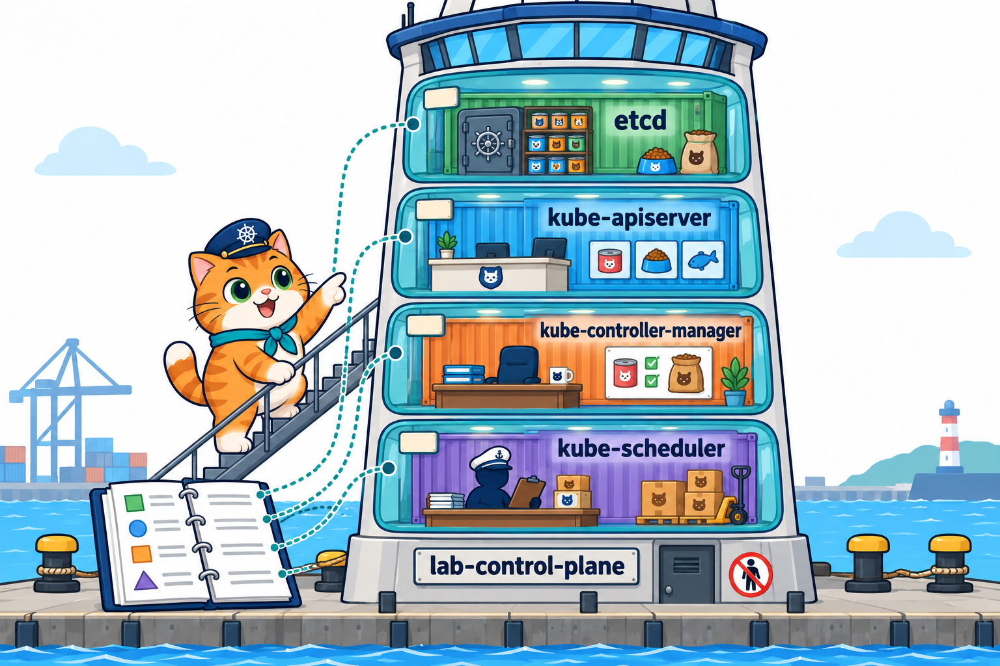<br>
  <em><b>รูปที่ 33</b> บน lab-control-plane ส่วนประกอบหลัก etcd, kube-apiserver, kube-controller-manager, kube-scheduler เป็น static Pod ที่ kubelet ของหอรันเอง</em>
</p>

static Pod ตอบคำถามไก่กับไข่ว่า "**ใครวาง scheduler ถ้า scheduler ยังไม่เกิด**" คำตอบคือ kubelet บน `lab-control-plane` อ่านไฟล์ 4 ไฟล์แล้วรันเอง

```text
$ docker exec lab-control-plane ls /etc/kubernetes/manifests
etcd.yaml
kube-apiserver.yaml
kube-controller-manager.yaml
kube-scheduler.yaml
```

mirror pod ของทั้ง 4 ตัวจึงมีชื่อลงท้ายด้วย `-lab-control-plane` เช่น `kube-scheduler-lab-control-plane` และใช้ IP ของ Node (`172.19.0.3`) เพราะใช้เครือข่ายของเครื่องโดยตรง

---

## 15. Downward API: ป้ายชื่อเรือที่ติดให้ตู้

<p align="center" id="fig-34">
  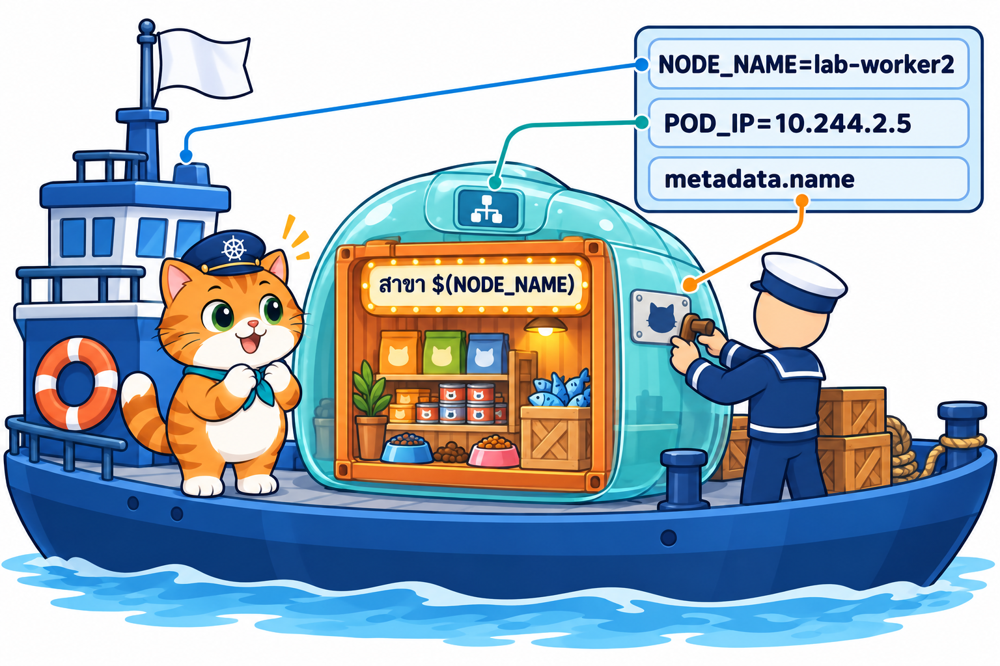<br>
  <em><b>รูปที่ 34</b> Downward API ให้ Pod รู้ข้อมูลตัวเอง เช่น spec.nodeName เป็น env NODE_NAME แล้วนำไปต่อข้อความด้วย $(NODE_NAME)</em>
</p>

แอปใน container ไม่รู้ว่าตัวเองอยู่บนเรือลำไหน **Downward API** ให้ kubelet ส่งข้อมูลของ Pod เข้า container ได้ ผ่าน env (`fieldRef`, `resourceFieldRef`) หรือผ่านไฟล์ (volume ชนิด `downwardAPI`)

**ตารางที่ 12** ฟิลด์ที่ใช้กับ env `fieldRef` ได้

| `fieldPath` | ค่า | ตัวอย่างผลจริง |
|---|---|---|
| `spec.nodeName` | ชื่อ Node ที่ Pod ถูกวาง | `lab-worker2` |
| `metadata.name` | ชื่อ Pod | `whereami` |
| `metadata.namespace` | namespace | `default` |
| `metadata.uid` | UID ของ Pod | – |
| `metadata.labels['<key>']` | ค่า label หนึ่งตัว | `metadata.labels['app']` |
| `metadata.annotations['<key>']` | ค่า annotation หนึ่งตัว | – |
| `status.podIP` | IP ของ Pod | `10.244.2.3` |
| `status.hostIP` | IP ของ Node | `172.19.0.2` |
| `spec.serviceAccountName` | ชื่อ ServiceAccount | – |

`resourceFieldRef` ให้ค่า requests/limits ของ container เช่น `limits.memory` ส่วน label/annotation **ทั้งหมด** ต้องใช้แบบ volume

**การอ้างตัวแปรด้วย `$(VAR)`** ใน `value`, `command`, `args` อ้าง env ตัวอื่น **ที่ประกาศก่อนหน้าในลิสต์** ได้ Kubernetes แทนค่าให้ตอนสร้าง container (ไม่ต้องมี shell) ถ้าอ้างตัวที่ไม่มี ข้อความ `$(VAR)` จะคงอยู่ตามตัวอักษร และ `$$(VAR)` ใช้ escape ให้ได้ข้อความ `$(VAR)` จริง ๆ

ไฟล์จริงจาก LAB 2

```yaml
apiVersion: v1
kind: Pod
metadata:
  name: whereami
  labels:
    lab: "03"
spec:
  terminationGracePeriodSeconds: 1
  containers:
    - name: app
      image: busybox:1.36
      env:
        - name: NODE_NAME            # ชื่อ node ที่ Pod ถูกวาง (ต้นเรือเติมให้ตอนสร้าง container)
          valueFrom:
            fieldRef:
              fieldPath: spec.nodeName
        - name: POD_NAME
          valueFrom:
            fieldRef:
              fieldPath: metadata.name
        - name: POD_IP               # IP ของ Pod (10.244.x.x)
          valueFrom:
            fieldRef:
              fieldPath: status.podIP
        - name: HOST_IP              # IP ของ node (เช่น 172.19.0.x ใน kind ขึ้นกับ Docker network ของเครื่อง)
          valueFrom:
            fieldRef:
              fieldPath: status.hostIP
        - name: GREETING             # $(ชื่อตัวแปร) อ้างตัวแปรที่ประกาศ "ก่อนหน้า" ในลิสต์นี้ได้
          value: "สวัสดีจาก $(POD_NAME) บนเรือ $(NODE_NAME)"
      command: ["sh", "-c", "echo \"$GREETING (Pod IP $POD_IP, Node IP $HOST_IP)\"; sleep 3600"]
```

ผลจริง

```text
$ kubectl logs whereami
สวัสดีจาก whereami บนเรือ lab-worker2 (Pod IP 10.244.2.3, Node IP 172.19.0.2)
```

ใน LAB สุดท้าย ร้านแต่ละสาขาใช้เทคนิคเดียวกันตั้งชื่อร้านตามเรือ

```yaml
env:
  - name: NODE_NAME          # Downward API: ชื่อเรือที่ Pod นี้ถูกวาง (ต้องประกาศก่อน SHOP_NAME)
    valueFrom:
      fieldRef:
        fieldPath: spec.nodeName
  - name: SHOP_NAME          # $(NODE_NAME) ถูกแทนค่าตอนสร้าง container
    value: "ร้านอาหารแมวน้องส้ม สาขา $(NODE_NAME)"
```

ผลจริง `printenv SHOP_NAME` ได้ `ร้านอาหารแมวน้องส้ม สาขา lab-worker` และหน้าเว็บแสดงชื่อสาขาตามเรือ

> **ข้อควรจำ:** ค่าจาก env ถูกกำหนด **ตอนสร้าง container** ครั้งเดียว ถ้าค่าต้นทางเปลี่ยนภายหลัง (เช่น label) env ไม่เปลี่ยนตาม ต้องใช้แบบ volume ถ้าต้องการค่าที่อัปเดต

---

## 16. QoS กับ node-pressure eviction

<p align="center" id="fig-35">
  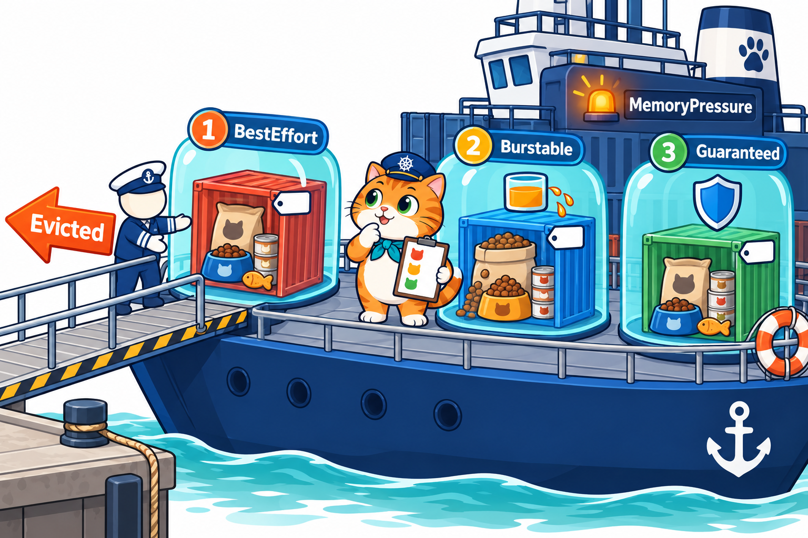<br>
  <em><b>รูปที่ 35</b> เมื่อเรือใกล้เต็ม (MemoryPressure) kubelet ไล่ Pod ออกตามลำดับ QoS: BestEffort ก่อน, Burstable ที่ใช้เกิน requests, Guaranteed หลังสุด</em>
</p>

ทบทวน QoS จากบทที่ 2

| QoS | เงื่อนไข |
|---|---|
| `Guaranteed` | ทุก container มี requests = limits ทั้ง cpu และ memory |
| `Burstable` | มี requests หรือ limits อย่างน้อยหนึ่งค่า แต่ไม่เข้าเงื่อนไข Guaranteed |
| `BestEffort` | ไม่มี requests/limits เลย |

**node-pressure eviction** คือการที่ **kubelet** ไล่ Pod ออกจากเรือเองเมื่อทรัพยากรบนเรือใกล้หมด ตามเกณฑ์ eviction threshold เช่น `memory.available<100Mi` (ค่าเริ่มต้นแบบ hard) เมื่อถึงเกณฑ์

1. condition `MemoryPressure` (หรือ `DiskPressure`, `PIDPressure`) เป็น `True` และระบบติด taint `node.kubernetes.io/memory-pressure:NoSchedule` กัน Pod ใหม่
2. kubelet เลือก Pod ที่จะไล่ตามลำดับ: (1) Pod ที่ **ใช้เกิน requests** ก่อน (2) priority ต่ำกว่าก่อน (3) ใช้เกิน requests มากกว่าก่อน ผลในทางปฏิบัติคือ BestEffort มักโดนก่อน ตามด้วย Burstable ที่ใช้เกิน ส่วน Guaranteed และ Pod ที่ใช้ไม่เกิน requests ถูกไล่หลังสุด
3. Pod ที่ถูกไล่มีสถานะ `Failed` reason `Evicted`

**ตารางที่ 13** การไล่ Pod แบบต่าง ๆ ในบทนี้

| ชนิด | ใครทำ | เหตุ | ผลต่อ Pod |
|---|---|---|---|
| OOMKilled (บทที่ 2) | kernel | container ใช้ memory เกิน **limits ของตัวเอง** | container ถูกฆ่าและ restart ใน Pod เดิม |
| node-pressure eviction | kubelet | **ทั้งเรือ** ทรัพยากรใกล้หมด | ทั้ง Pod ถูกไล่ (`Evicted`) |
| taint `NoExecute` | taint eviction controller | Pod ไม่มีบัตรผ่าน / หมดเวลา `tolerationSeconds` | Pod ถูกลบ |
| drain | ผู้ดูแล (`kubectl drain`) | ซ่อมบำรุงเรือ | Pod ถูกไล่ผ่าน Eviction API |
| preemption | scheduler | ต้องเปิดที่ให้ Pod priority สูงกว่า | Pod ถูกลบ (หัวข้อ 17) |

> บทนี้ **ไม่ทดลอง** node-pressure eviction ใน LAB เพราะต้องทำให้หน่วยความจำของเครื่องเกือบเต็ม ซึ่งจะทำให้ k8s-lab และเครื่องนักศึกษาทั้งเครื่องช้าหรือค้าง

---

## 17. Priority และ Preemption

<p align="center" id="fig-36">
  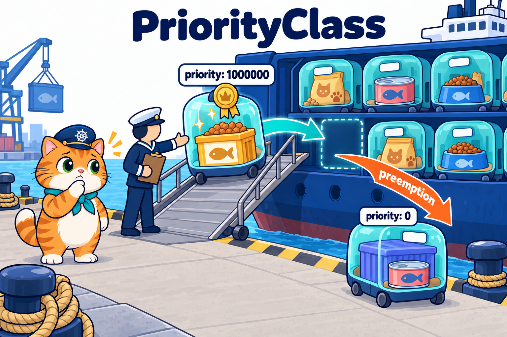<br>
  <em><b>รูปที่ 36</b> PriorityClass ให้ Pod สำคัญแซงคิวได้ เมื่อเรือเต็ม scheduler อาจไล่ Pod priority ต่ำออก (preemption) เพื่อเปิดที่ให้</em>
</p>

**PriorityClass** คือ object ระดับคลัสเตอร์ที่กำหนด "ความสำคัญ" เป็นตัวเลข Pod อ้างด้วย `priorityClassName`

```yaml
apiVersion: scheduling.k8s.io/v1
kind: PriorityClass
metadata:
  name: vip-order
value: 100000                        # ยิ่งมากยิ่งสำคัญ
globalDefault: false                 # true = ใช้กับ Pod ที่ไม่ระบุ priorityClassName (มีได้ class เดียว)
preemptionPolicy: PreemptLowerPriority   # หรือ Never = แซงคิวได้แต่ไม่ไล่ใคร
description: "ออเดอร์ด่วน VIP ของร้านน้องส้ม"
---
apiVersion: v1
kind: Pod
metadata:
  name: vip-order-pod
spec:
  priorityClassName: vip-order
  containers:
    - name: web
      image: nginx:1.27-alpine
```

ผลของ priority

1. **แซงคิว:** Pod priority สูงถูกหยิบไปจัดวางก่อน
2. **Preemption:** ถ้าไม่มี Node ใดรับได้ scheduler หา Node ที่ "ถ้าไล่ Pod priority ต่ำกว่าบางตัวออกแล้วจะวางได้" แล้วลบ Pod เหยื่อ (victim) เพื่อเปิดที่ ส่วน `preemption: ...` ท้ายข้อความ FailedScheduling คือผลการคิดเรื่องนี้ เช่น `Preemption is not helpful for scheduling` (ไล่ใครก็ไม่ช่วย) หรือ `No preemption victims found for incoming pod` (ไม่มี Pod ที่ไล่ได้)
3. class ระบบที่มีมาให้: `system-cluster-critical` และ `system-node-critical` (ค่าสูงมาก) สำหรับองค์ประกอบสำคัญ เช่น CoreDNS และ Pod บน control-plane

> **ใช้อย่างระวัง:** ถ้าทุกคนตั้ง priority สูงหมดก็ไม่มีความหมาย และ preemption อาจทำให้งานอื่นสะดุด บทนี้ **ไม่ทดลองใน LAB**

---

## 18. เลือกเครื่องมือจัดวางแบบไหนเมื่อไร

<p align="center" id="fig-37">
  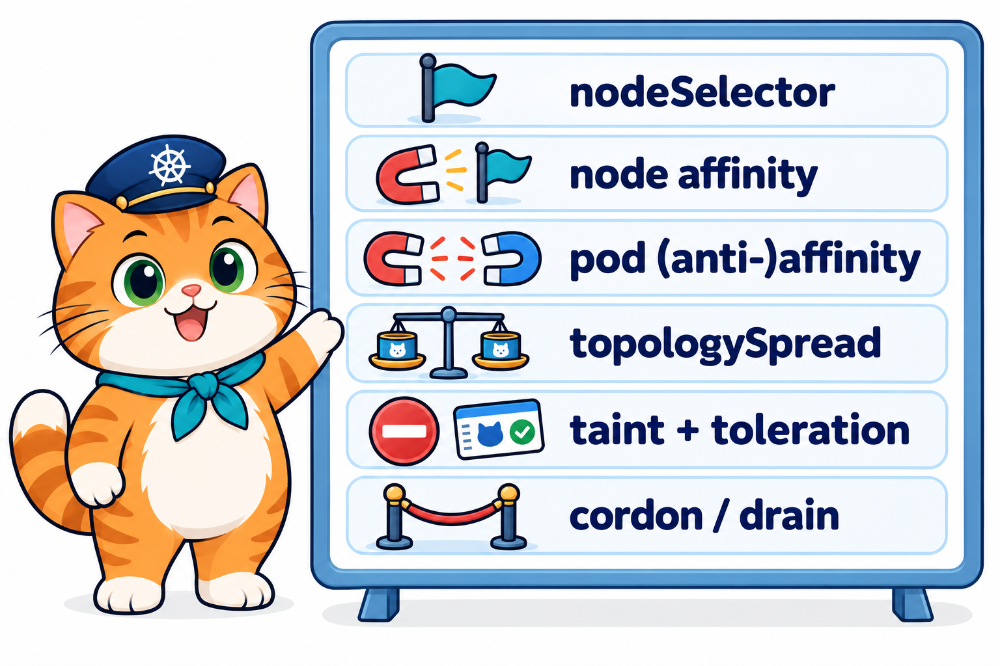<br>
  <em><b>รูปที่ 37</b> ตารางเลือกเครื่องมือจัดวาง: ต้องการเรือชนิดหนึ่ง ใช้ nodeSelector/node affinity, อยู่ใกล้/ห่าง Pod อื่น ใช้ pod (anti-)affinity, กระจาย ใช้ spread, กันเรือ ใช้ taint</em>
</p>

**ตารางที่ 14** สรุปเครื่องมือจัดวาง

| เป้าหมาย | เครื่องมือ | hard/soft | เขียนที่ | ตัวอย่างใน LAB |
|---|---|---|---|---|
| ระบุเรือเจาะจงเพื่อทดลอง | `nodeName` | ข้าม scheduler | Pod | `pinned-pod` |
| ต้องอยู่เรือชนิดหนึ่ง | `nodeSelector` / required node affinity | hard | Pod (+label บน Node) | `selector-pod`, `affinity-gt-pod`, สาขาร้าน `shop=open` |
| อยากอยู่เรือชนิดหนึ่ง | preferred node affinity | soft | Pod | `prefer-1..4` |
| อยู่ใกล้ Pod อื่น | podAffinity | hard/soft | Pod | `web-near-cache` |
| แยกห่างจาก Pod อื่น (1 ต่อโดเมน) | podAntiAffinity | hard/soft | Pod | `crew-1..3`, `deckhand-1..3`, สาขาร้านคนละเรือ |
| กระจายให้สมดุล | `topologySpreadConstraints` | hard (`DoNotSchedule`) / soft (`ScheduleAnyway`) | Pod | `spread-*`, `honor-*`, `cargo-*` |
| กันคนทั่วไปออกจากเรือ | taint + toleration (+ affinity ถ้าต้องการดึงเข้า) | hard (`NoSchedule`/`NoExecute`) / soft (`PreferNoSchedule`) | Node + Pod | `dedicated=vip`, `maintenance=true` |
| ซ่อมเรือ | `cordon` / `drain` / `uncordon` | – | Node | LAB 7, LAB 10 |
| ให้ Pod ทนเรือล่มได้นาน/สั้น | toleration `unreachable`/`not-ready` + `tolerationSeconds` | – | Pod | `fog-fast`, สาขาร้าน 60 วินาที |
| Pod ประจำเครื่องที่ kubelet ดูแล | static Pod | – | ไฟล์บน Node | `static-snack` |
| ให้งานสำคัญได้ที่ก่อน | PriorityClass | – | คลัสเตอร์ + Pod | (ไม่ทดลอง) |

**ลำดับการคิดเมื่อออกแบบ**

1. งานนี้ต้องการเรือแบบไหน → label + nodeSelector/affinity
2. มีเรือที่ต้องกันไว้ให้งานเฉพาะไหม → taint บน Node + toleration ในงานนั้น
3. สำเนาหลายตัวต้องแยกเรือไหม → anti-affinity (1 ต่อเรือ) หรือ spread (สมดุล)
4. ตรวจผลด้วย `kubectl get pod -o wide` และถ้า Pending ให้อ่าน `FailedScheduling`

---

## 19. ปูทางบทหน้า: Deployment และ Service

<p align="center" id="fig-38">
  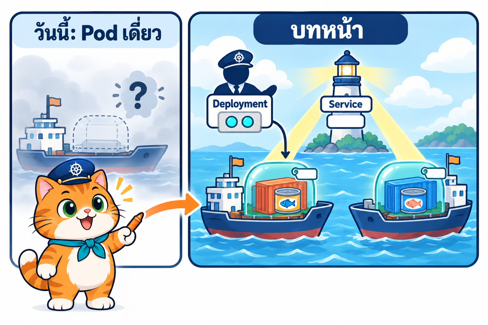<br>
  <em><b>รูปที่ 38</b> Pod เดี่ยวหายแล้วไม่มีใครสร้างใหม่ บทหน้าจะใช้ Deployment ดูแลจำนวน Pod และ Service เป็นที่อยู่คงที่ของทุกสาขา</em>
</p>

ใน LAB สุดท้ายของบทนี้ น้องส้มเปิด 2 สาขาบนเรือคนละลำได้สำเร็จ แต่จะเจอปัญหาต่อไปนี้ซึ่งบทถัดไปจะแก้

| ปัญหาที่เจอในบทนี้ | ทรัพยากรในบทถัดไป | แนวคิด |
|---|---|---|
| drain หรือเรือล่มแล้ว **สาขาหายไม่มีใครเปิดใหม่** | **Deployment** (ผ่าน ReplicaSet) | บอกว่า "ต้องการ 2 สาขา" controller คอยสร้าง Pod ใหม่บนเรือที่ยังดีให้เอง |
| ต้องก๊อปปี้ YAML เป็น `som-shop-a`, `som-shop-b`, `som-shop-c` | Pod template ใน Deployment | เขียน Pod ครั้งเดียว ใส่ affinity/anti-affinity/spread ที่เรียนวันนี้ไว้ใน template ได้เลย |
| ลูกค้าต้องจำ port ต่างกันของแต่ละสาขา (3001, 3002) และ port-forward หลุดเมื่อ Pod หาย | **Service** | ที่อยู่เดียวคงที่ กระจายลูกค้าไปทุกสาขาที่ Ready |
| ข้อมูลแต่ละสาขาแยกกันและหายเมื่อ Pod หาย (emptyDir) | ฐานข้อมูลกลาง + PersistentVolumeClaim / StatefulSet | เว็บหลายตัวใช้ฐานข้อมูลเดียวกัน และข้อมูลอยู่นานกว่า Pod |

ความรู้ในบทนี้ไม่สูญเปล่า เพราะ controller เหล่านั้น **ยังใช้ scheduler ตัวเดิม** ทุก Pod ที่ Deployment สร้างก็ผ่าน Filtering/Scoring และกฎ affinity, spread, taint/toleration ชุดเดียวกับที่เรียนวันนี้

---

## 20. สรุปและคำถามทบทวน

<p align="center" id="fig-39">
  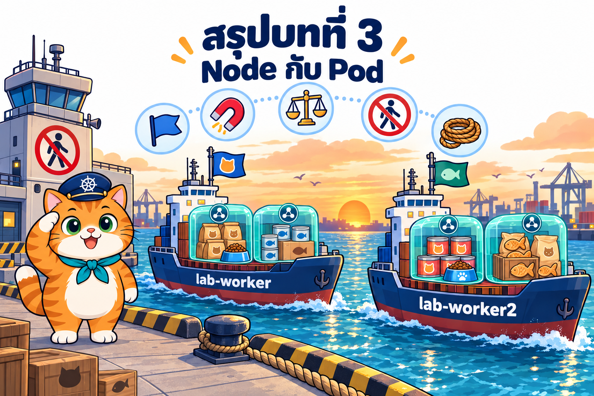<br>
  <em><b>รูปที่ 39</b> สรุปบท: scheduler เลือกเรือด้วย filter/score, เราช่วยกำหนดด้วย label, affinity, spread, taint และดูแลเรือด้วย cordon/drain</em>
</p>

### 20.1 สรุป

1. **Node** มี kubelet (ต้นเรือ), container runtime, kube-proxy และ CNI ใน kind แต่ละ Node คือ Docker container ใน k8s-lab ทุก Node เห็น CPU/RAM ของเครื่องเดียวกัน
2. **Node object** บอก labels, taints, capacity/allocatable, conditions และ heartbeat (Lease ต่ออายุทุก ~10 วินาที) อ่านครบได้จาก `kubectl describe node` โดยเฉพาะ `Allocated resources`
3. **kube-scheduler** เลือก Node ให้ Pod ที่ยังไม่มี `nodeName` ด้วย **Filtering → Scoring → Binding** ครั้งเดียว ไม่ย้ายภายหลัง ถ้าไม่มี Node ผ่าน filter Pod `Pending` และมี `FailedScheduling` ที่นับเหตุผลครบทุก Node
4. scheduler ใช้ **ผลรวม requests เทียบ allocatable** ไม่ใช้การใช้งานจริงและไม่ใช้ limits
5. `nodeName` ข้าม scheduler (ทดลองเท่านั้น) `nodeSelector` = ต้องตรงทุก label, node affinity เพิ่ม operator (`In`, `NotIn`, `Exists`, `DoesNotExist`, `Gt`, `Lt`) และแบบ required/preferred ทั้งหมดเป็น `IgnoredDuringExecution`
6. pod affinity/anti-affinity เลือกเรือจาก Pod ที่อยู่แล้ว โดย `topologyKey` นิยาม "ที่เดียวกัน" ส่วน topology spread คุมความต่างด้วย `maxSkew` และใน kind ต้องตั้ง `nodeTaintsPolicy: Honor` ไม่งั้น control-plane ถูกนับเป็นโดเมน
7. **taint** อยู่บน Node, **toleration** อยู่บน Pod `NoSchedule` กันของใหม่, `PreferNoSchedule` เลี่ยง, `NoExecute` ไล่ของเดิมด้วย และ **toleration ไม่ใช่แรงดึงดูด**
8. `cordon` กันของใหม่, `drain` = cordon + ไล่ (Pod เดี่ยวต้อง `--force` และหายถาวร), `uncordon` รับของใหม่แต่ของเก่าไม่กลับ
9. เรือล่ม → NotReady ~45–50 วินาที → taint `unreachable` → Pod ถูกไล่หลังอีก 300 วินาที (ค่าเริ่มต้น) → ค้าง Terminating จนเรือกลับ → **Pod เดี่ยวไม่ถูกสร้างใหม่**
10. static Pod ถูกสร้างจากไฟล์บนเรือโดย kubelet (control plane ของ kind ก็เป็น static Pod) และ Downward API ให้ Pod รู้ชื่อเรือ/IP ของตัวเอง

> **ข้อควรจำก่อนเข้า LAB**
> - คำสั่ง `docker stop/start lab-worker2`, `docker exec lab-worker ...`, `docker cp ... lab-worker:...` รัน **ใน SSH session ของ k8s-lab** ไม่ใช่เครื่องตัวเอง และ **ห้าม `docker stop lab-control-plane`**
> - ทุกครั้งที่ drain (แม้ error) ต้อง `uncordon` และทุกครั้งที่ติด label/taint ต้องลบคืนตอนเก็บกวาด
> - Pending ไม่ต้องตกใจ อ่าน `kubectl describe pod` ส่วน Events ก่อนเสมอ
> - ตำแหน่งที่ scheduler เลือก (lab-worker หรือ lab-worker2) อาจต่างจากเอกสาร ให้ดูจาก `kubectl get pod -o wide` ทุกครั้ง

### 20.2 คำถามทบทวน

**1. ใครเป็นผู้ "ตัดสินใจ" และใครเป็นผู้ "ลงมือ" เมื่อ Pod ใหม่ถูกวางบน Node และเราดูจากตรงไหนได้ว่าแต่ละขั้นเกิดขึ้นแล้ว**

<details>
<summary>แนวคำตอบ</summary>

kube-scheduler (บน control plane) เป็นผู้ตัดสินใจ โดยเลือก Node แล้วเขียน binding ทำให้ `spec.nodeName` ถูกเติม (Event `Scheduled` จาก `default-scheduler`) ส่วน kubelet บน Node นั้นเป็นผู้ลงมือสั่ง container runtime ดึง image และสร้าง container (Event `Pulled`, `Created`, `Started` จาก `kubelet`) ดูได้จาก `kubectl describe pod` ส่วน Events และคอลัมน์ `NODE` ของ `kubectl get pod -o wide`
</details>

**2. allocatable ต่างจาก capacity อย่างไร ทำไมใน kind สองค่านี้จึงเท่ากัน และทำไมคลัสเตอร์ kind 3 Node จึงไม่ได้มีทรัพยากรจริง 3 เท่า**

<details>
<summary>แนวคำตอบ</summary>

allocatable = capacity − kube-reserved − system-reserved − eviction-threshold คือส่วนที่ scheduler ยอมให้ Pod จอง ใน kind ไม่ได้ตั้ง reserved จึงเท่ากัน (ผลจริง cpu 32 ทั้งสองค่า) และเพราะทุก Node เป็น container บนเครื่องเดียวกัน แต่ละ Node จึงรายงาน CPU/RAM ของเครื่องจริงทั้งเครื่อง ทรัพยากรจริงมีชุดเดียวที่ทั้ง 3 Node ใช้ร่วมกัน
</details>

**3. อ่านข้อความนี้แล้วอธิบายว่าเกิดอะไรขึ้นกับแต่ละ Node:** `0/3 nodes are available: 1 node(s) had untolerated taint(s), 2 Insufficient memory. preemption: 0/3 nodes are available: 3 Preemption is not helpful for scheduling.`

<details>
<summary>แนวคำตอบ</summary>

ไม่มี Node ใดผ่าน filter: control-plane 1 ลำตกเพราะมี taint ที่ Pod ไม่มี toleration, worker 2 ลำตกเพราะ memory ที่เหลือ (allocatable − ผลรวม requests เดิม) ไม่พอ requests ของ Pod ส่วน preemption บอกว่าแม้ไล่ Pod อื่นออกก็ยังวางไม่ได้ (เพราะขอเกินทั้งเครื่อง) ทางแก้คือลด requests แล้วสร้าง Pod ใหม่
</details>

**4. Pod ที่ไม่ระบุ requests เลยจะถูก scheduler มองอย่างไร ข้อดีและข้อเสียคืออะไร**

<details>
<summary>แนวคำตอบ</summary>

นับ requests เป็น 0 จึงผ่าน `NodeResourcesFit` เสมอ (วางได้ง่าย) แต่เป็น QoS BestEffort ซึ่งไม่มีการรับประกันทรัพยากร และมักถูก kubelet ไล่เป็นกลุ่มแรกเมื่อเรือเกิด MemoryPressure นอกจากนี้ scheduler ก็ไม่รู้ว่าเรือเต็มจริงหรือยัง อาจทำให้ Node แน่นเกินไป
</details>

**5. ทำไม `pinned-pod` ที่ใส่ `nodeName: lab-control-plane` จึงรันบน control-plane ได้ทั้งที่ไม่มี toleration และทำไม `ghost-node-pod` ที่ใส่ `nodeName: lab-worker9` จึงไม่มี Event อะไรเลย**

<details>
<summary>แนวคำตอบ</summary>

taint `NoSchedule` ถูกบังคับใช้โดย scheduler แต่ Pod ที่มี nodeName ไม่ผ่าน scheduler เลย kubelet บน control-plane จึงรับไปรันตรง ๆ (Events ไม่มี `Scheduled`) ส่วน `lab-worker9` ไม่มีอยู่จริง ไม่มี scheduler มาเขียน FailedScheduling และไม่มี kubelet ชื่อนั้นมารับ Pod จึงค้าง Pending เงียบ ๆ จน PodGC ลบทิ้ง (~62 วินาทีในการทดลอง)
</details>

**6. เขียน node affinity ที่หมายความว่า "ต้องไปเรือที่ `disk=ssd` และ `deck` มากกว่า 3 หรือเรือที่มี label `vip` (ค่าอะไรก็ได้)"**

<details>
<summary>แนวคำตอบ</summary>

```yaml
affinity:
  nodeAffinity:
    requiredDuringSchedulingIgnoredDuringExecution:
      nodeSelectorTerms:
        - matchExpressions:        # term 1: AND
            - key: disk
              operator: In
              values: ["ssd"]
            - key: deck
              operator: Gt
              values: ["3"]
        - matchExpressions:        # term 2: OR กับ term 1
            - key: vip
              operator: Exists
```

หลาย `nodeSelectorTerms` เป็น OR หลาย `matchExpressions` ใน term เดียวเป็น AND และ `Gt` ต้องมีค่าเดียวเป็นตัวเลขในรูป string
</details>

**7. Pod ที่ใช้ nodeSelector `fleet: fast` รันอยู่บน `lab-worker2` แล้วผู้ดูแลลบ label `fleet` ออกจาก `lab-worker2` จะเกิดอะไรขึ้น เพราะอะไร**

<details>
<summary>แนวคำตอบ</summary>

Pod รันต่อที่เดิม (ผลจริงใน LAB 3) เพราะ nodeSelector และ node affinity แบบ `...IgnoredDuringExecution` ตรวจเฉพาะตอนจัดวาง แต่ถ้าลบ Pod แล้วสร้างใหม่ Pod ใหม่จะ Pending เพราะไม่มีเรือ `fleet=fast`
</details>

**8. ทำไม `crew-3` จึง Pending แต่ `deckhand-3` Running ทั้งที่ทั้งสองกลุ่มมี 3 Pod และมี worker 2 ลำเท่ากัน**

<details>
<summary>แนวคำตอบ</summary>

`crew-*` ใช้ **required** podAntiAffinity กับ `topologyKey: kubernetes.io/hostname` คือห้ามอยู่เรือเดียวกันเด็ดขาด worker 2 ลำรับได้ 2 ตัว ตัวที่ 3 ไม่มีที่ (control-plane ก็มี taint) จึง Pending ส่วน `deckhand-*` ใช้ **preferred** ซึ่งเป็นแค่คะแนน เมื่อไม่มีเรือว่างก็ยอมอยู่ซ้ำ จึง Running ครบแบบ 2 + 1
</details>

**9. ใน kind ทำไม Pod ตัวที่ 3 ของ topology spread (maxSkew 1, hostname, DoNotSchedule) จึง Pending ทั้งที่ worker ยังว่าง และแก้อย่างไร**

<details>
<summary>แนวคำตอบ</summary>

ค่าเริ่มต้น `nodeTaintsPolicy: Ignore` ทำให้ `lab-control-plane` (ที่มี taint) ถูกนับเป็นโดเมนที่มี 0 Pod เสมอ หลังวาง 1 + 1 บน worker ตัวที่ 3 จะทำให้ skew = 2 − 0 = 2 เกิน maxSkew จึง Pending แก้ด้วย `nodeTaintsPolicy: Honor` (ผลจริง 2 : 2) หรือใช้ node affinity เลือกเฉพาะ worker (ด้วย `nodeAffinityPolicy: Honor` ซึ่งเป็นค่าเริ่มต้น)
</details>

**10. ผู้ดูแลติด taint `gpu=true:NoSchedule` ให้ Node GPU และใส่ toleration ที่ตรงให้ Pod งาน AI แต่พบว่า Pod งาน AI บางตัวไปอยู่บน Node ธรรมดา เกิดจากอะไรและแก้อย่างไร**

<details>
<summary>แนวคำตอบ</summary>

toleration ไม่ใช่แรงดึงดูด มันแค่ทำให้ Node GPU ไม่ถูกตัดทิ้ง Pod จึงยังไปที่ Node ธรรมดาได้ตามคะแนน แก้โดยติด label ให้ Node GPU (เช่น `gpu=true`) แล้วใส่ nodeSelector หรือ required node affinity ใน Pod งาน AI ร่วมกับ toleration เดิม (taint + toleration + affinity)
</details>

**11. ติด taint `maintenance=true:NoExecute` บน Node ที่มี Pod 3 ตัว: A ไม่มี toleration, B มี toleration ตรงพร้อม `tolerationSeconds: 30`, C มี toleration ตรงไม่ระบุเวลา ผลของแต่ละตัวคืออะไร และ Pod เดี่ยวที่ถูกไล่จะไปเกิดใหม่ที่ไหน**

<details>
<summary>แนวคำตอบ</summary>

A ถูกไล่ทันที (ในการทดลอง < 1 วินาที), B อยู่ได้ประมาณ 30 วินาทีแล้วถูกไล่, C อยู่ต่อ (Event `TaintManagerEviction ... Marking for deletion Pod ...`) Pod เดี่ยวที่ถูกไล่จะถูกลบทิ้ง **ไม่ไปเกิดใหม่ที่ไหน** เพราะไม่มี controller ดูแล
</details>

**12. `kubectl cordon` กับ `kubectl drain` ต่างกันอย่างไร ทำไม drain ของ LAB 7 จึงต้องใช้ทั้ง `--ignore-daemonsets`, `--delete-emptydir-data` และ `--force`**

<details>
<summary>แนวคำตอบ</summary>

cordon แค่ทำเครื่องหมายว่าไม่รับ Pod ใหม่ (`SchedulingDisabled`) Pod เดิมอยู่ต่อ ส่วน drain = cordon + ไล่ Pod ทีละตัว ใน LAB 7 บนเรือมี Pod ระบบ `kindnet`/`kube-proxy` ที่ระบบดูแลให้ทุกเรือมีหนึ่งตัว (ต้อง `--ignore-daemonsets` เพื่อข้าม), มี `pantry` ที่ใช้ emptyDir (ข้อมูลจะหาย ต้อง `--delete-emptydir-data`) และมี Pod เดี่ยว `cargo-2`, `cargo-4` ที่ลบแล้วไม่มีใครสร้างคืน (ต้อง `--force`)
</details>

**13. เรือ `lab-worker2` ล่มด้วย `docker stop` จงเรียงเหตุการณ์ที่เกิดกับ Node และ Pod `fog-default` (ไม่ได้ตั้ง toleration เอง) พร้อมเวลาโดยประมาณ จนถึงหลัง `docker start`**

<details>
<summary>แนวคำตอบ</summary>

0 วินาที เรือหยุด (Node ยังแสดง Ready) → ~45–50 วินาที Node `NotReady` (Ready=Unknown, `Kubelet stopped posting node status.`) ระบบติด taint `node.kubernetes.io/unreachable:NoSchedule` และ `:NoExecute` Pod ยังแสดง `Running` แต่ Ready=False → ครบ 300 วินาทีหลัง NotReady (บัตรผ่านเริ่มต้นจาก DefaultTolerationSeconds) Pod ถูกไล่และค้าง `Terminating` (ผลจริง +345 วินาทีจาก stop) → `docker start` แล้ว ~2 วินาที Node Ready, ~5 วินาที Pod หายจริง, taint หายภายในไม่กี่วินาที → ไม่มี Pod ใหม่เกิดขึ้น
</details>

**14. ทำไม Pod บนเรือที่ล่มจึงค้าง `Terminating` แทนที่จะหายไปทันที และทำไม `kubectl exec`/`logs` จึงใช้ไม่ได้**

<details>
<summary>แนวคำตอบ</summary>

การลบ Pod แบบปกติต้องรอให้ kubelet ยืนยันว่า container หยุดแล้ว แต่ kubelet ติดต่อไม่ได้ ระบบไม่รู้ว่า container ยังรันอยู่หรือไม่ จึงคง object ไว้ในสถานะ Terminating จนกว่า kubelet จะกลับมายืนยัน ส่วน exec/logs/port-forward ต้องเชื่อมต่อผ่าน API server ไปที่ kubelet port 10250 บน Node ซึ่งติดต่อไม่ได้ จึงได้ error `dial tcp 172.19.0.2:10250: connect: no route to host`
</details>

**15. static Pod ต่างจาก Pod ทั่วไปอย่างไร ถ้าลบด้วย `kubectl delete pod static-snack-lab-worker` จะเกิดอะไรขึ้น และต้องลบอย่างไร**

<details>
<summary>แนวคำตอบ</summary>

static Pod ถูก kubelet สร้างจากไฟล์ใน `/etc/kubernetes/manifests` บน Node โดยไม่ผ่าน scheduler สิ่งที่ API server เห็นเป็นเพียง mirror pod ชื่อ `<ชื่อ>-<node>` เมื่อ kubectl delete จะลบได้แค่เงา (ในการทดลองค้าง Terminating ราว 1 นาที) แล้ว kubelet สร้าง mirror กลับมาใหม่ โดย container จริงไม่ถูกรีสตาร์ต การลบจริงต้องลบไฟล์บน Node เช่น `docker exec lab-worker rm /etc/kubernetes/manifests/static-snack.yaml`
</details>

**16. จงเขียน env ที่ทำให้ container มีตัวแปร `SHOP_NAME="ร้านอาหารแมวน้องส้ม สาขา <ชื่อ Node>"` และอธิบายว่าทำไมลำดับของ env จึงสำคัญ**

<details>
<summary>แนวคำตอบ</summary>

```yaml
env:
  - name: NODE_NAME
    valueFrom:
      fieldRef:
        fieldPath: spec.nodeName
  - name: SHOP_NAME
    value: "ร้านอาหารแมวน้องส้ม สาขา $(NODE_NAME)"
```

`$(VAR)` อ้างได้เฉพาะตัวแปรที่ประกาศ **ก่อนหน้า** ในลิสต์ ถ้าสลับลำดับ `SHOP_NAME` จะได้ข้อความ `$(NODE_NAME)` ตามตัวอักษรแทนชื่อ Node
</details>

**17. OOMKilled, node-pressure eviction และการไล่ด้วย taint `NoExecute` ต่างกันอย่างไร**

<details>
<summary>แนวคำตอบ</summary>

OOMKilled: kernel ฆ่า **container** ที่ใช้ memory เกิน limits ของตัวเอง แล้ว kubelet restart ใน Pod เดิม / node-pressure eviction: **kubelet** ไล่ทั้ง **Pod** เมื่อทรัพยากรของทั้งเรือใกล้หมด เลือกตามการใช้เกิน requests และ priority (BestEffort มักโดนก่อน) Pod เป็น `Failed`/`Evicted` / NoExecute: **taint eviction controller** ลบ Pod ที่ไม่มี toleration หรือหมด `tolerationSeconds` ไม่เกี่ยวกับการใช้ทรัพยากร
</details>

**18. ถ้าน้องส้มต้องการ (ก) สาขาร้านอยู่บนเรือที่ติดธง `shop=open` เท่านั้น (ข) สองสาขาห้ามอยู่เรือเดียวกัน (ค) ถ้าเรือล่มให้ยอมรอแค่ 60 วินาที ต้องใช้กลไกอะไรบ้าง**

<details>
<summary>แนวคำตอบ</summary>

(ก) required node affinity `shop In ["open"]` (+ `kubectl label node ... shop=open`) (ข) required podAntiAffinity เลือก label ของสาขา (`app: som-shop`, `part: branch`) กับ `topologyKey: kubernetes.io/hostname` (ค) toleration `node.kubernetes.io/unreachable` และ `node.kubernetes.io/not-ready` แบบ `NoExecute` พร้อม `tolerationSeconds: 60` ซึ่งเป็นสิ่งที่ LAB สุดท้ายใช้จริง
</details>

---

## 21. เอกสารอ้างอิง

1. The Kubernetes Authors. *Nodes*. https://kubernetes.io/docs/concepts/architecture/nodes/
2. The Kubernetes Authors. *Node Status*. https://kubernetes.io/docs/reference/node/node-status/
3. The Kubernetes Authors. *Kubernetes Scheduler*. https://kubernetes.io/docs/concepts/scheduling-eviction/kube-scheduler/
4. The Kubernetes Authors. *Scheduling Framework*. https://kubernetes.io/docs/concepts/scheduling-eviction/scheduling-framework/
5. The Kubernetes Authors. *Assigning Pods to Nodes* (nodeSelector, affinity, nodeName). https://kubernetes.io/docs/concepts/scheduling-eviction/assign-pod-node/
6. The Kubernetes Authors. *Pod Topology Spread Constraints*. https://kubernetes.io/docs/concepts/scheduling-eviction/topology-spread-constraints/
7. The Kubernetes Authors. *Taints and Tolerations*. https://kubernetes.io/docs/concepts/scheduling-eviction/taint-and-toleration/
8. The Kubernetes Authors. *Safely Drain a Node*. https://kubernetes.io/docs/tasks/administer-cluster/safely-drain-node/
9. The Kubernetes Authors. *Node-pressure Eviction*. https://kubernetes.io/docs/concepts/scheduling-eviction/node-pressure-eviction/
10. The Kubernetes Authors. *Pod Priority and Preemption*. https://kubernetes.io/docs/concepts/scheduling-eviction/pod-priority-preemption/
11. The Kubernetes Authors. *Create static Pods*. https://kubernetes.io/docs/tasks/configure-pod-container/static-pod/
12. The Kubernetes Authors. *Downward API*. https://kubernetes.io/docs/concepts/workloads/pods/downward-api/
13. The Kubernetes Authors. *Expose Pod Information to Containers Through Environment Variables*. https://kubernetes.io/docs/tasks/inject-data-application/environment-variable-expose-pod-information/
14. The Kubernetes Authors. *Well-Known Labels, Annotations and Taints*. https://kubernetes.io/docs/reference/labels-annotations-taints/
15. The Kubernetes Authors. *Resource Management for Pods and Containers*. https://kubernetes.io/docs/concepts/configuration/manage-resources-containers/
16. The Kubernetes Authors. *Pod Quality of Service Classes*. https://kubernetes.io/docs/concepts/workloads/pods/pod-qos/
17. The Kubernetes Authors. *Reserve Compute Resources for System Daemons* (allocatable). https://kubernetes.io/docs/tasks/administer-cluster/reserve-compute-resources/
18. The Kubernetes Authors. *Non-Graceful Node Shutdown* (taint out-of-service). https://kubernetes.io/docs/concepts/cluster-administration/node-shutdown/
19. The Kubernetes Authors. *kubectl drain / cordon / uncordon / taint / label* (kubectl reference). https://kubernetes.io/docs/reference/kubectl/generated/
20. kind — Kubernetes IN Docker. *Quick Start*. https://kind.sigs.k8s.io/docs/user/quick-start/

---

> **หมายเหตุเกี่ยวกับภาพประกอบ:** ภาพประกอบ 39 ภาพในโฟลเดอร์ [`images/`](images/) และภาพตัวละครน้องส้ม (`00-character-som.png`) สร้างขึ้นด้วยปัญญาประดิษฐ์สำหรับการสร้างภาพเพื่อใช้ประกอบการเรียนการสอน ชุดคำสั่งสร้างภาพอยู่ใน [`images/imagegen-prompts.md`](images/imagegen-prompts.md) ภาพใช้อุปมาเชิงเปรียบเทียบเพื่อช่วยความเข้าใจ ผู้เรียนควรใช้เนื้อหาในเอกสารนี้และเอกสารอ้างอิงเป็นหลัก ผลลัพธ์คำสั่งทั้งหมดมาจากการทดลองจริง (kind v0.33.0, Kubernetes v1.37.0) ค่าเวลา, IP และชื่อ Node ที่ Pod ถูกวางในเครื่องผู้เรียนอาจต่างกัน
