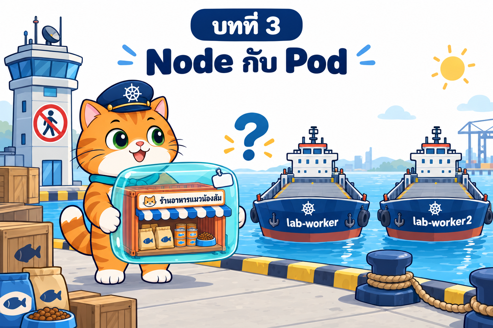

# บทที่ 3: Node กับ Pod — Pod ไปอยู่บนเรือลำไหน และเราควบคุมได้อย่างไร

> **รายวิชา:** Software Development Tools and Environments (DevTools)
> **หัวข้อ:** Kubernetes Node และการจัดวาง Pod — kube-scheduler, nodeSelector, affinity/anti-affinity, topology spread, taints/tolerations, cordon/drain, Node ล่ม, static Pod และ Downward API
> **ผลลัพธ์การเรียนรู้ที่เกี่ยวข้อง:** CLO-5, CLO-6

<p align="center">
  <br>
  <em>ร้านอาหารแมวน้องส้มจากบทที่ 2 ขายดีจนอยากเปิดหลายสาขา แต่กล่อง Pod แต่ละกล่องจะไปอยู่บนเรือลำไหน ใครเป็นคนเลือก</em>
</p>

## บทนี้เรียนอะไร

บทที่ 2 เราเปิดร้านอาหารแมวน้องส้มใน Pod เดียวได้แล้ว แต่ไม่เคยถามว่า **Pod ไปอยู่บน Node ไหน ใครเลือก และเลือกจากอะไร** บทนี้เปิดกล่องดำของ **kube-scheduler** และเครื่องมือที่เราใช้บอกทางการจัดวาง ได้แก่ ธงเรือ (node label), แม่เหล็ก (affinity/anti-affinity), ตาชั่ง (topology spread), ป้ายห้ามขึ้นกับบัตรผ่าน (taint/toleration) รวมถึงการดูแลเรือด้วย cordon/drain และสิ่งที่เกิดขึ้นเมื่อ **เรือล่ม** ปิดท้ายด้วยการเปิด **ร้านน้องส้ม 2 สาขาบนเรือคนละลำ** ที่ชื่อร้านบอกเองว่าอยู่บนเรือลำไหน

| ส่วน | เนื้อหา | ลิงก์ |
|---|---|---|
| 📖 **ทฤษฎี** | องค์ประกอบของ Node, Node object (labels, capacity/allocatable, conditions, heartbeat), Filtering/Scoring/Binding, requests เทียบ allocatable, nodeName, nodeSelector, node affinity, pod affinity/anti-affinity, topologySpreadConstraints, taints/tolerations, cordon/drain/uncordon, Node NotReady และ taint อัตโนมัติ, static Pod, Downward API, node-pressure eviction, priority/preemption (39 ภาพประกอบ + คำถามทบทวนพร้อมแนวคำตอบ) | [01_Theory/README.md](01_Theory/README.md) |
| 🧪 **ปฏิบัติการ** | LAB 0–10 จากง่ายไปยาก: สำรวจกองเรือ → Pending → nodeName/Downward API → nodeSelector/affinity → pod affinity → topology spread → taints → cordon/drain → เรือล่มด้วย `docker stop` → static Pod → **LAB สุดท้าย: ร้านน้องส้มหลายสาขาบนกองเรือ** พร้อม Troubleshooting, Checklist และตารางคืนสภาพคลัสเตอร์ | [02_LAB/README.md](02_LAB/README.md) |

## คำแนะนำในการเรียน

1. **อ่านทฤษฎีหัวข้อ 1–5 ก่อน** (Node, Node object, scheduler, requests) แล้วเริ่ม LAB 0–2 ได้
2. ก่อน LAB 3–6 อ่านหัวข้อ 6–11 (nodeName, nodeSelector, affinity, spread, taints) และก่อน LAB 7–10 อ่านหัวข้อ 12–15 (cordon/drain, Node ล่ม, static Pod, Downward API)
3. ทำ LAB **ตามลำดับ** และ **ทำบล็อก "เก็บกวาด" ทุกครั้ง** (ลบ label/taint, uncordon, `docker start lab-worker2`) ไม่งั้น LAB ถัดไปจะได้ผลเพี้ยน ใช้เวลารวมประมาณ 4–4.5 ชั่วโมง
4. สังเกตสัญลักษณ์ว่าคำสั่งรันที่ไหน: 🖥️ บนเครื่องนักศึกษา / 🐧 ใน SSH session ของ k8s-lab / 🌐 browser โดยเฉพาะ **`docker stop/start lab-worker2` และ `docker exec lab-worker ...` ต้องรันใน k8s-lab** และห้าม `docker stop lab-control-plane`
5. ผลลัพธ์ในเอกสารมาจากการทดลองจริง (Kubernetes v1.37.0) แต่ **เวลา, IP และ Node ที่ scheduler เลือกอาจต่างจากเครื่องของนักศึกษา**
6. ลองตอบคำถามทบทวนด้วยตัวเองก่อนเปิดดูแนวคำตอบ

> **ขอบเขตของบทนี้:** ยังใช้ **Pod เดี่ยว ๆ เท่านั้น** เพื่อให้เห็นการจัดวางชัดที่สุด และได้เห็นด้วยตาว่า Pod เดี่ยวที่ถูก drain หรืออยู่บนเรือที่ล่ม **ไม่มีใครสร้างคืน** การเปิดเว็บยังใช้ `kubectl port-forward` ร่วมกับ `ssh -L` ส่วนตัวช่วยดูแลจำนวน Pod และที่อยู่คงที่ของร้านเป็น **เนื้อหาของบทถัดไป**

## สิ่งที่ต้องผ่านก่อน

- [บทที่ 1: Kubernetes และสถาปัตยกรรม](../001_kubernetes-introduction/01_Theory/README.md) และ [LAB บทที่ 1](../001_kubernetes-introduction/02_LAB/readme.md): เข้าใจบทบาทของ Control Plane, Worker Node, kubelet, kube-scheduler และมี container **`k8s-lab`** ที่ล็อกอินได้ด้วย `ssh -p 2223 root@localhost` (รหัส `passwd` ใช้เพื่อการเรียนเท่านั้น)
- [บทที่ 2: Kubernetes Pod](../002_kubernetes_pod/01_Theory/README.md) และ [LAB บทที่ 2](../002_kubernetes_pod/02_LAB/README.md): เขียน Pod YAML ได้ เข้าใจ labels, resources (requests/limits), probes, init container/sidecar, emptyDir และเคยเปิดร้านน้องส้มด้วย port-forward + `ssh -L`
- คลัสเตอร์ kind `lab` จากบทที่ 2 **ใช้ต่อได้** ถ้ายังไม่มี (หรือเพิ่ง restart `k8s-lab`) LAB 0 จะสร้างใหม่ด้วย `k8s-up`
- เครื่องต่ออินเทอร์เน็ตได้ (ดึง image `nginx`, `busybox`, `postgres`) และมีพื้นที่ดิสก์ว่างสำหรับ image ราว 1–2 GB

## โครงสร้างโฟลเดอร์

```text
003_kubernetes_node_pod/
├── README.md                         ← หน้านี้
├── 01_Theory/
│   ├── README.md                     ← เอกสารทฤษฎี
│   └── images/                       ← ภาพประกอบ 00–39 (+ imagegen-prompts.md)
└── 02_LAB/
    ├── README.md                     ← คู่มือ LAB 0–10
    ├── images/                       ← ภาพประกอบ LAB 01–22 (+ imagegen-prompts.md) และ screenshots/ ภาพหน้าจอจริงของร้าน 2 สาขา
    ├── labs/                         ← YAML ของ LAB 1–9
    │   ├── lab01-scheduler/
    │   ├── lab02-nodename-downward/
    │   ├── lab03-node-labels/
    │   ├── lab04-pod-affinity/
    │   ├── lab05-topology-spread/
    │   ├── lab06-taints/
    │   ├── lab07-drain/
    │   ├── lab08-node-down/
    │   └── lab09-static-pod/
    └── som-shop-branches/            ← LAB 10 ร้านน้องส้มหลายสาขา
        ├── app/                      ← แอป Next.js + Dockerfile (สำเนาจากบทที่ 2 ไม่ได้แก้โค้ด)
        └── k8s/                      ← som-shop-a.yaml, som-shop-b.yaml, som-shop-c.yaml
```

ใน LAB 0 จะคัดลอกโฟลเดอร์ทั้งหมดนี้เข้า container ด้วย 🖥️ `docker cp 003_kubernetes_node_pod k8s-lab:/workspace/` แล้วทำงานที่ `/workspace/003_kubernetes_node_pod/02_LAB` ภายใน k8s-lab (แอปและ manifest ของ LAB 10 อยู่ที่ `/workspace/003_kubernetes_node_pod/02_LAB/som-shop-branches/`)

## เริ่มเลย

👉 [อ่านทฤษฎี](01_Theory/README.md) → [ลงมือทำ LAB](02_LAB/README.md)
