# Namespace: แบ่งโซนบนท่าเรือเดียวกัน

> **รายวิชา:** Software Development Tools and Environments (DevTools)
> **หัวข้อ:** Kubernetes Namespace และนโยบายระดับ namespace — namespace เริ่มต้น, namespaced/cluster-scoped resources, kubeconfig/context, label ของ namespace, การลบ namespace และ finalizers, DNS, NetworkPolicy, ResourceQuota, LimitRange, RBAC (ServiceAccount, Role, RoleBinding) และ Pod Security Admission
> **ผลลัพธ์การเรียนรู้ที่เกี่ยวข้อง:** CLO-5, CLO-6
> **บทก่อนหน้า:** [บทที่ 3 Node กับ Pod](../../003_kubernetes_node_pod/01_Theory/README.md) · **LAB ของบทนี้:** [02_LAB](../02_LAB/README.md)

---

## บทคัดย่อ

ตั้งแต่บทที่ 1 ถึงบทที่ 3 เราสร้าง Pod ทุกตัวลงใน namespace ชื่อ `default` โดยไม่รู้ตัว ซึ่งไม่มีปัญหาเมื่อมีคนใช้คลัสเตอร์คนเดียว แต่ร้านอาหารแมวน้องส้มโตขึ้นจนมีทีมทดลองของใหม่ ทีมทดสอบ และร้านจริงที่ลูกค้าใช้ ทุกทีมวางกล่องไว้บนท่าเรือเดียวกัน ชื่อชนกัน ใครจะลบของใครก็ได้ และทีมหนึ่งใช้ทรัพยากรจนอีกทีมช้า บทนี้แก้ปัญหานั้นด้วย **Namespace** ซึ่งเปรียบเหมือน **โซนทาสีบนแผนผังท่าเรือ**

เนื้อหาเริ่มจากนิยามและข้อเข้าใจผิดที่พบบ่อย (namespace **ไม่ใช่** Node และไม่ได้แยกเครือข่ายให้เอง) ต่อด้วย namespace ตั้งต้น 5 ตัวของ kind, การแยก **namespaced** กับ **cluster-scoped** resources, การสร้างและเลือก namespace ด้วย `metadata.namespace`, `-n`, `-A` และ **context** ใน kubeconfig, label ของ namespace และการลบ namespace ทั้งก้อนพร้อมกลไก **finalizers** จากนั้นเป็นเครื่องมือที่ทำให้แต่ละโซนมีกติกาของตัวเอง ได้แก่ **NetworkPolicy** (รั้วและประตู), **ResourceQuota** (ใบงบ), **LimitRange** (ป้ายกฎขนาดกล่อง), **RBAC** (บัตรพนักงานเฉพาะโซน) และ **Pod Security Admission** (ด่านตรวจหน้าโซน) ปิดท้ายด้วยแนวปฏิบัติในการแบ่งและตั้งชื่อ namespace

ผลลัพธ์คำสั่งและข้อความ error ที่ยกมาในเอกสารนี้มาจากการทดลองจริงบนคลัสเตอร์ kind (kind v0.33.0, Kubernetes v1.37.0) ใน LAB ประจำบทเมื่อ 4 ตุลาคม 2569 **เวลา, AGE, IP และ Node ที่ Pod ถูกวางในเครื่องผู้เรียนอาจต่างจากตัวอย่าง**

## วัตถุประสงค์การเรียนรู้

เมื่อศึกษาเอกสารนี้จบ ผู้เรียนควรสามารถ

1. อธิบายว่า namespace คืออะไร เป็นขอบเขตของ "ชื่อ" และหน่วยที่ใช้แนบนโยบาย และบอกได้ว่าทำไม namespace จึง **ไม่ใช่** Node, VM หรือกำแพงเครือข่าย
2. บอกหน้าที่ของ namespace ตั้งต้น `default`, `kube-system`, `kube-public`, `kube-node-lease` และ `local-path-storage` ของ kind ได้
3. แยก resource แบบ namespaced กับ cluster-scoped ด้วย `kubectl api-resources` และอธิบายผลของ `-n` กับ resource แต่ละแบบได้
4. สร้าง ดู และลบ namespace ได้ทั้งแบบคำสั่งและแบบ YAML และเลือกใช้ `metadata.namespace`, `-n`, `-A` ได้ถูกต้อง รวมถึงอธิบาย error เมื่อทั้งสองค่าไม่ตรงกัน
5. อ่านโครงสร้าง kubeconfig (clusters, users, contexts) และเปลี่ยน namespace เริ่มต้นของ context ได้อย่างปลอดภัย
6. อธิบายสิ่งที่เกิดขึ้นเมื่อลบ namespace (Terminating, finalizers, ลบทุกอย่างข้างใน) และ namespace ใดที่ระบบป้องกันการลบ
7. เขียน NetworkPolicy แบบ allow-same-namespace และแบบเปิดให้ namespace ที่มี label ตรงด้วย `namespaceSelector` ได้
8. ใช้ ResourceQuota และ LimitRange ร่วมกัน อ่าน Used/Hard และข้อความ `must specify`, `exceeded quota`, `maximum cpu usage per Container` ได้
9. สร้าง ServiceAccount, Role, RoleBinding (รวมถึง ClusterRole + RoleBinding) ตรวจสิทธิ์ด้วย `kubectl auth can-i --as` และใช้ token ของ ServiceAccount ผ่าน context ใหม่ได้ พร้อมอธิบายกับดัก `kubectl --token`
10. ตั้ง Pod Security Admission ด้วย label ของ namespace (enforce/warn/audit) และแก้ Pod ให้ผ่านระดับ `restricted` ด้วย `securityContext` ได้

## สารบัญ

1. [บทนำ: ท่าเรือที่ทุกทีมวางของปนกัน](#1-บทนำ-ท่าเรือที่ทุกทีมวางของปนกัน)
2. [Namespace คืออะไร](#2-namespace-คืออะไร)
3. [Namespace เริ่มต้นและสิ่งที่อยู่ข้างใน](#3-namespace-เริ่มต้นและสิ่งที่อยู่ข้างใน)
4. [Namespaced vs cluster-scoped resources](#4-namespaced-vs-cluster-scoped-resources)
5. [สร้างและใช้ namespace](#5-สร้างและใช้-namespace)
6. [kubeconfig, context และ namespace เริ่มต้น](#6-kubeconfig-context-และ-namespace-เริ่มต้น)
7. [Label ของ namespace](#7-label-ของ-namespace)
8. [การลบ namespace](#8-การลบ-namespace)
9. [Namespace ไม่ได้แยก network และ node](#9-namespace-ไม่ได้แยก-network-และ-node)
10. [NetworkPolicy: รั้วและประตูระหว่างโซน](#10-networkpolicy-รั้วและประตูระหว่างโซน)
11. [ResourceQuota: งบประมาณของโซน](#11-resourcequota-งบประมาณของโซน)
12. [LimitRange: กฎขนาดกล่องมาตรฐาน](#12-limitrange-กฎขนาดกล่องมาตรฐาน)
13. [RBAC แบบ namespace: บัตรพนักงานเฉพาะโซน](#13-rbac-แบบ-namespace-บัตรพนักงานเฉพาะโซน)
14. [Pod Security Admission: ด่านตรวจหน้าโซน](#14-pod-security-admission-ด่านตรวจหน้าโซน)
15. [แนวปฏิบัติการตั้งชื่อและแบ่ง namespace](#15-แนวปฏิบัติการตั้งชื่อและแบ่ง-namespace)
16. [สรุปและคำถามทบทวน](#16-สรุปและคำถามทบทวน)
17. [เอกสารอ้างอิง](#17-เอกสารอ้างอิง)

### สารบัญรูปภาพ

| รูปที่ | เรื่อง | รูปที่ | เรื่อง |
|:---:|---|:---:|---|
| 1 | [ท่าเรือที่ทุกทีมวางของปนกัน](#fig-1) | 20 | [Pod ต่าง namespace คุยกันได้](#fig-20) |
| 2 | [แผนผังอุปมาใหม่ของบทนี้](#fig-2) | 21 | [search domain ของ resolv.conf](#fig-21) |
| 3 | [Namespace คือโซนทาสีบนแผนผังท่าเรือ](#fig-3) | 22 | [NetworkPolicy รั้วรอบโซน](#fig-22) |
| 4 | [Namespace ไม่ใช่เรือ](#fig-4) | 23 | [เปิดประตูด้วย namespaceSelector](#fig-23) |
| 5 | [ทำไมต้องมี Namespace](#fig-5) | 24 | [ResourceQuota ใบงบของโซน](#fig-24) |
| 6 | [namespace ตั้งต้น 5 โซนของ kind](#fig-6) | 25 | [quota นับจำนวน Pod](#fig-25) |
| 7 | [kube-system โซนพนักงานของท่าเรือ](#fig-7) | 26 | [Pod ไม่ระบุขนาดถูกปฏิเสธ](#fig-26) |
| 8 | [kube-public และ kube-node-lease](#fig-8) | 27 | [LimitRange ป้ายกฎขนาดกล่อง](#fig-27) |
| 9 | [ของประจำโซนกับของส่วนกลาง](#fig-9) | 28 | [ResourceQuota เทียบ LimitRange](#fig-28) |
| 10 | [api-resources แบ่งสองกลุ่ม](#fig-10) | 29 | [User และ ServiceAccount](#fig-29) |
| 11 | [สร้าง namespace สองแบบ](#fig-11) | 30 | [Role และ RoleBinding](#fig-30) |
| 12 | [metadata.namespace เทียบกับ -n](#fig-12) | 31 | [ClusterRole ใช้ในโซนเดียวหรือทั้งท่า](#fig-31) |
| 13 | [ชื่อซ้ำได้ข้าม namespace](#fig-13) | 32 | [auth can-i เครื่องอ่านบัตร](#fig-32) |
| 14 | [-n ส่องทีละโซน -A ส่องทั้งท่า](#fig-14) | 33 | [token ของ ServiceAccount กับ context ใหม่](#fig-33) |
| 15 | [kubeconfig เหมือนกระเป๋าบัตร](#fig-15) | 34 | [Pod Security Standards 3 ระดับ](#fig-34) |
| 16 | [set-context เปลี่ยนโซนเริ่มต้น](#fig-16) | 35 | [โหมด enforce warn audit](#fig-35) |
| 17 | [label ของ namespace](#fig-17) | 36 | [เช็กลิสต์ผ่าน restricted](#fig-36) |
| 18 | [ลบ namespace ลบทุกอย่างข้างใน](#fig-18) | 37 | [แนวปฏิบัติการแบ่ง namespace](#fig-37) |
| 19 | [finalizers เช็กลิสต์ก่อนปลดป้ายโซน](#fig-19) | 38 | [สรุปบทที่ 4](#fig-38) |

---

## 1. บทนำ: ท่าเรือที่ทุกทีมวางของปนกัน

<p align="center">
  <br>
  <em>น้องส้ม ผู้ช่วยกัปตันท่าเรือ Kubernetes ตัวละครหลักของบทนี้</em>
</p>

<p align="center" id="fig-1">
  <br>
  <em><b>รูปที่ 1</b> ร้านน้องส้มโตขึ้น มีทั้งทีมทดลองของใหม่ ทีมทดสอบ และร้านจริง ทุกคนวางกล่องปนกันบนท่าเรือเดียว ชื่อชนกันและใครจะลบของใครก็ได้</em>
</p>

ร้านอาหารแมวน้องส้มจากบทที่ 2 เปิดหลายสาขาบนกองเรือได้แล้วในบทที่ 3 ตอนนี้ทีมใหญ่ขึ้นอีก มี **ทีมพัฒนา** ที่ทดลองของใหม่ทุกวัน **ทีมทดสอบ** ที่ตรวจก่อนขึ้นระบบจริง และ **ร้านจริง** ที่ลูกค้าใช้ ทุกทีมใช้คลัสเตอร์ (ท่าเรือ) เดียวกัน และทุกคนสร้าง Pod ลงที่เดียวกันคือ `default` ปัญหาจึงตามมาทันที

- **ชื่อชนกัน** ทีม dev อยากสร้าง Pod ชื่อ `som-shop` เพื่อทดลอง แต่ชื่อนี้ถูกร้านจริงใช้อยู่แล้ว ต้องตั้งชื่อแปลก ๆ อย่าง `som-shop-dev-test2` ไปเรื่อย ๆ
- **ใครลบของใครก็ได้** ทุกคนมีสิทธิ์เท่ากันทั้งท่าเรือ เด็กฝึกงานสั่ง `kubectl delete pod som-shop` ผิดตัวเดียว ร้านจริงก็ปิด
- **แย่งทรัพยากร** ทีม dev เปิด Pod ทดลองกินหน่วยความจำจนร้านจริงช้า เพราะไม่มีใครกำหนดงบของแต่ละทีม
- **ความปลอดภัยไม่เท่ากัน** ร้านจริงควรตรวจเข้ม (ห้ามรันเป็น root) แต่ทีม dev อยากทดลองอิสระ เมื่ออยู่ที่เดียวกันจึงตั้งกฎแยกไม่ได้
- **เก็บกวาดยาก** จะลบของทั้งหมดของทีม dev ต้องไล่หาทีละชิ้นจาก label ที่ไม่แน่ใจว่าทุกคนติดครบ

ทบทวนสิ่งที่รู้จากบทก่อน

1. **คลัสเตอร์** คือท่าเรือทั้งท่า มี **Control Plane** เป็นหอบังคับการ และ **Node** เป็นเรือสินค้า (`lab-worker`, `lab-worker2`)
2. **Pod** คือกล่องห้องโดยสารใสที่ห่อตู้สินค้า (container) อยู่บนเรือลำเดียวเสมอ
3. ทุกคำสั่ง `kubectl` ที่ไม่ระบุอะไรเพิ่ม ทำงานกับ namespace `default` ทั้งหมด (ข้อความ `No resources found in default namespace.` ที่เห็นบ่อยในบทก่อนบอกเราอยู่แล้ว)

น้องส้มจึงตัดสินใจ **ทาสีแบ่งโซน** บนแผนผังท่าเรือ ให้แต่ละโซนมีชื่อของตัวเอง มีงบประมาณ มีกฎขนาดกล่อง มีบัตรพนักงานเฉพาะโซน มีด่านตรวจความปลอดภัย และมีรั้วระหว่างโซน แล้วปิดท้ายด้วยการแยกร้านเป็น `som-dev`, `som-staging`, `som-prod` ในคลัสเตอร์เดียว (LAB สุดท้าย)

<p align="center" id="fig-2">
  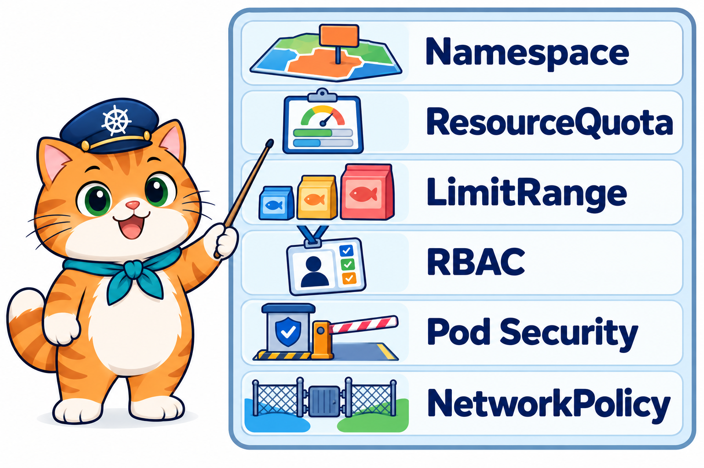<br>
  <em><b>รูปที่ 2</b> แผนผังอุปมาใหม่ของบทนี้: โซนทาสี = Namespace, ใบงบ = ResourceQuota, ป้ายขนาดกล่อง = LimitRange, บัตรพนักงาน = RBAC, ด่านตรวจ = Pod Security, รั้วประตู = NetworkPolicy</em>
</p>

**ตารางที่ 1** อุปมาท่าเรือที่ใช้ในบทนี้ (ต่อจากบทที่ 1–3)

| Kubernetes | อุปมาท่าเรือ | ใหม่ในบทนี้ |
|---|---|:---:|
| container | ตู้สินค้า | |
| Pod | กล่องห้องโดยสารใสสี teal ห่อตู้ มีป้าย IP 1 ป้าย | |
| Node | เรือสินค้า (`lab-worker`, `lab-worker2`) | |
| Control Plane | หอบังคับการบนท่า (`lab-control-plane`) | |
| คลัสเตอร์ | ท่าเรือทั้งท่า | |
| **Namespace** | **โซนทาสีบนแผนผังท่าเรือ มีป้ายชื่อโซน** เป็นการแบ่งทางทะเบียน ไม่ใช่เรือและไม่ใช่ที่ดินจริง กล่องของโซนเดียวกันอยู่บนเรือหลายลำได้ (วาดเป็นริบบิ้นสีประจำโซนคล้องกล่อง) | ✓ |
| ชื่อเต็ม `namespace/name` | ที่อยู่แบบ "โซน + ชื่อกล่อง" (กล่องชื่อ `snack` มีได้ในหลายโซน) | ✓ |
| namespaced resource | ของประจำโซน (กล่อง Pod, บัตรพนักงาน, ใบโควตา) | ✓ |
| cluster-scoped resource | ของส่วนกลางของท่าเรือ (เรือ, ป้ายโซนเอง, โกดังกลาง = PersistentVolume/StorageClass, ธง VIP = PriorityClass) | ✓ |
| kubeconfig / context | กระเป๋าบัตร: บัตรท่าเรือ (cluster) + บัตรประจำตัว (user) + โซนที่ไปบ่อย (namespace) | ✓ |
| `-n` / `-A` | ไฟฉายส่องโซนเดียว / สปอตไลต์ส่องทั้งท่า | ✓ |
| ResourceQuota | ใบงบประมาณของโซน (มีมาตรวัดใช้ไป/เพดาน) | ✓ |
| LimitRange | ป้ายกฎขนาดกล่องมาตรฐานของโซน (ไม่ระบุขนาด → ติดสติกเกอร์ขนาดมาตรฐานให้) | ✓ |
| User / ServiceAccount | บัตรพนักงานของคน / บัตรของหุ่นยนต์พนักงานอัตโนมัติ | ✓ |
| Role / RoleBinding | การ์ดสิทธิ์ (ทำอะไรได้กับอะไร) / สายคล้องที่ผูกบัตรกับการ์ด ใช้ได้เฉพาะโซนนั้น | ✓ |
| ClusterRole / ClusterRoleBinding | สมุดกฎสิทธิ์มาตรฐานของท่าเรือ / ผูกทั้งท่า | ✓ |
| `kubectl auth can-i` | เครื่องอ่านบัตร ตอบไฟเขียว yes / ไฟแดง no | ✓ |
| Pod Security Admission | ด่านตรวจหน้าโซน 3 ระดับ (privileged/baseline/restricted) 3 โหมด (enforce = ไม้กั้น, warn = กระดิ่ง, audit = สมุดบันทึก) | ✓ |
| NetworkPolicy | รั้วและประตูระหว่างโซน (ประตูเปิดให้เฉพาะโซนที่มีป้ายตรง) | ✓ |
| finalizers | เช็กลิสต์ที่ต้องเคลียร์ครบก่อนปลดป้ายโซน (ค้าง = Terminating) | ✓ |

---

## 2. Namespace คืออะไร

### 2.1 นิยาม

<p align="center" id="fig-3">
  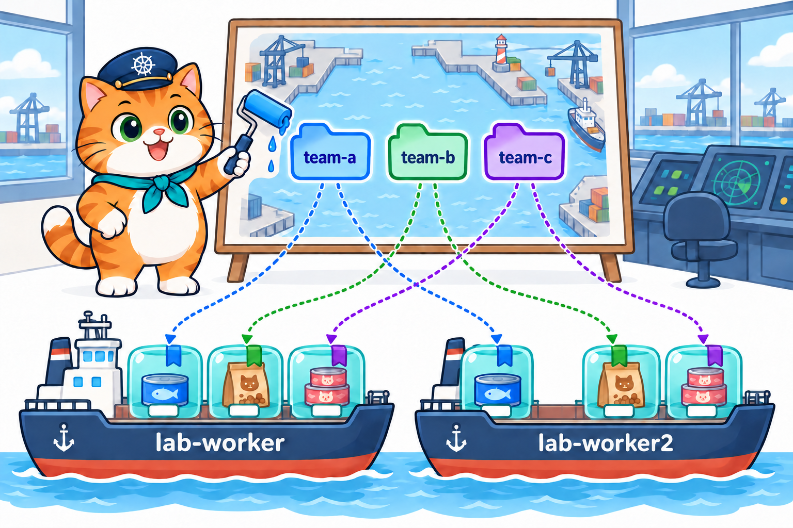<br>
  <em><b>รูปที่ 3</b> Namespace คือโซนทาสีบนแผนผังท่าเรือ กล่องทุกใบคล้องริบบิ้นสีของโซนตัวเอง ทั้งที่อยู่บนเรือคนละลำ</em>
</p>

**Namespace** คือกลไกแบ่งกลุ่ม resource ภายใน **คลัสเตอร์เดียว** ออกเป็นส่วน ๆ มีบทบาทหลัก 2 อย่าง

1. **ขอบเขตของชื่อ (scope of names)** ชื่อของ object ต้องไม่ซ้ำกันเฉพาะภายใน namespace เดียวกัน ข้าม namespace ใช้ชื่อซ้ำได้ ชื่อเต็มของ object จึงเป็น `<namespace>/<name>` เช่น `blue/snack` กับ `green/snack` คือ Pod คนละตัว
2. **หน่วยที่ใช้แนบนโยบาย** เครื่องมือหลายตัวของ Kubernetes ทำงาน "ต่อ namespace" ได้แก่ ResourceQuota, LimitRange, RBAC (Role/RoleBinding), Pod Security Admission และ NetworkPolicy ทำให้แต่ละโซนมีงบ สิทธิ์ และกฎความปลอดภัยของตัวเองได้

Namespace เองก็เป็น object ตัวหนึ่ง (`apiVersion: v1`, `kind: Namespace`) เขียนเป็น YAML ได้ เช่นไฟล์ `labs/lab01-create-ns/ns-blue.yaml` ใน LAB 1

```yaml
apiVersion: v1
kind: Namespace
metadata:
  name: blue          # ชื่อโซน
  labels:
    lab: "04"         # label ของ namespace เอง (ไว้ค้นด้วย -l)
```

ในแผนผังท่าเรือ ให้นึกถึง **แฟ้มสีประจำโซน** ในหอบังคับการ กล่อง Pod ทุกใบมีริบบิ้นสีบอกว่าเป็นของโซนไหน แต่ตัวกล่องจริงจะอยู่บนเรือลำไหนก็ได้

### 2.2 Namespace ไม่ใช่เครื่อง ไม่ใช่ Node และไม่ใช่ VM

<p align="center" id="fig-4">
  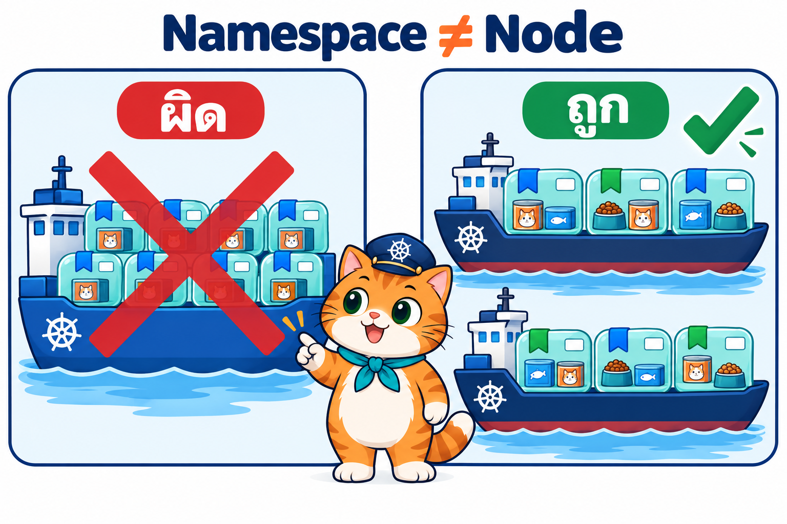<br>
  <em><b>รูปที่ 4</b> ความเข้าใจผิดที่พบบ่อย: Namespace ไม่ใช่เรือหรือเครื่อง Pod ของโซนเดียวกันกระจายอยู่หลายเรือได้ และเรือหนึ่งลำรับกล่องได้จากหลายโซน</em>
</p>

ความเข้าใจผิดที่พบบ่อยที่สุดคือคิดว่า namespace เป็น "เครื่องแยก" หรือ "พื้นที่จริง" ที่ Pod ถูกขังไว้ ความจริงคือ

- **Pod ใน namespace เดียวกันกระจายอยู่หลาย Node ได้** scheduler เลือกเรือให้ Pod โดยไม่สนใจว่า Pod อยู่ namespace ไหน (เว้นแต่เราจะเขียนกฎ affinity เอง)
- **Node เดียวรับ Pod จากหลาย namespace ได้** Node เป็นของส่วนกลาง (cluster-scoped) ไม่ได้เป็นของ namespace ใด

ผลจริงจาก LAB 1: Pod `snack` 3 ตัวใน 3 namespace อยู่บนเรือ 2 ลำปนกัน

```text
NAMESPACE   NAME    READY   STATUS    RESTARTS   AGE   IP           NODE          NOMINATED NODE   READINESS GATES
blue        snack   1/1     Running   0          7s    10.244.2.2   lab-worker    <none>           <none>
default     snack   1/1     Running   0          6s    10.244.2.3   lab-worker    <none>           <none>
green       snack   1/1     Running   0          6s    10.244.1.2   lab-worker2   <none>           <none>
```

และผลจริงจาก LAB 4: Pod ของ `team-a` และ `team-b` อยู่บน `lab-worker` ลำเดียวกันทั้งหมด

```text
NAMESPACE   NAME     READY   STATUS    RESTARTS   AGE   IP           NODE         NOMINATED NODE   READINESS GATES
team-a      client   1/1     Running   0          8s    10.244.2.7   lab-worker   <none>           <none>
team-a      web      1/1     Running   0          8s    10.244.2.6   lab-worker   <none>           <none>
team-b      client   1/1     Running   0          8s    10.244.2.8   lab-worker   <none>           <none>
```

> **สรุปสั้น ๆ:** namespace แบ่ง **ทะเบียน** (ชื่อ สิทธิ์ งบ กฎ) ไม่ได้แบ่ง **ฮาร์ดแวร์** หรือ **เครือข่าย** ถ้าต้องการให้แต่ละโซนอยู่คนละเรือ ต้องใช้ nodeSelector/affinity/taint จากบทที่ 3 เพิ่มเอง และถ้าต้องการกั้นเครือข่าย ต้องใช้ NetworkPolicy (หัวข้อ 10)

### 2.3 ทำไมต้องมี Namespace

<p align="center" id="fig-5">
  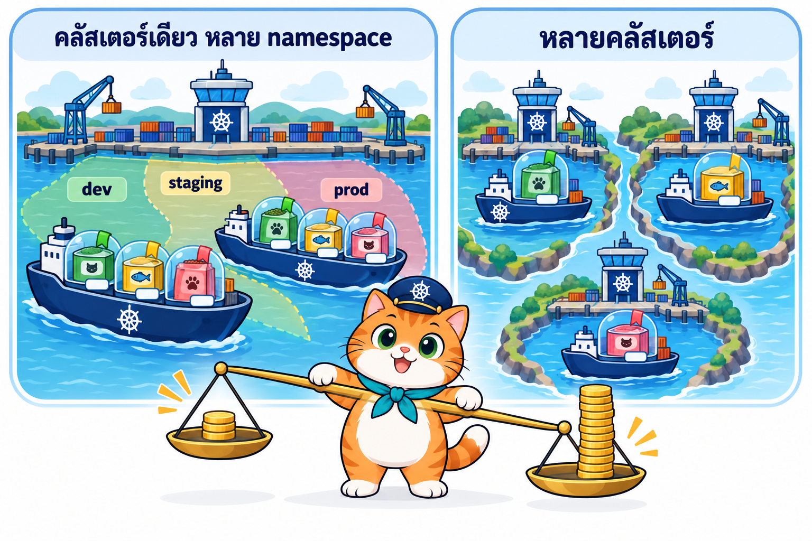<br>
  <em><b>รูปที่ 5</b> ทำไมต้องมี Namespace: หลายทีมและหลาย environment ใช้คลัสเตอร์เดียวกันได้ ถูกกว่าแยกคลัสเตอร์ต่อทีม แต่แยกขาดน้อยกว่า</em>
</p>

รูปแบบการใช้งานที่พบบ่อย

| รูปแบบ | ตัวอย่างชื่อ namespace | เหมาะกับ |
|---|---|---|
| แยกตามทีม | `team-a`, `team-b`, `payments` | หลายทีมใช้คลัสเตอร์ร่วมกัน แต่ละทีมดูแลของตัวเอง |
| แยกตาม environment | `dev`, `staging`, `prod` | แอปเดียวกันหลายขั้นตอนการพัฒนา |
| แยกตามแอป/ระบบ | `som-shop`, `monitoring`, `logging` | แยกระบบที่ไม่เกี่ยวกันให้ดูแลง่าย |
| ทีม + environment | `som-dev`, `som-staging`, `som-prod` | องค์กรที่มีหลายทีมและแต่ละทีมมีหลาย environment (ใช้ใน LAB สุดท้าย) |

เทียบกับอีกทางเลือกคือ **"หนึ่งคลัสเตอร์ต่อทีม/ต่อ environment"**

| | หลาย namespace ในคลัสเตอร์เดียว | หลายคลัสเตอร์ |
|---|---|---|
| ค่าใช้จ่าย | ต่ำ ใช้ control plane และ Node ร่วมกัน | สูง ทุกคลัสเตอร์ต้องมี control plane และ Node ของตัวเอง |
| การดูแล | อัปเกรด/ติดตั้งเครื่องมือครั้งเดียว | ต้องดูแลทีละคลัสเตอร์ |
| การแยกขาด | **soft multi-tenancy** แยกด้วยนโยบาย (RBAC, quota, PSA, NetworkPolicy) แต่ยังใช้ kernel, Node, API server ร่วมกัน | แยกขาดจริง ปัญหาของคลัสเตอร์หนึ่งไม่กระทบอีกคลัสเตอร์ |
| ของที่แยกไม่ได้ | ของ cluster-scoped (Node, CRD, StorageClass) และเวอร์ชันของ Kubernetes | แยกได้ทั้งหมด |

แนวปฏิบัติทั่วไปคือใช้ namespace สำหรับทีมและ environment ที่ไว้ใจกันระดับหนึ่ง และแยกคลัสเตอร์เมื่อต้องการแยกขาดจริง (เช่น prod ขององค์กรใหญ่ หรือลูกค้าคนละบริษัท)

### 2.4 กฎของชื่อและโครงสร้าง

- **namespace ซ้อนกันไม่ได้ (flat)** ไม่มี namespace ย่อยใน namespace และ Namespace object เองไม่ได้อยู่ใน namespace ใด (เป็น cluster-scoped)
- **ชื่อต้องเป็น DNS label ตาม RFC 1123** คือ ตัวพิมพ์เล็ก a-z, ตัวเลข 0-9 และ `-` ขึ้นต้นและลงท้ายด้วยตัวอักษรหรือตัวเลข ยาวไม่เกิน 63 ตัวอักษร เพราะชื่อ namespace ถูกนำไปใช้ในชื่อ DNS (หัวข้อ 9)

ผลจริงเมื่อตั้งชื่อผิดกฎ (LAB 1)

```text
The Namespace "Blue_Zone" is invalid: metadata.name: Invalid value: "Blue_Zone": a lowercase RFC 1123 label must consist of lower case alphanumeric characters or '-', and must start and end with an alphanumeric character (e.g. 'my-name',  or '123-abc', regex used for validation is '[a-z0-9]([-a-z0-9]*[a-z0-9])?')
```

- **คำนำหน้า `kube-` สงวนไว้ให้ระบบตามธรรมเนียม** เอกสาร Kubernetes แนะนำว่า **อย่า** สร้าง namespace ที่ขึ้นต้นด้วย `kube-` เพราะเป็นชื่อที่ระบบใช้ แต่ API **ไม่ได้ห้าม** ผลจริงใน LAB 1

```text
$ kubectl create namespace kube-mine
namespace/kube-mine created
```

กล่าวคือ "ห้าม" ในที่นี้เป็นข้อตกลงร่วมกัน ไม่ใช่กฎ validation ของ API server ผู้เรียนจึงต้องระวังเอง

---

## 3. Namespace เริ่มต้นและสิ่งที่อยู่ข้างใน

<p align="center" id="fig-6">
  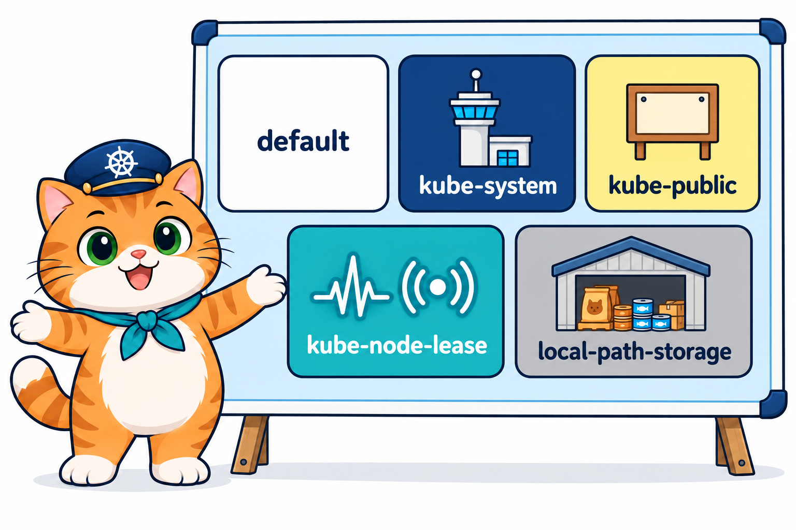<br>
  <em><b>รูปที่ 6</b> คลัสเตอร์ kind มี namespace ตั้งต้น 5 โซน: default, kube-system, kube-public, kube-node-lease และ local-path-storage ที่ kind เพิ่มมา</em>
</p>

คลัสเตอร์ kind ที่สร้างด้วย `k8s-up` มี namespace ตั้งแต่เริ่ม 5 ตัว ผลจริงจาก LAB 0

```text
$ kubectl get ns --show-labels
NAME                 STATUS   AGE    LABELS
default              Active   101s   kubernetes.io/metadata.name=default
kube-node-lease      Active   101s   kubernetes.io/metadata.name=kube-node-lease
kube-public          Active   101s   kubernetes.io/metadata.name=kube-public
kube-system          Active   101s   kubernetes.io/metadata.name=kube-system
local-path-storage   Active   97s    kubernetes.io/metadata.name=local-path-storage
```

**ตารางที่ 2** namespace ตั้งต้นและหน้าที่

| namespace | มีในทุกคลัสเตอร์? | หน้าที่ | ลบได้ไหม |
|---|:---:|---|---|
| `default` | ✓ | ที่ที่ object ไปอยู่เมื่อไม่ระบุ namespace | ไม่ได้ ระบบป้องกัน |
| `kube-system` | ✓ | Pod และ object ของระบบ (control plane, DNS, network plugin) | ไม่ได้ ระบบป้องกัน |
| `kube-public` | ✓ | ข้อมูลที่ใครก็อ่านได้ เช่น ConfigMap `cluster-info` | ไม่ได้ ระบบป้องกัน |
| `kube-node-lease` | ✓ | Lease ของแต่ละ Node (heartbeat) | ระบบ **ไม่กัน** แต่ **ห้ามลบ** |
| `local-path-storage` | เฉพาะ kind | ตัวจัดสรร storage ของ StorageClass `standard` | ของ kind ไม่ควรลบ |

ทุก namespace (รวมที่เราสร้างเอง) ได้ label `kubernetes.io/metadata.name=<ชื่อ>` อัตโนมัติ (หัวข้อ 7)

### 3.1 default

`default` คือ namespace ที่ kubectl ใช้เมื่อเราไม่ได้ระบุ `-n` และ context ไม่ได้ตั้ง namespace ไว้ (หัวข้อ 6) ทุก Pod ในบทที่ 1–3 จึงอยู่ที่นี่ ผลจริงจาก LAB 0

```text
$ kubectl describe ns default
Name:         default
Labels:       kubernetes.io/metadata.name=default
Annotations:  <none>
Status:       Active

No resource quota.

No LimitRange resource.
```

`No resource quota.` และ `No LimitRange resource.` บอกว่า `default` ไม่มีงบและไม่มีกฎขนาดกล่องเลย ใครจะสร้างอะไรขนาดเท่าไรก็ได้ ซึ่งเป็นเหตุผลหนึ่งที่ไม่ควรใช้ `default` กับงานจริง

### 3.2 kube-system

<p align="center" id="fig-7">
  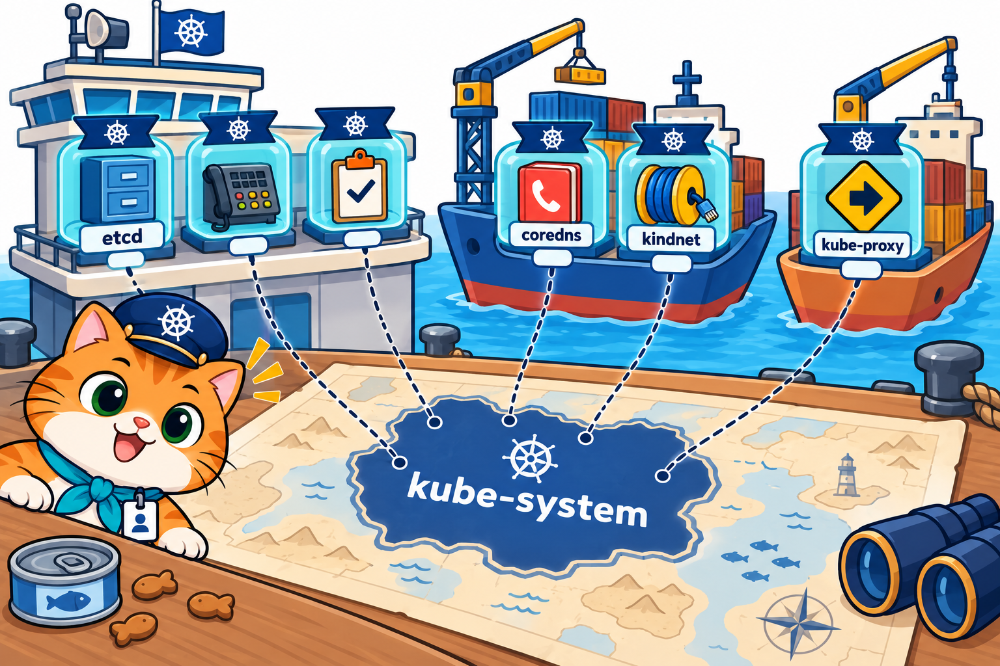<br>
  <em><b>รูปที่ 7</b> kube-system คือโซนพนักงานของท่าเรือ มี Pod ระบบ เช่น etcd, apiserver, scheduler, coredns, kindnet และ kube-proxy</em>
</p>

`kube-system` เป็นโซนพนักงานของท่าเรือ ผลจริงจาก LAB 0 มี Pod 12 ตัว

```text
$ kubectl get pods -n kube-system
NAME                                        READY   STATUS    RESTARTS   AGE
coredns-559f6c778d-5hcpz                    1/1     Running   0          93s
coredns-559f6c778d-6hfdw                    1/1     Running   0          93s
etcd-lab-control-plane                      1/1     Running   0          99s
kindnet-dq2ng                               1/1     Running   0          93s
kindnet-mbmsr                               1/1     Running   0          92s
kindnet-vlb7z                               1/1     Running   0          92s
kube-apiserver-lab-control-plane            1/1     Running   0          99s
kube-controller-manager-lab-control-plane   1/1     Running   0          100s
kube-proxy-6c5br                            1/1     Running   0          93s
kube-proxy-htcvs                            1/1     Running   0          92s
kube-proxy-hzmtb                            1/1     Running   0          92s
kube-scheduler-lab-control-plane            1/1     Running   0          99s
```

| กลุ่ม | Pod | ที่มา (โยงบทก่อน) |
|---|---|---|
| control plane | `etcd-`, `kube-apiserver-`, `kube-controller-manager-`, `kube-scheduler-lab-control-plane` | static Pod ของหอบังคับการ (บทที่ 3 หัวข้อ 14) ชื่อลงท้ายด้วยชื่อ Node |
| DNS ภายในคลัสเตอร์ | `coredns-...` × 2 | สร้างโดย Deployment ชื่อ `coredns` (ตัวสร้าง Pod ที่จะเรียนในบทถัดไป) |
| network | `kindnet-...` × 3, `kube-proxy-...` × 3 | สร้างโดย DaemonSet ให้เรือทุกลำมีลำละ 1 ตัว (บทที่ 3 เห็นเป็น container บนเรือ) |

> ข้อสังเกต: `local-path-provisioner` ของ kind **ไม่ได้** อยู่ใน `kube-system` แต่อยู่ใน `local-path-storage` (หัวข้อ 3.4) และ **ไม่ควร** สร้างหรือลบ Pod ใน `kube-system` เอง

### 3.3 kube-public และ kube-node-lease

<p align="center" id="fig-8">
  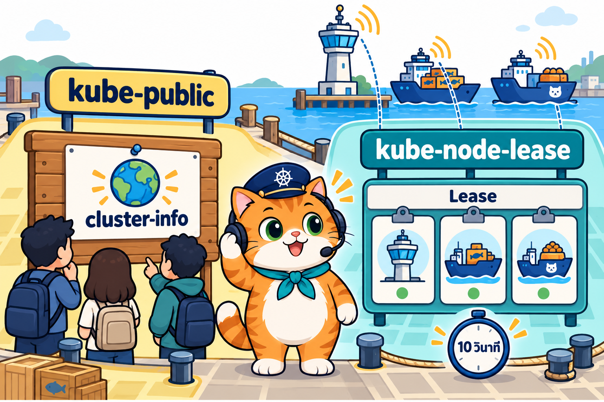<br>
  <em><b>รูปที่ 8</b> kube-public เก็บประกาศที่ใครก็อ่านได้ (cluster-info) ส่วน kube-node-lease เก็บใบ Lease ของเรือแต่ละลำที่ต่ออายุทุก 10 วินาทีเป็นสัญญาณว่ายังอยู่</em>
</p>

**`kube-public`** ไม่มี Pod เลย มีเพียง ConfigMap ที่ "ประกาศ" ข้อมูลพื้นฐานของคลัสเตอร์ ผลจริงจาก LAB 0

```text
$ kubectl get cm -n kube-public
NAME               DATA   AGE
cluster-info       2      100s
kube-root-ca.crt   1      93s
```

`cluster-info` เก็บที่อยู่ API server และใบรับรอง CA ของคลัสเตอร์ kubeadm (เครื่องมือที่ kind ใช้ตั้งคลัสเตอร์) ตั้งสิทธิ์ให้ ConfigMap นี้ **อ่านได้แม้ยังไม่ล็อกอิน** เพื่อให้ Node ใหม่ใช้ตอนเข้าร่วมคลัสเตอร์ ชื่อ "public" จึงหมายถึงสิ่งที่ตั้งใจเปิดให้ทุกคนอ่าน ไม่ได้แปลว่าของทุกอย่างที่เราวางในนั้นจะเป็นสาธารณะโดยอัตโนมัติ

**`kube-node-lease`** เก็บ **Lease** ของ Node ละ 1 ใบ kubelet ต่ออายุ Lease ของเรือตัวเองทุกประมาณ 10 วินาที เป็นสัญญาณว่า "เรือยังอยู่" (บทที่ 3 หัวข้อ 13) ผลจริงจาก LAB 0

```text
$ kubectl get lease -n kube-node-lease
NAME                HOLDER              AGE
lab-control-plane   lab-control-plane   99s
lab-worker          lab-worker          82s
lab-worker2         lab-worker2         82s
```

### 3.4 local-path-storage (ของ kind)

namespace นี้ **ไม่ได้มีในทุกคลัสเตอร์** kind เพิ่มมาเพื่อวาง `local-path-provisioner` ซึ่งเป็นตัวสร้างพื้นที่เก็บข้อมูลบนดิสก์ของ Node ให้ StorageClass `standard` (ปูทางบทที่ว่าด้วย storage) สังเกตว่าอายุ (AGE) น้อยกว่าตัวอื่นเล็กน้อย เพราะถูกสร้างหลัง control plane พร้อมแล้ว

```text
$ kubectl get pods -n local-path-storage
NAME                                      READY   STATUS    RESTARTS   AGE
local-path-provisioner-75f7fc7dc5-kn7sx   1/1     Running   0          93s
```

### 3.5 ของที่ทุก namespace ได้อัตโนมัติ

ทุกครั้งที่สร้าง namespace ใหม่ controller ในหอบังคับการจะใส่ของ 2 ชิ้นให้ทันที

| object | ใครสร้าง | ใช้ทำอะไร |
|---|---|---|
| ServiceAccount `default` | ServiceAccount controller | ตัวตนเริ่มต้นของ Pod ที่ไม่ได้ระบุ `serviceAccountName` (หัวข้อ 13) |
| ConfigMap `kube-root-ca.crt` | root CA publisher | ใบรับรอง CA ของคลัสเตอร์ ให้ Pod ใช้ตรวจว่าคุยกับ API server ตัวจริง |

ผลจริงจาก LAB 0

```text
$ kubectl get sa,cm -n default
NAME                     AGE
serviceaccount/default   93s

NAME                         DATA   AGE
configmap/kube-root-ca.crt   1      93s
```

---

## 4. Namespaced vs cluster-scoped resources

<p align="center" id="fig-9">
  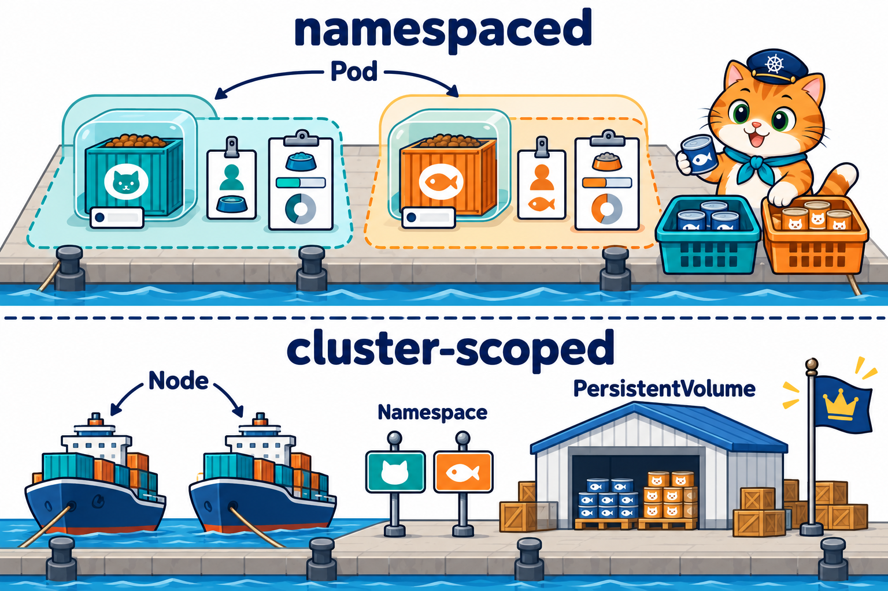<br>
  <em><b>รูปที่ 9</b> ของบางอย่างอยู่ประจำโซน (Pod, ServiceAccount, Role, ResourceQuota) แต่ของบางอย่างเป็นของส่วนกลางทั้งท่าเรือ (Node, Namespace, PersistentVolume, StorageClass)</em>
</p>

resource ใน Kubernetes แบ่งเป็น 2 กลุ่ม

- **namespaced** อยู่ใน namespace ใด namespace หนึ่งเสมอ ชื่อซ้ำได้ข้าม namespace เช่น Pod, ConfigMap, Secret, ServiceAccount, Role, RoleBinding, ResourceQuota, LimitRange, NetworkPolicy, PersistentVolumeClaim, Event, Lease
- **cluster-scoped** เป็นของส่วนกลางของท่าเรือ ไม่อยู่ใน namespace ใด ชื่อต้องไม่ซ้ำทั้งคลัสเตอร์ เช่น Node, Namespace, PersistentVolume, StorageClass, PriorityClass, ClusterRole, ClusterRoleBinding, CSIDriver, IngressClass, RuntimeClass

เหตุผลง่าย ๆ คือ **ของบางอย่างเป็นของส่วนกลางโดยธรรมชาติ** เรือลำหนึ่งรับกล่องจากทุกโซน จึงเป็นของโซนใดโซนหนึ่งไม่ได้ ป้ายโซน (Namespace) ก็ต้องอยู่บนแผนผังกลาง ไม่ใช่อยู่ในโซนตัวเอง โกดังกลาง (PersistentVolume) และแบบฟอร์มขอพื้นที่ (StorageClass) ใช้ร่วมกันทั้งท่า

### 4.1 ดูด้วย kubectl api-resources

<p align="center" id="fig-10">
  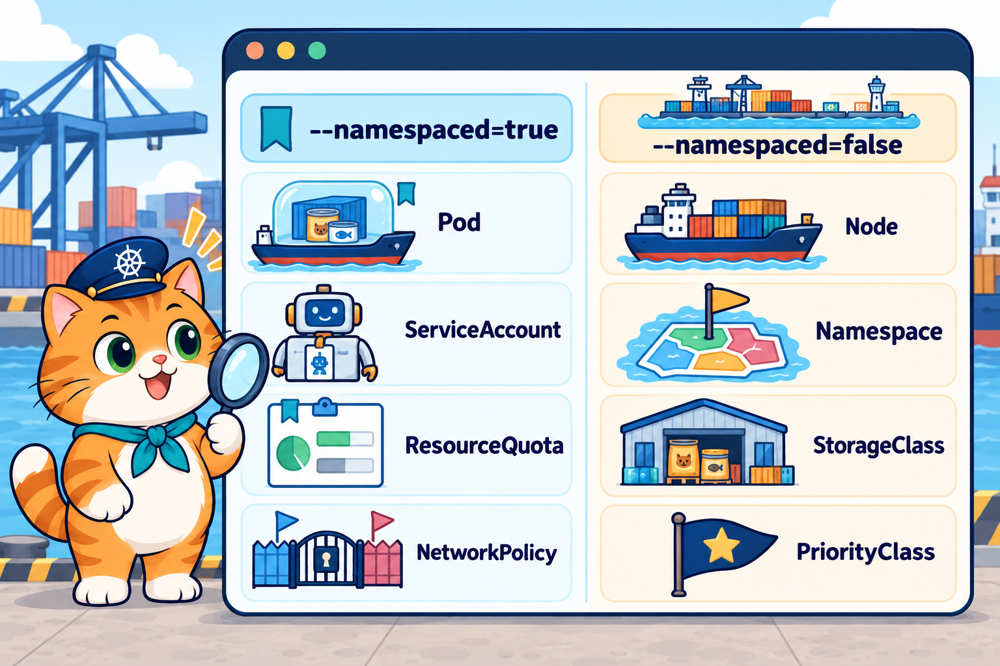<br>
  <em><b>รูปที่ 10</b> kubectl api-resources --namespaced=true/false แบ่งชนิด resource เป็นสองกลุ่ม และ -n ไม่มีผลกับของส่วนกลาง</em>
</p>

ผลจริงจาก LAB 3 (Kubernetes v1.37.0)

```text
$ kubectl api-resources --namespaced=true -o name | wc -l
34
$ kubectl api-resources --namespaced=false -o name | wc -l
37
```

เลือกดูเฉพาะชนิดที่ใช้ในบทนี้ (คอลัมน์ `NAMESPACED` บอก scope)

```text
$ kubectl api-resources | grep -E "^(pods|nodes|namespaces|resourcequotas|limitranges|networkpolicies|roles|clusterroles) "
limitranges                         limits       v1                                true         LimitRange
namespaces                          ns           v1                                false        Namespace
nodes                               no           v1                                false        Node
pods                                po           v1                                true         Pod
resourcequotas                      quota        v1                                true         ResourceQuota
networkpolicies                     netpol       networking.k8s.io/v1              true         NetworkPolicy
clusterroles                                     rbac.authorization.k8s.io/v1      false        ClusterRole
roles                                            rbac.authorization.k8s.io/v1      true         Role
```

คอลัมน์ `SHORTNAMES` ยังบอกชื่อย่อที่ใช้กับ kubectl ได้ เช่น `ns`, `quota`, `limits`, `netpol`, `sa`, `cm`

### 4.2 ผลของ -n กับ cluster-scoped resource

`-n` **ไม่มีผล** กับ resource แบบ cluster-scoped kubectl ไม่ฟ้อง error แต่ก็ไม่ได้กรองอะไร ผลจริงจาก LAB 3

```text
$ kubectl get nodes -n blue
NAME                STATUS   ROLES           AGE     VERSION
lab-control-plane   Ready    control-plane   2m25s   v1.37.0
lab-worker          Ready    <none>          2m15s   v1.37.0
lab-worker2         Ready    <none>          2m15s   v1.37.0

$ kubectl get ns blue -n green
NAME   STATUS   AGE
blue   Active   35s
```

ผลทั้งสองเหมือนไม่ได้ใส่ `-n` เลย ข้อนี้สำคัญเวลาเขียนสคริปต์: การเห็นผลลัพธ์จากคำสั่งที่มี `-n` ไม่ได้แปลว่าของชิ้นนั้นอยู่ใน namespace นั้น

ของ cluster-scoped อื่นที่เห็นใน LAB 3

```text
$ kubectl get sc
NAME                 PROVISIONER             RECLAIMPOLICY   VOLUMEBINDINGMODE      ALLOWVOLUMEEXPANSION   AGE
standard (default)   rancher.io/local-path   Delete          WaitForFirstConsumer   false                  2m21s

$ kubectl get priorityclass
NAME                      VALUE        GLOBAL-DEFAULT   AGE     PREEMPTIONPOLICY
system-cluster-critical   2000000000   false            2m24s   PreemptLowerPriority
system-node-critical      2000001000   false            2m24s   PreemptLowerPriority
```

> **เคล็ดลับ:** `kubectl explain <ชนิด>` บอกโครงสร้างฟิลด์ แต่ไม่ได้บอก scope ชัดเจน วิธีที่ตรงที่สุดคือดูคอลัมน์ `NAMESPACED` ของ `kubectl api-resources`

---

## 5. สร้างและใช้ namespace

### 5.1 สร้างแบบคำสั่งและแบบ YAML

<p align="center" id="fig-11">
  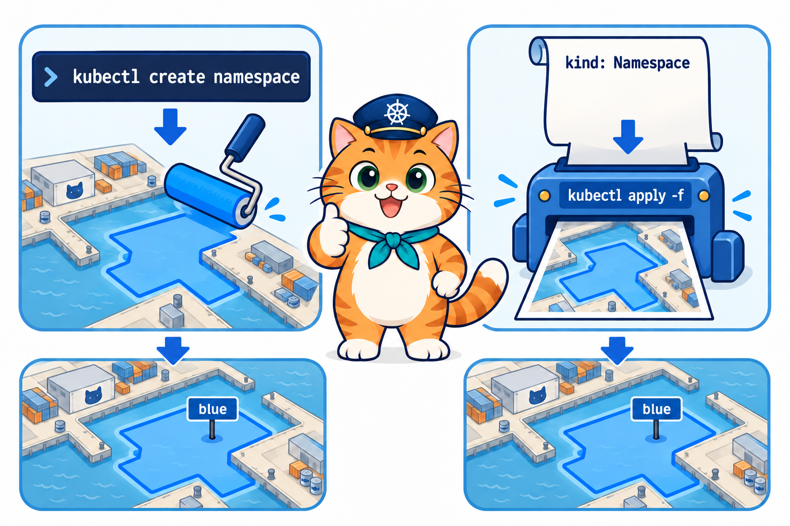<br>
  <em><b>รูปที่ 11</b> สร้าง namespace ได้สองแบบ: สั่งตรงด้วย kubectl create namespace หรือเขียน YAML kind: Namespace แล้ว kubectl apply</em>
</p>

| แบบ | คำสั่ง | ข้อดี | ข้อเสีย |
|---|---|---|---|
| imperative (สั่งตรง) | `kubectl create namespace green` | เร็ว เหมาะกับทดลอง | ไม่มีไฟล์บันทึก ใส่ label ต้องสั่งเพิ่ม |
| declarative (YAML) | `kubectl apply -f ns-blue.yaml` | เก็บใน git ได้ ใส่ label/annotation ในไฟล์เดียว สั่งซ้ำได้ | ต้องเขียนไฟล์ |

ผลจริงจาก LAB 1 และเทคนิค `--dry-run=client -o yaml` ที่ช่วย "พิมพ์ YAML ตั้งต้น" ให้โดยไม่สร้างจริง

```text
$ kubectl create namespace green
namespace/green created

$ kubectl create namespace green --dry-run=client -o yaml
apiVersion: v1
kind: Namespace
metadata:
  name: green
spec: {}
status: {}

$ kubectl apply -f labs/lab01-create-ns/ns-blue.yaml
namespace/blue created

$ kubectl get ns blue green --show-labels
NAME    STATUS   AGE   LABELS
blue    Active   0s    kubernetes.io/metadata.name=blue,lab=04
green   Active   0s    kubernetes.io/metadata.name=green
```

### 5.2 metadata.namespace ในไฟล์ เทียบกับ -n

<p align="center" id="fig-12">
  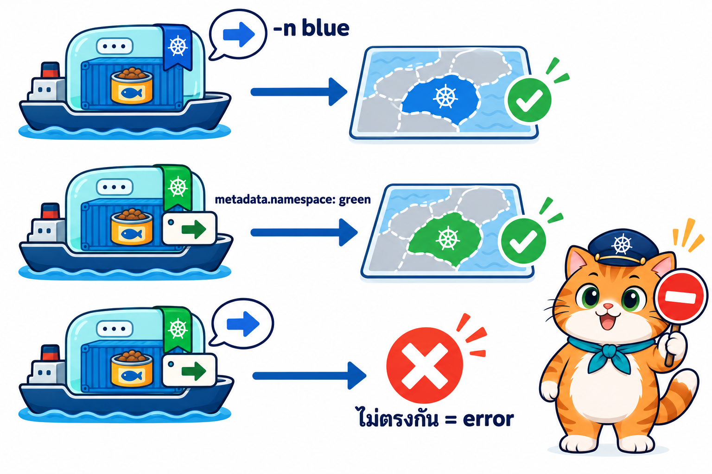<br>
  <em><b>รูปที่ 12</b> metadata.namespace ในไฟล์คือป้ายที่อยู่ติดกล่อง ส่วน -n คือคำสั่งปากเปล่า ถ้าไม่ตรงกัน kubectl จะปฏิเสธ</em>
</p>

object แบบ namespaced จะไปอยู่ namespace ไหน ขึ้นกับ 2 แหล่ง คือ `metadata.namespace` ในไฟล์ (ป้ายที่อยู่ติดกล่อง) และ `-n`/`--namespace` ตอนสั่ง (คำสั่งปากเปล่า)

**ตารางที่ 3** กฎการเลือก namespace (ยืนยันใน LAB 1)

| ในไฟล์ (`metadata.namespace`) | ตอนสั่ง (`-n`) | ผล |
|---|---|---|
| ไม่มี | ไม่มี | ไป namespace ของ context (ปกติ `default`) |
| ไม่มี | `-n blue` | ไป `blue` |
| `green` | ไม่มี | ไป `green` |
| `green` | `-n green` | ไป `green` |
| `green` | `-n blue` | **error** ไม่สร้างอะไรเลย |

ผลจริงเมื่อไฟล์ `snack-green-pod.yaml` (มี `namespace: green`) ถูกสั่งด้วย `-n blue`

```text
$ kubectl apply -f labs/lab01-create-ns/snack-green-pod.yaml -n blue
error: the namespace from the provided object "green" does not match the namespace "blue". You must pass '--namespace=green' to perform this operation.
```

**แนวปฏิบัติ**

- ไฟล์ที่ตั้งใจใช้ซ้ำหลาย environment (เช่น `som-shop.yaml` ใน LAB สุดท้าย) **ไม่ใส่** `metadata.namespace` แล้วเลือกด้วย `-n` ตอนสั่ง ไฟล์เดียวจึงใช้ได้ทั้ง dev, staging, prod
- ไฟล์ที่เป็นของ namespace เดียวแน่นอน (เช่น `prod-guardrails.yaml` ที่เป็นงบของ prod เท่านั้น) **ใส่** `metadata.namespace` เพื่อกันวางผิดโซน

### 5.3 ชื่อซ้ำได้ข้าม namespace

<p align="center" id="fig-13">
  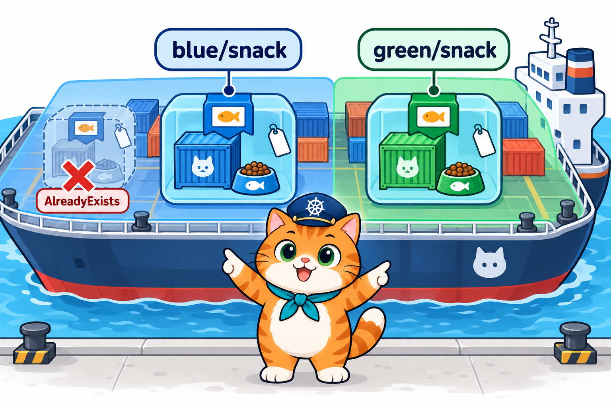<br>
  <em><b>รูปที่ 13</b> ชื่อซ้ำกันได้ถ้าอยู่คนละ namespace ชื่อเต็มคือ namespace/ชื่อ แต่ใน namespace เดียวกันชื่อต้องไม่ซ้ำ (kubectl create ซ้ำจะได้ AlreadyExists)</em>
</p>

ไฟล์ `snack-pod.yaml` ไฟล์เดียว (ไม่มี `metadata.namespace`) สั่ง 3 ครั้งได้ Pod 3 ตัวชื่อ `snack` เหมือนกันใน `blue`, `green`, `default` (ผลจริงดูหัวข้อ 2.2) เพราะชื่อเต็มคือ `blue/snack`, `green/snack`, `default/snack`

แต่ **ใน namespace เดียวกันชื่อต้องไม่ซ้ำ** ผลจริงจาก LAB 1

```text
$ kubectl create -f labs/lab01-create-ns/snack-pod.yaml -n blue
Error from server (AlreadyExists): error when creating "labs/lab01-create-ns/snack-pod.yaml": pods "snack" already exists

$ kubectl apply -f labs/lab01-create-ns/snack-pod.yaml -n blue
pod/snack unchanged
```

สังเกตความต่าง: `kubectl create` ต้องการ "สร้างใหม่" จึงได้ `AlreadyExists` ส่วน `kubectl apply` ต้องการ "ทำให้เหมือนไฟล์" เมื่อของเดิมตรงกับไฟล์แล้วจึงตอบ `unchanged` (ถ้าไฟล์ต่างจากเดิม apply จะพยายามแก้ object เดิม ไม่ได้สร้างตัวใหม่)

### 5.4 -n และ -A

<p align="center" id="fig-14">
  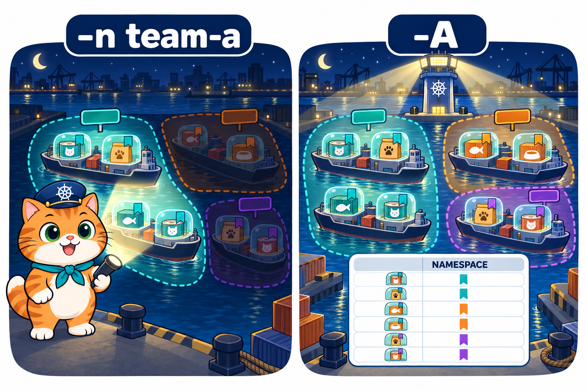<br>
  <em><b>รูปที่ 14</b> -n ส่องดูทีละโซน ส่วน -A ส่องทั้งท่าเรือและเพิ่มคอลัมน์ NAMESPACE</em>
</p>

| ตัวเลือก | ความหมาย | ตัวอย่าง |
|---|---|---|
| `-n <ns>` / `--namespace=<ns>` | ทำงานกับ namespace เดียว | `kubectl get pods -n blue` |
| `-A` / `--all-namespaces` | อ่านจากทุก namespace และเพิ่มคอลัมน์ `NAMESPACE` | `kubectl get pods -A` |
| ใช้ร่วมกับ `-l` | กรองด้วย label ข้ามทุก namespace | `kubectl get pods -A -l app=snack` |

`-A` ใช้กับการ "ดูรายการ" เท่านั้น ใช้ระบุชื่อตัวเดียวข้ามทุก namespace ไม่ได้ ผลจริงจาก LAB 1

```text
$ kubectl get pod snack -A
error: a resource cannot be retrieved by name across all namespaces

$ kubectl get pods -A --field-selector metadata.name=snack
NAMESPACE   NAME    READY   STATUS    RESTARTS   AGE
blue        snack   1/1     Running   0          9s
default     snack   1/1     Running   0          8s
green       snack   1/1     Running   0          8s
```

`--field-selector metadata.name=snack` คือการกรองด้วยฟิลด์ของ object ซึ่งใช้กับ `-A` ได้

อีกวิธีหนึ่งที่ใช้ดูว่า object อยู่ namespace ไหนคือ jsonpath

```text
$ kubectl get pod snack -n blue -o jsonpath="{.metadata.namespace}{\"\n\"}"
blue
```

### 5.5 Namespace object มีอะไรข้างใน

ผลจริงจาก LAB 1

```text
$ kubectl get ns blue -o yaml
apiVersion: v1
kind: Namespace
metadata:
  annotations:
    kubectl.kubernetes.io/last-applied-configuration: |
      {"apiVersion":"v1","kind":"Namespace","metadata":{"annotations":{},"labels":{"lab":"04"},"name":"blue"}}
  creationTimestamp: "2026-10-04T13:29:35Z"
  labels:
    kubernetes.io/metadata.name: blue
    lab: "04"
  name: blue
  resourceVersion: "736"
  uid: 477a7329-64c3-447f-ab6f-4cf12b358c36
spec:
  finalizers:
  - kubernetes
status:
  phase: Active
```

- `metadata` **ไม่มี** ฟิลด์ `namespace` เพราะ Namespace เป็น cluster-scoped
- `labels` มี `kubernetes.io/metadata.name: blue` ที่ระบบใส่ให้ (หัวข้อ 7) และ `lab: "04"` ที่มาจากไฟล์
- `spec.finalizers: [kubernetes]` คือเช็กลิสต์ที่ต้องเคลียร์ก่อนลบ namespace ได้ (หัวข้อ 8)
- `status.phase` มีได้ 2 ค่า คือ `Active` และ `Terminating`

---

## 6. kubeconfig, context และ namespace เริ่มต้น

### 6.1 โครงสร้าง kubeconfig

<p align="center" id="fig-15">
  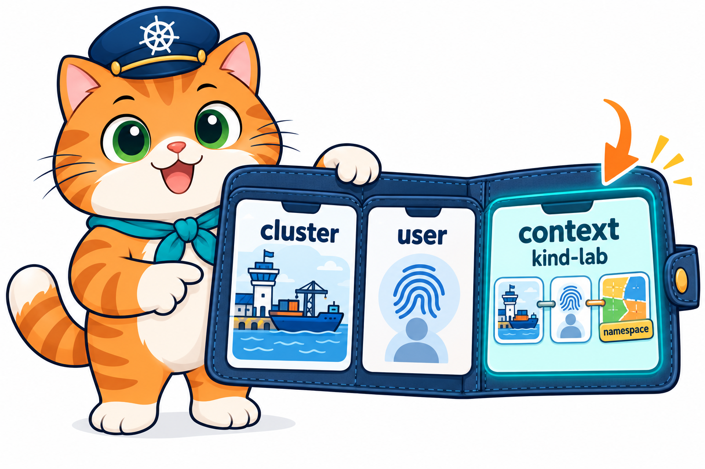<br>
  <em><b>รูปที่ 15</b> kubeconfig เหมือนกระเป๋าบัตร: บัตรท่าเรือ (cluster), บัตรประจำตัว (user) และ context ที่จับคู่ทั้งสองกับโซนที่ใช้บ่อย</em>
</p>

kubectl อ่านการตั้งค่าจากไฟล์ **kubeconfig** (ค่าเริ่มต้น `~/.kube/config`) ซึ่งเหมือนกระเป๋าบัตร มี 3 ส่วนหลักและตัวชี้ 1 ตัว

| ส่วน | อุปมา | เก็บอะไร |
|---|---|---|
| `clusters` | บัตรท่าเรือ | ที่อยู่ API server (`server`) และ CA ของคลัสเตอร์ |
| `users` | บัตรประจำตัว | หลักฐานยืนยันตัวตน เช่น client certificate + key หรือ token |
| `contexts` | บัตรรวม | จับคู่ cluster + user + **namespace** เริ่มต้น (ไม่บังคับ) |
| `current-context` | บัตรที่หยิบใช้อยู่ | ชื่อ context ที่ kubectl ใช้ตอนนี้ |

ผลจริงจาก LAB 2 (`--minify` = แสดงเฉพาะส่วนที่ context ปัจจุบันใช้, `DATA+OMITTED` = kubectl ซ่อนข้อมูลลับให้)

```text
$ kubectl config view --minify
apiVersion: v1
clusters:
- cluster:
    certificate-authority-data: DATA+OMITTED
    server: https://127.0.0.1:41301
  name: kind-lab
contexts:
- context:
    cluster: kind-lab
    user: kind-lab
  name: kind-lab
current-context: kind-lab
kind: Config
users:
- name: kind-lab
  user:
    client-certificate-data: DATA+OMITTED
    client-key-data: DATA+OMITTED
```

(เลข port ใน `server` kind สุ่มให้ตอนสร้างคลัสเตอร์ เครื่องผู้เรียนจะได้เลขอื่น)

สังเกต 2 อย่างที่จะใช้ต่อ

1. context `kind-lab` **ไม่มีบรรทัด `namespace`** จึงใช้ `default`
2. user `kind-lab` ยืนยันตัวตนด้วย **client certificate** (`client-certificate-data`, `client-key-data`) ไม่ใช่ token ซึ่งเป็นที่มาของกับดักในหัวข้อ 13.5

### 6.2 เปลี่ยน namespace เริ่มต้นของ context

<p align="center" id="fig-16">
  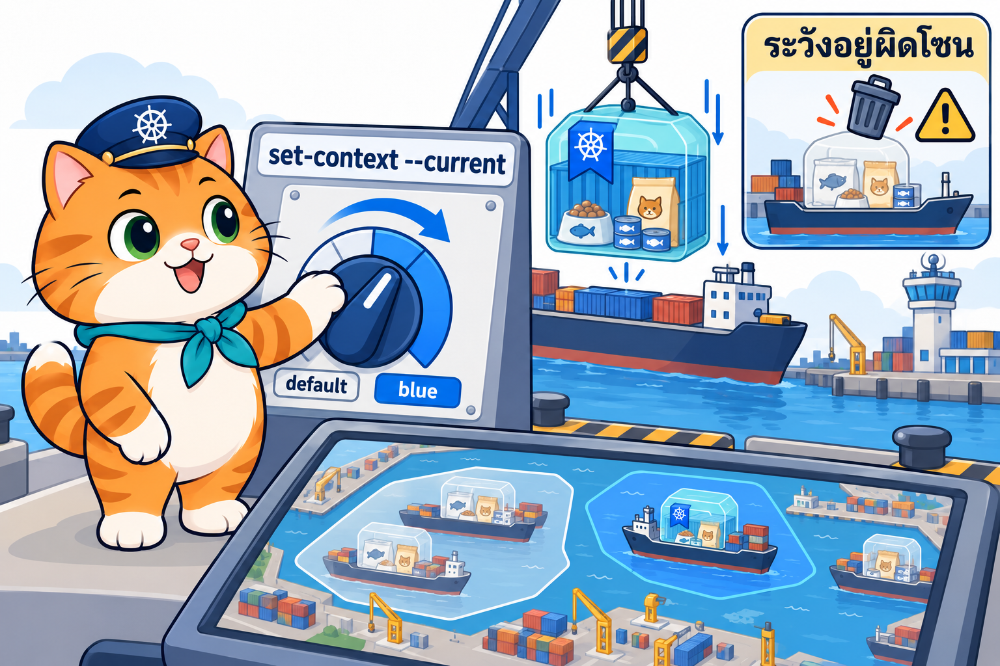<br>
  <em><b>รูปที่ 16</b> kubectl config set-context --current --namespace=blue เปลี่ยนโซนเริ่มต้น สะดวกแต่ต้องระวังลืมว่าตอนนี้อยู่โซนไหน</em>
</p>

ถ้าทำงานใน namespace เดียวนาน ๆ การพิมพ์ `-n blue` ทุกคำสั่งน่าเบื่อ เราตั้ง namespace ให้ context ได้ ผลจริงจาก LAB 2

```text
$ kubectl config get-contexts
CURRENT   NAME       CLUSTER    AUTHINFO   NAMESPACE
*         kind-lab   kind-lab   kind-lab   

$ kubectl config set-context --current --namespace=blue
Context "kind-lab" modified.

$ kubectl config get-contexts
CURRENT   NAME       CLUSTER    AUTHINFO   NAMESPACE
*         kind-lab   kind-lab   kind-lab   blue

$ kubectl get pods
NAME    READY   STATUS    RESTARTS   AGE
snack   1/1     Running   0          26s
```

คอลัมน์ `NAMESPACE` ตอนเริ่ม **ว่าง** (= ใช้ `default`) หลังตั้งค่ากลายเป็น `blue` และ `kubectl get pods` ที่ไม่มี `-n` ก็ส่องโซน blue ทันที Pod ใหม่ที่สร้างโดยไม่ระบุ namespace ก็ไปอยู่ `blue` ด้วย

ดู namespace ปัจจุบันแบบสั้น และคืนค่า

```bash
kubectl config view --minify -o jsonpath='{..namespace}'; echo   # ว่าง = default
kubectl config set-context --current --namespace=default
```

หลังคืนค่า คอลัมน์ `NAMESPACE` จะแสดง `default` (ไม่กลับเป็นช่องว่าง แต่ความหมายเหมือนกัน)

> ⚠️ **ข้อควรระวัง:** การเปลี่ยน namespace ของ context มีผลกับ **ทุก terminal** ที่ใช้ kubeconfig ไฟล์เดียวกัน และอยู่ถาวรจนกว่าจะเปลี่ยนกลับ ถ้าลืม คำสั่งถัดไปอาจสร้างหรือ **ลบ** ของผิดโซน
> - ตรวจด้วย `kubectl config get-contexts` (คอลัมน์ `NAMESPACE`) ก่อนสั่งคำสั่งอันตราย
> - กับ namespace สำคัญอย่าง prod และในสคริปต์ ให้ใส่ `-n` **ทุกครั้ง** อย่าพึ่ง context
> - เครื่องมือเสริม `kubens`/`kubectx` ช่วยสลับ namespace/context ได้เร็ว (กล่าวถึงเท่านั้น ไม่ได้ติดตั้งใน k8s-lab)

นอกจากเปลี่ยน namespace ของ context เดิม เรายังสร้าง **context ใหม่** ที่จับคู่ cluster เดิมกับ user อื่นและ namespace อื่นได้ด้วย `kubectl config set-context <ชื่อ> --cluster=... --user=... --namespace=...` แล้วเลือกใช้ทีละคำสั่งด้วย `kubectl --context <ชื่อ> ...` (ใช้ในหัวข้อ 13.5 และ LAB 7)

---

## 7. Label ของ namespace

<p align="center" id="fig-17">
  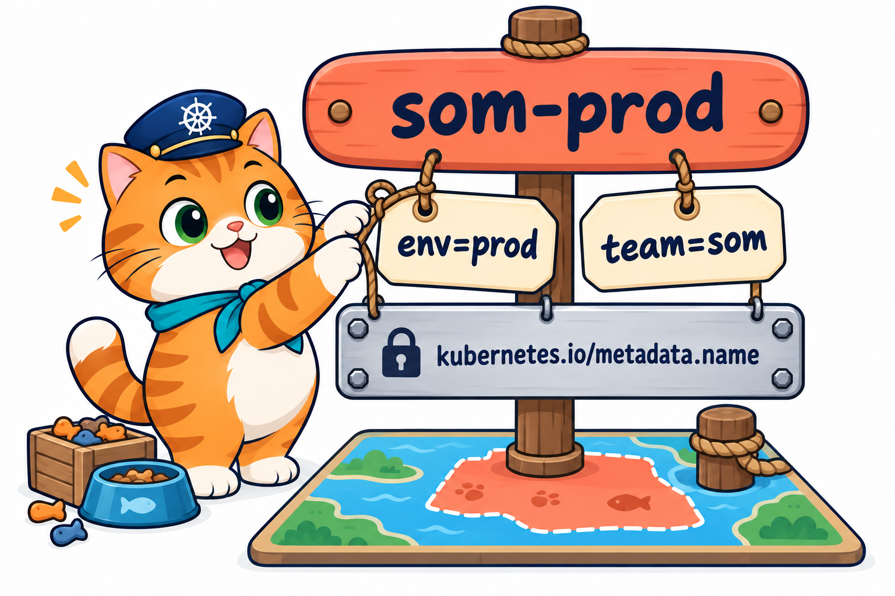<br>
  <em><b>รูปที่ 17</b> namespace ติด label ได้เหมือน Pod เช่น env=prod, team=som และระบบใส่ kubernetes.io/metadata.name ให้อัตโนมัติ</em>
</p>

namespace ติด label ได้เหมือน Pod และมี label 2 ประเภท

| ประเภท | ตัวอย่าง | ใครใส่ | ใช้ทำอะไร |
|---|---|---|---|
| label อัตโนมัติ | `kubernetes.io/metadata.name=som-prod` | ระบบใส่ให้ทุก namespace ค่าเท่ากับชื่อ แก้ให้ต่างจากชื่อไม่ได้ | อ้าง namespace ใน `namespaceSelector` ของ NetworkPolicy (หัวข้อ 10) โดยไม่ต้องติด label เอง |
| label ของเรา | `env=prod`, `team=som` | เราเอง (ในไฟล์หรือ `kubectl label ns`) | ค้นหา/จัดกลุ่ม namespace, อ้างใน selector |
| label พิเศษ | `pod-security.kubernetes.io/enforce=restricted` | เราเอง | สั่งงาน Pod Security Admission (หัวข้อ 14) |

ผลจริงจาก LAB สุดท้าย: ค้นหา namespace ด้วย label และแสดงค่า label เป็นคอลัมน์ด้วย `-L`

```text
$ kubectl get ns -l team=som -L env
NAME          STATUS   AGE   ENV
som-dev       Active   0s    dev
som-prod      Active   0s    prod
som-staging   Active   0s    staging
```

ติด/แก้/ลบ label ด้วยคำสั่ง

```bash
kubectl label ns blue env=dev                 # ติด label ใหม่
kubectl label ns blue env=test --overwrite    # เปลี่ยนค่าที่มีอยู่ต้องใส่ --overwrite
kubectl label ns blue env-                    # ลบ label (ใส่ - ต่อท้ายชื่อ)
```

---

## 8. การลบ namespace

### 8.1 ลบโซน = ลบทุกอย่างข้างใน

<p align="center" id="fig-18">
  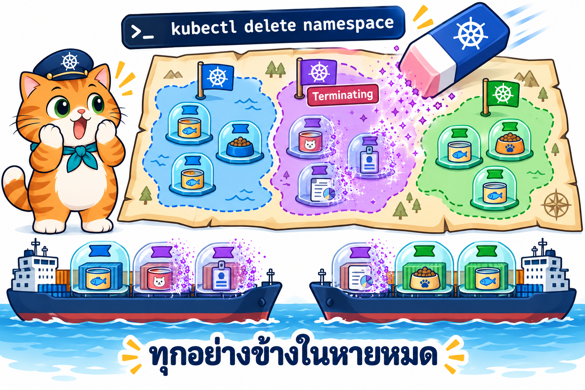<br>
  <em><b>รูปที่ 18</b> kubectl delete namespace ลบทุกอย่างในโซนทั้งก้อน: Pod, บัตรพนักงาน, ใบโควตา ไม่มีถังขยะให้กู้คืน แต่เรือและของส่วนกลางยังอยู่</em>
</p>

`kubectl delete namespace <ชื่อ>` (หรือ `kubectl delete ns <ชื่อ>`) ลบ **ทุก object แบบ namespaced ใน namespace นั้น** ทั้ง Pod, ServiceAccount, Role, RoleBinding, ConfigMap, ResourceQuota ฯลฯ ในคำสั่งเดียว **ไม่มีถังขยะให้กู้คืน** แต่ของ cluster-scoped (Node, PersistentVolume, ClusterRole) ไม่ถูกลบ

ใน LAB 9 namespace `doomed` มีของ 7 ชนิด ผลจริงก่อนลบ

```text
$ kubectl get all,sa,role,rolebinding,cm,quota -n doomed
NAME          READY   STATUS    RESTARTS   AGE
pod/crate-1   1/1     Running   0          0s
pod/crate-2   1/1     Running   0          0s

NAME                     AGE
serviceaccount/cleaner   0s
serviceaccount/default   0s

NAME                                          CREATED AT
role.rbac.authorization.k8s.io/cleaner-role   2026-10-04T13:31:41Z

NAME                                                    ROLE                AGE
rolebinding.rbac.authorization.k8s.io/cleaner-binding   Role/cleaner-role   1s

NAME                         DATA   AGE
configmap/kube-root-ca.crt   1      1s
configmap/menu               1      1s

NAME                         REQUEST     LIMIT   AGE
resourcequota/doomed-quota   pods: 2/5           1s
```

> **ระวัง:** `kubectl get all` **ไม่ได้** แสดงทุกอย่างจริง ไม่รวม ConfigMap, ServiceAccount, Role, RoleBinding, ResourceQuota ฯลฯ ต้องระบุชนิดเพิ่มเองแบบคำสั่งข้างบน ส่วน `kubectl delete ns` ลบครบทุกชนิดจริง

### 8.2 ลำดับเหตุการณ์และ finalizers

<p align="center" id="fig-19">
  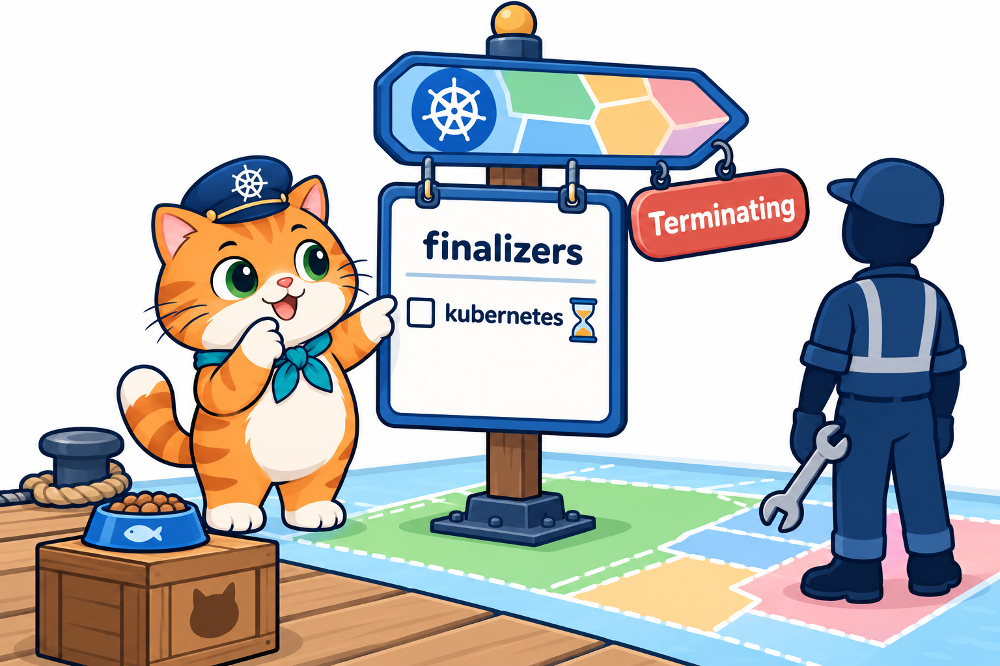<br>
  <em><b>รูปที่ 19</b> finalizers คือเช็กลิสต์ที่ต้องเคลียร์ครบก่อนปลดป้ายโซน ถ้ายังค้างอยู่ namespace จะติดสถานะ Terminating</em>
</p>

**finalizer** คือรายการ "งานที่ต้องทำให้เสร็จก่อนลบ object ได้จริง" เขียนอยู่ใน object เอง Namespace มี finalizer ชื่อ `kubernetes` อยู่ใน `spec.finalizers` (ผลจริง `["kubernetes"]`) ลำดับเมื่อสั่งลบ

1. API server ตั้ง `deletionTimestamp` และเปลี่ยน `status.phase` เป็น **`Terminating`** ทันที
2. ระหว่าง Terminating **สร้างของใหม่ใน namespace นั้นไม่ได้**
3. namespace controller ไล่ลบ object ทุกชนิดข้างใน (Pod ต้องรอ grace period ของตัวเอง)
4. เมื่อข้างในว่างแล้ว controller เอา finalizer `kubernetes` ออก
5. finalizer ว่าง → Namespace object หายไปจริง

ผลจริงจาก LAB 9 (Pod ใน `doomed` ตั้ง `terminationGracePeriodSeconds: 15` ให้ Terminating นานพอสังเกต)

```text
$ kubectl delete ns doomed --wait=false
namespace "doomed" deleted

$ kubectl get ns doomed
NAME     STATUS        AGE
doomed   Terminating   1s

$ kubectl run x -n doomed --image=busybox:1.36 -- sleep 60
Error from server (Forbidden): pods "x" is forbidden: unable to create new content in namespace doomed because it is being terminated

$ time kubectl wait --for=delete ns/doomed --timeout=120s
namespace/doomed condition met

real	0m20.096s
```

คำว่า `deleted` ที่ kubectl ตอบหมายถึง "รับคำขอลบแล้ว" ไม่ได้หมายถึงหายแล้ว ปกติ `kubectl delete ns` (ไม่ใส่ `--wait=false`) จะรอจนหายจริงจึงคืน prompt ใน LAB สุดท้าย namespace ที่มีร้าน som-shop ใช้เวลาลบราว 10 วินาที

### 8.3 namespace ที่ลบไม่ได้ และกรณีค้าง Terminating

ผลจริงจาก LAB 9 (`--dry-run=server` = ให้ API server ตรวจทุกด่านแต่ไม่ลบจริง)

```text
$ kubectl delete ns default
Error from server (Forbidden): namespaces "default" is forbidden: this namespace may not be deleted

$ kubectl delete ns kube-system --dry-run=server
Error from server (Forbidden): namespaces "kube-system" is forbidden: this namespace may not be deleted

$ kubectl delete ns kube-public --dry-run=server
Error from server (Forbidden): namespaces "kube-public" is forbidden: this namespace may not be deleted

$ kubectl delete ns kube-node-lease --dry-run=server
namespace "kube-node-lease" deleted (server dry run)
```

ระบบป้องกันการลบเพียง **3 ตัว** คือ `default`, `kube-system`, `kube-public` ส่วน `kube-node-lease` **ระบบไม่กัน** (dry-run ผ่าน) แต่ **ห้ามลบเด็ดขาด** เพราะเป็นที่เก็บ heartbeat ของ Node ทุกลำ (`local-path-storage` ก็ไม่ควรลบเช่นกัน)

namespace อาจ **ค้าง Terminating นาน** ได้ เช่น มี object ที่มี finalizer ของตัวเองแต่ controller ที่ต้องเคลียร์ finalizer นั้นถูกลบไปแล้ว หรือ API ส่วนขยายที่ลงทะเบียนไว้ล่มทำให้ลิสต์ของข้างในไม่ครบ วิธีตรวจคือ

```bash
kubectl get ns <ชื่อ> -o jsonpath='{.status.conditions}'   # ดูว่าติดอะไร
kubectl api-resources --verbs=list --namespaced -o name \
  | xargs -n 1 kubectl get --show-kind --ignore-not-found -n <ชื่อ>   # หาของที่ยังเหลือ
```

> การไปแก้ลบ finalizer ออกเองเป็นทางลัดที่อาจทิ้งของค้างในระบบ (เช่น ทรัพยากรภายนอกที่ controller ยังไม่ได้เก็บกวาด) อย่าทำถ้ายังไม่เข้าใจว่า finalizer นั้นรออะไรอยู่

---

## 9. Namespace ไม่ได้แยก network และ node

### 9.1 Pod ต่างโซนคุยกันด้วย Pod IP ได้ทันที

<p align="center" id="fig-20">
  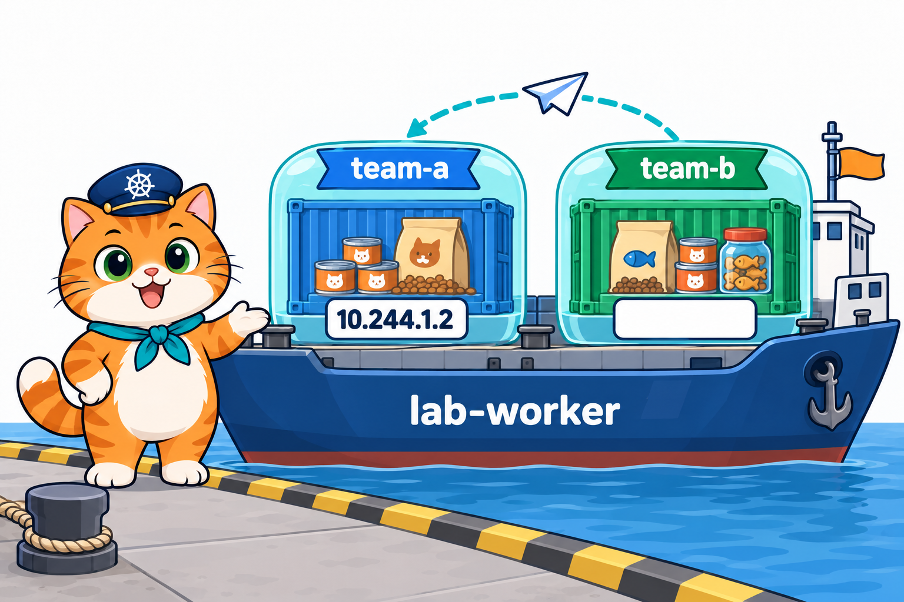<br>
  <em><b>รูปที่ 20</b> Pod ต่าง namespace อยู่บนเรือลำเดียวกันได้ และคุยกันด้วย Pod IP ได้ทันที เพราะ namespace ไม่ได้สร้างกำแพงเครือข่ายให้เอง</em>
</p>

เครือข่าย Pod ใน Kubernetes เป็น **flat network** (บทที่ 1) ทุก Pod ได้ IP ของตัวเองและคุยกับทุก Pod ได้โดยตรง ไม่ว่าจะอยู่ namespace ไหนหรือเรือลำไหน namespace **ไม่ได้สร้างกำแพงเครือข่าย** ให้เอง ผลจริงจาก LAB 4 (ก่อนมี NetworkPolicy)

```text
$ kubectl -n team-b exec client -- wget -qO- -T 3 http://10.244.2.6 | grep -o '<title>.*</title>'
<title>Welcome to nginx!</title>
```

`client` ใน `team-b` เข้าเว็บ `web` ของ `team-a` ได้ทันที (IP ในรูปที่ 20 และใน LAB เป็นตัวอย่าง IP จริงในเครื่องผู้เรียนต่างได้ ให้ดูจาก `kubectl get pod -o wide`)

### 9.2 DNS และ search domain (ทฤษฎีปูทาง)

<p align="center" id="fig-21">
  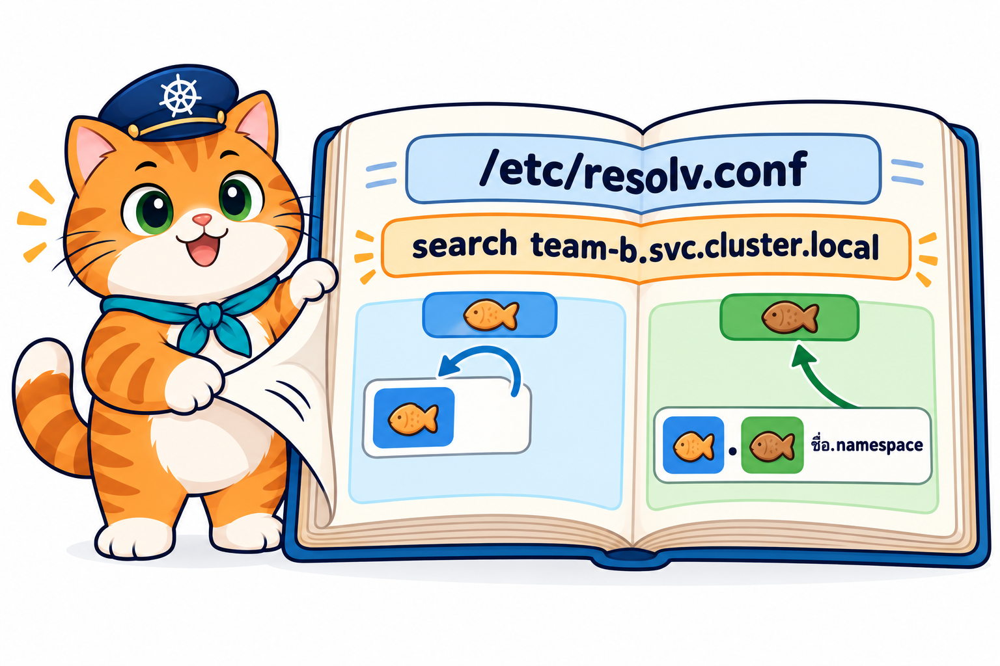<br>
  <em><b>รูปที่ 21</b> (ทฤษฎีปูทาง) resolv.conf ของ Pod มี search domain ตามชื่อ namespace ชื่อสั้นจึงหาได้แค่ในโซนตัวเอง ข้ามโซนต้องเติมชื่อ namespace</em>
</p>

แม้เครือข่ายไม่ได้แยก แต่ **ชื่อ DNS** ผูกกับ namespace ผลจริงจาก LAB 4

```text
$ kubectl -n team-b exec client -- cat /etc/resolv.conf
search team-b.svc.cluster.local svc.cluster.local cluster.local
nameserver 10.96.0.10
options ndots:5

$ kubectl -n team-a exec client -- cat /etc/resolv.conf
search team-a.svc.cluster.local svc.cluster.local cluster.local
nameserver 10.96.0.10
options ndots:5
```

- `nameserver 10.96.0.10` คือที่อยู่ของ CoreDNS ใน `kube-system`
- `search` ขึ้นต้นด้วย **`<namespace ของ Pod>.svc.cluster.local`** เมื่อ Pod ค้นชื่อสั้น ระบบจะลองต่อท้ายด้วย search domain ตามลำดับ

บทถัดไปจะเรียน **Service** ซึ่งเป็นที่อยู่คงที่ของกลุ่ม Pod ชื่อ DNS เต็มของ Service คือ `<service>.<namespace>.svc.cluster.local` ผลของ search domain คือ

| ชื่อที่ Pod ใน `team-b` เรียก | ถูกค้นเป็น | หาเจอ Service ใน |
|---|---|---|
| `web` | `web.team-b.svc.cluster.local` | `team-b` เท่านั้น |
| `web.team-a` | `web.team-a.svc.cluster.local` | `team-a` |
| `web.team-a.svc.cluster.local` | ชื่อเต็ม | `team-a` |

กล่าวคือ **ชื่อสั้นหาได้เฉพาะในโซนตัวเอง ข้ามโซนต้องเติมชื่อ namespace** ซึ่งเป็นประโยชน์ เพราะแอปเดียวกันที่เรียกชื่อสั้น `db` จะได้ฐานข้อมูลของ environment ตัวเองเสมอ (LAB ของบทนี้ยังไม่สร้าง Service จึงดูแค่ไฟล์ `resolv.conf`)

### 9.3 namespace ไม่ใช่ขอบเขตความปลอดภัยที่สมบูรณ์

namespace เพียงอย่างเดียวให้แค่ "แยกชื่อ" ส่วนการแยกอื่น ๆ ต้องเพิ่มเอง

| อยากแยกอะไร | ใช้อะไร | หัวข้อ |
|---|---|---|
| เครือข่าย (ใครคุยกับใครได้) | NetworkPolicy | 10 |
| ทรัพยากรรวมของโซน | ResourceQuota | 11 |
| ขนาดต่อ container และค่าตั้งต้น | LimitRange | 12 |
| สิทธิ์เรียก API | RBAC | 13 |
| ความปลอดภัยของ Pod (root, privileged) | Pod Security Admission | 14 |
| เรือ (Node) | nodeSelector/affinity/taint | บทที่ 3 |

---

## 10. NetworkPolicy: รั้วและประตูระหว่างโซน

### 10.1 แนวคิด

<p align="center" id="fig-22">
  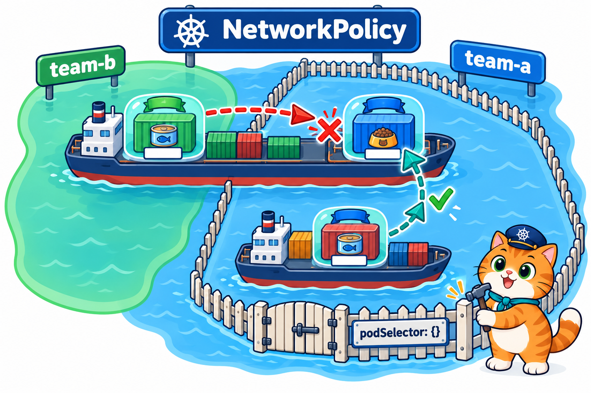<br>
  <em><b>รูปที่ 22</b> NetworkPolicy คือรั้วรอบโซน: Pod ที่ถูกเลือกจะรับเฉพาะการเชื่อมต่อที่อนุญาต ที่เหลือถูกปฏิเสธ (kindnet ของ kind รองรับ)</em>
</p>

**NetworkPolicy** เป็น object แบบ namespaced ที่กำหนดว่า Pod กลุ่มหนึ่ง **รับ** (ingress) หรือ **ส่ง** (egress) การเชื่อมต่อกับใครได้บ้าง หลักสำคัญมี 4 ข้อ

1. **ต้องมี network plugin ที่รองรับ** Kubernetes เก็บ NetworkPolicy ไว้เฉย ๆ คนที่บังคับใช้จริงคือ network plugin (CNI) ถ้า plugin ไม่รองรับ เราสร้าง object ได้แต่ **ไม่มีผลอะไร** kind v0.33 ใช้ **kindnet** ซึ่งรองรับและบังคับใช้จริง (ยืนยันใน LAB 4)
2. **Pod ที่ไม่ถูก policy ใดเลือก = เปิดหมด** (ค่าเริ่มต้นของคลัสเตอร์)
3. **Pod ที่ถูก policy เลือกด้วย `podSelector`** จะเปลี่ยนเป็น **"ปฏิเสธทุกอย่าง ยกเว้นที่ policy อนุญาต"** สำหรับทิศที่ระบุใน `policyTypes`
4. **policy รวมกันแบบ OR (additive)** ถ้ามีหลาย policy เลือก Pod เดียวกัน การเชื่อมต่อที่ policy ใดอนุญาตก็ผ่าน ไม่มี policy แบบ "deny" ให้หักล้าง

ตัวอย่างที่ 1 รั้วรอบโซน: ทุก Pod ใน `team-a` รับเฉพาะการเชื่อมต่อจาก Pod ใน `team-a` เอง (ไฟล์ `labs/lab04-network/np-same-ns.yaml`)

```yaml
apiVersion: networking.k8s.io/v1
kind: NetworkPolicy
metadata:
  name: allow-same-namespace
  namespace: team-a
spec:
  podSelector: {}                # {} = เลือกทุก Pod ในโซนนี้
  policyTypes: ["Ingress"]       # คุมเฉพาะขาเข้า
  ingress:
    - from:
        - podSelector: {}        # podSelector อย่างเดียว = Pod ใน namespace เดียวกับ policy เท่านั้น
```

`podSelector` ใน `from` ที่ไม่มี `namespaceSelector` คู่กัน หมายถึง Pod ใน **namespace เดียวกับ policy** เสมอ ผลจริงจาก LAB 4 หลัง apply (มีผลตั้งแต่คำสั่งแรกหลัง apply)

```text
$ time kubectl -n team-b exec client -- wget -qO- -T 3 http://10.244.2.6
wget: download timed out
command terminated with exit code 1

real	0m3.060s

$ kubectl -n team-a exec client -- wget -qO- -T 3 http://10.244.2.6 | grep -o '<title>.*</title>'
<title>Welcome to nginx!</title>
```

สังเกตว่า "ถูกปฏิเสธ" ในที่นี้คือ **packet ถูกทิ้งเงียบ ๆ** ฝั่งผู้เรียกจึงรอจนหมดเวลา (`-T 3` = 3 วินาที) ไม่ได้ข้อความ "ปฏิเสธ" กลับมา

### 10.2 เปิดประตูให้โซนที่มีป้ายตรง

<p align="center" id="fig-23">
  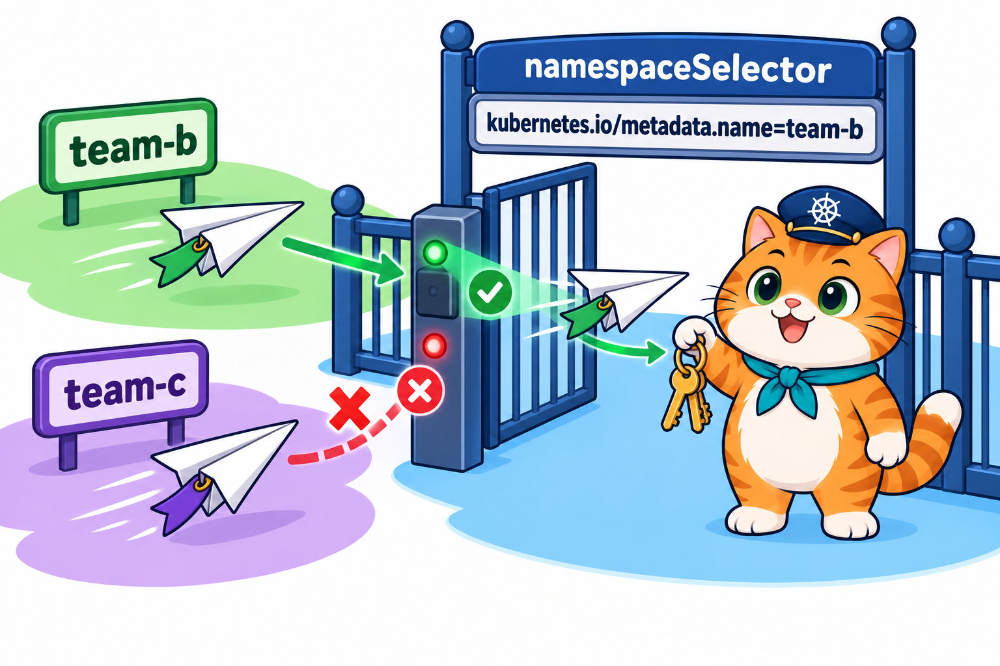<br>
  <em><b>รูปที่ 23</b> เปิดประตูให้เฉพาะโซนที่มีป้ายตรง ด้วย namespaceSelector อ้าง label เช่น kubernetes.io/metadata.name=team-b</em>
</p>

ตัวอย่างที่ 2 เปิดให้ทุก Pod จาก namespace `team-b` เข้า Pod `app=web` ได้ (ไฟล์ `labs/lab04-network/np-allow-team-b.yaml`) ใช้ label อัตโนมัติ `kubernetes.io/metadata.name` จึงไม่ต้องติด label ให้ namespace เอง

```yaml
apiVersion: networking.k8s.io/v1
kind: NetworkPolicy
metadata:
  name: allow-from-team-b
  namespace: team-a
spec:
  podSelector:
    matchLabels:
      app: web                   # ใช้กับ Pod web เท่านั้น
  policyTypes: ["Ingress"]
  ingress:
    - from:
        - namespaceSelector:
            matchLabels:
              kubernetes.io/metadata.name: team-b
```

ผลจริงจาก LAB 4 หลังมีทั้ง 2 policy: `team-b` เข้า `web` ได้อีกครั้ง (รอบแรกทันที) แต่ `blue/snack` ยังถูกกั้น และ `team-b` ยังเข้า `client` ของ `team-a` ไม่ได้ เพราะ policy ที่ 2 เลือกเฉพาะ `app=web`

```text
$ kubectl describe netpol -n team-a
Name:         allow-from-team-b
Namespace:    team-a
...
Spec:
  PodSelector:     app=web
  Allowing ingress traffic:
    To Port: <any> (traffic allowed to all ports)
    From:
      NamespaceSelector: kubernetes.io/metadata.name=team-b
  Not affecting egress traffic
  Policy Types: Ingress


Name:         allow-same-namespace
Namespace:    team-a
...
Spec:
  PodSelector:     <none> (Allowing the specific traffic to all pods in this namespace)
  Allowing ingress traffic:
    To Port: <any> (traffic allowed to all ports)
    From:
      PodSelector: <none>
  Not affecting egress traffic
  Policy Types: Ingress
```

### 10.3 AND กับ OR ใน from

จุดที่สับสนบ่อยคือการเขียน `namespaceSelector` กับ `podSelector` **ในรายการเดียวกัน** หรือ **คนละรายการ** (ตัวอย่างทฤษฎี ไม่ได้ใช้ใน LAB)

```yaml
# แบบ A: รายการเดียว (ขีด - ตัวเดียว) = AND
# อนุญาตเฉพาะ Pod ที่มี role=monitor และอยู่ใน namespace team-b
ingress:
  - from:
      - namespaceSelector:
          matchLabels:
            kubernetes.io/metadata.name: team-b
        podSelector:
          matchLabels:
            role: monitor
---
# แบบ B: สองรายการ (ขีด - สองตัว) = OR
# อนุญาตทุก Pod ใน team-b หรือ Pod ที่มี role=monitor ใน namespace ของ policy เอง
ingress:
  - from:
      - namespaceSelector:
          matchLabels:
            kubernetes.io/metadata.name: team-b
      - podSelector:
          matchLabels:
            role: monitor
```

### 10.4 default deny และ egress

ตัวอย่างที่ 3 **default-deny ingress** ของทั้ง namespace: เลือกทุก Pod แต่ไม่อนุญาตอะไรเลย (ตัวอย่างทฤษฎี)

```yaml
apiVersion: networking.k8s.io/v1
kind: NetworkPolicy
metadata:
  name: default-deny-ingress
  namespace: team-a
spec:
  podSelector: {}
  policyTypes: ["Ingress"]       # มี Ingress แต่ไม่มีรายการ ingress = ไม่รับจากใครเลย
```

ถ้าคุมขาออกด้วย (`policyTypes: ["Egress"]`) ต้องระวัง **DNS** เพราะ Pod ต้องส่งคำถามไปที่ CoreDNS ใน `kube-system` (UDP/TCP port 53) ถ้าลืมอนุญาต Pod จะเรียกชื่อใดไม่ได้เลยแม้ปลายทางจะอนุญาต วิธีมาตรฐานคือเพิ่ม egress ที่อนุญาต `namespaceSelector` ของ `kube-system` port 53 ไว้ทุกครั้ง

---

## 11. ResourceQuota: งบประมาณของโซน

### 11.1 แนวคิดและชนิดของเพดาน

<p align="center" id="fig-24">
  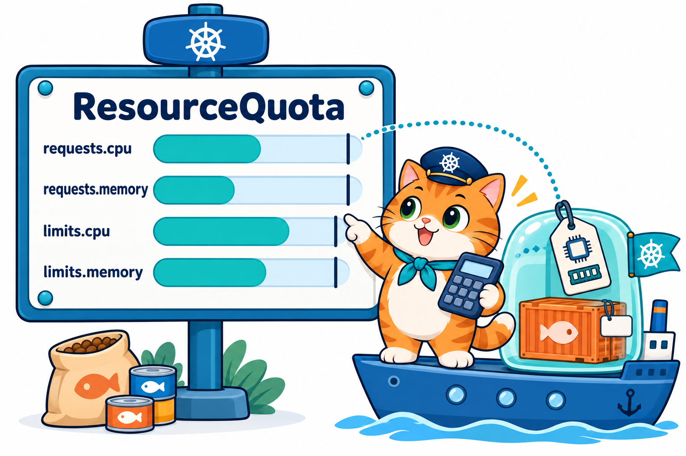<br>
  <em><b>รูปที่ 24</b> ResourceQuota คือใบงบของโซน กำหนดเพดานรวม requests/limits ของ CPU และหน่วยความจำ ทุก Pod ใหม่ต้องอยู่ในงบ</em>
</p>

**ResourceQuota** เป็น object แบบ namespaced ที่กำหนด **เพดานรวมของทั้ง namespace** แบ่งเป็น 2 กลุ่ม

| กลุ่ม | ตัวอย่างคีย์ใน `spec.hard` | ความหมาย |
|---|---|---|
| compute | `requests.cpu`, `requests.memory`, `limits.cpu`, `limits.memory` | ผลรวม requests/limits ของทุก Pod (ที่ยังไม่จบ) ในโซน |
| จำนวน object | `pods`, `configmaps`, `secrets`, `persistentvolumeclaims`, `count/<resource>.<group>` เช่น `count/jobs.batch` | จำนวน object แต่ละชนิดในโซน |

ไฟล์ `labs/lab05-quota/quota.yaml` ของ LAB 5

```yaml
apiVersion: v1
kind: ResourceQuota
metadata:
  name: budget-quota
  namespace: budget
spec:
  hard:
    pods: "3"                    # Pod ได้ไม่เกิน 3 ตัว
    requests.cpu: 500m           # ผลรวม requests ของทุก Pod ในโซน
    requests.memory: 256Mi
    limits.cpu: "1"              # ผลรวม limits ของทุก Pod ในโซน
    limits.memory: 512Mi
```

ดูสถานะงบด้วย `kubectl describe quota` (คอลัมน์ Used/Hard) ผลจริงก่อนมี Pod

```text
$ kubectl describe quota -n budget
Name:            budget-quota
Namespace:       budget
Resource         Used  Hard
--------         ----  ----
limits.cpu       0     1
limits.memory    0     512Mi
pods             0     3
requests.cpu     0     500m
requests.memory  0     256Mi
```

### 11.2 ตรวจตอนสร้าง และข้อความเมื่อเกินงบ

<p align="center" id="fig-25">
  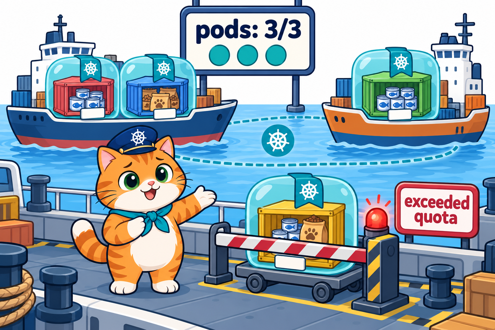<br>
  <em><b>รูปที่ 25</b> quota แบบนับจำนวน object เช่น pods: 3 กล่องใบที่สี่ถูกปฏิเสธที่หน้าโซนทันที (exceeded quota)</em>
</p>

ResourceQuota ทำงานเป็น **admission** คือด่านตรวจตอน API server รับคำขอ "สร้าง" (หรือแก้ไข) object ถ้าการสร้างทำให้ Used เกิน Hard คำขอจะถูกปฏิเสธทันที Pod จึงไม่เคยเกิดขึ้นเลย (ไม่ใช่ Pending) และ quota **ไม่ไล่ Pod เดิม** ที่มีอยู่ก่อน

ผลจริงจาก LAB 5: สร้าง Pod เล็ก 4 ตัว (ตัวละ requests 100m/64Mi, limits 200m/128Mi) ในงบ `pods: 3`

```text
$ kubectl apply -f labs/lab05-quota/small-pods.yaml
pod/small-1 created
pod/small-2 created
pod/small-3 created
Error from server (Forbidden): error when creating "labs/lab05-quota/small-pods.yaml": pods "small-4" is forbidden: exceeded quota: budget-quota, requested: pods=1, used: pods=3, limited: pods=3

$ kubectl describe quota -n budget
...
Resource         Used   Hard
--------         ----   ----
limits.cpu       600m   1
limits.memory    384Mi  512Mi
pods             3      3
requests.cpu     300m   500m
requests.memory  192Mi  256Mi
```

อ่านข้อความ `exceeded quota`: `requested` = สิ่งที่ Pod ใหม่ขอ, `used` = ใช้ไปแล้ว, `limited` = เพดาน ข้อความจะแสดง **ทุกค่าที่เกิน** ในบรรทัดเดียว (LAB สุดท้ายเกินพร้อมกัน 4 ค่า หัวข้อ 11.4)

### 11.3 Pod ที่ไม่ระบุขนาดถูกปฏิเสธ

<p align="center" id="fig-26">
  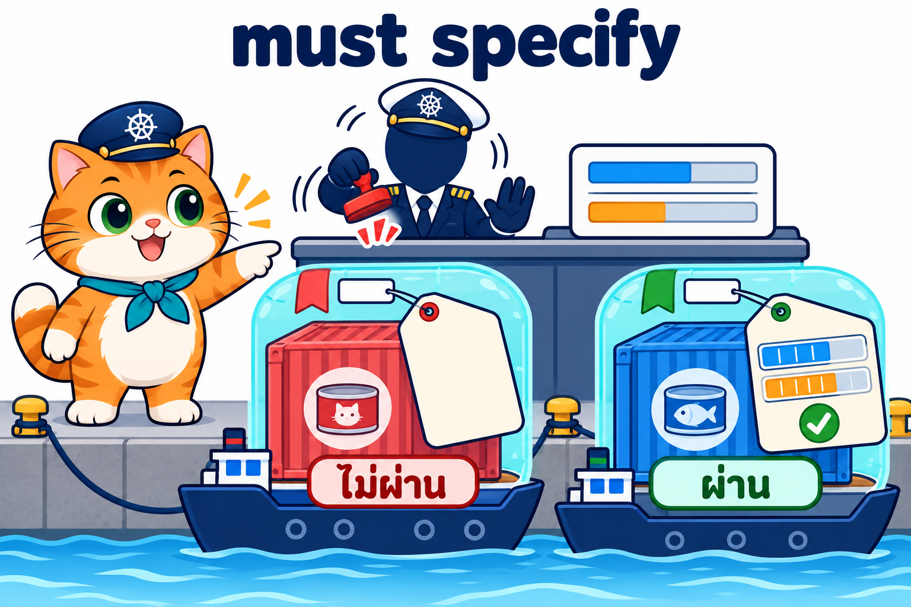<br>
  <em><b>รูปที่ 26</b> เมื่อโซนมีงบ requests แล้ว Pod ที่ไม่ระบุขนาด (requests/limits) จะถูกปฏิเสธ เพราะคำนวณงบไม่ได้</em>
</p>

เมื่อ quota มีเพดานของ compute resource ใด Pod ใหม่ **ทุกตัว** ต้องระบุค่านั้นในทุก container เพราะถ้าไม่ระบุ ระบบคำนวณงบไม่ได้ ผลจริงจาก LAB 5 กับ Pod `no-request` ที่ไม่มี `resources` เลย

```text
$ kubectl apply -f labs/lab05-quota/no-request-pod.yaml
Error from server (Forbidden): error when creating "labs/lab05-quota/no-request-pod.yaml": pods "no-request" is forbidden: failed quota: budget-quota: must specify limits.cpu for: app; limits.memory for: app; requests.cpu for: app; requests.memory for: app
```

ข้อความบอกครบทั้ง 4 ค่าที่ขาด และชื่อ container (`app`) ทางแก้คือใส่ `resources` ให้ครบ หรือให้ **LimitRange** เติมค่าให้อัตโนมัติ (หัวข้อ 12)

### 11.4 Pod ที่มี init container และ sidecar นับงบอย่างไร

quota นับ **effective request/limit ของ Pod** ซึ่งคิดจากช่วงเวลาที่ Pod ใช้ทรัพยากรมากที่สุด

> effective = ค่ามากที่สุดระหว่าง (1) ผลรวมของ sidecar ทุกตัว + container หลักทุกตัว และ (2) init container แต่ละตัว + sidecar ที่เริ่มทำงานก่อนมัน

ร้าน `som-shop` ใน LAB สุดท้ายมี `db` (sidecar), `wait-for-db`, `db-seed` (init) และ `web`

| ช่วงเวลา | container ที่รันพร้อมกัน | requests (cpu/memory) | limits (cpu/memory) |
|---|---|---|---|
| ระหว่าง `wait-for-db` | `db` + `wait-for-db` | 110m / 272Mi | 600m / 576Mi |
| ระหว่าง `db-seed` | `db` + `db-seed` | 150m / 320Mi | 800m / 768Mi |
| ร้านเปิดแล้ว | `db` + `web` | **200m / 448Mi** | **1 / 1Gi** |

ค่ามากที่สุดคือแถวสุดท้าย ตรงกับผลจริงใน LAB สุดท้าย (1 Pod ใน `som-prod`)

```text
$ kubectl describe quota prod-budget -n som-prod
Name:            prod-budget
Namespace:       som-prod
Resource         Used   Hard
--------         ----   ----
limits.cpu       1      2
limits.memory    1Gi    2Gi
pods             1      2
requests.cpu     200m   1
requests.memory  448Mi  1Gi
```

เมื่อเปิดสาขาที่ 2 Used กลายเป็น pods 2/2, limits.cpu 2/2, limits.memory 2Gi/2Gi, requests.memory 896Mi/1Gi สาขาที่ 3 จึงถูกปฏิเสธพร้อมกัน 4 ค่า

```text
Error from server (Forbidden): error when creating "STDIN": pods "som-shop-3" is forbidden: exceeded quota: prod-budget, requested: limits.cpu=1,limits.memory=1Gi,pods=1,requests.memory=448Mi, used: limits.cpu=2,limits.memory=2Gi,pods=2,requests.memory=896Mi, limited: limits.cpu=2,limits.memory=2Gi,pods=2,requests.memory=1Gi
```

(`requests.memory` เกินด้วยเพราะ 896Mi + 448Mi = 1344Mi มากกว่า 1Gi = 1024Mi ส่วน `requests.cpu` 400m + 200m = 600m ยังไม่เกิน 1 จึงไม่อยู่ในรายการ)

> ResourceQuota ยังมี **scopes** ให้นับเฉพาะ Pod บางกลุ่มได้ เช่น `BestEffort`, `NotBestEffort`, `Terminating`, `NotTerminating` หรือ Pod ที่ใช้ PriorityClass หนึ่ง ๆ (ศึกษาเพิ่มเติมได้จากเอกสารอ้างอิง)

---

## 12. LimitRange: กฎขนาดกล่องมาตรฐาน

### 12.1 แนวคิดและฟิลด์

<p align="center" id="fig-27">
  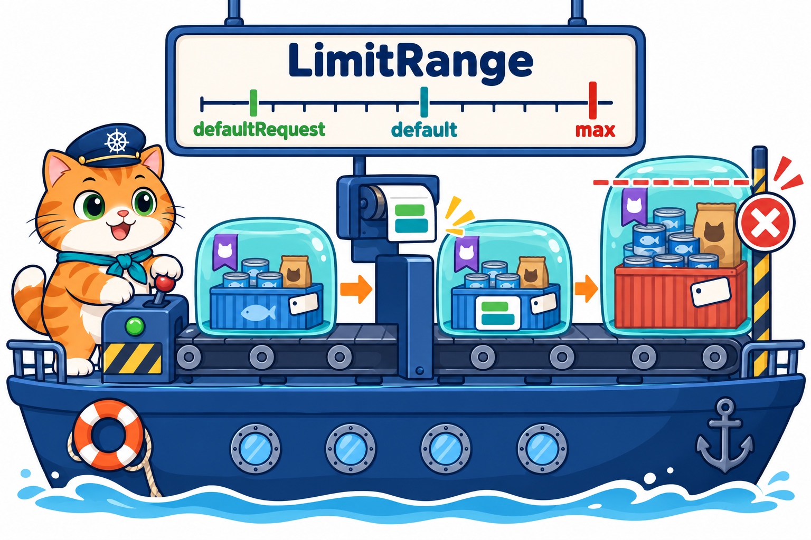<br>
  <em><b>รูปที่ 27</b> LimitRange คือป้ายกฎขนาดกล่องของโซน: กล่องที่ไม่ระบุขนาดจะได้สติกเกอร์ค่า default ให้ และห้ามเกิน max</em>
</p>

**LimitRange** เป็น object แบบ namespaced ที่คุม **ขนาดต่อกล่อง** (ต่อ container, ต่อ Pod หรือต่อ PersistentVolumeClaim) และ **เติมค่าตั้งต้น** ให้ของที่ไม่ได้ระบุ

| `type` | ใช้กับ | ฟิลด์ที่ใช้บ่อย |
|---|---|---|
| `Container` | ทุก container รวม init container และ sidecar | `defaultRequest` (requests ที่เติมให้), `default` (limits ที่เติมให้), `min`, `max`, `maxLimitRequestRatio` |
| `Pod` | ผลรวมของทุก container ใน Pod | `min`, `max`, `maxLimitRequestRatio` |
| `PersistentVolumeClaim` | ขนาดพื้นที่ที่ขอ | `min`, `max` (บท storage) |

ไฟล์ `labs/lab06-limitrange/limitrange.yaml` ของ LAB 6

```yaml
apiVersion: v1
kind: LimitRange
metadata:
  name: box-size
  namespace: budget
spec:
  limits:
    - type: Container
      defaultRequest:            # ไม่ระบุ requests → เติมค่านี้ให้
        cpu: 100m
        memory: 64Mi
      default:                   # ไม่ระบุ limits → เติมค่านี้ให้
        cpu: 200m
        memory: 128Mi
      max:                       # ห้าม limits เกินค่านี้ (ต่อ container)
        cpu: 500m
        memory: 256Mi
```

ผลจริงจาก LAB 6

```text
$ kubectl describe limitrange -n budget
Name:       box-size
Namespace:  budget
Type        Resource  Min  Max    Default Request  Default Limit  Max Limit/Request Ratio
----        --------  ---  ---    ---------------  -------------  -----------------------
Container   memory    -    256Mi  64Mi             128Mi          -
Container   cpu       -    500m   100m             200m           -
```

ผลกับ Pod ที่ **ไม่ใส่ resources** (`no-request` ตัวเดิมที่ถูก quota ปฏิเสธใน LAB 5 คราวนี้สร้างได้)

```text
$ kubectl get pod no-request -n budget -o jsonpath="{.spec.containers[0].resources}{\"\n\"}"
{"limits":{"cpu":"200m","memory":"128Mi"},"requests":{"cpu":"100m","memory":"64Mi"}}
```

และระบบติด annotation บอกว่าเติมอะไรให้

```text
kubernetes.io/limit-ranger: LimitRanger plugin set: cpu, memory request for container app; cpu, memory limit for container app
```

ผลกับ Pod ที่ขอ limit เกิน `max` (`big-pod.yaml` ขอ `limits.cpu: "1"`)

```text
$ kubectl apply -f labs/lab06-limitrange/big-pod.yaml
Error from server (Forbidden): error when creating "labs/lab06-limitrange/big-pod.yaml": pods "big" is forbidden: maximum cpu usage per Container is 500m, but limit is 1
```

ข้อควรรู้เพิ่มเติม

- LimitRange มีผลเฉพาะ **ตอนสร้าง/แก้ไข** Pod เหมือน quota Pod ที่มีอยู่ก่อนไม่ถูกแก้
- ถ้าตั้ง `default` แต่ไม่ตั้ง `defaultRequest` ระบบจะใช้ค่า `default` เป็น requests ด้วย
- container ที่ใส่ limits แต่ไม่ใส่ requests จะได้ requests เท่ากับ limits ของตัวเอง (กฎปกติของ Kubernetes) ไม่ใช่ `defaultRequest`

### 12.2 ใช้คู่กับ ResourceQuota

<p align="center" id="fig-28">
  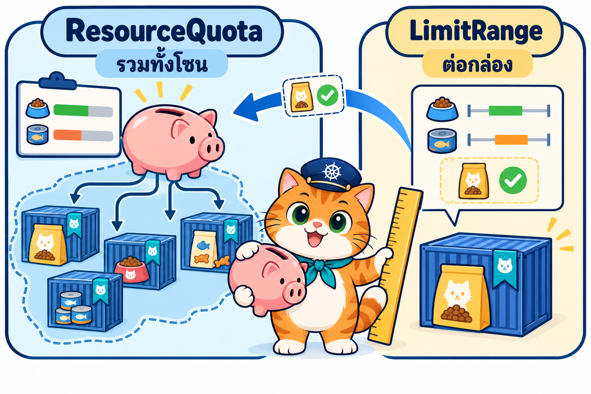<br>
  <em><b>รูปที่ 28</b> ResourceQuota คุมงบรวมของทั้งโซน ส่วน LimitRange คุมขนาดต่อกล่องและเติมค่าให้ ใช้คู่กันได้ดี</em>
</p>

ลำดับในด่านตรวจของ API server คือ **LimitRanger (เติมค่า + ตรวจ min/max) ก่อน แล้วจึงเป็น ResourceQuota (ตรวจงบรวม)** ผลที่ตามมา

1. Pod ที่ลืมใส่ resources ได้ค่าจาก LimitRange ก่อน จึงผ่านเงื่อนไข "must specify" ของ quota ได้
2. ใน LAB 6 ตอนที่ `pods` เต็ม 3/3 แล้ว `big-pod.yaml` ยังได้ข้อความ `maximum cpu usage per Container ...` ของ LimitRange ไม่ใช่ `exceeded quota` เพราะถูกตัดตกตั้งแต่ด่านแรก

**ตารางที่ 4** ResourceQuota เทียบกับ LimitRange

| | ResourceQuota | LimitRange |
|---|---|---|
| คุมอะไร | **ผลรวมทั้งโซน** (งบ) และจำนวน object | **ขนาดต่อกล่อง** (ต่อ container/Pod/PVC) |
| เติมค่าให้ไหม | ไม่ เพียงตรวจ | เติม `defaultRequest`/`default` |
| เมื่อผิด | `exceeded quota` / `must specify` | `maximum ... per Container` / `minimum ...` |
| ตรวจเมื่อไร | ตอนสร้าง/แก้ไข (หลัง LimitRange) | ตอนสร้าง/แก้ไข (ก่อน quota) |
| ดูด้วย | `kubectl describe quota -n <ns>` | `kubectl describe limitrange -n <ns>` |
| ภาพรวมทั้งสอง | `kubectl describe ns <ns>` แสดงทั้ง `Resource Quotas` และ `Resource Limits` | |

---

## 13. RBAC แบบ namespace: บัตรพนักงานเฉพาะโซน

### 13.1 ใครเป็นผู้เรียก API

<p align="center" id="fig-29">
  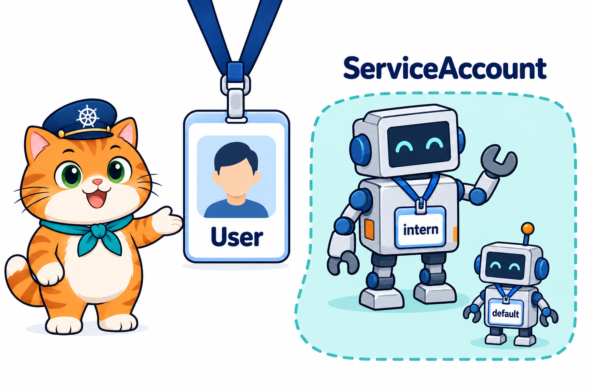<br>
  <em><b>รูปที่ 29</b> ผู้เรียก API มีสองแบบ: คน (User) กับโปรแกรม (ServiceAccount) ServiceAccount เป็นของประจำโซน และทุกโซนมี default ให้</em>
</p>

ทุกคำขอที่เข้า API server ต้องผ่าน 2 ขั้น คือ **authentication** (คุณคือใคร) และ **authorization** (คุณทำสิ่งนี้ได้ไหม) **RBAC** (Role-Based Access Control) เป็นกลไก authorization หลัก ผู้เรียก (subject) มี 3 แบบ

| subject | คืออะไร | เป็น object ใน Kubernetes ไหม | ตัวอย่างชื่อ |
|---|---|---|---|
| **User** | คน | **ไม่มี** object User มาจากหลักฐานภายนอก เช่น client certificate (CN/O), OIDC | `kubernetes-admin` |
| **ServiceAccount** | ตัวตนของโปรแกรม/Pod | **มี** และเป็น namespaced ทุก namespace มี `default` | `system:serviceaccount:team-a:intern` |
| **Group** | กลุ่มของ User/ServiceAccount | ไม่มี object | `system:serviceaccounts:team-a`, `system:authenticated` |

ผลจริง (LAB 7): เราในฐานะผู้ใช้ kind คือ `kubernetes-admin` ในกลุ่ม `kubeadm:cluster-admins` ซึ่งมีสิทธิ์ทุกอย่าง

```text
$ kubectl auth whoami
ATTRIBUTE                                           VALUE
Username                                            kubernetes-admin
Groups                                              [kubeadm:cluster-admins system:authenticated]
Extra: authentication.kubernetes.io/credential-id   [X509SHA256=ac241dd4...]
```

(`X509SHA256` บอกว่ายืนยันตัวตนด้วย client certificate ตัดค่าให้สั้น)

### 13.2 Role และ RoleBinding

<p align="center" id="fig-30">
  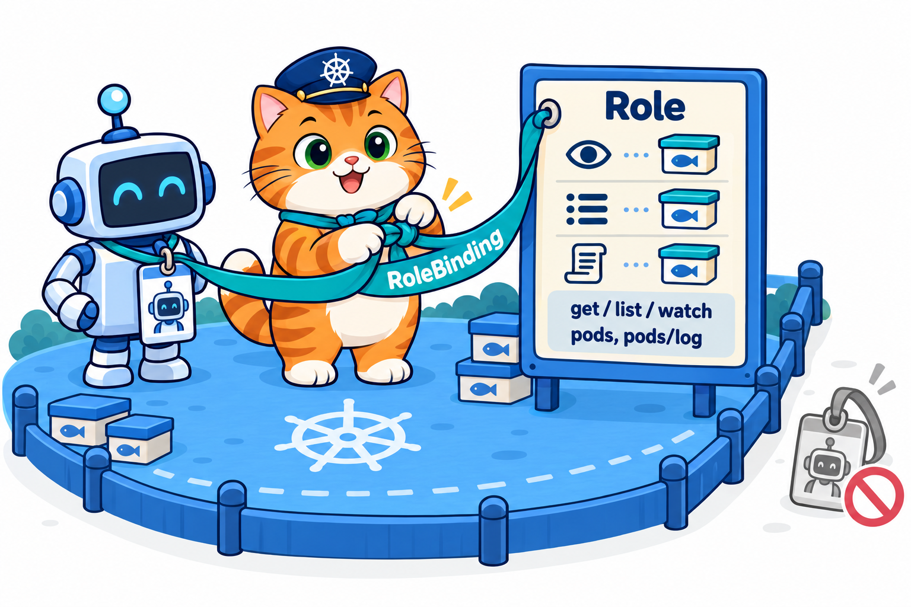<br>
  <em><b>รูปที่ 30</b> Role คือการ์ดสิทธิ์ (verbs + resources) RoleBinding คือสายคล้องผูกบัตรกับการ์ด มีผลเฉพาะในโซนนั้น</em>
</p>

- **Role** (namespaced) = การ์ดสิทธิ์ บอกว่า **ทำอะไร (verbs) กับอะไร (resources ใน apiGroups)** ได้ **ภายใน namespace ของ Role**
- **RoleBinding** (namespaced) = สายคล้องที่ผูก **subjects** (ใคร) กับ **roleRef** (การ์ดใบไหน) มีผล **เฉพาะ namespace ของ RoleBinding**

ไฟล์ `labs/lab07-rbac/sa-role-binding.yaml` ของ LAB 7

```yaml
apiVersion: v1
kind: ServiceAccount
metadata:
  name: intern
  namespace: team-a
---
apiVersion: rbac.authorization.k8s.io/v1
kind: Role
metadata:
  name: pod-reader
  namespace: team-a
rules:
  - apiGroups: [""]                    # "" = core API group (Pod อยู่กลุ่มนี้)
    resources: ["pods", "pods/log"]    # pods/log = subresource สำหรับ kubectl logs
    verbs: ["get", "list", "watch"]
---
apiVersion: rbac.authorization.k8s.io/v1
kind: RoleBinding
metadata:
  name: intern-pod-reader
  namespace: team-a
subjects:
  - kind: ServiceAccount
    name: intern
    namespace: team-a
roleRef:                               # แก้ทีหลังไม่ได้ ต้องลบแล้วสร้างใหม่
  apiGroup: rbac.authorization.k8s.io
  kind: Role
  name: pod-reader
```

**ตารางที่ 5** verbs และคำสั่ง kubectl ที่เกี่ยวข้อง

| verb | คำสั่ง kubectl ตัวอย่าง |
|---|---|
| `get` | `kubectl get pod web`, `kubectl describe pod web` |
| `list` | `kubectl get pods` |
| `watch` | `kubectl get pods -w` |
| `create` | `kubectl create -f`, `kubectl run` |
| `update` / `patch` | `kubectl apply` กับของที่มีอยู่, `kubectl label`, `kubectl edit` |
| `delete` / `deletecollection` | `kubectl delete pod web` / `kubectl delete pods --all` |

subresource บางตัวต้องให้สิทธิ์แยก เช่น `kubectl logs` ต้องการ `get` บน `pods/log`, `kubectl exec` ต้องการ `create` บน `pods/exec` และ `kubectl port-forward` ต้องการ `create` บน `pods/portforward` (ยืนยันใน LAB 7 และ LAB สุดท้าย)

กฎสำคัญของ RBAC

- **allow-only** มีแต่การ "อนุญาต" ไม่มีกฎ "ห้าม" ค่าเริ่มต้นคือห้ามทุกอย่าง สิทธิ์จากหลาย binding รวมกันแบบ OR
- **`roleRef` แก้ไม่ได้** หลังสร้าง RoleBinding ถ้าจะเปลี่ยนการ์ดต้องลบแล้วสร้างใหม่
- Role/RoleBinding ใน `team-a` ไม่มีผลใด ๆ ใน `team-b`

### 13.3 ClusterRole กับ RoleBinding และ ClusterRoleBinding

<p align="center" id="fig-31">
  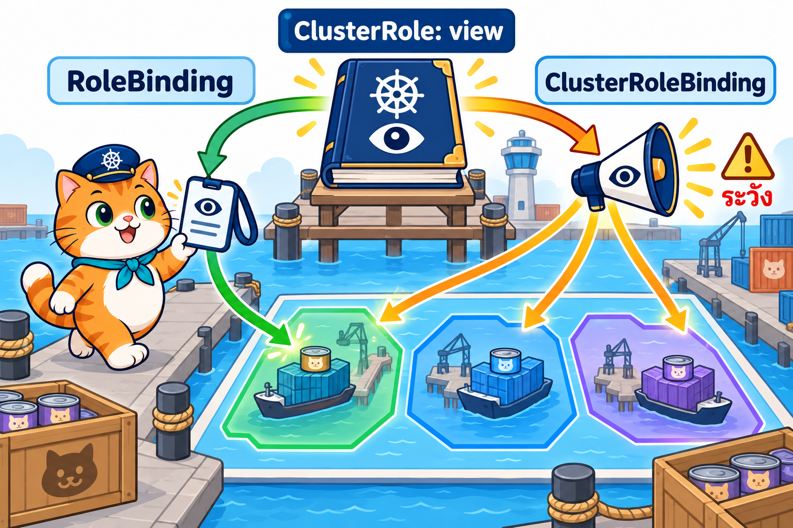<br>
  <em><b>รูปที่ 31</b> ClusterRole เป็นสมุดกฎมาตรฐานของท่าเรือ (เช่น view) นำไปใช้ในโซนเดียวด้วย RoleBinding หรือใช้ทั้งท่าด้วย ClusterRoleBinding</em>
</p>

**ClusterRole** (cluster-scoped) คือสมุดกฎสิทธิ์มาตรฐานของท่าเรือ เขียนครั้งเดียวใช้ได้หลายที่ คลัสเตอร์มี ClusterRole สำเร็จรูปให้ (ผลจริง LAB 3: `view`, `edit`, `admin`, `cluster-admin` และอื่น ๆ รวม 77 ตัว)

| ClusterRole | สิทธิ์โดยสรุป |
|---|---|
| `view` | อ่านได้เกือบทุกอย่างใน namespace **ยกเว้น Secret** และ Role/RoleBinding |
| `edit` | `view` + สร้าง/แก้/ลบ object ทั่วไปใน namespace (ไม่รวม Role/RoleBinding) |
| `admin` | `edit` + จัดการ Role/RoleBinding ใน namespace (แต่แก้ ResourceQuota หรือตัว namespace ไม่ได้) |
| `cluster-admin` | ทุกอย่างทั้งคลัสเตอร์ |

**ตารางที่ 6** การจับคู่ Role กับ Binding

| การ์ด | สายคล้อง | ผล |
|---|---|---|
| Role | RoleBinding | สิทธิ์ใน namespace นั้น (แบบที่ใช้กับ `intern`) |
| ClusterRole | RoleBinding | ใช้กฎมาตรฐานแต่มีผล **แค่ namespace ของ RoleBinding** (แบบที่ใช้กับ `auditor`) |
| ClusterRole | ClusterRoleBinding | สิทธิ์ **ทุก namespace และของ cluster-scoped** ⚠️ ระวัง ให้เท่าที่จำเป็น |
| Role | ClusterRoleBinding | ทำไม่ได้ (ClusterRoleBinding อ้างได้แค่ ClusterRole) |

ไฟล์ `labs/lab07-rbac/view-clusterrole-binding.yaml` ผูก ClusterRole `view` ให้ SA `auditor` ด้วย RoleBinding ใน `team-b` ผลจริงจาก LAB 7: `auditor` ดู Pod และ ConfigMap ใน `team-b` ได้ แต่ Secret ไม่ได้ ลบไม่ได้ และดู `team-a` ไม่ได้

```text
$ kubectl auth can-i list pods -n team-b --as=system:serviceaccount:team-b:auditor
yes
$ kubectl auth can-i list secrets -n team-b --as=system:serviceaccount:team-b:auditor
no
$ kubectl get pods -n team-a --as=system:serviceaccount:team-b:auditor
Error from server (Forbidden): pods is forbidden: User "system:serviceaccount:team-b:auditor" cannot list resource "pods" in API group "" in the namespace "team-a"
```

### 13.4 ตรวจสิทธิ์ด้วย kubectl auth can-i

<p align="center" id="fig-32">
  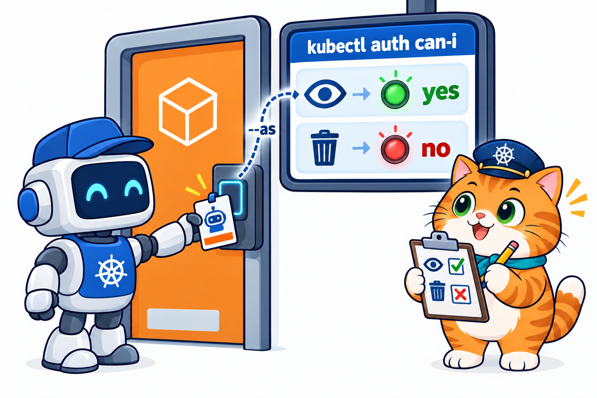<br>
  <em><b>รูปที่ 32</b> kubectl auth can-i --as=... เหมือนเครื่องอ่านบัตร ตอบ yes หรือ no ก่อนลงมือจริง</em>
</p>

`kubectl auth can-i <verb> <resource> -n <ns>` ถาม API server ว่า "ทำได้ไหม" ได้คำตอบ `yes`/`no` โดยไม่ต้องลงมือจริง เพิ่ม `--as=<ผู้ใช้>` เพื่อสวมบทเป็นคนอื่น (impersonate ทำได้เพราะเราเป็น admin) ชื่อของ ServiceAccount ที่ใช้กับ `--as` คือ `system:serviceaccount:<namespace>:<ชื่อ>` ผลจริงจาก LAB 7

| คำถาม (`--as=system:serviceaccount:team-a:intern`) | คำตอบ |
|---|:---:|
| `list pods -n team-a` | yes |
| `delete pods -n team-a` | no |
| `get pods/log -n team-a` | yes |
| `list pods -n team-b` | no |
| `create pods -n team-a` | no |

ดูสิทธิ์ทั้งหมดด้วย `--list` (ตัดบางส่วน)

```text
$ kubectl auth can-i --list -n team-a --as=system:serviceaccount:team-a:intern
Resources                                       Non-Resource URLs                      Resource Names   Verbs
selfsubjectreviews.authentication.k8s.io        []                                     []               [create]
selfsubjectaccessreviews.authorization.k8s.io   []                                     []               [create]
selfsubjectrulesreviews.authorization.k8s.io    []                                     []               [create]
pods/log                                        []                                     []               [get list watch]
pods                                            []                                     []               [get list watch]
...
```

เมื่อทำสิ่งที่ไม่มีสิทธิ์จริง ข้อความ Forbidden บอกครบว่า **ใคร** ทำ **อะไร** กับ **ชนิดไหน** ใน **namespace ไหน**

```text
$ kubectl delete pod web -n team-a --as=system:serviceaccount:team-a:intern
Error from server (Forbidden): pods "web" is forbidden: User "system:serviceaccount:team-a:intern" cannot delete resource "pods" in API group "" in the namespace "team-a"
```

### 13.5 ใช้ตัวตนของ ServiceAccount จริง และกับดัก --token

<p align="center" id="fig-33">
  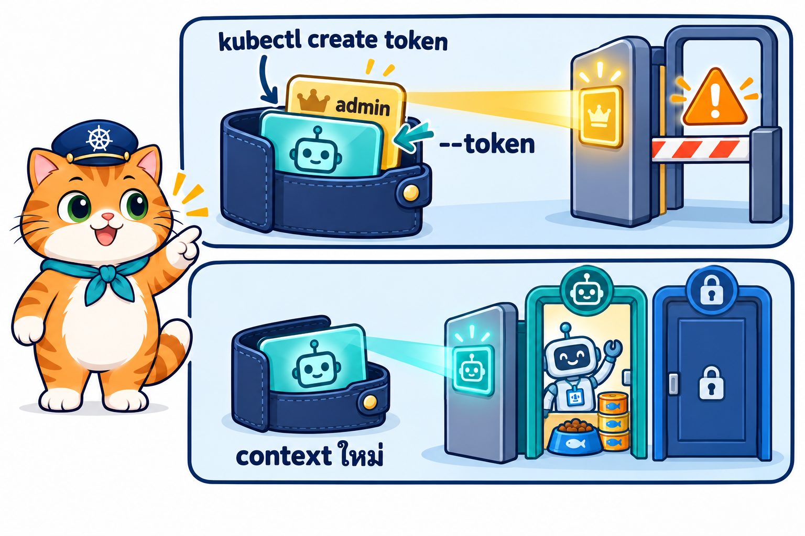<br>
  <em><b>รูปที่ 33</b> ใช้ตัวตนของ ServiceAccount จริงด้วย token ใน context ใหม่ ระวัง: kubectl --token บน kubeconfig ที่มี client certificate ยังเป็น admin เหมือนเดิม</em>
</p>

`--as` เป็นการ "สวมบท" ของ admin ถ้าอยากใช้ตัวตนของ ServiceAccount จริง ๆ ต้องมี **token** ขอ token อายุสั้นด้วย

```bash
T=$(kubectl create token intern -n team-a --duration=1h)
```

token เป็นข้อความยาว (ใน LAB 7 ยาว 925 ตัวอักษร ขึ้นต้น `eyJhbGciOi...`) เป็นรหัสลับ **ห้ามแปะลงเอกสารหรือแชท**

**กับดัก:** คิดว่าแค่ใส่ `--token` ก็จะกลายเป็น intern ผลจริงจาก LAB 7

```text
$ kubectl --token=$T get pods -n team-b
NAME     READY   STATUS    RESTARTS   AGE
client   1/1     Running   0          53s

$ kubectl --token=$T auth whoami
ATTRIBUTE                                           VALUE
Username                                            kubernetes-admin
Groups                                              [kubeadm:cluster-admins system:authenticated]
...
```

ยังเป็น `kubernetes-admin` เพราะ user `kind-lab` ใน kubeconfig มี **client certificate** อยู่แล้ว kubectl จึงยังส่ง certificate ไปด้วย และ API server ยืนยันตัวตนจาก certificate สำเร็จก่อน token ไม่ถูกใช้

**วิธีที่ถูก:** สร้าง user ใหม่ใน kubeconfig ที่มี **แต่ token** แล้วสร้าง context ใหม่ที่ใช้ user นั้น

```bash
kubectl config set-credentials intern --token=$T
kubectl config set-context intern@lab --cluster=kind-lab --user=intern --namespace=team-a
kubectl --context intern@lab auth whoami
```

ผลจริงจาก LAB 7

```text
ATTRIBUTE                                           VALUE
Username                                            system:serviceaccount:team-a:intern
UID                                                 14329203-56ac-41c3-8758-19d9d0aadd74
Groups                                              [system:serviceaccounts system:serviceaccounts:team-a system:authenticated]
...
```

ผ่าน context นี้ intern ดู Pod และ log ใน `team-a` ได้ แต่ลบ, ดู `team-b`, ดู Node/namespace และ `exec` ไม่ได้

```text
$ kubectl --context intern@lab exec web -- id
error: unable to upgrade connection: pods "web" is forbidden: User "system:serviceaccount:team-a:intern" cannot create resource "pods/exec" in API group "" in the namespace "team-a"
```

token จาก `kubectl create token` ผูกกับ ServiceAccount ตัวนั้น เมื่อ ServiceAccount หรือ namespace ถูกลบ token ใช้ไม่ได้ทันที (ผลจริง LAB สุดท้าย: `error: You must be logged in to the server (Unauthorized)`) อย่าลืมลบ context และ user ที่สร้างไว้ด้วย `kubectl config delete-context ...` และ `kubectl config delete-user ...`

> **Pod ใช้ ServiceAccount อย่างไร:** Pod ระบุ `spec.serviceAccountName` (ไม่ระบุ = `default`) แล้ว kubelet จะ mount token อายุสั้นของ ServiceAccount นั้นไว้ที่ `/var/run/secrets/kubernetes.io/serviceaccount/` ให้โปรแกรมใน Pod ใช้เรียก API ได้ตามสิทธิ์ของ ServiceAccount (ปิดได้ด้วย `automountServiceAccountToken: false`)

---

## 14. Pod Security Admission: ด่านตรวจหน้าโซน

### 14.1 Pod Security Standards 3 ระดับ

<p align="center" id="fig-34">
  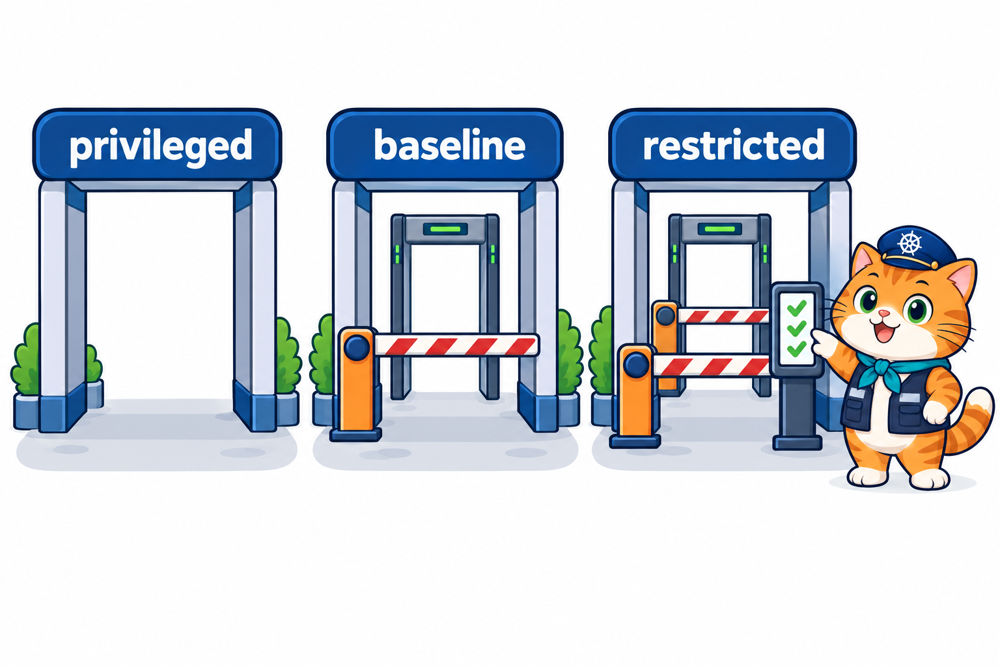<br>
  <em><b>รูปที่ 34</b> Pod Security Standards มี 3 ระดับ: privileged (ปล่อยผ่าน), baseline (กันของอันตรายชัด ๆ), restricted (เข้มที่สุด)</em>
</p>

Kubernetes กำหนดมาตรฐานความปลอดภัยของ Pod (Pod Security Standards) ไว้ 3 ระดับ

| ระดับ | แนวคิด | ตัวอย่างสิ่งที่ห้าม |
|---|---|---|
| `privileged` | ไม่จำกัดเลย | – (สำหรับงานระบบที่ต้องการสิทธิ์เต็ม) |
| `baseline` | กันของอันตรายที่ชัดเจน ใช้ได้กับ image ทั่วไปส่วนใหญ่ | `privileged: true`, `hostNetwork`/`hostPID`/`hostIPC`, volume แบบ `hostPath`, `hostPort`, เพิ่ม capability นอกชุดปลอดภัย, seccomp `Unconfined` |
| `restricted` | เข้มที่สุด ตามแนวปฏิบัติที่ดี | ทุกข้อของ baseline + ต้อง `runAsNonRoot: true` (และห้าม `runAsUser: 0`), `allowPrivilegeEscalation: false`, `capabilities.drop: ["ALL"]` (เพิ่มคืนได้แค่ `NET_BIND_SERVICE`), `seccompProfile.type` เป็น `RuntimeDefault` หรือ `Localhost`, ใช้ volume ได้เฉพาะชนิดที่ปลอดภัย (เช่น `emptyDir`, `configMap`, `secret`, `projected`, `persistentVolumeClaim`) |

**Pod Security Admission (PSA)** เป็นด่านตรวจที่มีในตัว API server อยู่แล้ว ทำหน้าที่บังคับมาตรฐานเหล่านี้ **ต่อ namespace** (PSA มาแทน PodSecurityPolicy ที่ถูกถอดออกตั้งแต่ Kubernetes v1.25)

### 14.2 3 โหมด ตั้งด้วย label ของ namespace

<p align="center" id="fig-35">
  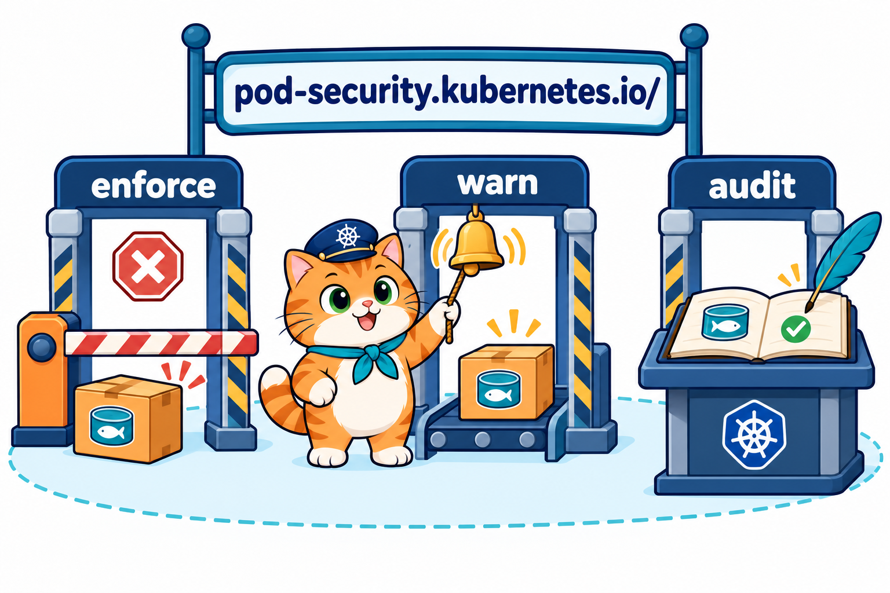<br>
  <em><b>รูปที่ 35</b> ตั้งด้วย label บน namespace ได้ 3 โหมด: enforce (ไม้กั้นปฏิเสธ), warn (กระดิ่งเตือนแต่ให้ผ่าน), audit (จดลงสมุดบันทึก)</em>
</p>

| label บน namespace | โหมด | ผลเมื่อ Pod ไม่ผ่านระดับที่กำหนด |
|---|---|---|
| `pod-security.kubernetes.io/enforce: <ระดับ>` | ไม้กั้น | **ปฏิเสธ** ไม่สร้าง Pod (`Forbidden`) |
| `pod-security.kubernetes.io/warn: <ระดับ>` | กระดิ่ง | สร้างได้ แต่ kubectl แสดง `Warning: would violate PodSecurity ...` |
| `pod-security.kubernetes.io/audit: <ระดับ>` | สมุดบันทึก | สร้างได้ แต่จดลง audit log ของ API server |
| `pod-security.kubernetes.io/<โหมด>-version: latest` หรือ `v1.37` | | เลือกเวอร์ชันของมาตรฐาน (ไม่ระบุ = `latest`) |

ตั้งหลายโหมดพร้อมกันได้ เช่น namespace `som-prod` ใน LAB สุดท้าย (`som-shop-envs/k8s/00-namespaces.yaml`)

```yaml
apiVersion: v1
kind: Namespace
metadata:
  name: som-prod
  labels:
    env: prod
    team: som
    pod-security.kubernetes.io/enforce: restricted        # ด่านปฏิเสธ
    pod-security.kubernetes.io/enforce-version: latest
    pod-security.kubernetes.io/warn: restricted           # กระดิ่งเตือนที่ kubectl
```

ส่วน `som-dev` และ `som-staging` ใส่แค่ `warn: restricted` (เห็นคำเตือนแต่ไม่บล็อก) ซึ่งเป็นรูปแบบที่พบบ่อย: ผ่อนใน dev เข้มใน prod

ผลจริงจาก LAB 8 ใน namespace `secure` ที่ตั้ง `enforce=baseline` + `warn=restricted`

```text
$ kubectl apply -f labs/lab08-psa/root-nginx-pod.yaml
Warning: would violate PodSecurity "restricted:latest": allowPrivilegeEscalation != false (container "nginx" must set securityContext.allowPrivilegeEscalation=false), unrestricted capabilities (container "nginx" must set securityContext.capabilities.drop=["ALL"]), runAsNonRoot != true (pod or container "nginx" must set securityContext.runAsNonRoot=true), seccompProfile (pod or container "nginx" must set securityContext.seccompProfile.type to "RuntimeDefault" or "Localhost")
pod/root-nginx created

$ kubectl apply -f labs/lab08-psa/privileged-pod.yaml
Error from server (Forbidden): error when creating "labs/lab08-psa/privileged-pod.yaml": pods "privileged" is forbidden: violates PodSecurity "baseline:latest": privileged (container "app" must not set securityContext.privileged=true)
```

nginx ทางการรันเป็น root ผ่าน baseline (แต่มีคำเตือนของ restricted) ส่วน Pod ที่ขอ `privileged: true` ถูก baseline ปฏิเสธ

### 14.3 ตรวจเฉพาะตอนสร้าง Pod

PSA ตรวจ **ตอนสร้าง Pod** เท่านั้น ถ้าเปลี่ยน label ของ namespace ให้เข้มขึ้นภายหลัง Pod เดิม **ยังรันต่อ** มีแต่คำเตือน ก่อนเปลี่ยนจริงจึงควรลองด้วย `--dry-run=server` ผลจริงจาก LAB 8

```text
$ kubectl label --dry-run=server --overwrite ns secure pod-security.kubernetes.io/enforce=restricted
Warning: existing pods in namespace "secure" violate the new PodSecurity enforce level "restricted:latest"
Warning: root-nginx: allowPrivilegeEscalation != false, unrestricted capabilities, runAsNonRoot != true, seccompProfile
namespace/secure labeled (server dry run)
```

หลังเปลี่ยนจริง `root-nginx` เดิมยัง `Running` แต่ Pod ใหม่แบบเดียวกันถูกปฏิเสธ

```text
$ kubectl run root-nginx-2 -n secure --image=nginx:1.27-alpine
Error from server (Forbidden): pods "root-nginx-2" is forbidden: violates PodSecurity "restricted:latest": allowPrivilegeEscalation != false (container "root-nginx-2" must set securityContext.allowPrivilegeEscalation=false), unrestricted capabilities (container "root-nginx-2" must set securityContext.capabilities.drop=["ALL"]), runAsNonRoot != true (pod or container "root-nginx-2" must set securityContext.runAsNonRoot=true), seccompProfile (pod or container "root-nginx-2" must set securityContext.seccompProfile.type to "RuntimeDefault" or "Localhost")
```

เมื่อ Pod มีหลาย container ข้อความจะรวมชื่อ container ไว้ในแต่ละข้อ เช่น ร้านฉบับบทที่ 2 (`som-shop-v002.yaml`) ที่ไม่มี `securityContext` เลยเมื่อ apply เข้า `som-prod` (ผลจริง LAB สุดท้าย)

```text
Error from server (Forbidden): error when creating "som-shop-envs/k8s/som-shop-v002.yaml": pods "som-shop-old" is forbidden: violates PodSecurity "restricted:latest": allowPrivilegeEscalation != false (containers "db", "wait-for-db", "db-seed", "web" must set securityContext.allowPrivilegeEscalation=false), unrestricted capabilities (containers "db", "wait-for-db", "db-seed", "web" must set securityContext.capabilities.drop=["ALL"]), runAsNonRoot != true (pod or containers "db", "wait-for-db", "db-seed", "web" must set securityContext.runAsNonRoot=true), seccompProfile (pod or containers "db", "wait-for-db", "db-seed", "web" must set securityContext.seccompProfile.type to "RuntimeDefault" or "Localhost")
```

### 14.4 ทำ Pod ให้ผ่าน restricted

<p align="center" id="fig-36">
  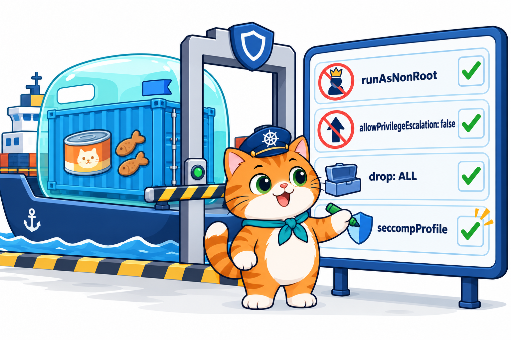<br>
  <em><b>รูปที่ 36</b> ทำ Pod ให้ผ่าน restricted ด้วย securityContext: ไม่รันเป็น root, ห้ามยกระดับสิทธิ์, ทิ้ง capabilities ทั้งหมด, ใช้ seccomp RuntimeDefault</em>
</p>

ข้อความ Forbidden บอก 4 เรื่องที่ต้องแก้ แต่ละเรื่องแก้ด้วย `securityContext` ระดับ Pod หรือระดับ container

| ข้อความ | แก้ด้วย | ระดับ |
|---|---|---|
| `runAsNonRoot != true` | `runAsNonRoot: true` + `runAsUser: <เลขที่ไม่ใช่ 0>` | Pod หรือ container |
| `allowPrivilegeEscalation != false` | `allowPrivilegeEscalation: false` | container |
| `unrestricted capabilities` | `capabilities: {drop: ["ALL"]}` | container |
| `seccompProfile` | `seccompProfile: {type: RuntimeDefault}` | Pod หรือ container |

ไฟล์ `labs/lab08-psa/restricted-ok-pod.yaml` ของ LAB 8

```yaml
apiVersion: v1
kind: Pod
metadata:
  name: restricted-ok
  namespace: secure
spec:
  terminationGracePeriodSeconds: 1
  securityContext:               # ระดับ Pod: ใช้กับทุก container
    runAsNonRoot: true           # ห้ามรันเป็น root
    runAsUser: 1000              # uid ที่ใช้รัน (ต้องเป็นตัวเลข)
    runAsGroup: 1000             # gid หลัก
    seccompProfile:
      type: RuntimeDefault       # ตัวกรอง system call มาตรฐานของ container runtime
  containers:
    - name: app
      image: busybox:1.36
      command: ["sleep", "3600"]
      securityContext:           # ระดับ container
        allowPrivilegeEscalation: false   # ห้ามยกระดับสิทธิ์ (เช่น setuid)
        capabilities:
          drop: ["ALL"]          # ทิ้งสิทธิ์พิเศษของ Linux ทั้งหมด
```

ผลจริง: Pod ผ่าน restricted และรันด้วย `uid=1000 gid=1000 groups=1000` (ถ้าไม่ใส่ `runAsGroup` จะได้ `gid=0(root)` ซึ่ง restricted ยอม แต่ไม่ควร)

**กับดัก image ที่ระบุ USER เป็นชื่อ:** image `som-shop-web` ระบุ `USER node` (เป็น "ชื่อ" ไม่ใช่ตัวเลข) เมื่อ Pod ตั้ง `runAsNonRoot: true` แต่ไม่ได้ระบุ `runAsUser` kubelet ตรวจไม่ได้ว่า `node` ไม่ใช่ root จึงไม่ยอมเริ่ม container ผลจริงจาก LAB สุดท้าย (ทดลองลบ `runAsUser: 1000`)

```text
som-shop-nouid   1/2     Init:CreateContainerConfigError   0          20s
Error: container has runAsNonRoot and image has non-numeric user (node), cannot verify user is non-root (pod: "som-shop-nouid_som-dev(...)", container: db-seed)
```

ข้อนี้ **PSA ไม่เตือน** เพราะ manifest ตั้ง `runAsNonRoot: true` ครบตามกฎแล้ว error มาจาก kubelet ตอนสร้าง container ทางแก้คือใส่ `runAsUser` เป็นตัวเลข (`node` = 1000, `postgres` ใน image alpine = 70)

> nginx ทางการ (`nginx:1.27-alpine`) เริ่มทำงานเป็น root เพื่อเปิด port 80 จึงผ่าน restricted ไม่ได้ ถ้าต้องการ nginx ใน namespace restricted ต้องใช้ image รุ่นที่ออกแบบให้รันแบบ non-root

---

## 15. แนวปฏิบัติการตั้งชื่อและแบ่ง namespace

<p align="center" id="fig-37">
  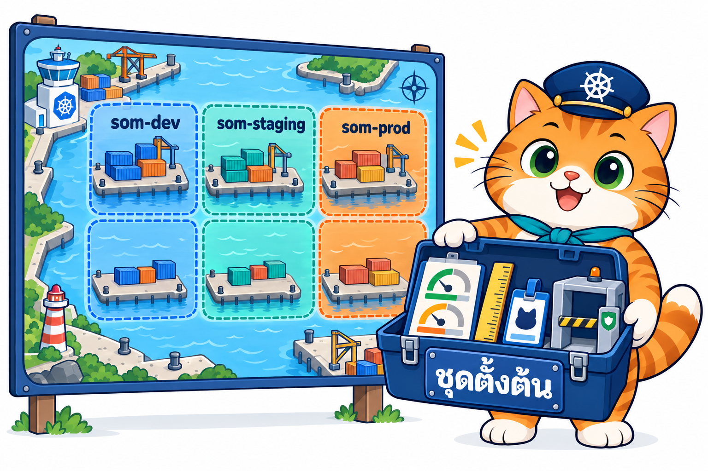<br>
  <em><b>รูปที่ 37</b> แบ่ง namespace ตามทีม ตาม environment หรือทั้งคู่ และให้ทุกโซนใหม่มีชุดตั้งต้น quota, LimitRange, RBAC และ Pod Security</em>
</p>

**การแบ่งและตั้งชื่อ**

- เลือกแกนการแบ่งให้ชัด: ตามทีม, ตาม environment, ตามแอป หรือ **ทีม + environment** (`som-dev`, `som-staging`, `som-prod`) และใช้รูปแบบเดียวกันทั้งองค์กร
- **อย่าแบ่งละเอียดเกินไป** namespace ละ 1 Pod ทำให้ต้องดูแล quota/RBAC/policy จำนวนมาก
- ติด label มาตรฐานให้ namespace เช่น `env`, `team`, `app.kubernetes.io/part-of` เพื่อค้นหาและใช้กับ selector
- ไม่ใช้ชื่อขึ้นต้น `kube-` (สงวนให้ระบบตามธรรมเนียม แม้ API จะยอม)

**ชุดตั้งต้นของทุก namespace ใหม่**

| ชิ้น | ทำไม |
|---|---|
| ResourceQuota | กันทีมเดียวใช้ทรัพยากรจนคนอื่นช้า |
| LimitRange | เติมค่าให้ Pod ที่ลืมใส่ resources (ไม่งั้นติด "must specify" ของ quota) และกันกล่องใหญ่เกิน |
| RoleBinding | ให้ทีมมีสิทธิ์เฉพาะโซนตัวเอง (มักใช้ ClusterRole `edit`/`view` + RoleBinding) |
| label ของ PSA | อย่างน้อย `warn=restricted` และ `enforce=restricted` ใน prod |
| NetworkPolicy | default deny + อนุญาตเฉพาะที่จำเป็น |

**ข้อควรระวังในการทำงานจริง**

- **อย่าใช้ `default` กับงานจริง** ไม่มี quota, LimitRange และเป็นที่ที่ของ "หลง" มาอยู่เมื่อลืมระบุ namespace
- **`kubectl delete ns` ลบทั้งก้อน** ไม่มีถังขยะ ตรวจชื่อและ context ทุกครั้ง
- ในสคริปต์และกับ prod ให้ใส่ `-n` ชัดเจนทุกคำสั่ง
- ต้องการแยกขาดจริง (ลูกค้าต่างบริษัท, ข้อกำหนดด้านความปลอดภัยสูง) ให้แยกคลัสเตอร์

> **ปูทางบทหน้า:** บทนี้ยังใช้ Pod เดี่ยวและเปิดหน้าร้านด้วย `kubectl port-forward` บทถัดไปจะให้ตัวสร้าง Pod อัตโนมัติ (Deployment) ดูแลจำนวน Pod และใช้ Service เป็นที่อยู่คงที่ของร้าน ซึ่งทั้งสองอย่างเป็น object แบบ namespaced อีกเช่นกัน ทุกอย่างที่เรียนในบทนี้ (quota, LimitRange, RBAC, PSA, NetworkPolicy และชื่อ DNS `<service>.<namespace>`) จะใช้ต่อได้ทันที

---

## 16. สรุปและคำถามทบทวน

<p align="center" id="fig-38">
  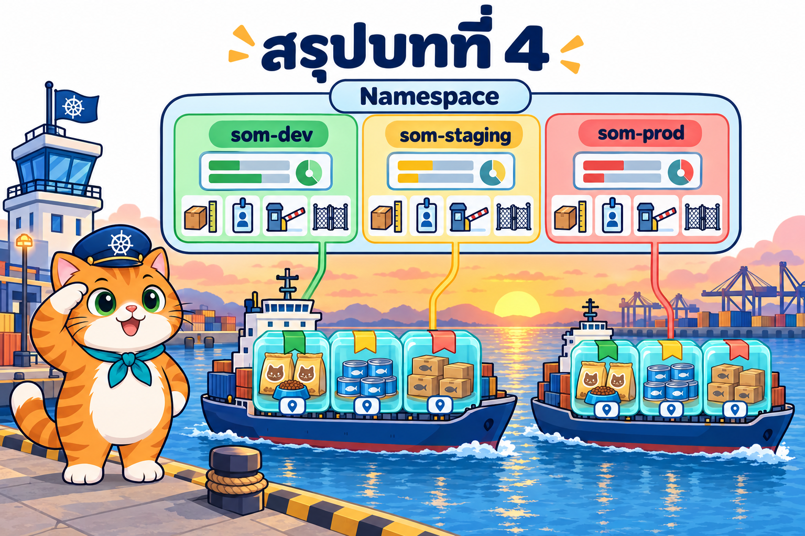<br>
  <em><b>รูปที่ 38</b> สรุปบท: ท่าเรือเดียวแบ่งโซนด้วย Namespace แต่ละโซนมีงบ กฎขนาดกล่อง บัตรพนักงาน ด่านตรวจ และรั้วของตัวเอง</em>
</p>

### 16.1 สรุป

1. **Namespace** คือการแบ่งคลัสเตอร์ทางทะเบียน เป็นขอบเขตของชื่อ (`namespace/name`) และหน่วยที่ใช้แนบนโยบาย **ไม่ใช่** Node, VM หรือกำแพงเครือข่าย Pod ของโซนเดียวกระจายหลายเรือได้ และเรือลำเดียวรับหลายโซนได้
2. kind มี namespace ตั้งต้น 5 ตัว: `default`, `kube-system`, `kube-public`, `kube-node-lease` และ `local-path-storage` (ของ kind) ทุก namespace ได้ label `kubernetes.io/metadata.name`, ServiceAccount `default` และ ConfigMap `kube-root-ca.crt` อัตโนมัติ
3. resource แบ่งเป็น **namespaced** (34 ชนิดใน v1.37) และ **cluster-scoped** (37 ชนิด) ดูได้จาก `kubectl api-resources` และ `-n` ไม่มีผลกับ cluster-scoped
4. namespace ของ object มาจาก `metadata.namespace` หรือ `-n` หรือ context ตามลำดับ ถ้าไฟล์กับ `-n` ไม่ตรงกันได้ error ไฟล์ที่ใช้หลาย environment จึงไม่ควรใส่ `metadata.namespace`
5. context ใน kubeconfig จับคู่ cluster + user + namespace เปลี่ยน namespace เริ่มต้นได้ด้วย `kubectl config set-context --current --namespace=...` แต่ต้องระวังลืมคืนค่า
6. `kubectl delete ns` ลบทุกอย่างข้างใน ผ่านสถานะ `Terminating` และ finalizer `kubernetes` ระหว่างนั้นสร้างของใหม่ไม่ได้ ระบบป้องกันการลบเฉพาะ `default`, `kube-system`, `kube-public` (`kube-node-lease` ลบได้แต่ห้ามลบ)
7. Pod ต่าง namespace คุยกันด้วย Pod IP ได้ทันที ชื่อ DNS สั้นหาได้เฉพาะในโซนตัวเองเพราะ search domain ขึ้นต้นด้วย `<ns>.svc.cluster.local`
8. **NetworkPolicy** (ต้องมี CNI ที่รองรับ kindnet รองรับ) ทำให้ Pod ที่ถูกเลือก "ปฏิเสธทุกอย่างยกเว้นที่อนุญาต" policy รวมกันแบบ OR และอ้าง namespace ด้วย `namespaceSelector` + `kubernetes.io/metadata.name`
9. **ResourceQuota** คุมงบรวมของโซน **LimitRange** คุมขนาดต่อกล่องและเติมค่าตั้งต้น ทั้งสองตรวจตอนสร้าง Pod โดย LimitRange ทำงานก่อน quota
10. **RBAC**: Role + RoleBinding = สิทธิ์ในโซนเดียว, ClusterRole + RoleBinding = กฎมาตรฐานในโซนเดียว, ClusterRoleBinding = ทั้งคลัสเตอร์ ตรวจด้วย `kubectl auth can-i --as` และใช้ token ของ ServiceAccount ผ่าน context ใหม่ (ไม่ใช่ `--token` บน kubeconfig ที่มี client certificate)
11. **Pod Security Admission** ใช้ label `pod-security.kubernetes.io/<enforce|warn|audit>` กับระดับ `privileged`/`baseline`/`restricted` ตรวจตอนสร้าง Pod เท่านั้น ผ่าน restricted ด้วย `runAsNonRoot` + `runAsUser` ตัวเลข, `allowPrivilegeEscalation: false`, `drop: ["ALL"]`, `seccompProfile: RuntimeDefault`

**ตารางที่ 7** สรุปคำสั่งที่ใช้ในบทนี้

| คำสั่ง | ใช้ทำอะไร |
|---|---|
| `kubectl get ns --show-labels` | ดู namespace ทั้งหมดพร้อม label |
| `kubectl create namespace <ns>` / `kubectl apply -f ns.yaml` | สร้าง namespace |
| `kubectl get pods -n <ns>` / `-A` | ดู Pod ในโซนเดียว / ทุกโซน |
| `kubectl get pods -A --field-selector metadata.name=<ชื่อ>` | หา object ชื่อเดียวกันข้ามทุกโซน |
| `kubectl api-resources --namespaced=true\|false` | แยกชนิด namespaced / cluster-scoped |
| `kubectl config get-contexts` | ดู context และ namespace เริ่มต้น |
| `kubectl config set-context --current --namespace=<ns>` | เปลี่ยน namespace เริ่มต้นของ context |
| `kubectl get ns -l team=som -L env` | ค้น namespace ด้วย label และแสดง label เป็นคอลัมน์ |
| `kubectl describe ns <ns>` | ดู label, quota และ LimitRange ของโซน |
| `kubectl delete ns <ns>` | ลบโซนทั้งก้อน |
| `kubectl describe quota -n <ns>` / `kubectl describe limitrange -n <ns>` | ดูงบ Used/Hard / กฎขนาดกล่อง |
| `kubectl get netpol -n <ns>` / `kubectl describe netpol -n <ns>` | ดู NetworkPolicy |
| `kubectl auth whoami` | ดูว่าเราเป็นใคร |
| `kubectl auth can-i <verb> <resource> -n <ns> --as=<subject>` | ตรวจสิทธิ์ |
| `kubectl create token <sa> -n <ns> --duration=1h` | ขอ token อายุสั้นของ ServiceAccount |
| `kubectl config set-credentials` / `set-context` / `delete-context` / `delete-user` | จัดการ user/context ใน kubeconfig |
| `kubectl label --dry-run=server --overwrite ns <ns> pod-security.kubernetes.io/enforce=restricted` | ลองเปลี่ยนระดับ PSA ก่อนบังคับจริง |

**ตารางที่ 8** เทียบนโยบาย 5 ชนิดที่แนบกับ namespace

| นโยบาย | ควบคุมอะไร | ตรวจเมื่อไร | ผลเมื่อผิด (ข้อความจริง) |
|---|---|---|---|
| NetworkPolicy | ใครเชื่อมต่อเครือข่ายถึง Pod ได้ | ทุก packet (โดย CNI) | packet ถูกทิ้ง `wget: download timed out` |
| ResourceQuota | งบรวม requests/limits และจำนวน object ของโซน | ตอนสร้าง/แก้ไข object | `exceeded quota: ...` / `must specify ...` |
| LimitRange | ขนาดต่อ container/Pod/PVC และค่าตั้งต้น | ตอนสร้าง/แก้ไข Pod (ก่อน quota) | `maximum cpu usage per Container is 500m, but limit is 1` |
| RBAC | ใครเรียก API อะไรได้ | ทุกคำขอ API | `User "..." cannot delete resource "pods" ...` |
| Pod Security Admission | การตั้งค่าความปลอดภัยของ Pod | ตอนสร้าง Pod | `violates PodSecurity "restricted:latest": ...` |

> **ข้อควรจำก่อนเข้า LAB**
> - ทุก LAB ทำใน namespace ของตัวเอง **ไม่ทิ้งของไว้ใน `default`** และจบด้วยการเก็บกวาดด้วย `kubectl delete ns ...`
> - หลัง LAB 2 ต้อง **คืน namespace ของ context เป็น `default`** และตรวจด้วย `kubectl config get-contexts` ทุกครั้งที่ผลดูแปลก
> - ห้ามลองลบ `kube-node-lease`, `kube-system` หรือ `local-path-storage` จริง (ใช้ `--dry-run=server` เท่านั้น)
> - context/user ของ intern ที่สร้างใน LAB 7 และ LAB สุดท้ายต้องลบออกจาก kubeconfig ตอนเก็บกวาด
> - IP, AGE, เวลา และ Node ที่ Pod ถูกวางในเครื่องผู้เรียนอาจต่างจากเอกสาร

### 16.2 คำถามทบทวน

**1. นักศึกษาคนหนึ่งบอกว่า "namespace `team-a` อยู่บนเครื่อง lab-worker ส่วน `team-b` อยู่บน lab-worker2" ข้อความนี้ผิดอย่างไร และจะพิสูจน์ด้วยคำสั่งอะไร**

<details>
<summary>แนวคำตอบ</summary>

namespace เป็นการแบ่งทางทะเบียน ไม่ได้ผูกกับ Node Pod ของ namespace เดียวกันอยู่หลาย Node ได้ และ Node เดียวรับ Pod จากหลาย namespace ได้ (Node เป็น cluster-scoped) พิสูจน์ด้วย `kubectl get pods -A -o wide` ดูคอลัมน์ NAMESPACE คู่กับ NODE เช่นใน LAB 4 ที่ Pod ของ `team-a` และ `team-b` อยู่บน `lab-worker` ทั้งหมด และใน LAB 1 ที่ `snack` ของ 3 namespace อยู่บน 2 Node ปนกัน
</details>

**2. ทำไม `kubectl get nodes -n blue` จึงได้ผลเหมือนไม่ใส่ `-n` แต่ `kubectl get pods -n blue` ได้เฉพาะ Pod ของ blue**

<details>
<summary>แนวคำตอบ</summary>

Node เป็น resource แบบ cluster-scoped ไม่อยู่ใน namespace ใด kubectl จึงไม่ใช้ค่า `-n` ในการเรียก API (ไม่ error แต่ไม่กรอง) ส่วน Pod เป็น namespaced จึงถูกกรองตาม namespace ตรวจ scope ได้จากคอลัมน์ `NAMESPACED` ของ `kubectl api-resources`
</details>

**3. ไฟล์ `app.yaml` มี `metadata.namespace: green` เมื่อสั่ง `kubectl apply -f app.yaml -n blue` จะเกิดอะไรขึ้น และถ้าต้องการใช้ไฟล์เดียวกับทั้ง dev/staging/prod ควรเขียนไฟล์อย่างไร**

<details>
<summary>แนวคำตอบ</summary>

kubectl ปฏิเสธด้วย `error: the namespace from the provided object "green" does not match the namespace "blue". You must pass '--namespace=green' to perform this operation.` และไม่สร้างอะไร ไฟล์ที่ใช้หลาย environment ไม่ควรใส่ `metadata.namespace` แล้วเลือกปลายทางด้วย `-n` ตอนสั่ง เช่น `kubectl apply -f som-shop.yaml -n som-prod`
</details>

**4. `kubectl create -f snack-pod.yaml -n blue` กับ `kubectl apply -f snack-pod.yaml -n blue` ให้ผลต่างกันอย่างไรเมื่อมี `blue/snack` อยู่แล้ว**

<details>
<summary>แนวคำตอบ</summary>

`create` ต้องการสร้างใหม่ จึงได้ `Error from server (AlreadyExists): ... pods "snack" already exists` ส่วน `apply` ต้องการให้ object ตรงกับไฟล์ เมื่อตรงอยู่แล้วตอบ `pod/snack unchanged` (ถ้าไฟล์ต่าง จะพยายามแก้ object เดิม ไม่สร้างตัวที่สอง) ทั้งสองแบบไม่ทำให้มี Pod ชื่อซ้ำใน namespace เดียวกัน
</details>

**5. หลังสั่ง `kubectl config set-context --current --namespace=blue` แล้วปิด terminal เปิดใหม่ คำสั่ง `kubectl delete pod snack` จะลบ Pod ใน namespace ไหน เพราะอะไร และควรป้องกันอย่างไร**

<details>
<summary>แนวคำตอบ</summary>

ลบ `blue/snack` เพราะค่าถูกเขียนลงไฟล์ kubeconfig (`~/.kube/config`) ซึ่งคงอยู่ข้าม terminal จนกว่าจะเปลี่ยนกลับ ป้องกันโดยตรวจ `kubectl config get-contexts` (คอลัมน์ NAMESPACE) ก่อนคำสั่งอันตราย ใส่ `-n` ชัดเจนเสมอกับ namespace สำคัญและในสคริปต์ และคืนค่าด้วย `--namespace=default` เมื่อเลิกใช้
</details>

**6. อธิบายลำดับเหตุการณ์ตั้งแต่ `kubectl delete ns doomed` จน namespace หายไป และทำไมช่วงนั้นจึงสร้าง Pod ใหม่ใน `doomed` ไม่ได้**

<details>
<summary>แนวคำตอบ</summary>

API server ตั้ง deletionTimestamp และ `status.phase` เป็น `Terminating` ทันที namespace controller ไล่ลบ object ทุกชนิดข้างใน (Pod รอ grace period ของตัวเอง ใน LAB 9 คือ 15 วินาที) เมื่อว่างแล้วจึงเอา finalizer `kubernetes` ออกจาก `spec.finalizers` แล้ว Namespace object ก็หายไป (ผลจริง ~20 วินาที) ระหว่าง Terminating API server ปฏิเสธการสร้างของใหม่ด้วย `unable to create new content in namespace doomed because it is being terminated` เพื่อไม่ให้มีของงอกใหม่ระหว่างกำลังเก็บกวาด ซึ่งจะทำให้ลบไม่จบ
</details>

**7. namespace ใดบ้างที่ระบบป้องกันการลบ และทำไม `kube-node-lease` แม้ลบได้ก็ไม่ควรลบ**

<details>
<summary>แนวคำตอบ</summary>

ระบบป้องกัน `default`, `kube-system`, `kube-public` (`this namespace may not be deleted`) ส่วน `kube-node-lease` ผ่าน `--dry-run=server` แปลว่าลบได้จริง แต่เป็นที่เก็บ Lease ซึ่ง kubelet ทุกเรือต่ออายุเป็น heartbeat ทุก ~10 วินาที ถ้าลบ ระบบตรวจสุขภาพ Node จะสะดุด เป็นข้อห้ามตามธรรมเนียมที่ API ไม่ได้บังคับ เช่นเดียวกับการตั้งชื่อขึ้นต้น `kube-`
</details>

**8. Pod `client` ใน `team-b` เรียกชื่อ `web` แต่ไม่พบ ทั้งที่มี Service ชื่อ `web` อยู่ใน `team-a` อธิบายจาก `/etc/resolv.conf` และบอกชื่อที่ควรใช้**

<details>
<summary>แนวคำตอบ</summary>

`resolv.conf` ของ Pod ใน team-b มี `search team-b.svc.cluster.local svc.cluster.local cluster.local` ชื่อสั้น `web` จึงถูกค้นเป็น `web.team-b.svc.cluster.local` ก่อน ซึ่งไม่มี ต้องเรียกด้วย `web.team-a` หรือชื่อเต็ม `web.team-a.svc.cluster.local` (การเรียกด้วย Pod IP ตรง ๆ ใช้ได้เสมอถ้าไม่มี NetworkPolicy กั้น)
</details>

**9. ใน LAB 4 หลัง apply `allow-same-namespace` และ `allow-from-team-b` แล้ว ทำไม `team-b/client` จึงเข้า `team-a/web` ได้ แต่เข้า `team-a/client` ไม่ได้ และ `blue/snack` เข้าอะไรใน team-a ไม่ได้เลย**

<details>
<summary>แนวคำตอบ</summary>

`allow-same-namespace` เลือกทุก Pod ใน team-a (`podSelector: {}`) ทำให้ทุกตัวปฏิเสธขาเข้ายกเว้นจาก Pod ใน team-a เอง ส่วน `allow-from-team-b` เลือกเฉพาะ `app=web` และอนุญาตจาก namespace ที่มี `kubernetes.io/metadata.name=team-b` policy รวมกันแบบ OR ดังนั้น `web` รับได้ทั้งจาก team-a และ team-b แต่ `client` ของ team-a ถูกเลือกโดย policy แรกเท่านั้นจึงรับแค่จาก team-a ส่วน `blue` ไม่ตรง policy ใดเลย
</details>

**10. namespace `budget` มี quota `pods: 3, requests.cpu: 500m` Pod ที่ไม่ระบุ resources เลยจะเกิดอะไรขึ้น และถ้าเพิ่ม LimitRange (`defaultRequest` 100m/64Mi, `default` 200m/128Mi) ผลจะเปลี่ยนอย่างไร**

<details>
<summary>แนวคำตอบ</summary>

ไม่มี LimitRange: ถูกปฏิเสธ `failed quota: ... must specify ...` เพราะ quota คำนวณงบไม่ได้ เมื่อมี LimitRange: LimitRanger ทำงานก่อน quota เติม requests 100m/64Mi และ limits 200m/128Mi ให้ (พร้อม annotation `kubernetes.io/limit-ranger`) แล้ว quota จึงคำนวณได้ Pod สร้างได้ถ้ายังไม่เกินงบ
</details>

**11. ร้าน `som-shop` มี sidecar `db` (req 100m/256Mi), init `wait-for-db` (10m/16Mi), init `db-seed` (50m/64Mi) และ `web` (100m/192Mi) quota จะนับ requests ของ Pod นี้เท่าไร เพราะอะไร**

<details>
<summary>แนวคำตอบ</summary>

นับค่าสูงสุดของช่วงเวลาที่รันพร้อมกัน: ช่วง wait-for-db = db + wait = 110m/272Mi, ช่วง db-seed = db + seed = 150m/320Mi, ช่วงร้านเปิด = db + web = 200m/448Mi ค่าสูงสุดคือ **200m/448Mi** ตรงกับ Used ที่เห็นจริงใน `som-prod` (limits คิดแบบเดียวกันได้ 1 CPU/1Gi)
</details>

**12. RoleBinding ที่อ้าง ClusterRole `view` ใน namespace `team-b` ทำให้ `auditor` ทำอะไรได้บ้าง และต่างจาก ClusterRoleBinding ที่อ้าง `view` อย่างไร**

<details>
<summary>แนวคำตอบ</summary>

RoleBinding ทำให้กฎของ ClusterRole `view` มีผลเฉพาะ `team-b` auditor จึงอ่าน Pod, ConfigMap ฯลฯ ใน team-b ได้ แต่อ่าน Secret ไม่ได้ (view ไม่รวม Secret) ลบไม่ได้ และดู namespace อื่นไม่ได้ (ผลจริง LAB 7) ถ้าใช้ ClusterRoleBinding auditor จะอ่านได้ **ทุก namespace** ซึ่งเกินความจำเป็นและเสี่ยง
</details>

**13. ทำไม `kubectl --token=$T get pods -n team-b` ด้วย token ของ intern จึงยังเห็น Pod ของ team-b และวิธีที่ถูกต้องในการทดสอบสิทธิ์ของ intern คืออะไร (บอกได้ 2 วิธี)**

<details>
<summary>แนวคำตอบ</summary>

kubeconfig ของ kind ใช้ user ที่มี client certificate kubectl จึงยังส่ง certificate และ API server ยืนยันตัวตนเป็น `kubernetes-admin` จาก certificate ได้ก่อน (`kubectl --token=$T auth whoami` ยังได้ kubernetes-admin) วิธีที่ถูก: (1) ใช้ `kubectl auth can-i ... --as=system:serviceaccount:team-a:intern` หรือสั่งคำสั่งจริงด้วย `--as` (2) สร้าง user ที่มีแต่ token ด้วย `kubectl config set-credentials intern --token=$T` และ context ใหม่ `kubectl config set-context intern@lab --cluster=kind-lab --user=intern --namespace=team-a` แล้วใช้ `kubectl --context intern@lab ...`
</details>

**14. namespace `secure` เดิมเป็น `enforce=baseline` และมี Pod nginx ที่รันเป็น root อยู่ ถ้าเปลี่ยนเป็น `enforce=restricted` จะเกิดอะไรกับ Pod เดิมและ Pod ใหม่ และควรทำอะไรก่อนเปลี่ยนจริง**

<details>
<summary>แนวคำตอบ</summary>

PSA ตรวจเฉพาะตอนสร้าง Pod เดิมจึงยัง Running แต่ kubectl แสดงคำเตือน `existing pods in namespace "secure" violate the new PodSecurity enforce level "restricted:latest"` ส่วน Pod ใหม่แบบเดียวกันจะถูกปฏิเสธ `violates PodSecurity "restricted:latest": ...` ก่อนเปลี่ยนจริงควรรัน `kubectl label --dry-run=server --overwrite ns secure pod-security.kubernetes.io/enforce=restricted` เพื่อดูว่า Pod ใดจะผิด หรือเริ่มจาก `warn=restricted` ก่อน
</details>

**15. Pod ที่ใช้ image `USER node` ตั้ง `runAsNonRoot: true` ครบตาม restricted แล้ว PSA ยอม แต่ Pod ค้าง `CreateContainerConfigError` เกิดจากอะไร และแก้อย่างไร**

<details>
<summary>แนวคำตอบ</summary>

kubelet ต้องยืนยันว่า user ไม่ใช่ root แต่ image ระบุ user เป็น "ชื่อ" (`node`) ซึ่ง kubelet แปลงเป็นเลขเพื่อตรวจไม่ได้ จึงได้ `container has runAsNonRoot and image has non-numeric user (node), cannot verify user is non-root` แก้โดยใส่ `runAsUser` (และควรใส่ `runAsGroup`) เป็นตัวเลข เช่น 1000 สำหรับ node, 70 สำหรับ postgres ใน image alpine
</details>

**16. ถ้าต้องตั้ง namespace ใหม่ให้ทีมหนึ่งใช้ทำ prod ควรมีอะไรบ้างใน "ชุดตั้งต้น" และเมื่อไรควรเลือกแยกคลัสเตอร์แทน**

<details>
<summary>แนวคำตอบ</summary>

ชุดตั้งต้น: label ระบุทีม/environment, ResourceQuota (งบรวม), LimitRange (ค่าตั้งต้นและขนาดสูงสุดต่อ container), RoleBinding ให้ทีม (เช่น ClusterRole `edit` ผ่าน RoleBinding และ `view` ให้ผู้ตรวจ), label PSA `enforce=restricted` และ NetworkPolicy (default deny + อนุญาตเฉพาะที่จำเป็น รวม DNS ถ้าคุม egress) ควรแยกคลัสเตอร์เมื่อต้องการแยกขาดจริง เช่น ลูกค้าต่างองค์กร ข้อกำหนดด้านความปลอดภัย/กฎหมาย หรือต้องการเวอร์ชัน/ของ cluster-scoped ต่างกัน เพราะ namespace ยังใช้ API server, Node และ kernel ร่วมกัน
</details>

---

## 17. เอกสารอ้างอิง

1. The Kubernetes Authors. *Namespaces*. https://kubernetes.io/docs/concepts/overview/working-with-objects/namespaces/
2. The Kubernetes Authors. *Share a Cluster with Namespaces*. https://kubernetes.io/docs/tasks/administer-cluster/namespaces/
3. The Kubernetes Authors. *Organizing Cluster Access Using kubeconfig Files*. https://kubernetes.io/docs/concepts/configuration/organize-cluster-access-kubeconfig/
4. The Kubernetes Authors. *Configure Access to Multiple Clusters*. https://kubernetes.io/docs/tasks/access-application-cluster/configure-access-multiple-clusters/
5. The Kubernetes Authors. *Object Names and IDs* (RFC 1123 label names). https://kubernetes.io/docs/concepts/overview/working-with-objects/names/
6. The Kubernetes Authors. *Finalizers*. https://kubernetes.io/docs/concepts/overview/working-with-objects/finalizers/
7. The Kubernetes Authors. *DNS for Services and Pods*. https://kubernetes.io/docs/concepts/services-networking/dns-pod-service/
8. The Kubernetes Authors. *Network Policies*. https://kubernetes.io/docs/concepts/services-networking/network-policies/
9. The Kubernetes Authors. *Resource Quotas*. https://kubernetes.io/docs/concepts/policy/resource-quotas/
10. The Kubernetes Authors. *Limit Ranges*. https://kubernetes.io/docs/concepts/policy/limit-range/
11. The Kubernetes Authors. *Using RBAC Authorization*. https://kubernetes.io/docs/reference/access-authn-authz/rbac/
12. The Kubernetes Authors. *Service Accounts*. https://kubernetes.io/docs/concepts/security/service-accounts/
13. The Kubernetes Authors. *Authenticating*. https://kubernetes.io/docs/reference/access-authn-authz/authentication/
14. The Kubernetes Authors. *Pod Security Standards*. https://kubernetes.io/docs/concepts/security/pod-security-standards/
15. The Kubernetes Authors. *Pod Security Admission*. https://kubernetes.io/docs/concepts/security/pod-security-admission/
16. The Kubernetes Authors. *Enforce Pod Security Standards with Namespace Labels*. https://kubernetes.io/docs/tasks/configure-pod-container/enforce-standards-namespace-labels/
17. The Kubernetes Authors. *Configure a Security Context for a Pod or Container*. https://kubernetes.io/docs/tasks/configure-pod-container/security-context/
18. The Kubernetes Authors. *Multi-tenancy*. https://kubernetes.io/docs/concepts/security/multi-tenancy/
19. The Kubernetes Authors. *Well-Known Labels, Annotations and Taints* (`kubernetes.io/metadata.name`). https://kubernetes.io/docs/reference/labels-annotations-taints/
20. kind — Kubernetes IN Docker. *Quick Start*. https://kind.sigs.k8s.io/docs/user/quick-start/

---

> **หมายเหตุเกี่ยวกับภาพประกอบ:** ภาพประกอบ 38 ภาพในโฟลเดอร์ [`images/`](images/) และภาพตัวละครน้องส้ม (`00-character-som.png`) สร้างขึ้นด้วยปัญญาประดิษฐ์สำหรับการสร้างภาพเพื่อใช้ประกอบการเรียนการสอน ชุดคำสั่งสร้างภาพอยู่ใน [`images/imagegen-prompts.md`](images/imagegen-prompts.md) ภาพใช้อุปมาเชิงเปรียบเทียบเพื่อช่วยความเข้าใจ ตัวเลขในภาพ (เช่น IP ของ Pod) เป็นค่าตัวอย่าง ผู้เรียนควรใช้เนื้อหาในเอกสารนี้และเอกสารอ้างอิงเป็นหลัก ผลลัพธ์คำสั่งทั้งหมดมาจากการทดลองจริง (kind v0.33.0, Kubernetes v1.37.0) ค่าเวลา, IP และชื่อ Node ที่ Pod ถูกวางในเครื่องผู้เรียนอาจต่างกัน
