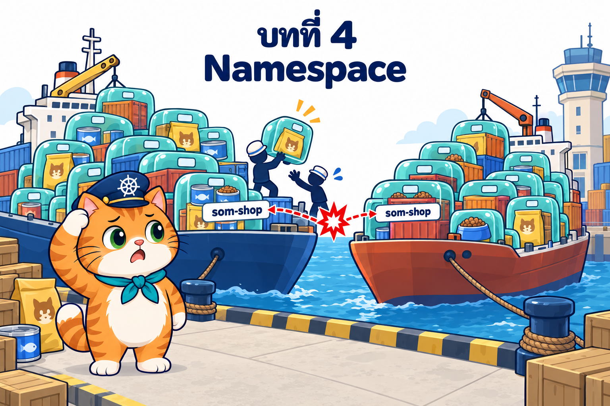

# บทที่ 4: Namespace — แบ่งโซนบนท่าเรือเดียวกัน

> **รายวิชา:** Software Development Tools and Environments (DevTools)
> **หัวข้อ:** Kubernetes Namespace และนโยบายระดับ namespace — namespace ตั้งต้น, namespaced/cluster-scoped, kubeconfig/context, การลบ namespace, NetworkPolicy, ResourceQuota, LimitRange, RBAC และ Pod Security Admission
> **ผลลัพธ์การเรียนรู้ที่เกี่ยวข้อง:** CLO-5, CLO-6

<p align="center">
  <br>
  <em>ร้านน้องส้มโตขึ้น มีทั้งทีมทดลองของใหม่ ทีมทดสอบ และร้านจริง ทุกคนวางกล่องปนกันบนท่าเรือเดียว ชื่อชนกันและใครจะลบของใครก็ได้</em>
</p>

## บทนี้เรียนอะไร

บทที่ 1–3 เราสร้าง Pod ทุกตัวลงใน namespace `default` โดยไม่รู้ตัว เมื่อร้านอาหารแมวน้องส้มมีทั้งทีมพัฒนา ทีมทดสอบ และร้านจริงใช้คลัสเตอร์เดียวกัน ปัญหาก็ตามมา: ชื่อชนกัน ใครลบของใครก็ได้ ทีมหนึ่งใช้ทรัพยากรจนอีกทีมช้า และตั้งกฎความปลอดภัยแยกกันไม่ได้ บทนี้แก้ด้วย **Namespace** หรือ **โซนทาสีบนแผนผังท่าเรือ** แล้วเติมกติกาให้แต่ละโซน ได้แก่ รั้ว (NetworkPolicy) งบ (ResourceQuota) กฎขนาดกล่อง (LimitRange) บัตรพนักงานเฉพาะโซน (RBAC) และด่านตรวจหน้าโซน (Pod Security Admission) ปิดท้ายด้วยการเปิด **ร้านน้องส้ม 3 environment (`som-dev`, `som-staging`, `som-prod`) จาก manifest ไฟล์เดียว** แล้วลบ environment dev ทั้งก้อนโดยร้านจริงไม่สะดุด

| ส่วน | เนื้อหา | ลิงก์ |
|---|---|---|
| 📖 **ทฤษฎี** | นิยามและข้อเข้าใจผิดของ namespace, namespace ตั้งต้น 5 ตัวของ kind, namespaced vs cluster-scoped, `metadata.namespace` / `-n` / `-A`, kubeconfig และ context, label ของ namespace, การลบและ finalizers, DNS search domain, NetworkPolicy, ResourceQuota, LimitRange, RBAC (ServiceAccount, Role, RoleBinding, ClusterRole), Pod Security Admission และแนวปฏิบัติการแบ่ง namespace (38 ภาพประกอบ + คำถามทบทวนพร้อมแนวคำตอบ) | [01_Theory/README.md](01_Theory/README.md) |
| 🧪 **ปฏิบัติการ** | LAB 0–10 จากง่ายไปยาก: สำรวจโซนเริ่มต้น → สร้าง namespace และ Pod ชื่อซ้ำ → context → namespaced/cluster-scoped → ข้ามโซนและ NetworkPolicy → ResourceQuota → LimitRange → RBAC → Pod Security Admission → ลบโซนทั้งก้อน → **LAB สุดท้าย: ร้านน้องส้มแยก environment** (พร้อมภาพหน้าจอจริง) และ Troubleshooting, Checklist, ตารางเก็บกวาด | [02_LAB/README.md](02_LAB/README.md) |

## คำแนะนำในการเรียน

1. **อ่านทฤษฎีหัวข้อ 1–8 ก่อน** (นิยาม, namespace ตั้งต้น, scope, การสร้าง/เลือก/ลบ namespace, context) แล้วเริ่ม LAB 0–3 ได้
2. ก่อน LAB 4 อ่านหัวข้อ 9–10 (network, DNS, NetworkPolicy) ก่อน LAB 5–6 อ่านหัวข้อ 11–12 (quota, LimitRange) ก่อน LAB 7–8 อ่านหัวข้อ 13–14 (RBAC, Pod Security) และก่อน LAB 10 อ่านหัวข้อ 15
3. ทำ LAB **ตามลำดับ** บาง LAB ใช้ namespace ต่อจาก LAB ก่อนหน้า (บอกไว้ในแต่ละ LAB) และ **ทำบล็อก "เก็บกวาด" ทุกครั้ง** โดยเฉพาะการคืน namespace ของ context เป็น `default` และการลบ context ของ intern ใช้เวลารวมประมาณ 3–3.5 ชั่วโมง
4. สังเกตสัญลักษณ์ว่าคำสั่งรันที่ไหน: 🖥️ บนเครื่องนักศึกษา / 🐧 ใน SSH session ของ k8s-lab / 🌐 browser
5. ผลลัพธ์ในเอกสารมาจากการทดลองจริง (kind v0.33.0, Kubernetes v1.37.0) แต่ **เวลา, IP และ Node ที่ Pod ถูกวางอาจต่างจากเครื่องของนักศึกษา**
6. ลองตอบคำถามทบทวนด้วยตัวเองก่อนเปิดดูแนวคำตอบ

> **ขอบเขตของบทนี้:** ยังใช้ **Pod เดี่ยว ๆ เท่านั้น** และเปิดหน้าร้านด้วย `kubectl port-forward` ร่วมกับ `ssh -L` เหมือนบทที่ 2–3 ตัวช่วยดูแลจำนวน Pod และที่อยู่คงที่ของร้านเป็น **เนื้อหาของบทถัดไป** ซึ่งจะนำ namespace และนโยบายทั้งหมดของบทนี้ไปใช้ต่อ

## สิ่งที่ต้องผ่านก่อน

- [บทที่ 1: Kubernetes และสถาปัตยกรรม](../001_kubernetes-introduction/01_theory/README.md) และ [LAB บทที่ 1](../001_kubernetes-introduction/02_LAB/readme.md): เข้าใจบทบาทของ Control Plane, Worker Node และมี container **`k8s-lab`** ที่ล็อกอินได้ด้วย `ssh -p 2223 root@localhost` (รหัส `passwd` ใช้เพื่อการเรียนเท่านั้น)
- [บทที่ 2: Kubernetes Pod](../002_kubernetes_pod/01_Theory/README.md) และ [LAB บทที่ 2](../002_kubernetes_pod/02_LAB/README.md): เขียน Pod YAML ได้ เข้าใจ labels, resources (requests/limits), probes, init container/sidecar, emptyDir และเคยเปิดร้านน้องส้มด้วย port-forward + `ssh -L`
- [บทที่ 3: Node กับ Pod](../003_kubernetes_node_pod/01_Theory/README.md) และ [LAB บทที่ 3](../003_kubernetes_node_pod/02_LAB/README.md): เข้าใจ Node, kube-scheduler, label/affinity/taint, static Pod และ Downward API และ **คืนสภาพคลัสเตอร์** (ไม่มี label/taint/cordon ค้าง) แล้ว
- คลัสเตอร์ kind `lab` จากบทก่อน **ใช้ต่อได้** ถ้ายังไม่มี (หรือเพิ่ง restart `k8s-lab`) LAB 0 จะสร้างใหม่ด้วย `k8s-up`
- เครื่องต่ออินเทอร์เน็ตได้ (ดึง image `nginx`, `busybox`, `postgres`, `node`) และมีพื้นที่ดิสก์ว่างสำหรับ image ราว 1–2 GB

## โครงสร้างโฟลเดอร์

```text
004_kubernetes_namespace/
├── README.md                         ← หน้านี้
├── 01_Theory/
│   ├── README.md                     ← เอกสารทฤษฎี
│   └── images/                       ← ภาพประกอบ 00–38 (+ imagegen-prompts.md)
└── 02_LAB/
    ├── README.md                     ← คู่มือ LAB 0–10
    ├── images/                       ← ภาพประกอบ LAB 01–23 (+ imagegen-prompts.md) และ screenshots/ ภาพหน้าจอจริงของร้าน 3 environment
    ├── labs/                         ← YAML ของ LAB 1–9
    │   ├── lab01-create-ns/
    │   ├── lab04-network/
    │   ├── lab05-quota/
    │   ├── lab06-limitrange/
    │   ├── lab07-rbac/
    │   ├── lab08-psa/
    │   └── lab09-delete-ns/
    └── som-shop-envs/                ← LAB 10 ร้านน้องส้มแยก environment
        ├── app/                      ← แอป Next.js + Dockerfile (som-shop-web:1.1 อ่านข้อความหัว/ท้ายหน้าจาก env)
        └── k8s/                      ← 00-namespaces.yaml, prod-guardrails.yaml, som-shop.yaml, som-shop-v002.yaml, intern-rbac.yaml
```

ใน LAB 0 จะคัดลอกโฟลเดอร์ทั้งหมดนี้เข้า container ด้วย 🖥️ `docker cp 004_kubernetes_namespace k8s-lab:/workspace/` แล้วทำงานที่ `/workspace/004_kubernetes_namespace/02_LAB` ภายใน k8s-lab (แอปและ manifest ของ LAB 10 อยู่ที่ `/workspace/004_kubernetes_namespace/02_LAB/som-shop-envs/`)

## เริ่มเลย

👉 [อ่านทฤษฎี](01_Theory/README.md) → [ลงมือทำ LAB](02_LAB/README.md)
