# LAB บทที่ 5: ReplicaSet — หัวหน้ากะที่นับบูธให้ครบ สู่ร้านน้องส้ม 3 บูธ

> **รายวิชา:** Software Development Tools and Environments (DevTools)
> **หัวข้อ:** ปฏิบัติการ ReplicaSet — ทบทวน Pod เดี่ยวที่หายถาวร, สร้าง ReplicaSet แรก, self-healing (ลบ Pod, drain, เรือล่ม), scale, กับดัก label, selector ที่แก้ไม่ได้และ template ใหม่, ลบแบบ cascade/orphan, ReplicaSet กับ quota/LimitRange/PSA, กระจาย replica ข้ามเรือ และร้านอาหารแมวน้องส้ม 3 บูธด้วย ReplicaSet
> **ผลลัพธ์การเรียนรู้ที่เกี่ยวข้อง:** CLO-5, CLO-6
> **ทฤษฎีประกอบ:** [01_Theory/README.md](../01_Theory/README.md)

---

## บทนำ

ใน LAB นี้นักศึกษาจะทำตามน้องส้มที่จ้าง **หัวหน้ากะ (ReplicaSet)** มานับบูธให้ครบ เริ่มจากยืนยันอีกครั้งว่า Pod เดี่ยวลบแล้วหายถาวร แล้วสร้าง ReplicaSet ตัวแรก ลองลบ Pod, drain เรือ และ (ทางเลือก) ทำให้เรือล่มเพื่อดู self-healing scale ขึ้นลงและดูว่า Pod ตัวไหนถูกลบ เจอกับดักของการ "นับจาก label" ลองแก้ selector และ template ลบ ReplicaSet แบบต่าง ๆ ทดลองกับงบและด่านความปลอดภัยของบทที่ 4 และกระจายบูธข้ามเรือแบบบทที่ 3 ปิดท้ายด้วย **ร้านอาหารแมวน้องส้ม 3 บูธ** ที่ไม่ล้มแม้บูธหาย แต่จะเผยปัญหาใหม่ 3 ข้อที่ส่งต่อไปบทที่ 6 และ 7

ผลลัพธ์ทุกบล็อก ```` ```text ```` ในเอกสารนี้มาจาก **การทดลองจริง** บน container ที่สร้างจาก image เดียวกับ `k8s-lab` (`tuchsanai/devtools-kind:2569_1`, Kubernetes v1.37.0) เมื่อ 5 ตุลาคม 2569 ตัดบางส่วนเพื่อให้กระชับ (แทนด้วย `...`) **เวลา, AGE, IP, ชื่อ Pod ที่สุ่ม (เช่น `snack-rs-46p58`) และ Node ที่ scheduler เลือก (lab-worker หรือ lab-worker2) ในเครื่องนักศึกษาจะต่างจากตัวอย่าง** เป็นเรื่องปกติ ให้ยึดผลจากเครื่องตัวเองเสมอ และเมื่อคำสั่งในเอกสารมีชื่อ Pod ให้ **แทนด้วยชื่อที่เห็นในเครื่องตัวเอง** (หรือใช้ตัวแปรตามที่เอกสารแสดง)

### สัญลักษณ์บอกว่ารันคำสั่งที่ไหน

| สัญลักษณ์ | ความหมาย |
|---|---|
| 🖥️ **บนเครื่องนักศึกษา** | Terminal/PowerShell ของเครื่องตัวเอง (Windows/macOS/Linux) |
| 🐧 **ใน SSH session ของ k8s-lab** | หน้าต่างที่ล็อกอิน `ssh -p 2223 root@localhost` แล้ว (prompt `root@k8s-lab`) หรือ Terminal ของ JupyterLab `http://localhost:8889` |
| 🌐 **browser บนเครื่องนักศึกษา** | Chrome/Edge/Firefox บนเครื่องตัวเอง |

คำสั่ง `kubectl`, `kind` และ `docker` ของบทนี้รัน 🐧 **ใน SSH session ของ k8s-lab** ทั้งหมด ยกเว้นการ `docker cp` โฟลเดอร์เข้า container และการเปิดท่อ `ssh -L` ใน LAB 9 ที่ทำ 🖥️ บนเครื่องนักศึกษา หลาย LAB ใช้ **2 หน้าต่าง** (เรียกว่า terminal 1 และ terminal 2) ให้เปิด SSH session ที่สองด้วยคำสั่งเดียวกัน

### กติกาของ LAB บทนี้

- ทุก LAB ทำในโฟลเดอร์ **`/workspace/005_kubernetes_replicaset/02_LAB`** ภายใน k8s-lab (LAB 9 ย้ายเข้า `som-booths/` ตามที่บอกในขั้นตอน)
- บทนี้ใช้ **ReplicaSet เท่านั้น** ยังไม่ใช้ตัวช่วยเรื่องที่อยู่คงที่หรือการเปลี่ยนรุ่น (เนื้อหาบทที่ 6–7) การเข้าถึงแอปใช้ `kubectl exec`, `kubectl logs` และ `kubectl port-forward pod/...` + `ssh -L` เหมือนบทที่ 2–4
- **ทุก LAB ทำใน namespace ของตัวเอง** LAB 0–6 ใช้ namespace `rs-lab` ต่อเนื่องกัน (ลบตอนท้าย LAB 6) LAB 7 ใช้ `rs-quota`/`rs-psa` LAB 8 ใช้ `rs-spread` LAB 9 ใช้ `som-booths` ทุก LAB จบด้วยบล็อก "เก็บกวาด"
- Pod busybox ใน LAB ตั้ง `terminationGracePeriodSeconds: 1` เพราะ `sh` ไม่ตอบ SIGTERM ทำให้ Pod ที่ถูกลบขึ้นสถานะ `Error` ชั่วครู่ก่อนหาย **ไม่ใช่ความผิดพลาด**
- รหัสผ่าน SSH `passwd` และรหัสฐานข้อมูล `meow1234` ในเอกสารนี้เป็น **ค่าตัวอย่างเพื่อการเรียนเท่านั้น** ห้ามใช้กับระบบจริง

## สารบัญ LAB

| LAB | ชื่อ | เวลาโดยประมาณ | ความยาก |
|:---:|---|:---:|:---:|
| 0 | [เตรียมคลัสเตอร์ + ทบทวน Pod เดี่ยวหายถาวร](#lab-0-เตรียมคลัสเตอร์--ทบทวน-pod-เดี่ยวหายถาวร) | 15 นาที | ⭐ |
| 1 | [ReplicaSet แรก](#lab-1-replicaset-แรก) | 15 นาที | ⭐ |
| 2 | [Self-healing: ลบ Pod, drain และเรือล่ม](#lab-2-self-healing-ลบ-pod-drain-และเรือล่ม) | 20 นาที (+10 นาทีทางเลือก) | ⭐⭐ |
| 3 | [Scale](#lab-3-scale) | 10 นาที | ⭐⭐ |
| 4 | [กับดัก label](#lab-4-กับดัก-label) | 20 นาที | ⭐⭐⭐ |
| 5 | [selector แก้ไม่ได้ + template ใหม่ Pod เดิมไม่เปลี่ยน](#lab-5-selector-แก้ไม่ได้--template-ใหม่-pod-เดิมไม่เปลี่ยน) | 15 นาที | ⭐⭐⭐ |
| 6 | [ลบ ReplicaSet แบบ cascade vs orphan](#lab-6-ลบ-replicaset-แบบ-cascade-vs-orphan) | 10 นาที | ⭐⭐⭐ |
| 7 | [ReplicaSet กับ quota, LimitRange และ PSA](#lab-7-replicaset-กับ-quota-limitrange-และ-psa) | 15 นาที | ⭐⭐⭐ |
| 8 | [กระจาย replica ด้วย anti-affinity และ topology spread](#lab-8-กระจาย-replica-ด้วย-anti-affinity-และ-topology-spread) | 15 นาที | ⭐⭐⭐ |
| 9 | [LAB สุดท้าย: ร้านน้องส้ม 3 บูธด้วย ReplicaSet](#lab-9-lab-สุดท้าย-ร้านน้องส้ม-3-บูธด้วย-replicaset) | 60 นาที | ⭐⭐⭐⭐⭐ |
| – | [Troubleshooting](#troubleshooting) · [Checklist ส่งงาน](#checklist-ส่งงาน) · [ตารางเก็บกวาดและคืนสภาพ](#ตารางเก็บกวาดและคืนสภาพ) · [เก็บกวาดหลังจบบท](#เก็บกวาดหลังจบบท) | | |

รวมประมาณ 3–3.5 ชั่วโมง (LAB 9 อาจมีช่วง build image ของแอปถ้าเป็นคลัสเตอร์ใหม่)

### สารบัญรูปภาพ

| รูปที่ | เรื่อง | รูปที่ | เรื่อง |
|:---:|---|:---:|---|
| 1 | [LAB 0 เตรียมคลัสเตอร์](#fig-1) | 13 | [LAB 9 3 บูธบน 2 เรือ](#fig-13) |
| 2 | [LAB 1 ReplicaSet แรก](#fig-2) | 14 | [LAB 9 port-forward ทีละบูธ](#fig-14) |
| 3 | [LAB 2 ลบ Pod แล้วดูด้วย -w](#fig-3) | 15 | [LAB 9 ออเดอร์ไม่ตรงกัน](#fig-15) |
| 4 | [LAB 2 drain และเรือล่ม](#fig-4) | 16 | [ภาพหน้าจอจริง บูธที่ 1](#fig-16) |
| 5 | [LAB 3 scale](#fig-5) | 17 | [ภาพหน้าจอจริง บูธที่ 2](#fig-17) |
| 6 | [LAB 4 กับดัก label](#fig-6) | 18 | [ภาพหน้าจอจริง บูธที่ 3](#fig-18) |
| 7 | [LAB 5 template ใหม่ Pod เดิมไม่เปลี่ยน](#fig-7) | 19 | [LAB 9 ลบบูธแล้วข้อมูลหาย](#fig-19) |
| 8 | [LAB 6 cascade vs orphan](#fig-8) | 20 | [ภาพหน้าจอจริง บูธใหม่ออเดอร์ 0](#fig-20) |
| 9 | [LAB 7 quota, LimitRange, PSA](#fig-9) | 21 | [LAB 9 scale 3→5→2](#fig-21) |
| 10 | [LAB 8 กระจาย replica](#fig-10) | 22 | [LAB 9 template promo](#fig-22) |
| 11 | [LAB 9 สถาปัตยกรรมร้าน 3 บูธ](#fig-11) | 23 | [LAB 9 เปลี่ยนรุ่นทีละบูธด้วยมือ](#fig-23) |
| 12 | [LAB 9 เตรียม image](#fig-12) | 24 | [สรุป LAB 9 และปัญหาส่งต่อ](#fig-24) |

### โครงสร้างไฟล์ LAB

```text
02_LAB/
├── README.md                          ← เอกสารนี้
├── images/                            ← ภาพประกอบ + screenshots/ ภาพหน้าจอจริงของร้าน 3 บูธ
├── labs/
│   ├── lab00-lonely/lonely-pod.yaml                 ← Pod เดี่ยว (ทบทวน)
│   ├── lab01-first-rs/00-ns.yaml                    ← namespace rs-lab (LAB 0–6)
│   ├── lab01-first-rs/snack-rs.yaml                 ← ReplicaSet ตัวแรก (ใช้ซ้ำใน LAB 1–6)
│   ├── lab01-first-rs/snack-rs-bad-labels.yaml      ← label ของ template ไม่ตรง selector
│   ├── lab01-first-rs/snack-rs-expr.yaml            ← selector แบบ matchExpressions
│   ├── lab02-self-heal/snack-rs-fast-evict.yaml     ← snack-rs + toleration 30 วินาที (ทางเลือก)
│   ├── lab04-label-trap/stray-pod.yaml              ← Pod หลงที่ป้าย app=snack
│   ├── lab04-label-trap/snack-rs-b.yaml             ← RS ตัวที่สอง selector ทับกัน
│   ├── lab05-template/web-rs.yaml                   ← nginx 1.27 / v1
│   ├── lab05-template/web-rs-v2.yaml                ← nginx 1.28 / v2
│   ├── lab05-template/web-rs-new-selector.yaml      ← ลองแก้ selector
│   ├── lab07-quota/00-ns-quota.yaml                 ← namespace rs-quota + ResourceQuota + LimitRange
│   ├── lab07-quota/quota-rs.yaml                    ← replicas 6 เกินงบ
│   ├── lab07-quota/psa-rs.yaml                      ← namespace rs-psa (enforce restricted) + RS (ทางเลือก)
│   ├── lab08-spread/00-ns.yaml                      ← namespace rs-spread
│   ├── lab08-spread/spread-required.yaml            ← required anti-affinity
│   ├── lab08-spread/spread-preferred.yaml           ← preferred anti-affinity
│   └── lab08-spread/spread-topology.yaml            ← topologySpreadConstraints
└── som-booths/                        ← LAB 9 ร้านน้องส้ม 3 บูธ
    ├── app/                           ← แอป Next.js + Dockerfile (สำเนาจากบทที่ 4: som-shop-web:1.1)
    └── k8s/
        ├── 00-namespace.yaml          ← namespace som-booths (warn=restricted)
        ├── som-booth.yaml             ← ReplicaSet som-booth replicas 3
        └── som-booth-promo.yaml       ← เหมือนกันทุกบรรทัด ยกเว้น image 1.1-promo + ข้อความโปร
```

---

## LAB 0: เตรียมคลัสเตอร์ + ทบทวน Pod เดี่ยวหายถาวร

<p align="center" id="fig-1">
  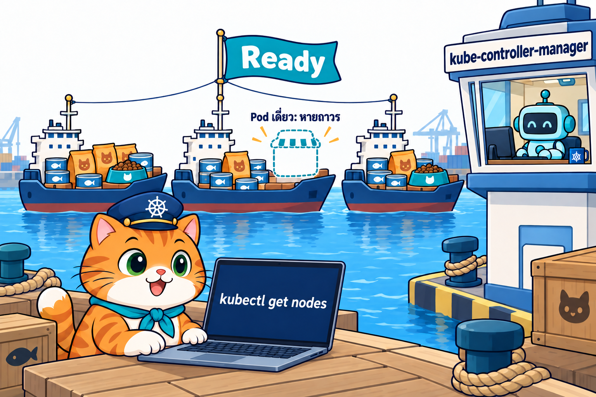<br>
  <em><b>รูปที่ 1</b> LAB0: เช็กเรือ 3 ลำ Ready, ลบ Pod เดี่ยวแล้วยืนยันว่าหายถาวร และส่องหา kube-controller-manager ใน kube-system</em>
</p>

**เป้าหมาย:** นำไฟล์ LAB เข้า `k8s-lab` เตรียมคลัสเตอร์ (ใช้ต่อจากบทที่ 4 หรือสร้างใหม่) ยืนยันว่าไม่มีของค้างจากบทก่อน ทบทวนว่า Pod เดี่ยวลบแล้วไม่มีใครสร้างใหม่ และส่องหา `kube-controller-manager` ที่ ReplicaSet controller อาศัยอยู่

**สิ่งที่ต้องมีก่อน:** ทำ LAB บทที่ [1](../../001_kubernetes-introduction/02_LAB/readme.md), [2](../../002_kubernetes_pod/02_LAB/README.md), [3](../../003_kubernetes_node_pod/02_LAB/README.md) และ [4](../../004_kubernetes_namespace/02_LAB/README.md) แล้ว มี container `k8s-lab` (SSH port `2223`) และมีโฟลเดอร์ `005_kubernetes_replicaset` บนเครื่อง

### ขั้นที่ 1: นำโฟลเดอร์บทเรียนเข้า k8s-lab

🖥️ **บนเครื่องนักศึกษา** ตรวจว่า `k8s-lab` กำลังรัน (STATUS ต้องเป็น `Up`) ถ้าเป็น `Exited` ให้ `docker start k8s-lab`

```bash
docker ps -a --filter name=k8s-lab
```

`cd` ไปยังโฟลเดอร์ที่ **มีโฟลเดอร์ `005_kubernetes_replicaset` อยู่ข้างใน** แล้วคัดลอกทั้งโฟลเดอร์เข้า `/workspace/` ของ container (คำสั่งเดียวกันทั้ง PowerShell และ bash)

```bash
docker cp 005_kubernetes_replicaset k8s-lab:/workspace/
```

> `docker cp` เป็นการ **คัดลอก** ไม่ใช่การเชื่อมโฟลเดอร์ ถ้าแก้ไฟล์บนเครื่องตัวเองภายหลัง ต้องสั่ง `docker cp` ซ้ำ โฟลเดอร์นี้มีทั้ง YAML ของ LAB 0–8 (`02_LAB/labs/`) และแอปกับ manifest ของ LAB 9 (`02_LAB/som-booths/`) จึงคัดลอกครั้งเดียวพอ

### ขั้นที่ 2: ล็อกอินเข้า k8s-lab

🖥️ **บนเครื่องนักศึกษา**

```bash
ssh -p 2223 root@localhost
```

รหัสผ่าน `passwd` (พิมพ์แล้วจะไม่เห็นตัวอักษร) เมื่อสำเร็จจะเห็น prompt `root@k8s-lab` หน้าต่างนี้คือ **terminal 1** (หรือใช้ Terminal ใน JupyterLab `http://localhost:8889` ก็ได้)

### ขั้นที่ 3: เข้าโฟลเดอร์ LAB และเตรียมคลัสเตอร์

🐧 **ใน SSH session ของ k8s-lab**

```bash
cd /workspace/005_kubernetes_replicaset/02_LAB
ls
kubectl get nodes
```

`ls` ต้องเห็น `README.md  images  labs  som-booths` จากนั้นเลือกทางตามผลของ `kubectl get nodes`

| ผลของ `kubectl get nodes` | ทำอย่างไร |
|---|---|
| เห็น 3 Node (`lab-control-plane`, `lab-worker`, `lab-worker2`) เป็น `Ready` (คลัสเตอร์จากบทที่ 4 ยังอยู่) | **ใช้ต่อได้เลย** ทำขั้นที่ 4 เพื่อตรวจของค้าง |
| error เช่น `connection refused` / ไม่มีคลัสเตอร์ (เพิ่ง restart `k8s-lab` หรือเคย `k8s-down`) | สร้างใหม่ด้วย `time k8s-up` (ประมาณ 1 นาที ในการทดลองใช้ 54 วินาที ผลลัพธ์เหมือนบทที่ 4 LAB 0) |

ผลจริงจากคลัสเตอร์ที่เพิ่งสร้าง

```text
NAME                STATUS   ROLES           AGE   VERSION
lab-control-plane   Ready    control-plane   59s   v1.37.0
lab-worker          Ready    <none>          44s   v1.37.0
lab-worker2         Ready    <none>          44s   v1.37.0
```

### ขั้นที่ 4: ตรวจว่าไม่มีของค้างจากบทก่อน

```bash
kubectl get nodes -o custom-columns=NAME:.metadata.name,TAINTS:.spec.taints[*].key,UNSCHED:.spec.unschedulable
kubectl get pods -A -o wide --field-selector spec.nodeName=lab-worker2
kubectl get ns
```

```text
NAME                TAINTS                                  UNSCHED
lab-control-plane   node-role.kubernetes.io/control-plane   <none>
lab-worker          <none>                                  <none>
lab-worker2         <none>                                  <none>
NAMESPACE     NAME               READY   STATUS    RESTARTS   AGE   IP           NODE          NOMINATED NODE   READINESS GATES
kube-system   kindnet-ggn6v      1/1     Running   0          44s   172.19.0.2   lab-worker2   <none>           <none>
kube-system   kube-proxy-pfmq7   1/1     Running   0          44s   172.19.0.2   lab-worker2   <none>           <none>
NAME                 STATUS   AGE
default              Active   59s
kube-node-lease      Active   59s
kube-public          Active   59s
kube-system          Active   59s
local-path-storage   Active   55s
```

ผลที่ถูกต้อง: worker ทั้งสองลำ **ไม่มี taint และไม่ถูก cordon** (UNSCHED เป็น `<none>`), บน `lab-worker2` มีแค่ Pod ระบบ (`kindnet`, `kube-proxy`) และมี namespace ตั้งต้น 5 ตัว ถ้ายังมี taint/cordon จากบทที่ 3 ให้ทำ "ตารางคืนสภาพคลัสเตอร์" ของบทที่ 3 ถ้ายังมี namespace จากบทที่ 4 (`som-dev`, `team-a` ฯลฯ) ให้ทำ [ตารางเก็บกวาดของบทที่ 4](../../004_kubernetes_namespace/02_LAB/README.md#ตารางเก็บกวาดและคืนสภาพ) ก่อน (LAB 2 ต้อง drain และหยุดเรือ `lab-worker2` จึงไม่ควรมี Pod เดี่ยวของบทก่อนอยู่บนเรือลำนั้น)

### ขั้นที่ 5: Pod เดี่ยวลบแล้วหายถาวร

สร้าง namespace `rs-lab` (ใช้ถึง LAB 6) และ Pod เดี่ยว `lonely` (busybox) แล้วลบทิ้ง

```bash
cat labs/lab00-lonely/lonely-pod.yaml
kubectl apply -f labs/lab01-first-rs/00-ns.yaml -f labs/lab00-lonely/lonely-pod.yaml
kubectl wait --for=condition=Ready pod/lonely -n rs-lab --timeout=120s; kubectl get pods -n rs-lab -o wide
kubectl delete pod lonely -n rs-lab
sleep 5; kubectl get pods -n rs-lab
```

```text
namespace/rs-lab created
pod/lonely created
pod/lonely condition met
NAME     READY   STATUS    RESTARTS   AGE   IP           NODE          NOMINATED NODE   READINESS GATES
lonely   1/1     Running   0          6s    10.244.3.2   lab-worker2   <none>           <none>
pod "lonely" deleted from rs-lab namespace
No resources found in rs-lab namespace.
```

kubectl v1.37 แจ้งการลบแบบใหม่ว่า `pod "lonely" deleted from rs-lab namespace` และ 5 วินาทีต่อมา namespace ว่างเปล่า **ไม่มีใครสร้าง Pod ใหม่แทน** นี่คือปัญหาที่บทนี้จะแก้

### ขั้นที่ 6: ส่องหา kube-controller-manager

```bash
kubectl get pods -n kube-system -l component=kube-controller-manager -o wide
kubectl -n kube-system get pod kube-controller-manager-lab-control-plane -o jsonpath='{.spec.containers[0].command}' | grep -o -- '--controllers=[^"]*'
kubectl -n kube-system get pod kube-controller-manager-lab-control-plane -o jsonpath='{.metadata.ownerReferences}{"\n"}'
```

```text
NAME                                        READY   STATUS    RESTARTS   AGE   IP           NODE                NOMINATED NODE   READINESS GATES
kube-controller-manager-lab-control-plane   1/1     Running   0          73s   172.19.0.3   lab-control-plane   <none>           <none>
--controllers=*,bootstrapsigner,tokencleaner
[{"apiVersion":"v1","controller":true,"kind":"Node","name":"lab-control-plane","uid":"fabf3a88-53ed-4242-9c8a-8618358ee975"}]
```

> **ทำไมใช้ `grep -o`:** `command` เป็น JSON array ถ้าใช้ `tr ',' '\n' | grep controllers` ค่าจะถูกตัดที่ comma เหลือแค่ `"--controllers=*` (ทดลองแล้ว) คำสั่งข้างบนดึงทั้งค่า หรือจะใช้ `-o jsonpath='{range .spec.containers[0].command[*]}{@}{"\n"}{end}' | grep controllers` ก็ได้ผลเดียวกัน

### สิ่งที่เห็น

- คลัสเตอร์พร้อม 3 Node ไม่มี taint/cordon ค้างบน worker
- Pod เดี่ยวที่ถูกลบหายถาวร ไม่มีอะไรเกิดแทน
- `kube-controller-manager` เป็น static Pod บน `lab-control-plane` เปิด controller มาตรฐานทั้งหมด (`*`) ซึ่งรวม ReplicaSet controller และเจ้าของของมันคือ `kind: Node` (mirror pod ที่ kubelet ดูแล ไม่ใช่ controller)

> **🤔 คำถามชวนคิด:** ถ้าลบ Pod `kube-controller-manager-lab-control-plane` ทิ้ง Pod นี้จะกลับมาไหม ใครเป็นผู้สร้างกลับ (ทบทวน static Pod บทที่ 3) — ไม่ต้องลองจริง

**เก็บกวาด:** เก็บ namespace `rs-lab` ไว้ใช้ต่อใน LAB 1

---

## LAB 1: ReplicaSet แรก

<p align="center" id="fig-2">
  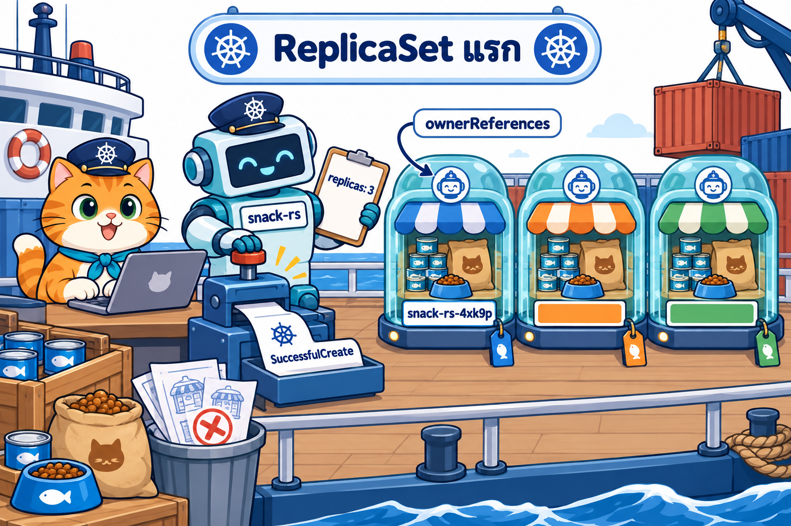<br>
  <em><b>รูปที่ 2</b> LAB1: สร้าง snack-rs 3 ตัว ดูชื่อ Pod แบบ &lt;rs&gt;-&lt;สุ่ม&gt;, ownerReferences, Events SuccessfulCreate และลอง template ที่ label ไม่ตรง selector</em>
</p>

**เป้าหมาย:** สร้าง ReplicaSet `snack-rs` 3 บูธ ดูชื่อ Pod, ownerReferences, Events และ status ทดลอง template ที่ label ไม่ตรง selector และ selector แบบ matchExpressions

**ไฟล์:** `labs/lab01-first-rs/snack-rs.yaml` (อธิบายทีละบรรทัดใน [ทฤษฎีหัวข้อ 3.1](../01_Theory/README.md#31-โครง-3-ส่วน))

```bash
cat labs/lab01-first-rs/snack-rs.yaml
```

### ขั้นที่ 1: สร้าง ReplicaSet

```bash
kubectl apply -f labs/lab01-first-rs/snack-rs.yaml
kubectl get rs -n rs-lab; kubectl get pods -n rs-lab -o wide --show-labels
sleep 4; kubectl get rs,pods -n rs-lab -o wide --show-labels
```

```text
replicaset.apps/snack-rs created
NAME       DESIRED   CURRENT   READY   AGE
snack-rs   3         3         0       1s
NAME             READY   STATUS              RESTARTS   AGE   IP       NODE          NOMINATED NODE   READINESS GATES   LABELS
snack-rs-46p58   0/1     ContainerCreating   0          1s    <none>   lab-worker2   <none>           <none>            app=snack
snack-rs-bdpcw   0/1     ContainerCreating   0          1s    <none>   lab-worker    <none>           <none>            app=snack
snack-rs-w5dtc   0/1     ContainerCreating   0          1s    <none>   lab-worker2   <none>           <none>            app=snack
NAME                       DESIRED   CURRENT   READY   AGE   CONTAINERS   IMAGES         SELECTOR    LABELS
replicaset.apps/snack-rs   3         3         2       5s    app          busybox:1.36   app=snack   app=snack

NAME                 READY   STATUS              RESTARTS   AGE   IP           NODE          NOMINATED NODE   READINESS GATES   LABELS
pod/snack-rs-46p58   1/1     Running             0          5s    10.244.3.4   lab-worker2   <none>           <none>            app=snack
pod/snack-rs-bdpcw   0/1     ContainerCreating   0          5s    <none>       lab-worker    <none>           <none>            app=snack
pod/snack-rs-w5dtc   1/1     Running             0          5s    10.244.3.3   lab-worker2   <none>           <none>            app=snack
```

คำสั่งเดียวได้ Pod 3 ตัว ชื่อ `snack-rs-` + อักษรสุ่ม 5 ตัว ทุกตัวมีป้าย `app=snack` จาก template ช่วงแรก READY เป็น 0 และ 2 เพราะ Node ต้องดึง `busybox:1.36` ก่อน (ในการทดลอง `lab-worker` ช้ากว่าเล็กน้อย) รอสักครู่จะเป็น `3 3 3`

### ขั้นที่ 2: ป้ายเจ้าของ, log และ Events

```bash
P=$(kubectl get pods -n rs-lab -l app=snack -o jsonpath='{.items[0].metadata.name}'); echo $P
kubectl get pod $P -n rs-lab -o jsonpath='{.metadata.ownerReferences}{"\n"}'
kubectl logs -n rs-lab $P
kubectl describe rs snack-rs -n rs-lab
```

```text
snack-rs-46p58
[{"apiVersion":"apps/v1","blockOwnerDeletion":true,"controller":true,"kind":"ReplicaSet","name":"snack-rs","uid":"cd70be6b-fd70-45e9-acaf-a66877fa6fad"}]
บูธขนม snack-rs-46p58 เปิดแล้ว
Name:         snack-rs
Namespace:    rs-lab
Selector:     app=snack
Labels:       app=snack
Annotations:  <none>
Replicas:     3 current / 3 desired
Pods Status:  2 Running / 1 Waiting / 0 Succeeded / 0 Failed
Pod Template:
  Labels:  app=snack
  Containers:
   app:
    Image:      busybox:1.36
    Port:       <none>
    Host Port:  <none>
    Command:
      sh
      -c
      echo บูธขนม $(hostname) เปิดแล้ว; sleep 3600
    Limits:
      cpu:     50m
      memory:  32Mi
    Requests:
      cpu:         10m
      memory:      16Mi
    Environment:   <none>
    Mounts:        <none>
  Volumes:         <none>
  Node-Selectors:  <none>
  Tolerations:     <none>
Events:
  Type    Reason            Age   From                   Message
  ----    ------            ----  ----                   -------
  Normal  SuccessfulCreate  5s    replicaset-controller  Created pod: snack-rs-w5dtc
  Normal  SuccessfulCreate  5s    replicaset-controller  Created pod: snack-rs-46p58
  Normal  SuccessfulCreate  5s    replicaset-controller  Created pod: snack-rs-bdpcw
```

- `ownerReferences` บอกว่าเจ้าของคือ `ReplicaSet/snack-rs` (`controller: true`, `blockOwnerDeletion: true`) พร้อม `uid` ของ RS ตัวนี้
- log ของแต่ละบูธพิมพ์ชื่อของตัวเอง (`$(hostname)` = ชื่อ Pod)
- Events มี `SuccessfulCreate` 3 บรรทัด ระบุชื่อ Pod ที่สร้าง

### ขั้นที่ 3: อ่าน status

```bash
kubectl get rs snack-rs -n rs-lab -o jsonpath='{.status}{"\n"}'
```

```text
{"availableReplicas":2,"fullyLabeledReplicas":3,"observedGeneration":1,"readyReplicas":2,"replicas":3,"terminatingReplicas":0}
```

ตอนอ่านค่านี้มี Pod Ready 2 ตัว จึงได้ `readyReplicas: 2` และ `availableReplicas: 2` ส่วน `replicas: 3` และ `fullyLabeledReplicas: 3` (Pod ที่มี label ครบตาม template) ฟิลด์ `terminatingReplicas` (จำนวน Pod ที่กำลังถูกลบ) มีใน Kubernetes v1.37 ความหมายของแต่ละฟิลด์ดู [ทฤษฎีหัวข้อ 3.6](../01_Theory/README.md#36-อ่านสถานะของ-replicaset)

### ขั้นที่ 4: template ที่ label ไม่ตรง selector

ไฟล์ `snack-rs-bad-labels.yaml` จงใจพิมพ์ `app: snak` ใน template ขณะที่ selector เป็น `app: snack`

```bash
grep -n -A1 "matchLabels\|labels:" labs/lab01-first-rs/snack-rs-bad-labels.yaml
kubectl apply -f labs/lab01-first-rs/snack-rs-bad-labels.yaml; echo "exit=$?"
```

```text
The ReplicaSet "snack-rs-bad" is invalid: spec.template.metadata.labels: Invalid value: {"app":"snak"}: `selector` does not match template `labels`
exit=1
```

API server ปฏิเสธตั้งแต่ต้น ไม่มี RS `snack-rs-bad` เกิดขึ้น (ถ้ายอมให้สร้าง RS จะปั๊ม Pod ที่ตัวเองนับไม่เห็นไปเรื่อย ๆ)

### ขั้นที่ 5: selector แบบ matchExpressions

```bash
cat labs/lab01-first-rs/snack-rs-expr.yaml
kubectl apply -f labs/lab01-first-rs/snack-rs-expr.yaml; sleep 4
kubectl get pods -n rs-lab -l "tier in (snack,drink)" --show-labels
kubectl get rs -n rs-lab
kubectl get rs snack-rs-expr -n rs-lab -o wide
```

```text
replicaset.apps/snack-rs-expr created
NAME                  READY   STATUS    RESTARTS   AGE   LABELS
snack-rs-expr-9sn9g   1/1     Running   0          4s    tier=drink
snack-rs-expr-x6sxw   1/1     Running   0          4s    tier=drink
NAME            DESIRED   CURRENT   READY   AGE
snack-rs        3         3         3       10s
snack-rs-expr   2         2         2       4s
NAME            DESIRED   CURRENT   READY   AGE   CONTAINERS   IMAGES         SELECTOR
snack-rs-expr   2         2         2       4s    app          busybox:1.36   tier in (drink,snack),!track
```

selector `tier In (snack, drink)` + `track DoesNotExist` แสดงในรูป `tier in (drink,snack),!track` และ RS สองตัวอยู่ใน namespace เดียวกันได้โดยไม่ยุ่งกัน เพราะ selector ไม่ทับกัน (`app=snack` กับ `tier in (...)`) ลบ RS ตัวนี้ทิ้ง

```bash
kubectl delete -f labs/lab01-first-rs/snack-rs-expr.yaml; kubectl get rs,pods -n rs-lab -o wide
```

```text
replicaset.apps "snack-rs-expr" deleted from rs-lab namespace
NAME                       DESIRED   CURRENT   READY   AGE   CONTAINERS   IMAGES         SELECTOR
replicaset.apps/snack-rs   3         3         3       22s   app          busybox:1.36   app=snack

NAME                      READY   STATUS        RESTARTS   AGE   IP           NODE          NOMINATED NODE   READINESS GATES
pod/snack-rs-46p58        1/1     Running       0          22s   10.244.3.4   lab-worker2   <none>           <none>
pod/snack-rs-bdpcw        1/1     Running       0          22s   10.244.1.2   lab-worker    <none>           <none>
pod/snack-rs-expr-9sn9g   1/1     Terminating   0          16s   10.244.3.5   lab-worker2   <none>           <none>
pod/snack-rs-expr-x6sxw   1/1     Terminating   0          16s   10.244.1.3   lab-worker    <none>           <none>
pod/snack-rs-w5dtc        1/1     Running       0          22s   10.244.3.3   lab-worker2   <none>           <none>
```

ลบ RS แล้ว Pod ของมันถูกลบตามอัตโนมัติ (garbage collector ตาม ownerReferences — ดู LAB 6)

### สิ่งที่เห็น

- ReplicaSet `snack-rs` ได้ `3 3 3` ชื่อ Pod `snack-rs-xxxxx` ทุกตัวมี ownerReferences ชี้ไปที่ RS
- Events บอกชื่อ Pod ที่สร้าง และ status มี `replicas`, `readyReplicas`, `availableReplicas`, `fullyLabeledReplicas`, `terminatingReplicas`
- label ของ template ที่ไม่ตรง selector ถูกปฏิเสธด้วย `` `selector` does not match template `labels` ``
- selector แบบ `matchExpressions` ใช้ In/DoesNotExist ได้ และลบ RS แล้ว Pod หายตาม

> **🤔 คำถามชวนคิด:** ถ้าเพิ่ม label `version: v1` ใน template ของ snack-rs แต่ไม่เพิ่มใน selector จะสร้างได้ไหม และ `fullyLabeledReplicas` ใช้นับอะไร

**เก็บกวาด:** เก็บ `snack-rs` ไว้ใช้ต่อใน LAB 2

---

## LAB 2: Self-healing: ลบ Pod, drain และเรือล่ม

<p align="center" id="fig-3">
  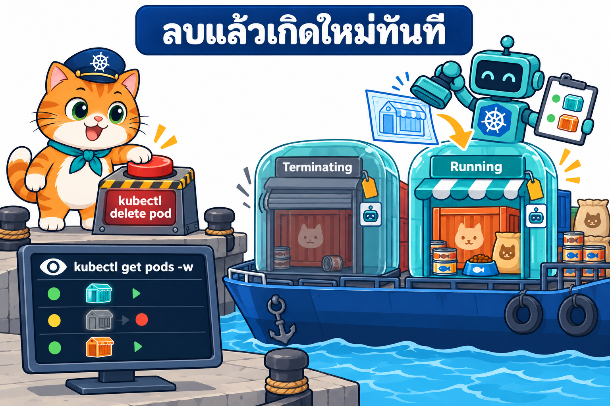<br>
  <em><b>รูปที่ 3</b> LAB2: ลบ Pod (ทั้งทีละตัวและ -l app=snack) ขณะเปิด kubectl get pods -w อีกหน้าต่าง เห็นตัวใหม่เกิดขณะตัวเก่ายัง Terminating</em>
</p>

**เป้าหมาย:** เห็นด้วยตาว่า ReplicaSet สร้าง Pod แทนเมื่อ Pod ถูกลบ (ทีละตัวและพร้อมกัน) เมื่อ drain เรือ และ (ทางเลือก) เมื่อเรือล่ม พร้อมวัดเวลา

**ต้องมีจาก LAB 1:** `snack-rs` ใน `rs-lab` (`3 3 3`)

### ขั้นที่ 1: เปิดหน้าต่างเฝ้าดู

🐧 **terminal 2** (SSH session ที่สอง) เปิดค้างไว้ตลอด LAB นี้

```bash
kubectl get pods -n rs-lab -o wide -w
```

### ขั้นที่ 2: ลบ Pod หนึ่งตัว

🐧 **terminal 1**

```bash
P=$(kubectl get pods -n rs-lab -l app=snack -o jsonpath="{.items[0].metadata.name}")
date +%T; kubectl delete pod $P -n rs-lab --wait=false; kubectl get pods -n rs-lab -o wide
sleep 3; kubectl get pods -n rs-lab -o wide
kubectl describe rs snack-rs -n rs-lab | tail -6
```

```text
08:04:23
pod "snack-rs-46p58" deleted from rs-lab namespace
NAME             READY   STATUS              RESTARTS   AGE   IP           NODE          NOMINATED NODE   READINESS GATES
snack-rs-46p58   1/1     Terminating         0          39s   10.244.3.4   lab-worker2   <none>           <none>
snack-rs-bdpcw   1/1     Running             0          39s   10.244.1.2   lab-worker    <none>           <none>
snack-rs-kf5vp   0/1     ContainerCreating   0          1s    <none>       lab-worker2   <none>           <none>
snack-rs-w5dtc   1/1     Running             0          39s   10.244.3.3   lab-worker2   <none>           <none>
NAME             READY   STATUS    RESTARTS   AGE   IP           NODE          NOMINATED NODE   READINESS GATES
snack-rs-bdpcw   1/1     Running   0          42s   10.244.1.2   lab-worker    <none>           <none>
snack-rs-kf5vp   1/1     Running   0          4s    10.244.3.6   lab-worker2   <none>           <none>
snack-rs-w5dtc   1/1     Running   0          42s   10.244.3.3   lab-worker2   <none>           <none>
  Type    Reason            Age   From                   Message
  ----    ------            ----  ----                   -------
  Normal  SuccessfulCreate  42s   replicaset-controller  Created pod: snack-rs-w5dtc
  Normal  SuccessfulCreate  42s   replicaset-controller  Created pod: snack-rs-46p58
  Normal  SuccessfulCreate  42s   replicaset-controller  Created pod: snack-rs-bdpcw
  Normal  SuccessfulCreate  4s    replicaset-controller  Created pod: snack-rs-kf5vp
```

terminal 2 เห็นลำดับเหตุการณ์ละเอียดกว่า (ตัดคอลัมน์ท้ายและบรรทัดซ้ำ)

```text
snack-rs-46p58   1/1     Terminating   0          38s   10.244.3.4   lab-worker2
snack-rs-kf5vp   0/1     Pending       0          0s    <none>       <none>
snack-rs-kf5vp   0/1     Pending       0          0s    <none>       lab-worker2
snack-rs-kf5vp   0/1     ContainerCreating   0          1s    <none>       lab-worker2
snack-rs-kf5vp   1/1     Running             0          2s    10.244.3.6   lab-worker2
snack-rs-46p58   0/1     Error               0          41s   10.244.3.4   lab-worker2
```

`--wait=false` ทำให้ kubectl ไม่รอ Pod หายจริงก่อนพิมพ์ผลต่อ เราจึงเห็นว่า **ตัวใหม่ `kf5vp` เกิดทันทีขณะที่ตัวเก่ายัง Terminating** และ Running ภายใน 2 วินาที ส่วนตัวเก่าขึ้น `Error` ก่อนหาย (busybox ถูก kill หลัง grace period 1 วินาที)

### ขั้นที่ 3: ลบทุกตัวพร้อมกัน

```bash
date +%T; kubectl delete pod -n rs-lab -l app=snack --wait=false; kubectl get pods -n rs-lab
sleep 4; kubectl get rs,pods -n rs-lab -o wide
```

```text
08:04:30
pod "snack-rs-bdpcw" deleted from rs-lab namespace
pod "snack-rs-kf5vp" deleted from rs-lab namespace
pod "snack-rs-w5dtc" deleted from rs-lab namespace
NAME             READY   STATUS              RESTARTS   AGE
snack-rs-2rfqd   0/1     ContainerCreating   0          0s
snack-rs-bdpcw   1/1     Terminating         0          45s
snack-rs-kf5vp   1/1     Terminating         0          7s
snack-rs-ll2f9   0/1     ContainerCreating   0          0s
snack-rs-n2x77   0/1     ContainerCreating   0          0s
snack-rs-w5dtc   1/1     Terminating         0          45s
NAME                       DESIRED   CURRENT   READY   AGE   CONTAINERS   IMAGES         SELECTOR
replicaset.apps/snack-rs   3         3         3       49s   app          busybox:1.36   app=snack

NAME                 READY   STATUS    RESTARTS   AGE   IP           NODE          NOMINATED NODE   READINESS GATES
pod/snack-rs-2rfqd   1/1     Running   0          4s    10.244.3.7   lab-worker2   <none>           <none>
pod/snack-rs-ll2f9   1/1     Running   0          4s    10.244.1.4   lab-worker    <none>           <none>
pod/snack-rs-n2x77   1/1     Running   0          4s    10.244.3.8   lab-worker2   <none>           <none>
```

ลบทั้งร้านพร้อมกัน ร้านก็กลับมาครบ 3 บูธภายในไม่กี่วินาที แต่ **ทุกบูธเป็นบูธใหม่** (ชื่อใหม่ IP ใหม่) ช่วงเวลาสั้น ๆ นั้นร้านไม่มีบูธที่พร้อมให้บริการเลย

### ขั้นที่ 4: drain เรือ lab-worker2

<p align="center" id="fig-4">
  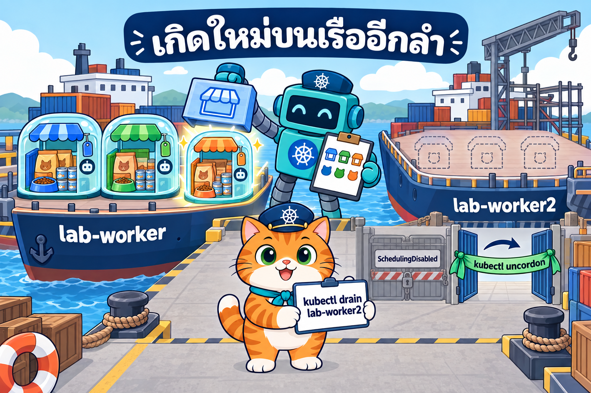<br>
  <em><b>รูปที่ 4</b> LAB2 (ต่อ): drain lab-worker2 → Pod ของ snack-rs บนเรือนั้นถูกไล่และเกิดใหม่บน lab-worker แล้ว uncordon (Pod ไม่ย้ายกลับเอง) — ทางเลือก: docker stop lab-worker2 + tolerationSeconds 30</em>
</p>

ในบทที่ 3 drain เรือที่มี Pod เดี่ยวต้องใช้ `--force` ครั้งนี้ไม่ต้อง

```bash
kubectl get pods -n rs-lab -o wide
time kubectl drain lab-worker2 --ignore-daemonsets
kubectl get nodes; kubectl get pods -n rs-lab -o wide
```

```text
NAME             READY   STATUS    RESTARTS   AGE   IP           NODE          NOMINATED NODE   READINESS GATES
snack-rs-2rfqd   1/1     Running   0          28s   10.244.3.7   lab-worker2   <none>           <none>
snack-rs-ll2f9   1/1     Running   0          28s   10.244.1.4   lab-worker    <none>           <none>
snack-rs-n2x77   1/1     Running   0          28s   10.244.3.8   lab-worker2   <none>           <none>
node/lab-worker2 cordoned
Warning: ignoring DaemonSet-managed Pods: kube-system/kindnet-ggn6v, kube-system/kube-proxy-pfmq7
evicting pod rs-lab/snack-rs-n2x77
evicting pod rs-lab/snack-rs-2rfqd
pod/snack-rs-n2x77 evicted
pod/snack-rs-2rfqd evicted
node/lab-worker2 drained

real	0m3.070s
user	0m0.033s
sys	0m0.023s
NAME                STATUS                     ROLES           AGE     VERSION
lab-control-plane   Ready                      control-plane   2m58s   v1.37.0
lab-worker          Ready                      <none>          2m43s   v1.37.0
lab-worker2         Ready,SchedulingDisabled   <none>          2m43s   v1.37.0
NAME             READY   STATUS    RESTARTS   AGE   IP           NODE         NOMINATED NODE   READINESS GATES
snack-rs-frvwx   1/1     Running   0          3s    10.244.1.6   lab-worker   <none>           <none>
snack-rs-ll2f9   1/1     Running   0          31s   10.244.1.4   lab-worker   <none>           <none>
snack-rs-p9mhg   1/1     Running   0          3s    10.244.1.5   lab-worker   <none>           <none>
```

drain จบใน 3 วินาที Pod 2 ตัวบน `lab-worker2` ถูก evict แล้ว RS สร้างตัวแทนบน `lab-worker` ร้านยังครบ 3 บูธ (ถ้าในเครื่องนักศึกษาไม่มี Pod ของ snack-rs อยู่บน `lab-worker2` เลย drain จะไม่ evict อะไร ให้ uncordon แล้วลบ Pod ทั้งหมดให้ scheduler วางใหม่ก่อนลองอีกครั้ง)

คืนเรือแล้วดูว่า Pod ย้ายกลับไหม

```bash
kubectl uncordon lab-worker2; sleep 3; kubectl get pods -n rs-lab -o wide
```

```text
node/lab-worker2 uncordoned
NAME             READY   STATUS    RESTARTS   AGE   IP           NODE         NOMINATED NODE   READINESS GATES
snack-rs-frvwx   1/1     Running   0          7s    10.244.1.6   lab-worker   <none>           <none>
snack-rs-ll2f9   1/1     Running   0          35s   10.244.1.4   lab-worker   <none>           <none>
snack-rs-p9mhg   1/1     Running   0          7s    10.244.1.5   lab-worker   <none>           <none>
```

**ไม่ย้ายกลับ** ทั้ง 3 บูธยังอยู่บน `lab-worker` เพราะ ReplicaSet นับแค่จำนวน และ scheduler ทำงานเฉพาะตอน Pod เกิดใหม่

### ขั้นที่ 5 (ทางเลือก): เรือล่มด้วย toleration 30 วินาที

ขั้นนี้ใช้เวลาราว 3–4 นาที แสดงสิ่งที่เกิดเมื่อเรือหายไปโดยไม่มีใครสั่ง ถ้าเวลาไม่พอให้ข้ามไปขั้นที่ 6 ได้ (อ่านผลจากเอกสาร)

ค่าเริ่มต้นต้องรอ 300 วินาทีหลังเรือเป็น NotReady จึงจะสร้างแทน เพื่อไม่ให้รอนาน ใช้ `snack-rs-fast-evict.yaml` ที่เพิ่ม toleration 30 วินาทีใน template **template ใหม่ไม่เปลี่ยน Pod เดิม** (จะเห็นชัดใน LAB 5) จึงต้องลบ Pod ให้เกิดใหม่จาก template ใหม่ และต้องมี Pod อยู่บน `lab-worker2` ก่อน stop (หลังขั้นที่ 4 ทุกตัวอยู่บน `lab-worker`)

```bash
diff labs/lab01-first-rs/snack-rs.yaml labs/lab02-self-heal/snack-rs-fast-evict.yaml
kubectl apply -f labs/lab02-self-heal/snack-rs-fast-evict.yaml
kubectl delete pod -n rs-lab -l app=snack; sleep 3; kubectl get pods -n rs-lab -o wide
kubectl get pods -n rs-lab -o jsonpath='{range .items[*]}{.metadata.name}{"  "}{.spec.tolerations}{"\n"}{end}'
```

```text
replicaset.apps/snack-rs configured
pod "snack-rs-frvwx" deleted from rs-lab namespace
pod "snack-rs-ll2f9" deleted from rs-lab namespace
pod "snack-rs-p9mhg" deleted from rs-lab namespace
NAME             READY   STATUS    RESTARTS   AGE   IP            NODE          NOMINATED NODE   READINESS GATES
snack-rs-5ddqd   1/1     Running   0          6s    10.244.3.9    lab-worker2   <none>           <none>
snack-rs-ddvjr   1/1     Running   0          6s    10.244.3.10   lab-worker2   <none>           <none>
snack-rs-qdrs7   1/1     Running   0          6s    10.244.1.7    lab-worker    <none>           <none>
snack-rs-5ddqd  [{"effect":"NoExecute","key":"node.kubernetes.io/not-ready","operator":"Exists","tolerationSeconds":30},{"effect":"NoExecute","key":"node.kubernetes.io/unreachable","operator":"Exists","tolerationSeconds":30}]
...
```

(ปกติระบบเติม toleration 300 วินาทีของ 2 key นี้ให้ทุก Pod อัตโนมัติ แต่เมื่อ template ระบุ key เดียวกันเองแล้ว ระบบจะไม่เติมซ้ำ จึงเห็นเฉพาะค่า 30 วินาที) ต้องเห็นอย่างน้อย 1 ตัวอยู่บน `lab-worker2` ถ้าไม่มี ให้ลบ Pod อีกรอบ

หยุดเรือ `lab-worker2` แล้ววัดเวลาด้วยลูป (คัดลอกทั้งบล็อกไปวางทีเดียว)

```bash
T0=$(date +%s); docker stop lab-worker2; echo "stop ใช้ $(( $(date +%s)-T0 )) วิ"
for i in $(seq 1 40); do
  t=$(( $(date +%s)-T0 ))
  n=$(kubectl get node lab-worker2 --no-headers | awk '{print $2}')
  rs=$(kubectl get rs snack-rs -n rs-lab --no-headers | awk '{print $2"/"$3"/"$4}')
  echo "t=${t}s node=$n rs(D/C/R)=$rs pods: $(kubectl get pods -n rs-lab --no-headers -o custom-columns=N:.metadata.name,S:.status.phase,R:.metadata.deletionTimestamp,NODE:.spec.nodeName | awk '{printf "%s:%s:%s:%s ", substr($1,10),$2,($3=="<none>"?"-":"DEL"),$4}')"
  [ $t -gt 120 ] && break; sleep 4
done
```

```text
lab-worker2
stop ใช้ 11 วิ
t=11s node=Ready rs(D/C/R)=3/3/3 pods: 5ddqd:Running:-:lab-worker2 ddvjr:Running:-:lab-worker2 qdrs7:Running:-:lab-worker 
...
t=40s node=Ready rs(D/C/R)=3/3/3 pods: 5ddqd:Running:-:lab-worker2 ddvjr:Running:-:lab-worker2 qdrs7:Running:-:lab-worker 
t=44s node=NotReady rs(D/C/R)=3/3/1 pods: 5ddqd:Running:-:lab-worker2 ddvjr:Running:-:lab-worker2 qdrs7:Running:-:lab-worker 
...
t=73s node=NotReady rs(D/C/R)=3/3/1 pods: 5ddqd:Running:-:lab-worker2 ddvjr:Running:-:lab-worker2 qdrs7:Running:-:lab-worker 
t=77s node=NotReady rs(D/C/R)=3/3/3 pods: 5ddqd:Running:DEL:lab-worker2 9wccl:Running:-:lab-worker ddvjr:Running:DEL:lab-worker2 qdrs7:Running:-:lab-worker wvv6s:Running:-:lab-worker 
...
t=122s node=NotReady rs(D/C/R)=3/3/3 pods: 5ddqd:Running:DEL:lab-worker2 9wccl:Running:-:lab-worker ddvjr:Running:DEL:lab-worker2 qdrs7:Running:-:lab-worker wvv6s:Running:-:lab-worker 
```

อ่านผล (นับจากเริ่มสั่ง stop; `DEL` = Pod มี `deletionTimestamp` แล้ว)

| เวลา | เหตุการณ์ |
|---|---|
| t≈41–44 วินาที | Node เป็น `NotReady` → RS แสดง `3/3/1` (CURRENT ยังนับ Pod บนเรือที่ล่ม แต่ไม่ Ready) |
| t≈74–77 วินาที | ครบ toleration 30 วินาที Pod 2 ตัวบน `lab-worker2` ถูกไล่ (`DEL`) ตัวแทน `9wccl`, `wvv6s` เกิดบน `lab-worker` → `3/3/3` |
| หลังจากนั้น | Pod เก่ายังค้าง (phase ยังแสดง Running เพราะ kubelet บนเรือที่ล่มรายงานไม่ได้) |

```bash
kubectl get rs,pods -n rs-lab -o wide
kubectl get rs snack-rs -n rs-lab -o jsonpath='{.status}{"\n"}'
```

```text
NAME                       DESIRED   CURRENT   READY   AGE     CONTAINERS   IMAGES         SELECTOR
replicaset.apps/snack-rs   3         3         3       4m12s   app          busybox:1.36   app=snack

NAME                 READY   STATUS        RESTARTS   AGE     IP            NODE          NOMINATED NODE   READINESS GATES
pod/snack-rs-5ddqd   1/1     Terminating   0          2m38s   10.244.3.9    lab-worker2   <none>           <none>
pod/snack-rs-9wccl   1/1     Running       0          65s     10.244.1.9    lab-worker    <none>           <none>
pod/snack-rs-ddvjr   1/1     Terminating   0          2m38s   10.244.3.10   lab-worker2   <none>           <none>
pod/snack-rs-qdrs7   1/1     Running       0          2m38s   10.244.1.7    lab-worker    <none>           <none>
pod/snack-rs-wvv6s   1/1     Running       0          65s     10.244.1.8    lab-worker    <none>           <none>
{"availableReplicas":3,"fullyLabeledReplicas":3,"observedGeneration":2,"readyReplicas":3,"replicas":3,"terminatingReplicas":2}
```

Pod เก่า 2 ตัวค้าง `Terminating` (status แสดง `"terminatingReplicas":2`) และ RS ไม่นับมันแล้ว นำเรือกลับมา

```bash
T0=$(date +%s); docker start lab-worker2
until [ "$(kubectl get node lab-worker2 --no-headers | awk '{print $2}')" = Ready ]; do sleep 2; done; echo "Ready หลัง start $(( $(date +%s)-T0 )) วิ"
for i in 1 2 3 4 5 6 7 8 9 10; do c=$(kubectl get pods -n rs-lab --no-headers | wc -l); [ $c -eq 3 ] && break; sleep 2; done; echo "Pod เก่าหายหลัง start $(( $(date +%s)-T0 )) วิ"
kubectl get nodes; kubectl get pods -n rs-lab -o wide
```

```text
lab-worker2
Ready หลัง start 2 วิ
Pod เก่าหายหลัง start 4 วิ
NAME                STATUS   ROLES           AGE     VERSION
lab-control-plane   Ready    control-plane   5m58s   v1.37.0
lab-worker          Ready    <none>          5m43s   v1.37.0
lab-worker2         Ready    <none>          5m43s   v1.37.0
NAME             READY   STATUS    RESTARTS   AGE     IP           NODE         NOMINATED NODE   READINESS GATES
snack-rs-9wccl   1/1     Running   0          70s     10.244.1.9   lab-worker   <none>           <none>
snack-rs-qdrs7   1/1     Running   0          2m43s   10.244.1.7   lab-worker   <none>           <none>
snack-rs-wvv6s   1/1     Running   0          70s     10.244.1.8   lab-worker   <none>           <none>
```

เมื่อ kubelet บนเรือกลับมา จึงยืนยันการลบ Pod เก่าได้ Pod เก่าหายภายในไม่กี่วินาที

### ขั้นที่ 6: คืน template เดิม

ถ้าทำขั้นที่ 5 ต้องคืน snack-rs เป็น template เดิม (ไม่มี toleration 30 วินาที) และลบ Pod ให้เกิดใหม่จาก template เดิม ถ้าข้ามขั้นที่ 5 ก็สั่งได้เหมือนกัน (ได้ Pod ชุดใหม่ที่กระจายอีกครั้ง)

```bash
kubectl apply -f labs/lab01-first-rs/snack-rs.yaml; kubectl delete pod -n rs-lab -l app=snack; sleep 4; kubectl get pods -n rs-lab -o wide
```

```text
replicaset.apps/snack-rs configured
pod "snack-rs-9wccl" deleted from rs-lab namespace
pod "snack-rs-qdrs7" deleted from rs-lab namespace
pod "snack-rs-wvv6s" deleted from rs-lab namespace
NAME             READY   STATUS    RESTARTS   AGE   IP            NODE          NOMINATED NODE   READINESS GATES
snack-rs-6s8m9   1/1     Running   0          7s    10.244.3.3    lab-worker2   <none>           <none>
snack-rs-ldzjc   1/1     Running   0          7s    10.244.3.2    lab-worker2   <none>           <none>
snack-rs-trdgg   1/1     Running   0          7s    10.244.1.10   lab-worker    <none>           <none>
```

ปิด terminal 2 ด้วย `Ctrl+C`

### สิ่งที่เห็น

- ลบ Pod (ทีละตัวหรือทั้งหมด) → ตัวใหม่เกิดทันทีขณะตัวเก่ายัง Terminating และ Running ภายในราว 2 วินาที
- drain ไม่ต้อง `--force` Pod ที่ถูก evict ไปเกิดใหม่บนเรืออีกลำ และ uncordon แล้วไม่ย้ายกลับ
- (ทางเลือก) เรือล่ม: NotReady ราว 40–45 วินาที → รอ toleration อีก 30 วินาที → ตัวแทนเกิดที่ราว 75 วินาที Pod เก่าค้าง Terminating จนเรือกลับมา

> **🤔 คำถามชวนคิด:** ถ้าไม่ใส่ toleration 30 วินาที (ใช้ค่าเริ่มต้น) ตัวแทนจะเกิดราววินาทีที่เท่าไรหลังเรือล่ม และระหว่างนั้นร้านมีบูธที่ใช้ได้กี่บูธ

**เก็บกวาด:** ตรวจว่า `kubectl get nodes` เป็น `Ready` ทั้ง 3 ลำ (ไม่มี `SchedulingDisabled`) เก็บ `snack-rs` ไว้ใช้ต่อใน LAB 3

---

## LAB 3: Scale

<p align="center" id="fig-5">
  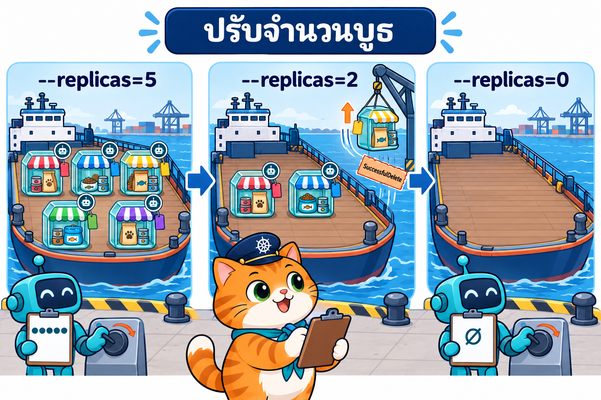<br>
  <em><b>รูปที่ 5</b> LAB3: scale ด้วย kubectl scale, แก้ไฟล์แล้ว apply, kubectl edit และ scale 0 พร้อมบันทึกว่า Pod ตัวไหนถูกลบตอน scale ลง</em>
</p>

**เป้าหมาย:** scale ด้วย 3 วิธี (คำสั่ง, แก้ไฟล์, editor) และ scale เป็น 0 บันทึกว่า Pod ตัวไหนถูกลบตอน scale ลง และเห็นว่า `apply` ไฟล์ทับค่าที่ scale ไว้

**ต้องมีจาก LAB 2:** `snack-rs` ใน `rs-lab` (`3 3 3`)

### ขั้นที่ 1: scale ขึ้นเป็น 5

```bash
kubectl scale rs snack-rs -n rs-lab --replicas=5; sleep 4
kubectl get pods -n rs-lab -o wide --sort-by=.metadata.creationTimestamp
```

```text
replicaset.apps/snack-rs scaled
NAME             READY   STATUS    RESTARTS   AGE   IP            NODE          NOMINATED NODE   READINESS GATES
snack-rs-6s8m9   1/1     Running   0          12s   10.244.3.3    lab-worker2   <none>           <none>
snack-rs-ldzjc   1/1     Running   0          12s   10.244.3.2    lab-worker2   <none>           <none>
snack-rs-trdgg   1/1     Running   0          12s   10.244.1.10   lab-worker    <none>           <none>
snack-rs-m259n   1/1     Running   0          4s    10.244.1.11   lab-worker    <none>           <none>
snack-rs-zsdq7   1/1     Running   0          4s    10.244.3.4    lab-worker2   <none>           <none>
```

**จดไว้:** ตัวไหนเก่า/ใหม่ และแต่ละเรือมีกี่ตัว (ในการทดลอง `lab-worker2` มี 3 ตัว `lab-worker` มี 2 ตัว)

### ขั้นที่ 2: scale ลงเป็น 2 แล้วดูว่าใครถูกลบ

```bash
kubectl scale rs snack-rs -n rs-lab --replicas=2; kubectl get pods -n rs-lab -o wide --sort-by=.metadata.creationTimestamp
sleep 3; kubectl get pods -n rs-lab -o wide
kubectl get events -n rs-lab --field-selector reason=SuccessfulDelete --sort-by=.lastTimestamp
```

```text
replicaset.apps/snack-rs scaled
NAME             READY   STATUS        RESTARTS   AGE   IP            NODE          NOMINATED NODE   READINESS GATES
snack-rs-6s8m9   1/1     Running       0          25s   10.244.3.3    lab-worker2   <none>           <none>
snack-rs-ldzjc   1/1     Terminating   0          25s   10.244.3.2    lab-worker2   <none>           <none>
snack-rs-trdgg   1/1     Running       0          25s   10.244.1.10   lab-worker    <none>           <none>
snack-rs-m259n   1/1     Terminating   0          17s   10.244.1.11   lab-worker    <none>           <none>
snack-rs-zsdq7   1/1     Terminating   0          17s   10.244.3.4    lab-worker2   <none>           <none>
NAME             READY   STATUS    RESTARTS   AGE   IP            NODE          NOMINATED NODE   READINESS GATES
snack-rs-6s8m9   1/1     Running   0          28s   10.244.3.3    lab-worker2   <none>           <none>
snack-rs-trdgg   1/1     Running   0          28s   10.244.1.10   lab-worker    <none>           <none>
LAST SEEN   TYPE     REASON             OBJECT                MESSAGE
18s         Normal   SuccessfulDelete   replicaset/snack-rs   Deleted pod: snack-rs-ldzjc
18s         Normal   SuccessfulDelete   replicaset/snack-rs   Deleted pod: snack-rs-m259n
18s         Normal   SuccessfulDelete   replicaset/snack-rs   Deleted pod: snack-rs-zsdq7
```

ตัวที่ถูกลบไม่ใช่ "ใหม่สุด 3 ตัว" `ldzjc` เป็นตัวเก่าแต่อยู่บน `lab-worker2` ที่แออัด (3 ตัว) จึงถูกลบก่อน ส่วนตัวใหม่ `m259n` และ `zsdq7` ถูกลบตามเกณฑ์อายุ เหลือเรือละ 1 ตัว (เกณฑ์ครบดู [ทฤษฎีหัวข้อ 5.2](../01_Theory/README.md#52-scale-ลงแล้วลบตัวไหน)) ผลในเครื่องนักศึกษาอาจต่าง ให้อธิบายจากเกณฑ์

> ใช้ `kubectl get events --field-selector reason=SuccessfulDelete` แทน `describe rs` เพราะหลัง LAB 2 Events ของ snack-rs ยาวมากและถูกรวมเป็น `(combined from similar events)`

### ขั้นที่ 3: แก้ไฟล์แล้ว apply

แก้บรรทัด `replicas: 3` ในไฟล์เป็น 4 ด้วย `sed` (บรรทัดนี้มีคอมเมนต์ต่อท้าย pattern จึงมีช่องว่างหลังตัวเลข) หรือแก้ด้วย `nano` ก็ได้

```bash
sed -i 's/replicas: 3 /replicas: 4 /' labs/lab01-first-rs/snack-rs.yaml
grep -n 'replicas:' labs/lab01-first-rs/snack-rs.yaml
kubectl apply -f labs/lab01-first-rs/snack-rs.yaml; sleep 3; kubectl get rs snack-rs -n rs-lab
```

```text
10:  replicas: 4                # จำนวนบูธที่ต้องมีตลอดเวลา
replicaset.apps/snack-rs configured
NAME       DESIRED   CURRENT   READY   AGE
snack-rs   4         4         4       5m14s
```

### ขั้นที่ 4: แก้สดด้วย kubectl edit

k8s-lab มี `nano`, `vi`, `vim` แต่ไม่ได้ตั้งตัวแปร `EDITOR` (`kubectl edit` จะเปิด `vi`) ใช้ `nano` ที่ง่ายกว่า

```bash
KUBE_EDITOR=nano kubectl edit rs snack-rs -n rs-lab
```

ใน nano เลื่อนลงหาบรรทัด `  replicas: 4` ใต้ `spec:` (ไม่ใช่ `status:` ด้านล่าง) แก้เป็น `6` แล้วกด `Ctrl+O` `Enter` `Ctrl+X`

```bash
sleep 3; kubectl get rs snack-rs -n rs-lab
```

```text
replicaset.apps/snack-rs edited
NAME       DESIRED   CURRENT   READY   AGE
snack-rs   6         6         6       5m34s
```

### ขั้นที่ 5: scale เป็น 0

```bash
kubectl scale rs snack-rs -n rs-lab --replicas=0; sleep 3; kubectl get rs,pods -n rs-lab
```

```text
replicaset.apps/snack-rs scaled
NAME                       DESIRED   CURRENT   READY   AGE
replicaset.apps/snack-rs   0         0         0       5m37s

NAME                 READY   STATUS   RESTARTS   AGE
pod/snack-rs-6s8m9   0/1     Error    0          68s
pod/snack-rs-8n6xj   0/1     Error    0          26s
pod/snack-rs-8tnwb   0/1     Error    0          6s
```

RS ยังอยู่ (`0 0 0`) พร้อม template Pod ที่เหลือกำลังถูกลบ (ขึ้น `Error` ชั่วครู่แล้วหาย) นี่คือวิธี "ปิดร้านชั่วคราว" โดยไม่ต้องลบ RS

### ขั้นที่ 6: apply ไฟล์ทับค่าที่ scale ไว้ (และคืนไฟล์เป็น 3)

คืนไฟล์เป็น `replicas: 3` (**ต้องทำ** เพราะ LAB 4 และ 6 ใช้ไฟล์นี้ต่อ) แล้ว apply

```bash
sed -i 's/replicas: 4 /replicas: 3 /' labs/lab01-first-rs/snack-rs.yaml
grep -n 'replicas:' labs/lab01-first-rs/snack-rs.yaml
kubectl apply -f labs/lab01-first-rs/snack-rs.yaml; sleep 4; kubectl get rs,pods -n rs-lab -o wide
```

```text
10:  replicas: 3                # จำนวนบูธที่ต้องมีตลอดเวลา
replicaset.apps/snack-rs configured
NAME                       DESIRED   CURRENT   READY   AGE     CONTAINERS   IMAGES         SELECTOR
replicaset.apps/snack-rs   3         3         3       5m41s   app          busybox:1.36   app=snack

NAME                 READY   STATUS    RESTARTS   AGE   IP            NODE          NOMINATED NODE   READINESS GATES
pod/snack-rs-29zjp   1/1     Running   0          4s    10.244.3.7    lab-worker2   <none>           <none>
pod/snack-rs-ldj4t   1/1     Running   0          4s    10.244.3.8    lab-worker2   <none>           <none>
pod/snack-rs-ps7x9   1/1     Running   0          4s    10.244.1.14   lab-worker    <none>           <none>
```

แม้เราเพิ่ง scale เป็น 0 แต่ `apply` ไฟล์ที่มี `replicas: 3` ทำให้ร้านกลับมา 3 บูธทันที **ค่าในไฟล์ชนะค่าที่ scale ไว้เสมอ** (ถ้าไม่ได้แก้ไฟล์กลับเป็น 3 ร้านจะกลับมา 4 บูธตามไฟล์)

### สิ่งที่เห็น

- `kubectl scale`, แก้ไฟล์ + apply, และ `kubectl edit` เปลี่ยนจำนวนได้ทันที scale 0 แล้ว RS ยังอยู่
- scale ลงไม่ได้ลบ "ตัวใหม่สุด" เสมอ เรือที่แออัดถูกพิจารณาก่อนอายุ
- `kubectl apply` ทับค่าที่ `scale`/`edit` ไว้

> **🤔 คำถามชวนคิด:** ถ้าต้องการให้ Pod `snack-rs-29zjp` ถูกลบเป็นตัวแรกตอน scale ลงครั้งหน้า จะใช้ annotation อะไร (ดูทฤษฎีหัวข้อ 5.2)

**เก็บกวาด:** ตรวจว่า `grep -n 'replicas:' labs/lab01-first-rs/snack-rs.yaml` เป็น 3 แล้ว เก็บ `snack-rs` (`3 3 3`) ไว้ใช้ต่อใน LAB 4

---

## LAB 4: กับดัก label

<p align="center" id="fig-6">
  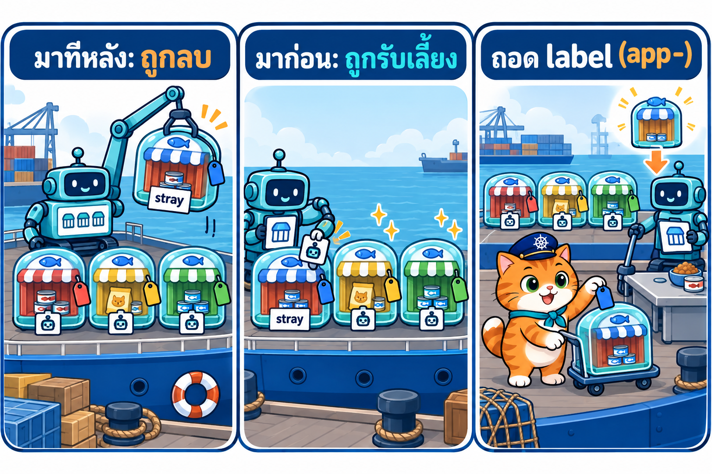<br>
  <em><b>รูปที่ 6</b> LAB4: Pod stray ที่ label ตรงถูกลบทันทีเมื่อ RS ครบแล้ว แต่ถ้ามีอยู่ก่อนจะถูกรับเลี้ยง และถอด label เพื่อแยก Pod ออกมา debug</em>
</p>

**เป้าหมาย:** เห็นว่า ReplicaSet นับจาก label (ก) Pod ที่ป้ายตรงและสร้างทีหลังถูกลบทันที (ข) Pod ที่มีอยู่ก่อนถูกรับเลี้ยง (ค) RS สองตัว selector ทับกัน (ง) ถอด label เพื่อแยก Pod ออกมา debug

**ต้องมีจาก LAB 3:** `snack-rs` ใน `rs-lab` (`3 3 3`)

**ไฟล์:** `labs/lab04-label-trap/stray-pod.yaml` (Pod เดี่ยวชื่อ `stray` ป้าย `app: snack` แต่ command เป็น `echo ฉันคือ stray ไม่ได้มาจากแบบพิมพ์; sleep 3600`) และ `snack-rs-b.yaml`

```bash
cat labs/lab04-label-trap/stray-pod.yaml
```

### ขั้นที่ 1 (ก): Pod ที่สร้างทีหลังถูกลบทันที

```bash
kubectl apply -f labs/lab04-label-trap/stray-pod.yaml; kubectl get pods -n rs-lab --show-labels
sleep 2; kubectl get pods -n rs-lab
```

```text
pod/stray created
NAME             READY   STATUS        RESTARTS   AGE   LABELS
snack-rs-29zjp   1/1     Running       0          20s   app=snack
snack-rs-ldj4t   1/1     Running       0          20s   app=snack
snack-rs-ps7x9   1/1     Running       0          20s   app=snack
stray            0/1     Terminating   0          0s    app=snack
NAME             READY   STATUS    RESTARTS   AGE
snack-rs-29zjp   1/1     Running   0          22s
snack-rs-ldj4t   1/1     Running   0          22s
snack-rs-ps7x9   1/1     Running   0          22s
```

kubectl บอก `created` แต่ `stray` เป็น `Terminating` ตั้งแต่อายุ 0 วินาที RS นับได้ 4 เกิน 3 จึงลบตัวที่ยังไม่ Ready และใหม่สุด ซึ่งคือ `stray`

> **Event อาจไม่ขึ้น:** ในการทดลองจริง ขั้นนี้ไม่มี event `Deleted pod: stray` ให้เห็นใน `describe rs` เพราะ snack-rs สร้าง/ลบ Pod มาหลายสิบครั้งตั้งแต่ LAB 2 จนเกินขีดจำกัด event ต่อ object (spam filter) ให้เชื่อผลของ `kubectl get pods` เป็นหลัก ในขั้นที่ 3 จะเห็น event นี้กับ RS ที่สร้างใหม่

### ขั้นที่ 2 (ข): Pod ที่มีอยู่ก่อนถูกรับเลี้ยง

ลบ RS แล้วสร้าง `stray` ก่อน จากนั้นจึงสร้าง RS

```bash
kubectl delete rs snack-rs -n rs-lab
kubectl apply -f labs/lab04-label-trap/stray-pod.yaml
kubectl wait --for=condition=Ready pod/stray -n rs-lab --timeout=60s
kubectl apply -f labs/lab01-first-rs/snack-rs.yaml; sleep 4; kubectl get pods -n rs-lab -o wide
```

```text
replicaset.apps "snack-rs" deleted from rs-lab namespace
pod/stray created
pod/stray condition met
replicaset.apps/snack-rs created
NAME             READY   STATUS    RESTARTS   AGE   IP            NODE          NOMINATED NODE   READINESS GATES
snack-rs-cd24l   1/1     Running   0          4s    10.244.1.16   lab-worker    <none>           <none>
snack-rs-f4p6n   1/1     Running   0          4s    10.244.1.15   lab-worker    <none>           <none>
stray            1/1     Running   0          5s    10.244.3.9    lab-worker2   <none>           <none>
```

RS ใหม่สร้างเพิ่มแค่ **2 ตัว** ตรวจว่า `stray` มีเจ้าของแล้ว และยังทำงานคนละอย่างกับ template

```bash
kubectl get pod stray -n rs-lab -o jsonpath='{.metadata.ownerReferences}{"\n"}'
kubectl logs stray -n rs-lab
kubectl exec stray -n rs-lab -- cat /proc/1/cmdline | tr '\0' ' '; echo
kubectl describe rs snack-rs -n rs-lab | grep -A6 Events
```

```text
[{"apiVersion":"apps/v1","blockOwnerDeletion":true,"controller":true,"kind":"ReplicaSet","name":"snack-rs","uid":"399a5799-de51-46e0-af67-f05d04995463"}]
ฉันคือ stray ไม่ได้มาจากแบบพิมพ์
sh -c echo ฉันคือ stray ไม่ได้มาจากแบบพิมพ์; sleep 3600 
Events:
  Type    Reason            Age   From                   Message
  ----    ------            ----  ----                   -------
  Normal  SuccessfulCreate  4s    replicaset-controller  Created pod: snack-rs-f4p6n
  Normal  SuccessfulCreate  4s    replicaset-controller  Created pod: snack-rs-cd24l
```

`stray` ได้ ownerReferences ชี้ `snack-rs` (uid ของ RS ตัวใหม่) แต่ process ข้างใน (`/proc/1/cmdline`) ยังเป็น command ของ `stray` เอง ไม่ใช่ของ template ร้านมี "บูธปลอม" ปนอยู่หนึ่งบูธ

### ขั้นที่ 3: ยืนยัน event ของ (ก) กับ RS ตัวใหม่

ตอนนี้ snack-rs (uid ใหม่) ครบ 3 แล้ว (รวม `stray`) ลองสร้าง Pod หลงตัวที่สองชื่อ `stray2` (ใช้ `sed` เปลี่ยนชื่อจากไฟล์เดิมแล้วส่งเข้า kubectl ทาง `-f -`)

```bash
sed 's/name: stray$/name: stray2/' labs/lab04-label-trap/stray-pod.yaml | kubectl apply -f -
sleep 2; kubectl get pods -n rs-lab; kubectl describe rs snack-rs -n rs-lab | grep -A8 Events
```

```text
pod/stray2 created
NAME             READY   STATUS    RESTARTS   AGE
snack-rs-cd24l   1/1     Running   0          55s
snack-rs-f4p6n   1/1     Running   0          55s
stray            1/1     Running   0          56s
Events:
  Type    Reason            Age   From                   Message
  ----    ------            ----  ----                   -------
  Normal  SuccessfulCreate  55s   replicaset-controller  Created pod: snack-rs-f4p6n
  Normal  SuccessfulCreate  55s   replicaset-controller  Created pod: snack-rs-cd24l
  Normal  SuccessfulDelete  2s    replicaset-controller  Deleted pod: stray2
```

คราวนี้เห็นหลักฐาน `SuccessfulDelete ... Deleted pod: stray2` ชัดเจน

### ขั้นที่ 4 (ค): RS ตัวที่สองที่ selector ทับกัน

`snack-rs-b.yaml` ใช้ selector `app: snack` เหมือน snack-rs (**ห้ามทำในงานจริง**)

```bash
kubectl apply -f labs/lab04-label-trap/snack-rs-b.yaml; sleep 15
kubectl get rs -n rs-lab
kubectl get pods -n rs-lab -l app=snack -o custom-columns=NAME:.metadata.name,OWNER:.metadata.ownerReferences[0].name,STATUS:.status.phase
kubectl describe rs snack-rs-b -n rs-lab | grep -A8 Events
```

```text
replicaset.apps/snack-rs-b created
NAME         DESIRED   CURRENT   READY   AGE
snack-rs     3         3         3       84s
snack-rs-b   3         3         3       15s
NAME               OWNER        STATUS
snack-rs-b-4psck   snack-rs-b   Running
snack-rs-b-ftbp8   snack-rs-b   Running
snack-rs-b-w7ctx   snack-rs-b   Running
snack-rs-cd24l     snack-rs     Running
snack-rs-f4p6n     snack-rs     Running
stray              snack-rs     Running
Events:
  Type    Reason            Age   From                   Message
  ----    ------            ----  ----                   -------
  Normal  SuccessfulCreate  15s   replicaset-controller  Created pod: snack-rs-b-ftbp8
  Normal  SuccessfulCreate  15s   replicaset-controller  Created pod: snack-rs-b-w7ctx
  Normal  SuccessfulCreate  15s   replicaset-controller  Created pod: snack-rs-b-4psck
```

snack-rs-b ไม่แตะ Pod ที่มีเจ้าของแล้ว จึงสร้างของตัวเอง 3 ตัว แต่ละ RS นับเฉพาะ Pod ที่ตัวเองเป็นเจ้าของ (คอลัมน์ OWNER) ไม่แย่งและไม่ลบของกัน แต่ `-l app=snack` เห็น 6 ตัวปนกัน ใครมาดูทีหลังจะงง ลบ RS ตัวที่สอง

```bash
kubectl delete rs snack-rs-b -n rs-lab; sleep 3; kubectl get rs,pods -n rs-lab
```

```text
replicaset.apps "snack-rs-b" deleted from rs-lab namespace
NAME                       DESIRED   CURRENT   READY   AGE
replicaset.apps/snack-rs   3         3         3       88s

NAME                 READY   STATUS    RESTARTS   AGE
pod/snack-rs-cd24l   1/1     Running   0          88s
pod/snack-rs-f4p6n   1/1     Running   0          88s
pod/stray            1/1     Running   0          89s
```

### ขั้นที่ 5 (ง): ถอด label แยก Pod ออกมา debug

เลือก Pod ตัวแรกในรายการ (`-l app=snack` เรียงตามชื่อ ในการทดลองได้ `snack-rs-cd24l`) แล้วถอด label `app`

```bash
P=$(kubectl get pods -n rs-lab -l app=snack -o jsonpath='{.items[0].metadata.name}'); echo P=$P
kubectl label pod $P -n rs-lab app-
kubectl get pod $P -n rs-lab -o jsonpath='owner={.metadata.ownerReferences}{"\n"}'
kubectl get pods -n rs-lab --show-labels
kubectl logs $P -n rs-lab
```

```text
P=snack-rs-cd24l
pod/snack-rs-cd24l unlabeled
owner=
NAME             READY   STATUS              RESTARTS   AGE    LABELS
snack-rs-cd24l   1/1     Running             0          102s   <none>
snack-rs-f4p6n   1/1     Running             0          102s   app=snack
snack-rs-h9wk2   0/1     ContainerCreating   0          1s     app=snack
stray            1/1     Running             0          103s   app=snack
บูธขนม snack-rs-cd24l เปิดแล้ว
```

ทันทีที่ถอดป้าย ownerReferences ของ `snack-rs-cd24l` **ว่างเปล่า** (RS ปล่อยแล้ว) และ RS สร้างตัวแทน `snack-rs-h9wk2` ภายใน 1 วินาที ส่วน Pod ที่ถอดป้ายยังรันและอ่าน log ได้ ตรวจเสร็จแล้วต้องลบเอง

```bash
kubectl delete pod $P -n rs-lab; kubectl get rs,pods -n rs-lab
```

```text
pod "snack-rs-cd24l" deleted from rs-lab namespace
NAME                       DESIRED   CURRENT   READY   AGE
replicaset.apps/snack-rs   3         3         3       119s

NAME                 READY   STATUS    RESTARTS   AGE
pod/snack-rs-f4p6n   1/1     Running   0          119s
pod/snack-rs-h9wk2   1/1     Running   0          18s
pod/stray            1/1     Running   0          2m
```

ลบ Pod ที่ถูกปล่อยแล้ว RS ไม่สร้างอะไรเพิ่ม (ไม่ใช่ของมันแล้ว)

### สิ่งที่เห็น

- (ก) Pod ป้ายตรงที่สร้างหลัง RS ครบ → ถูกลบทันที (Event อาจไม่ขึ้นถ้า RS มี event มากแล้ว)
- (ข) Pod ไร้เจ้าของที่มีอยู่ก่อน → ถูกรับเลี้ยง RS สร้างเพิ่มแค่ส่วนที่ขาด แม้ Pod นั้นต่างจาก template
- (ค) RS สองตัว selector ทับกันไม่แย่ง Pod ที่มีเจ้าของ แต่ดูปนกันจนสับสน
- (ง) ถอด label → RS ปล่อย Pod ทันทีและสร้างตัวแทน Pod เดิมอยู่ให้ตรวจ

> **🤔 คำถามชวนคิด:** ตอนนี้ snack-rs มี `stray` เป็นสมาชิกอยู่ ถ้าในงานจริงเกิดแบบนี้ จะตรวจหา "บูธปลอม" ได้อย่างไร (ใบ้: เทียบชื่อ Pod กับ `generateName` หรือเทียบ image/command กับ template)

**เก็บกวาด:** เก็บ `snack-rs` (รวม `stray`) ไว้ใช้ใน LAB 6

---

## LAB 5: selector แก้ไม่ได้ + template ใหม่ Pod เดิมไม่เปลี่ยน

<p align="center" id="fig-7">
  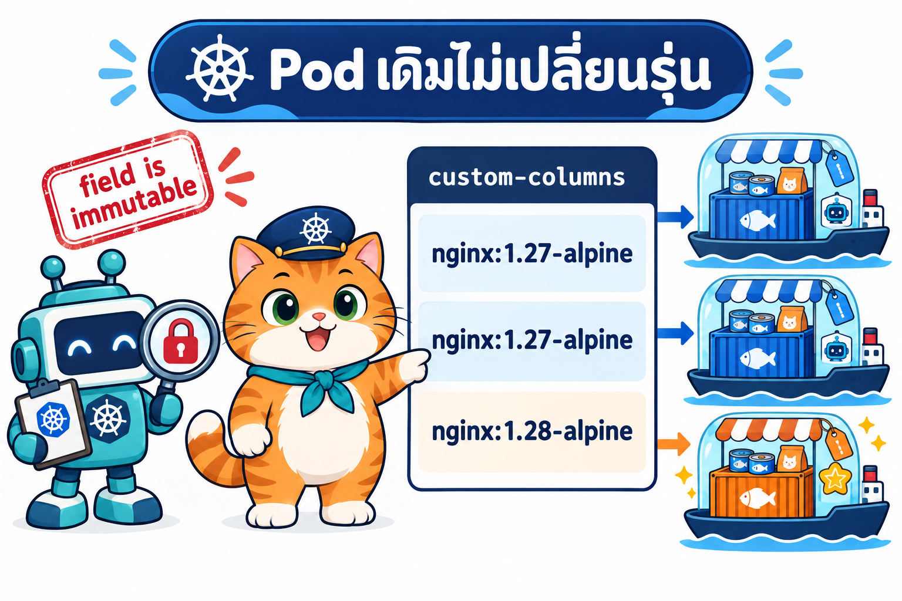<br>
  <em><b>รูปที่ 7</b> LAB5: เปลี่ยน selector ได้ field is immutable; เปลี่ยน image ใน template เป็น nginx:1.28-alpine แล้ว custom-columns ยังเห็น 1.27 ทุกตัว จนกว่าจะลบ Pod</em>
</p>

**เป้าหมาย:** เห็นข้อจำกัดของ ReplicaSet ในการเปลี่ยนรุ่น selector แก้ไม่ได้ และ template ใหม่มีผลเฉพาะ Pod ที่เกิดใหม่

**ไฟล์:** `labs/lab05-template/web-rs.yaml` (nginx `1.27-alpine`, env `VERSION=v1` เขียนหน้า index เป็น `web $VERSION from <ชื่อ Pod>` มี readinessProbe), `web-rs-v2.yaml` (เปลี่ยน image เป็น `1.28-alpine` และ `VERSION=v2`), `web-rs-new-selector.yaml` (เพิ่ม `tier: front` ใน selector) ทั้งหมดอยู่ใน `rs-lab` คู่กับ snack-rs (selector `app=web` ไม่ทับกับ `app=snack`)

```bash
diff labs/lab05-template/web-rs.yaml labs/lab05-template/web-rs-v2.yaml
```

### ขั้นที่ 1: สร้าง RS web รุ่น v1

```bash
kubectl apply -f labs/lab05-template/web-rs.yaml
time kubectl wait --for=condition=Ready pod -l app=web -n rs-lab --timeout=120s
kubectl get pods -n rs-lab -l app=web -o wide
```

```text
replicaset.apps/web created
pod/web-6qrsq condition met
pod/web-l5jx4 condition met
pod/web-q7bgq condition met

real	0m8.957s
user	0m0.038s
sys	0m0.027s
NAME        READY   STATUS    RESTARTS   AGE   IP            NODE          NOMINATED NODE   READINESS GATES
web-6qrsq   1/1     Running   0          9s    10.244.1.18   lab-worker    <none>           <none>
web-l5jx4   1/1     Running   0          9s    10.244.1.19   lab-worker    <none>           <none>
web-q7bgq   1/1     Running   0          9s    10.244.3.13   lab-worker2   <none>           <none>
```

ทดสอบหน้าเว็บจากในบูธ (ใช้ **`127.0.0.1`** ไม่ใช่ `localhost` — ดูหมายเหตุ)

```bash
P=$(kubectl get pods -n rs-lab -l app=web -o jsonpath="{.items[0].metadata.name}")
kubectl exec -n rs-lab $P -- wget -qO- 127.0.0.1
```

```text
web v1 from web-6qrsq
```

> **ทำไมไม่ใช้ `localhost`:** ทดลองแล้ว `wget -qO- localhost` ได้ `wget: can't connect to remote host: Connection refused` เพราะ `localhost` ใน `/etc/hosts` ของ Pod ชี้ทั้ง `127.0.0.1` และ `::1` (IPv6) และ wget ลอง `::1` ก่อน ขณะที่ manifest นี้ทับ `command` ของ nginx ทำให้สคริปต์ตั้งต้นที่เปิดฟัง IPv6 ไม่ได้ทำงาน nginx จึงฟังเฉพาะ IPv4

### ขั้นที่ 2: ลองแก้ selector

```bash
kubectl apply -f labs/lab05-template/web-rs-new-selector.yaml; echo "exit=$?"
```

```text
The ReplicaSet "web" is invalid: spec.selector: Invalid value: {"matchLabels":{"app":"web","tier":"front"}}: field is immutable
exit=1
```

### ขั้นที่ 3: apply template ใหม่ (v2)

```bash
kubectl apply -f labs/lab05-template/web-rs-v2.yaml; sleep 2
kubectl get pods -n rs-lab -l app=web -o custom-columns=NAME:.metadata.name,IMAGE:.spec.containers[0].image,VERSION:.spec.containers[0].env[0].value
kubectl get rs web -n rs-lab -o wide
for p in $(kubectl get pods -n rs-lab -l app=web -o name); do kubectl exec -n rs-lab $p -- wget -qO- 127.0.0.1; done
```

```text
replicaset.apps/web configured
NAME        IMAGE               VERSION
web-6qrsq   nginx:1.27-alpine   v1
web-l5jx4   nginx:1.27-alpine   v1
web-q7bgq   nginx:1.27-alpine   v1
NAME   DESIRED   CURRENT   READY   AGE   CONTAINERS   IMAGES              SELECTOR
web    3         3         3       30s   nginx        nginx:1.28-alpine   app=web
web v1 from web-6qrsq
web v1 from web-l5jx4
web v1 from web-q7bgq
```

RS บอก IMAGES `nginx:1.28-alpine` (template) แต่ Pod ทั้ง 3 ตัวยังเป็น `1.27` / `v1` และหน้าเว็บยังตอบ v1 ทุกบูธ

### ขั้นที่ 4: ลบ Pod หนึ่งตัว

```bash
P=$(kubectl get pods -n rs-lab -l app=web -o jsonpath="{.items[0].metadata.name}")
kubectl delete pod $P -n rs-lab; T0=$(date +%s)
kubectl wait --for=condition=Ready pod -l app=web -n rs-lab --timeout=120s >/dev/null; echo "รอ Ready $(( $(date +%s)-T0 )) วิ"
kubectl get pods -n rs-lab -l app=web -o custom-columns=NAME:.metadata.name,IMAGE:.spec.containers[0].image,VERSION:.spec.containers[0].env[0].value,AGE:.metadata.creationTimestamp
for p in $(kubectl get pods -n rs-lab -l app=web -o name); do kubectl exec -n rs-lab $p -- wget -qO- 127.0.0.1; done
```

```text
pod "web-6qrsq" deleted from rs-lab namespace
รอ Ready 6 วิ
NAME        IMAGE               VERSION   AGE
web-d4lf5   nginx:1.28-alpine   v2        2026-10-05T01:12:15Z
web-l5jx4   nginx:1.27-alpine   v1        2026-10-05T01:11:45Z
web-q7bgq   nginx:1.27-alpine   v1        2026-10-05T01:11:45Z
web v2 from web-d4lf5
web v1 from web-l5jx4
web v1 from web-q7bgq
```

ตัวที่เกิดใหม่เท่านั้นที่เป็น v2 (Node ต้องดึง `nginx:1.28-alpine` ก่อน ในการทดลองใช้ 6.854 วินาที) ร้านตอนนี้มี **รุ่นปนกัน** ถ้าจะให้ครบต้องลบอีก 2 ตัวทีละตัวและรอเอง ซึ่งจะเจออีกครั้งใน LAB 9

### ขั้นที่ 5: ลบ RS web

```bash
kubectl delete rs web -n rs-lab; kubectl get rs,pods -n rs-lab
```

```text
replicaset.apps "web" deleted from rs-lab namespace
NAME                       DESIRED   CURRENT   READY   AGE
replicaset.apps/snack-rs   3         3         3       3m5s

NAME                 READY   STATUS        RESTARTS   AGE
pod/snack-rs-f4p6n   1/1     Running       0          3m5s
pod/snack-rs-h9wk2   1/1     Running       0          84s
pod/stray            1/1     Running       0          3m6s
pod/web-d4lf5        1/1     Terminating   0          36s
pod/web-l5jx4        1/1     Terminating   0          66s
pod/web-q7bgq        1/1     Terminating   0          66s
```

### สิ่งที่เห็น

- แก้ selector → `field is immutable`
- apply template ใหม่ → `get rs -o wide` เปลี่ยน แต่ Pod เดิมยังรุ่นเก่าทุกตัว
- ลบ Pod → เฉพาะตัวใหม่ได้รุ่นใหม่ เปลี่ยนรุ่นทั้งร้านต้องลบเองทีละตัว

> **🤔 คำถามชวนคิด:** ถ้าสั่ง `kubectl delete pod -n rs-lab -l app=web` เพื่อเปลี่ยนรุ่นทีเดียวทั้ง 3 ตัว จะเกิดอะไรกับลูกค้าในช่วงนั้น

**เก็บกวาด:** ลบ RS web แล้วในขั้นที่ 5 เก็บ `snack-rs` ไว้ใช้ใน LAB 6

---

## LAB 6: ลบ ReplicaSet แบบ cascade vs orphan

<p align="center" id="fig-8">
  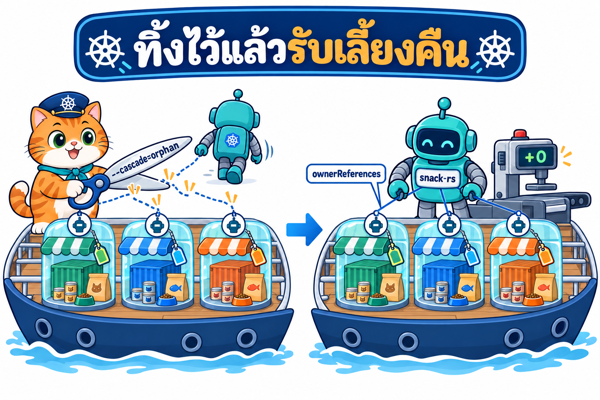<br>
  <em><b>รูปที่ 8</b> LAB6: ลบ RS ปกติ Pod หายตาม, ลบด้วย --cascade=orphan Pod อยู่ต่อแบบไม่มีเจ้าของ แล้ว apply RS เดิมอีกครั้ง → รับเลี้ยงโดยไม่สร้างเพิ่ม</em>
</p>

**เป้าหมาย:** ลบ RS แบบ orphan แล้วให้ RS ใหม่รับเลี้ยง Pod เดิมโดยไม่สร้างเพิ่ม และลบแบบ foreground เพื่อดู finalizer

**ต้องมีจาก LAB 4:** `snack-rs` ใน `rs-lab` (`3 3 3` มี `stray` เป็นสมาชิก) ส่วนแบบ background (ค่าเริ่มต้น) เราเห็นแล้วตอนลบ RS `snack-rs-expr` (LAB 1) และ `web` (LAB 5) ที่ Pod หายตาม

### ขั้นที่ 1: ลบแบบ orphan

```bash
kubectl delete rs snack-rs -n rs-lab --cascade=orphan; kubectl get rs,pods -n rs-lab
kubectl get pods -n rs-lab -l app=snack -o custom-columns=NAME:.metadata.name,OWNER:.metadata.ownerReferences[0].name,UID:.metadata.ownerReferences[0].uid
```

```text
replicaset.apps "snack-rs" deleted from rs-lab namespace
NAME                 READY   STATUS        RESTARTS   AGE
pod/snack-rs-f4p6n   1/1     Running       0          3m6s
pod/snack-rs-h9wk2   1/1     Running       0          85s
pod/stray            1/1     Running       0          3m7s
...
NAME             OWNER    UID
snack-rs-f4p6n   <none>   <none>
snack-rs-h9wk2   <none>   <none>
stray            <none>   <none>
```

(บรรทัด `web-...  Terminating` จาก LAB 5 อาจยังเห็นอยู่ชั่วครู่ ตัดออกจากผลข้างบน) RS หายไป แต่บูธทั้ง 3 ยังเปิดอยู่ ไม่มีเจ้าของ (`<none>`)

### ขั้นที่ 2: RS ใหม่รับเลี้ยง

```bash
kubectl apply -f labs/lab01-first-rs/snack-rs.yaml; sleep 3; kubectl get rs,pods -n rs-lab
kubectl get rs snack-rs -n rs-lab -o jsonpath='RS uid={.metadata.uid}{"\n"}'
kubectl get pods -n rs-lab -l app=snack -o custom-columns=NAME:.metadata.name,OWNER:.metadata.ownerReferences[0].name,UID:.metadata.ownerReferences[0].uid
kubectl describe rs snack-rs -n rs-lab | grep -A5 Events
```

```text
replicaset.apps/snack-rs created
NAME                       DESIRED   CURRENT   READY   AGE
replicaset.apps/snack-rs   3         3         3       3s

NAME                 READY   STATUS    RESTARTS   AGE
pod/snack-rs-f4p6n   1/1     Running   0          3m9s
pod/snack-rs-h9wk2   1/1     Running   0          88s
pod/stray            1/1     Running   0          3m10s
RS uid=38910974-1f02-43d6-b69a-32a745bd42a4
NAME             OWNER      UID
snack-rs-f4p6n   snack-rs   38910974-1f02-43d6-b69a-32a745bd42a4
snack-rs-h9wk2   snack-rs   38910974-1f02-43d6-b69a-32a745bd42a4
stray            snack-rs   38910974-1f02-43d6-b69a-32a745bd42a4
Events:            <none>
```

RS ใหม่ `3 3 3` ทันทีโดย **ไม่มี Pod ใหม่** (AGE ของ Pod ยังเป็นหลักนาที, `Events: <none>`) และ ownerReferences กลับมาพร้อม uid ของ RS ตัวใหม่ นี่คือวิธี "เปลี่ยนหัวหน้ากะโดยไม่ปิดบูธ"

### ขั้นที่ 3: ลบแบบ foreground

🐧 **terminal 2** เฝ้า finalizer ของ RS (เปิดก่อนสั่งลบ)

```bash
kubectl get rs snack-rs -n rs-lab -o jsonpath='{.metadata.finalizers}{"\n"}' -w
```

(ถ้ามีหน้าต่างที่ 3 เปิด `kubectl get rs snack-rs -n rs-lab -w` เพิ่มได้) 🐧 **terminal 1**

```bash
date +%T; kubectl delete rs snack-rs -n rs-lab --cascade=foreground; date +%T; kubectl get rs,pods -n rs-lab
```

```text
08:13:14
replicaset.apps "snack-rs" deleted from rs-lab namespace
08:13:17
No resources found in rs-lab namespace.
```

terminal 2 และหน้าต่างที่ 3

```text
["foregroundDeletion"]
["foregroundDeletion"]
...
NAME       DESIRED   CURRENT   READY   AGE
snack-rs   3         3         3       20s
snack-rs   3         2         2       22s
snack-rs   3         0         0       22s
...
```

kubectl รอราว 3 วินาที ระหว่างนั้น RS มี finalizer `foregroundDeletion` และ CURRENT ลด 3 → 2 → 0 ก่อน RS หายไป ต่างจาก background ที่ RS หายทันทีแล้ว Pod ค่อยหายตาม กด `Ctrl+C` ที่ terminal 2

### ขั้นที่ 4: เก็บกวาด namespace rs-lab

```bash
time kubectl delete ns rs-lab; kubectl get ns
```

```text
namespace "rs-lab" deleted

real	0m5.988s
...
NAME                 STATUS   AGE
default              Active   11m
kube-node-lease      Active   11m
kube-public          Active   11m
kube-system          Active   11m
local-path-storage   Active   11m
```

### สิ่งที่เห็น

- `--cascade=orphan` ลบเฉพาะ RS Pod อยู่ต่อแบบไม่มีเจ้าของ และ RS ใหม่ที่ selector ตรงรับเลี้ยงโดยไม่สร้างเพิ่ม (uid ใหม่)
- `--cascade=foreground` RS ค้างพร้อม finalizer `foregroundDeletion` จน Pod หายหมด

> **🤔 คำถามชวนคิด:** ถ้าต้องการเปลี่ยนชื่อ RS จาก `snack-rs` เป็น `snack` โดยร้านไม่ปิดแม้แต่วินาทีเดียว จะใช้ขั้นตอนไหนของ LAB นี้

**เก็บกวาด:** ลบ namespace `rs-lab` แล้วในขั้นที่ 4

---

## LAB 7: ReplicaSet กับ quota, LimitRange และ PSA

<p align="center" id="fig-9">
  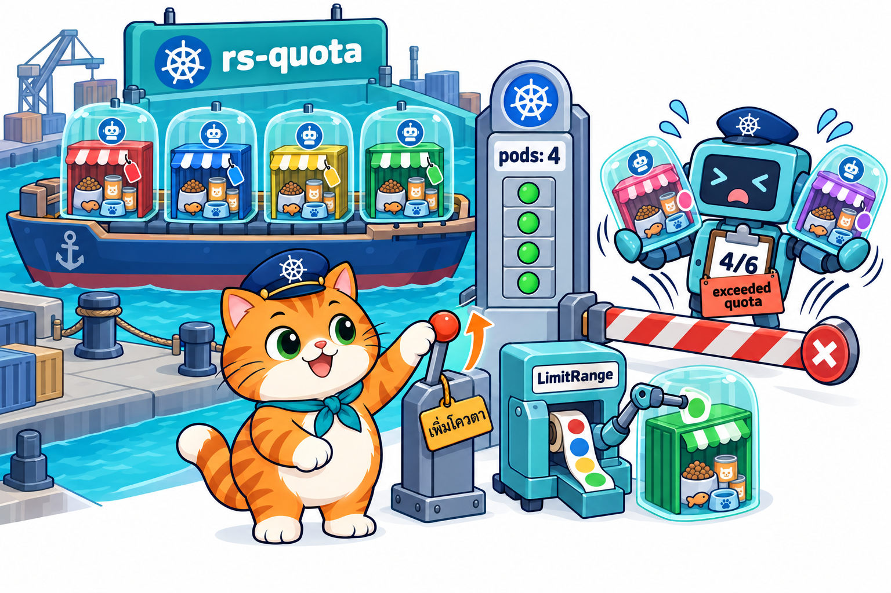<br>
  <em><b>รูปที่ 9</b> LAB7: namespace rs-quota มี quota pods=4 + LimitRange → RS replicas 6 ได้แค่ 4, Events FailedCreate exceeded quota, condition ReplicaFailure; เพิ่ม quota แล้ว RS สร้างต่อเอง (อาจรอราว 1 นาทีหลังเพิ่มโควตา เพราะ backoff); ทางเลือก PSA enforce ให้ RS สร้างได้แต่ Pod ถูกปฏิเสธ</em>
</p>

**เป้าหมาย:** เห็นว่า ResourceQuota และ Pod Security Admission (บทที่ 4) ตรวจที่ **Pod** ที่ RS สร้าง ไม่ใช่ตัว RS และอ่าน condition/event ของ RS ที่สร้าง Pod ไม่ครบ

**ไฟล์:** `labs/lab07-quota/00-ns-quota.yaml` (namespace `rs-quota` + ResourceQuota `rs-quota` `pods: "4"` + LimitRange `box-size` defaultRequest 100m/64Mi default 200m/128Mi), `quota-rs.yaml` (replicas 6 ไม่ระบุ resources), `psa-rs.yaml` (namespace `rs-psa` enforce+warn `restricted` + RS ไม่มี securityContext)

### ขั้นที่ 1: ขอ 6 บูธในโซนที่ให้ 4

```bash
kubectl apply -f labs/lab07-quota/00-ns-quota.yaml
kubectl apply -f labs/lab07-quota/quota-rs.yaml; sleep 5; kubectl get rs,pods -n rs-quota
```

```text
namespace/rs-quota created
resourcequota/rs-quota created
limitrange/box-size created
replicaset.apps/quota-rs created
NAME                       DESIRED   CURRENT   READY   AGE
replicaset.apps/quota-rs   6         4         4       6s

NAME                 READY   STATUS    RESTARTS   AGE
pod/quota-rs-5vjwb   1/1     Running   0          6s
pod/quota-rs-9v6z7   1/1     Running   0          5s
pod/quota-rs-v8spk   1/1     Running   0          6s
pod/quota-rs-z962r   1/1     Running   0          6s
```

`apply` สำเร็จทุกบรรทัด แต่ `DESIRED 6 CURRENT 4` ดูสาเหตุ

```bash
kubectl describe rs quota-rs -n rs-quota | sed -n "/Conditions/,\$p"
kubectl get rs quota-rs -n rs-quota -o jsonpath='{.status.conditions}{"\n"}'
kubectl describe quota -n rs-quota
```

```text
Conditions:
  Type             Status  Reason
  ----             ------  ------
  ReplicaFailure   True    FailedCreate
Events:
  Type     Reason            Age               From                   Message
  ----     ------            ----              ----                   -------
  Normal   SuccessfulCreate  6s                replicaset-controller  Created pod: quota-rs-z962r
  Normal   SuccessfulCreate  6s                replicaset-controller  Created pod: quota-rs-5vjwb
  Normal   SuccessfulCreate  5s                replicaset-controller  Created pod: quota-rs-v8spk
  Warning  FailedCreate      5s                replicaset-controller  Error creating: pods "quota-rs-kxq2g" is forbidden: exceeded quota: rs-quota, requested: pods=1, used: pods=4, limited: pods=4
  Warning  FailedCreate      5s                replicaset-controller  Error creating: pods "quota-rs-qxcmh" is forbidden: exceeded quota: rs-quota, requested: pods=1, used: pods=4, limited: pods=4
  Normal   SuccessfulCreate  5s                replicaset-controller  Created pod: quota-rs-9v6z7
...
  Warning  FailedCreate      4s (x11 over 5s)  replicaset-controller  (combined from similar events): Error creating: pods "quota-rs-4zbwn" is forbidden: exceeded quota: rs-quota, requested: pods=1, used: pods=4, limited: pods=4
[{"lastTransitionTime":"2026-10-05T01:13:53Z","message":"pods \"quota-rs-kxq2g\" is forbidden: exceeded quota: rs-quota, requested: pods=1, used: pods=4, limited: pods=4","reason":"FailedCreate","status":"True","type":"ReplicaFailure"}]
Name:       rs-quota
Namespace:  rs-quota
Resource    Used  Hard
--------    ----  ----
pods        4     4
```

- condition `ReplicaFailure=True` reason `FailedCreate` บอกว่า RS สร้าง Pod ไม่ได้
- event `exceeded quota: rs-quota, requested: pods=1, used: pods=4, limited: pods=4` เป็นข้อความเดียวกับบทที่ 4 แต่คราวนี้ผู้ถูกปฏิเสธคือ RS ไม่ใช่เรา
- RS พยายามซ้ำหลายสิบครั้งในไม่กี่วินาที (`x11 over 5s`) แล้วค่อย ๆ เว้นระยะห่างขึ้น (backoff)

### ขั้นที่ 2: LimitRange เติมขนาดให้ Pod ของ RS

```bash
P=$(kubectl get pods -n rs-quota -o jsonpath='{.items[0].metadata.name}')
kubectl get pod $P -n rs-quota -o jsonpath='{.spec.containers[0].resources}{"\n"}'
```

```text
{"limits":{"cpu":"200m","memory":"128Mi"},"requests":{"cpu":"100m","memory":"64Mi"}}
```

template ไม่มี `resources` แต่ Pod ทุกตัวที่ RS สร้างได้ค่าตั้งต้นจาก LimitRange `box-size`

### ขั้นที่ 3: เพิ่ม quota แล้วรอ

🐧 **terminal 2** (ทางเลือก) `kubectl get rs quota-rs -n rs-quota -w` 🐧 **terminal 1**

```bash
date +%T; kubectl patch resourcequota rs-quota -n rs-quota -p '{"spec":{"hard":{"pods":"6"}}}'
T0=$(date +%s); until [ "$(kubectl get rs quota-rs -n rs-quota -o jsonpath='{.status.readyReplicas}')" = 6 ]; do sleep 1; done; echo "ครบ 6 หลัง patch $(( $(date +%s)-T0 )) วิ"
kubectl get rs,pods -n rs-quota; kubectl get rs quota-rs -n rs-quota -o jsonpath='conditions={.status.conditions}{"\n"}'
```

```text
08:14:15
resourcequota/rs-quota patched
ครบ 6 หลัง patch 46 วิ
NAME                       DESIRED   CURRENT   READY   AGE
replicaset.apps/quota-rs   6         6         6       69s

NAME                 READY   STATUS    RESTARTS   AGE
pod/quota-rs-5vjwb   1/1     Running   0          69s
pod/quota-rs-9v6z7   1/1     Running   0          68s
pod/quota-rs-ntwzm   1/1     Running   0          1s
pod/quota-rs-tsfl6   1/1     Running   0          1s
pod/quota-rs-v8spk   1/1     Running   0          69s
pod/quota-rs-z962r   1/1     Running   0          69s
conditions=
```

terminal 2

```text
NAME       DESIRED   CURRENT   READY   AGE
quota-rs   6         4         4       22s
quota-rs   6         4         4       68s
quota-rs   6         6         4       68s
quota-rs   6         6         5       68s
quota-rs   6         6         6       69s
```

ไม่ต้องสั่งอะไร RS เพิ่ม แต่ต้อง **รอ** ในการทดลองใช้ 46 วินาทีหลัง patch (backoff ของ controller) RS จึงสร้างอีก 2 ตัว และ condition `ReplicaFailure` หายไปเอง (`conditions=` ว่าง) ในเครื่องนักศึกษาเวลาอาจต่าง (อาจรอได้ถึงราว 1 นาที)

### ขั้นที่ 4 (ทางเลือก): PSA enforce

```bash
kubectl apply -f labs/lab07-quota/psa-rs.yaml; sleep 4; kubectl get rs,pods -n rs-psa
kubectl describe rs psa-rs -n rs-psa | sed -n "/Conditions/,\$p" | head -8
```

```text
namespace/rs-psa created
Warning: would violate PodSecurity "restricted:latest": allowPrivilegeEscalation != false (container "app" must set securityContext.allowPrivilegeEscalation=false), unrestricted capabilities (container "app" must set securityContext.capabilities.drop=["ALL"]), runAsNonRoot != true (pod or container "app" must set securityContext.runAsNonRoot=true), seccompProfile (pod or container "app" must set securityContext.seccompProfile.type to "RuntimeDefault" or "Localhost")
replicaset.apps/psa-rs created
NAME                     DESIRED   CURRENT   READY   AGE
replicaset.apps/psa-rs   3         0         0       4s
Conditions:
  Type             Status  Reason
  ----             ------  ------
  ReplicaFailure   True    FailedCreate
Events:
  Type     Reason        Age   From                   Message
  ----     ------        ----  ----                   -------
  Warning  FailedCreate  4s    replicaset-controller  Error creating: pods "psa-rs-7qhvg" is forbidden: violates PodSecurity "restricted:latest": allowPrivilegeEscalation != false (container "app" must set securityContext.allowPrivilegeEscalation=false), unrestricted capabilities (container "app" must set securityContext.capabilities.drop=["ALL"]), runAsNonRoot != true (pod or container "app" must set securityContext.runAsNonRoot=true), seccompProfile (pod or container "app" must set securityContext.seccompProfile.type to "RuntimeDefault" or "Localhost")
```

ตอนสร้าง RS ได้แค่ `Warning: would violate ...` (จากโหมด `warn` ที่ตรวจ Pod template ของ workload) แล้ว `replicaset.apps/psa-rs created` แต่โหมด `enforce` ปฏิเสธ **Pod ทุกตัว** RS จึงเป็น `3 0 0` ร้านมี 0 บูธ

### ขั้นที่ 5: เก็บกวาด

```bash
kubectl delete ns rs-quota rs-psa
```

```text
namespace "rs-quota" deleted
namespace "rs-psa" deleted
```

(ถ้าข้ามขั้นที่ 4 จะมีข้อความ `namespaces "rs-psa" not found` ซึ่งไม่เป็นไร)

### สิ่งที่เห็น

- quota นับที่ Pod: RS ถูกสร้างได้แต่ได้ Pod แค่ 4 จาก 6 เห็นได้จาก `DESIRED/CURRENT` และ `ReplicaFailure`/`FailedCreate`
- LimitRange เติม requests/limits ให้ Pod ที่ RS สร้าง
- เพิ่ม quota แล้ว RS สร้างต่อเองหลัง backoff (ในการทดลอง 46 วินาที)
- PSA enforce: RS สร้างได้พร้อม Warning แต่ Pod ถูกปฏิเสธทั้งหมด (`3 0 0`)

> **🤔 คำถามชวนคิด:** ในงานจริง ถ้ามีคนแจ้งว่า "deploy แล้วไม่มี error แต่แอปไม่ขึ้น" ควรดูคำสั่งอะไรเป็นอันดับแรก และจะเห็นคำว่าอะไร

**เก็บกวาด:** ลบ namespace แล้วในขั้นที่ 5

---

## LAB 8: กระจาย replica ด้วย anti-affinity และ topology spread

<p align="center" id="fig-10">
  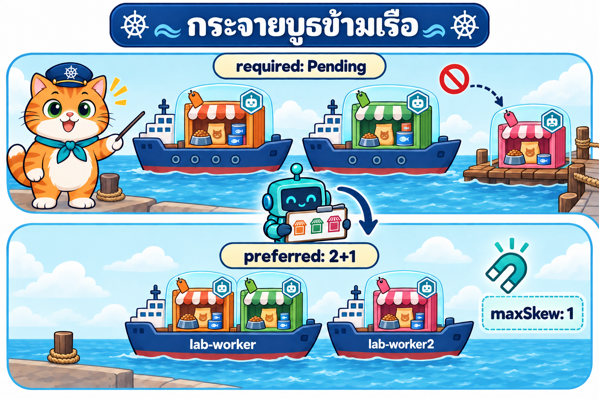<br>
  <em><b>รูปที่ 10</b> LAB8: required anti-affinity + replicas 3 บน worker 2 ลำ → 1 Pending; เปลี่ยนเป็น preferred → 2+1; topologySpreadConstraints maxSkew 1 ได้ 2+2 → scale 5 ได้ 2+3 เมื่อใส่ nodeTaintsPolicy: Honor (ไม่ใส่ จะนับ control-plane แล้วค้าง Pending)</em>
</p>

**เป้าหมาย:** ใช้กฎการจัดวางของบทที่ 3 กับ replicas ของ RS เห็นข้อจำกัดของ required anti-affinity เมื่อเรือมีน้อยกว่าจำนวน Pod และใช้ preferred/topologySpreadConstraints แทน

**ไฟล์:** `labs/lab08-spread/` (`00-ns.yaml`, `spread-required.yaml`, `spread-preferred.yaml`, `spread-topology.yaml` — ส่วนสำคัญอยู่ใน [ทฤษฎีหัวข้อ 11](../01_Theory/README.md#11-replicaset-กับการจัดวาง-anti-affinity-และ-topology-spread))

### ขั้นที่ 1: required anti-affinity กับ 3 บูธบน 2 เรือ

```bash
kubectl apply -f labs/lab08-spread/00-ns.yaml -f labs/lab08-spread/spread-required.yaml; sleep 6
kubectl get rs,pods -n rs-spread -o wide
P=$(kubectl get pods -n rs-spread --field-selector status.phase=Pending -o jsonpath="{.items[0].metadata.name}")
kubectl describe pod $P -n rs-spread | sed -n "/Events/,\$p"
```

```text
namespace/rs-spread created
replicaset.apps/spread-req created
NAME                         DESIRED   CURRENT   READY   AGE   CONTAINERS   IMAGES         SELECTOR
replicaset.apps/spread-req   3         3         2       6s    app          busybox:1.36   app=spread-req

NAME                   READY   STATUS    RESTARTS   AGE   IP            NODE          NOMINATED NODE   READINESS GATES
pod/spread-req-cg7n6   0/1     Pending   0          6s    <none>        <none>        <none>           <none>
pod/spread-req-gg8pw   1/1     Running   0          6s    10.244.1.24   lab-worker    <none>           <none>
pod/spread-req-gmkgc   1/1     Running   0          6s    10.244.3.17   lab-worker2   <none>           <none>
Events:
  Type     Reason            Age   From               Message
  ----     ------            ----  ----               -------
  Warning  FailedScheduling  6s    default-scheduler  0/3 nodes are available: 1 node(s) had untolerated taint(s), 2 node(s) didn't match pod anti-affinity rules. preemption: 0/3 nodes are available: 1 Preemption is not helpful for scheduling, 2 No preemption victims found for incoming pod.
```

worker 2 ลำรับได้ลำละ 1 บูธ control-plane มี taint บูธที่ 3 จึง `Pending` และ RS แสดง `3 3 2` (Pod ที่ Pending นับเป็น CURRENT แล้ว RS ไม่แก้อะไรให้)

### ขั้นที่ 2: preferred anti-affinity

```bash
kubectl delete -f labs/lab08-spread/spread-required.yaml
kubectl apply -f labs/lab08-spread/spread-preferred.yaml; sleep 5; kubectl get pods -n rs-spread -o wide
```

```text
replicaset.apps "spread-req" deleted from rs-spread namespace
replicaset.apps/spread-pref created
NAME                READY   STATUS    RESTARTS   AGE   IP            NODE          NOMINATED NODE   READINESS GATES
spread-pref-2vbxr   1/1     Running   0          5s    10.244.3.18   lab-worker2   <none>           <none>
spread-pref-j9gv4   1/1     Running   0          5s    10.244.3.19   lab-worker2   <none>           <none>
spread-pref-qd797   1/1     Running   0          5s    10.244.1.25   lab-worker    <none>           <none>
```

ได้ 2+1 ไม่มี Pending ลองซ้ำอีก 4 รอบเพื่อดูว่าคงที่ไหม

```bash
for i in 1 2 3 4; do kubectl delete -f labs/lab08-spread/spread-preferred.yaml >/dev/null; sleep 3; kubectl apply -f labs/lab08-spread/spread-preferred.yaml >/dev/null; sleep 4; echo "รอบ $i: $(kubectl get pods -n rs-spread -l app=spread-pref --no-headers -o custom-columns=N:.spec.nodeName | sort | uniq -c | tr -s " " | tr "\n" ",")"; done
```

```text
รอบ 1:  1 lab-worker, 2 lab-worker2,
รอบ 2:  1 lab-worker, 2 lab-worker2,
รอบ 3:  1 lab-worker, 2 lab-worker2,
รอบ 4:  1 lab-worker, 2 lab-worker2,
```

### ขั้นที่ 3: topologySpreadConstraints

```bash
kubectl delete -f labs/lab08-spread/spread-preferred.yaml
kubectl apply -f labs/lab08-spread/spread-topology.yaml; sleep 5; kubectl get pods -n rs-spread -o wide
kubectl scale rs spread-topo -n rs-spread --replicas=5; sleep 4
kubectl get pods -n rs-spread --no-headers -o custom-columns=N:.spec.nodeName | sort | uniq -c
```

```text
replicaset.apps "spread-pref" deleted from rs-spread namespace
replicaset.apps/spread-topo created
NAME                READY   STATUS    RESTARTS   AGE   IP            NODE          NOMINATED NODE   READINESS GATES
spread-topo-22qsr   1/1     Running   0          5s    10.244.1.31   lab-worker    <none>           <none>
spread-topo-8qqd8   1/1     Running   0          5s    10.244.1.30   lab-worker    <none>           <none>
spread-topo-bw9d8   1/1     Running   0          5s    10.244.3.28   lab-worker2   <none>           <none>
spread-topo-jlsq2   1/1     Running   0          5s    10.244.3.29   lab-worker2   <none>           <none>
replicaset.apps/spread-topo scaled
      2 lab-worker
      3 lab-worker2
```

4 บูธได้ 2+2 พอดี scale เป็น 5 ได้ 2+3 (ลำไหนได้ 3 ขึ้นกับ scheduler) ต่างกันไม่เกิน `maxSkew: 1`

### ขั้นที่ 4: ถ้าไม่มี nodeTaintsPolicy: Honor

ลองตัดบรรทัด `nodeTaintsPolicy` ออกด้วย `grep -v` แล้วส่งเข้า kubectl

```bash
kubectl delete -f labs/lab08-spread/spread-topology.yaml >/dev/null
grep -v nodeTaintsPolicy labs/lab08-spread/spread-topology.yaml | kubectl apply -f -; sleep 5; kubectl get pods -n rs-spread -o wide
P=$(kubectl get pods -n rs-spread --field-selector status.phase=Pending -o jsonpath='{.items[0].metadata.name}'); kubectl describe pod $P -n rs-spread | grep FailedScheduling
```

```text
replicaset.apps/spread-topo created
NAME                READY   STATUS    RESTARTS   AGE   IP            NODE          NOMINATED NODE   READINESS GATES
spread-topo-hsgtd   1/1     Running   0          5s    10.244.3.31   lab-worker2   <none>           <none>
spread-topo-mrdd8   0/1     Pending   0          5s    <none>        <none>        <none>           <none>
spread-topo-s98cs   1/1     Running   0          5s    10.244.1.32   lab-worker    <none>           <none>
spread-topo-w96vd   0/1     Pending   0          5s    <none>        <none>        <none>           <none>
  Warning  FailedScheduling  2s (x7 over 5s)  default-scheduler  0/3 nodes are available: 1 node(s) had untolerated taint(s), 2 node(s) didn't match pod topology spread constraints. preemption: 0/3 nodes are available: 1 Preemption is not helpful for scheduling, 2 No preemption victims found for incoming pod.
```

ค่าเริ่มต้น `nodeTaintsPolicy: Ignore` นับ `lab-control-plane` (มี 0 Pod ตลอด) เป็นโดเมนด้วย เมื่อ worker มีลำละ 1 การวางเพิ่มจะทำให้ส่วนต่างเป็น 2 จึง Pending 2 ตัว (บทที่ 3 LAB 5 อธิบายไว้แล้ว)

### ขั้นที่ 5: เก็บกวาด

```bash
kubectl delete ns rs-spread
```

```text
namespace "rs-spread" deleted
```

### สิ่งที่เห็น

- required anti-affinity + replicas มากกว่าจำนวนเรือ → Pod เกินค้าง Pending (`didn't match pod anti-affinity rules`) RS ไม่แก้ให้
- preferred → 2+1 ทุกรอบ, topology spread (`maxSkew: 1` + `nodeTaintsPolicy: Honor`) → 2+2 และ 2+3
- ไม่มี `nodeTaintsPolicy: Honor` ใน kind → Pending เพราะนับ control-plane

> **🤔 คำถามชวนคิด:** ร้านน้องส้มใน LAB 9 ใช้ preferred anti-affinity ถ้าเปลี่ยนเป็น required แล้ว scale เป็น 5 บูธ จะได้กี่บูธที่ Running

**เก็บกวาด:** ลบ namespace แล้วในขั้นที่ 5

---

## LAB 9: LAB สุดท้าย: ร้านน้องส้ม 3 บูธด้วย ReplicaSet

<p align="center" id="fig-11">
  <br>
  <em><b>รูปที่ 11</b> LAB9 สถาปัตยกรรม: namespace som-booths, ReplicaSet som-booth replicas 3, Pod template = ร้าน all-in-one ของบท 004 (web som-shop-web:1.1 + db sidecar postgres + emptyDir) ทุกบูธจึงมีฐานข้อมูลของตัวเอง</em>
</p>

**เป้าหมาย:** นำร้าน all-in-one ของบทที่ 4 มาเป็น **Pod template** ของ ReplicaSet `som-booth` 3 บูธ เปิดหน้าร้านทีละบูธ สั่งซื้อ ลบบูธ scale และเปลี่ยนรุ่น เพื่อเห็นทั้งสิ่งที่ ReplicaSet ทำได้ดี และ **3 ปัญหาที่ ReplicaSet แก้ไม่ได้** ซึ่งเป็นโจทย์ของบทที่ 6 และ 7

### 9.0 สถาปัตยกรรมและไฟล์

```text
เครื่องนักศึกษา  browser  http://localhost:8081 / 8082 / 8083
     │ ssh -p 2223 -L 8081:localhost:8081 -L 8082:localhost:8082 -L 8083:localhost:8083 root@localhost
k8s-lab   kubectl port-forward -n som-booths pod/<บูธที่ 1> 8081:3000   (บูธที่ 2 → 8082, บูธที่ 3 → 8083)
     │
namespace som-booths  (pod-security.kubernetes.io/warn=restricted)
  ReplicaSet som-booth  replicas 3  selector app=som-booth
   ├─ Pod som-booth-xxxxx  (lab-worker2)  web:3000 + db sidecar + emptyDir   ← ออเดอร์ของบูธนี้เท่านั้น
   ├─ Pod som-booth-yyyyy  (lab-worker2)  web + db + emptyDir
   └─ Pod som-booth-zzzzz  (lab-worker)   web + db + emptyDir                ← preferred anti-affinity → 2+1
```

| ไฟล์ | หน้าที่ |
|---|---|
| `som-booths/app/` | แอป Next.js + Dockerfile สำเนาจากบทที่ 4 (`som-shop-web:1.1` อ่านข้อความหัว/ท้ายหน้าจาก env `SHOP_EYEBROW`, `SHOP_FOOTER`) |
| `som-booths/k8s/00-namespace.yaml` | namespace `som-booths` label `team: som` และ `pod-security.kubernetes.io/warn: restricted` |
| `som-booths/k8s/som-booth.yaml` | ReplicaSet `som-booth` replicas 3 template = Pod ร้านของบทที่ 4 ทั้งก้อน (securityContext restricted, emptyDir `db-data`, native sidecar `db` postgres:17.11-alpine + probes, init `wait-for-db`, `db-seed`, container `web` + probes) |
| `som-booths/k8s/som-booth-promo.yaml` | เหมือน `som-booth.yaml` ทุกบรรทัด ยกเว้น image `som-shop-web:1.1-promo` (2 จุด) และข้อความ eyebrow โปร |

สิ่งที่ `som-booth.yaml` ต่างจาก `som-shop.yaml` ของบทที่ 4 คือห่อด้วย `kind: ReplicaSet` (template ไม่มี `name`) และเพิ่ม 2 อย่างใน template

```bash
cd /workspace/005_kubernetes_replicaset/02_LAB/som-booths
sed -n '1,40p' k8s/som-booth.yaml
grep -n -B1 -A3 "POD_NAME\|SHOP_EYEBROW\|SHOP_FOOTER" k8s/som-booth.yaml | head -30
```

ส่วนสำคัญ (ตัดจากไฟล์จริง)

```yaml
apiVersion: apps/v1
kind: ReplicaSet
metadata:
  name: som-booth
  namespace: som-booths
  labels:
    app: som-booth
spec:
  replicas: 3                      # จำนวนบูธ
  selector:
    matchLabels:
      app: som-booth
  template:                        # แบบพิมพ์บูธ (ไม่มี name → ระบบตั้ง som-booth-xxxxx)
    metadata:
      labels:
        app: som-booth             # ต้องตรงกับ selector
    spec:
      affinity:                      # ขอร้อง (preferred) ให้บูธอยู่คนละเรือ ถ้าไม่ได้ก็ยอม (บท 003)
        podAntiAffinity:
          preferredDuringSchedulingIgnoredDuringExecution:
            - weight: 100
              podAffinityTerm:
                labelSelector:
                  matchLabels:
                    app: som-booth
                topologyKey: kubernetes.io/hostname
      volumes:
        - name: db-data              # ฐานข้อมูลของ "บูธนี้" เท่านั้น หายเมื่อ Pod ถูกลบ
          emptyDir: {}
      containers:
        - name: web
          image: som-shop-web:1.1
          env:
            - name: POD_NAME           # Downward API: ชื่อ Pod (= ชื่อบูธ) ต้องประกาศก่อนตัวที่ใช้ $(POD_NAME)
              valueFrom:
                fieldRef:
                  fieldPath: metadata.name
            - name: SHOP_NAME
              value: "ร้านอาหารแมวน้องส้ม (หลายบูธ)"
            - name: SHOP_EYEBROW       # ข้อความเล็กเหนือชื่อร้าน → บอกว่าเป็นบูธไหน
              value: "⚓ บูธ $(POD_NAME)"
            - name: SHOP_FOOTER
              value: "Next.js + PostgreSQL · Kubernetes LAB 005 · ReplicaSet som-booth"
```

(ไฟล์จริงยังมี `securityContext`, `initContainers` ทั้ง 3 ตัว, probes, resources และ env `DATABASE_URL` ที่มีรหัส `meow1234` ซึ่งเป็นค่าตัวอย่างเพื่อการเรียน เหมือนบทที่ 4)

1. **env `POD_NAME`** จาก Downward API แล้วใช้ใน `SHOP_EYEBROW="⚓ บูธ $(POD_NAME)"` หน้าเว็บจึงบอกชื่อบูธ (ชื่อ Pod) ของตัวเอง
2. **preferred podAntiAffinity** กับ label `app=som-booth` เพื่อกระจายบูธข้ามเรือเท่าที่ทำได้

ทุกบูธยังมีฐานข้อมูล postgres อยู่ใน Pod ของตัวเอง (emptyDir) นี่คือที่มาของปัญหาข้อแรกที่จะเห็น

### 9.1 เตรียม image ให้ทุก Node

<p align="center" id="fig-12">
  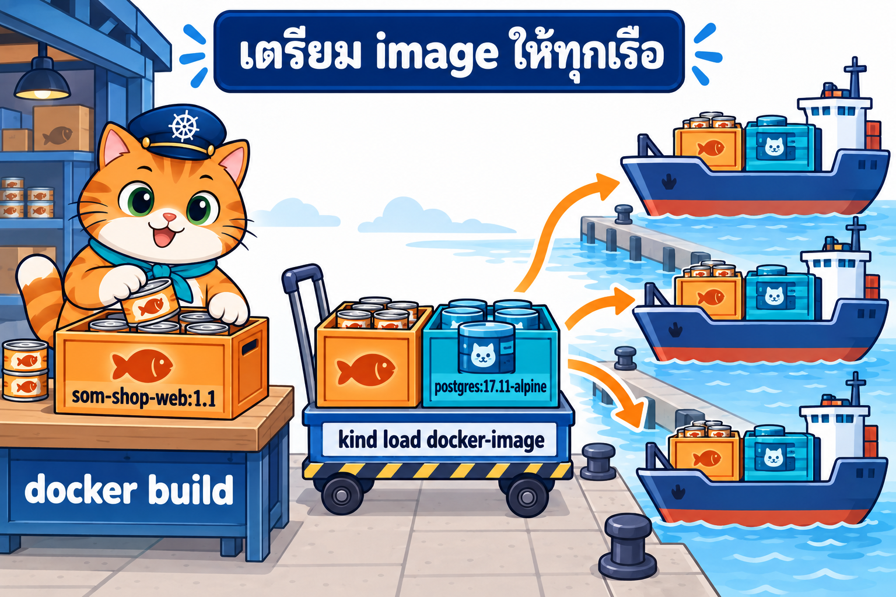<br>
  <em><b>รูปที่ 12</b> LAB9 เตรียม image: ถ้าคลัสเตอร์ใหม่ build som-shop-web:1.1 จากโฟลเดอร์ som-booths/app ของบทนี้ (สำเนาแอปจากบท 004) แล้ว kind load ให้ทุก Node, postgres ใช้ docker save --platform + kind load image-archive หรือให้ Node pull เอง</em>
</p>

🐧 **ใน SSH session ของ k8s-lab** ตรวจว่า Node มี image อยู่แล้วหรือยัง (ถ้าใช้คลัสเตอร์ต่อจากบทที่ 4 ที่เคย `kind load som-shop-web:1.1` และ postgres ไว้ จะเห็นทั้งสอง)

```bash
docker exec lab-worker crictl images | grep -E "som-shop-web|postgres" || echo "(ยังไม่มี image บน Node)"
```

```text
(ยังไม่มี image บน Node)
```

ถ้ายังไม่มี (คลัสเตอร์ใหม่) ให้ build แอปจากโฟลเดอร์ `som-booths/app` ของบทนี้แล้วโหลดเข้าทุก Node (ถ้ามีครบแล้วข้ามไปทำ `1.1-promo` ด้านล่าง)

```bash
cd /workspace/005_kubernetes_replicaset/02_LAB/som-booths/app
time docker build -q -t som-shop-web:1.1 . && docker images som-shop-web
time kind load docker-image som-shop-web:1.1 --name lab
```

```text
sha256:2f06fd68d1055e4c098e3d864b617d7d8d34f931be0caa16a4f5823032877df7

real	0m28.822s
...
IMAGE              ID             DISK USAGE   CONTENT SIZE   EXTRA
som-shop-web:1.1   2f06fd68d105        305MB         76.6MB        
Image: "som-shop-web:1.1" with ID "sha256:2f06fd68d1055e4c098e3d864b617d7d8d34f931be0caa16a4f5823032877df7" not yet present on node "lab-worker2", loading...
Image: "som-shop-web:1.1" with ID "sha256:2f06fd68d1055e4c098e3d864b617d7d8d34f931be0caa16a4f5823032877df7" not yet present on node "lab-worker", loading...
Image: "som-shop-web:1.1" with ID "sha256:2f06fd68d1055e4c098e3d864b617d7d8d34f931be0caa16a4f5823032877df7" not yet present on node "lab-control-plane", loading...

real	0m5.079s
```

(ครั้งแรกในเครื่องที่ยังไม่มี `node:22-alpine` อาจใช้หลายนาที) postgres เป็น image หลาย platform จึงใช้วิธีเดียวกับบทที่ 4

```bash
docker pull -q postgres:17.11-alpine
time (docker save --platform linux/amd64 postgres:17.11-alpine -o /tmp/pg.tar && kind load image-archive /tmp/pg.tar --name lab)
```

```text
docker.io/library/postgres:17.11-alpine

real	0m5.697s
```

เตรียม image "รุ่นโปร" ไว้ใช้ในขั้น 9.7 เลย `1.1-promo` เป็นแค่ **tag ใหม่ของ image เดิม** (หน้าตาแอปเหมือนเดิม ต่างกันที่ข้อความ eyebrow ซึ่งมาจาก env ใน template ใหม่)

```bash
docker tag som-shop-web:1.1 som-shop-web:1.1-promo; docker images som-shop-web
time kind load docker-image som-shop-web:1.1-promo --name lab
docker exec lab-worker crictl images | grep -E "som-shop|postgres"
```

```text
IMAGE                    ID             DISK USAGE   CONTENT SIZE   EXTRA
som-shop-web:1.1         2f06fd68d105        305MB         76.6MB        
som-shop-web:1.1-promo   2f06fd68d105        305MB         76.6MB        
Image: "som-shop-web:1.1-promo" with ID "sha256:2f06fd68d1055e4c098e3d864b617d7d8d34f931be0caa16a4f5823032877df7" not yet present on node "lab-worker2", loading...
Image: "som-shop-web:1.1-promo" with ID "sha256:2f06fd68d1055e4c098e3d864b617d7d8d34f931be0caa16a4f5823032877df7" not yet present on node "lab-worker", loading...
Image: "som-shop-web:1.1-promo" with ID "sha256:2f06fd68d1055e4c098e3d864b617d7d8d34f931be0caa16a4f5823032877df7" not yet present on node "lab-control-plane", loading...

real	0m3.139s
docker.io/library/postgres                      17.11-alpine         79bd7c99e9231       117MB
docker.io/library/som-shop-web                  1.1                  63cbdba1d8b71       76.6MB
docker.io/library/som-shop-web                  1.1-promo            63cbdba1d8b71       76.6MB
```

`crictl images` บนเรือต้องเห็นครบ 3 รายการ (`1.1` กับ `1.1-promo` มี ID เดียวกันเพราะเป็น image เดียวกัน และ ID ของ containerd ต่างจาก ID ของ docker ได้ เป็นเรื่องปกติ)

### 9.2 เปิดร้าน 3 บูธ

<p align="center" id="fig-13">
  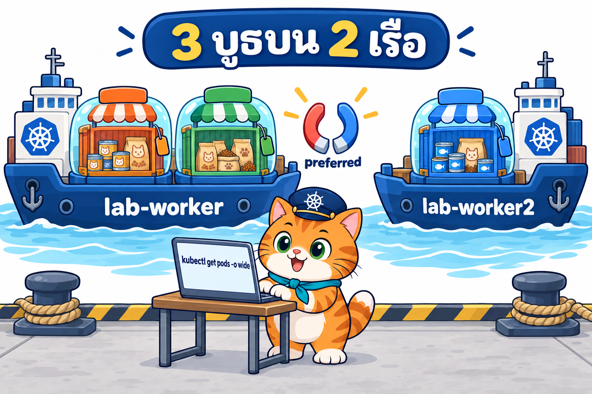<br>
  <em><b>รูปที่ 13</b> LAB9: apply แล้ว kubectl get pods -o wide เห็น 3 บูธกระจาย 2 เรือ (preferred anti-affinity → 2+1) แต่ละบูธชื่อไม่ซ้ำ</em>
</p>

🐧 **terminal 2** เฝ้าดู

```bash
kubectl get pods -n som-booths -o wide -w
```

(เปิดหลังสั่ง apply ในบล็อกถัดไปทันทีก็ได้) 🐧 **terminal 1**

```bash
cd /workspace/005_kubernetes_replicaset/02_LAB/som-booths
T0=$(date +%s); kubectl apply -f k8s/00-namespace.yaml -f k8s/som-booth.yaml
kubectl wait --for=condition=Ready pod -l app=som-booth -n som-booths --timeout=180s; echo "พร้อมครบ 3 บูธใน $(( $(date +%s)-T0 )) วิ"
kubectl get rs -n som-booths -o wide; kubectl get pods -n som-booths -o wide
```

```text
namespace/som-booths created
replicaset.apps/som-booth created
pod/som-booth-9t78k condition met
pod/som-booth-mdzn8 condition met
pod/som-booth-mf68c condition met
พร้อมครบ 3 บูธใน 8 วิ
NAME        DESIRED   CURRENT   READY   AGE   CONTAINERS   IMAGES             SELECTOR
som-booth   3         3         3       8s    web          som-shop-web:1.1   app=som-booth
NAME              READY   STATUS    RESTARTS   AGE   IP            NODE          NOMINATED NODE   READINESS GATES
som-booth-9t78k   2/2     Running   0          8s    10.244.3.33   lab-worker2   <none>           <none>
som-booth-mdzn8   2/2     Running   0          8s    10.244.3.32   lab-worker2   <none>           <none>
som-booth-mf68c   2/2     Running   0          8s    10.244.1.33   lab-worker    <none>           <none>
```

terminal 2 เห็นแต่ละบูธผ่านขั้นตอนเดียวกับบทที่ 4 (ย่อ)

```text
som-booth-9t78k   0/2     Init:0/3   0          1s    10.244.3.33   lab-worker2
som-booth-mdzn8   1/2     Init:1/3   0          4s    10.244.3.32   lab-worker2
som-booth-mf68c   1/2     Init:2/3   0          5s    10.244.1.33   lab-worker
som-booth-mf68c   1/2     PodInitializing   0          6s    10.244.1.33   lab-worker
som-booth-mf68c   2/2     Running           0          7s    10.244.1.33   lab-worker
som-booth-9t78k   2/2     Running           0          8s    10.244.3.33   lab-worker2
som-booth-mdzn8   2/2     Running           0          8s    10.244.3.32   lab-worker2
```

- ไม่มี `Warning` ของ PSA ตอน apply เพราะ template ผ่าน restricted ตั้งแต่บทที่ 4
- RS `3 3 3` Pod ทุกตัว `2/2` (web + db sidecar) ใช้เวลาราว 8 วินาทีเมื่อ image อยู่บน Node แล้ว
- preferred anti-affinity กระจายเป็น 2+1 (ลำไหนได้ 2 ในเครื่องนักศึกษาอาจกลับกัน)

ตรวจว่าทุกบูธเตรียมฐานข้อมูลของตัวเอง

```bash
for p in $(kubectl get pods -n som-booths -l app=som-booth -o name); do echo "== $p"; kubectl logs -n som-booths $p -c db-seed; done
```

```text
== pod/som-booth-9t78k
connected to database
tables ready: products, orders
seeded 6 products (new: 6)
== pod/som-booth-mdzn8
connected to database
tables ready: products, orders
seeded 6 products (new: 6)
== pod/som-booth-mf68c
connected to database
tables ready: products, orders
seeded 6 products (new: 6)
```

ทุกบูธ `seeded 6 products (new: 6)` แปลว่าแต่ละบูธสร้างตารางและสินค้าตั้งต้นใน **ฐานข้อมูลของตัวเอง** (ไม่ได้ใช้ร่วมกัน)

### 9.3 เปิดหน้าร้านทีละบูธ

<p align="center" id="fig-14">
  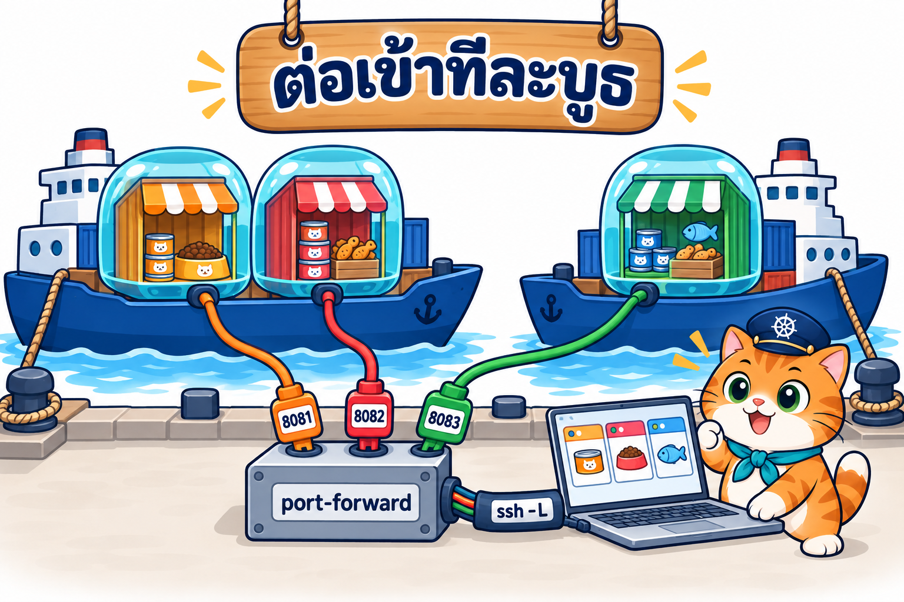<br>
  <em><b>รูปที่ 14</b> LAB9: ลูกค้าเข้าร้านได้ทีละบูธเท่านั้น: kubectl port-forward pod/&lt;ชื่อ&gt; 8081/8082/8083:3000 ใน k8s-lab แล้ว ssh -L จากเครื่องนักศึกษา เปิด 3 แท็บ</em>
</p>

ยังไม่มี "ที่อยู่ของร้าน" ที่รวมทุกบูธ ลูกค้าจึงต้องเข้าทีละบูธผ่าน port-forward ไปที่ Pod ตรง ๆ (บูธละ port)

**ขั้นที่ 1:** 🐧 **terminal 1** เก็บชื่อบูธไว้ในตัวแปร array `P` แล้วเปิด port-forward 3 ตัวไว้เบื้องหลัง

```bash
P=($(kubectl get pods -n som-booths -l app=som-booth -o jsonpath="{.items[*].metadata.name}")); echo ${P[@]}
kubectl port-forward -n som-booths pod/${P[0]} 8081:3000 > /tmp/pf-8081.log 2>&1 &
kubectl port-forward -n som-booths pod/${P[1]} 8082:3000 > /tmp/pf-8082.log 2>&1 &
kubectl port-forward -n som-booths pod/${P[2]} 8083:3000 > /tmp/pf-8083.log 2>&1 &
sleep 2; cat /tmp/pf-808*.log
pgrep -af "[k]ubectl port-forward"
for p in 8081 8082 8083; do curl -s localhost:$p | grep -o "บูธ som-booth-[a-z0-9]*" | head -1; done
```

```text
som-booth-9t78k som-booth-mdzn8 som-booth-mf68c
Forwarding from 127.0.0.1:8081 -> 3000
Forwarding from [::1]:8081 -> 3000
Forwarding from 127.0.0.1:8082 -> 3000
Forwarding from [::1]:8082 -> 3000
Forwarding from 127.0.0.1:8083 -> 3000
Forwarding from [::1]:8083 -> 3000
34928 kubectl port-forward -n som-booths pod/som-booth-9t78k 8081:3000
34929 kubectl port-forward -n som-booths pod/som-booth-mdzn8 8082:3000
34930 kubectl port-forward -n som-booths pod/som-booth-mf68c 8083:3000
บูธ som-booth-9t78k
บูธ som-booth-mdzn8
บูธ som-booth-mf68c
```

แต่ละ port ไปคนละบูธ หน้าเว็บบอกชื่อบูธของตัวเองที่ eyebrow (จาก `$(POD_NAME)`) ตรวจข้อความท้ายหน้าได้ด้วย

```bash
curl -s localhost:8081 | grep -o "<code>[^<]*</code>"; curl -s localhost:8081 | grep -o "Kubernetes LAB 005[^<]*" | head -1
```

```text
<code>som-booth-9t78k</code>
Kubernetes LAB 005 · ReplicaSet som-booth
```

> `pgrep`/`pkill` ให้ใช้ pattern `"[k]ubectl port-forward"` เสมอ (วงเล็บกันไม่ให้ pattern ไปตรงกับ shell ที่พิมพ์คำสั่งนั้นเอง)

**ขั้นที่ 2:** 🖥️ **บนเครื่องนักศึกษา** เปิดหน้าต่างใหม่ ต่อท่อ SSH 3 ท่อในคำสั่งเดียว (ถ้ามีหน้าต่าง `ssh -L` จากบทก่อนค้างอยู่ ให้ `exit` ก่อน) แล้วเปิดหน้าต่างนี้ทิ้งไว้จนจบ LAB

```bash
ssh -p 2223 -L 8081:localhost:8081 -L 8082:localhost:8082 -L 8083:localhost:8083 root@localhost
```

**ขั้นที่ 3:** 🌐 **browser บนเครื่องนักศึกษา** เปิด **http://localhost:8081**, **http://localhost:8082** และ **http://localhost:8083** คนละแท็บ ทุกแท็บเป็นร้าน `ร้านอาหารแมวน้องส้ม (หลายบูธ)` หน้าตาเหมือนกัน (image และ template เดียวกัน) ต่างกันที่ข้อความเล็ก `⚓ บูธ som-booth-xxxxx` ด้านบน และ `🐱 เสิร์ฟโดย Pod: som-booth-xxxxx` ด้านล่าง

### 9.4 สั่งซื้อแล้วออเดอร์ไม่ตรงกัน

<p align="center" id="fig-15">
  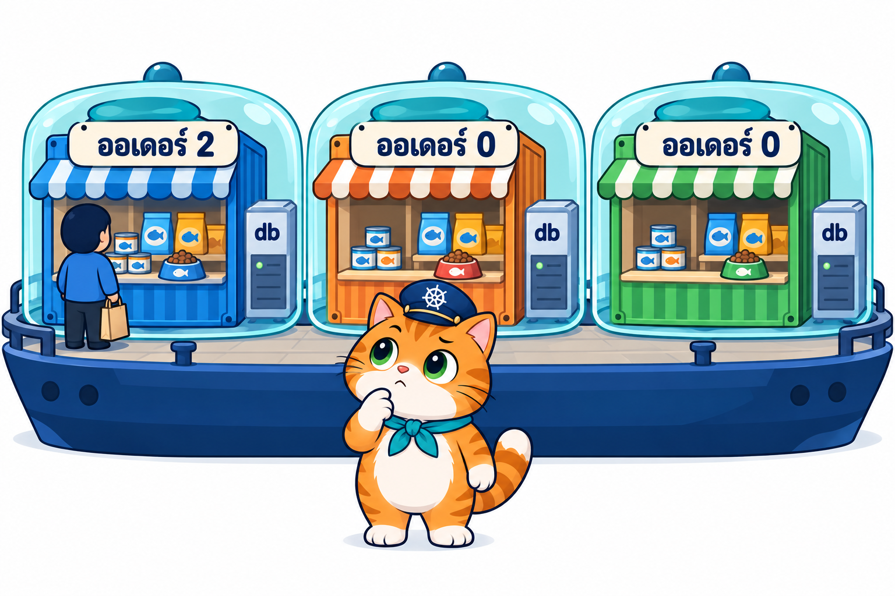<br>
  <em><b>รูปที่ 15</b> LAB9: สั่งซื้อที่บูธ a แล้วเปิดบูธ b/c → ออเดอร์ไม่ตรงกัน เพราะแต่ละบูธมี db ของตัวเอง</em>
</p>

🌐 กดปุ่ม **สั่งซื้อ** ที่แท็บ 8081 สองครั้ง แล้วรีเฟรชทั้ง 3 แท็บ หรือสั่งด้วย curl 🐧 ใน k8s-lab

```bash
for i in 1 2; do curl -s -X POST localhost:8081/api/orders -H 'Content-Type: application/json' -d '{"product_id":1,"qty":1}'; echo; done
```

```text
{"ok":true,"order_id":1,"product":{"id":1,"name_th":"อาหารเม็ดสูตรปลาทูน่า 1.5 กก.","stock":19}}
{"ok":true,"order_id":2,"product":{"id":1,"name_th":"อาหารเม็ดสูตรปลาทูน่า 1.5 กก.","stock":18}}
```

แอปนี้มี API แค่ `POST /api/orders` (สั่งซื้อ), `GET /api/products` และ `GET /api/health` **ไม่มี `GET /api/orders`**

```bash
curl -s -i localhost:8081/api/orders | head -1
```

```text
HTTP/1.1 405 Method Not Allowed
```

จึงตรวจจำนวนออเดอร์จากหน้าเว็บ (ช่อง "ออเดอร์ทั้งหมด") หรือดึงตัวเลขด้วย `grep` และดู stock ของสินค้า id 1 จาก `/api/products`

```bash
for p in 8081 8082 8083; do curl -s localhost:$p | grep -o '[0-9]*</span><span class="label">ออเดอร์ทั้งหมด'; done
for p in 8081 8082 8083; do echo "$p: $(curl -s localhost:$p/api/products | grep -o '"stock":[0-9]*' | head -1)"; done
```

```text
2</span><span class="label">ออเดอร์ทั้งหมด
0</span><span class="label">ออเดอร์ทั้งหมด
0</span><span class="label">ออเดอร์ทั้งหมด
8081: "stock":18
8082: "stock":20
8083: "stock":20
```

บูธ 8081 มี 2 ออเดอร์และ stock ลดเหลือ 18 แต่บูธ 8082/8083 ยัง **0 ออเดอร์ stock เต็ม 20** "ร้านเดียวกัน แต่มีสมุดออเดอร์ 3 เล่ม" ลูกค้าที่สั่งที่บูธหนึ่งแล้วไปถามอีกบูธจะไม่เจอออเดอร์ของตัวเอง

ภาพหน้าจอจริงด้านล่างมาจากการทดลองอีกรอบหนึ่ง (ชื่อบูธจึงต่างจากผล terminal ข้างบน) ที่สั่งซื้อบูธละไม่เท่ากัน คือ 1, 2 และ 3 ออเดอร์

<p align="center" id="fig-16">
  <br>
  <em><b>รูปที่ 16</b> ภาพหน้าจอจริงจากการทดลอง: บูธแรก หัวเว็บ "⚓ บูธ som-booth-rmcck" สั่งซื้อไป 1 ครั้ง ช่องออเดอร์ทั้งหมดเป็น 1 และอาหารเม็ดสูตรปลาทูน่าเหลือ 19 ชิ้น</em>
</p>

<p align="center" id="fig-17">
  <br>
  <em><b>รูปที่ 17</b> ภาพหน้าจอจริงจากการทดลอง: บูธที่สอง "⚓ บูธ som-booth-gxx9d" (ReplicaSet เดียวกัน แบบพิมพ์เดียวกัน) แต่ออเดอร์ทั้งหมดเป็น 2 ไม่รวมออเดอร์ของบูธแรก</em>
</p>

<p align="center" id="fig-18">
  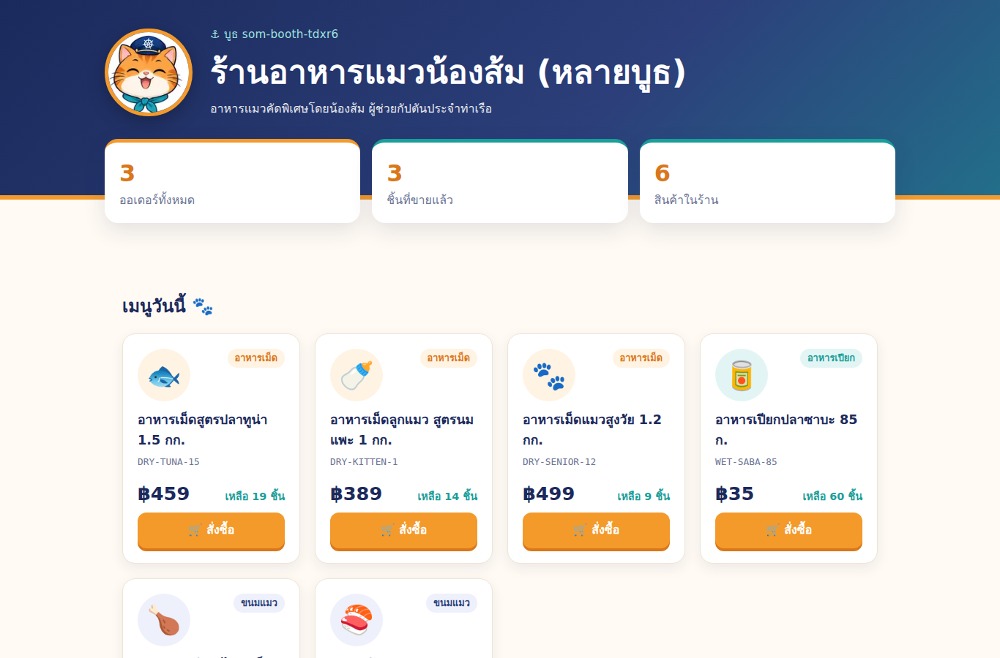<br>
  <em><b>รูปที่ 18</b> ภาพหน้าจอจริงจากการทดลอง: บูธที่สาม "⚓ บูธ som-booth-tdxr6" ออเดอร์ทั้งหมด 3 — ร้านเดียวกันแต่มีสมุดออเดอร์ 3 เล่ม เพราะแต่ละบูธมีฐานข้อมูล (emptyDir) ของตัวเอง</em>
</p>

### 9.5 ลบบูธ: บูธใหม่ ชื่อใหม่ ออเดอร์หาย port-forward หลุด

<p align="center" id="fig-19">
  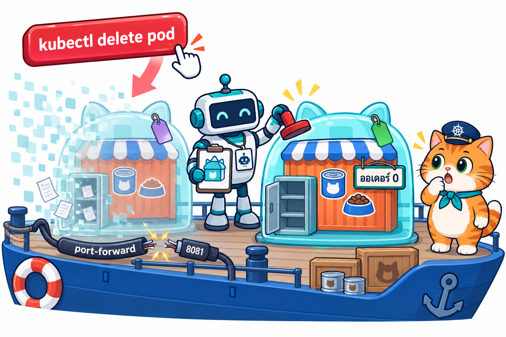<br>
  <em><b>รูปที่ 19</b> LAB9: ลบ Pod บูธ a → RS สร้างบูธใหม่ ชื่อใหม่ IP ใหม่ ออเดอร์เป็น 0 (emptyDir หายพร้อม Pod) และ port-forward ที่ต่อบูธเดิมหลุด</em>
</p>

ลบบูธแรก (ที่ต่อกับ 8081 และมี 2 ออเดอร์) แล้วจับเวลาว่า RS สร้างบูธใหม่ให้พร้อมเมื่อไร

```bash
T0=$(date +%s); kubectl delete pod -n som-booths ${P[0]}
kubectl wait --for=condition=Ready pod -l app=som-booth -n som-booths --timeout=120s; echo "ครบ Ready หลังสั่งลบ $(( $(date +%s)-T0 )) วิ"
kubectl get pods -n som-booths -o wide
```

```text
pod "som-booth-9t78k" deleted from som-booths namespace
pod/som-booth-mdzn8 condition met
pod/som-booth-mf68c condition met
pod/som-booth-szvhd condition met
ครบ Ready หลังสั่งลบ 7 วิ
NAME              READY   STATUS    RESTARTS   AGE    IP            NODE          NOMINATED NODE   READINESS GATES
som-booth-mdzn8   2/2     Running   0          2m7s   10.244.3.32   lab-worker2   <none>           <none>
som-booth-mf68c   2/2     Running   0          2m7s   10.244.1.33   lab-worker    <none>           <none>
som-booth-szvhd   2/2     Running   0          7s     10.244.1.34   lab-worker    <none>           <none>
```

ร้านกลับมาครบ 3 บูธในราว 7 วินาที (db เริ่ม + seed + web พร้อม) บูธใหม่ `szvhd` **ชื่อใหม่ IP ใหม่ และอยู่คนละเรือกับตัวเดิม** (ตัวเดิมอยู่ `lab-worker2` ตัวใหม่อยู่ `lab-worker` ตามที่ preferred anti-affinity ชอบ)

> ถ้าพิมพ์ `kubectl wait` ช้า อาจเห็นแค่บูธเดิม 2 ตัวที่ Ready อยู่แล้ว ให้ดู `kubectl get pods -w` ประกอบ

แล้ว port-forward 8081 ล่ะ

```bash
pgrep -af "[k]ubectl port-forward"
curl -s -o /dev/null -w "curl 8081 → http=%{http_code} exit=" localhost:8081; echo $?
sleep 1; tail -n 4 /tmp/pf-8081.log; pgrep -af "[k]ubectl port-forward"
```

```text
34928 kubectl port-forward -n som-booths pod/som-booth-9t78k 8081:3000
34929 kubectl port-forward -n som-booths pod/som-booth-mdzn8 8082:3000
34930 kubectl port-forward -n som-booths pod/som-booth-mf68c 8083:3000
curl 8081 → http=000 exit=52
Handling connection for 8081
Handling connection for 8081
E1005 08:21:37.281151   34928 portforward.go:549] "An error occurred forwarding" err="error forwarding port 3000 to pod 4547b54fde31e949a0a6197f5b46afc8be71a195a7d63146440badab6c0fb31b, uid : network namespace for sandbox \"4547b54fde31e949a0a6197f5b46afc8be71a195a7d63146440badab6c0fb31b\" is closed" localPort=8081 remotePort=3000
error: lost connection to pod
34929 kubectl port-forward -n som-booths pod/som-booth-mdzn8 8082:3000
34930 kubectl port-forward -n som-booths pod/som-booth-mf68c 8083:3000
```

สิ่งที่น่าสนใจ: port-forward ไปบูธที่ถูกลบ **ยังดูเหมือนทำงานอยู่** (`pgrep` ยังเห็น) จนกระทั่งมีคนเข้ามา จึงได้ curl `exit=52` (empty reply) แล้ว port-forward จบพร้อม `error: lost connection to pod` ใน browser จะเห็น `ERR_CONNECTION_RESET` (เหมือนบทที่ 4) port-forward ผูกกับ **Pod ตัวนั้น** ไม่ได้ตามไปหาบูธใหม่

เปิด port-forward ใหม่ไปบูธใหม่ (Pod ที่สร้างล่าสุด) ที่ port 8081 เดิม

```bash
NEW=$(kubectl get pods -n som-booths -l app=som-booth --sort-by=.metadata.creationTimestamp -o jsonpath="{.items[-1].metadata.name}"); echo NEW=$NEW
kubectl port-forward -n som-booths pod/$NEW 8081:3000 > /tmp/pf-8081.log 2>&1 &
sleep 2; curl -s localhost:8081 | grep -o "บูธ som-booth-[a-z0-9]*" | head -1
curl -s localhost:8081 | grep -o "[0-9]*</span><span class=\"label\">ออเดอร์ทั้งหมด"
kubectl logs -n som-booths $NEW -c db-seed | tail -1
```

```text
NEW=som-booth-szvhd
บูธ som-booth-szvhd
0</span><span class="label">ออเดอร์ทั้งหมด
seeded 6 products (new: 6)
```

🌐 รีเฟรชแท็บ 8081 (ไม่ต้องเปิด `ssh -L` ใหม่ ท่อเดิมใช้ต่อได้) จะเป็นบูธชื่อใหม่ **ออเดอร์ 0** สองออเดอร์ที่ลูกค้าสั่งไว้หายไปพร้อม emptyDir ของบูธเดิม

<p align="center" id="fig-20">
  <br>
  <em><b>รูปที่ 20</b> ภาพหน้าจอจริงจากการทดลอง: หลังลบบูธ som-booth-rmcck ReplicaSet สร้างบูธใหม่ som-booth-z96mn ภายในราว 7 วินาที ร้านกลับมาครบ 3 บูธ แต่ออเดอร์ทั้งหมดเป็น 0 และสต็อกกลับเป็นค่าตั้งต้น เพราะฐานข้อมูลของบูธใหม่ว่างเปล่า (และต้องเปิด port-forward ใหม่เพราะตัวเดิมหลุด)</em>
</p>

รูปที่ 20 มาจากการทดลองรอบเดียวกับรูปที่ 16–18 หลังลบบูธ `som-booth-rmcck` ผลคำสั่งจริงในรอบนั้น

```text
$ kubectl delete pod -n som-booths som-booth-rmcck
pod "som-booth-rmcck" deleted from som-booths namespace
$ kubectl get rs,pods -n som-booths -o wide
NAME                        DESIRED   CURRENT   READY   AGE    CONTAINERS   IMAGES             SELECTOR
replicaset.apps/som-booth   3         3         3       7m3s   web          som-shop-web:1.1   app=som-booth

NAME                  READY   STATUS    RESTARTS   AGE    IP            NODE          NOMINATED NODE   READINESS GATES
pod/som-booth-gxx9d   2/2     Running   0          7m3s   10.244.3.39   lab-worker2   <none>           <none>
pod/som-booth-tdxr6   2/2     Running   0          7m3s   10.244.3.38   lab-worker2   <none>           <none>
pod/som-booth-z96mn   2/2     Running   0          7s     10.244.1.39   lab-worker    <none>           <none>
...
error: lost connection to pod
```

### 9.6 scale 3 → 5 → 2

<p align="center" id="fig-21">
  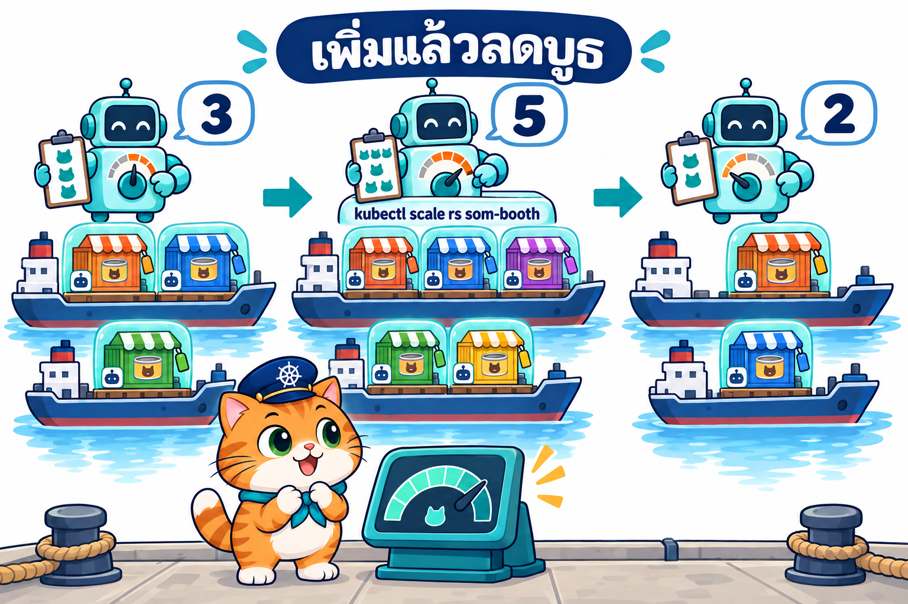<br>
  <em><b>รูปที่ 21</b> LAB9: kubectl scale rs som-booth --replicas=5 แล้ว 2 — ดูว่าบูธไหนถูกปิด; 5 บูธแบ่ง 2+3 (ลำไหนได้ 3 ไม่แน่นอน) (ระวัง resource: 5 บูธขอราว 1 CPU / 2.2Gi ถ้า Pending ให้ใช้ 4 — ในเครื่องทดสอบไม่มี Pending)</em>
</p>

> **ระวังทรัพยากร:** บูธหนึ่งขอ requests ราว 200m CPU / 448Mi (db + web) 5 บูธจึงขอราว 1 CPU / 2.2Gi ในการทดลองไม่มีบูธ Pending แต่ถ้าเครื่องนักศึกษามี RAM น้อย (เช่น 8GB) แล้วมีบูธ `Pending` (`Insufficient memory`/`cpu`) หรือ k8s-lab ช้ามาก ให้ใช้ `--replicas=4` แทน

```bash
T0=$(date +%s); kubectl scale rs som-booth -n som-booths --replicas=5
kubectl wait --for=condition=Ready pod -l app=som-booth -n som-booths --timeout=180s >/dev/null; echo "5 บูธ Ready หลัง scale $(( $(date +%s)-T0 )) วิ"
kubectl get rs -n som-booths; kubectl get pods -n som-booths -o wide --sort-by=.metadata.creationTimestamp
kubectl describe node lab-worker | grep -A5 "Allocated resources"; kubectl describe node lab-worker2 | grep -A5 "Allocated resources"
```

```text
replicaset.apps/som-booth scaled
5 บูธ Ready หลัง scale 8 วิ
NAME        DESIRED   CURRENT   READY   AGE
som-booth   5         5         5       3m7s
NAME              READY   STATUS    RESTARTS   AGE    IP            NODE          NOMINATED NODE   READINESS GATES
som-booth-mdzn8   2/2     Running   0          3m7s   10.244.3.32   lab-worker2   <none>           <none>
som-booth-mf68c   2/2     Running   0          3m7s   10.244.1.33   lab-worker    <none>           <none>
som-booth-szvhd   2/2     Running   0          67s    10.244.1.34   lab-worker    <none>           <none>
som-booth-7szlj   2/2     Running   0          8s     10.244.3.35   lab-worker2   <none>           <none>
som-booth-qfxhd   2/2     Running   0          8s     10.244.3.34   lab-worker2   <none>           <none>
Allocated resources:
  (Total limits may be over 100 percent, i.e., overcommitted.)
  Resource           Requests    Limits
  --------           --------    ------
  cpu                500m (1%)   2 (6%)
  memory             946Mi (1%)  2Gi (3%)
Allocated resources:
  (Total limits may be over 100 percent, i.e., overcommitted.)
  Resource           Requests     Limits
  --------           --------     ------
  cpu                700m (2%)    3 (9%)
  memory             1394Mi (2%)  3Gi (4%)
```

5 บูธพร้อมใน 8 วินาที กระจาย 2+3 (ลำไหนได้ 3 ไม่แน่นอน) เปอร์เซ็นต์ในวงเล็บเทียบกับ allocatable ของ Node ซึ่งใน kind คือทรัพยากรของเครื่องทั้งเครื่อง ตัวเลขในเครื่องนักศึกษาจึงต่างกันมาก (ในการทดลอง หน่วยความจำที่ Node container ใช้จริงตอน 5 บูธอยู่ที่ราว 500 MiB ต่อ worker ดูของเครื่องตัวเองได้ด้วย `docker stats --no-stream`)

scale ลงเหลือ 2 แล้วดูว่าบูธไหนถูกปิด และ port-forward ไหนยังอยู่

```bash
pgrep -af "[k]ubectl port-forward"
kubectl scale rs som-booth -n som-booths --replicas=2; kubectl get events -n som-booths --field-selector reason=SuccessfulDelete
sleep 4; kubectl get pods -n som-booths -o wide
for p in 8081 8082 8083; do curl -s -o /dev/null -w "$p http=%{http_code}\n" localhost:$p; done
sleep 1; pgrep -af "[k]ubectl port-forward"
```

```text
34929 kubectl port-forward -n som-booths pod/som-booth-mdzn8 8082:3000
34930 kubectl port-forward -n som-booths pod/som-booth-mf68c 8083:3000
37377 kubectl port-forward -n som-booths pod/som-booth-szvhd 8081:3000
replicaset.apps/som-booth scaled
LAST SEEN   TYPE     REASON             OBJECT                 MESSAGE
0s          Normal   SuccessfulDelete   replicaset/som-booth   Deleted pod: som-booth-7szlj
0s          Normal   SuccessfulDelete   replicaset/som-booth   Deleted pod: som-booth-qfxhd
0s          Normal   SuccessfulDelete   replicaset/som-booth   Deleted pod: som-booth-szvhd
NAME              READY   STATUS    RESTARTS   AGE     IP            NODE          NOMINATED NODE   READINESS GATES
som-booth-mdzn8   2/2     Running   0          3m30s   10.244.3.32   lab-worker2   <none>           <none>
som-booth-mf68c   2/2     Running   0          3m30s   10.244.1.33   lab-worker    <none>           <none>
8081 http=000
8082 http=200
8083 http=200
34929 kubectl port-forward -n som-booths pod/som-booth-mdzn8 8082:3000
34930 kubectl port-forward -n som-booths pod/som-booth-mf68c 8083:3000
```

RS ลบ `7szlj` และ `qfxhd` (ใหม่ทั้งคู่ บน `lab-worker2` ที่แออัด) กับ `szvhd` (ใหม่กว่าบูธเดิมบน `lab-worker`) เหลือบูธเดิม 2 บูธ เรือละ 1 ตามเกณฑ์ในทฤษฎีหัวข้อ 5.2 และ port-forward 8081 ที่ต่อ `szvhd` ตายอีกครั้ง

**ขั้นสำคัญก่อนไป 9.7:** scale กลับเป็น 3 (บูธที่เกิดใหม่ยังเป็นรุ่น 1.1 เพราะ template ยังเป็นของเดิม)

```bash
kubectl scale rs som-booth -n som-booths --replicas=3
kubectl wait --for=condition=Ready pod -l app=som-booth -n som-booths --timeout=120s >/dev/null
kubectl get pods -n som-booths -o custom-columns=NAME:.metadata.name,IMAGE:.spec.containers[0].image,NODE:.spec.nodeName
```

```text
NAME              IMAGE              NODE
som-booth-jc6d2   som-shop-web:1.1   lab-worker
som-booth-mdzn8   som-shop-web:1.1   lab-worker2
som-booth-mf68c   som-shop-web:1.1   lab-worker
```

(ผลข้างบนเป็นสภาพจริงในการทดลองเมื่อร้านกลับมามี 3 บูธรุ่น 1.1 ชื่อบูธที่ 3 ในเครื่องนักศึกษาจะต่าง) เหตุผลที่ต้อง scale กลับก่อนดูในกล่อง "ถ้าลืม scale กลับ" ของขั้น 9.7

### 9.7 template ใหม่ (รุ่นโปร): บูธเดิมไม่เปลี่ยน

<p align="center" id="fig-22">
  <br>
  <em><b>รูปที่ 22</b> LAB9: scale กลับเป็น 3 ก่อน แล้วแก้ template เป็น som-shop-web:1.1-promo + ข้อความโปร แล้ว apply → บูธเดิมทั้ง 3 ยังเป็น 1.1 (template ใหม่ใช้กับบูธที่เกิดใหม่เท่านั้น; ถ้าไม่ scale กลับ apply จะคืน replicas=3 แล้วเกิดบูธ promo ทันที 1 ตัว)</em>
</p>

`som-booth-promo.yaml` ต่างจาก `som-booth.yaml` แค่ 3 บรรทัด

```bash
cd /workspace/005_kubernetes_replicaset/02_LAB/som-booths
diff k8s/som-booth.yaml k8s/som-booth-promo.yaml
```

```text
104c104
<           image: som-shop-web:1.1
---
>           image: som-shop-web:1.1-promo
122c122
<           image: som-shop-web:1.1
---
>           image: som-shop-web:1.1-promo
142c142
<               value: "⚓ บูธ $(POD_NAME)"
---
>               value: "🎉 โปรบูธใหม่ · $(POD_NAME)"
```

(บรรทัด 104 คือ image ของ init container `db-seed` บรรทัด 122 คือ image ของ `web` และ 142 คือ `SHOP_EYEBROW`)

```bash
kubectl apply -f k8s/som-booth-promo.yaml; sleep 3
kubectl get rs som-booth -n som-booths -o wide
kubectl get pods -n som-booths -o custom-columns=NAME:.metadata.name,IMAGE:.spec.containers[0].image,NODE:.spec.nodeName
curl -s localhost:8082 | grep -o "[⚓🎉][^<]*" | head -1
```

```text
replicaset.apps/som-booth configured
NAME        DESIRED   CURRENT   READY   AGE     CONTAINERS   IMAGES                   SELECTOR
som-booth   3         3         3       4m23s   web          som-shop-web:1.1-promo   app=som-booth
NAME              IMAGE              NODE
som-booth-jc6d2   som-shop-web:1.1   lab-worker
som-booth-mdzn8   som-shop-web:1.1   lab-worker2
som-booth-mf68c   som-shop-web:1.1   lab-worker
⚓ บูธ som-booth-mdzn8
```

RS บอกว่า template เป็น `1.1-promo` แล้ว แต่ **บูธทั้ง 3 ยังเป็น `1.1`** และหน้าเว็บยังแสดง `⚓ บูธ ...` แบบเดิม (เหมือน LAB 5)

> **ถ้าลืม scale กลับ (ยังเป็น 2 บูธ):** ทดลองจริงแล้ว `kubectl apply -f k8s/som-booth-promo.yaml` จะคืน `replicas` เป็น 3 ตามไฟล์ด้วย RS จึงสร้างบูธที่ 3 จาก template ใหม่ทันที ได้ผลแบบนี้
>
> ```text
> NAME        DESIRED   CURRENT   READY   AGE     CONTAINERS   IMAGES                   SELECTOR
> som-booth   3         3         2       3m45s   web          som-shop-web:1.1-promo   app=som-booth
> NAME              IMAGE                    NODE
> som-booth-6tq4x   som-shop-web:1.1-promo   lab-worker2
> som-booth-mdzn8   som-shop-web:1.1         lab-worker2
> som-booth-mf68c   som-shop-web:1.1         lab-worker
> ```
>
> ซึ่งเป็นตัวอย่างของกับดัก "apply ไฟล์ทับค่าที่ scale" จาก LAB 3 ถ้าเกิดแบบนี้และอยากทำตามเอกสารต่อ ให้ `kubectl apply -f k8s/som-booth.yaml` แล้วลบบูธ promo ตัวนั้นให้ RS สร้างคืนเป็นรุ่น 1.1 จากนั้น apply promo ใหม่

### 9.8 เปลี่ยนรุ่นทีละบูธด้วยมือ

<p align="center" id="fig-23">
  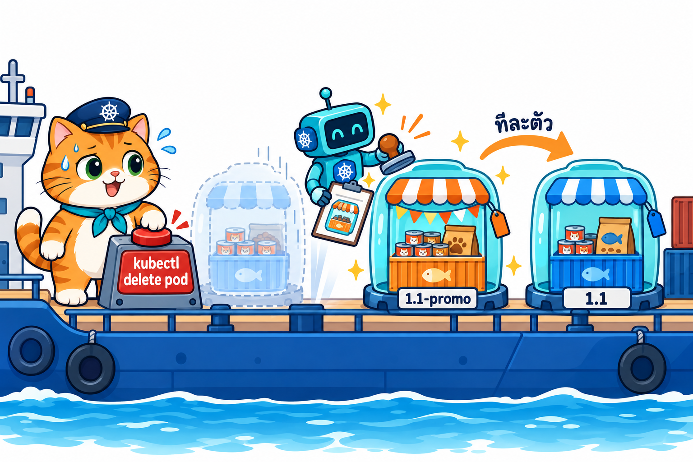<br>
  <em><b>รูปที่ 23</b> LAB9: ต้องลบ Pod ทีละตัวด้วยมือจึงได้บูธรุ่นโปร ระหว่างนั้นบูธที่ถูกลบปิดชั่วคราว ออเดอร์ของบูธนั้นหาย และต้อง port-forward ใหม่ทุกครั้ง</em>
</p>

วิธีเดียวที่ ReplicaSet มีให้คือ **ลบบูธเดิมทีละตัว** แล้วรอให้ตัวใหม่ (จาก template ใหม่) พร้อม ลบบูธแรก

```bash
OLD=som-booth-mf68c        # ← เปลี่ยนเป็นชื่อบูธรุ่น 1.1 ตัวหนึ่งในเครื่องตัวเอง (ดูจาก custom-columns ในขั้น 9.7)
T0=$(date +%s); kubectl delete pod -n som-booths $OLD
kubectl wait --for=condition=Ready pod -l app=som-booth -n som-booths --timeout=120s >/dev/null; echo "Ready หลังลบ $(( $(date +%s)-T0 )) วิ"
kubectl get pods -n som-booths -o custom-columns=NAME:.metadata.name,IMAGE:.spec.containers[0].image,NODE:.spec.nodeName
```

```text
pod "som-booth-mf68c" deleted from som-booths namespace
Ready หลังลบ 7 วิ
NAME              IMAGE                    NODE
som-booth-5h2fk   som-shop-web:1.1-promo   lab-worker2
som-booth-jc6d2   som-shop-web:1.1         lab-worker
som-booth-mdzn8   som-shop-web:1.1         lab-worker2
```

(ในการทดลองลบ `som-booth-mf68c` ซึ่งเป็นบูธที่ต่อกับ 8083 อยู่ port-forward 8083 จึงตายด้วย) เปิด port-forward ไปบูธใหม่ที่ port 8081 (port-forward 8081 เดิมจบไปแล้วตั้งแต่ขั้น 9.6 ถ้า `pgrep` ยังเห็น ให้ `pkill -f "[k]ubectl port-forward.* 8081:3000"` ก่อน) แล้วดูหน้าเว็บ

```bash
NEW=$(kubectl get pods -n som-booths -l app=som-booth --sort-by=.metadata.creationTimestamp -o jsonpath="{.items[-1].metadata.name}")
kubectl port-forward -n som-booths pod/$NEW 8081:3000 > /tmp/pf-8081.log 2>&1 &
sleep 2; curl -s localhost:8081 | grep -o "[⚓🎉][^<]*" | head -1
```

```text
🎉 โปรบูธใหม่ · som-booth-5h2fk
```

🌐 รีเฟรชแท็บ 8081 จะเห็นข้อความ `🎉 โปรบูธใหม่ · som-booth-...` ขณะที่บูธเดิมในแท็บ 8082 ยังเป็น `⚓ บูธ ...` (ร้านมี 2 รุ่นปนกัน) เปลี่ยนบูธที่เหลือทีละตัวด้วยลูป (ลบ → รอ Ready → ตัวถัดไป)

```bash
for old in $(kubectl get pods -n som-booths -l app=som-booth -o jsonpath='{range .items[?(@.spec.containers[0].image=="som-shop-web:1.1")]}{.metadata.name}{" "}{end}'); do
  T0=$(date +%s); kubectl delete pod -n som-booths $old
  kubectl wait --for=condition=Ready pod -l app=som-booth -n som-booths --timeout=120s >/dev/null; echo "แทน $old เสร็จใน $(( $(date +%s)-T0 )) วิ"
done
kubectl get pods -n som-booths -o custom-columns=NAME:.metadata.name,IMAGE:.spec.containers[0].image,NODE:.spec.nodeName
```

```text
pod "som-booth-jc6d2" deleted from som-booths namespace
แทน som-booth-jc6d2 เสร็จใน 7 วิ
pod "som-booth-mdzn8" deleted from som-booths namespace
แทน som-booth-mdzn8 เสร็จใน 7 วิ
NAME              IMAGE                    NODE
som-booth-5h2fk   som-shop-web:1.1-promo   lab-worker2
som-booth-hv69f   som-shop-web:1.1-promo   lab-worker
som-booth-npjld   som-shop-web:1.1-promo   lab-worker
```

ครบ 3 บูธรุ่นโปรแล้ว แต่ลองนับสิ่งที่ต้องทำเอง

- ต้องเขียนลูปเอง ลบทีละตัวและ **รอเอง** ให้ตัวใหม่ Ready ก่อนลบตัวถัดไป (ถ้าสั่ง `kubectl delete pod -l app=som-booth` ร้านจะปิดทุกบูธพร้อมกัน)
- ออเดอร์ของบูธที่ถูกลบ **หายทุกครั้ง** และ port-forward ที่ต่อบูธนั้นต้องเปิดใหม่ทุกครั้ง
- ถ้ารุ่นโปรมีปัญหา การย้อนกลับ = apply `som-booth.yaml` แล้ววนลบทีละตัวอีกรอบ ไม่มีประวัติรุ่นให้เลือก

### 9.9 เก็บกวาด LAB 9

🐧 **ใน SSH session ของ k8s-lab**

```bash
pkill -f "[k]ubectl port-forward"; sleep 1; pgrep -af "[k]ubectl port-forward" || echo "ไม่มี port-forward ค้าง"
time kubectl delete ns som-booths; kubectl get ns
```

```text
ไม่มี port-forward ค้าง
namespace "som-booths" deleted

real	0m10.898s
...
NAME                 STATUS   AGE
default              Active   22m
kube-node-lease      Active   22m
kube-public          Active   22m
kube-system          Active   22m
local-path-storage   Active   22m
```

🖥️ **บนเครื่องนักศึกษา** พิมพ์ `exit` ในหน้าต่าง `ssh -L` image `som-shop-web:1.1`, `1.1-promo` และ postgres บน Node เก็บไว้ได้ (บทถัดไปใช้ต่อ)

### 9.10 สรุป LAB 9 และปัญหาที่ส่งต่อ

<p align="center" id="fig-24">
  <br>
  <em><b>รูปที่ 24</b> สรุป LAB9 และปัญหาส่งต่อ: (1) แต่ละบูธมี db ของตัวเอง ข้อมูลไม่ตรงกัน (2) ชื่อ/IP เปลี่ยน ต้อง port-forward ทีละ Pod → บท 006 Service (3) เปลี่ยนรุ่นต้องลบ Pod เอง → บท 007 Deployment</em>
</p>

**ReplicaSet ทำได้ดี:** ร้านมี 3 บูธเสมอ บูธหายก็ได้บูธใหม่ภายในราว 7 วินาที scale ขึ้นลงได้ทันที และกระจายบูธข้ามเรือได้

**ReplicaSet แก้ไม่ได้:**

| ปัญหาที่เห็นใน LAB 9 | หลักฐานจากการทดลอง | บทที่แก้ |
|---|---|---|
| 1. แต่ละบูธมีฐานข้อมูลของตัวเอง ออเดอร์ไม่ตรงกัน บูธใหม่เริ่มจาก 0 | 8081 ออเดอร์ 2 แต่ 8082/8083 ออเดอร์ 0, บูธใหม่ `szvhd` ออเดอร์ 0 | บทที่ 6 แยกฐานข้อมูลออกมาให้ทุกบูธใช้ร่วมกัน |
| 2. ไม่มีที่อยู่คงที่ ต้อง port-forward ทีละ Pod และหลุดทุกครั้งที่บูธถูกแทนหรือถูก scale ลง | `error: lost connection to pod`, `8081 http=000` | บทที่ 6 **Service** |
| 3. เปลี่ยนรุ่นต้องลบ Pod เองทีละตัว รอเอง ย้อนรุ่นยาก | template promo แล้วบูธเดิมยัง 1.1 ทั้ง 3 จนลบเอง | บทที่ 7 **Deployment** |

### สิ่งที่เห็นใน LAB 9

- template ของ ReplicaSet = Pod ร้านทั้งก้อนของบทที่ 4 ได้ `3 3 3` บูธละ `2/2` กระจาย 2+1 ไม่มี Warning PSA
- หน้าเว็บบอกชื่อบูธจาก `$(POD_NAME)` และออเดอร์ของแต่ละบูธแยกกัน (`GET /api/orders` ไม่มี ใช้หน้าเว็บหรือ `/api/products` ตรวจ)
- ลบบูธ → บูธใหม่ชื่อใหม่ IP ใหม่ ออเดอร์ 0 ใน ~7 วินาที port-forward เดิม `lost connection to pod`
- scale 5 (2+3) แล้ว 2 (เหลือเรือละ 1) port-forward ของบูธที่ถูกปิดตาย
- template promo ไม่เปลี่ยนบูธเดิม ต้องลบทีละตัว และต้อง scale กลับเป็น 3 ก่อน apply มิฉะนั้น apply จะคืน replicas และเกิดบูธ promo ทันที

### คำถามท้าย LAB 9

1. ทำไมออเดอร์ที่สั่งที่บูธ 8081 จึงไม่ปรากฏที่บูธ 8082 ทั้งที่เป็น ReplicaSet และ image เดียวกัน ถ้าจะให้ทุกบูธเห็นออเดอร์เดียวกันต้องเปลี่ยนโครงสร้างอย่างไร
2. หลังลบบูธ ทำไม port-forward 8081 ไม่ตามไปหาบูธใหม่เอง สิ่งที่ลูกค้าต้องการคือ "ที่อยู่" แบบไหน
3. ตอน scale 5 → 2 บูธไหนถูกปิด อธิบายด้วยเกณฑ์ในทฤษฎีหัวข้อ 5.2
4. ทำไมต้อง scale กลับเป็น 3 ก่อน `kubectl apply -f k8s/som-booth-promo.yaml` ถ้าไม่ทำจะเห็นอะไร
5. ถ้าร้านจริงมี 30 บูธ การเปลี่ยนรุ่นแบบขั้น 9.8 มีความเสี่ยงอะไรบ้าง และอยากได้เครื่องมือที่ทำอะไรให้อัตโนมัติ

---

## Troubleshooting

| อาการ | สาเหตุ | วิธีแก้ |
|---|---|---|
| `ls` ใน k8s-lab ไม่เจอ `labs/` หรือ `som-booths/`, kubectl แจ้ง `the path "labs/..." does not exist` | ยังไม่ได้ `docker cp` หรืออยู่ผิดโฟลเดอร์ | 🖥️ `docker cp 005_kubernetes_replicaset k8s-lab:/workspace/` แล้ว 🐧 `cd /workspace/005_kubernetes_replicaset/02_LAB` (ตรวจด้วย `pwd`) |
| `kubectl get nodes` ต่อคลัสเตอร์ไม่ได้ (connection refused) | ยังไม่มีคลัสเตอร์ หรือ `k8s-lab` เพิ่ง restart | 🐧 `k8s-up` ใหม่ ถ้าจะทำ LAB 9 ต้อง build/`kind load` image ใหม่ (ขั้น 9.1) |
| `Error from server (NotFound): namespaces "rs-lab" not found` | ข้าม LAB 0 หรือเก็บกวาดไปแล้ว | `kubectl apply -f labs/lab01-first-rs/00-ns.yaml` แล้วสร้าง snack-rs ใหม่ตาม LAB 1 |
| `` `selector` does not match template `labels` `` | label ใน template ไม่ผ่าน selector | แก้ให้ label ของ template มีทุก key/value ที่ selector ต้องการ |
| `spec.selector: Invalid value: ...: field is immutable` | แก้ selector ของ RS ที่มีอยู่แล้ว | สร้าง RS ใหม่ (ลบเดิมแบบ `--cascade=orphan` ถ้าไม่อยากให้ Pod หาย) |
| Pod ที่เพิ่งลบขึ้น `Error` ชั่วครู่ | busybox ไม่รับ SIGTERM ถูก kill หลัง grace 1 วินาที (exit 137) | ปกติ รอให้หายเอง |
| Pod ที่สร้างเองหายทันทีหลัง `created` | label ตรง selector ของ RS ที่ครบอยู่แล้ว RS ลบตัวเกิน | ใช้ label ที่ไม่ชนกับ workload (LAB 4 ข้อ ก) |
| RS สร้าง Pod น้อยกว่าที่คาด และมี Pod ชื่อแปลกเป็นสมาชิก | RS รับเลี้ยง Pod ไร้เจ้าของที่ label ตรง | ดู `kubectl get pods -o custom-columns=NAME:.metadata.name,OWNER:.metadata.ownerReferences[0].name` |
| `describe rs` ไม่มี event `SuccessfulDelete`/`SuccessfulCreate` ที่ควรมี | event ของ object นั้นเกินขีดจำกัด (spam filter) | ดู `kubectl get pods` / `get rs` เป็นหลัก หรือ `kubectl get events --field-selector reason=...` หรือเริ่ม RS ใหม่ |
| drain แล้วไม่มี Pod ถูก evict | ไม่มี Pod ของ snack-rs อยู่บนเรือนั้น | uncordon แล้ว `kubectl delete pod -n rs-lab -l app=snack` ให้กระจายใหม่ |
| หลัง LAB 2 `get nodes` ยังเป็น `SchedulingDisabled` หรือ `NotReady` | ลืม `uncordon` หรือ `docker start lab-worker2` | `kubectl uncordon lab-worker2` / 🐧 `docker start lab-worker2` |
| scale/edit แล้วจำนวนกลับเป็นค่าเดิม | มีการ `kubectl apply -f` ไฟล์ที่มี `replicas:` ทับ | แก้ `replicas` ในไฟล์ให้ตรงกับที่ต้องการ |
| LAB 4/6 ได้ 4 บูธแทน 3 | ลืม sed ไฟล์ `snack-rs.yaml` กลับเป็น 3 หลัง LAB 3 | `sed -i 's/replicas: 4 /replicas: 3 /' labs/lab01-first-rs/snack-rs.yaml` แล้ว apply |
| `kubectl edit` เปิด vi แล้วออกไม่เป็น | `EDITOR` ไม่ได้ตั้ง ค่าเริ่มต้นคือ vi | กด `Esc` พิมพ์ `:q!` Enter แล้วใช้ `KUBE_EDITOR=nano kubectl edit ...` |
| `wget: can't connect to remote host: Connection refused` ใน LAB 5 | ใช้ `localhost` (ไป `::1` ก่อน) แต่ nginx ฟังแค่ IPv4 | ใช้ `wget -qO- 127.0.0.1` |
| RS ค้าง `DESIRED 6 CURRENT 4` แม้เพิ่ม quota แล้ว | RS อยู่ในช่วง backoff | รอราว 1 นาที (ในการทดลอง 46 วินาที) |
| `psa-rs 3 0 0` | enforce restricted ปฏิเสธ Pod | อ่าน `kubectl describe rs` แล้วแก้ securityContext ใน template |
| topology spread ได้ Pending ทั้งที่ worker ว่าง | ไม่มี `nodeTaintsPolicy: Honor` (นับ control-plane) | ใช้ไฟล์ `spread-topology.yaml` ของบทนี้ที่ใส่ไว้แล้ว |
| บูธค้าง `Init:ErrImagePull` / `ImagePullBackOff` | ไม่มี image บน Node (คลัสเตอร์ใหม่ยังไม่ `kind load`) | ทำขั้น 9.1 แล้ว `kubectl delete pod -n som-booths -l app=som-booth` |
| `kind load docker-image postgres:...` ขึ้น `ctr: content digest sha256:...: not found` | image หลาย platform | ใช้ `docker save --platform linux/amd64 ...` + `kind load image-archive` |
| บูธ `Pending` ตอน scale 5 (`Insufficient memory`/`cpu`) | ทรัพยากรเครื่องไม่พอ | scale แค่ 4 หรือ 3 |
| `curl localhost:8081/api/orders` ได้ `405 Method Not Allowed` | แอปไม่มี `GET /api/orders` | ดูออเดอร์จากหน้าเว็บ หรือ `grep` ตัวเลขหน้าคำว่า ออเดอร์ทั้งหมด (ขั้น 9.4) |
| browser เปิด `localhost:8081` ไม่ได้ (`ERR_CONNECTION_RESET`), log มี `lost connection to pod` | บูธที่ต่อไว้ถูกลบ/ถูก scale ลง | เปิด port-forward ใหม่ไปบูธที่มีอยู่ (ขั้น 9.5) ไม่ต้องเปิด `ssh -L` ใหม่ |
| `kubectl port-forward` แจ้ง `address already in use` | port-forward ตัวเก่ายังค้าง (ยังไม่มีใครเข้าจึงยังไม่จบ) | `pgrep -af "[k]ubectl port-forward"` แล้ว `pkill -f "[k]ubectl port-forward.* 8081:3000"` |
| `ssh -L` แจ้งว่า bind port ไม่ได้ | port 8081–8083 บนเครื่องนักศึกษาถูกโปรแกรมอื่นใช้ | เปลี่ยนเลขซ้ายของ `-L` เช่น `-L 18081:localhost:8081` แล้วเปิด `http://localhost:18081` |
| apply promo แล้วมีบูธ promo เกิดทันที 1 ตัว | apply ตอน replicas ยังเป็น 2 ไฟล์คืนค่าเป็น 3 | ดูกล่อง "ถ้าลืม scale กลับ" ในขั้น 9.7 |

---

## Checklist ส่งงาน

ส่งภาพหน้าจอ (screenshot ของ terminal/browser) ตามรายการ พร้อมคำตอบคำถามชวนคิดอย่างน้อย LAB ละ 1 ข้อ และคำถามท้าย LAB 9 ทั้ง 5 ข้อ

- [ ] **LAB 0** `kubectl get nodes` (3 Ready), `pod "lonely" deleted ...` ตามด้วย `No resources found in rs-lab namespace.` และค่า `--controllers=...`
- [ ] **LAB 1** `kubectl get rs,pods -n rs-lab -o wide --show-labels` (`3 3 3`), ownerReferences ของ Pod หนึ่งตัว และ error `` `selector` does not match template `labels` ``
- [ ] **LAB 2** terminal 2 ที่เห็นตัวใหม่เกิดขณะตัวเก่า Terminating, ผล `kubectl drain` (ไม่มี `--force`) และ `get pods -o wide` หลัง uncordon (ทางเลือก: ผลลูปเรือล่ม)
- [ ] **LAB 3** `get events --field-selector reason=SuccessfulDelete` ตอน scale 5→2 พร้อมคำอธิบายว่าทำไมตัวนั้นถูกลบ และ `0 0 0`
- [ ] **LAB 4** `stray 0/1 Terminating 0s`, ownerReferences ของ stray ที่ถูกรับเลี้ยง, ตาราง OWNER ตอนมี snack-rs-b และผลหลัง `kubectl label pod ... app-`
- [ ] **LAB 5** error `field is immutable` และ custom-columns ที่มีทั้ง `1.27-alpine v1` และ `1.28-alpine v2`
- [ ] **LAB 6** ตาราง OWNER `<none>` หลัง orphan และ `Events: <none>` หลัง apply ใหม่
- [ ] **LAB 7** `quota-rs 6 4 4` + `ReplicaFailure True FailedCreate` + `exceeded quota` และผลหลัง patch quota
- [ ] **LAB 8** `FailedScheduling ... didn't match pod anti-affinity rules` และผล 2+2 / 2+3 ของ topology spread
- [ ] **LAB 9** (1) `kubectl get rs,pods -n som-booths -o wide` 3 บูธ 2+1 (2) browser 3 แท็บที่ชื่อบูธและออเดอร์ต่างกัน (3) บูธใหม่ออเดอร์ 0 พร้อม `lost connection to pod` (4) events ตอน scale 5→2 (5) custom-columns หลัง apply promo ที่บูธเดิมยัง `1.1` และหน้าเว็บ `🎉 โปรบูธใหม่`
- [ ] ท้ายสุด `kubectl get ns` เหลือ 5 namespace ตั้งต้น และ `kubectl get nodes` Ready ทั้ง 3 ลำไม่มี `SchedulingDisabled`

---

## ตารางเก็บกวาดและคืนสภาพ

ใช้ตรวจหลังจบแต่ละ LAB หรือเมื่อผลเริ่มเพี้ยน 🐧 ทุกคำสั่งรันใน SSH session ของ k8s-lab

| สิ่งที่อาจค้าง | มาจาก LAB | ตรวจด้วย | คืนสภาพด้วย |
|---|---|---|---|
| namespace `rs-lab` (snack-rs, stray, web) | 0–6 | `kubectl get ns rs-lab` | `kubectl delete ns rs-lab` |
| ไฟล์ `snack-rs.yaml` ยังเป็น `replicas: 4` | 3 | `grep -n 'replicas:' labs/lab01-first-rs/snack-rs.yaml` | `sed -i 's/replicas: 4 /replicas: 3 /' labs/lab01-first-rs/snack-rs.yaml` |
| เรือ `lab-worker2` ถูก cordon หรือหยุดอยู่ | 2 | `kubectl get nodes` | `kubectl uncordon lab-worker2` / `docker start lab-worker2` |
| namespace `rs-quota`, `rs-psa` | 7 | `kubectl get ns` | `kubectl delete ns rs-quota rs-psa` |
| namespace `rs-spread` | 8 | `kubectl get ns rs-spread` | `kubectl delete ns rs-spread` |
| namespace `som-booths` | 9 | `kubectl get ns som-booths` | `kubectl delete ns som-booths` |
| port-forward ค้าง | 9 | `pgrep -af "[k]ubectl port-forward"` | `pkill -f "[k]ubectl port-forward"` |
| หน้าต่าง `ssh -L` บนเครื่องนักศึกษา | 9 | หน้าต่างที่ยังเปิดอยู่ | 🖥️ `exit` |

ตอนลบของที่ไม่มีอยู่แล้ว kubectl อาจแจ้ง `NotFound` ซึ่งไม่เป็นไร

---

## เก็บกวาดหลังจบบท

🐧 **ใน SSH session ของ k8s-lab** ตรวจครั้งสุดท้าย

```bash
kubectl get ns
kubectl get nodes
kubectl get rs,pods -A | grep -v kube-system
pgrep -af "[k]ubectl port-forward" || echo "ไม่มี port-forward ค้าง"
```

ผลที่ถูกต้อง: เหลือ namespace ตั้งต้น 5 ตัว (`default`, `kube-node-lease`, `kube-public`, `kube-system`, `local-path-storage`), Node `Ready` ทั้ง 3 ลำไม่มี `SchedulingDisabled`, ไม่มี ReplicaSet/Pod ของบทนี้ค้าง (บรรทัดที่เหลือเป็นของ `local-path-storage` ที่ระบบสร้าง) และไม่มี port-forward ค้าง

คลัสเตอร์ `lab` และ image บน Node เก็บไว้ใช้ต่อในบทที่ 6 (Service) ซึ่งเริ่มจากปัญหา "ออเดอร์ไม่ตรงกัน" และ "ที่อยู่ไม่คงที่" ของ LAB 9 ถ้าต้องการคืนทรัพยากรเครื่อง ให้ลบคลัสเตอร์ด้วย `k8s-down` (image ที่ `kind load` ไว้จะหายไปด้วย ครั้งหน้าต้อง `k8s-up` และ `kind load` ใหม่) แล้วออกจาก SSH ด้วย `exit`

---

> **หมายเหตุเกี่ยวกับภาพประกอบ:** ภาพประกอบ LAB (ยกเว้นภาพในโฟลเดอร์ [`images/screenshots/`](images/screenshots/) ซึ่งเป็นภาพหน้าจอจริงจากการทดลอง) สร้างขึ้นด้วยปัญญาประดิษฐ์สำหรับการสร้างภาพเพื่อใช้ประกอบการเรียนการสอน ชุดคำสั่งสร้างภาพอยู่ใน [`images/imagegen-prompts.md`](images/imagegen-prompts.md) ภาพใช้อุปมาเชิงเปรียบเทียบ ตัวเลขในภาพเป็นค่าตัวอย่าง ให้ยึดผลลัพธ์คำสั่งในเอกสารและในเครื่องของนักศึกษาเป็นหลัก
