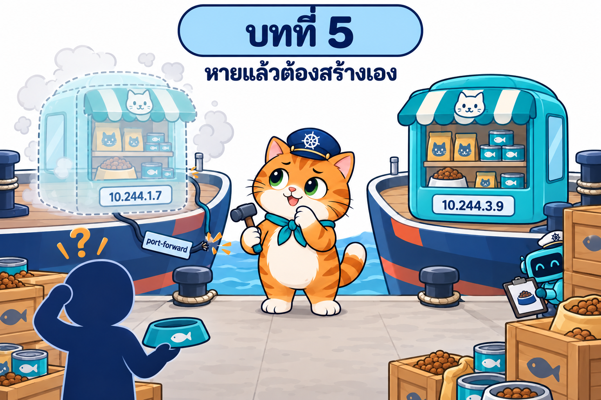

# บทที่ 5: ReplicaSet — หัวหน้ากะที่นับบูธให้ครบเสมอ

> **รายวิชา:** Software Development Tools and Environments (DevTools)
> **หัวข้อ:** Kubernetes ReplicaSet — controller และ reconciliation loop, replicas/selector/template, ownerReferences, self-healing, scale, กับดัก label, selector ที่แก้ไม่ได้, การลบแบบ cascade/orphan, ReplicaSet กับ quota/LimitRange/Pod Security และการกระจาย replica ข้าม Node
> **ผลลัพธ์การเรียนรู้ที่เกี่ยวข้อง:** CLO-5, CLO-6

<p align="center">
  <br>
  <em>ทบทวนปัญหาจากบท 002–004: Pod เดี่ยวถูกลบหรือ Node ล่มแล้วหายไปเลย ไม่มีใครสร้างใหม่ IP ก็เปลี่ยน และ port-forward ที่ต่อไว้หลุด</em>
</p>

## บทนี้เรียนอะไร

บทที่ 2–4 ร้านอาหารแมวน้องส้มทุกบูธเป็น **Pod เดี่ยว** ที่สร้างด้วยมือ ลบผิดตัวเดียวร้านปิดถาวร ซ่อมเรือ (drain) ต้อง `--force` แล้ว Pod หายไปเลย เรือล่มก็ไม่มีใครสร้างแทน บทนี้แก้ปัญหา **"จำนวน"** ด้วย **ReplicaSet** หรือ **หัวหน้ากะ** ที่ถือคลิปบอร์ดนับบูธที่ติดป้ายของร้านตลอดเวลา ขาดก็ปั๊มบูธใหม่จากแบบพิมพ์ (Pod template) เกินก็เก็บ เราจะได้รู้จักหัวใจของ Kubernetes คือ **controller และ reconciliation loop** ได้เห็นว่าหัวหน้ากะ "นับจากป้าย ไม่ใช่จากชื่อ" (จึงรับเลี้ยงบูธแปลกหน้าและลบบูธที่เกินได้) วิธีแยกบูธป่วยออกมาตรวจ วิธีปลดหัวหน้ากะโดยไม่ปิดบูธ และการทำงานร่วมกับงบของโซน ด่านความปลอดภัย และการกระจายบูธข้ามเรือจากบทที่ 3–4 ปิดท้ายด้วย **ร้านน้องส้ม 3 บูธด้วย ReplicaSet** ที่ไม่ล้มแม้บูธหาย แต่เผยปัญหาใหม่ 3 ข้อที่ส่งต่อให้บทถัดไป

| ส่วน | เนื้อหา | ลิงก์ |
|---|---|---|
| 📖 **ทฤษฎี** | Pod เดี่ยวที่ตายแล้วไม่ฟื้น, controller และ reconciliation loop (level-triggered, kube-controller-manager), โครงสร้าง ReplicaSet (replicas, selector `matchLabels`/`matchExpressions`, template), การตั้งชื่อ Pod, ownerReferences, การอ่าน status, self-healing (ลบ Pod, drain, เรือล่มและ `tolerationSeconds`), scale และลำดับการลบ Pod, กับดัก label (รับเลี้ยง/ลบตัวเกิน/selector ทับกัน/ถอด label เพื่อ debug), selector ที่แก้ไม่ได้และ template ใหม่, ลบแบบ background/foreground/orphan, ReplicationController, ReplicaSet กับ ResourceQuota/LimitRange/PSA, anti-affinity และ topology spread (36 ภาพประกอบ + คำถามทบทวนพร้อมแนวคำตอบ) | [01_Theory/README.md](01_Theory/README.md) |
| 🧪 **ปฏิบัติการ** | LAB 0–9 จากง่ายไปยาก: เตรียมคลัสเตอร์และทบทวน Pod เดี่ยว → ReplicaSet แรก → self-healing → scale → กับดัก label → selector/template → cascade vs orphan → quota/LimitRange/PSA → กระจาย replica → **LAB สุดท้าย: ร้านน้องส้ม 3 บูธด้วย ReplicaSet** (พร้อมภาพหน้าจอจริง) และ Troubleshooting, Checklist, ตารางเก็บกวาด | [02_LAB/README.md](02_LAB/README.md) |

## คำแนะนำในการเรียน

1. **อ่านทฤษฎีหัวข้อ 1–3 ก่อน** (ปัญหาของ Pod เดี่ยว, controller, โครงสร้าง ReplicaSet) แล้วเริ่ม LAB 0–1 ได้
2. ก่อน LAB 2–3 อ่านหัวข้อ 4–5 (self-healing, scale) ก่อน LAB 4 อ่านหัวข้อ 6 (กับดัก label) ก่อน LAB 5–6 อ่านหัวข้อ 7–8 ก่อน LAB 7–8 อ่านหัวข้อ 10–11 และก่อน LAB 9 อ่านหัวข้อ 12–13
3. ทำ LAB **ตามลำดับ** LAB 0–6 ใช้ namespace `rs-lab` และ ReplicaSet `snack-rs` ต่อเนื่องกัน และ **ทำบล็อก "เก็บกวาด" ทุกครั้ง** โดยเฉพาะการคืนเรือ `lab-worker2` (uncordon/start) หลัง LAB 2 และคืนไฟล์ `snack-rs.yaml` เป็น `replicas: 3` หลัง LAB 3 ใช้เวลารวมประมาณ 3–3.5 ชั่วโมง
4. สังเกตสัญลักษณ์ว่าคำสั่งรันที่ไหน: 🖥️ บนเครื่องนักศึกษา / 🐧 ใน SSH session ของ k8s-lab / 🌐 browser
5. ผลลัพธ์ในเอกสารมาจากการทดลองจริง (Kubernetes v1.37.0, 5 ตุลาคม 2569) แต่ **เวลา, IP, ชื่อ Pod ที่สุ่ม และ Node ที่ Pod ถูกวางอาจต่างจากเครื่องของนักศึกษา**
6. ลองตอบคำถามทบทวนด้วยตัวเองก่อนเปิดดูแนวคำตอบ

> **ขอบเขตของบทนี้:** ใช้ **ReplicaSet เท่านั้น** การเข้าถึงแอปยังใช้ `kubectl exec`, `kubectl logs` และ `kubectl port-forward pod/...` ร่วมกับ `ssh -L` เหมือนบทที่ 2–4 เรื่อง "ที่อยู่คงที่ของร้าน" และ "การเปลี่ยนรุ่นทีละบูธอัตโนมัติ" เป็นเนื้อหาของบทถัดไป

## สิ่งที่ต้องผ่านก่อน

- [บทที่ 1: Kubernetes และสถาปัตยกรรม](../001_kubernetes-introduction/01_Theory/README.md) และ [LAB บทที่ 1](../001_kubernetes-introduction/02_LAB/readme.md): เข้าใจบทบาทของ Control Plane, Worker Node และมี container **`k8s-lab`** ที่ล็อกอินได้ด้วย `ssh -p 2223 root@localhost` (รหัส `passwd` ใช้เพื่อการเรียนเท่านั้น)
- [บทที่ 2: Kubernetes Pod](../002_kubernetes_pod/01_Theory/README.md) และ [LAB บทที่ 2](../002_kubernetes_pod/02_LAB/README.md): เขียน Pod YAML ได้ เข้าใจ labels และ selector, resources, probes, init container/native sidecar, emptyDir และเคยเปิดร้านน้องส้มด้วย port-forward + `ssh -L`
- [บทที่ 3: Node กับ Pod](../003_kubernetes_node_pod/01_Theory/README.md) และ [LAB บทที่ 3](../003_kubernetes_node_pod/02_LAB/README.md): เข้าใจ kube-scheduler, pod anti-affinity, topology spread (`nodeTaintsPolicy`), taints/tolerations (`tolerationSeconds`), cordon/drain, Node ล่ม, static Pod และ Downward API
- [บทที่ 4: Namespace](../004_kubernetes_namespace/01_Theory/README.md) และ [LAB บทที่ 4](../004_kubernetes_namespace/02_LAB/README.md): เข้าใจ namespace, ResourceQuota, LimitRange, Pod Security Admission และร้านน้องส้ม `som-shop-web:1.1` และ **เก็บกวาด namespace ของบทที่ 4** แล้ว
- คลัสเตอร์ kind `lab` จากบทก่อน **ใช้ต่อได้** ถ้ายังไม่มี (หรือเพิ่ง restart `k8s-lab`) LAB 0 จะสร้างใหม่ด้วย `k8s-up`
- เครื่องต่ออินเทอร์เน็ตได้ (ดึง image `busybox`, `nginx`, `postgres`, `node`) และมีหน่วยความจำว่างพอสำหรับร้าน 3–5 บูธ (5 บูธขอ requests ราว 1 CPU / 2.2Gi)

## บทที่ 5 → 6 → 7 เป็นเรื่องต่อเนื่องกัน

บทนี้เป็นบทแรกของชุด **workload และการเข้าถึงแอป** 3 บท ที่ใช้ร้านน้องส้มเรื่องเดียวกันต่อเนื่อง

| บท | ตัวละครใหม่ | ปัญหาที่แก้ |
|---|---|---|
| **5 ReplicaSet** (บทนี้) | หัวหน้ากะ | บูธหายแล้วไม่มีใครสร้างแทน → มีบูธครบจำนวนเสมอ |
| [6 Service](../006_kubernetes_service/) | – | แต่ละบูธมีฐานข้อมูลของตัวเอง และชื่อ/IP ของบูธเปลี่ยนทุกครั้ง → ที่อยู่คงที่ของร้านและแยกฐานข้อมูล |
| [7 Deployment](../007_kubernetes_deployment/) | – | เปลี่ยนรุ่นต้องลบบูธเองทีละตัว → เปลี่ยนรุ่นทีละบูธอัตโนมัติและย้อนรุ่นได้ |

LAB สุดท้ายของบทนี้ตั้งใจจบด้วยปัญหาที่บทที่ 6 และ 7 จะแก้ จึงควรเรียนต่อเนื่องตามลำดับ และเก็บคลัสเตอร์กับ image ไว้ใช้ต่อ

## โครงสร้างโฟลเดอร์

```text
005_kubernetes_replicaset/
├── README.md                         ← หน้านี้
├── 01_Theory/
│   ├── README.md                     ← เอกสารทฤษฎี
│   └── images/                       ← ภาพประกอบ 00–36 (+ imagegen-prompts.md)
└── 02_LAB/
    ├── README.md                     ← คู่มือ LAB 0–9
    ├── images/                       ← ภาพประกอบ LAB 01–20 (+ imagegen-prompts.md) และ screenshots/ ภาพหน้าจอจริงของร้าน 3 บูธ
    ├── labs/                         ← YAML ของ LAB 0–8
    │   ├── lab00-lonely/
    │   ├── lab01-first-rs/
    │   ├── lab02-self-heal/
    │   ├── lab04-label-trap/
    │   ├── lab05-template/
    │   ├── lab07-quota/
    │   └── lab08-spread/
    └── som-booths/                   ← LAB 9 ร้านน้องส้ม 3 บูธ
        ├── app/                      ← แอป Next.js + Dockerfile (สำเนาจากบทที่ 4: som-shop-web:1.1)
        └── k8s/                      ← 00-namespace.yaml, som-booth.yaml, som-booth-promo.yaml
```

ใน LAB 0 จะคัดลอกโฟลเดอร์ทั้งหมดนี้เข้า container ด้วย 🖥️ `docker cp 005_kubernetes_replicaset k8s-lab:/workspace/` แล้วทำงานที่ `/workspace/005_kubernetes_replicaset/02_LAB` ภายใน k8s-lab (แอปและ manifest ของ LAB 9 อยู่ที่ `/workspace/005_kubernetes_replicaset/02_LAB/som-booths/`)

## เริ่มเลย

👉 [อ่านทฤษฎี](01_Theory/README.md) → [ลงมือทำ LAB](02_LAB/README.md)
