# Service: ประภาคารที่ชื่อและที่อยู่ไม่เคยเปลี่ยน

> **รายวิชา:** Software Development Tools and Environments (DevTools)
> **หัวข้อ:** Kubernetes Service — ClusterIP, selector และ EndpointSlice, Service CIDR, port/targetPort/nodePort และ named port, NodePort, LoadBalancer, ExternalName, headless Service, DNS และ env var ของ Service, kube-proxy, การกระจายโหลดและ sessionAffinity, readinessProbe กับ endpoints, การ debug Service และ NetworkPolicy กับ Service
> **ผลลัพธ์การเรียนรู้ที่เกี่ยวข้อง:** CLO-5, CLO-6
> **บทก่อนหน้า:** [บทที่ 5 ReplicaSet](../../005_kubernetes_replicaset/01_Theory/README.md) · **LAB ของบทนี้:** [02_LAB](../02_LAB/README.md) · **บทถัดไป:** [บทที่ 7 Deployment](../../007_kubernetes_deployment/)

---

## บทคัดย่อ

บทที่ 5 จบลงที่ร้านอาหารแมวน้องส้มมี 3 บูธที่ **หัวหน้ากะ (ReplicaSet)** ดูแลให้ครบเสมอ แต่ลูกค้ายังหาร้านไม่เจอ บูธที่เกิดใหม่ได้ชื่อใหม่และ IP ใหม่ทุกครั้ง น้องส้มต้อง `port-forward` ทีละบูธ สายหลุดทุกครั้งที่บูธถูกแทน และแต่ละบูธมีฐานข้อมูลของตัวเองจนออเดอร์ไม่ตรงกัน บทนี้แก้ปัญหา **"ที่อยู่"** ด้วย **Service** ซึ่งเปรียบเหมือน **ประภาคารบนท่าเรือ** ที่มีป้ายชื่อและป้ายที่อยู่คงที่ คอยส่งลูกค้าไปยังบูธที่ไฟเขียว (พร้อมขาย) เท่านั้น

เนื้อหาเริ่มจากเหตุผลที่ต้องมี Service และธรรมชาติของ **ClusterIP** ที่เป็นที่อยู่เสมือน (ping ไม่ตอบแต่ต่อ TCP ได้) ต่อด้วยกลไก **selector → EndpointSlice** ที่ทำให้รายชื่อบูธอัปเดตเอง ช่วง **Service CIDR** พอร์ต 3 ชั้น (`port`, `targetPort`, `nodePort`) และ named port จากนั้นเป็นชนิดของ Service ได้แก่ **NodePort** (รวมเส้นทางจาก `http://localhost:30080` บนเครื่องนักศึกษาถึง Pod), **LoadBalancer**, **ExternalName** และ **headless** แล้วจึงเจาะลึกการหาร้านด้วยชื่อผ่าน **DNS** (search domain, `ndots`) และ env var, การทำงานของ **kube-proxy** การกระจายลูกค้าแบบสุ่มต่อ connection ผลของ **keep-alive** และ `sessionAffinity` ความสัมพันธ์ระหว่าง **readinessProbe กับ endpoints** ขั้นตอน **debug Service** ทีละขั้น และกับดักของ **NetworkPolicy** ที่ตรวจหลัง kube-proxy แปลงปลายทางแล้ว ปิดท้ายด้วยสิ่งที่ Service ยังไม่ช่วย ซึ่งนำไปสู่บทที่ 7 (Deployment)

ผลลัพธ์คำสั่งและข้อความ error ที่ยกมาในเอกสารนี้มาจากการทดลองจริงบนคลัสเตอร์ kind (kind v0.33, Kubernetes v1.37.0, kube-proxy โหมด iptables) ใน LAB ประจำบทและการตรวจสอบก่อนเขียนบท (pre-check) เมื่อ 5 ตุลาคม 2569 **เวลา, AGE, ClusterIP, Pod IP, ชื่อ Pod ที่สุ่ม และ Node ที่ Pod ถูกวางในเครื่องผู้เรียนจะต่างจากตัวอย่าง** เป็นเรื่องปกติ

## วัตถุประสงค์การเรียนรู้

เมื่อศึกษาเอกสารนี้จบ ผู้เรียนควรสามารถ

1. อธิบายปัญหาของการเรียก Pod ด้วย IP โดยตรง และบอกได้ว่า Service แก้ปัญหานั้นด้วยชื่อ DNS + ClusterIP คงที่ + selector อย่างไร
2. อธิบายว่าทำไม ClusterIP จึงเป็นที่อยู่เสมือนที่ `ping` ไม่ตอบ แต่เชื่อมต่อ TCP ไปที่พอร์ตของ Service ได้
3. เขียน manifest ของ Service (`selector`, `ports`, `type`) และเทียบกับการสร้างด้วย `kubectl expose` ได้ รวมถึงบอกความต่างระหว่าง Service กับ ReplicaSet ในแง่ "ความเป็นเจ้าของ" Pod
4. อ่าน EndpointSlice (addresses, `conditions.ready/serving/terminating`, targetRef) และอธิบายบทบาทของ EndpointSlice controller และเหตุที่ v1 Endpoints ถูกประกาศเลิกใช้
5. แยก `port`, `targetPort`, `nodePort` และใช้ named port กับ Service หลายพอร์ตได้ถูกต้อง
6. อธิบายกติกาของ NodePort และเส้นทางของ `http://localhost:30080` จากเครื่องนักศึกษาผ่าน k8s-lab และ kind ถึง Pod
7. เลือกชนิดของ Service ที่เหมาะสม (ClusterIP, NodePort, LoadBalancer, ExternalName, headless, Service ไม่มี selector) พร้อมบอกข้อจำกัดของแต่ละชนิด
8. อธิบายชื่อ DNS ของ Service, search domain และ `ndots:5` และเรียก Service ข้าม namespace ได้ถูกต้อง รวมถึงข้อจำกัดของ env var ของ Service
9. อธิบายการทำงานของ kube-proxy (watch → เขียนกฎ → DNAT บน Node ต้นทาง) และโหมด iptables/nftables/ipvs
10. อธิบายการกระจายโหลดแบบสุ่มต่อ connection, ผลของ keep-alive ใน browser และ `sessionAffinity: ClientIP`
11. อธิบายความสัมพันธ์ระหว่าง readinessProbe กับ endpoint และอ่าน `ready=false` ได้ แม้คอลัมน์ ENDPOINTS ยังแสดง IP ครบ
12. ไล่ debug Service ทีละขั้น แยกอาการ `Connection refused`, `download timed out` และ `bad address` ได้ และเขียน NetworkPolicy โดยใช้พอร์ตของ Pod (targetPort) ได้ถูกต้อง

## สารบัญ

1. [บทนำ: บูธครบ 3 แต่ลูกค้าหาไม่เจอ](#1-บทนำ-บูธครบ-3-แต่ลูกค้าหาไม่เจอ)
2. [ทำไมต้องมี Service](#2-ทำไมต้องมี-service)
3. [selector → EndpointSlice](#3-selector--endpointslice)
4. [ClusterIP และ Service CIDR](#4-clusterip-และ-service-cidr)
5. [พอร์ต: port, targetPort, nodePort และชื่อพอร์ต](#5-พอร์ต-port-targetport-nodeport-และชื่อพอร์ต)
6. [NodePort: ประตูหมายเลขเดียวกันบนทุกเรือ](#6-nodeport-ประตูหมายเลขเดียวกันบนทุกเรือ)
7. [LoadBalancer](#7-loadbalancer)
8. [ExternalName และ headless Service](#8-externalname-และ-headless-service)
9. [DNS ของ Service](#9-dns-ของ-service)
10. [kube-proxy: ป้ายบอกทางบนเรือทุกลำ](#10-kube-proxy-ป้ายบอกทางบนเรือทุกลำ)
11. [การกระจายโหลด](#11-การกระจายโหลด)
12. [readinessProbe กับ endpoints](#12-readinessprobe-กับ-endpoints)
13. [debug Service ทีละขั้น](#13-debug-service-ทีละขั้น)
14. [NetworkPolicy กับ Service](#14-networkpolicy-กับ-service)
15. [ข้อจำกัดที่ Service ยังไม่ช่วย](#15-ข้อจำกัดที่-service-ยังไม่ช่วย)
16. [สรุปและบทถัดไป](#16-สรุปและบทถัดไป)
17. [คำถามทบทวน](#17-คำถามทบทวน)
18. [เอกสารอ้างอิง](#18-เอกสารอ้างอิง)

### สารบัญรูปภาพ

| รูปที่ | เรื่อง | รูปที่ | เรื่อง |
|:---:|---|:---:|---|
| 1 | [บูธครบ 3 แต่ลูกค้าหาร้านไม่เจอ](#fig-1) | 19 | [DNS ของ Service ข้าม namespace](#fig-19) |
| 2 | [อุปมาใหม่ของบทนี้](#fig-2) | 20 | [resolv.conf: search และ ndots](#fig-20) |
| 3 | [port-forward ทีละ Pod และ db แยกบูธ](#fig-3) | 21 | [env var ของ Service](#fig-21) |
| 4 | [ทำไมต้องมี Service](#fig-4) | 22 | [kube-proxy ป้ายบอกทางบนทุกเรือ](#fig-22) |
| 5 | [ClusterIP เป็นที่อยู่เสมือน](#fig-5) | 23 | [kube-proxy watch และโหมด](#fig-23) |
| 6 | [โครง manifest ของ Service](#fig-6) | 24 | [สุ่มต่อ connection](#fig-24) |
| 7 | [selector → EndpointSlice](#fig-7) | 25 | [keep-alive ติดบูธเดิม](#fig-25) |
| 8 | [EndpointSlice controller](#fig-8) | 26 | [sessionAffinity](#fig-26) |
| 9 | [v1 Endpoints เป็นรุ่นเก่า](#fig-9) | 27 | [readiness กับ endpoints](#fig-27) |
| 10 | [Service CIDR](#fig-10) | 28 | [endpoint ของ Pod ที่กำลังปิด](#fig-28) |
| 11 | [port / targetPort / nodePort](#fig-11) | 29 | [บันได debug Service](#fig-29) |
| 12 | [named port และหลายพอร์ต](#fig-12) | 30 | [selector พิมพ์ผิด](#fig-30) |
| 13 | [NodePort เปิดบนทุก Node](#fig-13) | 31 | [targetPort ผิด](#fig-31) |
| 14 | [เส้นทางจาก browser ถึง Pod](#fig-14) | 32 | [NetworkPolicy ตรวจหลัง DNAT](#fig-32) |
| 15 | [กติกาของ NodePort](#fig-15) | 33 | [สิ่งที่ Service ยังไม่ช่วย](#fig-33) |
| 16 | [LoadBalancer ค้าง pending ใน kind](#fig-16) | 34 | [ตารางเลือกชนิด Service](#fig-34) |
| 17 | [ExternalName ชื่อแฝง](#fig-17) | 35 | [สรุปบทที่ 6](#fig-35) |
| 18 | [headless สมุดรายชื่อบูธ](#fig-18) | 36 | [ปูทางบทที่ 7](#fig-36) |

---

## 1. บทนำ: บูธครบ 3 แต่ลูกค้าหาไม่เจอ

<p align="center">
  <br>
  <em>น้องส้ม ผู้ช่วยกัปตันท่าเรือ Kubernetes ตัวละครหลักของบทนี้</em>
</p>

<p align="center" id="fig-1">
  <br>
  <em><b>รูปที่ 1</b> เปิดบทที่ 6: หัวหน้ากะ (ReplicaSet) ดูแลบูธครบ 3 แล้ว แต่ลูกค้าหาร้านไม่เจอ เพราะ IP ของบูธเปลี่ยนทุกครั้งที่บูธเกิดใหม่ และไม่มีที่อยู่กลางให้จำ</em>
</p>

ในบทที่ 5 น้องส้มจ้าง **หัวหน้ากะ (ReplicaSet)** มานับบูธให้ครบ 3 บูธเสมอ บูธไหนหายก็ได้บูธใหม่ภายในไม่กี่วินาที ปัญหา "จำนวน" จึงหมดไป แต่ลูกค้ายังมีปัญหาเดิมอยู่ คือ **ไม่รู้ว่าจะไปซื้อที่ไหน** เพราะบูธใหม่ทุกบูธได้ **ชื่อใหม่** (`som-booth-xxxxx`) และ **IP ใหม่** ไม่มีที่อยู่กลางที่ลูกค้าจำได้

<p align="center" id="fig-2">
  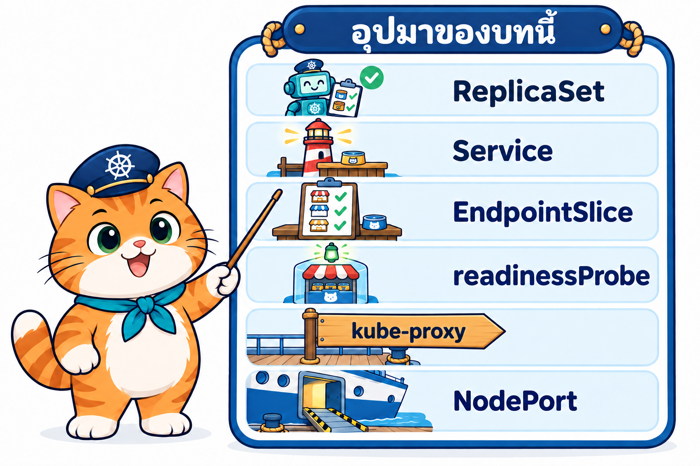<br>
  <em><b>รูปที่ 2</b> อุปมาของบทนี้: หัวหน้ากะ = ReplicaSet (เรียนแล้ว), ประภาคาร = Service, คลิปบอร์ดรายชื่อบูธ = EndpointSlice, ไฟเขียวหน้าบูธ = readinessProbe, ป้ายบอกทางบนเรือ = kube-proxy, ประตูเลขบนเรือ = NodePort</em>
</p>

**ตารางที่ 1** อุปมาท่าเรือที่ใช้ในบทนี้ (ต่อจากบทที่ 1–5)

| Kubernetes | อุปมาท่าเรือ | ใหม่ในบทนี้ |
|---|---|:---:|
| container / Pod | ตู้สินค้า / กล่องใสสี teal มีป้าย IP (บทนี้วาดเป็น "บูธร้าน" มีกันสาด) | |
| Node / Control Plane | เรือสินค้า (`lab-worker`, `lab-worker2`) / หอบังคับการ (`lab-control-plane`) | |
| Namespace | โซนทาสีบนแผนผังท่าเรือ | |
| label / ReplicaSet / Pod template | ป้ายห้อยกระเป๋าสี / หัวหน้ากะ (หุ่นยนต์ teal ถือคลิปบอร์ดนับหัว) / พิมพ์เขียว | |
| **Service** | **ประภาคาร/เคาน์เตอร์ต้อนรับ** มีป้ายชื่อและป้ายที่อยู่คงที่ ส่งลูกค้าไปบูธที่พร้อม | ✅ |
| ClusterIP | ป้ายที่อยู่ของประภาคาร เป็นภาพโฮโลแกรม ไม่มีใครอยู่ข้างในจริง (ping ไม่ตอบ) | ✅ |
| EndpointSlice | คลิปบอร์ดรายชื่อบูธที่เปิดอยู่ ติดข้างประภาคาร (ไม่เกิน 100 แถวต่อแผ่น) | ✅ |
| EndpointSlice controller | เสมียนหุ่นยนต์ในหอ ส่องกล้องดูบูธแล้วเขียนคลิปบอร์ด | ✅ |
| readinessProbe | ไฟเขียวหน้าบูธ (ไฟแดง = ไม่ได้ลูกค้า) | ✅ |
| kube-proxy | ป้ายบอกทางบนเรือทุกลำ ทาสีใหม่ตามวิทยุจากหอ | ✅ |
| NodePort | ประตูทางขึ้นเรือหมายเลข 30080 บนทุก Node | ✅ |
| LoadBalancer | เครนของผู้ให้บริการคลาวด์ที่ส่งป้ายที่อยู่สาธารณะมาให้ (ใน kind ไม่มา จึงค้าง `<pending>`) | ✅ |
| ExternalName | เสาป้ายชี้ออกทะเลไปเกาะซัพพลายเออร์ | ✅ |
| headless Service | สมุดโทรศัพท์รายชื่อบูธ ไม่มีเคาน์เตอร์กลาง | ✅ |
| sessionAffinity / keep-alive | บัตรสมาชิกที่พาลูกค้าไปบูธเดิม / เชือกเส้นเดียวผูกลูกค้ากับบูธเดียว | ✅ |
| NetworkPolicy | รั้วและยามหน้าประตูโซน (บทที่ 4) ที่ตรวจหลังป้ายบอกทางเปลี่ยนที่อยู่แล้ว | |

<p align="center" id="fig-3">
  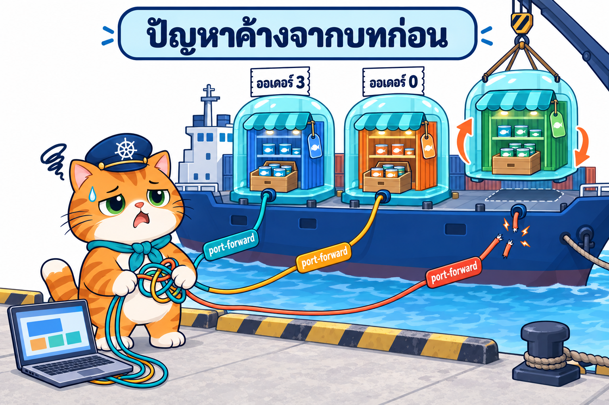<br>
  <em><b>รูปที่ 3</b> ปัญหาที่ส่งต่อจากบท 005: ต้อง port-forward ทีละ Pod (สายหลุดเมื่อ Pod ถูกลบ) และแต่ละบูธมีฐานข้อมูลของตัวเอง ออเดอร์จึงไม่ตรงกัน</em>
</p>

ทบทวนปัญหาที่ค้างมาจากบทที่ 4–5 (เห็นจริงใน LAB สุดท้ายของบทที่ 5)

| ปัญหา | หลักฐานจากบทก่อน | สิ่งที่บทนี้ใช้แก้ |
|---|---|---|
| Pod ใหม่ = ชื่อใหม่ + IP ใหม่ จด IP ไว้ใช้ไม่ได้ | บูธใหม่ชื่อ/IP ใหม่ทุกครั้งที่ ReplicaSet สร้างแทน | ชื่อ Service + ClusterIP คงที่ (หัวข้อ 2–4) |
| `port-forward` ผูกกับ Pod เดียว หลุดเมื่อ Pod ถูกลบ | `error: lost connection to pod` และบูธที่ถูก scale ลงเปิดไม่ได้ | Service เลือก Pod ใหม่เองผ่าน EndpointSlice (หัวข้อ 3) และ NodePort เปิดร้านให้ browser ได้ตรง ๆ (หัวข้อ 6) |
| แต่ละบูธมีฐานข้อมูลของตัวเอง ออเดอร์ไม่ตรงกัน | บูธหนึ่งออเดอร์ 2 แต่อีกสองบูธออเดอร์ 0 บูธใหม่เริ่มจาก 0 | แยก db เป็น Pod ของตัวเอง แล้วให้ทุกบูธเรียกด้วยชื่อ Service `som-db` (LAB 10) |

เป้าหมายของบทนี้จึงมี 5 ข้อ: **(1)** ที่อยู่คงที่ **(2)** กระจายลูกค้าไปหลายบูธ **(3)** ส่งลูกค้าเฉพาะบูธที่พร้อม **(4)** เปิดร้านสู่ภายนอกคลัสเตอร์ และ **(5)** แยกหน้าร้าน (web) ออกจากครัวกลาง (db) ครั้งแรก

ในทุก LAB ของบทนี้ ตัวสร้าง Pod ที่อยู่หลัง Service ยังเป็น **ReplicaSet** ที่เรียนมาแล้ว เพราะ Service เลือก Pod ด้วย label เท่านั้น ไม่สนว่าใครเป็นผู้สร้าง Pod

---

## 2. ทำไมต้องมี Service

### 2.1 นิยาม

<p align="center" id="fig-4">
  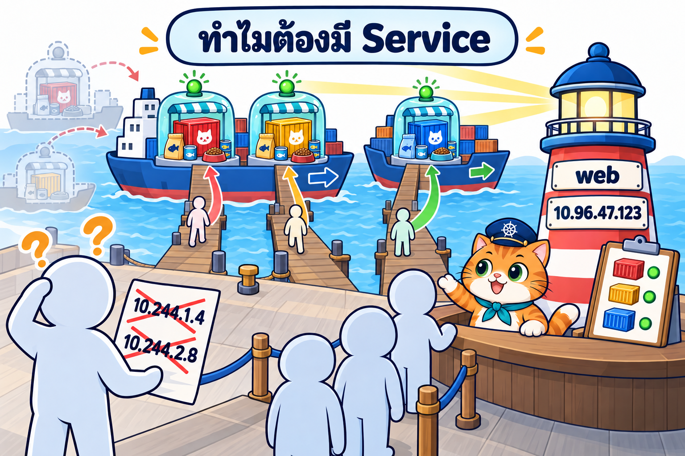<br>
  <em><b>รูปที่ 4</b> ทำไมต้องมี Service: Pod เกิดใหม่ได้ IP ใหม่ตลอด ลูกค้าจำ IP ไม่ไหว → Service ให้ชื่อและ ClusterIP คงที่แล้วส่งต่อไปยัง Pod ที่พร้อม</em>
</p>

**Service** คือ object ใน Kubernetes API (`apiVersion: v1`, `kind: Service`) ที่ให้ **ชื่อและที่อยู่คงที่** กับกลุ่มของ Pod ที่ทำหน้าที่เดียวกัน ประกอบด้วย 3 ส่วน

1. **ชื่อ** ที่กลายเป็นชื่อ DNS เช่น `web` หรือชื่อเต็ม `web.shop.svc.cluster.local` (หัวข้อ 9)
2. **ClusterIP** เป็น IP เสมือนที่ไม่เปลี่ยนตลอดอายุของ Service (หัวข้อ 2.2 และ 4)
3. **selector** เป็นเงื่อนไข label ที่ใช้เลือก Pod ปลายทาง รายชื่อ Pod ที่ตรงจะถูกเขียนลง EndpointSlice ให้อัตโนมัติ (หัวข้อ 3)

ลูกค้า (Pod อื่นหรือผู้ใช้ภายนอก) จึงจำแค่ชื่อของ Service แล้ว Kubernetes จะส่งต่อไปยัง Pod ที่พร้อมให้เอง บูธจะเกิดใหม่กี่ครั้ง ได้ IP ใหม่กี่ครั้งก็ไม่กระทบลูกค้า

ข้อเข้าใจผิดที่พบบ่อยคือคิดว่า Service เป็น "โปรแกรม load balancer ที่รันอยู่บนเครื่องใดเครื่องหนึ่ง" ความจริงคือ **Service เป็นแค่ข้อมูลใน API** (เหมือนป้ายประกาศในหอบังคับการ) ส่วนงานส่งต่อแพ็กเก็ตทำโดย **kube-proxy บนทุก Node** (หัวข้อ 10) จึงไม่มีจุดคอขวดกลางและไม่มี "เครื่องประภาคาร" ให้ล่ม

### 2.2 ClusterIP เป็นที่อยู่เสมือน

<p align="center" id="fig-5">
  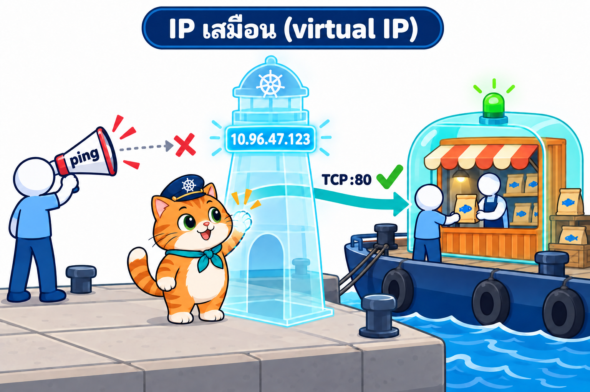<br>
  <em><b>รูปที่ 5</b> ClusterIP เป็นที่อยู่เสมือน (virtual IP): ไม่มีเครื่องไหนถือ IP นี้จริง จึง ping ไม่ตอบ แต่เชื่อมต่อ TCP ไปที่พอร์ตของ Service ได้</em>
</p>

ClusterIP **ไม่ได้ผูกกับ network interface ของเครื่องใด** ไม่มี Pod หรือ Node ใดถือ IP นี้จริง สิ่งที่มีคือกฎของ kube-proxy บนทุก Node ที่บอกว่า "แพ็กเก็ต TCP ที่ส่งไป `ClusterIP:port` ให้เปลี่ยนปลายทางเป็น IP ของ Pod ตัวหนึ่ง" กฎนี้จับเฉพาะ **protocol และพอร์ตที่ Service ประกาศไว้** เท่านั้น ผลที่ตามมาคือ

- `ping` (ICMP) ไปที่ ClusterIP **ไม่ตอบ** เพราะไม่มีกฎสำหรับ ICMP และไม่มีใครเป็นเจ้าของ IP
- เชื่อมต่อ TCP ไปที่ **พอร์ตของ Service** ได้ตามปกติ
- เชื่อมต่อไปพอร์ต **อื่น** ของ ClusterIP จะเงียบจนหมดเวลา (timeout) เพราะไม่มีกฎรองรับ (เห็นจริงใน LAB 3)

ผลจริงจาก LAB 2 (Service `web` มี ClusterIP `10.96.55.132`)

```text
$ kubectl -n shop exec client -- wget -qO- http://web
web v1 from web-999d4

$ kubectl -n shop exec client -- ping -c 2 -W 2 10.96.55.132
PING 10.96.55.132 (10.96.55.132): 56 data bytes

--- 10.96.55.132 ping statistics ---
2 packets transmitted, 0 packets received, 100% packet loss
command terminated with exit code 1

$ kubectl -n shop exec client -- ping -c 2 -W 2 10.244.2.5
PING 10.244.2.5 (10.244.2.5): 56 data bytes
64 bytes from 10.244.2.5: seq=0 ttl=63 time=0.063 ms
64 bytes from 10.244.2.5: seq=1 ttl=63 time=0.064 ms
...
2 packets transmitted, 2 packets received, 0% packet loss
```

Pod IP (`10.244.2.5`) ping ได้เพราะเป็น IP ที่มีอยู่จริงบน network interface ของ Pod ส่วน ClusterIP ping ไม่ได้แต่ `wget http://web` ใช้ได้ **อย่าใช้ ping ทดสอบ Service** ให้ใช้ `wget`/`curl` ไปที่พอร์ตของ Service แทน

> พฤติกรรม ping ข้างต้นเป็นของโหมด iptables ที่ kind ใช้ kube-proxy บางโหมดหรือ network plugin บางตัวอาจตอบ ping ของ ClusterIP ได้ จึงไม่ควรใช้ผล ping ตัดสินว่า Service ใช้ได้หรือไม่

### 2.3 โครงสร้าง manifest ของ Service

<p align="center" id="fig-6">
  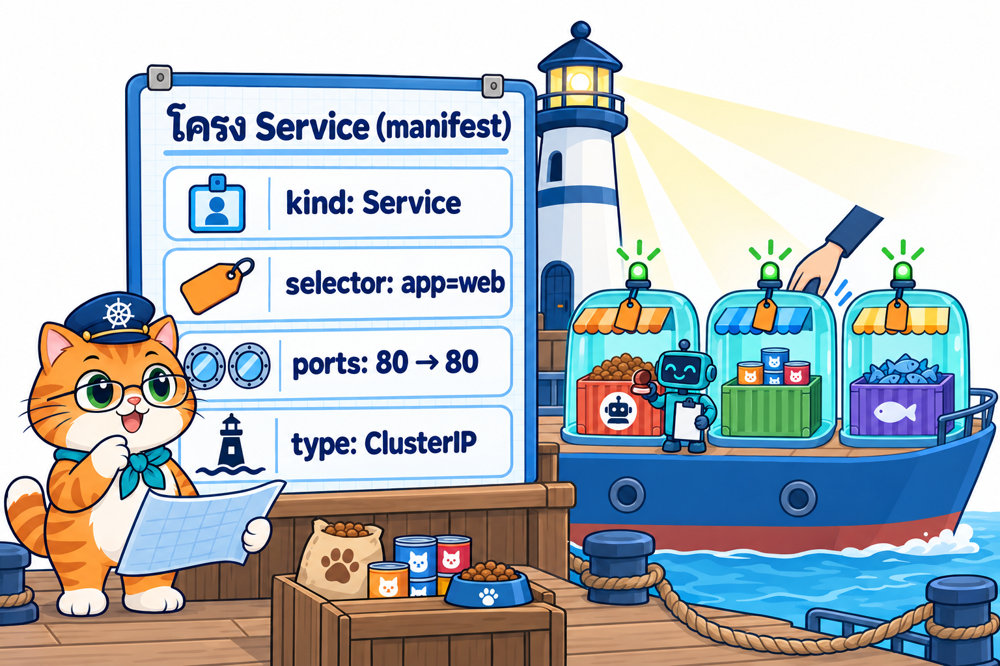<br>
  <em><b>รูปที่ 6</b> โครง manifest ของ Service: selector เลือก Pod ด้วย label, ports บอกพอร์ตรับและพอร์ตปลายทาง, type บอกชนิด (ค่าเริ่มต้น ClusterIP) — ไม่สนว่า Pod ถูกสร้างโดยใคร</em>
</p>

ไฟล์ `02_LAB/labs/lab02-clusterip/web-svc.yaml` ของ LAB 2

```yaml
# LAB 2: Service แรก — ClusterIP (ค่าเริ่มต้น) ชื่อ web
# ชื่อ "web" + IP เสมือน (ClusterIP) คงที่ ส่งต่อไป Pod ที่มีป้าย app=web และ Ready
apiVersion: v1
kind: Service
metadata:
  name: web
  namespace: shop
spec:
  type: ClusterIP          # ไม่ใส่ก็ได้ (ค่าเริ่มต้น)
  selector:
    app: web               # เลือก Pod ด้วย label (ไม่สนว่าใครสร้าง Pod)
  ports:
    - port: 80             # พอร์ตที่ Service รับ (http://web:80)
      targetPort: http     # พอร์ตของ container (ชื่อ http = containerPort 80)
```

| ฟิลด์ | ความหมาย | หมายเหตุ |
|---|---|---|
| `metadata.name` | ชื่อ Service = ชื่อ DNS | ต้องเป็น DNS label (ตัวพิมพ์เล็ก ตัวเลข `-`) |
| `spec.type` | ชนิดของ Service | ค่าเริ่มต้น `ClusterIP`; อื่น ๆ คือ `NodePort`, `LoadBalancer`, `ExternalName` |
| `spec.selector` | label ที่ใช้เลือก Pod | **แก้ไขได้** (ต่างจาก selector ของ ReplicaSet ที่แก้ไม่ได้) และรองรับเฉพาะแบบเท่ากับ (ไม่มี `matchExpressions`) |
| `spec.ports[].port` | พอร์ตที่ Service รับ | ลูกค้าเรียก `web:80` |
| `spec.ports[].targetPort` | พอร์ตของ container ปลายทาง | เป็นเลขหรือ **ชื่อพอร์ต** ก็ได้ ไม่ใส่ = เท่ากับ `port` |
| `spec.ports[].protocol` | `TCP` (ค่าเริ่มต้น), `UDP`, `SCTP` | |
| `spec.clusterIP` | ClusterIP ที่ระบบจัดสรรให้ | ใส่เองได้ (ไม่แนะนำ) หรือใส่ `None` เพื่อทำ headless |

ส่วน Pod ปลายทางมาจาก ReplicaSet ใน `labs/lab01-before-service/web-rs.yaml` (ตัดมาเฉพาะส่วนที่เกี่ยวกับ Service)

```yaml
  template:
    metadata:
      labels:
        app: web                   # Service จะเลือก Pod ด้วยป้ายนี้ (LAB 2)
    spec:
      containers:
        - name: nginx
          image: nginx:1.27-alpine
          ports:
            - name: http             # ตั้งชื่อพอร์ต → Service อ้าง targetPort: http ได้
              containerPort: 80
          readinessProbe:            # ไฟเขียวหน้าบูธ: ไม่ผ่าน = Service ไม่ส่งลูกค้ามา (LAB 6)
            httpGet: { path: /, port: http }
            periodSeconds: 2
```

**Service กับ ReplicaSet ใช้ selector เหมือนกันแต่คนละหน้าที่**

| | ReplicaSet (บทที่ 5) | Service (บทนี้) |
|---|---|---|
| ใช้ selector ทำอะไร | นับ Pod เพื่อสร้าง/ลบให้ครบ `replicas` | หา Pod เพื่อส่งลูกค้าไป |
| เป็นเจ้าของ Pod ไหม | ใช่ Pod มี `ownerReferences` ชี้ ReplicaSet | **ไม่ใช่** Pod ไม่มี ownerReferences ชี้ Service ลบ Service แล้ว Pod ยังอยู่ |
| สร้าง/ลบ Pod ได้ไหม | ได้ | ไม่ได้เลย |
| สนใจว่าใครสร้าง Pod ไหม | Pod ต้องตรง selector (รับเลี้ยง Pod หลงได้) | ไม่สน: Pod เดี่ยว, Pod ของ ReplicaSet หรือของ workload อื่นในบทหลัง ถ้า label ตรงและ Ready ก็ได้ลูกค้า |
| แก้ selector ได้ไหม | ไม่ได้ (`field is immutable`) | ได้ (LAB 7 แก้ selector ที่พิมพ์ผิดด้วย `kubectl patch`) |

### 2.4 สร้าง Service ได้ 2 ทาง

**ทางที่ 1: `kubectl expose`** คัดลอก selector จาก object ต้นทาง เหมาะกับการลองเร็ว ๆ

```bash
kubectl -n shop expose rs web --port=80 --name=web-quick
kubectl -n shop get svc web-quick -o yaml
```

ผลจริงจาก LAB 2 (ตัดบางส่วน)

```text
service/web-quick exposed
...
spec:
  clusterIP: 10.96.84.23
  ...
  ports:
  - port: 80
    protocol: TCP
    targetPort: 80
  selector:
    app: web
  sessionAffinity: None
  type: ClusterIP
```

สังเกตว่า `expose` คัดลอก selector `app: web` จาก ReplicaSet มาให้ แต่ใส่ **`targetPort: 80` เป็นตัวเลข** ไม่ใช่ชื่อพอร์ต `http` และ API เติมค่าเริ่มต้นอื่น ๆ ให้ (`sessionAffinity: None`, `internalTrafficPolicy: Cluster`, `ipFamilies`)

**ทางที่ 2: เขียน YAML แล้ว `kubectl apply -f`** (แนะนำ) เพราะเก็บใน Git ได้ ทบทวนได้ และใช้ named port ได้ตามต้องการ

---

## 3. selector → EndpointSlice

### 3.1 EndpointSlice คือรายชื่อบูธที่ระบบเขียนให้

<p align="center" id="fig-7">
  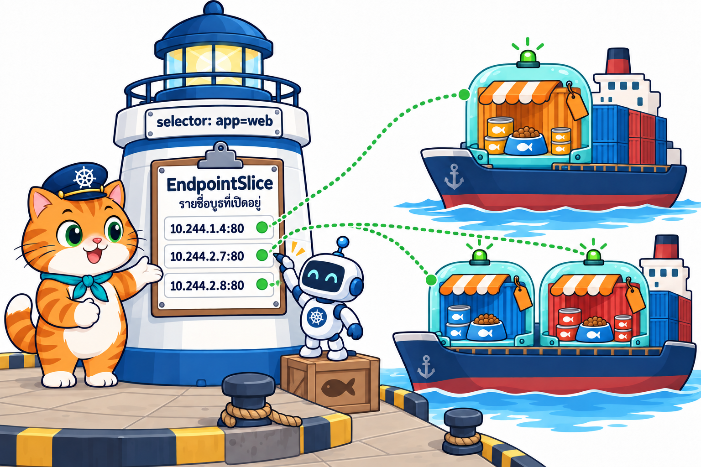<br>
  <em><b>รูปที่ 7</b> selector → EndpointSlice: Service เลือก Pod ด้วย label เหมือน ReplicaSet แล้วระบบเขียนรายชื่อ IP:port ของบูธที่เปิดอยู่ลงใน EndpointSlice</em>
</p>

Service ไม่ได้เก็บรายชื่อ Pod ไว้ในตัวเอง รายชื่อ "IP:port ของ Pod ที่ตรง selector" ถูกเก็บใน object อีกชนิดคือ **EndpointSlice** (`discovery.k8s.io/v1`) ผลจริงจาก LAB 2 หลัง apply `web-svc.yaml`

```text
$ kubectl -n shop get svc,endpointslice
NAME          TYPE        CLUSTER-IP     EXTERNAL-IP   PORT(S)   AGE
service/web   ClusterIP   10.96.55.132   <none>        80/TCP    0s

NAME                                       ADDRESSTYPE   PORTS   ENDPOINTS                          AGE
endpointslice.discovery.k8s.io/web-5r58w   IPv4          80      10.244.2.5,10.244.1.4,10.244.2.6   0s

$ kubectl -n shop get pods -o wide
NAME        READY   STATUS    RESTARTS   AGE   IP           NODE          ...
client      1/1     Running   0          50s   10.244.2.4   lab-worker    ...
web-999d4   1/1     Running   0          50s   10.244.2.5   lab-worker    ...
web-k2nk5   1/1     Running   0          21s   10.244.2.6   lab-worker    ...
web-mgz49   1/1     Running   0          50s   10.244.1.4   lab-worker2   ...
```

ENDPOINTS 3 ตัวตรงกับ IP ของ Pod `web-*` ทั้ง 3 (ไม่มี `client` เพราะ label เป็น `role=client`) และ PORTS เป็น `80` คือพอร์ตของ **Pod** (targetPort ที่แปลงจากชื่อ `http` แล้ว) ไม่ใช่พอร์ตของ Service

### 3.2 EndpointSlice controller

<p align="center" id="fig-8">
  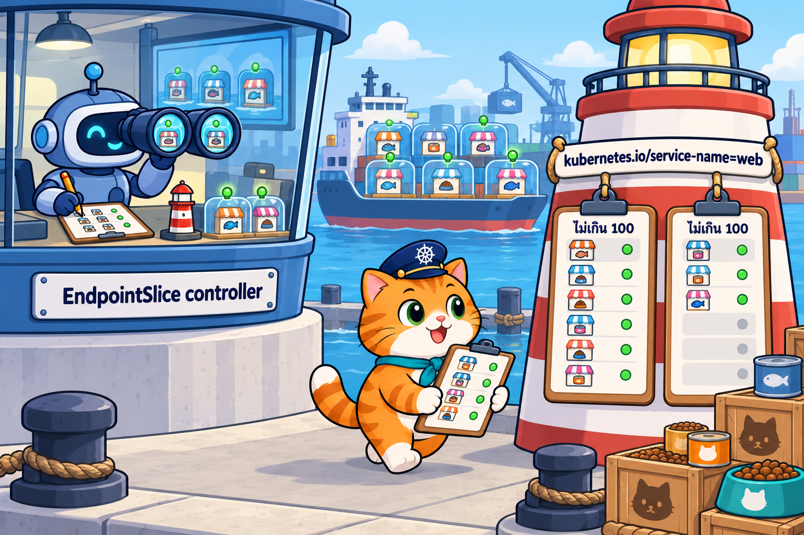<br>
  <em><b>รูปที่ 8</b> EndpointSlice controller ใน kube-controller-manager เฝ้า Service + Pod แล้วเขียน EndpointSlice ที่ติด label kubernetes.io/service-name; หนึ่ง slice เก็บได้ไม่เกิน 100 endpoint ถ้าเกินจะแตกเป็นหลาย slice</em>
</p>

ผู้เขียน EndpointSlice คือ **EndpointSlice controller** ซึ่งรันอยู่ใน `kube-controller-manager` บน control plane (ที่เดียวกับ ReplicaSet controller ของบทที่ 5) มันทำงานแบบ reconciliation loop เหมือนกัน

1. **watch** Service ทุกตัวที่มี selector และ Pod ทุกตัว
2. เมื่อมีการเปลี่ยนแปลง (Pod ใหม่, Pod ถูกลบ, Pod เปลี่ยนสถานะ ready, label เปลี่ยน, Service เปลี่ยน selector) ก็คำนวณรายชื่อใหม่
3. เขียน EndpointSlice ที่ติด label `kubernetes.io/service-name=<ชื่อ Service>` และมี `ownerReferences` ชี้กลับ Service

ผลจริงจาก LAB 2 (`kubectl -n shop get endpointslice -l kubernetes.io/service-name=web -o yaml` ตัดบางส่วน)

```text
- addressType: IPv4
  apiVersion: discovery.k8s.io/v1
  endpoints:
  - addresses:
    - 10.244.2.5
    conditions:
      ready: true
      serving: true
      terminating: false
    nodeName: lab-worker
    targetRef:
      kind: Pod
      name: web-999d4
      namespace: shop
      ...
  ...
  kind: EndpointSlice
  metadata:
    ...
    generateName: web-
    labels:
      endpointslice.kubernetes.io/managed-by: endpointslice-controller.k8s.io
      kubernetes.io/service-name: web
    name: web-5r58w
    namespace: shop
    ownerReferences:
    - apiVersion: v1
      blockOwnerDeletion: true
      controller: true
      kind: Service
      name: web
      ...
  ports:
  - name: ""
    port: 80
    protocol: TCP
```

ข้อสังเกตสำคัญ

- **ชื่อ slice เป็น `<ชื่อ Service>-<สุ่ม 5 ตัว>`** (`web-5r58w`) จึงต้องค้นด้วย label `-l kubernetes.io/service-name=web` ไม่ใช่ด้วยชื่อ
- **ownerReferences ชี้ Service** ลบ Service แล้ว EndpointSlice หายตาม (cascade แบบเดียวกับบทที่ 5)
- แต่ละ endpoint มี `addresses`, `conditions` (`ready`, `serving`, `terminating`), `nodeName` และ `targetRef` (ชี้ Pod) ทำให้รู้ว่า IP นี้คือ Pod ตัวไหนอยู่บนเรือลำไหน
- **1 slice เก็บได้ไม่เกิน 100 endpoint** (ค่าเริ่มต้น) Service ที่มี Pod มากกว่านั้นจะมีหลาย slice ทำให้อัปเดตทีละส่วนได้โดยไม่ต้องเขียน object ก้อนใหญ่ทั้งก้อนทุกครั้งที่ Pod ตัวเดียวเปลี่ยน
- รายชื่อ **อัปเดตเอง** ทันทีที่ Pod เปลี่ยน ผลจริงจาก LAB 2 เมื่อ scale ReplicaSet เป็น 5 แล้วลบ Pod `web-999d4` (IP `10.244.2.5`) IP นั้นหายจากรายชื่อและมี IP ใหม่ `10.244.1.5` เข้ามาแทน ส่วน ClusterIP ยังเป็น `10.96.55.132` เหมือนเดิม

```text
$ kubectl -n shop scale rs web --replicas=5 ...
NAME        ADDRESSTYPE   PORTS   ENDPOINTS                                      AGE
web-5r58w   IPv4          80      10.244.2.5,10.244.1.4,10.244.2.6 + 2 more...   39s

$ kubectl -n shop delete pod web-999d4 ...
pod "web-999d4" deleted from shop namespace
NAME        ADDRESSTYPE   PORTS   ENDPOINTS                                      AGE
web-5r58w   IPv4          80      10.244.1.4,10.244.2.6,10.244.1.5 + 2 more...   41s
...
NAME   TYPE        CLUSTER-IP     EXTERNAL-IP   PORT(S)   AGE
web    ClusterIP   10.96.55.132   <none>        80/TCP    44s
```

> **กับดัก:** คอลัมน์ ENDPOINTS ของ `kubectl get endpointslice` แสดงแค่ 3 IP แรกแล้วตามด้วย `+ 2 more...` แม้ใช้ `-o wide` ถ้าต้องการเห็นครบให้ใช้ jsonpath เช่น
> `kubectl -n shop get endpointslice -l kubernetes.io/service-name=web -o jsonpath='{range .items[0].endpoints[*]}{.addresses[0]} {.targetRef.name} ready={.conditions.ready}{"\n"}{end}'`

### 3.3 v1 Endpoints เป็นรุ่นเก่า

<p align="center" id="fig-9">
  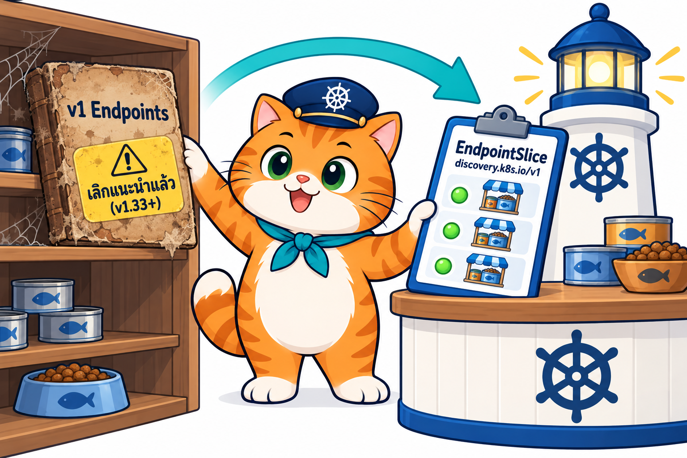<br>
  <em><b>รูปที่ 9</b> v1 Endpoints เป็นรุ่นเก่า: kubectl get endpoints ขึ้นคำเตือน deprecated ตั้งแต่ v1.33 ให้ใช้ EndpointSlice (discovery.k8s.io/v1); Service ที่ไม่มี selector ต้องเขียน EndpointSlice เองได้ (กล่าวถึง)</em>
</p>

ก่อนมี EndpointSlice Kubernetes ใช้ object ชื่อ **Endpoints** (`v1`) ที่เก็บรายชื่อทั้งหมดของ Service ไว้ใน object เดียว เมื่อ Service มี Pod นับพันตัว ทุกครั้งที่ Pod ตัวเดียวเปลี่ยน ต้องส่ง object ก้อนใหญ่ทั้งก้อนไปให้ทุก Node จึงถูกแทนด้วย EndpointSlice และ **v1 Endpoints ถูกประกาศเลิกใช้ (deprecated) ตั้งแต่ Kubernetes v1.33** ผลจริงจาก LAB 2

```text
$ kubectl -n shop get endpoints web
Warning: v1 Endpoints is deprecated in v1.33+; use discovery.k8s.io/v1 EndpointSlice
NAME   ENDPOINTS                                   AGE
web    10.244.1.4:80,10.244.2.5:80,10.244.2.6:80   1s
```

คำสั่ง `kubectl describe svc` ยังมีบรรทัด `Endpoints:` ให้ดูสรุปได้สะดวก

```text
$ kubectl -n shop describe svc web
Name:                     web
Namespace:                shop
...
Selector:                 app=web
Type:                     ClusterIP
...
IP:                       10.96.55.132
IPs:                      10.96.55.132
Port:                     <unset>  80/TCP
TargetPort:               http/TCP
Endpoints:                10.244.2.5:80,10.244.1.4:80,10.244.2.6:80
Session Affinity:         None
Internal Traffic Policy:  Cluster
Events:                   <none>
```

`Port: <unset>  80/TCP` หมายถึงพอร์ตนี้ของ Service ไม่ได้ตั้งชื่อ (ใช้ได้เพราะมีพอร์ตเดียว) ส่วน `TargetPort: http/TCP` คือชื่อพอร์ตของ container ที่อ้างถึง

### 3.4 Service ที่ไม่มี selector

ถ้าไม่ใส่ `selector` EndpointSlice controller จะไม่เขียนรายชื่อให้ ผู้ดูแลต้องสร้าง EndpointSlice เอง ใช้กับปลายทางที่ **อยู่นอกคลัสเตอร์** เช่น ฐานข้อมูลเดิมของบริษัทที่ยังไม่ได้ย้ายเข้า Kubernetes แต่อยากให้แอปเรียกด้วยชื่อ Service เหมือนของในคลัสเตอร์ ตัวอย่างแนวคิด (ไม่มีใน LAB ของบทนี้ IP `192.168.10.50` เป็นค่าสมมุติ)

```yaml
apiVersion: v1
kind: Service
metadata:
  name: old-db
  namespace: som-shop
spec:                      # ไม่มี selector → ระบบไม่เขียน EndpointSlice ให้
  ports:
    - name: postgres
      port: 5432
      targetPort: 5432
---
apiVersion: discovery.k8s.io/v1
kind: EndpointSlice
metadata:
  name: old-db-1
  namespace: som-shop
  labels:
    kubernetes.io/service-name: old-db                   # ผูกกับ Service ด้วย label นี้
    endpointslice.kubernetes.io/managed-by: staff.example.com   # บอกว่าคนเขียนเอง ไม่ใช่ controller
addressType: IPv4
ports:
  - name: postgres         # ต้องตรงกับชื่อพอร์ตของ Service
    port: 5432
    protocol: TCP
endpoints:
  - addresses: ["192.168.10.50"]
    conditions:
      ready: true
```

แอปใน `som-shop` จะเรียก `old-db:5432` ได้เหมือน Service ปกติ และเมื่อย้าย db เข้าคลัสเตอร์แล้ว ก็แค่เปลี่ยน Service ให้มี selector โดยไม่ต้องแก้แอป

---

## 4. ClusterIP และ Service CIDR

<p align="center" id="fig-10">
  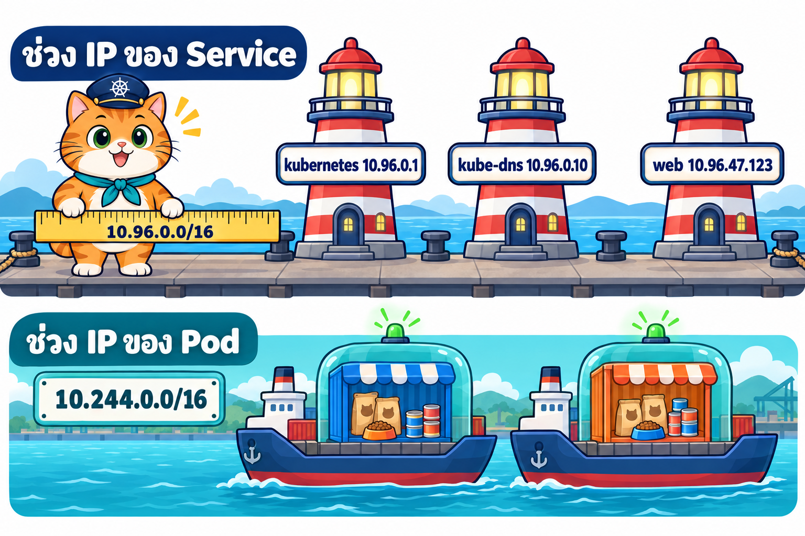<br>
  <em><b>รูปที่ 10</b> ClusterIP มาจากช่วง Service CIDR ของคลัสเตอร์ (kind: 10.96.0.0/16) แยกจาก Pod IP (10.244.x.x); kubernetes = 10.96.0.1, DNS (kube-dns) = 10.96.0.10</em>
</p>

ClusterIP ทุกตัวมาจาก **Service CIDR** ซึ่งเป็นช่วง IP ที่กำหนดตอนสร้างคลัสเตอร์และ **แยกจาก Pod CIDR** ในคลัสเตอร์ kind ของเรา ผลจริงจาก LAB 0

```text
$ docker exec lab-control-plane cat /kind/kubeadm.conf | grep -i serviceSubnet
  serviceSubnet: 10.96.0.0/16

$ kubectl get svc -A
NAMESPACE     NAME         TYPE        CLUSTER-IP   EXTERNAL-IP   PORT(S)                  AGE
default       kubernetes   ClusterIP   10.96.0.1    <none>        443/TCP                  4m57s
kube-system   kube-dns     ClusterIP   10.96.0.10   <none>        53/UDP,53/TCP,9153/TCP   4m56s
```

| ช่วง | ใช้กับ | ตัวอย่างในคลัสเตอร์ของเรา |
|---|---|---|
| Service CIDR `10.96.0.0/16` | ClusterIP ของ Service | `web` = `10.96.55.132`, `som-db` = `10.96.93.105` |
| Pod CIDR `10.244.0.0/16` | IP ของ Pod (แต่ละ Node ได้ช่วงย่อย `/24`) | `10.244.1.x` บน `lab-worker2`, `10.244.2.x` บน `lab-worker` |

Service 2 ตัวที่มีอยู่ตั้งแต่สร้างคลัสเตอร์

- **`kubernetes`** (namespace `default`) = `10.96.0.1:443` เป็นทางเข้า API server สำหรับโปรแกรมที่รันใน Pod (ทุก Pod ได้ env `KUBERNETES_SERVICE_HOST=10.96.0.1`)
- **`kube-dns`** (namespace `kube-system`) = `10.96.0.10` พอร์ต 53 UDP/TCP เป็น DNS ของคลัสเตอร์ (CoreDNS) และพอร์ต 9153 สำหรับ metrics ทุก Pod ใช้ IP นี้เป็น `nameserver` (หัวข้อ 9)

กติกาที่ควรรู้

- ClusterIP **ไม่เปลี่ยนตลอดอายุของ Service** แต่ถ้าลบ Service แล้วสร้างใหม่ชื่อเดิม จะได้ ClusterIP ใหม่ (ชื่อ DNS ยังเหมือนเดิม จึงควรเรียกด้วยชื่อเสมอ)
- กำหนด `spec.clusterIP` เองได้ถ้าอยู่ในช่วง Service CIDR และยังว่าง แต่ไม่แนะนำ เพราะชนกับ Service อื่นได้ง่าย
- `spec.clusterIP: None` ไม่ใช่ "ไม่มี IP แบบผิดพลาด" แต่เป็นการขอ **headless Service** (หัวข้อ 8.2)

---

## 5. พอร์ต: port, targetPort, nodePort และชื่อพอร์ต

### 5.1 พอร์ต 3 ชั้น

<p align="center" id="fig-11">
  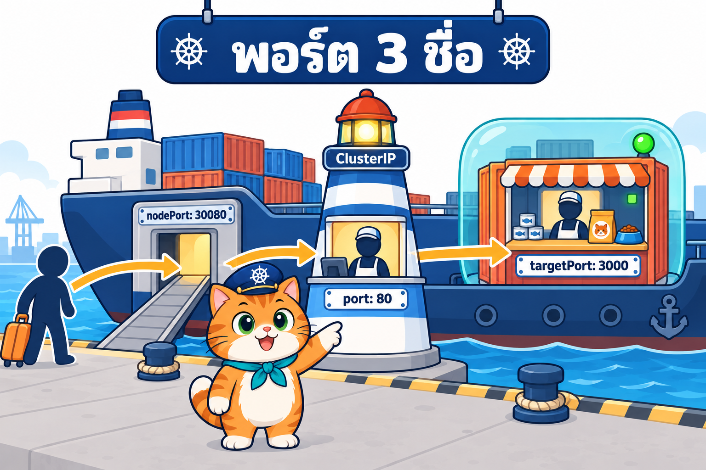<br>
  <em><b>รูปที่ 11</b> พอร์ต 3 ชื่อ: port (พอร์ตของ Service) → targetPort (พอร์ตของ container) และ nodePort (ประตูบนเรือ เฉพาะ type NodePort)</em>
</p>

| ฟิลด์ | อยู่ที่ไหน | ใครใช้ | ค่าเริ่มต้น |
|---|---|---|---|
| `port` | Service | ลูกค้าในคลัสเตอร์ เรียก `<ชื่อ Service>:<port>` หรือ `<ClusterIP>:<port>` | ต้องระบุ |
| `targetPort` | container ใน Pod | kube-proxy ส่งต่อไปที่ `<Pod IP>:<targetPort>` | เท่ากับ `port` |
| `nodePort` | ทุก Node | ลูกค้านอกคลัสเตอร์ เรียก `<Node IP>:<nodePort>` (เฉพาะ `NodePort` และ `LoadBalancer`) | สุ่มในช่วง 30000–32767 |
| `protocol` | ทั้งสามชั้น | | `TCP` (หรือ `UDP`, `SCTP`) |

ตัวอย่างจาก LAB 3 ไฟล์ `labs/lab03-ports/web-alt-svc.yaml` รับที่พอร์ต 8080 แต่ส่งต่อไปพอร์ต 80 ของ Pod

```yaml
# LAB 3: Service รับที่พอร์ต 8080 แต่ส่งต่อไปพอร์ต 80 (ชื่อ http) ของ Pod
apiVersion: v1
kind: Service
metadata:
  name: web-alt
  namespace: shop
spec:
  selector:
    app: web
  ports:
    - port: 8080           # ลูกค้าเรียก http://web-alt:8080
      targetPort: http     # → containerPort ชื่อ http (80)
```

ผลจริง: `web-alt:8080` ได้หน้าเว็บ แต่ `web-alt` (พอร์ต 80 ที่ Service นี้ไม่ได้ประกาศ) **เงียบจนหมดเวลา** ไม่ใช่ถูกปฏิเสธ เพราะไม่มีกฎของ kube-proxy สำหรับพอร์ตนั้น และไม่มีเครื่องใดเป็นเจ้าของ ClusterIP ที่จะตอบปฏิเสธกลับมา

```text
$ kubectl -n shop get svc web-alt
NAME      TYPE        CLUSTER-IP      EXTERNAL-IP   PORT(S)    AGE
web-alt   ClusterIP   10.96.141.242   <none>        8080/TCP   0s

$ kubectl -n shop exec client -- wget -qO- http://web-alt:8080
web v1 from web-gsgss

$ time kubectl -n shop exec client -- wget -qO- -T 3 http://web-alt
wget: download timed out
command terminated with exit code 1

real	0m3.060s
```

### 5.2 ชื่อพอร์ต (named port) และ Service หลายพอร์ต

<p align="center" id="fig-12">
  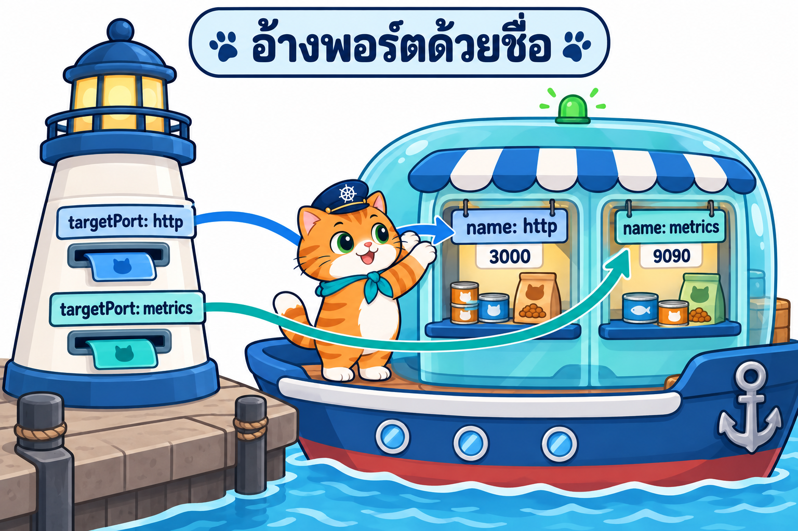<br>
  <em><b>รูปที่ 12</b> named port: targetPort อ้างชื่อพอร์ตของ container (targetPort: http) ได้ — เปลี่ยนเลขใน Pod โดยไม่ต้องแก้ Service; Service หลายพอร์ตต้องตั้งชื่อทุกพอร์ต</em>
</p>

**named port** คือการตั้งชื่อให้ `containerPort` ใน Pod (`ports: [{name: http, containerPort: 80}]`) แล้วให้ Service อ้างด้วยชื่อ (`targetPort: http`) ข้อดีคือ

- เปลี่ยนเลขพอร์ตใน Pod ได้โดย **ไม่ต้องแก้ Service** (เช่น รุ่นใหม่ของแอปย้ายไปฟังพอร์ต 8080 แต่ยังตั้งชื่อ `http`)
- Pod แต่ละตัวที่ Service เลือกใช้เลขพอร์ตต่างกันได้ ถ้าชื่อเหมือนกัน (EndpointSlice เก็บเลขจริงต่อกลุ่ม)
- อ่าน manifest แล้วเข้าใจง่ายกว่าเลขลอย ๆ

Service ที่มี **มากกว่า 1 พอร์ตต้องตั้ง `name` ให้ทุกพอร์ต** ไฟล์ `labs/lab03-ports/web-multi-svc.yaml`

```yaml
# LAB 3: Service หลายพอร์ต — ต้องตั้ง name ให้ทุกพอร์ต
apiVersion: v1
kind: Service
metadata:
  name: web-multi
  namespace: shop
spec:
  selector:
    app: web
  ports:
    - name: http
      port: 80
      targetPort: http
    - name: alt
      port: 8080
      targetPort: http     # สองพอร์ตของ Service ชี้ไปพอร์ตเดียวกันของ Pod ได้
```

ผลจริง: `PORT(S)` เป็น `80/TCP,8080/TCP` ส่วน EndpointSlice มี PORTS `80,80` (ทั้งพอร์ต `alt` และ `http` ชี้ไปพอร์ต 80 ของ Pod)

```text
NAME        TYPE        CLUSTER-IP    EXTERNAL-IP   PORT(S)           AGE
web-multi   ClusterIP   10.96.28.97   <none>        80/TCP,8080/TCP   0s
NAME              ADDRESSTYPE   PORTS   ENDPOINTS                          AGE
web-multi-4gzd9   IPv4          80,80   10.244.1.5,10.244.1.4,10.244.2.6   0s
```

ถ้าพอร์ตที่สองไม่มีชื่อ (ไฟล์ `labs/lab03-ports/web-multi-noname.yaml`) API ปฏิเสธทันที

```text
The Service "web-noname" is invalid: spec.ports[1].name: Required value
```

(ถ้าไม่ตั้งชื่อทั้งสองพอร์ต จะได้ 2 บรรทัด `* spec.ports[0].name: Required value` และ `* spec.ports[1].name: Required value`)

> **ข้อควรรู้:** ใน LAB 3 การเรียก `web-multi` ครั้งแรกหลังสร้างเสร็จราว 1 วินาทีได้ `wget: can't connect to remote host (10.96.28.97): Connection refused` แล้วครั้งถัดไปใช้ได้ปกติ เพราะ kube-proxy ยังเขียนกฎไม่เสร็จ Service ที่เพิ่งสร้างจึงอาจต้องรอสักครู่

---

## 6. NodePort: ประตูหมายเลขเดียวกันบนทุกเรือ

### 6.1 แนวคิด

<p align="center" id="fig-13">
  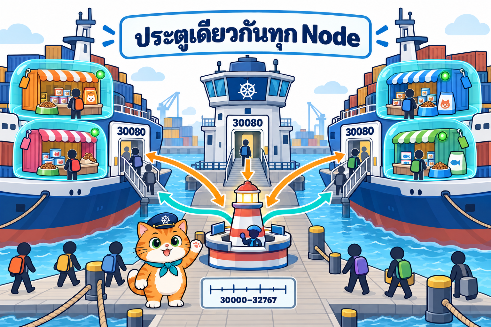<br>
  <em><b>รูปที่ 13</b> NodePort: เปิดประตูหมายเลขเดียวกัน (ช่วง 30000–32767) บนทุก Node; เข้าทางประตูของ Node ไหนก็ถึงบูธได้ทุกบูธ</em>
</p>

ClusterIP ใช้ได้เฉพาะ **ภายในคลัสเตอร์** (Pod กับ Pod) ถ้าต้องการให้ลูกค้านอกคลัสเตอร์เข้าถึง วิธีที่ง่ายที่สุดคือ `type: NodePort` ซึ่งทำ 2 อย่าง

1. สร้าง ClusterIP ตามปกติ (NodePort = ClusterIP + ประตู)
2. เปิดพอร์ตหมายเลขเดียวกัน (**nodePort**) บน **ทุก Node** รวมถึง control plane แพ็กเก็ตที่เข้าประตูนี้ของ Node ไหนก็ตามจะถูกส่งต่อไปยัง Pod ที่พร้อมตัวใดก็ได้ แม้ Pod นั้นจะอยู่บนเรือลำอื่น

ไฟล์ `labs/lab08-nodeport/web-nodeport.yaml`

```yaml
# LAB 8: NodePort 30080 → เปิดประตูหมายเลข 30080 บน "ทุก Node"
# kind ของ k8s-lab map พอร์ต 30080 ของเครื่องนักศึกษา → lab-control-plane:30080 (extraPortMappings บท 001)
# → เปิด http://localhost:30080 จาก browser ได้เลย
apiVersion: v1
kind: Service
metadata:
  name: web-nodeport
  namespace: shop
spec:
  type: NodePort
  selector:
    app: web
  ports:
    - port: 80             # ClusterIP:80 (ภายในคลัสเตอร์)
      targetPort: http     # → Pod:80
      nodePort: 30080      # ทุก Node:30080 (ช่วงที่ใช้ได้ 30000–32767)
```

ผลจริงจาก LAB 8: `PORT(S)` แสดงเป็น `<port>:<nodePort>/TCP` และทั้ง 3 Node ตอบที่พอร์ต 30080 (แม้ `lab-control-plane` จะไม่มี Pod `web` อยู่เลย)

```text
NAME           TYPE       CLUSTER-IP     EXTERNAL-IP   PORT(S)        AGE
web-nodeport   NodePort   10.96.39.125   <none>        80:30080/TCP   0s

lab-control-plane: web v1 from web-k2nk5
lab-worker: web v1 from web-k2nk5
lab-worker2: web v1 from web-mgz49
```

### 6.2 เส้นทางของ http://localhost:30080 จากเครื่องนักศึกษา

<p align="center" id="fig-14">
  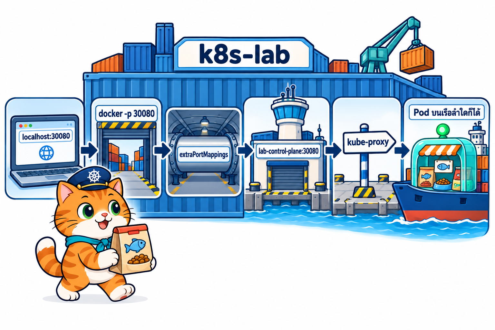<br>
  <em><b>รูปที่ 14</b> เส้นทาง http://localhost:30080 จากเครื่องนักศึกษา: Docker publish พอร์ต 30080 → container k8s-lab → kind extraPortMappings → lab-control-plane:30080 → kube-proxy → Pod บนเรือลำใดก็ได้ (map ไว้ตั้งแต่บท 001)</em>
</p>

บทที่ 2–5 เราเปิดหน้าร้านด้วย `kubectl port-forward` + `ssh -L` บทนี้เป็น **บทแรกที่เปิดร้านจาก browser ด้วย `http://localhost:30080` ได้ตรง ๆ** เพราะทางเดินของพอร์ต 30080 ถูกเตรียมไว้ตั้งแต่บทที่ 1 แล้ว 3 ชั้น

| ชั้น | ใครเปิดไว้ | หลักฐาน |
|---|---|---|
| 1. เครื่องนักศึกษา `localhost:30080` → container `k8s-lab:30080` | `docker run ... -p 30080-30082:30080-30082 ...` ตอนสร้าง k8s-lab ในบทที่ 1 | คำสั่ง `docker run` ใน LAB บทที่ 1 |
| 2. `k8s-lab:30080` → container `lab-control-plane:30080` | kind `extraPortMappings` ในไฟล์ `/etc/devtools/kind/kind-lab.yaml` ที่ `k8s-up` ใช้ | `docker ps` ใน k8s-lab เห็น `lab-control-plane  0.0.0.0:30080-30082->30080-30082/tcp` |
| 3. `lab-control-plane:30080` → Pod | NodePort ของ Service + kube-proxy บน control plane | `kubectl get svc` เห็น `80:30080/TCP` |

ส่วนของไฟล์ `kind-lab.yaml` (ผลจริงจาก `cat /etc/devtools/kind/kind-lab.yaml` ใน LAB 0 ตัดบางส่วน)

```yaml
kind: Cluster
apiVersion: kind.x-k8s.io/v1alpha4
name: lab
nodes:
  - role: control-plane
    extraPortMappings:
      - containerPort: 30080
        hostPort: 30080
        listenAddress: "0.0.0.0"
        protocol: TCP
      - containerPort: 30081
        hostPort: 30081
        listenAddress: "0.0.0.0"
        protocol: TCP
      - containerPort: 30082
        hostPort: 30082
        listenAddress: "0.0.0.0"
        protocol: TCP
  - role: worker
  - role: worker
```

ข้อสังเกต

- พอร์ตที่ map ออกมามีแค่ **30080, 30081, 30082** และ map เข้า **control plane เท่านั้น** ถ้าตั้ง nodePort เป็นเลขอื่น (เช่น 31841 ที่ระบบสุ่ม) Service ยังทำงานภายในคลัสเตอร์ แต่เปิดจาก browser บนเครื่องนักศึกษาไม่ได้
- control plane ไม่มี Pod ของเรา (มี taint `NoSchedule`) แต่ kube-proxy บน control plane ยังส่งต่อแพ็กเก็ตข้ามเรือไปหา Pod บน `lab-worker`/`lab-worker2` ได้ นี่คือความหมายของ "เข้าทางประตูของ Node ไหนก็ถึงบูธได้ทุกบูธ"
- ในการทดลอง เราเปิดหน้าร้านจากนอก container ผ่านเส้นทางเดียวกันนี้ได้ทั้ง curl และ browser แต่ **ยังไม่ได้ยืนยันบนเครื่อง Windows + Docker Desktop ทุกรุ่น** ถ้าเครื่องนักศึกษาเปิด `localhost:30080` ไม่ได้ ทางสำรองคือ `ssh -p 2223 -L 30080:localhost:30080 root@localhost` (ดู Troubleshooting ของ LAB)

### 6.3 กติกาของ NodePort

<p align="center" id="fig-15">
  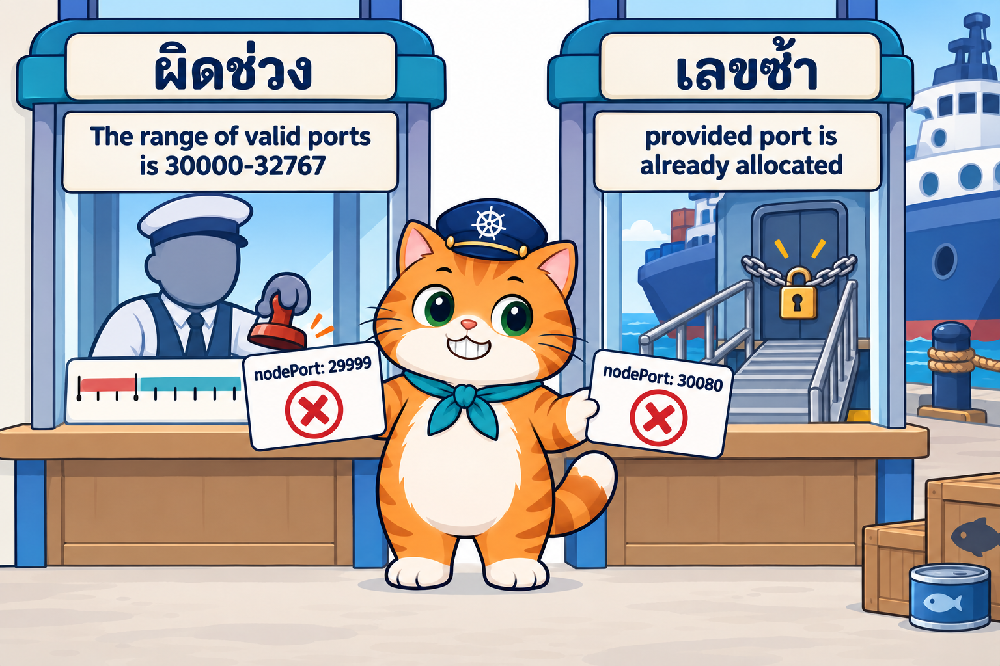<br>
  <em><b>รูปที่ 15</b> กติกา NodePort: ต้องอยู่ในช่วง 30000–32767 (ผิดช่วงถูกปฏิเสธ) และเลขซ้ำกันไม่ได้ทั้งคลัสเตอร์ (provided port is already allocated)</em>
</p>

| กติกา | ผลจริงเมื่อฝ่าฝืน (LAB 8) |
|---|---|
| nodePort ต้องอยู่ในช่วง **30000–32767** (ค่าเริ่มต้นของ API server) | `error: failed to create NodePort service: Service "bad" is invalid: spec.ports[0].nodePort: Invalid value: 29999: provided port is not in the valid range. The range of valid ports is 30000-32767` |
| เลขเดียวใช้ได้ **Service เดียวทั้งคลัสเตอร์** (ไม่ใช่แค่ใน namespace) | `The Service "web-dup" is invalid: spec.ports[0].nodePort: Invalid value: 30080: provided port is already allocated` |
| ไม่ระบุ nodePort ระบบสุ่มให้ | LoadBalancer ใน LAB 8 ได้ `80:31841/TCP` |

ผลของกติกาข้อ 2 คือ **ต้องลบ `web-nodeport` ของ LAB 8 ก่อนเริ่ม LAB 10** ซึ่งใช้ 30080 กับร้านน้องส้ม และตัวอย่าง `/workspace/examples/web-deployment.yaml` ของบทที่ 1 ก็จอง 30080 เช่นกัน (LAB 0 ตรวจและลบให้)

ข้อจำกัดของ NodePort ในงานจริง

- พอร์ตแปลก (30000+) ลูกค้าต้องพิมพ์เลขพอร์ตเอง
- ลูกค้าต้องรู้ IP ของ Node และถ้า Node นั้นล่มต้องเปลี่ยนไปใช้ Node อื่นเอง
- ไม่มีชื่อโดเมน ไม่มี TLS และ 1 พอร์ตต่อ 1 Service ไม่เหมาะกับหลายเว็บ

งานจริงจึงมักใช้ **LoadBalancer** (หัวข้อ 7) หรือ **Ingress/Gateway** (บทหลัง) ข้างหน้า ส่วน NodePort เหมาะกับ LAB และระบบ on-premise ขนาดเล็ก

---

## 7. LoadBalancer

<p align="center" id="fig-16">
  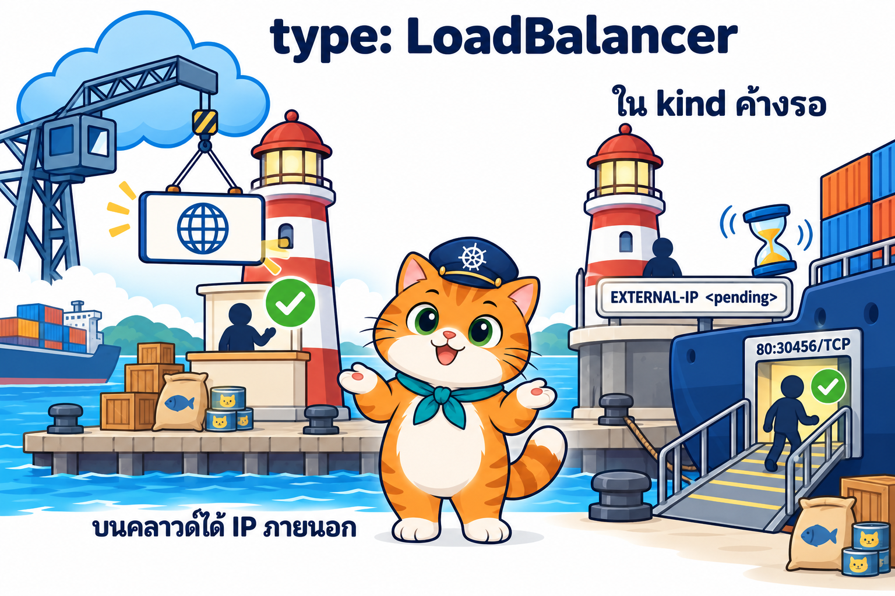<br>
  <em><b>รูปที่ 16</b> LoadBalancer: บนคลาวด์ได้ IP ภายนอกจากผู้ให้บริการ แต่ใน kind ไม่มีตัวจัดสรร EXTERNAL-IP จึงค้าง &lt;pending&gt; (ยังได้ nodePort ให้ใช้)</em>
</p>

`type: LoadBalancer` = NodePort + ClusterIP + **load balancer ภายนอก** ที่ผู้ให้บริการคลาวด์สร้างให้ ลำดับการทำงานบนคลาวด์คือ

1. API server สร้าง ClusterIP และ nodePort ตามปกติ
2. **cloud-controller-manager** ของผู้ให้บริการเห็น Service ชนิดนี้ จึงสร้าง load balancer จริง (มี IP สาธารณะหรือชื่อโดเมน) ชี้เข้า nodePort ของทุก Node
3. controller เขียนที่อยู่ภายนอกลง `status.loadBalancer.ingress` ซึ่ง `kubectl get svc` แสดงในคอลัมน์ `EXTERNAL-IP`

ไฟล์ `labs/lab08-nodeport/web-lb.yaml`

```yaml
# LAB 8: LoadBalancer — บนคลาวด์จะได้ IP สาธารณะ ส่วน kind ไม่มีผู้จัดสรร → EXTERNAL-IP <pending>
# (แต่ยังได้ ClusterIP + nodePort แบบสุ่มให้)
apiVersion: v1
kind: Service
metadata:
  name: web-lb
  namespace: shop
spec:
  type: LoadBalancer
  selector:
    app: web
  ports:
    - port: 80
      targetPort: http
```

kind ไม่มี cloud-controller-manager จึงไม่มีใครจัดสรร IP ภายนอก ผลจริงจาก LAB 8 หลังรอ 5 วินาที

```text
NAME     TYPE           CLUSTER-IP     EXTERNAL-IP   PORT(S)        AGE
web-lb   LoadBalancer   10.96.28.238   <pending>     80:31841/TCP   5s
```

`<pending>` จะค้างอย่างนั้นตลอด แต่ Service ยังใช้ได้ทั้งทาง ClusterIP และ nodePort ที่สุ่มได้ (31841 ในการทดลอง, 30456 ในการตรวจก่อนเขียนบท ทุกครั้งต่างกัน) ถ้าต้องการทดลอง LoadBalancer บน kind จริง มีเครื่องมือเสริม เช่น **cloud-provider-kind** หรือ **MetalLB** ที่ทำหน้าที่จัดสรร IP ให้ (นอกขอบเขตของบทนี้)

---

## 8. ExternalName และ headless Service

### 8.1 ExternalName: ชื่อแฝงไปนอกคลัสเตอร์

<p align="center" id="fig-17">
  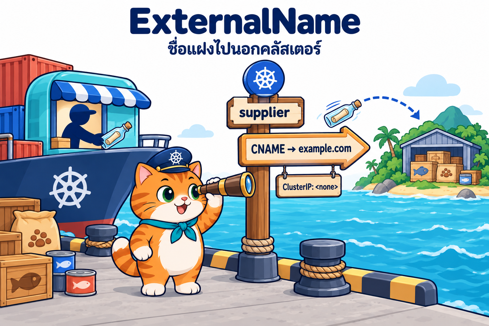<br>
  <em><b>รูปที่ 17</b> ExternalName: Service ที่เป็นแค่ชื่อแฝง (CNAME) ชี้ไปชื่อ DNS นอกคลัสเตอร์ ไม่มี ClusterIP ไม่มี selector ไม่มี kube-proxy</em>
</p>

`type: ExternalName` เป็น Service ที่ **ไม่มี selector ไม่มี ClusterIP และไม่ผ่าน kube-proxy** DNS ของคลัสเตอร์แค่ตอบเป็น **CNAME** ไปยังชื่อที่กำหนด ไฟล์ `labs/lab09-cross-ns/supplier-externalname.yaml`

```yaml
# LAB 9: ExternalName — ชื่อในคลัสเตอร์ (supplier.shop) ที่ DNS ตอบเป็น CNAME ไปชื่อภายนอก
# ไม่มี selector / ClusterIP / kube-proxy
apiVersion: v1
kind: Service
metadata:
  name: supplier
  namespace: shop
spec:
  type: ExternalName
  externalName: example.com
```

ผลจริงจาก LAB 9

```text
$ kubectl -n shop get svc
NAME           TYPE           CLUSTER-IP      EXTERNAL-IP   PORT(S)           AGE
supplier       ExternalName   <none>          example.com   <none>            17s
...

$ kubectl -n kitchen exec cook -- nslookup supplier.shop.svc.cluster.local
Server:		10.96.0.10
Address:	10.96.0.10:53

supplier.shop.svc.cluster.local	canonical name = example.com
Name:	example.com
Address: 172.66.147.243
...
```

ประโยชน์คือแอปในคลัสเตอร์เรียกชื่อภายใน (`supplier`) ได้เสมอ วันหนึ่งถ้าซัพพลายเออร์ย้ายเข้าคลัสเตอร์ ก็เปลี่ยน Service เป็นชนิดอื่นโดยไม่ต้องแก้แอป

**ข้อควรระวัง:** ExternalName เปลี่ยนแค่ "ชื่อที่ DNS ตอบ" แต่ client ยังส่ง HTTP `Host` header เป็นชื่อเดิม (`supplier.shop`) และ TLS ก็ตรวจใบรับรองกับชื่อเดิม ปลายทางที่แยกเว็บไซต์ด้วย Host header จึงอาจปฏิเสธ ผลจริงจาก LAB 9

```text
$ kubectl -n kitchen exec cook -- wget -qO- -T 3 http://supplier.shop
wget: server returned error: HTTP/1.1 409 Conflict
command terminated with exit code 1
```

DNS ใช้ได้ (ได้ CNAME และ A record) แต่ปลายทางตอบ `409 Conflict` เพราะไม่รู้จัก Host `supplier.shop` ถ้าเครื่องไม่มีอินเทอร์เน็ต `nslookup` จะยังเห็นบรรทัด `canonical name = example.com` แต่ไม่ได้ A record

### 8.2 headless Service: สมุดรายชื่อบูธ

<p align="center" id="fig-18">
  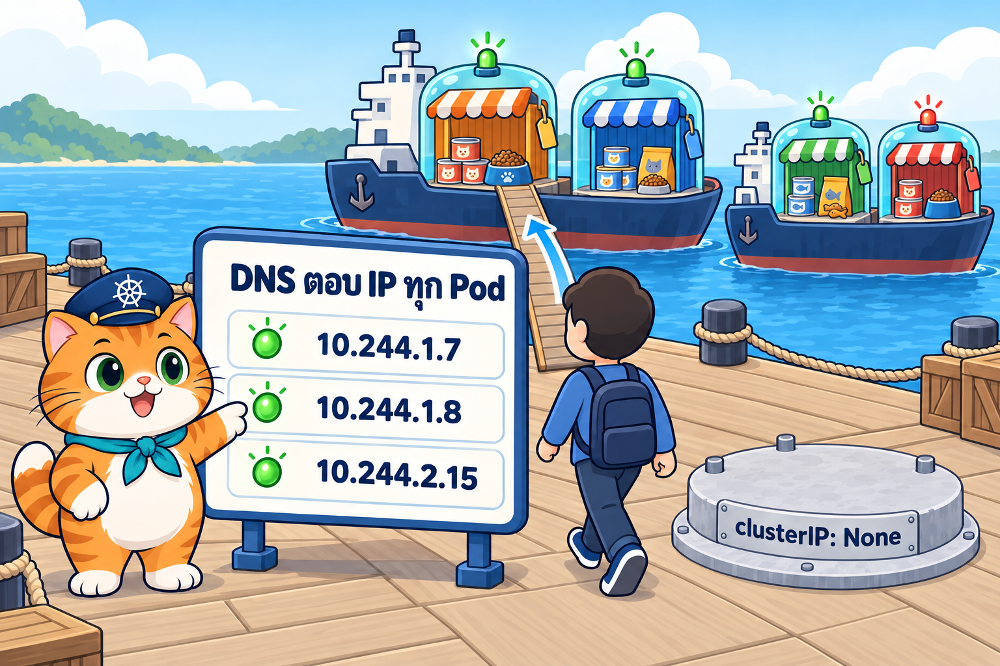<br>
  <em><b>รูปที่ 18</b> headless Service (clusterIP: None): ไม่มีเคาน์เตอร์กลาง DNS ตอบ IP ของทุก Pod ที่ ready โดยตรง ให้ลูกค้าเลือกบูธเอง</em>
</p>

headless Service คือ Service ที่ตั้ง `clusterIP: None` จึง **ไม่มี IP กลางและ kube-proxy ไม่กระจายให้** แต่ยังมี selector และ EndpointSlice ตามปกติ DNS ของคลัสเตอร์ตอบ **A record ของทุก Pod ที่ ready** ให้ client เลือกเอง ไฟล์ `labs/lab09-cross-ns/web-headless.yaml`

```yaml
# LAB 9: headless Service (clusterIP: None) — ไม่มี IP กลาง
# DNS คืน IP ของทุก Pod ที่ Ready (สมุดรายชื่อบูธ) และ kube-proxy ไม่กระจายให้
apiVersion: v1
kind: Service
metadata:
  name: web-headless
  namespace: shop
spec:
  clusterIP: None
  selector:
    app: web
  ports:
    - port: 80
      targetPort: http
```

ผลจริงจาก LAB 9 เทียบ headless กับ Service ปกติ

```text
$ kubectl -n kitchen exec cook -- nslookup web-headless.shop.svc.cluster.local
...
Name:	web-headless.shop.svc.cluster.local
Address: 10.244.1.4
Name:	web-headless.shop.svc.cluster.local
Address: 10.244.2.6
Name:	web-headless.shop.svc.cluster.local
Address: 10.244.1.5

$ kubectl -n kitchen exec cook -- nslookup web.shop.svc.cluster.local
...
Name:	web.shop.svc.cluster.local
Address: 10.96.55.132
```

`get svc` แสดง `web-headless   ClusterIP   None   <none>   80/TCP` (ชนิดยังเป็น ClusterIP แต่ค่า IP เป็น `None`)

headless เหมาะกับงานที่ client ต้องรู้จัก Pod **รายตัว** เช่น ฐานข้อมูลที่มีหลายตัวแบบตัวหลัก/ตัวสำรอง หรือระบบที่ client ทำ load balancing เอง (เนื้อหาบทหลัง) ส่วนเว็บทั่วไปควรใช้ Service ปกติ

---

## 9. DNS ของ Service

### 9.1 ชื่อเต็มและการเรียกข้าม namespace

<p align="center" id="fig-19">
  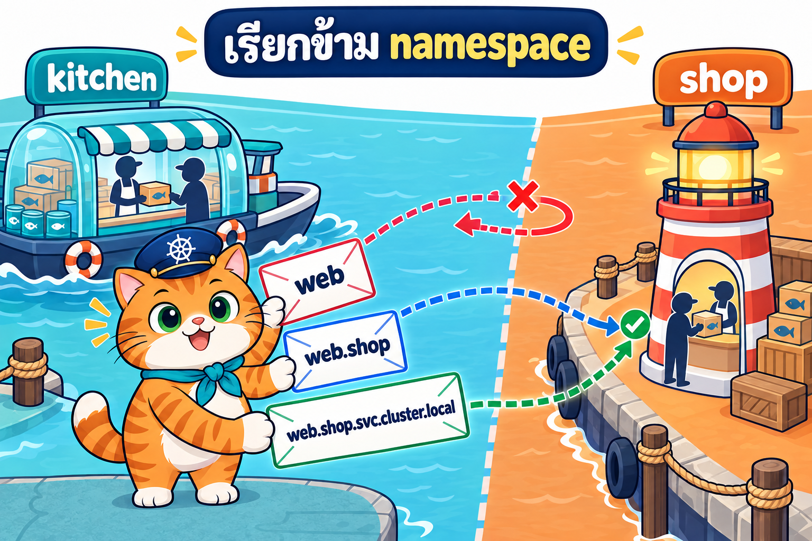<br>
  <em><b>รูปที่ 19</b> DNS ของ Service: ชื่อสั้น web ใช้ได้ใน namespace เดียวกัน ข้าม namespace ใช้ web.shop หรือชื่อเต็ม web.shop.svc.cluster.local (ต่อจากบท 004)</em>
</p>

CoreDNS (Service `kube-dns` ที่ `10.96.0.10`) สร้างระเบียน DNS ให้ทุก Service อัตโนมัติ

| ระเบียน | รูปแบบ | ตอบอะไร |
|---|---|---|
| A ของ Service ปกติ | `<svc>.<ns>.svc.cluster.local` | ClusterIP เช่น `web.shop.svc.cluster.local` → `10.96.55.132` |
| A ของ headless | `<svc>.<ns>.svc.cluster.local` | IP ของทุก Pod ที่ ready |
| CNAME ของ ExternalName | `<svc>.<ns>.svc.cluster.local` | ชื่อภายนอก เช่น `example.com` |
| SRV ของพอร์ตที่มีชื่อ | `_<ชื่อพอร์ต>._<protocol>.<svc>.<ns>.svc.cluster.local` | เลขพอร์ต + ชื่อ เช่น `_http._tcp.web-multi.shop.svc.cluster.local` (กล่าวถึง ไม่มีใน LAB) |

วิธีเรียกชื่อจาก Pod

| เรียกจาก | ชื่อที่ใช้ได้ | ผลจริง |
|---|---|---|
| namespace เดียวกัน (`shop`) | `web`, `web.shop`, `web.shop.svc.cluster.local` | LAB 2–5 ใช้ `http://web` |
| namespace อื่น (`kitchen`) | `web.shop` หรือชื่อเต็ม **ไม่ใช่** `web` | `wget http://web` → `wget: bad address 'web'` แต่ `http://web.shop` และชื่อเต็มได้หน้าเว็บ (LAB 9) |
| ที่ไหนก็ได้ | ชื่อเต็มลงท้ายจุด `web.shop.svc.cluster.local.` | ข้ามการเติม search domain ทั้งหมด (LAB 4 ได้ `web v1 from web-k2nk5`) |

### 9.2 resolv.conf: search domain และ ndots

<p align="center" id="fig-20">
  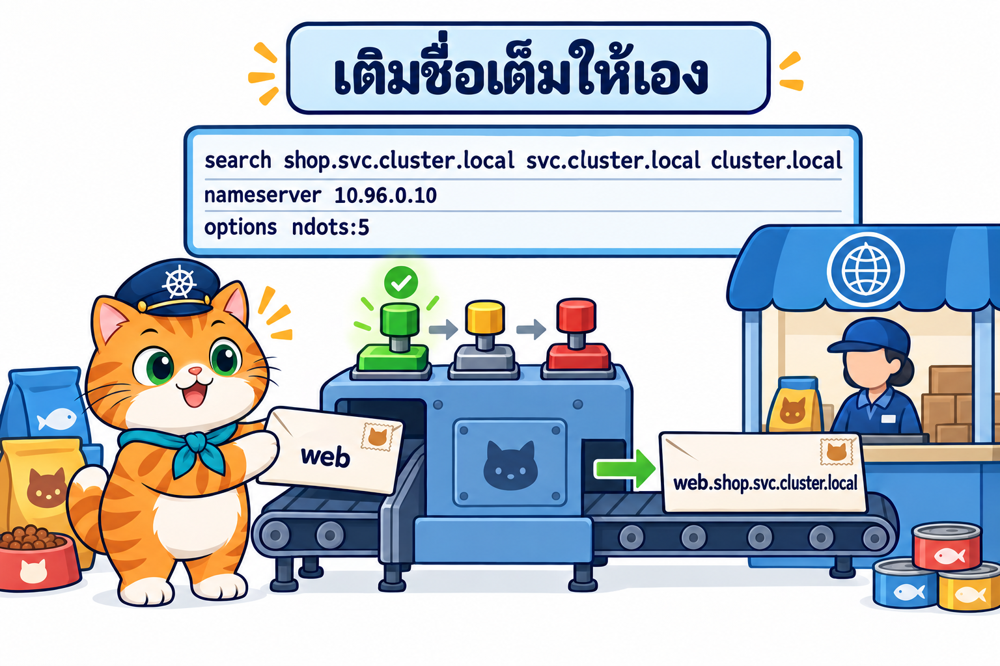<br>
  <em><b>รูปที่ 20</b> resolv.conf ของ Pod: ชื่อที่มีจุดน้อยกว่า 5 (ndots:5) จะถูกเติม search domain ทีละตัวตามลำดับ ชื่อสั้น web จึงกลายเป็น web.shop.svc.cluster.local แล้วถามที่ DNS 10.96.0.10</em>
</p>

ทำไมชื่อสั้น `web` จึงใช้ได้ในโซนเดียวกัน คำตอบอยู่ที่ `/etc/resolv.conf` ที่ kubelet เขียนให้ทุก Pod (ต่อจากบทที่ 4) ผลจริงจาก LAB 4 (Pod ใน `shop`) และ LAB 9 (Pod ใน `kitchen`)

```text
$ kubectl -n shop exec client -- cat /etc/resolv.conf
search shop.svc.cluster.local svc.cluster.local cluster.local
nameserver 10.96.0.10
options ndots:5

$ kubectl -n kitchen exec cook -- cat /etc/resolv.conf
search kitchen.svc.cluster.local svc.cluster.local cluster.local
nameserver 10.96.0.10
options ndots:5
```

- **`nameserver 10.96.0.10`** = ClusterIP ของ `kube-dns`
- **`search`** = รายการโดเมนที่จะเติมต่อท้ายชื่อ ตัวแรกคือ namespace ของ Pod เอง
- **`options ndots:5`** = ชื่อที่มีจุด **น้อยกว่า 5 จุด** จะถูกลองเติม search domain ทีละตัวก่อน แล้วค่อยถามชื่อตามที่พิมพ์

ดังนั้นใน Pod ของ `shop` ชื่อ `web` (0 จุด) จะถูกลองเป็น `web.shop.svc.cluster.local` ก่อน (เจอ) ส่วนชื่อ `web.shop` (1 จุด) จะได้ `web.shop.shop.svc.cluster.local` (ไม่เจอ) → `web.shop.svc.cluster.local` (เจอ) นี่คือเหตุผลที่ `web.shop` ใช้ได้จากทุกโซน ทั้งที่ `shop` ไม่ใช่โดเมนจริงบนอินเทอร์เน็ต ส่วน Pod ใน `kitchen` เรียก `web` แล้วได้ `web.kitchen.svc.cluster.local` ซึ่งไม่มี จึงเป็น `bad address`

ผลข้างเคียงของ `ndots:5` คือชื่อภายนอก เช่น `example.com` (1 จุด) จะถูกลองเติม search 3 รอบก่อนถามชื่อจริง ทำให้เกิดคำถาม DNS ที่ไม่จำเป็น ถ้าต้องการลดให้ใช้ชื่อเต็มลงท้ายจุด (`example.com.`)

**กับดักของ `nslookup` ใน busybox** (Pod `client`/`cook` ใช้ image `busybox:1.36`) ผลจริงจาก LAB 4

```text
$ kubectl -n shop exec client -- nslookup web
Server:		10.96.0.10
Address:	10.96.0.10:53

** server can't find web.cluster.local: NXDOMAIN

** server can't find web.cluster.local: NXDOMAIN

** server can't find web.svc.cluster.local: NXDOMAIN


Name:	web.shop.svc.cluster.local
Address: 10.96.55.132

** server can't find web.svc.cluster.local: NXDOMAIN

command terminated with exit code 1

$ kubectl -n shop exec client -- nslookup web.shop
...
** server can't find web.shop: NXDOMAIN
...
command terminated with exit code 1

$ kubectl -n shop exec client -- wget -qO- http://web.shop
web v1 from web-k2nk5
```

- `nslookup web` **หาเจอ** (`web.shop.svc.cluster.local → 10.96.55.132`) แต่เพราะ busybox ถามทุก search domain พร้อมกันแล้วพิมพ์ผลทุกตัว จึงมีบรรทัด `NXDOMAIN` ของโดเมนที่ไม่ตรงปน และจบด้วย exit code 1
- `nslookup web.shop` ได้ NXDOMAIN เพราะ `nslookup` ของ busybox ไม่เติม search domain ให้ชื่อที่มีจุด ทั้งที่ `wget http://web.shop` (ซึ่งใช้ resolver ปกติของระบบ) ใช้ได้
- **สรุป:** ทดสอบ DNS ด้วย `nslookup` ของ busybox ให้ใช้ **ชื่อเต็ม** `<svc>.<ns>.svc.cluster.local` เสมอ และทดสอบ "แอปเรียกได้จริงไหม" ด้วย `wget`

### 9.3 env var ของ Service

<p align="center" id="fig-21">
  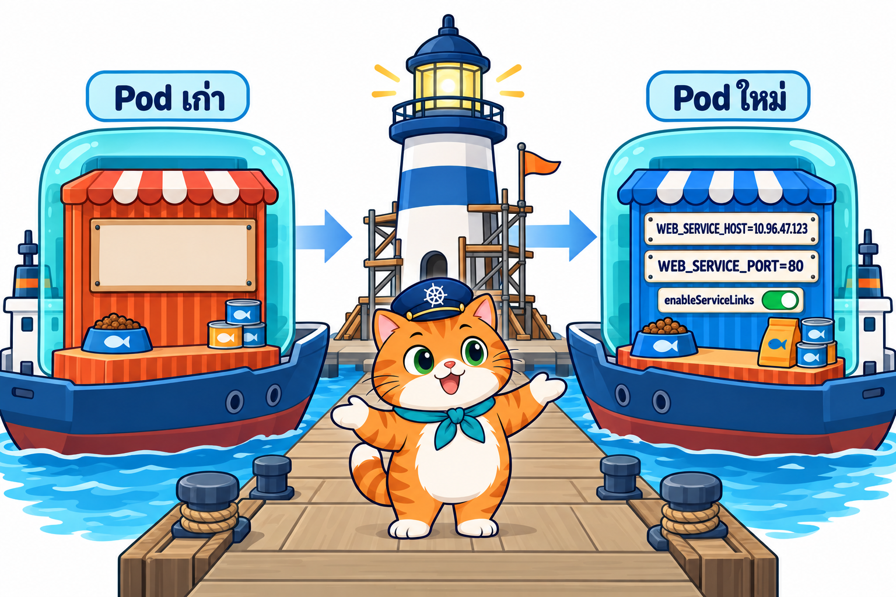<br>
  <em><b>รูปที่ 21</b> env var ของ Service (WEB_SERVICE_HOST/PORT) ถูกใส่ให้เฉพาะ Pod ที่สร้างหลัง Service — Pod เก่าไม่มี จึงควรใช้ DNS (ปิดได้ด้วย enableServiceLinks: false)</em>
</p>

นอกจาก DNS แล้ว kubelet ยังใส่ env var ของ Service ให้ Pod ด้วย (รูปแบบเดียวกับ docker link ยุคเก่า) ชื่อ Service ถูกแปลงเป็นตัวพิมพ์ใหญ่และ `-` เป็น `_` แต่มีเงื่อนไขสำคัญ 2 ข้อ

1. ใส่ให้เฉพาะ Pod ที่ **ถูกสร้างหลัง Service** (env ของ container ตั้งครั้งเดียวตอนเริ่ม)
2. ใส่ให้เฉพาะ Service ใน **namespace เดียวกัน** (และ Service `kubernetes` ของ `default`)

ผลจริงจาก LAB 4: `client` สร้างใน LAB 1 ก่อนมี Service จึงไม่มี env ของ `web` เลย ส่วน `client2` สร้างหลัง Service `web`, `web-alt`, `web-multi`

```text
$ kubectl -n shop exec client -- env | grep WEB_; echo "exit=$?"
exit=1

$ kubectl -n shop exec client2 -- env | grep WEB_ | sort
WEB_ALT_PORT=tcp://10.96.141.242:8080
...
WEB_ALT_SERVICE_HOST=10.96.141.242
WEB_ALT_SERVICE_PORT=8080
...
WEB_MULTI_SERVICE_HOST=10.96.28.97
WEB_MULTI_SERVICE_PORT=80
WEB_MULTI_SERVICE_PORT_ALT=8080
WEB_MULTI_SERVICE_PORT_HTTP=80
WEB_PORT=tcp://10.96.55.132:80
...
WEB_SERVICE_HOST=10.96.55.132
WEB_SERVICE_PORT=80
```

`WEB_MULTI_SERVICE_PORT_HTTP` และ `_ALT` มีเพราะพอร์ตของ `web-multi` มีชื่อ ส่วน `web` ไม่มี `WEB_SERVICE_PORT_HTTP` เพราะพอร์ตของ Service `web` ไม่ได้ตั้งชื่อ (ชื่อ `http` เป็นของ containerPort ไม่ใช่ของ Service)

เพราะลำดับการสร้างมีผลแบบนี้ **ควรใช้ DNS แทน env var** ถ้าไม่ต้องการ env เหล่านี้เลย (เช่น namespace ที่มี Service หลายร้อยตัวทำให้ env ยาวมาก) ปิดได้ด้วย

```yaml
spec:
  enableServiceLinks: false   # ไม่ใส่ env ของ Service อื่นให้ Pod นี้ (env ของ kubernetes ยังมี)
```

---

## 10. kube-proxy: ป้ายบอกทางบนเรือทุกลำ

### 10.1 kube-proxy แปลงปลายทางที่เรือต้นทาง

<p align="center" id="fig-22">
  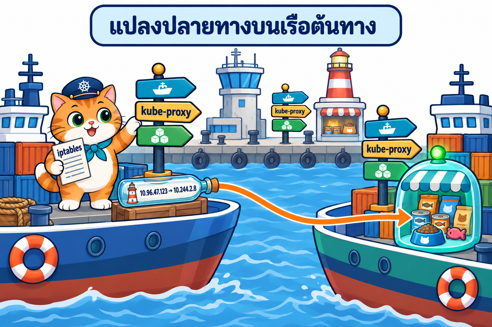<br>
  <em><b>รูปที่ 22</b> kube-proxy (โหมด iptables ใน kind) ติดตั้งป้ายบอกทางบนเรือทุกลำ: แพ็กเก็ตที่ส่งไป ClusterIP ถูกแปลงปลายทางเป็น IP ของ Pod ที่พร้อมตั้งแต่บนเรือต้นทาง</em>
</p>

**kube-proxy** คือโปรแกรมที่ทำให้ ClusterIP "ใช้ได้จริง" มันรันบน **ทุก Node** แล้วเขียนกฎในเคอร์เนลของ Node นั้น เมื่อ Pod ส่งแพ็กเก็ตไป `10.96.55.132:80` เคอร์เนลของ **Node ต้นทาง** จะเปลี่ยนปลายทางเป็น IP ของ Pod ตัวหนึ่ง เช่น `10.244.2.6:80` (เรียกว่า **DNAT** – Destination NAT) ก่อนแพ็กเก็ตออกจากเรือ จากนั้นแพ็กเก็ตเดินทางแบบ Pod-to-Pod ตามปกติ

ผลที่ตามมา

- ไม่มี "เครื่องประภาคาร" จริงที่แพ็กเก็ตต้องผ่าน จึงไม่มีคอขวดกลาง และ Service ไม่ล่มเพราะเครื่องใดเครื่องหนึ่งล่ม
- การตัดสินใจว่าจะไป Pod ไหนเกิดที่ Node ต้นทางทุกครั้งที่เปิด connection ใหม่ (หัวข้อ 11)
- NetworkPolicy ที่ Pod ปลายทางเห็นพอร์ตที่แปลงแล้ว (หัวข้อ 14)

### 10.2 kube-proxy เป็น DaemonSet ที่ watch API

<p align="center" id="fig-23">
  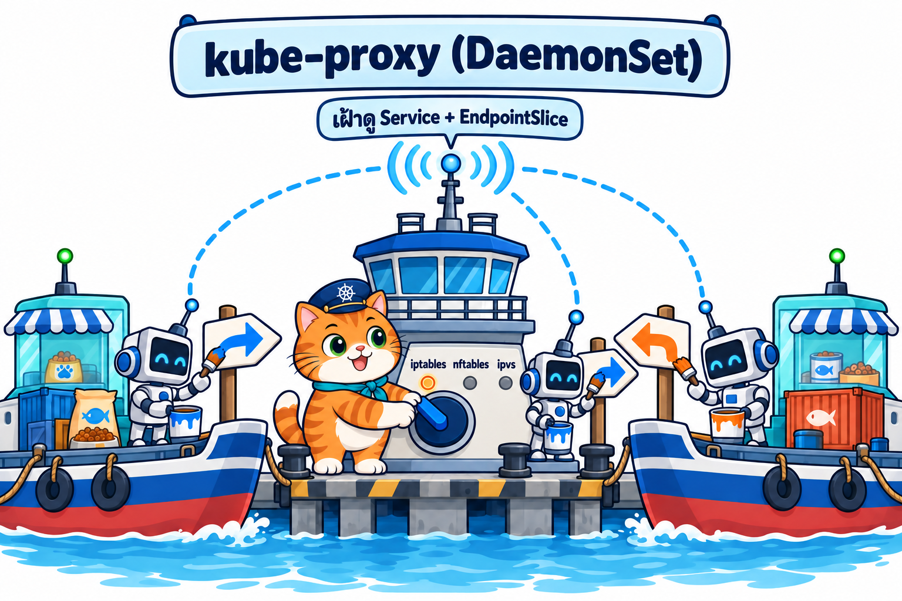<br>
  <em><b>รูปที่ 23</b> kube-proxy เป็น DaemonSet (1 ตัวต่อ Node) ที่ watch Service + EndpointSlice จาก API server แล้วเขียนกฎ; kind ใช้ mode iptables, โหมดอื่นคือ nftables และ ipvs</em>
</p>

kube-proxy ถูกติดตั้งเป็น **DaemonSet** ใน `kube-system` (1 Pod ต่อ Node) ผลจริงจาก LAB 0

```text
$ kubectl -n kube-system get ds kube-proxy
NAME         DESIRED   CURRENT   READY   UP-TO-DATE   AVAILABLE   NODE SELECTOR            AGE
kube-proxy   3         3         3       3            3           kubernetes.io/os=linux   4m56s

$ kubectl -n kube-system get cm kube-proxy -o yaml | grep mode
    mode: iptables
```

kube-proxy แต่ละตัว **watch Service และ EndpointSlice** จาก API server (ไม่ได้ watch Pod โดยตรง) เมื่อรายชื่อเปลี่ยนก็เขียนกฎใหม่ ช่วงเวลาสั้น ๆ ระหว่าง "EndpointSlice เปลี่ยน" กับ "kube-proxy ทุก Node เขียนกฎเสร็จ" คือที่มาของอาการที่เห็นใน LAB เช่น Service ที่เพิ่งสร้างตอบ `Connection refused` ใน ~1 วินาทีแรก หรือ NodePort ที่เพิ่งลบยังตอบได้อีก ~1 วินาที

| โหมด | กลไก | หมายเหตุ |
|---|---|---|
| **iptables** | chain ของ iptables ต่อ Service (`KUBE-SVC-...`) และต่อ endpoint (`KUBE-SEP-...`) เลือก endpoint ด้วยความน่าจะเป็น (`--probability`) | โหมดที่ kind ของเราใช้ |
| **nftables** | กฎ nftables ซึ่งเป็นระบบใหม่ที่มาแทน iptables ใน Linux ขยายได้ดีกว่าเมื่อมี Service จำนวนมาก | GA ตั้งแต่ Kubernetes v1.33 |
| **ipvs** | ใช้ IPVS ของเคอร์เนล มีอัลกอริทึมกระจายโหลดให้เลือก | โหมดทางเลือกที่ใช้ในบางคลัสเตอร์ |

(ทางเลือก ไม่บังคับ) ผู้ที่อยากเห็นกฎจริงลองสั่งใน k8s-lab ขณะที่มี Service `web` ใน `shop` อยู่: `docker exec lab-worker iptables-save | grep 'shop/web'` จะเห็นบรรทัดที่อ้าง chain `KUBE-SVC-...`/`KUBE-SEP-...` (เอกสารนี้ไม่ได้แสดงผล เพราะชื่อ chain ต่างกันทุกคลัสเตอร์)

---

## 11. การกระจายโหลด

### 11.1 สุ่มต่อ connection ไม่ใช่วนตามลำดับ

<p align="center" id="fig-24">
  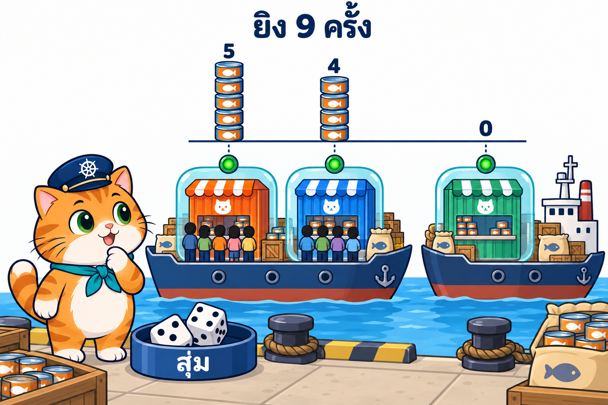<br>
  <em><b>รูปที่ 24</b> kube-proxy (iptables) เลือก Pod แบบสุ่มต่อ connection ไม่ใช่วนตามลำดับ ยิง 9 ครั้งอาจได้ 5/4/0 (pre-check) — ต้องยิงหลายครั้งถึงเห็นภาพรวม</em>
</p>

ในโหมด iptables kube-proxy เลือก endpoint **แบบสุ่มต่อ connection** ไม่ใช่ round-robin และไม่ใช่ต่อ request การยิงจำนวนน้อยจึงอาจไม่กระจายเลย ผลจากการตรวจก่อนเขียนบท: ยิง ClusterIP 9 ครั้งได้ **5/4/0** (Pod ตัวที่สามไม่ได้สักครั้ง) และยิง NodePort 12 ครั้งได้ 5/5/2 ส่วนผลจริงจาก LAB 5 ยิง 30 ครั้ง (busybox `wget` เปิด connection ใหม่ทุกครั้ง) 2 รอบติดกัน

```text
$ kubectl -n shop exec client -- sh -c 'for i in $(seq 30); do wget -qO- http://web; done' | sort | uniq -c
      4 web v1 from web-gsgss
     14 web v1 from web-k2nk5
     12 web v1 from web-mgz49
$ (รอบที่ 2)
      8 web v1 from web-gsgss
      9 web v1 from web-k2nk5
     13 web v1 from web-mgz49
```

ได้ทุก Pod แต่ไม่เท่ากันและแต่ละรอบต่างกัน ต้องยิงหลายสิบครั้งจึงเห็นภาพรวมว่ากระจายจริง

### 11.2 keep-alive: browser ติดบูธเดิม

<p align="center" id="fig-25">
  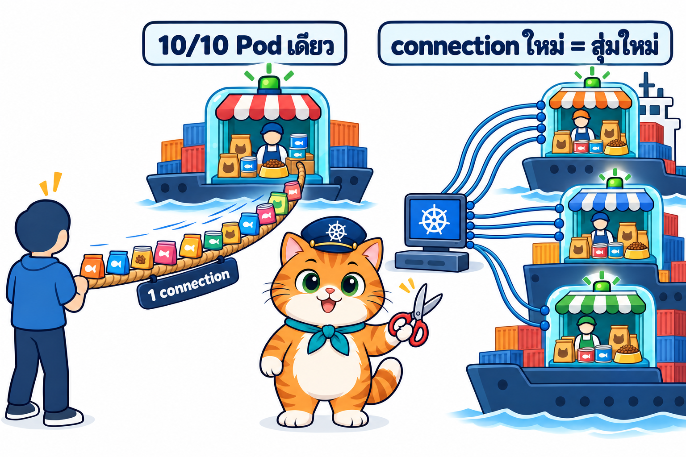<br>
  <em><b>รูปที่ 25</b> keep-alive: browser ใช้ connection เดิมส่งหลายคำขอ จึงไปบูธเดิมทุกครั้ง (pre-check Chromium 10/10) การสุ่มเกิดเมื่อเปิด connection ใหม่เท่านั้น</em>
</p>

browser และ HTTP client สมัยใหม่ใช้ **keep-alive** คือเปิด connection เดียวแล้วส่งหลาย request ต่อกัน เนื่องจาก kube-proxy ตัดสินใจ **ตอนเปิด connection** ทุก request ใน connection เดียวกันจึงไปบูธเดิม ผลจริงจาก LAB 8 (Chromium เปิด NodePort 30080 จากนอก container)

| การทดลอง | ผล |
|---|---|
| เปิดหน้า + กด reload 9 ครั้ง (รวม 10) | `web v1 from web-k2nk5` ทั้ง 10 ครั้ง |
| `fetch()` 10 ครั้งในหน้าเดิม | Pod เดียวทั้ง 10 ครั้ง |
| เปิด browser context ใหม่ทุกครั้ง (คล้าย Incognito/ปิดเปิด browser) 5 ครั้ง | 2 ชื่อ (3 + 2) เปลี่ยนได้แต่ยังสุ่ม |
| `curl` หลาย URL ในคำสั่งเดียว (connection เดียว) 10 ครั้ง | Pod เดียว 10/10 และ curl แสดง `Re-using existing connection` |
| `curl` แยกคำสั่ง 30 ครั้ง (connection ใหม่ทุกครั้ง) | `7/8/15` กระจายครบ 3 Pod |

ดังนั้น **refresh browser แล้วเห็นชื่อ Pod เดิม ไม่ได้แปลว่ามี Pod เดียว** ถ้าจะดูการกระจายให้ใช้ `curl`/`wget` วนทีละคำสั่ง (LAB 10 มีสคริปต์ `hit.sh` ที่ทำแบบนี้)

### 11.3 sessionAffinity: บัตรสมาชิก

<p align="center" id="fig-26">
  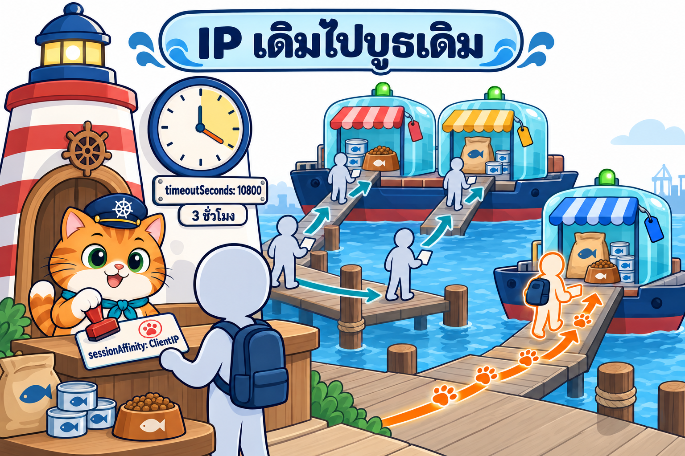<br>
  <em><b>รูปที่ 26</b> sessionAffinity: ClientIP ให้คำขอจาก IP เดิมไปบูธเดิม (timeoutSeconds ค่าเริ่มต้น 10800 = 3 ชั่วโมง); externalTrafficPolicy/internalTrafficPolicy: Local กล่าวถึง</em>
</p>

บางแอปต้องการให้ลูกค้าคนเดิมไปบูธเดิม (เช่น เก็บตะกร้าสินค้าไว้ในหน่วยความจำของ Pod) ตั้งได้ด้วย

```yaml
spec:
  sessionAffinity: ClientIP
  sessionAffinityConfig:
    clientIP:
      timeoutSeconds: 10800   # ค่าเริ่มต้น 3 ชั่วโมง
```

ผลจริงจาก LAB 5 (`kubectl patch` เปลี่ยนเป็น `ClientIP`): ลูกค้า `client` ไป `web-k2nk5` ครบ 30/30 ส่วน `client2` (คนละ IP) ไป `web-mgz49` ครบ 30/30 และค่าเริ่มต้นที่ API เติมให้คือ `{"clientIP":{"timeoutSeconds":10800}}` เมื่อ patch กลับเป็น `None` ฟิลด์ `sessionAffinityConfig` หายไปเองและการกระจายกลับมา (`9/11/10`)

ข้อเสียของ `ClientIP`: ลูกค้าหลายคนที่อยู่หลังเครื่อง NAT เดียวกัน (เช่น ทั้งมหาวิทยาลัยออกอินเทอร์เน็ตด้วย IP เดียว) จะไปบูธเดียวกันหมด และถ้าบูธนั้นหายไปลูกค้าก็ต้องย้ายอยู่ดี ทางที่ดีกว่าคือเก็บ session ไว้นอก Pod (ฐานข้อมูล/แคช) แล้วปล่อยให้กระจายตามปกติ

**ข้อควรรู้เพิ่มเติม (ไม่มีใน LAB):**

- `externalTrafficPolicy: Local` (สำหรับ NodePort/LoadBalancer) ส่งลูกค้าที่เข้าประตูของ Node ไหน ไปเฉพาะ Pod บน Node นั้น ข้อดีคือรักษา IP ต้นทางของลูกค้าไว้และไม่ข้ามเรือ ข้อเสียคือ Node ที่ไม่มี Pod จะไม่รับลูกค้า (ในคลัสเตอร์ของเรา NodePort เข้าทาง control plane ที่ไม่มี Pod จึงห้ามใช้)
- `internalTrafficPolicy: Local` ทำแบบเดียวกันสำหรับลูกค้าในคลัสเตอร์ (ค่าเริ่มต้นของทั้งสองคือ `Cluster`)

---

## 12. readinessProbe กับ endpoints

### 12.1 บูธไฟแดงยังอยู่ในรายชื่อ แต่ไม่ได้ลูกค้า

<p align="center" id="fig-27">
  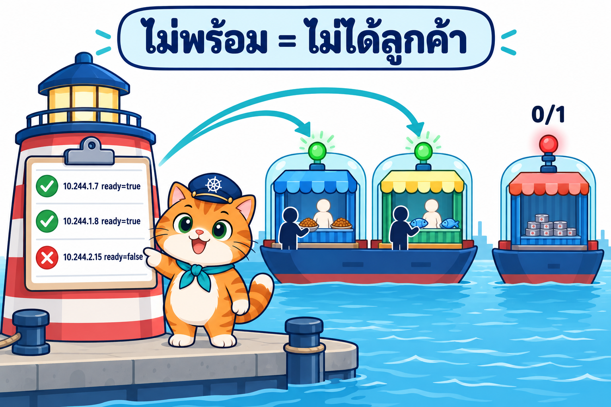<br>
  <em><b>รูปที่ 27</b> readinessProbe กับ endpoints: บูธไฟแดงยังอยู่ในรายชื่อแต่ ready=false จึงไม่ได้ลูกค้า (คอลัมน์ ENDPOINTS ยังแสดง IP ครบ — ต้องดู conditions)</em>
</p>

**readinessProbe** (บทที่ 2) คือไฟเขียวหน้าบูธ ในบทนี้มันมีผลโดยตรงกับ Service

- Pod ที่ **ไม่ ready** (READY `0/1`) ยังอยู่ใน EndpointSlice แต่ endpoint ของมันมี `conditions.ready: false`
- kube-proxy ส่งลูกค้าไปเฉพาะ endpoint ที่ `ready: true`
- เมื่อ probe ผ่านอีกครั้ง `ready` กลับเป็น `true` และบูธได้ลูกค้าอีกโดยไม่ต้องทำอะไร

**กับดักสำคัญ:** คอลัมน์ ENDPOINTS ของ `kubectl get endpointslice` **ยังแสดง IP ของ Pod ที่ไม่ ready** ด้วย ผลจริงจาก LAB 6 หลังลบไฟล์ `index.html` ใน Pod `web-gsgss` (nginx ตอบ 403 → probe ล้ม)

```text
$ kubectl -n shop get pods
NAME        READY   STATUS    RESTARTS   AGE
...
web-gsgss   0/1     Running   0          3m7s
web-k2nk5   1/1     Running   0          4m4s
web-mgz49   1/1     Running   0          4m33s

$ kubectl -n shop get endpointslice -l kubernetes.io/service-name=web
NAME        ADDRESSTYPE   PORTS   ENDPOINTS                          AGE
web-5r58w   IPv4          80      10.244.1.4,10.244.2.6,10.244.1.5   3m44s

$ kubectl -n shop get endpointslice -l kubernetes.io/service-name=web -o jsonpath='{range .items[0].endpoints[*]}{.addresses[0]} {.targetRef.name} ready={.conditions.ready}{"\n"}{end}'
10.244.1.4 web-mgz49 ready=true
10.244.2.6 web-k2nk5 ready=true
10.244.1.5 web-gsgss ready=false

$ kubectl -n shop exec client -- sh -c 'for i in $(seq 30); do wget -qO- http://web; done' | sort | uniq -c
     19 web v1 from web-k2nk5
     11 web v1 from web-mgz49
```

ENDPOINTS ยังมี `10.244.1.5` แต่ `ready=false` และยิง 30 ครั้งไม่ไป `web-gsgss` เลยสักครั้ง สาเหตุดูได้จาก Event ของ Pod

```text
Warning  Unhealthy  0s (x13 over 22s)  kubelet  spec.containers{nginx}: Readiness probe failed: HTTP probe failed with statuscode: 403
```

ระยะเวลาก่อนบูธถูกถอดจากการรับลูกค้าขึ้นกับ `periodSeconds × failureThreshold` ในการทดลอง (`periodSeconds: 2`, `failureThreshold` ค่าเริ่มต้น 3) `ready=false` ปรากฏหลังลบไฟล์ประมาณ **7 วินาที** และเมื่อคืนไฟล์ Pod กลับมา Ready ในราว 1 วินาที

### 12.2 endpoint ของ Pod ที่กำลังปิด

<p align="center" id="fig-28">
  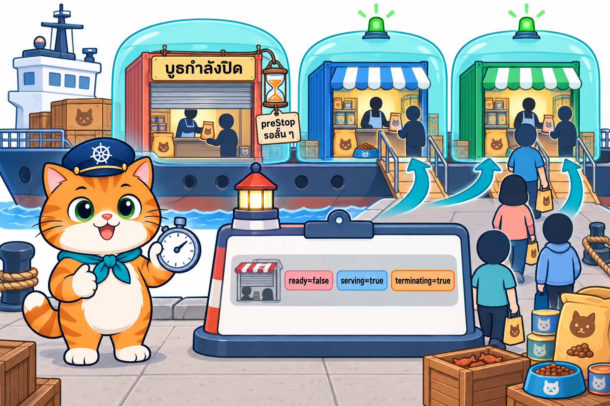<br>
  <em><b>รูปที่ 28</b> endpoint ของ Pod ที่กำลังปิด: ready=false, serving=true, terminating=true → ไม่ได้ลูกค้าใหม่; ช่วงที่ kube-proxy ทุกเรือยังอัปเดตไม่ทัน อาจมีคำขอหลุด → หลักการ preStop รอสั้น ๆ (ลงมือในบท 007)</em>
</p>

เมื่อ Pod ถูกลบ (เช่น ลบด้วยมือ หรือ ReplicaSet scale ลง) endpoint ของมันไม่ได้หายทันที แต่เปลี่ยนสถานะตามเอกสารของ Kubernetes เป็น

| condition | ความหมาย | Pod ที่กำลังปิด |
|---|---|---|
| `ready` | พร้อมรับลูกค้าใหม่ | `false` |
| `serving` | ยังตอบได้อยู่ (ไม่สนว่ากำลังปิด) | `true` ถ้ายังผ่าน readinessProbe |
| `terminating` | กำลังถูกปิด | `true` |

kube-proxy หยุดส่ง connection **ใหม่** ไปที่ endpoint ที่ `ready=false` แต่ปัญหาคือขั้นตอนเกิดขึ้น **พร้อมกันหลายที่** kubelet ส่ง SIGTERM ให้ container ขณะที่ EndpointSlice controller อัปเดตรายชื่อ และ kube-proxy บนทุก Node ต้องเขียนกฎใหม่ ในช่วงสั้น ๆ ที่กฎบางเรือยังไม่อัปเดต connection ใหม่อาจยังไปถึง Pod ที่กำลังปิด ลูกค้าจึงเห็น error

ผลจริงจาก LAB 10 เมื่อลบ Pod web 1 ตัว (จาก 5 ตัว) ระหว่างยิง 100 ครั้ง: 5 รอบได้ err **1, 0, 1, 0, 0** ข้อความคือ `curl: (56) Recv failure: Connection reset by peer` และระหว่างนั้น `kubectl get pods -w` เห็น Pod Next.js ที่ถูกลบขึ้นสถานะ `Error` ชั่วครู่ก่อนหาย (process ออกด้วย exit code ไม่เป็น 0 ตอนรับ SIGTERM ไม่ใช่ความผิดพลาดของ LAB)

หลักการแก้คือให้ Pod **รอสั้น ๆ ก่อนปิดจริง** (hook `preStop`) เพื่อให้ kube-proxy ทุกเรืออัปเดตทัน แล้วแอปค่อยปิดแบบ graceful ในการตรวจก่อนเขียนบท (ร้าน nginx ถูกเปลี่ยนรุ่นขณะยิง 5 ครั้งต่อวินาที) ไม่มี preStop เกิด error 3 จาก 150 ครั้ง เมื่อใส่ preStop รอ 5 วินาที error ลดเหลือ 1/150, 0/200 และ 0/200 **การลงมือใส่ preStop และการเปลี่ยนรุ่นแบบไม่สะดุดเป็นเนื้อหาของบทที่ 7**

### 12.3 readiness กับ liveness ไม่ควรพึ่งสิ่งเดียวกัน

ร้านน้องส้มรุ่น 1.2 ใน LAB 10 แยก probe เป็น 2 endpoint

| probe | endpoint | ตรวจอะไร | ถ้าล้ม |
|---|---|---|---|
| readinessProbe | `/api/health` | ต่อ db ได้ไหม (`SELECT 1`) | Service ไม่ส่งลูกค้ามา (Pod ไม่ถูก restart) |
| livenessProbe | `/api/live` | process ยังตอบได้ (ไม่แตะ db) | kubelet restart container |

ถ้าให้ liveness พึ่ง db ด้วย เมื่อ db ล่มชั่วคราว web ทุก Pod จะถูก restart พร้อมกันโดยไม่จำเป็น และ `/api/health` ก็ตั้งใจ **ไม่ตรวจว่ามีตารางสินค้า** เพราะตอน db ใหม่ยังว่าง ถ้าทุก Pod not ready พร้อมกัน Service จะไม่มี endpoint ที่ ready เลย ลูกค้าจะเข้าร้านไม่ได้แม้แต่หน้าแจ้งเตือน (LAB 10 จึงเห็นหน้า 503 "ร้านกำลังเตรียมสินค้า" แทน)

---

## 13. debug Service ทีละขั้น

### 13.1 บันได 7 ขั้น

<p align="center" id="fig-29">
  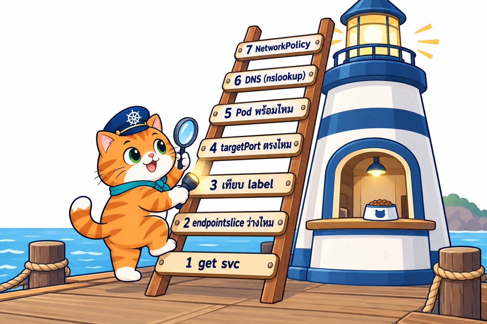<br>
  <em><b>รูปที่ 29</b> ไล่ debug Service ทีละขั้น: get svc → get endpointslice ว่างไหม → เทียบ label → targetPort → Pod ready → DNS → ข้าม namespace/NetworkPolicy</em>
</p>

เมื่อเรียก Service แล้วไม่ได้ ให้ไล่ทีละขั้นจากบนลงล่าง อย่าข้ามไปแก้แอปทันที

| ขั้น | ตรวจอะไร | คำสั่ง | ถ้าผิดจะเห็น |
|:---:|---|---|---|
| 1 | Service มีอยู่ ชนิด/พอร์ตถูกไหม | `kubectl -n <ns> get svc <svc>` / `describe svc <svc>` | `NotFound`, PORT(S) ไม่ตรงที่เรียก |
| 2 | มี endpoint ไหม | `kubectl -n <ns> get endpointslice -l kubernetes.io/service-name=<svc>` | `PORTS <unset>  ENDPOINTS <unset>` |
| 3 | selector ตรงกับ label ของ Pod ไหม | `describe svc` (บรรทัด `Selector:`) เทียบ `get pods --show-labels` | label ไม่ตรง ตัวสะกดผิด |
| 4 | targetPort ตรงพอร์ตที่แอปฟังไหม | `describe svc` (บรรทัด `TargetPort:`/`Endpoints:`) เทียบ `containerPort` | มี endpoint แต่ `Connection refused` |
| 5 | Pod ready ไหม | `get pods` (READY) และ jsonpath `conditions.ready` | `0/1`, `ready=false` |
| 6 | ชื่อ DNS ถูกไหม | `nslookup <svc>.<ns>.svc.cluster.local` | `bad address`, NXDOMAIN |
| 7 | ข้าม namespace / NetworkPolicy | ใช้ `<svc>.<ns>`, `kubectl get netpol -A` | `bad address` (ลืม namespace), `download timed out` (ถูกรั้วกั้น) |

### 13.2 selector พิมพ์ผิด

<p align="center" id="fig-30">
  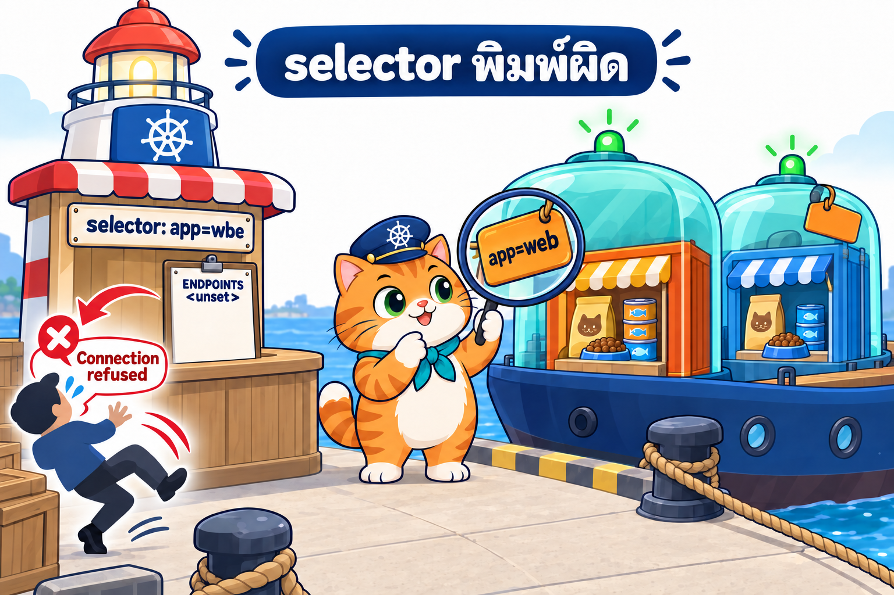<br>
  <em><b>รูปที่ 30</b> Service ที่ selector พิมพ์ผิด: ไม่มีบูธไหนตรง EndpointSlice ว่าง เรียกแล้ว Connection refused — ตรวจด้วย get endpointslice, เทียบ label ของ Pod</em>
</p>

ไฟล์ `labs/lab07-debug/web-typo-svc.yaml` ตั้ง `selector: {app: wbe}` (สลับตัวอักษร) ผลจริงจาก LAB 7

```text
$ kubectl -n shop exec client -- wget -qO- -T 3 http://web-typo
wget: can't connect to remote host (10.96.237.174): Connection refused
command terminated with exit code 1

$ kubectl -n shop get endpointslice -l kubernetes.io/service-name=web-typo
NAME             ADDRESSTYPE   PORTS     ENDPOINTS   AGE
web-typo-rsdpj   IPv4          <unset>   <unset>     4s

$ kubectl -n shop describe svc web-typo | grep -E "Selector|Endpoints"
Selector:                 app=wbe
Endpoints:                
```

DNS หาเจอ (ได้ ClusterIP `10.96.237.174`) แต่ไม่มีบูธไหนตรง selector เมื่อ Service **ไม่มี endpoint** kube-proxy ใส่กฎ "ปฏิเสธ" ไว้ ลูกค้าจึงได้ `Connection refused` ทันที แก้ด้วย `kubectl -n shop patch svc web-typo -p '{"spec":{"selector":{"app":"web"}}}'` แล้ว EndpointSlice มี 3 IP ภายในไม่กี่วินาที (selector ของ Service แก้ได้ ต่างจาก ReplicaSet)

### 13.3 targetPort ผิด

<p align="center" id="fig-31">
  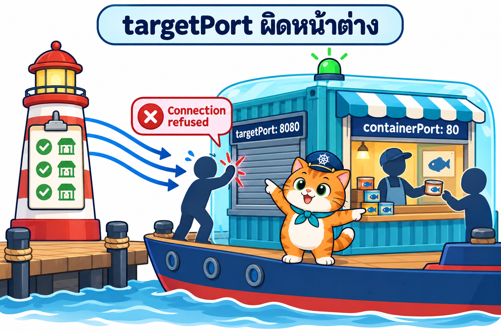<br>
  <em><b>รูปที่ 31</b> targetPort ผิด: EndpointSlice มีรายชื่อครบ แต่ส่งลูกค้าไปหน้าต่างที่ไม่มีใครเปิด (container ฟัง 80 แต่ targetPort 8080) จึงถูกปฏิเสธ</em>
</p>

ไฟล์ `labs/lab07-debug/web-badport-svc.yaml` ตั้ง `targetPort: 8080` ทั้งที่ nginx ฟังพอร์ต 80 ผลจริงจาก LAB 7

```text
$ time kubectl -n shop exec client -- wget -qO- -T 3 http://web-badport
wget: can't connect to remote host (10.96.234.49): Connection refused
command terminated with exit code 1

real	0m0.061s

$ kubectl -n shop get endpointslice -l kubernetes.io/service-name=web-badport
NAME                ADDRESSTYPE   PORTS   ENDPOINTS                          AGE
web-badport-cqhnf   IPv4          8080    10.244.1.5,10.244.1.4,10.244.2.6   22s

$ kubectl -n shop describe svc web-badport | grep -E "TargetPort|Endpoints"
TargetPort:               8080/TCP
Endpoints:                10.244.1.5:8080,10.244.1.4:8080,10.244.2.6:8080
```

ครั้งนี้ **มี endpoint ครบ 3 ตัว** (selector ถูก) แต่ kube-proxy ส่งไปพอร์ต 8080 ของ Pod ซึ่งไม่มีโปรแกรมฟังอยู่ Pod จึงปฏิเสธทันที (0.06 วินาที) แก้ด้วยการเปลี่ยน `targetPort` เป็น `http` (ชื่อพอร์ต) แล้ว PORTS กลับเป็น `80`

### 13.4 แผนที่ข้อความ error

| ข้อความ (busybox wget / curl) | ความหมายที่พบใน LAB | ขั้นที่ต้องดู |
|---|---|---|
| `wget: bad address 'wbe'` | DNS หาชื่อไม่เจอ (พิมพ์ผิด หรือเรียกชื่อสั้นข้าม namespace) | 6, 7 |
| `can't connect to remote host (<ClusterIP>): Connection refused` | Service ไม่มี endpoint ที่ ready, targetPort ผิด หรือกฎเพิ่งถูกสร้าง (~1 วินาทีแรก) | 2–5 |
| `wget: download timed out` | พอร์ตที่ Service ไม่ได้ประกาศ, NetworkPolicy กั้น หรือเรียก Pod IP ที่ไม่มีแล้ว | 1, 7 |
| `curl: (56) Recv failure: Connection reset by peer` | connection ถูกตัดกลางทาง เช่น Pod ปลายทางกำลังถูกลบ หรือ NodePort เพิ่งถูกลบ | 12.2 |
| `curl: (28) Operation timed out` | ไม่ได้คำตอบภายในเวลาที่กำหนด (LAB 10 เจอตอนลบ Pod ทั้งหมดพร้อมกัน) | 12.2, 15 |
| `curl: (7) Failed to connect ... Couldn't connect to server` | ไม่มีโปรแกรมรับที่พอร์ตนั้นเลย (เช่น ลบ Service NodePort แล้ว) | 1 |

---

## 14. NetworkPolicy กับ Service

<p align="center" id="fig-32">
  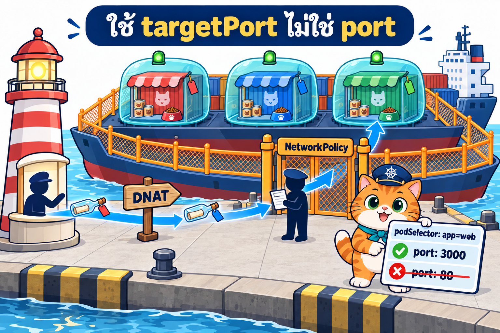<br>
  <em><b>รูปที่ 32</b> NetworkPolicy เลือก Pod ไม่ใช่ Service และถูกตรวจหลัง kube-proxy แปลงปลายทาง (DNAT) แล้ว → พอร์ตใน policy ต้องเป็น targetPort ของ Pod ไม่ใช่ port ของ Service (ต่อจากบท 004)</em>
</p>

บทที่ 4 เราใช้ NetworkPolicy สร้างรั้วรอบ Pod บทนี้มีกับดักเพิ่มเมื่อเรียกผ่าน Service

1. NetworkPolicy เลือก **Pod** (`podSelector`) ไม่ได้เลือก Service ไม่มีฟิลด์ไหนอ้างชื่อ Service
2. NetworkPolicy ถูกตรวจที่ Pod ปลายทาง **หลัง** kube-proxy แปลงปลายทาง (DNAT) แล้ว แพ็กเก็ตที่มาถึงจึงเป็น `<Pod IP>:<targetPort>` ไม่ใช่ `<ClusterIP>:<port>`
3. ดังนั้น `ports` ใน policy ต้องเป็น **พอร์ตของ Pod (targetPort/containerPort)** ไม่ใช่ `port` ของ Service

ตัวอย่างจาก LAB 9: Service `web-alt` รับที่ 8080 ส่งต่อไป 80 ไฟล์ `labs/lab09-cross-ns/np-kitchen-8080.yaml` (ตั้งใจผิด)

```yaml
# LAB 9 (ตั้งใจผิด): อนุญาตครัวเข้า web "พอร์ต 8080" (= port ของ Service web-alt)
# NetworkPolicy ตรวจที่ Pod ปลายทาง "หลัง" kube-proxy แปลงที่อยู่แล้ว → เห็นพอร์ต 80 ของ Pod ไม่ใช่ 8080
# ผล: ครัวถูกกั้น (timed out)
apiVersion: networking.k8s.io/v1
kind: NetworkPolicy
metadata:
  name: web-from-kitchen
  namespace: shop
spec:
  podSelector:
    matchLabels:
      app: web             # policy เลือก "Pod" ไม่ใช่ Service
  policyTypes: ["Ingress"]
  ingress:
    - from:
        - namespaceSelector:
            matchLabels:
              team: kitchen
      ports:
        - port: 8080       # ← ผิด: ต้องใช้พอร์ตของ Pod (targetPort)
```

ผลจริง: `cook` ใน `kitchen` เรียก `http://web-alt.shop:8080` ได้ `wget: download timed out` เมื่อลบแล้วใช้ `np-kitchen-80.yaml` (เปลี่ยนเป็น `port: 80`) `web-alt.shop:8080` และ `web.shop` กลับมาใช้ได้

ผลข้างเคียงที่ต้องรู้: ทันทีที่มี NetworkPolicy เลือก Pod `app=web` Pod นั้นถูก "ปิดรั้ว" และรับเฉพาะที่ policy อนุญาต ใน LAB 9 แม้แต่ `client` ใน `shop` เอง (ซึ่งไม่ได้อยู่ใน `kitchen`) ก็เรียก `http://web` ได้ `download timed out` ด้วย ถ้าต้องการให้ Pod ในโซนเดียวกันเข้าได้ต้องเพิ่มกฎอนุญาตเอง (แบบ `allow-same-namespace` ของบทที่ 4)

> **ข้อควรระวังกับ NodePort:** ลูกค้าที่เข้ามาทาง NodePort (นโยบาย `externalTrafficPolicy: Cluster` ค่าเริ่มต้น) อาจถูกแปลง IP ต้นทางเป็น IP ของ Node ระหว่างทาง policy ที่อนุญาตด้วย `namespaceSelector` หรือ `podSelector` อย่างเดียวจึงอาจกั้นลูกค้า NodePort ไปด้วย ต้องเพิ่ม `ipBlock` ที่ครอบคลุมต้นทางเหล่านั้นเมื่อจำเป็น (ไม่มีใน LAB)

---

## 15. ข้อจำกัดที่ Service ยังไม่ช่วย

<p align="center" id="fig-33">
  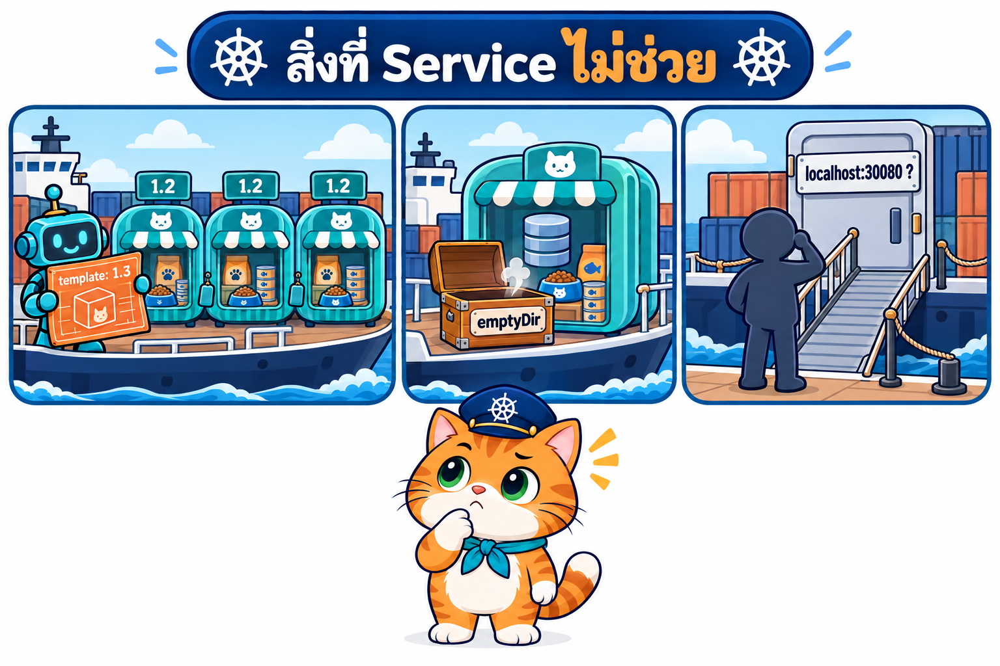<br>
  <em><b>รูปที่ 33</b> สิ่งที่ Service ไม่ช่วย: (1) แก้ template ของ ReplicaSet เป็นรุ่นใหม่แล้วบูธเดิมไม่เปลี่ยน (2) ฐานข้อมูลบน emptyDir หายเมื่อ Pod db เกิดใหม่ (3) ลูกค้าภายนอกยังต้องจำเลขประตู ไม่มีชื่อโดเมน</em>
</p>

LAB 10 แยกร้านน้องส้มเป็น **2 ReplicaSet + 2 Service** (`som-db` ClusterIP และ `som-web` NodePort 30080) ใน namespace `som-shop` แก้ปัญหาของบทที่ 5 ได้ครบ: ทุกบูธใช้ db กลางตัวเดียวผ่านชื่อ `som-db` ออเดอร์จึงตรงกันทุกบูธ ลบ Pod db แล้ว IP ของ db เปลี่ยน (`10.244.2.21 → 10.244.2.26`) แต่ ClusterIP ของ `som-db` ยังเป็น `10.96.93.105` เดิม web จึงต่อใหม่ได้เองโดยไม่ต้อง restart และลูกค้าเปิด `http://localhost:30080` ได้ตรง ๆ แต่ยังเหลือปัญหา 3 ข้อที่ Service ไม่ได้ออกแบบมาแก้

**1. เปลี่ยนรุ่นต้องลบ Pod เอง และร้านสะดุด** ผลจริงจาก LAB 10

```text
$ kubectl -n som-shop set image rs/som-web web=som-shop-web:1.3 db-seed=som-shop-web:1.3
replicaset.apps/som-web image updated

$ kubectl -n som-shop get pods -l app=som-web -o custom-columns=NAME:.metadata.name,IMAGE:.spec.containers[0].image
NAME            IMAGE
som-web-lm7jj   som-shop-web:1.2
som-web-n5vw6   som-shop-web:1.2
som-web-zr5pd   som-shop-web:1.2
```

template ของ ReplicaSet เป็น 1.3 แล้ว แต่ Pod เดิมยังเป็น 1.2 ทั้งหมด (ทบทวนบทที่ 5: ReplicaSet ดูแลแค่ "จำนวน") น้องส้มต้องลบ Pod เอง

| วิธีลบ | ผลที่ลูกค้าเห็น (ผลจริง) |
|---|---|
| ลบทีละตัว แล้วรอ Ready เอง | ลูกค้าเห็นร้าน 1.2 และ 1.3 ปนกัน เช่น `58 som-web-mtvzf 1.3` คู่กับ `62 som-web-n5vw6 1.2` err 0–1 ครั้ง ต้องพิมพ์ชื่อ Pod เองทุกตัว รอเองทุกครั้ง |
| ลบทั้งหมดในคำสั่งเดียว `kubectl delete pod -l app=som-web` | Pod ใหม่ทุกตัวยังอยู่ใน `Init` ร้านสะดุด: ยิง 200 ครั้งได้ err **4–7 ครั้ง** ในช่วง 2.3–4.3 วินาที (`Connection reset by peer` และ `Operation timed out`) และในรอบที่ถ่ายภาพหน้าจอ **ยิง 150 ครั้ง error 7 ครั้ง** |

ตัวเลขนี้มาจากเครื่องทดสอบที่เร็วมาก (Pod ใหม่ Ready ในราว 3–4 วินาที) เครื่องที่ช้ากว่าจะเห็น error มากกว่า และถ้าร้านมี 30 บูธ การลบทีละตัวด้วยมือแทบเป็นไปไม่ได้ อีกทั้งไม่มีประวัติรุ่นให้ย้อนกลับ

**2. ข้อมูลของ db หายเมื่อ Pod db เกิดใหม่** เพราะ db เก็บข้อมูลใน `emptyDir` ที่อยู่กับ Pod หลังลบ Pod db หน้าเว็บตอบ 503 "ร้านกำลังเตรียมสินค้า" และ `psql` ได้ `ERROR:  relation "orders" does not exist` เติมสินค้าใหม่ได้แต่ออเดอร์เก่าหายถาวร (แก้ด้วย PersistentVolumeClaim ในบทหลัง)

**3. ลูกค้าภายนอกยังต้องจำเลขประตู** `localhost:30080` ไม่มีชื่อโดเมน ไม่มี HTTPS (แก้ด้วย Ingress/Gateway ในบทหลัง)

---

## 16. สรุปและบทถัดไป

### 16.1 เลือกชนิดของ Service

<p align="center" id="fig-34">
  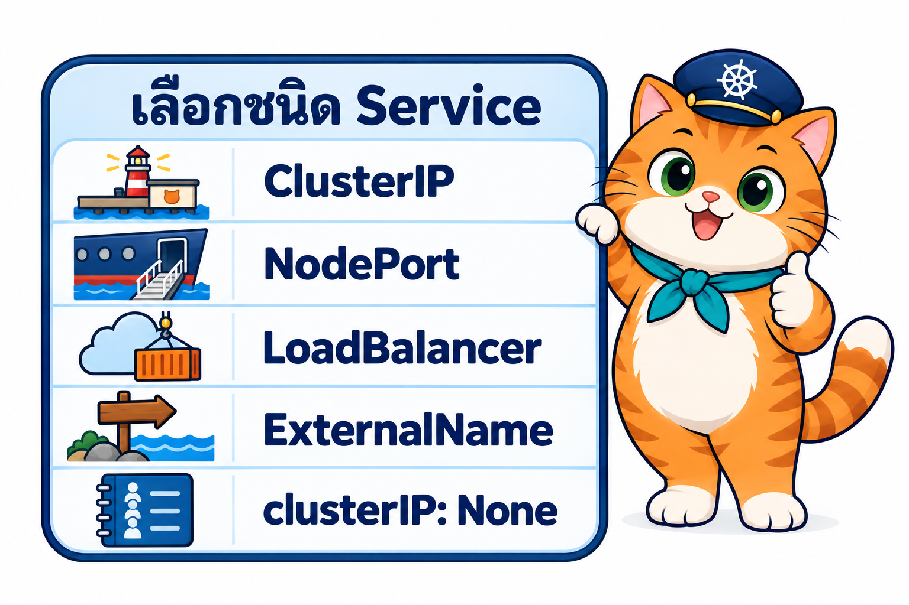<br>
  <em><b>รูปที่ 34</b> ตารางเลือกชนิด Service: ClusterIP (คุยภายใน) / NodePort (เปิดออกนอกใน LAB, on-prem ง่าย ๆ) / LoadBalancer (คลาวด์) / ExternalName (ชื่อภายนอก) / headless (ต้องการ IP ของทุก Pod)</em>
</p>

**ตารางที่ 2** เลือกชนิดของ Service

| ต้องการ | ชนิด | ตัวอย่างในบทนี้ | ข้อควรระวัง |
|---|---|---|---|
| ให้ Pod ในคลัสเตอร์เรียกกันด้วยชื่อคงที่ | **ClusterIP** (ค่าเริ่มต้น) | `web`, `som-db` | ใช้จากนอกคลัสเตอร์ไม่ได้ |
| เปิดออกนอกคลัสเตอร์แบบง่าย (LAB, on-premise ขนาดเล็ก) | **NodePort** | `web-nodeport`, `som-web` (30080) | ช่วง 30000–32767, ห้ามซ้ำทั้งคลัสเตอร์, kind ของเรา map ออกมาแค่ 30080–30082 |
| IP ภายนอกจากผู้ให้บริการคลาวด์ | **LoadBalancer** | `web-lb` | ใน kind ค้าง `<pending>` |
| ชื่อในคลัสเตอร์ที่ชี้ไปชื่อ DNS ภายนอก | **ExternalName** | `supplier` → `example.com` | ไม่มี proxy, Host header/TLS ยังเป็นชื่อเดิม |
| ต้องการ IP ของทุก Pod ให้ client เลือกเอง | **headless** (`clusterIP: None`) | `web-headless` | ไม่มีการกระจายโดย kube-proxy |
| ชื่อในคลัสเตอร์ที่ชี้ IP นอกคลัสเตอร์ | Service **ไม่มี selector** + EndpointSlice เขียนเอง | `old-db` (หัวข้อ 3.4) | ต้องดูแลรายชื่อเอง |

### 16.2 สรุปบท

<p align="center" id="fig-35">
  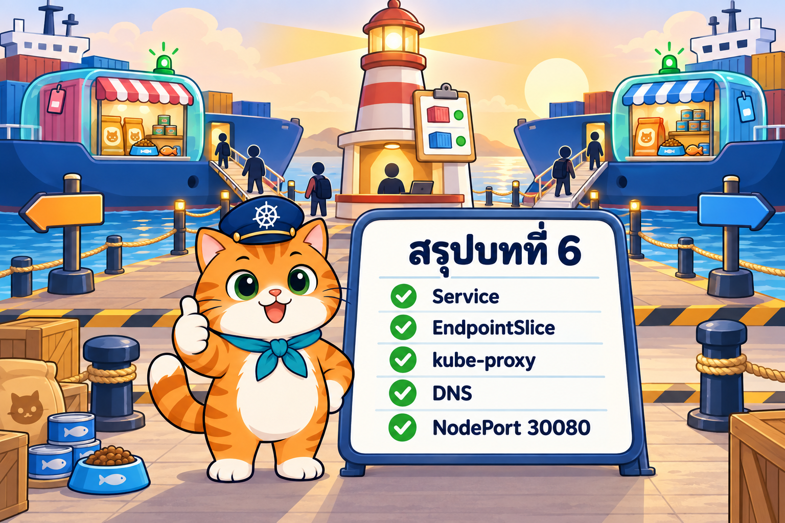<br>
  <em><b>รูปที่ 35</b> สรุปบทที่ 6: Service ให้ชื่อ + ClusterIP คงที่, EndpointSlice ตาม selector และ readiness, kube-proxy แปลงปลายทางบนทุก Node, DNS เรียกด้วยชื่อ, NodePort 30080 เปิดร้านสู่ browser</em>
</p>

1. **Service** = ชื่อ DNS + ClusterIP คงที่ + selector เป็นข้อมูลใน API ไม่ใช่โปรแกรมบนเครื่องใด ไม่เป็นเจ้าของ Pod และไม่สนว่าใครสร้าง Pod
2. **ClusterIP** เป็น IP เสมือนจากช่วง Service CIDR (`10.96.0.0/16`) ping ไม่ตอบ แต่ TCP ไปพอร์ตของ Service ได้ และไม่เปลี่ยนตลอดอายุ Service
3. **EndpointSlice** (`discovery.k8s.io/v1`) เก็บรายชื่อ IP:port ของ Pod ที่ตรง selector เขียนโดย EndpointSlice controller ค้นด้วย label `kubernetes.io/service-name` ส่วน v1 Endpoints เลิกใช้แล้วตั้งแต่ v1.33
4. **พอร์ต 3 ชั้น**: `port` (Service) → `targetPort` (container, ใช้ชื่อได้) และ `nodePort` (ทุก Node) Service หลายพอร์ตต้องตั้งชื่อทุกพอร์ต
5. **NodePort** เปิดพอร์ตเดียวกันบนทุก Node ช่วง 30000–32767 ห้ามซ้ำ kind ของเรา map 30080–30082 ออกมาที่ `localhost` ของเครื่องนักศึกษาตั้งแต่บทที่ 1 **LoadBalancer** ใน kind ค้าง `<pending>` **ExternalName** เป็น CNAME **headless** คืน IP ของทุก Pod
6. **DNS**: `<svc>.<ns>.svc.cluster.local` ชื่อสั้นใช้ได้ในโซนเดียวกัน ข้ามโซนใช้ `<svc>.<ns>` (search domain + `ndots:5`) env var ของ Service มีเฉพาะ Pod ที่สร้างหลัง Service จึงควรใช้ DNS
7. **kube-proxy** (DaemonSet โหมด iptables ใน kind) watch Service + EndpointSlice แล้วเขียนกฎ DNAT บนทุก Node เลือก Pod แบบสุ่มต่อ connection browser ใช้ keep-alive จึงติด Pod เดิม `sessionAffinity: ClientIP` บังคับให้ไป Pod เดิม
8. **readinessProbe** ควบคุมว่า endpoint ได้ลูกค้าไหม (`ready=false` ยังเห็น IP ในคอลัมน์ ENDPOINTS) และ Pod ที่กำลังปิดอาจทำให้ลูกค้าเห็น error ชั่วครู่
9. **debug** ไล่ตาม: Service → EndpointSlice → selector → targetPort → ready → DNS → namespace/NetworkPolicy และแยก `refused` / `timed out` / `bad address` ให้ออก NetworkPolicy ใช้พอร์ตของ Pod
10. Service ยัง **ไม่** เปลี่ยนรุ่นให้ ไม่เก็บข้อมูล db และไม่ให้ชื่อโดเมน

**ตารางที่ 3** สรุปคำสั่งที่ใช้ในบทนี้

| คำสั่ง | ใช้ทำอะไร |
|---|---|
| `kubectl -n <ns> expose rs <rs> --port=80 --name=<svc>` | สร้าง Service จาก selector ของ ReplicaSet (targetPort เป็นเลข) |
| `kubectl apply -f <svc>.yaml` | สร้าง Service จาก YAML (แนะนำ) |
| `kubectl -n <ns> create service nodeport <svc> --tcp=80:80 --node-port=<n>` | สร้าง NodePort แบบคำสั่ง |
| `kubectl -n <ns> get svc,endpointslice` / `kubectl get svc -A` | ดู Service และรายชื่อ endpoint |
| `kubectl -n <ns> describe svc <svc>` | ดู Selector, TargetPort, Endpoints, Session Affinity |
| `kubectl -n <ns> get endpointslice -l kubernetes.io/service-name=<svc> [-o yaml]` | ดู EndpointSlice ของ Service |
| `kubectl ... get endpointslice ... -o jsonpath='{range .items[0].endpoints[*]}{.addresses[0]} {.targetRef.name} ready={.conditions.ready}{"\n"}{end}'` | ดู IP ครบทุกตัวพร้อม ready |
| `kubectl -n <ns> describe endpointslice -l kubernetes.io/service-name=<svc>` | ดู Conditions ของแต่ละ endpoint |
| `kubectl -n <ns> patch svc <svc> -p '{"spec":{...}}'` | แก้ selector / targetPort / sessionAffinity |
| `kubectl -n <ns> exec <pod> -- wget -qO- -T 3 http://<svc>.<ns>` | ทดสอบเรียก Service จาก Pod |
| `kubectl -n <ns> exec <pod> -- nslookup <svc>.<ns>.svc.cluster.local` | ทดสอบ DNS (ใช้ชื่อเต็มกับ busybox) |
| `kubectl -n <ns> exec <pod> -- cat /etc/resolv.conf` | ดู search domain และ nameserver |
| `kubectl -n kube-system get ds kube-proxy` / `get cm kube-proxy -o yaml \| grep mode` | ดู kube-proxy และโหมด |
| `for i in $(seq 30); do curl -s localhost:30080; done \| sort \| uniq -c` | ดูการกระจายแบบ connection ใหม่ทุกครั้ง |

### 16.3 ปูทางบทที่ 7

<p align="center" id="fig-36">
  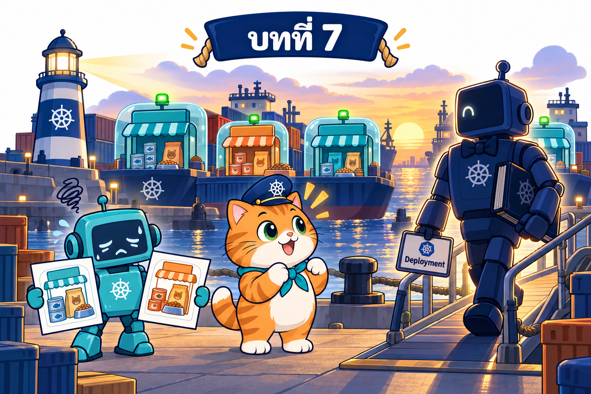<br>
  <em><b>รูปที่ 36</b> ปูทางบทที่ 7: เปลี่ยนรุ่นด้วยการลบ Pod เองทำให้ร้านสะดุด → ต้องมี "ผู้จัดการร้าน" (Deployment) ที่สั่งหัวหน้ากะรุ่นใหม่/รุ่นเก่า เปลี่ยนป้ายทีละบูธ และย้อนรุ่นได้</em>
</p>

ตอนจบ LAB 10 น้องส้มเปลี่ยนร้านเป็นรุ่น 1.3 ได้สำเร็จ แต่ต้องพิมพ์ชื่อ Pod ลบเองทีละตัว หรือลบทั้งหมดแล้วยอมให้ลูกค้าเจอ error (7 ใน 150 ครั้ง) และถ้ารุ่นใหม่มีปัญหาก็ไม่มีปุ่มย้อนรุ่น สิ่งที่ร้านต้องการคือ **"ผู้จัดการร้าน"** ที่สั่งหัวหน้ากะรุ่นใหม่ให้เปิดบูธใหม่ทีละบูธ รอไฟเขียวของบูธใหม่ก่อนปิดบูธเก่า จำประวัติรุ่น และย้อนกลับได้ในคำสั่งเดียว นั่นคือ **Deployment** ในบทที่ 7 ซึ่งจะใช้ Service `som-web`/`som-db` ของบทนี้ต่อได้ทันที เพราะ Service เลือก Pod ด้วย label ไม่สนว่าใครสร้าง Pod

---

## 17. คำถามทบทวน

**1. ทำไมแอปจึงไม่ควรเก็บ IP ของ Pod ไว้ใน config แล้วเรียกตรง ๆ ยกตัวอย่างผลจริงจาก LAB 1**

<details>
<summary>แนวคำตอบ</summary>

Pod เป็นหน่วยที่ตายแล้วไม่ฟื้น เมื่อถูกลบหรือ ReplicaSet สร้างแทน Pod ใหม่จะได้ชื่อและ IP ใหม่ ใน LAB 1 เรียก `http://10.244.1.3` ได้ `web v1 from web-9gngn` แต่หลังลบ Pod นั้น การเรียก IP เดิมได้ `wget: download timed out` ส่วน Pod ใหม่ `web-k2nk5` ได้ IP `10.244.2.6` ควรเรียกผ่านชื่อ Service ซึ่งมี ClusterIP คงที่และรายชื่อ endpoint อัปเดตเอง
</details>

**2. `ping 10.96.55.132` (ClusterIP ของ `web`) ได้ 100% packet loss แต่ `wget http://web` ใช้ได้ Service เสียหรือไม่ อธิบาย**

<details>
<summary>แนวคำตอบ</summary>

ไม่เสีย ClusterIP เป็น IP เสมือนที่ไม่มี interface ใดถือจริง kube-proxy (โหมด iptables) เขียนกฎเฉพาะ protocol/พอร์ตที่ Service ประกาศ (TCP 80) ICMP ของ ping จึงไม่มีใครตอบ การทดสอบ Service ต้องเชื่อมต่อไปที่พอร์ตของ Service ด้วย `wget`/`curl`
</details>

**3. Service กับ ReplicaSet ใช้ selector `app: web` เหมือนกัน ถ้าลบ Service `web` จะเกิดอะไรกับ Pod และถ้าลบ ReplicaSet `web` จะเกิดอะไรกับ Service**

<details>
<summary>แนวคำตอบ</summary>

ลบ Service: Pod ไม่กระทบเพราะ Service ไม่ได้เป็นเจ้าของ Pod (ไม่มี ownerReferences ชี้ Service) แต่ EndpointSlice ของ Service จะหายตาม (ownerReferences ชี้ Service) ลบ ReplicaSet: Pod ถูกลบตามแบบ cascade Service ยังอยู่พร้อม ClusterIP เดิม แต่ EndpointSlice จะว่าง เรียกแล้วได้ `Connection refused` จนกว่าจะมี Pod ที่ label ตรงและ ready กลับมา
</details>

**4. คอลัมน์ ENDPOINTS ของ `kubectl get endpointslice` แสดง 3 IP ครบ แต่ยิง 30 ครั้งได้แค่ 2 Pod เป็นไปได้อย่างไร และจะยืนยันด้วยคำสั่งอะไร**

<details>
<summary>แนวคำตอบ</summary>

Pod ตัวหนึ่งไม่ ready (readinessProbe ล้ม) endpoint ของมันยังอยู่ใน slice แต่ `conditions.ready=false` kube-proxy จึงไม่ส่งลูกค้าไป ยืนยันด้วย jsonpath `{range .items[0].endpoints[*]}{.addresses[0]} {.targetRef.name} ready={.conditions.ready}{"\n"}{end}` หรือ `kubectl describe endpointslice` (ดู `Conditions: Ready: false`) และดู Event `Readiness probe failed` ของ Pod เช่นใน LAB 6 ที่ได้ `ready=false` และ `statuscode: 403`
</details>

**5. Service `web-alt` มี `port: 8080, targetPort: http` และ containerPort ชื่อ `http` คือ 80 ลูกค้าในโซนเดียวกันต้องเรียกอย่างไร ถ้าเรียก `http://web-alt` จะเห็นอะไร เพราะอะไร**

<details>
<summary>แนวคำตอบ</summary>

เรียก `http://web-alt:8080` (พอร์ตของ Service) kube-proxy แปลงเป็น `<Pod IP>:80` ให้เอง ถ้าเรียก `http://web-alt` (พอร์ต 80) จะได้ `wget: download timed out` เพราะ Service ไม่ได้ประกาศพอร์ต 80 จึงไม่มีกฎสำหรับพอร์ตนั้น และไม่มีเครื่องใดเป็นเจ้าของ ClusterIP ที่จะตอบปฏิเสธกลับมา
</details>

**6. ทำไม Service ที่มี 2 พอร์ตต้องตั้งชื่อทุกพอร์ต และชื่อพอร์ตของ Service กับชื่อพอร์ตของ container ต่างกันอย่างไร**

<details>
<summary>แนวคำตอบ</summary>

ชื่อใช้แยกพอร์ตใน EndpointSlice, ระเบียน SRV และ env var (`WEB_MULTI_SERVICE_PORT_HTTP`) จึงบังคับเมื่อมีหลายพอร์ต (ไม่ตั้ง → `spec.ports[1].name: Required value`) ชื่อพอร์ตของ Service (`spec.ports[].name`) เป็นของ Service เอง ส่วนชื่อพอร์ตของ container (`containerPort` + `name`) คือสิ่งที่ `targetPort: http` อ้างถึง เช่น Service `web` ใช้ `targetPort: http` ได้แม้พอร์ตของ Service เองไม่มีชื่อ (จึงไม่มี env `WEB_SERVICE_PORT_HTTP`)
</details>

**7. อธิบายเส้นทางของแพ็กเก็ตเมื่อเปิด `http://localhost:30080` บนเครื่องนักศึกษา จนถึง Pod ที่อยู่บน `lab-worker2`**

<details>
<summary>แนวคำตอบ</summary>

(1) Docker บนเครื่องนักศึกษา publish 30080 → container `k8s-lab` (`-p 30080-30082:30080-30082` บทที่ 1) (2) Docker ใน k8s-lab publish 30080 → container `lab-control-plane` ตาม `extraPortMappings` ของ kind (3) NodePort 30080 บน control plane: kube-proxy บน control plane เลือก Pod ที่ ready แบบสุ่มแล้ว DNAT ไปที่ `<Pod IP>:<targetPort>` (4) แพ็กเก็ตเดินทางข้ามเรือไป `lab-worker2` ตามเครือข่าย Pod ปกติ control plane ไม่ต้องมี Pod ของเราเลย
</details>

**8. ทำไม LAB 8 ต้องลบ `web-nodeport` ก่อนเริ่ม LAB 10 และทำไม LAB 0 ต้องตรวจตัวอย่างของบทที่ 1**

<details>
<summary>แนวคำตอบ</summary>

เลข nodePort ใช้ได้ Service เดียวทั้งคลัสเตอร์ (ข้าม namespace ก็ไม่ได้) LAB 10 ต้องใช้ 30080 กับ `som-web` ถ้า `web-nodeport` ยังอยู่จะได้ `provided port is already allocated` ตัวอย่าง `/workspace/examples/web-deployment.yaml` ที่ `k8s-up` แนะนำในบทที่ 1 ก็สร้าง Service `web` ที่ใช้ `80:30080/TCP` ใน `default` จึงต้องลบด้วย `kubectl delete -f /workspace/examples/web-deployment.yaml` ก่อน
</details>

**9. Pod `cook` ใน namespace `kitchen` เรียก `http://web` ได้ `bad address` แต่ `http://web.shop` ได้ อธิบายด้วย resolv.conf และทำไม `nslookup web.shop` ของ busybox จึงได้ NXDOMAIN**

<details>
<summary>แนวคำตอบ</summary>

resolv.conf ของ `cook` มี `search kitchen.svc.cluster.local svc.cluster.local cluster.local` และ `ndots:5` ชื่อ `web` จึงถูกลองเป็น `web.kitchen.svc.cluster.local` ฯลฯ ซึ่งไม่มี ส่วน `web.shop` มีจุดน้อยกว่า 5 จึงถูกเติม `.svc.cluster.local` กลายเป็น `web.shop.svc.cluster.local` ที่มีอยู่จริง `nslookup` ของ busybox ไม่เติม search domain ให้ชื่อที่มีจุด จึงถามชื่อ `web.shop` ตรง ๆ และได้ NXDOMAIN ทั้งที่ `wget` ซึ่งใช้ resolver ปกติใช้ได้ ควรใช้ชื่อเต็มกับ nslookup
</details>

**10. ทำไม `client` ไม่มี `WEB_SERVICE_HOST` แต่ `client2` มี และสรุปว่าแอปควรหา Service ด้วยวิธีใด**

<details>
<summary>แนวคำตอบ</summary>

kubelet ใส่ env ของ Service ให้เฉพาะตอนสร้าง container และเฉพาะ Service ใน namespace เดียวกันที่มีอยู่ ณ ตอนนั้น `client` สร้างใน LAB 1 ก่อน Service `web` จึงไม่มี ส่วน `client2` สร้างหลัง จึงได้ `WEB_SERVICE_HOST=10.96.55.132` ฯลฯ แอปควรใช้ DNS (`web` หรือ `web.shop`) ซึ่งไม่ขึ้นกับลำดับการสร้าง
</details>

**11. นักศึกษากด refresh หน้า `localhost:30080` 10 ครั้ง เห็นชื่อ Pod เดิมทุกครั้ง จึงสรุปว่า Service ไม่กระจายโหลด ข้อสรุปนี้ผิดอย่างไร และควรทดสอบอย่างไร**

<details>
<summary>แนวคำตอบ</summary>

browser ใช้ keep-alive ส่งหลาย request ผ่าน connection เดิม kube-proxy เลือก Pod ตอนเปิด connection เท่านั้น จึงติด Pod เดิม (ผลจริง Chromium reload 10/10 Pod เดียว) ควรทดสอบด้วยคำสั่งที่เปิด connection ใหม่ทุกครั้ง เช่น `for i in $(seq 30); do curl -s localhost:30080; done | sort | uniq -c` หรือ `./hit.sh` ของ LAB 10 ซึ่งเห็นหลาย Pod (เช่น 7/8/15)
</details>

**12. ถ้าแอปต้องการให้ลูกค้าคนเดิมไปบูธเดิม จะตั้งค่าอะไร มีข้อเสียอะไร และถ้ายิงจาก Pod 2 ตัวจะเห็นอะไร**

<details>
<summary>แนวคำตอบ</summary>

ตั้ง `sessionAffinity: ClientIP` (ค่า `timeoutSeconds` เริ่มต้น 10800) ลูกค้า IP เดียวกันไป Pod เดิมตลอด ใน LAB 5 `client` ไป `web-k2nk5` 30/30 และ `client2` ไป `web-mgz49` 30/30 (คนละ Pod ได้เพราะคนละ IP) ข้อเสียคือลูกค้าหลัง NAT เดียวกันไปกองที่บูธเดียว โหลดไม่สมดุล และ session ยังหายเมื่อบูธนั้นหายไป
</details>

**13. Service `web-typo` ได้ `Connection refused` และ `web-badport` ก็ได้ `Connection refused` สองกรณีนี้ต่างกันอย่างไร จะแยกด้วยคำสั่งอะไร**

<details>
<summary>แนวคำตอบ</summary>

`web-typo` ไม่มี endpoint เลย (`PORTS <unset> ENDPOINTS <unset>`, `describe svc` บรรทัด `Endpoints:` ว่าง, `Selector: app=wbe` ไม่ตรง label ของ Pod) kube-proxy ปฏิเสธเองเพราะไม่มีปลายทาง ส่วน `web-badport` มี endpoint ครบ 3 ตัว แต่ PORTS เป็น `8080` ซึ่งไม่มีโปรแกรมฟังใน Pod ตัว Pod จึงปฏิเสธ แยกด้วย `kubectl get endpointslice -l kubernetes.io/service-name=<svc>` และ `kubectl describe svc` (Selector, TargetPort, Endpoints)
</details>

**14. NetworkPolicy ที่อนุญาต `kitchen` เข้า Pod `app=web` ที่ `port: 8080` ทำไมจึงยัง timed out เมื่อเรียก `web-alt.shop:8080` และมีผลข้างเคียงอะไรกับ Pod อื่นใน `shop`**

<details>
<summary>แนวคำตอบ</summary>

NetworkPolicy ตรวจที่ Pod ปลายทางหลัง kube-proxy DNAT แล้ว แพ็กเก็ตที่มาถึง Pod คือพอร์ต 80 (targetPort) ไม่ใช่ 8080 ของ Service จึงไม่ตรงกฎและถูกทิ้ง ต้องใช้ `port: 80` (หรือชื่อ `http`) ผลข้างเคียงคือเมื่อมี policy เลือก Pod `app=web` Pod นั้นรับเฉพาะที่อนุญาต `client` ใน `shop` เองจึงได้ `download timed out` ด้วย
</details>

**15. ใน LAB 10 หลังลบ Pod db หน้าเว็บตอบ 503 แต่ Pod web ยัง `1/1 Ready` และ `/api/health` ยังตอบ `{"ok":true,"db":"up"}` เป็นการออกแบบที่ดีหรือไม่ ถ้า readinessProbe ตรวจว่ามีตาราง `products` ด้วยจะเกิดอะไร**

<details>
<summary>แนวคำตอบ</summary>

เป็นการออกแบบโดยตั้งใจ readiness ตรวจแค่ "ต่อ db ได้" (`SELECT 1`) web จึงยังรับลูกค้าและแสดงหน้าเป็นมิตร "ร้านกำลังเตรียมสินค้า" (HTTP 503) ได้ ถ้า readiness ตรวจตารางด้วย ทุก Pod web จะ not ready พร้อมกันทันทีที่ db ใหม่ยังว่าง Service ไม่มี endpoint ที่ ready ลูกค้าจะได้ connection refused ทั้งร้าน และไม่มีใครเห็นข้อความแจ้ง
</details>

**16. ถ้ายังไม่มี Deployment การเปลี่ยนร้าน 3 บูธจาก 1.2 เป็น 1.3 ด้วย ReplicaSet + Service ทำได้กี่วิธี แต่ละวิธีเสียอะไร**

<details>
<summary>แนวคำตอบ</summary>

ต้อง `kubectl set image rs/som-web ...` (เปลี่ยนแค่ template Pod เดิมยัง 1.2) แล้ว (ก) ลบทีละตัวและรอ Ready เอง: ลูกค้าเห็น 1.2/1.3 ปนกัน err 0–1 ครั้ง แต่ต้องพิมพ์ชื่อ Pod และรอเองทุกตัว เสี่ยงลบผิด ทำกับหลายสิบบูธไม่ไหว (ข) ลบทั้งหมดในคำสั่งเดียว: เร็วแต่ร้านสะดุด (ผลจริง err 4–7 จาก 200 และ 7 จาก 150) ทั้งสองวิธีไม่มีประวัติรุ่นและย้อนรุ่นยาก จึงต้องใช้ Deployment ในบทที่ 7
</details>

---

## 18. เอกสารอ้างอิง

1. The Kubernetes Authors. *Service*. https://kubernetes.io/docs/concepts/services-networking/service/
2. The Kubernetes Authors. *EndpointSlices*. https://kubernetes.io/docs/concepts/services-networking/endpoint-slices/
3. The Kubernetes Authors. *Virtual IPs and Service Proxies*. https://kubernetes.io/docs/reference/networking/virtual-ips/
4. The Kubernetes Authors. *Service ClusterIP allocation*. https://kubernetes.io/docs/concepts/services-networking/cluster-ip-allocation/
5. The Kubernetes Authors. *DNS for Services and Pods*. https://kubernetes.io/docs/concepts/services-networking/dns-pod-service/
6. The Kubernetes Authors. *Connecting Applications with Services*. https://kubernetes.io/docs/tutorials/services/connect-applications-service/
7. The Kubernetes Authors. *Debug Services*. https://kubernetes.io/docs/tasks/debug/debug-application/debug-service/
8. The Kubernetes Authors. *Use a Service to Access an Application in a Cluster*. https://kubernetes.io/docs/tasks/access-application-cluster/service-access-application-cluster/
9. The Kubernetes Authors. *Create an External Load Balancer*. https://kubernetes.io/docs/tasks/access-application-cluster/create-external-load-balancer/
10. The Kubernetes Authors. *Service Internal Traffic Policy*. https://kubernetes.io/docs/concepts/services-networking/service-traffic-policy/
11. The Kubernetes Authors. *Network Policies*. https://kubernetes.io/docs/concepts/services-networking/network-policies/
12. The Kubernetes Authors. *Configure Liveness, Readiness and Startup Probes*. https://kubernetes.io/docs/tasks/configure-pod-container/configure-liveness-readiness-startup-probes/
13. The Kubernetes Authors. *Pod Lifecycle* (termination of Pods). https://kubernetes.io/docs/concepts/workloads/pods/pod-lifecycle/
14. The Kubernetes Authors. *kubectl expose*. https://kubernetes.io/docs/reference/kubectl/generated/kubectl_expose/
15. The Kubernetes Authors. *ReplicaSet*. https://kubernetes.io/docs/concepts/workloads/controllers/replicaset/
16. The Kubernetes Authors. *Deployments* (บทถัดไป). https://kubernetes.io/docs/concepts/workloads/controllers/deployment/
17. kind — Kubernetes IN Docker. *Configuration: Extra Port Mappings*. https://kind.sigs.k8s.io/docs/user/configuration/#extra-port-mappings

---

> **หมายเหตุเกี่ยวกับภาพประกอบ:** ภาพประกอบ 36 ภาพในโฟลเดอร์ [`images/`](images/) และภาพตัวละครน้องส้ม (`00-character-som.png`) สร้างขึ้นด้วยปัญญาประดิษฐ์สำหรับการสร้างภาพเพื่อใช้ประกอบการเรียนการสอน ชุดคำสั่งสร้างภาพอยู่ใน [`images/imagegen-prompts.md`](images/imagegen-prompts.md) ภาพใช้อุปมาเชิงเปรียบเทียบเพื่อช่วยความเข้าใจ ตัวเลขในภาพ (เช่น ClusterIP, Pod IP และจำนวนครั้ง) เป็นค่าตัวอย่าง ผู้เรียนควรใช้เนื้อหาในเอกสารนี้และเอกสารอ้างอิงเป็นหลัก ผลลัพธ์คำสั่งทั้งหมดมาจากการทดลองจริง (Kubernetes v1.37.0) ค่าเวลา, IP, ชื่อ Pod และ Node ที่ Pod ถูกวางในเครื่องผู้เรียนอาจต่างกัน
