# Deployment: ผู้จัดการร้านที่เปลี่ยนรุ่นทีละบูธและพลิกสมุดย้อนรุ่นได้

> **รายวิชา:** Software Development Tools and Environments (DevTools)
> **หัวข้อ:** Kubernetes Deployment — ความสัมพันธ์ Deployment → ReplicaSet → Pod, โครงสร้าง manifest, pod-template-hash, สิ่งที่ทำให้เกิด rollout, RollingUpdate (maxSurge/maxUnavailable) และ Recreate, readinessProbe/minReadySeconds, zero-downtime rollout (preStop, terminationGracePeriodSeconds), progressDeadlineSeconds, rollout history/change-cause/undo/pause/resume/restart, revisionHistoryLimit, การย้ายจาก ReplicaSet เป็น Deployment, อาการ rollout พัง, blue/green และ canary ด้วย label + Service
> **ผลลัพธ์การเรียนรู้ที่เกี่ยวข้อง:** CLO-5, CLO-6
> **บทก่อนหน้า:** [บทที่ 6 Service](../../006_kubernetes_service/01_Theory/README.md) · **LAB ของบทนี้:** [02_LAB](../02_LAB/README.md)

---

## บทคัดย่อ

บทที่ 6 จบลงที่ร้านอาหารแมวน้องส้มมี **ประภาคาร (Service)** ที่ลูกค้าหาเจอเสมอ และมีครัวกลาง (db) ตัวเดียว แต่ตอนอยากเปลี่ยนร้านเป็นรุ่น 1.3 น้องส้มสั่ง `set image` ที่ **หัวหน้ากะ (ReplicaSet)** แล้วไม่มีบูธไหนเปลี่ยน ต้องลบบูธเองทีละตัว และถ้าลบทีเดียวลูกค้าก็เจอ error ทั้งยังไม่มีสมุดประวัติให้ย้อนรุ่น บทนี้แนะนำ **Deployment** ซึ่งเปรียบเหมือน **ผู้จัดการร้าน** ที่ถือสมุดบันทึกรุ่น สั่งหัวหน้ากะรุ่นใหม่ให้เปิดบูธทีละบูธ รอไฟเขียวก่อนให้หัวหน้ากะรุ่นเก่าปิดบูธ จดทุกการเปลี่ยนลงสมุด และพลิกสมุดย้อนรุ่นได้ในคำสั่งเดียว

เนื้อหาเริ่มจากลำดับชั้น **Deployment → ReplicaSet → Pod** และ `pod-template-hash` ต่อด้วยคำถามว่า **อะไรทำให้เกิด rollout** (เปลี่ยน `.spec.template` เท่านั้น) กลยุทธ์ **RollingUpdate** พร้อมการคำนวณ `maxSurge`/`maxUnavailable` และ **Recreate** สำหรับงานที่ห้ามมีสองรุ่นพร้อมกัน บทบาทของ **readinessProbe** และ `minReadySeconds` ที่ตัดสินจังหวะ rollout สูตร **zero-downtime** (`maxUnavailable: 0` + `preStop` + grace period) **progressDeadlineSeconds** ที่บอกว่า rollout ค้าง (แต่ Kubernetes ไม่ย้อนรุ่นให้เอง) ชุดคำสั่ง **`kubectl rollout`** (history, change-cause, undo, pause/resume, restart) และ `revisionHistoryLimit` กับดักของการแก้ด้วยคำสั่งเทียบกับ `kubectl apply` การ **ย้ายร้านจาก ReplicaSet ของบทที่ 6 มาเป็น Deployment** การอ่านอาการ rollout พัง และปิดท้ายด้วย **blue/green** กับ **canary** ด้วย label + Service แล้วสรุปปัญหาที่ Deployment ยังไม่ช่วย ซึ่งนำไปสู่บทถัดไป

ผลลัพธ์คำสั่งและข้อความ error ที่ยกมาในเอกสารนี้มาจากการทดลองจริงบนคลัสเตอร์ kind (kind v0.33, Kubernetes v1.37.0, kubectl v1.37.1) ใน LAB ประจำบท และการตรวจสอบก่อนเขียนบท (pre-check) เมื่อ 5 ตุลาคม 2569 **เวลา, AGE, IP, ค่า hash ในชื่อ ReplicaSet/Pod, ชื่อ Pod ที่สุ่ม และจำนวน error ที่นับได้ในเครื่องผู้เรียนจะต่างจากตัวอย่าง** เป็นเรื่องปกติ

## วัตถุประสงค์การเรียนรู้

เมื่อศึกษาเอกสารนี้จบ ผู้เรียนควรสามารถ

1. อธิบายข้อจำกัดของ ReplicaSet ตอนเปลี่ยนรุ่น และบอกได้ว่า Deployment แก้ปัญหานั้นอย่างไร
2. อธิบายลำดับชั้น Deployment → ReplicaSet → Pod และ ownerReferences ที่เชื่อมกัน รวมถึงเหตุผลที่ไม่ควรแก้ ReplicaSet ที่ Deployment เป็นเจ้าของ
3. เขียน manifest ของ Deployment (`replicas`, `selector`, `template`, `strategy`, `minReadySeconds`, `revisionHistoryLimit`, `progressDeadlineSeconds`) และบอกค่า default ของแต่ละฟิลด์
4. อ่านคอลัมน์ `READY`, `UP-TO-DATE`, `AVAILABLE` ของ `kubectl get deploy` และอธิบายบทบาทของ `pod-template-hash`
5. แยกได้ว่าการเปลี่ยนแบบใดทำให้เกิด revision ใหม่ (เปลี่ยน template) และแบบใดไม่เกิด (scale, แก้ strategy)
6. คำนวณจำนวน Pod สูงสุด/พร้อมต่ำสุดระหว่าง rolling update จาก `maxSurge`/`maxUnavailable` และเลือกระหว่าง RollingUpdate กับ Recreate ได้เหมาะกับงาน
7. อธิบายว่า readinessProbe และ `minReadySeconds` คุมจังหวะ rollout อย่างไร และทำไม liveness ไม่ควรพึ่งฐานข้อมูล
8. อธิบายลำดับการปิด Pod และออกแบบ rollout ที่ลูกค้าไม่เจอ error ด้วย `maxUnavailable: 0`, `preStop` และ `terminationGracePeriodSeconds`
9. อธิบาย `progressDeadlineSeconds` และสถานะ `ProgressDeadlineExceeded` พร้อมบอกได้ว่าทำไม Kubernetes ไม่ rollback ให้เอง
10. ใช้ `kubectl rollout status | history | undo | pause | resume | restart` และ annotation `kubernetes.io/change-cause` ได้ถูกต้อง รวมถึงอธิบายกับดักของ change-cause และเลข revision หลัง undo
11. ย้ายแอปจาก ReplicaSet มาเป็น Deployment โดยไม่เปลี่ยนชื่อ Service และอธิบายการ "รับเลี้ยง" ReplicaSet เดิม
12. อ่านอาการ rollout พัง (`ImagePullBackOff`, `0/1 Running`, `CrashLoopBackOff`) และใช้ label + Service ทำ blue/green และ canary แบบง่ายได้

## สารบัญ

1. [บทนำ: เปลี่ยนรุ่นด้วยมือแล้วร้านสะดุด](#1-บทนำ-เปลี่ยนรุ่นด้วยมือแล้วร้านสะดุด)
2. [Deployment → ReplicaSet → Pod](#2-deployment--replicaset--pod)
3. [อะไรทำให้เกิด rollout](#3-อะไรทำให้เกิด-rollout)
4. [RollingUpdate: maxSurge / maxUnavailable และ Recreate](#4-rollingupdate-maxsurge--maxunavailable-และ-recreate)
5. [readinessProbe และ minReadySeconds ตัดสินจังหวะ rollout](#5-readinessprobe-และ-minreadyseconds-ตัดสินจังหวะ-rollout)
6. [zero-downtime rollout](#6-zero-downtime-rollout)
7. [progressDeadlineSeconds: rollout ค้างแต่ร้านยังขาย](#7-progressdeadlineseconds-rollout-ค้างแต่ร้านยังขาย)
8. [คำสั่ง rollout: history, change-cause, undo, pause, restart](#8-คำสั่ง-rollout-history-change-cause-undo-pause-restart)
9. [วิธีเปลี่ยน Deployment และกับดักของ apply](#9-วิธีเปลี่ยน-deployment-และกับดักของ-apply)
10. [ย้ายจาก ReplicaSet (บทที่ 6) เป็น Deployment](#10-ย้ายจาก-replicaset-บทที่-6-เป็น-deployment)
11. [rollout พัง: อ่านอาการและแก้](#11-rollout-พัง-อ่านอาการและแก้)
12. [blue/green และ canary ด้วย label + Service](#12-bluegreen-และ-canary-ด้วย-label--service)
13. [สรุปและบทถัดไป](#13-สรุปและบทถัดไป)
14. [คำถามทบทวน](#14-คำถามทบทวน)
15. [เอกสารอ้างอิง](#15-เอกสารอ้างอิง)

### สารบัญรูปภาพ

| รูปที่ | เรื่อง | รูปที่ | เรื่อง |
|:---:|---|:---:|---|
| 1 | [เปลี่ยนรุ่นด้วยมือแล้วร้านสะดุด](#fig-1) | 19 | [รุ่นใหม่พังแล้ว rollout ค้าง](#fig-19) |
| 2 | [แก้ template ของ ReplicaSet แล้ว Pod เดิมไม่เปลี่ยน](#fig-2) | 20 | [Kubernetes ไม่ rollback อัตโนมัติ](#fig-20) |
| 3 | [อุปมาใหม่ของบทนี้](#fig-3) | 21 | [rollout history สมุดบันทึกรุ่น](#fig-21) |
| 4 | [ลำดับชั้น Deployment → ReplicaSet → Pod](#fig-4) | 22 | [กับดัก change-cause](#fig-22) |
| 5 | [ห้ามแก้ ReplicaSet ที่ Deployment เป็นเจ้าของ](#fig-5) | 23 | [rollout undo](#fig-23) |
| 6 | [โครง manifest ของ Deployment](#fig-6) | 24 | [คำเตือน last-applied ตอน undo](#fig-24) |
| 7 | [เริ่มเขียน YAML ด้วย --dry-run](#fig-7) | 25 | [pause / resume](#fig-25) |
| 8 | [อ่านคอลัมน์ READY / UP-TO-DATE / AVAILABLE](#fig-8) | 26 | [revisionHistoryLimit](#fig-26) |
| 9 | [pod-template-hash](#fig-9) | 27 | [วิธีเปลี่ยน Deployment](#fig-27) |
| 10 | [อะไรทำให้เกิด rollout](#fig-10) | 28 | [apply ทับค่า replicas](#fig-28) |
| 11 | [ลำดับ rolling update](#fig-11) | 29 | [รับเลี้ยง ReplicaSet เดิม](#fig-29) |
| 12 | [คำนวณ maxSurge / maxUnavailable](#fig-12) | 30 | [ทางสำรอง --cascade=orphan](#fig-30) |
| 13 | [RollingUpdate เทียบ Recreate](#fig-13) | 31 | [อาการพังที่พบบ่อย](#fig-31) |
| 14 | [ทำไม som-db ใช้ Recreate](#fig-14) | 32 | [blue/green](#fig-32) |
| 15 | [readiness และ minReadySeconds คุมจังหวะ rollout](#fig-15) | 33 | [canary ด้วย label](#fig-33) |
| 16 | [บทบาทของ readiness และ liveness](#fig-16) | 34 | [ตารางเลือก workload](#fig-34) |
| 17 | [ลำดับการปิด Pod](#fig-17) | 35 | [ตารางคำสั่งสรุปบท](#fig-35) |
| 18 | [สูตร zero-downtime](#fig-18) | 36 | [ปิดบทและบทถัดไป](#fig-36) |

---

## 1. บทนำ: เปลี่ยนรุ่นด้วยมือแล้วร้านสะดุด

<p align="center">
  <br>
  <em>น้องส้ม ผู้ช่วยกัปตันท่าเรือ Kubernetes ตัวละครหลักของบทนี้</em>
</p>

<p align="center" id="fig-1">
  <br>
  <em><b>รูปที่ 1</b> เปิดบทที่ 7: ต่อจากบท 006 — set image ที่ ReplicaSet แล้วบูธเดิมยังเป็น 1.2 น้องส้มต้องลบบูธเองทีละตัว ลูกค้าบางคนชนบูธที่กำลังปิด</em>
</p>

ตอนจบบทที่ 6 ร้านน้องส้มดูเหมือนพร้อมทุกอย่าง มีหัวหน้ากะ (ReplicaSet `som-web`) ดูแลให้ครบ 3 บูธ มีประภาคาร (Service `som-web` NodePort 30080) ให้ลูกค้าเปิดร้านจาก `http://localhost:30080` และมีครัวกลาง (ReplicaSet `som-db` + Service `som-db`) ที่ทุกบูธใช้ร่วมกัน แต่เมื่อน้องส้มอยากเปลี่ยนร้านเป็นรุ่น **1.3** (ธีม sunset และเมนูใหม่) ก็เจอปัญหาสามข้อ

```bash
kubectl -n som-shop set image rs/som-web web=som-shop-web:1.3 db-seed=som-shop-web:1.3
```

1. **คำสั่งสำเร็จแต่ไม่มีบูธไหนเปลี่ยน** — template ของ ReplicaSet เปลี่ยนเป็น 1.3 แล้ว แต่ Pod ทั้ง 3 ตัวยังเป็น 1.2 เพราะ ReplicaSet สนใจแค่ "จำนวน" Pod ที่ตรง selector ไม่สนว่า Pod นั้นเป็นรุ่นไหน (ทบทวนบทที่ 5)
2. **ต้องลบบูธเอง** — ลบทีละตัวต้องพิมพ์ชื่อ Pod และคอยดูเองว่าบูธใหม่พร้อมหรือยัง ส่วนการลบทั้งหมดในคำสั่งเดียว (`kubectl delete pod -l app=som-web`) ทำให้ช่วงหนึ่งไม่มีบูธไหนพร้อมเลย ในบทที่ 6 ลูกค้าเจอ error 7 ครั้งจาก 150 ครั้งในช่วงนั้น
3. **ไม่มีสมุดประวัติ** — ถ้ารุ่น 1.3 มีปัญหา ต้องจำเองว่ารุ่นก่อนคืออะไร แล้ว `set image` กลับและลบ Pod เองอีกรอบ

<p align="center" id="fig-2">
  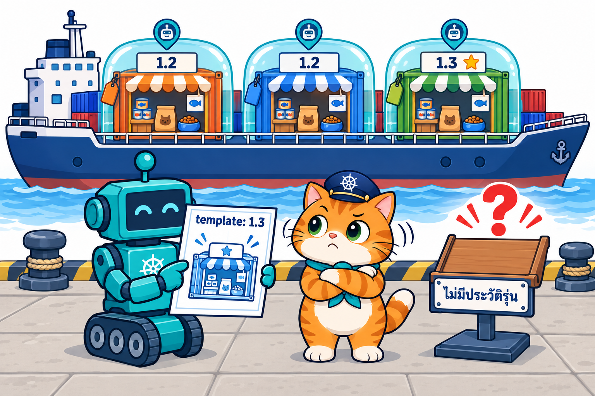<br>
  <em><b>รูปที่ 2</b> ทบทวนบท 005–006: แก้ template ของ ReplicaSet แล้ว Pod เดิมไม่เปลี่ยน มีผลเฉพาะ Pod ที่เกิดใหม่ และไม่มีสมุดประวัติให้ย้อนรุ่น</em>
</p>

สิ่งที่ร้านต้องการคือใครสักคนที่ **(1)** เปลี่ยนรุ่นทีละบูธโดยอัตโนมัติ **(2)** รอให้บูธใหม่พร้อมก่อนปิดบูธเก่า **(3)** จำกัดจำนวนบูธที่หายไประหว่างเปลี่ยน **(4)** บันทึกประวัติทุกรุ่น และ **(5)** ย้อนรุ่นได้ในคำสั่งเดียว ทั้งหมดนี้คือหน้าที่ของ **Deployment**

<p align="center" id="fig-3">
  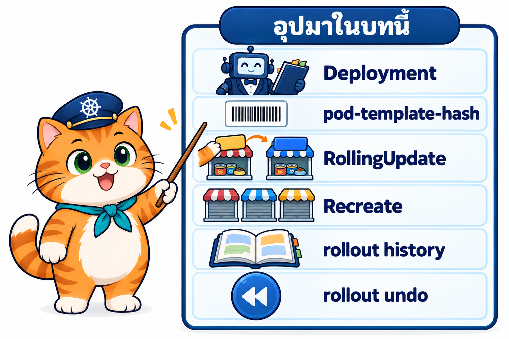<br>
  <em><b>รูปที่ 3</b> อุปมาใหม่ของบทนี้: ผู้จัดการร้าน = Deployment, สติกเกอร์บาร์โค้ด = pod-template-hash, เปลี่ยนป้ายทีละบูธ = RollingUpdate, ปิดทั้งร้านก่อน = Recreate, สมุดบันทึกรุ่น = rollout history, ปุ่มกรอกลับ = rollout undo</em>
</p>

**ตารางที่ 1** อุปมาท่าเรือที่ใช้ในบทนี้ (ต่อจากบทที่ 1–6)

| Kubernetes | อุปมาท่าเรือ | ใหม่ในบทนี้ |
|---|---|:---:|
| container / Pod / Node / Control Plane / Namespace | ตู้สินค้า / บูธร้าน (กล่องใส teal มีกันสาด ป้าย IP) / เรือ / หอบังคับการ / โซนทาสี | |
| ReplicaSet / Pod template / ownerReferences | หัวหน้ากะ (หุ่นยนต์ teal ถือคลิปบอร์ดนับหัว) / พิมพ์เขียว / ป้ายเจ้าของ (บทที่ 5) | |
| Service / EndpointSlice / readinessProbe / NodePort | ประภาคาร / คลิปบอร์ดรายชื่อบูธ / ไฟเขียวหน้าบูธ / ประตูทางขึ้นเรือหมายเลข 30080 (บทที่ 6) | |
| **Deployment** | **ผู้จัดการร้าน** (หุ่นยนต์ตัวสูง ผูกหูกระต่าย ถือสมุดบันทึกรุ่น) คุมหัวหน้ากะ 1 คนต่อ 1 รุ่น | ✅ |
| `pod-template-hash` | สติกเกอร์บาร์โค้ดประจำรุ่น ติดทั้งหัวหน้ากะและบูธของรุ่นนั้น | ✅ |
| RollingUpdate / maxSurge / maxUnavailable | เปลี่ยนป้ายทีละบูธโดยร้านไม่ปิด / เพดานจำนวนบูธ / พื้นจำนวนบูธที่ต้องเปิด | ✅ |
| Recreate | ปิดทุกบูธก่อน (ป้าย CLOSED) แล้วค่อยเปิดรุ่นใหม่ | ✅ |
| minReadySeconds / progressDeadlineSeconds | นาฬิกาทรายหน้าบูธใหม่ / นาฬิกาทรายของผู้จัดการ (หมดแล้วชูการ์ดแดง) | ✅ |
| rollout history / undo / pause | สมุดบันทึกรุ่น / ปุ่มกรอกลับ / ป้ายพัก | ✅ |
| preStop + terminationGracePeriodSeconds | บูธที่ถูกขีดชื่อออกจากคลิปบอร์ดแล้วยังเสิร์ฟลูกค้าคนสุดท้ายระหว่างนาฬิกาทราย ก่อนปิดชัตเตอร์ | ✅ |
| blue/green / canary | บูธสองแถวสีน้ำเงิน/เขียว + คันโยกที่ประภาคาร / บูธทดลองติดดาวดวงเล็ก | ✅ |

ทบทวนปัญหาที่ค้างมาจากบทที่ 6 และสิ่งที่บทนี้ใช้แก้

| ปัญหา | หลักฐานจากบทที่ 6 | สิ่งที่บทนี้ใช้แก้ |
|---|---|---|
| `set image rs` แล้ว Pod เดิมไม่เปลี่ยน | Pod ยังเป็น 1.2 หลังสั่ง | Deployment สร้าง ReplicaSet รุ่นใหม่ให้ทุกครั้งที่ template เปลี่ยน (หัวข้อ 2–3) |
| ลบ Pod ทั้งหมดเองแล้วร้านสะดุด | error 7 ใน 150 ครั้ง | RollingUpdate + readinessProbe + `maxUnavailable: 0` + `preStop` (หัวข้อ 4–6) |
| ไม่มีประวัติ ย้อนรุ่นยาก | ต้องจำรุ่นเองแล้วลบ Pod อีกรอบ | `kubectl rollout history` / `undo` (หัวข้อ 8) |
| รุ่นใหม่พังแล้วไม่รู้ตัว | – | `progressDeadlineSeconds` + exit code ของ `rollout status` (หัวข้อ 7) |

---

## 2. Deployment → ReplicaSet → Pod

### 2.1 ผู้จัดการร้านคุมหัวหน้ากะ 1 คนต่อ 1 รุ่น

<p align="center" id="fig-4">
  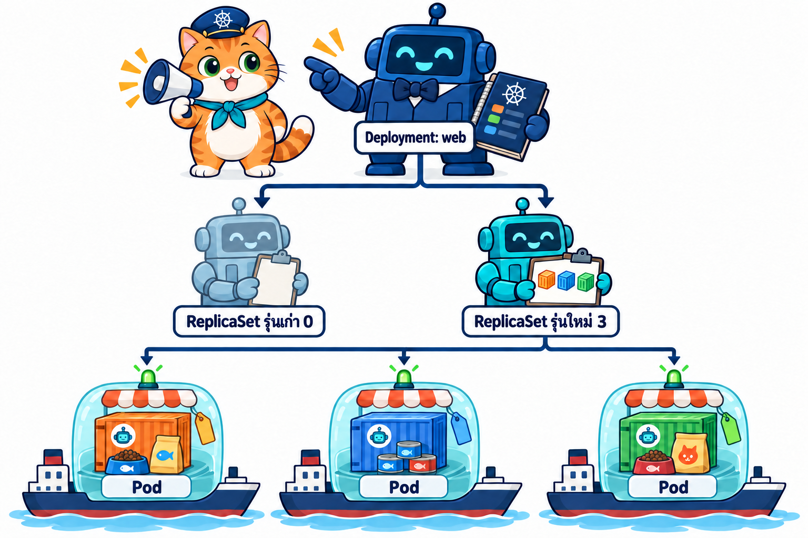<br>
  <em><b>รูปที่ 4</b> ลำดับชั้น: Deployment (ผู้จัดการร้าน) → ReplicaSet (หัวหน้ากะ 1 คนต่อ 1 template) → Pod (บูธ) — เราสั่ง Deployment อย่างเดียว</em>
</p>

Deployment **ไม่ได้สร้าง Pod เอง** แต่สร้างและคุม **ReplicaSet** อีกทีหนึ่ง โดยมีกติกาสำคัญคือ **ReplicaSet 1 ตัวต่อ Pod template 1 แบบ** (1 รุ่น) เมื่อ template เปลี่ยน Deployment จะสร้าง ReplicaSet ตัวใหม่สำหรับรุ่นใหม่ แล้วค่อย ๆ เพิ่มจำนวน Pod ของตัวใหม่และลดของตัวเก่า ส่วน ReplicaSet ยังทำหน้าที่เดิมจากบทที่ 5 คือดูแลจำนวน Pod ให้ครบ

ความเป็นเจ้าของต่อกันเป็นสายโซ่ผ่าน `ownerReferences` ผลจริงจาก LAB 1 (Deployment `web` ใน namespace `deploy-lab`)

```text
$ kubectl -n deploy-lab get rs -o jsonpath='{.items[0].metadata.ownerReferences}{"\n"}'
[{"apiVersion":"apps/v1","blockOwnerDeletion":true,"controller":true,"kind":"Deployment","name":"web","uid":"df93403a-b04f-4633-a0bc-f94d32833573"}]

$ kubectl -n deploy-lab get pod -o jsonpath='{.items[0].metadata.ownerReferences}{"\n"}'
[{"apiVersion":"apps/v1","blockOwnerDeletion":true,"controller":true,"kind":"ReplicaSet","name":"web-779cb4fbb8","uid":"c2f94260-85e8-45c5-86a7-cac80342ce47"}]
```

- ReplicaSet `web-779cb4fbb8` มีเจ้าของคือ **Deployment `web`** และ Pod มีเจ้าของคือ **ReplicaSet `web-779cb4fbb8`**
- ลบ Deployment = garbage collector ลบ ReplicaSet ทุกรุ่นและ Pod ทั้งหมดตามแบบ cascade (เหมือนลบ ReplicaSet แล้ว Pod หายตามในบทที่ 5)
- เราสั่งงานที่ **Deployment อย่างเดียว** ไม่ต้องสร้างหรือแก้ ReplicaSet เอง

### 2.2 ห้ามแก้ ReplicaSet ที่ Deployment เป็นเจ้าของ

<p align="center" id="fig-5">
  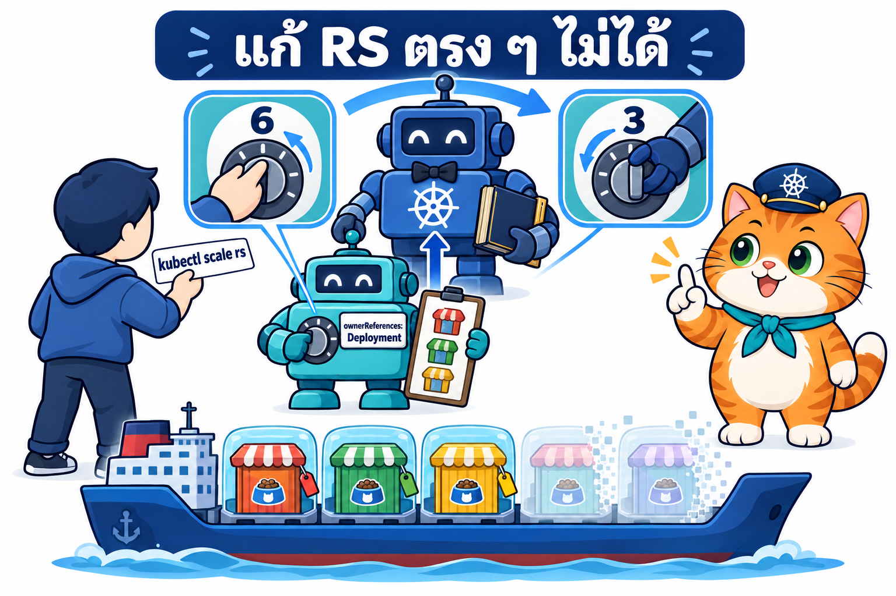<br>
  <em><b>รูปที่ 5</b> ห้ามแก้ ReplicaSet ที่ Deployment เป็นเจ้าของ: scale RS ตรง ๆ เป็น 6 แล้วผู้จัดการร้านหมุนกลับเป็น 3 ทันที (แก้ที่ Deployment เท่านั้น)</em>
</p>

ReplicaSet ที่ Deployment สร้างยังเป็น ReplicaSet ธรรมดา จึงสั่ง `kubectl scale rs` ได้ แต่ **Deployment controller จะปรับกลับเป็นค่าที่ Deployment กำหนด** ทันที ผลจริงจาก LAB 1 เมื่อ scale ReplicaSet ที่มีเจ้าของจาก 3 เป็น 6

```text
$ kubectl -n deploy-lab scale rs web-779cb4fbb8 --replicas=6
replicaset.apps/web-779cb4fbb8 scaled
ADDED      web-779cb4fbb8-nfzp7   0/1     Pending   0          0s
ADDED      web-779cb4fbb8-dp4d2   0/1     Pending   0          0s
ADDED      web-779cb4fbb8-j8d8z   0/1     Pending   0          0s
...
MODIFIED   web-779cb4fbb8-j8d8z   0/1     Terminating         0          0s
...
DELETED    web-779cb4fbb8-j8d8z   0/1     ContainerStatusUnknown   0          1s
...
7s          Normal    ScalingReplicaSet   deployment/web              Scaled down replica set web-779cb4fbb8 from 6 to 3
```

Pod เกินอีก 3 ตัวเกิดขึ้นจริง (`Pending` → `ContainerCreating`) แล้วถูกลบภายในราว 1 วินาที Event ของ Deployment บอกชัดว่า `Scaled down replica set web-779cb4fbb8 from 6 to 3` เช่นเดียวกัน ถ้าแก้ template ของ ReplicaSet ตรง ๆ ก็ไม่เกิด rollout เพราะ Deployment ไม่ได้ดู template ของ ReplicaSet เป็น "ความต้องการ" **ความต้องการอยู่ที่ Deployment เสมอ** จึงต้องแก้ที่ Deployment เท่านั้น

### 2.3 โครงสร้าง manifest ของ Deployment

<p align="center" id="fig-6">
  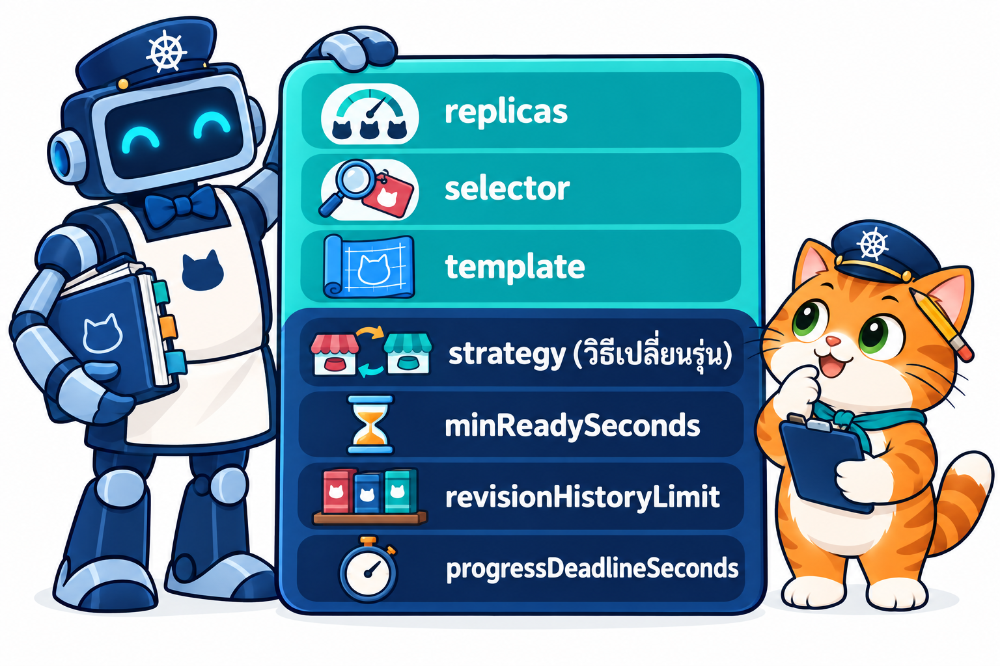<br>
  <em><b>รูปที่ 6</b> โครง manifest ของ Deployment: replicas, selector, template (เหมือน ReplicaSet) + strategy, minReadySeconds, revisionHistoryLimit, progressDeadlineSeconds</em>
</p>

manifest ของ Deployment มีสามส่วนหลักเหมือน ReplicaSet (`replicas`, `selector`, `template`) และเพิ่มฟิลด์ที่ใช้คุมการเปลี่ยนรุ่น ตัวอย่างต่อไปนี้คือไฟล์จริง `02_LAB/labs/lab01-deployment/web.yaml` (ตัดคอมเมนต์บางส่วน)

```yaml
apiVersion: apps/v1
kind: Deployment
metadata:
  name: web
  namespace: deploy-lab
  labels:
    app: web
spec:
  replicas: 3
  selector:                        # เปลี่ยนไม่ได้หลังสร้าง (เหมือน ReplicaSet)
    matchLabels:
      app: web
  template:                        # พิมพ์เขียวของ Pod — แก้ส่วนนี้ = เกิดรุ่นใหม่ (rollout)
    metadata:
      labels:
        app: web
    spec:
      containers:
        - name: web
          image: nginx:1.27-alpine
          env:
            - name: VERSION
              value: v1
          command: ["sh", "-c", "echo \"web $VERSION from $(hostname)\" > /usr/share/nginx/html/index.html && exec nginx -g 'daemon off;'"]
          ports:
            - name: http
              containerPort: 80
          readinessProbe:
            httpGet: { path: /, port: http }
            periodSeconds: 2
          resources:
            requests: { cpu: 10m, memory: 16Mi }
            limits:   { cpu: 100m, memory: 64Mi }
```

แอปตัวอย่างนี้ใช้ nginx ที่เขียนหน้า `index.html` ให้ตอบ `web <VERSION> from <ชื่อ Pod>` จึงเห็นรุ่นและชื่อ Pod ทุกครั้งที่เรียก ไฟล์นี้ไม่ได้เขียนฟิลด์ควบคุม rollout เลย จึงได้ค่า default ทั้งหมด ผลจริงเมื่อถามค่ากลับจาก API

```text
$ kubectl -n deploy-lab get deploy web -o jsonpath='{.spec.strategy}{"\n"}{.spec.revisionHistoryLimit}{"\n"}{.spec.progressDeadlineSeconds}{"\n"}{.spec.minReadySeconds}{"\n"}'
{"rollingUpdate":{"maxSurge":"25%","maxUnavailable":"25%"},"type":"RollingUpdate"}
10
600

```

**ตารางที่ 2** ฟิลด์ของ Deployment ที่ ReplicaSet ไม่มี

| ฟิลด์ | ค่า default | ความหมาย | อุปมา |
|---|---|---|---|
| `strategy.type` | `RollingUpdate` | วิธีเปลี่ยนรุ่น: `RollingUpdate` (ทีละส่วน) หรือ `Recreate` (ปิดหมดก่อน) | เปลี่ยนป้ายทีละบูธ / ปิดร้านก่อน |
| `strategy.rollingUpdate.maxSurge` | `25%` | Pod เกิน `replicas` ได้กี่ตัวระหว่างเปลี่ยน (% ปัดขึ้น) | เพดานจำนวนบูธ |
| `strategy.rollingUpdate.maxUnavailable` | `25%` | Pod ไม่พร้อมได้กี่ตัวระหว่างเปลี่ยน (% ปัดลง) | พื้นจำนวนบูธที่ต้องเปิด |
| `minReadySeconds` | `0` (ช่องว่างในผลด้านบน) | Pod ต้อง ready ต่อเนื่องกี่วินาทีจึงนับเป็น available | นาฬิกาทรายหน้าบูธใหม่ |
| `revisionHistoryLimit` | `10` | เก็บ ReplicaSet รุ่นเก่า (replicas 0) ไว้ย้อนรุ่นได้กี่ตัว | จำนวนหน้าในสมุดบันทึกรุ่น |
| `progressDeadlineSeconds` | `600` | rollout ไม่คืบหน้าเกินกี่วินาทีจึงถือว่าล้มเหลว | นาฬิกาทรายของผู้จัดการ |
| `paused` | `false` | หยุด rollout ชั่วคราว (ใช้ผ่าน `kubectl rollout pause/resume`) | ป้ายพัก |

ข้อควรจำเหมือน ReplicaSet: `selector` **แก้ไม่ได้หลังสร้าง** และต้องตรงกับ label ใน `template.metadata.labels` ส่วนฟิลด์ระดับ `spec` ที่อยู่นอก `template` (เช่น `replicas`, `strategy`, `minReadySeconds`) เปลี่ยนได้โดยไม่ทำให้ Pod ถูกสร้างใหม่ (หัวข้อ 3)

### 2.4 จุดเริ่มเขียน YAML ด้วย --dry-run

<p align="center" id="fig-7">
  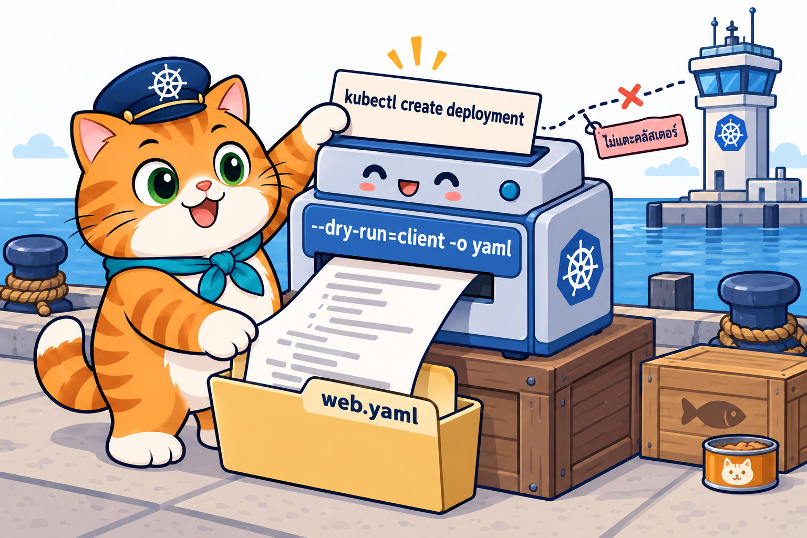<br>
  <em><b>รูปที่ 7</b> เริ่มเขียน YAML จากคำสั่ง: kubectl create deployment ... --dry-run=client -o yaml &gt; web.yaml แล้วแก้ไฟล์ต่อ (ไม่สร้างอะไรในคลัสเตอร์)</em>
</p>

ไม่ต้องจำโครง YAML ทั้งหมด ให้ `kubectl` พิมพ์โครงให้ด้วย `--dry-run=client -o yaml` (ไม่สร้างอะไรในคลัสเตอร์) แล้วเก็บเป็นไฟล์ไปแก้ต่อ ผลจริง

```text
$ kubectl create deployment web --image=nginx:1.27-alpine --replicas=3 --dry-run=client -o yaml
apiVersion: apps/v1
kind: Deployment
metadata:
  labels:
    app: web
  name: web
spec:
  replicas: 3
  selector:
    matchLabels:
      app: web
  strategy: {}
  template:
    metadata:
      labels:
        app: web
    spec:
      containers:
      - image: nginx:1.27-alpine
        name: nginx
        resources: {}
status: {}
```

สิ่งที่ต้องเติมเองก่อนใช้งานจริง: เปลี่ยนชื่อ container (`nginx` → `web` ให้ตรงกับที่จะใช้ใน `set image`), เติม `env`, `command`, `ports`, `readinessProbe` และ `resources` แล้วลบบรรทัดว่างอย่าง `strategy: {}`, `resources: {}`, `status: {}` ออก ไฟล์ `web.yaml` ของ LAB 1 ได้มาด้วยวิธีนี้

### 2.5 อ่านคอลัมน์ READY / UP-TO-DATE / AVAILABLE

<p align="center" id="fig-8">
  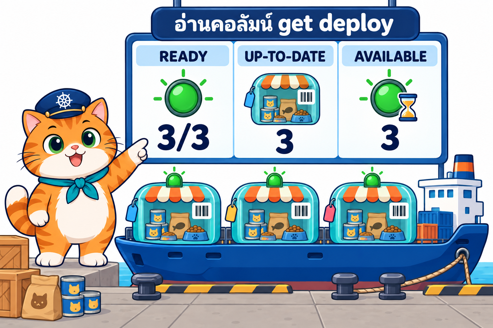<br>
  <em><b>รูปที่ 8</b> อ่านคอลัมน์ kubectl get deploy: READY (Pod พร้อม/ต้องการ), UP-TO-DATE (Pod ที่เป็น template ล่าสุด), AVAILABLE (พร้อมต่อเนื่องครบ minReadySeconds)</em>
</p>

**ตารางที่ 3** คอลัมน์ของ `kubectl get deploy`

| คอลัมน์ | ความหมาย |
|---|---|
| `READY` | Pod ที่ ready / จำนวนที่ต้องการ (`replicas`) — นับทุกรุ่น จึงเกินได้ เช่น `4/3` ระหว่าง surge |
| `UP-TO-DATE` | จำนวน Pod ที่เป็น template **ล่าสุด** แล้ว |
| `AVAILABLE` | Pod ที่ ready ต่อเนื่องครบ `minReadySeconds` (รับลูกค้าได้จริง) |

ตัวอย่างจริงสองสถานการณ์

```text
# ระหว่างรุ่นใหม่พัง (LAB 6): Pod รุ่นเก่า 3 ตัวยังพร้อม, Pod รุ่นใหม่ 1 ตัวดึง image ไม่ได้
NAME   READY   UP-TO-DATE   AVAILABLE   AGE
web    3/3     1            3           37s

# ระหว่าง rollout ที่มี minReadySeconds: 10 (LAB 5): READY ขึ้นก่อน AVAILABLE 10 วินาที
10:14:34 web    4/3     1            3           19s
10:14:44 web    4/3     1            4           29s
```

แถวแรกอ่านว่า "ต้องการ 3 พร้อม 3 (เป็นของรุ่นเก่า) มีรุ่นล่าสุดแค่ 1 และใช้งานได้ 3" ร้านจึงยังขายได้ครบแม้รุ่นใหม่จะพัง ส่วนแถวล่างแสดงว่า Pod ใหม่ ready แล้ว (`4/3`) แต่ต้องรอ 10 วินาทีจึงนับเป็น available

### 2.6 pod-template-hash: สติกเกอร์บาร์โค้ดประจำรุ่น

<p align="center" id="fig-9">
  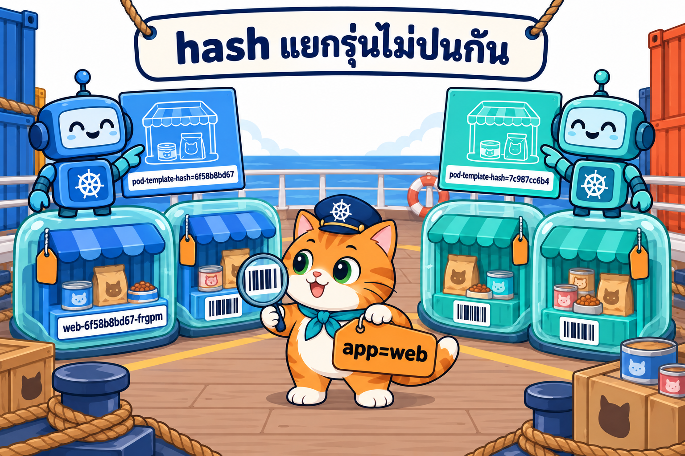<br>
  <em><b>รูปที่ 9</b> pod-template-hash: Deployment ติดป้าย hash ของ template ให้ ReplicaSet และ Pod ของแต่ละรุ่น กันหัวหน้ากะสองรุ่นนับกล่องปนกัน — ชื่อ Pod = &lt;deploy&gt;-&lt;hash&gt;-&lt;สุ่ม&gt;</em>
</p>

Deployment คำนวณ **hash ของ Pod template** แล้วนำไปใช้สามที่ คือ (1) ต่อท้ายชื่อ ReplicaSet `<deploy>-<hash>` (2) เป็น label `pod-template-hash=<hash>` ทั้งใน selector และ template ของ ReplicaSet และ (3) จึงติดไปกับ Pod ทุกตัวของรุ่นนั้น ชื่อ Pod จึงเป็น `<deploy>-<hash>-<สุ่ม 5 ตัว>` ผลจริงจาก LAB 1

```text
NAME                  READY   UP-TO-DATE   AVAILABLE   AGE   LABELS
deployment.apps/web   3/3     3            3           10s   app=web

NAME                             DESIRED   CURRENT   READY   AGE   LABELS
replicaset.apps/web-779cb4fbb8   3         3         3       10s   app=web,pod-template-hash=779cb4fbb8

NAME                       READY   STATUS    RESTARTS   AGE   LABELS
pod/web-779cb4fbb8-4jwkw   1/1     Running   0          10s   app=web,pod-template-hash=779cb4fbb8
pod/web-779cb4fbb8-6xw2m   1/1     Running   0          10s   app=web,pod-template-hash=779cb4fbb8
pod/web-779cb4fbb8-9nkmg   1/1     Running   0          10s   app=web,pod-template-hash=779cb4fbb8
```

**ทำไมต้องมี hash?** ระหว่าง rolling update จะมี ReplicaSet สองรุ่นพร้อมกัน และ Pod ทั้งสองรุ่นมี `app=web` เหมือนกัน (Service ต้องเลือกได้ทั้งคู่) ถ้า ReplicaSet ใช้ selector `app=web` เฉย ๆ หัวหน้ากะสองรุ่นจะนับ Pod ปนกันแบบกับดัก label ในบทที่ 5 label `pod-template-hash` ทำให้ selector ของแต่ละรุ่นต่างกัน เช่น LAB 2 มี `app=web,pod-template-hash=779cb4fbb8` (nginx 1.27) และ `app=web,pod-template-hash=7c974c65c6` (nginx 1.28) อยู่พร้อมกัน ส่วน Service ใช้แค่ `app=web` จึงส่งลูกค้าได้ทั้งสองรุ่น

ReplicaSet ของ Deployment ยังมี annotation ที่ Deployment controller ใช้จดข้อมูล ผลจริง

```text
$ kubectl -n deploy-lab get rs -o jsonpath='{.items[0].metadata.annotations}{"\n"}'
{"deployment.kubernetes.io/desired-replicas":"3","deployment.kubernetes.io/max-replicas":"4","deployment.kubernetes.io/revision":"1"}
```

`revision` คือเลขหน้าในสมุดบันทึกรุ่น และ `max-replicas` คือเพดานจำนวน Pod ระหว่าง rollout (3 + maxSurge 1 = 4 — หัวข้อ 4.2)

> **ข้อควรจำ:** ค่า hash ขึ้นกับเนื้อหา template ถ้า template กลับไปเหมือนรุ่นเก่าทุกตัวอักษร (เช่น `rollout undo`) จะได้ hash เดิมและ Deployment นำ ReplicaSet เก่ากลับมาใช้ ไม่สร้างตัวใหม่ ใน LAB 10 การแปลงร้านสองรอบได้ `som-web-7955fccc94` ทั้งสองรอบเพราะ template เดียวกัน

---

## 3. อะไรทำให้เกิด rollout

<p align="center" id="fig-10">
  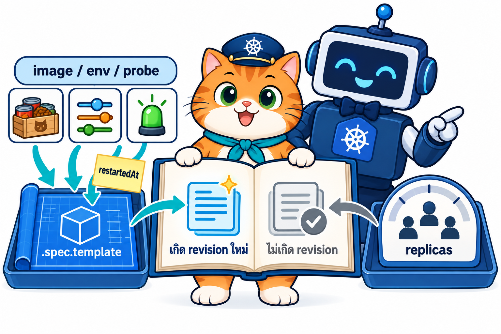<br>
  <em><b>รูปที่ 10</b> rollout (revision ใหม่) เกิดเมื่อ .spec.template เปลี่ยนเท่านั้น (image, env, probe, rollout restart = annotation restartedAt); scale replicas ไม่เกิด revision</em>
</p>

**rollout** คือการเปลี่ยน Pod จากรุ่นหนึ่งไปอีกรุ่น ทุก rollout ได้ **revision** ใหม่ในสมุดบันทึกรุ่น กฎมีข้อเดียว: **rollout เกิดเมื่อ `.spec.template` เปลี่ยนเท่านั้น** (template ใหม่ → hash ใหม่ → ReplicaSet ใหม่ → revision ใหม่)

**ตารางที่ 4** การเปลี่ยนแต่ละแบบเกิด rollout หรือไม่

| การเปลี่ยน | อยู่ใน template? | เกิด rollout / revision ใหม่? | ผลจริงใน LAB |
|---|:---:|:---:|---|
| `image` (`set image`) | ✅ | ✅ | LAB 2, LAB 10 |
| `env` (`set env`) | ✅ | ✅ | LAB 3: `set env VERSION=v3` → revision 3 |
| `command`, probe, `resources`, `lifecycle` | ✅ | ✅ | LAB 5 patch readiness, LAB 7 graceful-patch |
| label/annotation ใน `template.metadata` | ✅ | ✅ | `rollout restart` (ด้านล่าง) |
| `replicas` (`scale`) | ❌ | ❌ | LAB 1: scale 5 → 2 → 3 แล้ว history ยังมี revision 1 แถวเดียว |
| `strategy`, `minReadySeconds`, `progressDeadlineSeconds` | ❌ | ❌ | (มีผลกับ rollout ครั้งถัดไป) |
| annotation ของ Deployment เอง (`metadata.annotations` เช่น change-cause) | ❌ | ❌ | LAB 3: annotate แล้วไม่มี Pod ใหม่ |

ผลจริงจาก LAB 1 หลัง scale 5 → 2 → 3

```text
deployment.apps/web 
REVISION  CHANGE-CAUSE
1         <none>
```

**`kubectl rollout restart`** ใช้เมื่ออยากได้ Pod ใหม่ทั้งหมดด้วย image เดิม (เช่น ให้ initContainer รันใหม่) คำสั่งนี้เติม annotation `kubectl.kubernetes.io/restartedAt` ลงใน **template** template จึงเปลี่ยนและเกิด rollout ตามปกติ ผลจริงจาก LAB 3

```text
$ kubectl -n deploy-lab get deploy web -o jsonpath="{.spec.template.metadata.annotations}{\"\n\"}"
{"kubectl.kubernetes.io/restartedAt":"2026-10-05T10:09:39+07:00"}
```

ใน LAB 10 ใช้ `rollout restart deploy/som-web` "เติมสินค้าใหม่" หลังฐานข้อมูลว่าง แทนการลบ Pod เองแบบบทที่ 6 เพราะทยอยเปลี่ยนทีละบูธตามกติกาของ strategy

> **ข้อควรจำ:** ถ้า template กลับไปเหมือน revision เก่าทุกตัวอักษร Deployment จะนำ ReplicaSet เก่า (hash เดิม) กลับมาขยาย ไม่สร้าง ReplicaSet ใหม่ แต่ยังนับเป็น revision ใหม่ เช่น LAB 3 `rollout undo --to-revision=2` ใช้ RS `web-7c974c65c6` เดิมกลับมาเป็น revision 5

---

## 4. RollingUpdate: maxSurge / maxUnavailable และ Recreate

### 4.1 ลำดับของ rolling update

<p align="center" id="fig-11">
  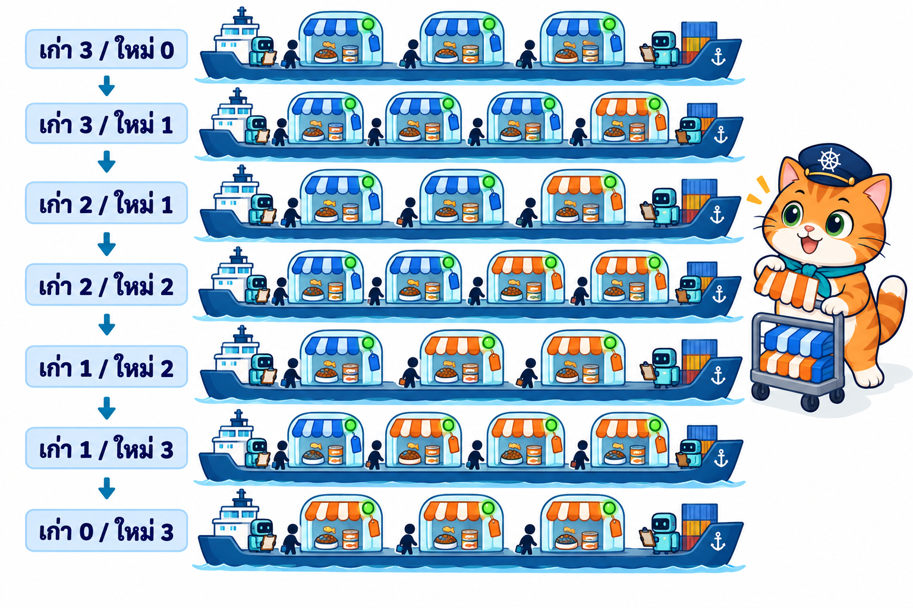<br>
  <em><b>รูปที่ 11</b> rolling update replicas 3 ค่า default (+1/−0): ลำดับ Events จริง — RS ใหม่ 0→1, เก่า 3→2, ใหม่ 1→2, เก่า 2→1, ใหม่ 2→3, เก่า 1→0 ร้านไม่ปิดเลย</em>
</p>

ค่า default ของ Deployment คือ `RollingUpdate` กับ `maxSurge: 25%` และ `maxUnavailable: 25%` สำหรับ `replicas: 3` คำนวณได้ maxSurge = 1 (ปัดขึ้น) และ maxUnavailable = 0 (ปัดลง) จึงมี Pod ได้สูงสุด 4 ตัว และต้องพร้อมอย่างน้อย 3 ตัวตลอด ผลจริงจาก LAB 2 (`kubectl apply -f lab02-rolling/web-v2.yaml` เปลี่ยน nginx 1.27 → 1.28 และ `VERSION` v1 → v2)

```text
Events:
  Type    Reason             Age                From                   Message
  ----    ------             ----               ----                   -------
  ...
  Normal  ScalingReplicaSet  52s                deployment-controller  Scaled up replica set web-7c974c65c6 from 0 to 1
  Normal  ScalingReplicaSet  45s                deployment-controller  Scaled down replica set web-779cb4fbb8 from 3 to 2
  Normal  ScalingReplicaSet  45s                deployment-controller  Scaled up replica set web-7c974c65c6 from 1 to 2
  Normal  ScalingReplicaSet  37s                deployment-controller  Scaled down replica set web-779cb4fbb8 from 2 to 1
  Normal  ScalingReplicaSet  35s (x2 over 37s)  deployment-controller  (combined from similar events): Scaled down replica set web-779cb4fbb8 from 1 to 0
```

ลำดับคือ **ใหม่ 0→1 → เก่า 3→2 → ใหม่ 1→2 → เก่า 2→1 → ใหม่ 2→3 → เก่า 1→0** (pre-check ได้ครบ 6 บรรทัด ในรอบ LAB ขั้น "ใหม่ 2→3" ถูกรวมกับบรรทัดท้ายเป็น `(combined from similar events)` จึงเห็น 5 บรรทัด) ทุกขั้นที่ลด RS เก่า Deployment จะรอให้ Pod ใหม่ **ready** ก่อนเสมอ RS เก่าไม่ถูกลบ แต่เหลือ `0 0 0` ไว้สำหรับย้อนรุ่น

```text
NAME             DESIRED   CURRENT   READY   AGE    CONTAINERS   IMAGES              SELECTOR
web-779cb4fbb8   0         0         0       116s   web          nginx:1.27-alpine   app=web,pod-template-hash=779cb4fbb8
web-7c974c65c6   3         3         3       53s    web          nginx:1.28-alpine   app=web,pod-template-hash=7c974c65c6
```

rollout ครั้งนี้ใช้ 17.5 วินาที (รวมดึง image nginx 1.28 ครั้งแรก) Pod `client` ที่ยิง `wget http://web` วนทุก 0.2 วินาทีได้คำตอบ 168 ครั้ง เป็น v1 81 ครั้งและ v2 87 ครั้ง **ไม่มี error** ชื่อ Service `web` คงเดิมตลอด

### 4.2 คำนวณ maxSurge และ maxUnavailable

<p align="center" id="fig-12">
  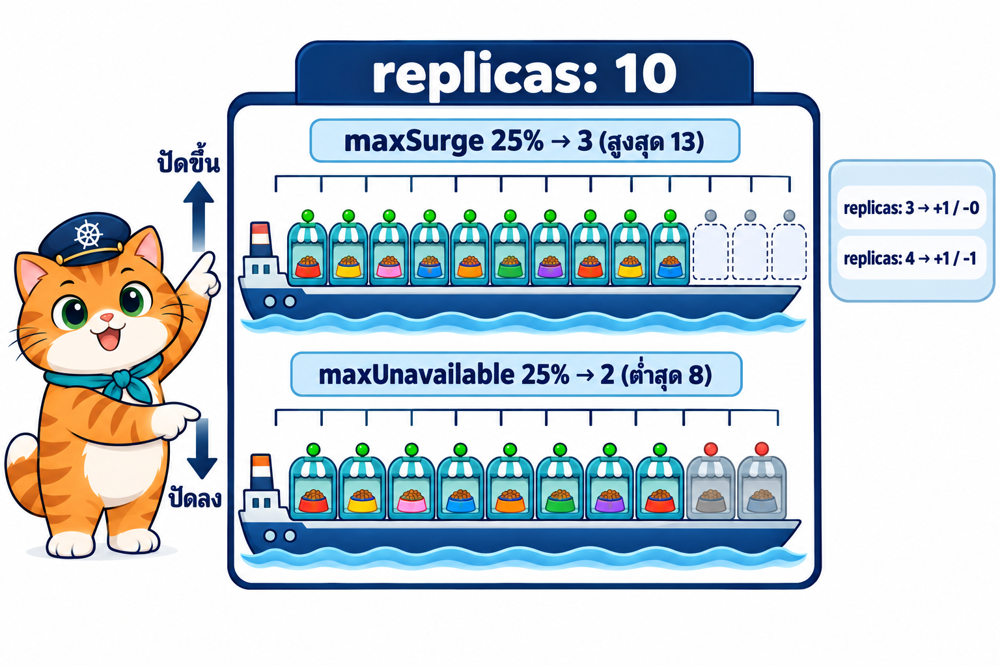<br>
  <em><b>รูปที่ 12</b> maxSurge ปัดขึ้น / maxUnavailable ปัดลง (default 25%/25%): replicas 3 → +1/−0, 4 → +1/−1, 10 → +3/−2 (สูงสุด 13 พร้อมอย่างน้อย 8); ตั้งเป็น 0 ทั้งคู่ไม่ได้</em>
</p>

- **maxSurge** = จำนวน Pod ที่ **เกิน** `replicas` ได้ระหว่างเปลี่ยน ถ้าเป็น % ให้ **ปัดขึ้น**
- **maxUnavailable** = จำนวน Pod ที่ **ไม่พร้อม** ได้ระหว่างเปลี่ยน ถ้าเป็น % ให้ **ปัดลง**
- เพดาน = `replicas + maxSurge` และพื้น (พร้อมอย่างน้อย) = `replicas − maxUnavailable`

**ตารางที่ 5** ค่า default 25%/25% กับ replicas ต่าง ๆ (ยืนยันจริงใน LAB 1, 4, 5)

| replicas | maxSurge (25% ปัดขึ้น) | maxUnavailable (25% ปัดลง) | Pod สูงสุด | พร้อมอย่างน้อย | ผลจริง |
|:---:|:---:|:---:|:---:|:---:|---|
| 3 | 1 | 0 | 4 | 3 | annotation `max-replicas: 4` (LAB 1), `READY 4/3` (LAB 5) |
| 4 | 1 | 1 | 5 | 3 | LAB 4 `rolling`: active สูงสุด 5 พร้อมต่ำสุด 3 |
| 10 | 3 (2.5 → 3) | 2 (2.5 → 2) | 13 | 8 | LAB 4: active สูงสุด 13 พร้อมต่ำสุด 8, `max-replicas: 13` |

ตั้ง `maxSurge: 0` และ `maxUnavailable: 0` พร้อมกันไม่ได้ (ห้ามเกินและห้ามขาด = เปลี่ยนรุ่นไม่ได้เลย) ผลจริง

```text
The Deployment "zero" is invalid: spec.strategy.rollingUpdate.maxUnavailable: Invalid value: 0: may not be 0 when `maxSurge` is 0
```

**ตารางที่ 6** รูปแบบที่ใช้บ่อย

| รูปแบบ | ข้อดี | ข้อเสีย | ใช้ในบทนี้ |
|---|---|---|---|
| `maxSurge: 1, maxUnavailable: 0` | จำนวน Pod ที่พร้อมไม่ลดเลย ปลอดภัยที่สุด | ต้องมีทรัพยากรเผื่อ 1 Pod, ช้ากว่า | `som-web` (LAB 10), graceful-patch (LAB 7) |
| `maxSurge: 0, maxUnavailable: 1` | ไม่ใช้ทรัพยากรเพิ่ม | ระหว่างเปลี่ยนพร้อมน้อยลง 1 ตัว | `nosurge.yaml` (LAB 4) |
| default `25% / 25%` | สมดุล | replicas น้อยอาจได้ maxUnavailable 0 หรือ 1 แล้วแต่จำนวน | LAB 1–3, `rolling.yaml` |
| `maxSurge: 100%` | เร็ว เปิดรุ่นใหม่ครบชุดก่อน | ใช้ทรัพยากร 2 เท่าชั่วคราว | (กล่าวถึง) |

### 4.3 Recreate: ปิดทุกบูธก่อนแล้วค่อยเปิดใหม่

<p align="center" id="fig-13">
  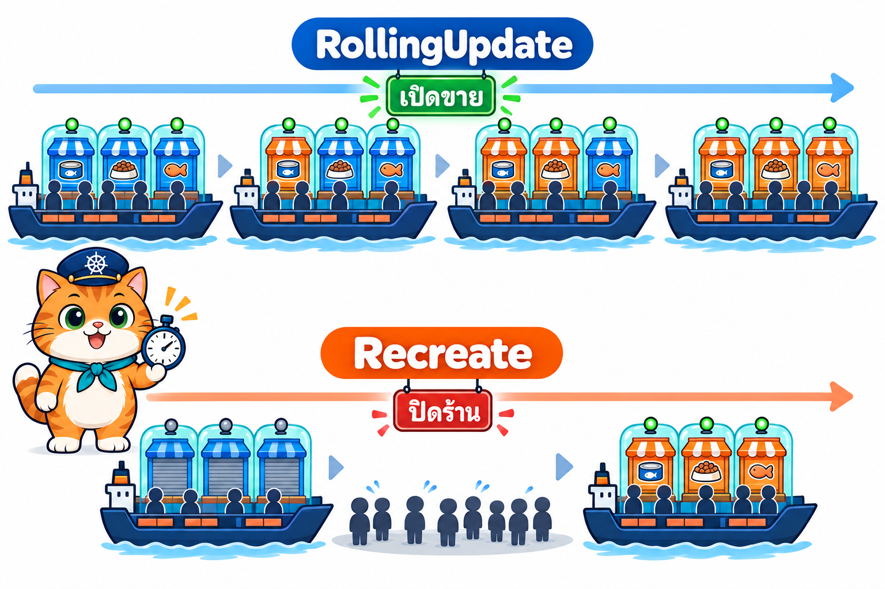<br>
  <em><b>รูปที่ 13</b> RollingUpdate vs Recreate: Recreate ปิดทุกบูธเก่าก่อนแล้วค่อยเปิดรุ่นใหม่ (มีช่วงร้านปิด) เหมาะกับงานที่ห้ามมี 2 รุ่นพร้อมกัน</em>
</p>

`strategy.type: Recreate` สั่งให้ Deployment scale ReplicaSet เก่าเป็น 0 **รอจน Pod เก่าหายหมด** แล้วค่อยสร้าง Pod รุ่นใหม่ จึงมีช่วงที่ไม่มี Pod พร้อมเลย ผลจริงจาก LAB 4 (`recreate.yaml` 4 replicas) ตัวนับ Pod ของผู้ทดสอบเห็น

```text
recreate: Pod active สูงสุด=4 (รวมตัวที่กำลังปิด สูงสุด=7)  Ready ต่ำสุด=0
10:12:59.7 active=4 ready=4 closing=0
10:13:00.9 active=0 ready=0 closing=4
10:13:01.7 active=0 ready=0 closing=3
10:13:01.9 active=4 ready=0 closing=3
10:13:02.6 active=4 ready=0 closing=0
10:13:02.9 active=4 ready=1 closing=0
10:13:03.6 active=4 ready=4 closing=0
```

ช่วงที่ไม่มี Pod พร้อมเลยยาวราว 2 วินาที (10:13:00.9 → 10:13:02.9) สำหรับ nginx ที่เริ่มเร็ว แอปจริงที่เริ่มช้าจะยาวกว่านี้มาก Recreate จึงใช้เฉพาะเมื่อ **สองรุ่นอยู่พร้อมกันไม่ได้**

### 4.4 ทำไม som-db ใช้ Recreate

<p align="center" id="fig-14">
  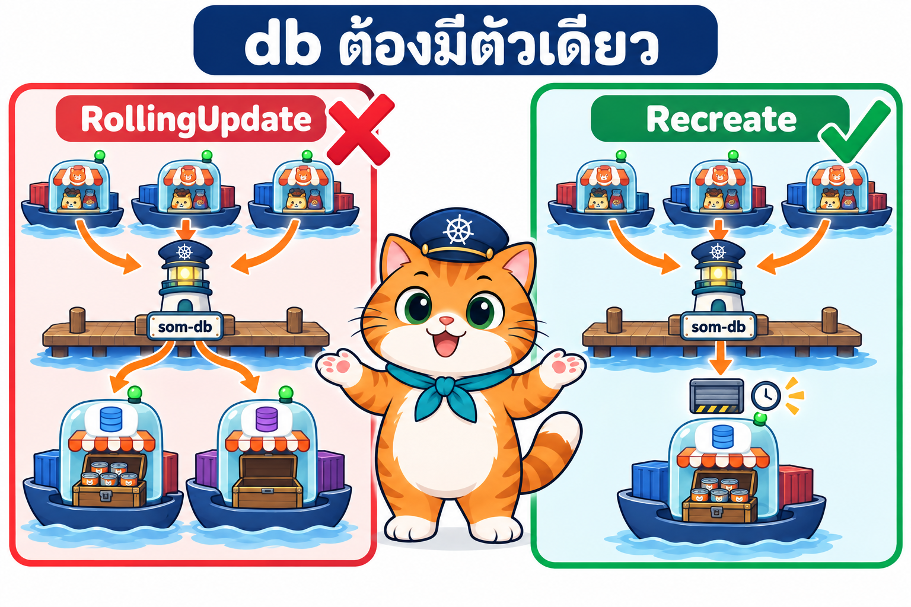<br>
  <em><b>รูปที่ 14</b> ทำไม som-db ใช้ Recreate: ถ้า rolling จะมี postgres 2 ตัวพร้อมกัน แต่ละตัวมีข้อมูลของตัวเอง (emptyDir) Service som-db จะส่ง web ไปคนละฐานข้อมูล — Recreate รับประกันว่ามีตัวเดียว</em>
</p>

ฐานข้อมูล `som-db` ของร้านเก็บข้อมูลใน `emptyDir` ของ Pod ตัวเอง ถ้าใช้ RollingUpdate จะมีช่วงที่ postgres 2 ตัวรันพร้อมกัน แต่ละตัวมีข้อมูลของตัวเอง และ Service `som-db` จะสุ่มส่ง web ไปคนละฐานข้อมูล ออเดอร์จึงกระจัดกระจาย ไฟล์จริง `som-shop-v3/k8s/10-db.yaml` จึงกำหนด

```yaml
spec:
  # replicas ต้องเป็น 1 — postgres 2 ตัว "ไม่แชร์ข้อมูลกัน" (Service จะสุ่มส่งไปคนละ db)
  replicas: 1
  # Recreate = ปิด Pod db เดิมให้หมดก่อน แล้วค่อยสร้างตัวใหม่ → ไม่มีช่วงที่ postgres 2 ตัวอยู่พร้อมกัน
  strategy:
    type: Recreate
```

ผลจริงจาก LAB 10 เมื่อสั่ง `kubectl -n som-shop rollout restart deploy/som-db` (เสริม) — Pod เก่าปิดเสร็จก่อน แล้วตัวใหม่จึงเกิด

```text
10:36:51 som-db-66sc7   1/1     Terminating   0          77s
10:36:52 som-db-66sc7   0/1     Completed     0          78s
10:36:52 som-db-786556dc4f-ljl5d   0/1     Pending       0          0s
10:36:52 som-db-786556dc4f-ljl5d   0/1     ContainerCreating   0          0s
10:36:52 som-db-786556dc4f-ljl5d   0/1     Running             0          0s
10:36:56 som-db-786556dc4f-ljl5d   1/1     Running             0          4s
```

ไม่มีช่วงที่มี db 2 ตัว แต่แลกมาด้วยช่วงที่ไม่มี db (และเพราะเป็น `emptyDir` ข้อมูลก็หายไปกับ Pod เก่า — ปัญหาที่ส่งต่อบทถัดไป) ในอนาคตเมื่อใช้ volume ที่เขียนได้ทีละ Node (ReadWriteOnce) ก็มักต้องใช้ Recreate ด้วยเหตุผลคล้ายกัน

> **ข้อควรจำ:** strategy อยู่ **นอก** template ตอนแปลง `som-db` จาก ReplicaSet เป็น Deployment ใน LAB 10 template เหมือนเดิมทุกตัวอักษร จึงไม่เกิด rollout เลย (Pod db เดิมอยู่ต่อ ข้อมูลไม่หาย — หัวข้อ 10) Recreate มีผลครั้งแรกเมื่อมี rollout ครั้งถัดไป

---

## 5. readinessProbe และ minReadySeconds ตัดสินจังหวะ rollout

<p align="center" id="fig-15">
  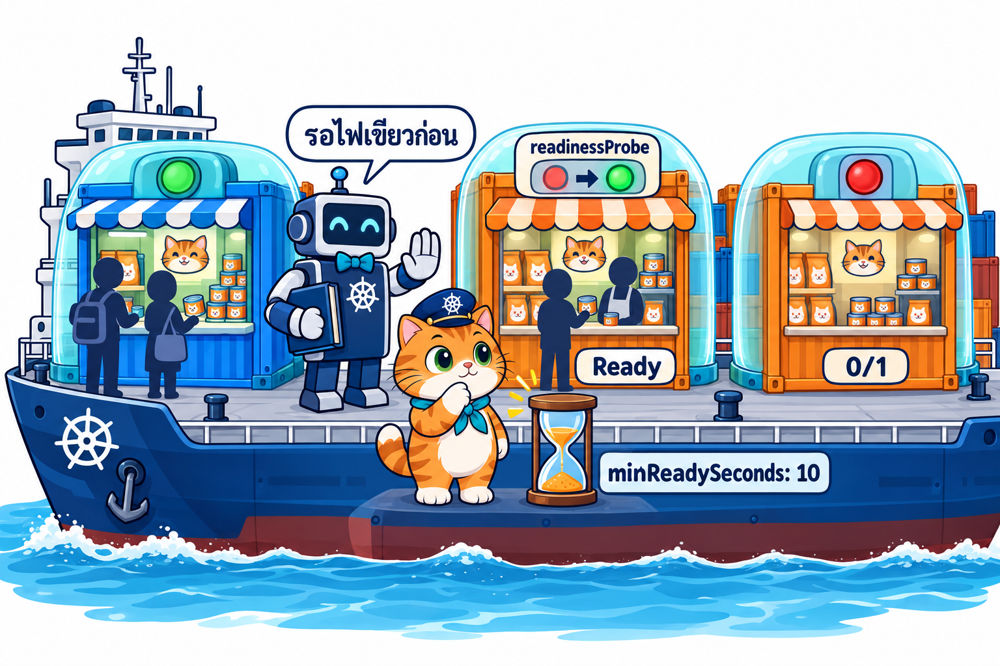<br>
  <em><b>รูปที่ 15</b> readinessProbe และ minReadySeconds คุมจังหวะ rollout: บูธใหม่ต้องไฟเขียว (และเขียวต่อเนื่องตาม minReadySeconds) ก่อนจึงปิดบูธเก่าตัวถัดไป</em>
</p>

Deployment จะลด ReplicaSet เก่าได้ก็ต่อเมื่อ Pod ใหม่ **available** แล้ว ซึ่งหมายถึง ready (readinessProbe ผ่าน) **ต่อเนื่องครบ `minReadySeconds`** ผลจริงจาก LAB 5 (`web-minready.yaml` มี `minReadySeconds: 10`) เมื่อ `set env VERSION=v2` แล้วเฝ้าดู `kubectl get deploy web -w`

```text
10:14:33 web    3/3     1            3           18s
10:14:34 web    4/3     1            3           19s
10:14:44 web    4/3     1            4           29s
10:14:44 web    3/3     1            3           29s
10:14:44 web    3/3     2            3           29s
10:14:45 web    4/3     2            3           30s
10:14:55 web    4/3     2            4           40s
...
10:15:06 web    4/3     3            4           51s
10:15:06 web    3/3     3            3           51s
```

ทุกรอบ AVAILABLE ตามหลัง READY ราว 10 วินาทีพอดี rollout 3 replicas จึงใช้ 32.8 วินาที (3 รอบ × ~11 วินาที) `minReadySeconds` ช่วยกันแอปที่ "ready แป๊บเดียวแล้วล้ม" ไม่ให้ rollout เดินหน้าเร็วเกินไป

ถ้า readiness ของรุ่นใหม่ **ไม่ผ่านเลย** rollout จะค้าง แต่ `maxUnavailable` กันไม่ให้ Pod เก่าถูกลดเกินกำหนด ผลจริงจาก LAB 5 เมื่อ patch readiness ไปที่ path `/nope`

```text
NAME                   READY   STATUS    RESTARTS   AGE
web-545bffc4f7-cmx98   0/1     Running   0          12s
web-7b6cd79469-4cs6x   1/1     Running   0          47s
web-7b6cd79469-5q45x   1/1     Running   0          58s
web-7b6cd79469-cftkh   1/1     Running   0          36s
...
  Warning  Unhealthy  1s (x6 over 11s)  kubelet            spec.containers{web}: Readiness probe failed: HTTP probe failed with statuscode: 404
```

Pod ใหม่ `0/1 Running` ตลอด Pod เก่า 3 ตัวยังรับลูกค้า (client 149 ครั้งได้ v2 ทั้งหมด ไม่มี error) และ EndpointSlice มี endpoint ของ Pod ใหม่เป็น `ready=false`

<p align="center" id="fig-16">
  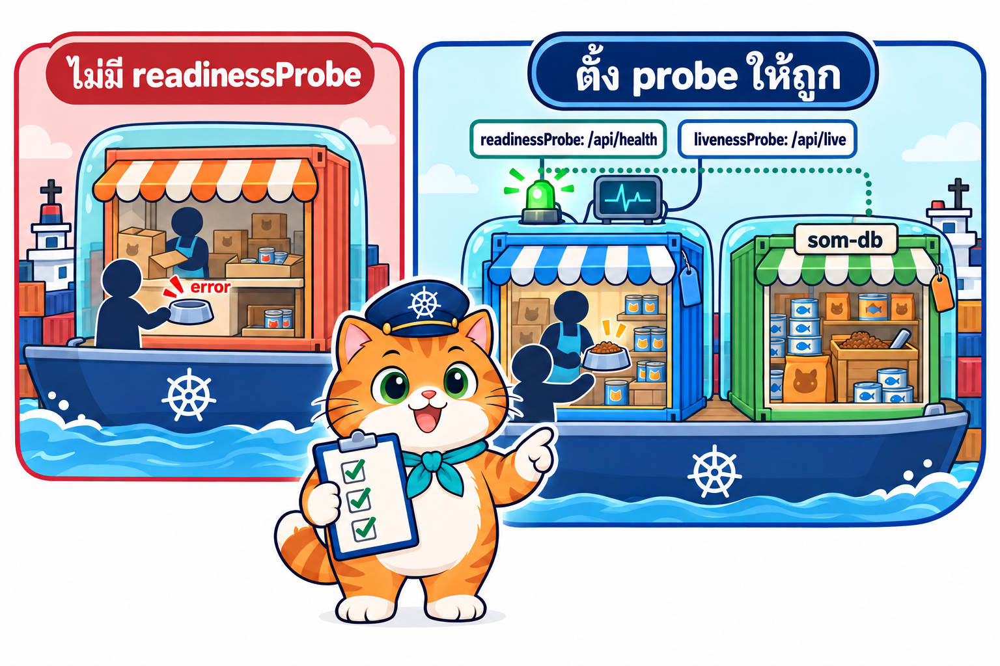<br>
  <em><b>รูปที่ 16</b> ไม่มี readinessProbe = ถือว่าพร้อมทันทีที่ container start (ลูกค้าเจอ error ระหว่าง rollout); readiness ตรวจ db ได้ แต่ liveness ไม่ควรพึ่ง db (db ล่มแล้ว web ถูก restart ทั้งร้าน)</em>
</p>

**ไม่มี readinessProbe = ถือว่าพร้อมทันทีที่ container start** Deployment จึงนับ Pod ใหม่เป็น available ทั้งที่แอปอาจยังโหลดไม่เสร็จ แล้วรีบปิด Pod เก่า ลูกค้าจึงเจอ error ระหว่าง rollout ทุก Deployment ในบทนี้จึงมี readinessProbe

**readiness ตรวจ db ได้ แต่ liveness ไม่ควรพึ่ง db** ร้าน `som-web` ใช้

| probe | path | ตรวจอะไร | ถ้าล้ม |
|---|---|---|---|
| readinessProbe | `/api/health` | ต่อ db ได้ไหม (`SELECT 1`) | Pod ถูกถอดจาก endpoint (ไม่ได้ลูกค้า) แต่ไม่ถูก restart |
| livenessProbe | `/api/live` | process ยังตอบอยู่ (ไม่แตะ db) | kubelet restart container |

ผลจริงใน LAB 10 หลังลบ Pod db: web ทั้ง 5 ตัวมี Event `Readiness probe failed: HTTP probe failed with statuscode: 503` และหลุดจาก endpoint ชั่วครู่ แต่ **ไม่มีตัวไหนถูก restart** ถ้า liveness ตรวจ db ด้วย db ที่ล่มเพียงตัวเดียวจะทำให้ web ทุกตัวถูก restart พร้อมกันทั้งร้าน

---

## 6. zero-downtime rollout

### 6.1 ลำดับการปิด Pod

<p align="center" id="fig-17">
  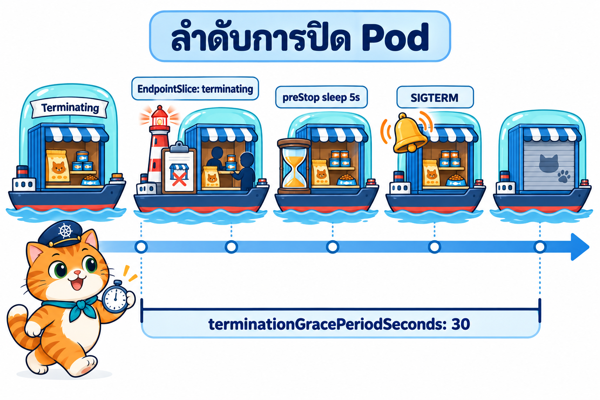<br>
  <em><b>รูปที่ 17</b> ลำดับการปิด Pod: ถูกสั่งลบ → endpoint เปลี่ยนเป็น terminating (ต่อจากบท 006) พร้อมกับ preStop sleep → SIGTERM → แอปปิด graceful — ทั้งหมดต้องจบใน terminationGracePeriodSeconds</em>
</p>

เมื่อ Deployment ลด ReplicaSet เก่า Pod ที่ถูกเลือกจะถูกสั่งลบ แล้วเกิดสองเรื่อง **พร้อมกัน** (ไม่ได้รอกัน)

1. **ฝั่งเครือข่าย:** endpoint ของ Pod ใน EndpointSlice เปลี่ยนเป็น `serving/terminating` (ไม่ ready — ทบทวนบทที่ 6) แล้ว kube-proxy บน **ทุก Node** ค่อย ๆ อัปเดตกฎ ระหว่างนี้บาง Node อาจยังส่งลูกค้ามาที่ Pod นี้
2. **ฝั่ง Pod:** kubelet รัน `preStop` (ถ้ามี) → ส่งสัญญาณหยุด (SIGTERM หรือ STOPSIGNAL ของ image) → แอปปิดอย่างสุภาพ → ถ้าเกิน `terminationGracePeriodSeconds` (default 30) ถูก SIGKILL

ถ้าแอปปิดเร็วกว่าที่ทุก Node อัปเดตกฎเสร็จ ลูกค้าที่ถูกส่งมาช่วงนั้นจะเจอ `Connection reset by peer` หรือ `Empty reply from server` ทางแก้คือให้ Pod **ยังเสิร์ฟต่ออีกสักพัก** ด้วย `preStop`

```yaml
spec:
  template:
    spec:
      terminationGracePeriodSeconds: 30   # เวลารวม (preStop + ปิดแอป) ก่อนโดน SIGKILL
      containers:
        - name: web
          lifecycle:
            preStop:
              sleep:
                seconds: 5           # sleep action ของ kubelet — ไม่ต้องมีคำสั่ง sleep ใน image
```

`preStop.sleep` เป็น action ของ kubelet เอง จึงใช้ได้แม้ image ไม่มีโปรแกรม `sleep` (เช่น image แบบ distroless)

### 6.2 สูตร zero-downtime และผลจริง

<p align="center" id="fig-18">
  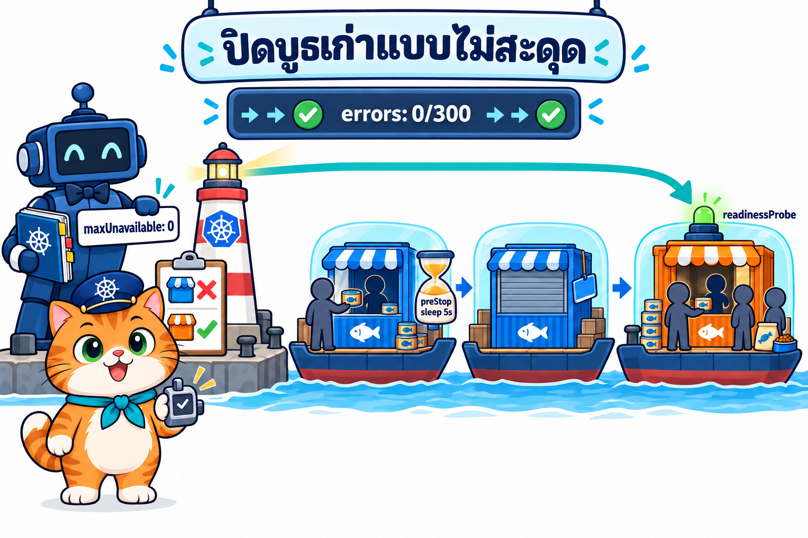<br>
  <em><b>รูปที่ 18</b> zero-downtime rollout: readinessProbe + maxUnavailable: 0 + preStop sleep + grace period ให้บูธเก่าเลิกรับลูกค้าใหม่ก่อนปิดจริง — pre-check ร้าน Next.js ได้ 0 error จาก 300 คำขอสองรอบ</em>
</p>

สูตรที่ใช้ในบทนี้

1. **readinessProbe** — รอบูธใหม่พร้อมจริงก่อนนับ
2. **`maxUnavailable: 0`** (คู่กับ `maxSurge: 1`) — จำนวนบูธพร้อมไม่ลดเลย
3. **`preStop.sleep.seconds: 5`** — บูธที่ถูกขีดชื่อยังเสิร์ฟต่อ 5 วินาที ระหว่างที่ทุก Node ลบมันออกจากรายชื่อ
4. **`terminationGracePeriodSeconds` พอ** — มากกว่า preStop + เวลาปิดแอป
5. **แอปจัดการสัญญาณหยุดได้** — image nginx ทางการใช้ STOPSIGNAL SIGQUIT (ปิดแบบ graceful)

**ตารางที่ 7** ผลจริงที่นับด้วย `hit.sh -q` (curl ใหม่ทุกครั้ง 300 ครั้ง ห่างกัน 0.1 วินาที) ระหว่าง rollout

| แอป / LAB | ไม่มี preStop (strategy default) | preStop 5 + maxSurge 1 / maxUnavailable 0 |
|---|---|---|
| nginx ผ่าน NodePort 30080 (LAB 7) | err **4, 4, 1** / 300 (3 รอบ) | err **0, 0, 0** / 300 (3 รอบ) |
| ร้าน Next.js `som-web` (LAB 10) | ตอนแปลงจาก ReplicaSet ที่ Pod เดิมยังไม่มี preStop: err **2** และ **1** / 300 | rolling 1.2→1.3, undo 2 ครั้ง, รุ่นพัง 1.4, rollout restart 5 replicas: err **0** / 300 ทุกครั้ง |

ข้อความ error รอบที่ไม่มี preStop เป็นแบบนี้ (LAB 7 รอบ v2)

```text
ข้อความ error:
      1 curl: (28) Operation timed out
      3 curl: (56) Recv failure: Connection reset by peer
ช่วงที่มี err: 2.6 วินาที
ok=296 err=4 (ใช้เวลา 33.9 วินาที)
```

ตัวเลข error เป็นการสุ่ม ขึ้นกับจังหวะและความเร็วเครื่อง (บางรอบได้ 1 บางรอบได้ 4) แต่รอบที่ใช้สูตรครบได้ 0 ทุกครั้งที่ทดลอง

> **ข้อสังเกต:** Pod Next.js ที่ถูกปิดจะขึ้น `Terminating` แล้วเป็น `0/1 Error` ราว 5 วินาทีต่อมา (หลัง preStop แล้วรับ SIGTERM ออกด้วย exit code ไม่เป็น 0) ส่วน nginx/postgres ขึ้น `0/1 Completed` **ทั้งสองแบบเป็นบูธที่กำลังปิด ไม่ใช่ rollout พัง**

---

## 7. progressDeadlineSeconds: rollout ค้างแต่ร้านยังขาย

<p align="center" id="fig-19">
  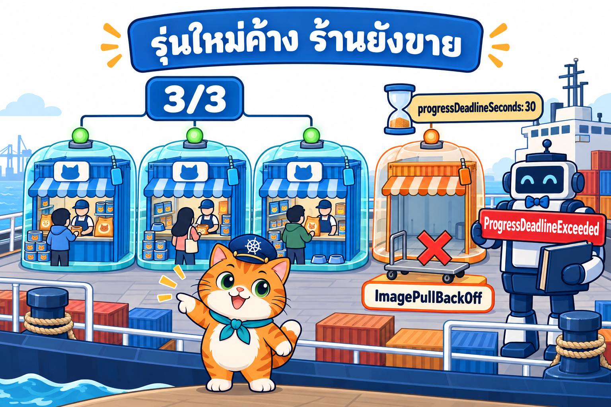<br>
  <em><b>รูปที่ 19</b> รุ่นใหม่พัง (image tag ผิด → ImagePullBackOff): rollout ค้าง บูธรุ่นเก่ายังเปิดขายครบ เมื่อเกิน progressDeadlineSeconds สถานะเป็น ProgressDeadlineExceeded</em>
</p>

ถ้า rollout ไม่คืบหน้าเกิน `progressDeadlineSeconds` (default 600 วินาที) Deployment จะตั้ง condition `Progressing=False` ด้วยเหตุผล `ProgressDeadlineExceeded` และ `kubectl rollout status` จะจบด้วย exit code 1 ผลจริงจาก LAB 6 (`progressDeadlineSeconds: 30`) หลัง `kubectl -n broken-lab set image deploy/web web=nginx:9.99-nope` (tag ที่ไม่มีจริง)

```text
$ kubectl -n broken-lab rollout status deploy/web; echo "exit=$?"
Waiting for deployment "web" rollout to finish: 1 out of 3 new replicas have been updated...
error: deployment "web" exceeded its progress deadline
exit=1

$ kubectl -n broken-lab get deploy web -o jsonpath='{range .status.conditions[*]}{.type}={.status} {.reason}: {.message}{"\n"}{end}'
Available=True MinimumReplicasAvailable: Deployment has minimum availability.
Progressing=False ProgressDeadlineExceeded: ReplicaSet "web-b6c6fccd4" has timed out progressing.
```

Pod ใหม่ขึ้น `ErrImagePull` ภายใน 4 วินาที แล้วสลับเป็น `ImagePullBackOff` ReplicaSet ใหม่ค้างที่ `1 1 0` ส่วนรุ่นเก่ายัง `3 3 3`

<p align="center" id="fig-20">
  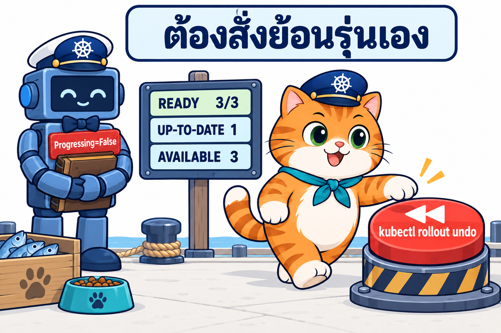<br>
  <em><b>รูปที่ 20</b> Kubernetes ไม่ rollback ให้อัตโนมัติ: เกิน deadline แล้วแค่ตั้ง Progressing=False (READY 3/3, UP-TO-DATE 1, AVAILABLE 3) คนต้องสั่ง rollout undo เอง</em>
</p>

**Kubernetes ไม่ rollback ให้เอง** เมื่อเกิน deadline มันแค่ตั้ง condition ไว้ Pod ใหม่ที่พังยังพยายามดึง image ต่อไป แต่ร้าน **ยังขายได้ครบ** เพราะ `maxUnavailable` ไม่ยอมให้ลด Pod เก่าจนกว่า Pod ใหม่จะพร้อม

```text
NAME   READY   UP-TO-DATE   AVAILABLE   AGE
web    3/3     1            3           37s
```

ระหว่าง 60 วินาทีที่รุ่นใหม่พัง client ยิงได้ 297 ครั้ง ได้ `web v1` ทั้งหมด ร้าน `som-web` ใน LAB 10 ก็เหมือนกัน รุ่น 1.4 ที่ไม่มี image ทำให้ `rollout status` จบด้วย `error: deployment "som-web" exceeded its progress deadline` ราว 60 วินาทีหลังสั่ง ระหว่างนั้น `hit.sh` ยิง 700 ครั้งได้ `ok=700 err=0` และยังสั่งซื้อได้ (`order_id 5`)

คนหรือระบบ CI/CD ต้องตัดสินใจเอง วิธีที่ใช้บ่อยคือให้ pipeline รัน `kubectl rollout status` แล้วดู exit code ถ้าไม่เป็น 0 ให้สั่ง `kubectl rollout undo` ต่อ

---

## 8. คำสั่ง rollout: history, change-cause, undo, pause, restart

**ตารางที่ 8** คำสั่งในกลุ่ม `kubectl rollout`

| คำสั่ง | ใช้ทำอะไร |
|---|---|
| `kubectl rollout status deploy/<ชื่อ>` | รอจน rollout จบ (exit 0) หรือเกิน deadline (exit 1) ใส่ `--timeout=5s` เพื่อไม่ให้รอนาน |
| `kubectl rollout history deploy/<ชื่อ> [--revision=N]` | ดูสมุดบันทึกรุ่น / ดู template ของ revision N |
| `kubectl rollout undo deploy/<ชื่อ> [--to-revision=N]` | ย้อนไปรุ่นก่อนหน้า หรือรุ่น N |
| `kubectl rollout pause` / `resume deploy/<ชื่อ>` | หยุด / ปล่อย rollout |
| `kubectl rollout restart deploy/<ชื่อ>` | สร้าง Pod ใหม่ทั้งหมดด้วย template เดิม (เติม `restartedAt`) |

### 8.1 rollout history และ change-cause

<p align="center" id="fig-21">
  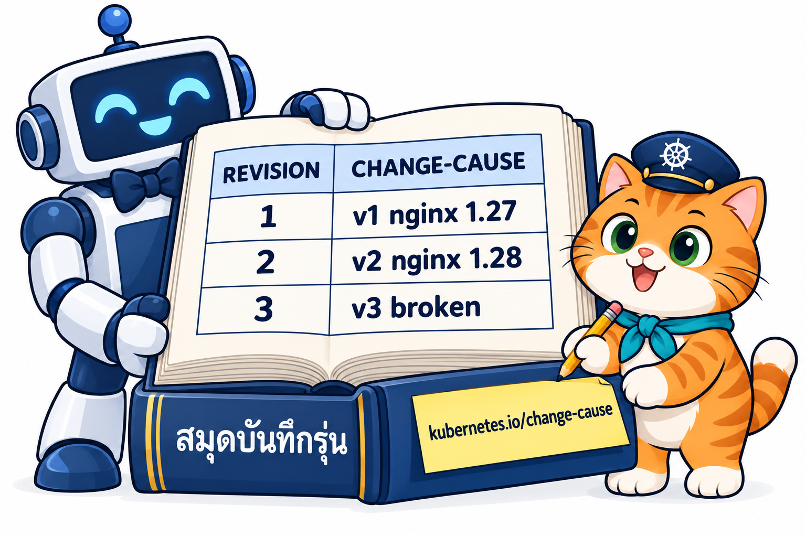<br>
  <em><b>รูปที่ 21</b> rollout history = สมุดบันทึกรุ่นของผู้จัดการร้าน: แต่ละ revision จำ template ไว้ ข้อความ CHANGE-CAUSE มาจาก annotation kubernetes.io/change-cause</em>
</p>

แต่ละ revision จำ template ของรุ่นนั้นไว้ (ใน ReplicaSet ของรุ่นนั้น) คอลัมน์ `CHANGE-CAUSE` มาจาก annotation `kubernetes.io/change-cause` ของ Deployment ณ ตอนที่เกิด revision นั้น ถ้าไม่ใส่ก็เป็น `<none>`

<p align="center" id="fig-22">
  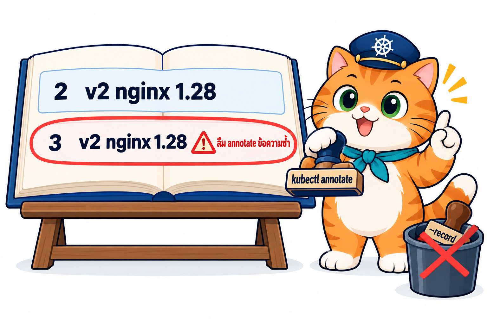<br>
  <em><b>รูปที่ 22</b> change-cause ใส่ด้วย kubectl annotate (--record ถูกถอดแล้ว) — กับดัก: revision ถัดไปที่ลืม annotate สืบทอดข้อความเดิม ทำให้ history หลอกตา</em>
</p>

ตัวเลือก `--record` ที่เคยใช้บันทึก change-cause ถูกถอดออกแล้ว ปัจจุบันใส่เองด้วย `kubectl annotate` (หรือเขียนใน `metadata.annotations` ของไฟล์ YAML) ผลจริงจาก LAB 3

```text
$ kubectl -n deploy-lab annotate deploy web kubernetes.io/change-cause="v2 nginx 1.28 (apply web-v2.yaml)"
$ kubectl -n deploy-lab set env deploy/web VERSION=v3
$ kubectl -n deploy-lab annotate deploy web kubernetes.io/change-cause="v3 set env"
$ kubectl -n deploy-lab set env deploy/web VERSION=v4          # ลืม annotate
$ kubectl -n deploy-lab rollout history deploy/web
REVISION  CHANGE-CAUSE
1         <none>
2         v2 nginx 1.28 (apply web-v2.yaml)
3         v3 set env
4         v3 set env
```

**กับดัก:** revision 4 (`VERSION=v4`) ที่ลืม annotate **สืบทอดข้อความเดิม** `v3 set env` เพราะ annotation ยังค้างอยู่บน Deployment ทำให้สมุดหลอกตา `rollout restart` ก็สืบทอดข้อความเดิมเช่นกัน (LAB 3 revision 7) วิธีป้องกันคือ annotate ทุกครั้งที่เปลี่ยน หรือใส่ annotation ในไฟล์ YAML คู่กับการแก้ แบบ `som-shop-v3/k8s/20-web.yaml`

```yaml
metadata:
  name: som-web
  annotations:
    # บันทึกเหตุผลของ revision นี้ลงสมุด (แสดงในคอลัมน์ CHANGE-CAUSE ของ rollout history)
    kubernetes.io/change-cause: "1.2 แปลงเป็น Deployment"
```

ดูรายละเอียด template ของ revision ใดก็ได้ด้วย `--revision` (ผลจริง ตัดบางส่วน)

```text
$ kubectl -n deploy-lab rollout history deploy/web --revision=3
deployment.apps/web with revision #3
Pod Template:
  Labels:	app=web
	pod-template-hash=5488545dcf
  Annotations:	kubernetes.io/change-cause: v3 set env
  Containers:
   web:
    Image:	nginx:1.28-alpine
    ...
    Environment:
      VERSION:	v3
```

### 8.2 rollout undo

<p align="center" id="fig-23">
  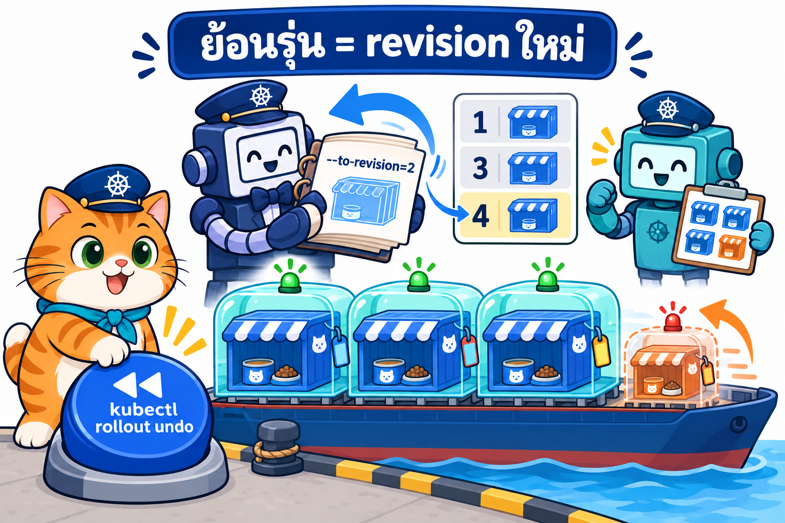<br>
  <em><b>รูปที่ 23</b> rollout undo: ย้อนไปใช้ template ของรุ่นก่อน — Kubernetes ทำเป็น revision ใหม่ (เลขเดิมหายจากรายการ เช่นเหลือ 1, 3, 4) และขยายหัวหน้ากะรุ่นเก่ากลับมา</em>
</p>

`rollout undo` นำ template ของ revision เป้าหมายมาใช้ แล้ว **บันทึกเป็น revision ใหม่** เลขเดิมจึงหายจากรายการ ผลจริงจาก LAB 3 ต่อจากด้านบน

```text
$ kubectl -n deploy-lab rollout undo deploy/web --to-revision=2
...
deployment.apps/web rolled back
$ kubectl -n deploy-lab rollout history deploy/web
REVISION  CHANGE-CAUSE
1         <none>
3         v3 set env
4         v3 set env
5         v2 nginx 1.28 (apply web-v2.yaml)
```

revision 2 หายไปและกลายเป็น revision 5 พร้อมข้อความ change-cause ของรุ่นเป้าหมายกลับมา (annotation ถูกคัดลอกจาก ReplicaSet ของรุ่นนั้น) Deployment ขยาย ReplicaSet เดิม `web-7c974c65c6` กลับมา ไม่สร้างตัวใหม่ `undo` แบบไม่ระบุ revision = กลับไปรุ่นก่อนหน้า ถ้าสั่งสองครั้งติดกันจึงสลับไปมาระหว่างสองรุ่นล่าสุด (LAB 10: 1.3 → 1.2 → 1.3)

<p align="center" id="fig-24">
  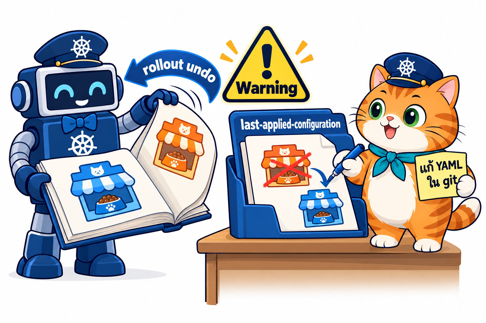<br>
  <em><b>รูปที่ 24</b> undo บน object ที่สร้างด้วย apply มีคำเตือน last-applied-configuration ไม่ถูกแก้ → undo คือการแก้ฉุกเฉิน แล้วต้องแก้ YAML ใน git ให้ตรงกับของจริง</em>
</p>

ถ้า Deployment สร้างด้วย `kubectl apply` การ undo จะมีคำเตือน (ข้อความจริง)

```text
Warning: resource deployments/web was previously managed with 'kubectl apply'. Rolling back will not update the kubectl.kubernetes.io/last-applied-configuration annotation, which may cause unexpected behavior on future 'kubectl apply' operations. Consider using 'kubectl apply' with your previous configuration file instead.
```

หมายความว่าตอนนี้ของจริงในคลัสเตอร์ไม่ตรงกับไฟล์ที่ apply ครั้งล่าสุดแล้ว ให้ถือว่า **undo คือการแก้ฉุกเฉิน** จากนั้นต้องแก้ไฟล์ YAML ใน git ให้ตรงกับรุ่นที่ต้องการ ไม่เช่นนั้น `apply` ครั้งถัดไปอาจพารุ่นที่พังกลับมา

### 8.3 pause / resume

<p align="center" id="fig-25">
  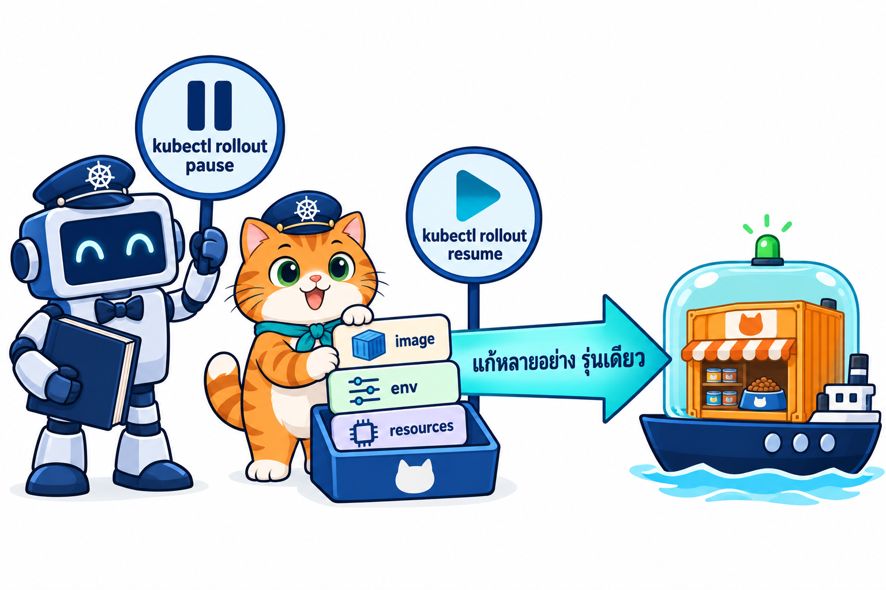<br>
  <em><b>รูปที่ 25</b> rollout pause / resume: หยุด rollout ชั่วคราวเพื่อแก้หลายอย่างพร้อมกัน แล้ว resume ให้เปลี่ยนรุ่นครั้งเดียว (revision เดียว)</em>
</p>

`rollout pause` ทำให้ Deployment **รับการแก้ template แต่ยังไม่ rollout** เหมาะเมื่ออยากแก้หลายอย่างแล้วให้เปลี่ยนรุ่นครั้งเดียว ผลจริงจาก LAB 3

```text
$ kubectl -n deploy-lab rollout pause deploy/web
$ kubectl -n deploy-lab set image deploy/web web=nginx:1.27-alpine
$ kubectl -n deploy-lab set env deploy/web VERSION=v6
NAME   READY   UP-TO-DATE   AVAILABLE   AGE
web    3/3     0            3           2m28s

$ kubectl -n deploy-lab rollout undo deploy/web; echo "exit=$?"
...
error: you cannot rollback a paused deployment; resume it first with 'kubectl rollout resume' and try again
exit=1
```

ระหว่าง pause ไม่มี ReplicaSet ใหม่ `UP-TO-DATE 0` (Pod ทั้ง 3 ยังเป็นรุ่นเก่า) `rollout undo` ใช้ไม่ได้ และ `rollout status --timeout=5s` จบด้วย `error: timed out waiting for the condition` เมื่อ `rollout resume` แล้วเกิด rollout **ครั้งเดียว** ได้ revision 6 รวมทั้งการเปลี่ยน image และ env

### 8.4 revisionHistoryLimit

<p align="center" id="fig-26">
  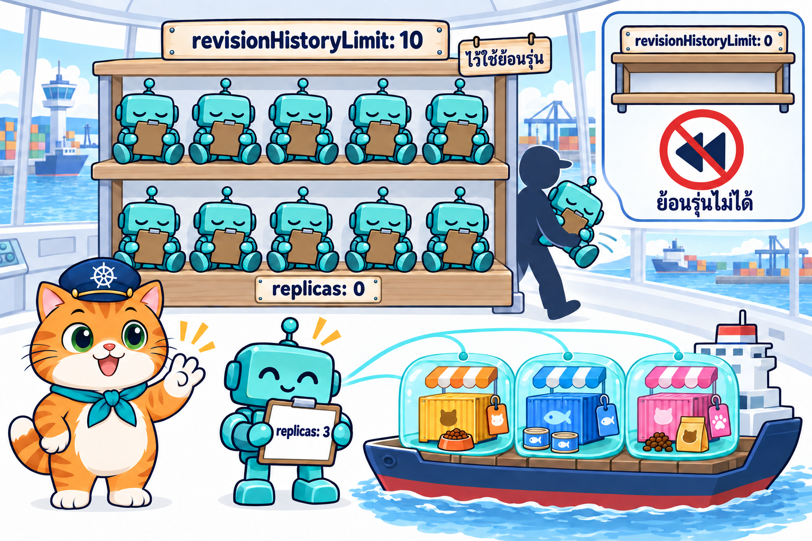<br>
  <em><b>รูปที่ 26</b> revisionHistoryLimit (default 10): ReplicaSet รุ่นเก่าเก็บไว้ด้วย replicas 0 = ข้อมูลสำหรับ undo; เกินจำนวนจะถูกลบ; ตั้ง 0 = undo ไม่ได้</em>
</p>

ReplicaSet ของรุ่นเก่าถูกเก็บไว้ด้วย `replicas: 0` เพื่อเป็นข้อมูลสำหรับ undo (ผลจริงจาก LAB 3 มี RS `0 0 0` ค้างอยู่ 4 ตัว) `revisionHistoryLimit` (default 10) กำหนดว่าจะเก็บไว้กี่ตัว เกินแล้วตัวเก่าสุดถูกลบ ถ้าตั้ง `0` จะ undo ไม่ได้เลย ร้าน `som-web` ตั้งไว้ `5` และใน LAB 10 ReplicaSet `som-web` เดิมจากบทที่ 6 ยังอยู่ `0 0 0` ตลอด LAB เพราะจำนวนรุ่นยังไม่เกิน

---

## 9. วิธีเปลี่ยน Deployment และกับดักของ apply

<p align="center" id="fig-27">
  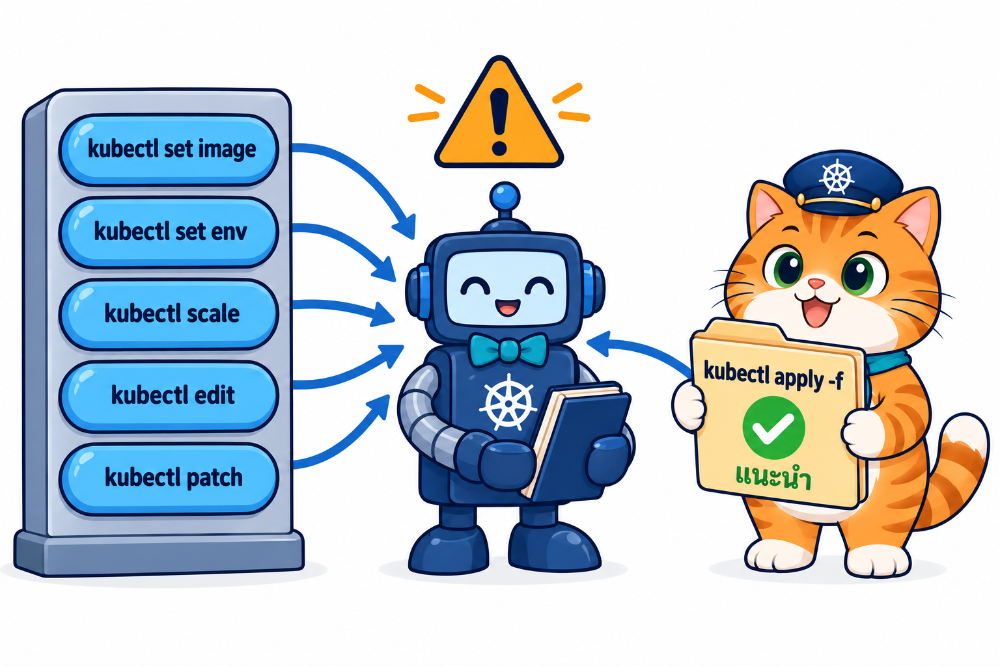<br>
  <em><b>รูปที่ 27</b> เปลี่ยน Deployment ได้หลายทาง: set image / set env / scale / edit / patch (เร็ว แต่ YAML ใน git ไม่ตรง) vs แก้ไฟล์แล้ว kubectl apply -f (แนวทางที่แนะนำ)</em>
</p>

**ตารางที่ 9** วิธีเปลี่ยน Deployment

| วิธี | ตัวอย่างจาก LAB | เหมาะกับ | ข้อเสีย |
|---|---|---|---|
| `set image` | `kubectl -n som-shop set image deploy/som-web web=som-shop-web:1.3 db-seed=som-shop-web:1.3` | ทดลอง/ฉุกเฉิน เปลี่ยน image ของ container และ initContainer ได้ในคำสั่งเดียว | ไฟล์ใน git ไม่ตรง |
| `set env` | `kubectl -n deploy-lab set env deploy/web VERSION=v3` | ทดลอง | ไฟล์ใน git ไม่ตรง |
| `scale` | `kubectl -n som-shop scale deploy/som-web --replicas=5` | ปรับจำนวนเร่งด่วน | ถูก apply ทับได้ (ด้านล่าง) |
| `patch` | `kubectl -n zdt-lab patch deploy web --patch-file lab07-zero-downtime/patches/graceful-patch.yaml` | แก้บางส่วนซ้ำได้ | อ่านยากกว่า |
| `edit` | `kubectl edit deploy web` | แก้เร็วด้วย editor | ไม่มีบันทึกว่าแก้อะไร |
| แก้ไฟล์แล้ว `apply -f` | `kubectl apply -f lab02-rolling/web-v2.yaml` | **แนวทางที่แนะนำ** — ไฟล์ใน git เป็นความจริงหนึ่งเดียว ตรวจทานได้ | ต้องแก้ไฟล์ก่อน |

<p align="center" id="fig-28">
  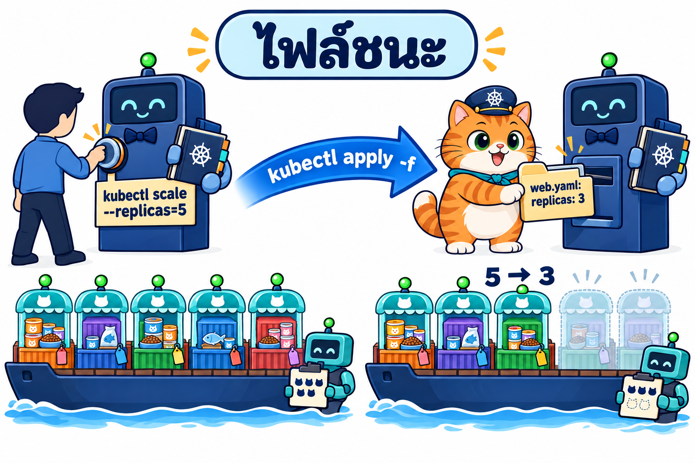<br>
  <em><b>รูปที่ 28</b> กับดัก: scale ด้วยมือเป็น 5 แล้วภายหลัง apply ไฟล์ที่เขียน replicas: 3 → จำนวนกลับเป็น 3 (ไฟล์ชนะ) — ให้แก้ตัวเลขในไฟล์ หรือไม่ใส่ replicas ถ้าใช้ตัวปรับอัตโนมัติ</em>
</p>

**กับดัก:** ถ้า `kubectl scale deploy/web --replicas=5` ด้วยมือ แล้วภายหลังมีคน `kubectl apply -f` ไฟล์ที่เขียน `replicas: 3` จำนวนจะกลับเป็น 3 ทันที เพราะ apply ทำให้ของจริงตรงกับไฟล์ (กับดักเดียวกับ ReplicaSet ในบทที่ 5) ทางแก้คือแก้ตัวเลขในไฟล์แล้ว apply และในอนาคตถ้าใช้ตัวปรับจำนวนอัตโนมัติ (HorizontalPodAutoscaler — บทหลัง) ให้ **ไม่ใส่** `replicas` ในไฟล์ เพื่อไม่ให้ apply ไปทับค่าที่ตัวปรับอัตโนมัติตั้งไว้

---

## 10. ย้ายจาก ReplicaSet (บทที่ 6) เป็น Deployment

### 10.1 Deployment รับเลี้ยง ReplicaSet ที่ไม่มีเจ้าของ

<p align="center" id="fig-29">
  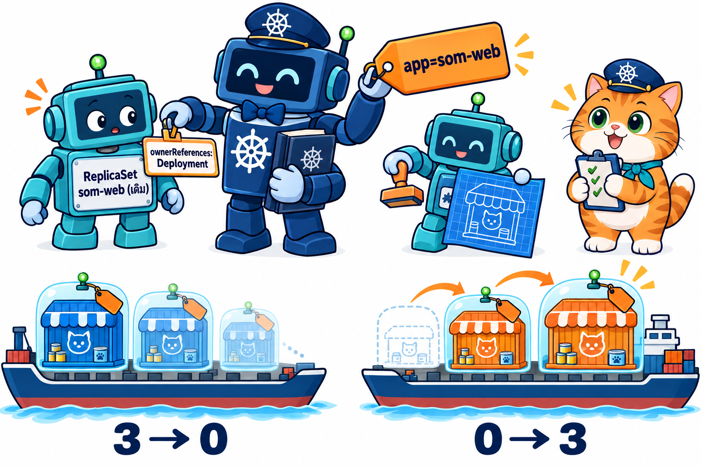<br>
  <em><b>รูปที่ 29</b> ย้าย RS → Deployment: Deployment รับเลี้ยง ReplicaSet ที่ label ตรง selector และยังไม่มีเจ้าของ (ติด ownerReferences) — RS เดิมถูกมองเป็นรุ่นเก่า (แสดงใน history เป็น REVISION 0) แล้วถูก scale ลงระหว่าง rolling</em>
</p>

ร้านของบทที่ 6 ใช้ ReplicaSet `som-web` และ `som-db` อยู่แล้ว เราอยากเปลี่ยนเป็น Deployment **ชื่อเดิม selector เดิม** เพื่อให้ Service และลูกค้าไม่ต้องเปลี่ยนอะไรเลย ผลการทดลองจริง (LAB 8 และ LAB 10) ยืนยันว่า **Deployment controller รับเลี้ยง ReplicaSet ที่ label ตรง selector และยังไม่มีเจ้าของ** แบบเดียวกับที่ ReplicaSet รับเลี้ยง Pod หลงในบทที่ 5

ผลจริงจาก LAB 8 (ReplicaSet `web` VERSION v1 → apply Deployment `web` VERSION v2)

```text
$ kubectl -n migrate-lab get rs web -o jsonpath='{.metadata.ownerReferences}{"\n"}'
[{"apiVersion":"apps/v1","blockOwnerDeletion":true,"controller":true,"kind":"Deployment","name":"web","uid":"0d405a82-4d4c-4556-a59d-c6cbf64d4639"}]

$ kubectl -n migrate-lab describe deploy web
OldReplicaSets:  web (0/0 replicas created)
NewReplicaSet:   web-7b6cd79469 (3/3 replicas created)
Events:
  Normal  ScalingReplicaSet  42s   deployment-controller  Scaled up replica set web-7b6cd79469 from 0 to 1
  Normal  ScalingReplicaSet  40s   deployment-controller  Scaled down replica set web from 3 to 2
  Normal  ScalingReplicaSet  40s   deployment-controller  Scaled up replica set web-7b6cd79469 from 1 to 2
  Normal  ScalingReplicaSet  39s   deployment-controller  Scaled down replica set web from 2 to 1
  Normal  ScalingReplicaSet  39s   deployment-controller  Scaled up replica set web-7b6cd79469 from 2 to 3
  Normal  ScalingReplicaSet  38s   deployment-controller  Scaled down replica set web from 1 to 0

$ kubectl -n migrate-lab rollout history deploy/web
REVISION  CHANGE-CAUSE
0         <none>
1         <none>
```

- RS `web` เดิมได้ `ownerReferences` ชี้ Deployment `web` (ไม่ได้ label `pod-template-hash` และไม่มี annotation revision)
- template ต่างกัน (v1 กับ v2) RS เดิมจึงถูกมองเป็น **รุ่นเก่า** แล้วถูก scale 3→2→1→0 สลับกับ RS ใหม่ `web-7b6cd79469` แบบ rolling ปกติ client ยิง 173 ครั้งได้ v1 30 / v2 143 **ไม่มี error**
- RS เดิมโผล่ใน `rollout history` เป็น **REVISION 0** และถ้าสั่ง `rollout undo` ก็กลับไปขยาย RS `web` เดิม (Pod ไม่มี hash) ได้จริง
- Pod ใหม่มี `app=web` ตรง selector ของ RS เดิมด้วย แต่มีเจ้าของแล้ว (RS ใหม่) RS เดิมจึงไม่นับปน
- **กรณี template เหมือนกันทุกตัวอักษร** (ทดลองโดยให้ Deployment ใช้ VERSION v1 เท่า RS) Deployment รับเลี้ยง RS เดิมเป็น **รุ่นปัจจุบัน** ไม่เกิด rolling เลย Pod เดิมอยู่ต่อ history มี `1 <none>` แถวเดียว ใน LAB 10 `som-db` เป็นกรณีนี้ (Pod db เดิมไม่ถูกสร้างใหม่ ออเดอร์ไม่หาย) ส่วน `som-web` template ต่าง (footer LAB 007 + preStop) จึงเกิด rolling และ history เป็น `0 <none>` / `1 1.2 แปลงเป็น Deployment`

### 10.2 ทางสำรอง: --cascade=orphan

<p align="center" id="fig-30">
  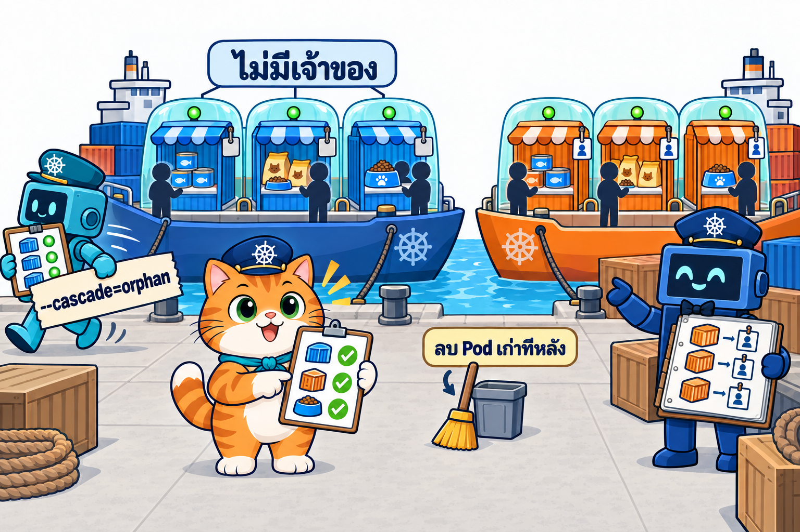<br>
  <em><b>รูปที่ 30</b> ทางสำรอง: kubectl delete rs som-web --cascade=orphan ลบหัวหน้ากะแต่ทิ้งบูธไว้ขายต่อ (ไม่มีป้ายเจ้าของ) แล้วสร้าง Deployment เมื่อบูธใหม่พร้อมจึงลบบูธเก่าเอง</em>
</p>

ถ้าไม่อยากให้ Deployment รับเลี้ยง (หรือ selector ไม่ตรงกัน) ใช้ทางสำรองสามขั้น

1. `kubectl delete rs web --cascade=orphan` — ลบหัวหน้ากะแต่ทิ้งบูธไว้ขายต่อ (Pod ไม่มีเจ้าของ ยังอยู่หลัง Service)
2. `kubectl apply -f` Deployment — ReplicaSet ใหม่มี selector ที่รวม `pod-template-hash` จึงไม่รับเลี้ยง Pod เดิม สร้าง Pod ใหม่ครบจำนวน
3. เมื่อ Deployment พร้อมแล้วจึงลบบูธเก่าเอง `kubectl delete pod -l 'app=web,!pod-template-hash'`

ผลจริงจาก LAB 8: ขั้น 1 ได้ `replicaset.apps "web" deleted from migrate-lab namespace` และ Pod 3 ตัวยังรันอยู่ หลังขั้น 3 client เจอ error 1 ครั้ง (`wget: can't connect to remote host (10.96.60.208): Connection refused`) เพราะ Pod เก่าถูกลบพร้อมกันโดยไม่มี preStop ทางหลัก (รับเลี้ยง) จึงนุ่มนวลกว่า เพราะ Deployment ทยอยลด RS เดิมให้ตามกติกา rolling

---

## 11. rollout พัง: อ่านอาการและแก้

<p align="center" id="fig-31">
  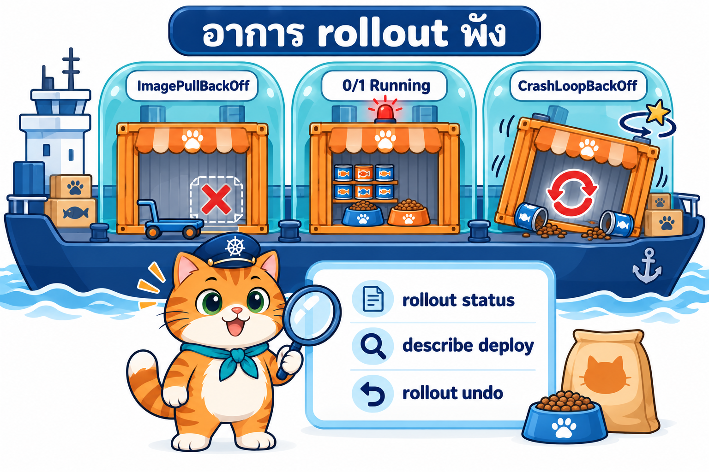<br>
  <em><b>รูปที่ 31</b> อาการพังที่พบบ่อยระหว่าง rollout: ErrImagePull/ImagePullBackOff (image ผิด), 0/1 Running (readiness ล้ม), CrashLoopBackOff (แอปล้มซ้ำ) — อ่านด้วย rollout status, describe deploy แล้ว rollout undo</em>
</p>

**ตารางที่ 10** อาการ rollout พังที่เจอจริงในบทนี้

| อาการใน `kubectl get pods` | สาเหตุ | ข้อความจริงที่ช่วยยืนยัน | LAB |
|---|---|---|---|
| `ErrImagePull` → `ImagePullBackOff` | image/tag ไม่มีจริง หรือไม่มีสิทธิ์ดึง | `Failed to pull image "nginx:9.99-nope": ... not found` / `Failed to pull image "som-shop-web:1.4": ... pull access denied, repository does not exist or may require authorization` | 6, 10 |
| `PodInitializing` ราว 8 วินาที แล้ว `ErrImagePull` | initContainer (image ที่มีอยู่) รันผ่าน แต่ container หลักดึง image ไม่ได้ | Event `spec.initContainers{db-seed}: Container started` ตามด้วย `spec.containers{web}: Pulling image "som-shop-web:1.4"` | 10 |
| `0/1 Running` | readinessProbe ไม่ผ่าน | `Readiness probe failed: HTTP probe failed with statuscode: 404` | 5 |
| `CrashLoopBackOff` (RESTARTS เพิ่มเรื่อย ๆ) | แอปล้มทันทีที่เริ่ม | `kubectl logs --previous` → `แอปรุ่นนี้พัง: ไม่เจอไฟล์ตั้งค่า`, `lastState.terminated` `exitCode 1 reason Error` | 6 |
| `Init:...` ค้าง | initContainer รันไม่จบ/ล้ม | log ของ initContainer (`kubectl logs <pod> -c <init>`) | (บทที่ 6) |

ทุกอาการข้างบน ร้านยังขายได้ด้วย Pod รุ่นเก่า (`READY 3/3 UP-TO-DATE 1 AVAILABLE 3`) ลำดับการอ่านอาการที่แนะนำ

1. `kubectl rollout status deploy/<ชื่อ>` — ค้าง/exit 1 หรือไม่
2. `kubectl get deploy,rs` — RS ใหม่ค้างที่ `1 1 0` หรือไม่
3. `kubectl describe deploy <ชื่อ>` — ดู Conditions (`ProgressDeadlineExceeded`) และ Events
4. `kubectl get pods` / `kubectl describe pod <ชื่อ>` / `kubectl logs <ชื่อ> --previous` — หาสาเหตุ
5. `kubectl rollout undo deploy/<ชื่อ>` — กู้ร้านก่อน (LAB 10 undo จาก 1.4 กลับ 1.3 ใช้เวลา 0.1 วินาที เพราะ RS 1.3 ยังพร้อมครบ)
6. แก้ไฟล์ YAML ใน git ให้ตรง แล้วค่อยลองรุ่นใหม่อีกครั้ง

---

## 12. blue/green และ canary ด้วย label + Service

Deployment เปลี่ยนรุ่นแบบ rolling ได้เองอยู่แล้ว แต่บางครั้งอยากควบคุมมากกว่านั้น เราสามารถใช้ **label + selector ของ Service** ที่เรียนในบทที่ 6 ทำกลยุทธ์ปล่อยรุ่นแบบอื่นได้

### 12.1 blue/green

<p align="center" id="fig-32">
  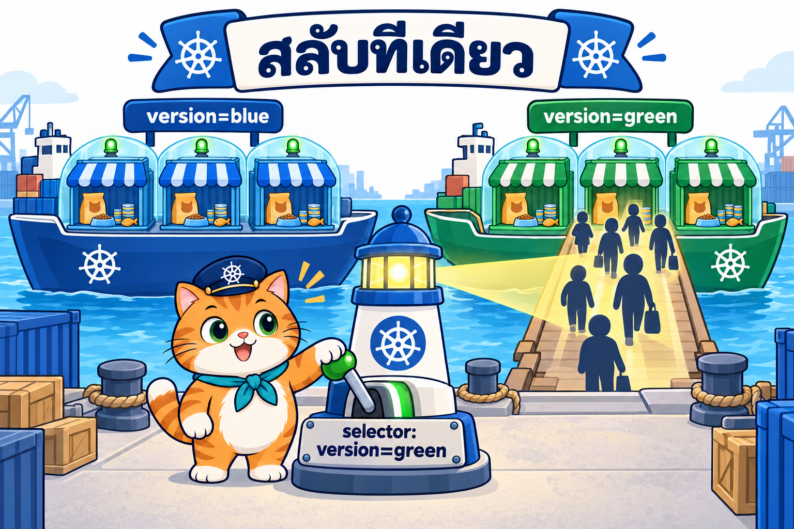<br>
  <em><b>รูปที่ 32</b> blue/green: เปิดชุดบูธใหม่ครบทั้งชุดคู่กับชุดเก่า แล้วสลับ selector ของ Service ทีเดียว ย้อนกลับได้ทันที (ใช้ทรัพยากร 2 เท่า)</em>
</p>

เปิด Deployment สองชุดพร้อมกัน `web-blue` (label `version: blue`) และ `web-green` (`version: green`) แล้วให้ Service เลือก `app: web, version: blue` เมื่อชุดใหม่พร้อมก็สลับ selector ทีเดียว

```bash
kubectl -n release-lab patch svc web -p '{"spec":{"selector":{"version":"green"}}}'
```

ผลจริงจาก LAB 9: ก่อนสลับยิง 20 ครั้งได้ `web blue` ทั้ง 20 ครั้ง หลังสลับลูกค้าเปลี่ยนเป็น green ภายในไม่ถึง 1 วินาที (คำขอในวินาทีเดียวกับคำสั่ง patch เริ่มเป็น green) และย้อนกลับได้ทันทีด้วยการ patch เป็น `blue` ข้อเสียคือใช้ทรัพยากร 2 เท่า

> **ข้อควรระวัง:** EndpointSlice และ kube-proxy ต้องใช้เวลาเล็กน้อยในการอัปเดต ใน LAB 9 การยิง 20 ครั้งทันทีหลัง patch (จบใน <1 วินาที) ยังได้ blue ทั้งหมด ให้รอ 1–2 วินาทีก่อนทดสอบ

### 12.2 canary

<p align="center" id="fig-33">
  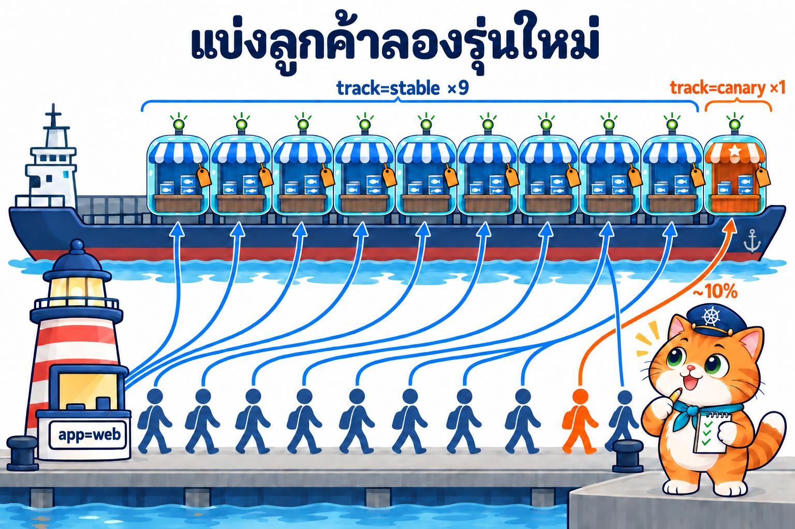<br>
  <em><b>รูปที่ 33</b> canary: Deployment รุ่นใหม่ 1 replica + รุ่นเดิม 9 replicas ใช้ label app ร่วมกัน Service ส่งลูกค้าไปรุ่นใหม่ราว 10% (สุ่มตามสัดส่วนจำนวน Pod)</em>
</p>

canary คือปล่อยรุ่นใหม่ให้ลูกค้าส่วนน้อยก่อน วิธีง่ายที่สุดคือ Deployment สองชุดที่ใช้ `app: web` ร่วมกัน เช่น `web-stable` 4 replicas (`track: stable`) กับ `web-canary` 1 replica (`track: canary`) และให้ Service เลือกแค่ `app: web` Service สุ่มส่งลูกค้าตาม **สัดส่วนจำนวน Pod** (1 ใน 5 = ราว 20%)

ผลจริงจาก LAB 9: ยิง 50 ครั้ง 7 รอบได้ canary **5, 6, 7, 9, 12, 11, 3** ครั้ง (แกว่งมากเพราะเป็นการสุ่ม) แต่ยิง 500 ครั้งได้ canary **101 ครั้ง (20.2%)** ใกล้ค่าที่คาด ถ้าต้องการคุมเปอร์เซ็นต์ละเอียด (เช่น 1% หรือตาม header) ต้องใช้ Ingress/Gateway หรือ service mesh ซึ่งเป็นเนื้อหาบทหลัง

---

## 13. สรุปและบทถัดไป

### 13.1 เลือก workload ให้เหมาะกับงาน

<p align="center" id="fig-34">
  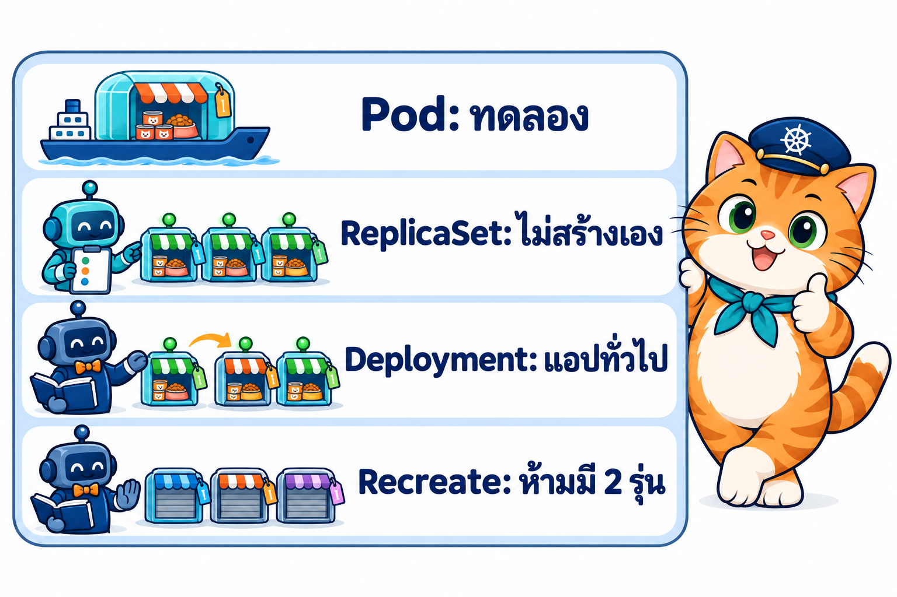<br>
  <em><b>รูปที่ 34</b> ตารางเลือก workload: Pod เดี่ยว (ทดลอง/debug) / ReplicaSet (แทบไม่สร้างเอง) / Deployment RollingUpdate (แอป stateless — ค่าเริ่มต้น) / Deployment Recreate (ห้ามมี 2 รุ่นพร้อมกัน)</em>
</p>

**ตารางที่ 11** เลือก workload

| ใช้ | เมื่อไร | ตัวอย่างในวิชานี้ |
|---|---|---|
| Pod เดี่ยว | ทดลอง, debug, งานชั่วคราว (ไม่มีใครสร้างแทนเมื่อหาย) | Pod `client` (busybox) |
| ReplicaSet | แทบไม่สร้างเอง — ให้ Deployment สร้าง | ร้านบทที่ 5–6 (ก่อนรู้จัก Deployment) |
| Deployment + RollingUpdate | แอป stateless ส่วนใหญ่ (ค่าเริ่มต้น) | `som-web` |
| Deployment + Recreate | ห้ามมีสองรุ่นพร้อมกัน | `som-db` (ชั่วคราว ก่อนเรียน StatefulSet) |

### 13.2 สรุปบท

1. **Deployment** คุม ReplicaSet 1 ตัวต่อ 1 รุ่นของ template และ ReplicaSet คุม Pod (ownerReferences Deployment → RS → Pod) เราแก้ที่ Deployment เท่านั้น
2. **`pod-template-hash`** ติดที่ชื่อ/selector/label ของ RS และ Pod กันหัวหน้ากะสองรุ่นนับ Pod ปนกัน ชื่อ Pod = `<deploy>-<hash>-<สุ่ม>`
3. **rollout เกิดเมื่อ `.spec.template` เปลี่ยนเท่านั้น** `scale` ไม่เกิด revision `rollout restart` เติม `restartedAt` ใน template
4. **RollingUpdate** ใช้ `maxSurge` (ปัดขึ้น) และ `maxUnavailable` (ปัดลง) default 25%/25% ตั้ง 0 ทั้งคู่ไม่ได้ **Recreate** ปิดหมดก่อนแล้วเปิดใหม่ (มีช่วงไม่มี Pod)
5. **readinessProbe + `minReadySeconds`** ตัดสินว่า Pod ใหม่ available เมื่อไร readiness ล้ม → rollout ค้างแต่ Pod เก่ายังขาย liveness ไม่ควรพึ่ง db
6. **zero-downtime** = readiness + `maxSurge: 1/maxUnavailable: 0` + `preStop.sleep` + grace period พอ (LAB 7: err 4/4/1 → 0/0/0)
7. **`progressDeadlineSeconds`** บอกว่า rollout ค้าง (`ProgressDeadlineExceeded`, `rollout status` exit 1) แต่ **ไม่ rollback ให้เอง**
8. **`rollout history`/`undo`/`pause`/`resume`/`restart`** ใส่ change-cause ทุกครั้ง undo = revision ใหม่ (เลขเดิมหาย) undo บน object ที่ apply มาคือการแก้ฉุกเฉิน
9. **apply ไฟล์เป็นความจริงหนึ่งเดียว** ระวัง apply ทับ `replicas` ที่ scale ด้วยมือ
10. **ย้ายจาก ReplicaSet** ด้วย Deployment ชื่อ/selector เดิม: RS เดิมถูกรับเลี้ยง (REVISION 0) และถูก scale ลงแบบ rolling ถ้า template เหมือนกันทุกตัวอักษรจะไม่มีอะไรถูกสร้างใหม่

<p align="center" id="fig-35">
  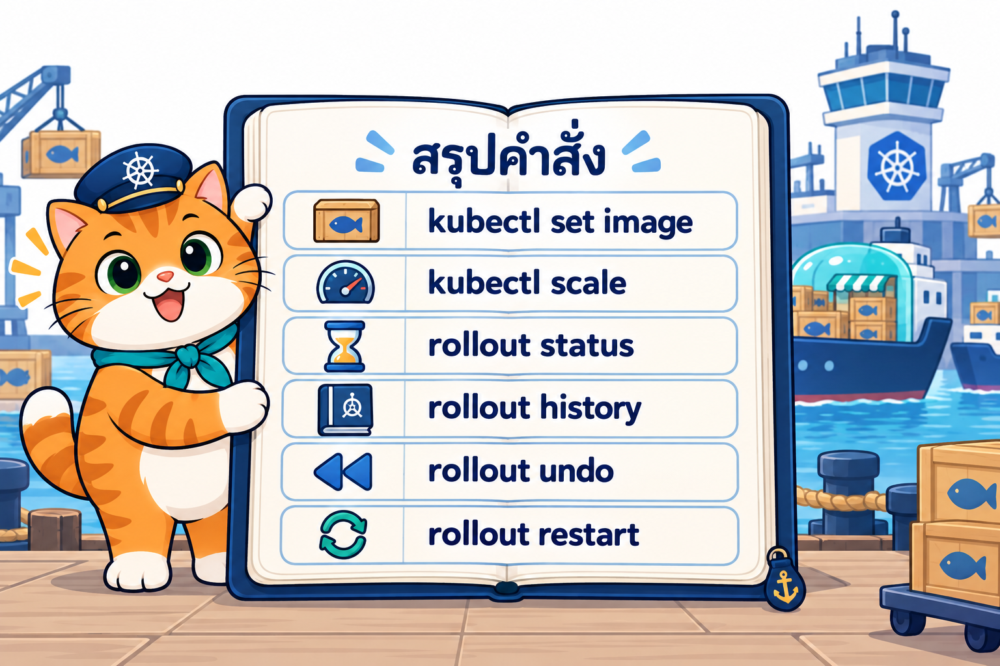<br>
  <em><b>รูปที่ 35</b> ตารางคำสั่งสรุปบท: set image, scale, rollout status / history / undo / restart</em>
</p>

**ตารางที่ 12** คำสั่งที่ใช้ในบทนี้

| คำสั่ง | ใช้ทำอะไร |
|---|---|
| `kubectl create deployment <ชื่อ> --image=<image> --replicas=3 --dry-run=client -o yaml` | พิมพ์โครง YAML ไปแก้ต่อ |
| `kubectl apply -f <ไฟล์หรือโฟลเดอร์>` | สร้าง/แก้ตามไฟล์ (แนะนำ) |
| `kubectl -n <ns> get deploy,rs,pods --show-labels` | ดูลำดับชั้นและ `pod-template-hash` |
| `kubectl -n <ns> set image deploy/<ชื่อ> <container>=<image>` | เปลี่ยน image |
| `kubectl -n <ns> set env deploy/<ชื่อ> KEY=VALUE` | เปลี่ยน env |
| `kubectl -n <ns> scale deploy/<ชื่อ> --replicas=N` | ปรับจำนวน (ไม่เกิด revision) |
| `kubectl -n <ns> patch deploy <ชื่อ> --patch-file <ไฟล์>` | แก้บางส่วนจากไฟล์ patch |
| `kubectl -n <ns> annotate deploy <ชื่อ> kubernetes.io/change-cause="..." --overwrite` | บันทึกเหตุผลของ revision |
| `kubectl -n <ns> rollout status deploy/<ชื่อ>` | รอ rollout จบ / ตรวจ exit code |
| `kubectl -n <ns> rollout history deploy/<ชื่อ> [--revision=N]` | ดูสมุดบันทึกรุ่น |
| `kubectl -n <ns> rollout undo deploy/<ชื่อ> [--to-revision=N]` | ย้อนรุ่น |
| `kubectl -n <ns> rollout pause` / `resume deploy/<ชื่อ>` | หยุด/ปล่อย rollout |
| `kubectl -n <ns> rollout restart deploy/<ชื่อ>` | สร้าง Pod ใหม่ทั้งหมดด้วย template เดิม |
| `kubectl -n <ns> describe deploy <ชื่อ>` | ดู Conditions, OldReplicaSets/NewReplicaSet, Events |

**ปูทางการปรับจำนวนอัตโนมัติ:** ผู้จัดการร้านปรับ `replicas` ได้เมื่อเราสั่ง แต่ "ปรับเองตามโหลด" เป็นหน้าที่ของ **HorizontalPodAutoscaler (HPA)** ซึ่งจะไปแก้ `replicas` ของ Deployment แทนเรา (บทหลัง)

### 13.3 ปัญหาที่ยังเหลือและบทถัดไป

<p align="center" id="fig-36">
  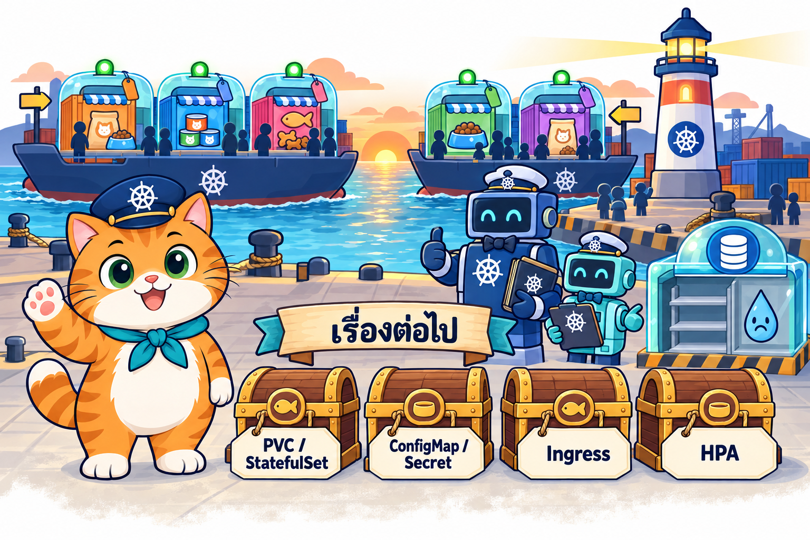<br>
  <em><b>รูปที่ 36</b> ปิดบท: เปลี่ยนรุ่นได้ไม่สะดุดและย้อนได้แล้ว แต่ฐานข้อมูลยังลืมทุกอย่างเมื่อ Pod ใหม่ → PVC/StatefulSet, ตั้งค่า/รหัสผ่าน → ConfigMap/Secret, ทางเข้าด้วยชื่อโดเมน → Ingress, ขยายอัตโนมัติ → HPA</em>
</p>

ตอนจบ LAB 10 ร้านน้องส้มเปลี่ยนรุ่นระหว่างขายได้โดยลูกค้าไม่เจอ error ย้อนรุ่นได้ในคำสั่งเดียว และรุ่นพังก็ยังขายได้ แต่ยังมีปัญหาที่ Deployment ไม่ได้ออกแบบมาแก้

| ปัญหาที่ยังเหลือ | หลักฐานจาก LAB 10 | แก้ด้วย (บทถัดไป/บทหลัง) |
|---|---|---|
| **ข้อมูลฐานข้อมูลหายเมื่อ Pod db ถูกสร้างใหม่** (`emptyDir` อยู่กับ Pod) | ลบ Pod db แล้ว `ERROR:  relation "orders" does not exist`, ออเดอร์จาก 5 เหลือ 0; `rollout restart deploy/som-db` (Recreate) ก็ทำข้อมูลหายเหมือนกัน | **PersistentVolume / PersistentVolumeClaim** และ **StatefulSet** (บทถัดไป) |
| **รหัสผ่านฐานข้อมูลเขียนตรง ๆ ใน YAML** (`POSTGRES_PASSWORD`, `DATABASE_URL` มี `meow1234` ซึ่งเป็นค่าตัวอย่างเพื่อการเรียนเท่านั้น) | อ่านได้จากไฟล์ใน git และจาก `kubectl get deploy -o yaml` | **ConfigMap / Secret** |
| **ปรับจำนวนบูธเองตามจำนวนลูกค้า** | ต้องสั่ง `scale --replicas=5` เอง | **HorizontalPodAutoscaler (HPA)** |
| ทางเข้าด้วยชื่อโดเมน/HTTPS และแบ่งลูกค้าเป็นเปอร์เซ็นต์ละเอียด | ใช้ NodePort 30080, canary ได้แค่ตามสัดส่วน Pod | Ingress / Gateway API |

Deployment ดูแล **"จำนวนและรุ่น"** ของ Pod ได้ดีมาก แต่ข้อมูลต้องอยู่ที่ volume ที่ไม่หายตาม Pod บทถัดไปจะให้ครัวกลางของน้องส้มมีตู้เก็บของถาวร (PersistentVolumeClaim) และรู้จัก StatefulSet สำหรับงานที่ต้องจำตัวตนของตัวเอง

---

## 14. คำถามทบทวน

**1. ทำไม `kubectl set image rs/som-web ...` ในบทที่ 6 จึงไม่เปลี่ยนรุ่นของร้าน แต่ `kubectl set image deploy/som-web ...` ในบทนี้เปลี่ยนได้**

<details>
<summary>แนวคำตอบ</summary>

ReplicaSet ดูแลแค่ "จำนวน" Pod ที่ตรง selector การแก้ template ของ ReplicaSet มีผลเฉพาะ Pod ที่เกิดใหม่ Pod เดิม 3 ตัวยังตรง selector และครบจำนวนจึงไม่มีอะไรเกิดขึ้น ส่วน Deployment มอง template เป็น "รุ่น" เมื่อ template เปลี่ยน มันสร้าง ReplicaSet ตัวใหม่ (hash ใหม่) แล้วทยอยเพิ่ม Pod ของรุ่นใหม่และลด ReplicaSet รุ่นเก่าตาม strategy ใน LAB 10 `set image deploy/som-web` ได้ RS `som-web-ffc7b9f94` (1.3) แทน `som-web-7955fccc94` (1.2) ใน 18.1 วินาที
</details>

**2. ลอง `kubectl scale rs web-779cb4fbb8 --replicas=6` กับ ReplicaSet ที่ Deployment `web` เป็นเจ้าของ จะเกิดอะไรขึ้น เพราะอะไร**

<details>
<summary>แนวคำตอบ</summary>

ReplicaSet สร้าง Pod เพิ่ม 3 ตัวจริง แต่ Deployment controller เห็นว่า RS ของรุ่นปัจจุบันควรมี `replicas` เท่ากับของ Deployment (3) จึง scale กลับทันที ใน LAB 1 Pod เกินถูกลบภายในราว 1 วินาที และมี Event `Scaled down replica set web-779cb4fbb8 from 6 to 3` ความต้องการอยู่ที่ Deployment จึงต้อง scale ที่ Deployment
</details>

**3. Deployment `rolling` มี `replicas: 10` และ strategy default ระหว่าง rollout จะมี Pod สูงสุดกี่ตัว และพร้อมอย่างน้อยกี่ตัว แสดงวิธีคิด**

<details>
<summary>แนวคำตอบ</summary>

maxSurge 25% ของ 10 = 2.5 ปัดขึ้นเป็น 3 → สูงสุด 10 + 3 = 13 ตัว maxUnavailable 25% = 2.5 ปัดลงเป็น 2 → พร้อมอย่างน้อย 10 − 2 = 8 ตัว ผลจริงใน LAB 4 ได้ active สูงสุด 13 พร้อมต่ำสุด 8 และ annotation ของ ReplicaSet `deployment.kubernetes.io/max-replicas: 13`
</details>

**4. คำสั่งใดต่อไปนี้ทำให้เกิด revision ใหม่: `scale --replicas=5`, `set env VERSION=v3`, `annotate kubernetes.io/change-cause=...`, `rollout restart`, แก้ `minReadySeconds` อธิบายหลักการ**

<details>
<summary>แนวคำตอบ</summary>

เกิด revision ใหม่เฉพาะ `set env` และ `rollout restart` เพราะทั้งสองแก้ `.spec.template` (env ของ container / annotation `kubectl.kubernetes.io/restartedAt` ใน template) ส่วน `scale`, `annotate` ที่ Deployment และ `minReadySeconds` อยู่นอก template จึงไม่เกิด rollout ใน LAB 1 scale 5 → 2 → 3 แล้ว history ยังมี revision 1 แถวเดียว
</details>

**5. ทำไม `som-db` จึงใช้ `strategy: Recreate` ทั้งที่ทำให้มีช่วงที่ไม่มีฐานข้อมูล ถ้าใช้ RollingUpdate จะเกิดอะไร**

<details>
<summary>แนวคำตอบ</summary>

RollingUpdate จะเปิด postgres ตัวใหม่ก่อนปิดตัวเก่า จึงมี 2 ตัวพร้อมกัน แต่ละตัวมีข้อมูลใน `emptyDir` ของตัวเอง Service `som-db` จะสุ่มส่ง web ไปคนละฐานข้อมูล ออเดอร์จึงแยกกระจัดกระจาย Recreate รับประกันว่ามีตัวเดียวเสมอ ผลจริงจาก `rollout restart deploy/som-db` คือ Pod เก่า `Completed` ก่อน แล้วตัวใหม่จึง `Pending` → `1/1` ภายใน 4 วินาที แลกกับช่วงสั้น ๆ ที่ไม่มี db
</details>

**6. ตอนแปลง `som-db` จาก ReplicaSet เป็น Deployment (LAB 10) ทำไม Pod db เดิมไม่ถูกสร้างใหม่และออเดอร์ไม่หาย ทั้งที่ไฟล์เขียน `Recreate`**

<details>
<summary>แนวคำตอบ</summary>

Deployment ชื่อและ selector เดียวกับ ReplicaSet `som-db` ที่ไม่มีเจ้าของ จึงรับเลี้ยง RS นั้น และเพราะ template ของ Deployment เหมือนของ RS ทุกตัวอักษร (`strategy` อยู่นอก template) Deployment จึงถือว่า RS เดิมคือรุ่นปัจจุบัน ไม่มี rollout เกิดขึ้น `rollout status` จบใน 0.04 วินาที Pod `som-db-sdznc` ตัวเดิมอยู่ต่อ ออเดอร์ยังเป็น 2 Recreate จะมีผลเมื่อเกิด rollout ครั้งถัดไป
</details>

**7. อธิบายว่าทำไมใน LAB 7 รอบที่ไม่มี preStop จึงมี error 1–4 ครั้ง แต่รอบที่ใช้ graceful-patch ได้ 0 ทั้ง 3 รอบ**

<details>
<summary>แนวคำตอบ</summary>

เมื่อ Pod ถูกสั่งลบ การถอด endpoint ออกจากกฎของ kube-proxy บนทุก Node กับการปิดแอปเกิดพร้อมกัน ถ้า nginx ปิดก่อนที่บาง Node จะอัปเดตกฎ ลูกค้าที่ถูกส่งมาช่วงนั้นจะเจอ `Connection reset by peer`/`Operation timed out` graceful-patch เพิ่ม `preStop.sleep.seconds: 5` ให้ Pod เสิร์ฟต่อ 5 วินาทีระหว่างที่ทุก Node ลบมันออกจากรายชื่อ และ `maxSurge: 1/maxUnavailable: 0` ให้มี Pod พร้อมครบตลอด จึงได้ 0/300
</details>

**8. รุ่น 1.4 ของ `som-web` ไม่มี image จริง หลังสั่ง `set image` 60 วินาที `kubectl get deploy` แสดง `READY 3/3 UP-TO-DATE 1 AVAILABLE 3` อ่านค่านี้อย่างไร และ Kubernetes จะทำอะไรต่อ**

<details>
<summary>แนวคำตอบ</summary>

ต้องการ 3 พร้อม 3 (เป็น Pod รุ่น 1.3) มี Pod รุ่นล่าสุด (1.4) แค่ 1 ตัวซึ่งค้าง `ImagePullBackOff` และใช้งานได้ 3 ตัว เพราะ `maxUnavailable: 0` ไม่ยอมลด Pod เก่าจนกว่า Pod ใหม่จะพร้อม ร้านจึงยังขายได้ (hit.sh 700 ครั้ง err 0) เมื่อเกิน `progressDeadlineSeconds: 60` Deployment ตั้ง `Progressing=False ProgressDeadlineExceeded` และ `rollout status` exit 1 แต่ **ไม่ย้อนรุ่นให้** Pod 1.4 ยังพยายามดึง image ต่อไป คนหรือ CI/CD ต้องสั่ง `rollout undo` เอง
</details>

**9. ใน LAB 3 history เป็น `1, 2, 3, 4` แล้วสั่ง `rollout undo --to-revision=2` history จะเป็นอย่างไร revision ใหม่มี CHANGE-CAUSE อะไร และใช้ ReplicaSet ตัวไหน**

<details>
<summary>แนวคำตอบ</summary>

history เป็น `1, 3, 4, 5` revision 2 หายไปกลายเป็น revision 5 พร้อมข้อความ `v2 nginx 1.28 (apply web-v2.yaml)` ของรุ่นเป้าหมาย Deployment ขยาย ReplicaSet เดิมของรุ่นนั้น (`web-7c974c65c6`) เพราะ template เหมือนเดิม hash จึงเดิม ไม่สร้าง RS ใหม่
</details>

**10. ทำไม revision 4 ใน LAB 3 จึงมี CHANGE-CAUSE ว่า `v3 set env` ทั้งที่เปลี่ยนเป็น `VERSION=v4` และควรป้องกันอย่างไร**

<details>
<summary>แนวคำตอบ</summary>

CHANGE-CAUSE อ่านจาก annotation `kubernetes.io/change-cause` บน Deployment ณ ตอนเกิด revision เมื่อสั่ง `set env VERSION=v4` โดยไม่ annotate ใหม่ annotation เดิม (`v3 set env`) ยังค้างอยู่จึงถูกบันทึกซ้ำ ป้องกันด้วยการ annotate (`--overwrite`) ทุกครั้งที่เปลี่ยน หรือเขียน annotation ใน `metadata.annotations` ของไฟล์ YAML คู่กับการแก้แล้ว apply
</details>

**11. ย้ายร้านจาก ReplicaSet `web` มาเป็น Deployment `web` (selector `app: web` เหมือนกัน) จะเห็นอะไรใน `get rs` และ `rollout history` และทางสำรอง `--cascade=orphan` ต่างกันอย่างไร**

<details>
<summary>แนวคำตอบ</summary>

RS `web` เดิมได้ ownerReferences ชี้ Deployment ถูก scale 3→2→1→0 สลับกับ RS ใหม่ `web-<hash>` 0→1→2→3 และเหลือ `0 0 0` ไว้ `rollout history` แสดง `0 <none>` (RS เดิม) และ `1` (รุ่นใหม่) client ไม่เจอ error ส่วนทางสำรองลบ RS เดิมแบบ orphan ให้ Pod เดิมขายต่อโดยไม่มีเจ้าของ แล้ว Deployment สร้าง Pod ใหม่ครบ (ไม่รับเลี้ยง Pod เดิมเพราะ selector มี hash) สุดท้ายต้องลบ Pod เก่าเองด้วย `-l 'app=web,!pod-template-hash'` ซึ่งใน LAB 8 ทำให้เจอ error 1 ครั้ง
</details>

**12. blue/green กับ canary ในบทนี้ต่างกันอย่างไร และทำไม canary 50 ครั้งจึงได้รุ่นใหม่ไม่เท่ากันในแต่ละรอบ**

<details>
<summary>แนวคำตอบ</summary>

blue/green เปิดสองชุดครบจำนวนแล้วสลับ selector ของ Service ทีเดียว ลูกค้าทั้งหมดไปชุดใหม่ภายในไม่ถึง 1 วินาทีและย้อนได้ทันที (ใช้ทรัพยากร 2 เท่า) canary ให้สองชุดใช้ label `app: web` ร่วมกันแล้ว Service เลือกแค่ `app: web` ลูกค้าถูกแบ่งตามสัดส่วนจำนวน Pod (1 ใน 5) แต่ kube-proxy เลือกแบบสุ่มต่อ connection ตัวอย่าง 50 ครั้งจึงแกว่ง (3–12 ครั้ง) ต้องยิงหลายร้อยครั้งจึงใกล้ 20% (500 ครั้งได้ 20.2%)
</details>

---

## 15. เอกสารอ้างอิง

1. The Kubernetes Authors. *Deployments*. https://kubernetes.io/docs/concepts/workloads/controllers/deployment/
2. The Kubernetes Authors. *ReplicaSet*. https://kubernetes.io/docs/concepts/workloads/controllers/replicaset/
3. The Kubernetes Authors. *Performing a Rolling Update*. https://kubernetes.io/docs/tutorials/kubernetes-basics/update/update-intro/
4. The Kubernetes Authors. *kubectl rollout*. https://kubernetes.io/docs/reference/kubectl/generated/kubectl_rollout/
5. The Kubernetes Authors. *kubectl set image*. https://kubernetes.io/docs/reference/kubectl/generated/kubectl_set/kubectl_set_image/
6. The Kubernetes Authors. *kubectl create deployment*. https://kubernetes.io/docs/reference/kubectl/generated/kubectl_create/kubectl_create_deployment/
7. The Kubernetes Authors. *Well-Known Labels, Annotations and Taints* (`kubernetes.io/change-cause`, `pod-template-hash`). https://kubernetes.io/docs/reference/labels-annotations-taints/
8. The Kubernetes Authors. *Owners and Dependents*. https://kubernetes.io/docs/concepts/overview/working-with-objects/owners-dependents/
9. The Kubernetes Authors. *Pod Lifecycle* (Termination of Pods). https://kubernetes.io/docs/concepts/workloads/pods/pod-lifecycle/#pod-termination
10. The Kubernetes Authors. *Container Lifecycle Hooks* (preStop, sleep action). https://kubernetes.io/docs/concepts/containers/container-lifecycle-hooks/
11. The Kubernetes Authors. *Configure Liveness, Readiness and Startup Probes*. https://kubernetes.io/docs/tasks/configure-pod-container/configure-liveness-readiness-startup-probes/
12. The Kubernetes Authors. *Service*. https://kubernetes.io/docs/concepts/services-networking/service/
13. The Kubernetes Authors. *EndpointSlices* (conditions serving/terminating). https://kubernetes.io/docs/concepts/services-networking/endpoint-slices/
14. The Kubernetes Authors. *Update API Objects in Place Using kubectl patch*. https://kubernetes.io/docs/tasks/manage-kubernetes-objects/update-api-object-kubectl-patch/
15. The Kubernetes Authors. *Horizontal Pod Autoscaling* (บทหลัง). https://kubernetes.io/docs/concepts/workloads/autoscaling/horizontal-pod-autoscale/
16. The Kubernetes Authors. *Persistent Volumes* (บทถัดไป). https://kubernetes.io/docs/concepts/storage/persistent-volumes/
17. The Kubernetes Authors. *StatefulSets* (บทถัดไป). https://kubernetes.io/docs/concepts/workloads/controllers/statefulset/
18. The Kubernetes Authors. *ConfigMaps* และ *Secrets* (บทหลัง). https://kubernetes.io/docs/concepts/configuration/configmap/ · https://kubernetes.io/docs/concepts/configuration/secret/

---

> **หมายเหตุเกี่ยวกับภาพประกอบ:** ภาพประกอบ 36 ภาพในโฟลเดอร์ [`images/`](images/) และภาพตัวละครน้องส้ม (`00-character-som.png`) สร้างขึ้นด้วยปัญญาประดิษฐ์สำหรับการสร้างภาพเพื่อใช้ประกอบการเรียนการสอน ชุดคำสั่งสร้างภาพอยู่ใน [`images/imagegen-prompts.md`](images/imagegen-prompts.md) ภาพใช้อุปมาเชิงเปรียบเทียบเพื่อช่วยความเข้าใจ ตัวเลขในภาพ (เช่น ค่า hash, จำนวน error และเวลา) เป็นค่าตัวอย่าง ผู้เรียนควรใช้เนื้อหาในเอกสารนี้และเอกสารอ้างอิงเป็นหลัก ผลลัพธ์คำสั่งทั้งหมดมาจากการทดลองจริง (Kubernetes v1.37.0) ค่าเวลา, IP, ค่า hash, ชื่อ Pod และ Node ที่ Pod ถูกวางในเครื่องผู้เรียนอาจต่างกัน
