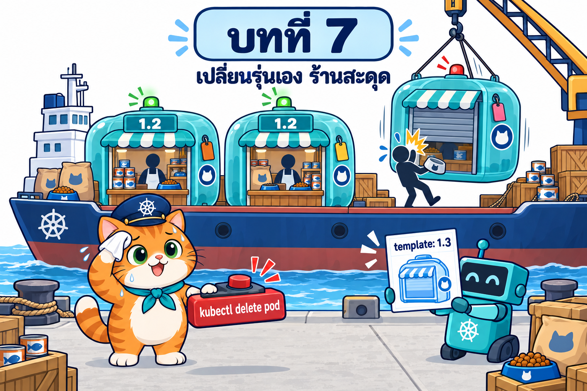

# บทที่ 7: Deployment — ผู้จัดการร้านที่เปลี่ยนรุ่นทีละบูธและพลิกสมุดย้อนรุ่นได้

> **รายวิชา:** Software Development Tools and Environments (DevTools)
> **หัวข้อ:** Kubernetes Deployment — Deployment → ReplicaSet → Pod และ pod-template-hash, สิ่งที่ทำให้เกิด rollout, RollingUpdate (maxSurge/maxUnavailable) และ Recreate, readinessProbe/minReadySeconds, zero-downtime rollout (preStop, terminationGracePeriodSeconds), progressDeadlineSeconds, rollout history/change-cause/undo/pause/resume/restart, revisionHistoryLimit, การย้ายจาก ReplicaSet เป็น Deployment, อาการ rollout พัง, blue/green และ canary
> **ผลลัพธ์การเรียนรู้ที่เกี่ยวข้อง:** CLO-5, CLO-6

<p align="center">
  <br>
  <em>เปิดบทที่ 7: ต่อจากบท 006 — set image ที่ ReplicaSet แล้วบูธเดิมยังเป็น 1.2 น้องส้มต้องลบบูธเองทีละตัว ลูกค้าบางคนชนบูธที่กำลังปิด</em>
</p>

## บทนี้เรียนอะไร

บทที่ 6 ร้านอาหารแมวน้องส้มมี **ประภาคาร (Service)** ให้ลูกค้าเปิดร้านที่ `http://localhost:30080` และมีครัวกลาง (db) ตัวเดียว แต่ตอนอยากเปลี่ยนร้านเป็นรุ่น 1.3 น้องส้มสั่ง `set image` ที่ **หัวหน้ากะ (ReplicaSet)** แล้วไม่มีบูธไหนเปลี่ยน ต้องลบบูธเองจนลูกค้าเจอ error และไม่มีสมุดประวัติให้ย้อนรุ่น บทนี้จึงจ้าง **ผู้จัดการร้าน (Deployment)** ที่ถือ **สมุดบันทึกรุ่น** สั่งหัวหน้ากะรุ่นใหม่ให้เปิดบูธทีละบูธ รอไฟเขียวก่อนให้หัวหน้ากะรุ่นเก่าปิดบูธ จดทุกการเปลี่ยน และพลิกสมุดย้อนรุ่นได้ในคำสั่งเดียว ปิดท้ายด้วย **ร้านน้องส้มแบบโปรดักชันจริง** ที่แปลงร้านของบทที่ 6 เป็น Deployment โดยไม่เปลี่ยนชื่อ Service แล้วเปลี่ยนรุ่นระหว่างขายได้ error 0 จาก 300 คำขอ เจอรุ่นพังก็ยังขายได้ แต่เมื่อ Pod ฐานข้อมูลเกิดใหม่ ออเดอร์ทั้งหมดก็ยังหาย ซึ่งเป็นโจทย์ของบทถัดไป

| ส่วน | เนื้อหา | ลิงก์ |
|---|---|---|
| 📖 **ทฤษฎี** | ปัญหาการเปลี่ยนรุ่นด้วย ReplicaSet, Deployment → ReplicaSet → Pod และ ownerReferences, โครง manifest และค่า default, `--dry-run` เป็นจุดเริ่ม YAML, คอลัมน์ READY/UP-TO-DATE/AVAILABLE, `pod-template-hash`, สิ่งที่ทำให้เกิด rollout, RollingUpdate (คำนวณ maxSurge/maxUnavailable) และ Recreate, readinessProbe/minReadySeconds, zero-downtime (preStop + grace period), progressDeadlineSeconds และการไม่ rollback อัตโนมัติ, `kubectl rollout` (history, change-cause, undo, pause/resume, restart), revisionHistoryLimit, วิธีเปลี่ยน Deployment และกับดักของ apply, การรับเลี้ยง ReplicaSet เดิม, อาการ rollout พัง, blue/green และ canary และปัญหาที่ส่งต่อบทถัดไป (36 ภาพประกอบ + คำถามทบทวนพร้อมแนวคำตอบ) | [01_Theory/README.md](01_Theory/README.md) |
| 🧪 **ปฏิบัติการ** | LAB 0–10 จากง่ายไปยาก: เตรียมคลัสเตอร์และ image → Deployment แรก → rolling update ผ่าน Service → history/undo/pause/restart → เทียบกลยุทธ์ → readiness/minReadySeconds → image ผิดและ progress deadline → zero-downtime ผ่าน NodePort 30080 → ย้าย ReplicaSet เป็น Deployment → blue/green และ canary → **LAB สุดท้าย: ร้านน้องส้มแบบโปรดักชันจริง** (พร้อมภาพหน้าจอจริง) และ Troubleshooting, Checklist, ตารางเก็บกวาด | [02_LAB/README.md](02_LAB/README.md) |

## คำแนะนำในการเรียน

1. **อ่านทฤษฎีหัวข้อ 1–3 ก่อน** (ปัญหา, ลำดับชั้น Deployment → ReplicaSet → Pod, สิ่งที่ทำให้เกิด rollout) แล้วเริ่ม LAB 0–2 ได้
2. ก่อน LAB 3 อ่านหัวข้อ 8 (rollout history/undo/pause) ก่อน LAB 4 อ่านหัวข้อ 4 (RollingUpdate/Recreate) ก่อน LAB 5–6 อ่านหัวข้อ 5, 7 และ 11 (readiness, progress deadline, อาการพัง) ก่อน LAB 7 อ่านหัวข้อ 6 (zero-downtime) ก่อน LAB 8 อ่านหัวข้อ 10 (ย้ายจาก ReplicaSet) ก่อน LAB 9 อ่านหัวข้อ 12 และก่อน LAB 10 อ่านหัวข้อ 9 และ 13
3. ทำ LAB **ตามลำดับ** แต่ละ LAB มี namespace ของตัวเอง (LAB 1–3 ใช้ `deploy-lab` ต่อเนื่องกัน) และ **ต้องลบ namespace `zdt-lab` ของ LAB 7 ก่อนเริ่ม LAB 10** เพราะทั้งสองใช้ NodePort 30080 ทำบล็อก "เก็บกวาด" ทุกครั้ง ใช้เวลารวมประมาณ 3–3.5 ชั่วโมง
4. สังเกตสัญลักษณ์ว่าคำสั่งรันที่ไหน: 🖥️ บนเครื่องนักศึกษา / 🐧 ใน SSH session ของ k8s-lab / 🌐 browser
5. ผลลัพธ์ในเอกสารมาจากการทดลองจริง (Kubernetes v1.37.0, 5 ตุลาคม 2569) แต่ **เวลา, IP, ค่า hash ในชื่อ ReplicaSet/Pod, ชื่อ Pod ที่สุ่ม และจำนวน error ที่นับได้อาจต่างจากเครื่องของนักศึกษา**
6. ลองตอบคำถามทบทวนด้วยตัวเองก่อนเปิดดูแนวคำตอบ

> **ขอบเขตของบทนี้:** ใช้ Pod, ReplicaSet, Service (ClusterIP/NodePort), EndpointSlice และ Deployment ได้ทั้งหมด ฐานข้อมูลยังเก็บใน `emptyDir` และรหัสผ่านยังเขียนใน YAML ตรง ๆ (ค่าตัวอย่างเพื่อการเรียน) ส่วน PersistentVolume/PVC/StatefulSet, ConfigMap/Secret, HorizontalPodAutoscaler และ Ingress เป็นเนื้อหาบทหลัง (กล่าวถึงเป็นการปูทางเท่านั้น)

## สิ่งที่ต้องผ่านก่อน

- [บทที่ 1: Kubernetes และสถาปัตยกรรม](../001_kubernetes-introduction/01_Theory/README.md) และ [LAB บทที่ 1](../001_kubernetes-introduction/02_LAB/readme.md): เข้าใจบทบาทของ Control Plane, Worker Node และมี container **`k8s-lab`** ที่สร้างตามบทที่ 1 (publish พอร์ต `2223`, `8889` และ **`30080–30082`**) ล็อกอินได้ด้วย `ssh -p 2223 root@localhost` (รหัส `passwd` ใช้เพื่อการเรียนเท่านั้น)
- [บทที่ 2: Kubernetes Pod](../002_kubernetes_pod/01_Theory/README.md) และ [LAB บทที่ 2](../002_kubernetes_pod/02_LAB/README.md): เขียน Pod YAML ได้ เข้าใจ labels, probes (readiness/liveness), init container และ emptyDir
- [บทที่ 3: Node กับ Pod](../003_kubernetes_node_pod/01_Theory/README.md) และ [LAB บทที่ 3](../003_kubernetes_node_pod/02_LAB/README.md): เข้าใจ Node, kube-scheduler และ Downward API
- [บทที่ 4: Namespace](../004_kubernetes_namespace/01_Theory/README.md) และ [LAB บทที่ 4](../004_kubernetes_namespace/02_LAB/README.md): เข้าใจ namespace และ Pod Security Admission
- **[บทที่ 5: ReplicaSet](../005_kubernetes_replicaset/01_Theory/README.md) และ [LAB บทที่ 5](../005_kubernetes_replicaset/02_LAB/README.md) (ต้องผ่านก่อน):** เข้าใจ selector/template/ownerReferences, การรับเลี้ยง Pod หลง และ `--cascade=orphan`
- **[บทที่ 6: Service](../006_kubernetes_service/01_Theory/README.md) และ [LAB บทที่ 6](../006_kubernetes_service/02_LAB/README.md) (ต้องผ่านก่อน):** เข้าใจ ClusterIP, EndpointSlice, NodePort 30080, readiness กับ endpoints และเห็นปัญหาการเปลี่ยนรุ่นที่บทนี้แก้ และ **เก็บกวาด namespace `som-shop` ของบทที่ 6** แล้ว
- คลัสเตอร์ kind `lab` จากบทก่อน **ใช้ต่อได้** (ถ้ายังมี image `som-shop-web:1.2`/`1.3` จากบทที่ 6 ก็ไม่ต้อง build ใหม่) ถ้ายังไม่มีคลัสเตอร์ LAB 0 จะสร้างใหม่ด้วย `k8s-up` และ build image ร้านจากสำเนาแอปในบทนี้
- เครื่องต่ออินเทอร์เน็ตได้ (ดึง image `nginx`, `busybox`, `postgres`, `node`) และมีหน่วยความจำว่างพอสำหรับร้าน 5 บูธ + db 1 ตัว

## บทที่ 5 → 6 → 7 เป็นเรื่องต่อเนื่องกัน

บทนี้เป็นบทสุดท้ายของชุด **workload และการเข้าถึงแอป** 3 บท ที่ใช้ร้านน้องส้มเรื่องเดียวกันต่อเนื่อง **ต้องผ่านบทที่ 5 และบทที่ 6 ก่อน**

| บท | ตัวละครใหม่ | ปัญหาที่แก้ |
|---|---|---|
| [5 ReplicaSet](../005_kubernetes_replicaset/) | หัวหน้ากะ | บูธหายแล้วไม่มีใครสร้างแทน → มีบูธครบจำนวนเสมอ |
| [6 Service](../006_kubernetes_service/) | ประภาคาร, คลิปบอร์ดรายชื่อบูธ, ป้ายบอกทาง, ประตู 30080 | ชื่อ/IP ของบูธเปลี่ยนทุกครั้งและแต่ละบูธมี db ของตัวเอง → ที่อยู่คงที่ของร้าน เปิดร้านจาก browser และแยก db กลาง |
| **7 Deployment** (บทนี้) | ผู้จัดการร้าน, สมุดบันทึกรุ่น | เปลี่ยนรุ่นต้องลบบูธเองจนร้านสะดุด → เปลี่ยนรุ่นทีละบูธอัตโนมัติ ย้อนรุ่นได้ และรุ่นพังก็ยังขาย |

LAB สุดท้ายของบทนี้เริ่มจาก **สภาพเดียวกับท้ายบทที่ 6** (ReplicaSet + Service ใน `som-shop-v3/k8s-rs/`) แล้วแปลงเป็น Deployment ชื่อเดิม และจบด้วยปัญหาที่ส่งต่อบทถัดไป: ข้อมูลฐานข้อมูลหายเมื่อ Pod db ถูกสร้างใหม่ (`emptyDir`) → PersistentVolume/PVC/StatefulSet, รหัสผ่านใน YAML → ConfigMap/Secret และการปรับจำนวนอัตโนมัติ → HPA

## โครงสร้างโฟลเดอร์

```text
007_kubernetes_deployment/
├── README.md                         ← หน้านี้
├── 01_Theory/
│   ├── README.md                     ← เอกสารทฤษฎี
│   └── images/                       ← ภาพประกอบ 00–36 (+ imagegen-prompts.md)
└── 02_LAB/
    ├── README.md                     ← คู่มือ LAB 0–10
    ├── images/                       ← ภาพประกอบ LAB 01–23 (+ imagegen-prompts.md) และ screenshots/ ภาพหน้าจอจริงของร้าน
    ├── labs/                         ← YAML ของ LAB 1–9 (แต่ละ LAB มี namespace ของตัวเอง)
    │   ├── lab01-deployment/         ← LAB 1–3 (namespace deploy-lab)
    │   ├── lab02-rolling/
    │   ├── lab04-strategy/           ← + exercise/zero-zero.yaml
    │   ├── lab05-readiness/          ← + patches/
    │   ├── lab06-broken/             ← + patches/
    │   ├── lab07-zero-downtime/      ← + patches/ (NodePort 30080)
    │   ├── lab08-migrate/
    │   └── lab09-release/
    └── som-shop-v3/                  ← LAB 10 ร้านน้องส้มแบบโปรดักชัน
        ├── app/                      ← สำเนาแอป Next.js + Dockerfile จากบทที่ 6 (som-shop-web:1.2 และ 1.3 จากโค้ดเดียว)
        ├── k8s-rs/                   ← จุดเริ่ม = สภาพท้ายบทที่ 6: 00-namespace.yaml, 10-db.yaml, 20-web.yaml (ReplicaSet + Service)
        ├── k8s/                      ← 10-db.yaml (Deployment Recreate), 20-web.yaml (Deployment zero-downtime)
        └── hit.sh                    ← ยิง request ทีละครั้งแล้วนับว่าไปตก Pod ไหน / นับ ok-err
```

ใน LAB 0 จะคัดลอกโฟลเดอร์ทั้งหมดนี้เข้า container ด้วย 🖥️ `docker cp 007_kubernetes_deployment k8s-lab:/workspace/` แล้วทำงานที่ `/workspace/007_kubernetes_deployment/02_LAB` ภายใน k8s-lab (LAB 1–9 ที่ `labs/`, LAB 10 ที่ `som-shop-v3/`) บทนี้มีสำเนาแอปร้านของตัวเอง จึงไม่ต้องมีโฟลเดอร์ของบทที่ 6 ใน container พอร์ต 30080–30082 ของ kind ถูก map ออกมาที่ `localhost` ของเครื่องนักศึกษาไว้แล้วตั้งแต่บทที่ 1 จึงเปิดร้านที่ `http://localhost:30080` ได้โดยไม่ต้อง port-forward

## เริ่มเลย

👉 [อ่านทฤษฎี](01_Theory/README.md) → [ลงมือทำ LAB](02_LAB/README.md)
