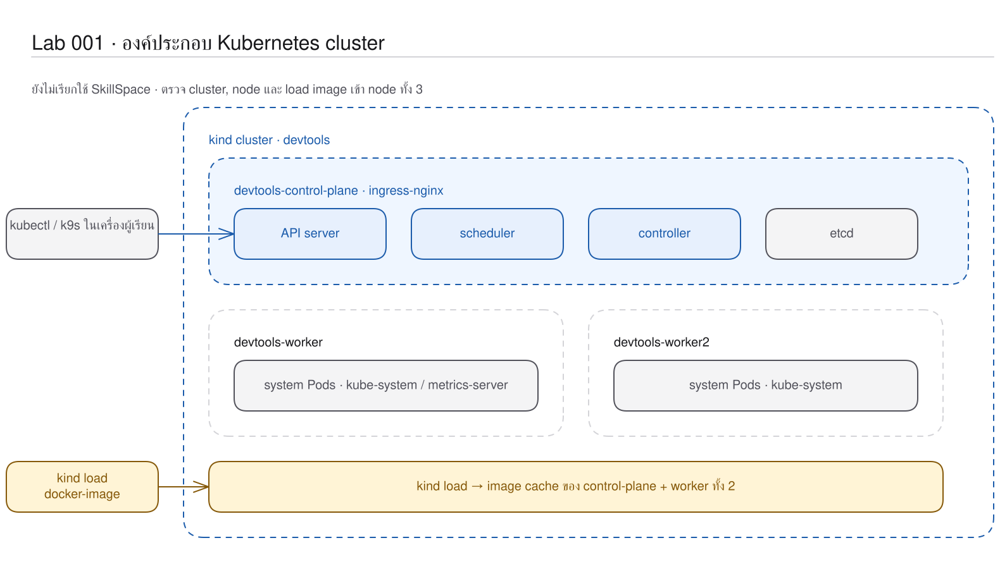

# LAB 1 — Kubernetes Introduction: จากเครื่องเดียวสู่กลไกกำกับดูแล cluster
> โฟลเดอร์ `001-kubernetes-introduction` = LAB 1 ของชุด Kubernetes ครั้งที่ 1
> (ไฟล์ของปฏิบัติการนี้: `README.md`; ปฏิบัติการนี้ยังไม่มี manifest เนื่องจากเป็นการสำรวจ cluster ที่มีอยู่แล้ว)

> 💡 **แนวคิดหลักของปฏิบัติการนี้:** Kubernetes คือระบบกำกับดูแลที่ทำให้การทำงานของแอปสอดคล้องกับสภาพที่กำหนดไว้อย่างต่อเนื่อง แม้เครื่องหรือแอปจะหยุดทำงาน

## วัตถุประสงค์ของปฏิบัติการ

เมื่อสิ้นสุดปฏิบัติการ ผู้เรียนจะสามารถ:

1. อธิบายได้ว่า Kubernetes แก้ไขข้อจำกัดของระบบที่ทำงานด้วย Docker Compose บนเครื่องเดียวอย่างไร
2. อธิบายบทบาทที่ต่างกันของ control plane และ worker node ได้
3. วิเคราะห์หลักฐานพื้นฐานจาก `kubectl get`, `kubectl describe`, logs และ events ได้
4. อธิบายเหตุผลที่ต้อง load image ซึ่ง build ในเครื่องเรียนเข้าสู่ kind node ก่อนใช้งานได้

## แนวคิดและทฤษฎีที่เกี่ยวข้อง

พิจารณา SkillSpace ที่ทำงานด้วย Docker Compose: หากเครื่องดังกล่าวหยุดทำงาน ทุก service จะหยุดทำงานตามไปด้วย; หากต้องเปิด web จำนวน 10 รายการบนเครื่อง 3 เครื่อง ผู้ดูแลต้องเลือกเครื่อง ตรวจสอบ process และเปิด process ใหม่ด้วยตนเอง ประเด็นสำคัญจึงครอบคลุมทั้งวิธีเปิด container และกลไกกำกับระบบอย่างต่อเนื่อง

Kubernetes เพิ่ม control plane เป็นศูนย์กลางการควบคุม ส่วน worker node รับภาระงานไปดำเนินการ; ผู้ใช้ส่งคำขอผ่าน API server จากนั้น scheduler/controller เปรียบเทียบสภาพจริงกับสภาพที่ต้องการอย่างต่อเนื่อง

| มุมมอง | Docker Compose | Kubernetes |
|---|---|---|
| ขอบเขตหลัก | เครื่องเดียว | หลาย node ใน cluster |
| ผู้บันทึกสภาพที่ต้องการ (desired state) | ไฟล์อยู่กับผู้ใช้ | API server และ etcd |
| ผู้กำกับและแก้ไขส่วนต่าง | ผู้ใช้/สคริปต์ | controller |
| เมื่อเครื่องไม่สามารถติดต่อได้ | ระบบไม่รับรู้เครื่องอื่น | control plane ตรวจพบ node เป็น `NotReady` |
| หน่วยการทำงาน | container/service | Pod และ object ชนิดต่าง ๆ |

ในสภาพแวดล้อมการเรียนนี้ kind จำลอง node แต่ละเครื่องด้วย Docker container โดยยังคงใช้ Kubernetes API และกลไกควบคุมจริง

## ผลการเรียนรู้ที่คาดหวัง

- ตรวจสอบ cluster จริงที่มี 1 control-plane และ 2 worker ได้
- พิสูจน์ได้ว่า `kubectl` ติดต่อ API server และรายงานเวอร์ชันทั้ง client/server
- ระบุ system Pod ที่สนับสนุนการทำงานของ cluster ได้
- build และ load image SkillSpace สำหรับใช้ตลอดชุดปฏิบัติการได้
- สังเกตการที่ control plane ตรวจพบ worker ซึ่งหยุดทำงานได้
- พิสูจน์ได้ว่า worker กลับสู่สถานะ `Ready` หลังจากเปิดใช้งานอีกครั้ง

## ภาพรวมของปฏิบัติการ

1. เปิดเครื่องเรียนและ bootstrap cluster
2. ตรวจ API server, version และ node
3. สำรวจ system Pod และรายละเอียด worker
4. build/load image ของ SkillSpace
5. หยุด worker2 วิเคราะห์สถานะ และเปิดใช้งานอีกครั้ง
6. ตรวจสอบหลักฐานและล้างทรัพยากร


> **คำถามนำก่อนเริ่มปฏิบัติการ:** หากไม่สามารถติดต่อ worker node ได้หนึ่งเครื่อง control plane จะตรวจพบหรือไม่ และสามารถตรวจสอบหลักฐานดังกล่าวได้จากส่วนใด

## 0. การเตรียมสภาพแวดล้อมสำหรับปฏิบัติการ

ให้เรียกใช้จากเครื่องหลัก โดยคำสั่งแรกจะเปิดเครื่องเดิมหากมีอยู่ หรือสร้างเครื่องใหม่หากยังไม่มี จากนั้นรอจน Docker daemon ภายในพร้อมทำงาน:
```bash
docker start devtools-k8s || docker run -d --name devtools-k8s --privileged --shm-size=1g --ulimit nofile=65536:65536 -p 2299:22 -p 8080:80 -p 8443:443 -p 3000:3000 -p 9090:9090 tuchsanai/devtools-k8s:2569_1
until docker exec devtools-k8s docker info >/dev/null 2>&1; do sleep 2; done
```
> 📝 **คำอธิบาย:** `docker start` ใช้เครื่องเดิมโดยไม่ลบงาน · `||` สร้าง container เมื่อยังไม่มี · option ที่เหลือเตรียม Docker-in-Docker, resource limit และ port mapping · loop เรียก `docker info` ทุก 2 วินาทีเพื่อป้องกันการ bootstrap ก่อนที่ daemon จะพร้อม

✅ ผลลัพธ์ที่คาดหวัง (Expected output) — แสดงชื่อ `devtools-k8s` หรือ container ID จำนวน 64 อักขระ; คำสั่งรอสิ้นสุดโดยไม่แสดงข้อความ:
```text
devtools-k8s
```
ค่าจริงอาจเป็น container ID และแตกต่างกันในแต่ละเครื่อง

ให้เข้าสู่เครื่องเรียน แล้วป้อนคำสั่งทั้งหมดหลังจากนี้ใน shell ดังกล่าว:
```bash
docker exec -it devtools-k8s bash
k8s-bootstrap
kubectl get nodes
docker exec devtools-control-plane crictl images | grep k8s-lab
```
> 📝 **คำอธิบาย:** `docker exec -it ... bash` เข้าสู่เครื่องเรียน · `k8s-bootstrap` สร้าง cluster ในครั้งแรกและข้ามขั้นตอนการสร้างเมื่อมี cluster แล้ว โดยอาจใช้เวลาหลายนาที · `get nodes` ตรวจสอบ node · `crictl images` ตรวจสอบ image จากมุมมองของ node จริง

✅ ผลลัพธ์ที่คาดหวัง (Expected output) — bootstrap กำหนด context สำเร็จและ node ทั้งสามมีสถานะ `Ready`; หากการดำเนินการครั้งแรกยังไม่แสดง image ให้ดำเนินขั้น build/load ในหัวข้อ 6:
```text
Set kubectl context to "kind-devtools"
NAME                     STATUS   ROLES           AGE     VERSION
devtools-control-plane   Ready    control-plane   5m14s   v1.36.4
devtools-worker          Ready    <none>          5m5s    v1.36.4
devtools-worker2         Ready    <none>          5m5s    v1.36.4
docker.io/library/k8s-lab-api   v1   c01adaec89c6d   186MB
docker.io/library/k8s-lab-db    v1   a5a8c986a5421   300MB
docker.io/library/k8s-lab-web   v1   34d144d726eda   209MB
docker.io/library/k8s-lab-web   v2   0bdb9ed2beecf   209MB
```
ค่า `AGE`, image ID และขนาดอาจแตกต่างกันได้

ในเทอร์มินัลของเครื่องเรียนให้ใช้ `localhost` พอร์ต 80 เมื่อเรียก Ingress ส่วนเบราว์เซอร์บนเครื่องของผู้เรียนให้ใช้ `http://localhost:8080`

## 1. การดึงโค้ดของปฏิบัติการ (Clone)
```bash
mkdir -p ~/labwork && cd ~/labwork && git clone https://github.com/Tuchsanai/DevTools.git
cd ~/labwork/DevTools/05_kubernetes/01_Session1_Kubernetes_Basics/001-kubernetes-introduction
pwd
```
> 📝 **คำอธิบาย:** `mkdir -p` สร้าง workspace หากยังไม่มี · `&&` ดำเนินการต่อเมื่อคำสั่งก่อนหน้าสำเร็จ · `git clone` ดาวน์โหลด repository · `cd` เข้าสู่ LAB 001 · `pwd` ยืนยันตำแหน่งก่อนเรียกใช้คำสั่ง

✅ ผลลัพธ์ที่คาดหวัง (Expected output) — clone สำเร็จและอยู่ในโฟลเดอร์ LAB 001:
```text
Cloning into 'DevTools'...
/root/labwork/DevTools/05_kubernetes/01_Session1_Kubernetes_Basics/001-kubernetes-introduction
```
หาก clone ไว้แล้ว ไม่จำเป็นต้อง clone ซ้ำ ให้เรียกใช้ `cd ~/labwork/DevTools && git pull` แล้วกลับเข้าสู่โฟลเดอร์ปฏิบัติการ

## 2. การอ่าน YAML ของปฏิบัติการนี้

ปฏิบัติการนี้สำรวจ object ที่ cluster สร้างไว้แล้ว จึงไม่มีไฟล์ `.yaml` สำหรับ apply แต่ยังสามารถอ่านโครงสร้างของ object จริงด้วย `kubectl get ... -o yaml` ได้

| ไฟล์ | kind | การดำเนินการในปฏิบัติการนี้ | แหล่งคำอธิบายโดยละเอียด |
|---|---|---|---|
| — ไม่มีไฟล์ `.yaml` | Node และ system Pod มาจาก cluster | อ่านสภาพจริง (actual state) โดยไม่สร้าง manifest | [ศึกษา YAML_Guide.md → หลักการอ่าน YAML](../YAML_Guide.md#หลักการอ่าน-yaml) |

ให้เปรียบเทียบ `kubectl get node devtools-worker -o yaml` กับตารางในคู่มือ: `metadata` ระบุตัวตน, `spec` คือค่าที่ระบบใช้ และ `status` คือข้อมูลที่ kubelet/controller รายงานกลับ โดยไม่ควรคัดลอก `status` ไปเป็นสภาพที่ต้องการ

**ข้อผิดพลาดที่พบบ่อยในปฏิบัติการนี้:** runlog ไม่มี YAML validation error เนื่องจากปฏิบัติการนี้ไม่มี manifest; ข้อความตัวอย่างเมื่อระบุไฟล์ที่ไม่มีคือ `error: the path "node.yaml" does not exist` จึงควรตรวจสอบ `pwd` และแยกคำสั่งอ่าน object (`get -o yaml`) ออกจากคำสั่ง apply ไฟล์

ตรวจสอบ schema ที่ใช้ในปฏิบัติการนี้ด้วย `kubectl explain node.spec` และ `kubectl explain node.status.conditions`

## 3. การระบุตำแหน่งของ control plane ใน cluster
```bash
kubectl cluster-info
kubectl version
```
> 📝 **คำอธิบาย:** `cluster-info` แสดง endpoint หลักที่ context ปัจจุบันชี้อยู่ · `version` แสดงเวอร์ชัน client ของ kubectl และ server ของ Kubernetes · เวอร์ชันต่างกันเล็กน้อยได้เพราะสื่อสารผ่าน API ที่รองรับกัน

✅ ผลลัพธ์ที่คาดหวัง (Expected output) — ติดต่อ control plane ได้ และเห็น client v1.37.0/server v1.36.4:
```text
Kubernetes control plane is running at https://127.0.0.1:40417
CoreDNS is running at https://127.0.0.1:40417/api/v1/namespaces/kube-system/services/kube-dns:dns/proxy

Client Version: v1.37.0
Server Version: v1.36.4
```
เลข port ของ API server ต่างกันได้

## 4. การตรวจสอบ node จากสองมุมมอง
```bash
kubectl get nodes -o wide
docker ps
```
> 📝 **คำอธิบาย:** `get nodes` อ่าน object ชนิด Node · `-o wide` เพิ่ม IP, OS และ runtime · `docker ps` แสดง container ที่ทำงานอยู่ในเครื่องเรียน · ชื่อ `devtools-*` ทำให้เชื่อมโยงข้อมูลจากทั้งสองมุมมองได้

✅ ผลลัพธ์ที่คาดหวัง (Expected output) — Kubernetes เห็นสาม node และ Docker เห็น kind container สามตัวชื่อเดียวกัน:
```text
NAME                     STATUS   ROLES           VERSION   INTERNAL-IP   CONTAINER-RUNTIME
devtools-control-plane   Ready    control-plane   v1.36.4   172.18.0.4    containerd://2.3.4
devtools-worker          Ready    <none>          v1.36.4   172.18.0.2    containerd://2.3.4
devtools-worker2         Ready    <none>          v1.36.4   172.18.0.3    containerd://2.3.4

IMAGE                  NAMES
kindest/node:v1.36.4   devtools-worker2
…
```
ค่า IP, AGE, container ID และลำดับแถวต่างกันได้ (ตัดบางแถวจาก `docker ps`)

## 5. การสำรวจ system Pod ที่สนับสนุนการทำงานของ cluster
```bash
kubectl get pods -A
```
> 📝 **คำอธิบาย:** `get pods` อ่าน Pod · `-A` หรือ `--all-namespaces` ขยายมุมมองจาก namespace ปัจจุบันไปทุก namespace · สังเกต CoreDNS, API server, scheduler, controller, metrics-server และ ingress controller

✅ ผลลัพธ์ที่คาดหวัง (Expected output) — system Pod หลักเป็น `Running`:
```text
NAMESPACE            NAME                                             READY   STATUS
ingress-nginx        ingress-nginx-controller-5d9bb85749-hczf6        1/1     Running
kube-system          coredns-589f44dc88-kfjdg                         1/1     Running
kube-system          etcd-devtools-control-plane                      1/1     Running
kube-system          kube-apiserver-devtools-control-plane            1/1     Running
…
```
ชื่อ Pod ต่อท้าย hash และ AGE ต่างกันได้ (ตัดบางแถว)

## 6. การวิเคราะห์รายละเอียดของ worker หนึ่งเครื่อง
```bash
kubectl describe node devtools-worker | head -40
```
> 📝 **คำอธิบาย:** `describe node` รวมข้อมูลที่มนุษย์ใช้วินิจฉัย · `devtools-worker` คือ object เป้าหมาย · `head -40` จำกัดให้เริ่มจาก identity, label, taint, lease, Conditions และ capacity

✅ ผลลัพธ์ที่คาดหวัง (Expected output) — Condition `Ready=True` และไม่มี Memory/Disk/PID pressure:
```text
Name:               devtools-worker
Roles:              <none>
Unschedulable:      false
Conditions:
  Type             Status  Reason
  MemoryPressure   False   KubeletHasSufficientMemory
  DiskPressure     False   KubeletHasNoDiskPressure
  PIDPressure      False   KubeletHasSufficientPID
  Ready            True    KubeletReady
…
```
เวลา, CPU และ RAM ต่างกันได้ตามเครื่อง (ตัดข้อความท้ายหลัง Conditions)

## 7. การเตรียม image ของ SkillSpace สำหรับทั้งชุด

ให้สร้าง image ทั้งสี่รายการจากแอปที่ผ่านการตรวจแล้ว:
```bash
cd ~/labwork/DevTools/05_kubernetes/app
./build-images.sh
```
> 📝 **คำอธิบาย:** `cd` เข้าสู่ source ของแอปส่วนกลาง · `build-images.sh` build web v1/v2, API v1 และ DB v1 ด้วย tag ที่ปฏิบัติการอื่นอ้างถึง · ขั้นตอนนี้ดำเนินการเพียงครั้งเดียวเมื่อเริ่มต้นชุดและใช้เวลาประมาณ 3–5 นาที

✅ ผลลัพธ์ที่คาดหวัง (Expected output) — ท้าย build มี image ครบสี่ tag:
```text
k8s-lab-api:v1   c01adaec89c6   181MB
k8s-lab-db:v1    a5a8c986a542   297MB
k8s-lab-web:v1   34d144d726ed   205MB
k8s-lab-web:v2   0bdb9ed2beec   205MB
```
image ID, ขนาด และเวลาที่ build ต่างกันได้

ให้โหลด image เข้าสู่ node ทั้งสามแล้วตรวจสอบจาก control-plane:
```bash
kind load docker-image k8s-lab-web:v1 k8s-lab-web:v2 k8s-lab-api:v1 k8s-lab-db:v1 --name devtools
docker exec devtools-control-plane crictl images | grep k8s-lab
```
> 📝 **คำอธิบาย:** `kind load docker-image` คัดลอก local image เข้าสู่ node · รายชื่อ image จำนวนสี่รายการตามด้วย tag · `--name devtools` เลือก cluster ที่ถูกต้อง · `docker exec` เข้าสู่ control-plane · `crictl images` สอบถาม container runtime ของ node · `grep` แสดงเฉพาะ image ของปฏิบัติการ

✅ ผลลัพธ์ที่คาดหวัง (Expected output) — runtime ใน node มองเห็น image ครบ:
```text
Image: "k8s-lab-web:v1" with ID "sha256:34d144d726eda34af4b53fe67378ac193987443d8d326b53b2662b05557eb72a" not yet present on node "devtools-worker2", loading...
…
docker.io/library/k8s-lab-api   v1   c01adaec89c6d   186MB
docker.io/library/k8s-lab-db    v1   a5a8c986a5421   300MB
docker.io/library/k8s-lab-web   v1   34d144d726eda   209MB
docker.io/library/k8s-lab-web   v2   0bdb9ed2beecf   209MB
```
image ID และขนาดอาจแตกต่างกัน image store ดังกล่าวแยกจาก image store ของ dockerd ชั้นนอก (ตัดข้อความการ load ของ node อื่น)

## 8. การทดลองจำลองความล้มเหลว — การหยุด worker node

เปิด Terminal แรกค้างไว้เพื่อสังเกตการเปลี่ยนสถานะ:
```bash
kubectl get nodes -w
```
> 📝 **คำอธิบาย:** `get nodes` แสดง node · `-w` หรือ `--watch` ทำให้คำสั่งรอ event ใหม่จาก API server อย่างต่อเนื่อง · กด `Ctrl+C` เมื่อสิ้นสุดการทดลอง

✅ ผลลัพธ์ที่คาดหวัง (Expected output) — ตอนเริ่มทั้งสาม node ยัง `Ready`:
```text
NAME                     STATUS   ROLES           AGE    VERSION
devtools-control-plane   Ready    control-plane   5m47s  v1.36.4
devtools-worker          Ready    <none>          5m38s  v1.36.4
devtools-worker2         Ready    <none>          5m38s  v1.36.4
```
เปิดหน้าต่างใหม่บนเครื่องหลักแล้ว `docker exec -it devtools-k8s bash` อีกครั้ง จากนั้นหยุด worker2 และรอสถานะให้เปลี่ยนอย่างชัดเจน:
```bash
docker stop devtools-worker2
kubectl wait --for=condition=Ready=false node/devtools-worker2 --timeout=90s
kubectl get nodes
kubectl describe node devtools-worker2 | sed -n '/Conditions:/,/Addresses:/p'
```
> 📝 **คำอธิบาย:** `docker stop` จำลองการไม่สามารถติดต่อเครื่อง worker · `wait` รอ `Ready=false` แทนการรีบอ่านสถานะเดิม · `get nodes` อ่านสถานะที่ control plane รับรู้ · `describe` แสดง Conditions และสาเหตุ

✅ ผลลัพธ์ที่คาดหวัง (Expected output) — worker2 เป็น `NotReady` และ kubelet หยุดส่งสถานะ:
```text
devtools-worker2   NotReady   <none>   7m2s   v1.36.4

Conditions:
  Type             Status    Reason              Message
  MemoryPressure   Unknown   NodeStatusUnknown   Kubelet stopped posting node status.
  DiskPressure     Unknown   NodeStatusUnknown   Kubelet stopped posting node status.
  PIDPressure      Unknown   NodeStatusUnknown   Kubelet stopped posting node status.
  Ready            Unknown   NodeStatusUnknown   Kubelet stopped posting node status.
```
AGE และเวลาอาจแตกต่างกันได้ สถานะ `Unknown` หมายความว่า control plane ไม่สามารถติดต่อ kubelet ได้ โดยไม่ได้ยืนยันว่าฮาร์ดแวร์เสียหาย

คืนสภาพระบบด้วยการเปิด worker2 และรอ Condition:
```bash
docker start devtools-worker2
kubectl wait --for=condition=Ready=True node/devtools-worker2 --timeout=90s
kubectl get nodes
```
> 📝 **คำอธิบาย:** `docker start` เปิด node เดิม · `kubectl wait` รอเงื่อนไขแทนการกำหนดเวลาโดยประมาณ · `--for=condition=Ready=True` ระบุผลที่ต้องการ · `--timeout=90s` จำกัดระยะเวลารอ · `get nodes` ยืนยันภาพรวมอีกครั้ง

✅ ผลลัพธ์ที่คาดหวัง (Expected output) — Condition ผ่านและ worker2 กลับเป็น `Ready`:
```text
devtools-worker2
node/devtools-worker2 condition met
NAME                     STATUS   ROLES           AGE     VERSION
devtools-control-plane   Ready    control-plane   7m22s   v1.36.4
devtools-worker          Ready    <none>          7m13s   v1.36.4
devtools-worker2         Ready    <none>          7m13s   v1.36.4
```
AGE ต่างกันได้ ส่วนหน้าต่าง watch จะเห็น `Ready → NotReady → Ready` จริง

อ่าน logs และ events หลังเหตุการณ์:
```bash
kubectl -n kube-system logs deploy/metrics-server --tail=5
kubectl get pods -A -o wide
kubectl get events -A --sort-by=.lastTimestamp | tail -10
```
> 📝 **คำอธิบาย:** `logs` อ่านบันทึกจาก metrics-server · ตาราง `-o wide` ใช้ตรวจสอบว่า Pod ใดอยู่บน `devtools-worker2` · events เรียงตามเวลาล่าสุด; หลักฐาน restart ด้านล่างเกิดขึ้นเมื่อ metrics-server อยู่บน worker2 ที่หยุดทำงาน

✅ ผลลัพธ์ที่คาดหวัง (Expected output) — logs กลับมา sync และ events บันทึกผลกระทบชั่วคราวพร้อมการเริ่มใหม่:
```text
I0902 16:40:29.289774 1 shared_informer.go:409] "Caches are synced"
I0902 16:40:29.289781 1 shared_informer.go:409] "Caches are synced"

kube-system   metrics-server-55c6b8755f-ngbgr   1/1   Running   2 (59s ago)   8m25s   10.244.2.2   devtools-worker2
…
kube-system   60s   Warning   Unhealthy   pod/metrics-server-55c6b8755f-ngbgr   Liveness probe failed
kube-system   50s   Normal    Killing     pod/metrics-server-55c6b8755f-ngbgr   Container metrics-server failed liveness probe, will be restarted
kube-system   44s   Normal    Started     pod/metrics-server-55c6b8755f-ngbgr   Container started
```
ชื่อ Pod, เวลา และจำนวน restart ต่างกันได้ (ตัดบางแถว/บางคอลัมน์และข้อความท้าย) หาก metrics-server อยู่ node อื่น จะไม่เห็น restart ชุดนี้ ให้เลือกอ่าน Pod ระบบที่อยู่บน worker2 แทน

## 9. แบบฝึกหัด (Exercise)

เลือก system Pod หนึ่งรายการจากหัวข้อ 4 แล้วตอบโดยไม่คัดลอกคำสั่งใหม่:

- Pod นั้นอยู่ namespace ใดและตกอยู่บน node ใด
- ชื่อดังกล่าวระบุบทบาทใด
- หากไม่สามารถติดต่อ node ที่ Pod ทำงานอยู่ ผู้เรียนคาดว่าจะตรวจพบหลักฐานแรกจากส่วนใด

ถือว่าสำเร็จเมื่อชี้หลักฐานจากตาราง Pod, node และ events ได้ครบ โดยไม่ตอบจากการเดาชื่อ component

## วิธีตรวจสอบผลการทดลอง

เรียกใช้ชุดคำสั่งตรวจสอบต่อไปนี้หลังจากเปิด worker กลับสู่สภาพเดิมแล้ว:
```bash
kubectl get nodes
kubectl -n kube-system get deploy,pod | grep metrics-server
docker exec devtools-control-plane crictl images | grep k8s-lab
```
> 📝 **คำอธิบาย:** คำสั่งแรกยืนยันสถานะของ node · คำสั่งที่สองยืนยัน metrics-server ทั้ง Deployment และ Pod · คำสั่งสุดท้ายยืนยัน image store ของ node สำหรับปฏิบัติการถัดไป

✅ ผลลัพธ์ที่คาดหวัง (Expected output) — node พร้อม 3/3, metrics-server พร้อม 1/1 และ image ครบ 4 tag:
```text
devtools-control-plane   Ready   control-plane   8m3s    v1.36.4
devtools-worker          Ready   <none>          7m54s   v1.36.4
devtools-worker2         Ready   <none>          7m54s   v1.36.4
deployment.apps/metrics-server   1/1   1   1   8m25s
pod/metrics-server-55c6b8755f-ngbgr   1/1   Running   2 (59s ago)   8m25s
docker.io/library/k8s-lab-web   v1
…
```
ชื่อ Pod, AGE, restart และ image ID ต่างกันได้ (ตัดบางแถว/บางคอลัมน์)

## ปัญหาที่พบบ่อยและแนวทางแก้ไข

| อาการ | สาเหตุที่พบบ่อย | แนวทางแก้ไข |
|---|---|---|
| `The connection to the server localhost:8080 was refused` | bootstrap ยังไม่เสร็จสิ้นหรือ context ยังไม่ถูกสร้าง | รอให้คำสั่งเดิมเสร็จสิ้น แล้วตรวจสอบ context `kind-devtools` |
| worker ยัง `Ready` ทันทีหลัง stop | control plane ต้องรอ heartbeat หมดอายุ | เฝ้าด้วย `-w` ประมาณ 40–60 วินาที |
| metrics-server restart หลังไม่สามารถติดต่อ worker | probe ติดต่อ node ที่หยุดทำงานไม่ได้ชั่วคราว | เปิด worker กลับ แล้วตรวจสอบว่า Deployment พร้อม 1/1 |
| image ไม่ปรากฏใน `crictl images` | build เฉพาะ dockerd ชั้นนอก และยังไม่ได้ load เข้าสู่ kind | ดำเนินขั้น build/load ให้ครบถ้วน |

## การล้างทรัพยากร (Cleanup) และการพิสูจน์การทำซ้ำจากสถานะเริ่มต้น (Clean Re-run)

LAB 001 ใช้ cluster-scoped object ที่ bootstrap สร้าง และไม่มี manifest/namespace ของปฏิบัติการ
จึงไม่ลบ cluster ที่จะใช้ต่อ แต่ให้พิสูจน์ว่าไม่มี namespace หรือ workload ของ `lab001` ค้าง แล้วดำเนินการตรวจสอบซ้ำเพื่อยืนยันผลเดิม:
```bash
kubectl delete namespace lab001 --ignore-not-found
kubectl get nodes
docker exec devtools-control-plane crictl images | grep k8s-lab
kubectl get all -n lab001
```
> 📝 **คำอธิบาย:** `delete namespace` พร้อม `--ignore-not-found` ทำให้ดำเนินการ cleanup ซ้ำได้ · `get nodes` คือ Clean Re-run ของการสำรวจ cluster · `crictl images` ยืนยันว่าทรัพยากรที่เตรียมไว้ยังคงอยู่ · `get all -n lab001` พิสูจน์ว่าไม่มี workload ของปฏิบัติการค้างอยู่

✅ ผลลัพธ์ที่คาดหวัง (Expected output) — cluster ยังคงพร้อมใช้งานและไม่เหลือทรัพยากรใน namespace `lab001`:
```text
NAME                     STATUS   ROLES           AGE     VERSION
devtools-control-plane   Ready    control-plane   8m3s    v1.36.4
devtools-worker          Ready    <none>          7m54s   v1.36.4
devtools-worker2         Ready    <none>          7m54s   v1.36.4
docker.io/library/k8s-lab-api   v1
…
No resources found in lab001 namespace.
```
AGE และ image ID อาจแตกต่างกันได้ (แสดงเฉพาะบางแถว/บางคอลัมน์) ห้ามเรียกใช้ `k8s-teardown` ในขั้นตอนนี้ เนื่องจาก LAB 002 จะใช้ cluster เดิมต่อ

## สรุปคำสั่งของปฏิบัติการนี้

| คำสั่ง | ความหมาย |
|---|---|
| `k8s-bootstrap` | สร้าง kind cluster และ component ห้องเรียน |
| `kubectl cluster-info` | แสดง endpoint ของ control plane |
| `kubectl get nodes -o wide` | ตรวจสอบ node พร้อม IP/OS/runtime |
| `kubectl get pods -A` | ตรวจสอบ Pod ทุก namespace |
| `kubectl describe node NAME` | อ่าน Conditions และรายละเอียด node |
| `kind load docker-image ...` | load image เข้า kind node |
| `kubectl get nodes -w` | เฝ้าการเปลี่ยนสถานะ node |

## สรุปสิ่งที่ได้เรียนรู้

Kubernetes ไม่ได้เป็นเพียงคำสั่งเปิด container รูปแบบใหม่ แต่เพิ่มกลไกส่วนกลางที่ตรวจสอบ cluster ทั้งระบบและรับรู้ส่วนต่างระหว่างสภาพที่ต้องการกับสภาพจริง

- ผู้เรียนสามารถอธิบายว่า Compose เน้นการทำงานบนเครื่องเดียว ส่วน Kubernetes ประสานการทำงานของหลาย node
- ผู้เรียนสามารถจำแนกว่า control plane ทำหน้าที่ตัดสินใจ ส่วน worker ทำหน้าที่ดำเนินงาน
- ผู้เรียนสามารถใช้ `NotReady`, Condition, logs และ events เป็นหลักฐาน

**ภาพรวมที่ควรจดจำ:** control plane เป็นกลไกกำกับดูแล worker ทุกเครื่อง และตรวจพบเมื่อไม่สามารถติดต่อ worker เครื่องใดเครื่องหนึ่งได้

🧭 การเชื่อมโยงสู่ปฏิบัติการถัดไป: ศึกษา [LAB 002 — kubectl และ namespace](../002-kubectl-and-namespace/README.md) เพื่อเรียนรู้การจัดกลุ่ม object

## ❓ คำถามทบทวนก่อนจบปฏิบัติการ

1. **Docker Compose มีข้อจำกัดใดเมื่อเปรียบเทียบกับ Kubernetes?** — Compose ไม่มี control plane สำหรับกำกับหลาย node หรือชดเชยงานเมื่อไม่สามารถติดต่อเครื่องได้
2. **control plane กับ worker node มีหน้าที่แตกต่างกันอย่างไร?** — control plane รับ API และบันทึกสภาพที่ต้องการ; worker ใช้ kubelet/runtime เรียกใช้งาน Pod
3. **เหตุใดจึงต้อง `kind load` image?** — node มี image store ของตนเอง จึงไม่สามารถเข้าถึง image ที่ build อยู่เฉพาะ dockerd ชั้นนอก

## ✅ รายการตรวจสอบก่อนจบปฏิบัติการ

- [ ] ตรวจพบ node จำนวน 3 รายการเป็น `Ready`
- [ ] อธิบายบทบาท control plane และ worker ได้
- [ ] image SkillSpace ครบ 4 tag ใน kind node
- [ ] เห็น worker2 เปลี่ยนเป็น `NotReady` จริง
- [ ] เปิด worker2 กลับและตรวจเป็น `Ready`
- [ ] ยืนยันว่าไม่มี resource ใน `lab001`

*ผลลัพธ์ที่คาดหวัง (expected output) และภาพหน้าจอในเอกสารนี้ได้มาจากการดำเนินการจริงบน tuchsanai/devtools-k8s:2569_1 (kind v0.33.0 · Kubernetes v1.36.4 · kubectl v1.37.0) เมื่อ 2 กันยายน 2026*
