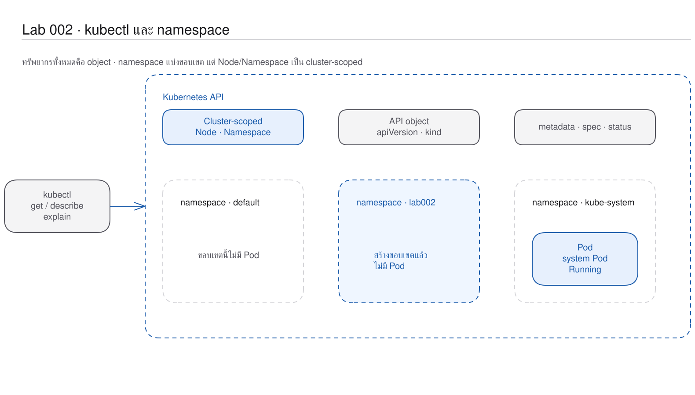

# LAB 2 — kubectl และ Namespace: การระบุ object ภายในขอบเขตที่ถูกต้อง
> โฟลเดอร์ `002-kubectl-and-namespace` = LAB 2 ของชุด Kubernetes ครั้งที่ 1
> (ไฟล์ของปฏิบัติการนี้: `README.md`; ไม่มี manifest เนื่องจากสร้าง Namespace แบบ imperative เพื่อศึกษา object)

> 💡 **แนวคิดหลักของปฏิบัติการนี้:** ทรัพยากรทั้งหมดใน Kubernetes อยู่ในรูปแบบ object ซึ่งกำหนดผ่าน kubectl และจัดกลุ่มด้วย namespace

## วัตถุประสงค์ของปฏิบัติการ

เมื่อสิ้นสุดปฏิบัติการ ผู้เรียนจะสามารถ:

1. อธิบายได้ว่า kubectl ส่งคำขอไปยัง Kubernetes API อย่างไร
2. อธิบายได้ว่า namespace แยก object และป้องกันความขัดแย้งของชื่อได้อย่างไร
3. แยก resource แบบ namespaced ออกจาก cluster-scoped ได้
4. ใช้ `get`, `describe`, `-o wide`, `-o yaml` และ `explain` เพื่อค้นหาคำตอบได้ด้วยตนเอง

## แนวคิดและทฤษฎีที่เกี่ยวข้อง

ประเด็นตั้งต้นคือ LAB 001 แสดง Pod หลายรายการ แต่เมื่อป้อน `kubectl get pods` กลับไม่ปรากฏรายการ
Pod ยังคงอยู่ แต่คำสั่งกำลังตรวจสอบคนละ namespace

kubectl เป็น client ที่อ่าน context เพื่อเลือก cluster, user และ namespace จากนั้นส่งคำขอไปยัง API server
สิ่งที่อ่านกลับมาคือ object เช่น Pod, Service, Deployment, Node และ Namespace

| มุมมอง | ความหมาย | วัตถุประสงค์ที่เหมาะสม |
|---|---|---|
| `get` | ตารางสรุป object หลายรายการ | ตรวจสอบสถานะเบื้องต้น |
| `describe` | รายละเอียดที่จัดรูปแบบให้อ่านง่ายพร้อม Events | วินิจฉัย object หนึ่งรายการ |
| `-o wide` | ตารางที่เพิ่ม IP/NODE | ตรวจสอบตำแหน่งและเครือข่าย |
| `-o yaml` | object ตาม API รวม spec/status | อ่านทุก field |

namespace เปรียบเสมือนขอบเขตย่อยภายในระบบเดียวกัน: `web` ใน `lab002` กับ `web` ในอีก namespace สามารถใช้ชื่อซ้ำกันได้
ในทางตรงกันข้าม Node และ Namespace เป็นทรัพยากรระดับ cluster จึงไม่สังกัด namespace ใด

## ผลการเรียนรู้ที่คาดหวัง

- ตรวจสอบได้ว่า namespace เริ่มต้นอาจไม่มีรายการ แม้ cluster จะมี Pod จำนวนมาก
- ใช้ `-A` และ `-n` เพื่อเปลี่ยนขอบเขตการค้นหาได้
- อ่านคอลัมน์ IP และ NODE จาก `-o wide` ได้
- พิสูจน์ได้ว่า Namespace เป็น Kubernetes object
- ระบุโครงสร้าง `apiVersion`, `kind`, `metadata`, `spec`, `status` ได้
- ใช้ `kubectl explain` เป็นคู่มือที่สอดคล้องกับ API version ได้
- ทดลองกำหนด default namespace ไม่ถูกต้อง วิเคราะห์สถานะ และแก้ไขกลับสู่ค่าเดิมได้
- อธิบายได้ว่า alias ช่วยลดความยาวของข้อความที่ต้องป้อน แต่ไม่ได้เพิ่มความสามารถใหม่

## ภาพรวมของปฏิบัติการ

1. เปรียบเทียบ Pod ใน default กับทุก namespace
2. ตรวจสอบ namespace `kube-system` ในรูปแบบ wide
3. สำรวจชนิด object ที่ API รองรับ
4. อ่าน Pod เดียวด้วย describe และ YAML
5. สร้าง namespace `lab002` แล้วตรวจสอบ object ของ namespace ดังกล่าว
6. ใช้คู่มือในตัวและ alias
7. กำหนด context ที่ไม่ถูกต้อง วิเคราะห์สถานะ และแก้ไขกลับสู่ค่าเดิม


> **คำถามนำก่อนเริ่มปฏิบัติการ:** หาก cluster มี Pod อยู่จริง เหตุใด `kubectl get pods` จึงรายงานว่าไม่พบ resource โดยไม่ถือเป็น error และข้อสรุปนี้ตรวจสอบได้จากส่วนใดหรือไม่

## 0. การเตรียมสภาพแวดล้อมสำหรับปฏิบัติการ

ให้เรียกใช้คำสั่งแรกจากเครื่องหลัก จากนั้นเข้าสู่เครื่องเรียนและป้อนคำสั่งทั้งหมดหลังจากนั้นใน shell ที่เปิดอยู่:
```bash
docker start devtools-k8s || docker run -d --name devtools-k8s --privileged --shm-size=1g --ulimit nofile=65536:65536 -p 2299:22 -p 8080:80 -p 8443:443 -p 3000:3000 -p 9090:9090 tuchsanai/devtools-k8s:2569_1
docker exec -it devtools-k8s bash
k8s-bootstrap
kubectl get nodes
docker exec devtools-control-plane crictl images | grep k8s-lab
```
> 📝 **คำอธิบาย:** `docker start` เปิดเครื่องเดิมหรือสร้างเครื่องใหม่ · `docker exec -it ... bash` เข้าสู่เครื่องเรียน · `k8s-bootstrap` ข้ามขั้นตอนการสร้างเมื่อมี cluster อยู่แล้ว · `get nodes` ตรวจสอบ cluster · `crictl images` ตรวจสอบจาก runtime ของ kind node

✅ ผลลัพธ์ที่คาดหวัง (Expected output) — node พร้อม 3/3 และ image แอปครบ 4 tag:
```text
Set kubectl context to "kind-devtools"
NAME                     STATUS   ROLES           AGE   VERSION
devtools-control-plane   Ready   control-plane   13m   v1.36.4
devtools-worker          Ready   <none>          13m   v1.36.4
devtools-worker2         Ready   <none>          13m   v1.36.4
docker.io/library/k8s-lab-api   v1   c01adaec89c6d   186MB
docker.io/library/k8s-lab-db    v1   a5a8c986a5421   300MB
docker.io/library/k8s-lab-web   v1   34d144d726eda   209MB
docker.io/library/k8s-lab-web   v2   0bdb9ed2beecf   209MB
```
AGE, image ID และขนาดอาจแตกต่างกันได้ หากยังไม่มี image ให้กลับไปดำเนินขั้น build/load ของ LAB 001 หรือ README ระดับชุด

ในเทอร์มินัลของเครื่องเรียนให้ใช้ `localhost` พอร์ต 80 เมื่อเรียก Ingress ส่วนเบราว์เซอร์บนเครื่องของผู้เรียนให้ใช้ `http://localhost:8080`

## 1. การดึงโค้ดของปฏิบัติการ (Clone)
```bash
mkdir -p ~/labwork && cd ~/labwork && git clone https://github.com/Tuchsanai/DevTools.git
cd ~/labwork/DevTools/05_kubernetes/01_Session1_Kubernetes_Basics/002-kubectl-and-namespace
pwd
```
> 📝 **คำอธิบาย:** `mkdir -p` เตรียม workspace · `&&` หยุดเมื่อขั้นตอนก่อนหน้าล้มเหลว · `git clone` ดึง repository · `cd` เลือก LAB 002 · `pwd` ป้องกันการเรียกใช้คำสั่งจากโฟลเดอร์ที่ไม่ถูกต้อง

✅ ผลลัพธ์ที่คาดหวัง (Expected output) — clone สำเร็จและ path ลงท้ายด้วยโฟลเดอร์ปฏิบัติการ:
```text
Cloning into 'DevTools'...
/root/labwork/DevTools/05_kubernetes/01_Session1_Kubernetes_Basics/002-kubectl-and-namespace
```
หากดำเนินการ clone แล้ว ให้ใช้ `cd ~/labwork/DevTools && git pull` แล้วกลับเข้าโฟลเดอร์นี้

## 2. การอ่าน YAML ของปฏิบัติการนี้

ปฏิบัติการนี้สร้าง Namespace ด้วยคำสั่งและอ่าน object ที่มีอยู่ จึงยังไม่มี manifest ในโฟลเดอร์

| ไฟล์ | kind | การดำเนินการในปฏิบัติการนี้ | แหล่งคำอธิบายโดยละเอียด |
|---|---|---|---|
| — ไม่มีไฟล์ `.yaml` | Namespace, Pod | เปรียบเทียบ object เดียวในรูปตาราง, `describe` และ YAML | [ศึกษา YAML_Guide.md → หลักการอ่าน YAML](../YAML_Guide.md#หลักการอ่าน-yaml) |

`kubectl get namespace lab002 -o yaml` จะมี `apiVersion`, `kind`, `metadata`, `spec` และ `status`; ในขั้นตอนนี้ให้สังเกตว่า `status` มาจากระบบ ไม่ใช่ field ที่ผู้เรียนต้องจดจำหรือกำหนด และสามารถศึกษาเรื่องขอบเขต namespace ต่อได้ที่ [YAML_Guide.md → namespace ในไฟล์](../YAML_Guide.md#namespace-ในไฟล์)

**ข้อผิดพลาดที่พบบ่อยในปฏิบัติการนี้:** runlog ไม่มี YAML error; `No resources found in lab002 namespace.` เป็นผลจริงที่ระบุว่าเลือก namespace ถูกต้องแต่ไม่มี resource ไม่ใช่ข้อผิดพลาดของ YAML ส่วนข้อความตัวอย่างจากการวาง field ผิดระดับคือ `strict decoding error: unknown field ...` ให้ใช้ `kubectl explain namespace` ตรวจสอบโครงสร้างก่อน

ตรวจสอบ schema ด้วย `kubectl explain namespace.metadata` และ `kubectl explain namespace.status`

## 3. การระบุตำแหน่งของ Pod ตามขอบเขต namespace

กำหนด context กลับเป็น default เพื่อให้ผู้เรียนทุกคนเริ่มจากสภาพแวดล้อมเดียวกัน แล้วเปรียบเทียบสองขอบเขต:
```bash
kubectl config set-context --current --namespace=default
kubectl get pods
kubectl get pods -A
kubectl get namespaces
```
> 📝 **คำอธิบาย:** `config set-context` แก้ context ปัจจุบัน · `--namespace=default` กำหนด namespace เริ่มต้น · `get pods` ค้นหาเฉพาะ namespace ดังกล่าว · `-A` ค้นหาในทุก namespace · `get namespaces` แสดงรายชื่อ namespace ใน cluster

✅ ผลลัพธ์ที่คาดหวัง (Expected output) — default ว่าง แต่ `-A` พบ system Pod และ namespace หลัก:
```text
Context "kind-devtools" modified.
No resources found in default namespace.
NAMESPACE       NAME                                      READY   STATUS
ingress-nginx   ingress-nginx-controller-5d9bb85749-hczf6 1/1     Running
kube-system     coredns-589f44dc88-kfjdg                  1/1     Running
kube-system     metrics-server-55c6b8755f-ngbgr           1/1     Running

NAME                 STATUS   AGE
default              Active   13m
ingress-nginx        Active   12m
kube-system          Active   13m
local-path-storage   Active   13m
```
ชื่อ Pod, hash, AGE และจำนวน restart อาจแตกต่างกัน คำว่า “No resources” ไม่ใช่ error แต่ระบุขอบเขตที่ใช้ค้นหา
(แสดงบางแถวจากตาราง Pod และ Namespace)

## 4. การเปลี่ยน namespace และการแสดงรายละเอียดเพิ่มเติม
```bash
kubectl get pods -n kube-system
kubectl get pods -n kube-system -o wide
```
> 📝 **คำอธิบาย:** `-n kube-system` เลือก namespace ชัดเจนโดยไม่เปลี่ยน context · `-o wide` เพิ่ม IP, NODE, nominated node และ readiness gates · เปรียบเทียบชื่อ Pod เดิมระหว่างสองตาราง

✅ ผลลัพธ์ที่คาดหวัง (Expected output) — ตาราง wide เพิ่มตำแหน่งที่ Pod ทำงาน:
```text
NAME                              READY   STATUS    IP           NODE
coredns-589f44dc88-kfjdg          1/1     Running   10.244.0.3   devtools-control-plane
kindnet-72znx                     1/1     Running   172.18.0.3   devtools-worker2
metrics-server-55c6b8755f-ngbgr   1/1     Running   10.244.2.2   devtools-worker2
```
ชื่อ Pod, IP, NODE, AGE และ restart ต่างกันได้

## 5. การสำรวจชนิด object ที่ API รองรับ
```bash
kubectl api-resources | head -30
```
> 📝 **คำอธิบาย:** `api-resources` ถาม discovery API ว่ารองรับ resource ใด · `head -30` จำกัดสามสิบบรรทัดแรก · อ่าน `SHORTNAMES`, `APIVERSION`, `NAMESPACED`, `KIND` ให้ครบ

✅ ผลลัพธ์ที่คาดหวัง (Expected output) — พบทั้ง object แบบอยู่ใน namespace และแบบระดับ cluster:
```text
NAME          SHORTNAMES   APIVERSION   NAMESPACED   KIND
configmaps    cm           v1           true         ConfigMap
namespaces    ns           v1           false        Namespace
nodes         no           v1           false        Node
pods          po           v1           true         Pod
services      svc          v1           true         Service
deployments   deploy       apps/v1      true         Deployment
replicasets   rs           apps/v1      true         ReplicaSet
```
ลำดับและชนิด API อาจต่างกันเมื่อ Kubernetes version เปลี่ยน

## 6. การอ่าน object เดียวในสองรูปแบบ

เลือก ingress controller ด้วย label แล้วอ่านแบบ describe และ YAML:
```bash
POD=$(kubectl get pod -n ingress-nginx -l app.kubernetes.io/component=controller -o jsonpath='{.items[0].metadata.name}')
kubectl describe pod -n ingress-nginx "$POD" | head -35
kubectl get pod -n ingress-nginx "$POD" -o yaml | head -40
```
> 📝 **คำอธิบาย:** `-l` เลือก Pod ด้วย label · `-o jsonpath` ดึงชื่อจริง · ตัวแปร `POD` ช่วยหลีกเลี่ยงการคัดลอกค่า hash · `describe` จัดข้อมูลเพื่อวินิจฉัย · `-o yaml` แสดงโครง API · `head` จำกัดส่วนต้นที่ใช้เรียน

✅ ผลลัพธ์ที่คาดหวัง (Expected output) — object เดียวกันแสดง identity และสี่ส่วนหลัก:
```text
Name:             ingress-nginx-controller-5d9bb85749-hczf6
Namespace:        ingress-nginx
Node:             devtools-control-plane/172.18.0.4
Status:           Running
Controlled By:    ReplicaSet/ingress-nginx-controller-5d9bb85749

apiVersion: v1
kind: Pod
metadata:
  name: ingress-nginx-controller-5d9bb85749-hczf6
  namespace: ingress-nginx
spec:
  containers:
```
ชื่อ, hash, IP, UID, resourceVersion และเวลาต่างกันได้ `status` อยู่ช่วงท้ายของ YAML ที่ถูกตัดออก

## 7. การสร้าง Namespace และการอ่านข้อมูลกลับเป็น object
```bash
kubectl create namespace lab002
kubectl get ns lab002 -o yaml
```
> 📝 **คำอธิบาย:** `create namespace` สร้าง object แบบ imperative · `lab002` คือชื่อ namespace ของปฏิบัติการ · `get ns` ใช้ shortname ของ Namespace · `-o yaml` แสดงค่าที่ API server บันทึกและเพิ่มให้

✅ ผลลัพธ์ที่คาดหวัง (Expected output) — namespace ถูกสร้างและสถานะเป็น `Active`:
```text
namespace/lab002 created
apiVersion: v1
kind: Namespace
metadata:
  labels:
    kubernetes.io/metadata.name: lab002
  name: lab002
spec:
  finalizers:
  - kubernetes
status:
  phase: Active
```
creationTimestamp, resourceVersion และ UID ต่างกันได้

## 8. การใช้คู่มือและ alias ในเครื่องเรียน
```bash
kubectl explain pod.spec.containers | head -20
alias k kgp kgn
kubectl get pods -A --field-selector status.phase=Running | wc -l
```
> 📝 **คำอธิบาย:** `explain` อ่าน schema จาก API ที่ใช้อยู่ · path แบบจุดเดินจาก Pod ไป `spec.containers` · `alias` แสดงคำย่อ `k`, `kgp`, `kgn` · `--field-selector` กรอง phase ฝั่ง API · `wc -l` นับบรรทัดรวม header

✅ ผลลัพธ์ที่คาดหวัง (Expected output) — คู่มือระบุว่า Pod ต้องมี container อย่างน้อยหนึ่งรายการ, alias อ้างอิง kubectl และพบ 16 บรรทัดในการทดสอบ:
```text
KIND:       Pod
VERSION:    v1
FIELD: containers <[]Container>
DESCRIPTION:
    List of containers belonging to the pod. Containers cannot currently be
    added or removed. There must be at least one container in a Pod. Cannot be
    updated.
    A single application container that you want to run within a pod.
alias k='kubectl'
alias kgp='kubectl get pods'
alias kgn='kubectl get nodes'
16
```
จำนวน Running Pod ต่างกันได้ และ `wc -l` นับ header อีกหนึ่งบรรทัด

## 9. การทดลองจำลองความล้มเหลว — การตรวจสอบ namespace ที่ไม่ถูกต้อง

กำหนด default namespace เป็น namespace ว่าง แต่เรียกใช้คำสั่งแบบระบุ `-n` เพื่อเปรียบเทียบผล:
```bash
kubectl config set-context --current --namespace=lab002
kubectl get pods -n kube-system | head -5
kubectl get pods
```
> 📝 **คำอธิบาย:** `set-context --current` เปลี่ยน default ของคำสั่งถัดไป · `-n kube-system` มีลำดับเหนือค่า default จึงยังพบ Pod · คำสั่งสุดท้ายไม่มี `-n` จึงค้นหาใน `lab002`

✅ ผลลัพธ์ที่คาดหวัง (Expected output) — คำสั่งแรกพบ system Pod ส่วนคำสั่งสุดท้ายระบุอย่างชัดเจนว่าค้นหาใน `lab002`:
```text
Context "kind-devtools" modified.
NAME                              READY   STATUS
coredns-589f44dc88-kfjdg          1/1     Running
coredns-589f44dc88-v67bc          1/1     Running
etcd-devtools-control-plane       1/1     Running
No resources found in lab002 namespace.
```
ชื่อ Pod, hash และ AGE อาจแตกต่างกันได้ สถานะนี้หมายถึง namespace ไม่มี resource และไม่ได้หมายความว่า cluster ทำงานผิดพลาด

คืนค่า context ทันที เพื่อป้องกันไม่ให้ปฏิบัติการถัดไปใช้ namespace ที่ไม่ถูกต้อง:
```bash
kubectl config set-context --current --namespace=default
kubectl config view --minify | grep namespace
```
> 📝 **คำอธิบาย:** คำสั่งแรกคืน default namespace · `config view` แสดง config ที่มีผล · `--minify` เหลือ context ปัจจุบัน · `grep namespace` เลือกบรรทัดพิสูจน์

✅ ผลลัพธ์ที่คาดหวัง (Expected output) — context กลับสู่ default:
```text
Context "kind-devtools" modified.
    namespace: default
```

## 10. แบบฝึกหัด (Exercise)

เลือก resource จากผล `api-resources` สามชนิด แล้วจำแนกเป็นสองกลุ่ม: namespaced กับ cluster-scoped
จากนั้นอธิบายเหตุผลที่ Node ไม่ควรถูกจำกัดไว้ใน namespace ของทีมใดทีมหนึ่ง

ถือว่าสำเร็จเมื่ออ่านค่าจากคอลัมน์ `NAMESPACED` เป็นหลักฐาน และยกตัวอย่างอย่างน้อยกลุ่มละหนึ่งชนิด

## วิธีตรวจสอบผลการทดลอง

ตรวจทั้ง object, log และ event:
```bash
kubectl get ns lab002 -o jsonpath='{.metadata.name}{"  "}{.status.phase}{"\n"}'
POD=$(kubectl get pod -n ingress-nginx -l app.kubernetes.io/component=controller -o jsonpath='{.items[0].metadata.name}')
kubectl logs -n ingress-nginx "$POD" --tail=3
kubectl get events -n lab002 --sort-by=.lastTimestamp
```
> 📝 **คำอธิบาย:** JSONPath พิมพ์ชื่อและ phase จริงโดยไม่เพิ่มข้อมูล AGE · label หรือ JSONPath ค้นหา Pod ที่มีอยู่จริง · `logs --tail=3` อ่านสามบรรทัดท้ายจาก ingress controller · `get events -n lab002` ตรวจสอบว่า namespace ไม่มี event

✅ ผลลัพธ์ที่คาดหวัง (Expected output) — namespace Active, controller sync สำเร็จ และ lab002 ยังไม่มี event:
```text
lab002  Active
I0902 16:34:06.152989      11 controller.go:231] "Backend successfully reloaded"
I0902 16:34:06.153103      11 controller.go:243] "Initial sync, sleeping for 1 second"
I0902 16:34:06.153163      11 event.go:377] Event(v1.ObjectReference{Kind:"Pod", Namespace:"ingress-nginx", Name:"ingress-nginx-controller-5d9bb85749-hczf6", UID:"dfd7752e-702f-484d-9efb-6134b9fc1b3a", APIVersion:"v1", ResourceVersion:"800", FieldPath:""}): type: 'Normal' reason: 'RELOAD' NGINX reload triggered due to a change in configuration
No resources found in lab002 namespace.
```
ชื่อ Pod, UID, resourceVersion และ timestamp ใน log ต่างกันได้

## ปัญหาที่พบบ่อยและแนวทางแก้ไข

| อาการ | สาเหตุที่พบบ่อย | แนวทางแก้ไข |
|---|---|---|
| `No resources found` แม้คาดว่ามี Pod | ตรวจสอบ namespace ที่ไม่ถูกต้อง | เติม `-A` หรือ `-n <namespace>` |
| `NotFound` เมื่อ describe ชื่อที่คัดลอกไว้ | Pod ถูกสร้างใหม่และ hash เปลี่ยน | ค้นหาชื่อปัจจุบันด้วย label หรือ JSONPath |
| `-o wide` ไม่แสดงทุก field | wide เป็นเพียงตารางเสริม | ใช้ `-o yaml` หรือ `describe` |
| เปลี่ยน context แล้วปฏิบัติการถัดไปค้นหา object ไม่พบ | default namespace ยังเป็น `lab002` | กำหนดกลับเป็น `--namespace=default` |
| `explain` ค้นหา field ไม่พบ | path หรือชนิด resource สะกดไม่ถูกต้อง | ตรวจสอบทีละระดับจาก `kubectl explain pod` |

## การล้างทรัพยากร (Cleanup) และการพิสูจน์การทำซ้ำจากสถานะเริ่มต้น (Clean Re-run)

ปฏิบัติการนี้ไม่มี manifest จึงดำเนินการ Clean Re-run ด้วยคำสั่ง imperative เดิม ได้แก่ ลบ namespace สร้างใหม่ ตรวจสอบผล และลบเมื่อสิ้นสุด
```bash
kubectl delete namespace lab002 --wait=true --timeout=60s
kubectl create namespace lab002
kubectl get ns lab002 -o jsonpath='{.metadata.name}{"  "}{.status.phase}{"\n"}'
kubectl get all -n lab002
kubectl delete namespace lab002 --wait=true --timeout=60s
kubectl get all -n lab002
```
> 📝 **คำอธิบาย:** `delete namespace` ลบ resource ทั้งหมดภายใน namespace · `--wait=true` รอจนการดำเนินการเสร็จสิ้น · `--timeout=60s` จำกัดระยะเวลารอ · `create` ดำเนินการซ้ำจากสถานะเริ่มต้น · `jsonpath` แสดงชื่อ/phase · `get all` พิสูจน์ว่าไม่มี workload · การลบครั้งสุดท้ายป้องกัน resource ขัดแย้งกับ LAB 003

✅ ผลลัพธ์ที่คาดหวัง (Expected output) — สามารถสร้างซ้ำได้และไม่เหลือ resource หลังการลบ:
```text
namespace "lab002" deleted
namespace/lab002 created
lab002  Active
No resources found in lab002 namespace.
namespace "lab002" deleted
No resources found in lab002 namespace.
```

## สรุปคำสั่งของปฏิบัติการนี้

| คำสั่ง | ความหมาย |
|---|---|
| `kubectl get pods -A` | ตรวจสอบ Pod ทุก namespace |
| `kubectl get pods -n NAME` | ตรวจสอบ Pod ใน namespace ที่เลือก |
| `kubectl get ... -o wide` | เพิ่ม IP และ NODE ในตาราง |
| `kubectl get ... -o yaml` | ตรวจสอบ object ฉบับเต็มตาม API |
| `kubectl describe ...` | ตรวจสอบรายละเอียดและ Events ในรูปแบบที่อ่านง่าย |
| `kubectl api-resources` | ตรวจสอบ resource ที่ API รองรับ |
| `kubectl explain PATH` | อ่าน schema/คำอธิบาย field |
| `kubectl config set-context --current --namespace=NAME` | เปลี่ยน namespace เริ่มต้น |
| `kubectl create/delete namespace NAME` | สร้าง/ลบกลุ่ม object ทั้งห้อง |

## สรุปสิ่งที่ได้เรียนรู้

kubectl ไม่ได้ค้นหาทรัพยากรทุกประเภทโดยอัตโนมัติ แต่ส่งคำขอภายใต้ context และ namespace ที่กำหนด
การอ่านข้อความที่ระบุ namespace จึงมีความสำคัญก่อนสรุปว่าไม่พบ resource

- อธิบายเส้นทาง kubectl → context → API server ได้
- แยก namespaced object กับ cluster-scoped object ได้
- เลือก `get`, `describe`, wide, YAML และ explain ตามคำถามได้
- ทดลองตรวจสอบ namespace ที่ไม่ถูกต้องแล้วคืนค่า context ได้

**ภาพรวมที่ควรจดจำ:** namespace เป็นขอบเขตของ object โดย object ยังคงอยู่ใน cluster แม้คำสั่งจะตรวจสอบ namespace ที่ไม่ถูกต้อง

🧭 การเชื่อมโยงสู่ปฏิบัติการถัดไป: ศึกษา [LAB 003 — Pod หน่วยเล็กที่สุด](../003-pod-the-smallest-unit/README.md) เพื่อสร้าง object ของแอปจริงใน namespace ของผู้เรียน

## ❓ คำถามทบทวนก่อนจบปฏิบัติการ

1. **namespace มีวัตถุประสงค์ใด?**  
   แนวคำตอบ: แยกกลุ่ม object/ชื่อ/สิทธิ์/โควตา และลบทั้งกลุ่มได้ในครั้งเดียว
2. **เหตุใดจึงอาจไม่พบ resource?**  
   แนวคำตอบ: ตรวจสอบ namespace ที่ไม่ถูกต้อง หรือ resource นั้นเป็น cluster-scoped จึงไม่อยู่ใน namespace ใด
3. **`-o wide` กับ `-o yaml` ต่างกันอย่างไร?**  
   แนวคำตอบ: wide เพิ่มคอลัมน์ที่คนใช้บ่อย ส่วน YAML แสดง object เต็มรวม spec/status และค่าที่ระบบเติม

## ✅ รายการตรวจสอบก่อนจบปฏิบัติการ

- [ ] แยกผลของ `get pods` กับ `get pods -A` ได้
- [ ] ใช้ `-n kube-system` และ `-o wide` ได้
- [ ] อ่านคอลัมน์ `NAMESPACED` จาก api-resources ได้
- [ ] ค้นหา ingress Pod ด้วย label แทนการจำ hash ได้
- [ ] เห็น Namespace เป็น object แบบ YAML
- [ ] อธิบายอาการมองผิด namespace ได้
- [ ] context กลับเป็น `default`
- [ ] ลบ `lab002` และยืนยันว่าไม่เหลือ resource

*ผลลัพธ์ที่คาดหวัง (expected output) และภาพหน้าจอในเอกสารนี้ได้มาจากการดำเนินการจริงบน tuchsanai/devtools-k8s:2569_1 (kind v0.33.0 · Kubernetes v1.36.4 · kubectl v1.37.0) เมื่อ 2 กันยายน 2026*
