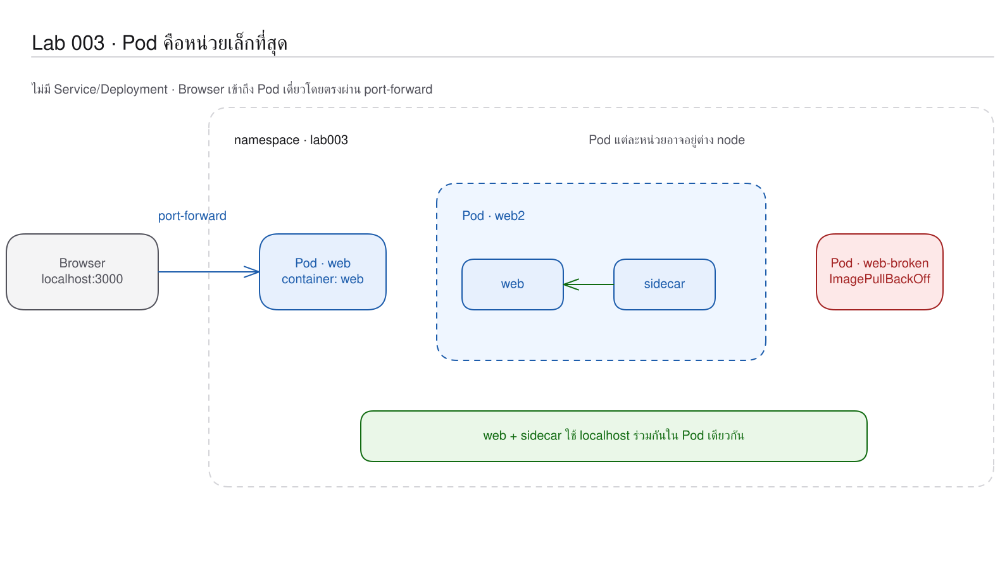
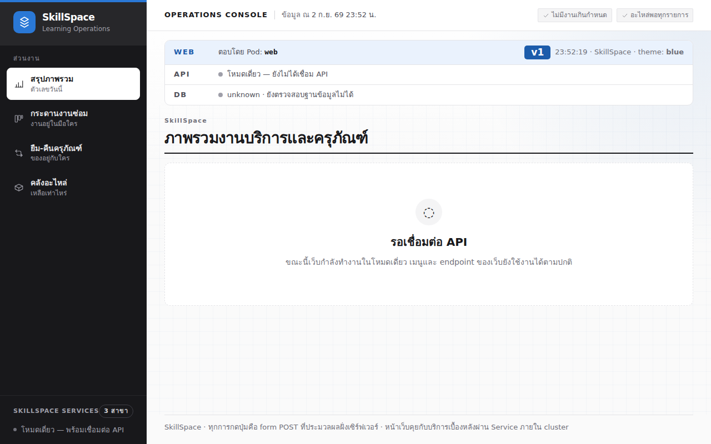

# LAB 3 — Pod ในฐานะหน่วยที่เล็กที่สุด: การเปิด SkillSpace บน Kubernetes
> โฟลเดอร์ `003-pod-the-smallest-unit` = LAB 3 ของชุด Kubernetes ครั้งที่ 1
> (ไฟล์ของปฏิบัติการนี้: `README.md`, `02-pod-with-sidecar.yaml`, `images/03-first-page-on-kubernetes.png`)

> 💡 **แนวคิดหลักของปฏิบัติการนี้:** หน่วยที่เล็กที่สุดซึ่ง Kubernetes กำกับดูแลคือ Pod ไม่ใช่ container

## วัตถุประสงค์ของปฏิบัติการ

เมื่อสิ้นสุดปฏิบัติการ ผู้เรียนจะสามารถ:

1. อธิบายได้ว่า Pod ครอบ container หนึ่งรายการหรือหลายรายการได้อย่างไร
2. อธิบายได้ว่า container ใน Pod เดียวกันแชร์ network namespace และวงจรชีวิตร่วมกันอย่างไร
3. อ่านลำดับ Scheduled → Pulled → Created → Started จาก Events ได้

## แนวคิดและทฤษฎีที่เกี่ยวข้อง

ใน Docker ผู้ใช้เรียกใช้งาน container โดยตรง ส่วน Kubernetes schedule Pod ซึ่งเป็นขอบเขตที่บรรจุ container อย่างน้อยหนึ่งรายการ

| เรื่อง | Container | Pod |
|---|---|---|
| สิ่งที่เป็น | process ที่แยกด้วย namespace/cgroup | หน่วยที่ Kubernetes schedule |
| จำนวน | หนึ่ง process หลักต่อ container | มี container ตั้งแต่หนึ่งรายการขึ้นไป |
| Network | มี namespace ของตนตาม runtime | container ใน Pod แชร์ IP/port/loopback |
| Lifecycle | runtime เริ่ม/หยุด process | Kubernetes สร้าง/ลบ container ทั้งกลุ่ม |

การใช้หลาย container เหมาะสำหรับกรณีที่ส่วนสนับสนุนต้องทำงานร่วมกับแอปหลักอย่างใกล้ชิด; web, API และ database ไม่ควรอยู่ใน Pod เดียวกัน เนื่องจากต้อง scale และเปลี่ยนแปลงแยกจากกัน

Pod ในปฏิบัติการนี้ยังไม่มี controller ที่รักษาจำนวนในสภาพที่ต้องการ (desired state) ดังนั้นเมื่อลบแล้วจะไม่มี Pod ทดแทน
ผลดังกล่าวจะใช้เป็นฐานสำหรับเปรียบเทียบกับ ReplicaSet ใน LAB 006

## ผลการเรียนรู้ที่คาดหวัง

- สร้าง Pod ของ web v1 แบบ imperative ได้
- สังเกตสถานะ Pending, ContainerCreating และ Running จากระบบจริงได้
- วิเคราะห์ startup log ของ Next.js ได้
- เข้าสู่ container เพื่อตรวจสอบ process และ endpoint ได้
- พิสูจน์การใช้ network ร่วมกันด้วย sidecar ได้
- กำหนด tag ที่ไม่ถูกต้องและวิเคราะห์ ErrImagePull/ImagePullBackOff ได้

## ภาพรวมของปฏิบัติการ

1. สร้าง namespace และ Pod `web`
2. ตรวจสอบสถานะ Events และ logs
3. exec เข้าสู่ container และเรียก endpoint ภายใน
4. ใช้ port-forward และตรวจสอบหน้าเว็บจริง
5. apply Pod `web2` ที่มีสอง container
6. ลบ Pod เดี่ยวเพื่อยืนยันว่าไม่มี Pod ทดแทน


> **คำถามนำก่อนเริ่มปฏิบัติการ:** หาก web และส่วนตรวจสุขภาพต้องสื่อสารผ่าน loopback และย้าย node พร้อมกัน ควรกำหนดให้ Kubernetes กำกับดูแลเป็นหน่วยชนิดใด

## 0. การเตรียมสภาพแวดล้อมสำหรับปฏิบัติการ

ให้เรียกใช้คำสั่งแรกจากเครื่องหลัก จากนั้นเข้าสู่เครื่องเรียนและป้อนคำสั่งทั้งหมดหลังจากนั้นใน shell ที่เปิดอยู่:
```bash
docker start devtools-k8s || docker run -d --name devtools-k8s --privileged --shm-size=1g --ulimit nofile=65536:65536 -p 2299:22 -p 8080:80 -p 8443:443 -p 3000:3000 -p 9090:9090 tuchsanai/devtools-k8s:2569_1
docker exec -it devtools-k8s bash
k8s-bootstrap
kubectl get nodes
docker exec devtools-control-plane crictl images | grep k8s-lab
```
> 📝 **คำอธิบาย:** `docker start` ใช้เครื่องเดิมหรือสร้างเครื่องใหม่ · `docker exec -it ... bash` เข้าสู่เครื่องเรียน · `k8s-bootstrap` ข้ามขั้นตอนการสร้างเมื่อมี cluster แล้ว · `get nodes` ตรวจสอบ cluster · `crictl images` ตรวจสอบ image จาก node

✅ ผลลัพธ์ที่คาดหวัง (Expected output) — node ทั้งสาม `Ready` และมี web v1/v2, api v1, db v1:
```text
Set kubectl context to "kind-devtools"
NAME                     STATUS   ROLES           AGE     VERSION
…
docker.io/library/k8s-lab-api   v1   c01adaec89c6d   186MB
docker.io/library/k8s-lab-db    v1   a5a8c986a5421   300MB
docker.io/library/k8s-lab-web   v1   34d144d726eda   209MB
docker.io/library/k8s-lab-web   v2   0bdb9ed2beecf   209MB
```
ตัวอย่างละเว้นแถวของ node ทั้งสามเพื่อไม่กำหนดค่า AGE แบบคงที่; ผลจริงต้องแสดงทุกแถวเป็น `Ready` ส่วน image ID/ขนาดอาจแตกต่างกันได้ หาก image ไม่ครบให้ดำเนินขั้น build/load ของ LAB 001 ก่อน

ในเทอร์มินัลของเครื่องเรียนให้ใช้ `localhost` พอร์ต 80 เมื่อเรียก Ingress ส่วนเบราว์เซอร์บนเครื่องของผู้เรียนให้ใช้ `http://localhost:8080`; ปฏิบัติการนี้เปิดหน้า port-forward ที่ `http://localhost:3000`

## 1. การดึงโค้ดของปฏิบัติการ (Clone)
```bash
mkdir -p ~/labwork && cd ~/labwork && git clone https://github.com/Tuchsanai/DevTools.git
cd ~/labwork/DevTools/05_kubernetes/01_Session1_Kubernetes_Basics/003-pod-the-smallest-unit
pwd
```
> 📝 **คำอธิบาย:** `mkdir -p` เตรียม workspace · `&&` ดำเนินการต่อเมื่อสำเร็จ · `git clone` ดึง repository · `cd` เข้าสู่ LAB 003 · `pwd` ยืนยัน path

✅ ผลลัพธ์ที่คาดหวัง (Expected output) — clone สำเร็จและอยู่ในโฟลเดอร์ที่มี manifest:
```text
Cloning into 'DevTools'...
/root/labwork/DevTools/05_kubernetes/01_Session1_Kubernetes_Basics/003-pod-the-smallest-unit
```
หากดำเนินการ clone แล้ว ให้ใช้ `cd ~/labwork/DevTools && git pull` แล้วกลับเข้าโฟลเดอร์นี้

## 2. การอ่าน YAML ของปฏิบัติการนี้

| ไฟล์ | kind | การดำเนินการในปฏิบัติการนี้ | แหล่งคำอธิบายโดยละเอียด |
|---|---|---|---|
| `02-pod-with-sidecar.yaml` | Pod | เรียกใช้งาน web กับ sidecar ใน Pod เดียวเพื่อพิสูจน์การใช้ network ร่วมกัน | [ศึกษา YAML_Guide.md → Pod](../YAML_Guide.md#pod) |

ส่วนที่ทำให้ปฏิบัติการนี้แตกต่างจาก Pod เดี่ยวคัดจาก `02-pod-with-sidecar.yaml`:

```yaml
spec:
  containers:                         # list: Pod นี้มีสมาชิก 2 container
    - name: web                       # ชื่อใช้อ้างตอน logs/exec
      image: k8s-lab-web:v1           # image ของแอปหลัก
      imagePullPolicy: IfNotPresent   # ใช้ image ใน node ถ้ามี
      ports:
        - containerPort: 3000         # แอปฟัง port นี้; ยังไม่ใช่การเปิดออกนอก Pod
    - name: sidecar                   # container ตัวที่สอง
      image: busybox:1.36.1
      imagePullPolicy: IfNotPresent
      command: ["sh", "-c"]          # แทน ENTRYPOINT ของ image
      args:                           # argument ของ command ข้างบน
        - while true; do
            wget -qO- http://127.0.0.1:3000/healthz;
            echo;
            sleep 10;
          done
```

| field | ความหมาย | ผลเมื่อเปลี่ยนค่า |
|---|---|---|
| `containers[]` | รายการ container ที่อยู่ใน Pod/node เดียวกันและใช้ IP ร่วมกัน | การเพิ่มสมาชิกเป็นการเพิ่ม process โดยไม่เพิ่ม Pod IP |
| `name` / `image` | ตัวตนใน Pod / สิ่งที่จะเรียกใช้งาน | ชื่อต้องไม่ซ้ำ; tag image ที่ไม่ถูกต้องจะไม่สามารถดึงได้ |
| `imagePullPolicy` | `IfNotPresent` ใช้ cache ก่อน | `Always` ตรวจ registry ทุกครั้ง; `Never` จะทำงานไม่สำเร็จหาก node ไม่มี image |
| `containerPort` | ข้อมูลที่ระบุว่า process รอรับการเชื่อมต่อที่ port 3000 | ไม่ได้สร้าง Service หรือ publish port โดยอัตโนมัติ |
| `command` / `args` | แทน ENTRYPOINT / ส่ง argument แทน CMD | process หลักและพฤติกรรม sidecar เปลี่ยน |

`env`, `envFrom`, ค่า default ของ `restartPolicy: Always` และข้อจำกัด immutable สรุปไว้ใน [YAML_Guide.md → Pod](../YAML_Guide.md#pod) เพราะไฟล์นี้ไม่ได้เขียน field เหล่านั้น

**ข้อผิดพลาดที่พบบ่อยในปฏิบัติการนี้:** runlog มีข้อความจริง `Error: ImagePullBackOff` เมื่อใช้ `k8s-lab-web:v9`; กรณีนี้ไม่ใช่ปัญหาการเยื้อง แต่เป็นค่าของ `image` ที่ไม่สามารถค้นหาได้ ให้ตรวจสอบเหตุผลฉบับเต็มด้วย `kubectl describe pod web-broken -n lab003` ก่อนแก้ไข tag

ตรวจสอบ schema ด้วย `kubectl explain pod.spec.containers` และ `kubectl explain pod.spec.containers.command`

## 3. การสร้าง Pod แรกแบบ imperative
```bash
kubectl config set-context --current --namespace=default
kubectl create namespace lab003
kubectl run web --image=k8s-lab-web:v1 --port=3000 -n lab003
kubectl get pods -n lab003 -w
```
> 📝 **คำอธิบาย:** กำหนด context กลับเป็น default เพื่อป้องกันผลจากปฏิบัติการก่อน · `create namespace` สร้าง namespace · `run web` สร้าง Pod ชื่อ web · `--image` เลือก image ที่ load แล้ว · `--port=3000` บันทึก port ของ container · `-n lab003` ระบุ namespace · `-w` เฝ้าสังเกตการเปลี่ยนสถานะและหยุดด้วย `Ctrl+C`

✅ ผลลัพธ์ที่คาดหวัง (Expected output) — เห็นวงจรจาก Pending ผ่าน ContainerCreating ไป Running:
```text
namespace/lab003 created
pod/web created
NAME   READY   STATUS              RESTARTS   AGE
web    0/1     Pending             0          0s
web    0/1     ContainerCreating   0          0s
web    1/1     Running             0          1s
```
AGE และระยะเวลาระหว่างสถานะต่างกันได้

## 4. การระบุตำแหน่งและลำดับการเริ่มทำงานของ Pod
```bash
kubectl get pods -n lab003 -o wide
kubectl describe pod web -n lab003 | sed -n '/Events:/,$p'
kubectl logs web -n lab003
```
> 📝 **คำอธิบาย:** `-o wide` เพิ่ม Pod IP และ node · `describe` แสดง Events · `sed` เลือกช่วง Events จนถึงส่วนท้าย · `logs` อ่าน stdout/stderr ของ container รายการเดียวใน Pod

✅ ผลลัพธ์ที่คาดหวัง (Expected output) — web อยู่บน worker, Events ครบสี่ขั้น และ Next.js พร้อมที่ port 3000:
```text
NAME   READY   STATUS    IP           NODE
web    1/1     Running   10.244.1.4   devtools-worker
Normal  Scheduled  Successfully assigned lab003/web to devtools-worker
Normal  Pulled     Container image "k8s-lab-web:v1" already present on machine
Normal  Created    Container created
Normal  Started    Container started
▲ Next.js 16.3.1
- Network:       http://0.0.0.0:3000
✓ Ready in 0ms
```
IP, NODE, AGE และเวลา startup ต่างกันได้ คำว่า `already present` พิสูจน์ผลของ `kind load`

## 5. การตรวจสอบภายใน container

เริ่มจากชื่อ host ของ kernel แล้วเปิด shell:
```bash
kubectl exec -n lab003 web -- hostname
kubectl exec -it -n lab003 web -- sh
ps
env | grep HOSTNAME
wget -qO- localhost:3000/info
exit
```
> 📝 **คำอธิบาย:** `exec` เรียกใช้คำสั่งใน container · `-it` เปิด shell · `--` คั่น option ของ kubectl จากคำสั่งใน container · `ps` ตรวจสอบ process · `env` อ่านตัวแปร · `wget -qO-` แสดง response · `localhost` ใช้ทดสอบ loopback

✅ ผลลัพธ์ที่คาดหวัง (Expected output) — `hostname` ของ kernel คือ `web` และ Next.js เป็น PID 1 ส่วนตัวแปร `HOSTNAME=0.0.0.0` เป็นค่าที่ image ใช้กำหนดให้แอปรอรับการเชื่อมต่อบนทุก IPv4 interface; ในสภาพแวดล้อมนี้ `localhost` resolve ไปยัง IPv6 loopback แต่แอปรอรับบน IPv4 จึงเชื่อมต่อไม่ได้:
```text
web
PID   USER     TIME  COMMAND
    1 webapp    0:00 next-server (v
HOSTNAME=0.0.0.0
wget: can't connect to remote host: Connection refused
command terminated with exit code 1
```
ผลนี้แสดงว่า `hostname` กับตัวแปร `HOSTNAME` อาจสื่อความหมายแตกต่างกัน และ `localhost` ไม่ได้กำหนดให้เป็น IPv4 เสมอ จึงให้ระบุ IPv4 loopback ที่ process รอรับการเชื่อมต่ออยู่โดยตรง:
```bash
kubectl exec -n lab003 web -- wget -qO- http://127.0.0.1:3000/info
```
> 📝 **คำอธิบาย:** ระบุ `127.0.0.1` เพื่อบังคับ IPv4 loopback · endpoint `/info` คืน identity/runtime state ของ web · ชื่อ Pod มาจาก `os.hostname()` จึงยังเป็น `web`

✅ ผลลัพธ์ที่คาดหวัง (Expected output) — endpoint ตอบ JSON ของ Pod เดิม:
```json
{"pod":"web","version":"v1","theme":"blue","site_name":"SkillSpace","time":"23:51:58","api":{"configured":false,"reachable":false},"db":{"status":"unknown"}}
```
เวลาต่างกันได้

## 6. การเปิดหน้าเว็บจริงผ่าน port-forward

เปิดหน้าต่างใหม่บนเครื่องหลักแล้วเรียกใช้ `docker exec -it devtools-k8s bash` อีกครั้ง จากนั้นเรียกใช้คำสั่งต่อไปนี้ในหน้าต่างใหม่และคงหน้าต่างไว้:
```bash
kubectl port-forward pod/web 3000:3000 -n lab003 --address 0.0.0.0
```
> 📝 **คำอธิบาย:** `port-forward pod/web` กำหนดเส้นทางไปยัง Pod หนึ่งรายการ · `3000:3000` map port เครื่องเรียนไปยัง container · `-n` เลือก namespace · `--address 0.0.0.0` ทำให้ browser ภายนอกเครื่องเรียนเข้าถึงได้ · คงหน้าต่างใหม่นี้ไว้ระหว่างการทดสอบ

✅ ผลลัพธ์ที่คาดหวัง (Expected output) — forward พร้อมรับ connection:
```text
Forwarding from 0.0.0.0:3000 -> 3000
Handling connection for 3000
```
เปิด `http://localhost:3000` แล้วตรวจการ์ดบนสุด ต้องเห็น `ตอบโดย Pod: web`, ป้าย `v1`, API เป็นโหมดเดี่ยว และ DB เป็น unknown



ภาพนี้บันทึกจากระบบจริงในขั้นตอนนี้ ไม่ใช่ภาพจำลอง

## 7. การกำหนด container สองรายการภายในหนึ่ง Pod

พิจารณา manifest `02-pod-with-sidecar.yaml` โดยสรุปก่อน apply:
```yaml
apiVersion: v1
kind: Pod
metadata:
  name: web2
  namespace: lab003
  labels:
    app: web
spec:
  containers:
    - name: web
      image: k8s-lab-web:v1
      imagePullPolicy: IfNotPresent
      ports:
        - containerPort: 3000
    - name: sidecar
      image: busybox:1.36.1
      imagePullPolicy: IfNotPresent
      command: ["sh", "-c"]
      args:
        - while true; do
            wget -qO- http://127.0.0.1:3000/healthz;
            echo;
            sleep 10;
          done
```
> 📝 **คำอธิบาย:** `apiVersion/kind` เลือกชนิด API · `metadata` กำหนดชื่อ/namespace/label · `spec.containers` มีสมาชิกสองรายการ · `command` เปิด shell · `args` เป็น loop เรียก health ทุก 10 วินาที · `imagePullPolicy` ใช้ image ที่ node มี · sidecar ใช้ IPv4 loopback เนื่องจาก `localhost` ใน web image รอบนี้ไม่สามารถเชื่อมต่อได้

ดำเนินการ apply แล้วตรวจสอบทั้งจำนวน container และ log ของ sidecar:
```bash
kubectl apply -f 02-pod-with-sidecar.yaml
kubectl wait -n lab003 --for=condition=Ready pod/web2 --timeout=120s
kubectl get pod web2 -n lab003 -o jsonpath='{.spec.containers[*].name}{"\n"}'
kubectl logs web2 -n lab003 -c sidecar --tail=5
```
> 📝 **คำอธิบาย:** `apply -f` ส่ง desired object จากไฟล์ · `wait` รอ Pod Ready · `--timeout` จำกัดระยะเวลารอ · JSONPath เลือกชื่อ container · `logs web2` ต้องเพิ่ม `-c sidecar` เนื่องจาก Pod มีหลาย container · `--tail=5` จำกัดผลลัพธ์

✅ ผลลัพธ์ที่คาดหวัง (Expected output) — Pod พร้อมและ sidecar ได้ health response จาก web ผ่าน loopback ร่วม:
```text
pod/web2 created
pod/web2 condition met
web sidecar
{"status":"ok","pod":"web2","version":"v1"}
```
หาก sidecar ต้องสื่อสารข้าม Pod จะไม่สามารถใช้ `127.0.0.1` ได้ หลักฐานนี้จึงยืนยันว่า container ใช้ network namespace ร่วมกัน

## 8. การลบ Pod เดี่ยวและการตรวจสอบผล

หยุด port-forward ด้วย `Ctrl+C` แล้วลบ `web`:
```bash
kubectl delete pod web -n lab003
kubectl get pods -n lab003
```
> 📝 **คำอธิบาย:** `delete pod` ลบ object ที่ไม่มี controller เจ้าของ · `get pods` ตรวจสอบสภาพจริง (actual state) · `web2` ยังคงอยู่เนื่องจากเป็น object คนละรายการ

✅ ผลลัพธ์ที่คาดหวัง (Expected output) — ไม่ปรากฏ `web` และไม่มี `web-...` รายการใหม่เกิดขึ้นทดแทน:
```text
pod "web" deleted from lab003 namespace
NAME   READY   STATUS    RESTARTS   AGE
web2   2/2     Running   0          33s
```
AGE อาจแตกต่างกัน ให้ใช้ผลนี้เปรียบเทียบกับปฏิบัติการ 006

## 9. การทดลองจำลองความล้มเหลว — การใช้ image tag ที่ไม่มีอยู่จริง
```bash
kubectl run web-broken --image=k8s-lab-web:v9 -n lab003
sleep 25
kubectl get pod web-broken -n lab003
kubectl describe pod web-broken -n lab003 | sed -n '/Events:/,$p'
```
> 📝 **คำอธิบาย:** สร้าง Pod ด้วย tag `v9` ที่ไม่ได้ build/load · `sleep 25` รอให้ kubelet pull ซ้ำจนปรากฏ backoff · `get` แสดงสถานะ · `describe` แสดงสาเหตุจาก Events

✅ ผลลัพธ์ที่คาดหวัง (Expected output) — ปรากฏทั้ง ErrImagePull และการ back off หลังจากพยายามซ้ำ:
```text
pod/web-broken created
web-broken   0/1   ImagePullBackOff   0   21s
Warning  Failed   Failed to pull image "k8s-lab-web:v9": failed to pull and unpack image "docker.io/library/k8s-lab-web:v9": failed to resolve reference "docker.io/library/k8s-lab-web:v9": pull access denied, repository does not exist or may require authorization: server message: insufficient_scope: authorization failed
Warning  Failed   Error: ErrImagePull
Normal   BackOff  Back-off pulling image "k8s-lab-web:v9"
Warning  Failed   Error: ImagePullBackOff
```
AGE และจำนวน retry ต่างกันได้ สาเหตุอยู่ชั้น image ไม่ใช่โค้ด Next.js เพราะ container ยังเริ่มไม่ได้

คืนสภาพด้วยการลบ object ที่สร้างให้ทำงานผิดพลาดโดยเจตนา:
```bash
kubectl delete pod web-broken -n lab003
kubectl get pods -n lab003
```
> 📝 **คำอธิบาย:** `delete` หยุดการ retry ของ kubelet · `get` ยืนยันว่าเหลือเฉพาะ Pod ที่ทำงานตามปกติ · แนวทางอื่นในระบบจริงคือแก้ tag หรือโหลด image ผ่าน controller แต่ Pod ที่ไม่มี controller ควบคุมไม่รองรับการแก้ไข spec ส่วนใหญ่

✅ ผลลัพธ์ที่คาดหวัง (Expected output) — ไม่ปรากฏ broken Pod และ web2 ยังคงทำงานตามปกติ:
```text
pod "web-broken" deleted from lab003 namespace
NAME   READY   STATUS    RESTARTS   AGE
web2   2/2     Running   0          92s
```

## 10. แบบฝึกหัด (Exercise)

วาดแผนภาพ Pod เป็นกรอบที่บรรจุ web และ sidecar แล้วระบุทรัพยากรที่ใช้ร่วมกัน
จากนั้นอธิบายเหตุผลที่ไม่ควรกำหนด database ไว้ใน Pod เดียวกับ web เพียงเพราะสามารถสื่อสารผ่าน localhost ได้

ถือว่าสำเร็จเมื่อระบุ shared network/IP/lifecycle ได้ และอธิบายได้ว่า web กับ DB ต้องปรับขนาด อัปเดต และล้มเหลวอย่างเป็นอิสระจากกัน

## วิธีตรวจสอบผลการทดลอง
```bash
kubectl get pods -n lab003
kubectl logs web2 -n lab003 -c sidecar --tail=1
kubectl get events -n lab003 --sort-by=.lastTimestamp | tail -12
```
> 📝 **คำอธิบาย:** `get` ตรวจสอบ READY `2/2` · `logs -c` ยืนยันการสื่อสารข้าม container · `events` เรียงหลักฐานตามเวลาและบันทึกทั้งผลสำเร็จและความล้มเหลวจากการทดลองล่าสุด

✅ ผลลัพธ์ที่คาดหวัง (Expected output) — web2 พร้อม, endpoint health ตอบกลับด้วยสถานะ ok และ Events มี Started ของสอง container:
```text
web2   2/2   Running   0   92s
{"status":"ok","pod":"web2","version":"v1"}
90s   Normal    Pulling   pod/web2         Pulling image "busybox:1.36.1"
90s   Normal    Started   pod/web2         Container started
84s   Normal    Started   pod/web2         Container started
84s   Normal    Created   pod/web2         Container created
84s   Normal    Pulled    pod/web2         Successfully pulled image "busybox:1.36.1" in 5.351s (5.351s including waiting). Image size: 2217006 bytes.
59s   Normal    Killing   pod/web          Stopping container web
33s   Normal    Scheduled pod/web-broken   Successfully assigned lab003/web-broken to devtools-worker
19s   Normal    Pulling   pod/web-broken   Pulling image "k8s-lab-web:v9"
17s   Warning   Failed    pod/web-broken   Failed to pull image "k8s-lab-web:v9": failed to pull and unpack image "docker.io/library/k8s-lab-web:v9": failed to resolve reference "docker.io/library/k8s-lab-web:v9": pull access denied, repository does not exist or may require authorization: server message: insufficient_scope: authorization failed
17s   Warning   Failed    pod/web-broken   Error: ErrImagePull
3s    Warning   Failed    pod/web-broken   Error: ImagePullBackOff
3s    Normal    BackOff   pod/web-broken   Back-off pulling image "k8s-lab-web:v9"
```
ชื่อ Pod, AGE และลำดับ Events ต่างกันได้ บรรทัด Warning ยืนยันว่าปัญหาอยู่ที่ image/tag ไม่ใช่ process ในแอป

## ปัญหาที่พบบ่อยและแนวทางแก้ไข

| อาการ | สาเหตุที่พบบ่อย | แนวทางแก้ไข |
|---|---|---|
| `ImagePullBackOff` | กำหนด tag ไม่ถูกต้องหรือยังไม่ได้ `kind load` | ตรวจสอบด้วย describe แล้วสร้างหรือโหลด tag ที่ถูกต้อง |
| `logs` แสดงข้อความให้ระบุ container | Pod มีหลาย container | เติม `-c web` หรือ `-c sidecar` |
| `localhost` ได้ connection refused | `localhost` resolve เป็น IPv6 แต่แอปฟัง IPv4 | ระบุ `127.0.0.1` เพื่อใช้ IPv4 loopback |
| browser เข้าถึง port 3000 ไม่ได้ | port-forward สิ้นสุดหรือ bind เฉพาะ loopback ใน container | เรียกใช้งานใหม่พร้อม `--address 0.0.0.0` |
| ลบ Pod แล้วไม่กลับมา | Pod ที่ไม่มี controller ควบคุมไม่มีกลไกรักษาจำนวนที่ต้องการ | เป็นพฤติกรรมที่ถูกต้อง; ใช้ controller ในปฏิบัติการ 006 |

## การล้างทรัพยากร (Cleanup) และการพิสูจน์การทำซ้ำจากสถานะเริ่มต้น (Clean Re-run)

ลบ namespace `lab003` เดิม สร้างใหม่จาก manifest ตรวจสอบผล และลบ namespace เมื่อสิ้นสุด:
```bash
kubectl delete namespace lab003 --wait=true --timeout=90s
kubectl create namespace lab003
kubectl apply -f 02-pod-with-sidecar.yaml
kubectl wait -n lab003 --for=condition=Ready pod/web2 --timeout=120s
kubectl get pods -n lab003
kubectl logs web2 -n lab003 -c sidecar --tail=1
kubectl delete namespace lab003 --wait=true --timeout=90s
kubectl get all -n lab003
```
> 📝 **คำอธิบาย:** การลบ namespace ครอบคลุมทุก object ในขอบเขตดังกล่าว · `--wait` รอ cleanup · `create` เตรียม namespace ใหม่เนื่องจาก manifest ระบุ namespace · `apply -f` สร้าง Pod จากไฟล์ · `wait/get/logs` พิสูจน์ผลเดิม · ลบครั้งสุดท้ายและใช้ `get all` ป้องกันทรัพยากรค้าง

✅ ผลลัพธ์ที่คาดหวัง (Expected output) — การทำซ้ำจากสถานะเริ่มต้นแสดง `2/2 Running`, sidecar ตอบกลับด้วยสถานะ ok และไม่เหลือ namespace หลังการลบ:
```text
namespace "lab003" deleted
namespace/lab003 created
pod/web2 created
pod/web2 condition met
web2   2/2   Running   0   14s
{"status":"ok","pod":"web2","version":"v1"}
namespace "lab003" deleted
No resources found in lab003 namespace.
```
AGE อาจแตกต่างกันได้ และต้องไม่มี process `kubectl port-forward` ค้างก่อนดำเนินปฏิบัติการถัดไป

## สรุปคำสั่งของปฏิบัติการนี้

| คำสั่ง | ความหมาย |
|---|---|
| `kubectl run` | สร้าง Pod แบบ imperative |
| `kubectl get pods -w` | เฝ้าการเปลี่ยนสถานะ |
| `kubectl logs POD [-c NAME]` | อ่าน log ของ container |
| `kubectl exec POD -- CMD` | เรียกใช้คำสั่งใน container |
| `kubectl port-forward` | เปิดทางชั่วคราวไป Pod/Service |
| `kubectl apply -f FILE` | สร้าง/ปรับ object จากสภาพที่ต้องการในไฟล์ |

## สรุปสิ่งที่ได้เรียนรู้

Pod เป็นขอบเขตที่ Kubernetes ใช้ schedule และดูแล lifecycle ไม่ใช่เพียงชื่อใหม่ของ container
web กับ sidecar ใน `web2` พิสูจน์ด้วย response จริงว่าแชร์ loopback และถูกนับ Ready รวมกันเป็น `2/2`

- อธิบาย Pod เทียบกับ container ได้
- อ่าน Events และ logs เพื่อติดตามลำดับการเริ่มทำงานได้
- เปิดหน้าเว็บจริงและเห็น identity ของ Pod ได้
- แยกอาการระดับ image ออกจากอาการระดับแอปได้

**ภาพรวมที่ควรจดจำ:** Pod เป็นขอบเขตที่ Kubernetes เคลื่อนย้ายเป็นหนึ่งหน่วย โดย container ภายในใช้ที่อยู่และวงจรชีวิตร่วมกัน

🧭 การเชื่อมโยงสู่ปฏิบัติการถัดไป: [LAB 004 — Declarative YAML](../004-declarative-yaml/README.md) เปลี่ยนจากคำสั่ง imperative ไปสู่การประกาศสภาพที่ต้องการด้วยไฟล์

## ❓ คำถามทบทวนก่อนจบปฏิบัติการ

1. **Pod แตกต่างจาก container อย่างไร?** — Pod เป็นหน่วย schedule ที่ครอบ container และกำหนด network/volume/lifecycle ร่วมกัน
2. **เหตุใดหน่วยที่เล็กที่สุดจึงเป็น Pod?** — แอปกับส่วนสนับสนุนที่ต้องอยู่บนเครื่อง/IP เดียวกันสามารถจัดกลุ่มและเคลื่อนย้ายพร้อมกันได้
3. **เหตุใดการลบ Pod จึงไม่มี Pod ใหม่?** — Pod ที่ไม่มี controller ควบคุมไม่มีกลไกรักษาจำนวนที่ต้องการ

## ✅ รายการตรวจสอบก่อนจบปฏิบัติการ

- [ ] เห็น web เปลี่ยนจาก ContainerCreating เป็น Running
- [ ] เห็น web2 เป็น `2/2 Running`
- [ ] sidecar ได้ health JSON ผ่าน shared loopback
- [ ] เห็น ErrImagePull และ ImagePullBackOff จริง
- [ ] อธิบายเหตุผลที่การลบ Pod แล้วไม่เกิด Pod ใหม่ได้
- [ ] ลบ namespace และ port-forward จนไม่เหลือ

*ผลลัพธ์ที่คาดหวัง (expected output) และภาพหน้าจอในเอกสารนี้ได้มาจากการดำเนินการจริงบน tuchsanai/devtools-k8s:2569_1 (kind v0.33.0 · Kubernetes v1.36.4 · kubectl v1.37.0) เมื่อ 2 กันยายน 2026*
