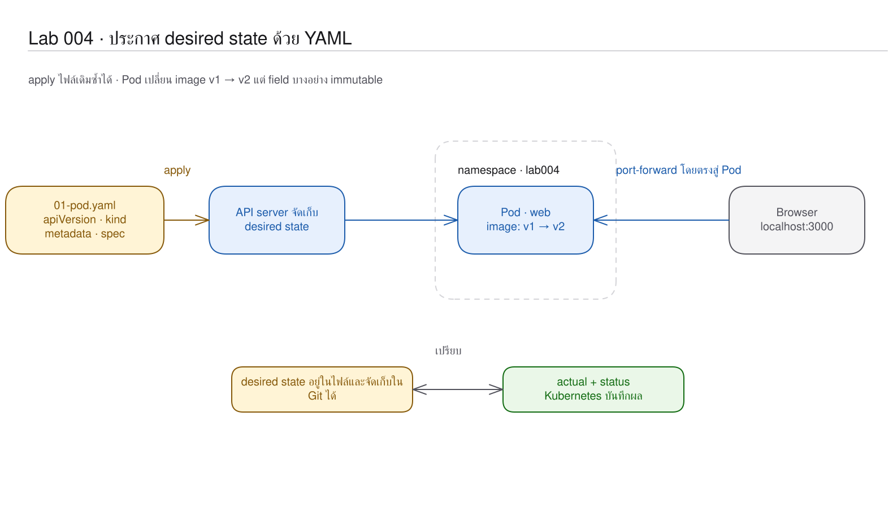
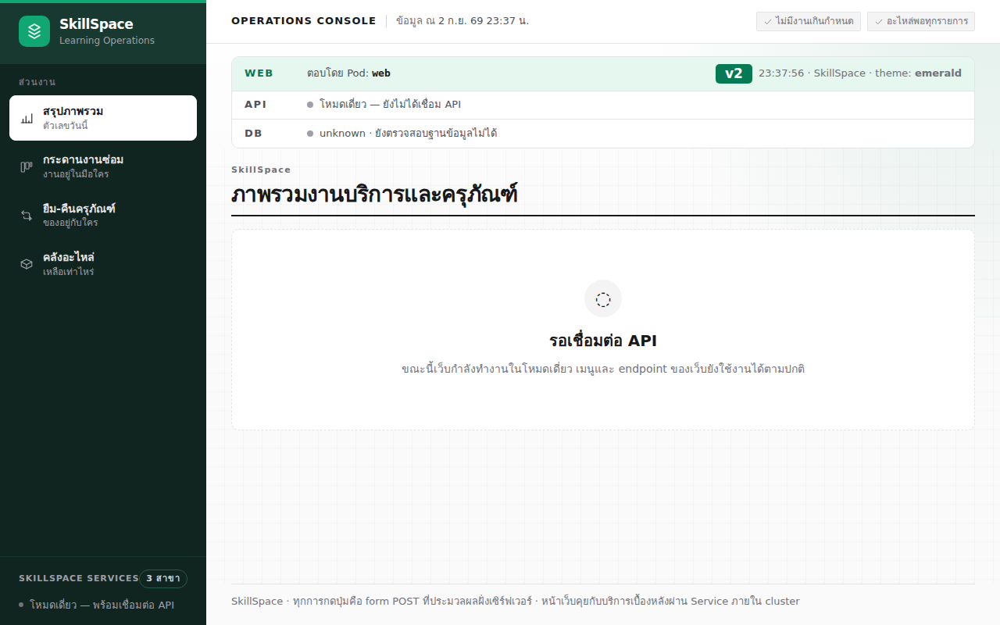

# LAB 4 — Declarative YAML: การกำหนดสภาพที่ต้องการให้ Kubernetes จัดการ

> โฟลเดอร์ `004-declarative-yaml` = LAB 4 ของชุด Kubernetes ครั้งที่ 1
> (ไฟล์ของปฏิบัติการนี้: `01-pod.yaml` · `02-pod-v2.yaml` · `03-pod-typo.yaml` · `images/05-pod-v2-after-apply.png`)

> 💡 **แนวคิดหลักของปฏิบัติการนี้:** ผู้ใช้กำหนดสภาพที่ต้องการแทนการระบุขั้นตอนดำเนินงาน แล้ว Kubernetes จัดการให้สอดคล้องกับข้อกำหนดดังกล่าว (declarative)

> ชื่อ Pod, IP, UID, AGE, เวลา และ node ที่ scheduler เลือกเป็นค่าที่ไม่คงที่ — **ค่าเหล่านี้ต่างกันได้**

## วัตถุประสงค์ของปฏิบัติการ

เมื่อสิ้นสุดปฏิบัติการ ผู้เรียนจะสามารถ:

1. อธิบายความแตกต่างระหว่าง imperative กับ declarative ได้
2. อ่านหน้าที่ของ `apiVersion`, `kind`, `metadata` และ `spec` ได้
3. อธิบายเหตุผลที่ `kubectl apply` ซ้ำแล้วให้ผลเหมือนเดิมได้
4. อธิบายเหตุผลที่ Pod บาง field ไม่สามารถแก้ไขโดยตรงได้

## แนวคิดและทฤษฎีที่เกี่ยวข้อง

ในปฏิบัติการก่อนใช้ `kubectl run` ซึ่งคล้าย `docker run`; ส่วนไฟล์ YAML ทำหน้าที่คล้าย `compose.yaml` โดยบันทึกสภาพที่ต้องการ แล้วส่งให้ API server เปรียบเทียบกับ object จริง

| วิธี | สิ่งที่ผู้ใช้กำหนด | ผลเมื่อดำเนินการซ้ำ |
|---|---|---|
| imperative | ขั้นตอน เช่น run, delete | อาจเกิด error เนื่องจาก object เดิมมีอยู่แล้ว |
| declarative | สภาพปลายทางใน YAML | `created`, `configured` หรือ `unchanged` |

ทุก object มีโครงสร้างหลักร่วมกัน: `apiVersion` เลือก API · `kind` ระบุชนิด · `metadata` ระบุตัวตนและ label · `spec` ระบุสภาพที่ต้องการ (desired state) ส่วน `status` เป็นหลักฐานสภาพจริง (actual state) ที่ Kubernetes เพิ่มกลับมา

## ผลการเรียนรู้ที่คาดหวัง

- สังเกตการสร้าง YAML จากคำสั่ง imperative โดย kubectl ได้
- พิสูจน์ได้ว่าการ apply ไฟล์เดิมซ้ำให้ผลเป็น `unchanged`
- วิเคราะห์ diff ก่อนเปลี่ยน image จาก v1 เป็น v2 ได้
- ตรวจสอบ error ของ immutable field ได้
- จำแนก syntax/schema error สองชนิดจากข้อความจริงได้

## ภาพรวมของปฏิบัติการ

1. สร้าง Pod v1 จาก YAML
2. apply ซ้ำและเทียบ desired กับ actual
3. ตรวจสอบ diff แล้วเปลี่ยนเป็น v2
4. ทดลองแก้ไข field ที่เป็น immutable
5. ส่ง YAML ผิดให้ server ตรวจ แล้วแก้กลับ



> **คำถามนำก่อนเริ่มปฏิบัติการ:** หาก apply ไฟล์เดิมสองครั้ง Kubernetes จะสร้าง Pod สองรายการ หรือรักษา Pod รายการเดิมไว้

## 0. การเตรียมสภาพแวดล้อมสำหรับปฏิบัติการ

ให้เรียกใช้คำสั่งแรกจากเครื่องหลัก จากนั้นเข้าสู่เครื่องเรียนและป้อนคำสั่งที่เหลือใน shell ที่เปิดอยู่:

```bash
docker start devtools-k8s || docker run -d --name devtools-k8s --privileged --shm-size=1g --ulimit nofile=65536:65536 -p 2299:22 -p 8080:80 -p 8443:443 -p 3000:3000 -p 9090:9090 tuchsanai/devtools-k8s:2569_1
docker exec -it devtools-k8s bash
k8s-bootstrap
kubectl get nodes
docker exec devtools-control-plane crictl images | grep k8s-lab
```
> 📝 **คำอธิบาย:** `docker start` เปิดเครื่องเดิมหรือสร้างเครื่องใหม่ · `docker exec -it ... bash` เข้าสู่เครื่องเรียน · `k8s-bootstrap` ข้ามขั้นตอนการสร้างเมื่อมี cluster อยู่แล้ว · `kubectl get nodes` ตรวจสอบ node จำนวน 3 เครื่อง · `crictl images` อ่าน image ใน kind node

✅ ผลลัพธ์ที่คาดหวัง (Expected output) — node ทั้งสามเครื่องเป็น `Ready` และพบ image web v1/v2, api และ db ครบ (AGE และ image ID อาจแตกต่างกัน):
```text
Set kubectl context to "kind-devtools"
NAME                     STATUS   ROLES           AGE   VERSION
devtools-control-plane   Ready    control-plane   20m   v1.36.4
devtools-worker          Ready    <none>          20m   v1.36.4
devtools-worker2         Ready    <none>          20m   v1.36.4
docker.io/library/k8s-lab-api   v1   f0b9cc03efb0e   186MB
docker.io/library/k8s-lab-db    v1   c6f278c2d20e4   300MB
docker.io/library/k8s-lab-web   v1   47289fcac09e8   209MB
docker.io/library/k8s-lab-web   v2   f2d6e974702f8   209MB
```

หากยังไม่ปรากฏ image ให้กลับไปดำเนินการตามขั้นตอน build/load ของ LAB 001 หรือ README ระดับชุดก่อน
ในเทอร์มินัลของเครื่องเรียนให้ใช้ `localhost` พอร์ต 80 เมื่อเรียก Ingress ส่วนเบราว์เซอร์บนเครื่องของผู้เรียนให้ใช้ `http://localhost:8080`; ปฏิบัติการนี้เปิดหน้า port-forward ที่ `http://localhost:3000`

## 1. การดึงโค้ดของปฏิบัติการ (Clone)

```bash
mkdir -p ~/labwork && cd ~/labwork
git clone https://github.com/Tuchsanai/DevTools.git
cd ~/labwork/DevTools/05_kubernetes/01_Session1_Kubernetes_Basics/004-declarative-yaml
```
> 📝 **คำอธิบาย:** `mkdir -p` สร้าง workspace หากยังไม่มี · `git clone` ดาวน์โหลดชุด LAB · `cd` เข้าสู่โฟลเดอร์ LAB 004

✅ ผลลัพธ์ที่คาดหวัง (Expected output) — clone สำเร็จและคำสั่ง `cd` ไม่รายงานข้อผิดพลาด:
```text
Cloning into 'DevTools'...
```

หาก clone ไว้แล้ว ไม่จำเป็นต้อง clone ซ้ำ ให้เรียกใช้ `cd ~/labwork/DevTools && git pull` แล้วกลับเข้าสู่โฟลเดอร์ปฏิบัติการ; หากมี conflict ให้หยุดดำเนินการและสอบถามผู้สอน

## 2. การอ่าน YAML ของปฏิบัติการนี้

| ไฟล์ | kind | การดำเนินการในปฏิบัติการนี้ | แหล่งคำอธิบายโดยละเอียด |
|---|---|---|---|
| `01-pod.yaml` | Pod | ประกาศ web v1 เป็นสภาพที่ต้องการเริ่มต้น | [ศึกษา YAML_Guide.md → หลักการอ่าน YAML](../YAML_Guide.md#หลักการอ่าน-yaml) |
| `02-pod-v2.yaml` | Pod | เปลี่ยน label และ image เป็น v2 เพื่อตรวจสอบ diff/apply | [ศึกษา YAML_Guide.md → Pod](../YAML_Guide.md#pod) |
| `03-pod-typo.yaml` | `Pods` (กำหนดผิดโดยเจตนา) | พิสูจน์ว่า YAML syntax ถูกต้องแต่ Kubernetes schema ไม่รู้จัก kind | หัวข้อการทดลองจำลองความล้มเหลวด้านล่าง |

โครงสร้างสี่ส่วนจาก `01-pod.yaml` เป็นกรอบสำหรับอ่าน object ทุกชนิด:

```yaml
apiVersion: v1             # API group/version; Pod ใช้ core group v1
kind: Pod                  # ชนิด object
metadata:                  # ตัวตนและข้อมูลประกอบ
  name: web                # ชื่อใน namespace
  labels:                  # key/value สำหรับจัดกลุ่ม
    app: web
    version: v1
spec:                      # desired state ที่เราสั่ง
  containers:              # list จึงใช้ - เปิดสมาชิก
    - name: web
      image: k8s-lab-web:v1
```

| field/รูปแบบ | ความหมาย | ผลเมื่อเปลี่ยนค่า |
|---|---|---|
| `apiVersion` / `kind` | เลือก schema ของ API | ชื่อที่ไม่รองรับจะไม่สามารถจับคู่กับ resource ได้ |
| `metadata.name` / `labels` | ระบุตัว object / จัดกลุ่ม | การเปลี่ยน name หมายถึง object อื่น; label มีผลต่อ selector |
| `spec` / `status` | สิ่งที่ต้องการ / สิ่งที่ระบบรายงาน | manifest ปกติเขียน `spec`; controller เขียน `status` |
| เยื้อง 2 ช่อง / `-` / `#` | nesting / สมาชิก list / comment | เยื้องผิดอาจย้าย field ไปผิด schema |

YAML รองรับ string/number/bool; ค่า environment ที่มีรูปแบบคล้ายตัวเลข เช่น `"5432"` ต้อง quote เนื่องจาก field นั้นรับ string (ตัวอย่างเพิ่มเติมซึ่งไม่อยู่ในไฟล์ของปฏิบัติการ) ส่วน `---` ใช้คั่นหลาย object (จะปรากฏในปฏิบัติการ 005) และ annotations เป็น metadata ที่ selector ไม่ใช้เลือกสมาชิก (ปรากฏใน 007) ศึกษาฉบับเต็มได้ที่ [YAML_Guide.md → หลักการอ่าน YAML](../YAML_Guide.md#หลักการอ่าน-yaml)

**ข้อผิดพลาดที่พบบ่อยในปฏิบัติการนี้:** runlog มีข้อความจริง `strict decoding error: unknown field "containers"` เมื่อวาง field ผิดระดับ และ `no matches for kind "Pods" in version "v1"` จาก `03-pod-typo.yaml`; YAML parser สามารถอ่านได้ แต่ Kubernetes schema ปฏิเสธ

ตรวจสอบ syntax/kind ด้วย `kubectl apply --dry-run=client -f 01-pod.yaml`, ตรวจสอบ schema/admission ด้วย `kubectl apply --dry-run=server -f 01-pod.yaml` และตรวจสอบ field ด้วย `kubectl explain pod.spec.containers.imagePullPolicy`

## 3. การเปลี่ยนจากคำสั่ง imperative สู่ YAML

สร้าง namespace และให้ kubectl แสดง YAML โดยยังไม่สร้าง Pod:

```bash
kubectl create namespace lab004
kubectl run web --image=k8s-lab-web:v1 --port=3000 --dry-run=client -o yaml
```
> 📝 **คำอธิบาย:** `create namespace` สร้าง namespace แยกสำหรับปฏิบัติการ · `run web` ขอสร้าง Pod ชื่อ web · `--image` เลือก image · `--port=3000` บันทึก container port · `--dry-run=client` สร้างผลลัพธ์ภายในเครื่องโดยไม่ส่งไปยัง API · `-o yaml` แสดงข้อมูลเป็น YAML

✅ ผลลัพธ์ที่คาดหวัง (Expected output) — ปรากฏผลการสร้าง namespace และ YAML มีสี่ส่วนหลัก:
```text
namespace/lab004 created
apiVersion: v1
kind: Pod
metadata:
  labels:
    run: web
  name: web
spec:
  containers:
  - image: k8s-lab-web:v1
    name: web
    ports:
    - containerPort: 3000
    resources: {}
  dnsPolicy: ClusterFirst
  restartPolicy: Always
status: {}
```

ผลนี้ประกอบด้วย field ทั้งหมดที่คำสั่งสร้างขึ้น ส่วนไฟล์ `01-pod.yaml` ด้านล่างละเว้น default ที่ไม่จำเป็น

ไฟล์ `01-pod.yaml` เขียนเฉพาะสภาพที่ต้องการ:

```yaml
apiVersion: v1
kind: Pod
metadata:
  name: web
  labels:
    app: web
    version: v1
spec:
  containers:
    - name: web
      image: k8s-lab-web:v1
      imagePullPolicy: IfNotPresent
      ports:
        - containerPort: 3000
```

`metadata.labels` ใช้จัดกลุ่ม · `spec.containers` คือรายการ container · `imagePullPolicy` ใช้ image ที่ load ไว้ก่อน · `containerPort` ระบุพอร์ตของแอป แต่ไม่ได้เปิดพอร์ตออกนอก cluster

## 4. การ apply และการพิสูจน์ idempotency

```bash
kubectl apply -n lab004 -f 01-pod.yaml
kubectl wait -n lab004 --for=condition=Ready pod/web --timeout=120s
kubectl apply -n lab004 -f 01-pod.yaml
kubectl get pod web -n lab004 -o wide
```
> 📝 **คำอธิบาย:** `apply` ส่งสภาพที่ต้องการ · `-n lab004` เลือก namespace · `-f` อ่านไฟล์ · `wait --for=condition=Ready` รอ Pod พร้อม · `--timeout=120s` จำกัดเวลารอ · apply รอบสองพิสูจน์ idempotency · `-o wide` เพิ่ม IP และ NODE

✅ ผลลัพธ์ที่คาดหวัง (Expected output) — รอบแรก `created`, รอบสอง `unchanged`, Pod เดิมยัง `Running` (IP, NODE, AGE ต่างกันได้):
```text
pod/web created
pod/web condition met
pod/web unchanged
NAME   READY   STATUS    RESTARTS   AGE   IP            NODE
web    1/1     Running   0          1s    10.244.1.29   devtools-worker2
```

ตรวจสอบ object ที่ API server บันทึกและ log ของ process:

```bash
kubectl get pod web -n lab004 -o yaml
kubectl logs -n lab004 pod/web --tail=20
```
> 📝 **คำอธิบาย:** `-o yaml` แสดง desired และ status ฉบับเต็ม · `logs` อ่าน stdout/stderr · `--tail=20` จำกัด 20 บรรทัดท้าย

✅ ผลลัพธ์ที่คาดหวัง (Expected output) — YAML มี `uid`, `nodeName`, `status.phase: Running` เพิ่มจากไฟล์ และ log แสดงว่า Next.js พร้อมทำงาน (UID, เวลา และชื่อ volume อาจแตกต่างกัน):
```text
  uid: 2cbc86f7-8fe7-427a-9b75-4654d1c49e17
spec:
  nodeName: devtools-worker2
status:
  phase: Running
▲ Next.js 16.3.1
- Network:       http://0.0.0.0:3000
✓ Ready in 0ms
```

## 5. การตรวจสอบ diff และการเปลี่ยนสภาพที่ต้องการเป็น v2

```bash
kubectl diff -n lab004 -f 02-pod-v2.yaml
kubectl apply -n lab004 -f 02-pod-v2.yaml
kubectl get pod web -n lab004 -o jsonpath='{.metadata.labels.version}{" "}{.spec.containers[0].image}{"\n"}'
```
> 📝 **คำอธิบาย:** `diff` เปรียบเทียบไฟล์กับ object จริงโดยไม่แก้ไข · exit code 1 ของ diff หมายถึง "พบความแตกต่าง" · apply ทำให้สภาพจริงเข้าใกล้สภาพที่ต้องการ · `jsonpath` เลือกเฉพาะ label และ image

✅ ผลลัพธ์ที่คาดหวัง (Expected output) — diff แสดงการเปลี่ยนแปลงจาก v1 เป็น v2 แล้ว apply เป็น `configured`:
```text
-    version: v1
+    version: v2
-  - image: k8s-lab-web:v1
+  - image: k8s-lab-web:v2
pod/web configured
v2 k8s-lab-web:v2
```

เปิดหน้าต่างใหม่บนเครื่องหลักแล้วเรียกใช้ `docker exec -it devtools-k8s bash` อีกครั้ง จากนั้นเปิดหน้าเว็บจาก Pod รายการนี้และคงหน้าต่างใหม่ไว้:

```bash
kubectl port-forward -n lab004 pod/web 3000:3000 --address 0.0.0.0
```
> 📝 **คำอธิบาย:** `port-forward` ต่อพอร์ตเครื่องเรียนไปยัง Pod เดียว · `3000:3000` คือพอร์ตด้านเครื่องเรียน:พอร์ต Pod · `--address 0.0.0.0` ทำให้เว็บเบราว์เซอร์ภายนอก container เข้าถึงได้ · เปิด `http://localhost:3000`

✅ ผลลัพธ์ที่คาดหวัง (Expected output) — terminal รอรับ connection และหน้าเว็บแสดง Pod `web`, ป้าย `v2`, theme `emerald`:
```text
Forwarding from 0.0.0.0:3000 -> 3000
```



กด `Ctrl+C` เมื่อตรวจสอบภาพเสร็จสิ้น

## 6. ขอบเขตการแก้ไข Pod

ทดลองเพิ่ม env ในสำเนาชั่วคราว แล้วให้ server ตรวจสอบ:

```bash
yq '.spec.containers[0].env = [{"name":"LAB_NOTE","value":"immutable"}]' 02-pod-v2.yaml > /tmp/pod-env.yaml
kubectl apply -n lab004 -f /tmp/pod-env.yaml
kubectl replace --force -n lab004 -f /tmp/pod-env.yaml
kubectl wait -n lab004 --for=condition=Ready pod/web --timeout=120s
kubectl exec -n lab004 pod/web -- printenv LAB_NOTE
```
> 📝 **คำอธิบาย:** `yq` เพิ่ม field ในสำเนา · `apply` พยายามแก้ Pod เดิม · `replace --force` ลบแล้วสร้างจากสภาพที่ต้องการใหม่ · `wait` ยืนยัน Pod ใหม่พร้อม · `printenv` พิสูจน์ว่า Pod ที่สร้างใหม่รับ `LAB_NOTE`

✅ ผลลัพธ์ที่คาดหวัง (Expected output) — apply ถูกปฏิเสธ แต่ force replace สำเร็จ:
```text
The Pod "web" is invalid: spec: Forbidden: pod updates may not change fields other than `spec.containers[*].image`,`spec.initContainers[*].image`,`spec.activeDeadlineSeconds`,`spec.tolerations` (only additions to existing tolerations),`spec.terminationGracePeriodSeconds` (allow it to be set to 1 if it was previously negative)
pod "web" deleted from lab004 namespace
pod/web replaced
pod/web condition met
immutable
```

ผลดังกล่าวอธิบายเหตุผลที่ระบบจริงใช้ Deployment จัดการการสร้าง Pod ใหม่ แทนการแก้ไข Pod ทีละรายการ

## 7. การทดลองจำลองความล้มเหลว — YAML ถูกไวยากรณ์แต่ schema ไม่ถูกต้อง

สร้างกรณีที่เยื้อง field `containers` ผิดระดับ แล้วตรวจสอบฝั่ง server:

```bash
sed 's/^  containers:/containers:/' 01-pod.yaml > /tmp/pod-bad-indent.yaml
kubectl apply --dry-run=server -n lab004 -f /tmp/pod-bad-indent.yaml
kubectl apply --dry-run=server -n lab004 -f 03-pod-typo.yaml
```
> 📝 **คำอธิบาย:** `sed` ย้าย indentation เพื่อจำลองข้อผิดพลาดโดยเจตนา · `--dry-run=server` ให้ API server validate โดยไม่สร้าง object · ไฟล์ `03-pod-typo.yaml` ใช้ `kind: Pods` ซึ่งแตกต่างจาก `Pod`

✅ ผลลัพธ์ที่คาดหวัง (Expected output) — พิจารณาผลลัพธ์เพื่อจำแนกว่า field อยู่ผิดตำแหน่งหรือชนิด object ไม่มีอยู่:
```text
Warning: resource pods/web is missing the kubectl.kubernetes.io/last-applied-configuration annotation which is required by kubectl apply. kubectl apply should only be used on resources created declaratively by either kubectl create --save-config or kubectl apply. The missing annotation will be patched automatically.
The request is invalid: patch: Invalid value: "map[containers:[map[image:k8s-lab-web:v1 imagePullPolicy:IfNotPresent name:web ports:[map[containerPort:3000]]]] metadata:map[annotations:map[kubectl.kubernetes.io/last-applied-configuration:{\"apiVersion\":\"v1\",\"containers\":[{\"image\":\"k8s-lab-web:v1\",\"imagePullPolicy\":\"IfNotPresent\",\"name\":\"web\",\"ports\":[{\"containerPort\":3000}]}],\"kind\":\"Pod\",\"metadata\":{\"annotations\":{},\"labels\":{\"app\":\"web\",\"version\":\"v1\"},\"name\":\"web\",\"namespace\":\"lab004\"},\"spec\":null}\n] labels:map[version:v1]] spec:<nil>]": strict decoding error: unknown field "containers"
error: resource mapping not found for name: "web-typo" namespace: "" from "03-pod-typo.yaml": no matches for kind "Pods" in version "v1"
ensure CRDs are installed first
```

Warning เกิดเพราะ `replace --force` สร้าง Pod ใหม่โดยไม่มี last-applied annotation จึงเป็นข้อความที่ผู้เรียนจะเห็นจริงก่อน error

คืนสภาพด้วยไฟล์ที่ถูกต้องและเปิดคู่มือ field:

```bash
kubectl replace --force -n lab004 -f 01-pod.yaml
kubectl wait -n lab004 --for=condition=Ready pod/web --timeout=120s
kubectl explain pod.spec.containers.imagePullPolicy
```
> 📝 **คำอธิบาย:** `replace --force` สร้าง Pod v1 ใหม่จาก manifest ต้นฉบับ · `explain` อ่าน schema จาก API ที่ cluster ใช้อยู่จริง · path แบบจุดระบุลำดับจาก Pod ไปยัง field

✅ ผลลัพธ์ที่คาดหวัง (Expected output) — Pod กลับพร้อมและคู่มือแสดง enum สามค่า:
```text
pod "web" deleted from lab004 namespace
pod/web replaced
pod/web condition met
FIELD: imagePullPolicy <string>
ENUM:
    Always
    IfNotPresent
    Never
```

## 8. แบบฝึกหัด (Exercise)

เพิ่ม label `course: devtools` ในสำเนา manifest แล้วคาดการณ์ก่อนว่า apply จะให้ผลเป็น `configured` หรือถูกปฏิเสธ จากนั้นพิสูจน์ด้วยตนเอง เกณฑ์ผ่านคือสามารถอธิบายได้ว่า metadata label แก้ไขได้ แต่ field หลายรายการใน Pod spec แก้ไขไม่ได้ และไฟล์ต้นฉบับยังคงถูกต้อง

## วิธีตรวจสอบผลการทดลอง

```bash
kubectl get pod web -n lab004
kubectl get events -n lab004 --sort-by=.lastTimestamp
kubectl logs -n lab004 pod/web --tail=5
```
> 📝 **คำอธิบาย:** `get pod` ตรวจ Ready/Status จากตารางจริง · `events --sort-by` เรียงเหตุการณ์ตามเวลา · `logs --tail=5` ตรวจสอบการทำงานของ process

✅ ผลลัพธ์ที่คาดหวัง (Expected output) — Pod v1 Running, event มี Scheduled/Pulled/Created/Started และ log มี Ready (ตัดบางแถว/ข้อความท้าย; เวลาและ AGE ต่างกันได้):
```text
NAME   READY   STATUS    RESTARTS   AGE
web    1/1     Running   0          0s
Normal   Scheduled   pod/web   Successfully assigned lab004/web to devtools-worker2
Normal   Pulled      pod/web   Container image "k8s-lab-web:v1" already present on machine and can be accessed by the pod
…
✓ Ready in 0ms
```

## ปัญหาที่พบบ่อยและแนวทางแก้ไข

| อาการ | สาเหตุที่พบบ่อย | แนวทางแก้ไข |
|---|---|---|
| `unknown field` | indentation ทำให้ field อยู่ผิดระดับ | เทียบกับ `01-pod.yaml` และใช้ server dry-run |
| `no matches for kind` | สะกด `kind` ผิด | ใช้ `kubectl api-resources` หรือ `explain` |
| apply แล้ว Forbidden | มีการแก้ไข immutable field ของ Pod | ลบ/สร้างใหม่ หรือใช้ Deployment |
| `ImagePullBackOff` | ยังไม่ได้ load image เข้า kind | กลับไปดำเนินการตามปฏิบัติการ 001 แล้ว `kind load` |
| ไม่สามารถเข้าถึงหน้าเว็บได้ | port-forward หยุดหรือ bind เฉพาะ loopback | เรียกใช้งานใหม่พร้อม `--address 0.0.0.0` |

## การล้างทรัพยากร (Cleanup) และการพิสูจน์การทำซ้ำจากสถานะเริ่มต้น (Clean Re-run)

ลบ namespace `lab004` แล้วรอจนการลบเสร็จสมบูรณ์เพื่อยืนยันว่าไม่เหลือทรัพยากร:

```bash
kubectl delete namespace lab004
kubectl wait --for=delete namespace/lab004 --timeout=120s
kubectl get all -n lab004
```
> 📝 **คำอธิบาย:** `delete namespace` ลบทุก namespaced object · `wait --for=delete` รอจนการลบเสร็จสมบูรณ์ · `get all` ตรวจสอบว่าไม่เหลือ workload/service

✅ ผลลัพธ์ที่คาดหวัง (Expected output) — ไม่มี resource ค้าง:
```text
namespace "lab004" deleted
No resources found in lab004 namespace.
```

สร้างใหม่จากไฟล์เดิม แล้วลบ namespace `lab004` เมื่อสิ้นสุดอีกครั้ง:

```bash
kubectl create namespace lab004
kubectl apply -n lab004 -f 01-pod.yaml
kubectl wait -n lab004 --for=condition=Ready pod/web --timeout=120s
kubectl get pod web -n lab004
kubectl delete namespace lab004
kubectl wait --for=delete namespace/lab004 --timeout=120s
kubectl get all -n lab004
```
> 📝 **คำอธิบาย:** คำสั่ง create สร้าง namespace ใหม่ คำสั่ง apply ใช้ source of truth เดิม และคำสั่ง wait/get ยืนยันผลการดำเนินการซ้ำ · สามคำสั่งสุดท้ายลบและตรวจสอบซ้ำ

✅ ผลลัพธ์ที่คาดหวัง (Expected output) — Clean Re-run แสดง Pod 1/1 Running และไม่เหลือทรัพยากรเมื่อสิ้นสุด (AGE อาจแตกต่างกัน):
```text
namespace/lab004 created
pod/web created
pod/web condition met
NAME   READY   STATUS    RESTARTS   AGE
web    1/1     Running   0          0s
namespace "lab004" deleted
No resources found in lab004 namespace.
```

## สรุปคำสั่งของปฏิบัติการนี้

| คำสั่ง | ความหมาย |
|---|---|
| `kubectl run --dry-run=client -o yaml` | ให้ kubectl ร่าง YAML โดยไม่สร้าง |
| `kubectl apply -f` | ทำให้ actual เข้าใกล้ desired |
| `kubectl diff -f` | ตรวจสอบความแตกต่างก่อน apply |
| `kubectl replace --force` | ลบแล้วสร้าง Pod ใหม่จากไฟล์ |
| `kubectl apply --dry-run=server` | ตรวจ manifest ด้วย API server |

## สรุปสิ่งที่ได้เรียนรู้

YAML ไม่ได้เป็นเพียงชุดคำสั่งหลายบรรทัด แต่เป็นข้อกำหนดสภาพของ object ที่ต้องการให้เกิดขึ้น Kubernetes จึงตรวจสอบและปรับ object จริงให้สอดคล้อง

- imperative ระบุขั้นตอน ส่วน declarative ระบุสภาพที่ต้องการ
- สี่ส่วนหลักทำให้ object ทุกชนิดอ่านด้วยกรอบเดียวกัน
- apply ซ้ำได้เพราะระบบเปรียบเทียบ state ก่อนดำเนินการ
- Pod ถูกออกแบบให้สร้างใหม่เมื่อ spec สำคัญเปลี่ยน

**ภาพรวมที่ควรจดจำ:** ไฟล์ YAML แสดงสภาพที่ต้องการ ส่วน `status` แสดงสภาพจริง

🧭 การเชื่อมโยงสู่ปฏิบัติการถัดไป: [LAB 5 — Labels: the glue](../005-labels-the-glue/README.md)

## ❓ คำถามทบทวนก่อนจบปฏิบัติการ

1. imperative แตกต่างจาก declarative อย่างไร? — แบบแรกระบุขั้นตอนและต้องทราบสภาพปัจจุบัน แบบหลังประกาศสภาพที่ต้องการให้ระบบดำเนินการ
2. `apiVersion/kind/metadata/spec` ระบุข้อมูลใด? — API ที่ใช้ · ชนิด object · ตัวตน/label · สภาพที่ต้องการ
3. เหตุใด image จึงแก้ไขได้ แต่ env ถูกปฏิเสธ? — Pod รองรับการ update โดยตรงเพียงบาง field; การเปลี่ยน template โดยทั่วไปควรสร้าง Pod ใหม่ผ่าน controller

## ✅ รายการตรวจสอบก่อนจบปฏิบัติการ

- [ ] อธิบาย imperative กับ declarative ได้
- [ ] อ่านสี่ส่วนหลักของ manifest ได้
- [ ] เห็น `created` และ `unchanged` จริง
- [ ] จำแนกข้อผิดพลาด `unknown field` กับ `no matches` ได้
- [ ] Clean Re-run ผ่านและไม่มี resource ค้าง

*ผลลัพธ์ที่คาดหวัง (expected output) และภาพหน้าจอในเอกสารนี้ได้มาจากการดำเนินการจริงบน tuchsanai/devtools-k8s:2569_1 (kind v0.33.0 · Kubernetes v1.36.4 · kubectl v1.37.0) เมื่อ 2 กันยายน 2026*
