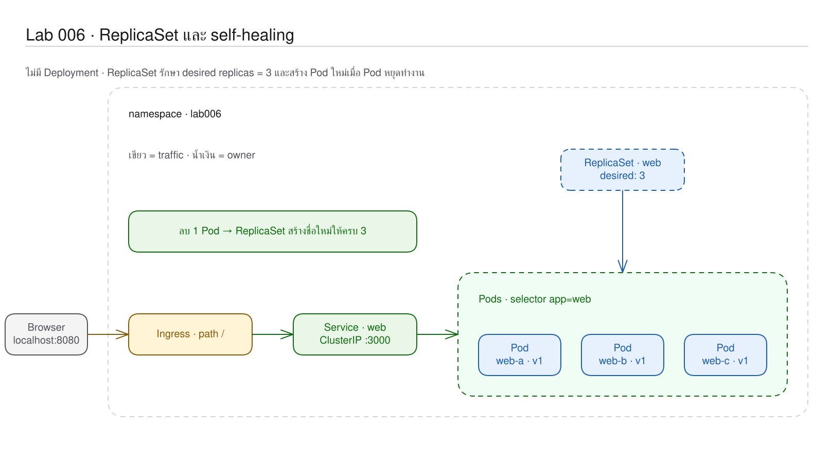
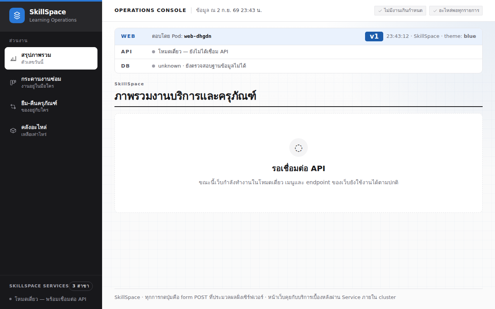
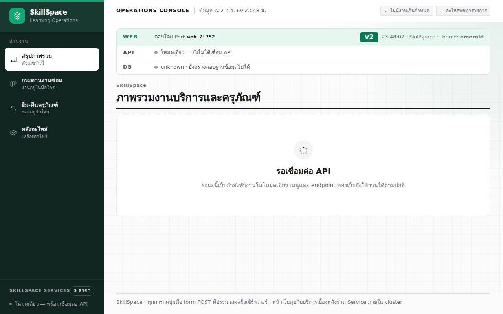

# LAB 6 — Desired State และ Self-Healing: การรักษาจำนวนทรัพยากรตามที่กำหนด

> โฟลเดอร์ `006-desired-state-and-self-healing` = LAB 6 ของชุด Kubernetes ครั้งที่ 1
> (ไฟล์ของปฏิบัติการนี้: `01-replicaset.yaml` · `02-door.yaml` · ภาพจริง 4 ภาพใน `images/`)

> 💡 **แนวคิดหลักของปฏิบัติการนี้:** Kubernetes เปรียบเทียบจำนวนที่กำหนดไว้กับจำนวนที่มีอยู่จริงอย่างต่อเนื่อง และปรับแก้ส่วนต่างโดยอัตโนมัติ

## วัตถุประสงค์ของปฏิบัติการ

เมื่อสิ้นสุดปฏิบัติการ ผู้เรียนจะสามารถ:

1. อธิบาย reconcile loop ของ ReplicaSet ได้
2. อธิบายเหตุผลที่การลบ Pod ภายใต้ ReplicaSet ทำให้เกิด Pod ใหม่ทดแทนได้
3. เชื่อม selector กับการนับ actual state และบอกข้อจำกัดของ ReplicaSet ได้

## แนวคิดและทฤษฎีที่เกี่ยวข้อง

ปฏิบัติการ 003 สร้าง Pod เดี่ยวจึงไม่มีกลไกรักษาจำนวน ส่วน ReplicaSet บันทึก `replicas: 3` และนับ Pod ที่สอดคล้องกับ `app=web`:

สามารถอธิบายเป็นสมการได้ว่า actual 2 ขาดไป 1 จึงสร้างเพิ่ม 1; actual 5 เกินมา 2 จึงลบ 2; actual 3 เท่ากับค่าที่กำหนด จึงไม่ต้องดำเนินการ

| Pod เปล่า | Pod ใต้ ReplicaSet |
|---|---|
| ไม่มี owner | มี `ownerReferences: ReplicaSet` |
| ลบแล้วไม่มี Pod ทดแทน | ลบแล้ว controller สร้าง Pod ทดแทน |
| ชื่อคงที่ | ชื่อมี suffix และเปลี่ยนเมื่อเกิดใหม่ |

`02-door.yaml` เป็น Service + Ingress สำเร็จรูปสำหรับเปิดหน้าเว็บ; จะเรียนสอง object นี้โดยตรงในครั้งถัดไป

## ผลการเรียนรู้ที่คาดหวัง

- ตรวจสอบค่า DESIRED/CURRENT/READY เป็น 3/3/3 ได้
- สังเกตชื่อ Pod สามชื่อสลับกันบนหน้าเว็บจริงได้
- ลบ Pod แล้วสังเกตชื่อใหม่ปรากฏภายในไม่กี่วินาทีได้
- scale 3→5→1→3 จากส่วนต่างของจำนวนได้
- อธิบายข้อจำกัดเมื่อ ReplicaSet มี v1/v2 อยู่ร่วมกันได้

## ภาพรวมของปฏิบัติการ

1. สร้าง ReplicaSet ที่ต้องการ web 3 ตัว
2. เปิด Ingress และตรวจสอบ load distribution
3. ลบ Pod ขณะ watch แล้วตรวจสอบ Pod ทดแทน
4. เพิ่มหรือลดจำนวนด้วย scale และลบทั้งกลุ่ม


> **คำถามนำก่อนเริ่มปฏิบัติการ:** หากลบ Pod หนึ่งรายการจากทั้งหมดสามรายการ กลไกใดจะสร้าง Pod ใหม่ และตรวจสอบได้อย่างไรว่าขาดไปหนึ่งรายการ

## 0. การเตรียมสภาพแวดล้อมสำหรับปฏิบัติการ

ให้เรียกใช้คำสั่งแรกจากเครื่องหลัก จากนั้นเข้าสู่เครื่องเรียนและป้อนคำสั่งทั้งหมดหลังจากนั้นใน shell ที่เปิดอยู่:

```bash
docker start devtools-k8s || docker run -d --name devtools-k8s --privileged --shm-size=1g --ulimit nofile=65536:65536 -p 2299:22 -p 8080:80 -p 8443:443 -p 3000:3000 -p 9090:9090 tuchsanai/devtools-k8s:2569_1
docker exec -it devtools-k8s bash
k8s-bootstrap
kubectl get nodes
docker exec devtools-control-plane crictl images | grep k8s-lab
```
> 📝 **คำอธิบาย:** `docker start` เปิดเครื่องเดิมหรือสร้างเครื่องใหม่ · `docker exec -it ... bash` เข้าสู่เครื่องเรียน · `k8s-bootstrap` ข้ามขั้นตอนการสร้างเมื่อมี cluster แล้ว · สองคำสั่งท้ายตรวจสอบ node และ image จาก runtime ของ node

✅ ผลลัพธ์ที่คาดหวัง (Expected output) — node ทั้งสาม Ready และพบ image แอปครบ (AGE/ID ต่างกันได้):
```text
Set kubectl context to "kind-devtools"
NAME                     STATUS   ROLES           AGE   VERSION
devtools-control-plane   Ready    control-plane   23m   v1.36.4
devtools-worker          Ready    <none>          23m   v1.36.4
devtools-worker2         Ready    <none>          23m   v1.36.4
docker.io/library/k8s-lab-api   v1   f0b9cc03efb0e   186MB
…
```
ตัวอย่างแสดงเฉพาะบางแถวของ image; หากผลลัพธ์ว่าง ให้ดำเนินขั้น build/load ใน README ระดับชุดหรือ LAB 001 ก่อน
ในเทอร์มินัลของเครื่องเรียนให้ใช้ `localhost` พอร์ต 80 ส่วนเบราว์เซอร์บนเครื่องของผู้เรียนให้ใช้ `http://localhost:8080`

## 1. การดึงโค้ดของปฏิบัติการ (Clone)

```bash
mkdir -p ~/labwork && cd ~/labwork && git clone https://github.com/Tuchsanai/DevTools.git
cd ~/labwork/DevTools/05_kubernetes/01_Session1_Kubernetes_Basics/006-desired-state-and-self-healing
```
> 📝 **คำอธิบาย:** สร้าง workspace · clone repository · เข้าโฟลเดอร์ LAB 006 เพื่อให้ relative path ถูกต้อง

✅ ผลลัพธ์ที่คาดหวัง (Expected output) — clone สำเร็จ:
```text
Cloning into 'DevTools'...
```
หาก clone แล้ว ให้เรียกใช้ `cd ~/labwork/DevTools && git pull` แล้วกลับเข้าสู่โฟลเดอร์นี้

## 2. การอ่าน YAML ของปฏิบัติการนี้

| ไฟล์ | kind | การดำเนินการในปฏิบัติการนี้ | แหล่งคำอธิบายโดยละเอียด |
|---|---|---|---|
| `01-replicaset.yaml` | ReplicaSet | รักษา desired state ของ web ไว้ที่ 3 Pod | [ศึกษา YAML_Guide.md → ReplicaSet](../YAML_Guide.md#replicaset) |
| `02-door.yaml` | Service + Ingress | ส่วนเชื่อมต่อสำเร็จรูปสำหรับส่ง request ไปยัง Pod ของ ReplicaSet | [ศึกษา YAML_Guide.md → Service และ Ingress](../YAML_Guide.md#service-และ-ingress) |

หัวใจของ ReplicaSet คัดจาก `01-replicaset.yaml`:

```yaml
spec:
  replicas: 3                 # ต้องการ Pod พร้อมกัน 3 ตัว
  selector:
    matchLabels:
      app: web                # กฎนับสมาชิก
  template:                   # แม่พิมพ์ Pod ทั้งก้อน
    metadata:
      labels:
        app: web              # ต้องตรง selector ด้านบน
        version: v1           # มี label เพิ่มเติมได้
    spec:
      containers:
        - name: web
          image: k8s-lab-web:v1
```

| field | ความหมาย | ถ้าเปลี่ยนค่านี้ |
|---|---|---|
| `replicas` | desired count; ถ้าไม่เขียน default 1 | controller เพิ่ม/ลด Pod ให้เท่าค่าใหม่ |
| `selector.matchLabels` | กฎว่า Pod ใดเป็นสมาชิก | immutable; ต้อง match label ใน template |
| `template.metadata.labels` | label ของ Pod ที่จะสร้าง | ไม่ครอบ selector แล้ว API ปฏิเสธ |
| `template.spec` | Pod spec ทั้งก้อน | Pod ใหม่ใช้ image/port ตามแม่พิมพ์นี้ |

ทั้งสองไฟล์ไม่เขียน `metadata.namespace` จึงต้องใช้ `kubectl apply -n lab006`; วิธีเทียบกับ namespace ในไฟล์อยู่ที่ [YAML_Guide.md → namespace ในไฟล์](../YAML_Guide.md#namespace-ในไฟล์) ส่วน `02-door.yaml` เป็นเพียงประตูสำเร็จรูป—Service จะเรียนละเอียดครั้งที่ 2 และ Ingress ครั้งที่ 3

**ข้อผิดพลาดที่พบบ่อยในปฏิบัติการนี้:** หาก selector ไม่สอดคล้องกับ template API จะปฏิเสธด้วย ``The ReplicaSet "web" is invalid: spec.template.metadata.labels: Invalid value: {"app":"webx"}: `selector` does not match template `labels` ``; สถานการณ์จริงในปฏิบัติการคือ ReplicaSet ไม่ทำ rolling update กล่าวคือ เมื่อเปลี่ยน image ใน template Pod เดิมยังคงเป็น v1 จนกว่าจะลบหนึ่งรายการ จึงปรากฏ v1/v2 ร่วมกัน

ตรวจสอบ schema ด้วย `kubectl explain replicaset.spec.selector` และ `kubectl explain replicaset.spec.template.spec.containers`

## 3. การประกาศ desired state เท่ากับ 3

ส่วนสำคัญจาก `01-replicaset.yaml`:

```yaml
spec:
  replicas: 3
  selector:
    matchLabels:
      app: web
  template:
    metadata:
      labels: {app: web, version: v1}
    spec:
      containers:
        - name: web
          image: k8s-lab-web:v1
          imagePullPolicy: IfNotPresent
```
> 📝 **คำอธิบาย:** `replicas` คือจำนวนที่ต้องการ · `selector` คือกฎนับสมาชิก · `template` คือแม่พิมพ์ Pod · label ใน template ต้องตรง selector

```bash
kubectl create namespace lab006
kubectl apply -n lab006 -f 01-replicaset.yaml
kubectl wait -n lab006 --for='jsonpath={.status.readyReplicas}=3' rs/web --timeout=120s
kubectl get rs,pods -n lab006 -o wide
kubectl get pods -n lab006 -o custom-columns=NAME:.metadata.name,OWNER:.metadata.ownerReferences[0].kind,IMAGE:.spec.containers[0].image
```
> 📝 **คำอธิบาย:** สร้างห้อง · apply ReplicaSet · รอ readyReplicas=3 · ตารางท้ายพิสูจน์ owner/image จริง

✅ ผลลัพธ์ที่คาดหวัง (Expected output) — ReplicaSet 3/3/3 และ Pod มี owner เป็น ReplicaSet:
```text
namespace/lab006 created
replicaset.apps/web created
replicaset.apps/web condition met
replicaset.apps/web   3   3   3   1s   web   k8s-lab-web:v1   app=web
…
NAME        OWNER        IMAGE
web-cztmv   ReplicaSet   k8s-lab-web:v1
…
```
(ตัดบางแถว/บางคอลัมน์จากตาราง wide; ชื่อ Pod, IP, node และ AGE ต่างกันได้)

## 4. การเปิดช่องทางเข้าและตรวจสอบ Pod สามรายการสลับกัน

```bash
kubectl apply -n lab006 -f 02-door.yaml
until curl -sf http://localhost/info >/dev/null; do sleep 1; done
for i in $(seq 1 12); do curl -s http://localhost/info | jq -r .pod; done
```
> 📝 **คำอธิบาย:** apply Service/Ingress · `until` รอ Ingress sync เพื่อไม่ให้ parse หน้า 404 · loop ส่ง 12 request และดึงชื่อ Pod

✅ ผลลัพธ์ที่คาดหวัง (Expected output) — ได้ครบ 12 บรรทัดและพบทั้งสามชื่อ:
```text
service/web created
ingress.networking.k8s.io/web created
web-cztmv
web-cztmv
web-hx2rj
web-fmg6f
web-cztmv
web-fmg6f
web-hx2rj
web-cztmv
web-hx2rj
web-cztmv
web-hx2rj
web-hx2rj
```
เปิด `http://localhost:8080` แล้ว refresh; ภาพมาจากอีกรอบจึงมีชื่อ Pod ต่างจากตาราง




## 5. การลบหนึ่ง Pod และการตรวจสอบ self-healing

เปิดหน้าต่างใหม่บนเครื่องหลักแล้ว `docker exec -it devtools-k8s bash` อีกครั้ง ให้หน้าต่างหนึ่ง watch และอีกหน้าต่างลบชื่อจริงจากตาราง:

```bash
kubectl get pods -n lab006 -w
kubectl delete pod -n lab006 web-cztmv
```
> 📝 **คำอธิบาย:** watch เฝ้า lifecycle · delete ลด actual เป็น 2 ชั่วคราว · ใช้ชื่อ Pod จริงจากเครื่องของตน

✅ ผลลัพธ์ที่คาดหวัง (Expected output) — ตัวเก่าหายและตัวใหม่ผ่าน Pending→Running:
```text
pod "web-cztmv" deleted from lab006 namespace
web-cztmv   1/1   Terminating        0   8s
web-f48br   0/1   Pending            0   0s
web-f48br   0/1   ContainerCreating  0   0s
web-cztmv   0/1   Error              0   9s
web-f48br   1/1   Running            0   1s
```
`Error` ของ Pod เดิมเกิดขึ้นระหว่างรับ SIGTERM ในขณะถูกลบ และไม่ใช่ความผิดปกติของ Pod ทดแทน

```bash
kubectl wait -n lab006 --for='jsonpath={.status.readyReplicas}=3' rs/web --timeout=120s
kubectl get rs,pods -n lab006 -o wide
curl -s http://localhost/info | jq -c '{pod,version}'
```
> 📝 **คำอธิบาย:** รอ owner กลับ 3 · ตารางยืนยันชุดใหม่ · `jq -c` ทำ JSON ให้ตรงหนึ่งบรรทัดที่แสดง

✅ ผลลัพธ์ที่คาดหวัง (Expected output) — จำนวนกลับครบและเว็บยังตอบ v1:
```text
replicaset.apps/web condition met
replicaset.apps/web   3   3   3   21s   web   k8s-lab-web:v1   app=web
pod/web-f48br   1/1   Running   0   13s   10.244.1.41   devtools-worker2   <none>   <none>
…
{"pod":"web-hx2rj","version":"v1"}
```
(ตัดบางแถวของ Pod; ค่าในแถวที่แสดงมาจากผลจริง)


ภาพนี้มาจากอีกรอบ ชื่อ Pod จึงต่างจากผล `curl`

## 6. การ Scale และการลบทั้งกลุ่ม

```bash
kubectl scale rs web -n lab006 --replicas=5 && kubectl wait -n lab006 --for='jsonpath={.status.readyReplicas}=5' rs/web --timeout=120s && kubectl get rs,pods -n lab006
kubectl scale rs web -n lab006 --replicas=1 && kubectl wait -n lab006 --for='jsonpath={.status.readyReplicas}=1' rs/web --timeout=120s && kubectl get rs,pods -n lab006
kubectl apply -n lab006 -f 01-replicaset.yaml && kubectl wait -n lab006 --for='jsonpath={.status.readyReplicas}=3' rs/web --timeout=120s && kubectl get rs,pods -n lab006
```
> 📝 **คำอธิบาย:** แต่ละช่วง scale/wait/get ให้เห็น actual ตาม desired · apply ไฟล์เดิมคืน source of truth เป็น 3

✅ ผลลัพธ์ที่คาดหวัง (Expected output) — ตารางยืนยัน 5 → 1 → 3:
```text
replicaset.apps/web scaled
replicaset.apps/web condition met
replicaset.apps/web   5   5   5   22s
…
replicaset.apps/web scaled
replicaset.apps/web condition met
replicaset.apps/web   1   1   1   23s
pod/web-hx2rj         1/1   Running       0   23s
…
replicaset.apps/web configured
replicaset.apps/web condition met
replicaset.apps/web   3   3   3   24s
pod/web-blx9r         1/1   Terminating   0   2s
```
(ตัดบางแถวของ Pod โดยไม่แก้ AGE หรือสถานะ)

```bash
kubectl delete pods -n lab006 -l app=web
kubectl wait -n lab006 --for='jsonpath={.status.readyReplicas}=3' rs/web --timeout=120s
kubectl get rs,pods -n lab006
```
> 📝 **คำอธิบาย:** selector ลบสมาชิกที่ยังพบทั้งหมด · wait/get พิสูจน์ว่า ReplicaSet สร้างชุดใหม่จนครบ

✅ ผลลัพธ์ที่คาดหวัง (Expected output) — รอบจริงลบรวม Pod ที่กำลัง Terminating ห้ารายการ:
```text
pod "web-b4vdv" deleted from lab006 namespace
pod "web-blx9r" deleted from lab006 namespace
…
pod "web-qmnhq" deleted from lab006 namespace
replicaset.apps/web condition met
replicaset.apps/web   3   3   3
```
(ตัดบางแถวของรายการที่ลบ)

## 7. การทดลองจำลองความล้มเหลว — ReplicaSet ทำให้ v1 และ v2 อยู่ร่วมกัน

```bash
sed 's/k8s-lab-web:v1/k8s-lab-web:v2/' 01-replicaset.yaml > /tmp/rs-v2.yaml
kubectl apply -n lab006 -f /tmp/rs-v2.yaml
kubectl get pods -n lab006 -o custom-columns=NAME:.metadata.name,IMAGE:.spec.containers[0].image
```
> 📝 **คำอธิบาย:** เปลี่ยนเฉพาะ template ในสำเนา · Pod เก่ายังไม่ถูกแทน เพราะ ReplicaSet ไม่ทำ rolling update

✅ ผลลัพธ์ที่คาดหวัง (Expected output) — template เปลี่ยนแต่ Pod เดิมยัง v1:
```text
replicaset.apps/web configured
web-jsmv7   k8s-lab-web:v1
web-jvjnf   k8s-lab-web:v1
…
```
(ตัดบางแถวของ Pod)

```bash
kubectl delete pod -n lab006 web-jsmv7
kubectl wait -n lab006 --for='jsonpath={.status.readyReplicas}=3' rs/web --timeout=120s
kubectl get pods -n lab006 -o custom-columns=NAME:.metadata.name,VERSION:.metadata.labels.version,IMAGE:.spec.containers[0].image
for i in $(seq 1 15); do curl -s http://localhost/info | jq -r '"\(.pod)  \(.version)"'; done
```
> 📝 **คำอธิบาย:** Pod ทดแทนใช้ image v2 จาก template ใหม่ · ตารางชี้ว่า label ยังเป็น v1 เพราะ `sed` เปลี่ยนเฉพาะ image · loop พิสูจน์ความไม่สม่ำเสมอ

✅ ผลลัพธ์ที่คาดหวัง (Expected output) — มี v2 หนึ่งตัว และผล 15 request สลับ v1/v2:
```text
NAME        VERSION   IMAGE
web-jvjnf   v1        k8s-lab-web:v1
web-w5ftj   v1        k8s-lab-web:v1
web-zzgh7   v1        k8s-lab-web:v2
web-w5ftj  v1
web-jvjnf  v1
web-jvjnf  v1
web-jvjnf  v1
web-w5ftj  v1
web-jvjnf  v1
web-zzgh7  v2
web-w5ftj  v1
web-zzgh7  v2
web-jvjnf  v1
web-jvjnf  v1
web-zzgh7  v2
web-w5ftj  v1
web-jvjnf  v1
web-zzgh7  v2
```


ภาพมาจากอีกรอบจึงมีชื่อ Pod ต่างจากตาราง; loop ด้านบนเป็นหลักฐานจากรอบเดียวกัน

```bash
kubectl apply -n lab006 -f 01-replicaset.yaml
kubectl delete pod -n lab006 web-zzgh7
kubectl wait -n lab006 --for='jsonpath={.status.readyReplicas}=3' rs/web --timeout=120s
kubectl get pods -n lab006 -o custom-columns=NAME:.metadata.name,IMAGE:.spec.containers[0].image,READY:.status.containerStatuses[0].ready
```
> 📝 **คำอธิบาย:** คืน template v1 · ใช้ชื่อ Pod v2 จริงจากตารางของตน · wait/get ยืนยันทุกตัวกลับ v1/ready

✅ ผลลัพธ์ที่คาดหวัง (Expected output) — ทุก Pod กลับปกติ:
```text
replicaset.apps/web configured
pod "web-zzgh7" deleted
replicaset.apps/web condition met
NAME        IMAGE            READY
web-d947z   k8s-lab-web:v1   true
…
```
(ตัดบางแถวของ Pod)

## 8. แบบฝึกหัด (Exercise)

เปลี่ยน label ของ Pod หนึ่งรายการจาก `app=web` เป็น `app=orphan` แล้วอธิบายเหตุผลที่ Pod เดิมยังคงทำงาน แต่ ReplicaSet สร้าง Pod อีกรายการเพื่อให้สมาชิก `app=web` ครบ 3; ให้ลบ orphan ก่อน Cleanup

## วิธีตรวจสอบผลการทดลอง

```bash
kubectl get rs,pods -n lab006
curl -s http://localhost/info | jq -c '{pod,version}'
kubectl get events -n lab006 --sort-by=.lastTimestamp | tail -5
```
> 📝 **คำอธิบาย:** ตารางต้อง 3/3/3 · JSON ต้องเป็น v1 · Events ต้องมี `SuccessfulCreate`

✅ ผลลัพธ์ที่คาดหวัง (Expected output) — จำนวนครบ เว็บ v1 และ controller มีหลักฐานสร้าง Pod:
```text
replicaset.apps/web   3   3   3
{"pod":"web-jvjnf","version":"v1"}
Normal   SuccessfulCreate   replicaset/web   Created pod: web-d947z
```
(ตัดบางแถว/บางคอลัมน์ของ Pod และ Events)

## ปัญหาที่พบบ่อยและแนวทางแก้ไข

| อาการ | สาเหตุที่พบบ่อย | วิธีแก้ |
|---|---|---|
| RS READY ไม่ครบ | image ยังไม่ load หรือ Pod กำลังสร้าง | `describe pod` และอ่าน Events |
| หน้าเว็บ 404/503 ช่วงแรก | Ingress ยัง sync หรือ Service ยังไม่มี endpoint | ใช้ loop รอด้านบน |
| v1 ปน v2 | เปลี่ยน RS template แต่ไม่แทน Pod เก่า | คืน template และลบ Pod v2 |

## การล้างทรัพยากร (Cleanup) และการพิสูจน์การทำซ้ำจากสถานะเริ่มต้น (Clean Re-run)

```bash
kubectl delete namespace lab006 && kubectl wait --for=delete namespace/lab006 --timeout=120s
kubectl create namespace lab006 && kubectl apply -n lab006 -f 01-replicaset.yaml -f 02-door.yaml
kubectl wait -n lab006 --for='jsonpath={.status.readyReplicas}=3' rs/web --timeout=120s
until curl -sf http://localhost/info >/dev/null; do sleep 1; done
curl -s http://localhost/info | jq -c '{pod,version}'
kubectl delete namespace lab006 && kubectl wait --for=delete namespace/lab006 --timeout=120s
kubectl get all -n lab006
```
> 📝 **คำอธิบาย:** ลบจนสะอาด · สร้างจาก source of truth เดิม · รอ workload และ Ingress · ลบปิดท้ายพร้อมตรวจว่าง

✅ ผลลัพธ์ที่คาดหวัง (Expected output) — Clean Re-run ตอบ v1 แล้วไม่เหลือ resource:
```text
namespace "lab006" deleted
namespace/lab006 created
replicaset.apps/web created
…
replicaset.apps/web condition met
{"pod":"web-khpw4","version":"v1"}
namespace "lab006" deleted
No resources found in lab006 namespace.
```

## สรุปคำสั่งของปฏิบัติการนี้

`kubectl get rs,pods` ใช้เทียบ controller/สมาชิก · `kubectl wait` รอ desired count · `kubectl scale rs` เปลี่ยนจำนวน

## สรุปสิ่งที่ได้เรียนรู้

Self-healing ไม่ใช่ Pod เดิมฟื้นคืน แต่คือ controller สร้าง Pod ใหม่เมื่อ actual ต่ำกว่า desired

**ภาพรวมที่ควรจดจำ:** controller รักษาค่า 3 ไว้เป็น desired state และนับ Pod ที่เป็น actual state เมื่อค่าทั้งสองไม่เท่ากัน controller จะปรับแก้ทันที

🧭 การเชื่อมโยงสู่ปฏิบัติการถัดไป: [LAB 7 — Deployment manages change](../007-deployment-manages-change/README.md)

## ❓ คำถามทบทวนก่อนจบปฏิบัติการ

1. **self-healing เกิดขึ้นได้อย่างไร?** — controller reconcile desired กับ actual แล้วสร้างหรือลบส่วนต่าง
2. **เหตุใดการลบ Pod ใน LAB 003 จึงไม่มี Pod ทดแทน?** — Pod นั้นไม่มี owner ที่รักษา desired count
3. **ReplicaSet ระบุสมาชิกได้อย่างไร?** — selector จับคู่ label ของ Pod

## ✅ รายการตรวจสอบก่อนจบปฏิบัติการ

- [ ] เห็น 3/3/3 และ owner จริง
- [ ] ลบ Pod แล้วสังเกตชื่อใหม่ปรากฏ
- [ ] scale 5→1→3 ผ่าน
- [ ] เห็นและแก้ mixed v1/v2 ได้
- [ ] Clean Re-run ผ่านและ `lab006` ว่าง

*ผลลัพธ์ที่คาดหวัง (expected output) และภาพหน้าจอในเอกสารนี้ได้มาจากการดำเนินการจริงบน tuchsanai/devtools-k8s:2569_1 (kind v0.33.0 · Kubernetes v1.36.4 · kubectl v1.37.0) เมื่อ 2 กันยายน 2026*
