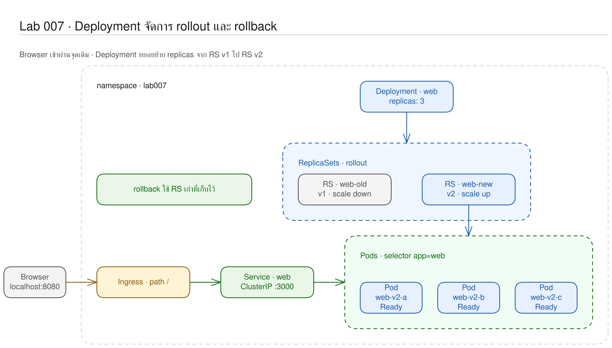
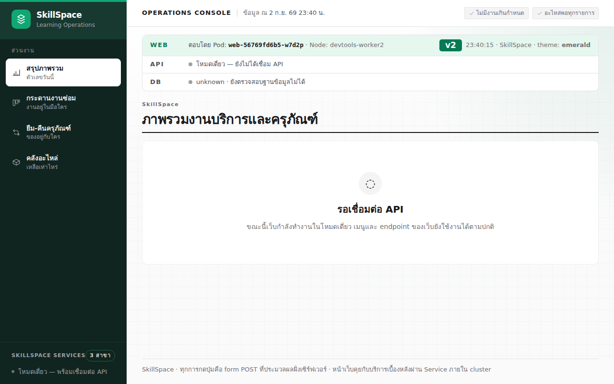
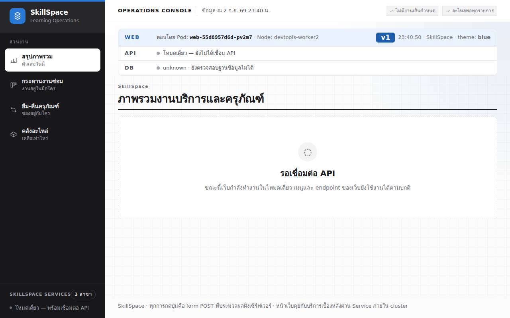

# LAB 7 — Deployment Manages Change: การ scale, rollout และ rollback โดยไม่ลบ Pod ทีละรายการ

> โฟลเดอร์ `007-deployment-manages-change` = LAB 7 ของชุด Kubernetes ครั้งที่ 1
> (ไฟล์ของปฏิบัติการนี้: `01-deployment.yaml` · `02-door.yaml` · `03-deployment-v2.yaml` · `images/`)

> 💡 **แนวคิดหลักของปฏิบัติการนี้:** Deployment เป็นชั้นที่กำกับการเปลี่ยนแปลง โดยรองรับการ scale และเปลี่ยนเวอร์ชันโดยไม่ต้องลบทรัพยากรเดิมด้วยตนเอง

## วัตถุประสงค์ของปฏิบัติการ

เมื่อสิ้นสุดปฏิบัติการ ผู้เรียนจะสามารถ:

1. อธิบายหน้าที่ของ Deployment, ReplicaSet และ Pod แยกจากกันได้
2. อธิบายได้ว่า scale และ rollout ส่งต่อผ่าน ReplicaSet อย่างไร
3. พิสูจน์ได้ว่า RS เดิมรองรับ rollback และทำให้เว็บเดิมยังตอบสนองเมื่อรุ่นใหม่ทำงานผิดพลาด

## แนวคิดและทฤษฎีที่เกี่ยวข้อง

ReplicaSet ควบคุมจำนวนของ template หนึ่งรุ่น ส่วน Deployment ควบคุมการเปลี่ยนแปลงระหว่างรุ่น:

| ชั้น | รับผิดชอบ | หลักฐาน |
|---|---|---|
| Deployment | rollout, rollback, strategy | revision และ ScalingReplicaSet |
| ReplicaSet | จำนวน Pod ของ template หนึ่งรุ่น | RS ใหม่ถูกสร้างเมื่อ template เปลี่ยนแปลง |
| Pod | เรียกใช้งาน container จริง | ชื่อมี hash ของ RS |

RollingUpdate เพิ่ม RS ใหม่และลด RS เดิมตามลำดับ; หากรุ่นใหม่ไม่ Ready ระบบยังคงรักษา Pod รุ่นเดิมไว้รับงาน

## ผลการเรียนรู้ที่คาดหวัง

- ตรวจสอบชื่อสามชั้น `web → web-<hash> → web-<hash>-<id>` ได้
- พิสูจน์ได้ว่าการ scale ผ่าน Deployment ปรับ RS เดิม
- สังเกตการเปลี่ยน v1 เป็น v2 อย่างเป็นลำดับได้
- วิเคราะห์ revision/change-cause และ undo กลับสู่ v1 ได้
- กำหนด v3 ที่ไม่มีอยู่จริง แล้วพิสูจน์ได้ว่าเว็บ v1 ยังคงตอบสนอง

## ภาพรวมของปฏิบัติการ

1. สร้าง Deployment v1 สาม Pod และเปิด Ingress
2. scale 3→5→3
3. rollout v2 ขณะ watch Pod แล้ว undo เป็น v1
4. rollout v3 ให้ทำงานผิดพลาด วิเคราะห์หลักฐาน และ rollback


> **คำถามนำก่อนเริ่มปฏิบัติการ:** หาก v2 ไม่พร้อมทำงาน Deployment จะลบ v1 ก่อน หรือรักษาทรัพยากรเดิมไว้รับ request

## 0. การเตรียมสภาพแวดล้อมสำหรับปฏิบัติการ

ให้เรียกใช้คำสั่งแรกจากเครื่องหลัก จากนั้นเข้าสู่เครื่องเรียนและป้อนคำสั่งทั้งหมดหลังจากนั้นใน shell ที่เปิดอยู่:

```bash
docker start devtools-k8s || docker run -d --name devtools-k8s --privileged --shm-size=1g --ulimit nofile=65536:65536 -p 2299:22 -p 8080:80 -p 8443:443 -p 3000:3000 -p 9090:9090 tuchsanai/devtools-k8s:2569_1
docker exec -it devtools-k8s bash
k8s-bootstrap
kubectl get nodes
docker exec devtools-control-plane crictl images | grep k8s-lab
```
> 📝 **คำอธิบาย:** `docker start` เปิดเครื่องเดิมหรือสร้างเครื่องใหม่ · `docker exec -it ... bash` เข้าสู่เครื่องเรียน · `k8s-bootstrap` ข้ามขั้นตอนการสร้างเมื่อมี cluster แล้ว · สองคำสั่งท้ายตรวจสอบ node และ image จริง

✅ ผลลัพธ์ที่คาดหวัง (Expected output) — node ทั้งสาม Ready และ image ครบ (AGE/ID ต่างกันได้):
```text
Set kubectl context to "kind-devtools"
NAME                     STATUS   ROLES           AGE     VERSION
devtools-control-plane   Ready    control-plane   6m12s   v1.36.4
devtools-worker          Ready    <none>          5m56s   v1.36.4
devtools-worker2         Ready    <none>          5m56s   v1.36.4
docker.io/library/k8s-lab-api  v1  682aa17deaef3  186MB
…
```
ตัวอย่างแสดงเฉพาะบางแถวของ image; หากผลลัพธ์ว่าง ให้ดำเนินขั้น build/load ใน README ระดับชุดหรือ LAB 001 ก่อน
ในเทอร์มินัลของเครื่องเรียนให้ใช้ `localhost` พอร์ต 80 ส่วนเบราว์เซอร์บนเครื่องของผู้เรียนให้ใช้ `http://localhost:8080`

## 1. การดึงโค้ดของปฏิบัติการ (Clone)

```bash
mkdir -p ~/labwork && cd ~/labwork && git clone https://github.com/Tuchsanai/DevTools.git
cd ~/labwork/DevTools/05_kubernetes/01_Session1_Kubernetes_Basics/007-deployment-manages-change
```
> 📝 **คำอธิบาย:** สร้าง workspace · clone repository · เข้า LAB 007 เพื่อให้ relative path ถูกต้อง

✅ ผลลัพธ์ที่คาดหวัง (Expected output) — clone สำเร็จ:
```text
Cloning into 'DevTools'...
```
หาก clone แล้ว ให้เรียกใช้ `cd ~/labwork/DevTools && git pull` แล้วกลับเข้าสู่โฟลเดอร์นี้

## 2. การอ่าน YAML ของปฏิบัติการนี้

| ไฟล์ | kind | การดำเนินการในปฏิบัติการนี้ | แหล่งคำอธิบายโดยละเอียด |
|---|---|---|---|
| `01-deployment.yaml` | Deployment | สร้าง web v1, revision แรก และ Pod template | [ศึกษา YAML_Guide.md → Deployment](../YAML_Guide.md#deployment) |
| `02-door.yaml` | Service + Ingress | ส่วนเชื่อมต่อสำเร็จรูปส่ง traffic ไปยัง Pod ที่ Ready | [ศึกษา YAML_Guide.md → Service และ Ingress](../YAML_Guide.md#service-และ-ingress) |
| `03-deployment-v2.yaml` | Deployment | เปลี่ยน image/change cause เป็น v2 เพื่อ rollout | [ศึกษา YAML_Guide.md → Deployment](../YAML_Guide.md#deployment) |

ส่วนใหม่สำคัญจาก `01-deployment.yaml`:

```yaml
metadata:
  name: web
  namespace: lab007                         # ปลายทางอยู่ในไฟล์
  annotations:
    kubernetes.io/change-cause: "release v1" # เหตุผลของ revision
spec:
  replicas: 3
  selector:
    matchLabels:
      app: web                              # ต้องตรง template label
  template:                                 # แม่พิมพ์ Pod
    metadata:
      labels:
        app: web
    spec:
      containers:
        - name: web
          image: k8s-lab-web:v1
          env:
            - name: POD_NAME
              valueFrom:
                fieldRef:
                  fieldPath: metadata.name  # Downward API อ่านชื่อ Pod
```

| field | ความหมาย | ถ้าเปลี่ยนค่านี้ |
|---|---|---|
| `replicas` / `selector` / `template` | Deployment ให้ ReplicaSet รักษา Pod จากแม่พิมพ์ | เปลี่ยน template เริ่ม revision/rollout; selector immutable |
| `strategy` | ไฟล์ไม่เขียน จึง default `RollingUpdate` | `Recreate` ปิดของเก่าก่อน; RollingUpdate default surge/unavailable 25% |
| `minReadySeconds` / `revisionHistoryLimit` | ไฟล์ไม่เขียน จึง default 0 / 10 | คุมเวลานับ Available / จำนวน revision เก่าสำหรับ rollback |
| change-cause annotation | ข้อความให้ `rollout history` | v2 เปลี่ยนเป็น `"release v2"` |
| `fieldRef.fieldPath` | นำ `metadata.name` และ `spec.nodeName` เข้า env | แต่ละ Pod จึงรายงานตัวตนจริงได้ |

รายละเอียด Downward API อยู่ที่ [YAML_Guide.md → Downward API](../YAML_Guide.md#downward-api-ด้วย-fieldref) และผลของ `metadata.namespace` เทียบกับ `-n` อยู่ที่ [YAML_Guide.md → namespace ในไฟล์](../YAML_Guide.md#namespace-ในไฟล์); `readinessProbe` ในไฟล์เป็น preview ก่อนเรียนละเอียดครั้งที่ 2

**ข้อผิดพลาดที่พบบ่อยในปฏิบัติการนี้:** runlog มี `error: timed out waiting for the condition` และ `Error: ImagePullBackOff` เมื่อ rollout ไปยัง `k8s-lab-web:v3` ที่ไม่มีอยู่จริง ให้ตรวจสอบ Events ก่อน undo; หาก selector ไม่สอดคล้องกับ template API จะปฏิเสธด้วย `` `selector` does not match template `labels` ``

ตรวจสอบ schema ด้วย `kubectl explain deployment.spec.strategy` และ `kubectl explain pod.spec.containers.env.valueFrom.fieldRef`

## 3. การสร้างทรัพยากรสามชั้นจาก Deployment v1

ส่วนแนวคิดหลักต่อไปนี้คัดจาก `01-deployment.yaml` จริง:

```yaml
apiVersion: apps/v1
kind: Deployment
metadata:
  name: web
  namespace: lab007
  annotations:
    kubernetes.io/change-cause: "release v1"
spec:
  replicas: 3 # จำนวน Pod ที่ต้องการ
  selector:
    matchLabels:
      app: web # จับคู่กับ label ของ Pod
  template:
    metadata:
      labels:
        app: web
    spec:
      containers:
        - name: web
          image: k8s-lab-web:v1 # เวอร์ชันเริ่มต้น
          imagePullPolicy: IfNotPresent
          ports:
            - name: http
              containerPort: 3000
          env:
            - name: POD_NAME
              valueFrom:
                fieldRef:
                  fieldPath: metadata.name
            - name: NODE_NAME
              valueFrom:
                fieldRef:
                  fieldPath: spec.nodeName
          readinessProbe: # รับ traffic เมื่อหน้าเว็บพร้อม
            httpGet:
              path: /healthz
              port: http
            initialDelaySeconds: 2
            periodSeconds: 2
```
> 📝 **คำอธิบาย:** `replicas` ต้องการ 3 Pod · selector ต้องตรง label ใน template · image คือ v1 · port ชื่อ `http` ให้ Service/probe อ้างได้ · `POD_NAME`/`NODE_NAME` ใช้ Downward API · `readinessProbe` กัน traffic ก่อน `/healthz` พร้อม และจะเรียนโดยตรงใน LAB 014

```bash
kubectl create namespace lab007 && kubectl apply -f 01-deployment.yaml -f 02-door.yaml
kubectl wait -n lab007 --for=condition=available deployment/web --timeout=120s && kubectl get deploy,rs,pods -n lab007
```
> 📝 **คำอธิบาย:** สร้างห้อง · apply Deployment/Service/Ingress · รอ Deployment available · ตารางแสดงสามชั้น

✅ ผลลัพธ์ที่คาดหวัง (Expected output) — Deployment และ RS พร้อมทำงาน 3 รายการ พร้อม Pod 3 รายการ:
```text
namespace/lab007 created
deployment.apps/web created
service/web created
ingress.networking.k8s.io/web created
deployment.apps/web condition met
deployment.apps/web             3/3   3   3   3s
replicaset.apps/web-55d8957d6d   3     3   3   3s
pod/web-55d8957d6d-46cds         1/1   Running   0   3s
…
```
(ตัดบางแถว/บางคอลัมน์ของ Pod; hash และ AGE ต่างกันได้)

## 4. การ Scale ผ่าน Deployment

```bash
kubectl scale deployment web -n lab007 --replicas=5 && kubectl wait -n lab007 --for=jsonpath='{.status.readyReplicas}'=5 deployment/web --timeout=120s
kubectl get deploy,rs,pods -n lab007
kubectl scale deployment web -n lab007 --replicas=3 && kubectl wait -n lab007 --for=jsonpath='{.status.readyReplicas}'=3 deployment/web --timeout=120s
```
> 📝 **คำอธิบาย:** scale ที่ชั้น Deployment ส่งจำนวนลง RS เดิม · wait ขากลับสำคัญเพื่อไม่ให้ rollout ถัดไปเริ่มระหว่าง scale-down

✅ ผลลัพธ์ที่คาดหวัง (Expected output) — RS เดิมขยาย 5 แล้วกลับ 3:
```text
deployment.apps/web scaled
deployment.apps/web condition met
deployment.apps/web             5/5   5   5   11s
replicaset.apps/web-55d8957d6d   5     5   5   11s
…
deployment.apps/web scaled
deployment.apps/web condition met
```
(ตัดบางแถวของ Pod)

## 5. การ Rollout จาก v1 เป็น v2

เปิดหน้าต่างใหม่บนเครื่องหลักแล้วเรียกใช้ `docker exec -it devtools-k8s bash` อีกครั้ง จากนั้นเรียกใช้ watch ในหน้าต่างใหม่และหยุดด้วย `Ctrl+C` หลัง rollout:

```bash
kubectl get pods -n lab007 -w
```
> 📝 **คำอธิบาย:** watch ทำให้เห็น Pod hash เก่า Terminating ขณะ hash ใหม่ค่อย ๆ Running

✅ ผลลัพธ์ที่คาดหวัง (Expected output) — สอง revision คาบเกี่ยวกัน (ตัดบางแถว):
```text
web-55d8957d6d-74vg7   1/1   Terminating   0   23s
…
web-56769fd6b5-7jv5v   1/1   Running       0   4s
```

กลับสู่หน้าต่างเดิมแล้วเรียกใช้คำสั่งต่อไปนี้:

```bash
kubectl apply -f 03-deployment-v2.yaml && kubectl rollout status deployment/web -n lab007 --timeout=120s
kubectl get rs,pods -n lab007
kubectl rollout history deployment/web -n lab007
until curl -sf http://localhost/info >/dev/null; do sleep 1; done; curl -s http://localhost/info | jq -c '{pod,version,theme}'
```
> 📝 **คำอธิบาย:** apply เปลี่ยน template เป็น v2 · rollout status รอจนเสร็จสิ้น · RS เดิมไม่ถูกลบ · history อ่าน change-cause · loop รอ Ingress ก่อน parse JSON

✅ ผลลัพธ์ที่คาดหวัง (Expected output) — progress เสร็จสิ้น, RS v1 เหลือ 0, RS v2 เป็น 3 และเว็บตอบสนองด้วย v2:
```text
deployment.apps/web configured
Waiting for deployment "web" rollout to finish: 1 out of 3 new replicas have been updated...
…
Waiting for deployment "web" rollout to finish: 1 old replicas are pending termination...
deployment "web" successfully rolled out
replicaset.apps/web-55d8957d6d   0   0   0   23s
replicaset.apps/web-56769fd6b5   3   3   3   12s
pod/web-55d8957d6d-74vg7         1/1   Terminating   0   23s
…
REVISION  CHANGE-CAUSE
1         release v1
2         release v2
{"pod":"web-56769fd6b5-w7d2p","version":"v2","theme":"emerald"}
```
(ตัดบางแถวของ progress และ Pod โดยไม่แก้ค่าที่แสดง)



## 6. การ Undo กลับเป็น v1

```bash
kubectl rollout undo deployment/web -n lab007 && kubectl rollout status deployment/web -n lab007 --timeout=120s
kubectl get rs,pods -n lab007
kubectl rollout history deployment/web -n lab007 && curl -s http://localhost/info | jq -c '{pod,version,theme}'
```
> 📝 **คำอธิบาย:** undo เลือก revision ก่อนหน้า · status รอการย้ายจำนวน · history แสดง revision ใหม่ · curl ยืนยันจากมุมผู้ใช้

✅ ผลลัพธ์ที่คาดหวัง (Expected output) — Warning ปรากฏจริง แล้ว RS v1 กลับเป็น 3 (ตัดบางแถวของ rollout progress):
```text
Warning: resource deployments/web was previously managed with 'kubectl apply'. Rolling back will not update the kubectl.kubernetes.io/last-applied-configuration annotation, which may cause unexpected behavior on future 'kubectl apply' operations. Consider using 'kubectl apply' with your previous configuration file instead.
deployment.apps/web rolled back
Waiting for deployment spec update to be observed...
…
deployment "web" successfully rolled out
replicaset.apps/web-55d8957d6d   3   3   3   64s
replicaset.apps/web-56769fd6b5   0   0   0   53s
REVISION  CHANGE-CAUSE
2         release v2
3         release v1
{"pod":"web-55d8957d6d-pv2m7","version":"v1","theme":"blue"}
```
Warning ระบุว่า undo เปลี่ยน live object แต่ไม่แก้ไข last-applied annotation; ก่อน apply ครั้งถัดไปต้องเลือก manifest ให้สอดคล้องกับ revision ที่ต้องการ



## 7. การวิเคราะห์ log และ Events

```bash
kubectl logs -n lab007 deployment/web --tail=5; kubectl describe deployment web -n lab007 | sed -n '/Events:/,$p'
```
> 📝 **คำอธิบาย:** kubectl เลือก Pod ใต้ Deployment ให้ · describe แสดงการ scale RS ตามลำดับ

✅ ผลลัพธ์ที่คาดหวัง (Expected output) — log พร้อมและ Events มี scale up/down:
```text
Found 4 pods, using pod/web-55d8957d6d-74vg7
…
✓ Running next.config took 1.9ms
Events:
  Type    Reason             Age   From                   Message
  Normal  ScalingReplicaSet  53s   deployment-controller  Scaled up replica set web-56769fd6b5 from 0 to 1
…
  Normal  ScalingReplicaSet  42s   deployment-controller  Scaled down replica set web-55d8957d6d from 1 to 0
```
`Found 4 pods...` เกิดเพราะมี Pod เก่ากำลัง Terminating; Events ถูกตัดบางแถว

## 8. การทดลองจำลองความล้มเหลว — การ rollout image ที่ไม่มีอยู่จริง

```bash
kubectl set image deployment/web web=k8s-lab-web:v3 -n lab007
kubectl rollout status deployment/web -n lab007 --timeout=20s
kubectl get pods,rs -n lab007 -o wide
BROKEN_POD=$(kubectl get pod -n lab007 -l app=web -o jsonpath='{range .items[?(@.status.containerStatuses[0].state.waiting.reason)]}{.metadata.name}{end}'); kubectl describe pod -n lab007 "$BROKEN_POD" | tail -6
curl -s http://localhost/info | jq -c '{pod,version,theme}'
```
> 📝 **คำอธิบาย:** ตั้ง tag v3 ที่ไม่มี · timeout ให้เวลาเห็น backoff · ตารางยืนยัน RS v3 ได้ 1/1/0 · JSONPath หา broken Pod · describe อ่าน error · curl พิสูจน์ว่า v1 ยังตอบ

✅ ผลลัพธ์ที่คาดหวัง (Expected output) — rollout ค้าง แต่ RS v1 สาม Pod ยังพร้อม:
```text
deployment.apps/web image updated
Waiting for deployment spec update to be observed...
Waiting for deployment "web" rollout to finish: 1 out of 3 new replicas have been updated...
error: timed out waiting for the condition
pod/web-55d8957d6d-2jpk4   1/1   Running            0   61s
…
pod/web-6b87887f58-9sx2h   0/1   ImagePullBackOff   0   20s
replicaset.apps/web-55d8957d6d   3   3   3   114s   web   k8s-lab-web:v1
replicaset.apps/web-6b87887f58   1   1   0   20s    web   k8s-lab-web:v3
  Normal   Scheduled  20s               default-scheduler  Successfully assigned lab007/web-6b87887f58-9sx2h to devtools-worker
  Normal   BackOff    18s               kubelet            spec.containers{web}: Back-off pulling image "k8s-lab-web:v3"
  Warning  Failed     18s               kubelet            spec.containers{web}: Error: ImagePullBackOff
  Normal   Pulling    7s (x2 over 19s)  kubelet            spec.containers{web}: Pulling image "k8s-lab-web:v3"
  Warning  Failed     5s (x2 over 18s)  kubelet            spec.containers{web}: Failed to pull image "k8s-lab-web:v3": failed to pull and unpack image "docker.io/library/k8s-lab-web:v3": failed to resolve reference "docker.io/library/k8s-lab-web:v3": pull access denied, repository does not exist or may require authorization: server message: insufficient_scope: authorization failed
  Warning  Failed     5s (x2 over 18s)  kubelet            spec.containers{web}: Error: ErrImagePull
{"pod":"web-55d8957d6d-2jpk4","version":"v1","theme":"blue"}
```
(ตัดบางแถว/บางคอลัมน์ของ Pod/RS; Warning อธิบายว่า registry ไม่มี tag v3)

```bash
kubectl rollout undo deployment/web -n lab007 && kubectl rollout status deployment/web -n lab007 --timeout=120s
kubectl get deploy,rs,pods -n lab007
```
> 📝 **คำอธิบาย:** undo คืน template ที่ทำงานได้ · status รอ reconcile · ตารางต้องเห็น RS v3 ลดเป็น 0

✅ ผลลัพธ์ที่คาดหวัง (Expected output) — Warning เดิมปรากฏ แล้วระบบกลับพร้อม:
```text
Warning: resource deployments/web was previously managed with 'kubectl apply'. Rolling back will not update the kubectl.kubernetes.io/last-applied-configuration annotation, which may cause unexpected behavior on future 'kubectl apply' operations. Consider using 'kubectl apply' with your previous configuration file instead.
deployment.apps/web rolled back
Waiting for deployment spec update to be observed...
Waiting for deployment "web" rollout to finish: 1 old replicas are pending termination...
deployment "web" successfully rolled out
deployment.apps/web             3/3   3   3   115s
replicaset.apps/web-55d8957d6d   3     3   3   115s
replicaset.apps/web-56769fd6b5   0     0   0   104s
replicaset.apps/web-6b87887f58   0     0   0   21s
```
Warning มีสาเหตุเดียวกับ undo ครั้งแรก จึงไม่ควรซ่อนจากผู้เรียน

## 9. แบบฝึกหัด (Exercise)

ปรับ `replicas` เป็น 4 ในสำเนา manifest แล้วทำนายว่า RS ใดจะ scale; ผ่านเมื่ออธิบายได้ว่าเปลี่ยนจำนวนไม่สร้าง RS ใหม่ แต่เปลี่ยน Pod template สร้าง RS ใหม่

## วิธีตรวจสอบผลการทดลอง

```bash
kubectl get deploy,rs,pods -n lab007; curl -s http://localhost/info | jq -c '{pod,version}'
```
> 📝 **คำอธิบาย:** Deployment ต้องพร้อม 3/3 · RS v3 ต้องเป็น 0 · JSON ต้องตอบ v1; history/events ได้รับการพิสูจน์แล้วจึงไม่เรียกใช้ซ้ำด้วยผลที่ไม่มีใน runlog

✅ ผลลัพธ์ที่คาดหวัง (Expected output) — ระบบพร้อมและเว็บกลับ v1 (ตัดบางแถว/บางคอลัมน์ของตาราง):
```text
deployment.apps/web             3/3   3   3   115s
replicaset.apps/web-55d8957d6d   3     3   3   115s
replicaset.apps/web-6b87887f58   0     0   0   21s
…
{"pod":"web-55d8957d6d-pv2m7","version":"v1"}
```

## ปัญหาที่พบบ่อยและแนวทางแก้ไข

| อาการ | สาเหตุที่พบบ่อย | วิธีแก้ |
|---|---|---|
| `/info` ได้ 404 ช่วงแรก | Ingress ยัง sync | ใช้ loop รอ HTTP 200 |
| Pod เป็น `ImagePullBackOff` | tag ผิด/ยังไม่ load | ตรวจ image แล้วแก้ tag |
| rollout ค้าง | Pod ใหม่ไม่ Ready | ตรวจสอบ Pod, describe และ logs |
| apply หลัง undo เตือน annotation | live object กับ last-applied ต่างกัน | apply manifest revision ที่ต้องการ |

## การล้างทรัพยากร (Cleanup) และการพิสูจน์การทำซ้ำจากสถานะเริ่มต้น (Clean Re-run)

```bash
kubectl delete namespace lab007 && kubectl wait --for=delete namespace/lab007 --timeout=120s
kubectl create namespace lab007 && kubectl apply -f 01-deployment.yaml -f 02-door.yaml
kubectl wait -n lab007 --for=condition=available deployment/web --timeout=120s
until curl -sf http://localhost/info >/dev/null; do sleep 1; done; curl -s http://localhost/info | jq -c '{pod,version,theme}'
kubectl delete namespace lab007 && kubectl wait --for=delete namespace/lab007 --timeout=120s
kubectl get all -n lab007
```
> 📝 **คำอธิบาย:** ลบจนสะอาด · สร้าง v1 จากไฟล์เดิม · รอ Deployment/Ingress · ลบปิดท้ายและตรวจว่าง

✅ ผลลัพธ์ที่คาดหวัง (Expected output) — Clean Re-run ได้ v1 แล้วไม่เหลือ resource:
```text
namespace "lab007" deleted
namespace/lab007 created
deployment.apps/web created
…
deployment.apps/web condition met
{"pod":"web-55d8957d6d-sfrnh","version":"v1","theme":"blue"}
namespace "lab007" deleted
No resources found in lab007 namespace.
```

## สรุปคำสั่งของปฏิบัติการนี้

`kubectl scale deployment` เปลี่ยนจำนวน · `kubectl rollout status` รอ rollout · `kubectl rollout undo` ย้อน revision

## สรุปสิ่งที่ได้เรียนรู้

Deployment ทำให้การ scale ใช้ RS เดิม ส่วน Pod template ใหม่จะสร้าง RS ใหม่ และบันทึก RS เดิมไว้สำหรับ rollback

- Pod ทำหน้าที่เรียกใช้งาน, ReplicaSet ควบคุมจำนวน และ Deployment ควบคุมการเปลี่ยน revision
- RollingUpdate ไม่ลดของเก่าจนของใหม่พร้อม

**ภาพรวมที่ควรจดจำ:** Deployment อยู่ในชั้นบนสุดและสร้าง ReplicaSet สำหรับแต่ละ revision จากนั้น ReplicaSet จึงสร้าง Pod

🧭 การเชื่อมโยงสู่ปฏิบัติการถัดไป: ปฏิบัติการ 008 จะใช้ Pod ที่สร้างใหม่เพื่อพิสูจน์เหตุผลที่การเรียกด้วย IP โดยตรงมีความเปราะบาง

## ❓ คำถามทบทวนก่อนจบปฏิบัติการ

1. **เหตุใดจึงมีทรัพยากรสามชั้น?** — Pod เรียกใช้งาน container, RS ควบคุมจำนวนต่อรุ่น และ Deployment ควบคุมการเปลี่ยนรุ่น
2. **rollback ดำเนินการได้ด้วยกลไกใด?** — Deployment รักษา RS เดิมที่มี replicas=0 ไว้

## ✅ รายการตรวจสอบก่อนจบปฏิบัติการ

- [ ] เห็น Deployment → ReplicaSet → Pod
- [ ] scale 5 แล้วกลับ 3
- [ ] เห็น rollout v2 และ undo v1
- [ ] อธิบายเหตุผลที่ v3 ทำงานผิดพลาดแต่เว็บเดิมยังตอบสนองได้
- [ ] Clean Re-run ผ่านและ `lab007` ว่าง

*ผลลัพธ์ที่คาดหวัง (expected output) และภาพหน้าจอในเอกสารนี้ได้มาจากการดำเนินการจริงบน tuchsanai/devtools-k8s:2569_1 (kind v0.33.0 · Kubernetes v1.36.4 · kubectl v1.37.0) เมื่อ 2 กันยายน 2026*
