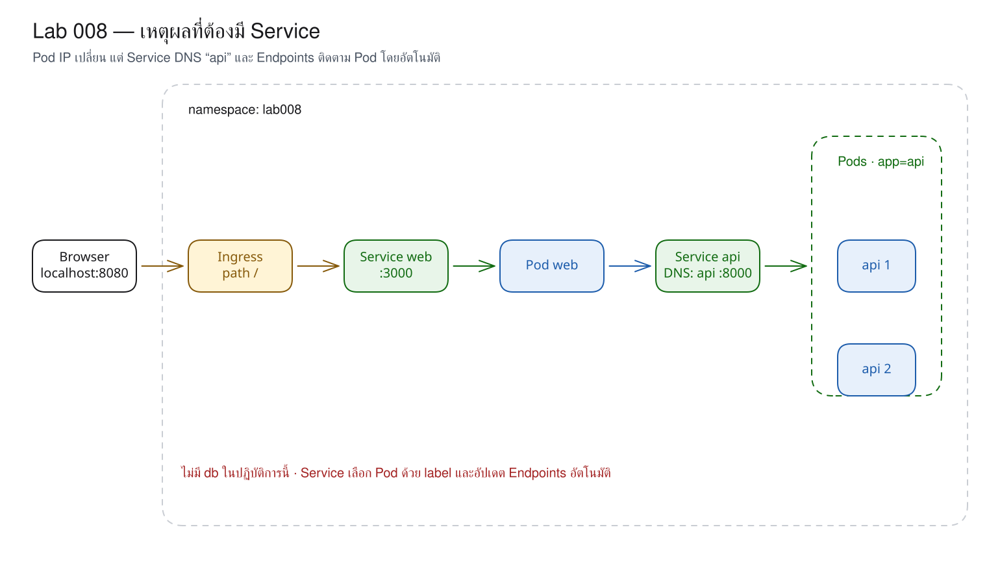
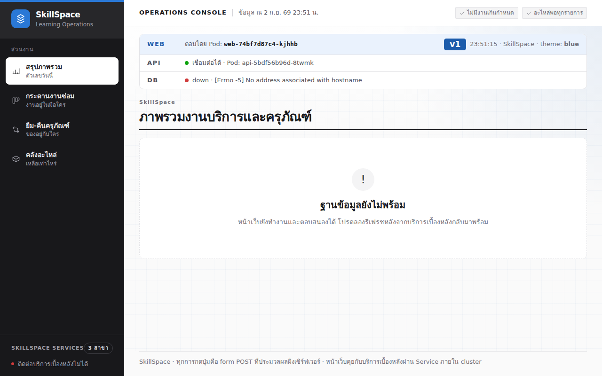

# LAB 8 — Why We Need Service : ชื่อคงที่สำหรับ Pod ที่มี IP เปลี่ยนแปลงได้

> โฟลเดอร์ `008-why-we-need-service` = LAB 8 ของชุด Kubernetes ครั้งที่ 2
> (ไฟล์ของปฏิบัติการนี้: `01-web.yaml`, `02-api.yaml`, `03-web-ip.yaml`, `04-api-service.yaml`, `05-web-by-name.yaml` และ `images/`)

> 💡 **แนวคิดหลักของปฏิบัติการนี้:** เมื่อ Pod ถูกสร้างใหม่ IP จะเปลี่ยนแปลง จึงต้องมี "ชื่อคงที่" สำหรับใช้อ้างอิงแทน

## วัตถุประสงค์ของปฏิบัติการ

1. อธิบายเหตุผลที่ไม่ควรบันทึก Pod IP เป็นปลายทางถาวร
2. อธิบายบทบาทของ Service ในฐานะชื่อ DNS, virtual IP และกลไกเลือก Pod ด้วย label
3. พิสูจน์ว่า Endpoints เปลี่ยนตาม Pod แต่ชื่อ `api` ไม่เปลี่ยน
4. วิเคราะห์อาการเมื่อ Service ไม่มี endpoint และแก้ไข selector ให้ถูกต้องได้

## แนวคิดและทฤษฎีที่เกี่ยวข้อง

ใน Docker Compose สามารถเรียก `http://api:8000` โดยไม่ต้องทราบ container IP เนื่องจาก network ให้บริการ DNS
Kubernetes แยก Pod ซึ่งอาจถูกสร้างใหม่ได้ตลอดเวลาออกจาก Service ซึ่งมีตัวตนและชื่อที่คงที่กว่า ดังตารางต่อไปนี้:

| สิ่งที่อ้าง | อายุ | เมื่อ Pod เกิดใหม่ |
|---|---|---|
| Pod IP | ชั่วคราว | IP เดิมใช้ต่อไม่ได้ |
| Service `api` | คงอยู่จนกว่าจะลบ Service | Endpoints ถูกอัปเดตให้ชี้ Pod ชุดใหม่ |
| `api.lab008.svc.cluster.local` | DNS ของ Service | resolve ไป ClusterIP เดิม |

Service ไม่ได้ย้าย IP ให้ Pod แต่สร้างปลายทางไว้ด้านหน้าแล้วเลือก Pod จาก `spec.selector`
ดังนั้น label ที่ไม่ถูกต้องเพียงรายการเดียวทำให้ Service มี `<none>` แม้ Pod ทั้งหมดยังคงมีสถานะ Running

## ผลการเรียนรู้ที่คาดหวัง

- กำหนดให้ web เรียก API ด้วย Pod IP โดยตรงได้
- สังเกตการเปลี่ยนแปลงของ IP หลังลบ Pod และการที่หน้าเว็บไม่สามารถเรียก IP เดิมได้
- สร้าง ClusterIP Service และอ่าน Endpoints ได้
- กำหนด selector ที่ไม่ถูกต้อง วิเคราะห์อาการ และแก้ไขให้ถูกต้องได้

## ภาพรวมของปฏิบัติการ

1. เปิด web และ API จำนวนสอง Pod โดยยังไม่มี Service อยู่ด้านหน้า API
2. กำหนด API Pod IP ใน web แล้วลบ Pod เป้าหมาย
3. สร้าง Service `api` และเปลี่ยน web ให้เรียกด้วยชื่อ
4. ลบ API Pod และกำหนด selector ที่ไม่ถูกต้อง จากนั้นสังเกต Endpoints ก่อนแก้ไขให้ถูกต้อง



> **คำถามนำก่อนเริ่มปฏิบัติการ:** หาก web บันทึก IP ของ API Pod แล้ว Pod ดังกล่าวถูกสร้างใหม่ request ถัดไปจะถูกส่งไปยังปลายทางใด

## 0. การเตรียมสภาพแวดล้อมสำหรับปฏิบัติการ

เรียกใช้คำสั่งแรกบนเครื่องหลัก แล้วใช้ `docker exec` เพื่อเข้าสู่เครื่องเรียน; คำสั่งทั้งหมดหลังจากนั้นให้ป้อนในเครื่องเรียน เทอร์มินัลของเครื่องเรียนใช้ `localhost` พอร์ต 80 ส่วนเบราว์เซอร์บนเครื่องหลักใช้ `http://localhost:8080`

```bash
docker start devtools-k8s || docker run -d --name devtools-k8s --privileged --shm-size=1g --ulimit nofile=65536:65536 -p 2299:22 -p 8080:80 -p 8443:443 -p 3000:3000 -p 9090:9090 tuchsanai/devtools-k8s:2569_1
docker exec -it devtools-k8s bash
k8s-bootstrap
kubectl get nodes
docker exec devtools-control-plane crictl images | grep k8s-lab
```

> 📝 **คำอธิบาย:** `docker start` ใช้เครื่องเดิม · `|| docker run` สร้างเครื่องเมื่อยังไม่มี · `docker exec -it ... bash` เข้าสู่เครื่องเรียน · `k8s-bootstrap` สร้าง cluster และข้ามขั้นตอนโดยอัตโนมัติหากมีอยู่แล้ว · `kubectl get nodes` ตรวจสอบ cluster · `crictl` ตรวจสอบ image ใน kind node

✅ **ผลลัพธ์ที่คาดหวัง (Expected output)** — node จำนวน 3 รายการมีสถานะ Ready และมี image web/api/db ครบถ้วน (ตัดบางคอลัมน์; AGE และ image ID อาจแตกต่างกัน):

```text
NAME                     STATUS   ROLES           AGE   VERSION
devtools-control-plane   Ready    control-plane   15m   v1.36.4
devtools-worker          Ready    <none>          15m   v1.36.4
devtools-worker2         Ready    <none>          15m   v1.36.4
docker.io/library/k8s-lab-api  v1  682aa17deaef3  186MB
docker.io/library/k8s-lab-db   v1  901da7602fb40  300MB
docker.io/library/k8s-lab-web  v1  a389e8bc3c5ed  209MB
docker.io/library/k8s-lab-web  v2  65ea95c8496b6  209MB
…
```

หาก image ยังไม่อยู่ใน kind ให้ดำเนินการขั้น build/load ของปฏิบัติการ 001 หรือศึกษา README ระดับชุดก่อน

## 1. การดึงโค้ดของปฏิบัติการ (Clone)

```bash
mkdir -p ~/labwork && cd ~/labwork && git clone https://github.com/Tuchsanai/DevTools.git
cd ~/labwork/DevTools/05_kubernetes/02_Session2_Networking_Config_Storage/008-why-we-need-service
```

> 📝 **คำอธิบาย:** `mkdir -p` สร้าง workspace · `git clone` ดึงชุดเอกสารการเรียน · `cd` เข้าสู่ LAB 008 เพื่ออ้างไฟล์ด้วย relative path

✅ **ผลลัพธ์ที่คาดหวัง (Expected output)** — การ clone สำเร็จและ `cd` ไม่แสดง error:

```text
Cloning into 'DevTools'...
```

หาก clone ไว้แล้ว ให้เรียกใช้ `git pull` ใน `~/labwork/DevTools` แทนการ clone ซ้ำ

## 2. การอ่าน YAML ของปฏิบัติการนี้

| ไฟล์ | kind | หน้าที่ในปฏิบัติการนี้ | แหล่งคำอธิบายโดยละเอียด |
|---|---|---|---|
| `01-web.yaml` | Deployment, Service, Ingress | เปิด web และประตูของปฏิบัติการ | [Deployment](../YAML_Guide.md#deployment) · [Service](../YAML_Guide.md#service) · [Ingress](../YAML_Guide.md#ingress) |
| `02-api.yaml` | Deployment | สร้าง API Pod จำนวนสองรายการเพื่อสังเกตการเปลี่ยนแปลงของ IP | [Deployment](../YAML_Guide.md#deployment) |
| `03-web-ip.yaml` | Deployment | จงใจผูก web กับ Pod IP | [Deployment](../YAML_Guide.md#deployment) |
| `04-api-service.yaml` | Service | ให้ชื่อและพอร์ตคงที่แก่ API | [Service](../YAML_Guide.md#service) |
| `05-web-by-name.yaml` | Deployment | เปลี่ยน web มาเรียก `http://api:8000` | [Deployment](../YAML_Guide.md#deployment) · [Service DNS](../YAML_Guide.md#service) |

ส่วนใหม่ที่ต้องอ่านจาก `04-api-service.yaml` จริงคือ:

```yaml
spec:
  selector:
    app: api
  ports:
    - name: http
      port: 8000
      targetPort: http
```

| field | ความหมาย | ถ้าเปลี่ยนค่านี้ |
|---|---|---|
| `selector.app` | เลือก Pod label `app=api` เพื่อสร้าง endpoints | ไม่ตรงแล้ว Service ยังอยู่ แต่ไม่มีปลายทาง |
| `ports[].port` | พอร์ตคงที่ที่ client เรียกบน Service | client ต้องเรียกพอร์ตใหม่ |
| `targetPort: http` | ส่งต่อไป port ชื่อ `http` ของ API Pod | ชื่อไม่ตรงกับ container port แล้วส่งต่อไม่ได้ |
| ไม่ระบุ `protocol` | ใช้ default `TCP` | เปลี่ยนเป็น UDP/SCTP ต้องตรงกับ protocol ของแอป |
| ไม่ระบุ `type` | ใช้ default `ClusterIP` | ใส่ `NodePort` จะเพิ่มทางเข้าจากพอร์ตบนทุก Node |

ชื่อแบบสั้น `api` ใช้ได้ภายใน namespace เดียวกัน; ชื่อเต็มคือ `api.lab008.svc.cluster.local` และรายการ EndpointSlice จะเปลี่ยนแปลงตาม Pod ที่ selector เลือก

**ข้อผิดพลาดที่พบบ่อยในปฏิบัติการนี้:** selector ที่ไม่ถูกต้องยังสามารถ apply ได้ จึงไม่เกิด validation error แต่ EndpointSlice ไม่มีปลายทาง; runlog ในขั้น selector ไม่ถูกต้องบันทึก `"error":"fetch failed"` ส่วน `"error":"The operation was aborted due to timeout"` เกิดขึ้นในขั้นที่ web ยังชี้ไปยัง Pod IP เดิม ให้เปรียบเทียบ `spec.selector` กับ Pod labels และตรวจสอบ `kubectl get endpointslice -l kubernetes.io/service-name=api`

ตรวจสอบ field จาก schema ได้ด้วย `kubectl explain service.spec.ports` และ `kubectl explain service.spec.selector`

## 3. การเปิด web และ API ที่ยังไม่มี Service

`01-web.yaml` ประกอบด้วย Deployment web และประตูสำเร็จรูป ส่วน `02-api.yaml` ประกอบด้วย API Pod จำนวนสองรายการ แต่ยังไม่มี Service

```bash
kubectl create namespace lab008
kubectl apply -f 01-web.yaml -f 02-api.yaml
kubectl wait -n lab008 --for=condition=available deployment/web deployment/api --timeout=120s
kubectl get pods -n lab008 -o wide
```

> 📝 **คำอธิบาย:** namespace แยก resource ของปฏิบัติการ · `apply` สร้าง web/api · `wait` รอ Deployment · `-o wide` เพิ่มคอลัมน์ Pod IP และ Node

✅ **ผลลัพธ์ที่คาดหวัง (Expected output)** — web จำนวน 1 Pod และ api จำนวน 2 Pod มีสถานะ Running โดย API แต่ละ Pod มี IP ของตนเอง (ตัดบางคอลัมน์; ชื่อ/IP/Node/AGE อาจแตกต่างกัน):

```text
…
namespace/lab008 created
deployment.apps/web created
service/web created
ingress.networking.k8s.io/web created
deployment.apps/api created
deployment.apps/web condition met
deployment.apps/api condition met
NAME                   READY   STATUS    RESTARTS   AGE   IP            NODE
api-5bdf56b96d-95fs9   1/1     Running   0          2s    10.244.1.8    devtools-worker2
api-5bdf56b96d-w8d8z   1/1     Running   0          2s    10.244.2.15   devtools-worker
web-89cc7866c-lthlv    1/1     Running   0          2s    10.244.2.14   devtools-worker
```

## 4. การเชื่อมโยง web กับ Pod IP โดยตรง

รอให้ process ของ API พร้อมก่อน เนื่องจาก Deployment นี้ยังไม่มี readinessProbe:

```bash
API_POD=$(kubectl get pod -n lab008 -l app=api -o jsonpath='{.items[0].metadata.name}')
API_POD_IP=$(kubectl get pod -n lab008 "$API_POD" -o jsonpath='{.status.podIP}')
until kubectl exec -n lab008 deployment/web -- wget -qO- "http://$API_POD_IP:8000/health"; do sleep 1; done
sed "s/API_POD_IP/$API_POD_IP/" 03-web-ip.yaml | kubectl apply -f -
kubectl rollout status deployment/web -n lab008 --timeout=120s
until curl --retry 0 -sf http://localhost/info >/dev/null; do sleep 1; done
curl -s http://localhost/info | jq -c '{pod,api,db}'
```

> 📝 **คำอธิบาย:** `jsonpath` อ่านชื่อ/IP จาก object จริง · `until` ป้องกัน race condition เมื่อ container มีสถานะ Running แต่แอปพลิเคชันยังไม่รับข้อมูลที่พอร์ต · `sed` แทน placeholder โดยไม่แก้ไขไฟล์ต้นฉบับ · `apply -f -` อ่าน YAML จาก stdin · `/info` ตรวจสอบการ์ดสถานะในรูป JSON

✅ **ผลลัพธ์ที่คาดหวัง (Expected output)** — health ตอบ ok, rollout สำเร็จ และ web ติดต่อ API Pod ตาม IP ได้; ฐานข้อมูลไม่พร้อมใช้งานเป็นผลที่ถูกต้องเนื่องจากปฏิบัติการนี้ยังไม่มีฐานข้อมูล (ค่าอาจแตกต่างกัน):

```text
wget: can't connect to remote host (10.244.1.8): Connection refused
command terminated with exit code 1
{"status":"ok","pod":"api-5bdf56b96d-95fs9","version":"v1"}
deployment.apps/web configured
deployment "web" successfully rolled out
{"pod":"web-67449df4b8-49w6w","api":{"configured":true,"reachable":true,"pod":"api-5bdf56b96d-95fs9"},"db":{"status":"down","error":"[Errno -5] No address associated with hostname"}}
```


## 5. การลบ Pod ที่มีการกำหนด IP ไว้

```bash
kubectl delete pod -n lab008 "$API_POD"
kubectl wait -n lab008 --for=condition=Ready pod -l app=api --timeout=120s
kubectl get pods -n lab008 -o wide
sleep 3
curl -s http://localhost/info | jq -c '{pod,api,db}'
```

> 📝 **คำอธิบาย:** ลบ Pod เป้าหมายโดยใช้ชื่อที่บันทึกไว้ · Deployment สร้าง Pod ทดแทน · `-o wide` ใช้เปรียบเทียบ IP · web ยังคงเรียก IP เดิมจึงเกิด timeout

✅ **ผลลัพธ์ที่คาดหวัง (Expected output)** — Pod เดิมถูกลบ Pod ใหม่ได้รับ `10.244.1.9` แทน `10.244.1.8` และค่า reachable ของ API เปลี่ยนเป็น false (ตัดบางคอลัมน์; ค่าเหล่านี้อาจแตกต่างกัน):

```text
…
pod "api-5bdf56b96d-95fs9" deleted from lab008 namespace
pod/api-5bdf56b96d-8twmk condition met
NAME                   READY   STATUS    RESTARTS   AGE   IP
api-5bdf56b96d-8twmk   1/1     Running   0          2s    10.244.1.9
api-5bdf56b96d-w8d8z   1/1     Running   0          64s   10.244.2.15
{"pod":"web-67449df4b8-49w6w","api":{"configured":true,"reachable":false,"error":"The operation was aborted due to timeout"},"db":{"status":"unknown"}}
```


## 6. การกำหนด Service เป็นชื่อคงที่

`04-api-service.yaml` ใช้ selector `app: api`; `05-web-by-name.yaml` เปลี่ยนปลายทางเป็น `http://api:8000`

```bash
kubectl apply -f 04-api-service.yaml
kubectl get service,endpoints api -n lab008
kubectl apply -f 05-web-by-name.yaml
kubectl rollout status deployment/web -n lab008 --timeout=120s
for i in $(seq 1 10); do kubectl exec -n lab008 deployment/web -- wget -qO- http://api:8000/health | jq -r .pod; done
```

> 📝 **คำอธิบาย:** Service ให้ ClusterIP/DNS คงที่ · Endpoints คือ IP ปัจจุบันที่ selector พบ · rollout เปลี่ยนให้ web เรียกด้วยชื่อ · `seq` สร้าง connection ใหม่หลายครั้งเพื่อสังเกตการกระจายโหลด

✅ **ผลลัพธ์ที่คาดหวัง (Expected output)** — Endpoints มี IP ของ API จำนวนสองรายการ และ connection ใหม่ถูกส่งไปยัง Pod ทั้งสอง (ชื่อ/IP อาจแตกต่างกัน):

```text
service/api created
Warning: v1 Endpoints is deprecated in v1.33+; use discovery.k8s.io/v1 EndpointSlice
NAME   TYPE        CLUSTER-IP      EXTERNAL-IP   PORT(S)    AGE
api    ClusterIP   10.96.150.141   <none>        8000/TCP   0s
NAME   ENDPOINTS                          AGE
api    10.244.1.9:8000,10.244.2.15:8000   0s
deployment.apps/web configured
deployment "web" successfully rolled out
api-5bdf56b96d-8twmk
api-5bdf56b96d-w8d8z
api-5bdf56b96d-w8d8z
api-5bdf56b96d-8twmk
api-5bdf56b96d-w8d8z
api-5bdf56b96d-w8d8z
api-5bdf56b96d-8twmk
api-5bdf56b96d-8twmk
api-5bdf56b96d-w8d8z
api-5bdf56b96d-8twmk
```



> Kubernetes v1.36 ยังคงอ่าน `Endpoints` ได้ แต่แสดงคำเตือนว่า deprecated; งานใหม่ควรตรวจสอบ `EndpointSlice` ด้วย

## 7. การลบ API Pod ซ้ำและการตรวจสอบ DNS/log

```bash
API_POD=$(kubectl get pod -n lab008 -l app=api -o jsonpath='{.items[0].metadata.name}')
kubectl delete pod -n lab008 "$API_POD"
kubectl wait -n lab008 --for=condition=Ready pod -l app=api --timeout=120s
kubectl get endpoints api -n lab008
kubectl exec -n lab008 deployment/web -- nslookup api || true
kubectl logs -n lab008 deployment/api --tail=8
```

> 📝 **คำอธิบาย:** ลบสมาชิกโดยไม่ลบ Service · Endpoints ต้องเปลี่ยนแปลงโดยอัตโนมัติ · `nslookup` พิสูจน์ FQDN/ClusterIP · `|| true` รองรับ BusyBox ที่คืนค่า 1 หลังตรวจสอบ suffix อื่น · logs เป็นหลักฐานว่า request ไปถึง API

✅ **ผลลัพธ์ที่คาดหวัง (Expected output)** — IP เดิม `10.244.1.9` เปลี่ยนเป็น `10.244.1.10`, DNS ชี้ไปยัง ClusterIP และ log มี `GET /ready` (ค่าอาจแตกต่างกัน):

```text
pod "api-5bdf56b96d-8twmk" deleted from lab008 namespace
pod/api-5bdf56b96d-s862d condition met
pod/api-5bdf56b96d-w8d8z condition met
Warning: v1 Endpoints is deprecated in v1.33+; use discovery.k8s.io/v1 EndpointSlice
NAME   ENDPOINTS                           AGE
api    10.244.1.10:8000,10.244.2.15:8000   54s
Server:  10.96.0.10
Address: 10.96.0.10:53
** server can't find api.cluster.local: NXDOMAIN
Name:    api.lab008.svc.cluster.local
Address: 10.96.150.141
** server can't find api.cluster.local: NXDOMAIN
** server can't find api.svc.cluster.local: NXDOMAIN
** server can't find api.svc.cluster.local: NXDOMAIN
command terminated with exit code 1
Found 2 pods, using pod/api-5bdf56b96d-w8d8z
  File "/usr/local/lib/python3.12/site-packages/psycopg/_conninfo_attempts.py", line 53, in conninfo_attempts
    raise e.OperationalError(str(last_exc))
psycopg.OperationalError: [Errno -5] No address associated with hostname
[api] GET /ready 503 3ms
INFO:     10.244.2.17:37462 - "GET /ready HTTP/1.1" 503 Service Unavailable
```

BusyBox ตรวจสอบ DNS search suffix หลายรูปแบบจึงแสดง NXDOMAIN และคืน exit code 1 แม้ชื่อเต็ม resolve สำเร็จ ส่วน `/ready` ตอบ 503 เนื่องจาก LAB 008 ยังไม่มีฐานข้อมูล ไม่ได้เกิดจาก Service ขัดข้อง

## 8. การทดลองจำลองความล้มเหลว — selector ไม่ตรงกับ label

```bash
kubectl patch service api -n lab008 -p '{"spec":{"selector":{"app":"apii"}}}'
sleep 2
kubectl get endpoints api -n lab008
curl -s http://localhost/info | jq -c '{api,db}'
kubectl describe service api -n lab008
kubectl patch service api -n lab008 -p '{"spec":{"selector":{"app":"api"}}}'
sleep 2
kubectl get endpoints api -n lab008
```

> 📝 **คำอธิบาย:** `patch` เปลี่ยน selector เป็น label ที่ไม่มีอยู่โดยเจตนา · Endpoints และหน้าเว็บแสดงอาการ · `describe` แสดงค่าที่ไม่ถูกต้อง · patch ครั้งหลังแก้ไขกลับเป็น `app=api`

✅ **ผลลัพธ์ที่คาดหวัง (Expected output)** — ระหว่างเกิดความล้มเหลว Endpoints เป็น none ทั้งที่ Pod มีสถานะ Running; หลังแก้ไข IP ทั้งสองจะกลับมา (ตัดบางแถวจาก `describe`; IP/AGE อาจแตกต่างกัน):

```text
…
service/api patched
Warning: v1 Endpoints is deprecated in v1.33+; use discovery.k8s.io/v1 EndpointSlice
NAME   ENDPOINTS   AGE
api    <none>      86s
{"api":{"configured":true,"reachable":false,"error":"fetch failed"},"db":{"status":"unknown"}}
Selector:                 app=apii
Endpoints:
service/api patched
Warning: v1 Endpoints is deprecated in v1.33+; use discovery.k8s.io/v1 EndpointSlice
NAME   ENDPOINTS                           AGE
api    10.244.1.10:8000,10.244.2.15:8000   86s
```

## 9. แบบฝึกหัด (Exercise)

เพิ่ม label `track=stable` ให้ API Pod เพียงหนึ่ง Pod แล้วปรับ selector ในสำเนา Service ให้เลือกทั้ง `app=api` และ `track=stable`
เกณฑ์ความสำเร็จคือ Endpoints เหลือหนึ่ง IP โดย Pod อื่นยังมีสถานะ Running และสามารถอธิบายได้ว่าเงื่อนไขทั้งหมดของ selector ทำงานแบบ AND

## วิธีตรวจสอบผลการทดลอง

```bash
kubectl get endpoints api -n lab008
curl -s http://localhost/info | jq -c '{pod,api,db}'
```

> 📝 **คำอธิบาย:** ตรวจสอบปลายทางปัจจุบันของ Service แล้วตรวจสอบจากมุมมองของผู้ใช้ · ฐานข้อมูลไม่พร้อมใช้งานถือเป็นผลที่ถูกต้องใน LAB 008

✅ **ผลลัพธ์ที่คาดหวัง (Expected output)** — Endpoints มี IP จำนวนสองรายการ และ `api.reachable=true`; ค่าชื่อ/IP/เวลาอาจแตกต่างกัน:

```text
Warning: v1 Endpoints is deprecated in v1.33+; use discovery.k8s.io/v1 EndpointSlice
NAME   ENDPOINTS                           AGE
api   10.244.1.10:8000,10.244.2.15:8000   54s
{"pod":"web-74bf7d87c4-kjhhb","api":{"configured":true,"reachable":true,"pod":"api-5bdf56b96d-s862d"},"db":{"status":"down","error":"[Errno -5] No address associated with hostname"}}
```

## ปัญหาที่พบบ่อยและแนวทางแก้ไข

| อาการ | สาเหตุที่พบบ่อย | แนวทางแก้ไข |
|---|---|---|
| wget ครั้งแรก Connection refused | Pod มีสถานะ Running ก่อน Uvicorn เริ่มรับคำขอผ่านพอร์ต | รอ `/health` หรือเพิ่ม readinessProbe ในปฏิบัติการ 014 |
| `/info` ได้ HTML 404/503 ชั่วครู่ | การปรับ Ingress หรือ endpoints ให้สอดคล้องยังไม่เสร็จสมบูรณ์ | รอแล้วตรวจสอบซ้ำก่อนส่งเข้า `jq` |
| Endpoints เป็น `<none>` | selector ไม่ตรง label | เทียบ `describe svc` กับ `get pods --show-labels` |
| `nslookup` คืน code 1 แต่มี Name/Address | BusyBox ตรวจสอบ search suffix ที่ไม่มีอยู่ด้วย | อ่าน FQDN ที่ resolve สำเร็จหรือใช้ wget ยืนยัน |

## การล้างทรัพยากร (Cleanup) และการพิสูจน์การทำซ้ำจากสถานะเริ่มต้น (Clean Re-run)

```bash
kubectl delete namespace lab008
kubectl wait --for=delete namespace/lab008 --timeout=120s
kubectl create namespace lab008
kubectl apply -f 01-web.yaml -f 02-api.yaml -f 04-api-service.yaml -f 05-web-by-name.yaml
kubectl wait -n lab008 --for=condition=available deployment/web deployment/api --timeout=120s
until curl --retry 0 -sf http://localhost/info >/dev/null; do sleep 1; done
kubectl get deploy,pods,svc,endpoints,ingress -n lab008
curl -s http://localhost/info | jq -c '{pod,api,db}'
kubectl delete namespace lab008
kubectl wait --for=delete namespace/lab008 --timeout=120s
kubectl get all -n lab008
```

> 📝 **คำอธิบาย:** ลบและสร้างจาก final state · รอ Deployment/Ingress · ตรวจสอบผลเดิม · ลบ namespace รอบสุดท้ายและยืนยันว่าไม่เหลือ resource

✅ **ผลลัพธ์ที่คาดหวัง (Expected output)** — Clean Re-run สร้าง web จำนวน 1, api จำนวน 2, Endpoints จำนวน 2 IP และ API มีสถานะ reachable ก่อนสิ้นสุดโดยไม่มี resource คงค้าง (ค่าเหล่านี้อาจแตกต่างกัน; ตัดบางแถว/บางคอลัมน์):

```text
namespace "lab008" deleted
namespace/lab008 created
deployment.apps/web created
service/web created
ingress.networking.k8s.io/web created
deployment.apps/api created
service/api created
deployment.apps/web configured
deployment.apps/web condition met
deployment.apps/api condition met
deployment.apps/api   2/2   2   2   5s
deployment.apps/web   1/1   1   1   5s
…
Warning: v1 Endpoints is deprecated in v1.33+; use discovery.k8s.io/v1 EndpointSlice
endpoints/api   10.244.1.11:8000,10.244.2.19:8000   5s
{"pod":"web-74bf7d87c4-xlp78","api":{"configured":true,"reachable":true,"pod":"api-5bdf56b96d-jsdb4"},"db":{"status":"down","error":"[Errno -5] No address associated with hostname"}}
namespace "lab008" deleted
No resources found in lab008 namespace.
```

## สรุปคำสั่งของปฏิบัติการนี้

| คำสั่ง | ความหมาย |
|---|---|
| `kubectl get pods -o wide` | ตรวจสอบ Pod IP และ Node |
| `kubectl get service,endpoints` | ตรวจสอบชื่อคงที่และปลายทางปัจจุบัน |
| `kubectl patch service` | เปลี่ยน selector เพื่อทดลองและคืนค่า selector |

## สรุปสิ่งที่ได้เรียนรู้

Pod IP เป็นรายละเอียดชั่วคราว ส่วน Service เป็นสัญญาการเชื่อมต่อที่คงที่กว่า: DNS/ClusterIP เดิมชี้ไปยัง Endpoints ชุดล่าสุดที่ตรง selector

- การอ้าง IP โดยตรงล้มเหลวทันทีเมื่อ Pod ถูกแทนที่
- Service ติดตามสมาชิกด้วย label ไม่ใช่ชื่อ Pod
- connection ใหม่ถูกกระจายไปหลาย endpoint

**ภาพรวมที่ควรจดจำ:** web ติดต่อ “api” ผ่านสมุดรายชื่อของ Service จากนั้น Service จะเลือก Pod ที่ยังพร้อมใช้งาน

🧭 การเชื่อมโยงสู่ปฏิบัติการถัดไป: ปฏิบัติการ 009 จะเปรียบเทียบขอบเขตการเข้าถึงของ Service แต่ละชนิด

## ❓ คำถามทบทวนก่อนจบปฏิบัติการ

1. **เหตุใดจึงไม่ควรเรียก Pod IP โดยตรง** — Pod ใหม่มีตัวตนและ IP ใหม่ โดยไม่มีข้อรับรองว่าเลขเดิมจะคงอยู่
2. **Service มีบทบาทอย่างไร** — ให้ DNS/ClusterIP คงที่และส่ง connection ไปยัง endpoint ปัจจุบัน
3. **Service รู้จัก Pod ได้อย่างไร?** — selector จับ label แล้ว controller อัปเดต EndpointSlice/Endpoints

## ✅ รายการตรวจสอบก่อนจบปฏิบัติการ

- [ ] ตรวจสอบแล้วว่า API Pod IP ก่อนและหลังลบแตกต่างกัน
- [ ] สามารถสร้าง Service และเรียก `api:8000` ได้
- [ ] ตรวจสอบการปรับ Endpoints ให้สอดคล้องกับ Pod แล้ว
- [ ] สามารถกำหนด selector ที่ไม่ถูกต้อง วิเคราะห์ผล และคืนค่าได้
- [ ] Clean Re-run สำเร็จและลบ namespace `lab008` เมื่อสิ้นสุดแล้ว

*ผลลัพธ์ที่คาดหวัง (expected output) และภาพหน้าจอในเอกสารนี้ได้มาจากการดำเนินการจริงบน tuchsanai/devtools-k8s:2569_1 (kind v0.33.0 · Kubernetes v1.36.4 · kubectl v1.37.0) เมื่อ 2 กันยายน 2026*
