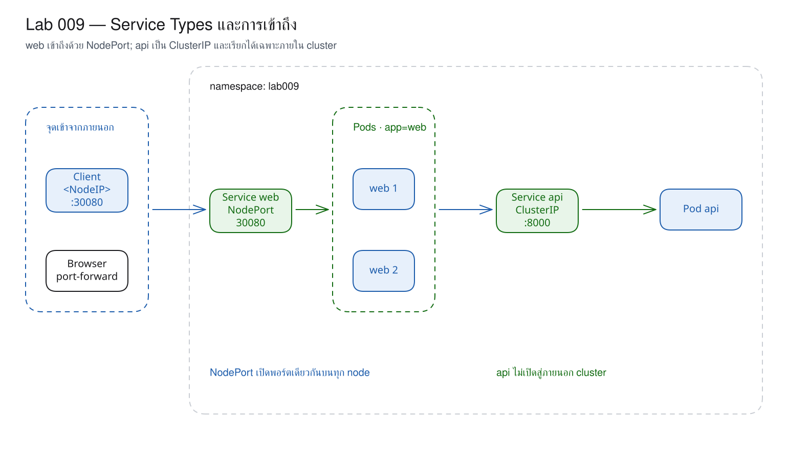
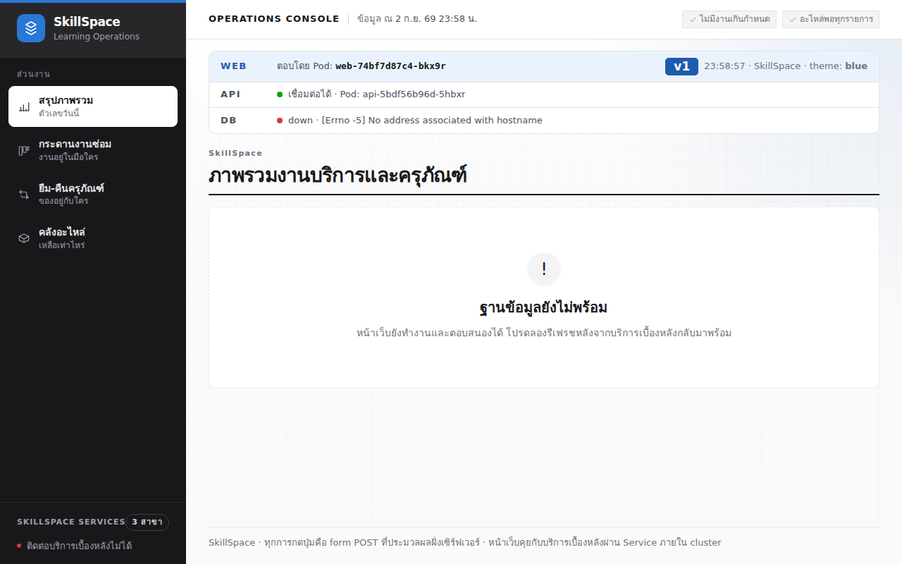

# LAB 9 — Service Types and Access : ความแตกต่างด้านขอบเขตการเข้าถึง

> โฟลเดอร์ `009-service-types-and-access` = LAB 9 ของชุด Kubernetes ครั้งที่ 2
> (ไฟล์ของปฏิบัติการนี้: `01-api.yaml`, `02-web-nodeport.yaml`, `03-nodeport-bad.yaml` และ `images/`)

> 💡 **แนวคิดหลักของปฏิบัติการนี้:** Service มีหลายชนิดซึ่งแตกต่างกันด้านขอบเขตของผู้ที่สามารถเข้าถึงได้ ไม่ใช่กลไกการทำงาน

## วัตถุประสงค์ของปฏิบัติการ

เมื่อสิ้นสุดปฏิบัติการ ผู้เรียนจะสามารถ:

1. อธิบายขอบเขตการเข้าถึงของ ClusterIP และ NodePort ได้
2. อธิบาย `port`, `targetPort` และ `nodePort` ว่าอยู่คนละชั้นอย่างไร
3. พิสูจน์ว่า NodePort เดียวกันเปิดบนทุก node แม้ Pod จะไม่ได้กระจายอยู่บน node ทุกเครื่อง
4. เลือกชนิด Service ให้ web และ api ตามผู้เรียกที่ต้องการได้

## แนวคิดและทฤษฎีที่เกี่ยวข้อง

ใน Compose มีการ publish `ports:` เฉพาะ web ส่วน api/db อยู่ใน network ภายใน; หลักการเดียวกันนี้ใช้กับ Kubernetes ดังตารางต่อไปนี้:

| ชนิด | ผู้เรียก | ปลายทางที่เปิด | ใช้กับ |
|---|---|---|---|
| ClusterIP | Pod ภายใน cluster | Service IP/DNS | api, db |
| NodePort | ภายนอกที่เข้าถึง Node IP ได้ | `<NodeIP>:30000-32767` | การทดสอบ/ห้องเรียน |
| LoadBalancer | ผู้ใช้ภายนอกผ่าน cloud LB | external IP | งาน cloud |
| Ingress | HTTP client ผ่านประตู L7 | host/path เดียว | web/API หลาย route |

NodePort ไม่ใช่ Service ที่มีกลไกแยกจาก ClusterIP แต่เป็น ClusterIP ที่เพิ่มช่องทางเข้าบนทุก node
ในปฏิบัติการนี้ api จึงจำกัดการเข้าถึงด้วย ClusterIP ส่วน web เปิด NodePort 30080

| field | อยู่ตรงไหน | หน้าที่ |
|---|---|---|
| `port: 3000` | Service | พอร์ตที่ client ใน cluster เรียก |
| `targetPort: http` | Pod | ส่งต่อไป named containerPort 3000 |
| `nodePort: 30080` | ทุก Node | พอร์ตที่ผู้เรียกนอก cluster ใช้ |

## ผลการเรียนรู้ที่คาดหวัง

- อ่าน TYPE และ `3000:30080/TCP` จาก Service จริงได้
- เรียก NodePort ผ่าน control-plane และ worker ทั้งสองได้
- สังเกตว่าการเชื่อมต่อ ClusterIP จากเครื่องเรียนหมดเวลา
- เรียก ClusterIP ผ่านชื่อ `api` จากภายใน web Pod ได้สำเร็จ
- วิเคราะห์ error ของ nodePort ที่อยู่นอกช่วงและพอร์ตซ้ำได้

## ภาพรวมของปฏิบัติการ

1. สร้าง api แบบ ClusterIP และ web แบบ NodePort
2. ส่ง request ไปยัง NodePort ที่ IP ของ kind nodes ทั้งสาม
3. เทียบ ClusterIP จากนอก/ใน cluster
4. เปิดหน้าเว็บผ่าน port-forward และอ่านสามพอร์ตใน YAML
5. apply Service ที่ไม่ถูกต้องสองรูปแบบแล้วแก้ไขให้ถูกต้อง



> **คำถามนำก่อนเริ่มปฏิบัติการ:** หาก web Pod อยู่บน worker2 เหตุใด request ที่เข้าสู่ NodePort ของ control-plane จึงยังสามารถไปถึง web ได้

## 0. การเตรียมสภาพแวดล้อมสำหรับปฏิบัติการ

เรียกใช้คำสั่งแรกบนเครื่องหลัก แล้วใช้ `docker exec` เพื่อเข้าสู่เครื่องเรียน; คำสั่งทั้งหมดหลังจากนั้นให้ป้อนในเครื่องเรียน เทอร์มินัลของเครื่องเรียนใช้ `localhost` พอร์ต 80 ส่วนเบราว์เซอร์บนเครื่องหลักใช้ `http://localhost:8080`

```bash
docker start devtools-k8s || docker run -d --name devtools-k8s --privileged --shm-size=1g --ulimit nofile=65536:65536 -p 2299:22 -p 8080:80 -p 8443:443 -p 3000:3000 -p 9090:9090 tuchsanai/devtools-k8s:2569_1
docker exec -it devtools-k8s bash
k8s-bootstrap
kubectl get nodes
docker exec devtools-control-plane crictl images | grep k8s-lab
```

> 📝 **คำอธิบาย:** `docker start` ใช้เครื่องเดิม · `|| docker run` สร้างเครื่องเมื่อยังไม่มี · `docker exec -it ... bash` เข้าสู่เครื่องเรียน · `k8s-bootstrap` สร้าง cluster และข้ามขั้นตอนโดยอัตโนมัติหากมีอยู่แล้ว · `get nodes` และ `crictl` ตรวจสอบ cluster/image

✅ **ผลลัพธ์ที่คาดหวัง (Expected output)** — node ทั้งสามมีสถานะ Ready และมี image อยู่ใน node (ตัดบางคอลัมน์; AGE และ image ID อาจแตกต่างกัน):

```text
NAME                     STATUS   ROLES           AGE   VERSION
devtools-control-plane   Ready    control-plane   24m   v1.36.4
devtools-worker          Ready    <none>          23m   v1.36.4
devtools-worker2         Ready    <none>          23m   v1.36.4
docker.io/library/k8s-lab-api  v1  682aa17deaef3  186MB
docker.io/library/k8s-lab-db   v1  901da7602fb40  300MB
docker.io/library/k8s-lab-web  v1  a389e8bc3c5ed  209MB
docker.io/library/k8s-lab-web  v2  65ea95c8496b6  209MB
…
```

หาก image ยังไม่อยู่ใน kind ให้ดำเนินการขั้น build/load ของปฏิบัติการ 001 หรือศึกษา README ระดับชุดก่อน

## 1. การดึงโค้ดของปฏิบัติการ (Clone)

```bash
mkdir -p ~/labwork && cd ~/labwork && git clone https://github.com/Tuchsanai/DevTools.git
cd ~/labwork/DevTools/05_kubernetes/02_Session2_Networking_Config_Storage/009-service-types-and-access
```

> 📝 **คำอธิบาย:** `mkdir -p` เตรียม workspace · `git clone` ดึงชุดเอกสารการเรียน · `cd` เข้าสู่ LAB 009 เพื่อใช้ manifest ตามลำดับ

✅ **ผลลัพธ์ที่คาดหวัง (Expected output)** — การ clone สำเร็จและสามารถเข้าสู่โฟลเดอร์ได้โดยไม่มี error:

```text
Cloning into 'DevTools'...
```

หาก clone ไว้แล้ว ให้ใช้ `git pull` ใน `~/labwork/DevTools` แล้วกลับเข้าสู่โฟลเดอร์นี้

## 2. การอ่าน YAML ของปฏิบัติการนี้

| ไฟล์ | kind | หน้าที่ในปฏิบัติการนี้ | แหล่งคำอธิบายโดยละเอียด |
|---|---|---|---|
| `01-api.yaml` | Deployment, Service | เปิด API ภายในด้วย ClusterIP | [Deployment](../YAML_Guide.md#deployment) · [Service](../YAML_Guide.md#service) |
| `02-web-nodeport.yaml` | Deployment, Service | เปิด web ด้วย NodePort 30080 | [Deployment](../YAML_Guide.md#deployment) · [Service](../YAML_Guide.md#service) |
| `03-nodeport-bad.yaml` | Service ×2 | จงใจใช้ nodePort ผิดช่วงและซ้ำ | ตาราง error ด้านล่าง |

ส่วน Service จริงจาก `02-web-nodeport.yaml`:

```yaml
spec:
  type: NodePort
  selector:
    app: web
  ports:
    - port: 3000
      targetPort: http
      nodePort: 30080
```

| field | ความหมาย | ถ้าเปลี่ยนค่านี้ |
|---|---|---|
| `type` | `ClusterIP` รับจากใน cluster; `NodePort` เพิ่มพอร์ตบนทุก Node | หากเว้นค่าไว้ ระบบจะใช้ค่าเริ่มต้นเป็น `ClusterIP` |
| `port` | พอร์ตของ Service | client ภายในต้องเรียกเลขใหม่ |
| `targetPort` | เลขหรือชื่อพอร์ตของ Pod | ต้องตรง `containerPort`/ชื่อ port ของ web |
| `nodePort` | พอร์ตภายนอก; ปกติ 30000–32767 | เว้นไว้ให้ระบบจัดสรร หรือระบุหมายเลขที่ยังไม่ถูกใช้งานภายในช่วง |

**ข้อผิดพลาดที่พบบ่อยในปฏิบัติการนี้:** runlog ของ `03-nodeport-bad.yaml` มีข้อความจริง `provided port is not in the valid range. The range of valid ports is 30000-32767` และ `provided port is already allocated` จึงต้องตรวจสอบเลขที่ `spec.ports[0].nodePort` ไม่ใช่แก้ไข `port`

ตรวจสอบ schema ได้ด้วย `kubectl explain service.spec.type` และ `kubectl explain service.spec.ports.nodePort`

## 3. การสร้าง ClusterIP และ NodePort

`01-api.yaml` ประกอบด้วย API Deployment และ ClusterIP; `02-web-nodeport.yaml` ประกอบด้วย web จำนวน 2 replicas และ NodePort 30080

```bash
kubectl create namespace lab009
kubectl apply -f 01-api.yaml -f 02-web-nodeport.yaml
kubectl wait -n lab009 --for=condition=available deployment/api deployment/web --timeout=120s
until kubectl exec -n lab009 deployment/web -- wget -qO- http://api:8000/health >/dev/null 2>&1; do sleep 1; done
kubectl get service -n lab009
kubectl get pods -n lab009 -o wide
```

> 📝 **คำอธิบาย:** namespace แยกปฏิบัติการ · `wait` รอสถานะ available · `until ... /health` รอให้ API process รับข้อมูลที่พอร์ต · `get service` เปรียบเทียบ TYPE/PORT(S) · `-o wide` ตรวจสอบ Node ที่ Pod ทำงานอยู่

✅ **ผลลัพธ์ที่คาดหวัง (Expected output)** — api เป็น ClusterIP, web เป็น NodePort และ Pod ทั้งสามมีสถานะ Running (ชื่อ/IP/Node/AGE อาจแตกต่างกัน):

```text
namespace/lab009 created
deployment.apps/api created
service/api created
deployment.apps/web created
service/web created
deployment.apps/api condition met
deployment.apps/web condition met
NAME   TYPE        CLUSTER-IP    EXTERNAL-IP   PORT(S)          AGE
api    ClusterIP   10.96.5.88    <none>        8000/TCP         1s
web    NodePort    10.96.53.54   <none>        3000:30080/TCP   1s
NAME                   READY   STATUS    RESTARTS   AGE   IP            NODE               NOMINATED NODE   READINESS GATES
api-5bdf56b96d-5hbxr   1/1     Running   0          1s    10.244.2.21   devtools-worker    <none>           <none>
web-74bf7d87c4-bkx9r   1/1     Running   0          1s    10.244.1.12   devtools-worker2   <none>           <none>
web-74bf7d87c4-nn5dv   1/1     Running   0          1s    10.244.2.22   devtools-worker    <none>           <none>
```

## 4. การพิสูจน์ว่า NodePort เปิดบนทุก Node

```bash
kubectl get nodes -o wide
for NODE_IP in $(kubectl get nodes -o jsonpath='{range .items[*]}{.status.addresses[?(@.type=="InternalIP")].address}{"\n"}{end}'); do
  printf "%s -> " "$NODE_IP"
  curl -s -H 'Connection: close' "http://$NODE_IP:30080/info" | jq -c '{pod}'
done
```

> 📝 **คำอธิบาย:** `get nodes -o wide` จับคู่ชื่อ node กับ InternalIP · `jsonpath` ดึง IP ของทุก node · `nodePort 30080` มีค่าเดียวกันบนทุก node · `Connection: close` เปิด connection ใหม่ · `jq -c '{pod}'` คงรูป JSON บรรทัดเดียวและระบุ Pod ที่ตอบ request

✅ **ผลลัพธ์ที่คาดหวัง (Expected output)** — IP ทั้งสามตอบสนองได้ และ request ไปถึง web จำนวนสอง Pod ได้แม้ control-plane ไม่มี web Pod (IP/ชื่อ Pod อาจแตกต่างกัน):

```text
NAME                     STATUS   ROLES           AGE     VERSION   INTERNAL-IP   EXTERNAL-IP   OS-IMAGE                       KERNEL-VERSION                             CONTAINER-RUNTIME
devtools-control-plane   Ready    control-plane   3m9s    v1.36.4   172.18.0.3    <none>        Debian GNU/Linux 13 (trixie)   6.6.87.2-microsoft-standard-WSL2 (amd64)   containerd://2.3.4
devtools-worker          Ready    <none>          2m59s   v1.36.4   172.18.0.4    <none>        Debian GNU/Linux 13 (trixie)   6.6.87.2-microsoft-standard-WSL2 (amd64)   containerd://2.3.4
devtools-worker2         Ready    <none>          2m59s   v1.36.4   172.18.0.2    <none>        Debian GNU/Linux 13 (trixie)   6.6.87.2-microsoft-standard-WSL2 (amd64)   containerd://2.3.4
172.18.0.3 -> {"pod":"web-74bf7d87c4-pc6pn"}
172.18.0.4 -> {"pod":"web-74bf7d87c4-pc6pn"}
172.18.0.2 -> {"pod":"web-74bf7d87c4-7qksk"}
```

NodePort เปิดที่ Node IP แต่ kind nodes อยู่ภายใน Docker อีกชั้นหนึ่ง ผู้เรียนจึงใช้ port-forward ในหัวข้อ 6 เพื่อเข้าถึงบริการจาก browser ตาม environment ของชุดการเรียน

## 5. การพิสูจน์ขอบเขตของ ClusterIP

ดำเนินการจาก shell ของเครื่องเรียนซึ่งอยู่นอก network namespace ของ kind nodes:

```bash
API_CLUSTER_IP=$(kubectl get service api -n lab009 -o jsonpath='{.spec.clusterIP}')
curl -sS -m 3 "http://$API_CLUSTER_IP:8000/health"
echo "curl exit code=$?"
kubectl exec -n lab009 deployment/web -- wget -qO- http://api:8000/health
```

> 📝 **คำอธิบาย:** อ่าน ClusterIP จริง · `-m 3` จำกัดเวลารอ · exit 28 คือ timeout จากภายนอก cluster · `kubectl exec` เปลี่ยนมุมมองของผู้เรียกเป็น Pod ภายใน · `api` คือ Service DNS

✅ **ผลลัพธ์ที่คาดหวัง (Expected output)** — การเรียกจากเครื่องเรียนเกิด timeout แต่การเรียกจาก web Pod ได้ JSON 200 (ชื่อ API Pod อาจแตกต่างกัน):

```text
curl: (28) Connection timed out after 3002 milliseconds
curl: (28) Connection timed out after 3002 milliseconds
curl: (28) Connection timed out after 3002 milliseconds
curl: (28) Connection timed out after 3002 milliseconds
curl: (28) Connection timed out after 3002 milliseconds
curl: (28) Connection timed out after 3001 milliseconds
curl exit code=28
{"status":"ok","pod":"api-5bdf56b96d-5hbxr","version":"v1"}
```

เครื่องเรียนมี curl retry policy จึงแสดง timeout ซ้ำ แต่ผลลัพธ์สุดท้ายยังคงเป็น exit code 28

## 6. การเปิดหน้าเว็บผ่าน port-forward

เปิดหน้าต่างใหม่บนเครื่องหลักแล้วเรียก `docker exec -it devtools-k8s bash` อีกครั้ง จากนั้นเรียกใช้คำสั่งนี้ในเครื่องเรียนหน้าต่างที่สองและปล่อยให้ process ทำงานต่อไป; ใช้หน้าต่างแรกสำหรับหัวข้อถัดไป:

```bash
kubectl port-forward -n lab009 service/web 3000:3000 --address 0.0.0.0
```

> 📝 **คำอธิบาย:** `service/web` กำหนดให้ kubectl เลือก Pod หลัง Service · `3000:3000` จับคู่พอร์ตบนเครื่องกับพอร์ตของ Service · `--address 0.0.0.0` อนุญาตให้ browser ภายนอกเครื่องเรียนเข้าถึงได้ · กดปุ่ม `Ctrl+C` เพื่อยุติ process

✅ **ผลลัพธ์ที่คาดหวัง (Expected output)** — tunnel รับข้อมูลที่ port 3000 และแสดง Handling connection เมื่อเปิด `http://localhost:3000`:

```text
Forwarding from 0.0.0.0:3000 -> 3000
Handling connection for 3000
```



## 7. การอ่าน port, targetPort และ nodePort

```bash
kubectl get service web -n lab009 -o yaml | grep -A4 'ports:'
kubectl logs -n lab009 deployment/api --tail=8
```

> 📝 **คำอธิบาย:** YAML แสดง mapping ครบสามชั้น · `grep -A4` จำกัด output · logs ยืนยันว่า `/health` จาก web ไปถึง API ภายในผ่าน ClusterIP

✅ **ผลลัพธ์ที่คาดหวัง (Expected output)** — port 3000 ส่งไปยัง named port http และ NodePort 30080; `/ready` 503 เป็นผลปกติเนื่องจากปฏิบัติการนี้ยังไม่มี db ก่อนที่ log จะแสดง `/health` 200:

```text
  ports:
  - nodePort: 30080
    port: 3000
    protocol: TCP
    targetPort: http
[api] GET /ready 503 3ms
INFO:     10.244.2.22:40524 - "GET /ready HTTP/1.1" 503 Service Unavailable
[api] GET /ready 503 3ms
INFO:     10.244.2.22:40524 - "GET /ready HTTP/1.1" 503 Service Unavailable
[api] GET /ready 503 2ms
INFO:     10.244.1.12:43942 - "GET /ready HTTP/1.1" 503 Service Unavailable
[api] GET /health 200 1ms
INFO:     10.244.1.12:47780 - "GET /health HTTP/1.1" 200 OK
```

## 8. การทดลองจำลองความล้มเหลว — nodePort อยู่นอกช่วงและซ้ำ

`03-nodeport-bad.yaml` มี Service ที่ไม่ถูกต้องสอง document เพื่อให้ API server ตรวจสอบพร้อมกัน:

```bash
kubectl apply -f 03-nodeport-bad.yaml
kubectl get service -n lab009
```

> 📝 **คำอธิบาย:** Service แรกใช้ 3000 ซึ่งอยู่นอกช่วง · Service ที่สองใช้ 30080 ซ้ำกับ web · `get service` ยืนยันว่า object ที่ไม่ถูกต้องไม่ได้ถูกสร้างค้างไว้

✅ **ผลลัพธ์ที่คาดหวัง (Expected output)** — API server ปฏิเสธทั้งสองกรณี และเหลือเฉพาะ api/web เดิม:

```text
Error from server (Invalid): error when creating "03-nodeport-bad.yaml": Service "web-bad-range" is invalid: spec.ports[0].nodePort: Invalid value: 3000: provided port is not in the valid range. The range of valid ports is 30000-32767
Error from server (Invalid): error when creating "03-nodeport-bad.yaml": Service "web-duplicate" is invalid: spec.ports[0].nodePort: Invalid value: 30080: provided port is already allocated
NAME   TYPE        CLUSTER-IP    EXTERNAL-IP   PORT(S)          AGE
api    ClusterIP   10.96.5.88    <none>        8000/TCP         107s
web    NodePort    10.96.53.54   <none>        3000:30080/TCP   107s
```

ไฟล์ที่ไม่ถูกต้องไม่เปลี่ยนสภาพที่ต้องการ (desired state) เดิม ให้แก้ไขโดย apply ไฟล์ที่ถูกต้อง:

```bash
kubectl apply -f 02-web-nodeport.yaml
kubectl get service web -n lab009
```

> 📝 **คำอธิบาย:** apply manifest ที่ถูกต้องซ้ำเพื่อยืนยัน idempotency · `get` ตรวจสอบว่า NodePort เดิมยังคงอยู่

✅ **ผลลัพธ์ที่คาดหวัง (Expected output)** — Deployment/Service มีสถานะ unchanged และ 30080 ยังคงใช้งานได้:

```text
deployment.apps/web unchanged
service/web unchanged
NAME   TYPE       CLUSTER-IP    EXTERNAL-IP   PORT(S)          AGE
web    NodePort   10.96.53.54   <none>        3000:30080/TCP   107s
```

## 9. แบบฝึกหัด (Exercise)

ออกแบบตาราง Service สำหรับ `web`, `api`, `db` โดยเลือก TYPE และผู้เรียก เกณฑ์ความสำเร็จคือ web เปิดให้ผู้ใช้เข้าถึงได้ แต่ api/db ไม่มี NodePort และสามารถอธิบายเหตุผลด้าน attack surface ได้

## วิธีตรวจสอบผลการทดลอง

```bash
kubectl get pods,service -n lab009 -o wide
kubectl exec -n lab009 deployment/web -- wget -qO- http://api:8000/health
NODE_IP=$(kubectl get node devtools-control-plane -o jsonpath='{.status.addresses[0].address}')
curl -s -H 'Connection: close' "http://$NODE_IP:30080/info" | jq -c '{pod,api}'
```

> 📝 **คำอธิบาย:** ตรวจสอบ resource และตำแหน่ง Pod · ตรวจสอบ api จากภายใน · ดึง InternalIP ของ control-plane จาก object จริง แล้วตรวจสอบ NodePort โดยไม่ hard-code IP

✅ **ผลลัพธ์ที่คาดหวัง (Expected output)** — web Pod จำนวนสองรายการและ API Pod จำนวนหนึ่งรายการพร้อมใช้งาน internal health ตอบ ok และ NodePort ตอบชื่อ Pod จริง (ตัดบางคอลัมน์; ค่า IP/Pod/AGE อาจแตกต่างกัน):

```text
…
api-5bdf56b96d-5hbxr   1/1   Running   10.244.2.21   devtools-worker
web-74bf7d87c4-bkx9r   1/1   Running   10.244.1.12   devtools-worker2
web-74bf7d87c4-nn5dv   1/1   Running   10.244.2.22   devtools-worker
api   ClusterIP   10.96.5.88    8000/TCP
web   NodePort    10.96.53.54   3000:30080/TCP
{"status":"ok","pod":"api-5bdf56b96d-5hbxr","version":"v1"}
{"pod":"web-74bf7d87c4-nn5dv","api":{"configured":true,"reachable":true,"pod":"api-5bdf56b96d-5hbxr"}}
```

## ปัญหาที่พบบ่อยและแนวทางแก้ไข

| อาการ | สาเหตุที่พบบ่อย | แนวทางแก้ไข |
|---|---|---|
| ClusterIP จากเครื่องเรียน timeout | ClusterIP ออกแบบให้ใช้ใน cluster | ทดสอบจาก Pod ด้วย `kubectl exec` |
| ไม่สามารถ apply NodePort ได้ | อยู่นอกช่วงหรือพอร์ตถูกจอง | ใช้ 30000–32767 และตรวจสอบ Service อื่น |
| เครื่องหลักไม่สามารถเข้าถึง `<NodeIP>:30080` ได้ใน kind | node ซ้อนอยู่ใน Docker | ใช้ port-forward ตามหัวข้อ 6 |
| port-forward รายงาน address in use | process เดิมยังใช้งาน port 3000 | หยุด process เดิมด้วย Ctrl+C หรือ kill ก่อนเริ่มใหม่ |

## การล้างทรัพยากร (Cleanup) และการพิสูจน์การทำซ้ำจากสถานะเริ่มต้น (Clean Re-run)

กลับไปยังหน้าต่างที่สอง กด `Ctrl+C` เพื่อหยุด port-forward แล้วกลับมาเรียกใช้คำสั่งต่อในหน้าต่างแรก:

```bash
kubectl delete namespace lab009
kubectl wait --for=delete namespace/lab009 --timeout=120s
kubectl create namespace lab009
kubectl apply -f 01-api.yaml -f 02-web-nodeport.yaml
kubectl wait -n lab009 --for=condition=available deployment/api deployment/web --timeout=120s
kubectl get deploy,pods,service -n lab009
NODE_IP=$(kubectl get node devtools-control-plane -o jsonpath='{.status.addresses[0].address}')
curl -s -H 'Connection: close' "http://$NODE_IP:30080/info" | jq -c '{pod,api}'
```

> 📝 **คำอธิบาย:** ลบ namespace และรอให้ลบเสร็จ · สร้างจากสองไฟล์หลัก · รอ Deployment · ตรวจสอบ NodePort จาก control-plane IP ซึ่งเปลี่ยนแปลงได้ตาม cluster

✅ **ผลลัพธ์ที่คาดหวัง (Expected output)** — Clean Re-run สร้าง API จำนวน 1, web จำนวน 2 และ NodePort ตอบสนองพร้อม API ที่มีสถานะ reachable (IP/ชื่อ/AGE อาจแตกต่างกัน; ตัดบางแถว/บางคอลัมน์):

```text
…
namespace "lab009" deleted
namespace/lab009 created
deployment.apps/api created
service/api created
deployment.apps/web created
service/web created
deployment.apps/api condition met
deployment.apps/web condition met
deployment.apps/api   1/1   1   1   4s
deployment.apps/web   2/2   2   2   4s
service/api   ClusterIP   10.96.53.207   8000/TCP
service/web   NodePort    10.96.14.160   3000:30080/TCP
{"pod":"web-74bf7d87c4-lcqdt","api":{"configured":true,"reachable":true,"pod":"api-5bdf56b96d-l8hdh"}}
```

```bash
kubectl delete namespace lab009
kubectl wait --for=delete namespace/lab009 --timeout=120s
kubectl get all -n lab009
```

> 📝 **คำอธิบาย:** ลบรอบสุดท้าย · `get all` พิสูจน์ว่า namespace ไม่มี resource; tunnel ถูกหยุดด้วย `Ctrl+C` ในขั้นตอนก่อนหน้าแล้ว

✅ **ผลลัพธ์ที่คาดหวัง (Expected output)** — สิ้นสุดโดยไม่มี resource ใน namespace:

```text
namespace "lab009" deleted
No resources found in lab009 namespace.
```

## สรุปคำสั่งของปฏิบัติการนี้

| คำสั่ง | ความหมาย |
|---|---|
| `kubectl get service` | ตรวจสอบ TYPE, ClusterIP และ PORT(S) |
| `curl <NodeIP>:30080` | เข้าถึง NodePort จากนอก cluster |
| `kubectl exec ... wget http://api:8000` | เข้าถึง ClusterIP จากใน cluster |
| `kubectl port-forward service/web` | เปิด tunnel สำหรับเครื่องเรียน |

## สรุปสิ่งที่ได้เรียนรู้

ClusterIP และ NodePort ส่งงานไป Pod ด้วย selector เหมือนกัน แต่แตกต่างกันในด้านขอบเขตของผู้เรียก: ภายในเท่านั้นหรือผ่านทุก Node IP

- api ที่ไม่มีผู้ใช้ภายนอกเรียกควรเป็น ClusterIP
- NodePort เพิ่มทางเข้า แต่ไม่ได้บังคับว่า Pod ต้องอยู่ Node ที่รับ request
- `port`, `targetPort`, `nodePort` อยู่คนละช่วงของเส้นทาง

**ภาพรวมที่ควรจดจำ:** ClusterIP เปรียบเสมือนประตูภายใน ส่วน NodePort เปรียบเสมือนการเพิ่มจุดเรียกหมายเลขเดียวกันไว้ที่ด้านหน้าของทุก node

🧭 การเชื่อมโยงสู่ปฏิบัติการถัดไป: ปฏิบัติการ 010 จะแยก config ของหน้าเว็บออกจาก image โดยใช้ ConfigMap

## ❓ คำถามทบทวนก่อนจบปฏิบัติการ

1. **ClusterIP กับ NodePort แตกต่างกันอย่างไร** — NodePort เพิ่มพอร์ตบนทุก node ส่วน ClusterIP ใช้เรียกภายใน cluster
2. **ควรใช้แต่ละชนิดในกรณีใด** — api/db ใช้ ClusterIP; NodePort เหมาะกับการทดลอง ส่วนระบบจริงมักใช้ LoadBalancer/Ingress
3. **เหตุใด NodePort จึงจำกัดช่วง 30000–32767** — เพื่อแยกช่วงพอร์ตบริการออกจากพอร์ตระบบและสงวนเลขเดียวกันบนทุก node

## ✅ รายการตรวจสอบก่อนจบปฏิบัติการ

- [ ] สามารถจำแนก ClusterIP กับ NodePort จาก `kubectl get svc` ได้
- [ ] สามารถส่ง request ผ่าน Node IP ทั้งสามไปยัง NodePort ได้
- [ ] ยืนยันแล้วว่าการเชื่อมต่อ ClusterIP จากภายนอกหมดเวลา แต่การเชื่อมต่อจาก Pod สำเร็จ
- [ ] สามารถวิเคราะห์ error จาก nodePort ที่อยู่นอกช่วงหรือซ้ำกันได้
- [ ] Clean Re-run สำเร็จและไม่เหลือ port-forward หรือ namespace `lab009`

*ผลลัพธ์ที่คาดหวัง (expected output) และภาพหน้าจอในเอกสารนี้ได้มาจากการดำเนินการจริงบน tuchsanai/devtools-k8s:2569_1 (kind v0.33.0 · Kubernetes v1.36.4 · kubectl v1.37.0) เมื่อ 2 กันยายน 2026*
