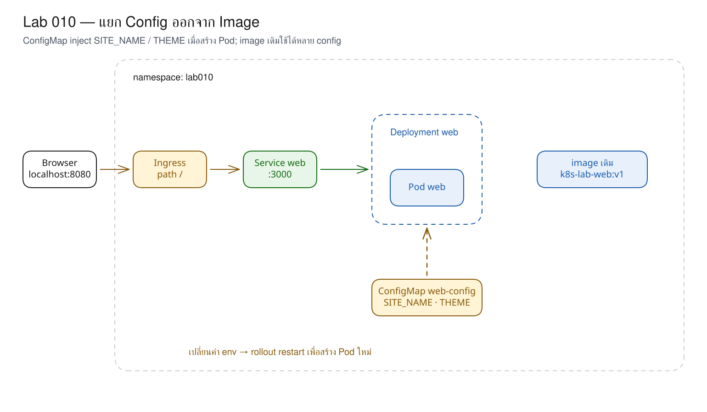
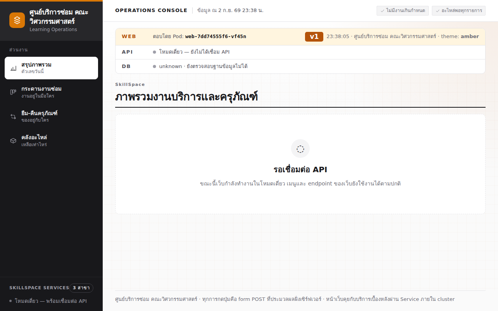
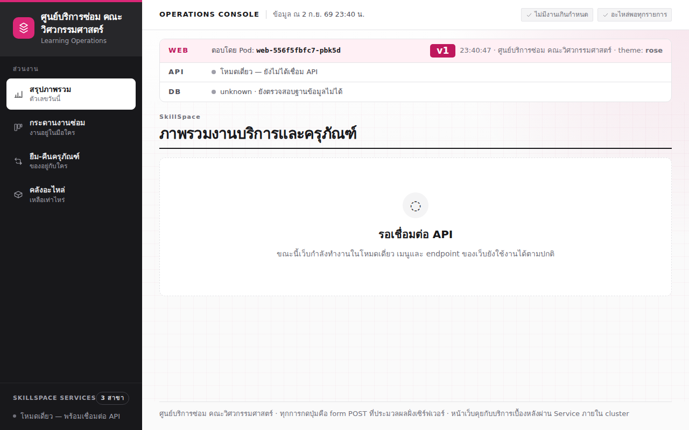

# LAB 10 — ConfigMap : การเปลี่ยนพฤติกรรมโดยไม่ build image ใหม่

> โฟลเดอร์ `010-configmap-separate-config` = LAB 10 ของชุด Kubernetes ครั้งที่ 2
> (ไฟล์ของปฏิบัติการนี้: `01-web.yaml`, `02-configmap.yaml`, `03-web-envfrom.yaml`, `04-configmap-rose.yaml` และ `images/`)

> 💡 **แนวคิดหลักของปฏิบัติการนี้:** ไม่ควรบันทึก config ไว้ใน image เพื่อให้ build เพียงครั้งเดียวและเปลี่ยนพฤติกรรมได้ตามสภาพแวดล้อมที่ deploy

## วัตถุประสงค์ของปฏิบัติการ

เมื่อสิ้นสุดปฏิบัติการ ผู้เรียนจะสามารถ:

1. อธิบายเหตุผลที่ไม่ควรกำหนดชื่อระบบ สี และ URL ไว้ใน image
2. อธิบายหน้าที่ของ ConfigMap และวิธีส่งค่าเข้า Pod ผ่าน environment variable
3. พิสูจน์ได้ว่า environment variable อ่านค่า ConfigMap ตอนสร้าง container เท่านั้น
4. วิเคราะห์อาการ `CreateContainerConfigError` และแก้ไขชื่อ ConfigMap ที่อ้างอิงไม่ถูกต้องได้

## แนวคิดและทฤษฎีที่เกี่ยวข้อง

image อาจเปรียบได้กับกล่องแอปพลิเคชันที่ปิดผนึกแล้ว หากชื่อหน่วยงานหรือสีธีมอยู่ภายใน ทุกหน่วยงานต้อง build กล่องใหม่แม้ใช้โค้ดเดียวกันทั้งหมด ConfigMap แยกค่าที่ไม่ลับออกเป็น object ของ Kubernetes จึงสามารถนำ image เดิมไปใช้ในหลายสภาพแวดล้อมได้

| สิ่งที่เปรียบเทียบ | ฝังใน image | ConfigMap |
|---|---|---|
| เปลี่ยนชื่อ/สี | ต้อง build image ใหม่ | แก้ไข object แล้วสร้าง Pod ใหม่ |
| image ระหว่าง dev/prod | มีโอกาสคนละชุด | ใช้ digest/tag เดียวกันได้ |
| เหมาะกับ | โค้ดและ default | config ที่ไม่ลับ |
| เทียบกับ Compose | ค่าใน Dockerfile | `environment:` / `env_file` |

ConfigMap ไม่ใช่พื้นที่บันทึกรหัสผ่าน เนื่องจากค่าจะถูกอ่านเป็นข้อความปกติ ประเด็นเกี่ยวกับข้อมูลลับจะได้รับการพิสูจน์ใน LAB 11

## ผลการเรียนรู้ที่คาดหวัง

- สังเกตหน้าเว็บใช้ default `SkillSpace` และ theme `blue` จาก image ได้
- ส่ง key ทั้งหมดด้วย `envFrom.configMapRef` ได้
- สังเกตชื่อระบบและธีม amber โดยไม่ build image ใหม่ได้
- พิสูจน์ได้ว่าเมื่อแก้ไข ConfigMap เป็น rose แล้ว Pod เดิมยังคงเป็น amber
- วิเคราะห์ Event ที่ระบุ `configmap "web-confg" not found` ได้

## ภาพรวมของปฏิบัติการ

1. เปิดเว็บด้วย config เริ่มต้นจาก image
2. สร้าง ConfigMap สำหรับชื่อระบบและ theme
3. เชื่อมโยง ConfigMap กับ Deployment แล้วสังเกตหน้าเว็บธีม amber
4. เปลี่ยนค่าเป็น rose และพิสูจน์ว่ายังไม่เกิดผลทันที
5. restart Deployment จากนั้นกำหนดชื่ออ้างอิงที่ไม่ถูกต้อง แก้ไข และยืนยันผลด้วย Clean Re-run



> **คำถามนำก่อนเริ่มปฏิบัติการ:** หากคณะสามแห่งใช้โค้ดชุดเดียวกันแต่มีชื่อและสีแตกต่างกัน ควรสร้าง image แยกเป็นสามชุดหรือไม่

## 0. การเตรียมสภาพแวดล้อมสำหรับปฏิบัติการ

เรียกใช้คำสั่งแรกบนเครื่องหลัก แล้วใช้ `docker exec` เพื่อเข้าสู่เครื่องเรียน; คำสั่งทั้งหมดหลังจากนั้นให้ป้อนในเครื่องเรียน เทอร์มินัลของเครื่องเรียนใช้ `localhost` พอร์ต 80 ส่วนเบราว์เซอร์บนเครื่องหลักใช้ `http://localhost:8080`

```bash
docker start devtools-k8s || docker run -d --name devtools-k8s --privileged --shm-size=1g --ulimit nofile=65536:65536 -p 2299:22 -p 8080:80 -p 8443:443 -p 3000:3000 -p 9090:9090 tuchsanai/devtools-k8s:2569_1
docker exec -it devtools-k8s bash
k8s-bootstrap
kubectl get nodes
docker exec devtools-control-plane crictl images | grep k8s-lab
```

> 📝 **คำอธิบาย:** `docker start` ใช้เครื่องเดิม · `|| docker run` สร้างเครื่องเมื่อยังไม่มี · `docker exec -it ... bash` เข้าสู่เครื่องเรียน · `k8s-bootstrap` สร้าง cluster และข้ามขั้นตอนโดยอัตโนมัติหากมีอยู่แล้ว · สองคำสั่งสุดท้ายตรวจสอบ node และ image ใน kind

✅ **ผลลัพธ์ที่คาดหวัง (Expected output)** — node จำนวน 3 รายการมีสถานะ `Ready` และพบ image จำนวน 4 รายการ (ตัดบางคอลัมน์; AGE/hash อาจแตกต่างกัน):

```text
NAME                     STATUS   ROLES           AGE   VERSION
devtools-control-plane   Ready    control-plane   12m   v1.36.4
devtools-worker          Ready    <none>          12m   v1.36.4
devtools-worker2         Ready    <none>          12m   v1.36.4
docker.io/library/k8s-lab-api   v1   37b98a526d09b   186MB
docker.io/library/k8s-lab-db    v1   12de2be925d8a   300MB
docker.io/library/k8s-lab-web   v1   f46e8e22f91a6   209MB
docker.io/library/k8s-lab-web   v2   fccf050046905   209MB
…
```

หากยังไม่พบ image ให้กลับไปดำเนินการขั้น build/load ใน LAB 001 หรือศึกษา README ระดับชุดก่อน

## 1. การดึงโค้ดของปฏิบัติการ (Clone)
```bash
mkdir -p ~/labwork && cd ~/labwork && git clone https://github.com/Tuchsanai/DevTools.git
cd ~/labwork/DevTools/05_kubernetes/02_Session2_Networking_Config_Storage/010-configmap-separate-config
```
> 📝 **คำอธิบาย:** `mkdir -p` สร้าง workspace ที่ใช้ซ้ำได้ · `git clone` ดึง repository · `cd` เข้าสู่โฟลเดอร์ LAB 10 ซึ่งมี manifest พร้อมใช้งาน

✅ **ผลลัพธ์ที่คาดหวัง (Expected output)** — การ clone เริ่มต้นสำเร็จและ path สุดท้ายตรงกับปฏิบัติการ:
```text
Cloning into 'DevTools'...
/root/labwork/DevTools/05_kubernetes/02_Session2_Networking_Config_Storage/010-configmap-separate-config
```
หาก clone ไว้แล้ว ไม่จำเป็นต้อง clone ซ้ำ ให้เข้าสู่ repository เดิมแล้วใช้ `git pull` ก่อนเข้าสู่พาธข้างต้น

## 2. การอ่าน YAML ของปฏิบัติการนี้

| ไฟล์ | kind | หน้าที่ในปฏิบัติการนี้ | แหล่งคำอธิบายโดยละเอียด |
|---|---|---|---|
| `01-web.yaml` | Deployment, Service, Ingress | เปิด web ด้วยค่า default จาก image | [Deployment](../YAML_Guide.md#deployment) · [Service](../YAML_Guide.md#service) · [Ingress](../YAML_Guide.md#ingress) |
| `02-configmap.yaml` | ConfigMap | บันทึกชื่อระบบและ theme ภายนอก image | [ConfigMap](../YAML_Guide.md#configmap) |
| `03-web-envfrom.yaml` | Deployment | นำทุก key เข้า environment | [Deployment](../YAML_Guide.md#deployment) · [ConfigMap](../YAML_Guide.md#configmap) |
| `04-configmap-rose.yaml` | ConfigMap | เปลี่ยน `THEME` เป็น `rose` | [ConfigMap](../YAML_Guide.md#configmap) |

ค่าจริงจาก `02-configmap.yaml`:

```yaml
data:
  SITE_NAME: "ศูนย์บริการซ่อม คณะวิศวกรรมศาสตร์"
  THEME: amber
```

จุดอ้าง ConfigMap จริงจาก `03-web-envfrom.yaml`:

```yaml
envFrom:
  - configMapRef:
      name: web-config
```

| field | ความหมาย | ถ้าเปลี่ยนค่านี้ |
|---|---|---|
| `data` | map ที่ค่าทุกรายการต้องเป็น string | Pod ใหม่จะได้รับค่าใหม่; env ของ Pod เดิมไม่เปลี่ยนแปลง |
| `envFrom.configMapRef.name` | นำทุก key จาก ConfigMap ชื่อนี้เข้า env | สะกดชื่อผิดแล้ว Container ใหม่เริ่มไม่ได้ |
| `configMapKeyRef` | เลือกเพียง key เดียวและตั้งชื่อ env ใหม่ได้ | กลไกนี้ไม่มีใน YAML ของ LAB 010 จึงไม่สร้าง snippet เพิ่มเติม |
| ConfigMap volume | mount key เป็นไฟล์และอัปเดตไฟล์ได้ภายหลัง | ไม่มีใน YAML นี้; process ต้อง reload ไฟล์เอง |

**ข้อผิดพลาดที่พบบ่อยในปฏิบัติการนี้:** runlog บันทึกสถานะจริง `CreateContainerConfigError` และ Event `Error: configmap "web-confg" not found` เมื่อชื่อใน `configMapRef` ไม่ถูกต้อง ให้ใช้ `kubectl describe pod` เพื่อระบุ ref ที่ไม่พบ

ตรวจสอบ schema ได้ด้วย `kubectl explain configmap.data` และ `kubectl explain deployment.spec.template.spec.containers.envFrom.configMapRef`

## 3. การเปิดหน้าเว็บด้วยค่า default จาก image

ไฟล์ `01-web.yaml` มี Deployment, Service และ Ingress แบบ path-only; Service หา Pod ด้วย label `app: web` และ Ingress ส่ง `/` ไปพอร์ต 3000
```bash
kubectl create namespace lab010
kubectl apply -f 01-web.yaml
kubectl wait -n lab010 --for=condition=available deployment/web --timeout=120s
until curl --retry 0 -sf http://localhost/info >/dev/null; do sleep 1; done
```
> 📝 **คำอธิบาย:** `create namespace` แยก object ของปฏิบัติการ · `apply -f` ส่งสภาพที่ต้องการ (desired state) จากไฟล์ · `--for=condition=available` รอจน Deployment ใช้งานได้ · `--timeout` จำกัดเวลารอ

✅ **ผลลัพธ์ที่คาดหวัง (Expected output)** — namespace และประตูเว็บถูกสร้าง จากนั้น Deployment มีสถานะ available:
```text
namespace/lab010 created
deployment.apps/web created
service/web created
ingress.networking.k8s.io/web created
deployment.apps/web condition met
```
ตรวจสอบค่าที่ container ได้รับและค่าที่หน้าเว็บตอบ:
```bash
kubectl exec -n lab010 deploy/web -- sh -c "env | grep -E 'SITE_NAME|THEME' || true"
curl -s http://localhost/info | jq -c '{site_name,theme,pod,version}'
```
> 📝 **คำอธิบาย:** `exec` เรียกใช้งานภายใน Pod ของ Deployment · `grep -E` ค้นหาหลายชื่อ · `|| true` อนุญาตให้ดำเนินการต่อเมื่อไม่พบตัวแปร · `curl /info` อ่านหลักฐานจากแอปพลิเคชันจริง · `jq` เลือก field สำคัญ

✅ **ผลลัพธ์ที่คาดหวัง (Expected output)** — ยังไม่มี `SITE_NAME`/`THEME` จากภายนอก จึงใช้ default blue; ชื่อ Pod อาจแตกต่างกัน:
```text
DEFAULT_THEME=blue
{"site_name":"SkillSpace","theme":"blue","pod":"web-65665dddc4-4k49k","version":"v1"}
```

## 4. การสร้าง ConfigMap สำหรับค่าที่ไม่ลับ

หัวใจของ `02-configmap.yaml` คือ:
```yaml
kind: ConfigMap
metadata:
  name: web-config
data:
  SITE_NAME: "ศูนย์บริการซ่อม คณะวิศวกรรมศาสตร์"
  THEME: amber
```
`metadata.name` คือชื่อที่ Deployment จะอ้าง · `data` เป็นคู่ key/value แบบข้อความ · ค่านี้ไม่ใช่ข้อมูลลับ
```bash
kubectl apply -f 02-configmap.yaml
kubectl get configmap web-config -n lab010 -o yaml
```
> 📝 **คำอธิบาย:** `apply` สร้าง object · `get configmap` อ่านค่ากลับจาก API server · `-o yaml` แสดงทั้ง data และ metadata

✅ **ผลลัพธ์ที่คาดหวัง (Expected output)** — ปรากฏ key จำนวนสองรายการที่ส่งเข้าสู่ cluster (ตัดบางแถวจาก metadata):
```text
configmap/web-config created
…
data:
  SITE_NAME: ศูนย์บริการซ่อม คณะวิศวกรรมศาสตร์
  THEME: amber
```

## 5. การส่ง ConfigMap เข้า container ด้วย envFrom

ส่วนสำคัญของ `03-web-envfrom.yaml` คือ:
```yaml
envFrom:
  - configMapRef:
      name: web-config
```
`envFrom` นำทุก key เข้าเป็น environment variable ส่วน `configMapRef.name` ต้องตรงกับ object ที่สร้างไว้
```bash
kubectl apply -f 03-web-envfrom.yaml
kubectl rollout status -n lab010 deployment/web --timeout=120s
until curl --retry 0 -sf http://localhost/info >/dev/null; do sleep 1; done
kubectl exec -n lab010 deploy/web -- sh -c "env | grep -E 'SITE_NAME|THEME' | sort"
```
> 📝 **คำอธิบาย:** การแก้ไข Pod template ทำให้ Deployment rollout Pod ใหม่ · `rollout status` รอการแทนที่ · `sort` จัดผลลัพธ์ให้ง่ายต่อการเปรียบเทียบ

✅ **ผลลัพธ์ที่คาดหวัง (Expected output)** — Pod ใหม่ได้รับชื่อระบบและค่า amber:
```text
deployment.apps/web configured
deployment "web" successfully rolled out
DEFAULT_THEME=blue
SITE_NAME=ศูนย์บริการซ่อม คณะวิศวกรรมศาสตร์
THEME=amber
```



## 6. การเปลี่ยน ConfigMap และการสังเกตว่า Pod เดิมยังไม่เปลี่ยนแปลง
```bash
kubectl apply -f 04-configmap-rose.yaml
kubectl get configmap web-config -n lab010 -o jsonpath='{.data.THEME}{"\n"}'
curl -s http://localhost/info | jq -c '{site_name,theme,pod}'
```
> 📝 **คำอธิบาย:** ไฟล์ใหม่กำหนด `THEME=rose` · `jsonpath` อ่านค่าจาก ConfigMap โดยตรง · `/info` อ่านค่าที่ process ปัจจุบันใช้งานจริง

✅ **ผลลัพธ์ที่คาดหวัง (Expected output)** — ConfigMap มีค่า rose แต่ Pod เดิมยังตอบค่า amber:
```text
configmap/web-config configured
rose
{"site_name":"ศูนย์บริการซ่อม คณะวิศวกรรมศาสตร์","theme":"amber","pod":"web-7dd74555f6-vf45n"}
```
environment variable ถูกสร้างตอน container เริ่มทำงาน และจะไม่อัปเดตตาม ConfigMap แบบทันที

## 7. การ restart เพื่อให้ Pod ใหม่อ่านค่า rose
```bash
kubectl rollout restart -n lab010 deployment/web
kubectl rollout status -n lab010 deployment/web --timeout=120s
until curl --retry 0 -sf http://localhost/info >/dev/null; do sleep 1; done
curl -s --max-time 5 http://localhost/info | jq -c '{site_name,theme,pod}'
```
> 📝 **คำอธิบาย:** `rollout restart` เปลี่ยน annotation ใน Pod template · Deployment จึงสร้าง Pod ใหม่ · `--max-time` ป้องกัน curl ค้าง · Pod ใหม่อ่าน ConfigMap ล่าสุดเมื่อเริ่มทำงาน

✅ **ผลลัพธ์ที่คาดหวัง (Expected output)** — เว็บเปลี่ยนเป็น rose; ชื่อ Pod/hash อาจแตกต่างกัน:
```text
deployment.apps/web restarted
deployment "web" successfully rolled out
{"site_name":"ศูนย์บริการซ่อม คณะวิศวกรรมศาสตร์","theme":"rose","pod":"web-556f5fbfc7-pbk5d"}
```



หาก rollout เพิ่งเสร็จสิ้น Ingress อาจตอบ 503 ชั่วครู่ระหว่างการอัปเดต EndpointSlice ให้รอ 1–2 วินาทีแล้วตรวจสอบซ้ำ

## 8. การเลือก envFrom หรือ valueFrom ให้เหมาะสม

`envFrom` เหมาะเมื่อ Pod ใช้ key ทั้งหมดใน ConfigMap ส่วน `valueFrom.configMapKeyRef` เหมาะเมื่อต้องการเลือก key และกำหนดชื่อ environment variable ใหม่ การ mount ConfigMap เป็นไฟล์ทำให้เห็นการอัปเดตไฟล์ภายหลังได้ แต่ต้องออกแบบ process ให้ reload ไฟล์เอง ปฏิบัติการนี้ใช้ environment variable โดยเจตนาเพื่อแสดงขอบเขตของกลไกอย่างชัดเจน

## 9. การทดลองจำลองความล้มเหลว — อ้างชื่อ ConfigMap ไม่ถูกต้อง

กำหนดชื่ออ้างอิงให้ขาดตัวอักษรหนึ่งตัวจากชื่อ `web-config`:
```bash
kubectl patch deployment web -n lab010 --type=strategic -p '{"spec":{"template":{"spec":{"containers":[{"name":"web","envFrom":[{"configMapRef":{"name":"web-confg"}}]}]}}}}'
kubectl rollout status -n lab010 deployment/web --timeout=10s || true
kubectl get pods -n lab010
```
> 📝 **คำอธิบาย:** `patch` เปลี่ยนเฉพาะ Pod template · `--type=strategic` merge container ตามชื่อ · timeout ระยะสั้นทำให้สังเกต rollout ค้าง · `|| true` ทำให้สามารถดำเนินการวิเคราะห์อาการต่อได้

✅ **ผลลัพธ์ที่คาดหวัง (Expected output)** — Pod ใหม่ไม่สามารถเริ่มทำงาน แต่ Pod เดิมยังมีสถานะ Running; ชื่อ/hash/AGE อาจแตกต่างกัน:
```text
deployment.apps/web patched
error: timed out waiting for the condition
NAME                   READY   STATUS                       RESTARTS   AGE
web-556f5fbfc7-pbk5d   1/1     Running                      0          112s
web-5c57687654-j82s8   0/1     CreateContainerConfigError   0          11s
```
วิเคราะห์สาเหตุจาก Event แล้วพิสูจน์ว่าเว็บเดิมยังให้บริการ:
```bash
kubectl get events -n lab010 --sort-by=.lastTimestamp
curl -s --max-time 5 http://localhost/info | jq -c '{theme,pod}'
```
> 📝 **คำอธิบาย:** `--sort-by` เรียงเหตุการณ์ตามเวลา · Event ระบุ object ที่ไม่พบ · Deployment ไม่ปิด Pod เดิมจนกว่า Pod ใหม่จะพร้อม

✅ **ผลลัพธ์ที่คาดหวัง (Expected output)** — พบชื่อ ConfigMap ที่ไม่ถูกต้อง และเว็บยังคงเป็น rose (ตัดบางแถวจาก Events):
```text
…
Warning   Failed   pod/web-5c57687654-j82s8   Error: configmap "web-confg" not found
{"theme":"rose","pod":"web-556f5fbfc7-pbk5d"}
```
แก้ไขให้กลับสู่สถานะที่ถูกต้องด้วย manifest:
```bash
kubectl apply -f 03-web-envfrom.yaml
kubectl rollout status -n lab010 deployment/web --timeout=120s
kubectl get pods -n lab010
```
> 📝 **คำอธิบาย:** apply คืน reference เป็น `web-config` · Deployment scale ReplicaSet ที่ล้มเหลวลงเป็น 0 · rollout สำเร็จโดย Pod เดิมยังให้บริการ

✅ **ผลลัพธ์ที่คาดหวัง (Expected output)** — rollout กลับสู่ภาวะปกติและ Pod ที่ล้มเหลวกำลังถูกลบ:
```text
deployment.apps/web configured
deployment "web" successfully rolled out
NAME                   READY   STATUS        RESTARTS   AGE
web-556f5fbfc7-pbk5d   1/1     Running       0          113s
web-5c57687654-j82s8   0/1     Terminating   0          12s
```

## 10. แบบฝึกหัด (Exercise)

เพิ่ม key `BANNER_TEXT` ใน ConfigMap แล้วส่งเข้าสู่ Pod ด้วย `valueFrom.configMapKeyRef` แทน `envFrom` โดยไม่เปลี่ยน image เกณฑ์ความสำเร็จคือ Pod ใหม่มีสถานะ Running, environment variable มีข้อความที่กำหนด และสามารถอธิบายเหตุผลที่ต้องสร้าง Pod ใหม่ได้

## วิธีตรวจสอบผลการทดลอง
```bash
kubectl get all,ingress,configmap -n lab010
kubectl logs -n lab010 deployment/web --tail=8
curl -s http://localhost/info | jq -c '{site_name,theme,pod,version}'
```
> 📝 **คำอธิบาย:** `get all` ตรวจสอบสภาพที่ต้องการและสภาพจริง · เพิ่ม `ingress,configmap` เนื่องจากไม่รวมอยู่ใน all · `logs` เป็นหลักฐานจาก process · `/info` เป็นหลักฐานจากมุมมองของผู้ใช้

✅ **ผลลัพธ์ที่คาดหวัง (Expected output)** — Deployment `1/1`, Pod มีสถานะ Running, log มี `Ready` และ `/info` แสดงชื่อใหม่และ theme rose (ตัดบางแถว/บางคอลัมน์):
```text
…
deployment.apps/web   1/1   1   1
▲ Next.js 16.3.1
✓ Ready in 0ms
{"site_name":"ศูนย์บริการซ่อม คณะวิศวกรรมศาสตร์","theme":"rose","pod":"web-556f5fbfc7-pbk5d","version":"v1"}
```
ชื่อ Pod, IP, AGE, hash และเวลาในทุกบล็อกอาจแตกต่างกัน

## ปัญหาที่พบบ่อยและแนวทางแก้ไข

| อาการ | สาเหตุที่พบบ่อย | แนวทางแก้ไข |
|---|---|---|
| `CreateContainerConfigError` | ชื่อ ConfigMap/key ไม่ถูกต้อง | อ่าน Events แล้วเปรียบเทียบ `configMapRef` |
| ConfigMap เป็น rose แต่เว็บยัง amber | ค่า environment ไม่อัปเดตใน process ที่ทำงานอยู่ | restart Deployment เพื่อสร้าง Pod ใหม่ |
| curl ได้ HTML 503 หลัง rollout | ยังปรับ Ingress/EndpointSlice ให้สอดคล้องไม่เสร็จสมบูรณ์ | รอ 1–2 วินาทีแล้วตรวจสอบซ้ำ |
| `ImagePullBackOff` | ยังไม่มีการ load image เข้าสู่ kind | กลับไป build/load ใน LAB 001 |
| หน้าเว็บเปิดไม่ได้ | ingress-nginx หรือ Service ยังไม่พร้อม | ตรวจสอบ Pod, Service, Ingress ตามลำดับ |

## การล้างทรัพยากร (Cleanup) และการพิสูจน์การทำซ้ำจากสถานะเริ่มต้น (Clean Re-run)

ลบ namespace `lab010` ทั้งหมดและพิสูจน์ว่าไม่เหลือทรัพยากร:
```bash
kubectl delete namespace lab010 --wait=true
kubectl get all -n lab010
```
> 📝 **คำอธิบาย:** การลบ namespace จะลบ object ภายในทั้งหมด · `--wait=true` รอจนการลบเสร็จสมบูรณ์ · `get all` ตรวจสอบซ้ำ

✅ **ผลลัพธ์ที่คาดหวัง (Expected output)** — namespace ถูกลบและไม่มี resource:
```text
namespace "lab010" deleted
No resources found in lab010 namespace.
```
สร้างระบบใหม่จากไฟล์และยืนยันผลลัพธ์เดิม:
```bash
kubectl create namespace lab010
kubectl apply -f 04-configmap-rose.yaml -f 01-web.yaml -f 03-web-envfrom.yaml
kubectl rollout status -n lab010 deployment/web --timeout=120s
until curl --retry 0 -sf http://localhost/info >/dev/null; do sleep 1; done
curl -s http://localhost/info | jq -c '{site_name,theme,version}'
```
> 📝 **คำอธิบาย:** เริ่มจาก namespace ว่าง · apply ConfigMap/ประตู/Deployment · wait จนพร้อม · ตรวจสอบพฤติกรรม ไม่ใช่เพียงตรวจสอบสถานะ Pod

✅ **ผลลัพธ์ที่คาดหวัง (Expected output)** — Clean Re-run แสดงค่า rose เช่นเดิม:
```text
namespace/lab010 created
configmap/web-config created
deployment.apps/web created
service/web created
ingress.networking.k8s.io/web created
deployment.apps/web configured
deployment "web" successfully rolled out
{"site_name":"ศูนย์บริการซ่อม คณะวิศวกรรมศาสตร์","theme":"rose","version":"v1"}
```
ลบ resource เมื่อสิ้นสุดอีกครั้ง:
```bash
kubectl delete namespace lab010 --wait=true
kubectl get all -n lab010
```
> 📝 **คำอธิบาย:** ลบทรัพยากรที่สร้างระหว่าง Clean Re-run · ตรวจสอบ namespace เดิมอีกครั้งเพื่อไม่ให้มี resource ขัดแย้งกับ LAB ถัดไป

✅ **ผลลัพธ์ที่คาดหวัง (Expected output)** — สิ้นสุดโดยไม่มี resource คงค้าง:
```text
namespace "lab010" deleted
No resources found in lab010 namespace.
```

## สรุปคำสั่งของปฏิบัติการนี้

| คำสั่ง | ความหมาย |
|---|---|
| `kubectl apply -f 02-configmap.yaml` | สร้าง ConfigMap |
| `kubectl get configmap ... -o yaml` | อ่านค่าที่บันทึกใน API server |
| `kubectl rollout restart deployment/web` | สร้าง Pod ใหม่ให้อ่าน env ล่าสุด |
| `kubectl get events --sort-by=.lastTimestamp` | อ่านสาเหตุจากเหตุการณ์ |
| `curl .../info` | ตรวจค่าที่แอปใช้จริง |
| `kubectl delete namespace lab010` | ล้าง resource ทั้งหมดของปฏิบัติการ |

## สรุปสิ่งที่ได้เรียนรู้

ConfigMap ทำให้ image หนึ่งชุดเปลี่ยนชื่อระบบและสีตาม environment ได้ แต่ environment variable เป็น snapshot เมื่อ container เริ่มทำงาน การเปลี่ยน ConfigMap จึงต้องตามด้วย Pod ใหม่ และ reference ที่ไม่ถูกต้องจะป้องกันไม่ให้ container เริ่มทำงาน

- แยก config ที่ไม่ลับออกจาก image ได้
- อธิบาย `envFrom` และ `valueFrom` ได้
- อ่าน `CreateContainerConfigError` จาก Events ได้
- พิสูจน์ Clean Re-run และจบโดยไม่มี resource ค้างได้

**ภาพรวมที่ควรจดจำ:** image คือกล่องเดิม ส่วน ConfigMap คือป้ายกำหนดค่าที่ติดให้กล่องเมื่อเริ่มใช้งาน

🧭 การเชื่อมโยงสู่ปฏิบัติการถัดไป: [LAB 11 — Secret และเหตุผลที่ base64 ไม่ใช่ encryption](../011-secret-and-why-not-configmap/README.md)

## ❓ คำถามทบทวนก่อนจบปฏิบัติการ

1. **การกำหนด config ใน image ทำให้เกิดปัญหาใด** — การเปลี่ยนค่าเพียงค่าเดียวทำให้ต้อง build/push/deploy ใหม่ และทำให้ image เดียวใช้กับหลาย environment ได้ยาก
2. **เหตุใดการแก้ไข ConfigMap จึงไม่ทำให้เว็บเปลี่ยนทันที** — environment variable ถูก inject เมื่อสร้าง container จึงต้องสร้าง Pod ใหม่
3. **ConfigMap ควรบันทึกข้อมูลใด** — ชื่อระบบ สี URL และค่าที่ไม่ลับ ส่วนรหัสผ่านให้ใช้ Secret

## ✅ รายการตรวจสอบก่อนจบปฏิบัติการ

- [ ] node ทั้งสามใน cluster มีสถานะ Ready และ image อยู่ใน kind
- [ ] ตรวจสอบว่าหน้าเว็บแสดง theme amber และ rose จาก image เดิม
- [ ] สามารถอธิบายเหตุผลที่ต้อง restart ได้
- [ ] วิเคราะห์ Event ของชื่อ ConfigMap ที่ไม่ถูกต้องได้
- [ ] Clean Re-run สำเร็จและลบ `lab010` แล้ว

*ผลลัพธ์ที่คาดหวัง (expected output) และภาพหน้าจอในเอกสารนี้ได้มาจากการดำเนินการจริงบน tuchsanai/devtools-k8s:2569_1 (kind v0.33.0 · Kubernetes v1.36.4 · kubectl v1.37.0) เมื่อ 2 กันยายน 2026*
