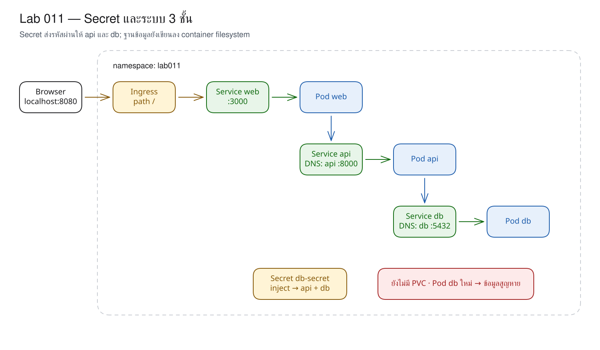
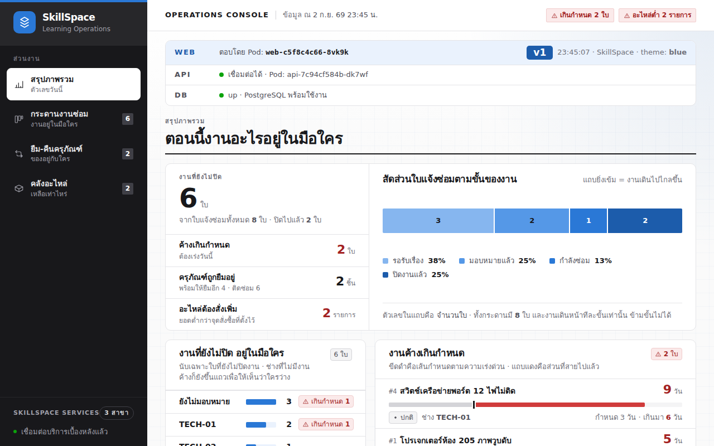
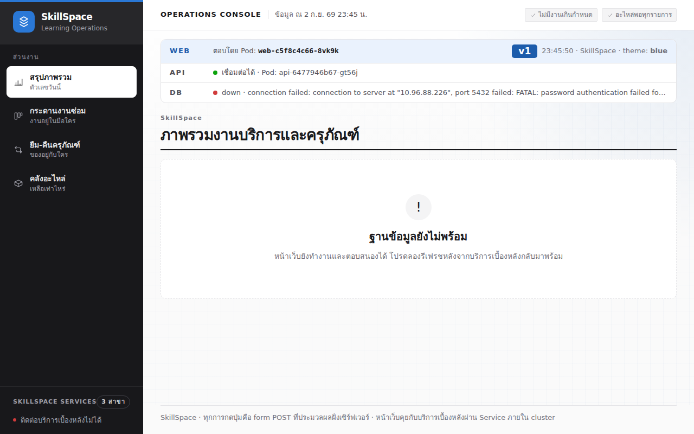

# LAB 11 — Secret : การแยกข้อมูลลับและข้อจำกัดของ base64

> โฟลเดอร์ `011-secret-and-why-not-configmap` = LAB 11 ของชุด Kubernetes ครั้งที่ 2
> (ไฟล์ของปฏิบัติการนี้: `01-secret.yaml`, `02-db.yaml`, `03-api.yaml`, `04-web.yaml`, `05-door.yaml` และ `images/`)

> 💡 **แนวคิดหลักของปฏิบัติการนี้:** ต้องแยกข้อมูลลับออกจากข้อมูลทั่วไป และ base64 ไม่ใช่การเข้ารหัส

## วัตถุประสงค์ของปฏิบัติการ

1. อธิบายได้ว่า Secret แยก “เจตนาและขอบเขตสิทธิ์” ออกจาก ConfigMap อย่างไร
2. พิสูจน์ได้ว่า base64 ถอดกลับเป็นข้อความเดิมได้ทันที
3. อธิบายเส้นทาง Secret → db/api Pod โดยไม่ฝังรหัสผ่านใน image
4. วิเคราะห์อาการจากรหัสผ่านที่ไม่ถูกต้องผ่านหน้าเว็บ, `/ready` และ log แล้วแก้ไขให้ถูกต้องได้

## แนวคิดและทฤษฎีที่เกี่ยวข้อง

ConfigMap และ Secret ส่งค่าเข้าสู่ Pod ด้วยกลไกที่คล้ายกัน แต่ Secret ระบุชัดเจนว่า object นี้เป็นข้อมูลอ่อนไหว จึงแยก RBAC, audit และ encryption at rest ได้ง่ายกว่า ค่าใน `data` ยังคงเป็นเพียง base64 ซึ่งออกแบบสำหรับขนส่ง bytes ผ่าน YAML/JSON ไม่ได้ออกแบบเพื่อปกปิดข้อมูล

| เปรียบเทียบ | ConfigMap | Secret |
|---|---|---|
| ข้อมูล | ชื่อระบบ, theme, URL | รหัสผ่าน, token, key |
| ค่าใน API | ข้อความ | base64 โดยปกติ |
| ถอดกลับได้ | อ่านโดยตรง | ได้ด้วยคำสั่งเดียว |
| ความปลอดภัยจริง | RBAC | RBAC + encryption at rest + rotation |

ไฟล์ `01-secret.yaml` ใช้ `stringData` เพื่อให้ผู้เรียนอ่านได้สะดวก API server จะแปลงและบันทึกไว้ภายใต้ `data` เป็น base64 สำหรับระบบจริงไม่ควร commit ค่าจริงลง Git; ควรใช้ external secret manager หรือ inject เมื่อ deploy

## ผลการเรียนรู้ที่คาดหวัง

- สังเกต Secret ใน YAML เปลี่ยนเป็น `bGFicGFzcw==` ได้
- ใช้ `secretKeyRef` กับทั้ง PostgreSQL และ API ได้
- สังเกต dashboard แสดง seed data และการ์ด web/api/db พร้อมใช้งานครบถ้วนได้
- ถอด base64 กลับเป็น `labpass` ได้
- กำหนดรหัสที่ไม่ถูกต้องและวิเคราะห์ `password authentication failed` ได้
- แก้ไข Secret พร้อม restart เฉพาะ consumer ที่ต้องอ่านค่าใหม่ได้

## ภาพรวมของปฏิบัติการ

1. สร้าง Secret
2. เปิด db, api, web และ Ingress โดยส่งรหัสผ่านผ่าน `secretKeyRef`
3. พิสูจน์ระบบครบ 3 ชั้นจาก UI และฐานข้อมูล
4. ถอด base64 และอ่าน environment ใน Pod
5. กำหนดรหัสที่ไม่ถูกต้อง วิเคราะห์อาการ แก้ไขให้ถูกต้อง และทำ Clean Re-run



> **คำถามนำก่อนเริ่มปฏิบัติการ:** หากผู้มีสิทธิ์สามารถถอด base64 ได้ด้วยคำสั่งเดียว ความปลอดภัยของ Secret มีที่มาจากองค์ประกอบใด

## 0. การเตรียมสภาพแวดล้อมสำหรับปฏิบัติการ

เรียกใช้คำสั่งแรกบนเครื่องหลัก แล้วใช้ `docker exec` เพื่อเข้าสู่เครื่องเรียน; คำสั่งทั้งหมดหลังจากนั้นให้ป้อนในเครื่องเรียน เทอร์มินัลของเครื่องเรียนใช้ `localhost` พอร์ต 80 ส่วนเบราว์เซอร์บนเครื่องหลักใช้ `http://localhost:8080`

```bash
docker start devtools-k8s || docker run -d --name devtools-k8s --privileged --shm-size=1g --ulimit nofile=65536:65536 -p 2299:22 -p 8080:80 -p 8443:443 -p 3000:3000 -p 9090:9090 tuchsanai/devtools-k8s:2569_1
docker exec -it devtools-k8s bash
k8s-bootstrap
kubectl get nodes
docker exec devtools-control-plane crictl images | grep k8s-lab
```

> 📝 **คำอธิบาย:** `docker start` ใช้เครื่องเดิมหรือสร้างเครื่องใหม่ · `docker exec -it ... bash` เข้าสู่เครื่องเรียน · `k8s-bootstrap` สร้าง cluster และข้ามขั้นตอนโดยอัตโนมัติหากมีอยู่แล้ว · `get nodes` ตรวจสอบ cluster · `crictl images` ตรวจสอบ image ใน kind node

✅ **ผลลัพธ์ที่คาดหวัง (Expected output)** — node จำนวน 3 รายการมีสถานะ Ready และพบ image จำนวน 4 รายการ (ตัดบางคอลัมน์; AGE/hash อาจแตกต่างกัน):

```text
devtools-control-plane   Ready   control-plane   12m   v1.36.4
devtools-worker          Ready   <none>          12m   v1.36.4
devtools-worker2         Ready   <none>          12m   v1.36.4
docker.io/library/k8s-lab-api   v1   37b98a526d09b   186MB
docker.io/library/k8s-lab-db    v1   12de2be925d8a   300MB
docker.io/library/k8s-lab-web   v1   f46e8e22f91a6   209MB
docker.io/library/k8s-lab-web   v2   fccf050046905   209MB
…
```

หากยังไม่พบ image ให้ดำเนินการขั้น build/load ใน LAB 001 หรือศึกษา README ระดับชุดก่อน

## 1. การดึงโค้ดของปฏิบัติการ (Clone)

```bash
mkdir -p ~/labwork && cd ~/labwork && git clone https://github.com/Tuchsanai/DevTools.git
cd ~/labwork/DevTools/05_kubernetes/02_Session2_Networking_Config_Storage/011-secret-and-why-not-configmap
```

> 📝 **คำอธิบาย:** `mkdir -p` สร้าง workspace · `git clone` ดึง repository · `cd` เข้าสู่ LAB 11

✅ **ผลลัพธ์ที่คาดหวัง (Expected output)** — การ clone เริ่มต้นและ path ถูกต้อง:

```text
Cloning into 'DevTools'...
/root/labwork/DevTools/05_kubernetes/02_Session2_Networking_Config_Storage/011-secret-and-why-not-configmap
```

หากมี repository แล้ว ให้ใช้ `git pull` ใน repository เดิมแทนการ clone ซ้ำ

## 2. การอ่าน YAML ของปฏิบัติการนี้

| ไฟล์ | kind | หน้าที่ในปฏิบัติการนี้ | แหล่งคำอธิบายโดยละเอียด |
|---|---|---|---|
| `01-secret.yaml` | Secret | บันทึกรหัสผ่านสมมุติของปฏิบัติการ | [Secret](../YAML_Guide.md#secret) |
| `02-db.yaml` | Deployment, Service | ส่งรหัสผ่าน key เดียวให้ PostgreSQL | [Deployment](../YAML_Guide.md#deployment) · [Secret](../YAML_Guide.md#secret) |
| `03-api.yaml` | Deployment, Service | ให้ API อ่าน Secret key เดียวกัน | [Deployment](../YAML_Guide.md#deployment) · [Secret](../YAML_Guide.md#secret) |
| `04-web.yaml` | Deployment, Service | ต่อ web ไป API ด้วย Service DNS | [Deployment](../YAML_Guide.md#deployment) · [Service](../YAML_Guide.md#service) |
| `05-door.yaml` | Ingress | เปิดประตู path `/` ไป web | [Ingress](../YAML_Guide.md#ingress) |

Secret จริงจาก `01-secret.yaml`:

```yaml
type: Opaque
stringData:
  POSTGRES_PASSWORD: labpass
```

จุดอ่านค่าจริงจาก `03-api.yaml`:

```yaml
- name: DB_PASSWORD
  valueFrom:
    secretKeyRef:
      name: db-secret
      key: POSTGRES_PASSWORD
```

| field | ความหมาย | ถ้าเปลี่ยนค่านี้ |
|---|---|---|
| `type: Opaque` | Secret แบบ key/value ทั่วไป | เมื่อเว้นว่างจะใช้ default เป็น `Opaque` |
| `stringData` | รับข้อความแล้ว API server encode ไปบันทึกใน `data` | เหมาะสำหรับการเขียน แต่ base64 ที่บันทึกไม่ใช่ encryption |
| `data` | map ของค่า base64 ที่เห็นจาก `get -o yaml` | ไม่มีในไฟล์ต้นทางนี้ จึงไม่แต่งค่าตัวอย่าง |
| `secretKeyRef` | เลือก Secret และ key ให้ environment variable หนึ่งตัวแปร | ชื่อ/key ผิดทำให้ Container เริ่มไม่ได้ |

`envFrom.secretRef` ใช้นำทุก key เข้า env ได้ แต่ไม่มีใน manifest ของปฏิบัติการนี้และกระจายค่าเกินความจำเป็นสำหรับโจทย์นี้ Secret ผ่าน env จะเปลี่ยนเมื่อสร้าง Container ใหม่ โดยไม่อัปเดต env เดิม

**ข้อผิดพลาดที่พบบ่อยในปฏิบัติการนี้:** ค่า Secret ของ API กับ db ไม่ตรงกันยังสามารถ apply ได้ แต่ runlog บันทึกจริง `FATAL: password authentication failed for user "opsuser"`; ห้ามแก้ไขด้วยการเขียนรหัสจริงลงใน Deployment ให้ตรวจสอบ `secretKeyRef`, rollout restart Deployment ที่อ้าง Secret และตรวจสอบ `kubectl logs`

ตรวจสอบ schema ได้ด้วย `kubectl explain secret.stringData` และ `kubectl explain deployment.spec.template.spec.containers.env.valueFrom.secretKeyRef`

## 3. การสร้าง namespace และ Secret

ส่วนสำคัญของ `01-secret.yaml`:

```yaml
kind: Secret
metadata:
  name: db-secret
type: Opaque
stringData:
  POSTGRES_PASSWORD: labpass
```

`Opaque` คือ Secret ทั่วไป · `stringData` รับข้อความและแปลงเป็น base64 · `labpass` เป็นค่าสมมุติสำหรับห้องเรียนเท่านั้น

```bash
kubectl create namespace lab011
kubectl apply -f 01-secret.yaml
kubectl get secret db-secret -n lab011 -o yaml
```

> 📝 **คำอธิบาย:** namespace แยก resource ของปฏิบัติการ · apply ส่ง Secret · `-o yaml` อ่านข้อมูลที่ API server บันทึกไว้จริง

✅ **ผลลัพธ์ที่คาดหวัง (Expected output)** — ค่าปรากฏภายใต้ `data` ในรูป base64 (ตัดบางแถวจาก metadata):

```text
namespace/lab011 created
secret/db-secret created
…
data:
  POSTGRES_PASSWORD: bGFicGFzcw==
type: Opaque
```

## 4. การส่ง Secret ให้ db และ api

ทั้งสอง Deployment เลือก key เดียวกันด้วย:

```yaml
- name: DB_PASSWORD
  valueFrom:
    secretKeyRef:
      name: db-secret
      key: POSTGRES_PASSWORD
```

ฝั่ง db ใช้ชื่อ environment `POSTGRES_PASSWORD` ส่วน api ใช้ `DB_PASSWORD` ชื่อปลายทางต่างกันได้ แต่ Secret/key ต้นทางเดียวกัน

```bash
kubectl apply -f 02-db.yaml
kubectl wait -n lab011 --for=condition=available deployment/db --timeout=180s
kubectl apply -f 03-api.yaml -f 04-web.yaml -f 05-door.yaml
kubectl wait -n lab011 --for=condition=available deployment/api deployment/web --timeout=180s
until curl --retry 0 -sf http://localhost/info >/dev/null; do sleep 1; done
```

> 📝 **คำอธิบาย:** เริ่ม Deployment ของ db ก่อน consumer · Service `db` ให้ชื่อคงที่ · API อ่านค่าจาก Secret · web เรียก `http://api:8000` · Ingress path `/` เปิดให้เข้าถึงที่ `localhost:8080`

✅ **ผลลัพธ์ที่คาดหวัง (Expected output)** — Deployment และ Service ของระบบ 3 ชั้นถูกสร้างครบถ้วน:

```text
deployment.apps/db created
service/db created
deployment.apps/db condition met
deployment.apps/api created
service/api created
deployment.apps/web created
service/web created
ingress.networking.k8s.io/web created
deployment.apps/api condition met
deployment.apps/web condition met
```

`03-api.yaml` กำหนด `DB_PORT: "5432"` ชัดเจน เพื่อไม่ให้ชนกับ Service environment variable ชื่อเดียวกัน

## 5. การพิสูจน์ระบบครบ 3 ชั้น

```bash
curl -s http://localhost/info | jq -c '{api,db}'
kubectl exec -n lab011 deployment/db -- psql -U opsuser -d skillspace -c 'select count(*) from tickets;'
```

> 📝 **คำอธิบาย:** `/info` ตรวจสอบ Pod และ dependency จากมุมมองของ web · `exec` เข้าสู่ db · `psql -U/-d` เลือก user/database · query นับ seed data

✅ **ผลลัพธ์ที่คาดหวัง (Expected output)** — API มีสถานะ reachable, DB มีสถานะ up และมี ticket จำนวน 8 รายการ; ชื่อ Pod/เวลาอาจแตกต่างกัน:

```text
{"api":{"configured":true,"reachable":true,"pod":"api-7c94cf584b-dk7wf"},"db":{"status":"up"}}
 count
-------
     8
(1 row)
```



ภาพจริงแสดง web Pod, api Pod และ PostgreSQL `up` พร้อมตัวเลขจาก seed data

## 6. การถอด base64 และการตรวจสอบค่าที่ Pod ใช้งานจริง

```bash
kubectl get secret db-secret -n lab011 -o jsonpath='{.data.POSTGRES_PASSWORD}' | base64 -d; echo
kubectl exec -n lab011 deployment/api -- sh -c "env | grep -E '^DB_(HOST|PORT|NAME|USER|PASSWORD)=' | sort"
```

> 📝 **คำอธิบาย:** `jsonpath` เลือกค่าจาก key หนึ่งรายการ · pipe ส่งให้ `base64 -d` ถอดกลับ · `env` ยืนยันว่า process ต้องได้รับข้อความจริงจึงสามารถ login ได้

✅ **ผลลัพธ์ที่คาดหวัง (Expected output)** — base64 ไม่ได้ปกปิดรหัส และ API ได้รับค่าจริง:

```text
labpass
DB_HOST=db
DB_NAME=skillspace
DB_PASSWORD=labpass
DB_PORT=5432
DB_USER=opsuser
```

ผู้ที่มีสิทธิ์อ่าน Secret หรือ exec เข้าสู่ Pod จึงอาจเห็นค่าจริง ความปลอดภัยเกิดจากการจำกัดสิทธิ์ ไม่ใช่รูปแบบ base64

## 7. การทดลองจำลองความล้มเหลว — เปลี่ยนรหัสเฉพาะ API

```bash
kubectl create secret generic db-secret -n lab011 --from-literal=POSTGRES_PASSWORD=wrongpass --dry-run=client -o yaml | kubectl apply -f -
kubectl rollout restart -n lab011 deployment/api
kubectl rollout status -n lab011 deployment/api --timeout=120s
kubectl exec -n lab011 deployment/web -- wget -T 5 -S -O- http://api:8000/ready || true
sleep 3
kubectl exec -n lab011 deployment/web -- wget -T 5 -S -O- http://api:8000/ready || true
```

> 📝 **คำอธิบาย:** `--from-literal` สร้างค่าทดลอง · API ต้อง restart เนื่องจาก env ไม่ reload · `wget -T 5` จำกัดเวลารอ · ครั้งแรกอาจเกิด connection refused จึงรอ 3 วินาทีแล้วเรียกใช้ซ้ำ · `|| true` ทำให้สามารถวิเคราะห์ log ต่อได้

✅ **ผลลัพธ์ที่คาดหวัง (Expected output)** — API process ยังคงมีสถานะ Running แต่ `/ready` ปฏิเสธด้วยสถานะ 503:

```text
secret/db-secret configured
deployment.apps/api restarted
deployment "api" successfully rolled out
Connecting to api:8000 (10.96.116.113:8000)
wget: can't connect to remote host (10.96.116.113): Connection refused
command terminated with exit code 1
Connecting to api:8000 (10.96.116.113:8000)
  HTTP/1.1 503 Service Unavailable
wget: server returned error: HTTP/1.1 503 Service Unavailable
command terminated with exit code 1
```

วิเคราะห์สาเหตุจาก log และหน้าเว็บ:

```bash
kubectl logs -n lab011 deployment/api | grep -E 'startup db=down|GET /ready' | tail -3
curl -s http://localhost/info | jq -c '{api,db}'
```

> 📝 **คำอธิบาย:** log แสดงข้อมูลจากแอปพลิเคชันและระบุ authentication โดยตรง · `/info` แสดงผลกระทบที่ผู้ใช้พบ · จึงไม่ต้องคาดการณ์จากสถานะ Running

✅ **ผลลัพธ์ที่คาดหวัง (Expected output)** — log ระบุรหัสที่ไม่ถูกต้อง และการ์ดฐานข้อมูลแสดงสถานะ down (ตัดข้อความท้ายในค่า `error` ด้วย `…`):

```text
[api] startup db=down (connection failed: connection to server at "10.96.88.226", port 5432 failed: FATAL: password authentication failed for user "opsuser") — API ยังให้บริการต่อ
[api] GET /ready 503 6ms
[api] GET /ready 503 5ms
{"api":{"configured":true,"reachable":true,"pod":"api-6477946b67-gt56j"},"db":{"status":"down","error":"connection failed: connection to server at \"10.96.88.226\", port 5432 failed: FATAL: password authentication failed for …"}}
```



ปฏิบัติการนี้ยังไม่มี volume Pod ใหม่จะเริ่มต้นฐานข้อมูลใหม่และอาจใช้รหัสใหม่ ส่งผลให้ข้อมูลถูกกำหนดค่าเริ่มต้นใหม่ ซึ่งบดบังประเด็นการเรียนรู้เรื่อง Secret จึงแก้ไขเฉพาะ Secret และ restart consumer ส่วนฐานข้อมูลที่มี persistent data การ restart จะไม่เปลี่ยนรหัสที่กำหนดระหว่างการ initialize ครั้งแรก

แก้ไข Secret ให้ถูกต้องและสร้าง API Pod ใหม่:

```bash
kubectl apply -f 01-secret.yaml
kubectl rollout restart -n lab011 deployment/api
kubectl rollout status -n lab011 deployment/api --timeout=120s
until curl --retry 0 -s http://localhost/info | jq -e '.db.status == "up"' >/dev/null; do sleep 1; done
curl -s http://localhost/info | jq -c '{api,db}'
```

> 📝 **คำอธิบาย:** การ apply กำหนดค่ากลับเป็น `labpass` · restart เพื่อให้ API อ่านค่าใหม่ · curl ยืนยันทั้ง API และ DB ไม่ใช่ตรวจสอบเพียง rollout

✅ **ผลลัพธ์ที่คาดหวัง (Expected output)** — ระบบกลับสู่สถานะพร้อมใช้งาน:

```text
secret/db-secret configured
deployment.apps/api restarted
deployment "api" successfully rolled out
{"api":{"configured":true,"reachable":true,"pod":"api-b569554f7-wpsg7"},"db":{"status":"up"}}
```

## 8. แบบฝึกหัด (Exercise)

สร้าง Secret อีกหนึ่งรายการชื่อ `api-secret` ซึ่งมี key `DEMO_TOKEN` แล้วส่งเฉพาะ key นี้เข้าสู่ API ด้วย `secretKeyRef` เกณฑ์ความสำเร็จคือ Pod ใหม่มีสถานะ Running, `describe` ไม่แสดงค่าจริง และผู้เรียนสามารถอธิบายเหตุผลที่ยังต้องจำกัดสิทธิ์ exec ได้

## วิธีตรวจสอบผลการทดลอง

```bash
kubectl get all,ingress,secret -n lab011
kubectl logs -n lab011 deployment/api --tail=12
curl -s http://localhost/info | jq -c '{api,db}'
```

> 📝 **คำอธิบาย:** `get all` ตรวจสอบ resource หลัก · ระบุ `ingress,secret` เพิ่มเติม · log ยืนยัน DB connection · `/info` ตรวจสอบเส้นทาง browser → web → api → db

✅ **ผลลัพธ์ที่คาดหวัง (Expected output)** — Deployment ทั้งสามมีสถานะ `1/1`, log มี `startup db=up` และ UI/API/DB พร้อมใช้งาน (ตัดบางแถว/บางคอลัมน์):

```text
…
deployment.apps/api   1/1   1   1
deployment.apps/db    1/1   1   1
deployment.apps/web   1/1   1   1
[api] startup db=up
{"api":{"configured":true,"reachable":true,"pod":"api-b569554f7-wpsg7"},"db":{"status":"up"}}
```

ชื่อ Pod, ClusterIP, AGE, hash และเวลาอาจแตกต่างกัน

## ปัญหาที่พบบ่อยและแนวทางแก้ไข

| อาการ | สาเหตุที่พบบ่อย | แนวทางแก้ไข |
|---|---|---|
| `Servname not supported for ai_socktype` | `DB_PORT` ชน Service env | กำหนด `DB_PORT: "5432"` |
| `/ready` ตอบ 503 | รหัส/host/db ไม่พร้อม | วิเคราะห์ API log |
| API connection refused ทันทีหลัง rollout | process เพิ่งเริ่มแต่ไม่มี readiness probe | รอประมาณ 3 วินาทีแล้วเรียกซ้ำ |
| Secret เปลี่ยนแต่ API ยังใช้ค่าเดิม | env เป็น snapshot | restart API Deployment |
| `ImagePullBackOff` | image ไม่อยู่ใน kind | กลับไป build/load LAB 001 |

## การล้างทรัพยากร (Cleanup) และการพิสูจน์การทำซ้ำจากสถานะเริ่มต้น (Clean Re-run)

```bash
kubectl delete namespace lab011 --wait=true
kubectl get all -n lab011
kubectl create namespace lab011
kubectl apply -f 01-secret.yaml -f 02-db.yaml -f 03-api.yaml -f 04-web.yaml -f 05-door.yaml
kubectl wait -n lab011 --for=condition=available deployment/db deployment/api deployment/web --timeout=180s
until curl --retry 0 -s http://localhost/info | jq -e '.api.reachable == true and .db.status == "up"' >/dev/null; do sleep 1; done
curl -s http://localhost/info | jq -c '{api,db}'
kubectl delete namespace lab011 --wait=true
kubectl get all -n lab011
```

> 📝 **คำอธิบาย:** ลบ namespace ให้ไม่มี resource คงค้าง · apply manifest ทั้งชุดจากสถานะเริ่มต้น · wait ทั้งสาม Deployment · ตรวจสอบ dependency จริง · ลบ resource เมื่อสิ้นสุดเพื่อไม่ให้ขัดแย้งกับปฏิบัติการถัดไป

✅ **ผลลัพธ์ที่คาดหวัง (Expected output)** — Clean Re-run ทำให้ทุกส่วนพร้อมใช้งานและสิ้นสุดโดยไม่เหลือ resource:

```text
namespace "lab011" deleted
No resources found in lab011 namespace.
namespace/lab011 created
secret/db-secret created
deployment.apps/db created
service/db created
deployment.apps/api created
service/api created
deployment.apps/web created
service/web created
ingress.networking.k8s.io/web created
deployment.apps/db condition met
deployment.apps/api condition met
deployment.apps/web condition met
{"api":{"configured":true,"reachable":true,"pod":"api-7c94cf584b-bxm7s"},"db":{"status":"up"}}
namespace "lab011" deleted
No resources found in lab011 namespace.
```

## สรุปคำสั่งของปฏิบัติการนี้

| คำสั่ง | ความหมาย |
|---|---|
| `kubectl get secret ... -o yaml` | อ่าน representation ใน API |
| `base64 -d` | ถอด base64 กลับเป็นข้อความ |
| `secretKeyRef` | เลือก key จาก Secret เข้า env |
| `kubectl logs deployment/api` | อ่านสาเหตุการเชื่อมต่อ DB |
| `kubectl rollout restart` | สร้าง consumer ใหม่ให้อ่าน Secret ล่าสุด |
| `kubectl delete namespace lab011` | ล้างทุก object ในปฏิบัติการ |

## สรุปสิ่งที่ได้เรียนรู้

Secret แยกข้อมูลอ่อนไหวออกจาก image/ConfigMap แต่ base64 ถอดกลับได้ ความปลอดภัยจริงต้องพึ่ง RBAC, encryption at rest, audit, rotation และการไม่ commit ค่าจริงลง Git

- ส่งรหัสเดียวกันให้ db/api ผ่าน key reference ได้
- พิสูจน์ได้ว่า Pod เห็น plaintext เพื่อใช้งาน
- อ่าน 503 และ authentication failure จากหลักฐานสามมุมได้
- แก้ Secret, restart consumer และ Clean Re-run ได้

**ภาพรวมที่ควรจดจำ:** base64 เป็นเพียงรูปแบบการบรรจุข้อมูล ไม่ใช่กลไกป้องกันข้อมูล; การควบคุมที่แท้จริงคือสิทธิ์เข้าถึง

🧭 การเชื่อมโยงสู่ปฏิบัติการถัดไป: [LAB 12 — เหตุผลที่ข้อมูลใน container สูญหาย](../012-why-data-disappears/README.md)

## ❓ คำถามทบทวนก่อนจบปฏิบัติการ

1. **Secret แตกต่างจาก ConfigMap อย่างไร** — กลไกส่งค่ามีลักษณะคล้ายกัน แต่ Secret แยกชนิดเพื่อควบคุมสิทธิ์ การเข้ารหัส และ audit ได้อย่างเหมาะสม
2. **base64 มีความปลอดภัยหรือไม่** — ไม่มี เนื่องจากถอดกลับได้ทันที; ความปลอดภัยเกิดจาก access control และ encryption at rest
3. **เหตุใดจึงห้าม commit Secret จริงลง Git** — Git บันทึกประวัติระยะยาวและผู้เข้าถึง repository อาจอ่านรหัสได้แม้ลบออกใน commit ใหม่

## ✅ รายการตรวจสอบก่อนจบปฏิบัติการ

- [ ] ตรวจสอบ Secret ในรูป base64 และถอดค่ากลับได้
- [ ] ยืนยันว่า dashboard แสดงข้อมูล seed
- [ ] วิเคราะห์ผล 503 และ log จากการกำหนดรหัสที่ไม่ถูกต้องได้
- [ ] คืนค่าจน db มีสถานะ up
- [ ] Clean Re-run สำเร็จและลบ `lab011` แล้ว

*ผลลัพธ์ที่คาดหวัง (expected output) และภาพหน้าจอในเอกสารนี้ได้มาจากการดำเนินการจริงบน tuchsanai/devtools-k8s:2569_1 (kind v0.33.0 · Kubernetes v1.36.4 · kubectl v1.37.0) เมื่อ 2 กันยายน 2026*
