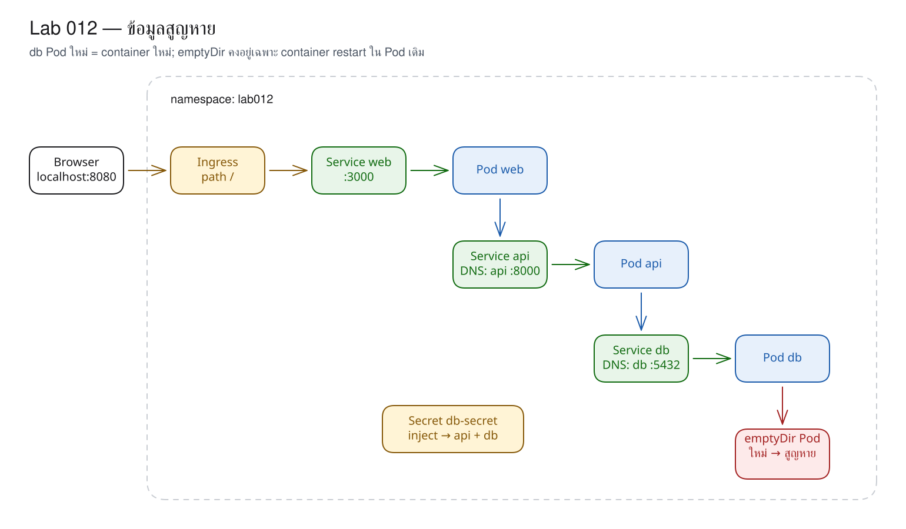
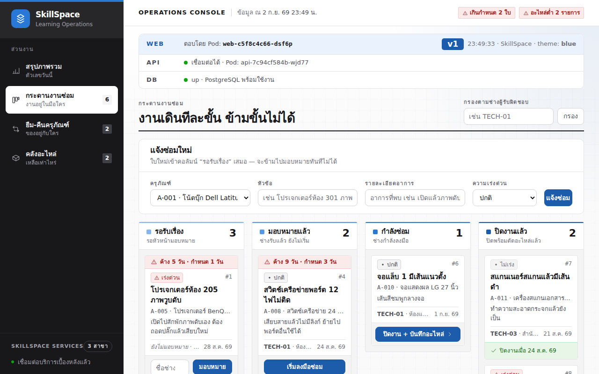

# LAB 12 — Ephemeral Data : การสูญหายของข้อมูลเมื่อสร้าง Pod ใหม่

> โฟลเดอร์ `012-why-data-disappears` = LAB 12 ของชุด Kubernetes ครั้งที่ 2
> (ไฟล์ของปฏิบัติการนี้: `manifests/01-secret.yaml` ถึง `05-door.yaml`, `02-db-emptydir.yaml` และ `images/`)

> 💡 **แนวคิดหลักของปฏิบัติการนี้:** ข้อมูลที่เขียนไว้ใน container จะสูญหายเมื่อ Pod ถูกสร้างใหม่ เนื่องจาก container ถูกสร้างใหม่จาก image เสมอ

## วัตถุประสงค์ของปฏิบัติการ

1. อธิบาย image layer กับ writable layer ของ container ได้
2. พิสูจน์จาก UI และ SQL ว่าข้อมูลใหม่สูญหายหลังจาก db Pod ถูกสร้างใหม่
3. แยก container restart ออกจาก Pod recreation ด้วย `emptyDir`

## แนวคิดและทฤษฎีที่เกี่ยวข้อง

container เริ่มต้นจาก image แบบอ่านอย่างเดียว แล้วมี writable layer ชั่วคราววางทับ เมื่อ container/Pod ถูกลบ layer นี้จะถูกลบด้วย Kubernetes ไม่ได้ทำให้ข้อมูลสูญหายโดยตรง แต่ดำเนินการตามโมเดลการลบแล้วสร้างใหม่จาก image เช่นเดียวกับ `docker rm` ตามด้วย `docker run` ใหม่

| แหล่งบันทึกข้อมูล | อายุข้อมูล | รอด container restart | รอด Pod ใหม่ |
|---|---:|---:|---:|
| writable layer | container | ไม่ | ไม่ |
| `emptyDir` | Pod | ใช่ | ไม่ |
| PVC/PV | นอก Pod | ใช่ | ใช่ (LAB 13) |

## ผลการเรียนรู้ที่คาดหวัง

- เพิ่ม ticket ผ่านฟอร์มหน้าเว็บจริงจน count เปลี่ยนจาก 8 เป็น 9 ได้
- ลบ db Pod แล้วสังเกตว่า ticket ใหม่สูญหายจากทั้ง UI และ SQL ได้
- เขียนไฟล์ใน web Pod แล้วพิสูจน์ว่า Pod ใหม่ไม่มีไฟล์ดังกล่าวได้
- ใช้ `emptyDir` เพื่อแยกอายุ container ออกจากอายุ Pod ได้
- สังเกตว่าหลัง container ใน Pod เดิม restart แล้ว ค่า count ยังคงเป็น 9

## ภาพรวมของปฏิบัติการ

1. deploy ระบบจากโฟลเดอร์ `manifests/`
2. เพิ่ม ticket/ไฟล์ชั่วคราว แล้ว recreate db/web Pod เพื่อตรวจสอบการสูญหายของข้อมูล
3. เปลี่ยน db เป็น `emptyDir`
4. เปรียบเทียบ container restart กับ Pod recreation



> **คำถามนำก่อนเริ่มปฏิบัติการ:** หากผู้ใช้บันทึกงานไว้ใน PostgreSQL แล้ว Kubernetes ย้าย workload ไปยัง Pod ใหม่ ข้อมูลที่เขียนใน container จะถูกย้ายตามไปด้วยหรือไม่

## 0. การเตรียมสภาพแวดล้อมสำหรับปฏิบัติการ

เรียกใช้คำสั่งแรกบนเครื่องหลัก แล้วใช้ `docker exec` เพื่อเข้าสู่เครื่องเรียน; คำสั่งทั้งหมดหลังจากนั้นให้ป้อนในเครื่องเรียน เทอร์มินัลของเครื่องเรียนใช้ `localhost` พอร์ต 80 ส่วนเบราว์เซอร์บนเครื่องหลักใช้ `http://localhost:8080`

```bash
docker start devtools-k8s || docker run -d --name devtools-k8s --privileged --shm-size=1g --ulimit nofile=65536:65536 -p 2299:22 -p 8080:80 -p 8443:443 -p 3000:3000 -p 9090:9090 tuchsanai/devtools-k8s:2569_1
docker exec -it devtools-k8s bash
k8s-bootstrap
kubectl get nodes
docker exec devtools-control-plane crictl images | grep k8s-lab
```

> 📝 **คำอธิบาย:** `docker start` ใช้เครื่องเดิมหรือสร้างเครื่องใหม่ · `docker exec -it ... bash` เข้าสู่เครื่องเรียน · `k8s-bootstrap` สร้าง cluster และข้ามขั้นตอนโดยอัตโนมัติหากมีอยู่แล้ว · `get nodes` ตรวจสอบ cluster · `crictl images` ตรวจสอบ image ใน kind runtime

✅ **ผลลัพธ์ที่คาดหวัง (Expected output)** — node จำนวน 3 รายการมีสถานะ Ready และพบ image จำนวน 4 รายการ (ตัดบางคอลัมน์; AGE/hash อาจแตกต่างกัน):

```text
devtools-control-plane   Ready   control-plane   17m   v1.36.4
devtools-worker          Ready   <none>          17m   v1.36.4
devtools-worker2         Ready   <none>          17m   v1.36.4
docker.io/library/k8s-lab-api   v1   37b98a526d09b   186MB
docker.io/library/k8s-lab-db    v1   12de2be925d8a   300MB
docker.io/library/k8s-lab-web   v1   f46e8e22f91a6   209MB
docker.io/library/k8s-lab-web   v2   fccf050046905   209MB
…
```

หากยังไม่มี image ให้กลับไปดำเนินการ build/load ตาม LAB 001 หรือศึกษา README ระดับชุด

## 1. การดึงโค้ดของปฏิบัติการ (Clone)
```bash
mkdir -p ~/labwork && cd ~/labwork && git clone https://github.com/Tuchsanai/DevTools.git
cd ~/labwork/DevTools/05_kubernetes/02_Session2_Networking_Config_Storage/012-why-data-disappears
```
> 📝 **คำอธิบาย:** สร้าง workspace · clone repository · เข้าสู่ LAB 12 ซึ่งมี manifest ของระบบครบถ้วนและ variant `emptyDir`

✅ **ผลลัพธ์ที่คาดหวัง (Expected output)** — การ clone เริ่มต้นและ path ถูกต้อง:
```text
Cloning into 'DevTools'...
```

## 2. การอ่าน YAML ของปฏิบัติการนี้

| ไฟล์ | kind | หน้าที่ในปฏิบัติการนี้ | แหล่งคำอธิบายโดยละเอียด |
|---|---|---|---|
| `manifests/01-secret.yaml` | Secret | รหัสผ่านสมมุติสำหรับ db/api | [Secret](../YAML_Guide.md#secret) |
| `manifests/02-db.yaml` | Deployment, Service | ฐานข้อมูลที่ยังบันทึกใน writable layer | [Deployment](../YAML_Guide.md#deployment) · [Service](../YAML_Guide.md#service) |
| `manifests/03-api.yaml` | Deployment, Service | API เชื่อม db | [Deployment](../YAML_Guide.md#deployment) · [Secret](../YAML_Guide.md#secret) |
| `manifests/04-web.yaml` | Deployment, Service | web เรียก API ด้วยชื่อ Service | [Deployment](../YAML_Guide.md#deployment) · [Service](../YAML_Guide.md#service) |
| `manifests/05-door.yaml` | Ingress | เปิดประตูไป web | [Ingress](../YAML_Guide.md#ingress) |
| `02-db-emptydir.yaml` | Deployment | เพิ่ม volume อายุเท่า Pod ให้ db | [Deployment](../YAML_Guide.md#deployment) · [Volume/PVC](../YAML_Guide.md#volume-pvc) |

ส่วนใหม่จริงจาก `02-db-emptydir.yaml`:

```yaml
containers:
  - name: db
    # ... image, ports และ env อื่นอยู่ตรงนี้ในไฟล์จริง
    env:
      - name: PGDATA
        value: /var/lib/postgresql/data/pgdata
    volumeMounts:
      - name: data
        mountPath: /var/lib/postgresql/data
volumes:
  - name: data
    emptyDir: {}
```

| field | ความหมาย | ถ้าเปลี่ยนค่านี้ |
|---|---|---|
| `volumeMounts[].name` ↔ `volumes[].name` | เชื่อม mount กับแหล่ง volume | ชื่อไม่ตรงแล้ว Pod ถูกปฏิเสธ |
| `mountPath` | ตำแหน่งที่ Container เห็น volume | `PGDATA` ต้องเป็น path นี้หรือ subdirectory ใต้ path ไม่เช่นนั้นข้อมูลจะไม่ได้อยู่ใน volume |
| `emptyDir: {}` | พื้นที่ที่สร้างพร้อม Pod | คงอยู่เมื่อ Container restart แต่สูญหายเมื่อ Pod ถูกแทนที่ |
| `PGDATA` | env ของ PostgreSQL ไม่ใช่ field Kubernetes | เปลี่ยนแล้ว PostgreSQL มอง data directory คนละที่ |

**ข้อผิดพลาดที่พบบ่อยในปฏิบัติการนี้:** ไม่ควรสรุปว่า `emptyDir` ไม่มีประโยชน์ เนื่องจากช่วยให้ข้อมูลคงอยู่ระหว่าง Container restart แต่ไม่คงอยู่ข้าม Pod; runlog บันทึก `HTTP/1.1 503 Service Unavailable` ระหว่าง rollout ไปยัง db ชุด `emptyDir` ก่อน Pod ใหม่พร้อม ส่วนชื่อ mount ไม่ตรงกันมีตัวอย่างข้อความ (ไม่ได้มาจาก runlog) `volumeMounts[0].name: Not found: "data"`

ตรวจสอบ schema ได้ด้วย `kubectl explain deployment.spec.template.spec.volumes.emptyDir` และ `kubectl explain deployment.spec.template.spec.containers.volumeMounts`

## 3. การเปิดระบบที่ยังไม่มี persistent storage

โฟลเดอร์ `manifests/` มี Secret, db/api/web Deployment+Service และ Ingress โดย db ไม่มี `volumes` หรือ `volumeMounts` ข้อมูล PostgreSQL จึงอยู่ใน writable layer
```bash
kubectl create namespace lab012
kubectl apply -f manifests/
kubectl wait -n lab012 --for=condition=available deployment/db deployment/api deployment/web --timeout=180s
kubectl exec -n lab012 deployment/db -- psql -U opsuser -d skillspace -c 'select count(*) from tickets;'
```
> 📝 **คำอธิบาย:** namespace แยกปฏิบัติการ · apply ทั้งโฟลเดอร์ตามชื่อไฟล์ · wait ทั้งสาม Deployment · `psql` นับ baseline จาก seed

✅ **ผลลัพธ์ที่คาดหวัง (Expected output)** — ระบบทำงานครบถ้วนและเริ่มต้นด้วย ticket จำนวน 8 รายการ:
```text
namespace/lab012 created
secret/db-secret created
deployment.apps/db created
service/db created
deployment.apps/api created
service/api created
deployment.apps/web created
service/web created
ingress.networking.k8s.io/web created
deployment.apps/db condition met
deployment.apps/api condition met
deployment.apps/web condition met
 count
-------
     8
```

หาก `psql` เชื่อมต่อไม่ได้ทันทีระหว่างที่ PostgreSQL ดำเนินการ `initdb` ให้รอ 5–10 วินาทีแล้วเรียกใช้คำสั่ง `psql` ซ้ำ

## 4. การเพิ่มข้อมูลจากหน้าเว็บจริง

เปิด `http://localhost:8080/tickets` ตรวจสอบว่าการ์ดสถานะ web/api/db พร้อมใช้งาน และบันทึก baseline NEW = 3, งานไม่ปิด = 6


ในฟอร์ม “แจ้งซ่อมใหม่” เลือก `A-003`, กรอกหัวข้อ `โปรเจกเตอร์ห้อง 999 ภาพไม่ขึ้น`, ระบุรายละเอียด และกด “แจ้งซ่อม” การทดลองจริงดำเนินการผ่าน browser โดยไม่ได้ส่ง request ไปยัง API ข้าม UI


```bash
kubectl exec -n lab012 deployment/db -- psql -U opsuser -d skillspace -c 'select count(*) from tickets;'
kubectl exec -n lab012 deployment/db -- psql -U opsuser -d skillspace -c 'select id,title from tickets order by id desc limit 1;'
```
> 📝 **คำอธิบาย:** คำสั่งแรกยืนยันจำนวน · คำสั่งที่สองอ่าน record ล่าสุด · หลักฐาน SQL ป้องกันการสรุปจาก UI เพียงแหล่งเดียว

✅ **ผลลัพธ์ที่คาดหวัง (Expected output)** — count เป็น 9 และ record ล่าสุดตรงกับข้อมูลในฟอร์ม:
```text
 count
-------
     9
 id |           title
----+---------------------------
  9 | โปรเจกเตอร์ห้อง 999 ภาพไม่ขึ้น
(1 row)
```

## 5. การเขียนไฟล์ชั่วคราวใน web Pod
```bash
kubectl exec -n lab012 deployment/web -- sh -c 'echo hi > /tmp/note.txt'
kubectl exec -n lab012 deployment/web -- cat /tmp/note.txt
```
> 📝 **คำอธิบาย:** `sh -c` ทำให้ redirection เกิดขึ้นภายใน container · `/tmp` อยู่ใน writable layer · `cat` ยืนยันว่าไฟล์มีอยู่จริงก่อนลบ Pod

✅ **ผลลัพธ์ที่คาดหวัง (Expected output)** — สามารถอ่านไฟล์ได้:
```text
hi
```

## 6. การลบ db Pod และการตรวจสอบการสูญหายของข้อมูล
```bash
kubectl get pods -n lab012 -l app=db -o wide
kubectl delete pod -n lab012 -l app=db
kubectl wait -n lab012 --for=condition=ready pod -l app=db --timeout=120s
kubectl get pods -n lab012 -l app=db -o wide
kubectl exec -n lab012 deployment/db -- psql -U opsuser -d skillspace -c 'select count(*) from tickets;'
```
> 📝 **คำอธิบาย:** บันทึกชื่อ/IP เดิม · Deployment สร้าง Pod ใหม่หลัง delete · wait รอ container ใหม่ · PostgreSQL init seed ใหม่เนื่องจาก writable layer เดิมถูกลบ

✅ **ผลลัพธ์ที่คาดหวัง (Expected output)** — Pod ใหม่มีชื่อ/IP ใหม่และ count กลับเป็น 8; ค่าเหล่านี้อาจแตกต่างกัน:
```text
NAME                  READY   STATUS    RESTARTS   AGE   IP            NODE              NOMINATED NODE   READINESS GATES
db-7cbb4874f6-pcc6r   1/1     Running   0          76s   10.244.2.21   devtools-worker   <none>           <none>
pod "db-7cbb4874f6-pcc6r" deleted from lab012 namespace
pod/db-7cbb4874f6-k2jwp condition met
NAME                  READY   STATUS    RESTARTS   AGE   IP            NODE              NOMINATED NODE   READINESS GATES
db-7cbb4874f6-k2jwp   1/1     Running   0          4s    10.244.2.24   devtools-worker   <none>           <none>
 count
-------
     8
(1 row)
```

หาก Pod ใหม่มีสถานะ Ready แต่ `psql` ยังเชื่อมต่อไม่ได้ ให้รอ 5–10 วินาทีแล้วเรียกใช้ `psql` ซ้ำ เนื่องจาก LAB 012 ยังไม่ได้ศึกษา readiness probe ของฐานข้อมูล
เพื่อพิสูจน์ไฟล์ web ต้อง recreate web Pod ด้วย เนื่องจากการลบ db ไม่ส่งผลต่อ web:
```bash
kubectl delete pod -n lab012 -l app=web
kubectl wait -n lab012 --for=condition=ready pod -l app=web --timeout=120s
kubectl exec -n lab012 deployment/web -- sh -c 'if [ -f /tmp/note.txt ]; then cat /tmp/note.txt; else echo /tmp/note.txt: No such file; fi'
```
> 📝 **คำอธิบาย:** selector ลบ web Pod ที่มีไฟล์ · Deployment สร้าง Pod ใหม่ · test ตรวจสอบ path เดิมใน writable layer ใหม่

✅ **ผลลัพธ์ที่คาดหวัง (Expected output)** — ไฟล์เดิมไม่ปรากฏใน Pod ใหม่:
```text
pod "web-c5f8c4c66-28vnw" deleted from lab012 namespace
pod/web-c5f8c4c66-dsf6p condition met
/tmp/note.txt: No such file
```



## 7. การเพิ่ม emptyDir เพื่อแยก container restart จาก Pod ใหม่

ส่วนสำคัญของ `02-db-emptydir.yaml`:
```yaml
env:
  - name: PGDATA
    value: /var/lib/postgresql/data/pgdata
volumeMounts:
  - name: data
    mountPath: /var/lib/postgresql/data
volumes:
  - name: data
    emptyDir: {}
```
```bash
kubectl apply -f 02-db-emptydir.yaml
kubectl rollout status -n lab012 deployment/db --timeout=180s
```
> 📝 **คำอธิบาย:** `PGDATA` ใช้ subdirectory ภายใต้ mount · การเปลี่ยน Pod template สร้าง db Pod ใหม่ · `rollout status` รอการแทนที่ · `emptyDir` ยังคงอยู่เมื่อ container ใน Pod เดิม restart

✅ **ผลลัพธ์ที่คาดหวัง (Expected output)** — rollout สำเร็จและ endpoint มีพอร์ต:
```text
deployment.apps/db configured
deployment "db" successfully rolled out
```
เพิ่ม ticket ผ่านฟอร์มจน SQL แสดง count=9 จากนั้นทดสอบการ restart process:
```bash
kubectl get pod -n lab012 -l app=db --no-headers -o custom-columns=NAME:.metadata.name,RESTARTS:.status.containerStatuses[0].restartCount
kubectl exec -n lab012 deployment/db -- kill 1
sleep 5
kubectl get pod -n lab012 -l app=db --no-headers -o custom-columns=NAME:.metadata.name,RESTARTS:.status.containerStatuses[0].restartCount
kubectl exec -n lab012 deployment/db -- psql -U opsuser -d skillspace -c 'select count(*) from tickets;'
```
> 📝 **คำอธิบาย:** `kill 1` สิ้นสุด PostgreSQL container process · restartPolicy ทำให้ kubelet restart container ใน Pod เดิม · custom columns เปรียบเทียบชื่อ/RESTARTS · emptyDir เดิมยังถูก mount กลับ

✅ **ผลลัพธ์ที่คาดหวัง (Expected output)** — ชื่อ Pod คงเดิม, RESTARTS เพิ่มจาก 0 → 1 และข้อมูลจำนวน 9 รายการยังคงอยู่:
```text
db-7c8fd4985d-n8xsw   0
db-7c8fd4985d-n8xsw   1
 count
-------
     9
(1 row)
```

หาก `RESTARTS` ยังเป็น 0 หรือ `psql` เชื่อมต่อไม่ได้ ให้รอ 5–10 วินาทีแล้วเรียกใช้คำสั่งตรวจสอบทั้งสองซ้ำ

ลบ Pod เดิมแล้วตรวจซ้ำ:
```bash
kubectl delete pod -n lab012 -l app=db
kubectl wait -n lab012 --for=condition=ready pod -l app=db --timeout=120s
kubectl exec -n lab012 deployment/db -- psql -U opsuser -d skillspace -Atc 'select count(*) from tickets'
```
> 📝 **คำอธิบาย:** Pod ใหม่ได้รับ emptyDir ชุดใหม่ · `-A/-t` กำหนดให้ psql แสดงเฉพาะค่า · ข้อมูลที่คงอยู่ระหว่าง container restart จึงยังสูญหายพร้อม Pod

✅ **ผลลัพธ์ที่คาดหวัง (Expected output)** — ชื่อ Pod เปลี่ยนแปลงและ count กลับเป็น 8:
```text
pod "db-7c8fd4985d-n8xsw" deleted from lab012 namespace
pod/db-7c8fd4985d-n64jq condition met
8
```

หาก `psql` เชื่อมต่อไม่ได้หลังสร้าง Pod ใหม่ ให้รอ 5–10 วินาทีแล้วเรียกใช้ซ้ำ

## 8. การทดลองจำลองความล้มเหลว — Scale db เป็น 0 แล้วกลับเป็น 1

หลังเพิ่ม ticket ให้ตรวจสอบว่า count เป็น 9:
```bash
kubectl scale -n lab012 deployment/db --replicas=0
kubectl wait -n lab012 --for=delete pod -l app=db --timeout=120s
curl -s http://localhost/info | jq -c '{api,db}'
```
> 📝 **คำอธิบาย:** scale 0 ลบ db Pod และ emptyDir · wait รอจน Pod ถูกลบ · หน้าเว็บยังตอบสนองแต่ API รายงานว่าฐานข้อมูลไม่พร้อมใช้งาน

✅ **ผลลัพธ์ที่คาดหวัง (Expected output)** — db ถูกลบและผู้ใช้สังเกต dependency down (ตัดข้อความท้ายในค่า `error` ด้วย `…`):
```text
deployment.apps/db scaled
pod/db-7c8fd4985d-n64jq condition met
{"api":{"configured":true,"reachable":true,"pod":"api-7c94cf584b-wjd77"},"db":{"status":"down","error":"connection failed: connection to server at \"10.96.159.201\", port 5432 failed: Connection refused Is the server running …"}}
```
คืนบริการให้กลับมาทำงาน:
```bash
kubectl scale -n lab012 deployment/db --replicas=1
kubectl wait -n lab012 --for=condition=available deployment/db --timeout=180s
kubectl exec -n lab012 deployment/db -- psql -U opsuser -d skillspace -Atc 'select count(*) from tickets'
curl -s http://localhost/info | jq -c '{api,db}'
```
> 📝 **คำอธิบาย:** scale 1 สร้าง Pod/emptyDir ใหม่ · PostgreSQL init seed · บริการกลับมาทำงานได้แต่ไม่สามารถกู้คืนข้อมูลที่สูญหาย · วิธีป้องกันคือการใช้ PVC ใน LAB 13

✅ **ผลลัพธ์ที่คาดหวัง (Expected output)** — ระบบกลับสู่สถานะพร้อมใช้งาน แต่เหลือ seed จำนวน 8 รายการ:
```text
deployment.apps/db scaled
deployment.apps/db condition met
8
{"api":{"configured":true,"reachable":true,"pod":"api-7c94cf584b-wjd77"},"db":{"status":"up"}}
```

หาก `psql` เชื่อมต่อไม่ได้หรือ `/info` ยังรายงานว่าฐานข้อมูลไม่พร้อมใช้งาน ให้รอ 5–10 วินาทีแล้วเรียกใช้คำสั่งตรวจสอบทั้งสองซ้ำ

## 9. แบบฝึกหัด (Exercise)

อธิบายโดยไม่เรียกใช้คำสั่งว่า log file, user upload และ PostgreSQL data ควรอยู่ใน writable layer, emptyDir หรือ PVC พร้อมเหตุผล เกณฑ์ความสำเร็จคือสามารถเลือกอายุข้อมูลให้ตรงกับความต้องการและอธิบายผลเมื่อ Pod ถูกย้าย node ได้

## วิธีตรวจสอบผลการทดลอง
```bash
kubectl get all,ingress -n lab012
kubectl logs -n lab012 deployment/db --tail=15
kubectl get events -n lab012 --sort-by=.lastTimestamp | tail -25
```
> 📝 **คำอธิบาย:** `get` ตรวจสอบสถานะปัจจุบัน · db log แสดง init/ready · Events แสดง delete/create/restart ตามลำดับเวลา

✅ **ผลลัพธ์ที่คาดหวัง (Expected output)** — db มีสถานะ Running, log ระบุว่าพร้อมรับ connection และ Events มี Pod ที่ถูกสร้างใหม่ (ตัดบางแถว/บางคอลัมน์/ข้อความท้าย):
```text
…
deployment.apps/db   1/1   1   1
database system is ready to accept connections
…
117s   Normal   SuccessfulCreate   replicaset/db-7c8fd4985d   Created pod: db-7c8fd4985d-n8xsw
…
```
Pod, IP, AGE, hash, เวลาและจำนวน restart จากรอบทดลองต่างกันได้

## ปัญหาที่พบบ่อยและแนวทางแก้ไข

| อาการ | สาเหตุที่พบบ่อย | แนวทางแก้ไข |
|---|---|---|
| psql ไม่สามารถเชื่อมต่อได้ทันทีหลัง Pod Ready | ไม่มี readiness probe ของ db | เรียกซ้ำจน log ระบุว่าพร้อม |
| container restart แล้วข้อมูลคงอยู่ | เป็น container restart ใน Pod เดิม + emptyDir | ตรวจสอบชื่อ Pod และ RESTARTS |
| ลบ Pod แล้วข้อมูลสูญหาย | Pod ใหม่ไม่ได้รับ emptyDir ของ Pod เดิมและยังไม่มี PVC | ดำเนินการ LAB 13 |

## การล้างทรัพยากร (Cleanup) และการพิสูจน์การทำซ้ำจากสถานะเริ่มต้น (Clean Re-run)
```bash
kubectl delete namespace lab012 --wait=true
kubectl get all -n lab012
kubectl create namespace lab012
kubectl apply -f manifests/
kubectl wait -n lab012 --for=condition=available deployment/db deployment/api deployment/web --timeout=180s
kubectl exec -n lab012 deployment/db -- psql -U opsuser -d skillspace -Atc 'select count(*) from tickets'
until curl --retry 0 -s http://localhost/info | jq -e '.db.status == "up"' >/dev/null; do sleep 1; done
curl -s http://localhost/info | jq -c '{api,db}'
kubectl delete namespace lab012 --wait=true
kubectl get all -n lab012
```
> 📝 **คำอธิบาย:** ลบ namespace และรอจนไม่มี resource คงค้าง · สร้างระบบจาก manifest เดิม · ยืนยัน seed และเส้นทาง 3 ชั้น · ลบ resource เมื่อสิ้นสุด

✅ **ผลลัพธ์ที่คาดหวัง (Expected output)** — Clean Re-run ได้ seed จำนวน 8 รายการ, DB มีสถานะ up และไม่เหลือ resource:
```text
namespace "lab012" deleted
No resources found in lab012 namespace.
namespace/lab012 created
secret/db-secret created
deployment.apps/db created
service/db created
deployment.apps/api created
service/api created
deployment.apps/web created
service/web created
ingress.networking.k8s.io/web created
deployment.apps/db condition met
deployment.apps/api condition met
deployment.apps/web condition met
8
{"api":{"configured":true,"reachable":true,"pod":"api-7c94cf584b-wjd77"},"db":{"status":"up"}}
namespace "lab012" deleted
No resources found in lab012 namespace.
```

## สรุปคำสั่งของปฏิบัติการนี้

| คำสั่ง | ความหมาย |
|---|---|
| `kubectl delete pod -l app=db` | บังคับให้ Deployment สร้าง db Pod ใหม่ |
| `kubectl exec ... psql` | ตรวจข้อมูลจากฐานข้อมูลจริง |
| `kubectl exec ... kill 1` | ทำ container restart ใน Pod เดิม |
| `kubectl scale ... --replicas=0/1` | ลบ/สร้าง Pod ตามสภาพที่ต้องการ (desired state) |
| `kubectl delete namespace lab012` | ล้าง resource ทั้งหมดของปฏิบัติการ |

## สรุปสิ่งที่ได้เรียนรู้

writable layer อยู่กับ container ส่วน emptyDir อยู่กับ Pod ทั้งสองส่วนไม่คงอยู่เมื่อสร้าง Pod ใหม่ ข้อมูลที่ต้องคงอยู่จึงต้องย้ายออกนอก Pod ผ่าน persistent storage

- แยก container restart กับ Pod recreation ได้
- อธิบาย workload แบบ stateful/stateless ได้

**ภาพรวมที่ควรจดจำ:** Pod ใหม่เปรียบเสมือนกล่องใหม่จาก image เดิม ข้อมูลที่เขียนไว้ในกล่องเดิมจะไม่ถูกย้ายตามมา

🧭 การเชื่อมโยงสู่ปฏิบัติการถัดไป: [LAB 13 — Persistent storage ด้วย PVC](../013-persistent-storage-with-pvc/README.md)

## ❓ คำถามทบทวนก่อนจบปฏิบัติการ

1. **เหตุใดข้อมูลจึงสูญหาย** — ข้อมูลอยู่ใน writable layer/emptyDir ที่ถูกลบพร้อม container หรือ Pod
2. **แอปพลิเคชันประเภทใดได้รับผลกระทบ** — database, upload, queue และงานที่บันทึก state ภายในตนเอง
3. **emptyDir รองรับและไม่รองรับกรณีใด** — ข้อมูลคงอยู่ระหว่าง container restart และใช้ร่วมกันใน Pod ได้ แต่ไม่คงอยู่เมื่อสร้าง Pod ใหม่

## ✅ รายการตรวจสอบก่อนจบปฏิบัติการ

- [ ] ตรวจสอบว่าการเพิ่ม ticket ผ่าน UI ทำให้ count เป็น 9
- [ ] ยืนยันว่าการลบ db Pod ทำให้ count กลับเป็น 8
- [ ] ยืนยันว่าข้อมูลใน emptyDir คงอยู่เมื่อ container restart
- [ ] ยืนยันว่าข้อมูลใน emptyDir สูญหายเมื่อลบ Pod และสร้าง Pod ใหม่
- [ ] Clean Re-run สำเร็จและลบ `lab012` แล้ว

*ผลลัพธ์ที่คาดหวัง (expected output) และภาพหน้าจอในเอกสารนี้ได้มาจากการดำเนินการจริงบน tuchsanai/devtools-k8s:2569_1 (kind v0.33.0 · Kubernetes v1.36.4 · kubectl v1.37.0) เมื่อ 2 กันยายน 2026*
