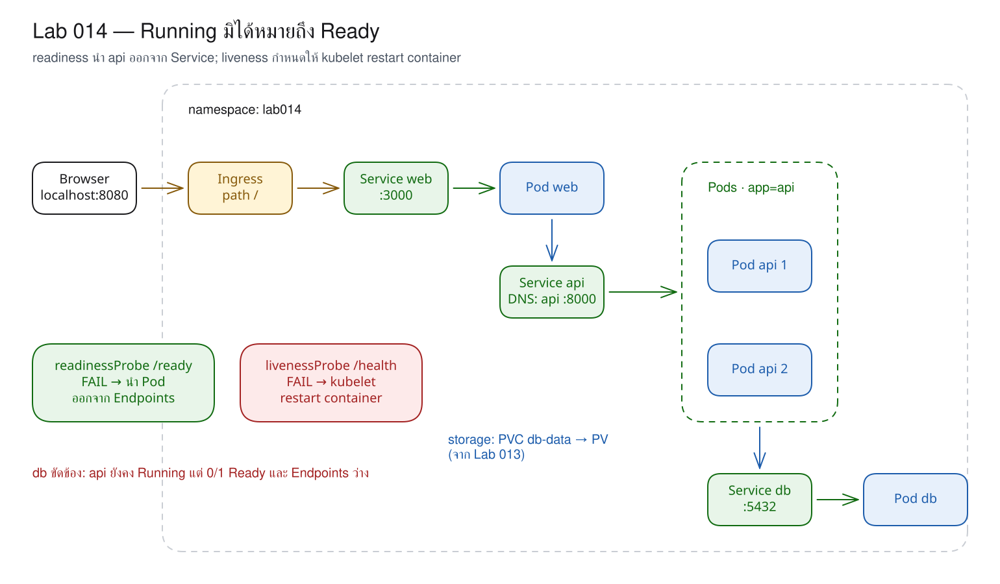
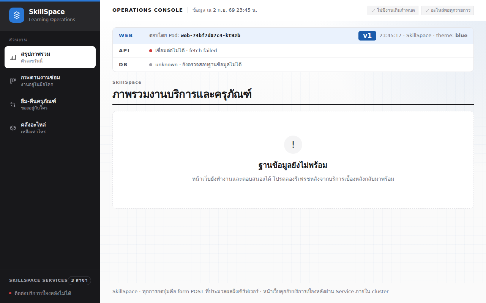
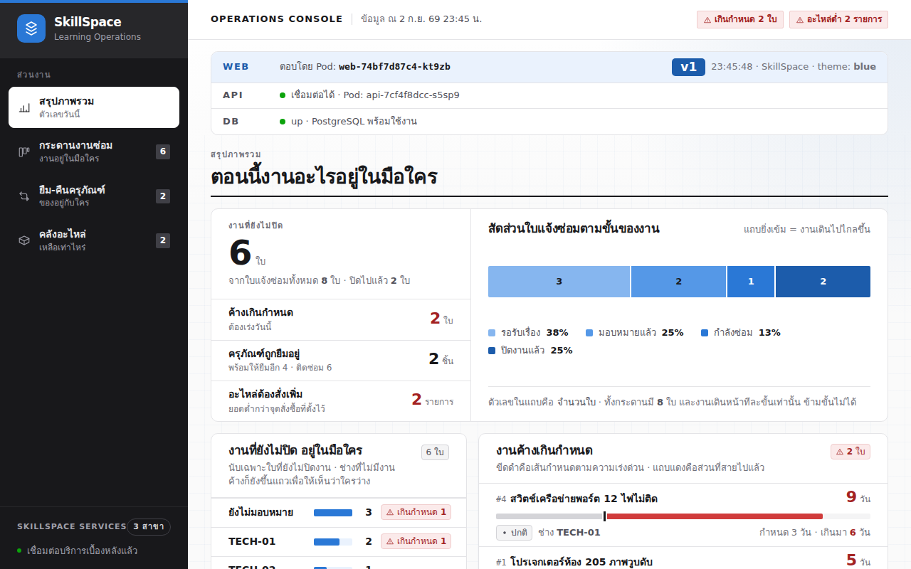

# LAB 14 — Running is not Ready : การส่งงานให้เฉพาะ Pod ที่พร้อมทำงาน

> โฟลเดอร์ `014-running-is-not-ready` = LAB 14 ของชุด Kubernetes ครั้งที่ 2
> (ไฟล์ของปฏิบัติการนี้: `manifests/` · `01-api-with-probes.yaml` · `02-api-bad-readiness.yaml`)

> 💡 **แนวคิดหลักของปฏิบัติการนี้:** สถานะ "Pod Running" ไม่ได้หมายความว่าแอปพลิเคชันพร้อมรับงาน

## วัตถุประสงค์ของปฏิบัติการ

เมื่อสิ้นสุดปฏิบัติการ ผู้เรียนจะสามารถ:

1. อธิบายได้ว่า phase `Running` บอกสถานะ process แต่ไม่ได้รับรอง dependency
2. อธิบายคำถามและผลลัพธ์ที่ต่างกันของ readiness กับ liveness ได้
3. อ่าน Events ของ probe ที่ตอบ 503 หรือ 404 ได้
4. เลือก endpoint สำหรับ probe โดยไม่ทำให้ dependency failure กลายเป็น restart loop

## แนวคิดและทฤษฎีที่เกี่ยวข้อง

Compose มี `healthcheck` และ `depends_on: condition: service_healthy` ส่วน Kubernetes ตรวจสอบสองประเด็นแยกกันตลอดอายุของ Pod ดังตารางต่อไปนี้:

| Probe | คำถาม | เมื่อไม่ผ่าน | เทียบกับ Compose |
|---|---|---|---|
| readiness | “ขณะนี้สามารถรับ request ได้หรือไม่” | ถอด Pod ออกจาก Service endpoints ชั่วคราว | `healthcheck` ใช้กับลำดับ start ได้ แต่ไม่ได้ถอดจาก Kubernetes Service |
| liveness | “process นี้ค้างหรือหยุดทำงานแล้วหรือไม่” | restart container | Compose healthcheck เพียงอย่างเดียวไม่กำหนดให้ restart เมื่อ unhealthy |

API ของ SkillSpace มี `/health` ที่ตรวจเฉพาะ process และ `/ready` ที่ส่ง `SELECT 1` ไปยัง PostgreSQL จริง การแยกสอง path ทำให้เมื่อ db ขัดข้อง API จะไม่ถูกยุติและเริ่มใหม่เป็นวงรอบโดยไม่จำเป็น

Service ไม่อ่าน phase `Running` โดยตรง แต่เลือกเฉพาะ Pod ที่ตรงกับ selector และมีสถานะ Ready ดังนั้นผู้ใช้จึงไม่ต้องรับ error จาก Pod ที่ยังไม่สามารถทำงานได้

## ผลการเรียนรู้ที่คาดหวัง

- เรียก `/health` และ `/ready` จากภายใน cluster ได้
- สังเกต API มีสถานะ `Running` แต่ `READY 0/1` ได้
- สังเกต endpoints ว่างเมื่อ db ถูก scale เป็นศูนย์ได้
- กำหนดให้ process อยู่ในภาวะผิดปกติและสังเกต liveness restart ได้
- ทดลอง probe path ที่ไม่มีอยู่จริงและวิเคราะห์ HTTP 404 ได้

## ภาพรวมของปฏิบัติการ

1. deploy ระบบครบสามชั้นและเพิ่ม probe ให้ API สอง replica
2. scale db ลงเป็นศูนย์แล้วคืนค่าเดิมเพื่อสังเกต readiness/endpoints
3. ทำให้ `/health` ตอบ 503 แล้วสังเกต liveness restart
4. กำหนด readiness path ที่ไม่ถูกต้อง แก้ไขให้ถูกต้อง และดำเนินการ Clean Re-run



> **คำถามนำก่อนเริ่มปฏิบัติการ:** หาก API process ยังเปิดพอร์ตได้แต่ไม่สามารถ query ฐานข้อมูล Service ควรส่งงานให้ Pod ดังกล่าวหรือไม่

## 0. การเตรียมสภาพแวดล้อมสำหรับปฏิบัติการ

เรียกใช้คำสั่งแรกบนเครื่องหลัก แล้วใช้ `docker exec` เพื่อเข้าสู่เครื่องเรียน; คำสั่งทั้งหมดหลังจากนั้นให้ป้อนในเครื่องเรียน เทอร์มินัลของเครื่องเรียนใช้ `localhost` พอร์ต 80 ส่วนเบราว์เซอร์บนเครื่องหลักใช้ `http://localhost:8080`

```bash
docker start devtools-k8s || docker run -d --name devtools-k8s --privileged --shm-size=1g --ulimit nofile=65536:65536 -p 2299:22 -p 8080:80 -p 8443:443 -p 3000:3000 -p 9090:9090 tuchsanai/devtools-k8s:2569_1
docker exec -it devtools-k8s bash
k8s-bootstrap
kubectl get nodes
docker exec devtools-control-plane crictl images | grep k8s-lab
```

> 📝 **คำอธิบาย:** `docker start` ใช้เครื่องเดิมหรือสร้างเครื่องใหม่ · `docker exec -it ... bash` เข้าสู่เครื่องเรียน · `k8s-bootstrap` สร้าง cluster และข้ามขั้นตอนโดยอัตโนมัติหากมีอยู่แล้ว · `get nodes` ตรวจสอบ cluster · `crictl images` ตรวจสอบ image ใน node

✅ **ผลลัพธ์ที่คาดหวัง (Expected output)** — cluster พร้อมใช้งานและมี image ครบถ้วน (ตัดบางคอลัมน์); ชื่อ node, AGE, version และ hash อาจแตกต่างกัน หากไม่พบ image ให้ดำเนินการ build/load ตาม LAB 001 หรือศึกษา README ระดับชุด:

```text
devtools-control-plane   Ready   control-plane   14m   v1.36.4
devtools-worker          Ready   <none>          13m   v1.36.4
devtools-worker2         Ready   <none>          13m   v1.36.4
k8s-lab-api  v1    c662b53377da4
k8s-lab-db   v1    9bb05e9c07722
k8s-lab-web  v1    c07ef6ef4b6a3
k8s-lab-web  v2    685541d4b6ff0
…
```

## 1. การดึงโค้ดของปฏิบัติการ (Clone)

```bash
mkdir -p ~/labwork && cd ~/labwork && git clone https://github.com/Tuchsanai/DevTools.git
cd ~/labwork/DevTools/05_kubernetes/02_Session2_Networking_Config_Storage/014-running-is-not-ready
```

> 📝 **คำอธิบาย:** เตรียม workspace · clone repository · เข้าสู่ LAB 14; หากมี repository แล้วให้ใช้ `git pull` ใน repository เดิมแทนการ clone ซ้ำ

✅ **ผลลัพธ์ที่คาดหวัง (Expected output)** — การ clone เริ่มทำงานและ `cd` ไม่แสดง error:

```text
Cloning into 'DevTools'...
```

## 2. การอ่าน YAML ของปฏิบัติการนี้

| ไฟล์ | kind | หน้าที่ในปฏิบัติการนี้ | แหล่งคำอธิบายโดยละเอียด |
|---|---|---|---|
| `manifests/01-pvc.yaml` | PersistentVolumeClaim | ขอพื้นที่ฐานข้อมูล | [Volume/PVC](../YAML_Guide.md#volume-pvc) |
| `manifests/02-secret.yaml` | Secret | รหัสผ่านสมมุติ | [Secret](../YAML_Guide.md#secret) |
| `manifests/03-db.yaml` | Deployment, Service | db พร้อม readiness แบบ `exec` | [Probes](../YAML_Guide.md#probes) |
| `manifests/04-api.yaml` | Deployment, Service | API baseline ที่ยังไม่มี probe | [Service](../YAML_Guide.md#service) |
| `manifests/05-web.yaml` | Deployment, Service | web เรียก API | [Service](../YAML_Guide.md#service) |
| `manifests/06-door.yaml` | Ingress | เปิดประตูไป web | [Ingress](../YAML_Guide.md#ingress) |
| `01-api-with-probes.yaml` | Deployment, Service | เพิ่ม readiness และ liveness ที่ถูกต้อง | [Probes](../YAML_Guide.md#probes) |
| `02-api-bad-readiness.yaml` | Deployment | จงใจใช้ readiness path `/readyz` | [Deployment](../YAML_Guide.md#deployment) · ตาราง error ด้านล่าง |

ใน `02-api-bad-readiness.yaml` ค่า `strategy.type: Recreate` หยุด Pod เดิมก่อนสร้างชุดใหม่ และ `rollingUpdate: null` ใช้ล้างค่า rollingUpdate เดิมที่อาจคงอยู่จากการ apply ระหว่างเปลี่ยน strategy

ส่วนจริงจาก `01-api-with-probes.yaml`:

```yaml
readinessProbe:
  httpGet:
    path: /ready
    port: http
  periodSeconds: 5
  timeoutSeconds: 2
  failureThreshold: 2
livenessProbe:
  httpGet:
    path: /health
    port: http
  initialDelaySeconds: 5
  periodSeconds: 10
  timeoutSeconds: 2
  failureThreshold: 3
```

| field | ความหมาย/ค่า default | เมื่อ fail หรือเปลี่ยน |
|---|---|---|
| `readinessProbe` | ไม่มี probe โดย default | fail → `READY 0/1` (Ready condition `False`) แต่ `STATUS` ยัง `Running`; ออกจาก endpoints และไม่ restart |
| `livenessProbe` | ไม่มี probe โดย default | fail ครบ threshold → restart Container |
| `startupProbe` | ไม่มีในไฟล์นี้และไม่มีโดย default | ถ้ามี จะกัน readiness/liveness ไว้จน startup ผ่าน |
| `httpGet` / `exec` | HTTP path+port หรือ command; db ใช้ `exec` จริง | path ผิดอาจได้ 404; exec exit non-zero คือ fail |
| เวลา 5 ค่า | `initialDelay=0`, `period=10`, `timeout=1`, `failure=3`, `success=1` วินาที/ครั้ง | liveness/startup กำหนด `successThreshold` ได้เพียง 1 |

**ข้อผิดพลาดที่พบบ่อยในปฏิบัติการนี้:** runlog มีข้อความจริง `Readiness probe failed: HTTP probe failed with statuscode: 404` จาก `/readyz`; readiness ที่ไม่ถูกต้องทำให้ endpoints ว่าง ส่วน liveness fail มี Event `Container api failed liveness probe, will be restarted`

ตรวจสอบ schema ได้ด้วย `kubectl explain deployment.spec.template.spec.containers.readinessProbe` และ `kubectl explain deployment.spec.template.spec.containers.livenessProbe.httpGet`

## 3. การ Deploy ระบบและเพิ่ม probes

ส่วน probe จากไฟล์ `01-api-with-probes.yaml` จริง:

```yaml
readinessProbe:
  httpGet:
    path: /ready
    port: http
  periodSeconds: 5
  timeoutSeconds: 2
  failureThreshold: 2
livenessProbe:
  httpGet:
    path: /health
    port: http
  initialDelaySeconds: 5
  periodSeconds: 10
  timeoutSeconds: 2
  failureThreshold: 3
```

> 📝 **คำอธิบาย:** `httpGet.path/port` ระบุ endpoint และ named port · `periodSeconds` คือช่วงห่างการตรวจ · `timeoutSeconds` จำกัดเวลาต่อครั้ง · `failureThreshold` คือจำนวนครั้งต่อเนื่องก่อนถือว่าล้มเหลว · `initialDelaySeconds` ของ liveness เว้นระยะเวลาให้ process เริ่มทำงานก่อนตรวจ

```bash
kubectl create namespace lab014
kubectl apply -f manifests/
kubectl apply -f 01-api-with-probes.yaml
kubectl rollout status deployment/api -n lab014 --timeout=180s
kubectl wait --for=condition=available deployment/db deployment/web -n lab014 --timeout=180s
```
> 📝 **คำอธิบาย:** สร้าง namespace แยก · `apply -f manifests/` สร้าง PVC, Secret, db, api, web และประตู · apply ไฟล์ probe เพื่อปรับ API · `rollout status` รอ rollout ทั้งชุดแทนการอ้าง Pod เดิมด้วย label · `wait` รอ db และ web · `--timeout` จำกัดเวลารอ

✅ **ผลลัพธ์ที่คาดหวัง (Expected output)** — API rollout สำเร็จและส่วนอื่นมีสถานะ available:

```text
namespace/lab014 created
persistentvolumeclaim/db-data created
secret/db-secret created
deployment.apps/db created
service/db created
deployment.apps/api created
service/api created
deployment.apps/web created
service/web created
ingress.networking.k8s.io/web created
deployment.apps/api configured
service/api unchanged
deployment "api" successfully rolled out
deployment.apps/db condition met
deployment.apps/web condition met
```

## 4. การตรวจสอบ endpoint ก่อนจำลองความล้มเหลว

```bash
kubectl get pods -n lab014 -l app=api -o wide
kubectl get endpoints api -n lab014
kubectl exec deployment/web -n lab014 -- wget -T 5 -qO- http://api:8000/health
kubectl exec deployment/web -n lab014 -- wget -T 5 -qO- http://api:8000/ready
```
> 📝 **คำอธิบาย:** `-l app=api` เลือก API Pod · `get endpoints` ตรวจสอบปลายทางที่ Service ส่งงานให้ · Warning deprecated หมายถึง object นี้ยังอ่านได้แต่ Kubernetes แนะนำ EndpointSlice สำหรับงานใหม่ · `wget -T 5` จำกัดเวลารอ · `/health` ไม่ตรวจ db · `/ready` query db จริง; Pod เดิมอาจยังแสดง `Terminating` ชั่วครู่หลัง rollout แต่ไม่อยู่ใน endpoints แล้ว

✅ **ผลลัพธ์ที่คาดหวัง (Expected output)** — API จำนวนสอง Pod มีสถานะ Ready และ endpoints มีสอง IP:
```text
NAME                   READY   STATUS        RESTARTS   AGE   IP            NODE               NOMINATED NODE   READINESS GATES
api-68c74dcd8c-4krgz   1/1     Running       0          18s   10.244.1.7    devtools-worker    <none>           <none>
api-68c74dcd8c-rgwjs   1/1     Running       0          7s    10.244.2.16   devtools-worker2   <none>           <none>
api-7c94cf584b-ml8zm   1/1     Terminating   0          18s   10.244.2.13   devtools-worker2   <none>           <none>
Warning: v1 Endpoints is deprecated in v1.33+; use discovery.k8s.io/v1 EndpointSlice
NAME   ENDPOINTS                          AGE
api    10.244.1.7:8000,10.244.2.16:8000   18s
{"status":"ok","pod":"api-68c74dcd8c-4krgz","version":"v1"}
{"status":"ready","db":"up","pod":"api-68c74dcd8c-rgwjs"}
```

## 5. การทำให้ db ไม่พร้อมใช้งานและการสังเกต readiness

```bash
kubectl scale deployment/db -n lab014 --replicas=0
sleep 15
kubectl get pods -n lab014 -l app=api -o wide
kubectl get endpoints api -n lab014
kubectl get events -n lab014 --sort-by=.lastTimestamp | grep -E 'Unhealthy.*api' | tail -2
curl --retry 0 -s http://localhost/info | jq -c '{api,db}'
```
> 📝 **คำอธิบาย:** `scale --replicas=0` ทำให้ db ไม่มี Pod · `sleep 15` รอ readiness สองครั้งตาม threshold · API ยังคงมีสถานะ Running แต่ endpoints ถอด Pod ออก · Events ระบุ 503 · `--retry 0` ปิด retry policy ของเครื่องเรียนเพื่ออ่านผลทันที

✅ **ผลลัพธ์ที่คาดหวัง (Expected output)** — API ยังคงมีสถานะ Running แต่มีค่า 0/1, endpoints ว่าง และ probe ตอบ 503 (ตัดบางคอลัมน์):
```text
…
api-68c74dcd8c-4krgz   0/1   Running   0   2m42s   10.244.1.7    devtools-worker
api-68c74dcd8c-rgwjs   0/1   Running   0   2m31s   10.244.2.16   devtools-worker2
Warning: v1 Endpoints is deprecated in v1.33+; use discovery.k8s.io/v1 EndpointSlice
NAME   ENDPOINTS
api
5s   Warning   Unhealthy   pod/api-68c74dcd8c-rgwjs   Readiness probe failed: HTTP probe failed with statuscode: 503
1s   Warning   Unhealthy   pod/api-68c74dcd8c-4krgz   Readiness probe failed: HTTP probe failed with statuscode: 503
{"api":{"configured":true,"reachable":false,"error":"fetch failed"},"db":{"status":"unknown"}}
```



## 6. การคืน db และการตรวจสอบการฟื้นตัวของระบบ

```bash
kubectl scale deployment/db -n lab014 --replicas=1
kubectl wait --for=condition=available deployment/db -n lab014 --timeout=180s
kubectl wait --for=condition=ready pod -n lab014 -l app=api --timeout=120s
kubectl get pods -n lab014 -l app=api
kubectl get endpoints api -n lab014
curl --retry 0 -s http://localhost/info | jq -c '{api,db}'
```
> 📝 **คำอธิบาย:** scale db กลับเป็นหนึ่ง · รอ readiness ของ PostgreSQL · ตรวจสอบ API เปลี่ยนจาก 0/1 เป็น 1/1 โดยไม่ restart · endpoints รับ IP กลับโดยอัตโนมัติ · `/info` ตรวจสอบเส้นทางจริง

✅ **ผลลัพธ์ที่คาดหวัง (Expected output)** — API ทั้งสองกลับสู่สถานะ Ready และ db มีสถานะ up (ตัดบางคอลัมน์):
```text
…
deployment.apps/db condition met
pod/api-68c74dcd8c-4krgz condition met
pod/api-68c74dcd8c-rgwjs condition met
api-68c74dcd8c-4krgz   1/1   Running   0   2m47s
api-68c74dcd8c-rgwjs   1/1   Running   0   2m36s
Warning: v1 Endpoints is deprecated in v1.33+; use discovery.k8s.io/v1 EndpointSlice
api   10.244.1.7:8000,10.244.2.16:8000   2m48s
{"api":{"configured":true,"reachable":true,"pod":"api-68c74dcd8c-4krgz"},"db":{"status":"up"}}
```



## 7. การพิสูจน์ liveness ด้วย process ที่กำหนดให้ผิดปกติโดยเจตนา

```bash
RESPONSE=$(kubectl exec deployment/web -n lab014 -- wget -T 5 -qO- --post-data='{"ok":false}' --header='Content-Type: application/json' http://api:8000/debug/health)
echo "$RESPONSE"
TARGET=$(printf '%s' "$RESPONSE" | jq -r .pod)
sleep 35
kubectl get pods -n lab014 -l app=api -o custom-columns='NAME:.metadata.name,READY:.status.containerStatuses[0].ready,RESTARTS:.status.containerStatuses[0].restartCount'
kubectl logs pod/$TARGET -n lab014 --previous --tail=12
kubectl get events -n lab014 --sort-by=.lastTimestamp | grep -E '(Liveness probe failed|failed liveness probe)' | tail -2
```
> 📝 **คำอธิบาย:** บันทึกชื่อ Pod ที่ตอบไว้ใน `TARGET` · `sleep 35` รอ liveness 10 วินาที × 3 ครั้งและเวลาเริ่มตรวจ · custom columns อ่านค่า restart · `logs --previous` อ่าน process ก่อนถูก restart · Events ยืนยันสาเหตุ

✅ **ผลลัพธ์ที่คาดหวัง (Expected output)** — Pod ที่ตอบคำสั่งมีค่า RESTARTS เพิ่มเป็น 1 แล้วกลับสู่สถานะ Ready:
```text
{"ok":false,"pod":"api-68c74dcd8c-4krgz"}
NAME                   READY   RESTARTS
api-68c74dcd8c-4krgz   true    1
api-68c74dcd8c-rgwjs   true    0
[api] GET /health 503 0ms
INFO:     10.244.1.1:36256 - "GET /health HTTP/1.1" 503 Service Unavailable
…
INFO:     Finished server process [1]
13s   Warning   Unhealthy   pod/api-68c74dcd8c-4krgz   Liveness probe failed: HTTP probe failed with statuscode: 503
13s   Normal    Killing     pod/api-68c74dcd8c-4krgz   Container api failed liveness probe, will be restarted
```

บล็อกนี้ตัดข้อความบางบรรทัดในส่วนกลางของ `logs --previous` ด้วย `…`; 503 เป็นผลที่กำหนดให้ liveness ตรวจพบก่อน restart

## 8. การทดลองจำลองความล้มเหลว — readiness path ไม่มีอยู่จริง

```bash
kubectl apply -f 02-api-bad-readiness.yaml
sleep 15
kubectl get pods -n lab014 -l app=api
kubectl get endpoints api -n lab014
kubectl get events -n lab014 --sort-by=.lastTimestamp | grep -E 'Readiness probe failed.*404' | tail -2
```
> 📝 **คำอธิบาย:** manifest ใช้ `/readyz` ซึ่ง API ไม่มีอยู่โดยเจตนา · strategy `Recreate` ทำให้สังเกต Pod ชุดที่ไม่ถูกต้องโดยไม่มี Pod เดิมรองรับ · Pod process ยังคงมีสถานะ Running แต่ readiness ตอบ 404 · Service ไม่มี endpoint

✅ **ผลลัพธ์ที่คาดหวัง (Expected output)** — Pod มีค่า 0/1, endpoints ว่าง และ Event ระบุ 404 (ตัดบางคอลัมน์):
```text
…
api-cc95575c6-qmgrl   0/1   Running   0   15s
api-cc95575c6-rt8f4   0/1   Running   0   15s
Warning: v1 Endpoints is deprecated in v1.33+; use discovery.k8s.io/v1 EndpointSlice
NAME   ENDPOINTS
api
2s   Warning   Unhealthy   pod/api-cc95575c6-rt8f4   Readiness probe failed: HTTP probe failed with statuscode: 404
2s   Warning   Unhealthy   pod/api-cc95575c6-qmgrl   Readiness probe failed: HTTP probe failed with statuscode: 404
```

แก้ไข path ให้ถูกต้องจาก source of truth:

```bash
kubectl apply -f 01-api-with-probes.yaml
kubectl rollout status deployment/api -n lab014 --timeout=180s
kubectl get pods -n lab014 -l app=api
kubectl get endpoints api -n lab014
```
> 📝 **คำอธิบาย:** apply manifest ที่ใช้ `/ready` · `rollout status` รอ Pod ชุดที่ถูกต้องและการ terminate ชุดเดิม · สองคำสั่งสุดท้ายยืนยันทั้ง Pod และ Service

✅ **ผลลัพธ์ที่คาดหวัง (Expected output)** — rollout สำเร็จ, API มีค่า 2/2 และ endpoints กลับมา (ตัดบางคอลัมน์):
```text
…
deployment.apps/api configured
service/api unchanged
deployment "api" successfully rolled out
api-7cf4f8dcc-9nhw2   1/1   Running   0
api-7cf4f8dcc-ps7dp   1/1   Running   0
Warning: v1 Endpoints is deprecated in v1.33+; use discovery.k8s.io/v1 EndpointSlice
api   10.244.1.21:8000,10.244.2.12:8000
```

## 9. แบบฝึกหัด (Exercise)

เพิ่ม `initialDelaySeconds` ให้ readiness แล้วอธิบายว่า delay เพียงเลื่อนเวลาที่ kubelet เริ่มตรวจสอบ จากนั้นเสนอค่า period/failure threshold ที่รวมกันไม่เกิน 30 วินาทีพร้อมเหตุผล

## วิธีตรวจสอบผลการทดลอง

```bash
kubectl get pods -n lab014
kubectl get endpoints api -n lab014
```
> 📝 **คำอธิบาย:** ตรวจสอบว่า API ทั้งสอง Pod มีสถานะ Ready และ Service มีสองปลายทาง; หลักฐาน response/log/Event ได้รับการตรวจสอบครบถ้วนในหัวข้อก่อนหน้าแล้ว

✅ **ผลลัพธ์ที่คาดหวัง (Expected output)** — API จำนวน 2 Pod มีค่า 1/1 และ endpoints มีสอง IP (ตัดบางคอลัมน์):

```text
…
api-7cf4f8dcc-9nhw2   1/1   Running   0   85s
api-7cf4f8dcc-ps7dp   1/1   Running   0   87s
Warning: v1 Endpoints is deprecated in v1.33+; use discovery.k8s.io/v1 EndpointSlice
api   10.244.1.21:8000,10.244.2.12:8000   4m45s
```

## ปัญหาที่พบบ่อยและแนวทางแก้ไข

| อาการ | สาเหตุที่พบบ่อย | แนวทางแก้ไข |
|---|---|---|
| API Running แต่ 0/1 | `/ready` เชื่อมต่อ db ไม่ได้ | ตรวจสอบ db Pod, Service และ API logs |
| API restart ทั้งหมดเมื่อ db ล่ม | ใช้ db check เป็น liveness | ย้าย dependency check ไป readiness |
| `kubectl wait -l` รอนานหลัง rollout | จับ Pod เก่าที่กำลัง terminate | ใช้ `kubectl rollout status deployment/api` |

## การล้างทรัพยากร (Cleanup) และการพิสูจน์การทำซ้ำจากสถานะเริ่มต้น (Clean Re-run)

```bash
kubectl delete namespace lab014
kubectl wait --for=delete namespace/lab014 --timeout=180s
kubectl create namespace lab014
kubectl apply -f manifests/
kubectl apply -f 01-api-with-probes.yaml
kubectl rollout status deployment/api -n lab014 --timeout=180s
kubectl wait --for=condition=available deployment/db deployment/web -n lab014 --timeout=180s
until curl --retry 0 -s http://localhost/info | jq -e '.api.reachable == true and .db.status == "up"' >/dev/null; do sleep 1; done
curl -s http://localhost/info | jq -c '{api,db}'
```
> 📝 **คำอธิบาย:** ลบและรอ namespace เดิม · สร้างทุก object จาก manifest · apply probe ที่ถูกต้อง · รอ rollout/availability · `/info` ยืนยันผลเดิมจากสถานะเริ่มต้น

✅ **ผลลัพธ์ที่คาดหวัง (Expected output)** — API จำนวนสอง replica พร้อมใช้งานและ db มีสถานะ up (ตัดบางแถว/ข้อความท้าย):
```text
…
namespace/lab014 created
deployment "api" successfully rolled out
deployment.apps/db condition met
deployment.apps/web condition met
{"api":{"configured":true,"reachable":true,"pod":"api-7cf4f8dcc-pvc5t"},"db":{"status":"up"}}
```

```bash
kubectl delete namespace lab014
kubectl wait --for=delete namespace/lab014 --timeout=180s
kubectl get all -n lab014
```
> 📝 **คำอธิบาย:** ลบ namespace รอบสุดท้าย · รอจนการลบเสร็จสมบูรณ์ · ตรวจสอบว่าไม่มี workload/Service คงค้าง

✅ **ผลลัพธ์ที่คาดหวัง (Expected output)** — สิ้นสุดโดยไม่มี resource คงค้าง:
```text
namespace "lab014" deleted
No resources found in lab014 namespace.
```

## สรุปคำสั่งของปฏิบัติการนี้

| คำสั่ง | ความหมาย |
|---|---|
| `kubectl get endpoints api` | ตรวจสอบ Pod ที่ Service ส่งงานให้จริง |
| `kubectl scale deployment/db --replicas=0` | จำลอง dependency ไม่พร้อมใช้งาน |
| `kubectl get events` | อ่านผล probe จาก kubelet |
| `kubectl rollout status deployment/api` | รอการเปลี่ยน Pod template จบ |
| `kubectl logs --previous` | อ่าน log ของ container ก่อน restart |

## สรุปสิ่งที่ได้เรียนรู้

`Running` ระบุเพียงว่า container process กำลังทำงาน ส่วน `Ready` ระบุว่าสามารถส่งงานให้ได้ในขณะนี้

- readiness fail ไม่ฆ่า container แต่ถอด IP จาก Service
- liveness fail จะ restart container เพื่อฟื้นตัวจากอาการค้าง
- probe path ผิดทำให้ระบบตัด Pod ดีออกได้ จึงต้องอ่าน Events

**ภาพรวมที่ควรจดจำ:** Running แสดงว่าเครื่องทำงาน ส่วน Ready แสดงว่าบริการพร้อมรับผู้ใช้

🧭 การเชื่อมโยงสู่ปฏิบัติการถัดไป: ปฏิบัติการ 015 ของการสอนครั้งที่ 3 จะประกอบ object หลายชนิดให้เป็นระบบเดียว

## ❓ คำถามทบทวนก่อนจบปฏิบัติการ

1. **readiness กับ liveness ตรวจสอบประเด็นแตกต่างกันอย่างไร** — readiness ตรวจว่าสามารถรับงานได้หรือไม่ ส่วน liveness ตรวจว่า process ยังทำงานอยู่หรือไม่
2. **เหตุใด `/ready` จึงต้อง query db จริง** — เพื่อไม่ส่งงานให้ API ที่เปิดพอร์ตแต่ไม่สามารถดำเนินงานทางธุรกิจได้
3. **เหตุใดจึงไม่กำหนด db check ใน liveness** — การขัดข้องของ db ไม่ได้เกิดจาก API และการ restart อย่างต่อเนื่องไม่สามารถแก้ไข dependency ได้

## ✅ รายการตรวจสอบก่อนจบปฏิบัติการ

- [ ] เห็น API Running แต่ READY 0/1 เมื่อ db ไม่พร้อมใช้งาน
- [ ] เห็น endpoints ว่างและกลับมาเอง
- [ ] เห็น liveness ทำให้ RESTARTS เพิ่ม
- [ ] อ่าน Event 503 และ 404 ได้
- [ ] อธิบาย readiness/liveness ได้

*ผลลัพธ์ที่คาดหวัง (expected output) และภาพหน้าจอในเอกสารนี้ได้มาจากการดำเนินการจริงบน tuchsanai/devtools-k8s:2569_1 (kind v0.33.0 · Kubernetes v1.36.4 · kubectl v1.37.0) เมื่อ 2 กันยายน 2026*
