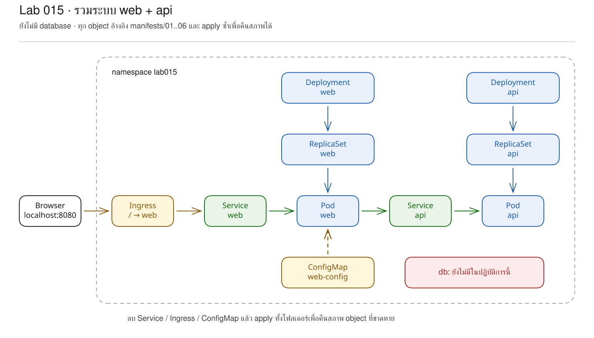
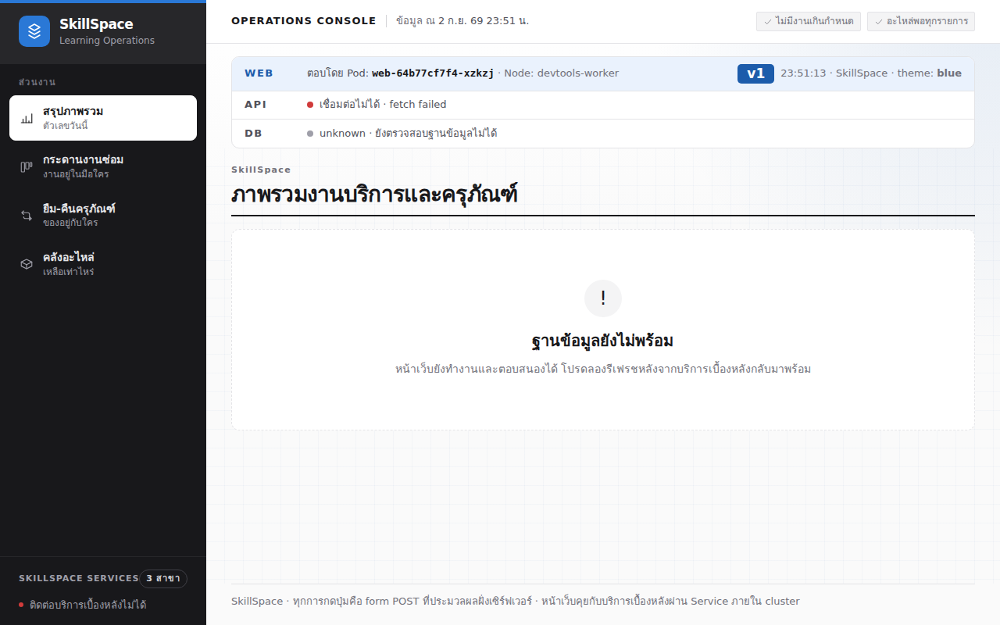

# LAB 15 — การประกอบ object ให้เป็นระบบแอปพลิเคชัน

> โฟลเดอร์ `015-assembling-a-real-application` = LAB 15 ของชุด Kubernetes ครั้งที่ 3
> (ไฟล์ของปฏิบัติการนี้: `manifests/01-configmap.yaml` ถึง `manifests/06-ingress.yaml`)

> 💡 **แนวคิดหลักของปฏิบัติการนี้:** แอปพลิเคชันจริงประกอบด้วยหลาย object ที่ทำงานร่วมกัน มิใช่ object เดี่ยว

## วัตถุประสงค์ของปฏิบัติการ

เมื่อสิ้นสุดปฏิบัติการ ผู้เรียนจะสามารถ:
1. อธิบายหน้าที่ของ Deployment, Service, ConfigMap และ Ingress ในระบบเดียวกันได้
2. ติดตามเส้นทาง request จาก browser ไปถึง web และ api Pod ได้
3. คาดการณ์อาการเมื่อ Service, Ingress หรือ ConfigMap สูญหายได้
4. อธิบายเหตุผลที่การ apply ทั้งโฟลเดอร์ซ้ำสามารถแก้ไขเฉพาะส่วนที่แตกต่างได้

## แนวคิดและทฤษฎีที่เกี่ยวข้อง

ใน Compose หนึ่ง service รวมเรื่อง process, network name และ runtime config ไว้ใน block เดียว
Kubernetes แยกความรับผิดชอบเป็น object ย่อยซึ่ง controller แต่ละส่วนดูแลโดยอิสระ ดังนี้:
| Compose | Kubernetes object | หน้าที่ในปฏิบัติการนี้ |
|---|---|---|
| `service: web` | web Deployment + Service | เรียกใช้งานหน้าเว็บสอง Pod และกำหนดชื่อ `web` |
| `service: api` | api Deployment + Service | เรียกใช้งาน API สอง Pod และกำหนดชื่อ `api` |
| `environment:` | ConfigMap | ส่ง SITE_NAME, THEME และ API_BASE_URL |
| `ports:` / proxy | Ingress | เปิด `/` จากภายนอกไป Service web |
ปฏิบัติการนี้ยังไม่กำหนด PostgreSQL โดยเจตนา การ์ด web และ api จึงเชื่อมต่อได้ ขณะที่ db แสดง `down`
นี่คือ baseline ที่ถูกต้องก่อนเพิ่มชั้นของระบบแบบ stateful ใน LAB 16
ไฟล์ใน `manifests/` คือ source of truth โดย object ที่สอดคล้องอยู่แล้วมีสถานะ `unchanged`
object ที่สูญหายมีสถานะ `created` และ object ที่แตกต่างมีสถานะ `configured`

## ผลการเรียนรู้ที่คาดหวัง

- สามารถ apply object หลายชนิดด้วยคำสั่งเดียว
- สามารถสังเกตการกระจาย web/api ไปยัง node ที่แตกต่างกัน
- สามารถเปิดระบบผ่าน Ingress ด้วย URL เดียว
- สามารถลบ API Service ขณะที่ Pod ยังอยู่ในสถานะ Running
- สามารถลบ Ingress และสังเกตการตอบสนอง 404 จาก ingress-nginx
- สามารถใช้ apply ซ้ำเพื่อสร้างเฉพาะ object ที่สูญหาย
- สามารถจำลองการไม่มี ConfigMap และสังเกตสถานะ `CreateContainerConfigError`
- สามารถพิสูจน์ว่า object เดิมยังให้บริการระหว่าง rollout ขณะที่ object ใหม่ยังไม่พร้อม

## ภาพรวมของปฏิบัติการ

1. ศึกษา manifest จำนวนหกไฟล์และจับคู่แต่ละไฟล์กับหน้าที่
2. apply ทั้งโฟลเดอร์และเปิดหน้าเว็บจริง
3. ลบ Service และ Ingress ทีละรายการ แล้ว apply เพื่อคืนสภาพ
4. เปรียบเทียบไฟล์กับสภาพจริง (actual state)
5. ลบ ConfigMap, restart web, วิเคราะห์อาการ และแก้ไขจากไฟล์
6. Cleanup และ Clean Re-run



> **คำถามนำก่อนเริ่มปฏิบัติการ:** หาก api Pod ยังอยู่ในสถานะ Running แต่ Service `api` สูญหาย หน้าเว็บจะค้นหา API ได้จากองค์ประกอบใดหรือไม่

## 0. การเตรียมสภาพแวดล้อมสำหรับปฏิบัติการ

```bash
docker start devtools-k8s || docker run -d --name devtools-k8s --privileged --shm-size=1g --ulimit nofile=65536:65536 -p 2299:22 -p 8080:80 -p 8443:443 -p 3000:3000 -p 9090:9090 tuchsanai/devtools-k8s:2569_1
docker exec -it devtools-k8s bash
k8s-bootstrap
kubectl get nodes
docker exec devtools-control-plane crictl images | grep k8s-lab
```
> 📝 **คำอธิบาย:** คำสั่งแรกเริ่ม container ที่มีอยู่เดิมหรือสร้างเครื่องใหม่ · `docker exec -it ... bash` ใช้เข้าสู่เครื่องเรียน (ให้ป้อนคำสั่งหลังจากนี้ทั้งหมดในเครื่องเรียน) · `k8s-bootstrap` จะข้ามขั้นตอนโดยอัตโนมัติหากมี cluster แล้ว · `get nodes` ใช้ตรวจสอบ cluster · `crictl images` ใช้ตรวจสอบ image ใน kind node
ในเทอร์มินัลของเครื่องเรียนให้ใช้ `localhost` (พอร์ต 80) ส่วนเบราว์เซอร์บนเครื่องของผู้เรียนให้ใช้ `localhost:8080`

✅ **ผลลัพธ์ที่คาดหวัง (Expected output)** — node พร้อมและมี image แอปพลิเคชันครบ โดยชื่อ node, AGE, image ID และ version อาจแตกต่างกัน:
```text
NAME                     STATUS   ROLES           AGE   VERSION
devtools-control-plane   Ready   control-plane   20m   v1.36.4
devtools-worker          Ready   <none>          20m   v1.36.4
devtools-worker2         Ready   <none>          20m   v1.36.4
docker.io/library/k8s-lab-api   v1   c662b53377da4   186MB
docker.io/library/k8s-lab-db    v1   9bb05e9c07722   300MB
docker.io/library/k8s-lab-web   v1   c07ef6ef4b6a3   209MB
docker.io/library/k8s-lab-web   v2   685541d4b6ff0   209MB
```
ชื่อ Pod, hash และ AGE ต่างกันได้ หาก `grep` ไม่แสดงผล ให้ดำเนินขั้นตอน build/load ใน README ระดับชุดหรือ LAB 001

## 1. การดึงโค้ดของปฏิบัติการ (Clone)

```bash
mkdir -p ~/labwork && cd ~/labwork && git clone https://github.com/Tuchsanai/DevTools.git
```
> 📝 **คำอธิบาย:** `mkdir -p` สร้าง workspace · `&&` ดำเนินคำสั่งถัดไปเมื่อคำสั่งก่อนหน้าสำเร็จ · `git clone` ดาวน์โหลด repository

✅ **ผลลัพธ์ที่คาดหวัง (Expected output)** — กระบวนการ clone เริ่มต้นสำเร็จ:
```text
Cloning into 'DevTools'...
```
```bash
cd ~/labwork/DevTools/05_kubernetes/03_Session3_Application_Deployment/015-assembling-a-real-application
pwd
```
> 📝 **คำอธิบาย:** `cd` ใช้เข้าสู่ LAB 15 ของการสอนครั้งที่ 3 · `pwd` ใช้ยืนยัน working directory ก่อน apply ทั้งโฟลเดอร์

✅ **ผลลัพธ์ที่คาดหวัง (Expected output)** — path มีค่าถูกต้อง:
```text
/root/labwork/DevTools/05_kubernetes/03_Session3_Application_Deployment/015-assembling-a-real-application
```
หากดำเนินการ clone ไว้แล้ว ให้ปรับปรุง repository ก่อน:
```bash
cd ~/labwork/DevTools && git pull
```
> 📝 **คำอธิบาย:** `git pull` ดึงและรวม commit ล่าสุดของ branch ปัจจุบัน

✅ **ผลลัพธ์ที่คาดหวัง (Expected output)** — repository เป็นเวอร์ชันล่าสุดแล้ว:
```text
Already up to date.
```

## 2. การอ่าน YAML ของปฏิบัติการนี้

การศึกษาระบบในปฏิบัติการนี้เริ่มจากชื่อไฟล์ซึ่งเรียงลำดับ `01-` ถึง `06-` กล่าวคือ config ตามด้วย workload และ network
แต่ละไฟล์ยังเป็น object อิสระ และ `kubectl apply -f manifests/` ส่งสภาพที่ต้องการ (desired state) ทั้ง directory

| ไฟล์ | kind | หน้าที่ในปฏิบัติการนี้ | รายละเอียดเพิ่มเติม |
|---|---|---|---|
| `manifests/01-configmap.yaml` | ConfigMap | ให้ `SITE_NAME`, `THEME`, `API_BASE_URL` แก่ web | [ทบทวน ConfigMap](../YAML_Guide.md#configmap) |
| `manifests/02-web-deployment.yaml` | Deployment | เรียกใช้งาน web 2 replicas และอ่าน ConfigMap | [ทบทวน Deployment](../YAML_Guide.md#deployment) |
| `manifests/03-web-service.yaml` | Service | ให้ชื่อคงที่ `web` และ port 3000 | [ทบทวน Service](../YAML_Guide.md#service) |
| `manifests/04-api-deployment.yaml` | Deployment | เรียกใช้งาน api 2 replicas | [ทบทวน Deployment](../YAML_Guide.md#deployment) |
| `manifests/05-api-service.yaml` | Service | ให้ web เรียก api ผ่านชื่อ `api` | [ทบทวน Service](../YAML_Guide.md#service) |
| `manifests/06-ingress.yaml` | Ingress | เปิด path `/` ไป Service web | [Ingress](../YAML_Guide.md#1-ingress) |

ให้พิจารณาชื่อก่อนเปิดไฟล์ โดย `01-configmap.yaml` ควรถูกอ้างโดย `02-web-deployment.yaml` และ label ของ
`02-web-deployment.yaml` ควรถูกเลือกโดย `03-web-service.yaml` และ Ingress ควรชี้ Service ไม่ใช่ Pod

**ข้อผิดพลาดที่พบบ่อยในปฏิบัติการนี้:** การลบ ConfigMap แล้ว restart ทำให้ Pod ใหม่มีสถานะ `CreateContainerConfigError`
runlog ระบุข้อความจริง `Error: configmap "web-config" not found` การ apply ทั้ง directory ซ้ำจึงเป็นการคืนสภาพระบบตาม source of truth

ศึกษารายละเอียดของ field ได้ด้วย `kubectl explain configmap.data`, `kubectl explain deployment.spec.template.spec` และ `kubectl explain ingress.spec.rules`

## 3. การตรวจสอบโฟลเดอร์ manifests ก่อน deploy

```bash
ls -1 manifests/
cat manifests/01-configmap.yaml
cat manifests/02-web-deployment.yaml
```
> 📝 **คำอธิบาย:** `ls -1` แสดงลำดับไฟล์ · `cat` แสดง YAML จริงทั้งไฟล์โดยไม่แก้ไข

✅ **ผลลัพธ์ที่คาดหวัง (Expected output)** — พบไฟล์ 01 ถึง 06 ตามลำดับ (ละข้อความส่วนท้ายจาก `cat` และแสดง YAML สำคัญในลำดับถัดไป):
```text
01-configmap.yaml
02-web-deployment.yaml
03-web-service.yaml
04-api-deployment.yaml
05-api-service.yaml
06-ingress.yaml
…
```
ส่วนที่ต้องสังเกตจาก `02-web-deployment.yaml` คือ:
```yaml
envFrom:
  - configMapRef:
      name: web-config
env:
  - name: POD_NAME
    valueFrom:
      fieldRef:
        fieldPath: metadata.name
  - name: NODE_NAME
    valueFrom:
      fieldRef:
        fieldPath: spec.nodeName
```
> 📝 **คำอธิบาย:** `envFrom` นำทุก key จาก ConfigMap เข้า environment · `configMapRef.name` ชี้ `web-config` · `fieldRef` อ่านข้อมูลของ Pod · `metadata.name` สร้าง `POD_NAME` · `spec.nodeName` สร้าง `NODE_NAME`

## 4. การ Apply ระบบทั้งชุด

```bash
kubectl create namespace lab015
kubectl apply -f manifests/
kubectl rollout status deployment/web -n lab015 --timeout=180s
kubectl rollout status deployment/api -n lab015 --timeout=180s
kubectl get all,ingress,configmap -n lab015 -o wide
```
> 📝 **คำอธิบาย:** สร้าง namespace ของปฏิบัติการ · `apply -f manifests/` อ่าน YAML ทุกไฟล์ใน directory · `rollout status` รอ Deployment แต่ละรายการ · `get all,ingress,configmap` รวม object ที่ `all` ไม่ครอบคลุม · `-o wide` แสดง node/IP

✅ **ผลลัพธ์ที่คาดหวัง (Expected output)** — web/api พร้อมอย่างละสอง Pod และ Ingress เปิด port 80 (ละบางแถว):
```text
configmap/web-config created
…
ingress.networking.k8s.io/web created
deployment "web" successfully rolled out
deployment "api" successfully rolled out
deployment.apps/web   2/2   2   2
deployment.apps/api   2/2   2   2
```

## 5. การเปิดหน้าเว็บและตรวจสอบสถานะที่กำหนดไว้

```bash
kubectl exec deployment/web -n lab015 -- wget -qO- http://api:8000/health
until curl -sf http://localhost/info >/dev/null; do sleep 1; done
curl -s http://localhost/info | jq -c '{pod,version,theme,api,db}'
kubectl logs deployment/api -n lab015 --tail=8
```
> 📝 **คำอธิบาย:** `exec` พิสูจน์ web เรียก api ด้วย Service DNS · `/health` ไม่ต้องมี db · `/info` แสดง Pod ที่ตอบจริง · `logs --tail=8` ยืนยันว่า API เปิดบริการแม้ db ยังไม่มี

✅ **ผลลัพธ์ที่คาดหวัง (Expected output)** — web กับ api เชื่อมต่อกัน ส่วน db อยู่ในสถานะ down ตามแผน:
```text
{"status":"ok","pod":"api-59d8fcb74b-v86vp","version":"v1"}
{"pod":"web-64b77cf7f4-c487j","version":"v1","theme":"blue","api":{"configured":true,"reachable":true,"pod":"api-59d8fcb74b-5llqm"},"db":{"status":"down","error":"[Errno -5] No address associated with hostname"}}
[api] startup db=down ([Errno -5] No address associated with hostname) — API ยังให้บริการต่อ
```
ชื่อ Pod, node, IP, hash และเวลาต่างกันได้


## 6. การถอด Service และ Ingress ทีละองค์ประกอบ

ให้ลบ API Service ก่อนโดยไม่เปลี่ยนแปลง API Pod:
```bash
kubectl delete service api -n lab015
kubectl get pods,service,endpoints -n lab015
curl -s http://localhost/info | jq -c '{pod,version,theme,api,db}'
```
> 📝 **คำอธิบาย:** `delete service` ลบชื่อ DNS และส่วนกระจายโหลด · `get pods,service,endpoints` พิสูจน์ว่า API Pod ยังอยู่ในสถานะ Running แต่เส้นทางเชื่อมต่อสูญหาย · `/info` แสดงอาการที่ web ตรวจพบ

✅ **ผลลัพธ์ที่คาดหวัง (Expected output)** — API Pod ยังคงมีสถานะ 1/1 แต่สถานะหน้าเว็บเป็น unreachable:
```text
service "api" deleted from lab015 namespace
pod/api-59d8fcb74b-5llqm   1/1   Running
pod/api-59d8fcb74b-v86vp   1/1   Running
Warning: v1 Endpoints is deprecated in v1.33+; use discovery.k8s.io/v1 EndpointSlice
{"pod":"web-64b77cf7f4-xzkzj","version":"v1","theme":"blue","api":{"configured":true,"reachable":false,"error":"fetch failed"},"db":{"status":"down","error":"[Errno -5] No address associated with hostname"}}
```
คำเตือนเกิดเพราะ Kubernetes 1.33+ แนะนำ EndpointSlice แทน Endpoints แต่ไม่ทำให้การทดลองล้มเหลว


ให้ใช้ source of truth แก้ไขระบบ แล้วทดสอบทางเข้า:
```bash
kubectl apply -f manifests/
kubectl exec deployment/web -n lab015 -- sh -c 'until wget -qO- http://api:8000/health; do sleep 2; done'
kubectl delete ingress web -n lab015
for i in $(seq 1 4); do curl -s -o /dev/null -w "%{http_code}\n" http://localhost/; sleep 2; done
kubectl apply -f manifests/
```
> 📝 **คำอธิบาย:** apply สร้าง Service ที่สูญหาย · loop `wget` รอ DNS/endpoint หากปรากฏ `bad address` ให้รอ 5–10 วินาทีแล้วเรียกใช้งานอีกครั้ง · loop `curl` แสดงช่วงที่ ingress-nginx ดำเนินการ sync · apply คืนค่าทางเข้า

✅ **ผลลัพธ์ที่คาดหวัง (Expected output)** — Service ถูกสร้างคืน จากนั้น Ingress เปลี่ยนจาก 200 เป็น 404 และถูกสร้างคืน:
```text
service/api created
{"status":"ok","pod":"api-59d8fcb74b-5llqm","version":"v1"}
ingress.networking.k8s.io "web" deleted from lab015 namespace
200
200
404
404
ingress.networking.k8s.io/web created
```
การเปลี่ยน rule ไม่เกิดพร้อมคำสั่ง delete ในทันที เพราะ ingress controller ต้อง sync configuration ก่อน

## 7. การเปรียบเทียบไฟล์กับสภาพจริง

```bash
kubectl get -f manifests/
kubectl diff -f manifests/ || true
kubectl get pods -n lab015 -o wide
```
> 📝 **คำอธิบาย:** `get -f` ขอ object ที่ประกาศในไฟล์แทนการจำชนิด · `diff -f` เทียบ desired กับ live · `|| true` ให้ขั้นเรียนต่อได้เมื่อ diff ใช้ exit code 1 เพื่อบอกว่าต่าง · `-o wide` แสดงการกระจาย Pod ข้าม node

✅ **ผลลัพธ์ที่คาดหวัง (Expected output)** — พบ object ครบทุกรายการ diff ว่าง และ Pod กระจายอยู่บน worker สอง node:
```text
configmap/web-config   3
deployment.apps/web   2/2   2   2
service/web   ClusterIP
deployment.apps/api   2/2   2   2
service/api   ClusterIP
ingress.networking.k8s.io/web   nginx   *   80
web-64b77cf7f4-c487j   1/1   Running   devtools-worker2
api-59d8fcb74b-5llqm   1/1   Running   devtools-worker
```

## 8. การทดลองจำลองความล้มเหลว — การลบ ConfigMap แล้ว restart web

```bash
kubectl delete configmap web-config -n lab015
kubectl rollout restart deployment/web -n lab015
sleep 5
kubectl get pods -n lab015 -l app=web
kubectl get events -n lab015 --sort-by=.lastTimestamp | tail -15
curl -s -o /dev/null -w "%{http_code}\n" http://localhost/
```
> 📝 **คำอธิบาย:** ลบ config ที่ Pod ใหม่ต้องอ่าน · `rollout restart` เปลี่ยน Pod template เพื่อสร้าง revision ใหม่ · `get pods` แสดงว่า Pod ใหม่ทำงานผิดพลาดขณะที่ Pod เดิมยังคงอยู่ · Events ระบุชื่อ ConfigMap · HTTP ใช้ตรวจสอบว่าผู้ใช้ยังเข้าถึงเว็บผ่าน Pod เดิมได้

✅ **ผลลัพธ์ที่คาดหวัง (Expected output)** — Pod ใหม่มีสถานะ `CreateContainerConfigError` และ Event ระบุ not found แต่เว็บยังตอบสนองด้วย 200:
```text
web-5d848685f6-qt5nt   0/1   CreateContainerConfigError   0   12s
web-64b77cf7f4-c487j   1/1   Running                      0   100s
web-64b77cf7f4-xzkzj   1/1   Running                      0   100s
Warning  Failed  Error: configmap "web-config" not found
200
```
คืนสภาพจาก manifest ทั้งชุด:
```bash
kubectl apply -f manifests/
kubectl rollout status deployment/web -n lab015 --timeout=180s
kubectl get pods -n lab015 -l app=web
curl -s http://localhost/info | jq -c '{pod,version,theme,api,db}'
```
> 📝 **คำอธิบาย:** apply สร้าง ConfigMap ที่สูญหาย ขณะที่ object อื่นมีสถานะ unchanged · rollout ดำเนินการต่อโดยอัตโนมัติเมื่อ Pod ใหม่อ่าน config ได้ · ตรวจสอบ Pod และผลตอบสนองจริง

✅ **ผลลัพธ์ที่คาดหวัง (Expected output)** — ConfigMap ถูกสร้าง rollout เสร็จสมบูรณ์ และ API กลับสู่สถานะ reachable:
```text
configmap/web-config created
deployment.apps/web unchanged
deployment "web" successfully rolled out
web-5d848685f6-j5f9q   1/1   Running
{"pod":"web-5d848685f6-j5f9q","version":"v1","theme":"blue","api":{"configured":true,"reachable":true,"pod":"api-59d8fcb74b-5llqm"},"db":{"status":"down","error":"[Errno -5] No address associated with hostname"}}
```

## 9. แบบฝึกหัด (Exercise)

ให้จัดทำตาราง object จำนวนหกรายการ แล้วคาดการณ์อาการเมื่อ replicas ของ web เป็นศูนย์โดยยังไม่เรียกใช้งาน
จากนั้นทดลองใน namespace ของผู้เรียนและอธิบายว่า Ingress, Service และ endpoints รายการใดยังคงอยู่
เกณฑ์ความสำเร็จคือสามารถจำแนก “object สูญหาย” ออกจาก “object ยังคงอยู่แต่ไม่มีปลายทาง” ได้

## วิธีตรวจสอบผลการทดลอง

```bash
kubectl get all,ingress,configmap -n lab015
kubectl get endpoints -n lab015
kubectl exec deployment/web -n lab015 -- wget -qO- http://api:8000/health
curl -s http://localhost/info | jq -c '{pod,version,theme,api,db}'
kubectl logs deployment/api -n lab015 --tail=8
```
> 📝 **คำอธิบาย:** ตรวจ object, endpoint, การเรียกภายใน, เส้นทางภายนอก และ log แอปให้ครบทั้งสามแหล่งหลักฐาน · `--tail` จำกัดหลักฐานล่าสุด

✅ **ผลลัพธ์ที่คาดหวัง (Expected output)** — web/api พร้อมอย่างละสอง Pod endpoints มี IP และ api อยู่ในสถานะ reachable แม้ db อยู่ในสถานะ down:
```text
deployment.apps/api   2/2   2   2
deployment.apps/web   2/2   2   2
api   10.244.1.29:8000,10.244.2.17:8000
web   10.244.1.28:3000,10.244.2.16:3000
{"pod":"web-5d848685f6-j5f9q","version":"v1","theme":"blue","api":{"configured":true,"reachable":true,"pod":"api-59d8fcb74b-5llqm"},"db":{"status":"down","error":"[Errno -5] No address associated with hostname"}}
```

## ปัญหาที่พบบ่อยและแนวทางแก้ไข

| อาการ | สาเหตุที่พบบ่อย | วิธีแก้ |
|---|---|---|
| API Pod Running แต่ web fetch failed | ไม่มี Service `api` หรือ DNS cache ยังไม่หมดอายุ | apply manifests แล้วทดสอบ `/health` จาก web |
| หน้า Ingress ตอบ 404 หลัง apply | controller ยังไม่ sync rule | poll HTTP 200 และตรวจสอบ ingress-nginx Pod |
| web Pod เป็น CreateContainerConfigError | `web-config` ไม่มี | ตรวจสอบ Events แล้ว apply `01-configmap.yaml` |
| การ์ด db แดง | LAB 15 ตั้งใจยังไม่มี db | ไป LAB 16 เพื่อเพิ่ม Secret/PVC/db |
| `kubectl diff` ไม่มี output | live state ตรงกับไฟล์ | ถือว่าเป็นผลสำเร็จ มิใช่ความผิดปกติของคำสั่ง |

## การล้างทรัพยากร (Cleanup) และการพิสูจน์การทำซ้ำจากสถานะเริ่มต้น (Clean Re-run)

```bash
kubectl delete namespace lab015
kubectl wait --for=delete namespace/lab015 --timeout=180s
kubectl create namespace lab015
kubectl apply -f manifests/
kubectl rollout status deployment/web -n lab015 --timeout=180s
kubectl rollout status deployment/api -n lab015 --timeout=180s
for i in $(seq 1 15); do code=$(curl -s -o /dev/null -w "%{http_code}" http://localhost/); echo "HTTP $code"; [ "$code" = 200 ] && break; sleep 2; done
curl -s http://localhost/info | jq -c '{pod,version,theme,api,db}'
```
> 📝 **คำอธิบาย:** ลบและรอ namespace เดิม · สร้างจาก source of truth · รอ Deployment · ตรวจสอบ Ingress ซ้ำจน controller ประสานกฎเสร็จสมบูรณ์ · หยุด loop เมื่อ HTTP 200 · `/info` ยืนยันผลเดิม

✅ **ผลลัพธ์ที่คาดหวัง (Expected output)** — Clean Re-run สำเร็จหลังจาก Ingress ดำเนินการ sync:
```text
namespace/lab015 created
deployment "web" successfully rolled out
deployment "api" successfully rolled out
HTTP 404
HTTP 200
{"pod":"web-64b77cf7f4-wrdhw","version":"v1","theme":"blue","api":{"configured":true,"reachable":true,"pod":"api-59d8fcb74b-zndcm"},"db":{"status":"down","error":"[Errno -5] No address associated with hostname"}}
```
```bash
kubectl delete namespace lab015
kubectl wait --for=delete namespace/lab015 --timeout=180s
kubectl get all -n lab015
```
> 📝 **คำอธิบาย:** ลบ namespace รอบสุดท้าย · รอจน API server ยืนยันการลบ · ตรวจสอบว่าไม่มี workload และ Service คงค้าง

✅ **ผลลัพธ์ที่คาดหวัง (Expected output)** — การล้างทรัพยากรเสร็จสมบูรณ์:
```text
namespace "lab015" deleted
No resources found in lab015 namespace.
```

## สรุปคำสั่งของปฏิบัติการนี้

| คำสั่ง | ความหมาย |
|---|---|
| `kubectl apply -f manifests/` | ทำให้สภาพจริงตรงกับทุกไฟล์ในโฟลเดอร์ |
| `kubectl rollout restart deployment/web` | สร้าง Pod revision ใหม่ |
| `kubectl get events` | อ่านสาเหตุจาก controller/kubelet |

## สรุปสิ่งที่ได้เรียนรู้

ระบบจริงประกอบด้วย object หลายรายการซึ่งรับผิดชอบหน้าที่แตกต่างกันและเชื่อมโยงกันด้วยชื่อและ labels
- Deployment ดูแลจำนวนและการเปลี่ยน Pod
- Service ให้ชื่อคงที่และเลือกปลายทาง
- ConfigMap ส่งค่ากำหนดการทำงานโดยไม่ฝังใน image
- Ingress เป็นประตูจากภายนอกเข้าสู่ Service
- apply ทั้งโฟลเดอร์สามารถสร้าง object ที่สูญหายคืนได้ตามแนวทาง declarative
**ภาพรวมที่ควรจดจำ:** Deployment สร้างหน่วยประมวลผลงาน Service กำหนดจุดติดต่อกลาง ConfigMap ส่งค่ากำหนด และ Ingress กำหนดทางเข้า
🧭 การเชื่อมโยงสู่ปฏิบัติการถัดไป: LAB 16 จะเพิ่ม PostgreSQL, Secret และ PVC เพื่อให้ระบบนี้มีองค์ประกอบครบสามชั้น

## ❓ คำถามทบทวนก่อนจบปฏิบัติการ

1. **แต่ละ object มีหน้าที่ใด?** — Deployment เรียกใช้งานและดูแล Pod, Service กำหนดชื่อและ endpoint, ConfigMap กำหนดค่า และ Ingress เปิดทางเข้า
2. **การขาดองค์ประกอบแต่ละรายการก่อให้เกิดผลใด?** — เมื่อขาด API Service web จะไม่พบ API เมื่อขาด Ingress การเข้าถึงจากภายนอกจะได้รับ 404 และเมื่อขาด ConfigMap Pod ใหม่จะเริ่มทำงานไม่ได้
3. **เหตุใดจึงสามารถ apply ทั้งโฟลเดอร์ซ้ำได้?** — declarative apply เปรียบเทียบ desired กับ actual และเปลี่ยนแปลงเฉพาะส่วนที่แตกต่าง

## ✅ รายการตรวจสอบก่อนจบปฏิบัติการ

- [ ] web และ api Deployment พร้อมอย่างละสอง Pod
- [ ] เปิด `http://localhost:8080` ได้
- [ ] เห็นชื่อ web/api Pod บนการ์ดสถานะ
- [ ] อธิบายเหตุผลที่ db down เป็นผลลัพธ์ที่ถูกต้องใน LAB 15 ได้
- [ ] ลบ Service/Ingress แล้วอ่านอาการได้
- [ ] ซ่อม ConfigMap ด้วย apply ทั้งโฟลเดอร์ได้
- [ ] Clean Re-run ผ่านหลังรอ Ingress sync
- [ ] ลบ namespace `lab015` แล้ว
*ผลลัพธ์ที่คาดหวัง (expected output) และภาพหน้าจอในเอกสารนี้ได้มาจากการดำเนินการจริงบน tuchsanai/devtools-k8s:2569_1 (kind v0.33.0 · Kubernetes v1.36.4 · kubectl v1.37.0) เมื่อ 2 กันยายน 2026*
