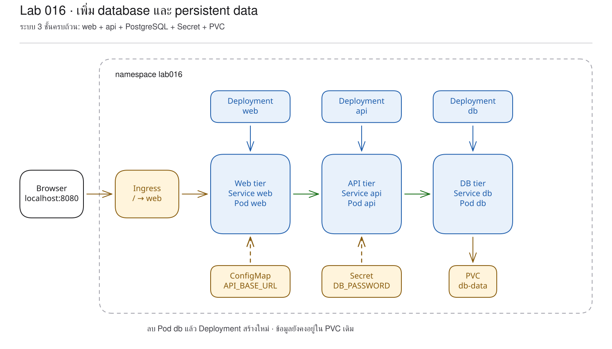
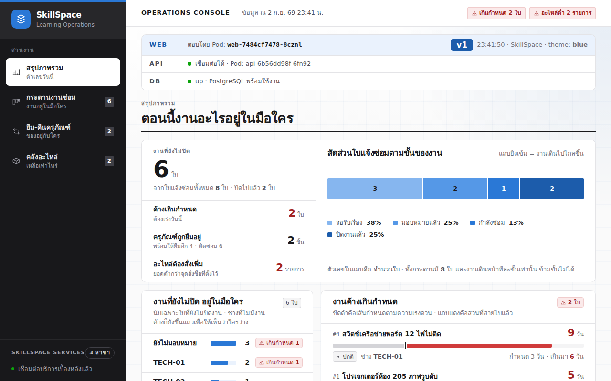
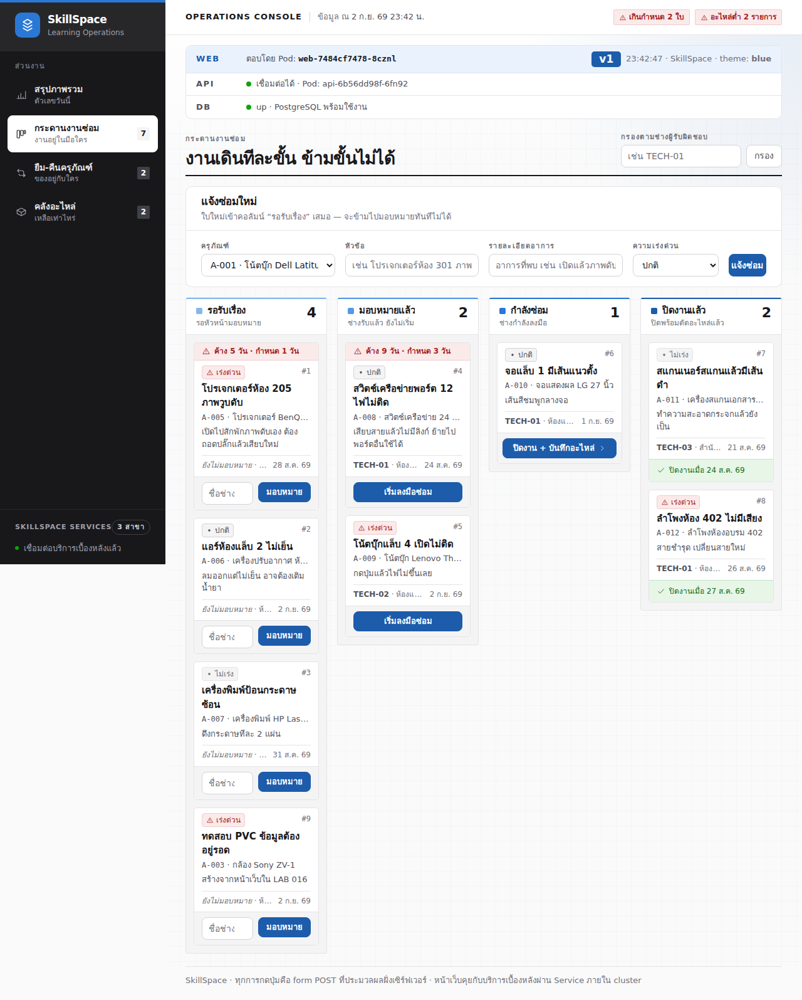

# LAB 16 — การเพิ่มฐานข้อมูลและข้อจำกัดของการ scale ชั้นข้อมูล

> โฟลเดอร์ `016-adding-a-database` = LAB 16 ของชุด Kubernetes ครั้งที่ 3
> (ไฟล์ของปฏิบัติการนี้: `manifests/01-configmap.yaml` ถึง `manifests/10-db-service.yaml` และ `images/`)

> 💡 **แนวคิดหลักของปฏิบัติการนี้:** องค์ประกอบที่บันทึกข้อมูลต้องใช้แนวทางการดูแลแตกต่างจากองค์ประกอบที่ไม่บันทึกข้อมูล

## วัตถุประสงค์ของปฏิบัติการ

1. อธิบายได้ว่า stateless กับ stateful ต่างกันอย่างไรในทางปฏิบัติ
2. อธิบายบทบาทของ Secret, PVC และ Service ที่ทำให้ PostgreSQL เป็นชั้นข้อมูลของระบบ
3. พิสูจน์ได้ว่าข้อมูลบน PVC ยังคงอยู่ แม้ DB Pod ถูกลบและสร้างใหม่
4. วิเคราะห์อาการผิดปกติเมื่อกำหนดให้ PostgreSQL สอง process ใช้ data directory เดียวกันได้

## แนวคิดและทฤษฎีที่เกี่ยวข้อง

web และ api เป็น stateless กล่าวคือ Pod ใหม่เริ่มจาก image เดิม รับ request และดำเนินงานโดยไม่ต้องคงไฟล์ประจำหน่วยไว้ จึงเพิ่มหรือลด replica ได้โดยสะดวก

PostgreSQL เป็น stateful กล่าวคือ process สามารถสร้างใหม่ได้ แต่ข้อมูลต้องมีเจ้าของ ตำแหน่งบันทึก และข้อกำหนดการเขียนที่ชัดเจน ปฏิบัติการนี้ใช้ PVC ขอพื้นที่ `1Gi` และ mount ที่ `/var/lib/postgresql/data`

| ประเด็น | web / api (stateless) | PostgreSQL (stateful) |
|---|---|---|
| สร้าง Pod ใหม่ | เริ่มรับงานจาก image เดิม | ต้องกลับมาเข้าถึง data directory เดิมได้ |
| scale | เพิ่ม replica ได้โดยตรง | ต้องออกแบบ replication และเจ้าของข้อมูล |
| สิ่งที่ต้องรักษา | config และ image version | ข้อมูล, ลำดับการเริ่ม, backup |
| object ที่ช่วย | Deployment + Service | PVC + Deployment; งานจริงมักใช้ StatefulSet/managed DB |

Secret ในปฏิบัติการนี้แยกรหัสผ่านจำลอง `labpass` ออกจาก Deployment ส่วน PVC แยกข้อมูลออกจากวงจรชีวิตของ Pod ทั้งนี้ PVC มิใช่ backup และไม่ทำให้ PostgreSQL scale โดยอัตโนมัติ

## ผลการเรียนรู้ที่คาดหวัง

- สามารถตรวจสอบระบบ SkillSpace ที่มีเส้นทาง web → api → db ผ่าน URL เดียว
- สามารถตรวจสอบการอ่าน `DB_PASSWORD` จาก Secret ของ API
- สามารถพิสูจน์ว่า ticket ที่สร้างจากหน้าเว็บยังคงอยู่หลัง DB Pod เปลี่ยนชื่อ
- สามารถเพิ่ม web และ api เป็น 3 replicas ได้โดยไม่ผูกกับดิสก์
- สามารถวิเคราะห์ความเสี่ยงเมื่อ PostgreSQL สอง process ใช้ PVC เดียวกัน
- สามารถอ่านหลักฐานจาก `kubectl get`, application log และหน้าเว็บ
- สามารถพิสูจน์ว่า manifests ชุดเดิมสร้างระบบใหม่จาก namespace ว่างได้

## ภาพรวมของปฏิบัติการ

1. สร้าง namespace และ apply manifest 10 ไฟล์
2. ตรวจสอบระบบครบสามชั้นจาก terminal หน้าเว็บ และ log
3. สร้าง ticket แล้วลบ DB Pod เพื่อพิสูจน์ persistence
4. scale stateless workload แล้วเปรียบเทียบกับ database
5. ลบ Secret โดยเจตนา วิเคราะห์อาการ และแก้ไขจาก manifest
6. Cleanup, Clean Re-run และการลบทรัพยากรเมื่อสิ้นสุด



> **คำถามนำก่อนเริ่มปฏิบัติการ:** หาก web เพิ่มจาก 1 เป็น 3 replicas ได้ด้วยคำสั่งเดียว เหตุใด PostgreSQL จึงไม่ควรดำเนินการในลักษณะเดียวกันบน PVC เดียว

## 0. การเตรียมสภาพแวดล้อมสำหรับปฏิบัติการ

ให้เปิดเครื่องเรียนจาก host หากมี container เดิม คำสั่งแรกจะเริ่ม container ดังกล่าว และหากยังไม่มีจึงสร้าง container ใหม่
```bash
docker start devtools-k8s || docker run -d --name devtools-k8s --privileged --shm-size=1g --ulimit nofile=65536:65536 -p 2299:22 -p 8080:80 -p 8443:443 -p 3000:3000 -p 9090:9090 tuchsanai/devtools-k8s:2569_1
docker exec -it devtools-k8s bash
k8s-bootstrap
kubectl get nodes
docker exec devtools-control-plane crictl images | grep k8s-lab
```
> 📝 **คำอธิบาย:** เข้าสู่เครื่องเรียนด้วย `docker exec -it` (ให้ป้อนคำสั่งหลังจากนี้ทั้งหมดในเครื่องเรียน) · `k8s-bootstrap` ข้ามขั้นตอนโดยอัตโนมัติหากมี cluster แล้ว · `get nodes` ตรวจสอบ cluster · `crictl images` ตรวจสอบ image ใน kind node

ในเทอร์มินัลของเครื่องเรียนให้ใช้ `localhost` (พอร์ต 80) ส่วนเบราว์เซอร์บนเครื่องของผู้เรียนให้ใช้ `localhost:8080`

✅ **ผลลัพธ์ที่คาดหวัง (Expected output)** — node ทั้ง 3 อยู่ในสถานะ `Ready` และพบ image แอปพลิเคชัน 4 รายการ (ชื่อ Pod, IP, AGE และ image ID อาจแตกต่างกัน):
```text
NAME                     STATUS   ROLES           AGE   VERSION
devtools-control-plane   Ready    control-plane   92s   v1.36.4
devtools-worker          Ready    <none>          81s   v1.36.4
devtools-worker2         Ready    <none>          81s   v1.36.4
docker.io/library/k8s-lab-api   v1   1b0af425a075d   186MB
docker.io/library/k8s-lab-db    v1   35984a84885cb   300MB
docker.io/library/k8s-lab-web   v1   2a74c90a62059   209MB
docker.io/library/k8s-lab-web   v2   7bedccdeefc86   209MB
```

หาก `grep` ไม่แสดงผล ให้ดำเนินขั้นตอน build/load ใน README ระดับชุดหรือ LAB 001

## 1. การดึงโค้ดของปฏิบัติการ (Clone)

```bash
mkdir -p ~/labwork && cd ~/labwork
git clone https://github.com/Tuchsanai/DevTools.git
cd ~/labwork/DevTools/05_kubernetes/03_Session3_Application_Deployment/016-adding-a-database
```
> 📝 **คำอธิบาย:** `mkdir -p` สามารถสร้าง path ซ้ำได้ · `&&` ดำเนินขั้นตอนถัดไปเมื่อขั้นตอนก่อนหน้าสำเร็จ · `git clone` ดาวน์โหลด repository · `cd` เข้าสู่โฟลเดอร์ LAB 16

✅ **ผลลัพธ์ที่คาดหวัง (Expected output)** — การ clone สำเร็จและ prompt อยู่ในโฟลเดอร์ปฏิบัติการ:
```text
Cloning into 'DevTools'...
```

หากดำเนินการ clone ไว้แล้ว ไม่ต้อง clone ซ้ำ ให้เข้าสู่ `~/labwork/DevTools` และใช้ `git pull` ก่อน `cd` เข้าสู่ปฏิบัติการ

## 2. การอ่าน YAML ของปฏิบัติการนี้

ชุดไฟล์นี้แบ่งเป็นสองกลุ่ม: `01-06` ประกอบ web/api เดิม ส่วน `07-10` เติม Secret, PVC และ db
การเปลี่ยน `04-api-deployment.yaml` คือจุดเชื่อมฐานข้อมูลเข้ากับระบบเดิม

| ไฟล์ | kind | หน้าที่ในปฏิบัติการนี้ | รายละเอียดเพิ่มเติม |
|---|---|---|---|
| `manifests/01-configmap.yaml` | ConfigMap | กำหนดชื่อเว็บและ URL ของ api | [ทบทวน ConfigMap](../YAML_Guide.md#configmap) |
| `manifests/02-web-deployment.yaml` | Deployment | เรียกใช้งาน web พร้อม readiness | [ทบทวน Deployment](../YAML_Guide.md#deployment) · [ทบทวน Probes](../YAML_Guide.md#probes) |
| `manifests/03-web-service.yaml` | Service | เป็นปลายทางคงที่ของ web | [ทบทวน Service](../YAML_Guide.md#service) |
| `manifests/04-api-deployment.yaml` | Deployment | อ่าน Secret แล้วเชื่อม db | [ทบทวน Deployment](../YAML_Guide.md#deployment) · [ทบทวน Secret](../YAML_Guide.md#secret) |
| `manifests/05-api-service.yaml` | Service | ให้ web เรียก api ด้วย DNS | [ทบทวน Service](../YAML_Guide.md#service) |
| `manifests/06-ingress.yaml` | Ingress | แยก `/api` กับ `/` | [Ingress](../YAML_Guide.md#1-ingress) |
| `manifests/07-secret.yaml` | Secret | บันทึกค่าเชื่อมต่อ PostgreSQL ของปฏิบัติการ | [ทบทวน Secret](../YAML_Guide.md#secret) |
| `manifests/08-pvc.yaml` | PersistentVolumeClaim | ขอ storage 1Gi แบบ ReadWriteOnce | [ทบทวน PVC](../YAML_Guide.md#pvc) |
| `manifests/09-db-deployment.yaml` | Deployment | mount PVC และใช้ `Recreate` | [strategy](../YAML_Guide.md#3-strategy) |
| `manifests/10-db-service.yaml` | Service | ให้ api เรียก db ที่ port 5432 | [ทบทวน Service](../YAML_Guide.md#service) |

สังเกตว่า `resources.requests.storage` ของ PVC คือ “ขอพื้นที่” ไม่ใช่ container resources;
ส่วน `strategy.type: Recreate` อยู่ที่ Deployment เพราะไม่ต้องการให้ db สอง Pod ใช้ data directory พร้อมกัน

**ข้อผิดพลาดที่พบบ่อยในปฏิบัติการนี้:** การลบ Secret แล้ว restart api ทำให้ Pod ใหม่มีสถานะ `CreateContainerConfigError`
runlog บันทึกสถานะนี้จริง ให้ `kubectl describe pod` ระบุ key/Secret ที่ขาด แล้ว apply `07-secret.yaml` คืน

ศึกษารายละเอียดของ field ได้ด้วย `kubectl explain deployment.spec.strategy`, `kubectl explain pvc.spec.resources.requests` และ `kubectl explain pod.spec.containers.env.valueFrom.secretKeyRef`

## 3. การสร้างระบบสามชั้นจาก manifest

ไฟล์ใหม่ที่ทำให้ระบบจาก LAB 15 มีฐานข้อมูลคือ `07-secret.yaml`, `08-pvc.yaml`, `09-db-deployment.yaml` และ `10-db-service.yaml`; `04-api-deployment.yaml` ได้รับการกำหนดให้ใช้ Secret
```yaml
env:
  - name: DB_PORT
    value: "5432"       # กันการชนกับ Service env ชื่อ DB_PORT
  - name: DB_PASSWORD
    valueFrom:
      secretKeyRef:
        name: db-secret
        key: POSTGRES_PASSWORD
```
```yaml
volumeMounts:
  - name: data
    mountPath: /var/lib/postgresql/data
volumes:
  - name: data
    persistentVolumeClaim:
      claimName: db-data
```

`secretKeyRef` ไม่เปิดเผยค่าใน Pod template · `claimName` ผูก Pod กับ PVC · `PGDATA` ในไฟล์เต็มชี้ไป subdirectory `pgdata` · ทุก image ของแอปใช้ `imagePullPolicy: IfNotPresent`
```bash
kubectl create namespace lab016
kubectl apply -f manifests/
kubectl wait -n lab016 --for=condition=available deploy/db deploy/api deploy/web --timeout=180s
```
> 📝 **คำอธิบาย:** `create namespace` สร้าง namespace แยกสำหรับปฏิบัติการ · `apply -f manifests/` ส่ง YAML ทุกไฟล์ในโฟลเดอร์ · `wait` รอจน Deployment ทั้งสามมี Available replica · `--timeout=180s` ยุติการรอเมื่อเกินสามนาที

✅ **ผลลัพธ์ที่คาดหวัง (Expected output)** — object ทั้ง 10 รายการถูกสร้างและ Deployment ทั้งสามผ่าน condition:
```text
namespace/lab016 created
configmap/web-config created
deployment.apps/web created
service/web created
deployment.apps/api created
service/api created
ingress.networking.k8s.io/skillspace created
secret/db-secret created
persistentvolumeclaim/db-data created
deployment.apps/db created
service/db created
deployment.apps/db condition met
deployment.apps/api condition met
deployment.apps/web condition met
```

## 4. การตรวจสอบหลักฐานจากสามแหล่ง

```bash
kubectl get all,ingress,pvc,secret,configmap -n lab016
until curl -sf http://localhost/info >/dev/null; do sleep 1; done
curl -s http://localhost/info | jq -c '{pod,version,theme,api,db}'
kubectl logs -n lab016 deploy/api --tail=5
```
> 📝 **คำอธิบาย:** `get all,ingress,pvc,secret,configmap` ตรวจสอบ compute, network, storage และ config พร้อมกัน · `curl -s` ไม่แสดง progress · `/info` เป็นหลักฐานปัจจุบันจาก web · `jq` จัดรูปแบบ JSON · `logs deploy/api` ให้ Kubernetes เลือก Pod ภายใต้ Deployment · `--tail=5` จำกัดผลลัพธ์ไว้ที่ห้าบรรทัดล่าสุด

✅ **ผลลัพธ์ที่คาดหวัง (Expected output)** — Pod พร้อมจำนวน 3 รายการ PVC มีสถานะ `Bound` JSON ระบุ `db.status=up` และ log มี `/ready 200` (ชื่อ Pod, IP, AGE และเวลาอาจแตกต่างกัน):
```text
persistentvolumeclaim/db-data   Bound   pvc-cc676cd3-3115-4fc5-85df-c1511d5a926c   1Gi   RWO
{"pod":"web-7484cf7478-8cznl","version":"v1","theme":"blue","api":{"configured":true,"reachable":true,"pod":"api-6b56dd98f-6fn92"},"db":{"status":"up"}}
[api] GET /ready 200 7ms
```

(ตัดบางแถวจาก `kubectl get`; ชื่อ Pod, IP และ AGE ต่างกันได้)

ให้เปิด `http://localhost:8080` และตรวจสอบว่าการ์ด WEB, API และ DB มีสถานะพร้อมทั้งสามแถว



## 5. การพิสูจน์ความคงอยู่ของข้อมูลหลัง DB Pod เกิดใหม่

เปิด `http://localhost:8080/tickets` เลือกครุภัณฑ์ กรอกหัวข้อ `ทดสอบ PVC ข้อมูลต้องอยู่รอด` แล้วกด **แจ้งซ่อม** จากนั้นตรวจ record และลบ DB Pod
```bash
curl -s http://localhost/api/tickets | jq -c '.[-1] | {id,title,status}'
kubectl get pod -n lab016 -l app=db -o name
kubectl delete pod -n lab016 -l app=db
kubectl wait -n lab016 --for=condition=ready pod -l app=db --timeout=120s
kubectl get pod -n lab016 -l app=db -o name
curl -s http://localhost/api/tickets | jq -c '.[-1] | {id,title,status}'
```
> 📝 **คำอธิบาย:** `.[-1] | {id,title,status}` เลือก record สุดท้ายและ field ที่แสดง · `-l app=db` เลือก Pod ด้วย label · `delete pod` ไม่ลบ PVC · `wait` รอ DB ใหม่พร้อมก่อนอ่านซ้ำ · path `/api` ผ่าน Ingress ที่มากับ manifest ของปฏิบัติการนี้

✅ **ผลลัพธ์ที่คาดหวัง (Expected output)** — ชื่อ DB Pod เปลี่ยนแปลง แต่ ticket `#9` และข้อความเดิมยังคงอยู่ (suffix และเวลาอาจแตกต่างกัน):
```text
{"id":9,"title":"ทดสอบ PVC ข้อมูลต้องอยู่รอด","status":"NEW"}
pod/db-7dd8b59fd7-2sbkr
pod "db-7dd8b59fd7-2sbkr" deleted from lab016 namespace
pod/db-7dd8b59fd7-86jqs condition met
pod/db-7dd8b59fd7-86jqs
{"id":9,"title":"ทดสอบ PVC ข้อมูลต้องอยู่รอด","status":"NEW"}
```



## 6. การเปรียบเทียบการ scale แบบ stateless

```bash
kubectl scale -n lab016 deploy/web deploy/api --replicas=3
kubectl wait -n lab016 --for=condition=available deploy/web deploy/api --timeout=120s
kubectl get pods -n lab016 -l 'app in (web,api)'
kubectl scale -n lab016 deploy/web deploy/api --replicas=1
```
> 📝 **คำอธิบาย:** `scale` เปลี่ยน desired replicas · ระบุ Deployment สองตัวในคำสั่งเดียว · `--replicas=3` ต้องการอย่างละสาม Pod · selector แบบ set `app in (...)` เลือกสองค่า · คำสั่งสุดท้ายคืน baseline อย่างละหนึ่ง

✅ **ผลลัพธ์ที่คาดหวัง (Expected output)** — web และ api มีอย่างละ 3 Pod โดยทุกรายการอยู่ในสถานะ `1/1 Running` และสามารถ scale คืนได้ (ชื่อ Pod และ AGE อาจแตกต่างกัน):
```text
deployment.apps/web scaled
deployment.apps/api scaled
api-6b56dd98f-6fn92    1/1   Running   0   2m26s
api-6b56dd98f-84dgh    1/1   Running   0   7s
api-6b56dd98f-dcsls    1/1   Running   0   7s
web-7484cf7478-8cznl   1/1   Running   0   6m21s
web-7484cf7478-kbk2c   1/1   Running   0   7s
web-7484cf7478-zhsmz   1/1   Running   0   7s
deployment.apps/web scaled
deployment.apps/api scaled
```

## 7. การทดลองจำลองความล้มเหลว — PostgreSQL สอง process เขียน PVC เดียวกัน

ให้คาดการณ์ล่วงหน้าว่า Pod ที่สองจะอยู่ในสถานะ `Pending`, crash หรือ `Ready` ผลจริงบน local-path provisioner ในการทดลองนี้มีความเสี่ยงมากกว่าความล้มเหลวที่ปรากฏชัดเจน
```bash
kubectl scale -n lab016 deploy/db --replicas=2
kubectl get pods -n lab016 -l app=db -o wide
kubectl logs -n lab016 $(kubectl get pods -n lab016 -l app=db --sort-by=.metadata.creationTimestamp -o name | tail -1) --tail=20
kubectl scale -n lab016 deploy/db --replicas=1
kubectl rollout status -n lab016 deploy/db --timeout=120s
sleep 30
kubectl get pods -n lab016
```
> 📝 **คำอธิบาย:** `--replicas=2` จงใจให้ PostgreSQL สอง process ใช้ claim เดียว · `-o wide` ตรวจว่าอยู่ node ใด · `--sort-by` เรียงตามเวลาสร้าง · `tail -1` เลือก Pod ล่าสุด · `logs` อ่านพฤติกรรมจริงของฐานข้อมูล · scale กลับหนึ่งทันทีเพื่อลดความเสี่ยง

✅ **ผลลัพธ์ที่คาดหวัง (Expected output)** — Pod ที่สองมีสถานะ Ready บน node เดียวกัน และ log มี `automatic recovery` หลังลด replica และรอ rollout จะเหลือ DB หนึ่ง Pod (ชื่อ Pod/เวลาอาจแตกต่างกัน):
```text
db-7dd8b59fd7-86jqs   1/1   Running   0   2m7s   devtools-worker
db-7dd8b59fd7-n6cvl   1/1   Running   0   35s    devtools-worker
PostgreSQL Database directory appears to contain a database; Skipping initialization
LOG: database system was interrupted
LOG: database system was not properly shut down; automatic recovery in progress
deployment.apps/db scaled
deployment "db" successfully rolled out
db-7dd8b59fd7-86jqs   1/1   Running   0   2m40s
```

สาเหตุคือ `ReadWriteOnce` อนุญาตให้หลาย Pod บน node เดียวกันใช้งานร่วมกันได้ จึงมิใช่ mutex สำหรับป้องกัน database สอง process ผลจริงแตกต่างจากที่มักคาดการณ์ (`CrashLoopBackOff`/`Pending`) ดังนั้นต้องใช้ replication ที่ PostgreSQL รองรับร่วมกับ StatefulSet ซึ่งมี PVC แยก หรือใช้ managed database

## 8. การทดลองจำลองความล้มเหลว — การลบ Secret และคืนสภาพ

```bash
kubectl delete secret -n lab016 db-secret
kubectl rollout restart -n lab016 deploy/api
sleep 8
kubectl get pods -n lab016 -l app=api
kubectl apply -f manifests/07-secret.yaml
kubectl rollout status -n lab016 deploy/api --timeout=120s
curl -s http://localhost/info | jq -c '{pod,version,theme,api,db}'
```
> 📝 **คำอธิบาย:** `delete secret` นำ dependency ของ Pod ใหม่ออก · `rollout restart` บังคับให้สร้าง Pod จาก template เดิม · เมื่อพบ `CreateContainerConfigError` ต้องวิเคราะห์ว่า config ขาดก่อนตรวจสอบ log · `apply` คืน source of truth · `rollout status` ยืนยันการแก้ไข · `/info` ตรวจสอบเส้นทางจนถึง DB

✅ **ผลลัพธ์ที่คาดหวัง (Expected output)** — Pod ใหม่ไม่สามารถเริ่มทำงานเพราะ Secret สูญหาย ขณะที่ Pod เดิมยังให้บริการ เมื่อ apply คืนแล้ว rollout สำเร็จและ DB กลับสู่สถานะ `up` (ชื่อ Pod อาจแตกต่างกัน):
```text
secret "db-secret" deleted from lab016 namespace
deployment.apps/api restarted
api-6b56dd98f-6fn92    1/1   Running                      0   4m6s
api-7b7c458b55-nd6lb   0/1   CreateContainerConfigError   0   8s
secret/db-secret created
deployment "api" successfully rolled out
{"pod":"web-7484cf7478-8cznl","version":"v1","theme":"blue","api":{"configured":true,"reachable":true,"pod":"api-7b7c458b55-nd6lb"},"db":{"status":"up"}}
```

## 9. แบบฝึกหัด (Exercise)

เปลี่ยนขนาด PVC ในไฟล์จาก `1Gi` เป็น `2Gi` แล้วใช้ `kubectl diff -f manifests/08-pvc.yaml` เพื่อคาดการณ์ว่า storage class นี้สามารถขยาย volume เดิมได้หรือไม่ ห้าม apply จนกว่าจะตรวจสอบ diff และ `kubectl describe storageclass standard` เสร็จสมบูรณ์

เกณฑ์สำเร็จ: อธิบายได้ว่า PVC คือ “คำขอพื้นที่” ไม่ใช่ระบบฐานข้อมูล และบอกได้ว่าต้องตรวจ `allowVolumeExpansion` ก่อนแก้ไขทรัพยากรจริง

## วิธีตรวจสอบผลการทดลอง

```bash
kubectl get pods,svc,endpoints,pvc -n lab016
kubectl get events -n lab016 --sort-by=.lastTimestamp
curl -s http://localhost/info | jq -c '{pod,version,theme,api,db}'
kubectl logs -n lab016 deploy/api --tail=10
```
> 📝 **คำอธิบาย:** `pods,svc,endpoints,pvc` ครอบคลุม workload เส้นทางเครือข่าย และ storage · `events --sort-by` เรียงเหตุการณ์ตามเวลา · `/info` แสดงหลักฐานจากผู้ใช้ · `logs` แสดงหลักฐานจากแอปพลิเคชัน

✅ **ผลลัพธ์ที่คาดหวัง (Expected output)** — Pod ทั้งสามอยู่ในสถานะ Ready, Service มี endpoints, PVC มีสถานะ Bound, `/info` ระบุว่า api reachable และ db up และ log ไม่มี error ต่อเนื่อง:
```text
NAME                       READY   STATUS    RESTARTS
pod/api-7b7c458b55-nd6lb   1/1     Running   0
pod/db-7dd8b59fd7-86jqs    1/1     Running   1
pod/web-7484cf7478-8cznl   1/1     Running   0
{"pod":"web-7484cf7478-8cznl","version":"v1","theme":"blue","api":{"configured":true,"reachable":true,"pod":"api-7b7c458b55-nd6lb"},"db":{"status":"up"}}
```

## ปัญหาที่พบบ่อยและแนวทางแก้ไข

| อาการ | สาเหตุที่พบบ่อย | วิธีแก้ |
|---|---|---|
| API `/ready` 503 และ error `Servname not supported` | ไม่กำหนด `DB_PORT`; Service env ชื่อเดียวกันมีค่า `tcp://...` | กำหนด `DB_PORT: "5432"` ใน API Deployment แล้ว apply |
| API Pod เป็น `CreateContainerConfigError` | `db-secret` ไม่มี หรือ key ไม่ตรง | ตรวจสอบ Events แล้ว apply `07-secret.yaml` |
| PVC ค้าง `Pending` | provisioner ยังไม่พร้อมหรือยังไม่มี consumer | ตรวจสอบ PVC Events และ `local-path-provisioner` |
| DB Pod ใหม่เริ่มทำงานได้ แต่ข้อมูลสูญหาย | mount/claim ผิด หรือสร้าง namespace ใหม่ซึ่งได้ PVC ใหม่ | ตรวจ `volumeMounts`, `claimName` และ PV ที่ Bound |
| DB สอง process ปรากฏว่ามีสถานะ Ready | RWO ยังอนุญาตให้ mount หลาย Pod บน node เดียว | ลดเหลือหนึ่ง ตรวจสอบ log/data และออกแบบ replication อย่างถูกต้อง |

## การล้างทรัพยากร (Cleanup) และการพิสูจน์การทำซ้ำจากสถานะเริ่มต้น (Clean Re-run)

ให้ลบ namespace ทั้งหมด รอจนการลบเสร็จสมบูรณ์ สร้างระบบใหม่จากไฟล์เดิม ตรวจสอบผล และลบอีกครั้งเมื่อสิ้นสุด
```bash
kubectl delete namespace lab016 --wait=true
kubectl get all -n lab016
kubectl create namespace lab016
kubectl apply -f manifests/
kubectl wait -n lab016 --for=condition=available deploy/db deploy/api deploy/web --timeout=180s
until BODY=$(curl -fsS http://localhost/info); do sleep 2; done
echo "$BODY" | jq -c '{pod,version,theme,api,db}'
kubectl delete namespace lab016 --wait=true
kubectl get all -n lab016
```
> 📝 **คำอธิบาย:** `delete namespace --wait=true` รอให้ทรัพยากรใน namespace `lab016` ถูกลบ · `get all` พิสูจน์ว่าไม่เหลือ workload · สร้าง/apply/wait คือ Clean Re-run · `curl` พิสูจน์ผลเดิมจากระบบใหม่ · สองคำสั่งท้ายจบสะอาด

✅ **ผลลัพธ์ที่คาดหวัง (Expected output)** — ระบบรอบใหม่มีองค์ประกอบครบสามชั้น และหลังการลบครั้งสุดท้ายไม่เหลือ resource (ชื่อ Pod/เวลาอาจแตกต่างกัน):
```text
namespace "lab016" deleted
No resources found in lab016 namespace.
namespace/lab016 created
deployment.apps/db condition met
deployment.apps/api condition met
deployment.apps/web condition met
{"pod":"web-7484cf7478-vmtk5","version":"v1","theme":"blue","api":{"configured":true,"reachable":true,"pod":"api-6b56dd98f-slc8z"},"db":{"status":"up"}}
namespace "lab016" deleted
No resources found in lab016 namespace.
```

## สรุปคำสั่งของปฏิบัติการนี้

| คำสั่ง | ความหมาย |
|---|---|
| `kubectl apply -f manifests/` | ทำให้สภาพจริง (actual state) ตรงกับ manifest ทั้งชุด |
| `kubectl get all,ingress,pvc -n lab016` | ตรวจสอบ workload, ทางเข้า และ storage |
| `kubectl delete pod -l app=db` | ทดสอบสร้าง DB Pod ใหม่โดยไม่ลบ PVC |
| `kubectl scale deploy/... --replicas=N` | เปลี่ยน desired replicas |
| `kubectl logs ...` | อ่านพฤติกรรมจริงของ process |
| `kubectl rollout restart/status` | สร้าง Pod ใหม่และติดตามผล |
| `kubectl delete namespace ... --wait=true` | ลบ resource ของปฏิบัติการและรอจนการลบเสร็จสมบูรณ์ |

## สรุปสิ่งที่ได้เรียนรู้

ระบบครบสามชั้นมิได้หมายความว่าทุกชั้นดูแลเหมือนกัน:

- web/api สร้างทดแทนและ scale ได้ เพราะไม่ถือข้อมูลถาวรใน Pod
- PVC ทำให้ข้อมูลยังคงอยู่หลังจากเปลี่ยน DB Pod แต่ไม่ทำ replication และไม่ใช่ backup
- Secret เป็น dependency ระหว่างการสร้าง container; หาก Secret สูญหาย Pod เดิมอาจยังคงทำงาน แต่ Pod ใหม่ไม่สามารถเริ่มทำงานได้
- อาการ `Ready` เพียงอย่างเดียวไม่เพียงพอที่จะสรุปว่า database scale ถูกต้อง ต้องอ่าน log และตรวจความถูกต้องของข้อมูล

**ภาพรวมที่ควรจดจำ:** stateless Pod เปรียบเสมือนบุคลากรที่เปลี่ยนเวรได้ ส่วน database เปรียบเสมือนสมุดบัญชีซึ่งเปลี่ยนผู้ดูแลได้ แต่ไม่ควรให้สองบุคคลเขียนเล่มเดียวกันโดยไม่มีข้อกำหนด

🧭 การเชื่อมโยงสู่ปฏิบัติการถัดไป: LAB 17 จะกำหนด Ingress เป็นทางเข้าหลักเพียงจุดเดียว โดยแยก `/` ไปยัง web และ `/api` ไปยัง api

## ❓ คำถามทบทวนก่อนจบปฏิบัติการ

1. **stateless กับ stateful ต่างกันอย่างไรในทางปฏิบัติ?** — stateless ลบ สร้างใหม่ และเพิ่มจำนวน replica ได้โดยไม่มีข้อมูลติด Pod; stateful ต้องรักษาดิสก์ เจ้าของข้อมูล ลำดับ และ backup
2. **เหตุใดการ scale DB เป็น 2 จึงไม่ถือว่าสำเร็จ แม้ทั้งคู่มีสถานะ Ready?** — readiness ตรวจสอบเพียงว่า process ตอบสนองได้ แต่ไม่ยืนยันความปลอดภัยของ concurrent writes โดย log รอบนี้แสดง recovery และ Pod เดิม restart
3. **หากต้องการ PostgreSQL หลาย process ควรดำเนินการอย่างไร?** — ใช้ replication ที่ PostgreSQL รองรับร่วมกับ StatefulSet/PVC แยก หรือ managed database

## ✅ รายการตรวจสอบก่อนจบปฏิบัติการ

- [ ] อธิบายบทบาท Secret, PVC และ DB Service ได้
- [ ] เห็นการ์ด WEB/API/DB พร้อมจากหน้าเว็บจริง
- [ ] สร้าง ticket และพิสูจน์ว่ารอดหลังลบ DB Pod แล้ว
- [ ] scale web/api แล้วอธิบายเหตุผลที่ดำเนินการได้ง่ายกว่า DB
- [ ] อ่าน log ของการ scale DB สอง process และอธิบายความเสี่ยงได้
- [ ] จำลองการไม่มี Secret คืนสภาพ และยืนยันว่า `/info` เป็นปกติแล้ว
- [ ] ทำ Clean Re-run สำเร็จและลบ namespace ปิดท้ายแล้ว

*ผลลัพธ์ที่คาดหวัง (expected output) และภาพหน้าจอในเอกสารนี้ได้มาจากการดำเนินการจริงบน tuchsanai/devtools-k8s:2569_1 (kind v0.33.0 · Kubernetes v1.36.4 · kubectl v1.37.0) เมื่อ 2 กันยายน 2026*
