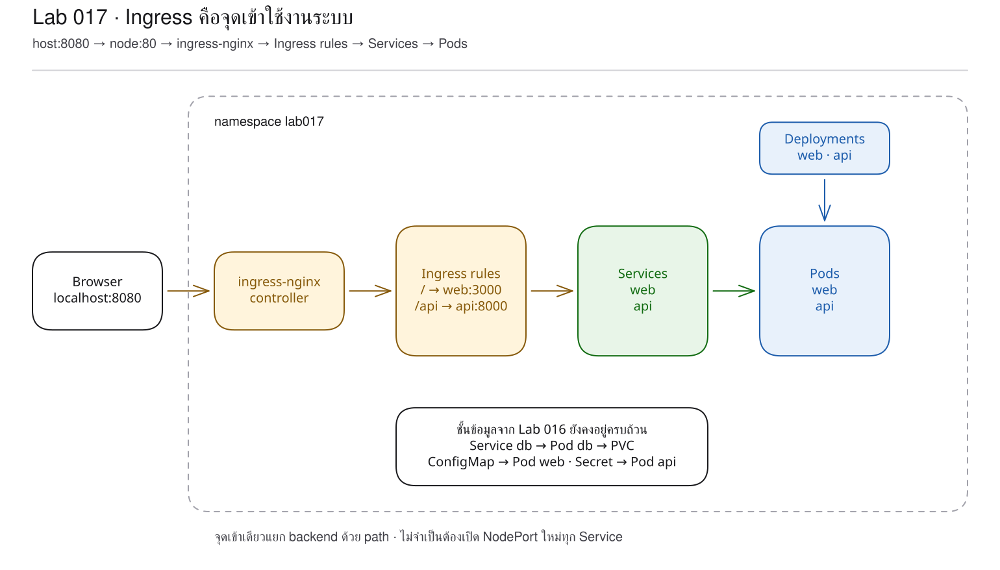
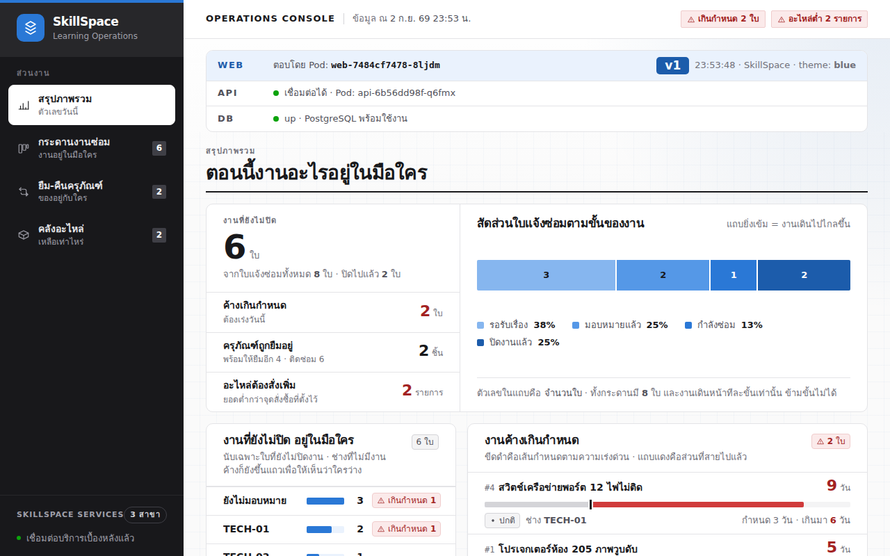
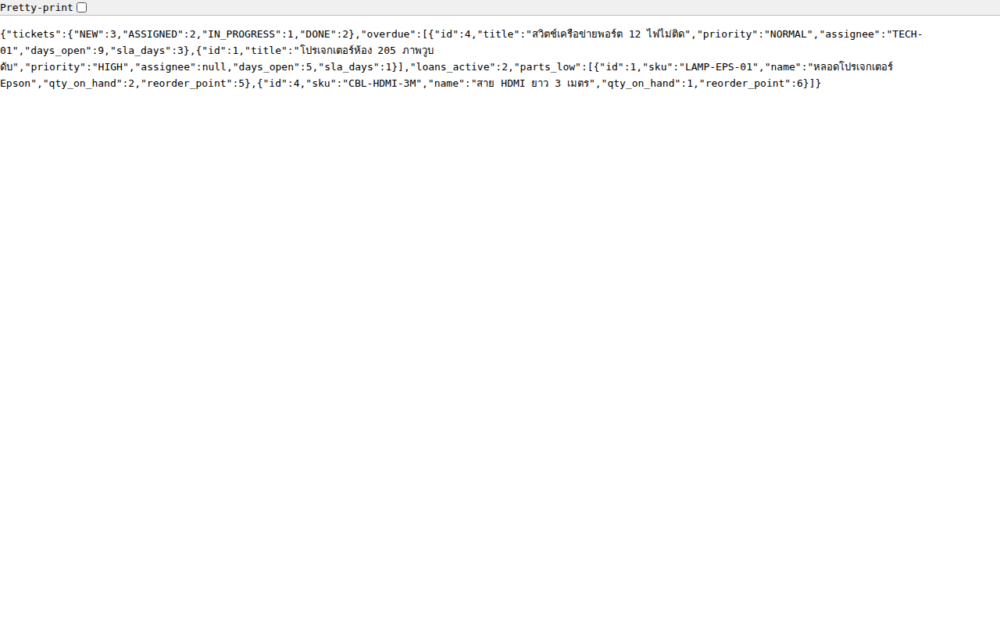

# LAB 17 — Ingress ในฐานะทางเข้าหลักและการกำหนดเส้นทางด้วย path

> โฟลเดอร์ `017-ingress-the-front-door` = LAB 17 ของชุด Kubernetes ครั้งที่ 3
> (ไฟล์ของปฏิบัติการนี้: `manifests/01-configmap.yaml` ถึง `manifests/10-db-service.yaml`, `06-ingress-bad.yaml` และ `images/`)

> 💡 **แนวคิดหลักของปฏิบัติการนี้:** Ingress ทำหน้าที่เป็นทางเข้าหลักเช่นเดียวกับ reverse proxy ที่ศึกษาแล้ว โดยรับข้อกำหนดจาก Kubernetes

## วัตถุประสงค์ของปฏิบัติการ

1. อธิบายความแตกต่างระหว่าง Ingress และ ingress controller ได้
2. อธิบายได้ว่า Ingress ต่างจาก NodePort ตรงขอบเขตและวิธี route อย่างไร
3. เชื่อมแนวคิด Ingress กับ reverse proxy/Traefik ที่เคยเรียนได้
4. อ่าน 503 จาก backend name/port ที่ผิด แล้วแก้กฎกลับได้

## แนวคิดและทฤษฎีที่เกี่ยวข้อง

หากเปิดทุก Service ด้วย NodePort ระบบที่มี 20 service จะมี 20 port ที่ผู้ใช้ต้องจดจำ ปัญหานี้สอดคล้องกับการใช้ Docker หลาย container ก่อนมี reverse proxy

Ingress เป็น object ที่บันทึก “กฎ” ส่วน ingress-nginx controller คือ proxy ที่ทำงานจริง โดย watch Kubernetes API และสร้าง config ตามกฎดังกล่าว การสร้าง Ingress โดยไม่มี controller จึงเปรียบเสมือนการกำหนดแผนที่โดยไม่มีผู้ดำเนินงานตามแผนที่นั้น
สำหรับ HTTPS, Ingress อ้าง Secret ใน `spec.tls[].secretName` เพื่อให้ controller ใช้ certificate/key ดังกล่าว เครื่องเรียน map HTTPS ออกที่ `localhost:8443` ส่วนปฏิบัติการนี้ยังคงใช้ HTTP เพื่อมุ่งศึกษา path routing

| สิ่งที่เทียบ | NodePort | Ingress | Traefik ที่เคยเรียน |
|---|---|---|---|
| ชั้นเครือข่าย | L4 port | L7 HTTP path/host | L7 HTTP router |
| จุดเข้าถึงหลัก | หนึ่ง port ต่อ Service | 80/443 จุดเดียว | entrypoint |
| กฎเลือกทาง | port number | Ingress rule/path | router rule |
| ปลายทาง | Service | backend Service | Traefik service |

ปฏิบัติการนี้ไม่กำหนด `host:` จึงสามารถเปิด `http://localhost:8080` ได้โดยตรง และใช้ `pathType: Prefix` โดย `/api` ไปยัง FastAPI ส่วน `/` ไปยัง Next.js โดยไม่ rewrite เนื่องจาก API รองรับ prefix `/api` อยู่แล้ว

## ผลการเรียนรู้ที่คาดหวัง

- สามารถตรวจสอบ ingress-nginx controller ที่ bootstrap เตรียมไว้
- สามารถติดตามเส้นทาง host `8080` → container `80` → node hostPort `80` → controller
- สามารถ route `/info` ไปยัง web และ `/api/whoami` ไปยัง api
- สามารถตรวจสอบหน้าเว็บและ JSON ผ่าน port เดียวกัน
- สามารถอ่าน access log ที่ระบุ backend จริง
- สามารถกำหนดค่า Service name และ Service port ไม่ถูกต้องเพื่อสังเกตการตอบสนอง 503
- สามารถแก้ไขระบบด้วยการ apply manifest ซึ่งเป็น source of truth

## ภาพรวมของปฏิบัติการ

1. ตรวจ controller และ hostPort 80/443
2. deploy ระบบสามชั้นพร้อม Ingress แบบสอง path
3. ทดสอบ `/`, `/api/whoami` และ `/api/dashboard`
4. วิเคราะห์ controller access log
5. กำหนด backend ให้ผิด วิเคราะห์ 503 และคืนค่าที่ถูกต้อง
6. Cleanup และ Clean Re-run



> **คำถามนำก่อนเริ่มปฏิบัติการ:** หาก web และ api มี Service ของตนเองอยู่แล้ว เหตุใดผู้ใช้จึงควรเข้าถึงระบบผ่านทางเข้าเพียงจุดเดียว

## 0. การเตรียมสภาพแวดล้อมสำหรับปฏิบัติการ

```bash
docker start devtools-k8s || docker run -d --name devtools-k8s --privileged --shm-size=1g --ulimit nofile=65536:65536 -p 2299:22 -p 8080:80 -p 8443:443 -p 3000:3000 -p 9090:9090 tuchsanai/devtools-k8s:2569_1
docker exec -it devtools-k8s bash
k8s-bootstrap
kubectl get nodes
docker exec devtools-control-plane crictl images | grep k8s-lab
```
> 📝 **คำอธิบาย:** เข้าสู่เครื่องเรียนด้วย `docker exec -it` (ให้ป้อนคำสั่งหลังจากนี้ทั้งหมดในเครื่องเรียน) · `k8s-bootstrap` ข้ามขั้นตอนโดยอัตโนมัติหากมี cluster แล้ว · `get nodes` ตรวจสอบ cluster · `crictl images` ตรวจสอบ image ใน kind node

ในเทอร์มินัลของเครื่องเรียนให้ใช้ `localhost` (พอร์ต 80) ส่วนเบราว์เซอร์บนเครื่องของผู้เรียนให้ใช้ `localhost:8080`

✅ **ผลลัพธ์ที่คาดหวัง (Expected output)** — node ทั้งสามอยู่ในสถานะ Ready และมี image แอปพลิเคชันใน node แล้ว (AGE และ image ID อาจแตกต่างกัน):
```text
NAME                     STATUS   ROLES           AGE   VERSION
devtools-control-plane   Ready    control-plane   22m   v1.36.4
devtools-worker          Ready    <none>          22m   v1.36.4
devtools-worker2         Ready    <none>          22m   v1.36.4
docker.io/library/k8s-lab-api   v1   1b0af425a075d   186MB
docker.io/library/k8s-lab-db    v1   35984a84885cb   300MB
docker.io/library/k8s-lab-web   v1   2a74c90a62059   209MB
docker.io/library/k8s-lab-web   v2   7bedccdeefc86   209MB
```

ถ้าผล `grep` ว่าง → ทำขั้น build/load ใน README ระดับชุดหรือ LAB 001

## 1. การดึงโค้ดของปฏิบัติการ (Clone)

```bash
mkdir -p ~/labwork && cd ~/labwork
git clone https://github.com/Tuchsanai/DevTools.git
cd ~/labwork/DevTools/05_kubernetes/03_Session3_Application_Deployment/017-ingress-the-front-door
```
> 📝 **คำอธิบาย:** `mkdir -p` สามารถสร้างโฟลเดอร์ซ้ำได้ · `&&` หยุดเมื่อขั้นตอนก่อนหน้าไม่สำเร็จ · `git clone` ดาวน์โหลด repository · `cd` เข้าสู่ LAB 17

✅ **ผลลัพธ์ที่คาดหวัง (Expected output)** — การ clone สำเร็จและสามารถเข้าสู่โฟลเดอร์ปฏิบัติการได้:
```text
Cloning into 'DevTools'...
```

หากมี repository แล้ว ให้ปรับปรุงข้อมูลแทนการ clone ใหม่:
```bash
cd ~/labwork/DevTools && git pull
```
> 📝 **คำอธิบาย:** `git pull` ดึงและรวม commit ล่าสุดของ branch ปัจจุบัน

✅ **ผลลัพธ์ที่คาดหวัง (Expected output)** — repository เป็นเวอร์ชันล่าสุด:
```text
Already up to date.
```

## 2. การอ่าน YAML ของปฏิบัติการนี้

| ไฟล์ | kind | หน้าที่ในปฏิบัติการนี้ | รายละเอียดเพิ่มเติม |
|---|---|---|---|
| `manifests/01-configmap.yaml` | ConfigMap | ส่ง config ให้ web | [ทบทวน ConfigMap](../YAML_Guide.md#configmap) |
| `manifests/02-web-deployment.yaml` | Deployment | เรียกใช้งาน web พร้อม readiness | [ทบทวน Deployment](../YAML_Guide.md#deployment) · [ทบทวน Probes](../YAML_Guide.md#probes) |
| `manifests/03-web-service.yaml` | Service | backend ของ path `/` | [ทบทวน Service](../YAML_Guide.md#service) · [Ingress backend](../YAML_Guide.md#1-ingress) |
| `manifests/04-api-deployment.yaml` | Deployment | เรียกใช้งาน api ที่เชื่อมต่อกับ db | [ทบทวน Deployment](../YAML_Guide.md#deployment) |
| `manifests/05-api-service.yaml` | Service | backend ของ path `/api` | [ทบทวน Service](../YAML_Guide.md#service) · [Ingress backend](../YAML_Guide.md#1-ingress) |
| `manifests/06-ingress.yaml` | Ingress | route สอง path ไปยัง Service คนละรายการ | [Ingress](../YAML_Guide.md#1-ingress) |
| `manifests/07-secret.yaml` | Secret | ให้ข้อมูลเชื่อมต่อ db | [ทบทวน Secret](../YAML_Guide.md#secret) |
| `manifests/08-pvc.yaml` | PersistentVolumeClaim | ขอพื้นที่ของ db | [ทบทวน PVC](../YAML_Guide.md#pvc) |
| `manifests/09-db-deployment.yaml` | Deployment | เรียกใช้งาน db บน PVC แบบ Recreate | [strategy](../YAML_Guide.md#3-strategy) |
| `manifests/10-db-service.yaml` | Service | ให้ api เชื่อมต่อกับ db | [ทบทวน Service](../YAML_Guide.md#service) |
| `06-ingress-bad.yaml` | Ingress | จงใจชี้ Service `web-svc` ที่ไม่มี | [ข้อผิดพลาดที่พบบ่อยของ Ingress](../YAML_Guide.md#1-ingress) |

ส่วนใหม่ที่ต้องอ่านจาก `manifests/06-ingress.yaml` คือ:

```yaml
spec:
  ingressClassName: nginx       # controller class ที่จะรับกฎ
  rules:
    - http:                     # ไม่ใส่ host = รับทุก host ที่มาถึง controller
        paths:
          - path: /api          # Prefix จับ /api และ path ย่อย
            pathType: Prefix    # field บังคับ; ไม่มี default
            backend:
              service:
                name: api       # Service ใน namespace lab017
                port:
                  number: 8000  # Service port
```

| field | ความหมาย | ผลเมื่อเปลี่ยนค่า |
|---|---|---|
| `ingressClassName` | เลือก IngressClass `nginx` | class อื่นต้องมี controller ที่รับ class นั้น |
| `path` + `pathType` | กำหนด URL ที่จับและวิธีเทียบ | `Exact` จะไม่จับ path ย่อยแบบ `Prefix` |
| `backend.service` | Service name และ port ปลายทาง | ชื่อ/port ผิดทำให้ route ไม่มี backend ใช้งานได้ |
| `host` / `tls` | ไฟล์นี้ไม่ใส่ จึงรับทุก host ผ่าน HTTP | ระบบจริงเพิ่มโดเมนและ Secret ใบรับรองได้ |

**ข้อผิดพลาดที่พบบ่อยในปฏิบัติการนี้:** `06-ingress-bad.yaml` ใช้ `name: web-svc` โดย runlog จาก `describe ingress`
แสดง `<error: services "web-svc" not found>` และ curl ได้ `503 Service Temporarily Unavailable`

ศึกษารายละเอียดของ field ได้ด้วย `kubectl explain ingress.spec.ingressClassName`, `kubectl explain ingress.spec.rules.http.paths.pathType` และ `kubectl explain ingress.spec.tls`

## 3. การตรวจสอบ proxy ที่ทำงานจริง

```bash
kubectl -n ingress-nginx get pods,svc -o wide
kubectl -n ingress-nginx get deploy ingress-nginx-controller \
  -o jsonpath='{range .spec.template.spec.containers[0].ports[*]}{.name}{" containerPort="}{.containerPort}{" hostPort="}{.hostPort}{"\n"}{end}'
```
> 📝 **คำอธิบาย:** `-n ingress-nginx` เลือก namespace ของ controller · `pods,svc` ตรวจสอบ proxy และ Service · `-o wide` เพิ่ม node/IP · `jsonpath` อ่าน port จาก Pod template · `hostPort` คือ port ที่ kind control-plane เปิดรับ

✅ **ผลลัพธ์ที่คาดหวัง (Expected output)** — controller อยู่ในสถานะ `1/1 Running` บน control-plane และรับการเชื่อมต่อที่ hostPort 80/443 (ชื่อ Pod, IP และ AGE อาจแตกต่างกัน):
```text
pod/ingress-nginx-controller-5d9bb85749-mbclt   1/1   Running   0   21m   10.244.0.5   devtools-control-plane
service/ingress-nginx-controller   NodePort   10.96.227.22   <none>   80:30934/TCP,443:30998/TCP
http containerPort=80 hostPort=80
https containerPort=443 hostPort=443
webhook containerPort=8443 hostPort=
```

เส้นทางที่ต้องจดจำคือ browser `localhost:8080` → container port `80` → control-plane hostPort `80` → ingress-nginx → Service → Pod

## 4. การสร้างกฎสำหรับสอง path

หัวใจของ `manifests/06-ingress.yaml` มีเพียง backend สองทาง:
```yaml
rules:
  - http:
      paths:
        - path: /api
          pathType: Prefix
          backend:
            service:
              name: api
              port:
                number: 8000
        - path: /
          pathType: Prefix
          backend:
            service:
              name: web
              port:
                number: 3000
```

`ingressClassName: nginx` เลือก controller · ไม่มี `host` จึงรับทุก Host header · backend อ้าง Service ไม่อ้าง Pod IP
```bash
kubectl create namespace lab017
kubectl apply -f manifests/
kubectl wait -n lab017 --for=condition=available deploy/db deploy/api deploy/web --timeout=180s
kubectl describe ingress -n lab017 skillspace
```
> 📝 **คำอธิบาย:** `create namespace` แยก namespace · `apply -f manifests/` สร้างระบบครบ · `wait` รอสาม Deployment · `describe ingress` แปลกฎเป็น backend พร้อม endpoint · `--timeout` จำกัดเวลารอ

✅ **ผลลัพธ์ที่คาดหวัง (Expected output)** — object ถูกสร้างครบและผล describe แสดง `/api → api:8000`, `/ → web:3000` (IP อาจแตกต่างกัน):
```text
namespace/lab017 created
ingress.networking.k8s.io/skillspace created
deployment.apps/db condition met
deployment.apps/api condition met
deployment.apps/web condition met
Rules:
  Host  Path  Backends
  *
        /api  api:8000 (10.244.2.12:8000)
        /     web:3000 (10.244.1.13:3000)
```

## 5. การพิสูจน์เส้นทางจาก URL เดียวไปยังสอง backend

```bash
until curl -sf http://localhost/info >/dev/null; do sleep 1; done
curl -s http://localhost/info | jq -c '{pod,version,theme,api,db}'
curl -s http://localhost/api/whoami | jq -c '{pod,version,time}'
curl -s http://localhost/api/dashboard | jq -c '{tickets,loans_active}'
```
> 📝 **คำอธิบาย:** URL ทั้งสามใช้ host/port เดียว · `/info` ต้องเข้า web · prefix `/api` ต้องเข้า FastAPI · `whoami` แสดง API Pod · `dashboard` พิสูจน์ว่า API อ่าน DB ได้ · `jq` จัดรูปแบบ JSON

✅ **ผลลัพธ์ที่คาดหวัง (Expected output)** — web และ api ตอบสนองจาก Pod ที่มีชื่อต่างกัน และ dashboard มี seed data (ชื่อ Pod/เวลาอาจแตกต่างกัน):
```text
{"pod":"web-7484cf7478-8ljdm","version":"v1","theme":"blue","api":{"configured":true,"reachable":true,"pod":"api-6b56dd98f-q6fmx"},"db":{"status":"up"}}
{"pod":"api-6b56dd98f-q6fmx","version":"v1","time":"2026-09-02T16:53:47+00:00"}
{"tickets":{"NEW":3,"ASSIGNED":2,"IN_PROGRESS":1,"DONE":2},"loans_active":2}
```

เปิด `http://localhost:8080` และ `http://localhost:8080/api/dashboard` ใน browser





## 6. การวิเคราะห์ access log ของ ingress controller

```bash
kubectl -n ingress-nginx logs deploy/ingress-nginx-controller --tail=8
```
> 📝 **คำอธิบาย:** `logs deploy/...` อ่าน Pod ของ controller โดยไม่ต้องจำชื่อ · `--tail=8` เลือก request ล่าสุด · ช่อง `[lab017-web-3000]` หรือ `[lab017-api-8000]` คือ upstream ที่กฎเลือก

✅ **ผลลัพธ์ที่คาดหวัง (Expected output)** — `/info` ไปยัง web ส่วน `/api/*` ไปยัง api และทุก request ได้รับ 200 (เวลา/IP/request ID อาจแตกต่างกัน):
```text
172.18.0.1 - - [02/Sep/2026:16:53:47 +0000] "GET /info HTTP/1.1" 200 206 "-" "curl/8.18.0" 77 0.020 [lab017-web-3000] [] 10.244.1.13:3000 206 0.019 200 510516c839c378298461476c1236e0a4
172.18.0.1 - - [02/Sep/2026:16:53:47 +0000] "GET /api/whoami HTTP/1.1" 200 79 "-" "curl/8.18.0" 83 0.002 [lab017-api-8000] [] 10.244.2.12:8000 79 0.003 200 a84fbc7b9ce781af8692c2dab25cd6c4
172.18.0.1 - - [02/Sep/2026:16:53:47 +0000] "GET /api/dashboard HTTP/1.1" 200 672 "-" "curl/8.18.0" 86 0.013 [lab017-api-8000] [] 10.244.2.12:8000 672 0.013 200 0f2780542471d36e014be4b356d3af49
```

## 7. การทดลองจำลองความล้มเหลว — backend Service ไม่มีอยู่จริง

ไฟล์ `06-ingress-bad.yaml` เปลี่ยน backend ของ `/` จาก `web` เป็น `web-svc` ซึ่งไม่มีใน namespace
```bash
kubectl apply -f 06-ingress-bad.yaml
until [ "$(curl --retry 0 -s -o /dev/null -w '%{http_code}' http://localhost/)" = 503 ]; do sleep 1; done
curl --retry 0 -i http://localhost/
kubectl describe ingress -n lab017 skillspace
kubectl -n ingress-nginx logs deploy/ingress-nginx-controller --tail=5
kubectl apply -f manifests/06-ingress.yaml
until curl --retry 0 -sf http://localhost/ >/dev/null; do sleep 1; done
```
> 📝 **คำอธิบาย:** loop รอ controller sync จนปรากฏ 503 · `--retry 0` ปิดค่า retry=5 จาก `~/.curlrc` · `-i` แสดง status/header · `describe` ระบุ Service ที่ไม่พบ · apply ไฟล์ที่ถูกต้องและรอ 200

✅ **ผลลัพธ์ที่คาดหวัง (Expected output)** — ได้รับ 503 ผล describe ระบุว่าไม่มี Service และเมื่อ apply ไฟล์ที่ถูกต้อง Ingress จะถูก configured คืน:
```text
ingress.networking.k8s.io/skillspace configured
HTTP/1.1 503 Service Temporarily Unavailable
<center><h1>503 Service Temporarily Unavailable</h1></center>
/   web-svc:3000 (<error: services "web-svc" not found>)
172.18.0.1 - - [02/Sep/2026:16:55:09 +0000] "GET / HTTP/1.1" 503 190 "-" "curl/8.18.0" 73 0.000 [lab017-web-svc-3000] [] - - - - 1aa02b095220632f739e57939c8cbd25
ingress.networking.k8s.io/skillspace configured
```

สาเหตุอยู่ที่ชั้นการกำหนดเส้นทาง: web Pod และ Service `web` ยังปกติ แต่กฎชี้ชื่อที่ไม่มี จึงไม่มี upstream ให้ proxy ส่งต่อ

## 8. การทดลองจำลองความล้มเหลว — Service ถูกต้องแต่ port ไม่ถูกต้อง

```bash
kubectl patch ingress -n lab017 skillspace --type=json \
  -p='[{"op":"replace","path":"/spec/rules/0/http/paths/1/backend/service/port/number","value":3001}]'
until [ "$(curl --retry 0 -s -o /dev/null -w '%{http_code}' http://localhost/)" = 503 ]; do sleep 1; done
curl --retry 0 -i http://localhost/
kubectl -n ingress-nginx logs deploy/ingress-nginx-controller --tail=5
kubectl apply -f manifests/06-ingress.yaml
until curl --retry 0 -sf http://localhost/info >/dev/null; do sleep 1; done
curl -s http://localhost/info | jq -c '{pod,version,theme,api,db}'
```
> 📝 **คำอธิบาย:** `patch --type=json` แก้ field เดียวชั่วคราว · `replace` เปลี่ยน backend port เป็น 3001 · `curl` ตรวจพบสถานะ 503 · log ต้องเห็น `[lab017-web-3001]` · apply YAML คืนค่าประกาศ · `/info` ยืนยันระบบกลับปกติครบสามชั้น

✅ **ผลลัพธ์ที่คาดหวัง (Expected output)** — port ที่ไม่ถูกต้องทำให้ได้รับ 503 และหลัง apply คืน `/info` แสดง db up:
```text
ingress.networking.k8s.io/skillspace patched
HTTP/1.1 503 Service Temporarily Unavailable
172.18.0.1 - - [02/Sep/2026:16:55:45 +0000] "GET / HTTP/1.1" 503 190 "-" "curl/8.18.0" 73 0.000 [lab017-web-3001] [] - - - - f11e6b81f49fde915b2e530a57e04306
ingress.networking.k8s.io/skillspace configured
{"pod":"web-7484cf7478-8ljdm","version":"v1","theme":"blue","api":{"configured":true,"reachable":true,"pod":"api-6b56dd98f-q6fmx"},"db":{"status":"up"}}
```

## 9. แบบฝึกหัด (Exercise)

ออกแบบ path `/status` ให้ไปยัง web โดยไม่เพิ่ม NodePort และคาดการณ์ว่า path `/status/api` จะถูกเลือกด้วย rule ใดเมื่อมีทั้ง `/status` และ `/` แบบ Prefix

เกณฑ์ความสำเร็จคือสามารถอธิบาย longest matching path และตรวจสอบด้วย controller access log ว่าปลายทางตรงกับที่คาดการณ์ โดยไม่แก้ไข host file

## วิธีตรวจสอบผลการทดลอง

```bash
kubectl get ingress,svc,endpoints -n lab017
kubectl describe ingress -n lab017 skillspace
curl -s -o /dev/null -w '%{http_code}\n' http://localhost/
curl -s -o /dev/null -w '%{http_code}\n' http://localhost/api/whoami
kubectl -n ingress-nginx logs deploy/ingress-nginx-controller --tail=5
```
> 📝 **คำอธิบาย:** `ingress,svc,endpoints` ตรวจสอบ rule กับปลายทาง · `describe` ต้องไม่มี backend error · `-o /dev/null` ไม่แสดง response body · `-w` แสดงเฉพาะ HTTP code · log เป็นหลักฐานจาก proxy

✅ **ผลลัพธ์ที่คาดหวัง (Expected output)** — ทั้งสอง path ได้รับ 200, Service มี endpoint และ log ระบุ backend ที่ถูกต้อง:
```text
skillspace   nginx   *   10.96.227.22   80
api   10.244.2.12:8000
web   10.244.1.13:3000
200
200
172.18.0.1 - - [02/Sep/2026:16:53:47 +0000] "GET /api/whoami HTTP/1.1" 200 79 "-" "curl/8.18.0" 83 0.002 [lab017-api-8000] [] 10.244.2.12:8000 79 0.003 200 a84fbc7b9ce781af8692c2dab25cd6c4
```

## ปัญหาที่พบบ่อยและแนวทางแก้ไข

| อาการ | สาเหตุที่พบบ่อย | วิธีแก้ |
|---|---|---|
| เมื่อเข้าถึงแล้วได้รับ 404 จาก nginx | ยังไม่มี Ingress หรือ path ไม่ match | ตรวจสอบ `kubectl get/describe ingress -A` |
| ได้ 503 และ backend ไม่มี endpoint | Service name ผิดหรือไม่มี Ready endpoint | เทียบ backend, Service name, selector และ endpoints |
| ได้ 503 เมื่อชื่อ Service ถูก | port ใน Ingress ไม่ตรง Service port | ตรวจ `describe ingress` และ controller log |
| `/api` ไป web | กำหนด path หรือลำดับ prefix ไม่ถูกต้อง | ตรวจ rule และใช้ `pathType: Prefix` ให้ตรงเจตนา |
| ADDRESS ยังว่างในช่วงแรก | controller ยัง sync status | รอ Events `Sync` และไม่ใช้ ADDRESS เพียงอย่างเดียวประเมินการกำหนดเส้นทาง |

## การล้างทรัพยากร (Cleanup) และการพิสูจน์การทำซ้ำจากสถานะเริ่มต้น (Clean Re-run)

```bash
kubectl delete namespace lab017 --wait=true
kubectl get all -n lab017
kubectl create namespace lab017
kubectl apply -f manifests/
kubectl wait -n lab017 --for=condition=available deploy/db deploy/api deploy/web --timeout=180s
until curl -sf http://localhost/info >/dev/null; do sleep 1; done
curl -s http://localhost/info | jq -c '{pod,version,theme,api,db}'
curl -s http://localhost/api/whoami | jq -c '{pod,version,time}'
kubectl delete namespace lab017 --wait=true
kubectl get all -n lab017
```
> 📝 **คำอธิบาย:** ลบ namespace และรอจนเสร็จสมบูรณ์ · `get all` พิสูจน์ว่าไม่มี resource · สร้าง namespace นำ manifest ไปใช้ รอให้ workload พร้อม แล้วตรวจสอบ path ทั้งสองด้วย `curl` · ลบครั้งสุดท้ายโดยไม่คง resource ไว้สำหรับปฏิบัติการถัดไป

✅ **ผลลัพธ์ที่คาดหวัง (Expected output)** — Clean Re-run ตอบสนองได้ทั้ง web/api และเมื่อสิ้นสุดไม่เหลือ resource (ชื่อ Pod/เวลาอาจแตกต่างกัน):
```text
namespace "lab017" deleted
No resources found in lab017 namespace.
namespace/lab017 created
deployment.apps/db condition met
deployment.apps/api condition met
deployment.apps/web condition met
{"pod":"web-7484cf7478-qpz5f","version":"v1","theme":"blue","api":{"configured":true,"reachable":true,"pod":"api-6b56dd98f-45jzl"},"db":{"status":"up"}}
{"pod":"api-6b56dd98f-45jzl","version":"v1","time":"2026-09-02T16:56:48+00:00"}
namespace "lab017" deleted
No resources found in lab017 namespace.
```

## สรุปคำสั่งของปฏิบัติการนี้

| คำสั่ง | ความหมาย |
|---|---|
| `kubectl get/describe ingress` | วิเคราะห์กฎ address และ backend |
| `curl .../info` | ทดสอบ path ที่ไป web |
| `curl .../api/whoami` | ทดสอบ path ที่ไป api |
| `kubectl logs -n ingress-nginx ...` | อ่าน access/error log ของ proxy |
| `kubectl patch ingress` | เปลี่ยน field ชั่วคราวเพื่อทดลอง |
| `kubectl apply -f manifests/06-ingress.yaml` | คืนกฎที่ถูกจาก source of truth |

## สรุปสิ่งที่ได้เรียนรู้

Ingress ทำให้ผู้ใช้จำ URL เดียว แต่ยังคง Service แยกหน้าที่ภายใน cluster:

- Ingress คือกฎ ส่วน ingress controller คือ reverse proxy ที่นำกฎไปทำงาน
- NodePort เปิด port ต่อ Service; Ingress แยกทางด้วย HTTP path/host ที่ประตูเดียว
- backend ต้องอ้าง Service name และ Service port ที่มีจริง ไม่ใช่ container port ที่กำหนดโดยไม่มีหลักฐาน
- 503 จาก controller แสดงว่า request เข้าถึง Ingress ได้ แต่ไม่สามารถส่งต่อไปยัง backend

**ภาพรวมที่ควรจดจำ:** Ingress เปรียบเสมือนป้ายกำหนดเส้นทางบริเวณทางเข้า ส่วน controller เป็นองค์ประกอบที่อ่านป้ายและส่ง `/` ไปยัง web และ `/api` ไปยัง api

🧭 การเชื่อมโยงสู่ปฏิบัติการถัดไป: [LAB 18 — Updating without Downtime](../018-updating-without-downtime/README.md) ใช้ทางเข้าเดิมเพื่อตรวจสอบ rolling update

## ❓ คำถามทบทวนก่อนจบปฏิบัติการ

1. **Ingress ต่างจาก NodePort อย่างไร?** — NodePort เปิด L4 port ต่อ Service; Ingress ใช้ L7 path/host รวมหลาย Service ไว้หลัง 80/443
2. **Ingress เกี่ยวข้องกับ reverse proxy อย่างไร?** — Ingress คือ config object ส่วน controller เช่น nginx/Traefik คือ proxy ที่ watch object แล้วกำหนดค่าให้ตนเอง
3. **เหตุใด `/api` จึงไม่ต้องตัด prefix?** — FastAPI ของ SkillSpace ประกาศ route ภายใต้ `/api` อยู่แล้ว ส่วนแอปพลิเคชันที่ไม่รองรับ prefix จึงต้องดำเนินการ rewrite

## ✅ รายการตรวจสอบก่อนจบปฏิบัติการ

- [ ] controller Running และ hostPort 80/443 พร้อม
- [ ] เปิดหน้าเว็บผ่าน `http://localhost:8080` ได้
- [ ] `/api/whoami` ตอบชื่อ API Pod ผ่าน URL เดียวกัน
- [ ] อ่าน controller log แล้วชี้ backend ของแต่ละ path ได้
- [ ] กำหนด Service name และ port ให้ไม่ถูกต้องและยืนยันว่าปรากฏสถานะ 503 แล้ว
- [ ] apply manifest ที่ถูกและยืนยัน 200 กลับมาแล้ว
- [ ] Clean Re-run ผ่านและลบ `lab017` ปิดท้ายแล้ว

*ผลลัพธ์ที่คาดหวัง (expected output) และภาพหน้าจอในเอกสารนี้ได้มาจากการดำเนินการจริงบน tuchsanai/devtools-k8s:2569_1 (kind v0.33.0 · Kubernetes v1.36.4 · kubectl v1.37.0) เมื่อ 2 กันยายน 2026*
