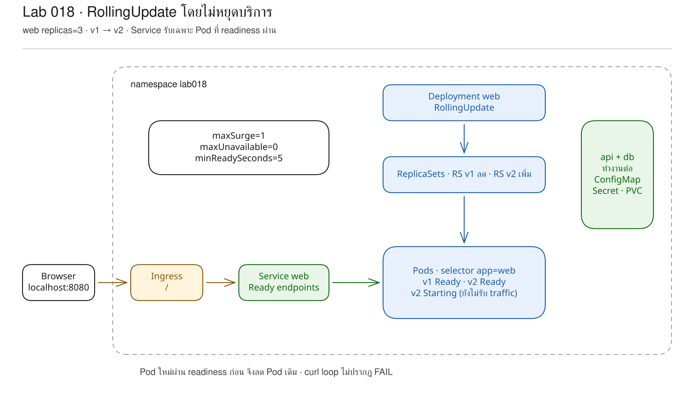
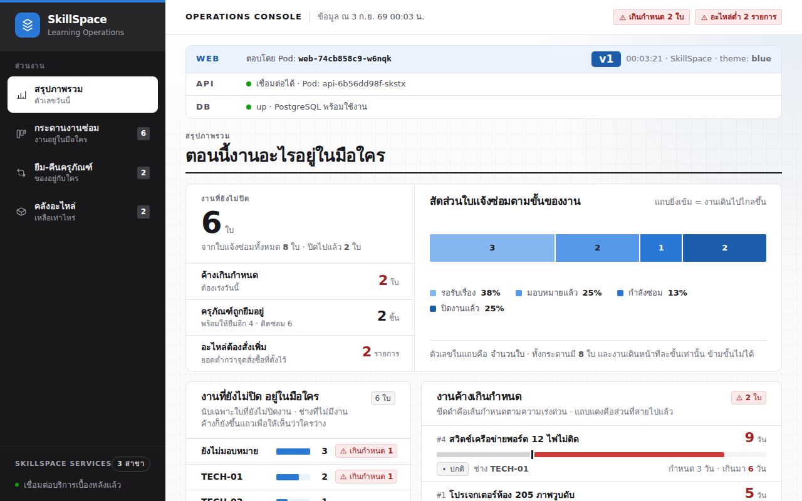
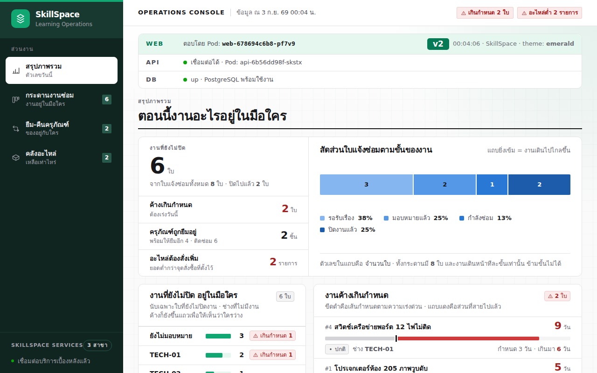

# LAB 18 — การอัปเดตจาก v1 เป็น v2 โดยไม่หยุดให้บริการ

> โฟลเดอร์ `018-updating-without-downtime` = LAB 18 ของชุด Kubernetes ครั้งที่ 3
> (ไฟล์ของปฏิบัติการนี้: `manifests/01-configmap.yaml` ถึง `manifests/10-db-service.yaml`, `02-web-recreate.yaml` และ `images/`)

> 💡 **แนวคิดหลักของปฏิบัติการนี้:** การเปลี่ยนเวอร์ชันทีละส่วนช่วยรักษาความต่อเนื่องของบริการแก่ผู้ใช้

## วัตถุประสงค์ของปฏิบัติการ

1. อธิบายได้ว่า rolling update รักษา availability ด้วย Pod เก่าและใหม่อย่างไร
2. อธิบายความสัมพันธ์ของ `maxSurge`, `maxUnavailable`, readiness และ `minReadySeconds` ได้
3. พิสูจน์จาก request ต่อเนื่องได้ว่า rollout และ rollback ไม่ทำให้บริการเว็บขัดข้อง

## แนวคิดและทฤษฎีที่เกี่ยวข้อง

Deployment ไม่แก้ container เดิม แต่สร้าง ReplicaSet ใหม่จาก Pod template เวอร์ชันใหม่ แล้วจึงปรับจำนวนระหว่าง ReplicaSet เก่า/ใหม่

| ค่า | ประเด็นที่อธิบาย | ค่าในปฏิบัติการ |
|---|---|---|
| `replicas` | จำนวน web ที่ต้องมีในสภาวะปกติ | 3 |
| `maxSurge` | จำนวน Pod ที่อนุญาตให้เพิ่มเกินค่าที่กำหนดระหว่างการปรับปรุง | 1 |
| `maxUnavailable` | จำนวน Pod ที่พร้อมทำงานซึ่งยอมให้ลดลงได้ | 0 |
| readiness | Pod ใหม่พร้อมรับ request หรือไม่ | `GET /readyz` |
| `minReadySeconds` | ระยะเวลาที่ Pod ต้องอยู่ในสถานะ Ready ต่อเนื่องก่อนดำเนิน rollout ต่อ | 5 วินาที |

`maxUnavailable: 0` ทำให้ Pod เดิมยังคงอยู่ แต่ zero-downtime จะสมบูรณ์เมื่อ Service ไม่ส่งงานให้ Pod ใหม่ก่อนแอปพลิเคชันพร้อม ซึ่งเป็นหน้าที่ของ readinessProbe

Recreate ตรงกันข้าม: ลบ Pod เก่าทั้งหมดก่อนสร้างใหม่ จึงมีช่วงที่ Service ไม่มี endpoint และ ingress-nginx ตอบ 503

## ผลการเรียนรู้ที่คาดหวัง

- สามารถสังเกตการปรับจำนวน ReplicaSet v1 และ v2 ทีละส่วน
- สามารถส่ง request ทุก 0.3 วินาทีระหว่าง update
- สามารถสังเกตการเปลี่ยนหน้าเว็บจากธีมสีน้ำเงิน v1 เป็น emerald v2
- สามารถ undo กลับสู่ v1 โดยใช้ ReplicaSet revision เดิม
- สามารถใช้ Recreate และถอด readiness เพื่อสังเกต `FAIL` จากการทำงานจริง
- สามารถพิสูจน์ Clean Re-run จาก manifest baseline v1

## ภาพรวมของปฏิบัติการ

1. deploy ระบบครบโดย web v1 มี 3 replicas
2. เปิด request loop, ReplicaSet watch, stern และโหลดหน้าเว็บใหม่
3. เปลี่ยน image เป็น v2 แล้วติดตามจนจบ
4. undo กลับ v1 โดยไม่มี `FAIL`
5. ทดลองใช้ Recreate และถอด readinessProbe
6. apply baseline คืน, Cleanup และ Clean Re-run



> **คำถามนำก่อนเริ่มปฏิบัติการ:** หาก Pod ใหม่ต้องใช้เวลาเริ่มทำงาน Kubernetes ต้องทราบข้อมูลใดจึงจะหยุด Pod เดิมได้โดยไม่กระทบต่อบริการ

## 0. การเตรียมสภาพแวดล้อมสำหรับปฏิบัติการ

```bash
docker start devtools-k8s || docker run -d --name devtools-k8s --privileged --shm-size=1g --ulimit nofile=65536:65536 -p 2299:22 -p 8080:80 -p 8443:443 -p 3000:3000 -p 9090:9090 tuchsanai/devtools-k8s:2569_1
docker exec -it devtools-k8s bash
k8s-bootstrap
kubectl get nodes
docker exec devtools-control-plane crictl images | grep k8s-lab
```
> 📝 **คำอธิบาย:** เข้าสู่เครื่องเรียนด้วย `docker exec -it` (ให้ป้อนคำสั่งหลังจากนี้ทั้งหมดในเครื่องเรียน) · `k8s-bootstrap` ข้ามขั้นตอนโดยอัตโนมัติหากมี cluster แล้ว · `get nodes` ตรวจสอบ cluster · `crictl images` ตรวจสอบ image v1/v2

ในเทอร์มินัลของเครื่องเรียนให้ใช้ `localhost` (พอร์ต 80) ส่วนเบราว์เซอร์บนเครื่องของผู้เรียนให้ใช้ `localhost:8080`

✅ **ผลลัพธ์ที่คาดหวัง (Expected output)** — node ทั้งสามอยู่ในสถานะ Ready และมี web v1/v2 พร้อมสำหรับ rollout (AGE และ image ID อาจแตกต่างกัน):
```text
NAME                     STATUS   ROLES           AGE   VERSION
devtools-control-plane   Ready   control-plane   31m   v1.36.4
devtools-worker          Ready   <none>          30m   v1.36.4
devtools-worker2         Ready   <none>          30m   v1.36.4
docker.io/library/k8s-lab-api   v1   1b0af425a075d   186MB
docker.io/library/k8s-lab-db    v1   35984a84885cb   300MB
docker.io/library/k8s-lab-web   v1   2a74c90a62059   209MB
docker.io/library/k8s-lab-web   v2   7bedccdeefc86   209MB
```

ถ้าผล `grep` ว่าง → ทำขั้น build/load ใน README ระดับชุดหรือ LAB 001

## 1. การดึงโค้ดของปฏิบัติการ (Clone)

```bash
mkdir -p ~/labwork && cd ~/labwork
git clone https://github.com/Tuchsanai/DevTools.git
cd ~/labwork/DevTools/05_kubernetes/03_Session3_Application_Deployment/018-updating-without-downtime
```
> 📝 **คำอธิบาย:** `mkdir -p` สามารถสร้าง path ซ้ำได้ · `&&` ดำเนินคำสั่งถัดไปเมื่อคำสั่งก่อนหน้าสำเร็จ · `git clone` ดาวน์โหลด repository · `cd` เข้าสู่ LAB 18

✅ **ผลลัพธ์ที่คาดหวัง (Expected output)** — การ clone สำเร็จและสามารถเข้าสู่โฟลเดอร์ปฏิบัติการได้:
```text
Cloning into 'DevTools'...
```

หากดำเนินการ clone แล้ว ให้ใช้ `git pull` ใน `~/labwork/DevTools` แทนการ clone ซ้ำ

## 2. การอ่าน YAML ของปฏิบัติการนี้

| ไฟล์ | kind | หน้าที่ในปฏิบัติการนี้ | รายละเอียดเพิ่มเติม |
|---|---|---|---|
| `manifests/01-configmap.yaml` | ConfigMap | ให้ config แก่ web | [ทบทวน ConfigMap](../YAML_Guide.md#configmap) |
| `manifests/02-web-deployment.yaml` | Deployment | กำหนด RollingUpdate แบบไม่ลด Available | [strategy](../YAML_Guide.md#3-strategy) |
| `manifests/03-web-service.yaml` | Service | ส่งงานเฉพาะ web Pod ที่ Ready | [ทบทวน Service](../YAML_Guide.md#service) · [ทบทวน Probes](../YAML_Guide.md#probes) |
| `manifests/04-api-deployment.yaml` | Deployment | เรียกใช้งาน api ของระบบที่ประกอบแล้ว | [ทบทวน Deployment](../YAML_Guide.md#deployment) |
| `manifests/05-api-service.yaml` | Service | ให้ web เชื่อมต่อกับ api | [ทบทวน Service](../YAML_Guide.md#service) |
| `manifests/06-ingress.yaml` | Ingress | เปิด `/` และ `/api` | [Ingress](../YAML_Guide.md#1-ingress) |
| `manifests/07-secret.yaml` | Secret | ให้ค่าเชื่อมต่อ db | [ทบทวน Secret](../YAML_Guide.md#secret) |
| `manifests/08-pvc.yaml` | PersistentVolumeClaim | ขอพื้นที่ db | [ทบทวน PVC](../YAML_Guide.md#pvc) |
| `manifests/09-db-deployment.yaml` | Deployment | ใช้ Recreate กับ db/PVC | [Recreate](../YAML_Guide.md#3-strategy) |
| `manifests/10-db-service.yaml` | Service | ให้ api เชื่อมต่อกับ db | [ทบทวน Service](../YAML_Guide.md#service) |
| `02-web-recreate.yaml` | Deployment | จงใจเปลี่ยน web เป็น Recreate เพื่อสังเกตช่วงหยุดให้บริการ | [Recreate](../YAML_Guide.md#3-strategy) |

ค่าจริงจาก `manifests/02-web-deployment.yaml`:

```yaml
spec:
  replicas: 3
  minReadySeconds: 5       # Ready ต่อเนื่อง 5 วินาทีจึงนับ Available
  strategy:
    type: RollingUpdate    # default ก็เป็นชนิดนี้ แต่ไฟล์เขียนให้เห็นชัด
    rollingUpdate:
      maxSurge: 1          # เกิน desired replicas ได้ 1 Pod
      maxUnavailable: 0    # ไม่ยอมให้ Available ลดเพราะ rollout
```

| field | ความหมาย | ผลเมื่อเปลี่ยนค่า |
|---|---|---|
| `type` | `RollingUpdate` หรือ `Recreate`; default `RollingUpdate` | Recreate ลบชุดเก่าก่อนสร้างชุดใหม่ |
| `maxSurge` | จำนวน/เปอร์เซ็นต์ที่สร้างเกิน; default 25% ปัดขึ้น | ค่าที่มากขึ้นทำให้ rollout ดำเนินการเร็วขึ้น แต่ใช้ capacity ชั่วคราวมากขึ้น |
| `maxUnavailable` | จำนวน/เปอร์เซ็นต์ที่ขาดได้; default 25% ปัดลง | มากขึ้นยอมให้บริการเหลือน้อยลง; ห้ามทั้งคู่เป็น 0 |
| `minReadySeconds` | เวลาที่ Ready ต่อเนื่อง; default 0 | เพิ่มเวลาเฝ้าดู Pod ใหม่ก่อนนับ Available |
| `revisionHistoryLimit` | revision เดิมที่บันทึกไว้; ไฟล์ไม่ใส่จึง default 10 | ตั้ง 0 แล้ว rollback revision เดิมไม่ได้ |

**ข้อผิดพลาดที่พบบ่อยในปฏิบัติการนี้:** การพิจารณา `maxUnavailable: 0` เพียงค่าเดียวว่าเพียงพออาจทำให้เข้าใจคลาดเคลื่อน หาก readiness ไม่สะท้อนความพร้อมรับงาน
Pod ใหม่อาจรับ request เร็วเกินไป; ส่วน `02-web-recreate.yaml` ทำให้ runlog แสดง `FAIL` ต่อเนื่องจริงระหว่างเปลี่ยนรุ่น

ศึกษารายละเอียดของ field ได้ด้วย `kubectl explain deployment.spec.strategy.rollingUpdate`, `kubectl explain deployment.spec.minReadySeconds` และ `kubectl explain deployment.spec.revisionHistoryLimit`

## 3. การสร้าง baseline v1 จำนวน 3 Pod

ส่วนสำคัญของ `manifests/02-web-deployment.yaml` คือ:
```yaml
replicas: 3
minReadySeconds: 5
strategy:
  type: RollingUpdate
  rollingUpdate:
    maxSurge: 1
    maxUnavailable: 0
# container มี readinessProbe path /readyz
```

ทุก image ของแอปกำหนด `imagePullPolicy: IfNotPresent`; readiness ใช้ port ชื่อ `http` จึงไม่ผูกกับเลขซ้ำหลายจุด
```bash
kubectl create namespace lab018
kubectl apply -f manifests/
kubectl wait -n lab018 --for=condition=available deploy/db deploy/api deploy/web --timeout=180s
kubectl get pods -n lab018 -o wide
until curl -sf http://localhost/info >/dev/null; do sleep 1; done
curl -s http://localhost/info | jq -c '{pod,version,theme,api,db}'
```
> 📝 **คำอธิบาย:** สร้าง namespace แยก · apply ระบบครบ · รอจน Deployment มีสถานะ Available · `-o wide` ตรวจสอบ Pod/node · `/info` ตรวจสอบ request จริงผ่าน Ingress และแสดง version

✅ **ผลลัพธ์ที่คาดหวัง (Expected output)** — web v1 พร้อมจำนวน 3 Pod, api/db พร้อม และ `/info` แสดง v1/db up (ชื่อ Pod, IP, node, AGE และเวลาอาจแตกต่างกัน):
```text
api-6b56dd98f-skstx   1/1   Running   0   19s
db-7dd8b59fd7-rfgk4   1/1   Running   0   18s
web-74cb858c9-8nxgf   1/1   Running   0   19s
web-74cb858c9-l5mqf   1/1   Running   0   19s
web-74cb858c9-w6nqk   1/1   Running   0   19s
{"pod":"web-74cb858c9-8nxgf","version":"v1","theme":"blue","api":{"configured":true,"reachable":true,"pod":"api-6b56dd98f-skstx"},"db":{"status":"up"}}
```

## 4. การแสดงหลักฐานอย่างต่อเนื่อง

เปิดหน้าต่างใหม่บนเครื่องหลักแล้ว `docker exec -it devtools-k8s bash` อีกครั้งเป็นเทอร์มินัล 2 สำหรับส่ง request; กด `Ctrl+C` หลัง rollout จบ
```bash
while true; do
  curl --retry 0 -s -f -m 2 http://localhost/info \
    | jq -c '{pod,version}' || echo FAIL
  sleep 0.3
done
```
> 📝 **คำอธิบาย:** `--retry 0` ไม่ปกปิดความล้มเหลว · `-s -f` ไม่แสดงรายละเอียดแต่คืน non-zero เมื่อเกิด HTTP error · `-m 2` กำหนด timeout สองวินาที · `jq -c '{pod,version}'` เลือก field ให้ตรงกับผลที่แสดง · `|| echo FAIL` ทำให้สังเกต downtime ได้ · `sleep 0.3` ส่ง request ประมาณสามครั้งต่อวินาที

✅ **ผลลัพธ์ที่คาดหวัง (Expected output)** — ก่อน update จะปรากฏชื่อ v1 สลับกันและไม่มี `FAIL` (ชื่อ Pod อาจแตกต่างกัน):
```text
{"pod":"web-74cb858c9-l5mqf","version":"v1"}
{"pod":"web-74cb858c9-8nxgf","version":"v1"}
{"pod":"web-74cb858c9-w6nqk","version":"v1"}
```

เปิดหน้าต่างใหม่บนเครื่องหลักและใช้ `docker exec -it devtools-k8s bash` อีกครั้งสำหรับเทอร์มินัล 3–4 ที่ใช้ตรวจสอบโครงสร้างและ log:
```bash
kubectl get rs -n lab018 -w
stern -n lab018 web --tail 3
```
> 📝 **คำอธิบาย:** `get rs -w` watch จำนวน desired/current/ready ของทุก ReplicaSet · `stern` รวม log Pod ที่ชื่อ/label match `web` · `--tail 3` เริ่มจากสามบรรทัดล่าสุดต่อตัว

✅ **ผลลัพธ์ที่คาดหวัง (Expected output)** — เริ่มต้นด้วย ReplicaSet v1 desired=3 และ stern เชื่อม log จากหลาย Pod (hash อาจแตกต่างกัน):
```text
web-74cb858c9   3   3   3   47s
+ web-74cb858c9-8nxgf › web
+ web-74cb858c9-l5mqf › web
+ web-74cb858c9-w6nqk › web
web-74cb858c9-8nxgf web ✓ Ready in 0ms
```

## 5. Rolling update จาก v1 เป็น v2

```bash
kubectl set image deployment/web web=k8s-lab-web:v2 -n lab018 >/dev/null
kubectl rollout status -n lab018 deploy/web --timeout=180s
kubectl get rs,pods -n lab018 -l app=web
curl -s http://localhost/info | jq -c '{pod,version,theme,api,db}'
```
> 📝 **คำอธิบาย:** `set image` เปลี่ยน live Pod template โดยไม่แก้ไฟล์ baseline v1 · `rollout status` รอ controller ดำเนิน rollout ครบถ้วน · `get rs,pods` เห็น RS เก่าลดเป็น 0 · `/info` ยืนยัน version/theme

✅ **ผลลัพธ์ที่คาดหวัง (Expected output)** — v2 เพิ่มขึ้นทีละส่วน RS v1 ลดลงเหลือ 0 และ v2 พร้อมจำนวน 3 Pod (hash/Pod/เวลาอาจแตกต่างกัน):
```text
Waiting for deployment "web" rollout to finish: 1 out of 3 new replicas have been updated...
Waiting for deployment "web" rollout to finish: 2 out of 3 new replicas have been updated...
deployment "web" successfully rolled out
web-678694c6b8   3   3   3   26s
web-74cb858c9    0   0   0   108s
{"pod":"web-678694c6b8-fw4w4","version":"v2","theme":"emerald","api":{"configured":true,"reachable":true,"pod":"api-6b56dd98f-skstx"},"db":{"status":"up"}}
```

ภาพของผู้สอนบันทึกระหว่างที่ Pod ใช้ image v1/v2 ร่วมกัน โดยให้ผู้เรียนโหลดหน้าเว็บในเบราว์เซอร์ใหม่ระหว่าง rollout เพื่อสังเกตผล





หลักฐานจาก ReplicaSet, Pod และภาพระหว่างการทำงานยืนยันว่า v1 และ v2 อยู่ร่วมกันก่อน v2 พร้อมครบถ้วน

## 6. Rollback กลับ v1

```bash
kubectl rollout undo -n lab018 deploy/web
kubectl rollout status -n lab018 deploy/web --timeout=180s
kubectl rollout history -n lab018 deploy/web
kubectl get rs,pods -n lab018 -l app=web
```
> 📝 **คำอธิบาย:** `rollout undo` นำ Pod template revision ก่อนหน้ากลับมา · `status` รอ rollback · `history` แสดง revision ที่ Deployment บันทึกไว้ · `get rs,pods` พิสูจน์ว่า RS v1 ถูกเพิ่มจำนวน และ RS v2 ลดเป็น 0

✅ **ผลลัพธ์ที่คาดหวัง (Expected output)** — loop แสดง v2/v1 สลับกันโดยไม่มี `FAIL` จากนั้น v1 กลับมาครบจำนวน 3 Pod (hash อาจแตกต่างกัน):
```text
Warning: resource deployments/web was previously managed with 'kubectl apply'. Rolling back will not update the kubectl.kubernetes.io/last-applied-configuration annotation, which may cause unexpected behavior on future 'kubectl apply' operations. Consider using 'kubectl apply' with your previous configuration file instead.
deployment.apps/web rolled back
{"pod":"web-678694c6b8-pf7v9","version":"v2"}
{"pod":"web-74cb858c9-x6d76","version":"v1"}
{"pod":"web-678694c6b8-fw4w4","version":"v2"}
{"pod":"web-74cb858c9-x6d76","version":"v1"}
deployment "web" successfully rolled out
REVISION  CHANGE-CAUSE
2         <none>
3         <none>
web-678694c6b8   0   0   0
web-74cb858c9    3   3   3
```

คำเตือนระบุว่า `rollout undo` ไม่แก้ annotation ของ `kubectl apply`; ขั้นต่อไปจึง apply ไฟล์ baseline คืนให้ source of truth ตรงกับ live state


## 7. การทดลองจำลองความล้มเหลว — การเปลี่ยน strategy เป็น Recreate

เปิด request loop เดิมไว้ แล้ว apply ไฟล์ที่ใช้ `strategy.type: Recreate` และ image v2
```bash
kubectl apply -f 02-web-recreate.yaml
kubectl rollout status -n lab018 deploy/web --timeout=180s
kubectl get pods -n lab018 -l app=web
```
> 📝 **คำอธิบาย:** `Recreate` หยุด Pod เก่าทั้งหมดก่อนเริ่มชุดใหม่ · `rollout status` ยังบอกสำเร็จในที่สุด แต่ request loop แสดงช่วงเวลาที่ผู้ใช้ไม่สามารถเข้าถึงบริการ · `get pods` ยืนยันปลายทางเป็น v2 ใหม่ทั้งหมด

✅ **ผลลัพธ์ที่คาดหวัง (Expected output)** — มี `FAIL` รวม 17 ครั้งระหว่างรอ v2 โดยจำนวนอาจขึ้นอยู่กับประสิทธิภาพของเครื่อง:
```text
{"pod":"web-74cb858c9-x6d76","version":"v1"}
FAIL
Waiting for deployment "web" rollout to finish: 0 of 3 updated replicas are available...
FAIL
Waiting for deployment "web" rollout to finish: 2 of 3 updated replicas are available...
FAIL
deployment "web" successfully rolled out
FAIL
{"pod":"web-678694c6b8-dss9d","version":"v2"}
{"pod":"web-678694c6b8-gkzj9","version":"v2"}
```

(ตัดบางแถว; ลำดับที่แสดงคงตาม transcript จริง)

คืนสภาพด้วยการ apply `manifests/02-web-deployment.yaml` ซึ่งเป็น baseline v1 แบบ RollingUpdate แล้วรอ rollout จบ

## 8. การทดลองจำลองความล้มเหลว — การถอด readinessProbe

ลบ probe โดยเจตนาพร้อมเปลี่ยน image เป็น v2 ใน Pod template เดียว แล้วเปิด loop ที่ส่ง request ถี่ขึ้น
```bash
kubectl patch deploy -n lab018 web --type=json \
  -p='[{"op":"remove","path":"/spec/template/spec/containers/0/readinessProbe"},{"op":"replace","path":"/spec/template/spec/containers/0/image","value":"k8s-lab-web:v2"}]'
kubectl rollout status -n lab018 deploy/web --timeout=180s
kubectl apply -f manifests/02-web-deployment.yaml
kubectl rollout status -n lab018 deploy/web --timeout=180s
```
> 📝 **คำอธิบาย:** JSON patch `remove` ถอด gate ที่ Service ใช้ · `replace` ทำให้เกิด rollout ใหม่ · Kubernetes จึงนับ container Ready เร็วเกิน · สองคำสั่งท้ายคืน strategy, readiness และ image v1 จาก manifest

✅ **ผลลัพธ์ที่คาดหวัง (Expected output)** — การทำงานจริงของ loop พบ `FAIL` 2 ครั้งก่อน rollout เสร็จและ 3 ครั้งหลังเสร็จ จากนั้น apply baseline คืนสำเร็จ (จำนวนอาจแตกต่างกัน):
```text
deployment.apps/web patched
{"pod":"web-7fdfc9d944-655vp","version":"v2"}
{"pod":"web-74cb858c9-mtfqf","version":"v1"}
FAIL
FAIL
deployment "web" successfully rolled out
FAIL
FAIL
FAIL
deployment "web" successfully rolled out
RollingUpdate maxSurge=1 maxUnavailable=0 readiness=/readyz image=k8s-lab-web:v1
```

## 9. แบบฝึกหัด (Exercise)

ให้คาดการณ์และอธิบายผลหากเปลี่ยน `maxUnavailable` จาก 0 เป็น 1 โดยยังมี 3 replicas และ readiness เดิมว่า rollout จะรวดเร็วขึ้นอย่างไร และจำนวน Pod พร้อมต่ำสุดมีค่าเท่าใด

เกณฑ์สำเร็จ: วาด timeline จำนวน v1/v2 ในแต่ละขั้นได้ โดยไม่จำคำสั่ง และอธิบาย trade-off ระหว่างความเร็วกับ capacity

## วิธีตรวจสอบผลการทดลอง

```bash
kubectl get deploy,rs,pods,endpoints -n lab018
kubectl rollout history -n lab018 deploy/web
kubectl get deploy -n lab018 web -o jsonpath='{.spec.strategy.type}{" maxSurge="}{.spec.strategy.rollingUpdate.maxSurge}{" maxUnavailable="}{.spec.strategy.rollingUpdate.maxUnavailable}{" readiness="}{.spec.template.spec.containers[0].readinessProbe.httpGet.path}{" image="}{.spec.template.spec.containers[0].image}{"\n"}'
curl -s http://localhost/info | jq -c '{pod,version,theme,api,db}'
```
> 📝 **คำอธิบาย:** ตรวจสอบ Deployment→ReplicaSet→Pod→Endpoint ครบทุกลำดับ · history ยืนยัน revision · jsonpath ตรวจสอบค่าที่สำคัญโดยตรง · `/info` ตรวจสอบจากมุมมองของผู้ใช้

✅ **ผลลัพธ์ที่คาดหวัง (Expected output)** — baseline สุดท้ายเป็น RollingUpdate, v1, readiness `/readyz`, web จำนวน 3 Pod อยู่ในสถานะ Ready และ DB up:
```text
RollingUpdate maxSurge=1 maxUnavailable=0 readiness=/readyz image=k8s-lab-web:v1
web-74cb858c9-vzbr9   1/1   Running
web-74cb858c9-4mjnw   1/1   Running
web-74cb858c9-q6sq2   1/1   Running
{"pod":"web-74cb858c9-vzbr9","version":"v1","theme":"blue","api":{"configured":true,"reachable":true,"pod":"api-6b56dd98f-skstx"},"db":{"status":"up"}}
```

## ปัญหาที่พบบ่อยและแนวทางแก้ไข

| อาการ | สาเหตุที่พบบ่อย | วิธีแก้ |
|---|---|---|
| rollout ไม่เสร็จสมบูรณ์ | Pod ใหม่ไม่ผ่าน readiness หรือ image ไม่มี | `describe pod`, `logs`, ตรวจ Events/image |
| ยังปรากฏ v1 หลังเริ่ม update | Pod เดิมยังให้บริการตาม strategy/controller sync | ตรวจสอบ RS/Pod ควบคู่กับ request loop และไม่สรุปจาก request เพียงครั้งเดียว |
| RollingUpdate ยังมี 502/FAIL | ไม่มี readiness หรือ probe ไม่ตรวจสิ่งที่จำเป็น | คืน `/readyz` และทดสอบ endpoint จริง |
| Recreate ทำให้ 503 | Service ไม่มี endpoint ระหว่างลบเก่า-สร้างใหม่ | ใช้ RollingUpdate เมื่อ workload รองรับหลาย replica |
| undo แล้ว apply ให้ผลที่ไม่สอดคล้องกับที่คาด | annotation last-applied ยังเป็นค่าก่อน undo | คืนไฟล์ baseline แล้ว `kubectl apply` ให้ตรง source of truth |

## การล้างทรัพยากร (Cleanup) และการพิสูจน์การทำซ้ำจากสถานะเริ่มต้น (Clean Re-run)

```bash
kubectl delete namespace lab018 --wait=true
kubectl get all -n lab018
kubectl create namespace lab018
kubectl apply -f manifests/
kubectl wait -n lab018 --for=condition=available deploy/db deploy/api deploy/web --timeout=180s
kubectl get pods -n lab018 -l app=web
until BODY=$(curl -fsS http://localhost/info); do sleep 2; done
echo "$BODY" | jq -c '{pod,version,theme,api,db}'
kubectl delete namespace lab018 --wait=true
kubectl get all -n lab018
```
> 📝 **คำอธิบาย:** ลบและรอ namespace · `get all` พิสูจน์ความว่าง · สร้าง/apply/wait จาก baseline · loop รอ Ingress และ `/info` · ลบทรัพยากรเมื่อสิ้นสุด

✅ **ผลลัพธ์ที่คาดหวัง (Expected output)** — Clean Re-run ทำให้ได้ v1 จำนวนสาม Pod และระบบครบถ้วน จากนั้นเมื่อสิ้นสุดไม่เหลือ resource (ชื่อ Pod และเวลาอาจแตกต่างกัน):
```text
namespace "lab018" deleted
No resources found in lab018 namespace.
web-74cb858c9-5h5jh   1/1   Running   0   18s
web-74cb858c9-6z78f   1/1   Running   0   18s
web-74cb858c9-vcdrz   1/1   Running   0   18s
{"pod":"web-74cb858c9-6z78f","version":"v1","theme":"blue","api":{"configured":true,"reachable":true,"pod":"api-6b56dd98f-4k9bp"},"db":{"status":"up"}}
namespace "lab018" deleted
No resources found in lab018 namespace.
```

## สรุปคำสั่งของปฏิบัติการนี้

| คำสั่ง | ความหมาย |
|---|---|
| `kubectl rollout status` | ติดตาม rollout จนสำเร็จ/timeout |
| `kubectl get rs -w` | ตรวจสอบการเปลี่ยนจำนวนของ ReplicaSet เดิม/ใหม่ |
| `stern -n lab018 web` | รวม log จากหลาย web Pod |
| `kubectl rollout undo` | นำ Pod template revision ก่อนหน้ากลับมา |
| `kubectl rollout history` | ตรวจสอบ revision ที่ยังบันทึกไว้ |
| `kubectl patch ...` | ทำการทดลองเปลี่ยน field ชั่วคราว |
| `kubectl apply -f manifests/02-web-deployment.yaml` | คืน baseline จาก source of truth |

## สรุปสิ่งที่ได้เรียนรู้

zero-downtime มิได้เกิดจากการระบุ RollingUpdate เพียงคำเดียว:

- `maxUnavailable: 0` รักษา Pod เดิมที่พร้อมไว้จน Pod ใหม่มาทดแทน
- readiness ป้องกันไม่ให้ Pod รับ request ก่อนพร้อมทำงาน
- ReplicaSet revision ทำให้ undo เปลี่ยนจำนวนกลับได้ โดยไม่จำเป็นต้อง build image ใหม่
- Recreate ทำให้เห็นช่องว่าง endpoint ชัดเจน; ถอด readiness ทำให้ error ประปราย

**ภาพรวมที่ควรจดจำ:** rolling update เปรียบเสมือนการเปลี่ยนหลอดไฟทีละดวงโดยคงหลอดเดิมไว้ จนหลอดใหม่สว่างและผ่านการตรวจสอบแล้ว

🧭 การเชื่อมโยงสู่ปฏิบัติการถัดไป: LAB 19 จะเพิ่ม requests/limits เพื่อให้ scheduler ทราบความต้องการทรัพยากรของ Pod แต่ละรุ่น

## ❓ คำถามทบทวนก่อนจบปฏิบัติการ

1. **เหตุใด rolling update จึงไม่ทำให้เว็บหยุดให้บริการ?** — มี Pod เดิมพร้อมเสมอจาก `maxUnavailable: 0` และ Pod ใหม่เข้าสู่ Service หลังผ่าน readiness
2. **ระบบสามารถ rollback ได้เนื่องจากบันทึกข้อมูลใดไว้?** — Deployment บันทึก Pod template ของแต่ละ revision ไว้ใน ReplicaSet ที่สามารถ scale เป็น 0 ได้
3. **readinessProbe เกี่ยวข้องกับ zero-downtime อย่างไร?** — readinessProbe เป็น gate ของ Service หากไม่มี probe ระบบจะนับ Pod เป็น Ready ตั้งแต่ container เริ่ม แม้แอปพลิเคชันยังไม่รับการเชื่อมต่อที่ port

## ✅ รายการตรวจสอบก่อนจบปฏิบัติการ

- [ ] baseline web v1 พร้อม 3 Pod
- [ ] เห็น ReplicaSet v1/v2 อยู่ร่วมกันระหว่าง rollout
- [ ] request loop ของ RollingUpdate/undo ไม่มี `FAIL`
- [ ] screenshot mixed, v2 และ after-undo มาจากหน้าเว็บจริง
- [ ] Recreate ทำให้เห็น `FAIL` ต่อเนื่องแล้ว
- [ ] ถอด readiness แล้วเห็น `FAIL` ประปรายและแก้คืนแล้ว
- [ ] อธิบายบทบาทของ maxSurge/maxUnavailable/readiness ได้
- [ ] Clean Re-run ผ่านและลบ namespace `lab018` แล้ว

*ผลลัพธ์ที่คาดหวัง (expected output) และภาพหน้าจอในเอกสารนี้ได้มาจากการดำเนินการจริงบน tuchsanai/devtools-k8s:2569_1 (kind v0.33.0 · Kubernetes v1.36.4 · kubectl v1.37.0) เมื่อ 2 กันยายน 2026*
