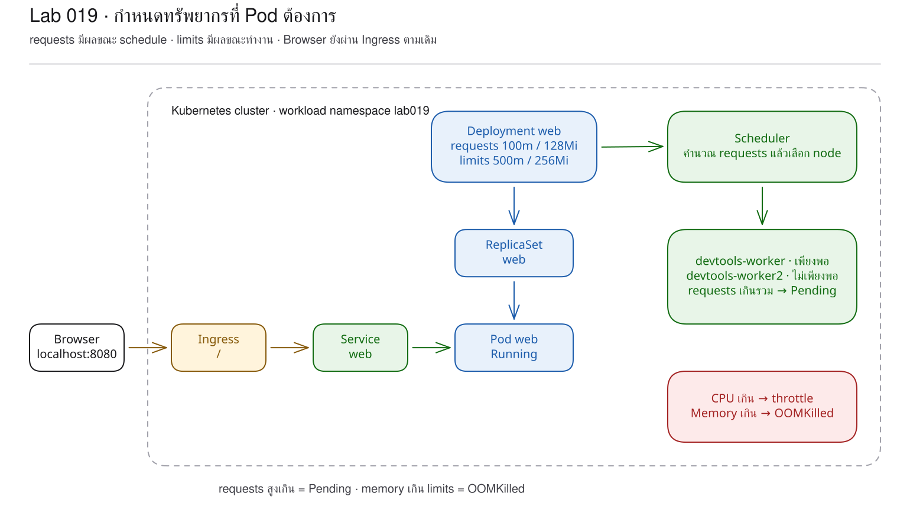
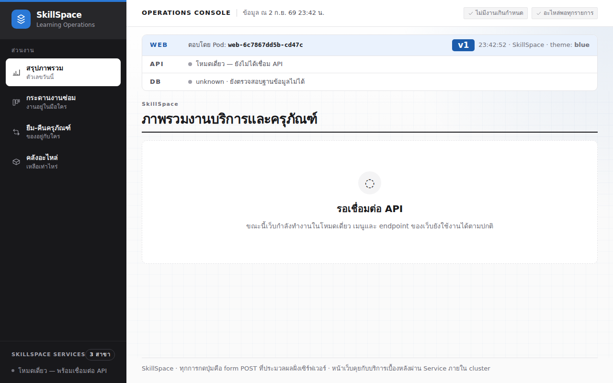

# LAB 19 — การกำหนดความต้องการและขีดจำกัดทรัพยากรแก่ Kubernetes

> โฟลเดอร์ `019-telling-kubernetes-what-you-need` = LAB 19 ของชุด Kubernetes ครั้งที่ 3
> (ไฟล์ของปฏิบัติการนี้: `manifests/02-web-deployment.yaml`, `manifests/03-web-service.yaml`, `manifests/06-ingress.yaml`, `03-web-too-big.yaml`, `04-web-oom.yaml`)

> 💡 **แนวคิดหลักของปฏิบัติการนี้:** Kubernetes ต้องทราบปริมาณทรัพยากรที่แอปพลิเคชันใช้ เพื่อเลือก node ที่เหมาะสมและป้องกันไม่ให้ workload หนึ่งใช้ทรัพยากรทั้งหมด

## วัตถุประสงค์ของปฏิบัติการ

เมื่อสิ้นสุดปฏิบัติการ ผู้เรียนจะสามารถ:
1. อธิบายได้ว่า `requests` มีผลต่อการตัดสินใจของ scheduler อย่างไร
2. อธิบายได้ว่า `limits` ถูกบังคับขณะ container ทำงานอย่างไร
3. อ่านหลักฐาน `Pending`, `Insufficient cpu` และ `OOMKilled` ได้
4. เชื่อมค่าที่ประกาศใน YAML กับทรัพยากรที่ node จองจริงได้

## แนวคิดและทฤษฎีที่เกี่ยวข้อง

หากเปรียบ Compose เป็นการจัดวางกล่องบนเครื่องเดียว Kubernetes จะทำหน้าที่เลือก node สำหรับจัดวาง Pod
scheduler จึงต้องมีตัวเลขสำหรับเปรียบเทียบกับความจุที่เหลือ ตัวเลขนั้นคือ `requests`
ส่วน `limits` คือเพดานระหว่างการทำงาน มิใช่ข้อมูลหลักที่ใช้เลือก node
| ค่า | ใช้เมื่อไร | ผลเมื่อเกิน |
|---|---|---|
| `requests.cpu` / `requests.memory` | ตอน schedule | เมื่อไม่มี node ที่มีทรัพยากรเพียงพอ Pod จะอยู่ในสถานะ `Pending` |
| `limits.cpu` | ระหว่างการทำงาน | process ถูก throttle ให้ใช้ CPU ช้าลง |
| `limits.memory` | ระหว่างการทำงาน | kernel หยุด process และ Kubernetes รายงาน `OOMKilled` |
Kubernetes เปรียบเทียบ requests ที่จองไว้ ไม่ใช่ usage ณ วินาทีนั้น
ดังนั้นเครื่องอาจปรากฏว่ามีทรัพยากรว่างจาก `kubectl top` แต่ Pod ยังไม่สามารถ schedule ได้หากขอเกิน allocatable
QoS มีสามชั้น: `Guaranteed` เมื่อทุก container กำหนด request เท่ากับ limit ครบ,
`Burstable` เมื่อกำหนดบางส่วนหรือค่าไม่เท่ากัน และ `BestEffort` เมื่อไม่กำหนดเลย
เมื่อ node มีทรัพยากรตึงตัว QoS เป็นหนึ่งในข้อมูลที่ใช้ตัดสินใจว่า Pod ใดควรถูกขับออกก่อน
HPA ใช้ metrics ปรับจำนวน replicas โดยอัตโนมัติและต้องมี requests เป็นฐานสำหรับค่า utilization; ResourceQuota จำกัดยอดรวมของ namespace ส่วน LimitRange กำหนดค่าขั้นต่ำ/สูงหรือค่าปริยายต่อ Pod/container กลไกทั้งสามเป็นขอบเขตสำหรับการศึกษาต่อยอดและไม่ได้สร้างในปฏิบัติการนี้

## ผลการเรียนรู้ที่คาดหวัง

- สามารถตรวจสอบ usage จริงจาก metrics-server แยกจากทรัพยากรที่จอง
- สามารถพิสูจน์ว่า `requests` ปรากฏในส่วน Allocated resources ของ node
- สามารถสังเกต scheduler ปฏิเสธ Pod ที่ขอ CPU เกินความจุ
- สามารถอ่าน Events เพื่อระบุว่าปัญหาอยู่ที่การ schedule
- สามารถทำให้ Next.js ใช้ memory เกิน limit จนเกิด `OOMKilled`
- สามารถใช้ Last State แยกอาการ resource limit ออกจาก application error
- สามารถตรวจสอบหน้า SkillSpace และ log เพื่อเป็นหลักฐานว่า workload ปกติยังให้บริการ

## ภาพรวมของปฏิบัติการ

1. ตรวจ cluster, image และ metrics ก่อนสร้าง workload
2. deploy web ที่ประกาศ requests/limits แล้วตรวจสอบทรัพยากรที่ node จอง
3. เปิด SkillSpace ผ่าน Ingress และตรวจ log
4. ขอ CPU เกินความจุเพื่อสังเกต `Pending`
5. กำหนด memory limit ต่ำเพื่อสังเกต `OOMKilled`
6. คืนสภาพ จากนั้นลบและสร้างใหม่เพื่อพิสูจน์ Clean Re-run


> **คำถามนำก่อนเริ่มปฏิบัติการ:** หาก node ใช้ CPU จริงเพียงเล็กน้อย แต่ Pod ขอ `cpu: 64` scheduler ควรยอมจัดวาง Pod หรือไม่

## 0. การเตรียมสภาพแวดล้อมสำหรับปฏิบัติการ

```bash
docker start devtools-k8s || docker run -d --name devtools-k8s --privileged --shm-size=1g --ulimit nofile=65536:65536 -p 2299:22 -p 8080:80 -p 8443:443 -p 3000:3000 -p 9090:9090 tuchsanai/devtools-k8s:2569_1
docker exec -it devtools-k8s bash
k8s-bootstrap
kubectl get nodes
docker exec devtools-control-plane crictl images | grep k8s-lab
```
> 📝 **คำอธิบาย:** เข้าสู่เครื่องเรียนด้วย `docker exec -it` (ให้ป้อนคำสั่งหลังจากนี้ทั้งหมดในเครื่องเรียน) · `k8s-bootstrap` ข้ามขั้นตอนโดยอัตโนมัติหากมี cluster แล้ว · `get nodes` ตรวจสอบ cluster · `crictl images` ตรวจสอบ image ใน kind node
ในเทอร์มินัลของเครื่องเรียนให้ใช้ `localhost` (พอร์ต 80) ส่วนเบราว์เซอร์บนเครื่องของผู้เรียนให้ใช้ `localhost:8080`

✅ **ผลลัพธ์ที่คาดหวัง (Expected output)** — node ทั้งสามอยู่ในสถานะ `Ready` และพบ image ทั้งสี่ โดย AGE, hash และขนาดอาจแตกต่างกัน (ละบางแถว):
```text
NAME                     STATUS   ROLES           AGE    VERSION
devtools-control-plane   Ready    control-plane   114s   v1.36.4
devtools-worker          Ready    <none>          101s   v1.36.4
devtools-worker2         Ready    <none>          101s   v1.36.4
docker.io/library/k8s-lab-api   v1   42d77457f3a7b   186MB
…
docker.io/library/k8s-lab-web   v2   36782d1182745   209MB
```
ถ้าผล `grep` ว่าง → ทำขั้น build/load ใน README ระดับชุดหรือ LAB 001

## 1. การดึงโค้ดของปฏิบัติการ (Clone)

```bash
mkdir -p ~/labwork && cd ~/labwork && git clone https://github.com/Tuchsanai/DevTools.git
cd ~/labwork/DevTools/05_kubernetes/03_Session3_Application_Deployment/019-telling-kubernetes-what-you-need
```
> 📝 **คำอธิบาย:** `mkdir -p` สร้าง workspace ที่สามารถดำเนินการซ้ำได้ · `&&` ดำเนินขั้นตอนถัดไปเมื่อขั้นตอนก่อนหน้าสำเร็จ · `git clone` ดาวน์โหลด repository · `cd` เข้าสู่โฟลเดอร์ LAB 19

✅ **ผลลัพธ์ที่คาดหวัง (Expected output)** — การ clone สำเร็จและสามารถเข้าถึงโฟลเดอร์ปฏิบัติการได้:
```text
Cloning into 'DevTools'...
/root/labwork/DevTools/05_kubernetes/03_Session3_Application_Deployment/019-telling-kubernetes-what-you-need
```
หากดำเนินการ clone ไว้แล้ว ไม่ต้อง clone ซ้ำ ให้ปรับปรุง repository ด้วยคำสั่งต่อไปนี้:
```bash
cd ~/labwork/DevTools && git pull
cd 05_kubernetes/03_Session3_Application_Deployment/019-telling-kubernetes-what-you-need
```
> 📝 **คำอธิบาย:** `git pull` ดึง commit ล่าสุด · คำสั่ง `cd` ลำดับที่สองใช้กลับเข้าสู่โฟลเดอร์ปฏิบัติการ

✅ **ผลลัพธ์ที่คาดหวัง (Expected output)** — repository เป็นเวอร์ชันล่าสุด:
```text
Already up to date.
```

## 2. การอ่าน YAML ของปฏิบัติการนี้

| ไฟล์ | kind | หน้าที่ในปฏิบัติการนี้ | รายละเอียดเพิ่มเติม |
|---|---|---|---|
| `manifests/02-web-deployment.yaml` | Deployment | เรียกใช้งาน web พร้อม requests/limits ปกติ | [resources](../YAML_Guide.md#2-resources) |
| `manifests/03-web-service.yaml` | Service | เป็นปลายทางของ web | [ทบทวน Service](../YAML_Guide.md#service) |
| `manifests/06-ingress.yaml` | Ingress | เปิด path `/` มายัง web | [Ingress](../YAML_Guide.md#1-ingress) |
| `03-web-too-big.yaml` | Deployment | จงใจ request 64 CPU ให้ Pending | [resources ผิดบ่อย](../YAML_Guide.md#2-resources) |
| `04-web-oom.yaml` | Deployment | จงใจจำกัด memory 32Mi ให้ OOMKilled | [resources ผิดบ่อย](../YAML_Guide.md#2-resources) |

ค่าที่ scheduler และ runtime อ่านจริงจาก `manifests/02-web-deployment.yaml`:

```yaml
resources:
  requests:            # ใช้ตอน schedule
    cpu: 100m          # 0.1 CPU core
    memory: 128Mi      # 128 mebibytes
  limits:              # ใช้บังคับตอนรัน
    cpu: 500m          # เกินแล้วถูก throttle
    memory: 256Mi      # เกินแล้วมีโอกาส OOMKilled
```

| field | ความหมาย | ผลเมื่อเปลี่ยนค่า |
|---|---|---|
| `requests.cpu` | CPU ที่ scheduler จอง; ถ้าเว้นไว้แต่มี limit จะใช้ limit เป็น request | `"64"` คือ 64 cores ไม่ใช่ 64m และเกินทุก worker ในปฏิบัติการ |
| `requests.memory` | memory ที่ใช้เลือก node; กฎ default เหมือน CPU | สูงเกิน allocatable ของทุก node ทำให้ Pending |
| `limits.cpu` | เพดาน CPU; ไม่มี default | process ใช้เกินจะถูก throttle |
| `limits.memory` | เพดาน memory; ไม่มี default | process อาจสิ้นสุดและระบบรายงาน `OOMKilled` เมื่อใช้ memory เกิน limit |

QoS อ่านจาก request/limit ของทุก container: เท่ากันครบ CPU+memory = `Guaranteed`, มีอย่างน้อยหนึ่งค่าแต่ไม่ครบเงื่อนไข
= `Burstable`, ไม่มีทั้งหมด = `BestEffort`; manifest หลักนี้เป็น `Burstable` เพราะ request กับ limit ไม่เท่ากัน

**ข้อผิดพลาดที่พบบ่อยในปฏิบัติการนี้:** runlog ของ `03-web-too-big.yaml` แสดง
`0/3 nodes are available: ... 2 Insufficient cpu.` ส่วน `04-web-oom.yaml` แสดง `Reason: OOMKilled` และ exit code 137—อาการทั้งสองเกิดในคนละขั้น จึงไม่ควรปรับ limit เมื่อปัญหาอยู่ที่ scheduling

ศึกษารายละเอียดของ field ได้ด้วย `kubectl explain deployment.spec.template.spec.containers.resources.requests`, `kubectl explain deployment.spec.template.spec.containers.resources.limits` และ `kubectl get pod -n lab019 -l app=web -o jsonpath='{.items[0].status.qosClass}'`

## 3. การวัดทรัพยากรก่อนกำหนดความต้องการ

ให้สร้าง namespace แล้วตรวจสอบทรัพยากรที่ node จองและ usage จริงก่อน deploy:
```bash
kubectl create namespace lab019
kubectl describe node devtools-worker | sed -n '/Allocated resources:/,/Events:/p'
kubectl top nodes
kubectl top pods -n lab019
```
> 📝 **คำอธิบาย:** `create namespace` แยก resource ของปฏิบัติการ · `describe node` แสดง capacity และ allocation · `sed -n` แสดงเฉพาะช่วงที่ต้องอ่าน · `top nodes` อ่าน usage จาก metrics-server · `top pods -n` จำกัดผลใน namespace นี้

✅ **ผลลัพธ์ที่คาดหวัง (Expected output)** — ปรากฏ allocation เดิมและ usage ของสาม node โดยยังไม่มี Pod ใน `lab019` ทั้งนี้ตัวเลข CPU/RAM และ AGE อาจแตกต่างกัน:
```text
Allocated resources:
  Resource           Requests    Limits
  cpu                200m (0%)   0 (0%)
  memory             250Mi (0%)  0 (0%)
NAME                     CPU(cores)   CPU(%)   MEMORY(bytes)   MEMORY(%)
devtools-control-plane   154m         0%       1202Mi          1%
devtools-worker          29m          0%       312Mi           0%
devtools-worker2         23m          0%       314Mi           0%
No resources found in lab019 namespace.
```
(ตัดบางบรรทัดจาก `describe`; ค่า 200m/250Mi มาจาก Pod ระบบที่มีอยู่ก่อนแล้ว)

## 4. การประกาศ requests และ limits

ส่วนสำคัญใน `manifests/02-web-deployment.yaml` คือ:
```yaml
resources:
  requests:      # scheduler ใช้ค่าที่จองนี้เลือก node
    cpu: 100m
    memory: 128Mi
  limits:        # runtime บังคับเพดานสูงสุด
    cpu: 500m
    memory: 256Mi
```
`100m` คือหนึ่งในสิบ CPU core ส่วน `128Mi` คือ 128 mebibytes
apply ทั้ง Deployment, Service และ Ingress แล้วอ่านค่าที่ API server บันทึกไว้:
```bash
kubectl apply -f manifests/
kubectl wait -n lab019 --for=condition=available deployment/web --timeout=120s
kubectl get pods -n lab019 -o wide
kubectl get pod -n lab019 -l app=web -o jsonpath='{.items[0].spec.containers[0].resources}{"\n"}'
```
> 📝 **คำอธิบาย:** `apply -f manifests/` ส่งทุก YAML ในโฟลเดอร์ · `wait --for=condition=available` รอ Deployment พร้อม · `--timeout=120s` ป้องกันการรอไม่สิ้นสุด · `-o wide` เพิ่ม IP/node · `-l app=web` เลือกด้วย label · `jsonpath` เลือกเฉพาะ resources

✅ **ผลลัพธ์ที่คาดหวัง (Expected output)** — Deployment พร้อมและค่าที่อ่านกลับสอดคล้องกับ YAML โดยชื่อ Pod, IP, node และ AGE อาจแตกต่างกัน:
```text
deployment.apps/web created
service/web created
ingress.networking.k8s.io/skillspace created
deployment.apps/web condition met
NAME                   READY   STATUS    RESTARTS   AGE   IP           NODE
web-6c7867dd5b-cd47c   1/1     Running   0          7s    10.244.2.4   devtools-worker2
{"limits":{"cpu":"500m","memory":"256Mi"},"requests":{"cpu":"100m","memory":"128Mi"}}
```
ตรวจสอบ node ที่รับ Pod และวัด usage หลังแอปพลิเคชันเริ่มทำงาน:
```bash
NODE=$(kubectl get pod -n lab019 -l app=web -o jsonpath='{.items[0].spec.nodeName}')
kubectl describe node "$NODE" | sed -n '/Allocated resources:/,/Events:/p'
kubectl top pods -n lab019
```
> 📝 **คำอธิบาย:** command substitution บันทึกชื่อ node ใน `NODE` · `describe` แสดงยอดจองรวม · `top pods` แสดงการใช้จริงซึ่งไม่จำเป็นต้องเท่ากับ requests

✅ **ผลลัพธ์ที่คาดหวัง (Expected output)** — limits/request ถูกนับใน node และ usage จริงต่ำกว่าเพดาน โดย node และตัวเลขอาจแตกต่างกัน:
```text
Allocated resources:
  Resource           Requests    Limits
  cpu                200m (0%)   500m (1%)
  memory             178Mi (0%)  256Mi (0%)
NAME                   CPU(cores)   MEMORY(bytes)
web-6c7867dd5b-cd47c   2m           50Mi
```
(ตัดบางบรรทัดจาก `describe`; ตัวเลข node/usage ต่างกันได้)

## 5. การพิสูจน์ผลจากหน้าเว็บและ log

ให้เปิด `http://localhost:8080` และตรวจสอบการ์ด WEB จากนั้นตรวจสอบ JSON และ log:
```bash
until BODY=$(curl -fsS http://localhost/info); do sleep 2; done
echo "$BODY" | jq -c '{pod,version}'
kubectl logs -n lab019 deployment/web --tail=10
```
> 📝 **คำอธิบาย:** ตรวจสอบซ้ำจน Ingress พร้อม · `/info` คืนหลักฐาน Pod/version · `jq -c '{pod,version}'` เลือก field ให้ตรงผลที่แสดง · `logs deployment/web` ให้ Kubernetes เลือก Pod · `--tail=10` จำกัดท้าย log

✅ **ผลลัพธ์ที่คาดหวัง (Expected output)** — web ตอบสนองด้วย v1 และ log ระบุว่า Next.js พร้อม โดยชื่อ Pod อาจแตกต่างกัน:
```text
{"pod":"web-6c7867dd5b-cd47c","version":"v1"}
▲ Next.js 16.3.1
- Local:         http://localhost:3000
- Network:       http://0.0.0.0:3000
✓ Ready in 0ms
```



## 6. การทดลองจำลองความล้มเหลว — requests สูงจนเกิดสถานะ Pending

`03-web-too-big.yaml` ขอ `cpu: "64"` ซึ่งใหญ่กว่า allocatable ของ worker ทุกตัว:
```bash
kubectl apply -f 03-web-too-big.yaml
sleep 3
kubectl get pods -n lab019
POD=$(kubectl get pod -n lab019 -l app=web-too-big -o jsonpath='{.items[0].metadata.name}')
kubectl describe pod -n lab019 "$POD" | grep -A8 '^Events:'
```
> 📝 **คำอธิบาย:** `apply` สร้าง Deployment ที่กำหนดให้ล้มเหลวโดยเจตนา · `sleep 3` ให้ scheduler บันทึกเหตุการณ์ · `get pods` ตรวจสอบอาการ · `jsonpath` บันทึกชื่อ Pod ที่มี hash · `describe` แสดงเหตุผล · `grep -A8` แสดง Events และอีกแปดบรรทัด

✅ **ผลลัพธ์ที่คาดหวัง (Expected output)** — Pod คงอยู่ในสถานะ `Pending` และ Events ระบุ `Insufficient cpu` โดยชื่อ Pod และ AGE อาจแตกต่างกัน:
```text
deployment.apps/web-too-big created
NAME                          READY   STATUS    RESTARTS   AGE
web-6c7867dd5b-cd47c          1/1     Running   0          71s
web-too-big-85f7c9db4-c6brj   0/1     Pending   0          3s
Events:
  Type     Reason            Age   From               Message
  Warning  FailedScheduling  3s    default-scheduler  0/3 nodes are available: 1 node(s) had untolerated taint(s), 2 Insufficient cpu. no new claims to deallocate, preemption: 0/3 nodes are available: 3 Preemption is not helpful for scheduling.
```
control-plane ของ kind มี taint จึงไม่นับเป็น worker ปกติ ข้อความจริงจึงแยกเป็นหนึ่ง node ที่ติด taint และสอง node ที่ CPU ไม่พอ
คืนสภาพโดยลบ workload ที่กำหนดคำขอเกินความจุโดยเจตนา:
```bash
kubectl delete deployment web-too-big -n lab019
kubectl get pods -n lab019
```
> 📝 **คำอธิบาย:** `delete deployment` ลบ Deployment และ Pod ที่ Deployment ดูแล · `-n lab019` ระบุ namespace · `get pods` ยืนยันว่าเหลือ web ปกติ

✅ **ผลลัพธ์ที่คาดหวัง (Expected output)** — `web-too-big` ถูกลบและ web หลักยังอยู่ในสถานะ Running โดยชื่อ Pod/AGE อาจแตกต่างกัน:
```text
deployment.apps "web-too-big" deleted from lab019 namespace
NAME                   READY   STATUS    RESTARTS   AGE
web-6c7867dd5b-cd47c   1/1     Running   0          72s
```

## 7. การทดลองจำลองความล้มเหลว — memory limit ต่ำจนเกิด OOMKilled

`04-web-oom.yaml` จำกัด Next.js ไว้เพียง `32Mi` ให้สังเกต restart และ Last State:
```bash
kubectl apply -f 04-web-oom.yaml
sleep 15
kubectl get pods -n lab019
POD=$(kubectl get pod -n lab019 -l app=web-oom -o jsonpath='{.items[0].metadata.name}')
kubectl get pod -n lab019 "$POD" -o jsonpath='{.status.containerStatuses[0].lastState.terminated.reason}{"\n"}'
```
> 📝 **คำอธิบาย:** `sleep 15` เว้นเวลาให้ container ใช้หน่วยความจำเกิน limit และเริ่มทำงานใหม่ · `containerStatuses[0]` เลือก container แรก · `lastState.terminated.reason` อ่านสาเหตุรอบก่อน

✅ **ผลลัพธ์ที่คาดหวัง (Expected output)** — ค่า RESTARTS เพิ่มขึ้นและเหตุผลเป็น `OOMKilled` โดยชื่อ Pod จำนวน restart และเวลาอาจแตกต่างกัน:
```text
deployment.apps/web-oom created
NAME                       READY   STATUS    RESTARTS      AGE
web-oom-57d64f4844-qnfrp   1/1     Running   2 (12s ago)   16s
OOMKilled
```
ให้ตรวจสอบรายละเอียดแล้วคืนสภาพ:
```bash
kubectl describe pod -n lab019 -l app=web-oom | sed -n '/Containers:/,/Conditions:/p'
kubectl logs -n lab019 deployment/web-oom --previous --tail=10
kubectl delete deployment web-oom -n lab019
kubectl wait -n lab019 --for=condition=ready pod -l app=web --timeout=60s
```
> 📝 **คำอธิบาย:** `Last State` บันทึกเหตุผลของ process ที่สิ้นสุด · `--previous` อ่าน stdout ของ container รอบก่อน · การลบ workload ที่ขัดข้องเป็นการคืนสภาพ · `wait condition=ready` ยืนยันว่า web หลักพร้อม

✅ **ผลลัพธ์ที่คาดหวัง (Expected output)** — ปรากฏ `OOMKilled`, exit code 137 และ web ปกติยังอยู่ในสถานะ Ready:
```text
Last State:     Terminated
  Reason:       OOMKilled
  Exit Code:    137
Limits:
  memory:  32Mi
…
▲ Next.js 16.3.1
✓ Ready in 0ms
deployment.apps "web-oom" deleted from lab019 namespace
pod/web-6c7867dd5b-cd47c condition met
```
(ตัดบางบรรทัดระหว่าง `Containers:` ถึง `Conditions:`)

## 8. แบบฝึกหัด (Exercise)

ปรับค่าของ web หลักให้ request เท่ากับ limit ทั้ง CPU และ memory แล้วตอบสองข้อ:
1. QoS เปลี่ยนจาก `Burstable` เป็นค่าใด
2. การเปลี่ยนนี้ทำให้ usage จาก `kubectl top` เท่ากับ request หรือไม่ เพราะเหตุใด
เกณฑ์สำเร็จ: Pod ต้อง Ready, หน้าเว็บยังเปิดได้ และอธิบายได้ว่า QoS และการใช้ทรัพยากรจริงเป็นคนละแนวคิด

## วิธีตรวจสอบผลการทดลอง

ใช้ชุดคำสั่งตรวจสอบแบบย่อนี้หลังคืนสภาพ:
```bash
kubectl get all,ingress -n lab019
kubectl get pod -n lab019 -l app=web -o jsonpath='{.items[0].status.qosClass}{"\n"}'
curl -s http://localhost/info | jq -c '{pod,version}'
```
> 📝 **คำอธิบาย:** `get all,ingress` ตรวจ workload และทางเข้า · `status.qosClass` อ่าน QoS ที่ระบบคำนวณ · `curl /info` ตรวจจากมุมมองของผู้ใช้

✅ **ผลลัพธ์ที่คาดหวัง (Expected output)** — มี web จำนวน 1 Pod อยู่ในสถานะ Ready, QoS เป็น `Burstable` และหน้าเว็บตอบสนองด้วย v1 โดยชื่อ Pod, ClusterIP และ AGE อาจแตกต่างกัน:
```text
pod/web-6c7867dd5b-cd47c   1/1   Running   0   113s
service/web               ClusterIP   10.96.172.216   <none>   3000/TCP
deployment.apps/web       1/1   1   1   113s
ingress.networking.k8s.io/skillspace   nginx   *   10.96.167.146   80
Burstable
{"pod":"web-6c7867dd5b-cd47c","version":"v1"}
```
ผ่านเมื่อหลักฐานจากสามแหล่งตรงกัน: kubectl บอก Ready, UI แสดง web Pod/v1 และ log บอก Next.js Ready

## ปัญหาที่พบบ่อยและแนวทางแก้ไข

| อาการ | สาเหตุที่พบบ่อย | วิธีแก้ |
|---|---|---|
| `kubectl top` ยังไม่มีค่า | metrics-server เพิ่งเริ่มทำงาน | รอชั่วระยะหนึ่งแล้วดำเนินการใหม่ |
| curl ได้ 404/503 ทันทีหลัง apply | ingress-nginx ยัง sync rule/endpoints | รอแล้วดำเนินการซ้ำด้วย `curl -f` |
| Pod `Pending` | requests เกิน allocatable | อ่าน Events แล้วลด request |
| RESTARTS เพิ่มและ Last State `OOMKilled` | memory limit ต่ำกว่า working set | เพิ่ม limit หรือแก้ memory leak |
| ไม่พบ image ที่กำหนด | ยังไม่ได้ build/load เข้า kind | กลับไปยังขั้น build/load ของปฏิบัติการ 001 |

## การล้างทรัพยากร (Cleanup) และการพิสูจน์การทำซ้ำจากสถานะเริ่มต้น (Clean Re-run)

ให้ลบ namespace แล้วสร้างใหม่จากไฟล์เดิม:
```bash
kubectl delete namespace lab019
kubectl wait --for=delete namespace/lab019 --timeout=120s
kubectl get all -n lab019
kubectl create namespace lab019
kubectl apply -f manifests/
kubectl wait -n lab019 --for=condition=available deployment/web --timeout=120s
until BODY=$(curl -fsS http://localhost/info); do sleep 2; done
echo "$BODY" | jq -c '{pod,version}'
```
> 📝 **คำอธิบาย:** `delete namespace` ลบ namespace `lab019` · `wait --for=delete` รอจนลบเสร็จสมบูรณ์ · `get all` ตรวจสอบว่าไม่มี resource คงค้าง · สร้าง namespace และ apply จาก source of truth ใหม่ · loop `until` รอให้ทั้ง Pod และ Ingress พร้อม · `curl -f` ถือว่า HTTP 4xx/5xx เป็นความล้มเหลว

✅ **ผลลัพธ์ที่คาดหวัง (Expected output)** — หลังลบไม่พบ resource และ re-run กลับมาตอบสนองด้วย v1 โดยชื่อ Pod อาจแตกต่างกัน:
```text
namespace "lab019" deleted
No resources found in lab019 namespace.
namespace/lab019 created
deployment.apps/web created
service/web created
ingress.networking.k8s.io/skillspace created
deployment.apps/web condition met
curl: (22) The requested URL returned error: 503
{"pod":"web-6c7867dd5b-dhdns","version":"v1"}
```
ข้อความ 503 หนึ่งครั้งเกิดจาก Ingress ยังประสานกฎไม่เสร็จสมบูรณ์ จึงต้องตรวจสอบซ้ำจนได้รับผลตอบสนองที่ถูกต้อง จากนั้นลบทรัพยากรเมื่อสิ้นสุด:
```bash
kubectl delete namespace lab019
kubectl wait --for=delete namespace/lab019 --timeout=120s
kubectl get all -n lab019
kubectl get namespace lab019
```
> 📝 **คำอธิบาย:** ลบ namespace รอบ re-run · รอการลบ · ตรวจ resource · ตรวจ namespace โดยตรงเพื่อป้องกันทรัพยากรคงค้าง

✅ **ผลลัพธ์ที่คาดหวัง (Expected output)** — ไม่พบ resource และ namespace ถูกลบแล้ว:
```text
namespace "lab019" deleted
No resources found in lab019 namespace.
Error from server (NotFound): namespaces "lab019" not found
```

## สรุปคำสั่งของปฏิบัติการนี้

| คำสั่ง | ความหมาย |
|---|---|
| `kubectl top nodes/pods` | ตรวจสอบ usage จริงจาก metrics-server |
| `kubectl describe node` | ตรวจสอบ capacity และ requests/limits ที่จอง |
| `kubectl apply -f manifests/` | สร้างสภาพที่ต้องการจาก YAML |
| `kubectl describe pod` | อ่าน Events และ Last State |
| `kubectl logs --previous` | อ่าน log ของ container รอบก่อน |
| `kubectl get ... -o jsonpath=...` | เลือก field เฉพาะจาก object |
| `kubectl delete namespace lab019` | ลบ resource ทั้งปฏิบัติการ |

## สรุปสิ่งที่ได้เรียนรู้

Kubernetes ไม่สามารถเลือก node หรือปกป้อง workload อื่นได้อย่างเหมาะสมหากไม่ได้รับข้อมูลขนาดของงาน
- `requests` คือปริมาณทรัพยากรที่ scheduler สำรองเมื่อวาง Pod
- `limits` คือขอบเขตที่ runtime บังคับหลัง Pod เริ่มทำงาน
- `Pending` พร้อม `Insufficient cpu` ชี้ไปที่ชั้น scheduler
- `OOMKilled` ชี้ว่า process ใช้ memory เกิน limit
- metrics บอกสิ่งที่ใช้จริง ส่วน requests บอกสิ่งที่ระบบต้องสำรองไว้
**ภาพรวมที่ควรจดจำ:** requests เปรียบเสมือนที่นั่งที่จองก่อนเดินทาง ส่วน limits คือขอบเขตที่ห้ามใช้พื้นที่เกินระหว่างเดินทาง
🧭 การเชื่อมโยงสู่ปฏิบัติการถัดไป: ดำเนินการ [LAB 20 — Reading the Symptoms](../020-reading-the-symptoms/README.md) เพื่อฝึกวิเคราะห์อาการขัดข้องหลายชั้นอย่างเป็นลำดับ

## ❓ คำถามทบทวนก่อนจบปฏิบัติการ

1. **requests กับ limits มีผลในช่วงเวลาที่แตกต่างกันอย่างไร?** — requests ใช้ระหว่าง schedule ส่วน limits บังคับระหว่างการทำงาน
2. **เหตุใด Pod จึงอยู่ในสถานะ Pending ทั้งที่ `top` แสดงว่าเครื่องมีทรัพยากรว่าง?** — scheduler พิจารณา requests ที่จองและ allocatable มิใช่ usage ณ ขณะนั้น
3. **ควรตั้ง requests เท่าไร?** — เริ่มจากการวัด workload จริง ตั้ง request ใกล้ usage ปกติ และ limit ใกล้ยอดสูงสุดที่ระบบยอมรับได้

## ✅ รายการตรวจสอบก่อนจบปฏิบัติการ

- [ ] node ทั้งสามเป็น Ready และ image แอปอยู่ใน kind
- [ ] web ปกติแสดง requests/limits ตรง YAML
- [ ] เปิด UI แล้วเห็นชื่อ web Pod และป้าย v1
- [ ] เห็น `Pending` พร้อม `Insufficient cpu` จริง
- [ ] เห็น `OOMKilled` และ exit code 137 จริง
- [ ] อธิบายจังหวะทำงานของ requests และ limits ได้
- [ ] Clean Re-run ผ่านและลบ `lab019` ปิดท้ายแล้ว
*ผลลัพธ์ที่คาดหวัง (expected output) และภาพหน้าจอในเอกสารนี้ได้มาจากการดำเนินการจริงบน tuchsanai/devtools-k8s:2569_1 (kind v0.33.0 · Kubernetes v1.36.4 · kubectl v1.37.0) เมื่อ 2 กันยายน 2026*
