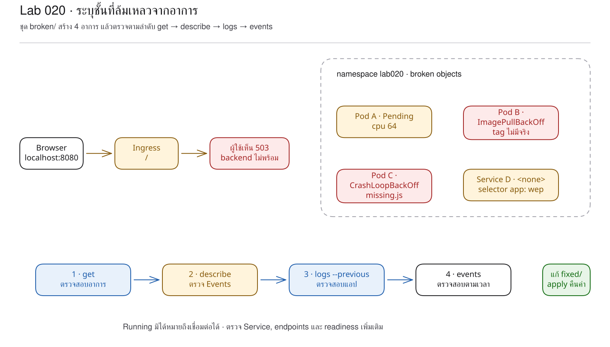
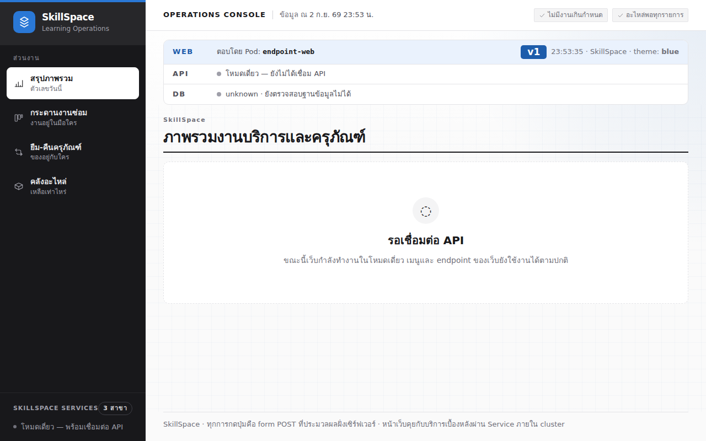

# LAB 20 — การวิเคราะห์อาการเพื่อระบุ layer ที่ขัดข้อง

> โฟลเดอร์ `020-reading-the-symptoms` = LAB 20 ของชุด Kubernetes ครั้งที่ 3
> (ไฟล์ของปฏิบัติการนี้: `broken/01..04.yaml`, `fixed/01..04.yaml`, `exercise/05-mystery.yaml`)

> 💡 **แนวคิดหลักของปฏิบัติการนี้:** อาการที่ Kubernetes แสดงสามารถใช้ระบุชั้นที่เกิดปัญหาได้

## วัตถุประสงค์ของปฏิบัติการ

เมื่อสิ้นสุดปฏิบัติการ ผู้เรียนจะสามารถ:
1. อธิบายได้ว่า `Pending`, `ImagePullBackOff`, crash/backoff และ endpoints ว่างชี้ไปคนละ layer
2. ไล่หลักฐานตามลำดับ `get → describe → logs → events` ได้
3. แยกปัญหา scheduler, image, application process และ Service routing ได้
4. แก้ไขแต่ละกรณีจากหลักฐานและพิสูจน์ว่าสภาพกลับเป็นปกติได้

## แนวคิดและทฤษฎีที่เกี่ยวข้อง

เมื่อเว็บไม่แสดงผล ไม่ควรเริ่มจากการคาดเดาว่า YAML บรรทัดใดผิด แต่ควรพิจารณาหลักฐานทีละชั้น:
| คำสั่ง | คำถามที่ตอบ |
|---|---|
| `kubectl get` | อาการภายนอกเป็นอย่างไร และ Object ใดยังไม่พร้อม |
| `kubectl describe` | scheduler/kubelet/controller บันทึกข้อมูลใดใน Events |
| `kubectl logs` | process ใน container รายงานข้อมูลใด |
| `kubectl get events` | เหตุการณ์ใดเกิดขึ้นใน namespace ตามลำดับเวลา |
แผนที่อาการย่อมีดังนี้:
| อาการ | layer ที่ควรสงสัยก่อน |
|---|---|
| `Pending` | scheduling: resource, node selector, taint หรือ PVC |
| `ErrImagePull` / `ImagePullBackOff` | image name/tag, registry หรือ credential |
| restart เพิ่ม + `BackOff` | process เริ่มแล้วหยุดทำงาน ให้ตรวจสอบ logs |
| Pod Running แต่ Service ไม่มี endpoint | label/selector หรือ readiness |

## ผลการเรียนรู้ที่คาดหวัง

- สามารถอ่าน `Insufficient cpu` จาก Events ของ scheduler
- สามารถอ่าน registry error ที่เกิดจาก tag ซึ่งไม่มีอยู่จริง
- สามารถอ่าน Node.js `MODULE_NOT_FOUND` จาก stdout ของแอปพลิเคชัน
- สามารถเปรียบเทียบ Service selector กับ Pod label โดยตรง
- สามารถวินิจฉัยกรณีที่มี endpoints แต่ไม่มี process รับการเชื่อมต่อที่ target port

## ภาพรวมของปฏิบัติการ

1. apply โฟลเดอร์ `broken/` เพื่อสร้างสี่อาการ
2. ใช้ get วิเคราะห์ภาพรวม
3. ใช้ describe/logs ระบุเหตุผลของแต่ละกรณี
4. ใช้ไฟล์ใน `fixed/` คืนสภาพและยืนยันทุก Pod
5. เปิด UI ผ่าน Ingress และวิเคราะห์ log
6. ทดลอง mystery targetPort แล้วทำ Clean Re-run


> **คำถามนำก่อนเริ่มปฏิบัติการ:** เมื่อ Pod สี่รายการไม่สามารถแสดงเว็บได้เช่นเดียวกัน ควรใช้คำสั่งเดียวแก้ไขทั้งหมดหรือควรระบุ layer ที่ขัดข้องก่อน

## 0. การเตรียมสภาพแวดล้อมสำหรับปฏิบัติการ

```bash
docker start devtools-k8s || docker run -d --name devtools-k8s --privileged --shm-size=1g --ulimit nofile=65536:65536 -p 2299:22 -p 8080:80 -p 8443:443 -p 3000:3000 -p 9090:9090 tuchsanai/devtools-k8s:2569_1
docker exec -it devtools-k8s bash
k8s-bootstrap
kubectl get nodes
docker exec devtools-control-plane crictl images | grep k8s-lab
```
> 📝 **คำอธิบาย:** เข้าสู่เครื่องเรียนด้วย `docker exec -it` (ให้ป้อนคำสั่งหลังจากนี้ทั้งหมดในเครื่องเรียน) · `k8s-bootstrap` ข้ามขั้นตอนโดยอัตโนมัติหากมี cluster แล้ว · `get nodes` ตรวจสอบ cluster · `crictl images` ตรวจสอบ image ใน kind node
ในเทอร์มินัลของเครื่องเรียนให้ใช้ `localhost` (พอร์ต 80) ส่วนเบราว์เซอร์บนเครื่องของผู้เรียนให้ใช้ `localhost:8080`

✅ **ผลลัพธ์ที่คาดหวัง (Expected output)** — node จำนวนสามรายการอยู่ในสถานะ Ready และ image จำนวนสี่รายการพร้อม โดย AGE/hash/ขนาดอาจแตกต่างกัน:
```text
NAME                     STATUS   ROLES           AGE   VERSION
devtools-control-plane   Ready    control-plane   14m   v1.36.4
devtools-worker          Ready    <none>          14m   v1.36.4
devtools-worker2         Ready    <none>          14m   v1.36.4
docker.io/library/k8s-lab-api   v1   42d77457f3a7b   186MB
docker.io/library/k8s-lab-db    v1   5c2e02567888a   300MB
docker.io/library/k8s-lab-web   v1   211bccf3fd619   209MB
docker.io/library/k8s-lab-web   v2   36782d1182745   209MB
```
ถ้าผล `grep` ว่าง → ทำขั้น build/load ใน README ระดับชุดหรือ LAB 001

## 1. การดึงโค้ดของปฏิบัติการ (Clone)

```bash
mkdir -p ~/labwork && cd ~/labwork && git clone https://github.com/Tuchsanai/DevTools.git
cd ~/labwork/DevTools/05_kubernetes/03_Session3_Application_Deployment/020-reading-the-symptoms
```
> 📝 **คำอธิบาย:** `mkdir -p` เตรียม workspace · `&&` หยุดเมื่อขั้นตอนก่อนหน้าไม่สำเร็จ · `git clone` ดาวน์โหลดโค้ด · `cd` เข้าสู่ LAB 20

✅ **ผลลัพธ์ที่คาดหวัง (Expected output)** — การ clone และเข้าสู่โฟลเดอร์สำเร็จ:
```text
Cloning into 'DevTools'...
/root/labwork/DevTools/05_kubernetes/03_Session3_Application_Deployment/020-reading-the-symptoms
```
หากดำเนินการ clone แล้ว ให้ปรับปรุง repository แทน:
```bash
cd ~/labwork/DevTools && git pull
cd 05_kubernetes/03_Session3_Application_Deployment/020-reading-the-symptoms
```
> 📝 **คำอธิบาย:** `git pull` ดึงการเปลี่ยนแปลงล่าสุด · `cd` กลับเข้าสู่ปฏิบัติการ

✅ **ผลลัพธ์ที่คาดหวัง (Expected output)** — repository เป็นเวอร์ชันล่าสุดแล้ว:
```text
Already up to date.
```

## 2. การอ่าน YAML ของปฏิบัติการนี้

| ไฟล์ | kind | หน้าที่ในปฏิบัติการนี้ | รายละเอียดเพิ่มเติม |
|---|---|---|---|
| `broken/01-pending.yaml` | Pod | ขอ CPU 64 cores จนไม่สามารถ schedule ได้ | [manifest ที่มีข้อผิดพลาดของปฏิบัติการ 020](../YAML_Guide.md#5-manifest-ที่มีข้อผิดพลาดโดยเจตนาของปฏิบัติการ-020) |
| `fixed/01-pending.yaml` | Pod | ลด request เหลือ 50m | [resources](../YAML_Guide.md#2-resources) |
| `broken/02-imagepull.yaml` | Pod | ใช้ image tag `v1.0` ที่ไม่มี | [manifest ที่มีข้อผิดพลาดของปฏิบัติการ 020](../YAML_Guide.md#5-manifest-ที่มีข้อผิดพลาดโดยเจตนาของปฏิบัติการ-020) |
| `fixed/02-imagepull.yaml` | Pod | กลับมาใช้ tag `v1` | [manifest ที่มีข้อผิดพลาดของปฏิบัติการ 020](../YAML_Guide.md#5-manifest-ที่มีข้อผิดพลาดโดยเจตนาของปฏิบัติการ-020) |
| `broken/03-crashloop.yaml` | Pod | override command ให้เปิดไฟล์ที่ไม่มี | [manifest ที่มีข้อผิดพลาดของปฏิบัติการ 020](../YAML_Guide.md#5-manifest-ที่มีข้อผิดพลาดโดยเจตนาของปฏิบัติการ-020) |
| `fixed/03-crashloop.yaml` | Pod | ใช้ command เดิมจาก image | [manifest ที่มีข้อผิดพลาดของปฏิบัติการ 020](../YAML_Guide.md#5-manifest-ที่มีข้อผิดพลาดโดยเจตนาของปฏิบัติการ-020) |
| `broken/04-no-endpoints.yaml` | Pod + Service + Ingress | selector สะกด `wep` ไม่ตรง label | [manifest ที่มีข้อผิดพลาดของปฏิบัติการ 020](../YAML_Guide.md#5-manifest-ที่มีข้อผิดพลาดโดยเจตนาของปฏิบัติการ-020) |
| `fixed/04-no-endpoints.yaml` | Pod + Service + Ingress | แก้ selector เป็น `web` | [manifest ที่มีข้อผิดพลาดของปฏิบัติการ 020](../YAML_Guide.md#5-manifest-ที่มีข้อผิดพลาดโดยเจตนาของปฏิบัติการ-020) |
| `exercise/05-mystery.yaml` | Service | กำหนด `targetPort: 3001` โดยเจตนา | [manifest ที่มีข้อผิดพลาดของปฏิบัติการ 020](../YAML_Guide.md#5-manifest-ที่มีข้อผิดพลาดโดยเจตนาของปฏิบัติการ-020) |

อ่าน diff สำคัญจากไฟล์จริงก่อนรัน:

```yaml
# broken → fixed
cpu: "64"                       # → 50m
image: k8s-lab-web:v1.0          # → k8s-lab-web:v1
command: ["node", "missing.js"]  # → เอา override ออก ใช้ command จาก image
app: wep                         # → app: web ให้ selector ตรง label
targetPort: 3001                 # exercise: Pod ฟัง 3000 จึง connection refused
```

ค่าทั้งหมดสามารถ parse เป็น YAML ได้ จึงมิได้ “ล้มเหลวเนื่องจาก syntax” แต่มีข้อผิดพลาดเชิงความหมาย โดย scheduler, image,
process และ network แสดงอาการแตกต่างกัน ให้คาดการณ์ชั้นที่ขัดข้องก่อนใช้ `get → describe → logs → events`

**ข้อผิดพลาดที่พบบ่อยในปฏิบัติการนี้:** การแก้ไขจากชื่อ status เพียงอย่างเดียวอาจนำไปสู่การวินิจฉัยที่คลาดเคลื่อน ข้อความจริงใน runlog คือ
`FailedScheduling ... Insufficient cpu`, `Error: ImagePullBackOff`, `Error: Cannot find module '/app/missing.js'`
และ exercise ได้ `Connection refused`; ต้องเทียบ broken/fixed ที่ field ต้นเหตุ ไม่ใช่ลบ Pod ซ้ำ

ศึกษารายละเอียดของ field ได้ด้วย `kubectl explain pod.spec.containers.resources.requests`, `kubectl explain pod.spec.containers.command` และ `kubectl explain service.spec.ports.targetPort`

## 3. การสร้างระบบที่มีความล้มเหลวสี่ลักษณะ

ไฟล์สำคัญจงใจผิดคนละจุด:
```yaml
# 01-pending.yaml
requests: { cpu: "64" }
# 02-imagepull.yaml
image: k8s-lab-web:v1.0
# 03-crashloop.yaml
command: ["node", "missing.js"]
# 04-no-endpoints.yaml
selector: { app: wep }
```
สร้าง namespace และ apply ทั้งโฟลเดอร์:
```bash
kubectl create namespace lab020
kubectl apply -f broken/
sleep 20
kubectl get pods,service,endpoints -n lab020
```
> 📝 **คำอธิบาย:** `create namespace` แยกสภาพแวดล้อมของปฏิบัติการ · `apply -f broken/` อ่านทุก YAML · `sleep 20` ให้ pull/restart เกิดขึ้น · `get pods,service,endpoints` ตรวจสอบ workload และปลายทางพร้อมกัน

✅ **ผลลัพธ์ที่คาดหวัง (Expected output)** — ปรากฏ Pending, ImagePullBackOff, process crash และ endpoints ว่าง โดย AGE/RESTARTS/ClusterIP อาจแตกต่างกัน:
```text
Warning: v1 Endpoints is deprecated in v1.33+; use discovery.k8s.io/v1 EndpointSlice
NAME                READY   STATUS             RESTARTS      AGE
pod/crashloop-web   0/1     Error              2 (19s ago)   20s
pod/endpoint-web    1/1     Running            0             20s
pod/imagepull-web   0/1     ImagePullBackOff   0             20s
pod/pending-web     0/1     Pending            0             20s
NAME          TYPE        CLUSTER-IP    EXTERNAL-IP   PORT(S)    AGE
service/web   ClusterIP   10.96.82.88   <none>        3000/TCP   20s
NAME            ENDPOINTS   AGE
endpoints/web   <none>      20s
```
(ตัดแถว `created` จาก `apply`; Warning บอกว่า Endpoints API ถูก deprecate และแนะนำ EndpointSlice แต่ไม่ทำให้คำสั่งล้มเหลว)
Kubernetes v1.36.4 รอบทดสอบนี้แสดง crash เป็น `Error` พร้อม RESTARTS เพิ่ม ไม่ได้จับคำว่า `CrashLoopBackOff` ในคอลัมน์ STATUS แม้สุ่มตรวจต่อเนื่อง 90 วินาที แต่ Events แสดง `BackOff restarting failed container` จริง จึงต้องยึดหลักฐานสองจุดร่วมกัน

## 4. กรณี A — Pending บ่งชี้ปัญหาที่ scheduler

```bash
kubectl describe pod pending-web -n lab020 | grep -A8 '^Events:'
kubectl replace --force -f fixed/01-pending.yaml
kubectl wait -n lab020 --for=condition=ready pod/pending-web --timeout=120s
kubectl get pod pending-web -n lab020
```
> 📝 **คำอธิบาย:** `describe` เปิด Events · `grep -A8` จำกัดช่วงอ่าน · `replace --force` ลบ Pod immutable แล้วสร้างจากไฟล์แก้ · `wait` รอ Ready · `get` ยืนยันผล

✅ **ผลลัพธ์ที่คาดหวัง (Expected output)** — สาเหตุคือ CPU ไม่เพียงพอ และไฟล์ fixed ทำให้ Pod อยู่ในสถานะ Running โดย AGE อาจแตกต่างกัน:
```text
Warning  FailedScheduling  36s  default-scheduler  0/3 nodes are available: 1 node(s) had untolerated taint(s), 2 Insufficient cpu.
pod "pending-web" deleted from lab020 namespace
pod/pending-web replaced
pod/pending-web condition met
NAME          READY   STATUS    RESTARTS   AGE
pending-web   1/1     Running   0          1s
```

## 5. กรณี B — ImagePullBackOff บ่งชี้ปัญหาที่ image

```bash
kubectl describe pod imagepull-web -n lab020 | grep -A12 '^Events:'
kubectl replace --force -f fixed/02-imagepull.yaml
kubectl wait -n lab020 --for=condition=ready pod/imagepull-web --timeout=120s
kubectl get pod imagepull-web -n lab020
```
> 📝 **คำอธิบาย:** Events เปิดชื่อ image และคำตอบ registry · ไฟล์ fixed เปลี่ยน `v1.0` เป็น tag `v1` ที่ load แล้ว · `wait/get` ยืนยันการแก้

✅ **ผลลัพธ์ที่คาดหวัง (Expected output)** — ปรากฏ pull access denied/ไม่มี repository จากนั้น Pod ใหม่อยู่ในสถานะ Running โดยเวลาและจำนวนครั้งอาจแตกต่างกัน (ละบางแถว):
```text
Normal   Pulling  kubelet  Pulling image "k8s-lab-web:v1.0"
Warning  Failed   kubelet  Failed to pull image "k8s-lab-web:v1.0": failed to pull and unpack image "docker.io/library/k8s-lab-web:v1.0": failed to resolve reference "docker.io/library/k8s-lab-web:v1.0": pull access denied, repository does not exist or may require authorization: server message: insufficient_scope: authorization failed
Warning  Failed   kubelet  Error: ImagePullBackOff
…
imagepull-web   1/1   Running   0   2s
```

## 6. กรณี C — process crash ซึ่งต้องวิเคราะห์ logs

```bash
kubectl get pod crashloop-web -n lab020
kubectl logs crashloop-web -n lab020
kubectl logs crashloop-web -n lab020 --previous
```
> 📝 **คำอธิบาย:** `get` แสดงการ restart · `logs` อ่านรอบปัจจุบัน/รอบที่เพิ่งสิ้นสุด · `--previous` ขอ log ของ container instance ก่อนหน้า ซึ่ง runtime อาจบันทึกไม่ทันสำหรับ process ที่หยุดทำงานอย่างรวดเร็ว

✅ **ผลลัพธ์ที่คาดหวัง (Expected output)** — log ปัจจุบันระบุว่าไฟล์สูญหาย ในการทดสอบนี้ `--previous` ดึงข้อมูลไม่ทันและรายงานตามจริง โดย container ID อาจแตกต่างกัน:
```text
NAME            READY   STATUS   RESTARTS     AGE
crashloop-web   0/1     Error    1 (1s ago)   2s
Error: Cannot find module '/app/missing.js'
  code: 'MODULE_NOT_FOUND'
Node.js v24.20.0
unable to retrieve container logs for containerd://<container-id>
```
ให้วิเคราะห์ Events แล้วคืนสภาพ:
```bash
kubectl get events -n lab020 --sort-by=.lastTimestamp
kubectl replace --force -f fixed/03-crashloop.yaml
kubectl wait -n lab020 --for=condition=ready pod/crashloop-web --timeout=120s
```
> 📝 **คำอธิบาย:** `--sort-by=.lastTimestamp` เรียงเหตุการณ์ · Events ยืนยัน BackOff แม้ STATUS เป็น Error · fixed file นำ command ที่ผิดออก · `wait` พิสูจน์สถานะ Ready

✅ **ผลลัพธ์ที่คาดหวัง (Expected output)** — Events มี BackOff และ Pod fixed พร้อม โดย UID/เวลา/จำนวนครั้งอาจแตกต่างกัน:
```text
Warning   BackOff   pod/crashloop-web   Back-off restarting failed container web in pod crashloop-web_lab020(...)
pod "crashloop-web" deleted from lab020 namespace
pod/crashloop-web replaced
pod/crashloop-web condition met
```

## 7. กรณี D — Pod อยู่ในสถานะ Running แต่ Service ไม่มีปลายทาง

```bash
kubectl describe service web -n lab020 | sed -n '/Selector:/,/Endpoints:/p'
kubectl get pod endpoint-web -n lab020 --show-labels
kubectl apply -f fixed/04-no-endpoints.yaml
kubectl get endpoints web -n lab020
```
> 📝 **คำอธิบาย:** `describe service` แสดง selector/endpoints · `--show-labels` เปิด label ของ Pod · fixed file แก้ `wep` เป็น `web` · `get endpoints` พิสูจน์ว่า Service พบ Pod

✅ **ผลลัพธ์ที่คาดหวัง (Expected output)** — selector เดิมไม่ตรงกัน จากนั้น endpoint มี IP:3000 โดย IP/AGE อาจแตกต่างกัน และ Kubernetes 1.36 แจ้งเตือนว่า Endpoints API ถูก deprecate แล้ว:
```text
Selector:                 app=wep
Endpoints:
endpoint-web   1/1   Running   0   71s   app=web
pod/endpoint-web unchanged
service/web configured
ingress.networking.k8s.io/skillspace unchanged
Warning: v1 Endpoints is deprecated in v1.33+; use discovery.k8s.io/v1 EndpointSlice
NAME   ENDPOINTS         AGE
web    10.244.1.5:3000   71s
```
ให้เปิด `http://localhost:8080` และตรวจสอบ log:
```bash
until BODY=$(curl -fsS http://localhost/info); do sleep 2; done
echo "$BODY" | jq -c '{pod,version}'
kubectl logs endpoint-web -n lab020 --tail=10
```
> 📝 **คำอธิบาย:** ลูป `until` รอ Ingress sync · `curl -f` ให้ 4xx/5xx ถือว่าพลาด · `/info` แสดง Pod · `--tail=10` อ่านท้าย log

✅ **ผลลัพธ์ที่คาดหวัง (Expected output)** — อาจปรากฏ 503 ระหว่าง sync จากนั้นตอบสนองจาก endpoint-web โดยเวลาอาจแตกต่างกัน:
```text
curl: (22) The requested URL returned error: 503
{"pod":"endpoint-web","version":"v1"}
▲ Next.js 16.3.1
- Network:       http://0.0.0.0:3000
✓ Ready in 0ms
```



## 8. การทดลองจำลองความล้มเหลว — การวิเคราะห์อาการสี่ลักษณะเป็นแผนที่

ปฏิบัติการนี้กำหนดความล้มเหลวทั้งสี่กรณีในหัวข้อ 3–6 โดยมีวิธีวิเคราะห์และคืนสภาพดังนี้:
1. `Pending` → describe พบ scheduler → ลด request
2. `ImagePullBackOff` → describe พบ image/tag → ใช้ tag ที่มี
3. restart + BackOff → logs พบ application error → คืน command ปกติ
4. endpoints ว่าง → เทียบ selector/label → แก้ selector

## 9. แบบฝึกหัด (Exercise)

ให้ apply `exercise/05-mystery.yaml` แล้ววินิจฉัยโดยไม่เปิดไฟล์ล่วงหน้า:
- Service มี endpoints แต่เรียกแล้ว `Connection refused`
- ใช้ get/describe เทียบ `port`, `targetPort` และพอร์ตที่ container ฟัง
- สำเร็จเมื่อชี้ field ที่ไม่สอดคล้อง แก้แล้วเรียก `/healthz` ได้ และลบ `mystery-web` หลังตรวจ
<details>
<summary>แนวเฉลยสำหรับผู้สอน</summary>
ผลจริงยืนยันว่า endpoints “มี” ไม่ได้แปลว่า application ฟังพอร์ตนั้น:
```bash
kubectl apply -f exercise/05-mystery.yaml
kubectl get endpoints mystery-web -n lab020
kubectl exec -n lab020 endpoint-web -- wget -S -O- -T 3 http://mystery-web:3000/healthz
kubectl delete service mystery-web -n lab020
```
> 📝 **คำอธิบาย:** apply สร้าง Service ปริศนา · endpoints แสดง IP และ target port · `exec` ยิงจากใน Pod · `-T 3` จำกัด timeout

✅ **ผลลัพธ์ที่คาดหวัง (Expected output)** — endpoint ชี้ไปยัง 3001 แต่ connection ถูกปฏิเสธ โดย IP อาจแตกต่างกัน (ละบางแถว):
```text
mystery-web   10.244.1.5:3001   1s
Connecting to mystery-web:3000 (10.96.178.73:3000)
wget: can't connect to remote host (10.96.178.73): Connection refused
command terminated with exit code 1
…
service "mystery-web" deleted from lab020 namespace
```
ต้นเหตุคือ Service ชี้ `targetPort: 3001` แต่ process ฟัง 3000; แนวแก้คือทำให้ target port ตรงกับ port ที่แอปฟัง
</details>

## วิธีตรวจสอบผลการทดลอง

```bash
kubectl get pods,service,endpoints -n lab020
curl -fsS http://localhost/info | jq -c '{pod}'
kubectl get events -n lab020 --sort-by=.lastTimestamp | tail -10
```
> 📝 **คำอธิบาย:** `get` ตรวจทุก Pod และปลายทาง · `curl` ตรวจมุมผู้ใช้ · `events` ตรวจเหตุการณ์ระบบ · `tail` จำกัดสิบบรรทัดล่าสุด

✅ **ผลลัพธ์ที่คาดหวัง (Expected output)** — Pod fixed ทั้งสี่อยู่ในสถานะ Running, web มี endpoint และ UI ตอบสนองด้วย `endpoint-web` โดย IP/AGE อาจแตกต่างกัน:
```text
pod/crashloop-web   1/1   Running   0   34s
pod/endpoint-web    1/1   Running   0   5m20s
pod/imagepull-web   1/1   Running   0   4m42s
pod/pending-web     1/1   Running   0   4m44s
endpoints/web       10.244.1.5:3000
{"pod":"endpoint-web"}
```

## ปัญหาที่พบบ่อยและแนวทางแก้ไข

| อาการ | สาเหตุที่พบบ่อย | วิธีแก้ |
|---|---|---|
| STATUS สลับ `Error` โดยไม่ปรากฏคำ CrashLoopBackOff | process ทำงานสั้นมากและจังหวะ sampling | ตรวจสอบ RESTARTS และ Events `BackOff` ร่วมกัน |
| `--previous` ดึง log ไม่ได้ | runtime บันทึก instance ที่หยุดทำงานอย่างรวดเร็วไม่ทัน | อ่าน `kubectl logs` ปัจจุบันทันทีและตรวจสอบ Events |
| Endpoints มี warning deprecation | Kubernetes 1.33+ แนะนำ EndpointSlice | ใช้ `kubectl get endpointslice` ในงานใหม่ |
| Pod Running แต่เว็บเข้าไม่ได้ | selector, targetPort หรือ Ingress ผิด | ไล่ Service → EndpointSlice → port |

## การล้างทรัพยากร (Cleanup) และการพิสูจน์การทำซ้ำจากสถานะเริ่มต้น (Clean Re-run)

ให้ลบ resource สร้าง broken ใหม่ และใช้ fixed แก้ไขทั้งชุด:
```bash
kubectl delete namespace lab020
kubectl wait --for=delete namespace/lab020 --timeout=120s
kubectl get all -n lab020
kubectl create namespace lab020
kubectl apply -f broken/
sleep 20
kubectl get pods,service,endpoints -n lab020
kubectl delete pod pending-web imagepull-web crashloop-web -n lab020
kubectl apply -f fixed/
kubectl wait -n lab020 --for=condition=ready pod --all --timeout=120s
```
> 📝 **คำอธิบาย:** ลบ namespace แล้วรอหาย · apply broken พิสูจน์อาการซ้ำ · ลบ Pod immutable สามตัว · apply fixed สร้างใหม่และแก้ Service · `--all` รอ Pod ทุกตัว Ready

✅ **ผลลัพธ์ที่คาดหวัง (Expected output)** — broken กลับมาครบถ้วน จากนั้น fixed ทุกรายการอยู่ในสถานะ Ready (ละบางแถว):
```text
No resources found in lab020 namespace.
pending-web     0/1   Pending            0   20s
imagepull-web   0/1   ImagePullBackOff   0   20s
crashloop-web   0/1   Error              2   20s
endpoints/web   <none>
pod/crashloop-web condition met
…
pod/pending-web condition met
```
ยืนยันหน้าเว็บแล้วลบปิดท้าย:
```bash
until BODY=$(curl -fsS http://localhost/info); do sleep 2; done
echo "$BODY" | jq -c '{pod,version}'
kubectl delete namespace lab020
kubectl wait --for=delete namespace/lab020 --timeout=120s
kubectl get all -n lab020
kubectl get namespace lab020
```
> 📝 **คำอธิบาย:** รอ Ingress จนตอบจริง · ลบ namespace รอบ re-run · ตรวจทั้ง resource และ namespace

✅ **ผลลัพธ์ที่คาดหวัง (Expected output)** — UI ตอบสนองจาก Pod จริงและไม่เหลือ namespace โดยชื่อ Pod อาจแตกต่างกัน:
```text
curl: (22) The requested URL returned error: 503
{"pod":"endpoint-web","version":"v1"}
namespace "lab020" deleted
No resources found in lab020 namespace.
Error from server (NotFound): namespaces "lab020" not found
```

## สรุปคำสั่งของปฏิบัติการนี้

| คำสั่ง | ความหมาย |
|---|---|
| `kubectl get endpoints` | ตรวจว่า Service มีปลายทางหรือไม่ |
| `kubectl replace --force -f` | สร้าง Pod immutable ใหม่จากไฟล์แก้ |

## สรุปสิ่งที่ได้เรียนรู้

- Pending ให้เริ่มที่ scheduler Events
- ImagePullBackOff ให้เริ่มที่ชื่อ image, tag และ registry
- crash/backoff ให้ตรวจสอบ RESTARTS, logs และ Events
- Running แต่ Service ว่าง ให้เทียบ selector, label และ readiness
- เมื่อมี endpoints แต่ระบบยังขัดข้อง ให้ตรวจสอบ targetPort และ process ที่รับการเชื่อมต่อจริง
**ภาพรวมที่ควรจดจำ:** สถานะเป็นข้อมูลบ่งชี้ชั้นของระบบที่ควรตรวจสอบ มิใช่คำตอบสุดท้ายของปัญหา
🧭 การเชื่อมโยงสู่ปฏิบัติการถัดไป: ดำเนินการ [LAB 21 — The Big Picture](../021-the-big-picture/README.md) เพื่อประยุกต์ลำดับการตรวจสอบนี้กับระบบที่มีองค์ประกอบครบถ้วน

## ❓ คำถามทบทวนก่อนจบปฏิบัติการ

1. **แต่ละอาการชี้ไปที่กลุ่มสาเหตุใด?** — Pending=scheduler, ImagePull=image, crash/backoff=process, endpoints ว่าง=selector/readiness
2. **ควรตรวจสอบหลักฐานใดตามลำดับ?** — get → describe → logs → events
3. **เมื่อ Pod อยู่ในสถานะ Running แต่เว็บขัดข้อง ควรพิจารณาสาเหตุใด?** — Service/EndpointSlice/Ingress/targetPort หรือ readiness มิใช่ scheduler เป็นลำดับแรก

## ✅ รายการตรวจสอบก่อนจบปฏิบัติการ

- [ ] เห็นอาการ broken ทั้งสี่จากการรันจริง
- [ ] อ่าน `Insufficient cpu` และ image pull error ได้
- [ ] อ่าน `MODULE_NOT_FOUND` และ Events `BackOff` ได้
- [ ] แก้ selector แล้ว endpoint กลับมา
- [ ] เปิดหน้าเว็บแล้วเห็น `endpoint-web`
- [ ] วินิจฉัย mystery targetPort ได้
- [ ] Clean Re-run ผ่านและลบ `lab020` แล้ว
*ผลลัพธ์ที่คาดหวัง (expected output) และภาพหน้าจอในเอกสารนี้ได้มาจากการดำเนินการจริงบน tuchsanai/devtools-k8s:2569_1 (kind v0.33.0 · Kubernetes v1.36.4 · kubectl v1.37.0) เมื่อ 2 กันยายน 2026*
