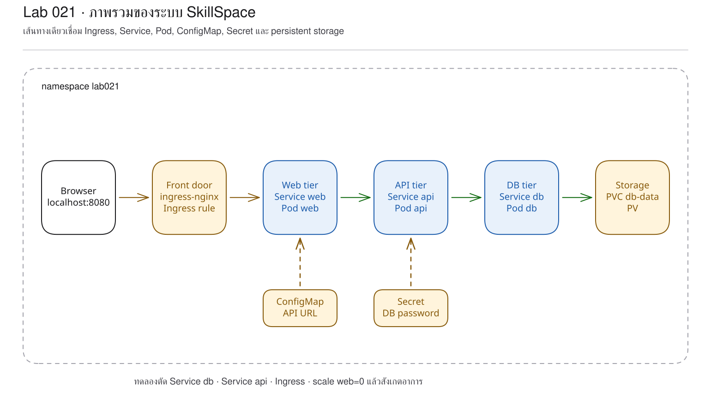
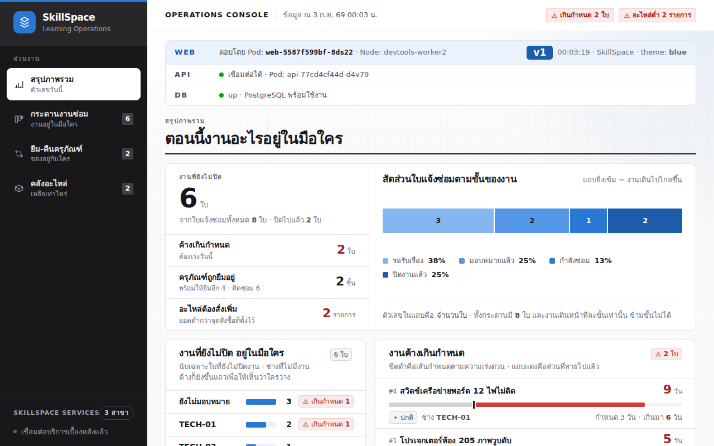
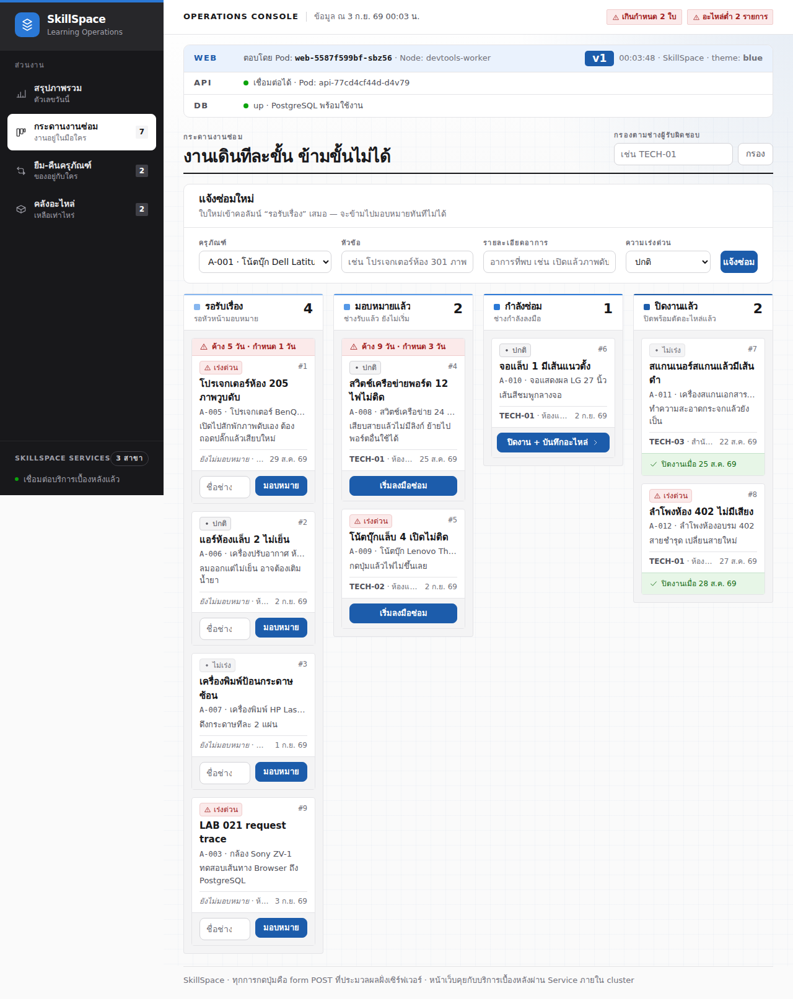
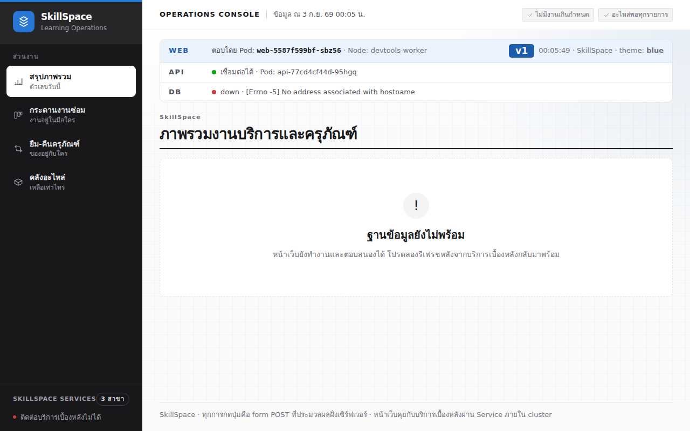

# LAB 21 — ภาพรวมของ Kubernetes และการติดตาม request จาก Browser ถึง PostgreSQL

> โฟลเดอร์ `021-the-big-picture` = LAB 21 ของชุด Kubernetes ครั้งที่ 3
> (ไฟล์ของปฏิบัติการนี้: `manifests/01-configmap.yaml` ถึง `manifests/10-db-service.yaml`)

> 💡 **แนวคิดหลักของปฏิบัติการนี้:** องค์ประกอบทั้งหมดที่ศึกษาเชื่อมโยงกันเป็นระบบเดียว

## วัตถุประสงค์ของปฏิบัติการ

เมื่อสิ้นสุดปฏิบัติการ ผู้เรียนจะสามารถ:
1. อธิบายเส้นทาง request จาก browser ผ่าน Ingress, Service และ Pod จนถึง PostgreSQL ได้
2. อธิบายบทบาทของ ConfigMap, Secret, PVC, probes, resources และ rolling strategy ในระบบเดียวกันได้
3. ใช้ log และข้อมูลในฐานข้อมูลพิสูจน์ว่า request ผ่านแต่ละชั้นจริงได้
4. คาดการณ์อาการเมื่อถอด object หนึ่งรายการ และใช้ manifest คืนสภาพได้

## แนวคิดและทฤษฎีที่เกี่ยวข้อง

ระบบนี้ประกอบด้วย object หลายรายการ โดยแต่ละรายการรับผิดชอบประเด็นเฉพาะ ดังนี้:
| Object | หน้าที่ | ผลเมื่อสูญหาย | ปฏิบัติการที่ศึกษา |
|---|---|---|---:|
| ConfigMap | ส่งค่ารัน | web ใหม่เริ่มไม่ได้/เรียก API ผิด | 10, 15 |
| Secret | ส่งรหัสผ่าน db | db/api ใหม่เริ่มไม่ได้ | 11, 16 |
| Deployment | รักษาจำนวน/Pod template | ไม่มี controller ซ่อม Pod | 7, 18 |
| Service | ให้ DNS และ endpoint | layer ก่อนหน้าไม่พบปลายทาง | 8–9 |
| Ingress | route request ภายนอก | browser ได้ 404 | 17 |
| PVC/PV | บันทึก data นอก Pod | ข้อมูลไม่คงอยู่หลังการสร้างใหม่ | 13, 16 |
| Probe | กัน Pod ที่ไม่พร้อมออกจาก Service | request อาจไปผิดที่ | 14 |
| Resources | บอกค่าจอง/เพดาน | schedule/ความเสถียรคาดเดายาก | 19 |

ConfigMap และ Secret ไม่ได้อยู่ “ในเส้นทาง packet” แต่ถูก inject ตอนสร้าง Pod
ส่วน PVC/PV อยู่ปลายทางของการเขียนข้อมูล การจัดทำแผนภาพที่ถูกต้องจึงต้องแยกเส้น request
เส้น config และเส้น storage ออกจากกัน

## ผลการเรียนรู้ที่คาดหวัง

- สามารถประกอบ SkillSpace ที่มีองค์ประกอบครบ 3 ชั้นจาก manifest ชุดเดียว
- สามารถตรวจสอบ web 2 Pod, API 2 Pod และ db 1 Pod พร้อมกัน
- สามารถพิสูจน์ว่า PVC อยู่ในสถานะ Bound และอ่านข้อมูล seed ได้จริง
- สามารถสร้าง ticket ผ่าน browser และติดตามไปถึง row ใน PostgreSQL
- สามารถอ่าน access log ของ ingress-nginx และ application log ของ API
- สามารถถอด Service/Ingress/Deployment ทีละรายการและวิเคราะห์อาการ
- สามารถสังเกตผลกระทบต่อเนื่องของ readiness เมื่อ dependency สูญหาย
- สามารถพิสูจน์ Clean Re-run จาก namespace ว่าง

## ภาพรวมของปฏิบัติการ

1. apply manifest ทั้งระบบและเปิด `http://localhost:8080`
2. สร้าง ticket จาก UI จริง
3. ติดตาม log จาก Ingress → web → API → db
4. เติมชื่อ object ลงในเส้นทาง request
5. ถอด db Service, api Service, Ingress และ web Deployment ทีละรายการ
6. apply คืนทุกครั้ง แล้วทำ Clean Re-run


> **คำถามนำก่อนเริ่มปฏิบัติการ:** เมื่อผู้ใช้เลือก “แจ้งซ่อม” หนึ่งครั้ง request ผ่าน object ใดบ้าง และ object ใดใช้บันทึก config กับข้อมูลโดยไม่ส่ง packet ด้วยตนเอง

## 0. การเตรียมสภาพแวดล้อมสำหรับปฏิบัติการ

```bash
docker start devtools-k8s || docker run -d --name devtools-k8s --privileged --shm-size=1g --ulimit nofile=65536:65536 -p 2299:22 -p 8080:80 -p 8443:443 -p 3000:3000 -p 9090:9090 tuchsanai/devtools-k8s:2569_1
docker exec -it devtools-k8s bash
k8s-bootstrap
kubectl get nodes
docker exec devtools-control-plane crictl images | grep k8s-lab
```
> 📝 **คำอธิบาย:** เข้าสู่เครื่องเรียนด้วย `docker exec -it` (ให้ป้อนคำสั่งหลังจากนี้ทั้งหมดในเครื่องเรียน) · `k8s-bootstrap` ข้ามขั้นตอนโดยอัตโนมัติหากมี cluster แล้ว · `get nodes` ตรวจสอบ cluster · `crictl images` ตรวจสอบ image ใน kind node

ในเทอร์มินัลของเครื่องเรียนให้ใช้ `localhost` (พอร์ต 80) ส่วนเบราว์เซอร์บนเครื่องของผู้เรียนให้ใช้ `localhost:8080`

✅ **ผลลัพธ์ที่คาดหวัง (Expected output)** — node จำนวนสามรายการอยู่ในสถานะ Ready และมี image จำนวนสี่รายการ โดย AGE/hash อาจแตกต่างกัน:
```text
NAME                     STATUS   ROLES           AGE   VERSION
devtools-control-plane   Ready   control-plane   25m   v1.36.4
devtools-worker          Ready   <none>          25m   v1.36.4
devtools-worker2         Ready   <none>          25m   v1.36.4
docker.io/library/k8s-lab-api   v1   42d77457f3a7b   186MB
docker.io/library/k8s-lab-db    v1   5c2e02567888a   300MB
docker.io/library/k8s-lab-web   v1   211bccf3fd619   209MB
docker.io/library/k8s-lab-web   v2   36782d1182745   209MB
```
ถ้าผล `grep` ว่าง → ทำขั้น build/load ใน README ระดับชุดหรือ LAB 001

## 1. การดึงโค้ดของปฏิบัติการ (Clone)

```bash
mkdir -p ~/labwork && cd ~/labwork && git clone https://github.com/Tuchsanai/DevTools.git
cd ~/labwork/DevTools/05_kubernetes/03_Session3_Application_Deployment/021-the-big-picture
```
> 📝 **คำอธิบาย:** `mkdir -p` เตรียม workspace · `&&` ดำเนินคำสั่งถัดไปเมื่อคำสั่งก่อนหน้าสำเร็จ · `git clone` ดาวน์โหลด repository · `cd` เข้าสู่ LAB 21

✅ **ผลลัพธ์ที่คาดหวัง (Expected output)** — การ clone และเข้าสู่โฟลเดอร์สำเร็จ:
```text
Cloning into 'DevTools'...
/root/labwork/DevTools/05_kubernetes/03_Session3_Application_Deployment/021-the-big-picture
```
หากดำเนินการ clone แล้ว ให้ปรับปรุง repository แทน:
```bash
cd ~/labwork/DevTools && git pull
cd 05_kubernetes/03_Session3_Application_Deployment/021-the-big-picture
```
> 📝 **คำอธิบาย:** `git pull` ดึง commit ล่าสุด · `cd` กลับเข้าสู่ปฏิบัติการ

✅ **ผลลัพธ์ที่คาดหวัง (Expected output)** — repository เป็นเวอร์ชันล่าสุดแล้ว:
```text
Already up to date.
```

## 2. การอ่าน YAML ของปฏิบัติการนี้

| ไฟล์ | kind | หน้าที่ในปฏิบัติการนี้ | รายละเอียดเพิ่มเติม |
|---|---|---|---|
| `manifests/01-configmap.yaml` | ConfigMap | ให้ config แก่ web | [ทบทวน ConfigMap](../YAML_Guide.md#configmap) |
| `manifests/02-web-deployment.yaml` | Deployment | รวม probes, resources และ RollingUpdate ของ web | [ทบทวน Deployment](../YAML_Guide.md#deployment) · [Probes](../YAML_Guide.md#probes) · [strategy](../YAML_Guide.md#3-strategy) · [resources](../YAML_Guide.md#2-resources) |
| `manifests/03-web-service.yaml` | Service | เชื่อม Ingress ไป web Pod | [ทบทวน Service](../YAML_Guide.md#service) · [Ingress backend](../YAML_Guide.md#1-ingress) |
| `manifests/04-api-deployment.yaml` | Deployment | รวม Secret, probes และ resources ของ api | [ทบทวน Deployment](../YAML_Guide.md#deployment) · [Secret](../YAML_Guide.md#secret) · [Probes](../YAML_Guide.md#probes) · [resources](../YAML_Guide.md#2-resources) |
| `manifests/05-api-service.yaml` | Service | เชื่อม web ไป api Pod | [ทบทวน Service](../YAML_Guide.md#service) |
| `manifests/06-ingress.yaml` | Ingress | แยก `/api` และ `/` จากประตูเดียว | [Ingress](../YAML_Guide.md#1-ingress) |
| `manifests/07-secret.yaml` | Secret | บันทึกรหัสผ่าน db แยกจาก Deployment | [ทบทวน Secret](../YAML_Guide.md#secret) |
| `manifests/08-pvc.yaml` | PersistentVolumeClaim | ขอ storage 1Gi ให้ db | [ทบทวน PVC](../YAML_Guide.md#pvc) |
| `manifests/09-db-deployment.yaml` | Deployment | รวม Secret, PVC, probes, resources และ Recreate | [ทบทวน Deployment](../YAML_Guide.md#deployment) · [Secret](../YAML_Guide.md#secret) · [PVC](../YAML_Guide.md#pvc) · [Probes](../YAML_Guide.md#probes) · [strategy](../YAML_Guide.md#3-strategy) · [resources](../YAML_Guide.md#2-resources) |
| `manifests/10-db-service.yaml` | Service | เชื่อม api ไป db Pod | [ทบทวน Service](../YAML_Guide.md#service) |

ปฏิบัติการนี้ไม่มี field ใหม่ แต่มุ่งฝึกติดตาม reference ข้าม object: Ingress backend → Service selector → Pod label,
Deployment → ConfigMap/Secret/PVC และ readiness → Endpoint จากนั้นอ่านผลของ strategy/resources ที่รวมอยู่ไฟล์เดียว

**ข้อผิดพลาดที่พบบ่อยในปฏิบัติการนี้:** การอ่านเฉพาะ Pod แล้วสรุปว่าระบบปกติ ทั้งที่ Service หรือ Ingress ถูกลบ
runlog แสดง `503 Service Temporarily Unavailable` เมื่อไม่มี web endpoint และแสดง
`No address associated with hostname` เมื่อเส้นทางไป db สูญหาย จึงต้องติดตาม reference ให้ครบทุกลำดับ

ศึกษารายละเอียดของ field ได้ด้วย `kubectl explain ingress.spec.rules.http.paths.backend`, `kubectl explain service.spec.selector` และ `kubectl explain deployment.spec.template.spec.containers.resources`

## 3. การประกอบระบบจริงทั้งชุด

manifest มี 10 ไฟล์ครอบคลุม ConfigMap, Secret, PVC,
Deployment+Service ของ db/api/web และ Ingress สอง path ตัวอย่าง field สำคัญคือ:
```yaml
strategy: { type: RollingUpdate }
readinessProbe: { httpGet: { path: /readyz, port: http } }
resources:
  requests: { cpu: 50m, memory: 96Mi }
  limits: { cpu: 500m, memory: 384Mi }
```
สร้าง namespace, apply และรอทั้งสาม Deployment:
```bash
kubectl create namespace lab021
kubectl apply -f manifests/
kubectl wait -n lab021 --for=condition=available deployment/db deployment/api deployment/web --timeout=180s
kubectl get all,ingress,pvc,secret,configmap -n lab021
```
> 📝 **คำอธิบาย:** namespace แยกปฏิบัติการ · `apply -f manifests/` ส่งไฟล์ตามลำดับชื่อ · `wait` รอ Available · `--timeout=180s` ป้องกันการค้าง · `get all,...` รวม workload, route, storage และ config

✅ **ผลลัพธ์ที่คาดหวัง (Expected output)** — web 2, API 2 และ db 1 พร้อม PVC อยู่ในสถานะ Bound โดย IP/ชื่อ Pod/PV/AGE อาจแตกต่างกัน:
```text
configmap/web-config created
deployment.apps/web created
service/web created
deployment.apps/api created
service/api created
ingress.networking.k8s.io/skillspace created
secret/db-secret created
persistentvolumeclaim/db-data created
deployment.apps/db created
service/db created
deployment.apps/db condition met
deployment.apps/api condition met
deployment.apps/web condition met
pod/api-77cd4cf44d-95hgq   1/1   Running   0   24s
pod/api-77cd4cf44d-d4v79   1/1   Running   0   24s
pod/db-59469494cf-nj5qg    1/1   Running   0   24s
pod/web-5587f599bf-8ds22   1/1   Running   0   25s
pod/web-5587f599bf-sbz56   1/1   Running   0   25s
persistentvolumeclaim/db-data   Bound   pvc-5d77aa76-...   1Gi   RWO   standard
```

## 4. การพิสูจน์ระบบจาก Ingress และหน้าเว็บ

```bash
until BODY=$(curl -fsS http://localhost/info); do sleep 2; done
echo "$BODY" | jq -c '{pod,version,theme,api,db}'
curl -s http://localhost/api/whoami | jq -c '{pod,version,time}'
```
> 📝 **คำอธิบาย:** `until` รอ Ingress/endpoint พร้อมจริง · `curl -f` ถือ HTTP error ว่าพลาด · `/info` วิ่งไป web · `/api/whoami` วิ่งตรงไป API ด้วย Ingress path เดียวกัน

✅ **ผลลัพธ์ที่คาดหวัง (Expected output)** — web และ API ระบุ Pod จริง พร้อม `db.status=up` โดยชื่อ Pod/node/เวลาอาจแตกต่างกัน:
```json
{"pod":"web-5587f599bf-sbz56","version":"v1","theme":"blue","api":{"configured":true,"reachable":true,"pod":"api-77cd4cf44d-95hgq"},"db":{"status":"up"}}
{"pod":"api-77cd4cf44d-d4v79","version":"v1","time":"2026-09-02T17:03:12+00:00"}
```
ให้เปิด `http://localhost:8080` และตรวจสอบการ์ด WEB/API/DB:



## 5. การสร้าง ticket และติดตาม request

เปิดเมนู **กระดานงานซ่อม** กรอกข้อมูลสมมุติ เลือกความเร่งด่วน แล้วกด **แจ้งซ่อม**
การดำเนินการจริงสร้าง ticket `#9` ชื่อ `LAB 21 request trace` และแสดงในคอลัมน์ NEW


ตรวจหลักฐานจากแต่ละชั้น:
```bash
kubectl -n ingress-nginx logs deployment/ingress-nginx-controller | grep '"GET /info' | tail -1
kubectl logs -n lab021 deployment/web --tail=10
kubectl logs -n lab021 deployment/api --tail=80 | grep 'POST /api/tickets' | tail -1
kubectl exec -n lab021 deployment/db -- psql -U opsuser -d skillspace -c "SELECT id,title,status FROM tickets ORDER BY id DESC LIMIT 1;"
```
> 📝 **คำอธิบาย:** ingress log ยืนยัน proxy/backend · Deployment log เลือก Pod ให้ · `grep` ค้นหา POST · `exec` เข้าสู่ db Pod · `psql -c` เรียกใช้ query · `ORDER BY ... LIMIT 1` อ่าน row ล่าสุด

✅ **ผลลัพธ์ที่คาดหวัง (Expected output)** — ทุกชั้นมีหลักฐานและ PostgreSQL มี ticket #9 โดย IP/Pod/hash/เวลาอาจแตกต่างกัน (ละบางแถว):
```text
172.18.0.1 - - [02/Sep/2026:17:09:46 +0000] "GET /info HTTP/1.1" 200 233 "-" "curl/8.18.0" 77 0.028 [lab021-web-3000] [] 10.244.2.15:3000 233 0.028 200 4b9b38f9e5bffb3c564d9d44a87f9f48
…
✓ Ready in 0ms
INFO: 10.244.1.18:33524 - "POST /api/tickets HTTP/1.1" 201 Created
 id |         title         | status
  9 | LAB 21 request trace | NEW
```
ตรวจสอบ log ของหลาย Pod พร้อมกันเป็นการชั่วคราว:
```bash
timeout 5s stern -n lab021 . --tail 2
```
> 📝 **คำอธิบาย:** `timeout 5s` หยุดคำสั่งติดตามอัตโนมัติ · `stern -n lab021 .` จับทุก Pod · `--tail 2` เริ่มจากสองบรรทัดท้าย

✅ **ผลลัพธ์ที่คาดหวัง (Expected output)** — stern พบ web/API/db และ log แสดง health/ready โดยชื่อ Pod และเวลาอาจแตกต่างกัน (`timeout` สิ้นสุดด้วย exit code 124 ซึ่งเป็นผลปกติ):
```text
+ api-77cd4cf44d-d4v79 › api
+ db-59469494cf-nj5qg › db
+ web-5587f599bf-8ds22 › web
api-77cd4cf44d-d4v79 api [api] GET /health 200 1ms
db-59469494cf-nj5qg db database system is ready to accept connections
```

## 6. การเติมชื่อ object ลงในแผนภาพเส้นทาง

เส้น request ที่ต้องเติมในภาพคือ:
```text
Browser → localhost:8080 → ingress-nginx → Ingress skillspace (/)
→ Service web → Pod web → Service api → Pod api
→ Service db → Pod db → PVC db-data → PV
```
ConfigMap เติม `API_BASE_URL` ให้ web และ Secret เติม `DB_PASSWORD` ให้ api/db
สอง object นี้จึงกำหนดพฤติกรรมระหว่างสร้าง Pod แต่ไม่ใช่ hop ของ network packet

## 7. การทดลองจำลองความล้มเหลว — การถอด object ทีละรายการ

ให้ถอด Service db แล้ววิเคราะห์ทั้งช่วงเริ่มต้นและผลหลัง readiness ทำงาน:
```bash
kubectl delete service db -n lab021
for i in $(seq 1 20); do BODY=$(curl -sf http://localhost/info || true); echo "$BODY" | jq -e '.db.status == "down"' >/dev/null 2>&1 && { echo "$BODY" | jq -c '{api,db}'; break; }; sleep 1; done
sleep 20
kubectl get pods,endpoints -n lab021
```
> 📝 **คำอธิบาย:** ลบเฉพาะชื่อ/ทางเชื่อม ไม่ลบ db Pod · loop รอจน JSON แสดง db down · หลัง 20 วินาทีรอบนี้ API ถูกถอดจาก endpoints แต่ web ยังแสดง `1/1`; propagation ของ probe แต่ละชั้นไม่ได้เกิดพร้อมกัน

✅ **ผลลัพธ์ที่คาดหวัง (Expected output)** — db อยู่ในสถานะ down ก่อน จากนั้น API เป็น `0/1` และ endpoints/api ว่าง โดยเวลา/IP อาจแตกต่างกัน (ละบางแถว):
```json
{"api":{"configured":true,"reachable":true,"pod":"api-77cd4cf44d-d4v79"},"db":{"status":"down","error":"[Errno -5] No address associated with hostname"}}
pod/api-77cd4cf44d-95hgq   0/1   Running   0   2m10s
…
pod/web-5587f599bf-8ds22   1/1   Running   0   2m11s
endpoints/api   <none>
```


ให้ apply Service คืนและรอจนสถานะพร้อม:
```bash
kubectl apply -f manifests/10-db-service.yaml
until curl -fsS http://localhost/info | jq -e '.db.status == "up"' >/dev/null; do sleep 2; done
```
> 📝 **คำอธิบาย:** manifest คือ source of truth · `jq -e` คืน success เมื่อเงื่อนไขจริง · ลูปรอ readiness cascade ฟื้นครบ

✅ **ผลลัพธ์ที่คาดหวัง (Expected output)** — Service ถูกสร้างและอาจปรากฏ 503 ระหว่างการคืนสภาพ ก่อนกลับสู่ db up:
```text
service/db created
curl: (22) The requested URL returned error: 503
```
ให้ถอด API, Ingress และ web แล้วคืนสภาพทีละองค์ประกอบ:
```bash
kubectl delete service api -n lab021
for i in $(seq 1 30); do CODE=$(curl -s -o /dev/null -w '%{http_code}' http://localhost/); [ "$CODE" = 503 ] && { echo "$CODE"; break; }; sleep 1; done
kubectl apply -f manifests/05-api-service.yaml
until curl -fsS http://localhost/info >/dev/null; do sleep 2; done
kubectl delete ingress skillspace -n lab021
for i in $(seq 1 20); do CODE=$(curl -s -o /dev/null -w '%{http_code}' http://localhost/); [ "$CODE" = 404 ] && { echo "$CODE"; break; }; sleep 1; done
kubectl apply -f manifests/06-ingress.yaml
until [ "$(curl -s -o /dev/null -w '%{http_code}' http://localhost/)" = 200 ]; do sleep 2; done
kubectl scale deployment web -n lab021 --replicas=0
for i in $(seq 1 20); do CODE=$(curl -s -o /dev/null -w '%{http_code}' http://localhost/); [ "$CODE" = 503 ] && { echo "$CODE"; break; }; sleep 1; done
kubectl apply -f manifests/02-web-deployment.yaml
kubectl wait -n lab021 --for=condition=available deployment/web --timeout=120s
```
> 📝 **คำอธิบาย:** ตัด API ทำให้ web readiness ล้มและทั้งหน้ากลายเป็น 503 · ลบ Ingress เหลือ default backend 404 · scale web เป็นศูนย์ทำให้ backend ไม่มี endpoint จึง 503 · apply ไฟล์ที่ตรงชิ้นนั้นคืน · `wait` ยืนยัน web พร้อม

✅ **ผลลัพธ์ที่คาดหวัง (Expected output)** — อาการจริงตามลำดับคือ 503, 404 และ 503 จากนั้น Deployment กลับสู่สถานะ Available:
```text
service "api" deleted from lab021 namespace
503
service/api created
ingress.networking.k8s.io "skillspace" deleted from lab021 namespace
404
ingress.networking.k8s.io/skillspace created
deployment.apps/web scaled
503
deployment.apps/web configured
deployment.apps/web condition met
```
รอบทดสอบนี้การตัด API ไม่ได้แสดงการ์ดแดงนานพอ: connection เดิมตอบต่อชั่วครู่ แล้ว web readiness ถอดทุก web endpoint จนเป็น 503 จึงต้องรออาการที่สังเกตได้จริง

## 8. แบบฝึกหัด (Exercise)

เลือก object หนึ่งรายการจากตารางต้นปฏิบัติการ แล้วตอบคำถามโดยไม่ทดลองลบจริง:
1. ผู้ใช้จะพบอาการใด
2. คำสั่ง get/describe/log ใดเปิดเผยต้นเหตุ
3. ต้อง apply ไฟล์ใดจึงคืนระบบได้

เกณฑ์สำเร็จ: วาง object ถูกตำแหน่งบนภาพและแยก network, config, readiness, storage ได้

## วิธีตรวจสอบผลการทดลอง

```bash
kubectl get all,ingress,pvc -n lab021
curl -fsS http://localhost/info | jq -c '{pod,api,db}'
kubectl exec -n lab021 deployment/db -- psql -U opsuser -d skillspace -Atc 'SELECT count(*) FROM tickets;'
```
> 📝 **คำอธิบาย:** `get` ตรวจทุก object สำคัญ · curl ตรวจมุม browser · query ตรวจชั้นข้อมูลโดยตรง · `-A -t` ของ psql ทำ output สั้น

✅ **ผลลัพธ์ที่คาดหวัง (Expected output)** — Deployments มีสถานะ 2/2,1/1,2/2, PVC อยู่ในสถานะ Bound, status up และมี ticket จำนวน 9 รายการหลังการทดลอง โดย Pod/IP/PV/AGE อาจแตกต่างกัน:
```text
deployment.apps/api   2/2   2   2   6m21s
deployment.apps/db    1/1   1   1   6m20s
deployment.apps/web   2/2   2   2   6m21s
persistentvolumeclaim/db-data   Bound   pvc-5d77aa76-...   1Gi   RWO
{"pod":"web-5587f599bf-76jgl","api":{"configured":true,"reachable":true,"pod":"api-77cd4cf44d-95hgq"},"db":{"status":"up"}}
9
```

## ปัญหาที่พบบ่อยและแนวทางแก้ไข

| อาการ | สาเหตุที่พบบ่อย | วิธีแก้ |
|---|---|---|
| PVC Pending | StorageClass/provisioner ยังไม่พร้อม | ตรวจ PVC events และ `kubectl get storageclass` |
| API 0/1 หลัง db กลับมา | readiness ยังไม่ผ่านครบ threshold | รอและตรวจ `/api/ready` |
| ทั้งหน้าเป็น 503 หลังตัด dependency | web readiness cascade ทำให้ endpoints ว่าง | คืน Service แล้วรอทุก probe |
| 404 หลัง apply Ingress | controller ยังไม่ sync | รอ `Sync` event แล้ว retry |
| หน้าเว็บยังตอบสนองในช่วงสั้นหลังลบ Service | connection/endpoint propagation ยังไม่เสร็จสมบูรณ์ | ตรวจสอบต่อจน probe สะท้อน desired state |

## การล้างทรัพยากร (Cleanup) และการพิสูจน์การทำซ้ำจากสถานะเริ่มต้น (Clean Re-run)

```bash
kubectl delete namespace lab021
kubectl wait --for=delete namespace/lab021 --timeout=180s
kubectl get all -n lab021
kubectl create namespace lab021
kubectl apply -f manifests/
kubectl wait -n lab021 --for=condition=available deployment/db deployment/api deployment/web --timeout=180s
until BODY=$(curl -fsS http://localhost/info); do sleep 2; done
echo "$BODY" | jq -c '{pod,api,db}'
kubectl exec -n lab021 deployment/db -- psql -U opsuser -d skillspace -Atc 'SELECT count(*) FROM tickets;'
```
> 📝 **คำอธิบาย:** ลบ namespace พร้อม PVC เดิม · รอหาย · สร้างใหม่จาก manifest · รอทุก Deployment · ตรวจหน้าเว็บและ seed database ใหม่

✅ **ผลลัพธ์ที่คาดหวัง (Expected output)** — รอบที่เริ่มจากสถานะว่างมีองค์ประกอบครบ db up และ seed มี ticket จำนวน 8 รายการ โดย Pod/PV/IP อาจแตกต่างกัน (ละบางแถว):
```text
No resources found in lab021 namespace.
deployment.apps/db condition met
…
{"pod":"web-5587f599bf-kggqc","api":{"configured":true,"reachable":true,"pod":"api-77cd4cf44d-kxcv5"},"db":{"status":"up"}}
8
```
ลบปิดท้ายและพิสูจน์ว่าไม่มี resource:
```bash
kubectl delete namespace lab021
kubectl wait --for=delete namespace/lab021 --timeout=180s
kubectl get all -n lab021
kubectl get namespace lab021
```
> 📝 **คำอธิบาย:** ลบ namespace ของรอบ Clean Re-run · รอจน API ยืนยันการลบ · ตรวจทั้ง resource และ namespace

✅ **ผลลัพธ์ที่คาดหวัง (Expected output)** — ไม่มี resource คงค้าง:
```text
namespace "lab021" deleted
No resources found in lab021 namespace.
Error from server (NotFound): namespaces "lab021" not found
```

## สรุปคำสั่งของปฏิบัติการนี้

| คำสั่ง | ความหมาย |
|---|---|
| `kubectl apply -f manifests/` | ประกอบ/ซ่อมระบบจาก source of truth |
| `kubectl get all,ingress,pvc` | ตรวจสอบ workload, network และ storage |
| `kubectl logs` / `stern` | ติดตามหลักฐานจาก Pod เดี่ยวหรือหลาย Pod |
| `kubectl exec ... psql` | ตรวจข้อมูลปลายทางโดยตรง |
| `kubectl delete service/ingress` | ถอดองค์ประกอบเชื่อมต่อเพื่อสังเกตอาการ |

## สรุปสิ่งที่ได้เรียนรู้

ระบบ Kubernetes ที่มีความซับซ้อนประกอบด้วย object ย่อยซึ่งเชื่อมโยงหน้าที่กันอย่างมีขอบเขต
- request เดินผ่าน Ingress → Service → Pod ในแต่ละชั้น
- ConfigMap/Secret ป้อนค่าให้ Pod ส่วน PVC/PV บันทึก data
- probes ตัดปลายทางที่ไม่พร้อมและอาจส่งผลเป็นลูกโซ่
- manifests ทำให้องค์ประกอบที่สูญหายถูกสร้างคืนได้
- หลักฐานจาก UI, logs และฐานข้อมูลต้องสอดคล้องกัน

**ภาพรวมที่ควรจดจำ:** Browser → Ingress → Service web → Pod web → Service api → Pod api → Service db → Pod db → PVC/PV

🧭 การเชื่อมโยงสู่ปฏิบัติการถัดไป: HPA ใช้ scale ตาม metrics · StatefulSet ใช้กับ workload ที่ต้องมีตัวตน/ลำดับคงที่ · Job/CronJob ใช้กับงานที่สิ้นสุดเป็นรอบ/ตามเวลา · RBAC จำกัดสิทธิ์ API · Helm จัดแพ็กเกจ template · Kustomize ซ้อนทับ YAML ตาม environment · GitOps ให้ controller ปรับ cluster ให้สอดคล้องกับ Git

## ❓ คำถามทบทวนก่อนจบปฏิบัติการ

1. **request เดินผ่าน object ใดตามลำดับ?** — Ingress → web Service/Pod → API Service/Pod → db Service/Pod → PVC/PV
2. **เมื่อถอดองค์ประกอบหนึ่งรายการ ระบบจะขัดข้องที่ส่วนใด?** — อาการเริ่มที่ dependency หลังองค์ประกอบดังกล่าว และ probe อาจถอด endpoint ย้อนกลับขึ้นมา
3. **ระบบยังขาดองค์ประกอบใดก่อนนำไปใช้งานจริง?** — TLS, RBAC, backup, monitoring, HPA และ secret manager

## ✅ รายการตรวจสอบก่อนจบปฏิบัติการ

- [ ] ระบบครบ 3 ชั้นและ PVC Bound
- [ ] การ์ด WEB/API/DB เขียวและมีชื่อ Pod
- [ ] สร้าง ticket จาก browser และพบ row ใน PostgreSQL
- [ ] ตามหลักฐานจาก Ingress ถึง db ได้
- [ ] อธิบายเส้น request/config/storage แยกกันได้
- [ ] ตัดสี่ชิ้น เห็นอาการ และ apply คืนครบ
- [ ] Clean Re-run ผ่านและลบ `lab021` แล้ว

*ผลลัพธ์ที่คาดหวัง (expected output) และภาพหน้าจอในเอกสารนี้ได้มาจากการดำเนินการจริงบน tuchsanai/devtools-k8s:2569_1 (kind v0.33.0 · Kubernetes v1.36.4 · kubectl v1.37.0) เมื่อ 2 กันยายน 2026*
