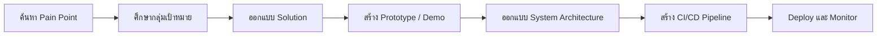
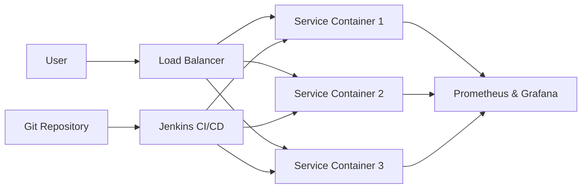

# 🐾 Mini Project: Pet Tech

> **นวัตกรรมเพื่อเพื่อนที่ดีที่สุดของเรา**  
> พัฒนาเทคโนโลยีที่ช่วยยกระดับคุณภาพชีวิตของสัตว์เลี้ยง และแก้ปัญหาของเจ้าของสัตว์เลี้ยงในยุคดิจิทัล

[← README หลัก](../readme.md) · [กำหนดการนำเสนอ](../readme.md#-กำหนดการนำเสนอผลงาน) · [Google Docs ต้นฉบับ](https://docs.google.com/document/d/1ti1VC6ihqt2Gi5W0zZ22pgiTE7Xh3iJke13JUeYGaIw/edit?usp=sharing)

---

## ข้อมูลสำคัญโดยสรุป

| หัวข้อ | รายละเอียด |
|---|---|
| **ธีม** | Pet Tech |
| **เป้าหมาย** | แก้ Pain Point ที่เกิดขึ้นจริงกับสัตว์เลี้ยง เจ้าของ หรือผู้ที่เกี่ยวข้อง |
| **รูปแบบโครงการ** | Software, Service Design หรือการผสมผสานเทคโนโลยีรูปแบบอื่น |
| **เทคโนโลยีหลัก** | Git, Docker, Jenkins, Load Balancer, Prometheus และ Grafana |
| **ผลงานที่คาดหวัง** | Prototype/Demo, System Design, CI/CD Pipeline และ Monitoring Dashboard |

> [!IMPORTANT]
> แนวคิดของโครงการควรเริ่มจาก **ปัญหาที่พิสูจน์ได้ว่ามีอยู่จริง** และอธิบายให้ชัดว่า Solution ช่วยแก้ปัญหานั้นได้อย่างไร

## สารบัญ

1. [ภาพรวมโครงการ](#1-ภาพรวมโครงการ)
2. [แนวทางเลือกหัวข้อ](#2-แนวทางเลือกหัวข้อ)
3. [เส้นทางการพัฒนาโครงการ](#3-เส้นทางการพัฒนาโครงการ)
4. [ข้อกำหนดทางเทคนิค](#4-ข้อกำหนดทางเทคนิค)
5. [โครงสร้างการนำเสนอ](#5-โครงสร้างการนำเสนอ)
6. [Checklist ก่อนนำเสนอ](#6-checklist-ก่อนนำเสนอ)

---

## 1. ภาพรวมโครงการ

ให้นักศึกษาแบ่งกลุ่ม ระดมสมอง และพัฒนา Mini Project ภายใต้ธีม **Pet Tech** โดยสามารถตีความโจทย์และเลือกหัวข้อที่สนใจได้อย่างอิสระ

โครงการที่ดีควรตอบคำถามต่อไปนี้ได้:

- ปัญหาที่ต้องการแก้คืออะไร และเกิดขึ้นกับใคร?
- มีข้อมูลหรือหลักฐานใดยืนยันว่าปัญหานี้เกิดขึ้นจริง?
- Solution ที่นำเสนอช่วยให้สถานการณ์ดีขึ้นอย่างไร?
- ระบบสามารถพัฒนา ทดสอบ Deploy และติดตามสถานะได้อย่างไร?

---

## 2. แนวทางเลือกหัวข้อ

หัวข้อต่อไปนี้เป็นแนวทางเบื้องต้น นักศึกษาสามารถเสนอแนวคิดอื่นได้ หากยังสอดคล้องกับธีม Pet Tech

| หมวด | แนวคิดตัวอย่าง |
|---|---|
| 🩺 **Health & Wellness** | ติดตามสุขภาพ จัดการอาหารและน้ำ ส่งเสริมกิจกรรม หรือดูแลสัตว์เลี้ยงป่วยและสูงวัย |
| 📍 **Safety & Tracking** | ป้องกันสัตว์เลี้ยงสูญหาย ติดตามตำแหน่ง หรือสร้างสภาพแวดล้อมที่ปลอดภัย |
| 🎾 **Communication & Entertainment** | สื่อสารและทำกิจกรรมกับสัตว์เลี้ยงจากระยะไกล หรือพัฒนาของเล่นอัจฉริยะ |
| 🐕 **Training & Behavior** | ฝึกทักษะ ปรับพฤติกรรม หรือช่วยให้เจ้าของเข้าใจภาษากายของสัตว์เลี้ยง |
| 📋 **Management & Convenience** | จองคิวคลินิก ค้นหาพี่เลี้ยง หรือจัดการข้อมูลสำคัญของสัตว์เลี้ยง |
| 💡 **Other Ideas** | แนวคิดอื่นที่ช่วยแก้ Pain Point ของสัตว์เลี้ยง เจ้าของ หรือผู้ให้บริการที่เกี่ยวข้อง |

---

## 3. เส้นทางการพัฒนาโครงการ



> [!TIP]
> ควรตรวจสอบแนวคิดกับกลุ่มเป้าหมายตั้งแต่ช่วงต้น เช่น สัมภาษณ์ ทดลองใช้ Prototype หรือเก็บ Feedback ก่อนพัฒนาระบบเต็มรูปแบบ

---

## 4. ข้อกำหนดทางเทคนิค

นักศึกษาต้องนำเสนอแผนการพัฒนาระบบที่ประยุกต์ใช้เครื่องมือและแนวคิดจากรายวิชาอย่างน้อย 4 ด้าน

### ภาพรวมสถาปัตยกรรมตัวอย่าง



> แผนภาพนี้เป็นเพียงตัวอย่าง นักศึกษาควรออกแบบสถาปัตยกรรมให้เหมาะกับปัญหาและขอบเขตของระบบตนเอง

### 4.1 Containerization — Docker

- ออกแบบระบบในรูปแบบ Microservices
- แยกความรับผิดชอบของแต่ละ Service ให้ชัดเจน
- บรรจุแต่ละ Service ใน Docker Container
- แสดงให้เห็นว่าสามารถพัฒนา ทดสอบ และ Deploy แต่ละ Service แยกกันได้

### 4.2 Automation — Jenkins CI/CD

Pipeline ควรแสดงกระบวนการอย่างน้อยดังนี้:

```text
Git → Unit Test → Build Docker Image → Deploy
```

สิ่งที่ต้องนำเสนอ:

- แผนภาพ CI/CD Pipeline
- ตัวอย่าง `Jenkinsfile` ที่ใช้กำหนด Pipeline

### 4.3 Scalability — Load Balancing

- ออกแบบระบบให้รองรับ Traffic ที่เพิ่มขึ้นอย่างรวดเร็ว
- ใช้ Load Balancer เช่น Nginx
- กระจาย Traffic ไปยัง Application Container หลายตัว

สิ่งที่ต้องนำเสนอ:

- แผนภาพสถาปัตยกรรมที่แสดง Load Balancer และ Application Container

### 4.4 Observability — Monitoring & Alerting

- ใช้ Prometheus และ Grafana หรือนำเสนอเครื่องมืออื่นที่เหมาะสม
- ติดตามข้อมูลสำคัญ เช่น CPU, Memory และจำนวน Request
- ตั้งค่า Alert เพื่อแจ้งเตือนเมื่อระบบเกิดปัญหา

สิ่งที่ต้องนำเสนอ:

- ตัวอย่าง Monitoring Dashboard
- ตัวอย่างการตั้งค่า Alerting

### สรุปสิ่งที่ต้องแสดง

| ด้าน | สิ่งที่ต้องนำเสนอ |
|---|---|
| **Docker** | การแบ่ง Service และการทำงานของ Container |
| **CI/CD** | Pipeline Diagram และตัวอย่าง `Jenkinsfile` |
| **Load Balancing** | Architecture Diagram ที่แสดงการกระจาย Traffic |
| **Monitoring** | Dashboard, Metrics สำคัญ และ Alerting |

---

## 5. โครงสร้างการนำเสนอ

รายละเอียดเวลาอยู่ใน [กำหนดการนำเสนอของ README หลัก](../readme.md#-กำหนดการนำเสนอผลงาน)

| ลำดับ | หัวข้อ | คำถามหลัก |
|---:|---|---|
| 1 | **Problem Statement** | ปัญหาคืออะไร และพิสูจน์ได้อย่างไรว่ามีอยู่จริง? |
| 2 | **Solution** | ระบบแก้ปัญหาได้อย่างไร และแตกต่างจากวิธีเดิมอย่างไร? |
| 3 | **Target Users / Market** | ผู้ใช้คือใคร มีจำนวนเท่าไร และเข้าถึงได้อย่างไร? |
| 4 | **Social Impact & Assessment** | จะเกิดผลลัพธ์อะไร และวัดผลอย่างไร? |
| 5 | **Team & Network** | เหตุใดทีมนี้จึงเหมาะกับการแก้ปัญหานี้? |
| 6 | **Sustainability** | โครงการจะดำเนินต่อในระยะยาวได้อย่างไร? |
| 7 | **Demo & System Design** | ระบบทำงานและ Deploy ด้วยเครื่องมือที่เรียนมาอย่างไร? |

### 5.1 Problem Statement

ทำให้ผู้ฟังเข้าใจว่าปัญหานี้สำคัญและเกิดขึ้นจริง

- ใช้สถิติ บทสัมภาษณ์ Insight หรือกรณีศึกษาเป็นหลักฐาน
- อธิบายผลกระทบหากปัญหาไม่ได้รับการแก้ไข
- เล่าเรื่องผ่านเหตุการณ์หรือ Persona เพื่อช่วยให้เห็นภาพ
- อธิบายปัญหาที่ซับซ้อนด้วยภาษาที่เข้าใจง่าย

### 5.2 Solution

แสดงว่า Solution สามารถทำได้จริง แตกต่าง และแก้ปัญหาได้

- อธิบายหลักการทำงาน
- แสดง Prototype หรือภาพตัวอย่าง
- ระบุประโยชน์ต่อผู้ใช้และผู้เกี่ยวข้อง
- เปรียบเทียบกับ Solution ที่มีอยู่
- นำเสนอ Feedback จากกลุ่มเป้าหมาย หากมี

### 5.3 Target Users / Target Market

แสดงให้เห็นว่าทีมเข้าใจผู้ใช้และตลาด

- ระบุกลุ่มเป้าหมายหลักและความต้องการ
- ใช้ Persona หรือ Segmentation
- ประมาณขนาดกลุ่มเป้าหมายหรือตลาด
- อธิบายช่องทางเข้าถึงผู้ใช้
- ระบุเครือข่ายหรือพันธมิตรที่อาจสนับสนุน

### 5.4 Social Impact & Assessment

- ระบุผลลัพธ์หรือการเปลี่ยนแปลงที่คาดหวัง
- กำหนดตัวชี้วัดความสำเร็จ
- ประมาณจำนวนผู้ที่จะได้รับประโยชน์
- อธิบายวิธีเก็บข้อมูลและประเมินผล

### 5.5 Team & Network

- แนะนำบทบาทและจุดเด่นของสมาชิก
- อธิบายประสบการณ์ที่เกี่ยวข้อง
- บอกเหตุผลที่ทีมเลือกแก้ปัญหานี้
- ระบุเครือข่ายหรือหน่วยงานที่เกี่ยวข้อง หากมี

### 5.6 Sustainability & Unfair Advantage

- อธิบายรูปแบบรายได้หรือแหล่งสนับสนุน
- ประมาณค่าใช้จ่ายสำคัญ
- ระบุข้อได้เปรียบที่เลียนแบบได้ยาก
- นำเสนอแผนพัฒนาและการสร้างรายได้ในอนาคต

### 5.7 Demo, DevTools & System Design

- Demo การทำงานของระบบ
- อธิบายเครื่องมือ เช่น Git, Docker และ Jenkins
- อธิบายการทำงานของ Frontend และ Backend
- แสดง System Architecture และขั้นตอนการ Deploy

---

## 6. Checklist ก่อนนำเสนอ

### เนื้อหาและผู้ใช้

- [ ] มีหลักฐานยืนยันว่า Pain Point เกิดขึ้นจริง
- [ ] ระบุกลุ่มเป้าหมายและความต้องการชัดเจน
- [ ] อธิบาย Solution และความแตกต่างจากทางเลือกอื่นได้
- [ ] มี Prototype, Demo หรือ Feedback จากผู้ใช้

### ระบบและ DevTools

- [ ] มีแผนภาพ System Architecture
- [ ] แสดงการแบ่ง Service และ Docker Container
- [ ] มีแผนภาพ CI/CD Pipeline และตัวอย่าง `Jenkinsfile`
- [ ] แสดงแนวทาง Load Balancing
- [ ] มี Monitoring Dashboard และตัวอย่าง Alert

### การนำเสนอ

- [ ] เนื้อหาครบทั้ง 7 ส่วน
- [ ] Demo และไฟล์สำรองพร้อมใช้งาน
- [ ] ทดสอบสไลด์ อุปกรณ์ และการเชื่อมต่อแล้ว
- [ ] ซ้อมให้อยู่ภายในเวลาที่กำหนด

---

## เอกสารที่เกี่ยวข้อง

- [README หลักและกำหนดการ](../readme.md)
- [Google Docs ต้นฉบับ](https://docs.google.com/document/d/1ti1VC6ihqt2Gi5W0zZ22pgiTE7Xh3iJke13JUeYGaIw/edit?usp=sharing) — ต้องลงชื่อเข้าใช้ด้วยอีเมล `@it.kmitl.ac.th`

[↑ กลับไปด้านบน](#-mini-project-pet-tech)
